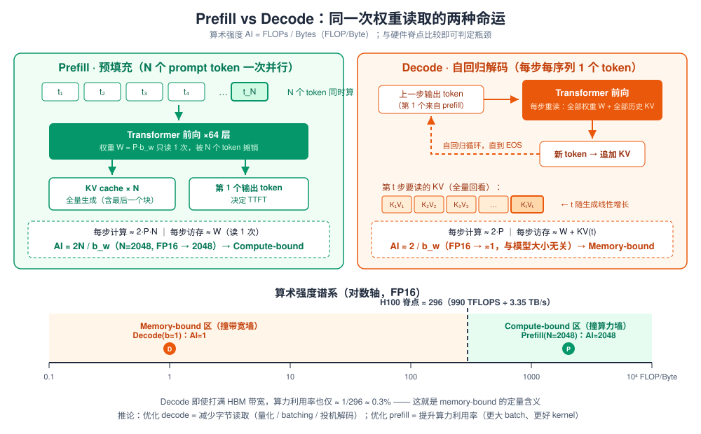
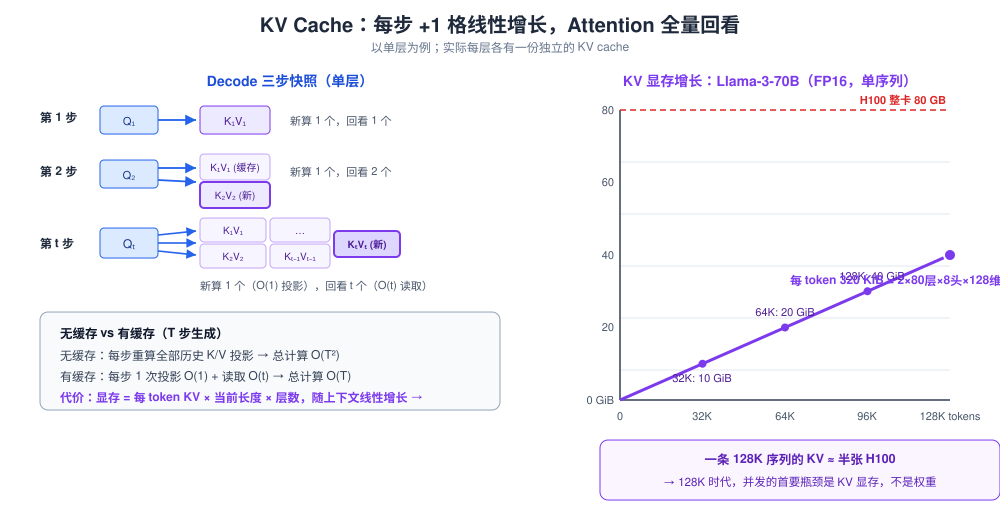
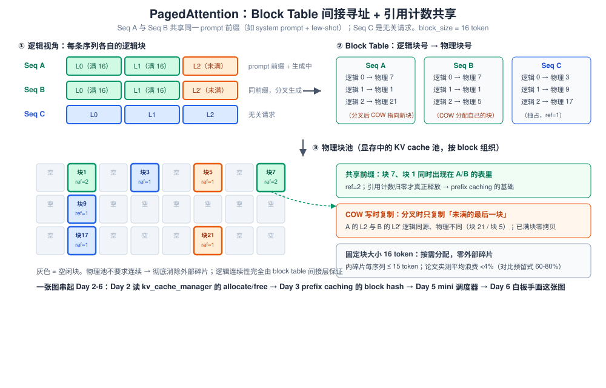

# Day 1 · 推理基础速通（建立共同语言）

> **总时长**：6-8 小时（上午 3.25h + 下午 2.5h + 晚上 1.75h）
> **今日目标**：3 分钟内当场手推「KV 显存 / decode 时延下界 / 并发上限」三类必考题；用自己的话讲清 prefill 与 decode 的本质差异
> **产出物**：一页纸《推理性能第一性原理》（含 3 道手算题完整推导）——Day 7 面试作战包的第 1 块拼图
> **冲刺周定位**：今天是 7 天冲刺的第一天，唯一任务是把**推理系统的共同语言**建立起来——后面 Day 2（V1 架构）、Day 3（核心机制四连）、Day 4（专题速通）全部建立在今天的三个公式和一组直觉上

---

## 作息建议

| 时间 | 内容 | 时长 |
|---|---|---|
| 09:00-10:30 | 模块一：Prefill vs Decode 的本质 | 1.5h |
| 10:45-12:30 | 模块二：KV Cache 生成与复用机制 | 1.75h |
| 14:00-16:30 | 模块三：必考手算（公式卡 + 3 道例题 + 2 道自测） | 2.5h |
| 19:30-21:00 | 模块四：PagedAttention 论文导读（§1/§3/§4） | 1.5h |
| 21:00-21:45 | 写一页纸产出 + 收工自测 | 0.75h |

---

## 今日学习目标

- [ ] 用**算术强度（Arithmetic Intensity）**定量解释：为什么 prefill 是 compute-bound、decode 是 memory-bound
- [ ] 讲清 KV cache 的生成时机（prefill 全量生成）、复用方式（decode 每步全量回看）与显存代价
- [ ] **默写并 3 分钟内默推**三个公式：
  1. KV cache 每 token 显存 = `2 × layers × kv_heads × head_dim × dtype_bytes`
  2. decode 单 token 时延下界 ≈ `模型权重字节数 / HBM 带宽`
  3. 并发上限 ≈ `可用 KV 显存 / (每 token KV × 平均上下文长度)`
- [ ] 读完 PagedAttention 论文 §1/§3/§4，能画出 block table + 引用计数图
- [ ] 完成一页纸《推理性能第一性原理》

---

## 核心概念速览

| 概念 | 一句话定义 | 面试考法 |
|---|---|---|
| **Prefill（预填充）** | 一次并行处理 prompt 的全部 N 个 token，产出第 1 个输出 token 和全量 prompt KV cache | 为什么它吃算力？TTFT 由谁决定？ |
| **Decode（解码）** | 自回归逐 token 生成，每步每序列只算 1 个新 token，但要读全部历史 KV | 为什么它吃带宽？TPOT 由谁决定？ |
| **算术强度 AI** | FLOPs / 访存 Bytes（FLOP/Byte），与硬件脊点比较判定瓶颈 | 「prefill 和 decode 的本质区别」 |
| **KV Cache** | 每层每 token 的 K、V 向量缓存，用显存换计算 | 每 token 显存公式 + GQA 陷阱 |
| **GQA / MQA / MLA** | 压缩 KV 头数/维度的架构手段 | 「GQA 为什么省显存」 |
| **PagedAttention** | OS 式分页管理 KV cache：固定 block + block table + 引用计数 | 三类显存浪费、碎片率怎么算 |
| **TTFT / TPOT** | 首 token 时延（≈排队+prefill）/ 每输出 token 时延（≈decode 单步） | 指标异常时怎么归因（Day 6 诊断树） |

---

## 模块一：Prefill vs Decode 的本质（上午，1.5h）

### 1.1 两阶段划分

一个请求的推理生命周期被切成两个性质完全相反的阶段：

- **Prefill**：把 prompt 的 N 个 token **一次性**送入模型并行计算。产出两样东西——第 1 个输出 token（决定 TTFT），以及**全部 N 个位置的 KV cache**。
- **Decode**：自回归循环。每步只处理每序列 **1 个**新 token，用它的 Q 去和**全部历史** K/V 做 attention，产出下一个 token（每步时延决定 TPOT）。

**指标与阶段的对应关系**（面试开场常用）：

```
TTFT ≈ 排队时间 + prefill 时间
TPOT ≈ decode 单步时间（含调度、前向、采样）
```

### 1.2 定量推导：算术强度决定瓶颈

这是今天最重要的推导，务必亲手推一遍。

**第一步：每 token 前向计算量 ≈ 2 × 参数量 P**。

以一层 Transformer（隐藏维度 d，FFN 中间维 4d）为例：attention 投影（Q/K/V/O）参数 4d²，FFN 参数 2×4d² = 8d²，合计 12d²；每个参数对应一次乘加（2 FLOPs），所以每 token 每层 ≈ 24d² FLOPs。全模型加总就是经验公式：

$$
\text{FLOPs}_{\text{token}} \approx 2P \quad (P\ \text{为参数量})
$$

**第二步：每步访存量 ≈ 权重字节数 W**。

prefill 和 decode 的每一步，都要把全部模型权重从 HBM 读一遍：`W = P × b_w`（b_w 是权重 dtype 字节数）。

**第三步：算术强度 = 计算量 / 访存量**。

| 阶段 | 每步计算量 | 每步权重访存 | 算术强度 AI | 判定 |
|---|---|---|---|---|
| Prefill（N 个 token） | ≈ 2PN | W = P·b_w（读 1 次，被 N 摊销） | ≈ **2N / b_w** | 高 → **compute-bound** |
| Decode（batch=1） | ≈ 2P | W = P·b_w（读 1 次） | ≈ **2 / b_w** | 极低 → **memory-bound** |

代入数字（FP16，b_w = 2）：

- **Decode 的 AI ≈ 1 FLOP/Byte，与模型大小无关**——这是个漂亮的结论，值得在面试时主动抛出
- **H100 的硬件脊点（ridge point）**= 990 TFLOPS / 3.35 TB/s ≈ **296 FLOP/Byte**
- Decode 的 AI 只有脊点的 **1/296**：即使把 HBM 带宽打满，算力利用率也只有 **~0.3%**——这就是「memory-bound」的定量含义
- Prefill N=2048 时 AI ≈ 2048，是脊点的 7 倍 → 撞**算力墙**，Tensor Core 喂饱，带宽大量闲置

> 📌 **补充（防追问）**：prefill 的 attention score 计算还有一项二次开销 ≈ 2·L·N²·d_head（L 为层数），N 很大时不可忽略，但不改变「prefill 吃算力」的结论。说出这一项 = 加分。



### 1.3 三条立即有用的推论（每条都通向本周后面某天）

1. **Decode 吞吐上不去的根因是带宽不是算力** → 优化旋钮全是「减少字节读取」：
   - 量化（W4A16 权重字节数 ÷4 → decode 时延近似 ÷4）——Day 4 专题，直接挂你的昇腾经验
   - Batching（B 条序列共享同一次权重读取 → 吞吐 ×B，TPOT 几乎不变）——Day 3 continuous batching
   - 投机解码（一次前向验证多个 draft token，摊销权重读取）——Day 4
2. **Prefill 与 decode 的最优硬件配置相反**（一个要算力、一个要带宽）→ 这是 **P/D 分离**的全部动机——Day 4
3. **Decode 阶段算力大量闲置**（利用率 <1%）→ 「用浪费的算力换访存」的投机解码才有利可图——Day 4

> ⚡ **昇腾翻译提示**：这就是你在 WeightQuantBatchMatmulV2 里天天用的「访存/计算 bound 分界模型」——decode（M=1~256 的小 M GEMM）就是典型 memory-bound 场景，所以你当时才需要 ASW 模板提升 L2 命中率、做 AL1/BL1 全载来压 DDR 带宽。面试直接挂钩：「LLM decode 的瓶颈分析和我做小 M 量化 GEMM 是同一套方法论」。

### ✅ 模块一检验（合上书能答）

- 为什么 batch size 增大时，decode 吞吐近似线性提升、单序列 TPOT 几乎不变？
  （答：权重读取被 batch 内 B 条序列摊销，每步时间 ≈ W/BW 不变，吞吐 ×B，直到撞算力墙——70B FP8/H100 上两墙约在 B≈150 相交，粗估值）
- 长 prompt 场景 TTFT 由什么决定？（prefill 的算力 + 排队；与带宽基本无关）

---

## 模块二：KV Cache 生成与复用机制（上午，1.75h）

### 2.1 为什么必须缓存：显存换计算

Decode 第 t 步时，attention 要求当前 token 的 Q 与**所有历史位置**的 K、V 做点积。如果没有 KV cache：

```python
# 无缓存：每步对全部历史重算 K/V 投影 —— 伪代码
for step t:
    for pos in range(t):          # 历史每个位置
        K[pos], V[pos] = matmul(x[pos], W_k), matmul(x[pos], W_v)  # 重复计算！
    out = attention(q_t, K[:t], V[:t])
# 整个生成过程投影计算量 O(T²)
```

有了 KV cache，每步只算 **1 个新 token** 的 K/V 投影并 append，attention 直接读缓存——投影计算量降为每步 O(1)，代价是显存随上下文线性增长：

```python
# 有缓存：O(1) 投影 + O(t) 读取
for step t:
    K[t], V[t] = matmul(x_t, W_k), matmul(x_t, W_v)   # 只算新 token
    cache.append(K[t], V[t])                            # 显存 +1 格
    out = attention(q_t, cache[:t+1])                   # 全量回看
```

**生成时机与复用方式**（对应本模块标题）：

- **生成**：prefill 阶段一次性生成全部 N 个 prompt 位置的 KV；decode 每步追加 1 个
- **复用**：decode 每步全量读取；同一请求的多轮对话可复用历史前缀（prefix caching 的基础，Day 3）



### 2.2 每 token KV cache 显存（必背公式）

$$
\text{KV}_{\text{token}} = \underbrace{2}_{K\ \text{与}\ V} \times \text{layers} \times \text{kv\_heads} \times \text{head\_dim} \times \text{dtype\_bytes}
$$

两个高频踩坑点：

- **GQA 陷阱**：必须用 `num_kv_heads`（KV 组的头数），**不是** attention 头数！MHA 两者相等，GQA 模型 kv_heads 远小于 q_heads——这正是 GQA 省显存的原理，公式里就体现在这一项
- **dtype 指的是 KV cache 的精度**，与权重精度无关——「70B FP8 权重 + FP16 KV」是常见部署组合，权重 FP8 不影响这个公式的 dtype 项

### 2.3 注意力变体对 KV cache 的影响（面试常追问）

| 变体 | KV 头数 | KV cache 相对大小 | 代表模型 |
|---|---|---|---|
| MHA | = q_heads | 1×（基准） | GPT-3、Llama-2-7B |
| GQA | q_heads / 4 ~ / 8 | 1/4 ~ 1/8 | Llama-3、Qwen3 |
| MQA | 1 | 1/q_heads | Falcon、PaLM |
| MLA | 低秩压缩潜向量 | 相对 MHA 低一个数量级（具体倍数随实现而异） | DeepSeek-V2/V3 |

> 一句话总结：**现代模型架构演进的一条主线就是压缩 KV cache**——长上下文时代，KV cache 已超过权重成为显存第一大户（模块三例题 3 会定量验证这句话）。

### 2.4 增长直觉：记住 70B 的三个数

以 Llama-3-70B 为例（80 层，GQA 8 个 KV 头，head_dim 128，FP16 KV）：

```
每 token   = 2 × 80 × 8 × 128 × 2 B = 327,680 B ≈ 320 KiB
8K 上下文  ≈ 2.5 GiB      ← 一条序列吃掉 1/32 张 H100
128K 上下文 ≈ 40 GiB      ← 一条序列吃掉半张 H100！
```

**直觉结论**：128K 时代，限制并发数的首要因素是 **KV cache 显存**，不是权重。这就是为什么 vLLM 把整个调度系统都建在「KV 显存管理」上（Day 2 精读 `kv_cache_manager.py`）。

> ⚡ **昇腾翻译提示**：KV cache 增长管理 ≈ 你在达芬奇架构上做 tiling 时对片上存储（UB）的精细化复用——同样是「存储不够 → 分块 + 按需搬入」。区别是 GPU/NPU 的 HBM 池要靠软件层调度器管理，而不是编译期固定。这个类比 Day 5 写 mini 调度器时会再用到。

### ✅ 模块二检验

- 为什么 vLLM 要用固定 block（页）管理 KV，而不是按最大长度连续分配？（先凭直觉答：请求长度不一、动态增长、前缀可共享——晚上论文导读验证你的答案）
- 「权重 FP8 了，KV cache 也自动 FP8 了吗？」（不。两个独立旋钮，vLLM 里 `--kv-cache-dtype` 单独控制）

---

## 模块三：必考手算（下午，2.5h）

练到 **3 分钟内能默推**——手算是白板第一题，翻车代价最高。

### 公式卡（背到默写）

```
① KV cache 每 token 显存 = 2 × layers × kv_heads × head_dim × dtype_bytes

② decode 单 token 时延下界 ≈ 权重字节数 / HBM 带宽
   （memory-bound 下计算时间可忽略；batch=1 时成立；
    batch=B 时同一份权重读取服务 B 条序列，时延基本不变）

③ 可用 KV 显存 = (卡显存 × gpu_memory_utilization − 权重 − 激活/工作区开销) × 卡数
   最大并发序列数 ≈ 可用 KV 显存 / (每 token KV × 平均上下文长度)
```

### 常用硬件参数（至少记 H100 一行）

| 硬件 | 显存 | HBM 带宽 | FP16 稠密算力 | 脊点 AI |
|---|---|---|---|---|
| H100 SXM | 80 GB | 3.35 TB/s | ~990 TFLOPS | ~296 FLOP/B |
| A100 80G | 80 GB | 2.0 TB/s | ~312 TFLOPS | ~156 FLOP/B |
| H20 | 96 GB | 4.0 TB/s | ~148 TFLOPS | ~37 FLOP/B |

> 记住这组对比的戏剧性：**H20 带宽比 H100 还高、算力只有 ~1/7** → H20 跑 decode 尚可、跑 prefill 很弱 → 又一条 P/D 分离论据（Day 4 展开）。

### 例题 1：每 token KV cache（基础题，必须秒答）

**题目**：Qwen3-32B，64 层，GQA 8 个 KV 头，head_dim 128，FP16 KV。每 token KV cache 多大？一条 32K 序列占多少？

**推导**（面试时口述这个流程：先报公式 → 再代数）：

```
每 token = 2 × 64 × 8 × 128 × 2 B
         = 262,144 B = 256 KiB
32K 序列 = 256 KiB × 32,768 = 8 GiB
```

**加分点**：
- 主动补一句「开 FP8 KV 直接减半到 4 GiB，代价是少量精度损失」——展示你知道优化的旋钮在哪
- 被问「哪个参数最容易记错」→ kv_heads 用 GQA 分组后的 KV 头数，不是 Q 头数（Qwen3-32B：64 个 Q 头 vs 8 个 KV 头，差 8 倍）

### 例题 2：decode 时延下界（理解题）

**题目**：70B 模型 FP8 权重，单卡 H100（3.35 TB/s），batch=1。decode 单 token 理论时延下界？单序列吞吐上限？为什么实测更慢？

**推导**：

```
权重字节数 = 70 × 10⁹ × 1 B = 70 GB
时延下界   = 70 GB / 3.35 TB/s ≈ 20.9 ms
单序列上限 ≈ 1000 ms / 20.9 ms ≈ 48 tokens/s
```

**为什么实测更慢**（按影响排序）：
1. 每步除权重外还要读 **KV cache**：8K 上下文 ≈ 2.5 GB，多 ~0.75 ms；128K 时 KV 读取已接近权重量级
2. kernel launch 开销 + 小 kernel 打不满带宽——这正是 decode 要用 CUDA Graph 的原因（Day 3 机制四）
3. 激活、norm、embedding、采样等零碎访存

**延伸（主动算出这个 = 专家信号）**：batch 增大到多少撞算力墙？
算力墙吞吐 = 990 TFLOPS ÷ (2×70 GFLOPs/token) ≈ 7000 tok/s；带宽墙吞吐 = B × 48 tok/s；两墙相交于 **B ≈ 150**（粗估，未计 KV 与激活）。

**加分点**（被追问「怎么提高」的完整答案链）：量化（字节数↓ → 时延近似同比例↓）→ batching（摊销权重读取）→ 投机解码（一次前向出多 token）→ TP（多卡带宽聚合，但引入通信开销）。这四个旋钮正好覆盖本周 Day 3 / Day 4 的全部专题，回答时可以主动铺开。

### 例题 3：并发上限估算（综合题，白板高频）

**题目**：70B FP8 权重模型，8×H100（80GB）TP=8，`gpu_memory_utilization=0.9`，平均上下文 128K，FP16 KV（320 KiB/token，模块二算过）。最多同时服务多少条序列？

**推导**（分步报数字，别跳步）：

```
① 每卡预算      = 80 GB × 0.9 = 72 GB
② 每卡权重分摊  = 70 GB / 8 = 8.75 GB        （TP=8 切分权重）
③ 每卡开销预留  ≈ 5 GB                        （激活 + CUDA Graph 工作区 + 通信 buffer）
④ 每卡 KV 可用  = 72 − 8.75 − 5 ≈ 58 GB
   全集群 KV 池  = 58 × 8 ≈ 464 GB

总 token 容量  = 464 GB / 320 KiB ≈ 152 万 tokens
并发序列数     = 152 万 / 131,072 ≈ 11~12 条
```

**结论与讨论（比算对更重要）**：
- 128K 满上下文下，8 卡只撑 **~12 条并发**——长上下文的显存经济性极差
- 优化旋钮逐个说：FP8 KV（×2 → ~24 条）→ **按实际长度分配而非按最大长度预留**（这正是 PagedAttention 的意义，晚上读论文验证）→ P/D 分离让 decode 实例独占 KV 池（Day 4）→ 冷 KV offload 到 CPU/SSD
- 主动点题：「这就是『PagedAttention 把显存浪费从 60-80% 降到 <4%』为什么是个大事」

### 自测题 2 道（计时 3 分钟，做完再对答案）

**自测 1**：Llama-3-8B（32 层，8 KV 头，head_dim 128），FP16 权重 + KV，单卡 RTX 4090（24GB，~1 TB/s）。① 每 token KV？② batch=1 decode 时延下界？③ 权重 16GB、留 2GB 开销、平均上下文 4K，最大并发？

**自测 2**：面试官问：「同一个模型，为什么 prefill 阶段增大 batch 对单请求时延几乎没影响；decode 阶段增大 batch 吞吐近似线性提升、单序列 TPOT 还几乎不变？」用算术强度和公式②作答。

<details>
<summary>自测 1 参考答案（点开前先自己算）</summary>

```
① 2 × 32 × 8 × 128 × 2 B = 131,072 B = 128 KiB/token
② 16 GB / 1 TB/s = 16 ms（单序列 ≈ 62 tokens/s 上限）
③ KV 可用 = 24 × 0.9 − 16 − 2 = 3.6 GB
   每条 4K 序列 = 128 KiB × 4096 = 512 MiB
   并发 ≈ 3.6 GB / 512 MiB ≈ 7 条
```
</details>

<details>
<summary>自测 2 参考答案要点</summary>

- **prefill 已是 compute-bound**：算力本来就打满，batch 增大只是让更多 token 排队共享算力，单请求时延不变（吞吐提升撞算力墙为止）
- **decode 是 memory-bound 且权重读取与 batch 无关**：B 条序列共享同一次 W 读取 → 每步时间 ≈ (W + KV·B) / 带宽，B 较小时 W 主导 → TPOT 几乎不变、吞吐 ×B；B 大到 KV 读取与计算量追上权重（撞算力墙）后，TPOT 才开始上升
</details>

---

## 模块四：PagedAttention 论文导读（晚上，1.5h）

**论文**：《Efficient Memory Management for Large Language Model Serving with PagedAttention》（SOSP 2023，vLLM 的奠基论文）。
**只读 §1、§3、§4**——动机 + block 设计 + 调度。评估和相关工作跳过。

### 带着问题读（读完每条都要能答）

**§1 Introduction（20 min）——问题定义**
- [ ] 显存浪费 60-80% 来自哪三部分？（① 按最大长度预留的冗余 ② 长度不可知导致的过度预留 ③ 外部碎片——连续分配放不下新请求）
- [ ] 为什么借鉴 OS 虚拟内存的分页？（KV 长度动态增长且不可预知 ≈ 进程地址空间；分页 = 按需分配，消除预留）

**§3 PagedAttention 设计（40 min）——三个机制**
- [ ] **分页映射**：KV cache 切成固定大小 **block**（vLLM 默认 16 token/block），逻辑块经 **block table** 间接映射到物理块——类比你在昇腾做的 tile 寻址，只是多一层间接
- [ ] **共享与引用计数**：同一 prompt 前缀 / parallel sampling 的多个分支共享物理 block，每块带引用计数，归零才真正释放
- [ ] **写时复制（COW）**：分叉时只复制「未满的最后一块」，已满块直接共享

**§4 调度与实现（30 min）——两个调度机制**
- [ ] **Iteration-level scheduling**（continuous batching 雏形）：每个 decode step 重新决定 batch 组成，完成的立即退出、新请求立即插入——Day 3 机制一的前置
- [ ] **Preemption**：显存不足时逐出请求，恢复方式 **recompute vs swap** 的取舍（vLLM V1 只保留 recompute 路线，swap 已移除——Day 2 读源码时会看到）



### 读完必须能画的图

合上论文手绘：两条序列共享 prompt 前缀、各自分叉后的 block table 状态，标注每个物理 block 的引用计数——这张图是 Day 6 白板四件套之二的雏形，今天必须画出第一版。

**碎片率怎么算**（Day 6 高频题第 1 题提前埋点）：

```
内部碎片：每序列最多浪费 block_size − 1 个 token（最后一个未满块）
平均浪费 ≈ block_size / 2 个 token / 序列；序列越长占比越低
论文实测真实负载平均浪费 <4%（对比预留式连续分配的 60-80%）
```

> ⚡ **昇腾翻译提示**：block table 间接寻址 ≈ 你做 Nd2Nz / 数据格式转换时的索引重排；「按需分配、消除预留」≈ 内存池化思想。面试讲这段时带上你在内存与数据布局上的工程直觉，比纯背论文强得多。

---

## 模块五：这些概念住在 vLLM V1 的哪里（20 min，只建地图不精读）

今天**不读源码**，只建立「概念 ↔ 代码位置」的映射，明天（Day 2）精读其中前两行。

> ⚠️ 以下路径基于 2025 年 vLLM V1 主线；不同版本可能微调，以你拉取的代码为准。V1 是当前唯一主线，V0 架构已废弃——本系列只讲 V1。

| 今日概念 | V1 代码位置（模块 / 类） | 精读时间 |
|---|---|---|
| KV 显存预算与 block 数 | `vllm/config/cache.py` 的 `CacheConfig`（`block_size` 常用 16、`gpu_memory_utilization` 默认 0.9、`kv_cache_dtype`）+ 启动时 profile：`vllm/v1/engine/core.py` `EngineCore` → Worker `determine_num_available_blocks()`——**剩余显存几乎全部划给 KV 池** | Day 2 |
| block 分配 / 释放 / 前缀共享 | `vllm/v1/core/kv_cache_manager.py` `KVCacheManager` + `vllm/v1/core/block_pool.py` `BlockPool`（引用计数）；prefix caching 的 block hash 在 `vllm/v1/core/kv_cache_utils.py` | Day 2 |
| 两阶段混排调度 | `vllm/v1/core/scheduler.py` `Scheduler.schedule()`：waiting/running 队列、token budget、chunked prefill、preemption（V1 只保留 recompute，无 swap） | Day 2 |
| 每 step 前向执行 | `vllm/v1/worker/gpu_model_runner.py` `GPUModelRunner.execute_model()`（prefill/decode 统一成一批 token 一次前向） | Day 3（CUDA Graph） |

**请求级调用链预告**（Day 2 的精读地图，今天混个眼熟）：

```
AsyncLLM.generate()                     # API 进程入口
  → Processor：tokenize + 构造请求      # 预处理进程
  → EngineCore（ZMQ 跨进程）            # 引擎核心进程
      → Scheduler.schedule()            # 每 step：选请求、定 token budget、管 KV 预算
      → ModelRunner.execute_model()     # 一次前向（本 step 的 prefill/decode 混合 batch）
      → KVCacheManager: allocate / append / free   # KV 按需增长
  → 采样结果回传 → detokenize → 流式返回
```

注意一个 V1 关键设计：**上表没有任何一处按「最大上下文长度」预分配显存**——V1 启动时把可用显存整体划成固定大小的 block 池，请求进来按需逐块分配。这正是模块四论文思想在工程上的落点。

---

## 动手实验步骤

### 实验 1：3 分钟默推计时（15 min，今天最重要的 15 分钟）

1. 白纸写「公式卡」三行，合上教程
2. 计时 3 分钟，默推例题 3 全过程（并发上限，最综合）
3. 对答案：数字差 ±10% 以内算过（面试官也在估数量级）
4. 再来一轮：换成 Llama-3-8B / 单卡 4090 / 4K 上下文（即自测 1）
5. 晚上睡前最后一轮（睡前练 = 记忆巩固）

### 实验 2：10 行 Python 验证手算 + 参数扫描（20 min，无需 GPU）

```python
GiB = 2**30

def kv_per_token(layers, kv_heads, head_dim, dtype_bytes):
    return 2 * layers * kv_heads * head_dim * dtype_bytes

def decode_bound(weight_bytes, hbm_bw):
    return weight_bytes / hbm_bw, hbm_bw / weight_bytes   # (秒, tokens/s)

def max_concurrency(gpu_gb, n_gpu, util, weights_gb, overhead_per_gpu_gb,
                    kv_tok, ctx_tokens):
    pool = (gpu_gb * util - weights_gb / n_gpu - overhead_per_gpu_gb) * n_gpu
    return pool * GiB / (kv_tok * ctx_tokens)

# 例题 1：Qwen3-32B FP16 KV
kv = kv_per_token(64, 8, 128, 2)
print(f"{kv/1024:.0f} KiB/token; 32K 序列 {kv*32768/GiB:.1f} GiB")

# 例题 2：70B FP8 @ H100
lat, tps = decode_bound(70e9, 3.35e12)
print(f"decode 下界 {lat*1e3:.1f} ms, 上限 {tps:.0f} tok/s")

# 例题 3：70B FP8 TP=8 @ 8×H100, 128K
kv70 = kv_per_token(80, 8, 128, 2)
print(f"并发 ≈ {max_concurrency(80, 8, 0.9, 70, 5, kv70, 128*1024):.1f}")

# 参数扫描：平均上下文 vs 并发（感受长上下文的显存经济性）
for ctx_k in (4, 8, 16, 32, 64, 128):
    n = max_concurrency(80, 8, 0.9, 70, 5, kv70, ctx_k * 1024)
    print(f"avg ctx {ctx_k:>4}K → 并发 {n:6.0f}")
```

跑一遍扫描，你会得到一条断崖式下降的曲线——**这条曲线就是「P/D 分离、KV offload、MLA」这些技术存在的理由**，今天看一眼，Day 4 再回来对号入座。

### 实验 3：PagedAttention 论文阅读（90 min）

按模块四的问题清单读 §1/§3/§4，读完合上论文手画 block table + 引用计数图，与 `assets/day01_pagedattention_blocks.svg` 对照。

---

## 面试高频问题（今天能答的 8 题）

| # | 问题 | 答题要点 |
|---|---|---|
| 1 | prefill 和 decode 的本质区别？ | 算术强度：AI ≈ 2N/b_w vs 2/b_w；prefill 摊销权重读取撞算力墙，decode 每步全量读权重撞带宽墙；给出 H100 脊点 296、decode AI≈1 更佳 |
| 2 | 为什么 decode 增大 batch 吞吐线性提升、TPOT 几乎不变？ | 权重读取与 batch 无关，B 条序列共享一次读取；直到 KV 读取/算力追上（70B/H100 约 B≈150）TPOT 才上升 |
| 3 | GQA 为什么省 KV 显存？ | 每 token KV 公式里 kv_heads 一项：8 头 vs 64 头差 8 倍；Q 头分组共享 KV 头，只影响 K/V 投影输出数 |
| 4 | 128K 时代并发的首要瓶颈？ | KV 显存：70B FP16 KV 每 token 320 KiB，一条 128K = 40 GiB；8×H100 只撑 ~12 条并发（现场手推） |
| 5 | PagedAttention 解决什么问题？三类浪费？碎片率怎么算？ | 预留式连续分配浪费 60-80%（最大长度冗余 + 过度预留 + 外部碎片）；固定块 + block table + 引用计数；内碎片 ≤ block_size−1 token/序列，平均 <4% |
| 6 | decode 时延下界怎么估？实测为什么更高？ | W/BW；再加 KV 读取、kernel launch（→ CUDA Graph）、激活/采样零碎访存 |
| 7 | 怎么提升 decode 吞吐？各有什么失效条件？ | 量化（精度损失）、batching（撞算力墙/KV 读）、投机解码（低接受率负收益）、TP（通信开销，单卡放得下就别上）——四旋钮 = Day 3/4 全部专题 |
| 8 | 不用 KV cache 会怎样？ | 每步重算全部历史投影，总计算 O(T²)；cache 用显存换计算，引出「KV 显存是第一大头」的调度问题 |

---

## 今日总结

- **一个判定**：算术强度 vs 硬件脊点 —— prefill（AI≈2N/b_w）compute-bound，decode（AI≈2/b_w≈1）memory-bound，decode 打满带宽时算力利用率仅 ~0.3%
- **三个公式**：KV/token、decode 时延下界 W/BW、并发上限 = KV 池 ÷ (每 token KV × 平均上下文)——3 分钟默推达标
- **一组数字直觉**：H100 3.35 TB/s｜70B 每 token KV 320 KiB｜128K 单序列 40 GiB｜8×H100 撑 ~12 条 128K 并发
- **一个工程落点**：PagedAttention = OS 分页思想（固定 block + block table + 引用计数 + COW），显存浪费 60-80% → <4%；V1 把剩余显存全部划成 block 池按需分配

**优化地图**（今天建索引，本周逐个展开）：

| 症状 | 旋钮 | 展开日 |
|---|---|---|
| decode 慢 / 吞吐低 | 量化、batching、投机解码、TP | Day 3 / Day 4 |
| 显存爆 / 并发低 | GQA、FP8-KV、PagedAttention、offload | Day 2 / Day 3 |
| TTFT 高 | chunked prefill、prefix caching、P/D 分离 | Day 3 / Day 4 |

---

## 今日自测题（答不上回对应模块）

1. H100 的脊点怎么算？数值？decode 的 AI 与它的比值说明什么？（→ 模块一）
2. MQA / GQA / MLA 各自怎么压 KV cache？代价是什么？（→ 模块二）
3. 「权重已经 FP8 了，KV cache 是不是也 FP8 了？」（→ 模块二：两个独立旋钮，vLLM 用 `--kv-cache-dtype` 单独控制）
4. COW 的触发时机是什么？为什么只复制最后一块？（→ 模块四：分叉写到未满块时；已满块只读可零拷贝共享）
5. 70B FP8、单卡 H100、batch=1 的理论 tokens/s？（→ 模块三：≈48，练到秒答）

---

## 今日产出物：一页纸《推理性能第一性原理》

按此模板写满一页 A4（手写最佳，白板题就用它预演），这是 Day 7 面试作战包的第 1 件：

```
1.【两阶段一图】prefill/decode 计算-访存对比 + 算术强度结论（抄模块一表格）
2.【三个公式】KV/token · decode 时延下界 W/BW · 并发上限估算
3.【三个数字直觉】H100 3.35TB/s · 70B KV 320KiB/token · 128K 单序列 40GiB
4.【优化地图】decode 慢→量化/batch/投机/TP；显存爆→GQA/FP8-KV/Paged/offload；
   TTFT 高→chunked prefill/prefix cache/P-D 分离
5.【3 道手算题】例题 1-3 浓缩推导（数字+单位写全）
```

### Day 1 收工自检清单（全绿才算完成）

- [ ] 3 分钟内默推：任意模型/精度/上下文 → KV/token、decode 下界、并发上限
- [ ] 能用算术强度一句话讲清 prefill 与 decode 的 bound 差异，并报出 H100 脊点
- [ ] 能讲清 GQA 为什么省显存、公式哪项体现；权重 dtype 与 KV dtype 是两个旋钮
- [ ] 能说出 PagedAttention 三类显存浪费、60-80%→<4%、碎片率算法
- [ ] 画出了带引用计数的 block table 图（对照 SVG 3 检查）
- [ ] 一页纸写完，放在明天抬眼可见的地方

**未完成项不许带入 Day 2**——宁可压缩明天上午的架构泛读，也要把公式练熟。手算是白板第一题，翻车代价最高；明天 Day 2 将带着今天的三个公式去读 `scheduler.py` 和 `kv_cache_manager.py`，验证「V1 的每一步调度决策，本质都在做今天这三道算术题」。
