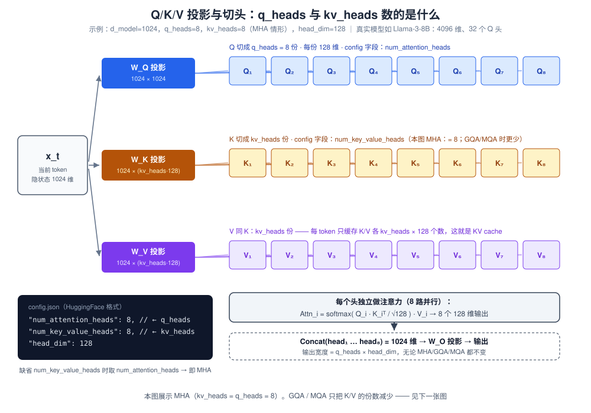
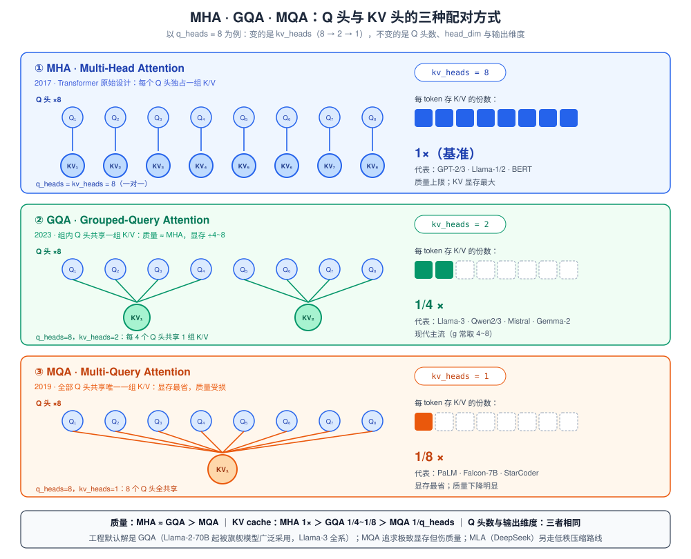
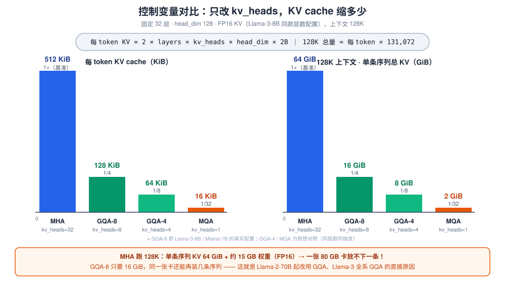
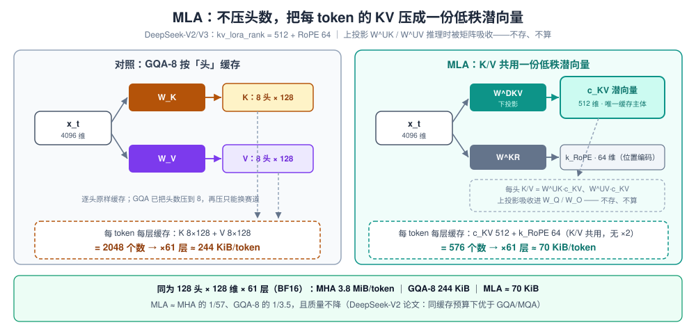

# Day 1a · 补充篇：q_heads / kv_heads 与 MHA · GQA · MQA 全解

> **定位**：Day 1 模块二 §2.3「注意力变体对 KV cache 的影响」的展开篇——那一节只有一张表，面试真考起来远远不够
> **阅读时长**：45-60 分钟
> **学完标准**：不看资料画出三种变体的结构图；说清 Llama-3 为什么全系 GQA；说清 `kv_heads` 对 TP、并发、TPOT 的硬约束；一句话讲清 MLA 与 GQA 的本质区别（压头数 vs 压维度）
> **回扣主线**：Day 1 公式卡 ① `KV_token = 2 × layers × kv_heads × head_dim × dtype_bytes` 里的 `kv_heads` 项，就是本文全部内容的落点

---

## 0. 四句话版本（赶时间只看这个）

1. **q_heads / kv_heads 是两个独立配置**：Q 投影切几份、K/V 投影切几份，各数各的——MHA 只是「碰巧相等」的历史默认
2. **KV cache 显存只由 kv_heads 决定**（q_heads 根本不进公式）：7B 级模型把 KV 头从 32 压到 8，128K 上下文的 KV 显存就从 64 GiB 降到 16 GiB
3. **GQA 是质量与显存的甜点位**：组内共享 KV，质量 ≈ MHA、显存 ÷4~8——所以 Llama-3 / Qwen / Mistral 全系采用；MQA 一步压到 1 个头太狠，质量受损，已基本被 GQA 取代
4. **MLA 换赛道**：不压头数、压维度——每 token 的 K/V 压成一份 512 维潜向量（+64 维 RoPE）再配矩阵吸收，671B 的 DeepSeek-V3 每 token KV 比 32B 的 Qwen3-32B 还小（§六）

---

## 核心概念速览

| 概念 | 一句话定义 | 面试考法 |
|---|---|---|
| **q_heads** | Q 投影切成的份数（`num_attention_heads`），决定「查询视角」数量与输出宽度 | 「它进不进 KV cache 公式？」（不进） |
| **kv_heads** | K/V 投影切成的份数（`num_key_value_heads`），决定每 token 缓存多少 K/V | KV 显存手算 + TP 上限推导 |
| **MHA** | kv_heads = q_heads，每个 Q 头独占一组 K/V | 质量基准；128K 显存爆炸 |
| **GQA** | 组内共享（g = q_heads/kv_heads = 4~8） | 为什么不掉点；为什么全系采用 |
| **MQA** | kv_heads = 1，全部 Q 头共享唯一一组 K/V | 为什么掉点；显存 1/q_heads |
| **MLA** | K/V 共用一份低秩潜向量（512+64 维），上投影被矩阵吸收（DeepSeek-V2/V3） | 「和 GQA 的本质区别？」；DP attention 的动机 |

---

## 一、先搞清楚：一个「头」到底是什么

### 1.1 注意力的三个投影

一次注意力涉及三个**独立的**线性投影（记住「独立」二字，它是后面一切变体的源头）：

$$
\text{Attention}(Q, K, V) = \text{softmax}\!\left(\frac{QK^\top}{\sqrt{d}}\right)V
$$

直觉版理解：**Q 是「我要找什么」，K 是「每个位置的标签」，V 是「每个位置的实际内容」**。当前 token 拿着自己的 Q 去和所有位置的 K 打分，softmax 归一化后按分数加权取 V——这就是「回看上下文」的全部计算。

### 1.2 切头：一份大投影 → 多份小注意力

把隐藏状态 x（d_model 维）分别过三个投影矩阵，再把输出**按 head_dim 切段**，每段自成一个「头」：

```
x_t ∈ ℝ^1024
  ├─ ×W_Q → q ∈ ℝ^1024        → reshape → 8 × 128    （q_heads 个 Q 头）
  ├─ ×W_K → k ∈ ℝ^(kv·128)    → reshape → kv × 128   （kv_heads 个 K 头）
  └─ ×W_V → v ∈ ℝ^(kv·128)    → reshape → kv × 128   （kv_heads 个 V 头）
```

四个必须记住的 shape 事实：

| 矩阵/张量 | 形状 | 说明 |
|---|---|---|
| W_Q | d_model × (q_heads·head_dim) | Q 投影，输出最宽 |
| W_K / W_V | d_model × (**kv_heads**·head_dim) | **GQA/MQA 时这两个矩阵也变小**（参数量同步省） |
| W_O | (q_heads·head_dim) × d_model | **永远不变**——输出宽度 = q_heads × head_dim |
| 每个头内部 | Q_i (128) · K_j (128) 点积 | Q 与 K 的 head_dim 必须相同才能点积 |

**为什么要多头**：单头 = 单一视角的加权平均；多头 = 多个并行子空间各自检索（有的盯句法、有的盯共指、有的盯位置邻近），最后 Concat 融合。经验上：**q_heads 决定表达力（视角数量），kv_heads 只是「被检索内容的组织方式」**——这句直觉就是 §四 GQA 不掉点的伏笔。



### 1.3 两个参数在 config.json 里叫什么

```json
{
  "num_attention_heads": 32,     // ← q_heads
  "num_key_value_heads": 8,      // ← kv_heads（缺省时 = num_attention_heads，即 MHA）
  "head_dim": 128,
  "num_hidden_layers": 32,
  "hidden_size": 4096
}
```

这是 Llama-3-8B 的真实配置：**32 个 Q 头，8 个 KV 头**——q_heads 是 kv_heads 的 4 倍，这就是 GQA。读任何模型先看这两个字段，KV cache 手算的坑（Day 1 已预警）全部来自把两者搞混。

---

## 二、MHA：一对一的基准（2017，Transformer 原始设计）

**结构**：kv_heads = q_heads，第 i 个 Q 头配第 i 个 K/V 头，一一对应。

**作用**：质量上限。所有后续变体（MQA/GQA/MLA）的论文都拿 MHA 当质量对照基准。

**代价**：KV cache 显存最大——每 token 要存全部 H 组 K/V：

```
KV_token = 2 × L × q_heads × head_dim × b     （MHA 时 kv_heads = q_heads）
```

以 Llama-2-7B 为例（32 层，32 头，head_dim 128，FP16 KV）：每 token **512 KiB**，一条 128K 序列 = **64 GiB**——比它自己 15 GB 的权重（FP16）大 4 倍多。长上下文时代这是不可接受的。

**代表模型**：GPT-2/3、Llama-1、Llama-2（7B/13B）、BERT。

---

## 三、MQA：一步压到 1（2019）

**出处**：Shazeer《Fast Transformer Decoding: One Write-Head is All You Need》——注意标题里的 *Decoding*：这篇论文比 vLLM 早四年就指出了 decode 阶段 KV 读取是带宽瓶颈，优化动机和本文主线完全一致。

**结构**：kv_heads = 1。所有 Q 头读**同一组** K/V。

**收益**：KV cache 缩到 **1/q_heads**（7B 例：512 KiB → 16 KiB/token，128K 序列从 64 GiB → 2 GiB）；同时 W_K/W_V 参数缩到 1/q_heads，decode 每步的 KV 读取量同步缩。

**代价**：质量下降明显。32 个「视角」共享一份上下文表征，信息瓶颈太窄——长上下文、翻译等任务的掉点在论文里被反复验证。uptraining（继续训练）只能部分挽救。

**代表模型**：PaLM、Falcon-7B、StarCoder。

---

## 四、GQA：分组共享的甜点位（2023，现行标准）

**出处**：Ainslie et al.《GQA: Training Generalized Multi-Query Transformer Models from Multi-Head Checkpoints》。

**结构**：把 q_heads 个 Q 头分成 kv_heads 组，**组内共享**一组 K/V。记组大小 g = q_heads / kv_heads（每个 KV 头服务 g 个 Q 头）：

- Llama-3-8B：32 Q / 8 KV → g=4，KV 显存 1/4
- Llama-3-70B：64 Q / 8 KV → g=8，KV 显存 1/8
- Llama-3.1-405B：128 Q / 8 KV → g=16，KV 显存 1/16

**为什么不掉点**（面试高频，给出三层答案）：

1. **表达力主要来自 Q 视角数**：q_heads 不变，输出宽度不变，「有多少种查询方式」没少
2. **KV 头之间本就高度冗余**：组内共享去掉的是冗余，不是信息——MQA 一步压到 1 才算过度
3. **uptraining 兜底**：从 MHA checkpoint 转换时把组内 KV 头 mean-pool 合并，再用约 5% 的原预训练算力继续训练，K/V 学会同时服务组内多个 Q

论文结论：**GQA(g=4~8) 质量与 MHA 基本持平，解码速度接近 MQA**。Llama-2-70B 首次大规模采用（64Q/8KV），Llama-3 起全系、Qwen2/3、Mistral、Gemma-2 全部跟进——**GQA 是当前事实标准**。



---

## 五、定量对比：KV 头数就是显存杠杆

先复述 Day 1 公式并给出本文最重要的观察：

$$
\text{KV}_{\text{token}} = 2 \times \text{layers} \times \underbrace{\text{kv\_heads}}_{\text{杠杆全在这}} \times \text{head\_dim} \times \text{dtype\_bytes}
$$

**q_heads 完全不出现在公式里**——这是 MHA→GQA 显存骤降的全部原因，也是手算题的题眼。

### 5.1 控制变量对比（32 层 · head_dim 128 · FP16 · 128K 上下文）

| 变体 | kv_heads | g | 每 token KV | 128K 单条序列 | 相对 MHA |
|---|---|---|---|---|---|
| MHA | 32 | 1 | 512 KiB | 64 GiB | 1× |
| **GQA-8** | **8** | **4** | **128 KiB** | **16 GiB** | **1/4** |
| GQA-4 | 4 | 8 | 64 KiB | 8 GiB | 1/8 |
| MQA | 1 | 32 | 16 KiB | 2 GiB | 1/32 |



### 5.2 真实模型速查表

| 模型 | 层数 | q_heads | kv_heads | g | 每 token KV（FP16） |
|---|---|---|---|---|---|
| Llama-2-7B（MHA） | 32 | 32 | 32 | 1 | 512 KiB |
| Llama-2-70B（GQA） | 80 | 64 | 8 | 8 | 320 KiB |
| Llama-3-8B（GQA） | 32 | 32 | 8 | 4 | 128 KiB |
| Llama-3-70B（GQA） | 80 | 64 | 8 | 8 | 320 KiB |
| Mistral-7B（GQA） | 32 | 32 | 8 | 4 | 128 KiB |
| Qwen3-32B（GQA） | 64 | 64 | 8 | 8 | 256 KiB |
| Falcon-7B（MQA） | 32 | 32 | 1 | 32 | 16 KiB |

（Qwen3-32B 一行正是 Day 1 例题 1 的原题——现在你知道那个「8」从哪来了。）

### 5.3 完整例子：同一份 7B 配置，只改一行 config

把前面所有概念放进一个能完整走通的故事。设定一个「7B 级基座」：`d_model=4096`、`32 层`、`head_dim=128`、`q_heads=32`，训练三个变体——**唯一的区别是 `num_key_value_heads` 这一行**：

```json
{ "num_attention_heads": 32, "num_key_value_heads": 32 }   // MHA 版
{ "num_attention_heads": 32, "num_key_value_heads": 8 }    // GQA-8 版（Llama-3-8B 真实取值）
{ "num_attention_heads": 32, "num_key_value_heads": 1 }    // MQA 版
```

**跟着 1 个 token 走一层**（每层都一样，只看第 1 个 attention 层）：

| 步骤 | MHA（kv=32） | GQA-8（kv=8） | MQA（kv=1） |
|---|---|---|---|
| 输入 x_t | 4096 维 | 4096 维 | 4096 维 |
| ×W_Q → Q 头 | **32 个** × 128 | **32 个** × 128 | **32 个** × 128 |
| ×W_K → K 头 | 32 个 × 128 | **8 个** × 128 | **1 个** × 128 |
| ×W_V → V 头 | 32 个 × 128 | **8 个** × 128 | **1 个** × 128 |
| Q 头 ↔ KV 头配对 | Q₁↔KV₁ … Q₃₂↔KV₃₂（一对一） | Q₁₋₄↔KV₁ … Q₂₉₋₃₂↔KV₈（每组 4 个） | Q₁…Q₃₂ 全部 ↔ KV₁ |
| 32 路 attention 输出 | 32 × 128 | 32 × 128 | 32 × 128 |
| → W_O → 输出 | 4096 维 | 4096 维 | 4096 维 |
| 本层写入 KV cache | 16 KiB | 4 KiB | 0.5 KiB |

配对规则一行写完：第 i 个 Q 头使用第 `⌊(i−1)/g⌋+1` 个 KV 头，其中 `g = q_heads ÷ kv_heads`（MHA: g=1；GQA-8: g=4；MQA: g=32）。注意 Q 侧从头到尾没变——**变的只是 K/V 的份数和配对方式**，这就是「q_heads 决定计算、kv_heads 决定缓存」的全部含义。

**部署结果**（×32 层合计，FP16 KV；80 GB 卡 / 50 GB KV 预算 / 32K 上下文）：

| 部署指标 | MHA | GQA-8 | MQA |
|---|---|---|---|
| 每 token KV cache | 512 KiB | 128 KiB | 16 KiB |
| 一条 32K 序列 | 16 GiB | 4 GiB | 0.5 GiB |
| 单卡并发（≈50 GB ÷ 每条） | ~3 条 | ~12 条 | ~100 条 |
| decode 每步 KV 读取（32K） | 16 GiB（比 15 GB 权重还多！） | 4 GiB | 0.5 GiB |
| 质量预期 | 基准 | ≈ MHA | 明显掉点 |

一眼结论：**q_heads 完全相同（计算量、表达力、输出维度一个没变），仅 kv_heads 32→8→1，单卡并发就从 3 条涨到 100 条**。三种变体的「关系」与「区别」一图流：关系是 `g = q_heads ÷ kv_heads` 把两个参数绑在一起、且只有 kv_heads 进显存公式；区别只是 kv_heads 的取法（=q_heads / 中间值 / 1）加上对应的配对方式。

### 5.4 两个防追问的补充

1. **GQA 省的是访存，不是注意力 FLOPs**：每个 Q 头仍要对全上下文打分（QKᵀ 计算量不变），省的是 KV 的**存储 + 搬运**，外加 W_K/W_V 的投影计算和参数量（÷g）
2. **MQA/GQA 的收益随上下文变长放大**：短上下文时 KV 占比小、收益有限；128K 时 KV cache 超过权重成为显存第一大户（Day 1 §2.4），此时 KV 头数就是生死线

> ⚡ **昇腾翻译提示**：GQA 对 kernel 层的意义——decode 时 K/V 的 GEMM/搬运量直接 ÷g，等价于你做量化 GEMM 时把 B 矩阵字节数减半再减半；而 attention kernel 里「每 g 个 Q 头复用同一 KV 头」就是一个分组广播访问模式，和量化 kernel 里 broadcast scalar 参与乘加是同一类访存优化。面试讲 GQA 时可以直接挂这句。

---

## 六、延伸：MLA——压维度而非压头数

MHA → MQA → GQA 这条线始终在「**KV 头数**」上做文章（32 → 1 → 中间值）。MLA（Multi-head Latent Attention，DeepSeek-V2 提出、V3 沿用）换了赛道：**头数一个不减，把每个 token 的 KV 表示本身压成一个低秩潜向量**——这正是 Day 1 §2.3 表格里 MLA「相对 MHA 低一个数量级」的来源。

### 6.1 机制：一份潜向量 + 矩阵吸收

$$
c^{KV}_t = W^{DKV} h_t \in \mathbb{R}^{512},\qquad k_t = W^{UK} c^{KV}_t,\qquad v_t = W^{UV} c^{KV}_t
$$

- **下投影（唯一要缓存的）**：把 4096 维的 h_t 压成 512 维潜向量 `c_KV`——这是每 token KV cache 的主体。外加 64 维 RoPE key 单独缓存：位置编码随位置变化，进不了与位置无关的潜向量
- **上投影（被吸收，不用算）**：从潜向量还原每头的 K/V。妙处在矩阵乘结合律——`W^UK` 可以吸收进 `W^Q`、`W^UV` 吸收进 `W^O`，attention 直接对潜向量计算，上投影既不用存也不用真正展开
- **K/V 共用一份潜向量**：K 和 V 由同一个 `c_KV` 上投影得到，所以缓存**没有 ×2**——每 token 每层 = 512 + 64 = **576 个数**



### 6.2 数字：GQA 的极限之外，再压一个量级

以 DeepSeek-V3 为例（61 层，128 个 Q 头，kv_lora_rank=512 + RoPE 64）：

| 模型（层数） | 注意力 | 每 token KV（BF16） | 128K 单条序列 |
|---|---|---|---|
| 假想 MHA 版（61 层 · 128 头同宽） | MHA | 3.8 MiB | ≈ 488 GiB |
| Llama-3.1-405B（126 层） | GQA-8 | 504 KiB | ≈ 64 GiB |
| Qwen3-32B（64 层） | GQA-8 | 256 KiB | ≈ 32 GiB |
| **DeepSeek-V3（61 层 · 671B 总参）** | **MLA** | **≈ 70 KiB** | **≈ 8.6 GiB** |

一眼结论：**KV cache 大小与模型规模脱钩了**——671B 的 DeepSeek-V3，每 token KV 比 32B 的 Qwen3-32B 还小 3.6 倍。这就是 DeepSeek 敢给 671B 模型配 128K 上下文 + MoE 稀疏激活的底牌，也是「压缩 KV cache」这条主线目前的终点站。

### 6.3 代价：为什么它没有取代 GQA

1. **训练复杂**：Q 侧也有低秩压缩（q_lora_rank）+ RoPE 解耦设计，超参多、收益要靠足够大的训练规模才兑现——中小模型上性价比不如 GQA
2. **kernel 生态**：吸收后的 attention 不是标准 MHA 形状。早期 vLLM 只能「反吸收」回标准形状去迁就 FlashAttention，后来 DeepSeek 开源 FlashMLA、FlashInfer 跟进，vLLM V1 才有原生 MLA 后端——新硬件接入同样要先啃这块（vllm-ascend 也专门实现了 MLA 路径）
3. **TP 困境**：潜向量是「单份」，无法按头切分——相当于 kv_heads=1 的 MQA 困境放大版，TP 时每卡都要复制全量 latent。这是 vLLM 引入 **DP attention** 的头号动机（呼应 §七 7.2）

> 📌 **与 GQA 的关系一句话**：GQA 压「份数」（kv_heads 32→8，每份维度不变），MLA 压「每 token 的 KV 总维度」（2048→576）；两者维度正交、理论上可叠加，但 MLA 一出手就覆盖了 GQA 的量级，实际模型二选一。

---

## 七、推理工程师视角：这两个参数如何决定部署

### 7.1 并发上限（公式 ③ 的隐藏杠杆）

单卡可服务并发 ≈ 可用 KV 显存 ÷（每 token KV × 平均上下文长度）。**每 token KV ÷g，并发就 ×g**，不用加一张卡。80 GB 卡、50 GB KV 预算、32K 上下文的 7B 级模型：MHA 只能 ~3 条，GQA-8 能到 ~12 条。

### 7.2 TP 切分的硬约束（vLLM 实际行为）

TP 按头切分模型，Q 头和 KV 头都要切到各卡上，于是：

- **tp ≤ kv_heads 时**：要求 kv_heads 能被 tp 整除，每卡分到 kv_heads/tp 个独立 KV 头（Llama-3-70B kv=8：TP=2/4/8 都合法，TP=8 时每卡 1 个 KV 头）
- **tp > kv_heads 时**：没有足够的 KV 头可分，vLLM 只能让多张卡**复制**同一份 KV 头（`num_kv_replicas` 机制），KV 显存收益开始打折——这正是 **DP attention**（按请求切分而非按头切分，`--enable-dp-attention`）的动机之一（MLA 模型把这一困境推到极端——潜向量单份完全不可切，见 §六；细节归 Day 4 分布式专题）

一句话记住：**kv_heads 决定了「TP 还能继续加卡」的上限**。Llama-3-70B 想 TP=16？只能靠 KV 头复制、DP attention 或 TP+PP 组合。

### 7.3 TPOT：每步 KV 读取量 ÷g

decode 每步要读全量历史 KV：`KV_read(t) = 2 × L × kv_heads × head_dim × b × t`。7B 级 MHA 在 32K 上下文时每步读 ≈16 GiB——**比读一遍 15 GB 的权重还多**，纯带宽杀手；GQA-8 降到 4 GiB。长上下文 decode 的 TPOT 对 kv_heads 高度敏感。

### 7.4 vLLM 里的落点

- 启动时读 config 的 `num_key_value_heads` → attention 层的 `num_kv_heads` → 决定 KV cache 池**每个 token 槽位**的大小（vLLM V1 按 `num_kv_heads × head_size` 组织每层 block）
- fused kernel（FlashAttention / FlashInfer / vLLM-Ascend 后端）**原生支持分组**：KV 只物化存储 kv_heads 份，kernel 内按组映射到 q_heads，不做真实展开
- 通用路径有个 `repeat_kv` 工具函数（逻辑广播视图，不复制数据）：

```python
def repeat_kv(x, n_rep):                  # x: [batch, kv_heads, seq, head_dim]
    if n_rep == 1:                        # MHA：原样返回
        return x
    return (x[:, :, None]                 # [b, kv, 1, s, d]
             .expand(b, kv, n_rep, s, d)  # 广播视图，零拷贝
             .reshape(b, kv * n_rep, s, d))
```

- **两个独立旋钮的乘法关系**：kv_heads（架构定死）× `--kv-cache-dtype`（部署时可选）——「GQA-8 + FP8 KV」= MHA FP16 的 1/16，这就是长上下文部署的常规组合拳

---

## 八、面试问答卡（每题 3 分钟版）

**Q1：GQA 为什么省显存但几乎不掉点？**
省显存：每 token 只存 kv_heads 份 K/V，显存 ÷g（公式代入）。不掉点：表达力来自 Q 视角数（不变）+ KV 头本就冗余（组内共享去冗余不去信息）+ uptraining 让 K/V 学会服务多 Q。边界：g 压到极限就是 MQA，那时才掉点。

**Q2：kv_heads=8 的模型能不能跑 TP=16？**
能跑但有代价：TP 超过 kv_heads 后只能多卡复制同一 KV 头，显存收益打折；更优解是 DP attention（attention 部分按请求切）或 TP+PP。加分项：指出 TP ≤ kv_heads 时还要求整除。

**Q3：MQA/GQA 省的是计算还是访存？**
访存为主（KV 存储 + decode 每步全量回看的读取量 ÷g），外加 W_K/W_V 投影的参数与计算 ÷g；**不省** QKᵀ/softmax 的 FLOPs——每个 Q 头仍要对全上下文打分。

**Q4：为什么连 8B 小模型也用 GQA？**
长上下文下小模型的 KV cache 相对更夸张：7B 权重才 15 GB，MHA 跑 128K 单条序列 KV 就要 64 GiB（权重的 4 倍+）。GQA 质量代价 ≈ 0，没有理由不用。

**Q5：一句话对比 MLA？**
GQA 压「头数」（kv_heads: 32→8，每份维度不变）；MLA 压「维度」——每 token 的 K/V 整体压成 512+64 维潜向量，K/V 还共用一份，再靠矩阵吸收省掉上投影。存储再降一个量级（DeepSeek-V3 每 token ≈70 KiB），但训练复杂、kernel 要专门适配、TP 无法按头切分——机制展开见 §六。

---

## ✅ 自测（合上资料能答）

1. 默写三种变体的 kv_heads 取值规则与 KV cache 相对大小（以 q_heads=32 为基准）
   （答：MHA =32 → 1×；GQA-8 =8 → 1/4；MQA =1 → 1/32）
2. 手算：Llama-3-8B（32 层，8 KV 头，head_dim 128，FP16）每 token KV？一条 32K 序列？
   （答：2×32×8×128×2 = 131,072 B = 128 KiB；×32,768 = 4 GiB）
3. Qwen3-32B 的 TP 上限约是多少？为什么？
   （答：8。kv_heads=8，TP 超过它就要复制 KV 头；TP≤8 时还需整除）
4. 为什么 MQA 掉点而 GQA-8 基本不掉？
   （答：表达力来自 q_heads 不变；MQA 把全部 Q 压到单一 KV 表征，瓶颈过窄；GQA 组内共享去掉的是 KV 头间的冗余）
5. MLA 每 token 每层缓存多少个数？为什么没有 ×2？
   （答：kv_lora_rank 512 + RoPE 64 = 576；K 和 V 由同一份潜向量 c_KV 上投影得到，共用缓存，上投影还被吸收不用算）

---

> **回收主线**：现在回头看 Day 1 公式卡 ①——`kv_heads` 那一项从 32（MHA 时代）变成 8（GQA 时代），是「现代模型架构演进 = 压缩 KV cache」主线的前两站（都在压头数）；第三站 MLA 压维度已在 §六补全；再往后是部署侧的 KV cache 量化（Day 4）。面试时把这条演进线讲成故事，比背参数值值钱得多。
