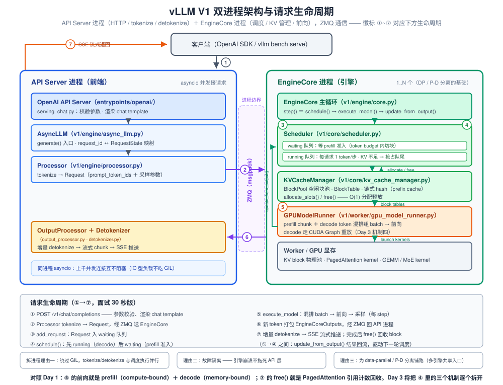
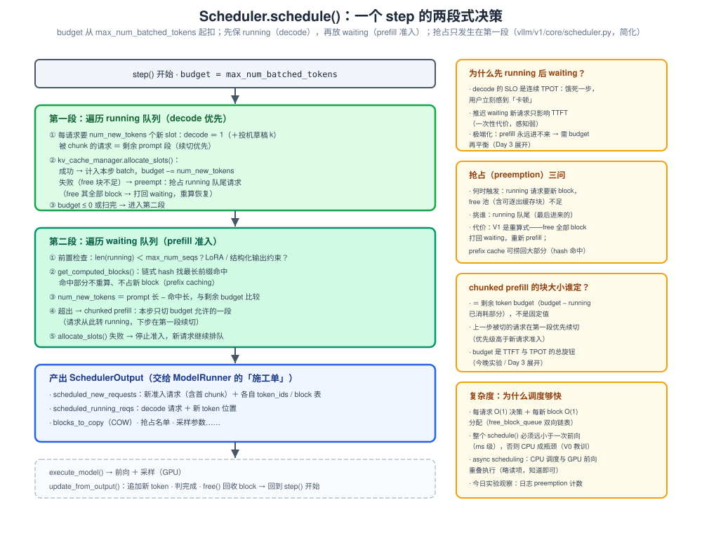
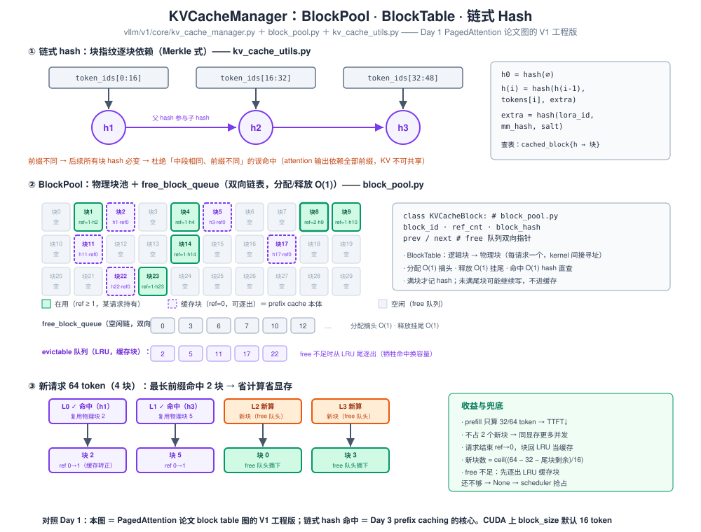

# Day 2 · vLLM V1 架构 + 源码导读 + 首次压测

> **总时长**：6-8 小时（上午 2.5h + 下午 2.75h + 晚上 2h）
> **今日目标**：徒手画出 V1 数据流图；讲清 scheduler 每个 step 的两段式决策；拿到第一组真实压测数据，并用 Day 1 的公式解释曲线形状
> **产出物**：一张 V1 数据流图（本文 SVG 为标准答案）+ 第一组压测数据表（Day 6 性能诊断树的原材料）+ schedule() 伪代码笔记
> **冲刺周定位**：昨天（Day 1）建立的三条公式，今天是它们的「验证器」——启动日志的 KV 池大小、压测曲线的每个拐点，都必须能用 Day 1 手算解释。今天是本周唯一一次贴源码：只读 `scheduler.py` 和 `kv_cache_manager.py` 两个文件，抓住主干即可，Day 3 的四个核心机制全部挂靠在今天读到的代码上

---

## 作息建议

| 时间 | 内容 | 时长 |
|---|---|---|
| 09:00-11:30 | 模块一：V1 架构总览 + 请求生命周期 | 2.5h |
| 14:00-15:30 | 模块二：scheduler.py 源码导读 | 1.5h |
| 15:45-17:00 | 模块三：kv_cache_manager.py 源码导读 | 1.25h |
| 19:30-21:30 | 模块四：起服务 + 并发扫描压测 | 2h |
| 21:30-21:45 | 对照 SVG 手绘数据流图 + 收工自测 | 0.25h |

---

## 今日学习目标

- [ ] 画出 V1 双进程结构（AsyncLLM → Processor → EngineCore → ModelRunner），说清每层职责与 ZMQ 边界
- [ ] 默写请求生命周期 7 步（30 秒讲完）
- [ ] 读懂 `schedule()` 的两段式：先 running 后 waiting、token budget、chunked prefill 切块、抢占触发
- [ ] 读懂 KVCacheManager：BlockPool / BlockTable、链式 hash、`allocate_slots()` 的 O(1) 分配
- [ ] 跑出 Qwen3-8B 的 TTFT / TPOT / 吞吐随并发的曲线，用 Day 1 公式解释三个规律
- [ ] 启动日志的 KV 池大小与手算对上数（容差 10%）

---

## 核心概念速览

| 概念 | 一句话定义 | 面试考法 |
|---|---|---|
| **AsyncLLM** | API 进程侧的异步引擎入口：管 request_id → 状态映射，请求转发 / 输出聚合 | 「V1 进程结构怎么分」 |
| **Processor** | tokenize + 构造 `Request`（prompt_token_ids、采样参数） | 「为什么 tokenize 放 API 进程」 |
| **EngineCore** | 引擎进程主循环：step() = 调度 → 执行 → 回收 | 「拆进程的三个理由」 |
| **Scheduler** | waiting / running 双队列 + token budget 的每步决策者 | 「先 running 还是先 waiting？抢占挑谁？」 |
| **KVCacheManager** | BlockPool 分配 / 释放 + prefix hash 查找 | 「hash 为什么必须链式」 |
| **token budget** | `max_num_batched_tokens`：每 step prefill+decode 的总 token 预算 | 「调大 / 调小各影响什么」 |
| **SchedulerOutput** | 调度决策清单，ModelRunner 的「施工单」 | 「调度和执行怎么解耦」 |
| **TTFT / TPOT / 吞吐** | 首 token 时延 / 每 token 时延 / 总出词速度 | 「曲线拐点怎么解释」（今晚实测） |

---

## 模块一：V1 架构总览与请求生命周期（上午，2.5h）

### 1.1 V0 → V1：为什么拆进程

V0 时代是单进程 Python：HTTP 处理、tokenize / detokenize、调度循环、前向的 CPU 侧逻辑全挤在一个进程里，GIL 让它们互相阻塞——大 batch 下 CPU 侧瓶颈直接吃掉 GPU 利用率。V1 的回答是**把引擎拆到独立进程，两个进程之间用 ZMQ 传消息**。

拆进程三个理由（必背，面试标准题）：

1. **绕过 GIL 真并行**：API 进程做 tokenize / detokenize / HTTP 的同时，EngineCore 进程跑调度和前向
2. **故障隔离**：引擎崩溃不拖死 API 层（还能优雅返回错误、快速重启引擎）
3. **为 data parallel 和 P/D 分离铺路**：多个 EngineCore 进程可以挂在同一个入口后面（V1 已经支持 DP，P/D 分离的工程基础也是它）

代价也要能说出来（体现 trade-off 意识）：

- 跨进程 = msgpack 序列化 + ZMQ 收发，单次开销在 **几十 µs 量级**，相对一次前向（ms 级）可忽略
- 但每个输出 token 都要回传，所以 V1 **按 step 打包**成 `EngineCoreOutputs` 批量回传，不是每 token 一条消息——这是「消息条数 ∝ step 数而非 token 数」的关键设计

### 1.2 双进程结构与组件职责



组件职责表（源码定位按此查，**以 vLLM 0.9~0.10 的 V1 代码为参照，函数名随版本可能微调，按名字 grep**）：

| 组件 | 源码位置 | 职责 | 关键入口 |
|---|---|---|---|
| API Server | `vllm/entrypoints/openai/serving_chat.py` | 参数校验、chat template 渲染、SSE 流式协议 | `_chat_completion_stream()` |
| AsyncLLM | `vllm/v1/engine/async_llm.py` | 异步总入口，request_id ↔ RequestState，转发请求 / 聚合输出 | `generate()` |
| Processor | `vllm/v1/engine/processor.py` | tokenize → 构造 `Request`（含采样参数） | `process_inputs()` |
| OutputProcessor | `vllm/v1/engine/output_processor.py` | 结果分流：追加 token、增量 detokenize、判停止、推流 | `process_outputs()` |
| Detokenizer | `vllm/v1/engine/detokenizer.py` | 增量 detokenize（不全量重算字符串） | `detokenize()` |
| EngineCore | `vllm/v1/engine/core.py`（+ `core_client.py` 的 ZMQ 客户端） | 引擎主循环 | `step()`、`add_request()` |
| Scheduler | `vllm/v1/core/scheduler.py` | 每步调度决策 | `schedule()`、`update_from_output()` |
| KVCacheManager | `vllm/v1/core/kv_cache_manager.py` | block 分配 / 释放 / prefix 查找 | `allocate_slots()`、`free()`、`get_computed_blocks()` |
| GPUModelRunner | `vllm/v1/worker/gpu_model_runner.py` | 组 batch、前向、采样、CUDA Graph | `execute_model()` |

**分层记忆法**：API 进程管「语言」（文本 ↔ token），EngineCore 进程管「数字」（token → 概率 → token）；ZMQ 边界上流动的只有 token id 和采样参数，**模型权重和 KV cache 完全活在引擎侧**。

### 1.3 请求生命周期 7 步（必背，对应上图徽标 ①~⑦）

1. **接入**：API server 收到 OpenAI 格式请求，校验参数、渲染 chat template
2. **预处理**：`AsyncLLM.generate()` → `Processor.process_inputs()` 做 tokenize，构造 `Request` 对象，经 ZMQ 发往 EngineCore
3. **入队**：`EngineCore.add_request()` 把请求放进 Scheduler 的 `waiting` 队列
4. **调度**：每个 engine step，`schedule()` 决定本步哪些请求跑、各跑多少 token，向 KVCacheManager 申请 block，产出 `SchedulerOutput`
5. **执行**：`GPUModelRunner.execute_model()` 把 prefill 块和 decode token 混排成一个 batch → 前向 → 采样
6. **回传**：本 step 所有新 token 打包成 `EngineCoreOutputs`，经 ZMQ 回 API 进程
7. **输出与回收**：OutputProcessor 增量 detokenize → SSE 推给客户端；同时引擎侧 `update_from_output()` 判完成——完成的请求释放 KV block，未完成的回 running 等下一 step

**为什么 7 步要背**：这是面试答一切调度问题的「地图」——被追问任何机制（抢占、prefix cache、chunked prefill），都能定位到「发生在第几步、哪个组件里」，答案立刻显得有源码支撑。

### 1.4 一个 engine step 的时间线

```python
# vllm/v1/engine/core.py —— EngineCore.step() 的骨架（简化）
class EngineCore:
    def step(self):
        scheduler_output = self.scheduler.schedule()        # ① CPU：两段式决策
        output = self.executor.execute_model(scheduler_output)  # ② GPU：前向+采样
        self.scheduler.update_from_output(output)           # ③ CPU：回流更新
        return output
```

- ①③ 是 CPU 侧 Python（µs~亚 ms 级），② 是 GPU 前向（8B 模型 decode 一步约 5~15ms）
- 默认模式下三者**串行**；V1 的 async scheduling 模式让本步的 ① 与上一步的 ② 重叠（今天略读，知道名字和目的即可）

### 1.5 关键参数速查表（今晚压测和面试都用）

| 参数 | 作用 | 调整方向 |
|---|---|---|
| `max_num_batched_tokens` | 每 step 的 token 总预算（prefill+decode 合计） | 调大 → prefill 快、吞吐高，但 decode 被挤、TPOT 抖；调小 → 相反 |
| `max_num_seqs` | running 队列容量上限 | 受 KV 显存约束，超了触发抢占 |
| `max_model_len` | 单请求最大长度 | 决定单请求最大 block table 深度 |
| `gpu_memory_utilization` | 可用显存比例（权重 + KV 池） | 默认 0.9，OOM 时调低 |
| `enable_prefix_caching` | 前缀缓存 | **V1 默认开** |
| `enable_chunked_prefill` | 长 prompt 切块 | **V1 默认开** |

> 提示：V1 里前两个参数的默认值随版本和硬件变化，启动日志会打印实际生效值——**以日志为准**，不要背默认数。

### ✅ 模块一检验

- 不看资料，画出双进程结构图（含 ZMQ、7 步徽标位置），并讲出拆进程的三个理由 + 一个代价
- 30 秒口述请求生命周期（掐表练 3 遍，Day 7 模拟面试直接用）
- 追问自答：「如果输出不按 step 打包、每 token 发一条消息会怎样？」（消息量 = token 量 × 并发，序列化 + 上下文切换开销放大，吞吐塌方）

---

## 模块二：scheduler.py 源码导读（下午，1.5h）

**文件**：`vllm/v1/core/scheduler.py`。读法：**按函数名找，不按行号**（不同版本行数差异大）；结构化输出 / encoder cache / async scheduling lookahead 三块今天全部跳过。

### 2.1 schedule()：两段式主逻辑（40 min，今天唯一逐行读的部分）

它回答一个问题：**本 step 哪些请求跑、各跑多少 token**。



伪代码骨架（≤20 行，收工时的默写目标）：

```python
def schedule(self):                                    # Scheduler.schedule()
    budget = self.max_num_batched_tokens               # token 总预算
    # ---- 第一段：running 队列（decode 优先）----
    for req in list(self.running):
        if budget <= 0: break
        num_new = req.num_new_tokens                   # decode=1(+草稿k)；续chunk=剩余prompt段
        if self.kv_cache_manager.allocate_slots(req, num_new) is None:
            preempt(self.running[-1])                  # 抢占队尾：free 全部 block，打回 waiting
            continue
        budget -= num_new                              # 挂到本步 decode batch
    # ---- 第二段：waiting 队列（prefill 准入）----
    while self.waiting and budget > 0 and len(self.running) < self.max_num_seqs:
        req = self.waiting[0]
        num_cached = self.kv_cache_manager.get_computed_blocks(req)   # 链式hash命中
        num_new = len(req.prompt_token_ids) - num_cached
        num_new = min(num_new, budget)                 # chunked prefill：只切 budget 允许的一段
        if self.kv_cache_manager.allocate_slots(req, num_new) is None:
            break                                      # KV 不够，停止准入（等待中的继续排队）
        budget -= num_new                              # 请求转 running（首 chunk 或全量）
    return SchedulerOutput(...)                        # 施工单：新准入/decode请求、block表、COW
```

> 标注：简化版，省略了结构化输出、encoder-only 请求、`long_prefill_token_threshold`、以及抢占时对队尾 vs 自身的细节分支；主干与 0.9~0.10 一致。

### 2.2 三个必考问题（边读边在代码旁标注答案）

**Q1：为什么先 running 后 waiting？**
decode 的 SLO 是**连续的 TPOT**——running 请求每 step 都要喂一个 token，饿一步用户立刻感到卡顿；waiting 请求晚进一个 step 只推高一次性的 TTFT，感知弱。极端情况（prefill 永远抢不到预算）用 token budget 参数再平衡——这正是 `max_num_batched_tokens` 存在的意义。

**Q2：抢占发生在哪、挑谁、被抢占请求去哪？**
- 触发点：第一段里 `allocate_slots()` 返回失败（free 块 + 可逐出的缓存块都不够）
- 挑谁：running **队尾**（最后进来的，近似 LRU——老请求已投入的计算最多，最不该扔）
- 去哪：V1 是**重算式**（recompute）——free 全部 block，状态打回 `WAITING`，重新排队重新 prefill
- 代价公式：浪费的计算 ≈ `2 × N_params × T_已算token`（FLOPs）；但 prefix caching 会捞回大部分——被 free 的带 hash 的块进逐出队列，重新准入时 `get_computed_blocks()` 直接命中，只需重算未满的尾部块
- 对比加分项：V0 抢占还有 swap 模式（KV 换出到 CPU 内存），V1 砍掉了——换页也要走 PCIe，往往不如重算 + prefix cache

**Q3：chunked prefill 的块大小由谁决定？**
**剩余 token budget**（`max_num_batched_tokens` − 本步 running 已消耗），不是固定值。被切过的请求下一个 step 在**第一段**优先续切（此时它在 running 里），优先级高于新请求准入——保证长 prompt 不会永远切不完。

### 2.3 update_from_output() 与请求状态机（30 min）

执行结果回流（对应 SVG 1 的 `update_from_output()` 走廊）：本 step 采样的新 token 追加到各请求；判断完成条件（EOS / 长度上限 / 停止词 / abort）；**完成的请求调 `kv_cache_manager.free()` 释放 block**；统计计数更新。

请求状态机（`RequestStatus`）：

```
WAITING → RUNNING → FINISHED_STOPPED / FINISHED_LENGTH_CAPPED / FINISHED_ABORTED / FINISHED_IGNORED
   ↑__________|
      PREEMPTED（重算式抢占，回到 waiting 重新排队）
```

注意一个 prefix caching 相关的细节：**完成请求的 block 不一定消失**——引用计数归零后，带 hash 的满块进入 BlockPool 的**逐出队列**（LRU），下次同前缀请求直接命中。这是 Day 3 prefix caching 的伏笔。

### 2.4 调度开销的数量级（为什么敢每 step 都跑一遍 Python 调度）

- 每请求 O(1) 决策 + 每新 block O(1) 分配（free_block_queue 双向链表，摘头 / 挂尾）→ 整个 `schedule()` 是 **O(R + W_admitted + B_new)**，全 O(1) 操作
- 参照系：8B 模型 decode 一步前向 5~15ms → 调度必须压在**亚 ms 级**，否则 CPU 侧成为瓶颈（V0 大 batch 的教训之一）
- 面试表达：「调度器是被前向时间预算倒逼出来的全 O(1) 设计」——这句话能把 scheduler 和 Day 1 的时延公式串起来

### ✅ 模块二检验

- 合上代码，默写两段式伪代码主干（10 行以内）
- 能回答 Q1~Q3 且每个都带一句源码依据（函数名）
- 能算：一条 4K token 的请求被抢占，浪费多少 FLOPs？（8B 模型：2 × 8.2e9 × 4096 ≈ 6.7e13，即 ~67 TFLOPs，约等于 H100 满载 0.1 秒的算力——所以抢占是最后手段）

---

## 模块三：kv_cache_manager.py 源码导读（下午，1.25h）

**文件三件套**：`vllm/v1/core/kv_cache_manager.py`（管理面）+ `vllm/v1/core/block_pool.py`（物理块池）+ `vllm/v1/core/kv_cache_utils.py`（hash 等工具）。这张图就是 Day 1 PagedAttention 论文图的 V1 工程版。

### 3.1 数据结构三件套（30 min）



- **KVCacheBlock**（block_pool.py）：物理块——`block_id`、`ref_cnt`（引用计数）、`block_hash`（前缀指纹）、`prev/next`（free 队列双向链表指针）
- **BlockPool**：两套索引——`free_block_queue`（空闲块双向链表，**分配摘头 / 释放挂尾，均 O(1)**）+ `cached_block`（hash → block 的字典，prefix cache 查表）+ 逐出队列（ref_cnt=0 的带 hash 块，LRU）
- **BlockTable**：每请求一个列表，逻辑块号 → 物理块号——Day 1 论文里那张表的工程实现，attention kernel 靠它做间接寻址

### 3.2 链式 hash 与命中路径（30 min，今天的重点）

hash 怎么算（kv_cache_utils.py）：

```
h₀ = hash(∅)
hᵢ = hash( hᵢ₋₁ , token_ids[第 i 块的 16 个 token] , extra_keys )
extra_keys = hash( lora_id , 多模态内容 hash , cache_salt )
```

**为什么必须链式**（高频面试题）：防「中段相同但前缀不同」的误命中。attention 的输出依赖**全部前缀**——前缀不同，即使第 5 块 token 完全一样，它的 KV 也不同、不可共享。链式 hash 让每个块的指纹携带全部祖先信息（Merkle tree 的父链思想），前缀一变后续所有块 hash 必变，天然杜绝误命中。

命中路径：`hash_request_tokens()` 沿 block 边界把整条链算出来 → `get_computed_blocks()`（新版本拆成 `find_longest_cache_hit()`，还分 FULL/PARTIAL 命中策略）取**最长命中前缀** → 命中块 `ref_cnt++`，prefill 长度扣除命中部分。

`cache_salt` 的作用：多租户隔离——不同租户即使发来相同 system prompt，salt 不同 → hash 不同 → 不共享 KV（既防跨租户信息泄漏，也防恶意用户「预热」别人的缓存）。

### 3.3 allocate_slots()：O(1) 分配（15 min）

给请求追加 n 个 token 的 slots：

```python
def allocate_slots(self, request, num_new_tokens):      # KVCacheManager（简化）
    # 1. 先查最长命中（新请求）；续跑请求跳过
    num_cached = self.get_computed_blocks(request)      # 命中块 ref_cnt++，直接复用
    # 2. 算还差几个新块：考虑已有尾部块的剩余空间
    num_req_blocks = ceil((num_cached + num_new_tokens
                           - 尾块剩余容量) / block_size)
    # 3. 从 free_block_queue 摘头；不够则逐出 LRU 尾的缓存块（ref_cnt=0）
    # 4. 仍不够 → return None → scheduler 触发抢占
```

要点：**尾部块剩余空间参与计算**（不满的块继续写，不新开）；free 不足时先逐出缓存块（缓存块本来就是「可丢的」），还不够才让调度器抢占。

### 3.4 ⚡ 昇腾翻译提示

free_block_queue 的双向链表管理 ≈ 你在昇腾做过的内存池 / buffer 复用；链式 hash ≈ Merkle tree 父链防篡改。这一节全是标准系统编程，没有一点 ML 味——**读这段你会非常快，自信一点**。面试时可以主动说：「这套 block 池我在别的硬件上写过同构的东西，所以读 V1 的 KV 管理基本是秒懂」。

### ✅ 模块三检验

- 合上资料，画出：物理块池（含 ref_cnt / hash 标记）+ 两条 BlockTable + free 队列链
- 能回答：hash 为什么链式、cache_salt 干嘛的、分配失败后发生什么（两级兜底：逐出缓存块 → 抢占）
- 口算：block_size=16、block 512 个，池容量多少 token？（512 × 16 = 8192 token）

---

## 模块四：起服务 + 首次压测（晚上，2h）

> 原则：**2 小时内必须跑完**。环境问题不纠结——租卡（AutoDL / 各云，单卡 A100-80G 或 H100，镜像选 PyTorch 2.x + CUDA 12.x），`pip install -U vllm` 一步到位。

### 4.1 起服务 + 与 Day 1 手算对数（15 min）

```bash
vllm serve Qwen/Qwen3-8B \
  --max-model-len 8192 \
  --gpu-memory-utilization 0.9 \
  --port 8000
```

启动日志里找两行并抄进笔记：**`GPU KV cache size: X tokens`** 和 **`Maximum concurrency for 8192 tokens per request: Y`**——这就是 Day 1 三个公式的实测验证，**先手算再对数**：

| 量 | 手算 | 过程 |
|---|---|---|
| 每 token KV | **144 KiB** | 2 × 36 层 × 8 KV头 × 128 head_dim × 2 B（bf16），Qwen3-8B |
| KV 池容量 | ≈ 35~40 万 token | (0.9 × 80 − 16.4 权重 − ~2 激活/CUDA Graph) GiB ÷ 144 KiB |
| 最大并发 | ≈ 43~48 | 池容量 ÷ 8192 |

对不上就是学习机会，排查方向：激活 workspace、CUDA Graph 预留、NCCL/框架自身显存、`gpu_memory_utilization` 的口径（是占总显存的比例）。**容差 10% 以内算对上**。

### 4.2 并发扫描压测（60 min）

```bash
# 并发 = 1 / 4 / 16 / 64 各跑一轮（random 数据集，零外部依赖）
vllm bench serve \
  --backend openai --base-url http://localhost:8000 \
  --model Qwen/Qwen3-8B \
  --dataset-name random \
  --random-input-len 1024 --random-output-len 256 \
  --num-prompts 200 \
  --max-concurrency <1|4|16|64>

# 想看 prefix cache 命中，换 sharegpt 真实分布（需下载数据集文件）：
#   --dataset-name sharegpt --dataset-path ShareGPT_V3_unfiltered_cleaned_split.json
# 老版本 vLLM 用：python benchmarks/benchmark_serving.py（参数相同）
```

注意：random 数据集**没有共享前缀**，日志里 prefix cache 命中率接近 0 是正常的——想看命中效果用 sharegpt 或固定 system prompt。

### 4.3 数据记录表 + 三个规律（必须能解释）

| 并发 | TTFT p50/p99 (ms) | TPOT p50/p99 (ms) | 总吞吐 (tok/s) | 单请求吞吐 (tok/s) |
|---|---|---|---|---|
| 1 | | | | |
| 4 | | | | |
| 16 | | | | |
| 64 | | | | |

**规律 1：并发 1→16，总吞吐近线性涨、TPOT 几乎不变**——Day 1 decode 公式的直接体现：

$$t_{step}(B) \approx \frac{W_{权重} + B \cdot L_{ctx} \cdot KV_{token}}{BW_{HBM}}$$

代入数字（H100 3.35 TB/s，W ≈ 16.4 GiB，L_ctx ≈ 1280）：B=1 时 KV 读 0.18 GiB，B=16 时 2.95 GiB——都远小于权重 16.4 GiB，**权重读取被全 batch 摊销**，所以每步时间几乎不随 B 涨，白赚 16 倍吞吐。B=1 的 TPOT 实测会略高于理论 4.9ms（kernel launch / 采样 / 算子间隙——这正是 Day 3 CUDA Graph 要解决的问题）。

**规律 2：并发 64，TTFT p99 显著恶化、TPOT 开始变差**——两层原因：64 路并发的新请求 prefill 排队挤占 token 预算（waiting 堆积，TTFT 恶化）；decode 每步的 KV 读（64 × 1280 × 144 KiB ≈ 11.8 GiB）开始逼近权重读的量级，TPOT 抬升。

**规律 3：存在「甜点并发」**——goodput（满足 SLO 的请求占比）在某个 B* 最高：太小浪费带宽摊销，太大 SLO 破防。**B* 由你的 SLO 定义决定，不是常量**——这是面试聊容量规划的核心话术，也是 Day 6 性能诊断树的输入。

### 4.4 日志窗口：把曲线和 scheduler 状态对上（30 min）

服务运行时周期性输出引擎统计日志（INFO 级别）：

```
Engine 000: ... Running: 12 reqs, Waiting: 87 reqs,
GPU KV cache usage: 91.3%, Prefix cache hit rate: 2.1%
```

在压测中途记录几组（并发 16 和 64 各一组），并回答：waiting 堆积说明什么？（准入被 token budget / max_num_seqs 卡住）；KV usage 逼近 100% 会发生什么？（allocate_slots 失败 → 逐出缓存块 → 再不行抢占——回去看模块二 Q2）；命中率为什么这么低？（random 数据集无共享前缀）。

---

## 面试高频问题（今天范围，练到 3 分钟内答完）

| # | 问题 | 答题要点 |
|---|---|---|
| 1 | V1 为什么拆进程？ZMQ 的代价？ | GIL 真并行 / 故障隔离 / DP·P-D 铺路；代价 = msgpack 序列化 + 跨进程，几十 µs/条，按 step 打包 EngineCoreOutputs 摊薄 |
| 2 | 走一遍请求生命周期 | 7 步：接入→tokenize→waiting→schedule→execute→回传→detokenize/SSE+回收（30 秒版，对应 SVG 1 徽标） |
| 3 | schedule() 为什么先 running 后 waiting？ | decode SLO 是连续 TPOT（饿一步即卡顿）；推迟 prefill 只影响一次性 TTFT；极端情况靠 token budget 再平衡 |
| 4 | 抢占什么时候触发、挑谁、代价？ | allocate_slots 失败（free + 可逐出缓存块都不够）；挑 running 队尾（近似 LRU）；V1 重算式——free 全部 block 打回 waiting，prefix cache 捞回大部分；浪费 FLOPs ≈ 2·P·T |
| 5 | chunked prefill 块大小谁定？ | 剩余 token budget（非固定值）；被切请求下步在第一段优先续切；budget 是 TTFT/TPOT 总旋钮 |
| 6 | prefix hash 为什么必须链式？cache_salt 呢？ | attention 依赖全部前缀，链式使前缀一变后续全变，杜绝中段误命中；salt 做多租户隔离（防泄漏 + 防缓存污染） |
| 7 | block 分配为什么能 O(1)？ | free_block_queue 双向链表摘头/挂尾；hash 字典直查命中；整个 schedule() 亚 ms 级，被前向时间倒逼 |
| 8 | TTFT 高 / TPOT 高分别先查什么？ | TTFT↑ 且 ITL 稳 → waiting 堆积 / prefill 拥塞（调 budget）；TPOT↑ → batch 过大 KV/算力饱和、或抢占（调 max_num_seqs）——Day 6 诊断树展开 |

---

## 今日总结

- **一张架构图**：双进程（API / EngineCore）+ ZMQ；调用链 AsyncLLM → Processor → EngineCore.step() → Scheduler.schedule() → KVCacheManager → GPUModelRunner.execute_model → update_from_output → OutputProcessor
- **一个调度骨架**：两段式（先 running 保 decode，后 waiting 放 prefill）+ token budget + 重算式抢占 + chunked prefill 按剩余预算切块
- **一套 KV 管理**：BlockPool（free 双向链表 O(1)）+ BlockTable（间接寻址）+ 链式 hash（Merkle 式防误命中）+ LRU 逐出（缓存即「可丢的容量」）
- **第一组数据**：TTFT/TPOT/吞吐 vs 并发曲线 + 三条规律（摊销区 / 恶化区 / 甜点区）——全部能用 Day 1 公式解释
- **和昇腾经验的挂钩点**：block 池 = 内存池管理，链式 hash = Merkle 思想，budget 切块 = buffer 分块——主动讲「同构问题我在别的硬件上做过」

---

## 今日自测题（答不上回对应模块）

1. 输出不按 step 打包回传会发生什么？序列化开销的数量级？（→ 模块一）
2. 4K prompt 的请求被抢占，浪费多少 FLOPs？prefix cache 怎么捞回？（→ 模块二）
3. 为什么被 chunk 的请求下一个 step 优先于新请求？它在哪个队列里？（→ 模块二）
4. 两个请求前 2 块相同、从第 3 块开始不同，hash 从第几块开始不一样？为什么？（→ 模块三）
5. block 512 个 × block_size 16，能撑多少 token？并发 64 每步 KV 读多少字节（L_ctx=1280）？（→ 模块三 / 模块四）
6. 压测中 TTFT p99 恶化但 p50 稳定，最可能是什么原因？（→ 模块四：长尾排队 / 个别长 prompt 挤占 budget）

---

## 今日产出物

1. **手绘 V1 数据流图**（对照 `assets/day02_v1_architecture.svg` 自查要素：双进程、ZMQ、7 步徽标、waiting/running、BlockPool、update_from_output 回路）——Day 7 作战包第 2 件
2. **第一组压测数据表** + 三条规律的解释（写在数据旁，Day 6 诊断树要用）
3. **schedule() 伪代码笔记**（≤20 行，模块二那张）
4. **对数记录**：KV 池手算 vs 启动日志（含差值解释）

### Day 2 收工自检清单（全绿才算完成）

- [ ] 能画出 V1 双进程结构并讲清拆分理由 + 一个代价
- [ ] 30 秒讲完请求 7 步生命周期（掐表 3 遍）
- [ ] 能默写 schedule() 两段式主干，并回答抢占三问（在哪/挑谁/去哪）
- [ ] 能回答 prefix hash 为什么链式、cache_salt 干嘛的
- [ ] 手上有真实压测曲线，三个规律都能用 Day 1 公式解释
- [ ] 启动日志 KV cache size 与手算对上（±10%）

**未完成项不许带入 Day 3**。明天 Day 3 是面试主战场：continuous batching、chunked prefill、prefix caching、CUDA Graph 四连——全部挂靠今天读到的 `schedule()` 和 `kv_cache_manager.py`，今天的伪代码就是明天的底稿。


