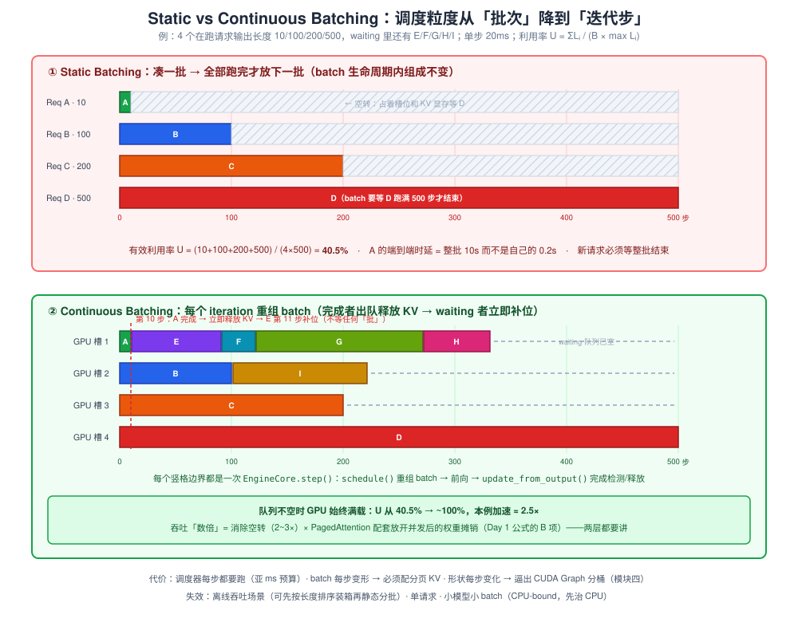
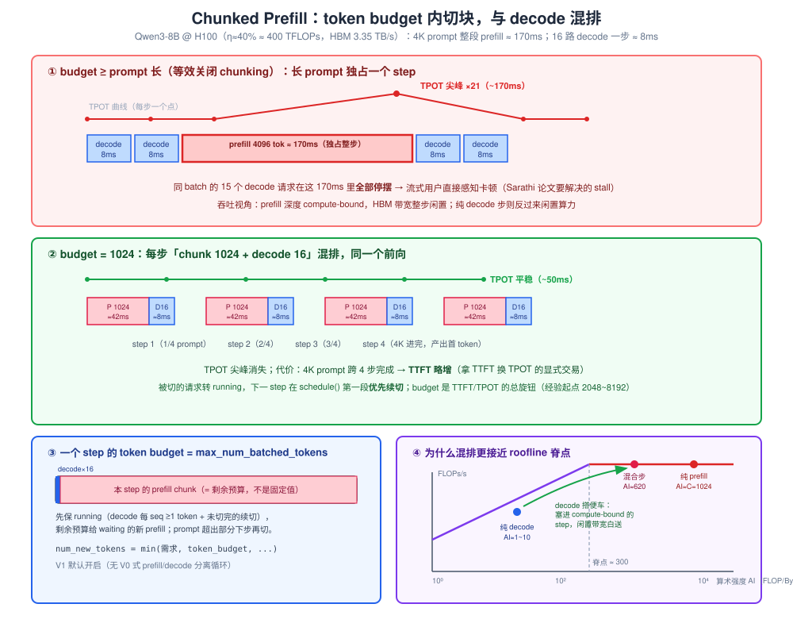
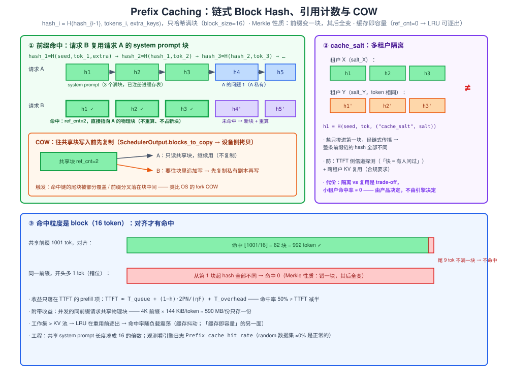
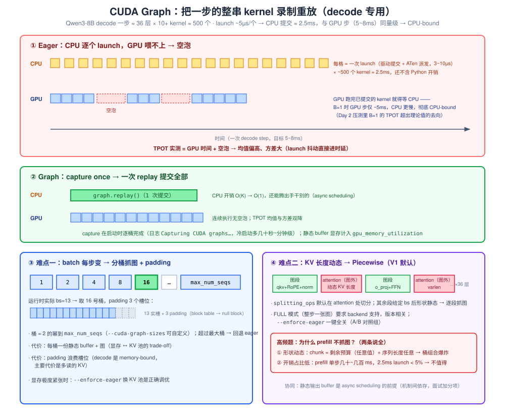

# Day 3 · 核心机制四连（面试主战场）

> **总时长**：7-8 小时（四个机制各 1.5~1.75h + 晚上实验 1.5h + 卡片整理 0.5h）
> **今日目标**：四个机制全部达到「四段式」表达水平——**原理 → 解决什么问题 → trade-off → 什么时候失效**，每个机制至少备一个能脱口而出的数字例子。这是「专家答案」和「背诵答案」的分水岭
> **产出物**：四张机制卡片（每张 ≤ 半页 A4，Day 7 面试作战包第 3 件）+ 一组 chunked prefill 对比实验数据
> **冲刺周定位**：今天是面试火力最密集的一天。Day 2 读过的 `scheduler.py` / `kv_cache_manager.py` 是今天的弹药库——四个机制全部挂靠在那两个文件的真实代码上，每个机制讲完原理都要能补一句「实现就在这」。源码引用以 vLLM V1（v0.9~v0.11 一线）为准，参数默认值与文件路径随版本演进可能变化，动手时以你环境的 `--help` 和源码为准

---

## 作息建议

| 时间 | 内容 | 时长 |
|---|---|---|
| 09:00-10:45 | 机制一：Continuous Batching | 1.75h |
| 11:00-12:30 | 机制二：Chunked Prefill | 1.5h |
| 14:00-15:45 | 机制三：Prefix Caching | 1.75h |
| 16:00-17:30 | 机制四：CUDA Graph | 1.5h |
| 19:30-21:00 | 实验：token budget 大小对比（TPOT 抖动） | 1.5h |
| 21:00-21:30 | 落笔四张机制卡片 + 收工自测 | 0.5h |

---

## 今日学习目标

- [ ] 用「iteration 级调度」解释 continuous batching，并**当场手推** static batching 利用率例子（40.5% 那个）
- [ ] 讲清 chunked prefill 的两重收益：TPOT 平滑（数字例子）+ **算术强度互补**（混合步更接近 roofline 脊点——必须能画图讲）
- [ ] 默写链式 block hash 公式、cache_salt 为什么只进第一块、COW 的触发条件
- [ ] 回答「为什么 decode 用 CUDA Graph 而 prefill 不用」时，**形状动态 + launch 开销占比低两条都说全**
- [ ] 说清 piecewise CUDA Graph 解决什么问题（attention 为什么留在图外）
- [ ] 跑完 budget 对比实验，数据能讲出「预期 vs 实际」并解释差异

---

## 核心概念速览

| 概念 | 一句话定义 | 面试考法 |
|---|---|---|
| **Static batching** | 凑一批一起跑，**全部完成**才放下一批 | 「空转怎么算？利用率公式」 |
| **Continuous batching** | 调度粒度降到迭代步，每生成一个 token 重组 batch | 「吞吐为什么提升数倍？」「为什么必须配 PagedAttention」 |
| **Iteration-level scheduling** | Orca 论文提出的术语；vLLM V1 的每步调度本质 | 「调度器每步做什么」 |
| **Token budget** | `max_num_batched_tokens`：每 step prefill+decode 共享的总 token 预算 | 「调大调小各影响什么」（Day 6 高频题 4） |
| **Chunked prefill** | 长 prompt 按「剩余预算」切块，与 decode 混排在同一 step | 「trade-off？预算怎么设？」 |
| **算术强度互补** | prefill AI ≈ 块长 C，decode AI ≈ 1~10，混合步更接近脊点 | 「为什么混合 batch 更接近 roofline 拐点」 |
| **链式 block hash** | `hash_i = H(hash_{i-1}, tokens_i, extra_keys)`，只哈希满块 | 「hash 为什么链式？错位会怎样」 |
| **cache_salt** | 多租户隔离盐，只掺进第一块的 hash、经链式传播覆盖全前缀 | 「多租户怎么防侧信道/缓存污染」 |
| **COW** | 往共享（ref_cnt>1）块写入前先复制私有副本 | 「blocks_to_copy 什么时候非空」 |
| **Capture / Replay** | 把一步的整串 kernel 录成图，一次 launch 重放 | 「launch 开销的数量级」 |
| **分桶抓图** | 按 batch size 2 的幂预抓，运行时 padding 到最近桶 | 「动态 batch 怎么进静态图」 |
| **Piecewise CUDA Graph** | 在 attention 处切分：图外动态执行 attention，图内捕获其余 | 「V1 默认形态解决什么」 |

---

## 使用说明：四段式是今天的骨架

每个机制严格按四段过，对应四张卡片的四个栏。**「什么时候失效」是区分度最高的一段**——背书的人答不出这段，因为它需要真的理解 trade-off。每段都要求至少一个数字或一个代码位置。

---

## 模块一：Continuous Batching（上午，1.75h）

### 1.1 原理：调度粒度从「批次」降到「迭代步」

**Static batching（传统做法）**：攒够 B 个请求 → 组成一个 batch 一起跑 → **batch 里所有请求全部生成完毕**，才释放资源接下一批。调度决策发生在「批」这一级，一个 batch 的生命周期内组成不变。

**Continuous batching（iteration-level scheduling，术语出自 Orca 论文，Anyscale 博客推广了 continuous batching 这个叫法）**：把调度粒度降到**每一次前向迭代（iteration）**——每生成一个 token 就是一次迭代，每次迭代结束后重新决策 batch 组成：

- 刚生成完最后一个 token 的请求 → **立即出队**，KV cache 全部释放
- waiting 队列里的新请求 → **立即补位**，插入下一步的 batch

batch 从一个「静态容器」变成一个**每步重组的滚动集合**。

### 1.2 解决什么问题：static batching 的空转（必背数字例子）

同一个 batch 里输出长度差异巨大：短请求早早生成完，它占的计算槽位和 KV 显存**空转到最长的请求结束**。

> **例**：4 个请求，输出长度 10 / 100 / 200 / 500，单步 20ms。
> Static：batch 要跑满 500 步 = 10s。有效利用率：
>
> $$U_{static} = \frac{\sum_i L_i}{B \times \max_i L_i} = \frac{10+100+200+500}{4 \times 500} = 40.5\%$$
>
> 请求 A 第 10 步就完成了，却要「陪跑」490 步。且它的端到端时延不是 200ms，而是整个 batch 的 10s。
> Continuous：A 第 10 步完成立即退出、释放 KV，waiting 里的新请求第 11 步补位——只要队列不空，GPU 始终满载。理想加速比 ≈ 1/U = **2.5×**（本例），长度分布越参差收益越大。

面试被问「吞吐为什么能提升**数倍**」，标准答案是**两层叠加**（只答第一层只能算及格）：

1. **消除空转**：利用率从 `ΣL/(B·maxL)` 提到接近 100%（本层 ≈2-3×）
2. **配 PagedAttention 才敢放开准入**：Day 1 讲过三类显存浪费，连续 KV 预留下动态进出的 batch 碎片率极高；分页管理把碎片打掉 → 同样显存能塞更大 batch → 权重读取被更彻底摊销（Day 1 公式 $t_{step} \approx (W + B \cdot L_{ctx} \cdot KV_{token})/BW$ 里 B 越大，固定项 W 摊得越薄）→ 这是第二层倍增

所以这两个机制是**配套发明**的：iteration 级调度要求 KV 每步可分配/可释放，PagedAttention 使这成为可能。vLLM = PagedAttention + continuous batching，不是两个独立卖点的拼盘。



### 1.3 V1 源码调用链

Day 2 读过的 `EngineCore` 主循环，今天换一个视角看——它就是 continuous batching 的载体：

```
EngineCore 每步（vllm/v1/engine/core.py）:
  ① scheduler.schedule()            # 重组 batch：谁出队（完成/抢占）、谁补位
  ② executor.execute_model(...)     # GPUModelRunner 前向（这一步才碰 GPU）
  ③ scheduler.update_from_output()  # 完成检测 → free KV blocks → 输出打包回传
```

关键源码注释（`vllm/v1/core/scheduler.py` 的 `schedule()` 开头，大意）：

> 调度器里**没有「decode 阶段」和「prefill 阶段」之分**。每个请求只有 `num_computed_tokens`（已算）和 `num_tokens`（应有）；每一步调度器做的事，就是给请求分配 token 让前者追上后者。这个抽象统一覆盖 chunked prefill、prefix caching、投机解码。

这是今天最重要的一个观点：**四个机制里有两个半（CB、chunked prefill、prefix caching 的命中跳过）都只是「让 `num_computed_tokens` 追赶 `num_tokens`」这一个追赶问题的不同侧面**。面试讲出这句，层次立刻不同。

请求状态机（`vllm/v1/request.py` 的 `RequestStatus`）：`WAITING → RUNNING → FINISHED_*`；被抢占则 `PREEMPTED → 回 WAITING`。完成检测在 `update_from_output()`，释放走 `kv_cache_manager.free()`——空块挂回 free 链表尾部（Day 2 读过的 `FreeKVCacheBlockQueue`）。

### 1.4 Trade-off

| 代价 | 说明 | V1 的应对 |
|---|---|---|
| **调度器每步都要跑** | 前向才几 ms，schedule() 的 CPU 时间预算是**亚毫秒级** | 拆进程绕 GIL（Day 2）、输出按 step 打包、**async scheduling**（下一步调度与当前步 GPU 重叠，新版本默认开启，版本相关） |
| **batch 每步变形** | KV 必须支持随时分配/释放/非连续 → 连续预留必碎片 | PagedAttention（配套前提，不是可选优化） |
| **形状每步变化** | batch size 变 → 静态图不可用 → kernel launch 开销回来 | CUDA Graph 分桶（今天模块四，另一个机制的因） |
| **准入激进 → KV 耗尽** | 为了保持满载倾向多放请求 → `allocate_slots` 失败 → 抢占，被抢请求 TTFT 暴涨 | 抢占（重算式）+ `max_num_seqs` 限流（Day 2 抢占三问） |

注意这条因果链的面试价值：**CB 制造了「动态形状」问题，CUDA Graph 的分桶设计就是为它而生的**——机制之间不是并列的名词，是有因果的。

### 1.5 什么时候失效 / 不适用

- **离线批量推理**（吞吐唯一目标、无 SLO）：可以先按输出长度**排序装箱**再静态分批，把空转压到很低；CB 收益趋零，还白付每步调度开销
- **单请求 / batch 恒小**：没有「重组」可言，调度开销占比反而上升
- **小模型 + 小 batch**：前向极快（~1ms 级），CPU 调度跟不上 GPU，瓶颈在 CPU 侧——先治 CPU（CUDA Graph / async scheduling），调度优化是下一步的事

### 1.6 与昇腾经验的挂钩（一句话）

> 相当于把「整批等齐再跑」改成「流水线滚动补位」——和我在昇腾上做多 stream 调度时把 MAC 阵列喂满是同一类问题，只不过粒度从 kernel 级放大到请求级。

### 机制一速记卡（誊抄到你的卡片上）

| 段 | 内容 |
|---|---|
| 原理 | 调度粒度从批次降到迭代步；每步 schedule() 重组 batch：完成者出队释放 KV，waiting 者补位 |
| 解决什么 | static batching 空转：利用率 = ΣL/(B·maxL)，10/100/200/500 例 = **40.5%**；吞吐提升 = 消除空转（2-3×）× 摊销放大（PagedAttention 配套） |
| Trade-off | 每步 CPU 调度开销（亚 ms 预算）/ 依赖分页 KV / 动态形状逼出分桶抓图 / 准入激进触发抢占 |
| 失效 | 离线吞吐（排序装箱更优）、单请求、小模型小 batch（CPU-bound） |

---

## 模块二：Chunked Prefill（上午，1.5h）

### 2.1 原理：长 prompt 按「剩余预算」切块，与 decode 混排

先复述 Day 2 读到的调度骨架：每个 step 有一个 **token budget**（`max_num_batched_tokens`，V1 默认 8192，版本相关），schedule() 先保 running 队列（decode 每请求 1 token + 未切完的 prefill 续切），再用**剩余预算**从 waiting 放新 prefill。

Chunked prefill 的核心就一句话：**新请求的 prompt 超出剩余预算时，不是拒绝、也不是独占多跑，而是只切「剩余预算」那么大的一块进本步**，剩下的下一step 续切（该请求从此转 running，下步在第一段被优先续切——Day 2 读过的细节）。

于是每个 step 的 batch 长这样：**「D 个 decode token + 一段 prefill chunk」混排在同一次前向里**（FlashAttention 类 backend 以 varlen 方式支持同一 batch 内 query 长度不同）。起源是 Sarathi-Serve（OSDI'24，stall-free batching）；vLLM V1 默认开启——V1 里根本没有 V0 那种 prefill/decode 分离的调度循环（见 1.3 那条源码注释）。

参数（版本相关，动手前 `--help` 确认）：

| 参数 | 作用 |
|---|---|
| `--max-num-batched-tokens` | 每 step 总 token 预算（prefill+decode 一起算）——TTFT/TPOT 的总旋钮 |
| `--long-prefill-token-threshold` | 新版本提供：单请求 prefill 在一步内的上限（0 = 不额外限制，默认）；防超长 prompt 独占预算 |
| `--enable-chunked-prefill` | V1 默认开启；旧版本试图关闭会报错或被忽略（V1 早期不可关），用 budget 大小模拟开关更稳 |

### 2.2 解决什么问题（两重收益，第二重是深水区）

**第一重：TPOT 平滑（Sarathi 论文的直接动机）。** 不切块时，一个 4K prompt 的 prefill 独占一个 step，同 batch 的 decode 全部停摆。数量级（沿用 Day 1/Day 2 的 Qwen3-8B @ H100 假设：η≈40% 有效算力 ≈ 400 TFLOPs）：

$$T_{prefill}(N) = \frac{2PN}{\eta F_{peak}} = \frac{2 \times 8.2\text{e}9 \times 4096}{4\text{e}14} \approx 170 \text{ ms}$$

期间 15 个 decode 请求的 TPOT 从 ~8ms 跳到 ~170ms——**21 倍尖峰**，流式场景用户直接感知卡顿。budget=1024 时每步 prefill 上限 1024 token（~42ms）+ decode（~8ms）→ step 稳定在 ~50ms，TPOT 平稳。

**第二重：算术强度互补（必须能画 roofline 讲）。** 回顾 Day 1：decode 每步读全部权重 + 每序列全部历史 KV、只算 1 个 token → 深度 memory-bound；prefill 的 N 个 token 共享一次权重读取 → compute-bound。定量（bf16，H100 脊点 ≈ 990 TFLOPs / 3.35 TB/s ≈ **300 FLOP/Byte**）：

- **decode**：$AI \approx \frac{2PD}{W + D \cdot L_{ctx} \cdot KV_{token}}$，D=1 时 ≈ 1，D=16、L=4200 时也只有 ~10 —— 距脊点差一个半数量级以上
- **prefill chunk（长 C）**：权重只读一次，$AI \approx \frac{2PC}{W} = C$，C=1024 → AI≈1024 —— 深度 compute-bound，**带宽大量闲置**
- **混合步（C=1024, D=16）**：$AI \approx \frac{2P(C+D)}{W + D \cdot L_{ctx} \cdot KV_{token}} \approx 620$ —— 落在两者之间，**向脊点靠拢**

直觉版：decode token 是「搭便车的」——把它塞进一个 compute-bound 的 prefill 步，FLOPs 只加 1.6%，bytes 只加 ~35%（16×4200×144KiB ≈ 9.7GiB vs 权重 16.4GiB），而该步时长由计算侧主导、几乎不变——**闲置的带宽白送给了 decode**。纯 decode 步则反过来闲置算力。混排让每一步的两类资源同时被吃满，这就是「混合 batch 比纯 decode 更接近 roofline 拐点」的完整答案。

$$T_{step}(C, D) \approx \max\left(\frac{2P(C+D)}{\eta F_{peak}},\ \frac{W + D \cdot L_{ctx} \cdot KV_{token}}{BW}\right)$$

（roofline 近似，实际重叠不完美，面试给数量级即可。）



### 2.3 V1 源码调用链

```python
# vllm/v1/core/scheduler.py · schedule() 第一段（running 队列，简化）
num_new_tokens = (request.num_tokens_with_spec          # 应有
                  - request.num_computed_tokens)        # 已算 → 追赶缺口
num_new_tokens = min(num_new_tokens, token_budget, ...) # ← 切块就发生在这一行
```

- 第一段里，被切过的请求和 decode 请求**同一循环、同一逻辑**处理（「追赶」抽象的又一次出场）
- 第二段（waiting）：`get_computed_blocks()` 先扣掉前缀命中（模块三），`num_new_tokens = prompt长 − 命中长`，再与剩余 budget 取 min → 超出部分留到下一 step
- 产出 `SchedulerOutput.num_scheduled_tokens[req_id]`：每请求本步的 token 数 → ModelRunner 把同一 step 的 chunk prefill + decode 拼成一个 batch 单次前向

### 2.4 Trade-off

| budget | TPOT | 长 prompt TTFT | 备注 |
|---|---|---|---|
| 小（512~1024） | 最平稳，尖峰被切碎 | 变差：4K prompt 要 4~8 步，每步还得等别的请求 | waiting 易堆积 |
| 大（8192+） | 出现尖峰（回到 2.2 第一重问题） | 好：一步进完 | 吞吐通常略高 |

- **长 prompt 的 TTFT 上升**：被切成 k 块就要跨 k 个 step，每步还混着别人的 token——这是拿 TTFT 换 TPOT 的**显式交易**，不是免费午餐
- **budget 是系统级旋钮**：经验起点 2048~8192，按 SLO 调——TTFT 敏感往大调，ITL/TPOT 敏感往小调（Day 6 诊断树的输入）
- 调度复杂度：续切优先、与 prefix caching 命中扣减交互、抢占恢复时的 chunk 状态——都比「整段进」复杂（这是实现者的代价，面试提一句即可）

### 2.5 什么时候失效

- **prompt 普遍很短**（分类、embedding、短对话补全）：prompt < 剩余预算时根本不会触发切块，机制空转——无收益但也无显著代价
- **TTFT 是唯一 SLO 的服务**（语音首响、输入联想）：首 token 就是产品，切块纯亏——反向调参，优先把 prefill 一步做完（甚至考虑 P/D 分离，Day 4）
- **极端 prefill 主导 + 几乎无 decode**：batch 里没有需要被保护的 decode，切块只增加 step 数和调度开销

### 2.6 与昇腾经验的挂钩（一句话）

> GEMM tiling 的本质不是「切小」而是「让每一步的资源利用形状更好」；混排 prefill+decode 就是系统层的双流水线——prefill 吃 MAC、decode 吃 MTE，我在昇腾做量化 GEMM 时的 bound 分析（计算受限 vs 带宽受限）在这里原样复用，只是粒度从算子放大到 step。

### 机制二速记卡

| 段 | 内容 |
|---|---|
| 原理 | prompt 超出剩余 token budget 时切块进本步，剩余转 running 下步续切；每 step = decode + prefill chunk 混排单次前向 |
| 解决什么 | ① TPOT 尖峰：4K prefill 独占 step ≈170ms，decode 停摆 21×；② 算术强度互补：AI(prefill)≈C、AI(decode)≈1~10、脊点≈300，混合步 ≈620 更靠近脊点，decode 搭便车 |
| Trade-off | 长 prompt TTFT↑（跨 k 步）；budget 是 TTFT/TPOT 总旋钮（经验 2048~8192）；调度复杂度↑ |
| 失效 | 短 prompt 负载（不触发）；TTFT 至上服务（反向调参）；无 decode 可保护的纯 prefill 负载 |

---

## 模块三：Prefix Caching（下午，1.75h）

### 3.1 原理：链式 block hash + 引用计数 + 逐出

Day 2 已经读过链式 hash 的骨架，今天把它讲成完整的命中流程。**KV 池里每个满 16 token（`block_size` 默认值，硬件相关）的 block 都可以成为缓存条目**：

$$hash_i = H(\,hash_{i-1},\ tokens_i,\ extra\_keys\,),\qquad hash_0 的父输入 = 固定种子（NONE\_HASH）$$

- **只哈希满块**：块没填满（请求的尾块）不入缓存表——这就是命中粒度是 block 的根源
- **链式的意义（Merkle 性质）**：第 i 块的 hash 覆盖「从头到第 i 块」的全部内容；前缀里任何一块变了一个 token，它自己和**后面所有块的 hash 全变**——杜绝「中段不同却命中」的正确性事故
- `extra_keys` 混入额外成分：多模态输入标识、LoRA 标识、**cache_salt**（见 3.4）

**命中路径**（新请求进 waiting 后，`schedule()` 第二段调用）：

```
kv_cache_manager.get_computed_blocks(request)
  → 逐块查 hash 字典（O(1)/块）
  → 命中：ref_cnt++，该请求的 block table 直接指向既有物理块（不占新块、不重算）
  → num_new_tokens = prompt 长 − 命中 token 数        ← prefill 直接跳过命中段
```

**注册**：请求自己生成过程中，每填满一块就把 hash 写入缓存表——所以**正在生成的对话，它的历史块已经能被别的请求命中**（多轮对话第二轮就能吃到第一轮的缓存）。

**逐出**：ref_cnt=0 的缓存块 = 「可逐出容量」，挂在 free 链表里按 LRU 排序；分配新块不够时从链表头逐出。缓存不是额外显存，**它就是 KV 池本身**——命中率越高，等效 KV 容量越大。

### 3.2 收益模型：命中率驱动的收益（乘法，不是减法）

$$TTFT \approx T_{queue} + \underbrace{(1-h)\cdot \frac{2P \cdot N_{prompt}}{\eta F_{peak}}}_{prefill 计算部分} + T_{overhead}$$

关键认知：**prefix caching 只压缩中间那一项**。所以「命中率 50%」绝不等于「TTFT 减半」——排队时间和固定开销一分不少。反过来说，prompt 越长、prefill 占 TTFT 比重越大，命中收益越接近线性。

数字例子（接着用今天的基准假设）：4K 共享 system prompt，命中率 100% → 每请求省 $2 \times 8.2\text{e}9 \times 4096 / 4\text{e}14 \approx 170ms$；若服务 100 QPS，等于白捡 **17 GPU-秒/秒 ≈ 17% 的一整张 H100**。附带收益：并发的同前缀请求共享物理块，4K 前缀 × 144 KiB/token ≈ **590MB/份** 的 KV 显存只存一份。

典型受益场景：统一 system prompt 的产品、few-shot 模板、**多轮对话**（每轮只 prefill 增量）、自动补全类应用的前文。



### 3.3 引用计数与 COW（Day 6 白板题的直接考点）

- **ref_cnt > 1 的块是共享只读的**。任何请求要往共享块里**追加写** token，必须先把该物理块复制一份私有副本再写——copy-on-write。复制清单经 `SchedulerOutput.blocks_to_copy` 传给 ModelRunner 在设备侧拷贝（Day 2 那张 SVG 里出现过这个字段，今天把它讲通）
- 经典触发：命中链的尾块只被前缀的一部分覆盖（部分命中/分叉点落在块中间）——两个「孩子」要在同一个物理块里写不同的后续 token，只能各持一份副本
- 表达范式（面试可直接背）：**分页给了共享，共享引出引用计数，写入逼出 COW**——和操作系统 fork 的 COW 完全同构，这条类比是白板上的加分项

### 3.4 cache_salt：多租户隔离

链式 hash 默认是**内容寻址**：相同 token 序列 = 相同 hash = 共享块。这在多租户服务里有两个真实风险：

1. **侧信道**：租户 B 可以拿租户 A 可能问过的句子探测 TTFT——快 = 有人问过（缓存命中可被当 oracle）
2. **缓存污染/串数据担忧**：合规上 KV 不允许跨租户复用

解法：请求级 `cache_salt` 参数，掺进**第一块**的 extra_keys：

$$hash_1 = H(seed,\ tokens_1,\ \texttt{("cache\_salt",\ salt)})$$

盐只进第一块，但经链式传播，**整条前缀链的 hash 全部不同**——不同租户相同句子物理上不可能共享。代价是显式的：**隔离与复用是 trade-off**，per-tenant 加盐后命中率按租户分别统计，小租户几乎无命中。安全需求 vs 缓存收益，由产品决定，不由引擎决定。

### 3.5 什么时候失效

| 失效场景 | 原因 | 表现 |
|---|---|---|
| 前缀高度个性化 | 每个 prompt 都不同 | 命中率 ≈ 0，纯付 hash 计算开销（~µs 级，可忽略但非零） |
| 共享前缀 < 一个 block（16 tok） | 只哈希满块 | 永远不命中 |
| **前缀错位** | 命中对齐 block 边界：共享 1001 token 只命中 ⌊1001/16⌋=62 块=992 token；更糟的是**差 1 个 token 的偏移会让后续全部不命中**（Merkle 性质） | 命中率莫名偏低——工程上把共享前缀凑成 16 的倍数 |
| 工作集 > KV 池 | 重用前先被 LRU 逐出 | 缓存抖动：命中率随负载震荡（「缓存即容量」，容量不足时先伤缓存） |
| 全员加 salt | 见 3.4 | 收益清零（换取隔离） |

### 3.6 与昇腾经验的挂钩（一句话）

> 链式 hash 就是 Merkle 树思想：内容寻址 + 前缀敏感；「ref_cnt=0 的缓存块当可逐出容量」和编译器里「公共子表达式消除的结果占着寄存器、压力大了先牺牲」是同一种资源观。

### 机制三速记卡

| 段 | 内容 |
|---|---|
| 原理 | 满块（16 tok）链式 hash：`hash_i = H(hash_{i-1}, tokens_i, extra_keys)`；命中块 ref_cnt++ 直接复用不重算；ref_cnt=0 的缓存块即 LRU 可逐出容量 |
| 解决什么 | 共享前缀只算一次：4K system prompt 全命中 = 每请求省 ~170ms prefill + 590MB/份共享 KV；多轮对话只 prefill 增量。收益只落在 TTFT 的 prefill 项（命中率 50% ≠ TTFT 减半） |
| Trade-off | hash/簿记开销（小）；显存换命中率（缓存即容量）；salt 隔离 vs 复用是产品决策 |
| 失效 | 个性化 prompt（命中≈0）/ 前缀<16 tok / **错位 1 token 后续全不命中** / 工作集>池（抖动）/ 全员加盐 |

---

## 模块四：CUDA Graph（下午，1.5h）

### 4.1 原理：把「一步的整串 kernel」录制下来，一次提交

回顾 Day 2 埋的钩子：并发 1 时 TPOT 实测明显高于理论 4.9ms——差距的去向就是今天的内容。

每次 kernel launch 都有**固定 CPU 侧开销**（驱动提交 + PyTorch/ATen 派发，典型 3~10 µs/个）。decode 一步有多少个 kernel？

> Qwen3-8B：36 层 × 每层 10+ 个（qkv 投影、RoPE、attention 若干、o_proj、residual、RMSNorm×2、gate_up、silu_and_mul、down 投影……）+ 采样/更新 ≈ **400~600 个 kernel/步**

$$T_{CPU} \approx 500 \times 5\,\mu s = 2.5\text{ ms}\qquad vs \qquad T_{GPU}(B{=}16) \approx 8\text{ ms}$$

CPU 提交时间与 GPU 执行时间**同一数量级**——CPU 喂不上，GPU 出空泡（小 batch 时更严重，B=1 的 GPU 步才 ~5ms，CPU 反而更慢，彻底 CPU-bound）。

**CUDA Graph 的解法**：启动时把一整个 decode 步的 kernel 序列**录制（capture）**成一张图；运行时一次 `graph.replay()` 提交全部 kernel——CPU 开销从 O(kernel 数) 降到 O(1)，且图内的执行流由 GPU 端自我调度，消除了逐 kernel 的同步间隙。

### 4.2 难点一：batch size 每步都在变 → 分桶抓图

图要求**形状静态**，而 continuous batching 让 decode 的 batch size 每步不同（模块一的因果链在这里闭合）。解法：**按 2 的幂预抓一组图**——1, 2, 4, 8, …, `max_num_seqs`（可用 `--cuda-graph-sizes` 自定义；超过最大桶的 batch 回退 eager）。运行时实际 bs=13 → padding 到 16 号桶：多出来的 3 个槽位填 dummy，其 block table 指向专用的 **null block**，计算结果丢弃。

- 代价 ①：**每个桶一份静态输入/输出 buffer + 图本身**，占显存（计入 `gpu_memory_utilization`，启动日志会打印 capture 前后显存变化）——桶抓得越多越全，KV 池越小，又一个 trade-off
- 代价 ②：启动时逐桶 warmup + capture，冷启动多出几十秒到分钟级
- 代价 ③：padding 浪费一点算力（桶间隔 ≤2×，平均浪费 ~25% 槽位，但 decode 是 memory-bound，多余槽位的增量 KV 读才是主要代价）

### 4.3 难点二：attention 的 KV 长度是动态的 → Piecewise

KV cache 每步都在变长，attention 的序列维度天然动态——整张图（FULL）要么做不到，要么得按 (batch, seq_len) 组合爆炸式抓图。**Piecewise CUDA Graph**（V1 默认形态）的切法：

> 在 **attention 处把模型切开**（配置项 `splitting_ops`，默认就是 attention 算子）：attention 段留在图外动态执行（各家的 attention backend 本来就自带头 varlen 处理）；**attention 之外的部分**（norm、RoPE、各种投影 GEMM——给定 batch size 后形状全静态）按段抓图。

一个 decode 步 = 图段 → eager attention → 图段 → … 交替执行。这样把「形状动态」隔离在最小的图外区间，其余全部吃掉 launch 开销。配置入口是 `--compilation-config`（编译档位与 cudagraph 模式随版本演进，`--enforce-eager` 一键全关，是 A/B 实验的对照组）。

### 4.4 协同：CUDA Graph 是 async scheduling 的前提

新版本 V1 的 async scheduling 把「第 N+1 步的 schedule()（CPU）」与「第 N 步的 GPU 执行」重叠。前提是第 N 步的**采样输出落在地址固定的缓冲区**，调度器才能在 GPU 还没跑完时安全地读它安排下一步——CUDA Graph 的静态输出 buffer 恰好提供了这个保证（版本相关，但这条「机制间的依存关系」值得讲）。

### 4.5 解决什么 / Trade-off / 失效

**解决**：decode 的 CPU launch 开销 → TPOT 下降且**方差变小**（launch 抖动被消除）；小 batch 收益最大（CPU-bound 区）；并为 async scheduling 提供地基。

**高频题标准答案——为什么 prefill 不抓图**（两条都要说全，只说形状那条是半分）：

1. **形状动态**：chunk 大小 = 剩余预算，任意取值；序列长度任意 → 桶组合爆炸，分桶不可行
2. **开销占比低**：prefill 单步几十~几百 ms、由真实计算主导，2.5ms 的 launch 开销占比 <5%——capture 的显存和启动成本不值

**失效/收益打折**：

- prefill 主导的服务（launch 占比天然低）
- 超大 batch 的 decode（GPU 步 30ms+，launch 占比 <10%）
- 显存极度紧张：capture 显存直接挤占 KV 池 → 并发下降 → 吞吐反降（`--enforce-eager` 或减少桶数是反直觉但正确的调优方向）
- 超长上下文：attention（图外）耗时占比上升，图覆盖的比例缩水



### 4.6 与昇腾经验的挂钩（一句话）

> 「capture once, replay many」在昇腾上就是 NPU Graph / torchair 图模式——把 CPU 下发开销摊销掉；我优化量化 GEMM 时对付的是算子内的流水线间隙，CUDA Graph 对付的是算子间的提交间隙，同一类问题在不同粒度。

### 机制四速记卡

| 段 | 内容 |
|---|---|
| 原理 | 一整步 ~500 kernel 录成图，一次 replay 提交，CPU 开销 O(K)→O(1)；分桶（2 的幂）+ padding 解决 batch 动态；piecewise 把 attention 留图外解决 KV 长度动态 |
| 解决什么 | launch 开销 500×5µs ≈ 2.5ms vs GPU 步 5~8ms 的 CPU-bound；TPOT 均值与方差双降；为 async scheduling 提供静态输出地址 |
| Trade-off | 每桶静态 buffer 占显存（挤 KV 池）/ 启动 capture 耗时 / padding 浪费槽位 |
| 失效 | prefill 不抓图（形状动态 + 占比<5%，两条说全）；大 batch / 长 context 收益缩水；显存紧张时负收益 |

---

## 模块五：晚上实验——budget 大小对比，看 TPOT 抖动（1.5h）

> 原则不变：**2 小时内必须跑完**，环境复用 Day 2 的（Qwen3-8B + `vllm bench serve`）。README 原计划是「开/关 chunked prefill」，但 V1 里 chunked prefill 默认开启且旧版本不可关（版本相关）——**用 token budget 的大小来等效模拟开关**是更稳的做法：budget ≥ 最长 prompt 时，prompt 一步进完 = 「关」；budget 远小于 prompt = 「开」。

### 5.1 实验设计

两组服务，只改一个变量（budget）：

```bash
# A 组：细粒度切块（每 step prefill 上限 1024）
vllm serve Qwen/Qwen3-8B \
  --max-model-len 8192 --gpu-memory-utilization 0.9 \
  --max-num-batched-tokens 1024 --port 8000

# B 组：等效整段 prefill（budget = max-model-len，4K prompt 一步进完）
vllm serve Qwen/Qwen3-8B \
  --max-model-len 8192 --gpu-memory-utilization 0.9 \
  --max-num-batched-tokens 8192 --port 8000
```

负载：**长 prompt + 中等并发**（长 prompt 才能触发切块，这是本实验最容易踩空的点）：

```bash
vllm bench serve --backend openai --base-url http://localhost:8000 \
  --model Qwen/Qwen3-8B \
  --dataset-name random \
  --random-input-len 4096 --random-range-ratio 0.8 \
  --random-output-len 256 \
  --num-prompts 128 --max-concurrency 16
```

`--random-range-ratio 0.8` 让输入长度在 3277~4096 间波动，避免所有请求等长。两组各跑一轮，抄下 TPOT p50/p99、TTFT p50/p99、总吞吐。

### 5.2 记录表 + 理论预期（先填预期列再跑，跑完对答案）

| 指标 | 理论预期：A（budget 1024） | 理论预期：B（budget 8192） | A 实测 | B 实测 |
|---|---|---|---|---|
| TPOT p50 | ~50ms（42ms chunk + 8ms decode） | ~10ms（纯 decode 步为主） | | |
| **TPOT p99 / p50** | **接近 1（平稳，尖峰被切碎）** | **显著 >1（尖峰：4K prefill 独占步 ≈170ms，×20）** | | |
| 长 prompt TTFT | 略差（跨 ~4 步） | 略好（一步进完） | | |
| 总吞吐 | 略低 | 略高（大块 prefill 效率更高、每步开销摊薄） | | |

看**抖动**比看均值重要：p99/p50 的比值就是「TPOT 平滑度」。跑的时候另开一个终端 `watch` 引擎日志的 `Running / Waiting / GPU KV cache usage` 行，记几组快照——B 组Waiting 应明显更短。

### 5.3 结果解读与踩坑清单

- **B 组 TPOT 尖峰不明显？** 检查输入长度是不是真的 ≥ 4096——`random-range-ratio` 参数版本间名字可能不同，用日志里 request 的 prompt len 对一下；没有长 prompt 就没有「独占 step」，这是实验设计坑，**「我设计实验时踩过的坑」本身就是好面试素材**
- **A 组 TTFT 反而没变差多少？** 合理：4K/1024=4 步、每步 ~50ms，总增量 ~150ms 量级，相对排队时间可能不显著——如实记录，别硬编故事
- **想再加一组 budget=2048/4096**（时间够的话）：应该看到 TPOT 尖峰随 budget 单调增大——一条曲线比两个点更有说服力
- **可选 15 分钟加餐（验证模块三）**：固定同一段 2K system prompt，用 curl 连发 20 个相同前缀的请求，看日志 `Prefix cache hit rate` 从 ~0% 爬到接近理论值（20 个请求共享 2K 前缀，稳态命中 ≈ 前缀占输入的比例）

---

## 今日产出：四张机制卡片（誊抄到你自己的纸上/笔记里）

每张 ≤ 半页 A4，严格四段式 + 一个数字例子 + 一句昇腾挂钩。上面四个「速记卡」就是标准答案，这里给排版模板：

```
┌──────────────────────────────────────────────┐
│ 【机制名】Continuous Batching                 │
│ ① 原理一句话：调度粒度从批次降到迭代步，      │
│    每步 schedule() 重组 batch                 │
│ ② 解决什么：static batching 空转              │
│    （数字：10/100/200/500 → 利用率 40.5%，    │
│    加速 ≈ 1/U = 2.5×，再乘摊销放大）          │
│ ③ Trade-off：每步 CPU 调度 / 依赖分页 KV /    │
│    动态形状 → 分桶抓图 / 准入激进 → 抢占      │
│ ④ 失效：离线吞吐（排序装箱）、单请求、        │
│    小模型小 batch（CPU-bound）                │
│ ⑤ 昇腾挂钩：整批等齐 → 流水线滚动补位，      │
│    和多 stream 喂满 MAC 是同一类问题          │
└──────────────────────────────────────────────┘
```

四张卡各自的「②」必须带的数字：**CB** → 40.5%；**Chunked prefill** → 170ms 尖峰 vs 50ms 平稳 + AI(C)=1024 / AI(decode)≈1~10 / 脊点≈300；**Prefix caching** → 4K 前缀全命中省 170ms + 590MB/份 + ⌊1001/16⌋=62 块；**CUDA Graph** → 500 kernel × 5µs ≈ 2.5ms vs GPU 步 5~8ms。

---

## 面试高频问题（今天范围，练到 3 分钟内答完）

| # | 问题 | 答题要点 |
|---|---|---|
| 1 | Continuous batching vs static batching？吞吐为什么提升数倍？ | 空转例子（40.5%）；**两层答案**：消除空转（2-3×）+ PagedAttention 配套放开并发后的权重摊销——只答第一层只得半分 |
| 2 | 为什么 continuous batching 必须配 PagedAttention？ | batch 每步有进有出 → KV 每步分配/释放 → 连续预留必碎片（Day 1 三类浪费）；两者是配套发明 |
| 3 | Chunked prefill 的 trade-off？budget 怎么设？ | 拿 TTFT 换 TPOT；budget 是总旋钮（经验 2048~8192，按 SLO）；被切请求转 running 优先续切；`num_new_tokens = min(需求, 剩余预算)` |
| 4 | 为什么混合 prefill+decode 的 batch 更接近 roofline 拐点？ | AI(prefill)≈C、AI(decode)≈1~10、H100 脊点≈300；混排 = compute-bound 步里塞 decode token 搭便车（FLOPs +1.6%、时长几乎不变），带宽算力同时吃满 |
| 5 | Prefix caching 命中粒度为什么是 block？错位会怎样？ | 只哈希满块（16 tok）；链式 hash 的 Merkle 性质 → 错 1 token 该块及后续全不命中；工程上共享前缀凑 16 的倍数 |
| 6 | cache_salt 是什么？为什么只进第一块？ | 多租户隔离（防 TTFT 侧信道 + 跨租户复用）；第一块掺盐 → 链式传播覆盖全前缀；代价是小租户命中率≈0（安全 vs 复用的产品决策） |
| 7 | 为什么 decode 用 CUDA Graph 而 prefill 不用？ | **两条说全**：prefill 形状动态（chunk=剩余预算任意值）+ launch 占比 <5%（单步几十~几百 ms）不值得抓；decode 反之（500×5µs≈2.5ms vs 5~8ms） |
| 8 | Piecewise CUDA Graph 解决什么？ | KV 长度动态 → 整图不可行；splitting_ops 在 attention 处切分，attention 图外 varlen 执行，其余段静态抓图；V1 默认形态 |

---

## 今日总结

- **一个统一视角**：调度器里没有 prefill/decode 之分，只有 `num_computed_tokens` 追赶 `num_tokens`——四个机制里有三个是这个追赶问题的侧面（CB = 每步重组追赶者，chunked prefill = 追赶被分期，prefix caching = 追赶被跳过）
- **一张因果网**（比四个并列名词值钱得多）：CB 的动态 batch → 逼出 PagedAttention（KV 动态分配）+ CUDA Graph 分桶（形状静态化）+ async scheduling（CPU 追不上 GPU）；chunked prefill 的混排 ← roofline 互补；prefix caching 的 COW ← 共享写入
- **三组必背数字**：40.5%（CB 空转）；170ms/50ms + AI 1024 vs 1~10 vs 脊点 300（chunked prefill + roofline）；500×5µs≈2.5ms（CUDA Graph）
- **四个失效场景**（区分度最高）：离线吞吐对 CB、短 prompt 对 chunking、个性化前缀对 caching、prefill 主导对 CG——每个都能反推出机制的适用边界
- **与昇腾经验的挂钩**：滚动补位（CB）、tiling/双流水 bound 分析（chunked prefill）、Merkle/CSE 资源观（prefix caching）、capture-replay=NPU Graph（CG）——每个话题都能落到「我在别的硬件上做过同构问题」

---

## 今日自测题（答不上回对应模块）

1. 4 个请求输出长度 20/80/160/340，static batching 利用率是多少？continuous 理想加速比？（→ 模块一：ΣL/(B·maxL) = 600/1360 ≈ 44%，加速 ≈ 2.3×）
2. budget=2048，一个 9K prompt 至少要几个 step 进完？首 token 在哪一步产出？（→ 模块二：≥5 步（9K/2048 向上取整），最后一块算完的那步）
3. 共享前缀 2033 token，能命中多少 token？如果前缀开头多 1 个 token 呢？（→ 模块三：⌊2033/16⌋×16 = 2032；错位 → 0）
4. 某 decode 步 GPU 时间 12ms、kernel 数 600、launch 5µs/个：CPU-bound 吗？上 CUDA Graph 理论收益多少？（→ 模块四：CPU 3ms < 12ms 但接近临界，小 batch 才明显；收益上限 ~3ms + 方差收敛，答「不是简单相加」更好）
5. budget 从 8192 调到 512，TTFT 和 TPOT p99 各往哪边动？什么负载下调过头会出事？（→ 模块二：TPOT p99↓；TTFT↑；长 prompt 持续到达 → waiting 饥饿、TTFT 尾巴爆炸）
6. 两个租户用完全相同的 1K system prompt，都没加 salt：会发生什么？加了 salt 又会发生什么？（→ 模块三：物理共享块、第二租户近零 prefill；加盐后各自缓存、命中率按租户清零——同一枚硬币的两面）

---

## 今日产出物

1. **四张机制卡片**（誊抄版，每张 ≤ 半页，数字例子齐全）——Day 7 作战包第 3 件
2. **budget 对比实验数据表**（预期列 + 实测列 + 一段差异解释，含日志快照）——Day 6 性能诊断树的原材料
3. **可选加餐**：prefix cache 命中率爬升的一组日志截图/誊抄

### Day 3 收工自检清单（全绿才算完成）

- [ ] 四个机制各有至少一个**数字例子**能脱口而出（三组必背数字）
- [ ] 能白板画 roofline 并讲「混排更接近脊点」（模块二第二重收益）
- [ ] 能回答命中粒度为什么是 block、错位 1 token 会怎样、cache_salt 为什么只进第一块
- [ ] 「为什么 prefill 不抓图」能两条说全，并讲清 piecewise 把什么留在了图外
- [ ] 能讲出至少三条「机制间因果」（CB→PagedAttention/分桶、共享→COW、静态 buffer→async scheduling）
- [ ] 实验数据能讲出「预期 vs 实际」，差异能解释（或能解释为什么没有差异）
- [ ] 四张卡片默讲各 90 秒不卡壳（掐表）

**未完成项不许带入 Day 4**。明天 Day 4 是专题速通：量化（直接对接你的昇腾经验，准备那段「WeightQuantBatchMatmul tiling 搜优 ↔ GPU 量化 GEMM bound 分析」的对照叙述）、投机解码、P/D 分离、分布式——全是只读概念，但每一个都要能用今天的四段式拆。
