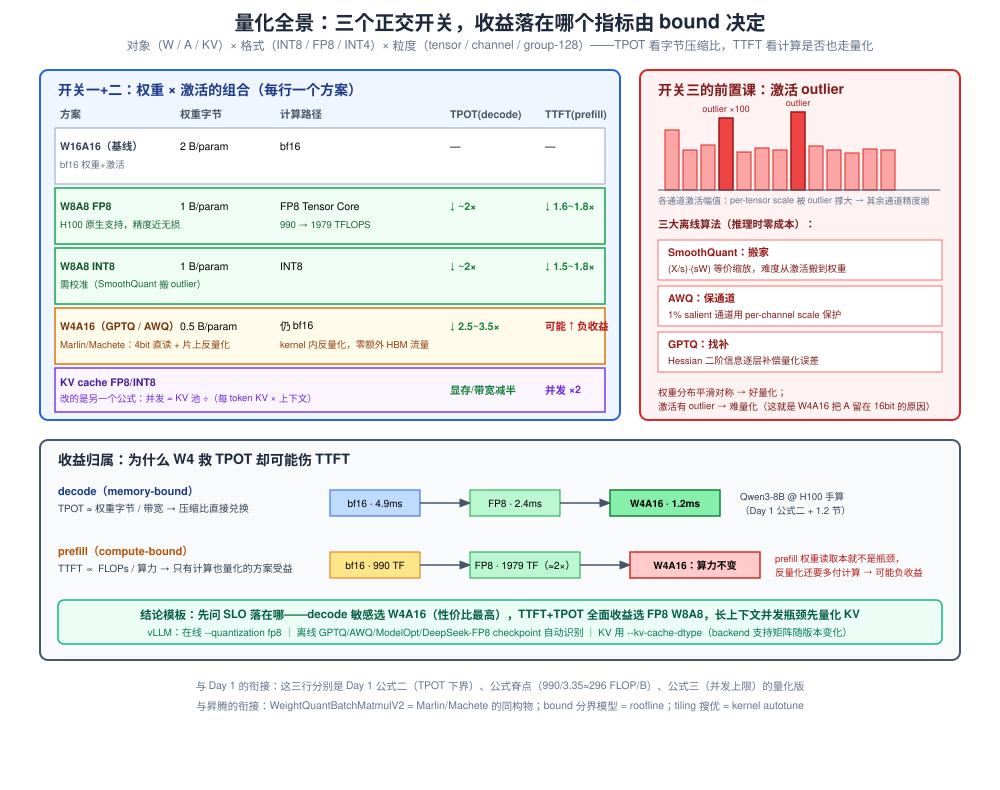
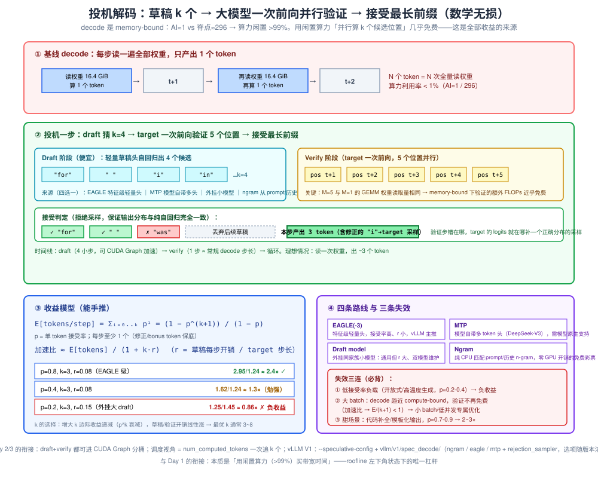
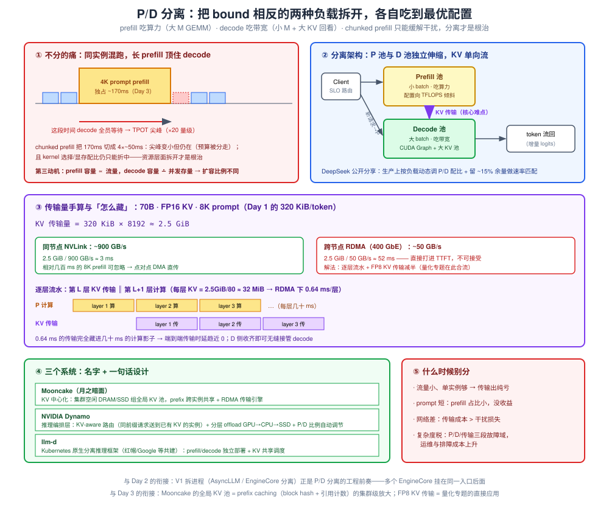
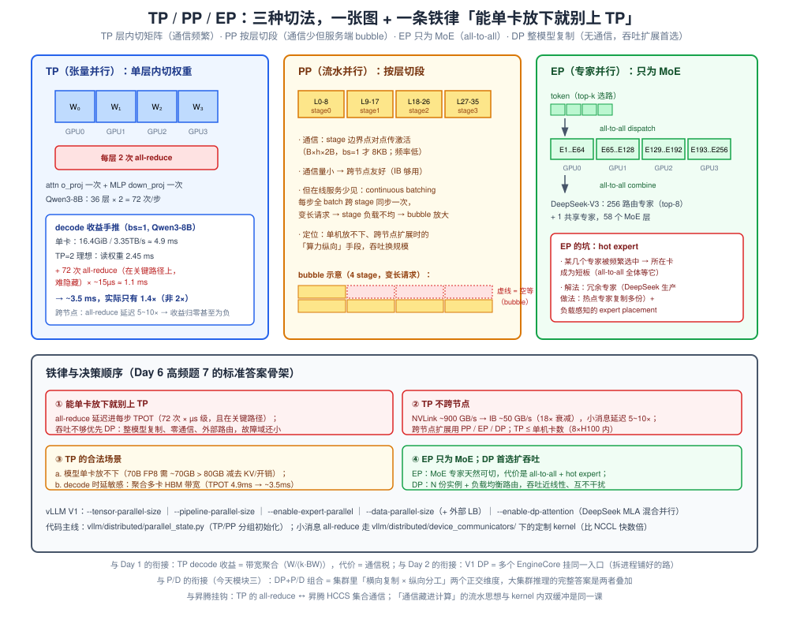

# Day 4 · 专题速通（只读不做）

> **总时长**：6-7 小时（量化 1.5h + 投机解码 1.5h + P/D 分离 2h + 分布式 1h + 卡片收尾 0.5h）
> **今日目标**：四个专题各出一页 A4 速查卡，全部达到 Day 3 的「四段式」表达水平（原理 → 解决什么 → trade-off → 什么时候失效）；量化专题额外产出一段 200 字「昇腾 ↔ GPU」对照叙述——这是你区别于其他候选人的王牌
> **产出物**：4 页 A4 专题速查卡（Day 7 面试作战包第 4 件）+ 一段背熟的昇腾对照叙述
> **冲刺周定位**：今天是「把前三天的基础兑现成专题话语权」的一天——量化的收益分析用 Day 1 的 roofline，投机解码的收益模型用 Day 1 的 decode 公式，P/D 分离的动机用 Day 1 的两阶段特性 + Day 3 的 chunked prefill，TP 的推导用 Day 1 的带宽公式。四个专题在底层是**同一套第一性原理的四个推论**（今日总结会回收这句话）。只读不做：唯一动手是纸面手算

---

## 作息建议

| 时间 | 内容 | 时长 |
|---|---|---|
| 09:00-11:00 | 模块一：量化（含昇腾对照叙述撰写与试讲） | 2h |
| 11:15-12:45 | 模块二：Speculative Decoding | 1.5h |
| 14:00-16:00 | 模块三：P/D 分离 | 2h |
| 16:15-17:15 | 模块四：分布式并行（概念级） | 1h |
| 19:30-20:30 | 阅读动线补漏 + 四页 A4 收尾 | 1h |

---

## 今日学习目标

- [ ] 量化：默写「对象 × 格式 × 粒度」三开关分类框架；按 bound 分层回答「量化对 TTFT 和 TPOT 分别什么影响」（Day 6 高频题 5 的标准素材）
- [ ] 量化：手算 Qwen3-8B 三种精度下的 TPOT 理论下界（bf16 / FP8 / W4A16），10 秒内说出 KV cache FP8 对并发的影响
- [ ] 量化：写出 200 字昇腾对照叙述（WeightQuantBatchMatmulV2 tiling 搜优 ↔ GPU 量化 GEMM bound 分析），试讲 3 遍不卡壳
- [ ] 投机解码：手推收益公式 E[tokens/step] = (1−p^(k+1))/(1−p)，并用两组数字算出「正收益 / 负收益」的分界
- [ ] P/D 分离：讲全「为什么分 / 怎么分 / 传输怎么藏 / 什么时候别分」四连；手算 8K prompt 的 KV 传输量在 NVLink 与 RDMA 下的传输时间
- [ ] 分布式：推 TP 对 decode 的收益与衰减（含 all-reduce 次数 × 延迟的数量级）；说出「能单卡放下就别上 TP」的三条理由
- [ ] 四页 A4 卡片完成，每页至少一个数字例子 + 一句昇腾挂钩

---

## 核心概念速览

| 概念 | 一句话定义 | 面试考法 |
|---|---|---|
| **W8A8 / W4A16 / FP8** | 权重-激活量化组合的记号（W=weight 位宽，A=activation 位宽） | 「量化对 TTFT/TPOT 分别什么影响」 |
| **量化粒度** | scale 参数共享的范围：per-tensor / per-channel / per-group(128) / block-wise(128×128) | 「为什么 group 更准、代价是什么」 |
| **Outlier 通道** | 激活中少数幅值大几个数量级的通道，是激活量化的头号敌人 | 「激活为什么比权重难量化」 |
| **SmoothQuant / AWQ / GPTQ** | 离线量化三大算法：难度搬移 / 通道保护 / Hessian 误差补偿 | 各一句话说清思想 |
| **KV cache 量化** | KV 以 FP8/INT8 存储，显存减半、并发翻倍 | 「收益与精度代价」（对接 Day 1 例题 3） |
| **Speculative decoding** | 便宜地猜 k 个 token，大模型一次前向并行验证，接受最长前缀——数学上无损 | 「为什么无损？什么时候负收益？」 |
| **接受率 p / 期望接受长度** | 单个草稿 token 被接受的概率 / 每步期望产出 token 数 | 收益公式手推（今日必考手算之二） |
| **MTP / EAGLE / draft model / ngram** | 四条草稿来源路线（自带多头 / 特征级轻量头 / 外挂小模型 / 纯 CPU 匹配） | 「各自优缺点、vLLM 里怎么开」 |
| **P/D 分离** | prefill 与 decode 拆到不同实例池，KV 从 P 传到 D | 「为什么分？传输怎么藏？什么时候别分」 |
| **逐层流水传输** | 第 L 层计算与第 L−1 层 KV 传输重叠，藏掉跨节点传输时延 | 「RDMA 下 52ms 怎么变不可见」 |
| **TP / PP / EP / DP** | 层内切矩阵 / 按层切段 / MoE 专家分散 / 整模型复制 | 「TP 通信开销」「什么时候负收益」 |
| **All-reduce** | TP 每层 2 次的梯度/激活汇聚通信，decode 小 batch 下是延迟瓶颈 | 「TP 为什么别跨节点」 |

---

## 使用说明：四段式今天继续用，但加一条「bound 归属」

Day 3 的四段式（原理 → 解决什么 → trade-off → 失效）今天原样适用。今天的专题再叠一层过滤：**每个优化先问「它改变的是字节还是 FLOPs」，收益就自动落到 TTFT 或 TPOT 上**——这是 Day 1 roofline 的直接应用，也是把四个专题串成一体的那根线：

| 优化 | 改变了什么 | 收益落在哪 |
|---|---|---|
| 量化 | 权重/KV 字节（部分方案还改算力） | TPOT 为主；计算也量化时 TTFT 才受益 |
| 投机解码 | 每步读一次权重换多个 token（算力换带宽） | TPOT / 单请求时延 |
| P/D 分离 | 两类 bound 相反的负载不再互相干扰 | TTFT 与 TPOT 同时改善（各有归属） |
| TP | 聚合多卡带宽（付通信税） | TPOT；但 all-reduce 延迟反噬 |

---

## 模块一：量化（2h，你的主场）

### 1.1 分类框架：三个正交的开关

量化方案= **对象 × 格式 × 粒度**，三个开关独立拨动：

```text
开关一（对象）：  权重 W        激活 A        KV cache     ← 三者独立
开关二（格式）：  INT8          FP8(e4m3/e5m2)  INT4     ← 决定精度与硬件支持
开关三（粒度）：  per-tensor    per-channel    per-group(128)   ← 越细越准，开销越大
```

**粒度的直觉**：scale 共享的参数越少，量化误差越小，但存储/反量化的元数据与计算越多。极端对比：per-tensor 只要 1 个 scale（kernel 最友好，但 outlier 一颗老鼠屎坏一锅粥）；DeepSeek 风格的 block-wise FP8（128×128 一组 scale）是「精度 ↔ 开销」的工程平衡点。

**格式的直觉**：FP8 的 e4m3（3 位尾数，精度优先，前向权重/激活常用）与 e5m2（2 位尾数，动态范围大，梯度场景常用）；INT8 线性量化对分布对称的权重友好，但激活的 outlier 让它必须配校准算法。

### 1.2 方案对比：W/A 矩阵（今日第一张必背表）

| 方案 | 权重 | 激活 | 权重字节 | 计算路径 | decode（TPOT） | prefill（TTFT） | 典型精度损失 |
|---|---|---|---|---|---|---|---|
| W16A16（基线） | bf16 | bf16 | 2 B/param | bf16 | — | — | — |
| **W8A8 FP8** | FP8 | FP8 | 1 B/param | **FP8 Tensor Core** | ↓ ~2× | **↓ 1.6~1.8×** | 极小（H100 原生支持） |
| **W8A8 INT8** | INT8 | INT8 | 1 B/param | INT8 | ↓ ~2× | ↓ 1.5~1.8× | 小（需校准：SmoothQuant） |
| **W4A16（GPTQ/AWQ）** | INT4 | bf16 | **0.5 B/param** | 仍 bf16（kernel 内反量化） | **↓ 2.5~3.5×** | **可能 ↑（负收益）** | 小~中（离线算法保护） |
| **KV cache FP8/INT8** | — | — | — | — | 显存减半 → **并发 ×2** | 命中率不变时不变 | 小（长上下文召回可见退化） |

三个关键结论（每个都能用手算支撑，见 1.3）：

1. **decode 收益 ∝ 字节压缩比**：memory-bound 下 TPOT ≈ 权重字节数 / 带宽（Day 1 公式二），W4 理想 4×、W8 理想 2×。GPU 上 W4A16 由 Marlin/Machete 这类 mixed-input kernel 承接：**4 bit 权重直读、片上反量化**，不产生额外 HBM 流量——这和你在昇腾上把反量化融进 WeightQuantBatchMatmulV2 是同一件事。
2. **prefill 收益要求「计算也走量化」**：compute-bound 下时延 ∝ FLOPs / 算力，只有 FP8/INT8 的计算路径受益（H100 bf16 990 TFLOPS → FP8 1979 TFLOPS，≈2×，实际 GEMM 部分 1.6~1.8×）。**W4A16 的 prefill 可能负收益**：权重读取本来就不是 prefill 瓶颈，反量化却要付计算。
3. **KV cache 量化改的是另一个公式**：并发上限 ≈ KV 池 /（每 token KV × 平均上下文）（Day 1 公式三）——KV 字节减半直接等价于并发翻倍，这是它和 W/A 量化最大的不同。

### 1.3 性能模型：把 Day 1 公式再念一遍（今日第二组手算）

**decode TPOT 下界 = 权重字节 / 带宽**，以 Qwen3-8B（W ≈ 16.4 GiB，Day 2 用过）@ H100（3.35 TB/s）：

$$\text{TPOT}_{bf16} = \frac{16.4\ \text{GiB}}{3.35\ \text{TB/s}} \approx 4.9\ \text{ms}$$

| 精度 | 权重字节 | TPOT 理论下界 | 备注 |
|---|---|---|---|
| bf16 | 16.4 GiB | 4.9 ms | Day 2 压测的基线 |
| W8A8 FP8 | 8.2 GiB | 2.4 ms | prefill 还享受 FP8 算力翻倍 |
| W4A16 | 4.1 GiB | **1.2 ms** | 理想 4×，实测 2.5~3.5×（反量化/kernel 效率折损） |

**KV cache 量化 → 并发翻倍**（Day 1 例题 3 的复算）：70B FP8 权重 @ 8×H100、128K 上下文，FP16 KV（320 KiB/token）撑 ~12 条并发；**KV 换 FP8（160 KiB/token）→ ~24 条**。同一套部署，什么都没加，并发 ×2——这是「KV 量化是长上下文刚需」的最强论据。

### 1.4 激活为什么难量化：outlier 与三大离线算法

**现象**：LLM 的激活中存在少数通道，幅值比其他通道大几个数量级（LLM.int8() 论文首先系统报告）。per-tensor 的 scale 被这些 outlier 撑大 → 其余通道全部挤进低精度格点 → 精度崩塌。权重分布平滑对称，所以**权重好量化、激活难量化**。

| 算法 | 一句话思想 | 记忆锚点 |
|---|---|---|
| **SmoothQuant** | 等价变换 $(X/s)(sW)$，把量化难度从激活**搬**到权重（权重平滑扛得住） | 「搬家」 |
| **AWQ** | 1% 的 salient 通道（按激活幅值挑）用 per-channel scale 保护，不做混合精度 | 「保通道」 |
| **GPTQ** | 逐层用 Hessian（二阶）信息做量化误差补偿，把误差摊到未量化权重上 | 「找补」 |

三者都是**离线**（部署前对权重做一次），推理时零额外成本——这是它们和在线校准（如部分 INT8 方案要跑校准集）的区别。

### 1.5 KV cache 量化的收益与精度代价

- **收益**（定量）：Qwen3-8B 每 token KV 144 KiB（bf16）→ FP8 后 72 KiB；同样 10 GiB 的 KV 池，容量从 ~7.1 万 token 翻到 ~14.2 万——要么并发 ×2，要么同并发支持 2× 上下文长度，**或省一半显存给更大的 batch**（Day 2 压测规律 2 的 KV 读取瓶颈也同步缓解：64 路 × 1280 token × 72 KiB ≈ 5.9 GiB，不再逼近权重读的量级）。
- **代价**（定性 + 一个量级）：FP8/INT8 的 KV 对常规任务近无损，但**长上下文召回类任务（大海捞针、多跳引用）可见退化**；位数再往下（4 bit KV，如 KIVI 类工作）掉点明显，需按任务评估。格式上 e4m3 精度更好、更常用，e5m2 动态范围更大。
- **vLLM V1 落地**：`--kv-cache-dtype`（`fp8` / `fp8_e5m2` / `fp8_e4m3` 等，**随 attention backend 支持矩阵变化，动手前查你版本的文档**）；权重侧与 KV 侧独立配置，「70B FP8 权重 + FP16 KV」这类组合完全合法（Day 1 的 dtype 陷阱反过来说明了两者无关）。

### 1.6 vLLM V1 的量化栈：从 checkpoint 到 kernel

代码主线（`vllm/model_executor/layers/quantization/`，V1 沿用这套层抽象）：

```text
checkpoint 的 config.json 带 quantization_config
  → QuantizationConfigRegistry 识别格式（fp8 / modelopt / compressed-tensors / gptq / awq …）
    → 对应 Config 类产出 LinearMethod
      → apply() 装载权重 + 选择 kernel：
           FP8   → fp8.py：per-tensor / per-channel / block-wise(128×128, DeepSeek 风格)
           GPTQ/AWQ → gptq.py / awq.py → Marlin/Machete mixed-input kernel（W4A16）
           W8A8 校准格式 → compressed_tensors.py
```

两条使用路径要分清（面试常混）：

1. **在线量化**：拿到 bf16 checkpoint，`vllm serve … --quantization fp8` 动态转（per-tensor scale，最快上手，精度略逊校准版）；
2. **离线量化 checkpoint**：GPTQ/AWQ/ModelOpt/DeepSeek-FP8 模型自带 `quantization_config`，vLLM 自动识别加载——**生产推荐**（离线算法保护 + 逐层校准）。

> **提示**：V1 对量化的支持矩阵（哪种格式 × 哪种 backend × 是否可与 speculative/CUDA Graph 叠加）仍在快速演进，**面试讲主线（识别 → LinearMethod → kernel 分发）即可，具体组合「以我部署时的版本文档为准」**——这句本身就是加分的工程习惯。

### 1.7 ⚡ 昇腾对照叙述（今天最重要的产出）

先建对照表（面试时按行现场翻译）：

| 你在昇腾做的 | GPU/vLLM 语境的对应物 | 共同本质 |
|---|---|---|
| WeightQuantBatchMatmulV2（量化矩阵乘+融合反量化） | Marlin/Machete（W4A16 mixed-input GEMM）、FP8 GEMM | 量化 kernel 的融合设计 |
| L2/HBM 带宽 vs Cube 算力的 **bound 分界模型** | roofline / 脊点 ≈ 296 FLOP/B（Day 1） | 同一套 bound 分析 |
| `CalRebalanceBlock` 搜优 baseM/baseN（balanceRate ≥ 0.9 剪枝） | kernel autotune / cutlass tile 配置搜索 | tiling 搜索方法论 |
| AL1/BL1 Full Load（搬运量 O(n·A) → O(A)） | SMEM/L2 复用、double buffer 流水 | 数据搬运最小化 |
| 85%+ 单核算力利用率 | kernel 效率 / 带宽利用率（memory-bound 下看 GB/s 达成率） | 同一个度量哲学 |

**200 字背熟版**（今天试讲 3 遍，明天 Day 5 写代码时再自然复述一次）：

> 「我在昇腾上做 WeightQuantBatchMatmulV2 的优化，本质问题和 GPU 量化 GEMM 完全同构：decode 场景 M 很小、访存 bound，所以我做 AL1/BL1 全载把权重搬运从 O(n·A) 降到 O(A)，并用基于 L2/HBM 带宽与 Cube 算力的 bound 分界模型搜最优 baseM/baseN，做到 85%+ 单核利用率。这套模型搬到 GPU 就是 roofline：W4A16 的 Marlin kernel、FP8 的算力翻倍、KV 量化的并发收益，我用同一套 bound 分析就能推出量级。区别只在硬件原语——昇腾是 Cube 指令加 L1 buffer，GPU 是 Tensor Core 加 SMEM。」

### 速记卡 1/4（誊抄到 A4，≤ 1 页）

```text
┌────────────────────────────────────────────────────┐
│ 【量化】三开关：对象(W/A/KV) × 格式 × 粒度          │
│ ① 原理：低精度存储/计算；scale 按粒度共享           │
│ ② 收益归属（bound 分层）：                          │
│    TPOT(memory-bound) ∝ 权重字节 → W4≈4×/W8≈2×      │
│    TTFT(compute-bound) 只有 W8A8/FP8 受益(990→1979) │
│    KV 量化 → 并发 ×2（Day 1 例题 3 复算）           │
│ ③ 难点：激活 outlier → SmoothQuant(搬)/AWQ(保)/     │
│    GPTQ(找补)，全离线、推理零成本                   │
│ ④ 失效：W4A16 的 prefill 可能负收益（算得慢还多干活）│
│    KV 4bit 长上下文召回掉点；在线 fp8 精度逊校准版   │
│ ⑤ 昇腾挂钩：WeightQuantBatchMatmulV2 的 bound 分界  │
│    模型 + tiling 搜优 ↔ roofline + kernel autotune  │
└────────────────────────────────────────────────────┘
```



---

## 模块二：Speculative Decoding（1.5h）

### 2.1 原理：decode 闲置的算力，是唯一可以「白嫖」的资源

Day 1 的 roofline 结论：decode 的算术强度 AI ≈ 1，H100 脊点 ≈ 296 FLOP/B——**算力利用率不足 1%**，瓶颈全在权重读取。既然一次前向只为了算 1 个 token 却要读全部 16.4 GiB 权重，那能不能一次多算几个位置？

投机解码的答案分三步：

1. **Draft（草稿）**：用便宜的方式猜出接下来 k 个 token——轻量草稿头自回归 k 步，或直接从 prompt/生成历史里匹配 n-gram；
2. **Verify（验证）**：把 k 个草稿拼上当前 token，**一次前向同时算 k+1 个位置的 logits**。关键在于：M=k+1 与 M=1 的 GEMM 权重读取量相同，memory-bound 下这些额外 FLOPs **近乎免费**；
3. **Accept（接受）**：从左到右比对草稿与 target 分布，接受最长一致前缀；第一个不一致的位置由 target 的 logits **修正采样**出一个 token 补上。

**无损性**（必答）：验证用的是**拒绝采样**（rejection sampling）——接受/修正的概率构造恰好使最终输出分布与原始自回归**完全一致**（Leviathan et al. 2023 / Chen et al. 2023 证明）。这是「投机」二字唯一不投机的地方。

### 2.2 收益模型（今日第三组手算，3 分钟内推完）

设单 token 接受率为 p（i.i.d. 近似），草稿数 k，每步至少产出 1 个 token（保底的修正/bonus token）：

$$E[\text{tokens/step}] = \sum_{i=0}^{k} p^i = \frac{1-p^{k+1}}{1-p}$$

设草稿每步开销是 target 步长的 r 倍（EAGLE 类 r≈0.05~0.1；外挂小模型 r≈0.2~0.3）：

$$\text{加速比} \approx \frac{E[\text{tokens/step}]}{1 + k \cdot r}$$

| 场景 | p | k | r | E[tokens] | 加速比 | 结论 |
|---|---|---|---|---|---|---|
| 代码补全（甜场景） | 0.8 | 3 | 0.08 | (1−0.41)/0.2 ≈ 2.95 | 2.95/1.24 ≈ **2.4×** | 大赚 |
| 一般对话 | 0.4 | 3 | 0.08 | (1−0.026)/0.6 ≈ 1.62 | 1.62/1.24 ≈ 1.3× | 勉强回本 |
| 开放式/高温度 | 0.2 | 3 | 0.15 | ≈ 1.25 | 1.25/1.45 ≈ **0.86×** | **负收益** |

三个推论（面试加分点）：

- **k 不是越大越好**：接受 p^i 概率衰减，边际收益递减；草稿/验证开销却线性涨 → 最优 k 通常 3~8；
- **大 batch 下加速比封顶 E/(k+1) < 1**：batch 大了 decode 趋近 compute-bound（Day 2 压测规律 2 的延伸），验证 k+1 个 token 的算力变成真实开销——**投机解码是小 batch / 低并发 / 时延敏感场景的专属优化**；
- **吞吐视角相反**：追求吞吐（大 batch）时投机解码常常掉吞吐——用「我的 SLO 是时延还是吞吐」来组织答案，天然体现 trade-off 意识。

### 2.3 四条草稿路线（第三张必背表）

| 路线 | 草稿来源 | r | 接受率 | 优缺点一句话 |
|---|---|---|---|---|
| **Draft model** | 外挂同家族小模型（7B 给 70B 打草稿） | 大（0.2~0.3） | 中 | 经典通用；双模型显存/版本维护、加载慢 |
| **MTP** | 模型自带多 token 预测头（DeepSeek-V3 风格） | 小 | 高 | 训练时就为投机优化；**需要模型原生支持** |
| **EAGLE / EAGLE-3** | 特征级轻量草稿头，复用 target 的 hidden states | 小（0.05~0.1） | 高 | 接受率/开销比最好，vLLM 主推路线 |
| **Ngram** | 纯 CPU 从 prompt/生成历史匹配 n-gram | ≈0 | 场景依赖 | **零 GPU 开销的免费彩票**：代码/RAG/长文档引用场景常 1.2~1.8× |

EAGLE 的关键洞察（和 MTP 的区别）：草稿在**特征层**（hidden state）而不是 token 层预测——target 算过的特征直接喂给草稿头，草稿不需要自己完整「理解」上文，所以又轻又准。

### 2.4 vLLM V1 落地

```bash
vllm serve Qwen/Qwen3-8B \
  --speculative-config '{"method": "ngram", "num_speculative_tokens": 3}'
```

代码主线（`vllm/v1/spec_decode/`，V1 原生实现）：

```text
proposer 产出 k 个草稿（ngram.py / eagle.py / mtp.py 各是一条路线）
  → 草稿拼进下一步的输入，target 一次前向出 k+1 位置 logits
    → rejection_sampler.py 验证接受，产出本步 tokens + 下一轮草稿起点
```

与前几天知识的挂钩（面试串讲就用这两句）：

- **调度视角**：Day 2/3 反复用的「`num_computed_tokens` 追赶 `num_tokens`」视角下，投机解码让追赶**一次前进 k 个**——被接受的草稿在 scheduler 账本上就是「已计算完成」的 token；
- **执行视角**：draft 自回归与 verify 都是固定形状的 decode 形前向，**天然吃 Day 3 的 CUDA Graph 分桶**——这也是 V1 里投机解码能压低 r 的工程原因。

> **提示**：`--speculative-config` 的 method 选项（ngram / eagle / eagle3 / mtp / medusa…）与各模型的头格式支持矩阵**随版本快速演进**，面试讲主线（proposer → 验证 → rejection sampler）+「具体支持以版本文档为准」即可。

### 速记卡 2/4

```text
┌────────────────────────────────────────────────────┐
│ 【投机解码】猜 k 个 → 一次前向验证 → 接受最长前缀    │
│ ① 原理：decode AI≈1 vs 脊点 296，算力闲置 >99% →    │
│    验证 k+1 个位置的额外 FLOPs 近乎免费（无损：拒绝  │
│    采样保证分布一致）                                │
│ ② 公式：E = (1−p^(k+1))/(1−p)；加速 = E/(1+k·r)     │
│    数字：p=0.8/k=3/r=0.08 → 2.4×；p=0.2/r=0.15 →    │
│    0.86× 负收益                                      │
│ ③ 路线：EAGLE-3（主推）/ MTP（DeepSeek 自带头）/     │
│    draft model（外挂）/ ngram（免费彩票）            │
│ ④ 失效：低接受率（开放式生成）、大 batch（验证不再    │
│    免费，封顶 E/(k+1)<1）、大 r（外挂大草稿）        │
│ ⑤ 昇腾挂钩：bound 分析告诉我哪些 FLOPs 免费——和     │
│    tiling 搜优判断「计算藏进访存」是同一个模型       │
└────────────────────────────────────────────────────┘
```



---

## 模块三：P/D 分离（2h，专家岗区分度最高）

### 3.1 为什么分：三条动机（每条都挂前三天知识）

1. **硬件特性相反**（Day 1 的直接推论）：prefill 是大 M GEMM、吃算力（希望卡配置向 TFLOPS 倾斜）；decode 是小 M、吃带宽（希望向 HBM/利用率倾斜）。同实例混跑，kernel 选择、batch 组织、显存配比只能取折中——**两头都不是最优**。
2. **SLO 互相干扰**：一个 4K prompt 的 prefill 顶住 running batch，decode 饿一步就是一次 TPOT 尖峰（Day 3 模块二算过 170ms 尖峰 vs 50ms 平稳）。**chunked prefill 只能缓解（把尖峰切小），不能根除**（预算终究被 prefill 分走、每步仍有干扰）；资源层面拆开才是根治。
3. **伸缩粒度不同**：prefill 容量 ∝ prompt 到达速率（流量型），decode 容量 ∸ 并发存量（在线连接数）——两者随业务增长的扩容比例不同，**分离后才能独立配比**。DeepSeek 官方公开分享过其生产做法：按负载动态调整 P/D 实例配比，并留 ~15% 余量做速率匹配（数字以分享原文为准）。

### 3.2 传输量手算（今日第四组手算，白板友好）

分离的核心代价是 **KV 从 P 搬到 D**。以 70B、FP16 KV、8K prompt 为例（Day 1 的 320 KiB/token）：

$$\text{KV 传输量} = 320\ \text{KiB/token} \times 8192 \approx 2.5\ \text{GiB}$$

| 介质 | 带宽（量级） | 传输 2.5 GiB | 结论 |
|---|---|---|---|
| 同节点 NVLink | ~900 GB/s | **≈ 3 ms** | 相对几百 ms 的 8K prefill 可忽略 |
| 跨节点 RDMA（400 GbE） | ~50 GB/s | **≈ 52 ms** | 必须流水隐藏，否则直接打进 TTFT |

**逐层流水（传输怎么藏，必答）**：P 实例算完第 L 层就立刻传第 L 层的 KV，与第 L+1 层的计算**重叠**：

- 每层 KV = 2.5 GiB / 80 层 ≈ 32 MiB → RDMA 下每层传输 ≈ 0.64 ms；
- 8K prefill 每层计算在几十 ms 量级 → 0.64 ms 完全藏进计算影子，**端到端传输时延趋近于零**；
- 进一步压缩：KV 用 FP8 传（1.25 GiB）直接减半——量化专题与 P/D 在这里合流。

### 3.3 两种形态

| 形态 | KV 介质 | 量级 | 适用 |
|---|---|---|---|
| **同节点分离** | NVLink 点对点 DMA（甚至共享内存） | µs~ms | 单机 8 卡内划分 P/D 角色，如「6 卡 prefill + 2 卡 decode」 |
| **跨节点分离** | RDMA/IB（常多网卡聚合） | ms 级（须流水） | 大集群 P 池与 D 池独立伸缩，配比随流量调度 |

### 3.4 三个系统（名字 + 一句话设计，面试点到即止）

| 系统 | 一句话设计 | 记忆锚点 |
|---|---|---|
| **Mooncake**（月之暗面） | KV-cache 中心化：把集群空闲 DRAM/SSD 组成**全局 KV 池**，prefix cache 跨实例共享 + RDMA 传输引擎 | 「KV 池」——Day 3 prefix caching 的集群放大版 |
| **NVIDIA Dynamo** | 推理编排层：**KV-aware 路由**（同前缀请求路由到已有 KV 的实例）+ 分层 offload（GPU→CPU→SSD）+ P/D 比例自动调节 | 「路由也懂 KV」 |
| **llm-d** | Kubernetes 原生分离式推理框架（红帽/Google 等共建）：prefill/decode 独立部署 + KV cache 共享调度 | 「云原生」 |

> 另注：vLLM 生态在 2025 年快速跟进——官方生产栈博客给出 P/D 分离部署指南，仓库内也有研究预览线；面试提「vLLM 正在原生支持，当前生产多经由 Mooncake/Dynamo 等外部栈」即可，**别报具体目录名，版本演进太快**。

### 3.5 什么时候别分（高频题 6 的素材）

- **流量小、单实例够用**：引入传输与路由开销纯亏；
- **prompt 短**：prefill 占比小、KV 传输量小，分离的收益覆盖不了固定成本；
- **网络差**：跨节点传输成本超过干扰损失——**先测网络再上架构**；
- 加一条系统观：分离后**故障域变大**（P、D、传输三段都可能成为单独的瓶颈/单点），运维复杂度上升——「架构升级换 SLO，也要付复杂度税」。

### 速记卡 3/4

```text
┌────────────────────────────────────────────────────┐
│ 【P/D 分离】prefill 与 decode 拆到不同实例池        │
│ ① 为什么分：bound 相反（Day 1）/ SLO 干扰（Day 3    │
│    chunked prefill 只缓解不根除）/ 伸缩粒度不同      │
│ ② 传输手算：70B 8K prompt KV = 320KiB×8192 ≈ 2.5GiB │
│    NVLink 900GB/s → 3ms 可忽略；RDMA 50GB/s → 52ms  │
│    → 逐层流水：每层 32MiB→0.64ms，藏进几十ms 计算    │
│ ③ 系统三名字：Mooncake(全局KV池) / Dynamo(KV-aware  │
│    路由+分层offload) / llm-d(K8s原生)               │
│ ④ 别分：小流量 / 短 prompt / 差网络 + 复杂度税       │
│ ⑤ 昇腾挂钩：P/D 本质是把我做过的「异构流水线」       │
│    思想升维到集群层——每段按自己的 bound 配资源       │
└────────────────────────────────────────────────────┘
```



---

## 模块四：分布式并行（1h，概念级）

### 4.1 三种切法 + 一个免通信选项（第四张必背表）

| 并行 | 切什么 | 通信 | 频率 | 什么时候用 |
|---|---|---|---|---|
| **TP**（张量并行） | 单层内切权重（attention 头 / FFN 矩阵按列/行切） | 每层 2 次 **all-reduce**（o_proj 后 + down_proj 后） | 每步每层都通信 | 单卡放不下；decode 时延敏感（聚合多卡 HBM 带宽） |
| **PP**（流水并行） | 按层切段（36 层切 4 段 × 9 层） | stage 边界**点对点**传激活 | 每 stage 边界 1 次 | 跨节点扩展大模型（通信量小、频率低，IB 够用） |
| **EP**（专家并行） | MoE 的 expert 切到不同卡 | 每 MoE 层 2 次 **all-to-all**（dispatch + combine） | 每 MoE 层 | MoE 模型（DeepSeek-V3：256 路由专家 top-8 + 1 共享） |
| **DP**（数据并行） | 什么都不切，整模型复制 N 份 | **无**（外部路由即可） | — | **吞吐扩展首选**：N 份实例近线性吞吐、互不干扰 |

### 4.2 TP 对 decode 的收益与衰减（手推，高频题 7 的完整答案）

**收益**：k 卡 TP → 每卡权重 1/k → TPOT ≈ W/(k·BW)（Day 1 公式二换分母）。Qwen3-8B bs=1：单卡 4.9ms → TP=2 理想 2.45ms。

**衰减一（小 batch 的通信税）**：decode bs=1 时每次 all-reduce 的数据只有 B×h×2B ≈ 8KB——**纯延迟问题不是带宽问题**。而 all-reduce 在关键路径上（输出必须汇聚才能进下一层，藏不完全）。数量级：

$$\text{通信开销} = \underbrace{36\ \text{层} \times 2}_{\text{all-reduce 次数/步}} \times \underbrace{10\text{~}30\ \mu s}_{\text{每次}} \approx 0.7\text{~}2\ \text{ms}$$

所以 TP=2 实际 ≈ 2.45 + ~1.1 = **3.5ms，只有 1.4×**（不是理想 2×）。vLLM 专门做了小消息定制 all-reduce kernel（`vllm/distributed/device_communicators/` 下，one-shot/two-shot，比 NCCL 快数倍）——**框架作者也在跟这 1ms 较劲**，这是把「TP 有通信开销」从口号落到数字的最好证据。

**衰减二（大 batch）**：decode 趋近 compute-bound（Day 2 规律 2），TP 的收益从「带宽聚合」退化为「算力均分」，而 all-reduce 数据量 ∝ B 上涨——边际收益持续递减。

**衰减三（跨节点）**：NVLink ~900 GB/s → 跨节点 IB ~50 GB/s（**18×** 衰减），小消息延迟也涨 5~10×；72 次 × 100µs 级 = 7ms+，**比整个 decode 步还长** → TP 跨节点基本负收益。结论：**TP ≤ 单机卡数**（8×H100 内），跨节点用 PP/EP/DP。

### 4.3 「能单卡放下就别上 TP」——三条理由

1. **通信税进 TPOT**：上面那 0.7~2ms 加在每一步上，还带方差（p99 恶化）；
2. **DP 扩吞吐更干净**：单卡放得下时，要吞吐就复制实例（V1 的 DP 就是多个 EngineCore 挂同一入口——Day 2 拆进程铺好的路）；零通信、故障域小、可以配 P/D（模块三）；
3. **工程简单度**：TP=1 不用改 kernel 分片逻辑，CUDA Graph 桶更小、调度更简单。

**TP 的两个合法场景**（别说死）：a. 单卡真的放不下（70B FP8 权重 ~70GB，80GB 卡扣掉 KV/开销放不下）；b. decode 时延敏感，愿意用通信税换带宽聚合。

**PP 为什么在线服务少见**：continuous batching 每步全 batch 跨 stage 同步一次，请求变长 → stage 间负载不均 → bubble 放大；PP 的主场是跨节点扩展超大模型（通信量小）和训练。

**EP 的坑**：hot expert（个别专家被频繁选中 → 所在卡成短板，all-to-all 全体等它）→ DeepSeek 生产做法是**冗余专家**（热点专家复制多份）+ 负载感知的 expert placement。

### 4.4 vLLM V1 落地（flag 层面，概念级即可）

```bash
--tensor-parallel-size 2        # TP
--pipeline-parallel-size 2      # PP（V1 已支持）
--enable-expert-parallel        # EP（MoE）
--data-parallel-size 2          # DP：N 份 EngineCore + 外部负载均衡
--enable-dp-attention           # DeepSeek MLA 的 DP attention + EP 混合（知道名字即可）
```

代码主线一句话：`vllm/distributed/parallel_state.py` 负责 TP/PP/DP 分组初始化（`initialize_model_parallel`），各 rank 按分组走集合通信；小消息走定制 all-reduce、大消息回退 NCCL。

### 速记卡 4/4

```text
┌────────────────────────────────────────────────────┐
│ 【分布式】TP / PP / EP / DP 四选项                  │
│ ① TP：层内切权重；每层 2 次 all-reduce；decode 收益  │
│    = W/(k·BW) − 通信税（36层×2×10~30µs ≈ 0.7~2ms）  │
│    手推：4.9ms → TP2 理想 2.45 → 实际 ~3.5ms=1.4×  │
│ ② PP：按层切段，通信小频率低 → 跨节点友好；在线少见  │
│    （每步跨 stage 同步 + 变长 → bubble）            │
│ ③ EP：MoE 专属，all-to-all ×2/层；坑=hot expert →   │
│    冗余专家（DeepSeek 生产做法）                    │
│ ④ 铁律：能单卡别 TP；TP 不跨节点（900→50GB/s=18×）；│
│    吞吐优先 DP+路由；大集群=DP×P/D 两个正交维度     │
│ ⑤ 昇腾挂钩：HCCS 集合通信 ↔ NVLink all-reduce；     │
│    通信藏进计算的流水 = kernel 双缓冲同一课          │
└────────────────────────────────────────────────────┘
```



---

## 今日「实验」：只读日，用阅读动线替代（晚上 19:30-20:30）

不跑任何服务。每个专题按「本文学完 → 推荐材料验证细节」的顺序补漏，**单篇材料 ≤ 30 分钟**，读前先写下「我要从它这里拿走的 1~2 个点」：

| 专题 | 材料（读什么） | 只拿走什么 |
|---|---|---|
| 量化 | vLLM 官方文档 Quantization 页（支持矩阵）；GPTQ / AWQ / SmoothQuant 论文**只读摘要与首图** | 支持格式的现状；三个算法各一句原文表述 |
| 投机解码 | Leviathan et al. 2023 的算法描述与无损性定理（§3）；EAGLE-3 博客；DeepSeek-V3 技术报告 MTP 小节 | 拒绝采样的接受条件原文；EAGLE 特征级草稿的一句话；MTP 的结构图 |
| P/D 分离 | DistServe 或 Mooncake 论文 §1~§3（动机 + 架构图）；NVIDIA Dynamo 官方博客 | 「为什么要分」的论文级论证一份；KV-aware 路由的官方表述 |
| 分布式 | 不读论文。vLLM 官方 distributed serving 文档 + 把 4.2 的手推重做一遍 | flag 与适用场景；手推能默写 |

> **纪律**：任何材料读到 30 分钟还没拿到预设的「1~2 个点」就放弃——今天是速通，不是精读。材料具体版本以你能搜到的最新版为准，**教程里标注的数值（带宽、TFLOPS、微秒级延迟）是量级锚点，面试讲量级即可**。

---

## 今日产出：4 页 A4 专题速查卡

四张速记卡（上文各模块末尾）就是标准答案，誊抄时每页遵守统一版式：

```text
顶部：一句定义 → 中部：对比表/公式 + 数字例子 →
底部：失效场景 + 「昇腾挂钩句」
```

- 每页必须带的数字：**量化** → TPOT 4.9/2.4/1.2ms + KV 并发 ×2；**投机** → 2.4× / 0.86× 收益分界；**P/D** → 2.5GiB / 3ms / 52ms / 0.64ms 每层；**分布式** → 1.4× 手推 + 18× 跨节点衰减。
- 量化页右上角手写抄录 200 字对照叙述——明天 Day 5 写 mini 调度器前再念一遍。

---

## 面试高频问题（今天范围，练到 3 分钟内答完）

| # | 问题 | 答题要点 |
|---|---|---|
| 1 | 量化对 TTFT 和 TPOT 分别什么影响？ | **按 bound 分层**：TPOT(memory-bound) ∝ 权重字节 → W4≈4×/W8≈2×（Marlin 片上反量化不占 HBM）；TTFT(compute-bound) 只有 W8A8/FP8 受益（990→1979 TFLOPS）；W4A16 的 prefill 可能负收益（反量化多付计算却省不动瓶颈）。最后一句挂 SLO：「decode 敏感选 W4A16，全面收益选 FP8」 |
| 2 | 激活为什么比权重难量化？怎么解决？ | Outlier 通道（幅值差几个数量级）撑爆 per-tensor scale；SmoothQuant（搬）/AWQ（保 1% salient 通道）/GPTQ（Hessian 找补），全离线零推理成本 |
| 3 | KV cache 量化的收益与代价？ | 收益：每 token KV 减半 → 并发 ×2（Day 1 例题 3：12→24 条）或同并发上下文 ×2；代价：长上下文召回可见退化，e4m3/e5m2 按场景选；vLLM `--kv-cache-dtype` |
| 4 | 昇腾量化算子经验和 GPU 推理优化有什么关系？ | **今天的主打题**：200 字对照叙述（1.7 节）——bound 分界模型 = roofline，tiling 搜优 = autotune，L1 全载 = SMEM 复用，融合反量化 = Marlin |
| 5 | 投机解码为什么无损？收益怎么估？ | 拒绝采样构造使输出分布与自回归完全一致；E=(1−p^(k+1))/(1−p)，加速 ≈ E/(1+kr)；数字例 p=0.8→2.4×、p=0.2→0.86× |
| 6 | P/D 分离什么时候不值得做？ | 小流量（传输出纯亏）/ 短 prompt（prefill 占比小）/ 差网络（52ms 直接打进 TTFT）+ 复杂度税；先测干扰损失再决定 |
| 7 | TP 什么时候是负收益？ | 跨节点（带宽 18× 衰减 + 延迟 5~10×，7ms 通信 > 整步）；单卡放得下却要吞吐（DP 更优）；大 batch compute-bound 时边际收益趋零而通信随 B 涨 |
| 8 | 跨节点部署 70B，TP/PP/EP/DP 怎么选？ | 节点内 TP≤8 放下权重；跨节点优先 DP 复制（吞吐）或 PP（放不下时）；MoE 用 EP；要 SLO 分级再叠 P/D——「横向复制 × 纵向分工」 |

---

## 今日总结

- **一个统一视角（比四个专题本身值钱）**：四个专题全是 Day 1 第一性原理的推论——**量化**改公式二的分子（字节）与公式脊点（算力）；**投机解码**在 roofline 左下角用闲置算力买带宽时间；**P/D 分离**把 bound 相反的负载拆开各自站到自己的脊点附近；**TP** 聚合分母里的带宽、但付通信税。面试任何专题题，最后都能回收这句
- **五组必背数字**：TPOT 4.9/2.4/1.2ms（量化三档）；KV 320→160KiB 并发 ×2；投机 2.4×/0.86× 分界；P/D 2.5GiB→3ms(NVLink)/52ms(RDMA)/0.64ms(每层流水)；TP 手推 1.4× + 跨节点 18× 衰减
- **四个失效场景**（区分度最高）：W4A16 对 prefill、低接受率/大 batch 对投机、小流量/短 prompt/差网络对 P/D、跨节点/能单卡对 TP
- **一条个人主线**：每个专题的第五栏都有一句昇腾挂钩——这不是巧合，是刻意把「我在另一个硬件上做过同构问题」练成条件反射。明天 Day 5 动手写 mini 调度器时，开场白就用量化页的对照叙述
- **诚实边界**：框架支持矩阵（量化格式 × backend、spec method、P/D 原生化进度）演进很快——讲主线和原理，具体版本细节答「以我部署时的版本文档为准」，**这本身是加分的工程习惯**

---

## 今日自测题（答不上回对应模块）

1. W4A16 的模型，prefill 为什么可能比 bf16 还慢？（→ 模块一：compute-bound 下权重读取不是瓶颈；kernel 内反量化多付计算、算力路径没变）
2. 70B @ 8×H100、128K 上下文，KV 从 FP16 换 FP8，并发上限怎么变？（→ 模块一：320→160 KiB/token，Day 1 例题 3 的 12 条 → ~24 条）
3. p=0.6、k=4、r=0.1，投机解码加速比多少？p 降到多少就快转负了？（→ 模块二：E=(1−0.6⁵)/0.4=(1−0.078)/0.4≈2.3；加速=2.3/1.4≈1.65×；p≈0.2 时 E≈1.25、分母 1.45 → <1）
4. 为什么 ngram 投机解码几乎「稳赚不赔」？它最可能在哪类负载大赚？（→ 模块二：r≈0 零 GPU 开销，p 再低损失也小；代码补全/RAG 引用/长文档复述）
5. 跨节点 RDMA 传 8K prompt 的 KV 要 52ms，说一遍它是怎么被藏到接近 0 的？（→ 模块三：逐层流水，每层 32MiB→0.64ms，藏进几十 ms 的逐层计算）
6. Qwen3-8B（36 层）TP=2、bs=1：理想加速 2×，实际大约多少、差在哪？（→ 模块四：72 次 all-reduce × ~15µs ≈ 1.1ms 在关键路径上；2.45+1.1≈3.5ms → 1.4×）

---

## 今日产出物

1. **4 页 A4 专题速查卡**（誊抄版，每页：定义 + 表/公式 + 数字例子 + 失效 + 昇腾挂钩）——Day 7 作战包第 4 件
2. **200 字昇腾对照叙述**（写在量化页右上角，试讲 3 遍的录音/计时记录）
3. **阅读动线笔记**：每个专题从推荐材料拿走的 1~2 个点（一两行即可）

### Day 4 收工自检清单（全绿才算完成）

- [ ] 量化：不看资料画出三开关分类和 W/A 矩阵表，按 bound 分层答「TTFT vs TPOT 影响」
- [ ] 量化：三档 TPOT 手算（4.9/2.4/1.2ms）10 秒内说出；KV 量化并发翻倍能现场推
- [ ] 量化：200 字对照叙述脱稿讲完，不打磕巴
- [ ] 投机解码：收益公式两组数字（2.4×/0.86×）能现场算出；三条失效 + 封顶 E/(k+1) 逻辑说全
- [ ] P/D 分离：「为什么分/怎么分/传输怎么藏/什么时候别分」四连 90 秒讲完，含 2.5GiB/3ms/52ms 数字
- [ ] 分布式：TP 手推（1.4× 那个）+ 三条铁律（别单卡能放下上 TP / TP 不跨节点 / 吞吐优先 DP）
- [ ] 四页 A4 完成，每页数字例子和昇腾挂钩齐全

**未完成项不许带入 Day 5**。明天 Day 5 二选一动手：推荐选项是 150~300 行 mini 调度器（固定 block KV 池 + block table + 引用计数 + iteration 级 continuous batching）——今天的 P/D 和投机概念明天不写代码，但写调度器时每实现一个函数，都问一句「vLLM 在这里比我多处理了什么」（你今天已经知道答案的一半：投机解码让 num_computed_tokens 一次追 k 个、P/D 分离让池子跨实例流动）。
