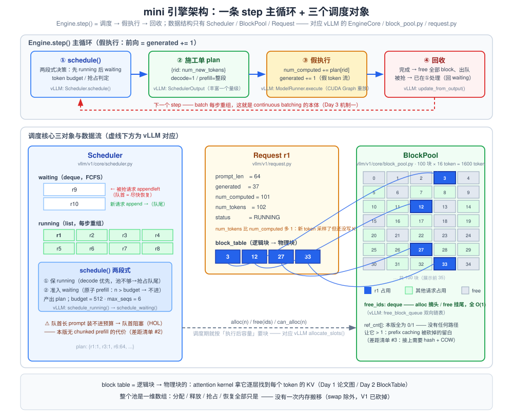
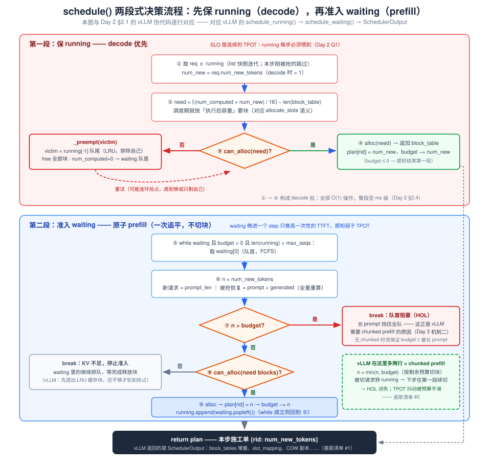
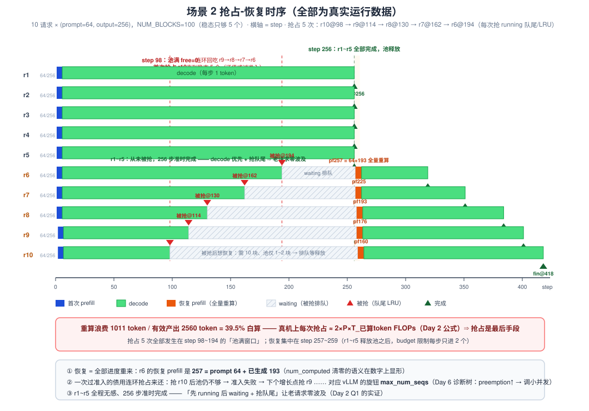

# Day 5 · 动手日——mini 调度器（选项 1）/ vllm-ascend 导读（选项 2）

> **总时长**：6-7 小时（只做一个选项，默认选项 1）
> **今日目标**：亲手写出「block 池 + 引用计数 + block table + 两段式调度 + 重算式抢占」的最小闭环（核心约 190 行），跑出三个演示场景的**真实数字**；对照出一份「我与 vLLM 的差距」清单——把「我读过 scheduler.py」升级成「我写过它的骨架」
> **产出物**：可运行的 `mini_vllm_scheduler.py` + 三个场景的数据表与日志 + 差距清单（Day 7 作战包第 5 件）；选项 2 产出《vLLM 硬件后端接入指南》一页
> **冲刺周定位**：Day 1 的公式、Day 2 的两个源码文件、Day 3 的四个机制，今天全部要**在自己手里再发生一遍**。本周前四天都是「读」，今天是唯一以「写」为主的一天——写完之后，Day 6 白板四件套的每一笔都有肌肉记忆，面试里任何调度问题你都能以「我写过一个最小实现」开场

---

## 作息建议（选项 1）

| 时间 | 内容 | 时长 |
|---|---|---|
| 09:00-10:30 | 模块一：架构 + 数据结构（BlockPool / Request / 容量手算） | 1.5h |
| 10:45-12:30 | 模块二：schedule() 两段式 + 抢占 + 不变量检查 | 1.75h |
| 14:00-16:00 | 模块三：三个演示场景 + 日志解读 | 2h |
| 16:15-17:00 | 模块四：差距清单 + 白板讲法演练 | 0.75h |

选项 2 的时间表：阅读路线四步各约 45min + 《接入指南》撰写 1h + 白板试讲 0.5h（见模块五）。

---

## 今日学习目标

- [ ] 实现固定 block 的 KV 池：`alloc / free / can_alloc` + 引用计数，分配释放全 O(1)
- [ ] 把 Day 3 的统一视角写进代码：`num_computed_tokens` 追赶 `num_tokens`——prefill / decode 在调度器里只是 `num_new_tokens` 的大小之分
- [ ] 实现两段式 `schedule()`：先保 running（decode 优先）再准入 waiting（原子 prefill），并用**不变量 assert** 证明自己写对了
- [ ] 实现重算式抢占：触发条件、受害者选择（running 队尾 / LRU）、放回 waiting 队首、恢复时全量重算
- [ ] 跑出并解读三个场景的真实数字：CB vs static（利用率 **65.3% vs 40.5%**）、抢占-恢复（重算浪费 **39.5%**）、碎片上界（**15 = BLOCK_SIZE−1**）
- [ ] 写出至少 5 条「vLLM 在 X 处比这复杂得多，因为……」
- [ ] （选项 2）整理《vLLM 硬件后端接入指南》一页

---

## 核心概念速览

| 概念 | 一句话定义 | 面试考法 |
|---|---|---|
| **BlockPool** | 固定数量物理块 + free 队列 + 引用计数 | 「分配/释放为什么能全 O(1)」 |
| **block table** | 每请求一张表：逻辑块号 → 物理块号（间接寻址） | 「attention kernel 怎么找到 KV」 |
| **两段式调度** | 每 step 先处理 running（decode）再准入 waiting（prefill） | 「为什么 decode 优先」（Day 2 Q1） |
| **重算式抢占** | 池不够时抢 running 队尾：free 全部块、清 `num_computed`、回 waiting 队首 | 「挑谁？去哪？代价多大？」（Day 2 Q2） |
| **不变量（invariant）** | 块数守恒 / 容量覆盖 / 无重复分配，每步 assert | 「你怎么验证调度器是对的」 |
| **假执行器** | 前向替换为 `generated += 1`，调度行为完全真实 | 「你的实验验证了什么、没验证什么」 |
| **Head-of-line blocking** | 原子 prefill 下，队首长 prompt 挡住后面所有请求 | 「为什么需要 chunked prefill」（Day 3 机制二） |

---

## 模块零：动手前 10 分钟——砍什么、留什么

**留下的**（本周面试主战场的骨架，一件不少）：

1. 固定 block 的 KV 池 + 引用计数 + block table —— Day 1 论文图的代码版，Day 2 的 `block_pool.py`
2. iteration 级 continuous batching —— Day 3 机制一
3. 两段式调度 + token budget —— Day 2 `schedule()` 伪代码的逐行对应
4. 重算式抢占 —— Day 2 Q2 的可运行版本
5. 不变量检查 —— 面试答「你怎么知道代码是对的」的标准答案

**砍掉的**（每刀都记进模块四的差距清单，届时逐条还）：

| # | 砍掉的 | 简化成 | 副作用（反而是教学素材） |
|---|---|---|---|
| 1 | 真模型 / 采样 | `generated += 1` 的假 token 流 | 所有时延以 step 计，没有毫秒量纲 |
| 2 | chunked prefill | prefill 原子准入：装不下整段就不进 | 队首长 prompt 挡住全队 → head-of-line blocking 活教材 |
| 3 | prefix caching | 引用计数接口在，但无路径触发 `ref_cnt > 1` | 正好用来说明 COW / 链式 hash 缺了哪几块 |
| 4 | slot 粒度 | 只到块，不到块内偏移 | vLLM 的 `slot_mapping`（scatter 写入精确位置）没了 |
| 5 | 双进程 / CUDA Graph / 异步调度 | 单进程单循环 | Day 2 架构层、Day 3 机制四全部留白 |

> ⚠️ **诚实边界**：今天的代码验证的是**调度行为**（谁在跑、何时被抢、块怎么流），不验证性能数字。数量级分析继续用 Day 1 的公式，不用这段代码「测性能」。

---

## 模块一：架构与数据结构（上午 09:00-10:30）

### 1.1 总体架构：三个对象，一条主循环



对象职责与 vLLM 逐一对齐（源码锚点按 vLLM 0.9~0.11 一线，路径随版本可能微调，**按类名 grep**）：

| 我的对象 | 职责 | vLLM 对应 | 源码锚点 |
|---|---|---|---|
| `BlockPool` | 物理块池：free 队列 + `ref_cnt` | `BlockPool` + `KVCacheBlock` | `vllm/v1/core/block_pool.py` |
| `Request` | `num_computed / num_tokens / block_table / status` | `Request` | `vllm/v1/request.py` |
| `Scheduler` | 两段式决策，产出施工单 | `Scheduler` | `vllm/v1/core/scheduler.py` |
| `Engine` | step 主循环：调度 → 执行 → 回收 | `EngineCore.step()` | `vllm/v1/engine/core.py` |
| `plan` dict | 本步施工单 `{rid: num_new_tokens}` | `SchedulerOutput`（丰富得多，见差距清单 #1） | `vllm/v1/core/scheduler_output.py` |

### 1.2 BlockPool：30 行实现全 O(1) 分配

```python
BLOCK_SIZE = 16          # 每块 token 数（vLLM 默认 16）
NUM_BLOCKS = 100         # 物理块数（故意调小以演示抢占）
MAX_NUM_SEQS = 6         # 并发上限（vLLM: max_num_seqs）
MAX_BUDGET = 512         # 每 step token 预算（vLLM: max_num_batched_tokens）

class BlockPool:
    """固定 KV 池：free 队列 + 引用计数（vllm/v1/core/block_pool.py 的极简版）"""

    def __init__(self, num_blocks):
        self.ref_cnt = [0] * num_blocks
        self.free_ids = deque(range(num_blocks))

    def can_alloc(self, n):
        return len(self.free_ids) >= n

    def alloc(self, n):
        ids = []
        for _ in range(n):
            bid = self.free_ids.popleft()    # 摘头 O(1)
            self.ref_cnt[bid] = 1
            ids.append(bid)
        return ids

    def free(self, ids):
        for bid in ids:
            self.ref_cnt[bid] -= 1
            if self.ref_cnt[bid] == 0:       # 归零才真正归还
                self.free_ids.append(bid)    # 挂尾 O(1)
```

三个设计点（每个都是面试素材）：

1. **`free_ids` 用 deque**：`popleft` / `append` 都是 O(1)——vLLM 用双向链表 `free_block_queue`，语义相同。Day 2 §2.4 说过：调度必须压在亚 ms 级，所以分配路径上**不允许出现任何 O(n) 扫描**。
2. **`ref_cnt` 是 int 数组而不是 bool**：本版没有任何路径让它超过 1（没有 prefix caching），但接口留着——vLLM 里 `ref_cnt > 1` 意味着多个请求共享同一前缀块，这正是 Day 3 COW（写时复制）的触发前提。
3. **`free()` 先减计数、归零才归还**：这就是共享块的释放语义。将来接 prefix caching 时，「完成请求的满块不销毁、转进缓存池」只需要改这一个函数。

### 1.3 Request：把 Day 3 的统一视角写进代码

Day 3 总结的那句话——「调度器里没有 prefill/decode 之分，只有 `num_computed_tokens` 追赶 `num_tokens`」——今天落成代码：

```python
class Request:
    """vllm/v1/request.py：调度器眼里只有 num_computed_tokens 追赶 num_tokens"""

    def __init__(self, rid, prompt_len, output_len):
        self.rid, self.prompt_len, self.output_len = rid, prompt_len, output_len
        self.generated = 0        # 已产出 token 数
        self.num_computed = 0     # 已"前向"token 数（被抢占时清零 → 全量重算）
        self.block_table = []     # 逻辑块 → 物理块 id
        self.status = "WAITING"

    @property
    def num_tokens(self):
        return self.prompt_len + self.generated

    @property
    def finished(self):
        return self.generated >= self.output_len

    @property
    def num_new_tokens(self):
        return max(1, self.num_tokens - self.num_computed)

    def blocks_needed(self, extra):
        """执行 extra 个新 token 还差几个物理块（调度期就按执行后容量算）"""
        return -(-(self.num_computed + extra) // BLOCK_SIZE) - len(self.block_table)
```

三个属性的语义（默写级）：

- `num_tokens = prompt_len + generated`：请求当前的 token 总量。**注意 off-by-one**：刚采样出的 token 还没被前向、还没写 KV——KV 实际覆盖的是 `num_computed` 个 token。
- `num_new_tokens = max(1, num_tokens − num_computed)`：追平缺口。**decode 请求 = 1；新请求 = prompt_len；被抢恢复的请求 = prompt_len + generated**（重算范围含已生成部分）——三种情况一个公式，调度器里没有任何 `if prefill / if decode` 分支。
- `blocks_needed(extra)`：为「本步执行后」的容量预留块。调用发生在调度期，块到位后执行器只管往里写——这就是 vLLM `allocate_slots()` 的语义（Day 2 §3.3）。

> 💡 **一个真实踩过的坑**（面试可讲，比「一次写对」更有说服力）：第一版碎片统计我写成了 `容量 − num_tokens`，结果跑出 **−1**——因为 `num_tokens` 比 `num_computed` 恰好多 1（新 token 采样了但没前向）。正确的不变量是 `容量 ≥ num_computed`，碎片 = `容量 − num_computed`。vLLM 里对应的正是 slot 预留：`allocate_slots(req, num_new_tokens)` 在调度期为**即将写入**的 token 预留位置。

### 1.4 动手前手算：池要多大（容量与复杂度推导）

写代码前先手算，参数不许拍脑袋：

**① 池容量（token）**：

$$
C_{pool} = \text{NUM\_BLOCKS} \times \text{BLOCK\_SIZE} = 100 \times 16 = 1600 \text{ token}
$$

**② 每请求峰值块数**（prompt + 全部输出时的占用）：

$$
B_{req} = \left\lceil \frac{prompt + output}{16} \right\rceil
\;\xrightarrow{\text{场景 2：}64+256}
\left\lceil \frac{320}{16} \right\rceil = 20 \text{ 块}
$$

**③ 稳态并发上限**（不触发抢占能同时跑多少个）：

$$
N_{stable} = \left\lfloor \frac{100}{20} \right\rfloor = 5 \text{ 个}
$$

——这就是场景 2 选「10 个请求、100 块」的原因：**只够 5 个，剩下 5 个必然经历抢占或排队**，抢占路径一定会被走到。参数即实验设计。

**④ 翻译成真实显存**（Day 1 公式的 block 版）：一个 16-token block 的 KV 显存

$$
2 \times L \times h_{kv} \times d \times b \times 16
= 2 \times 36 \times 8 \times 128 \times 2 \times 16 \approx 2.25 \text{ MB}
$$

（按 Qwen3-8B 的 config：36 层 / 8 KV 头 / head_dim 128 / bf16。）所以 `NUM_BLOCKS=100` 相当于一块 **225 MB 的迷你 KV 池**——数字迷你，比例真实：真实 vLLM 启动日志里的 KV pool 大小（Day 2 晚上见过）就是同一个公式放大到 GB 级。

**⑤ schedule() 的复杂度**：每请求 O(1) 决策 + 每新块 O(1) 分配，整体 $O(R + W_{admitted} + B_{new})$——与 Day 2 §2.4 的结论一致：8B 模型 decode 前向 5~15ms，调度必须亚 ms，所以全 O(1) 不是优化项而是**准入条件**。

---

## 模块二：schedule() 两段式与抢占（上午 10:45-12:30）

### 2.1 主循环：Day 2 伪代码的可运行版

Day 2 §2.1 的 20 行伪代码，今天逐行对应地写出来：



```python
class Scheduler:
    """vllm/v1/core/scheduler.py：两段式 = 先保 running（decode）再准入 waiting（prefill）"""

    def __init__(self, pool, budget=MAX_BUDGET, max_seqs=MAX_NUM_SEQS):
        self.pool, self.budget, self.max_seqs = pool, budget, max_seqs
        self.waiting, self.running = deque(), []
        self.last_preempted = []

    def add_request(self, req):
        self.waiting.append(req)

    def schedule(self):
        """返回本步施工单 plan: {rid: num_new_tokens}"""
        plan, budget = {}, self.budget
        self.last_preempted = []
        # ---- 第一段：running（decode 优先）----
        for req in list(self.running):
            if req.status != "RUNNING":
                continue                      # 本步刚被抢占，跳过
            if budget <= 0:
                break
            need = req.blocks_needed(req.num_new_tokens)
            while need > 0 and not self.pool.can_alloc(need):
                victim = self.running[-1]
                if victim is req:
                    raise RuntimeError(f"KV 池放不下单请求: {req.rid}")
                self._preempt(victim)         # 抢队尾（最年轻的）
                need = req.blocks_needed(req.num_new_tokens)
            if need > 0:
                req.block_table += self.pool.alloc(need)
            plan[req.rid] = req.num_new_tokens
            budget -= req.num_new_tokens
        # ---- 第二段：waiting（原子 prefill 准入，无 chunked）----
        while self.waiting and budget > 0 and len(self.running) < self.max_seqs:
            req = self.waiting[0]
            n = req.num_new_tokens
            if n > budget:
                break                         # 装不下整段 prefill：队首阻塞（HOL!）
            need = req.blocks_needed(n)
            if not self.pool.can_alloc(need):
                break                         # KV 不足，停止准入
            if need > 0:
                req.block_table += self.pool.alloc(need)
            plan[req.rid] = n
            budget -= n
            req.status = "RUNNING"
            self.running.append(self.waiting.popleft())
        return plan
```

与 Day 2 伪代码的逐行对照（合上代码也要能背出这张表的左列）：

| 本实现 | Day 2 的 vLLM 伪代码 | 差异 |
|---|---|---|
| 第一段 for running / 第二段 while waiting | `schedule_running()` → `schedule_waiting()` | vLLM 后续版本拆成两个方法，主干一致 |
| `need = blocks_needed(num_new)` | `allocate_slots(req, num_new)` | vLLV 失败返回 None 触发抢占；我返回 need>0 且池不够 |
| `while ... can_alloc` 失败 → `_preempt(running[-1])` | `preempt(self.running[-1])` | 同：抢队尾、循环抢到够 |
| `n > budget: break`（原子准入） | `num_new = min(num_new, budget)`（切块） | **chunked prefill 的全部差别**——差距清单 #2 |
| `len(self.running) < self.max_seqs` | 同名条件 | vLLM 的 `max_num_seqs`，Day 6 诊断树的旋钮 |
| 返回 `plan` dict | 返回 `SchedulerOutput(...)` | vLLM 的施工单丰富一个量级 |

### 2.2 抢占 `_preempt()`：今天最值得自己先写再看的 15 行

```python
    def _preempt(self, req):
        """重算式抢占：释放全部 block，打回 waiting 队首（V1: PREEMPTED→WAITING）"""
        self.pool.free(req.block_table)
        req.block_table, req.num_computed = [], 0
        req.status = "WAITING"
        self.running.remove(req)
        self.waiting.appendleft(req)
        self.last_preempted.append(req.rid)
```

四个决策，每个都要能说出「为什么」（Day 2 Q2 的代码版）：

1. **挑谁**：调用方传来的永远是 `running[-1]`——队尾 = 最年轻 = 已投入计算最少（近似 LRU）。老请求沉没成本最大，最不该扔。
2. **放哪**：`waiting.appendleft`——**队首**。放队尾可能饥饿（永远有新请求插到它前面），队首保证被抢请求尽快恢复；vLLM 同样把它放回 waiting 最前面。追问「代价」：队首恢复会立刻吃掉下一波预算，极端时造成「抢占-恢复-再抢占」抖动——场景 2 会真实看到它的温和版本。
3. **`num_computed = 0`**：重算式（recompute）抢占的语义——恢复时 `num_new_tokens = prompt + generated`，**已生成的 token 并入重算范围**。这就是 V1 砍掉 swap 模式（V0 有：KV 换出到 CPU 内存）后的选择：换页走 PCIe 往往不如重算 + prefix cache 捞回（Day 2 §2.2）。
4. **`block_table = []` 再 free**：全部块经引用计数归还——在真实系统里这一瞬间显存水位立降，日志里 `free_blocks` 会跳变（场景 2 step 98：0 → 2）。

> ⚡ **昇腾翻译**：`_preempt` 本质是资源池压力下的「逐出 + 重放」，和你在昇腾做过的 buffer 池满时逐出最旧 buffer、任务重排是同一类系统编程——面试可以主动提「这个函数我写的时候完全没查资料，因为它就是标准的池化资源管理」。

### 2.3 Engine：假执行与状态推进

```python
class Engine:
    """假执行循环：对应 EngineCore.step()，前向被替换成 generated += 1"""

    def __init__(self, scheduler, pool):
        self.sched, self.pool = scheduler, pool
        self.step = 0
        self.done = []                        # (step, rid)
        self.preempt_events = []              # (step, rid)
        self.max_frag = 0

    def run(self, max_steps=20000):
        while self.sched.waiting or self.sched.running:
            self.step += 1
            plan = self.sched.schedule()
            self.preempt_events += [(self.step, r) for r in self.sched.last_preempted]
            for req in list(self.sched.running):      # "执行"施工单
                if req.rid in plan:
                    req.num_computed += plan[req.rid]
                    req.generated += 1        # 假模型：每步每请求出 1 token
                if req.finished:
                    req.status = "FINISHED"
                    self.pool.free(req.block_table)   # 完成 → 释放全部 block
                    req.block_table = []
                    self.sched.running.remove(req)
                    self.done.append((self.step, req.rid))
            self.check()
            if self.step >= max_steps:
                raise RuntimeError("死循环：检查参数")
        return self.done
```

注意执行段的两条路径，正好对应 vLLM `update_from_output()` 的回收逻辑（Day 2 §2.3）：**正常完成 → 释放全部块出队；被抢 → 已在 `schedule()` 里处理**。真实系统里「完成」还有 EOS / 长度上限 / 停止词 / abort 四种，我用 `generated >= output_len` 一种代表。

### 2.4 不变量检查：怎么证明自己写对了

调度器 bug 的特点是**不崩、只悄悄错**（块泄漏、重复分配、容量不足后越界写）。对策是把不变量写成 assert，每步跑：

```python
    def check(self):
        """不变量：块数守恒 / 容量覆盖 / 无重复分配 / 碎片上界"""
        used = sum(1 for c in self.pool.ref_cnt if c > 0)
        assert used + len(self.pool.free_ids) == NUM_BLOCKS, "块数泄漏!"
        seen = set()
        for r in self.sched.running:
            cap = len(r.block_table) * BLOCK_SIZE
            assert cap >= r.num_computed, "容量不足!"
            seen |= set(r.block_table)
            self.max_frag = max(self.max_frag, cap - r.num_computed)
        assert len(seen) == sum(len(r.block_table) for r in self.sched.running), "重复分配!"
```

| 不变量 | 公式 | 抓什么 bug |
|---|---|---|
| 块数守恒 | `used + free == NUM_BLOCKS` | free 忘记归还 / 双重释放 |
| 容量覆盖 | `block_table×16 ≥ num_computed` | 分配不足 → 执行期越界写 |
| 无重复分配 | 所有 running 的 table 无交集 | 同一块分给两个请求 |
| 碎片上界 | `cap − num_computed ≤ 15` | PagedAttention 的承诺被破坏 |

这是面试里「你怎么验证调度器正确性」的满分答案结构：**不变量 + 每步检查 + 对照实验**（模块三的场景 1 就是对照实验）。比「我测了几组用例」高一个层次——用例证明「这些输入对了」，不变量证明「任何输入都不会错到哪去」。

## 模块三：三个演示场景（下午 14:00-16:00）

把三个场景的驱动代码写成函数，每个场景「先预测、再运行、后解释」——预测列空着的手算，就是 Day 6 白板四件套的预习。

### 3.1 场景 1：continuous vs static——20 行覆写验证 Day 3 的 40.5%

**负载**：8 个请求，prompt=32，输出长度 `[10, 100, 200, 500] × 2`，`MAX_SEQS=4`（同时最多 4 个）。static 版本只需覆写 `schedule()`——**CB 与 static 的全部差别就是调度决策发生的时机**，数据结构完全复用：

```python
class StaticScheduler(Scheduler):
    """static batching：调度决策回到『批』级——凑一批、全跑完、再凑下一批"""

    def schedule(self):
        plan = {}
        if self.running:                      # 批没结束：只喂批内成员，不补位
            for req in list(self.running):
                need = req.blocks_needed(req.num_new_tokens)
                if need > 0:
                    req.block_table += self.pool.alloc(need)
                plan[req.rid] = req.num_new_tokens
            return plan
        while self.waiting and len(self.running) < self.max_seqs:
            req = self.waiting[0]             # 批空了：一次凑齐 max_seqs 个
            need = req.blocks_needed(req.num_new_tokens)
            if not self.pool.can_alloc(need):
                break
            if need > 0:
                req.block_table += self.pool.alloc(need)
            plan[req.rid] = req.num_new_tokens
            req.status = "RUNNING"
            self.running.append(self.waiting.popleft())
        return plan
```

真实运行结果（本节所有数字均来自实际运行，非构造）：

| 模式 | 总步数（makespan） | 平均完成步 | 槽位利用率 |
|---|---|---|---|
| **continuous** | **620** | **233.8** | **65.3%** |
| static | 1000 | 452.5 | **40.5%** |

三个解读（面试可直接引用）：

1. **static 的 40.5% = Day 3 的手算**：$\frac{10+100+200+500}{4 \times 500} = 40.5\%$——论文里的利用率公式，在自己代码里分毫不差地复现。这是「手算 ↔ 代码 ↔ 真实系统」三层互证的锚点。
2. **CB 的收益是两层**（Day 3 机制一的完整答案）：第一层消除空转（40.5% → 65.3%）；第二层**摊销放大**——static 必须等凑批（r5-r8 眼睁睁等 500 步），CB 让短请求腾出的槽位立即被 waiting 补位，权重读取的摊销基数不掉。总步数 620 vs 1000（**吞吐 +61%**），平均完成时间 452.5 → 233.8 步（**-48%**）。
3. **公平性观察**：CB 下短请求完成步大幅提前（r1 约 11 步即完成，static 要 10 步但 r5 要等 510 步），但最长的 r8 端到端反而差不多——**CB 不是让所有人变快，而是消灭「陪跑」**。

### 3.2 场景 2：抢占-恢复——把 Day 2 Q2 变成看得见的时序

**参数**（模块一 §1.4 手算的落地）：10 个请求 ×（prompt=64, output=256），`NUM_BLOCKS=100`、`BLOCK_SIZE=16` → 池 1600 token，每请求峰值 20 块，**稳态只够 5 个**——抢占必然发生。



关键步的真实日志（`pf` = prefill，数字为 token 数；`dec` = decode）：

```text
step=  1 | running[8]=r1:pf64,...,r8:pf64 | waiting=r9,r10 | free=68
step= 97 | running[10]=r1:dec,...,r10:dec | waiting=-      | free=0     ← 压力顶点
step= 98 | running[9]=r1:dec,...,r9:dec   | waiting=r10    | free=2 | PREEMPT=r10
step= 99 | running[9]=r1:dec,...,r9:dec   | waiting=r10    | free=1    ← r10 想回：恢复要 10 块，只有 1
step=115 | running[8]=r1:dec,...,r8:dec   | waiting=r9,r10 | free=4    ← r9 也已被抢（step 114）
step=257 | running[2]=r6:pf257,r7:pf225   | waiting=r8,r9,r10 | free=68 ← r1~r5 完成，池释放
```

完整事件表（真实数据，对应 SVG 时序图）：

| 请求 | prefill | 被抢 | 恢复（重算量） | 完成 |
|---|---|---|---|---|
| r1~r5 | pf64@1 | —（从未） | — | **256** |
| r6 | pf64@1 | **@194** | pf**257**@257 | 319 |
| r7 | pf64@1 | @162 | pf**225**@257 | 351 |
| r8 | pf64@1 | @130 | pf**193**@258 | 384 |
| r9 | pf64@2 | @114 | pf**176**@258 | 401 |
| r10 | pf64@2 | **@98** | pf**160**@259 | 418 |

四个必讲观察（每个都对应一条已学知识）：

1. **抢占顺序 r10→r6**：每次都抢 `running[-1]`（队尾 = 最年轻 = 沉没成本最少，近似 LRU）——Day 2 Q2 的现场版。
2. **恢复 = 全部进度重来**：r6 恢复那步 prefill **257 = prompt 64 + 已生成 193**——`num_computed` 清零的语义在数字上显形。被抢一次 ≈ 这个请求的全部历史重算一遍。
3. **重算浪费 1011 token / 有效产出 2560 token = 39.5%**：假执行器里这是 39.5% 的白算 token；换算成真 FLOPs（Day 1 公式 $2P \times T$）就是 Day 2 那句结论——**抢占是最后手段**。vLLM 用两级兜底缓解：先逐出 LRU 缓存块（prefix caching 的红利），不够才抢占。
4. **r1~r5 在 256 步准时完成、全程无感**：decode 优先 + 抢队尾的组合，让**老请求完全不受抢占波及**——这就是「先 running 后 waiting」的收益实证（Day 2 Q1）。

> 💡 **值得注意的动态**：r10 被抢后（step 98→99）想立即恢复，但恢复需要 10 块、池里只有 1~2 块——准入失败，它只能在 waiting 排队。于是池继续紧张，**下一个增长点又抢 r9**……直到逐级回吃到稳态 5 个。这解释了为什么抢占事件是 5 连发而不是 1 次：**一次过准入（over-admission）的债要用连环抢占来还**。vLLM 的对应参数就是 Day 6 诊断树里的 `max_num_seqs`——「preemption↑ → KV 超配 → 调小并发」的机理就是这段日志。

### 3.3 场景 3：碎片上界——PagedAttention 的承诺，一行代码验证

**参数**：3 个请求 ×（prompt=100, output=300）——100 不是 16 的倍数，故意制造内部碎片；3 × 25 块 = 75 ≤ 100，无抢占干扰。

**结果**：300 步不变量全部通过；观测到的单请求最大内部碎片 = **15 token = BLOCK_SIZE − 1**，与 Day 1 论文承诺的碎片上界严格一致。对照组是 Day 1 讲过的三类浪费之首：**连续预留**下最坏浪费 ≈ prompt − 1 = 99 token/请求——分页把它压到常数 15，这就是「PagedAttention 把碎片从 O(prompt) 降到 O(1)」的代码证明。

三个场景合起来，你在 Day 6 白板上要画的每张图（block table、调度推演、碎片）今天都有了自己的数据来源。

### 3.4 附录：场景驱动代码（约 55 行）

把 §1.2、§1.3、§2.1、§2.2、§2.3、§2.4、§3.1 的代码块按顺序拼成一个文件（顶部加 `from collections import deque`），再接上本附录即可运行——本文引用的**每一个数字**都由它复现：

```python
class TracedScheduler(Scheduler):
    """统计抢占重算量的包装：被抢瞬间记下 num_tokens（= 恢复时要重算的量）"""
    def __init__(self, *a, **kw):
        super().__init__(*a, **kw)
        self.waste = 0

    def _preempt(self, req):
        self.waste += req.num_tokens          # 恢复时要全量重算的 token 数
        super()._preempt(req)


def make(specs):
    return [Request(f"r{i}", p, o) for i, (p, o) in enumerate(specs, 1)]


def scenario1():
    specs = [(32, L) for L in [10, 100, 200, 500] * 2]   # 8 个请求，MAX_SEQS=4
    for name, cls in [("continuous", Scheduler), ("static", StaticScheduler)]:
        pool = BlockPool(NUM_BLOCKS)
        sched = cls(pool, max_seqs=4)
        for r in make(specs):
            sched.add_request(r)
        eng = Engine(sched, pool)
        eng.run()
        fin = {rid: s for s, rid in eng.done}
        util = sum(o for _, o in specs) / (4 * eng.step)
        print(f"{name:10s} | 总步数={eng.step:4d} | "
              f"平均完成步={sum(fin.values())/len(fin):6.1f} | 利用率={util:.1%}")


def scenario2():
    pool = BlockPool(NUM_BLOCKS)
    sched = TracedScheduler(pool, max_seqs=10)           # 10 请求，稳态只够 5 个
    for r in make([(64, 256)] * 10):
        sched.add_request(r)
    eng = Engine(sched, pool)
    eng.run()
    fin = {rid: s for s, rid in eng.done}
    print("完成:", {r: fin[r] for r in sorted(fin, key=lambda x: int(x[1:]))})
    print("抢占:", eng.preempt_events)
    print(f"重算浪费 {sched.waste} / 有效 2560 = {sched.waste/2560:.1%}")


def scenario3():
    pool = BlockPool(NUM_BLOCKS)
    sched = Scheduler(pool, max_seqs=8)
    for r in make([(100, 300)] * 3):                     # 非整块 prompt，无抢占干扰
        sched.add_request(r)
    eng = Engine(sched, pool)
    eng.run()
    print(f"max_frag = {eng.max_frag} ≤ 15")


if __name__ == "__main__":
    scenario1(); scenario2(); scenario3()
```

---

## 模块四：与 vLLM V1 的差距清单（下午 16:15-17:00）

对着自己的代码逐条写「vLLM 在 X 处比这复杂得多，因为……」——这张表就是白板讲法的骨架，也是诚实边界：**左边是你写过的，右边是你读过/知道在哪的**。

| # | 我的实现 | vLLM V1 的现实 | 复杂在哪（因为……） | 源码锚点 |
|---|---|---|---|---|
| 1 | `plan` dict：`{rid: num_new}` | `SchedulerOutput` | 施工单要精确到增量：新 block_tables、`num_computed_tokens`、slot 级写入位置、COW 的 `blocks_to_copy`——ModelRunner 拿它组装 attention metadata 和抓图形状 | `v1/core/scheduler_output.py` |
| 2 | 原子 prefill：`n > budget` 就不进 | chunked prefill | 一行 `min(n, budget)` 之外是状态机：被切请求转 running、下一步在**第一段**续切（优先级高于新准入）、TPOT 平滑（Day 3 机制二） | `schedule_waiting()` |
| 3 | `ref_cnt` 恒 ≤ 1（留白） | prefix caching | 命中要链式 hash + `get_computed_blocks()`；写共享块前 COW；完成满块不销毁、挂 LRU 逐出队列；不够时先逐出缓存块再抢占（两级兜底） | `kv_cache_manager.py` / `block_pool.py` |
| 4 | 重算式抢占 ✅ 同构 | V1 同为 recompute | **这条不是差距，是同构**——白板主打；vLLM 额外有抢占计数、日志与阈值（V0 的 swap 模式已砍） | `scheduler.py` |
| 5 | 假执行：`generated += 1` | ModelRunner | CUDA Graph 分桶捕获/重放、piecewise 把 attention 留图外、采样、async scheduling（step N+1 调度与 step N 前向重叠） | `v1/worker/gpu_model_runner.py` |
| 6 | 块粒度分配 | slot 粒度 | block 内偏移：`slot_mapping` 让 kernel 把新 KV scatter 到精确位置；尾块剩余空间参与分配计算（Day 2 §3.3） | `allocate_slots()` |
| 7 | 单进程单循环 | 双进程 + ZMQ | AsyncLLM / EngineCore 拆分（Day 2 模块一）、OutputProcessor 增量 detokenize、输出按 step 打包回传 | `v1/engine/` |

### 白板讲法（写完代码对着镜子练两遍，控制在 90 秒）

> "我手写过一个 200 行的简化 serving 引擎：block 池 + 引用计数 + iteration 级调度 + 重算式抢占。跑过两组实验：continuous vs static 复现了论文里 40.5% 的利用率数字；抢占实验里被抢请求恢复时要重算全部 257 个 token，占总产出 39.5%——所以抢占是最后手段，vLLM 会先逐出缓存块。我的调度器和 `scheduler.py` 是同构的：先保 running 再准入 waiting、显存不足抢队尾、被抢请求回 waiting 队首全量重算。差距主要在五处：施工单精度（slot 级增量）、chunked prefill 状态机、prefix caching 的 hash + COW、执行层（CUDA Graph / piecewise / 异步调度）、进程模型（双进程 ZMQ）——但调度的核心决策，我从零写过一遍。"

> ⚡ **昇腾挂钩**：第 6 条（slot 粒度 scatter 写入）就是你熟悉的「按地址精确搬数」问题——NPU 上 KV 写回同样要对齐与合并；第 3 条的 LRU 逐出 ≈ buffer 池的逐出策略。整张差距清单没有一个概念是你没在别的硬件上摸过同构体的。

---

## 模块五（选项 2）：vllm-ascend attention backend 导读

> **什么时候选它**：昨天没休息好 / 环境不通 / 你判断「差异化亮点」比「白板利器」更缺。产出是《vLLM 硬件后端接入指南》一页——面试差异化亮点：「我不只会用 vLLM，我研究过怎么把新硬件接进 vLLM」。以下接口名按 vLLM 0.9~0.11 一线描述，**随版本演进，动手时按名字 grep**。

### 阅读路线（四步，每步约 45 分钟）

**第一步：平台抽象层——「平台即插件」**。从 `vllm/platforms/` 的 `Platform` 基类入手（`get_attention_backend()`、`check_and_update_config()`、device 工具钩子），再看 vllm-ascend 如何通过平台插件机制（`vllm.platform_plugins` / entry point）注册 `AscendPlatform`。理解：**vLLM 把「硬件差异」收敛成一组平台钩子**，新增硬件 = 实现这组钩子。

**第二步：V1 attention 三件套**（vLLM 侧抽象，`vllm/v1/attention/backends/` 下）：

| 接口 | 职责 | 关键点 |
|---|---|---|
| `AttentionBackend` | 后端声明与配置：选哪个 impl、内核参数 | 平台钩子的返回对象 |
| `AttentionMetadataBuilder` | 每步构造 metadata：`seq_lens`、`block_tables`、`query_lens` → `slot_mapping` | 把 SchedulerOutput 翻译成 kernel 入参——今天你手写的 plan 就是它的原料 |
| `AttentionImpl` | 真正的 attention 前向：**`forward_decode()` / `forward_extend()` 两个入口** | 接口本身长成 Day 3 机制四的形状：decode 抓图、prefill 图外 |

**第三步：vllm-ascend 的实现**（`vllm_ascend/` 下，文件名随版本演进）。带着三个问题读：metadata 怎么从 V1 结构映射到 NPU 算子入参；NPU 的 paged attention 算子与 FlashAttention 路径怎么对应；量化路径在哪进 kernel（`WeightQuantBatchMatmul` 一族——Day 4 对照叙述的落点）。

**第四步：对照思考**。如果让你优化它的 decode attention kernel，从哪三个维度下手（写进指南，每条挂昇腾方法论）：

1. decode 是 memory-bound（Day 1 公式）：审 KV 读取是否合并、对齐——tiling 让 DMA 满带宽，等价于你做过的访存 bound 分析；
2. prefill 是 compute-bound：分块 + 双缓冲流水喂满 MAC——等价于你的 tiling 搜优经验；
3. 图捕获的形状约束：NPU Graph 对动态形状的限制 ↔ Day 3 的分桶抓图 / piecewise 思路。

### 产出模板：《vLLM 硬件后端接入指南》一页

```text
① 平台插件机制：Platform 钩子清单 + 注册方式（3~4 行）
② 必须实现的接口：三件套职责表（上表誊抄）
③ metadata 数据流：SchedulerOutput → Builder → kernel 入参（画一条链）
④ 优化切入点 3 条（上面三条，各挂一句昇腾方法论）
```

---

## 面试高频问题（今天范围，练到 3 分钟内答完）

| # | 问题 | 答题要点 |
|---|---|---|
| 1 | 介绍一下你手写的调度器？ | 30 秒结构（三对象 + 两段式 + 抢占）→ 一组数字（40.5%/65.3%、39.5%）→ 差距清单挑 2 条收尾。层次感比细节重要 |
| 2 | 抢占时被抢请求放回哪？为什么？ | waiting **队首**（appendleft）：尽快恢复、防饥饿；代价是立刻吃掉下波预算。vLLM 同款；恢复 = prompt+已生成全量重算（pf257 例子脱口而出） |
| 3 | 为什么调度期就按「执行后容量」分配块，而不是执行后补？ | 调度/执行解耦：施工单语义，执行器只管写；显存水位必须在决策时真实，否则抢占判断失真 |
| 4 | 你的实现里 ref_cnt 什么时候 > 1？ | **永远不会**——没有 prefix caching；接口留给共享前缀块，顺势讲 vLLM 里 >1 ⇒ COW 触发条件（Day 3） |
| 5 | 什么负载下你的引擎和 vLLM 差距最大？ | 两类：长 prompt 持续到达（无 chunked → 队首阻塞，TTFT 尾延迟爆炸）；共享 system prompt 多租户（无 prefix caching → TTFT 与显存双输） |
| 6 | continuous batching 和 static batching 差了多少代码？ | 覆写一个 `schedule()`，约 20 行——机制的本质是**调度决策的时机**（步级 vs 批级），不是数据结构 |
| 7 | 你怎么验证调度器是对的？ | 不变量（块数守恒/容量覆盖/无重复分配）每步 assert + 对照实验（40.5% 复现）——用例证明「这些输入对」，不变量证明「任何输入错不到哪去」 |
| 8 | （选项 2）新硬件接进 vLLM 最少要实现什么？ | Platform 钩子 + `AttentionImpl` 两入口 + MetadataBuilder；量化/通信路径是加分项 |

---

## 今日总结

- **统一视角代码化**：调度器里没有 prefill/decode 之分，只有 `num_computed_tokens` 追赶 `num_tokens`——今天这句话变成了一个属性 `num_new_tokens` 和一条无分支的主循环（Day 3 总结的落地）
- **同构核心五件套**：两段式顺序、token budget、队尾 LRU 抢占、队首恢复、重算语义——这是你和 vLLM「写过同样东西」的部分；其余复杂度全部住在差距清单的「因为……」里
- **三组数字**：40.5% ↔ 65.3%（CB 的两层收益：消空转 + 摊销）；pf257 与 39.5%（抢占的全部代价：进度归零）；15 = BLOCK_SIZE−1（PagedAttention 把碎片从 O(prompt) 压到 O(1) 的承诺）
- **方法论沉淀**：参数即实验设计（稳态 5 个的手算）、不变量驱动的正确性（踩过 −1 的坑）、「先预测再运行」的实验习惯——Day 6 白板四件套的第 2、3 件今天已有数据底稿
- **白板底气的变化**：昨天你能说「我读过 scheduler.py」，今天起你能说「我写过它的骨架，两段式和抢占是同构的，差距在这五处」

---

## 今日自测题（答不上回对应模块）

1. budget=512、无 chunked prefill，队首是 4K prompt、running 有 3 个 decode：这一步怎么走？该请求什么时候能进？（→ §2.1：3 个 decode 消耗 3，剩 509 < 4096 → 本步不进；且**永远**进不去——所以无 chunked 时必须保证 budget ≥ 最长 prompt；chunked 把「装下整段」改成「切一段」，解除这条约束）
2. 被抢请求恢复那一步，plan 里它的权重是多少？为什么？（→ §2.2：prompt + generated（如 64+193=257）——`num_computed` 清零 ⇒ 全量重算，已生成 token 并入重算范围）
3. 10 个请求、KV 只够 6 个：第 7 个什么时候开始？running 里有请求缺新块时，调度器会抢占 running 去喂 waiting 吗？（→ §2.1：等某个完成释放块；**不会**——抢占只服务 running 的增长，waiting 只在有空块时准入。对照 Day 6 白板题 3 的推演）
4. 每请求内部碎片上界是多少？10 个请求最多浪费多少块？（→ §3.3：≤ 15 token；10×15 = 150 token ≈ 9.4 块——不到一个中等请求的量）
5. 把 mini 版改成 chunked prefill，最少改哪几处？（→ §2.1 对照表：准入处 `n = min(n, budget)`；被切请求转 running、下一步在第一段续切；`n > budget` 的 break 变成部分准入。两处代码 + 一条状态转移）
6. 要让 `ref_cnt > 1` 真正发生，需要补哪些机制？（→ 差距清单 #3：链式 hash 识别同前缀；命中块 `ref_cnt++` 且完成不 free、改挂 LRU 逐出队列；写共享块前 COW 复制私有副本）

---

## 今日产出物

1. **可运行的 `mini_vllm_scheduler.py`**（核心约 190 行 + 场景驱动约 55 行，本文代码块按序拼接即得，数字全部可复现）
2. **三个场景的数据表与日志**（本文表格为参照答案：620 vs 1000 / 抢占时间线 / max_frag=15）
3. **差距清单**（≥ 5 条，每条能说「因为……」）—— Day 7 面试作战包第 5 件
4. **（选项 2）**《vLLM 硬件后端接入指南》一页——差异化亮点备选件

### Day 5 收工自检清单（全绿才算完成）

- [ ] 不看代码，白板画出「三对象 + step 循环」架构图并讲 5 分钟（SVG 1 为标准答案）
- [ ] 能默写两段式顺序与第二段的三个退出条件（`n > budget` / `can_alloc` 失败 / `max_seqs` 满）
- [ ] 能解释抢占放回 waiting 队首的理由 + 恢复全量重算的语义（pf257 例子脱口而出）
- [ ] 三组数字各能讲 30 秒：40.5%↔65.3%、39.5%、15 = BLOCK_SIZE−1
- [ ] 差距清单 ≥ 5 条，每条带一句「因为……」，并能指到 vLLM 的模块名
- [ ] （选项 2）三件套接口各自职责 + 3 条优化切入点（各挂一句昇腾方法论）


