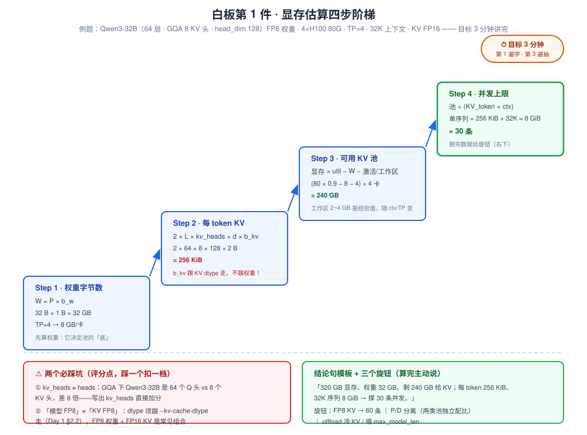
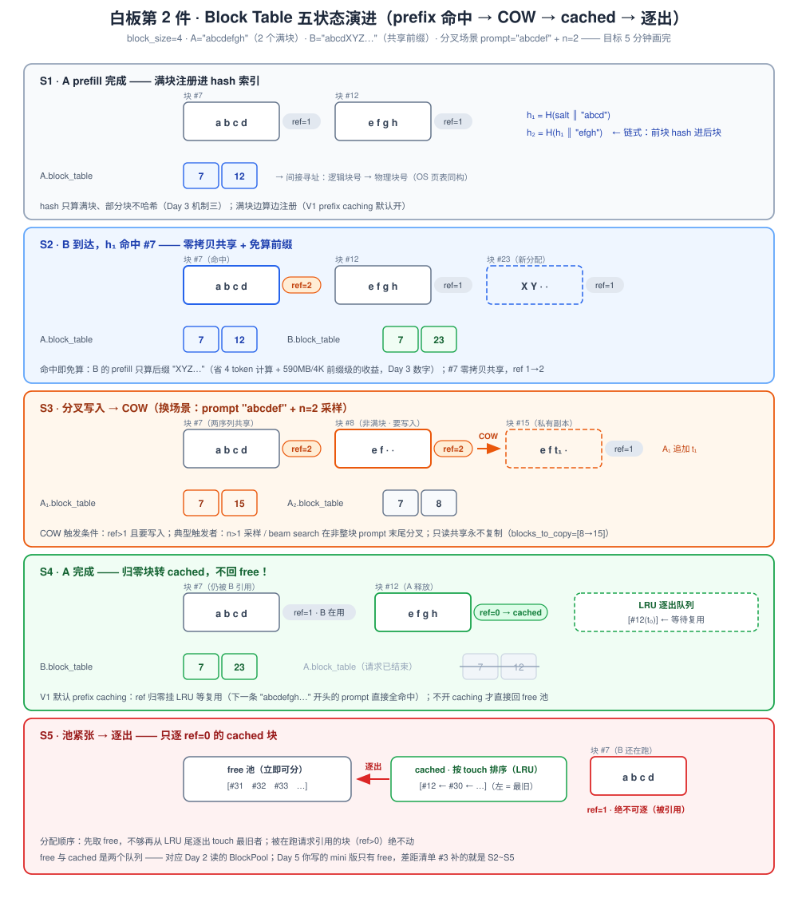
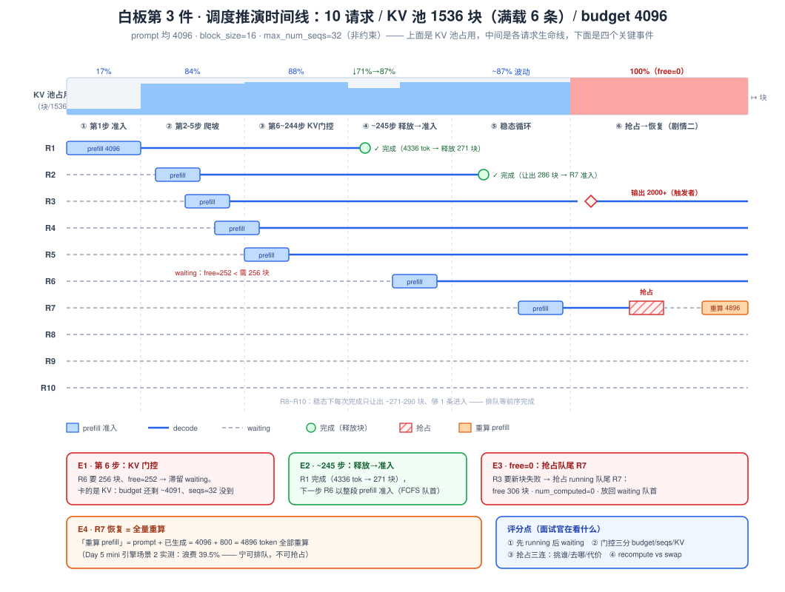
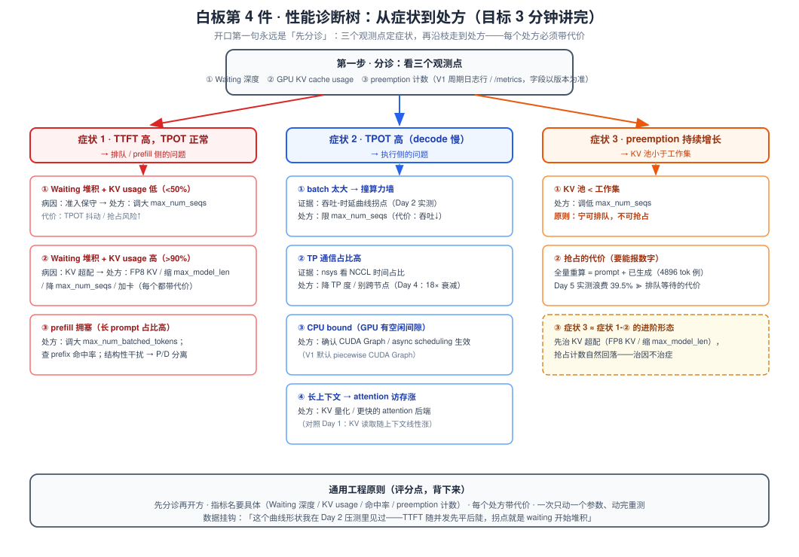

# Day 6 · 白板四件套 + 高频题过堂

> **总时长**：7-8 小时（四件套计时练习 3.25h + 高频题录音 3h + 补练定稿 1h+）
> **今日目标**：白板四件套各练 3 遍、全部计时达标（3 / 5 / 5 / 3 分钟）；8 道高频题每题 3 分钟录音 → 回听 → 写出修正稿。**今天不学任何新东西**——只把 Day 1~5 的全部输入，压缩成面试现场可用的输出
> **产出物**：四件套计时记录（4 × 3 遍）+ 8 段答题录音与修正稿提纲（Day 7 面试作战包第 6 件）
> **冲刺周定位**：面试是一场**输出考试**——输入再多，3 分钟内讲不完、白板上画不出来，等于没学。本周攒下的公式卡（Day 1）、源码笔记（Day 2）、四张机制卡（Day 3）、四页专题卡（Day 4）、mini 引擎（Day 5），今天是它们的**总装车间**。方法原则只有三条：**开口说、动手写、计时**——看懂了 ≠ 讲得出，讲得出 ≠ 3 分钟内讲得完

---

## 作息建议

| 时间 | 内容 | 时长 |
|---|---|---|
| 09:00-11:00 | 白板第 1、2 件（各练 3 遍，逐遍计时） | 2h |
| 11:15-12:30 | 白板第 3、4 件（各练 3 遍，逐遍计时） | 1.25h |
| 14:00-17:00 | 高频题 1-8：录音 → 回听 → 修正稿 | 3h |
| 19:30-20:30 | 薄弱项补练（白天标 ⭐ 的项）+ 修正稿定稿 | 1h |

---

## 今日学习目标

- [ ] **第 1 件 · 显存估算**：3 分钟内从任意「模型 × 精度 × 上下文 × 卡型」推到并发上限，本文 3 道随机题全部通过
- [ ] **第 2 件 · 手绘 block table**：5 分钟画完 5 状态演进（分配 → 前缀命中 → COW 分叉 → 完成转 cached → 逐出），引用计数每步零失误
- [ ] **第 3 件 · 调度推演**：5 分钟讲完「10 个请求、KV 只够 6 个」的完整推演，含准入门控、完成释放与一次抢占-恢复
- [ ] **第 4 件 · 性能诊断树**：3 分钟从症状走到处方，三条主枝达到默写
- [ ] **8 道高频题**：每题 3 分钟录音 → 回听对照检查表 → 写出 ≤150 字修正稿提纲 → 隔 2 小时重录一遍
- [ ] 每道题都做到「结论句先行 + 至少一个数字 + 至少一个 trade-off」

---

## 核心概念速览

| 件 / 题 | 考什么 | 弹药来自 |
|---|---|---|
| **白板 1：显存估算** | 第一性原理 + 工程参数感 | Day 1 公式卡（三个公式） |
| **白板 2：block table** | PagedAttention + prefix caching 细节 | Day 1 论文 §3/§4、Day 2 `kv_cache_manager.py`、Day 3 机制三、Day 5 BlockPool |
| **白板 3：调度推演** | scheduler 每步决策 + 抢占语义 | Day 2 `scheduler.py`、Day 5 mini 引擎场景 2 |
| **白板 4：诊断树** | 系统思维 + 观测手段 | Day 2 压测曲线、Day 3 budget 实验 |
| **高频题 1-8** | 以上全部的口语输出 | Day 3 四段式、Day 4 专题卡 |

**今天所有练习共用一个答题骨架**（四件套与 8 题通用，练到肌肉记忆）：

```
① 结论句（20 秒）→ ② 公式 / 图（1 分钟）→ ③ 一个数字例子（40 秒）
→ ④ trade-off 或失效场景（30 秒）→ ⑤ 主动延伸：旋钮 / 昇腾经验挂钩（20 秒）
```

---

## 动手实验：计时与录音协议（今天的「实验设计」）

今天没有新实验，实验对象是**你自己**。协议如下，全天严格遵守：

**计时协议（四件套）**：

1. 出题 → 手机计时 → **白纸**上写/画（不许看任何材料）→ 对照本文评分点逐项自评
2. 第 1 遍（学答案）、第 2 遍（隔 ≥30 分钟）、第 3 遍（下午混在其他题里**随机抽**）
3. 记录格式写在卡片角落：`显存估算 2'40"✓ / 3'05"✗(漏旋钮) / 2'35"✓`——第 3 遍混序抽测才算数，连续两遍对着答案抄是「假会」

**录音协议（8 道高频题）**：

1. 每题开口录 3 分钟（不看材料），手机录音文件名 `Q1_pagedattention_take1`
2. 回听一遍，对照「回听检查表」逐项打勾
3. 写**修正稿提纲**（≤150 字关键词，**不写全文**——背全文必然卡壳，提纲保即兴）
4. 隔 ≥2 小时重录一遍（take2），只录白天标了 ⭐ 的题

---

## 模块一：白板第 1 件——显存估算（目标 3 分钟）

### 1.1 为什么它永远是第一题

几乎所有推理系统面试的第一道白板题都是显存估算——它同时考三样东西：**第一性原理**（公式会不会推）、**工程感**（知不知道参数和量级）、**表达组织**（能不能分步讲清）。翻车代价最高，练到 3 分钟是硬指标。

### 1.2 四步阶梯（叙述顺序不许乱）

```text
Step 1  权重字节数    W = P × b_w                    （TP=k 则每卡 W/k）
Step 2  每 token KV   2 × layers × kv_heads × head_dim × b_kv
                     （b_kv 跟 --kv-cache-dtype 走，不跟权重精度走！）
Step 3  可用 KV 池    每卡显存 × gpu_memory_utilization − 每卡权重 − 激活/工作区
                     （激活/工作区经验值 2~4 GB，随上下文与 TP 变化）
Step 4  并发上限      池总量 ÷ (KV_token × 平均上下文长度)
```



**结论句模板**（算完 30 秒收尾，面试官最吃这套）：

> 「总显存 320 GB、权重 32 GB，剩约 240 GB 给 KV；每 token 256 KiB、一条 32K 序列 8 GiB——**撑 30 条并发**。想翻倍开 FP8 KV，想再往上就得 P/D 分离或者 offload。」

### 1.3 两个必踩的坑（评分点，踩一个扣一档）

| 坑 | 错误写法 | 正确写法 | 为什么重要 |
|---|---|---|---|
| **GQA 陷阱** | `2 × L × heads × d × b` | `2 × L × kv_heads × d × b` | Qwen3-32B：64 个 Q 头 vs **8 个 KV 头**，差 8 倍；写出 kv_heads 直接加分 |
| **dtype 混淆** | 「模型 FP8 → KV 也按 1 字节算」 | dtype 项跟 KV cache 精度走，是独立旋钮 | 「70B FP8 权重 + FP16 KV」是常见部署组合（Day 1 §2.2） |

### 1.4 评分点（面试官在看什么）

1. **公式写对**：尤其 kv_heads 与 dtype 两项
2. **分步清晰**：权重 → 每 token → 池 → 并发，一步一报数
3. **有结论讨论**：算完主动说旋钮（FP8 KV / 缩 `max_model_len` / P/D 分离 / offload），把「会算」升级成「会优化」

### 1.5 今天做完的 3 道随机题（先自己推，再对答案）

**题 1**：Qwen3-32B（64 层、GQA 8 KV 头、head_dim 128）**FP8 权重**，4×H100 80G，TP=4，32K 上下文，KV 默认 FP16：

```text
权重      = 32 B × 1 B = 32 GB → TP=4 → 8 GB/卡
KV/token  = 2 × 64 × 8 × 128 × 2 B = 262,144 B = 256 KiB    ← 陷阱：FP8 权重不影响这里
池        = (80 × 0.9 − 8 − 4) × 4 = 60 × 4 = 240 GB         ← 4 GB 为激活/工作区经验值
单序列    = 256 KiB × 32,768 = 8 GiB
并发      ≈ 240 / 8 = 30 条
旋钮      ：FP8 KV → 池不变但单序列 4 GiB → 60 条
```

**题 2**：Llama-3-8B（32 层、8 KV 头、head_dim 128）FP16，**1×RTX 4090 24G**，8K 上下文：

```text
权重      = 8 B × 2 B = 16 GB（FP16）
KV/token  = 2 × 32 × 8 × 128 × 2 B = 131,072 B = 128 KiB
池        = 24 × 0.9 − 16 − 1.5 ≈ 4 GB
单序列    = 128 KiB × 8,192 = 1 GiB
并发      ≈ 4 条     ← 结论：消费级卡跑 8B，瓶颈是显存不是算力
加一句    ：4090 带宽 ~1 TB/s → TPOT 下界 ≈ 16 GB / 1 TB/s ≈ 16 ms ≈ 62 tok/s/条（Day 1 公式②）
```

**题 3（直觉题）**：DeepSeek-V3 类 MLA 模型，KV 被压缩到同规模 MHA 的 1/16，同样硬件并发翻几倍？

```text
显存侧   ：×16（并发上限 ∝ 1/KV_token）
但       ：并发拉高 → decode batch 变大 → 撞算力墙（Day 1 例题 2 的两墙交点，70B ≈ B=150）
正确答案 ：「理论上 16 倍，但实际受 compute-bound 上限压低——显存墙和算力墙的交点
           才是真并发。」答出后半句 = 专家信号
```

### 1.6 自测小工具（30 秒给自己出题对答案）

```python
def max_concurrency(params_b, layers, kv_heads, head_dim, n_gpus, vram_gb,
                    util=0.9, kv_b=2, w_b=2, ctx=32768, overhead_gb=4):
    w = params_b * w_b / n_gpus                          # 每卡权重 GB
    pool = (vram_gb * util - w - overhead_gb) * n_gpus   # 总 KV 池 GB
    kv_tok = 2 * layers * kv_heads * head_dim * kv_b / 2**30
    seq = kv_tok * ctx                                   # 单序列 GB
    return {"并发": int(pool // seq), "每卡权重GB": w, "池GB": pool, "单序列GB": seq}

# 题 1 验证：{'并发': 30, '每卡权重GB': 8.0, '池GB': 240, '单序列GB': 8.0}
print(max_concurrency(32, 64, 8, 128, 4, 80, w_b=1))
# 题 2 验证：{'并发': 4, ...}
print(max_concurrency(8, 32, 8, 128, 1, 24, overhead_gb=1.5))
```

用它随机组合参数出题（换模型、换卡、换上下文各一轮），白纸手推 → 跑脚本对答案。**手推和脚本都过，才算这件练成。**

---

## 模块二：白板第 2 件——手绘 block table（目标 5 分钟）

### 2.1 场景卡（固定这套，练到 5 分钟画完）

```text
block_size = 4                （白板演示用；vLLM V1 常用 16）
请求 A：prompt "abcdefgh"      （恰好 2 个满块 → 全部可哈希）
请求 B：prompt "abcdXYZ…"     （与 A 共享 4 token 前缀后分叉）
分叉 C：A 以 n=2 采样跑        （prompt 非整块时的 COW 场景）
```



### 2.2 五状态演进（口述底稿，对着 SVG 逐格讲）

| 状态 | 事件 | 池与计数变化 | 口述要点 |
|---|---|---|---|
| **S1** | A prefill 完成 | `#7[abcd] ref=1`、`#12[efgh] ref=1`；A.table=[7,12] | 顺手写 hash 链：`h1=H(salt∥abcd)`、`h2=H(h1∥efgh)`——**链式**，前块的 hash 进后块 |
| **S2** | B 到达，查 h1 **命中** | `#7 ref=2`；B 新分配 `#23`；B.table=[7,23] | 命中即免算：B 的 prefill **只算后缀**，省 4 token 计算 + 零拷贝共享 |
| **S3** | 分叉写入 → **COW** | A 开 n=2：两条序列共享含非满块 `#8[ef··] ref=2`；任一条要往 #8 追加第 1 个生成 token → 复制出 `#15`，#8 ref 回 1 | 触发条件精确表述：**ref>1 且要写入**；只读共享永不复制。blocks_to_copy=[8→15] |
| **S4** | A 完成 | `#7 ref 2→1`（B 还在用）；`#12 ref→0` → **转 cached，挂 LRU** | V1 默认开 prefix caching：**归零块不回 free**，留在缓存等复用——说出这条 = 读过源码的信号 |
| **S5** | 池紧张 → **逐出** | LRU 尾部的 cached 块回收进 free 池 | 只逐 `ref=0` 的块；#7 被 B 引用着（ref=1）**绝不可逐** |

### 2.3 评分点

1. **引用计数每步写对**（S1/S2/S4 三处 ref 变化是面试官盯的地方）
2. 主动说「**只哈希满块**」+「链式 hash 错 1 token 该块及后续**全不命中**」（Merkle 性质，Day 3 机制三）
3. **cache_salt** 只掺进第一块的 hash、经链式传播覆盖全前缀（多租户隔离）
4. COW 触发条件精确到「ref>1 **且要写入**」，并给出典型触发者（n>1 采样 / beam search 在非整块 prompt 末尾分叉）
5. V1 行为：完成 ≠ 释放——cached（LRU 可逐出）与 free（立即可分）是**两个队列**

### 2.4 与源码 / Day 5 的衔接

- 这张图就是 Day 2 读的 `vllm/v1/core/kv_cache_manager.py` 的白板版：`find_longest_prefix_hit()`（链式 hash 查找）→ `allocate_slots()`（分配 + COW 决策）→ BlockPool 的 free / cached 两个队列
- Day 5 你自己写的 `BlockPool` 只有 free 队列、ref_cnt 永远是 1——差距清单 #3（prefix caching）补的就是这页 SVG 的 S2~S5
- ⚡ **昇腾翻译提示**：链式 hash 防误命中 ≈ 编译器 CSE（公共子表达式消除）的哈希指纹——「算过且未被破坏就复用」，资源视角同构

---

## 模块三：白板第 3 件——调度推演（目标 5 分钟）

### 3.1 题目卡（固定这套）

```text
10 个请求同时到达（R1~R10，FCFS），prompt 均 4096，输出长度各异（240 ~ 2000+）
block_size = 16，KV 池 1536 块 = 24,576 token ≈ 满载 6 条
max_num_batched_tokens = 4096，max_num_seqs = 32（不构成约束）
问：逐步推演 running batch 演化；第 7 条什么时候进得来；一次完整的抢占-恢复
```



### 3.2 六幕推演（口述底稿，块数按 16 token/块取整）

| 幕 | 步 | running | 池占用（块/1536） | 发生什么 | 口述要点 |
|---|---|---|---|---|---|
| ① 准入 | 第 1 步 | 1 | 256 | R1 整段 prefill（4096 = 整预算） | budget 恰好装 1 条 prompt |
| ② 爬坡 | 第 2-5 步 | 2→5 | ≈1284 | 每步：running 各 decode 1 token + 准入 1 条新 prefill；decode 挤掉几个 token → 新 prompt 的尾巴切到下一步 | chunked prefill 的「续切」：被切请求转 running、下一步在第一段优先续 |
| ③ **KV 门控** | 第 6 步 | 5 | free≈252 | R6 要 256 块，free 只有 252 → `can_alloc` 失败，R6 滞留 waiting | **卡住的不是 budget（还剩 ~4091）也不是 max_num_seqs（32），是 KV**——三种门控主动说全 |
| ④ 完成-释放-准入 | ~第 245 步 | 5 | 1355→452 | R1 完成（4096+240=4336 token → 271 块释放）→ 下一步 R6 准入 | 释放-准入闭环；waiting 队首 FCFS |
| ⑤ 稳态 | 持续 | **≈5** | 1000~1400 波动 | 每次完成让出 ~271-290 块，够下一条的 256 块进入 | 稳态 ≈5 而非 6：**输出增长 + 块取整**吃掉了名义余量——「KV 只够 6 个」的精确含义是满载 6 条 prompt-only |
| ⑥ **抢占-恢复** | free=0 时 | 5→4 | →0 | 剧情二（输出比预期长）：某步 R3 要 1 个新块失败 → 抢占 running **队尾** R7：free 其 ⌈(4096+800)/16⌉=306 块、`num_computed=0`、放回 waiting **队首**；之后 R7 以「重算 prefill」再入 = 4096+800=**4896 token 全量重算** | 抢占三连答（下） |

### 3.3 抢占三连答（被追问必考）

| 问 | 答 | 为什么 |
|---|---|---|
| **挑谁？** | running **队尾**（最新准入） | FCFS 视角沉没成本最小 + 队尾通常进度最浅、重算最便宜（Day 2 / Day 5 同款逻辑） |
| **去哪？** | waiting **队首**（appendleft） | 尽快恢复、防饥饿；代价是立刻吃掉下波 token budget |
| **代价多大？** | prompt + 已生成**全量重算**（4896 token） | Day 5 场景 2 实测浪费 39.5%——所以调度原则是**宁可排队，不可抢占** |

**recompute vs swap 收尾**（说全这条 = 加分）：recompute 省下 CPU 内存与 PCIe 拷贝流量，重算用的是本可闲置的 prefill 算力；swap 保住进度但要付 KV 搬运成本。vLLM V1 以 recompute 为主（swap 是 V0 时代的选项，细节以版本为准）。

### 3.4 评分点

1. **顺序**：先 running 后 waiting——TPOT 是连续 SLO，running 每步必须喂到；waiting 晚一步只推高一次性 TTFT（Day 2 Q1）
2. **门控三分**：budget / max_num_seqs / KV 显存，本题卡的是第三种，主动把三种都说全
3. **抢占三连**：挑谁、去哪、代价，各带一句理由
4. **主动收尾**：「这段推演我写过最小实现——Day 5 的 mini 调度器场景 2 就是它，实测重算浪费 39.5%」——从背诵者变成实践者

---

## 模块四：白板第 4 件——性能诊断树（目标 3 分钟）

### 4.1 树（背到默写）



```text
分诊：先看三个观测点（V1 周期日志行 / /metrics，字段名以你的版本为准）
      ① Waiting 深度　② GPU KV cache usage　③ preemption 计数

症状 1：TTFT 高，TPOT 正常 → 排队 / prefill 侧
  ├─ Waiting 堆积 + KV usage 低（<50%）→ 准入保守 → 调大 max_num_seqs
  ├─ Waiting 堆积 + KV usage 高（>90%）+ preemption 涨 → KV 超配
  │    → 降 max_num_seqs（宁排队勿抢占）/ 缩 max_model_len / FP8 KV / 加卡
  └─ prefill 拥塞（长 prompt 占比高）
       ├─ 调大 max_num_batched_tokens（prefill 快进）
       ├─ 重复前缀多 → 确认 prefix caching 开（V1 默认开）+ 查命中率
       └─ 结构性干扰 → P/D 分离（chunked 只能缓解不能根除，Day 4）

症状 2：TPOT 高（decode 慢）
  ├─ batch 太大 → 撞算力墙（Day 1 两墙交点）→ 限 max_num_seqs
  ├─ TP 通信占比高 → nsys 看 NCCL 时间 → 降 TP 度 / 不跨节点（Day 4：18× 衰减）
  ├─ CPU bound → GPU 空闲间隙 → CUDA Graph / async scheduling 是否生效（V1 默认 piecewise CG）
  └─ 长上下文 → attention 访存占比涨 → KV 量化 / 更快的 attention 后端

症状 3：preemption 持续增长
  └─ KV 池 < 工作集 → 调低 max_num_seqs——抢占的代价（全量重算）远大于排队
```

### 4.2 症状 → 病因 → 处方速查表（口述底稿）

| 症状 | 第一反应病因 | 观测证据 | 处方（带代价） |
|---|---|---|---|
| TTFT↑ 且 ITL 稳 | 排队 / prefill 拥塞 | Waiting 深度大 | 调大 budget 或 max_num_seqs；代价：TPOT 抖动 / 抢占风险 |
| TTFT↑ + KV usage >90% | KV 超配 | usage 高 + preemption 涨 | FP8 KV（精度微损）/ 缩 max_model_len（截长尾请求）/ 加卡（钱） |
| TPOT↑ + 高并发 | batch 过大、算力饱和 | 吞吐-时延曲线拐点（Day 2 实测） | 限 max_num_seqs；代价：吞吐降、排队涨 |
| TPOT↑ + TP 部署 | all-reduce 通信税 | nsys 中 NCCL 占比 | TP 度回退 / 单机内收敛；DP 扩吞吐更干净 |
| TPOT 尖峰（p99 高均值正常） | prefill 干扰 decode | 尖峰间隔 ≈ 长 prompt 到达 | budget 调小；根治 → P/D 分离 |
| preemption 单调涨 | 池小于工作集 | 日志 preemption 计数 | 降 max_num_seqs——宁排队勿抢占 |

### 4.3 评分点

1. **先分诊再开方**：开口第一句是「先看三个观测点」，不是直接猜参数
2. **指标名具体**：Waiting 深度 / KV cache usage / prefix 命中率 / preemption 计数——说得出指标才像真排查过
3. **每个处方带代价**：调大 budget 的代价是 TPOT 抖动、FP8 KV 的代价是精度、加卡的代价是钱
4. **一次只动一个参数**，动完重测——工程习惯分
5. **数据挂钩**：「这个形状我在 Day 2 压测里见过：TTFT 随并发先平后陡，拐点就是 waiting 开始堆积」

---

## 模块五：高频题 1-8 录音过堂（面试主战场）

按「动手实验」的录音协议执行：每题 **开口 3 分钟 → 回听 → 对照要点修正 → 隔 2 小时重录**。下面的要点是**修正用的标尺，不是背诵稿**——每题给「结论句」（开口第一句，原样背下来）、「展开路线」和「必带数字」。

### Q1. PagedAttention 解决了什么问题？碎片率怎么算？

- **结论句**：「它把 KV cache 从『按最大长度连续预留』改成 OS 式分页管理，把显存浪费从 60-80% 压到 4% 以内——没有它，continuous batching 不敢放开并发，长上下文基本没法服务。」
- **展开路线**：三类浪费（按 `max_model_len` 预留 / 过度预留 / 内部碎片）→ block + block table 间接寻址 + 引用计数 → OS 虚拟内存类比（页表 / 共享页 → prefix caching）
- **必带数字**：浪费 60-80% → **<4%**；每请求期望浪费 = **block_size/2** 个 token（最后一个半空块），block=16、平均长度 1000 时 ≈ 1.6%
- **追问预测**：「block_size 怎么选？」——大块：元数据少、kernel 效率高，但碎片大、命中粒度粗；小块反之。「和 OS 分页的区别？」——OS 页可换出到磁盘，KV block 的「换出」是逐出缓存块（S5）或 offload
- ⚡ 挂钩：「分配/释放 O(1) 我写过最小实现——free 队列 + 引用计数（Day 5 BlockPool）」

### Q2. Continuous batching vs static batching？

- **结论句**：「调度粒度从『批次』降到『迭代步』：static 里短请求陪跑到最长者结束，利用率 = ΣL/(B·maxL)；continuous 每步重组 batch 消掉空转，再叠加 PagedAttention 放开准入的摊销效应，吞吐提升数倍。」
- **展开路线**：先手推利用率例子 → **两层收益说全**（消空转 2-3× + PA 配套敢放大 batch → 权重读取摊销）→ 收尾「两者是配套发明，不是两个独立卖点」
- **必带数字**：10/100/200/500 → **40.5%**，理想加速 1/U ≈ **2.5×**；Day 5 mini 引擎实测 40.5% → **65.3%**
- **追问预测**：「为什么必须配 PagedAttention？」（每步有进有出 → KV 每步分配/释放 → 连续预留必碎片）；「调度开销多大？」（每步亚 ms 级，Day 2 §2.4）
- **失效场景**：离线吞吐（排序装箱更优）、单请求、小模型小 batch（CPU-bound）

### Q3. 为什么 decode 用 CUDA Graph 而 prefill 不用？

- **结论句**：「两条理由：decode 的 launch 开销占单步时延 30-50%——500 个 kernel × 5µs ≈ 2.5ms，而整步只有 5-8ms，必须抓图；prefill 单步几十到几百 ms、launch 占比不到 5%，而且 chunk 长度任意、形状动态，图抓不了也不值得抓。」
- **展开路线**：数量级对比 → 形状问题（decode batch 可枚举 → **分桶抓图**、按 2 的幂 padding；prefill seq_len 任意）→ V1 默认 **piecewise CUDA Graph**：attention 因 seq_len 动态留在图外，其余段静态捕获
- **必带数字**：**500 × 5µs ≈ 2.5ms vs 5-8ms**（占比 30-50%）
- **追问预测**：「padding 浪费多少？」（桶间 padding，batch 落在两桶之间时最多多算近一档）；「图的代价？」（显存 + 抓图时间，所以只抓常用桶）
- ⚡ 挂钩：「capture-replay 和 NPU Graph 同构——我在昇腾上处理过图捕获的形状约束」

### Q4. Chunked prefill 的 trade-off？token budget 怎么设？

- **结论句**：「本质是拿长 prompt 的 TTFT 换全体的 TPOT 平稳：一个 4K prompt 不再一次性顶住 GPU 170ms，decode 每步都被喂到；代价是被切 prompt 的 TTFT 略增和调度复杂度。」
- **展开路线**：干扰例子 → **第二重收益：算术强度互补**（AI(prefill chunk)≈C=1024、AI(decode)≈1~10、H100 脊点≈300——混合步把带宽和算力同时吃满，Day 3 画图讲）→ budget 调参：TTFT 导向调大、TPOT 导向调小，经验起点 **2048-8192**（V1 默认 8192，版本相关），按 p99 SLO 实测迭代 → 被切请求转 running、下一步优先续切
- **必带数字**：**170ms 尖峰 vs 50ms 平稳**；AI **1024 vs 1~10 vs 脊点 300**
- **追问预测**：「budget 调太小会怎样？」（长 prompt 持续到达 → 切不完 + 后续请求饥饿，TTFT 尾巴爆炸——Day 3 自测 5）；「和 P/D 分离什么关系？」（chunked 缓解干扰，P/D 根治）

### Q5. 量化对 TTFT 和 TPOT 分别什么影响？

- **结论句**：「按 bound 分层：TPOT 是 memory-bound，收益 ∝ 权重字节压缩比，W8≈2×、W4≈4×；TTFT 是 compute-bound，只有 W8A8/FP8 这类连算力一起量化的方案受益，W4A16 的 prefill 甚至可能变慢。」
- **展开路线**：Day 1 公式②（TPOT ≈ 权重字节/带宽）→ 三档下界 → prefill 侧（FP8 算力 990→1979 TFLOPS；W4A16 反量化多付计算、省不动瓶颈 → 负收益机制）→ KV FP8：320→160 KiB，并发 ×2 → 收尾挂 SLO：「decode 敏感选 W4A16，全面收益选 FP8」
- **必带数字**：Qwen3-8B TPOT 下界 **4.9 / 2.4 / 1.2 ms**（bf16/FP8/W4）
- **追问预测**：「激活为什么比权重难量化？」（outlier 通道，Day 4）；「KV 量化的精度代价？」（长上下文累积偏差，回看注意 p99 质量）
- ⚡ **昇腾王牌挂钩（背熟）**：「这和我在昇腾上做 WeightQuantBatchMatmul 是同一件事——4bit 权重直读、片上反量化，不产生额外 HBM 流量；我用 tiling 搜优 + bound 建模做单核利用率 85%+，方法论完全同构。」

### Q6. P/D 分离什么时候不值得做？

- **结论句**：「分离的本质是用 KV 传输成本换两类负载的 SLO 独立——流量小、prompt 短、网络差，这三个场景传输是纯亏，都不值得；再加一条复杂度税。」
- **展开路线**：先一句为什么分（硬件特性相反 + SLO 干扰，Day 4 三动机）→ 反例三连：小流量（P/D 之间传 KV 纯亏）/ 短 prompt（prefill 占比小、干扰损失小于分离开销）/ 差网络（52ms 直接打进 TTFT）→ 决策方法：「先测混跑干扰损失（170ms vs 50ms 那组数），干扰不大就别分」
- **必带数字**：8K prompt KV ≈ **2.5 GiB**；NVLink **≈3ms**（可忽略）vs RDMA **≈52ms**（必须逐层流水 0.64ms/层藏掉）
- **追问预测**：「传输怎么藏？」（逐层流水：第 L 层计算与第 L−1 层传输重叠）；「KV 用 FP8 传？」（1.25 GiB 直接减半——量化与 P/D 在这里合流）

### Q7. TP 什么时候是负收益？

- **结论句**：「TP 每层 2 次 all-reduce，decode 每步 72 次通信、0.7-2ms 的税；单卡放得下、大 batch、跨节点没 NVLink——这三种场景税比收益大。」
- **展开路线**：先收益（k 卡 → 每卡权重 1/k → TPOT ≈ W/(k·BW)）→ 衰减三连：小 batch 通信税（Qwen3-8B TP=2：理想 2.45ms，实际 +0.7~2 → **3.5ms，只有 1.4×**）/ 大 batch 退化为算力均分 / 跨节点（带宽 **18×** 衰减，7ms+ 比整个 decode 步还长）→ 收尾原则：「**能单卡放下就别上 TP**」，要吞吐用 DP（V1 的 DP = 多个 EngineCore，零通信）
- **必带数字**：**1.4×**（TP=2 实测折扣）、**18×**（跨节点衰减）
- **追问预测**：「TP 的两个合法场景？」（单卡真放不下：70B FP8 ~70GB；decode 时延敏感愿意付税换带宽聚合）；「vLLM 做过什么优化？」（小消息定制 all-reduce，one-shot/two-shot——框架作者也在跟这 1ms 较劲）

### Q8. TTFT 高怎么排查？TPOT 高怎么排查？

- **结论句**：「先分诊再开方：TTFT 高且 TPOT 稳，是排队或 prefill 拥塞——查 Waiting 深度和 KV usage；TPOT 高，是 batch 过大、TP 通信或 CPU 间隙；两者都高且 preemption 涨，是 KV 超配。」
- **展开路线**：这题就是模块四诊断树的口语版——三个症状各一句病因、各一个处方、各一个代价，控制在 3 分钟
- **必带数字**：处方带量（budget 起点 2048-8192；KV usage >90% 视为超配线）
- **追问预测**：「具体看什么指标？」（Waiting 深度 / GPU KV cache usage / prefix 命中率 / preemption 计数——V1 周期日志行都有，字段以版本为准）；「同时只能改一个参数吗？」（是——改完重测，否则归因不了）

### 回听检查表（每条录音逐项打勾，任何一项不过 → 重录）

- [ ] 前 20 秒有**结论句**（先给答案，再展开）
- [ ] 至少一个**数字或公式**
- [ ] 至少一个 **trade-off / 失效场景**
- [ ] 口头禅（「呃」「然后」「就是」）≤ 3 次
- [ ] **3 分钟内收住**（超时的题必须重录）
- [ ] 结尾有一句**主动延伸**（旋钮 / 昇腾经验 / 「我写过最小实现」）

---

## 今日总结

- **一个骨架打天下**：四件套与 8 题共用「结论句 → 公式/图 → 数字 → trade-off → 主动延伸」——今天的全部训练就是把它变成肌肉记忆
- **输出的三个敌人**：没结论句（面试官走神）、没数字（像背书）、没收住（暴露组织力差）——分别用结论句模板、数字弹药库、计时来对抗
- **必背数字弹药库**（一页，10 秒内说出任意一行）：

| 数字 | 用在哪 |
|---|---|
| 70B FP16 KV **320 KiB/token**；128K 单序列 **40 GiB** | 显存估算 / 长上下文直觉 |
| 70B FP8 @H100 decode 下界 **20.9ms**；Qwen3-8B 三档 **4.9/2.4/1.2ms** | 时延 / 量化（Q5） |
| static 利用率 **40.5%** → CB 实测 **65.3%** | Q2 |
| **170ms** 尖峰 vs **50ms** 平稳；AI **1024 vs 1~10 vs 脊点 300** | Q4 / Q6 |
| CUDA Graph **500×5µs ≈ 2.5ms** vs 步长 5-8ms | Q3 |
| P/D：**2.5 GiB → 3ms(NVLink) / 52ms(RDMA) / 0.64ms 每层流水** | Q6 |
| TP=2 实测折扣 **1.4×**；跨节点衰减 **18×** | Q7 |
| 抢占重算浪费 **39.5%**；每请求碎片上界 **block_size/2** | Q1 / 白板 3 |

- **本周弧线**：Day 1 公式 → Day 2 源码+压测 → Day 3 机制 → Day 4 专题 → Day 5 写过一遍 → **今天讲得出来**。明天 Day 7 用一场完整模拟面试验收这套作战包

---

## 今日自测题（答不上回对应模块）

1. 面试官只给「72B 模型、2×A800、32K 上下文」就让你算并发，第一句话问什么？（→ 模块一：先补假设——权重精度、KV dtype、TP 方案、平均输出长度；**条件不全先补假设再算**，这本身就是评分点）
2. B 的 prompt 与 A 完全同前缀，但长度不是 block_size 整数倍：B 能命中多少？差的尾巴怎么办？（→ 模块二：命中 ⌊L_B/16⌋ 个满块；部分块不哈希，B 把尾巴重算进私有新块——不是 COW）
3. 抢占为什么挑 running 队尾，而不是 KV 占用最大的那个？（→ 模块三：队尾 = 最新准入，FCFS 沉没成本最小、进度通常最浅、重算最便宜；KV 最大者往往是最老请求，抢它既不公平、重算也更长）
4. TTFT 高、但 Waiting 不长、KV usage 也不高——还查什么？（→ 模块四：prefill 本身慢——长 prompt 占比、模型大、计算路径没吃到量化收益；再往前查入口：tokenize、网络、队列在客户端）
5. 「budget 从 8192 调到 512，TPOT p99 和 TTFT p99 各往哪动？」3 秒内答（→ Q4：TPOT p99 ↓（尖峰变小）、TTFT p99 ↑（prefill 变慢，长 prompt 可能饥饿））
6. 哪道题今天录了两遍还卡壳？——把它写进薄弱项清单，那就是明早模拟面试前唯一要再看的东西

---

## 今日产出物

1. **四件套计时记录**（4 件 × 3 遍，写在各卡片角落，如「显存估算 2'40"✓」）
2. **8 段录音 + 8 份修正稿提纲**（每份 ≤150 字关键词，不是全文）——Day 7 面试作战包第 6 件
3. **薄弱项清单**（标 ⭐ 的题/评分点，Day 7 模拟面试开场前最后过一遍）

### Day 6 收工自检清单（全绿才算完成）

- [ ] 四件套**第 3 遍（混序抽测）**全部计时达标（3 / 5 / 5 / 3 分钟）
- [ ] 8 题全部「录过、听过、修正过」，take2 明显比 take1 收敛
- [ ] 必背数字弹药库任意一行 10 秒内说出
- [ ] 随机抽一题（让家人/朋友随机点），20 秒内开口给出结论句
- [ ] 修正稿全部是提纲而非全文
- [ ] 薄弱项 ⭐ 清单已列出，明天只看它

**未达标项不许带入 Day 7。** 明天是收官：上午完整模拟面试 ×1，下午打磨 3 分钟版 + 10 分钟版叙事主线（昇腾量化 GEMM ↔ LLM 推理优化方法论同构），晚上只看本周卡片、不看任何新资料、早睡。
