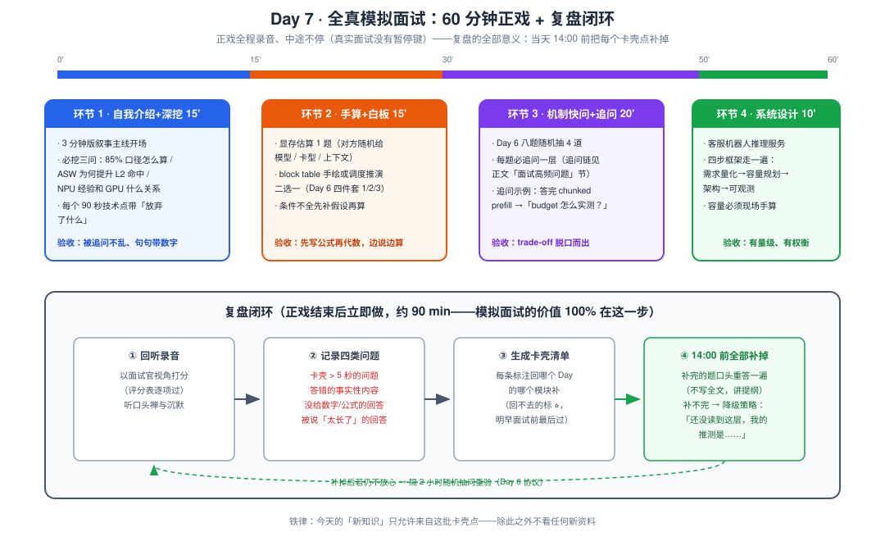
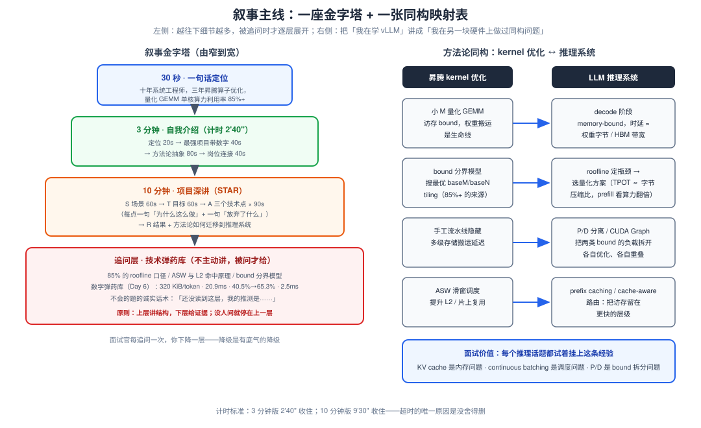
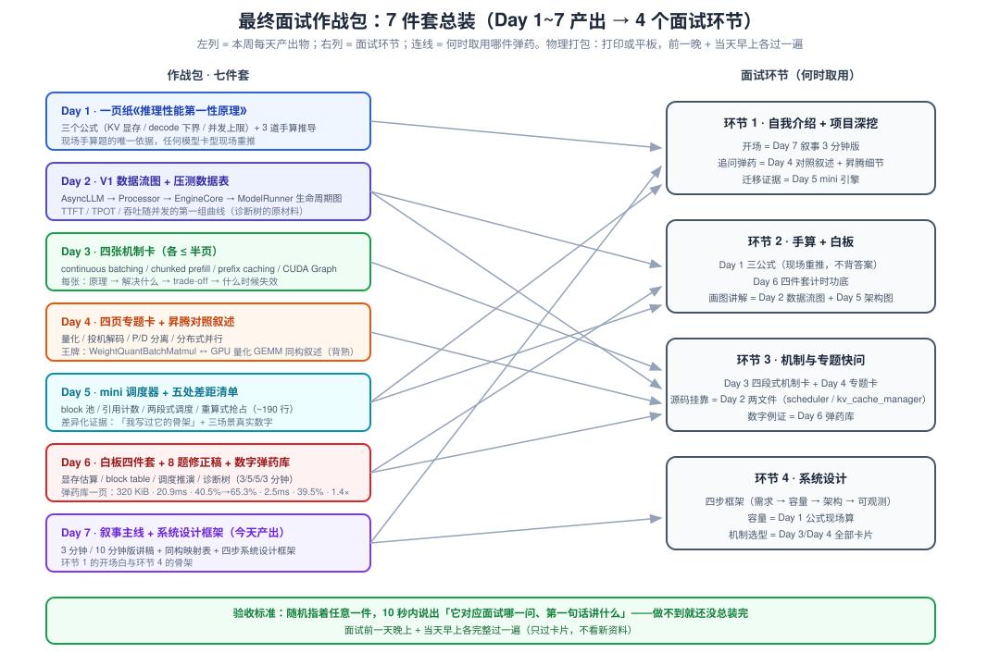

# Day 7 · 模拟面试 + 收尾（作战包总装日）

> **总时长**：6 小时（上午 2.5h + 下午 2.75h + 晚上 1h 轻收尾）
> **今日目标**：完成一次 60 分钟全真模拟面试并**当天闭环复盘**；3 分钟版 / 10 分钟版叙事主线各讲一遍并计时达标；把 Day 1~6 的全部产出总装成**最终面试作战包**
> **产出物**：最终面试作战包（7 件套）+ 模拟面试录音与复盘清单 + 叙事主线 3 分钟 / 10 分钟版讲稿
> **冲刺周定位**：收官日。Day 1 建公式 → Day 2 读源码 → Day 3 过机制 → Day 4 扫专题 → Day 5 写引擎 → Day 6 练输出——今天是**总装 + 验收**：六天的输入必须在面试压力下「取得出来」才算数。**今天不学任何新知识**，唯一允许的新输入来自模拟面试暴露的漏洞（下午立即补掉）
> **铁律**：21:00 后不看任何新资料，只看自己写的卡片；22:30 前睡——面试状态的 30% 是睡眠决定的

---

## 作息建议

| 时间 | 内容 | 时长 |
|---|---|---|
| 09:00-11:30 | 模块一：全真模拟面试（60 min 正戏 + 90 min 复盘闭环） | 2.5h |
| 14:00-16:00 | 模块二：叙事主线打磨（3 分钟版 + 10 分钟版，各录音一遍） | 2h |
| 16:15-17:00 | 模块三：系统设计题专项（四步框架走一遍） | 0.75h |
| 17:00-17:45 | 模块四：作战包总装 + 物理打包 | 0.75h |
| 19:30-20:30 | 模块五：晚间收尾（只看自己的卡片，出声讲） | 1h |
| 21:00 / 22:30 | 停止一切输入 / 睡觉 | — |

---

## 今日学习目标

- [ ] 完成一次**完整 60 分钟**模拟面试：自我介绍 → 项目深挖 → 手算白板 → 机制快问（含追问层）→ 系统设计，全程录音、中途不停
- [ ] 重点验收**追问下的 trade-off 表达**：机制题被追问一层时，仍能「结论句 → 数字 → trade-off」不乱阵脚
- [ ] 复盘闭环：四类问题清单 → **当天 14:00 前全部补掉**（模拟面试的全部意义在这一步）
- [ ] 3 分钟版叙事主线：2'40" 内讲完，覆盖「一句话定位 → 30 秒数字 → 方法论抽象 → 岗位连接」
- [ ] 10 分钟版：STAR 展开，每个技术点带「为什么这么做 + 放弃了什么」
- [ ] 系统设计题按「需求量化 → 容量规划 → 架构分层 → 可观测」四步讲一遍，容量现场用 Day 1 公式手算
- [ ] 打包作战包 7 件套；晚上只过卡片；22:30 前睡

---

## 核心概念速览

| 今日模块 | 验收什么 | 弹药来自 |
|---|---|---|
| **模拟面试** | 追问下的 trade-off 表达 + 60 分钟节奏管理 | Day 3 四段式、Day 6 答题骨架与数字弹药库 |
| **叙事主线** | 把昇腾算子经验翻译成推理系统语言 | Day 4 昇腾对照叙述（王牌）、README 叙事模板 |
| **系统设计** | 容量第一性估算 + 分层架构 + 主动反方观点 | Day 1 三公式、Day 3 四机制、Day 4 P/D 与并行 |
| **作战包** | 一周产出的总装质量与检索效率 | Day 1~6 全部产出物 |

---

## 模块一：全真模拟面试（上午，2.5h）

### 1.1 执行方式（三选一，按可得性降级）

1. **最佳**：找做过推理 / 系统方向的同行当面试官，把 1.3 的题单给他，**明确要求每个话题至少追问一层**——追问才是今天的主角
2. **次选**：用模拟面试工具做一轮结构化面试，录音留档
3. **兜底**：自问自答全程录音，**以面试官视角回听**、用 1.4 的评分表逐项打分

无论哪种方式：**60 分钟正戏全程录音、中途不停**。真实面试没有暂停键，卡壳的 10 秒沉默也要录下来听——你对沉默的耐受度，就是面试官对你的印象。

### 1.2 为什么是「完整模拟」而不是继续刷题

Day 6 练的是**单题 3 分钟**；真实面试是**连续 60 分钟输出**，额外考三样东西：

- **注意力管理**：第 40 分钟的手算题还能不能先写公式再代数？（多数人这时候开始跳步，而跳步 = 翻车起点）
- **节奏分配**：项目深挖讲嗨了 10 分钟，后面白板只剩 5 分钟——时间分配本身就是评分项
- **追问下的稳定性**：一层答案人人会背；面试官区分「背书的」和「理解的」，靠的就是**追问一层之后你还在不在框架里**

这三样只能靠完整模拟练出来，这也是本周把最后一天留给它的原因。



### 1.3 模拟面试题单（60 分钟正戏脚本）

**环节 1：自我介绍 + 项目深挖（15 min）**

开场用 3 分钟版叙事主线（模块二），然后面试官从简历追问。**三个必被深挖的点，提前备好口径**：

| 必挖点 | 准备口径 |
|---|---|
| 「85% 单核算力利用率怎么算的？理论峰值怎么定义？」 | roofline 口径：实测 TFLOPS / 理论峰值 TFLOPS；用 profiler 的 Cube 利用率指标（口径讲清楚，比数字本身重要） |
| 「ASW 蛇形滑窗具体怎么提升 L2 命中率？」 | 4 行窗口 S 形扫描 → 同批数据在片上重复使用次数↑ → L2/HBM 访问次数↓。30 秒讲清，配一个「不这么做会怎样」 |
| 「你做的 NPU 优化和 GPU 推理优化有什么关系？」 | 直接上 Day 4 对照叙述：bound 分界模型 ↔ roofline，同构不换硬件照讲（模块二 2.3） |

**环节 2：手算 + 白板（15 min）**

- 显存估算 1 题：让对方**随机**给「模型 × 精度 × 上下文 × 卡型」（如 72B FP8、2×H800、64K），你按 Day 6 第 1 件的四步阶梯推
- block table 手绘 或 调度推演，二选一（Day 6 第 2 / 3 件）
- 评分点：**条件不全先补假设再算**（这本身就是评分点）、先写公式再代数、边说边算

**环节 3：机制与专题快问（20 min）**

- 从 Day 6 的 8 道高频题中**随机抽 4 道**，每题先用 Day 6 骨架答（结论句 → 公式/图 → 数字 → trade-off → 延伸）
- **每题必被追问一层**：追问链示例——答完 chunked prefill 后追问「那 budget 你会怎么实测确定？」（答案：固定负载扫参，画 TTFT/TPOT p99 随 budget 的曲线，取满足 SLO 的最大 budget）。完整追问链见本文「面试高频问题」一节的 8 条链表
- 这 20 分钟是全场权重最高的环节：**一层答案证明你学过，二层答案证明你懂**

**环节 4：系统设计（10 min）**

- 题目：「为一个日活千万级的客服机器人设计推理服务架构」（模块三是完整框架）
- 先讲容量估算再讲架构——**顺序反了就是低分答案**

### 1.4 评分表（面试官视角，回听时逐项打分）

| 维度 | 权重 | 满分标准 | 你的得分 |
|---|---|---|---|
| 结论先行 | 25% | 每题前 20 秒有结论句，没有「嗯这个问题的话……」 | |
| 数字与公式 | 25% | 任意 5 分钟窗口内至少一个数字 / 公式 | |
| trade-off | 25% | 每个方案主动带代价或失效场景，追问下不崩 | |
| 结构与节奏 | 15% | 分点作答、无超时（被说「太长了」记 0 分） | |
| 延伸与挂钩 | 10% | 主动挂昇腾经验 / 旋钮 / 「我写过最小实现」 | |

> **提示**：三个 25% 就是 Day 6 骨架的三要素——今天只是把它放到 60 分钟压力下重验一遍。任何一项 < 60%，对应回 Day 6 补练。

### 1.5 复盘协议（正戏结束后立即做）

1. 回听录音，按 1.4 评分表打分
2. 记录**四类问题**：卡壳超 5 秒的 / 答错的事实性内容 / 没给数字公式的 / 被打断说太长的
3. 每条标注「回 Day X 的哪个模块补」；补不动的降级为诚实话术（见 2.4）
4. **14:00 前全部补掉**，补完的题口头重答一遍（讲提纲，不写全文）
5. 仍不放心的条目标 ⭐，明早面试前最后过一遍

---

## 模块二：叙事主线打磨（下午，2h）

叙事主线的本质是一份**分层弹药**：30 秒定位 → 3 分钟自我介绍 → 10 分钟项目深讲 → 追问层技术细节。你主动讲的永远在上层，**下层只在被追问时才展开**——这保证任何长度的问题你都能接住，且不显得背稿。



### 2.1 3 分钟版（用于「介绍一下你自己」）

结构：**一句话定位 → 最强项目（30 秒数字）→ 方法论抽象 → 与岗位的连接**。逐句稿（按自己的事实改）：

> 「我是十年经验的系统工程师，最近三年在华为昇腾做 AI 算子优化，最有代表性的工作是大模型权重量化 GEMM 的 kernel 优化：单核算力利用率做到 85% 以上，方法是三件事——基于访存/计算 bound 分界模型的 tiling 搜优、L2 友好的多核调度（ASW 蛇形滑窗）、以及手工流水线隐藏搬运延迟。更早我在钉钉负责过日活千万的审批引擎，处理脉冲式高并发。
>
> 我怎么看推理系统这个方向：**LLM serving 的核心矛盾和我做 kernel 时是同一组**——decode 是访存 bound，和我优化的小 M 量化 GEMM 同构；KV cache 管理是内存问题；continuous batching 是调度问题；P/D 分离就是把 compute-bound 和 memory-bound 负载拆开各自优化。这周我系统研究了 vLLM V1 的调度器和 KV 管理源码，还手写了一个 150 行的 mini serving 引擎验证理解。我希望把底层的算力压榨能力和上层的系统设计能力在这件事上合流。」

**计时标准：2'40" 内收住**。练习方式：录音一遍 → 回听删废话 → 重录到达标。

### 2.2 10 分钟版（用于项目深讲）

在 3 分钟版基础上，把「最强项目」展开为 STAR：

| STAR | 内容 | 时长 | 评分点 |
|---|---|---|---|
| **S** 情境 | 千亿模型推理场景，量化 GEMM 是 decode 热点，商业库性能不达标 | 60s | 一句话让外行听懂场景 |
| **T** 任务 | 单核算力利用率目标 85%+（给出基线数字做对照） | 60s | 目标必须量化 |
| **A** 行动 | 三个技术点各 90s：① ASW 模板与 L2 命中 ② bound 分界模型的 tiling 搜优 ③ 无 Queue 手工流水线 | 4'30" | **每点带一句「为什么这么做」+ 一句「放弃了什么」** |
| **R** 结果 | 85%+ 利用率 + 收益数字；然后一句「这套方法论怎么迁移」接到 vLLM 话题 | 90s | 迁移句是通往系统岗的桥 |

> **专家信号在「放弃了什么」**：只讲做了什么的是工程师，讲清 trade-off 的是专家。每个技术点都被追问「为什么不换个做法」时，你的答案已经在稿子里了。

### 2.3 方法论同构映射（叙事的骨架）

这张表是整个叙事的承重墙（Day 4 对照叙述的扩展版），面试中每个推理话题都往这四行上挂：

| 昇腾 kernel 优化 | LLM 推理系统 | 同构点 |
|---|---|---|
| 小 M 量化 GEMM：访存 bound，权重搬运是生命线 | decode：memory-bound，时延 ≈ 权重字节 / HBM 带宽（Day 1 公式二） | 同一类问题 |
| bound 分界模型（L2/HBM 带宽 vs Cube 算力）搜 tiling | roofline 定瓶颈 → 选量化 / 调度方案（AI 1024 vs 1~10 vs 脊点 ~300） | 同一套 bound 分析 |
| 手工流水线隐藏多级存储搬运延迟 | P/D 分离重叠、CUDA Graph 隐藏 launch 开销（500×5µs ≈ 2.5ms） | 重叠与隐藏 |
| ASW 滑窗提升 L2 复用 | prefix caching / cache-aware 路由：把访存留在更快层级 | 局部性 |

**一句话版本**（背下来）：「KV cache 是内存问题，continuous batching 是调度问题，P/D 分离是把 compute-bound 和 memory-bound 拆开各自优化——我在另一块硬件上做过同构问题，区别只在硬件原语。」

### 2.4 预期刁难问题与应对（提前备好，现场不慌）

| 刁难 | 应对策略 |
|---|---|
| 「你没在生产环境用过 vLLM 吧？」 | 承认 + 转化：「生产经验确实没有，但我读过 scheduler 和 KV 管理的核心源码、手写了简化引擎、做过两组压测——给我两周能跟上，因为需要补的只是这套系统，底层功底不用补」 |
| 「CUDA 写过吗？」 | 诚实：「主要经验在 Ascend C，编程模型同构——核函数 / 多级存储 / 流水线，迁移到 Triton/CUDA 我有明确路径」 |
| 「某个源码细节你知道吗？」（不会的） | 「这块还没读到，我的推测是……因为……」——**给推理过程比硬编答案值钱得多**；本周风险提示里明确说过：深追露怯时，诚实 + 推理是唯一正解 |
| 「你的经验是单算子，怎么到系统层？」 | 用同构表逐行翻译，最后落在「mini 引擎」证据上：调度、抢占、prefix 复用我都写过最小版本 |

---

## 模块三：系统设计题专项（45 min 准备）

**高频题**：「为一个日活千万级的客服机器人设计推理服务架构」。按四步框架讲——**顺序体现方法论：先算清楚再画框图**。

### 3.1 四步框架与现场推演

**Step 1 · 需求量化（2 min）**——先把业务语言翻译成系统语言：

```text
峰值 QPS ≈ DAU × 人均轮次 / 有效时长 × 峰值系数
        = 10^7 × 10 / (8 × 3600) × 3 ≈ 3.5k × 3 ≈ 1 万 QPS 量级
峰值输出吞吐 = 1 万 req/s × ~200 output token ≈ 2 × 10^6 token/s   （量级即可）
负载画像：共享 system prompt（prefix caching 甜点）+ 短输出 + 明确 SLO
SLO：TTFT < 1s（用户等第一句）、TPOT < 100ms（逐字上屏不卡顿）
```

**Step 2 · 容量规划（2 min）**——现场用 Day 1 公式手算，这是系统设计题里的「白板时刻」：

```text
单卡解码吞吐（以 72B FP8 @ 单卡 H 系 80G 为例）：
  TPOT 下界 ≈ 权重字节 / 带宽 ≈ 21ms（Day 1 手算过的数）
  TPOT 预算 100ms → batch ~64 时 TPOT 仍约 2~3× 下界（batch 增大读 KV 不读权重）
  保守估计单卡 256 并发 × ~30 token/s ≈ 7~8k token/s
实例数 ≈ 2 × 10^6 / 7~8k ≈ 数百卡量级
（面试只要求算到量级 + 讲清每个假设；数字当场可调）
```

**Step 3 · 架构分层（4 min）**——自上而下，每层点一句「为什么」：

- **入口路由**：cache-aware / 会话亲和——同租户同会话打向同实例，拉高 prefix 命中率（block hash 查表的命中率是这层的核心指标）
- **推理层**：实例内四件套 = continuous batching + chunked prefill + prefix caching + FP8（+ CUDA Graph）；P/D 分离**主动给反方观点**：「客服 prompt 短、prefix 命中高时 prefill 本来就轻，P/D 的传输开销（2.5 GiB KV 走 RDMA ≈ 52ms vs NVLink ≈ 3ms）可能不划算——我会先压测再决定，留演进路径而不是一步到位」——**主动给权衡是加分项**
- **弹性与降级**：脉冲流量 → 排队 + 优先级（付费用户）；过载预案按顺序启用：限流 → 切小模型 → 关投机解码
- **实例内 KV 治理**：`max_num_seqs` 与 KV 池的匹配——preemption 持续增长说明 KV 超配（Day 6 诊断树第三枝）

**Step 4 · 可观测与保障（2 min）**：TTFT / TPOT p99 看板（分租户）、preemption 计数告警、GPU KV usage 水位线、prefix 命中率——**每个指标挂一个对应决策**，否则只是仪表盘摆设。

### 3.2 常见变体（同一框架换参数）

| 变体题 | 框架不变，换什么 |
|---|---|
| 代码助手（长 prompt、长输出） | 负载画像：TTFT 松、上下文长 → KV 显存压力、chunked prefill 与 P/D 权重上升 |
| 高并发短对话（客服即此类） | prefix 命中 + 小模型量化优先 |
| 内部离线批处理 | SLO 消失 → 吞吐最大化，大 batch、投机解码反而可能关掉 |

---

## 模块四：作战包总装（45 min）



### 4.1 七件套 Checklist（对照打勾）

- [ ] **第 1 件（Day 1）**：一页纸《推理性能第一性原理》——3 公式 + 3 道手算推导
- [ ] **第 2 件（Day 2）**：V1 数据流图 + 第一组压测数据表
- [ ] **第 3 件（Day 3）**：四张机制卡（各 ≤ 半页，四段式）
- [ ] **第 4 件（Day 4）**：四页专题卡 + 200 字昇腾对照叙述
- [ ] **第 5 件（Day 5）**：mini 调度器 + 架构图 + 「五处差距」清单
- [ ] **第 6 件（Day 6）**：白板四件套计时记录 + 8 题修正稿 + 数字弹药库
- [ ] **第 7 件（Day 7）**：叙事主线 3'/10' 版 + 同构映射表 + 系统设计四步框架

### 4.2 总装验收

1. 随机指任意一件，10 秒内说出「对应面试哪一问、第一句话讲什么」
2. 交叉索引：每件卡片上补一行「详见 Day X」——面试时大脑检索按链路走
3. **物理打包**：全部打印或存平板（离线可用）；面试前一晚 + 当天早上各过一遍

---

## 模块五：晚间收尾（1h，只做三件事）

1. **过一遍所有卡片**——出声讲（不出声效果减半）；顺序建议：弹药库数字 → 四机制卡 → 专题卡 → 叙事 3 分钟版
2. **检查 logistics**：面试时间、链接/地点、设备、简历最新版、作战包在身边
3. **22:30 前睡**。缺觉对现场表现的伤害 > 少过一遍卡片

### 面试当天提醒（贴在显眼处）

- 手算题**先写公式再代数**，边说边算——让面试官跟上你的思路，算错也能拿过程分
- 不确定的问题先给框架：「这个问题我从 X / Y / Z 三个维度看」——框架本身就是得分点
- 白板题画图优先于文字；每个框图配一句「这里为什么这么设计」
- 结尾反问：「团队当前的推理栈痛点是什么？P/D 和量化现在做到哪一步了？」——**这个问题本身就在展示判断力**

---

## 面试高频问题：八条追问链（模拟面试环节 3 的完整脚本）

一层答案 Day 6 已练；今天练的是**被追问一层之后**。每条链的锚点都指回本周源码与实验。先记住这条「一链通吃」的 V1 调用链——多数调度类追问都能挂在它上面：

```text
Scheduler.schedule()                          # vllm/v1/core/scheduler.py，每个 engine step 一次
 └─ kv_cache_manager.allocate_slots(req, n)   # vllm/v1/core/kv_cache_manager.py，先查命中再补新块
     └─ 失败 → scheduler 抢占 running 队尾     # free 全部 block（带 hash 的进逐出队列，LRU）
         └─ 请求打回 waiting 队首              # 恢复时 get_computed_blocks() 按链式 hash 捞回
```

| # | 一层问题 | 二层追问（面试官的杀招） | 追问层要点 |
|---|---|---|---|
| 1 | PagedAttention 解决了什么？ | 「碎片率怎么算？最坏多少？」 | 内碎片上界 `block_size/2`（block 16 → 15 token）；外部碎片 0（block 级分配）；重算式抢占浪费实测 **39.5%**（Day 5 场景 2） |
| 2 | continuous batching vs static？ | 「利用率提升怎么量化？为什么到不了 100%？」 | static **40.5%** → CB **65.3%**（Day 5 场景 1）；剩下的缺口：decode 单步 token 少、调度间隙、尾延迟——**说得出剩余缺口才是真懂** |
| 3 | 为什么 decode 用 CUDA Graph？ | 「prefill 为什么不抓？piecewise 解决什么？」 | prefill 形状动态 + 单步 launch 开销占比低；piecewise 把 attention 留图外，解决变长 KV 与图边界——Day 3 机制四的两条都要说全 |
| 4 | chunked prefill 的 trade-off？ | 「budget 具体怎么定？现场给我一个实测方案」 | 固定负载扫参，画 TTFT p99 / TPOT p99 vs budget 曲线，取满足 SLO 的最大值；记忆数字：budget 大 → TPOT 尖峰 **170ms**，切小后 **50ms** 平稳（Day 3 实验） |
| 5 | 量化对 TTFT / TPOT 的影响？ | 「为什么 W4A16 的 prefill 可能负收益？」 | bound 分层：TPOT ∝ 字节压缩比（W4≈4×）；TTFT 只有 W8A8/FP8 计算路径受益（990→1979 TFLOPS，GEMM 实际 1.6~1.8×）；W4 权重读取本不是 prefill 瓶颈，反量化反付计算——**顺势挂昇腾 WeightQuantBatchMatmulV2** |
| 6 | P/D 分离的收益？ | 「什么时候不值得做？」 | KV 传输 2.5 GiB：NVLink ≈ 3ms、RDMA ≈ 52ms、逐层流水 ≈ 0.64ms/层；prompt 短 / prefix 命中高 / 小集群没资源开两池时不值——先压测再决定 |
| 7 | TP 什么时候负收益？ | 「TP=2 实测为什么常只有 1.4×？」 | 每层 2 次 all-reduce 串行段 + 小模型通信占比高；跨节点无 NVLink 带宽衰减 **18×** 量级 → 「能单卡放下就别上 TP」；MoE 场景优先 EP |
| 8 | TTFT 高怎么排查？ | 「日志显示 waiting 不长、KV usage 也不高呢？」 | prefill 本身慢：长 prompt 占比、模型大、计算路径没吃到量化收益；再往前查入口（tokenize / 网络 / 客户端队列）——诊断树第二层（Day 6 模块四） |

> **用法**：模拟面试时让搭档随机抽 4 条，先问一层，听完必问二层。你若能在二层答案里**再主动带出一个数字**（表中加粗项），就从「答对」升级到「惊艳」。

---

## 今日总结

- **今天没有新知识，只有总装与验收**：模拟面试暴露的漏洞是唯一允许的新输入，且必须当天 14:00 前闭环
- **追问是分水岭**：一层答案证明你学过，二层答案证明你懂；八条追问链的锚点全部落在 Day 2 的两个源码文件 + Day 5 的实验数字上——这就是「读过源码 + 写过最小实现」两条腿走路的价值
- **叙事是承重墙**：30 秒 → 3 分钟 → 10 分钟 → 追问层的金字塔，配同构映射表，把「我在学 vLLM」讲成「我在另一块硬件上做过同构问题」
- **睡眠是装备**：22:30 前睡，是作战包的第 8 件

### 本周弧线（一周冲刺总回放）

| Day | 关键词 | 留下的武器 |
|---|---|---|
| 1 | 第一性原理 | 三个公式 + 3 道手算 |
| 2 | V1 架构 + 源码 | scheduler / kv_cache_manager 两文件 + 压测曲线 |
| 3 | 机制四连 | 四张四段式卡片 + budget 实验数字 |
| 4 | 专题速通 | 四页卡 + 昇腾对照叙述（王牌） |
| 5 | 动手 | mini 引擎 + 五处差距 + 三个场景实测数字 |
| 6 | 输出训练 | 四件套计时 + 8 题修正稿 + 数字弹药库 |
| **7** | **总装验收** | **模拟面试闭环 + 叙事主线 + 作战包七件套** |

---

## 今日自测题（答不上回对应模块）

1. 模拟面试复盘中，哪一类问题最危险：卡壳的、答错的，还是讲太长的？（→ 模块一：答错的事实性内容——它会直接摧毁面试官对你其他答案的信任，修复优先级最高，必须当场重背口径）
2. 3 分钟版叙事讲到第 80 秒时应该在哪一段？（→ 模块二：刚进入方法论抽象——「LLM serving 的核心矛盾和我做 kernel 时是同一组」；如果还在讲项目细节，整场节奏已经崩了）
3. 「P/D 分离什么时候不值得做」——你的答案里必须出现哪两个数字？（→ 追问链 6：2.5 GiB KV 的传输成本 3ms(NVLink) / 52ms(RDMA)；没有数字的 trade-off 回答 = 没回答）
4. 系统设计题第一步为什么是需求量化而不是直接画架构图？（→ 模块三：容量由 SLO 和负载画像决定——不知道 TPOT 预算就算不出单卡并发，画出的架构没有依据；「先算后画」本身就是评分点）
5. 面试官问到一个你没读过的 vLLM 源码细节，开口第一句话说什么？（→ 模块二 2.4：「这块我还没读到，我的推测是……因为……」——给推理过程，绝 不硬编）
6. 作战包随机抽一件，你能 10 秒内说出它对应哪个面试环节吗？（→ 模块四：这是总装验收的硬标准，做不到就还没打完包）

---

## 今日产出物

1. **模拟面试录音 + 复盘清单**：评分表打分结果 + 四类问题记录 + 卡壳点闭环记录（14:00 前清零）
2. **叙事主线定稿**：3 分钟版（2'40" 达标录音）+ 10 分钟版 STAR 提纲 + 同构映射表
3. **最终面试作战包（7 件套）**：Day 1 第一性原理 → Day 6 白板与修正稿，交叉索引完成，物理打包

### Day 7 收工自检清单（全绿 = 冲刺周毕业）

- [ ] 60 分钟模拟面试完整走完，全程有录音
- [ ] 复盘四类问题清单已生成，14:00 前全部闭环
- [ ] 3 分钟版 2'40" 收住、10 分钟版 9'30" 收住，各有一遍达标录音
- [ ] 八条追问链随机抽 3 条，二层答案都能带出至少一个数字
- [ ] 系统设计四步框架脱稿讲过一遍，容量部分现场算
- [ ] 作战包 7 件套打勾、交叉索引、物理打包完成
- [ ] 21:00 后没看任何新资料；22:30 前关灯

---

**祝顺利。面试结束后回来复盘：哪题卡了、哪题超水平——无论结果如何，这都是下一轮准备的输入。** 如果面试通过且还有二面/三面：立刻切回八周计划第 6-7 周（项目 A：vllm-ascend PR 贡献），把「没读透源码」的短板补上。
