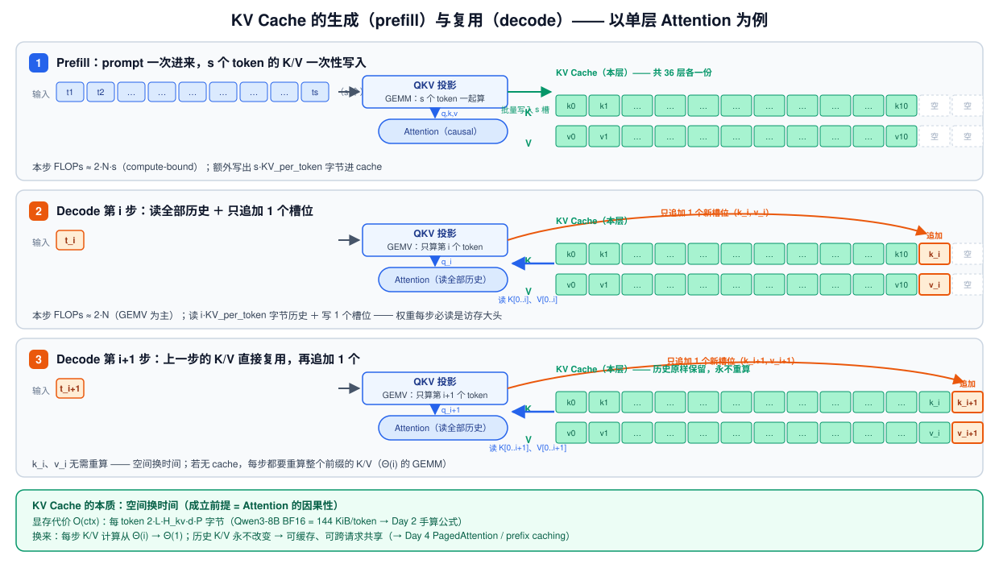
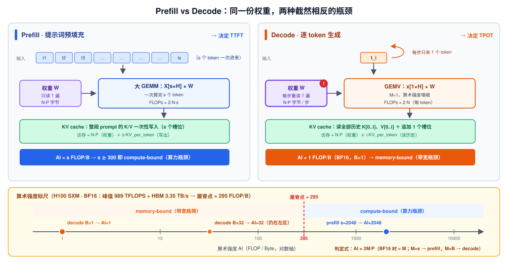
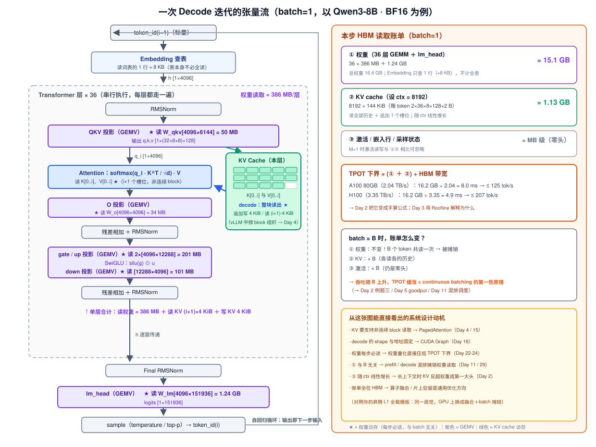

# Day 1 · Transformer 推理机制：Prefill / Decode 与 KV Cache 的第一性原理

> **系列**：推理系统优化专家岗 · 56 天打卡 | 第 1 周「推理基础与性能建模」
> **今日位置**：整个计划的地基——后面 55 天的所有优化手段（PagedAttention、量化、投机解码、P/D 分离……），本质上都在**改变今天推导出来的两张账单**
> **前置要求**：无（今天是第一天）
> **预计用时**：2.5 ~ 3.5 小时（精读 1.5h + 实验 1h + 整理笔记 0.5h）
> **背景衔接**：你做过昇腾 `WeightQuantBatchMatmulV2` 的窄 M 优化（ASW / L1 全载模板、`CalRebalanceBlock` 的访存-计算 bound 分界模型）。今天的任务是把这套直觉**原样搬到 GPU**，并升级成能手算的公式。
> **配套材料**：`week1/README.md` 的 Day 1 节是本篇的浓缩版，可作为学完后的复习卡片。

---

## 0. 今日学习目标

完成今天的学习后，你应该能够：

- [ ] 用**算术强度（Arithmetic Intensity, AI）**这一把尺子，推导出 prefill 是 compute-bound、decode 是 memory-bound——而不是背结论
- [ ] 讲清 **KV cache 的生成（prefill 批量写）与复用（decode 读历史 + 追加 1 槽）**，以及"空间换时间"为什么成立（数学前提：因果性）
- [ ] **手画**一次 decode 迭代的完整张量流，标注每一步的 shape 和访存来源（权重 / KV / 激活）
- [ ] 给定模型配置（层数 / 头数 / 维度 / 精度），**手算** decode 每步的权重读取字节数、KV 每 token 字节数
- [ ] 说出这套分析和你的昇腾窄 M 算子优化是**同一个问题的两种平台表达**

---

## 1. 核心概念速览

| 概念 | 一句话定义 | 今日要达到的深度 |
|---|---|---|
| 自回归生成 | 逐 token 循环：`token(i) = sample(P(x_i \| x_{<i}))`，输出即下一步输入 | 能画出闭环 |
| **Prefill（预填充）** | prompt 一次进来，算完所有位置的隐状态并生成第一个输出 token | 能推 FLOPs / 访存 |
| **Decode（解码）** | 每步只进 1 个 token（batch 维为 B），产出 1 个新 token | 能推 FLOPs / 访存 |
| GEMM vs GEMV | prefill 是 M=s 的大矩阵乘；decode 是 M=B（常为 1~256）的窄矩阵乘/矩阵-向量乘 | 会用 M 解释 AI |
| **算术强度 AI** | FLOPs ÷ 访存字节数（FLOP/B），与 Roofline 屋脊点比较判定瓶颈 | 会推导 AI = 2M/P |
| **KV cache** | 每层每 token 的 K、V 向量缓存，decode 时免于重算历史 | 能手画生成与复用 |
| GQA | 多个 Q 头共享少量 KV 头（H_kv ≪ H_q），直接决定 KV cache 大小 | 知道它影响哪一项 |
| TTFT / TPOT | prefill 决定首 token 时延；decode 决定后续每 token 间隔 | 知道两阶段各自对应哪个 SLO |

> **一句话本质**：prefill 把权重从 HBM 搬一次就能算 **s 个 token** 的活，摊销之后算力是瓶颈；decode 每算 **1 个 token** 都要把**全部权重**从 HBM 搬一遍，带宽是瓶颈。

---

## 2. 原理深入讲解

### 2.1 LLM 推理在做什么：一个自回归循环

Transformer 推理不是"一次前向"，而是一个循环：

$$
x_{t} \sim P(x_t \mid x_1, x_2, \dots, x_{t-1}), \qquad t = 1, 2, \dots
$$

每一步：把上一步采样的 token 喂进模型 → 前向计算 → 得到词表上的 logits → 采样出下一个 token → **再喂回去**。生成的序列越来越长，直到 EOS 或达到 max_tokens。

这个朴素的循环里藏着一个关键的非对称性：

- **第一步之前**，prompt 的 $s$ 个 token 是**同时已知**的——它们之间没有数据依赖，可以一次性并行计算；
- **开始生成之后**，第 $i$ 个输出 token 依赖第 $i-1$ 个的采样结果——**串行，无法并行**。

这就是 prefill 与 decode 一切差异的根源：**并行度**。并行度决定了矩阵乘的形状 M，M 决定了算术强度，算术强度决定了瓶颈。这个因果链我们将在 §3.2 一环环推导。

### 2.2 KV Cache 为什么可行：因果性是数学前提

标准 Attention 中，位置 $i$ 的输出为：

$$
\text{out}_i = \sum_{j \le i} \text{softmax}\!\left(\frac{q_i \cdot k_j}{\sqrt{d}}\right) v_j
$$

注意求和上限是 $j \le i$（因果掩码）。这带来两个可缓存性质：

1. **不变性**：$k_j, v_j$ 只依赖 token $j$ 及其之前的位置（且各层输入在 prefill 后已固定），**生成过程中永不改变**——算一次即可反复用；
2. **单调增长**：每生成一个新 token，只是**新增**一对 $k_i, v_i$，不影响已有槽位。

如果没有 KV cache，第 $i$ 步生成时要把前缀 $x_{1..i}$ 整个重新过一遍 L 层网络来重算所有 $k_j, v_j$：

| | 无 KV cache | 有 KV cache |
|---|---|---|
| 第 $i$ 步的 K/V 计算 | $\Theta(i)$ 的 GEMM（重算全部历史） | $\Theta(1)$（只算新 token 的 $k_i, v_i$） |
| 生成 $s$ 个 token 的总计算 | $\Theta(s^2)$ | $\Theta(s)$ |
| 代价 | — | **显存**：每 token $2 \cdot L \cdot H_{kv} \cdot d \cdot P$ 字节（→ Day 2 公式） |

> **要点**：KV cache 是典型的**空间换时间**。它也是整个推理系统围绕旋转的核心对象——PagedAttention（Day 4）、prefix caching（Day 16）、KV 量化（Day 23）、P/D 分离的传输（Day 29-31），全部是在管理/搬运/压缩这块显存。

### 2.3 KV Cache 的生成（prefill）与复用（decode）



对照上图，把三个时刻的动作说清楚：

**Prefill（时刻 1）**：prompt 的 $s$ 个 token 一次进入，QKV 投影是一次 $M = s$ 的大 GEMM，产出的 $k_{0..s-1}, v_{0..s-1}$ **批量写入** cache 的 $s$ 个槽位。Attention 因为因果掩码只看下三角，最后一个位置的输出经过 lm_head 采样得到**第一个输出 token**。

**Decode 第 $i$ 步（时刻 2）**：只有 1 个新 token 进入，QKV 投影退化为 GEMV，只产出 $q_i, k_i, v_i$ 三个向量；$k_i, v_i$ **追加写入**第 $i$ 个槽位；Attention 把 $q_i$ 与 cache 里**全部** $K[0..i], V[0..i]$ 做点积——注意"读全部历史"这个动作，是 decode 访存账单的第二大项。

**Decode 第 $i+1$ 步（时刻 3）**：上一步写入的 $k_i, v_i$ 已经"固化"为可复用的历史，本步只追加一对新槽位。**已生成的槽位永不重算**——这就是 cache 的含义。

> **易错点 1**：prefill 也要写 KV cache，而且是一次写 $s$ 个槽位——"prefill 只算不写"是错误印象。
>
> **易错点 2**：decode 每步**既要读也要写** cache（读全部历史 + 写 1 个槽位），只是写量远小于读量。

### 2.4 Prefill vs Decode：本质区别一张表



| 维度 | Prefill（预填充） | Decode（解码） |
|---|---|---|
| 输入 shape | prompt 一次进来，序列长度 $s$（几百~几万） | 每步 1 个 token，batch 维 $B$ |
| 矩阵形态 | **GEMM**（M = s 或 s×B） | **GEMV / 窄 M 的 GEMM**（M = B，通常 1~256） |
| 瓶颈 | **计算密集（compute-bound）** | **访存密集（memory-bandwidth-bound）** |
| 每读 1 字节权重算多少 FLOP | $\sim s$ FLOP/B（s 越大越高） | $\sim 1$ FLOP/B（BF16, B=1） |
| KV cache 行为 | 批量**写入**整段 prompt 的 K/V（s 个槽位） | 每步**读全部历史** + 追加 1 个槽位 |
| 时延敏感度 | 决定 **TTFT** | 决定 **TPOT / ITL** |
| 对应你的昇腾经验 | 大 M 大 N 的 GEMM，tiling 拼 Cube 利用率 | **M ≤ 256 窄 M 场景**（你的 L1 全载模板正是为此设计） |

注意上表没有一个字提到"实现"——prefill/decode 的差异**完全来自自回归的数据依赖**，与框架、硬件无关。这就是为什么 vLLM、TensorRT-LLM、SGLang 的架构都天然围着这两个阶段转。

### 2.5 一次 Decode 迭代的张量流（手画参考）



以 batch=1、第 $i$ 步、Qwen3-8B（$L{=}36$，$H{=}4096$，$H_q{=}32$，$H_{kv}{=}8$，$d{=}128$，词表 151936，BF16）为例，逐层走一遍（**建议照着右侧账单，在白纸上画一遍**）：

```text
token_id(i-1)                          # 标量
  │  Embedding 查表：读词表 1 行 ≈ 8 KB（表不全读）
  ▼
h ∈ R^{1×4096}
  │
  ├─► 对每一层 ℓ = 0..35（串行）：
  │     ├─ RMSNorm
  │     ├─ QKV 投影（GEMV）             # ★ 读 W_qkv[4096×6144] = 50 MB
  │     ├─ q_i 供本层 attention 使用
  │     ├─ k_i, v_i 追加写入该层 KV cache 槽位（4 KiB）
  │     ├─ Attention（gather kernel）   # ★ 读该层全部 K[0..i], V[0..i]
  │     │    scores = q_i·K^T/√d → softmax → ·V
  │     ├─ O 投影（GEMV）               # ★ 读 W_o[4096×4096] = 34 MB
  │     ├─ 残差 + RMSNorm
  │     └─ MLP：gate/up GEMV → SwiGLU → down GEMV
  │          # ★ 读 W_gate,W_up 2×[4096×12288] = 201 MB，W_down[12288×4096] = 101 MB
  ▼
final RMSNorm → lm_head（GEMV）         # ★ 读 W_lm[4096×151936] = 1.24 GB
  ▼
logits [1×151936] → sample → token_id(i)   # 回到顶部：自回归闭环
```

**画完图要能回答的问题**：这一步总共从 HBM 读了多少字节？

- 权重（36 层 GEMM + lm_head）≈ **15.1 GB**（粗估 $N \cdot P$ = 16.4 GB，差别在 Embedding 只查 1 行）
- KV cache = ctx × 144 KiB（ctx=8K 时 ≈ 1.13 GB）
- 激活 / 嵌入行 / 采样状态 ≈ MB 级零头

**≈ 全部权重 + 全部 KV + 零头**——这就是 Day 2 decode 时延下界公式的来源。

---

## 3. 数学推导：Prefill / Decode 的计算量与访存量（今日核心产出）

### 3.1 记号表

| 记号 | 含义 | Qwen3-8B 取值 |
|---|---|---|
| $N$ | 总参数量 | 8.2 B |
| $L$ | 层数 | 36 |
| $H$ | hidden_size（$= H_q \cdot d$） | 4096 |
| $d$ | head_dim | 128 |
| $H_q$ / $H_{kv}$ | Q 头数 / KV 头数（GQA） | 32 / 8 |
| $F$ | FFN 中间维（SwiGLU，3 个矩阵） | 12288 |
| $s$ | prompt 长度（prefill 的 M） | — |
| $B$ | batch（decode 的 M） | — |
| $P$ | 每参数字节数 | BF16=2，FP8=1，INT4=0.5 |
| $|\mathcal{V}|$ | 词表大小 | 151936 |

### 3.2 一把尺子：GEMM 的算术强度 AI = 2M/P

一个线性层 $Y = XW$，其中 $X \in \mathbb{R}^{M \times K}$，$W \in \mathbb{R}^{K \times N_{out}}$：

$$
\text{FLOPs} = 2 \cdot M \cdot K \cdot N_{out}, \qquad
\text{bytes} \approx K \cdot N_{out} \cdot P \;(\text{权重}) + \underbrace{M K + M N_{out}}_{\text{激活，} M \ll K, N_{out} \text{ 时为零头}}
$$

$$
\boxed{\; \text{AI} \;=\; \frac{2 M K N_{out}}{K N_{out} P} \;=\; \frac{2M}{P} \;}
\qquad \xrightarrow{\;P=2\;} \quad \text{AI} \approx M \;(\text{BF16})
$$

**这是全篇最重要的一个式子**：GEMM 的算术强度只由"行数" M 和精度 P 决定，与矩阵多宽多大无关。

- prefill：$M = s$（几百~几万）→ AI ≈ s
- decode：$M = B$（1~256）→ AI ≈ B

与硬件屋脊点比较（= 峰值算力 ÷ HBM 带宽）：

| 硬件（BF16） | 峰值算力 | HBM 带宽 | 屋脊点（ridge） |
|---|---|---|---|
| A100 80GB SXM | 312 TFLOPS | 2.04 TB/s | ≈ **153** FLOP/B |
| H100 SXM | 989 TFLOPS | 3.35 TB/s | ≈ **295** FLOP/B |

于是判定一目了然（见 SVG 图底部的标尺）：

- **decode**（B=1，BF16）：AI ≈ 1，距离屋脊 **153~295 倍** → 权重搬运占绝对主导，**memory-bound**。B=32 时 AI≈32 仍在屋脊左侧——batch 拉到几百才勉强摸到分界，且那时 KV 访存早已涨上来（§3.6）。
- **prefill**（s ≳ 300，BF16）：AI ≈ s 超过屋脊 → **compute-bound**。真实 prompt 一般 ≥ 几百 token，所以 prefill 几乎总是 compute-bound。

> **与昇腾经验对接**：这个判定式就是你 `CalRebalanceBlock` 里"L2/HBM 带宽 vs Cube 算力分界模型"的 GPU 版——同一套第一性原理，只是把 Cube 吞吐换成 SM 算力、把 DDR 带宽换成 HBM 带宽。Day 3 会正式把它升级为 Roofline 模型并配上 ncu 实测方法。

### 3.3 Prefill 账单（每请求，prompt 长 s）

**FLOPs**（两段）：

$$
\text{FLOPs}_{\text{prefill}} = \underbrace{2 N s}_{\text{线性层 GEMM}} + \underbrace{2 L H s^2}_{\text{因果 attention（QK}^T\text{T 与 ·V，各 } 2 s^2 H \text{ 取半）}}
$$

attention 项 $O(s^2)$ 在 s 大时不可忽略：Qwen3-8B、s=8192 时线性项 134 TFLOP、attention 项 20 TFLOP，**占比 ~15%**，且随 s 二次增长。

**访存**：

$$
\text{bytes}_{\text{prefill}} \approx \underbrace{N P}_{\text{权重读 1 遍}} + \underbrace{s \cdot \text{KV\_per\_token}}_{\text{KV 写出}} \;(+ \text{激活读写，一阶忽略})
$$

**判定**：$\text{AI} \approx 2s/P$ ∝ s。数量级验证（Qwen3-8B, s=8192, A100）：计算 154 TFLOP ÷ 312 TFLOPS ≈ **494 ms**；访存 16.4 GB ÷ 2.04 TB/s ≈ **8 ms**。计算时间是访存时间的 **60 倍**——铁定的 compute-bound。

### 3.4 Decode 账单（每步，batch=B）

**FLOPs**：

$$
\text{FLOPs}_{\text{decode}} = \underbrace{2 N B}_{\text{每 token 约 2N}} + \underbrace{4 L H \cdot \text{ctx} \cdot B}_{\text{attention：QK}^T \text{与 ·V}}
$$

（Qwen3-8B、ctx=8K 时 attention 项 ≈ 4.8 GFLOP，约为线性项 16.4 GFLOP 的 30%——二阶但不为零。）

**访存**：

$$
\text{bytes}_{\text{decode}} \approx \underbrace{N P}_{\text{★ 权重读 1 遍，与 } B \text{ 无关！}} + \underbrace{B \cdot \text{ctx} \cdot \text{KV\_per\_token}}_{\text{各读各的历史 KV}} + \text{激活零头}
$$

**判定**：权重部分 AI $= 2B/P$，BF16、B=1 时 = **1 FLOP/B**，距屋脊 153~295 倍 → **memory-bound**。

> **易错点 3（高频考点）**：decode 的权重访存**不随 B 增长**。B 个序列共用同一份权重，读一次就能服务所有序列——这不是实现技巧，是 GEMM 本身的性质（把 B 个行向量拼成一个 $B \times H$ 的矩阵乘同一个 $W$）。

### 3.5 数值实例：Qwen3-8B 逐项拆解（背下来这个流程）

**第一步：把 $N$ 拆开**（面试白板常从"你们模型多大"开始追问）：

| 组件 | 形状 | 参数量 | BF16 字节 |
|---|---|---|---|
| 每层 QKV 投影 | $4096 \times (32{+}8{+}8) \cdot 128$ | 25.2 M | 50 MB |
| 每层 O 投影 | $4096 \times 4096$ | 16.8 M | 34 MB |
| 每层 MLP（gate+up+down） | $3 \times 4096 \times 12288$ | 151.0 M | 302 MB |
| **每层小计** | | **192.9 M** | **386 MB** |
| 36 层合计 | | 6.95 B | 13.9 GB |
| lm_head | $4096 \times 151936$ | 0.62 B | 1.24 GB |
| Embedding 表 | $151936 \times 4096$ | 0.62 B | 1.24 GB（只查表，不全读） |
| **总计** | | **≈ 8.2 B** | **16.4 GB** |

**第二步：decode batch=1 每步权重读取**：

$$
36 \times 386\,\text{MB} + 1.24\,\text{GB} \approx 13.9 + 1.24 \approx \mathbf{15.1\ GB}
$$

（粗估 $N \cdot P = 16.4$ GB 高估 ~8%——高估的部分是 Embedding 表，它每步只读 1 行 ≈ 8 KB。）

**第三步：KV 每 token**：

$$
\text{KV\_per\_token} = 2 \times L \times H_{kv} \times d \times P = 2 \times 36 \times 8 \times 128 \times 2\,\text{B} = 147{,}456\,\text{B} = \mathbf{144\ KiB}
$$

（注意乘的是 $H_{kv}=8$ 不是 $H_q=32$——GQA 让 KV cache 缩小 4 倍。显存公式的完整展开是 Day 2 的主题。）

**第四步：与屋脊点对账**：本步 FLOPs ≈ 2N = 16.4 GFLOP，读 15.1 GB 权重 → 权重部分 AI ≈ 1.04 FLOP/B，距 H100 屋脊 295 差 **~280 倍**。若翻到 compute-bound，本步只需 16.4 GFLOP ÷ 989 TFLOPS ≈ **17 µs**；而按带宽算是 15.1 GB ÷ 3.35 TB/s ≈ **4.5 ms**。两者差 260+ 倍——**decode 的算力几乎全程空转，时间都花在搬权重上**。

### 3.6 Batch 摊销：TPOT 与吞吐的"剪刀差"

把 §3.4 的账单按不同 B 展开（Qwen3-8B BF16，A100 80GB，ctx=8K，每序列 KV = 8192 × 144 KiB ≈ 1.13 GB）：

| B | 访存量 = 权重 + KV | TPOT 下界 | 吞吐下界 |
|---|---|---|---|
| 1 | 15.1 + 1.1 = 16.2 GB | 7.97 ms | 125 tok/s |
| 8 | 15.1 + 9.0 = 24.1 GB | 11.8 ms | 676 tok/s |
| 32 | 15.1 + 36.2 = 51.3 GB | 25.1 ms | **1272 tok/s** |

**读法**：TPOT 只涨 3.1 倍，吞吐涨 10.2 倍——权重读取被 batch 摊销。这就是 **continuous batching 提高吞吐的第一性原理**，同时 TPOT 上涨就是用户体感的代价，SLO 决定 batch 上限（→ Day 5 goodput）。

**翻转条件思考**（面试加分）：B 很大时，每序列的 KV 读取时间 $\text{ctx} \cdot \text{KV\_per\_token} / \text{BW}$ 与每 token 计算时间 $2N / \text{峰值算力}$ 谁大？H100 FP8 + ctx=4096 时：~0.2 ms vs ~0.07 ms → 仍然访存 bound；只有"短上下文 + 超大 batch"才可能翻进 compute-bound。**decode 在绝大多数真实负载下稳稳是带宽瓶颈**——这句话是第 4 周投机解码（用算力换带宽）和第 5 周 P/D 分离的全部动因。

### 3.7 与昇腾经验的映射表

| 今天的概念 | 昇腾侧（你的经验） | GPU / vLLM 侧 |
|---|---|---|
| decode 的 GEMV（M=1~256） | **L1 全载模板**：A/权重一次 Nd2Nz 搬入 L1 驻留，重复搬运从 $O(n \cdot A)$ 降到 $O(A)$ | 无大 SRAM 驻留能力（SMEM 仅 ~228 KB/SM）→ 走 **batch 摊销 + 权重量化 + kernel 融合** 路线 |
| AI = 2M/P 判定 | `CalRebalanceBlock` 的 L2/HBM vs Cube 分界建模 | Roofline 模型 + ncu 的 SM busy / DRAM busy（Day 3） |
| 权重量化降账单 | `WeightQuantBatchMatmulV2`：INT4/INT8/FP8 多精度路径 | W8A8 / W4A16 / FP8 量化 serving（Day 22-24） |
| KV cache 追加写 | ——（推理系统层概念，算子层不感知） | 预分配 paged 池 + block table（Day 4 / 15） |

> **方法论迁移主线**（第 8 周面试叙事）：同一套"先量化账单 → 判定 bound → 逼近理论上限"的方法，在昇腾上作用于单个算子的 tiling，在 GPU 推理系统上作用于整个 serving 的调度与显存管理。今天的两张账单就是"量化账单"这一步。

---

## 4. 关键代码与伪代码

### 4.1 伪代码：无 cache vs 有 cache

```python
# ============ 版本 A：无 KV cache（每步全前缀重算）============
tokens = prompt                                # 长度 s
for i in range(s_gen):
    logits = model_forward(tokens)             # 整个前缀过 L 层：Θ(i) GEMM
    nxt = sample(logits[-1])                   # 只用最后一个位置的 logits
    tokens.append(nxt)
# 总 GEMM 量 Θ(Σi) = Θ(s²)；第 i 步时延随 i 线性变差（用户可感知的越写越慢）

# ============ 版本 B：有 KV cache =============
past_kvs = None                                # 每层一对 (K, V)
tokens = prompt
logits, past_kvs = model_forward(tokens, cache=past_kvs)   # prefill：一次 GEMM + 批量写 cache
nxt = sample(logits[-1])
for i in range(s_gen - 1):
    logits, past_kvs = model_forward([nxt], cache=past_kvs)  # decode：GEMV + 读历史 + 追加 1 槽
    nxt = sample(logits)
# 总 GEMM 量 Θ(s)；每步时延近似常数
```

**但版本 B 有一个工程陷阱**：如果 `cache` 用 `torch.cat` 拼接实现，每步都要把**整个历史 KV 拷贝一遍**再追加——每步 $O(\text{ctx})$ 的额外拷贝，ctx 越长越致命，还带来碎片。vLLM 的做法是**启动时预分配一整块 KV 池，按 block 切分，用 block table 做逻辑位置 → 物理 block 的映射**，追加写 = 在已分配的 block 里写一个槽位，零拷贝、零碎片（这是 Day 4 PagedAttention 的核心动机，今天先记住这个"为什么"）。

### 4.2 与 vLLM V1 的实际联系：这两个阶段在代码里长什么样

> **版本说明**：以下调用链以 2025 年中期的 vLLM（v0.10 / v0.11 前后）的 `vllm/v1/` 代码为参照。V1 仍在快速演进（例如 `LLMEngine` 在较新版本中拆分出 `CoreEngine`），**类名/函数名可能随版本变化**，走读时以你环境里的实际代码为准；本文保证的是链路的**结构与角色**。

V1 是多进程架构：API 进程里的 `AsyncLLM` 通过消息队列与独立的 `EngineCore` 进程通信。一次 decode step 的完整链路：

```text
AsyncLLM.generate()                              # API 进程（OpenAI/LLM 入口）
  └─(ZMQ)──► EngineCore 进程                     # vllm/v1/engine/llm_engine.py
       ├─ Processor.process_inputs()             # vllm/v1/engine/processor.py
       │    tokenize → 构造 Request → add_request()
       ├─ Scheduler.schedule()                   # vllm/v1/core/scheduler.py
       │    · 维护 waiting / running 两个队列（FCFS + 优先级）
       │    · 按 max_num_batched_tokens 的 token budget 决定本 step 调谁
       │    · 本 step 谁做 prefill（长 prompt 会被切块）、谁做 decode
       │      —— prefill 块与 decode token 可以混排在同一个 batch！
       │    → SchedulerOutput（含各请求新分配的 KV block）
       └─ Worker.execute_model(scheduler_output) # vllm/v1/worker/gpu_worker.py
            ├─ GPUModelRunner.prepare_model_input()
            │    # vllm/v1/worker/gpu_model_runner.py
            │    · 把本 step 所有 token 拼成 input_ids / positions
            │    · 构建 attn_metadata（区分 extend / decode 两条路径）
            └─ model.forward(...)                # PyTorch 模型本体
                 └─ Attention 层 → vllm/v1/attention/backends/*.py
                      · forward_extend()：prefill —— 大 GEMM + 批量写 KV block
                      · forward_decode()：decode —— GEMV + gather 读非连续 KV block
            └─ LogitsProcessor + Sampler          # vllm/v1/sample/
                 logits 处理与采样全部留在 GPU 上 → 采出的 next token
       ──► 输出 token 回传给上层，同时作为下一步输入 —— 自回归闭环
```

用今天的两阶段视角，能直接读出 V1 的四个设计动机（对应 SVG3 右侧的账单）：

| V1 设计 | 对应今天的哪条结论 |
|---|---|
| **chunked prefill：prefill 块与 decode 混排同一 step**（Day 11） | decode 是带宽瓶颈、prefill 是算力瓶颈，混跑让两类资源都不闲；且避免大 prompt 独占 step 造成 TPOT 抖动 |
| **KV 池预分配 + block table**（Day 4 / 15） | decode 每步"读全部历史 + 追加 1 槽"，必须免拷贝、免碎片；`torch.cat` 式 cache 不可行 |
| **decode 走 CUDA Graph**（Day 18） | decode 每步 shape 固定（M=B bucket、张量地址由池化吸收），才有 capture 的前提；prefill 的 M=s 千变万化，不适用 |
| **采样在 device 侧闭环**（`vllm/v1/sample/`） | 自回归循环若每 token 一次 GPU↔CPU 同步，decode 的毫秒级步长会被同步开销淹没 |

另一个值得今天就看一眼的现象：V1 的 `Scheduler` 里**没有单独的 "prefill 引擎 / decode 引擎"**——两阶段在同一个 step 里被统一调度。把它们物理拆开（P/D 分离）是部署形态层面的决策，动机要到 Day 29 才完全展开（预告：混跑时 prefill 的大 GEMM 会挤占 decode 的带宽，互相干扰）。

---

## 5. 动手实验（约 60~90 分钟）

### 实验 1：亲手验证「decode 每 token 代价 ≈ 常数；无 cache 则平方爆炸」

写一个带 GQA + KV cache 的 mini Transformer（2 分钟跑完，CPU 也能出趋势，GPU 上数字更干净）：

```python
# day01_lab.py —— Day 1 实验：prefill/decode 的访存特性 + KV cache 的作用
import time
import torch
import torch.nn as nn
import torch.nn.functional as F

torch.manual_seed(0)
DEV = "cuda" if torch.cuda.is_available() else "cpu"

H, FFN, HQ, HKV, D, L, VOCAB = 1024, 2816, 8, 2, 128, 8, 32000  # mini GQA 模型

class RMSNorm(nn.Module):
    def __init__(self, h):
        super().__init__()
        self.w = nn.Parameter(torch.ones(h))
    def forward(self, x):
        return self.w * x * torch.rsqrt(x.pow(2).mean(-1, keepdim=True) + 1e-6)

class Attn(nn.Module):
    def __init__(self):
        super().__init__()
        self.wq = nn.Linear(H, HQ * D, bias=False)
        self.wk = nn.Linear(H, HKV * D, bias=False)
        self.wv = nn.Linear(H, HKV * D, bias=False)
        self.wo = nn.Linear(HQ * D, H, bias=False)
    def forward(self, x, cache=None):
        B, S, _ = x.shape
        q = self.wq(x).view(B, S, HQ, D).transpose(1, 2)
        k = self.wk(x).view(B, S, HKV, D).transpose(1, 2)
        v = self.wv(x).view(B, S, HKV, D).transpose(1, 2)
        if cache is not None:                       # decode：拼接历史（教学用 cat，
            pk, pv = cache                          # vLLM 用预分配池避免拷贝）
            k = torch.cat([pk, k], dim=2)
            v = torch.cat([pv, v], dim=2)
        cache_out = (k, v)
        rep = HQ // HKV                             # GQA：Q 头共享 KV 头
        k = k.unsqueeze(2).expand(B, HKV, rep, -1, D).reshape(B, HQ, -1, D)
        v = v.unsqueeze(2).expand(B, HKV, rep, -1, D).reshape(B, HQ, -1, D)
        causal = S > 1                              # prefill 需要因果掩码；decode 单 query 不需要
        o = F.scaled_dot_product_attention(q, k, v, is_causal=causal)
        o = o.transpose(1, 2).reshape(B, S, HQ * D)
        return self.wo(o), cache_out

class Block(nn.Module):
    def __init__(self):
        super().__init__()
        self.n1, self.n2 = RMSNorm(H), RMSNorm(H)
        self.attn = Attn()
        self.wg = nn.Linear(H, FFN, bias=False)
        self.wu = nn.Linear(H, FFN, bias=False)
        self.wd = nn.Linear(FFN, H, bias=False)
    def forward(self, x, cache=None):
        a, cache = self.attn(self.n1(x), cache)
        x = x + a
        h = self.n2(x)
        return x + self.wd(F.silu(self.wg(h)) * self.wu(h)), cache

class MiniGPT(nn.Module):
    def __init__(self):
        super().__init__()
        self.emb = nn.Embedding(VOCAB, H)
        self.blocks = nn.ModuleList(Block() for _ in range(L))
        self.norm = RMSNorm(H)
        self.head = nn.Linear(H, VOCAB, bias=False)
    def forward(self, ids, caches=None):
        x = self.emb(ids)
        new_caches = []
        for i, blk in enumerate(self.blocks):
            c = caches[i] if caches is not None else None
            x, c = blk(x, c)
            new_caches.append(c)
        return self.head(self.norm(x)), new_caches

model = MiniGPT().to(DEV).eval()

def timed(fn, warmup=2, rep=5):
    for _ in range(warmup):
        fn()
    if DEV == "cuda":
        torch.cuda.synchronize()
    ts = []
    for _ in range(rep):
        t0 = time.perf_counter()
        fn()
        if DEV == "cuda":
            torch.cuda.synchronize()
        ts.append(time.perf_counter() - t0)
    return min(ts) * 1e3  # ms

def prefill_time(s):
    ids = torch.randint(0, VOCAB, (1, s), device=DEV)
    return timed(lambda: model(ids))

def decode_step_time(ctx):                  # 有 KV cache：每步只算 1 个新 token
    ids = torch.randint(0, VOCAB, (1, ctx), device=DEV)
    _, caches = model(ids)                  # prefill 一次，建好 cache
    nxt = torch.randint(0, VOCAB, (1, 1), device=DEV)
    return timed(lambda: model(nxt, caches))

def naive_step_time(ctx):                  # 无 cache：每步全前缀重算
    ids = torch.randint(0, VOCAB, (1, ctx), device=DEV)
    return timed(lambda: model(ids))

print(f"{'ctx':>6} | {'prefill(ms)':>11} | {'decode+cache(ms)':>16} | {'naive(ms)':>9} | naive/cache")
for s in [512, 1024, 2048, 4096]:
    tp, td, tn = prefill_time(s), decode_step_time(s), naive_step_time(s)
    print(f"{s:>6} | {tp:>11.2f} | {td:>16.2f} | {tn:>9.2f} | {tn / td:>6.1f}x")

# —— 账单对账：decode 每步应读的权重量（剔除 Embedding 表）——
gemm_bytes = sum(p.numel() for n, p in model.named_parameters()
                 if "emb" not in n) * 2                     # BF16
kv_per_tok = 2 * L * HKV * D * 2
ctx = 2048
t = decode_step_time(ctx)
print(f"\nGEMM 权重 = {gemm_bytes / 1e6:.0f} MB, KV/token = {kv_per_tok} B")
print(f"decode 单步实测 {t:.2f} ms → 有效带宽 ≈ "
      f"{(gemm_bytes + ctx * kv_per_tok) / 1e9 / (t / 1e3):.0f} GB/s")
print("对照你的 GPU 标称带宽，看差距有多少（差距的来源 → Day 18 CUDA Graph）")
```

**预期结果**（示例趋势，不同 GPU/版本数值会不同，**重点看比值列**）：

| ctx | prefill (ms) | decode+cache (ms) | naive (ms) | naive / cache |
|---|---|---|---|---|
| 512 | ~4 | ~2.0 | ~4 | 2x |
| 1024 | ~8 | ~2.0 | ~8 | 4x |
| 2048 | ~17 | ~2.1 | ~17 | 8x |
| 4096 | ~38 | ~2.3 | ~38 | **16x+，随 ctx 线性拉大** |

要能对照 §3 解释三个现象：

1. **decode+cache 基本平坦、仅缓慢上涨**：权重项（~246 MB）与 ctx 无关，缓涨来自 KV 读取与 `torch.cat` 拷贝随 ctx 线性增长——正是账单公式 $NP + \text{ctx} \cdot \text{KV\_per\_token}$ 的形状；
2. **naive 随 ctx 线性增长**（总代价平方）：无 cache 时每步重算全前缀；
3. **prefill 时延 ≈ naive 单步时延**：两者都是"一次 M=ctx 的 GEMM"，印证 prefill 与"重算"在矩阵形态上是同一件事。

### 实验 2：从 decode 步时延反推有效带宽（Roofline 初体验）

实验 1 最后一行已经算了**有效带宽**。对一张标称 1~2 TB/s 的卡，你会看到这个 mini 模型的 decode 有效带宽大概率只有 **100~300 GB/s**——远低于标称。

**为什么？** 模型太小（每步只搬 246 MB），步长被 **kernel 启动开销 / 调度 / 逐层小 kernel 串行**支配（36 层 × 每层 5+ 个小 GEMV，全是微秒级 kernel）。两条出路：

- **系统层**：CUDA Graph 把整个 decode step 录制成一张图，消除逐 kernel 启动（→ Day 18 vLLM 为什么必须用它）；
- **负载层**：真实 8B+ 模型每步搬 15 GB，kernel 足够"肥"，启动开销占比自然下降——所以生产系统的 decode 才真正贴着带宽瓶颈跑。

可选加深（有 GPU 时）：用 `torch.profiler` 看一个 decode step 的时间都花在哪：

```python
from torch.profiler import profile, ProfilerActivity
ids = torch.randint(0, VOCAB, (1, 2048), device=DEV)
_, caches = model(ids)
nxt = torch.randint(0, VOCAB, (1, 1), device=DEV)
with profile(activities=[ProfilerActivity.CPU, ProfilerActivity.CUDA]) as prof:
    model(nxt, caches)
print(prof.key_averages().table(sort_by="cuda_time_total", row_limit=8))
```

预期看到大量 `gemv`/`ampere_gemv`（或小 `gemm`）kernel 占据时间，单个都很小——这就是"访存 bound 但没喂饱带宽"的微观形态。

---

## 6. 面试高频问题（含答题骨架）

**Q1：为什么 prefill 是 compute-bound，decode 是 memory-bound？**（几乎必考）

> 答题骨架：不要背结论，用 AI 推导。① 线性层的 AI = FLOPs/bytes = 2M/P，只由 GEMM 的行数 M 决定；② prefill 的 M = prompt 长度 s（几百~几万），AI ≈ s，超过屋脊点（A100≈153 / H100≈295 FLOP/B）→ 算力瓶颈；③ decode 的 M = batch B（通常 1~256），BF16、B=1 时 AI ≈ 1，距屋脊 150~300 倍 → 带宽瓶颈。根源是自回归的数据依赖：prompt 内部可并行、生成只能串行。
> 加分：给出"若 compute bound，Qwen3-8B 单步只需 17 µs；实际按带宽算是 4.5 ms，差 260 倍"这类数字。

**Q2：batch 从 1 升到 32，decode 每步的 FLOPs 和权重访存各变多少？由此推出什么？**

> FLOPs ×32（2NB）；权重访存**不变**（NP，B 个 token 共读一次权重）。推论：① 吞吐近似 ×32（直到 KV 访存或算力追上来），TPOT 只缓涨——这就是 continuous batching 的第一性原理；② batch 是 decode 阶段"免费的"性能杠杆，上限由 KV 显存和 TPOT SLO 决定（→ Day 5 goodput）。

**Q3：KV cache 为什么可行？代价是什么？**

> 可行性：Attention 因果性 → 历史 token 的 k/v 在生成中不变 → 算一次可反复用（不变性 + 单调增长）。收益：总计算从 Θ(s²) 降到 Θ(s)，每步 K/V 计算从 Θ(i) 降到 Θ(1)。代价：显存 O(ctx)，每 token 2·L·H_kv·d·P 字节——Qwen3-8B BF16 是 144 KiB/token，8K 上下文单序列 1.13 GB；由此衍生出整个 KV 管理子系统（PagedAttention、prefix caching、KV 量化、P/D 分离的传输）。

**Q4：GQA 中 H_kv < H_q，影响的是计算量还是访存量？具体影响哪几项？**

> 只影响 **KV 相关项**：KV cache 显存与读取（× H_kv/H_q 的比例缩小）、KV 投影的 FLOPs/权重；**不影响** Q/O 投影与 attention 主体的计算量（由 H_q 决定）。数字感：Llama-3-70B 64 Q 头 vs 8 KV 头，KV cache 缩小 8 倍——没有 GQA，大并发 serving 根本做不了。

**Q5：lm_head 的 GEMV 每步要读多少？占总权重多少？**

> 以 Llama-3-70B 为例：8192 × 128256 × 2B ≈ **2.1 GB**（注意：网上流传的"8.6 GB"是错的——那相当于 H≈33.5k）。占总权重 141 GB 的 ~1.5%。大头其实在 80 层的层内 GEMM。这个小题考的是**数字敏感度**：能当场验算一个"听起来合理"的数字。

**Q6：如果让你优化 decode 的 TPOT，从今天的第一性原理出发有哪些方向？**

> 账单是 TPOT ≥ (NP + B·ctx·KV_per_token)/BW，围绕三项做：① **减权重字节**：W4A16 / FP8 权重量化（×2~×4）；② **减 KV 字节**：KV cache 量化、GQA/MLA、限制 ctx；③ **摊销与开销**：加大 batch、CUDA Graph 消除 kernel 启动、算子融合减少激活往返；④ **换资源**：投机解码用（闲置的）算力换（稀缺的）带宽（Day 25）；⑤ **堆带宽**：多卡 TP 分摊权重读取（Day 32）。能按账单分类作答，而不是零散报菜名，就是加分项。

---

## 7. 今日总结

1. **一切差异源于自回归的数据依赖**：prompt 内部可并行（M=s 的大 GEMM），生成必须逐 token 串行（M=B 的 GEMV）。
2. **一把尺子**：线性层 AI = 2M/P（BF16 下 ≈ M）。prefill AI ≈ s ≳ 300 → compute-bound；decode AI ≈ B ≈ 1 → memory-bound，距屋脊 150~300 倍。
3. **两张账单**：prefill 每请求 FLOPs ≈ 2Ns + 2LHs²、访存 ≈ NP + s·KV_per_token；decode 每步 FLOPs ≈ 2NB、访存 ≈ **NP（与 B 无关）** + B·ctx·KV_per_token。
4. **KV cache = 空间换时间**：因果性保证历史 K/V 不变，总计算 Θ(s²)→Θ(s)；代价是 O(ctx) 显存，它是后续所有显存管理技术的核心对象。
5. **Qwen3-8B 记住一组数**：权重 16.4 GB（每步 GEMM 读 15.1 GB）、KV 144 KiB/token、ctx=8K 单序列 1.13 GB、A100 上 TPOT 下界 ≈ 8 ms。
6. **vLLM V1 的四个设计**都能从今天的账单读出：chunked prefill 混排、KV 池 + block table、decode CUDA Graph、device 侧采样闭环。

---

## 8. 今日自测题（先自己做，再展开答案）

**Q1**：用算术强度推导 prefill vs decode 的瓶颈归属（不要背结论）。

<details><summary>参考答案</summary>

线性层 $Y=XW$，$X$ 为 $M \times K$：FLOPs = 2MKN，bytes ≈ KNP（权重主导，M 小时激活是零头），故 AI = 2M/P，BF16 下 ≈ M。prefill 的 M = s（数百以上）→ AI 超过屋脊点（A100 153 / H100 295 FLOP/B）→ compute-bound；decode 的 M = B（常为 1~256）→ BF16 B=1 时 AI=1，距屋脊 150~300 倍 → memory-bound。根源：自回归数据依赖决定了两阶段的并行度差异。
</details>

**Q2**：batch 从 1 升到 32，decode 每步 FLOPs 变多少？权重访存变多少？由此推出什么？

<details><summary>参考答案</summary>

FLOPs ×32（= 2NB）；权重访存不变（= NP，B 个序列共读一次权重）。推论：吞吐近线性上升而 TPOT 仅缓涨（被摊销的权重 + 线性增长的 KV）→ continuous batching 提吞吐的第一性原理；batch 上限由 KV 显存与 TPOT SLO 决定。
</details>

**Q3**：GQA 中 H_kv < H_q，影响的是计算量还是访存量？影响哪一部分？

<details><summary>参考答案</summary>

影响**访存（和 KV 投影的少量计算）**，不影响 attention 主体的计算量。具体：KV cache 显存与 decode 每步的 KV 读取按 H_kv 缩小（Qwen3-8B：32→8 头，KV 项 ×1/4）；QK^T 与 ·V 的 FLOPs 由 H_q 决定，不变；Q/O 投影权重与 FLOPs 也不变。
</details>

**Q4**：验证一个流传的说法——"Llama-3-70B 的 lm_head 每步 GEMV 要读 8.6 GB"。

<details><summary>参考答案</summary>

错。lm_head = H × |V| = 8192 × 128256 ≈ 1.05 B 参数，BF16 下 ≈ **2.1 GB**（8.6 GB 相当于 H≈33.5k，不存在这种配置）。占总权重 141 GB 的 ~1.5%。教训：面试中遇到"听起来合理"的数字要能当场量级验算。
</details>

**Q5**：vLLM 为什么不用 `torch.cat` 式的 KV cache，而要预分配 block 池？

<details><summary>参考答案</summary>

`cat` 每步要把整个历史 KV 拷贝一遍（每步 O(ctx) 字节的额外读写），且反复分配释放带来碎片和 allocator 压力。预分配池 + block table 让"追加 1 个槽位"变成在已分配 block 内的原位写，零拷贝；同时 block 化带来 prefix 共享、按需分配、抢占换出等系统级能力（→ Day 4）。
</details>

---

## 9. 今日产出物

按计划，今天要交付笔记**《prefill/decode 计算与访存量推导》**。归档要求：

- [ ] 用自己的话（不看本篇）重写 §3.2–§3.5 的推导：记号表 → AI = 2M/P → prefill/decode 两栏账单 → Qwen3-8B 数值代入
- [ ] 关键数字单独成行（面试抽背用）：Qwen3-8B 权重 16.4 GB / 每步 GEMM 读 15.1 GB / KV 144 KiB/token / A100 TPOT 下界 8 ms
- [ ] 白纸手画一次 decode 迭代张量流（对照 `assets/day01_decode_iteration_tensor_flow.svg` 自查：每处 shape、每个 ★ 的字节来源）
- [ ] 附实验 1 的数据表 + 一句话结论（naive/cache 比值随 ctx 的增长）
- [ ] 标注 1 个"今天没完全搞懂、明天再看"的点（诚实记录）

建议笔记骨架（直接抄）：

```markdown
# prefill/decode 计算与访存量推导（Day 1）
## 1. 记号表（N, L, H, d, H_q, H_kv, s, B, P）
## 2. 核心推导：AI = 2M/P，屋脊点判定
## 3. Prefill 账单：FLOPs = ___；bytes = ___；判定 = ___
## 4. Decode 账单：FLOPs = ___；bytes = ___（注意权重项与 B 无关）；判定 = ___
## 5. 数值代入：Qwen3-8B（含权重逐项拆解表）
## 6. batch 摊销表（B=1/8/32）与推论
## 7. 手画张量流（拍照贴图）+ 自查清单
## 8. 实验数据与结论
```

---

## 10. 明日预告（Day 2）

今天我们得到了两张"字节数"账单，但还没有把它变成**时延和显存**的工程数字。明天（Day 2，面试必考）：

- KV cache 每 token 显存公式 $2 \times L \times H_{kv} \times d \times P$ 的完整推导与常见模型速查表
- **Decode 单 token 理论时延下界 ≈ 模型参数字节数 / HBM 带宽**——今天 §3.5 第四步的正式化
- 手算练习：Llama-3-70B FP8 在 H100 上 batch=1 的 TPOT 下界？2×H100 能并发多少 4K 请求？
- 产出：3 道手算题的完整推导过程

> 打卡：完成后在 README 的 Day 1 前打勾，并写一句话收获（例："今天把 decode 时延下界跟带宽的关系亲手算了一遍，15.1 GB / 2 TB/s ≈ 8 ms，和 vLLM 实测 TPOT 对上了量级"）。
