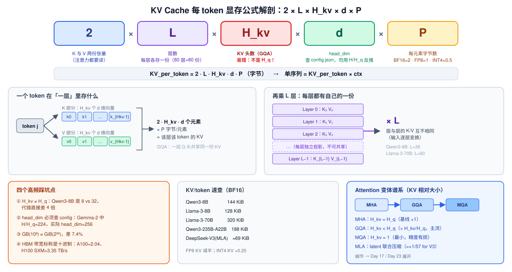
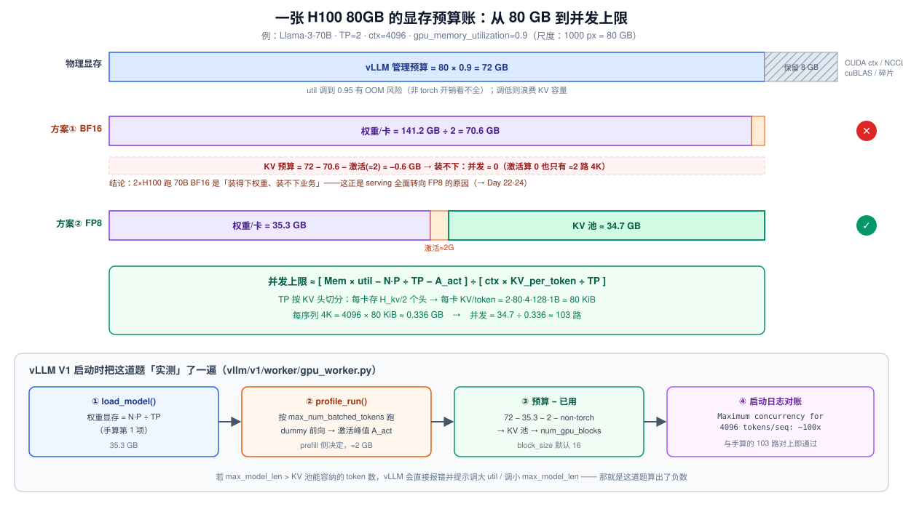
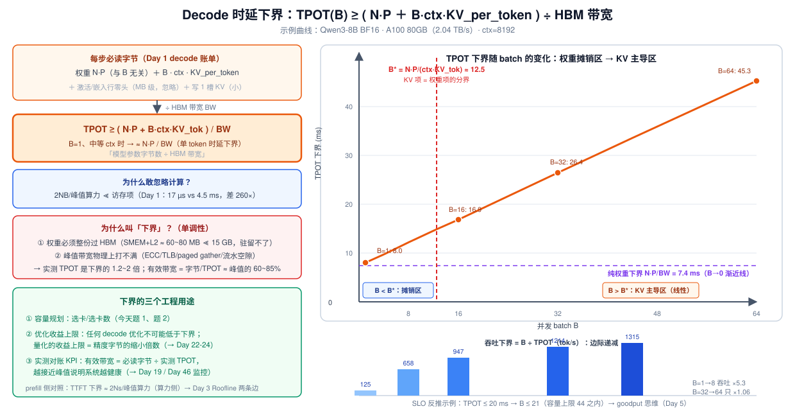

# Day 2 · 显存与时延的手算公式：KV Cache 显存与 Decode 时延下界（面试必考）

> **系列**：推理系统优化专家岗 · 56 天打卡 | 第 1 周「推理基础与性能建模」
> **今日位置**：把 Day 1 推出的两张"字节数账单"变成**显存容量与毫秒时延**的工程数字——这是推理系统面试中被追问概率最高的两道手算题
> **前置要求**：Day 1（prefill/decode 账单、AI = 2M/P、KV cache 机制）；本篇直接复用其记号与结论
> **预计用时**：2.5 ~ 3.5 小时（精读 1.5h + 手算练习 1h + 实验 0.5h）
> **背景衔接**：你在昇腾上做算子优化前要先算"数据量 ÷ 带宽 / 计算量 ÷ 算力"的 tiling 上限——今天把同样的方法升级到**整机级**：给定模型/精度/上下文，3 分钟白板算出 KV 显存、并发上限、TPOT 下界。
> **配套材料**：`week1/README.md` Day 2 节；Day 1 的 §3.5 数值拆解（Qwen3-8B 权重 16.4 GB / GEMM 每步读 15.1 GB / KV 144 KiB/token）今天直接复用。

---

## 0. 今日学习目标

完成今天的学习后，你应该能够：

- [ ] **推导而非背诵** KV cache 每 token 显存公式 $2 \times L \times H_{kv} \times d \times P$，说清每个因子的来源，并指出最容易代错的一项（$H_{kv}$ 不是 $H_q$）
- [ ] 用**显存预算账**（权重 / KV 池 / 激活峰值 / 系统保留）估算单卡/多卡的**并发上限**
- [ ] **推导并使用** decode 单 token 理论时延下界 $\approx N \cdot P / \text{HBM 带宽}$，并解释"为什么它是下界、实测为什么高、什么时候会失效"
- [ ] **3 分钟白板**完成：给定任意模型配置 + 精度 + 上下文 + 硬件，算出 KV 显存、并发上限、TPOT 下界（今天的三道题就是训练）
- [ ] 把手算结果与 **vLLM V1 启动日志**对账（`Maximum concurrency for ... tokens per sequence`），说清 vLLM 启动时是怎么"实测"这道题的

---

## 1. 核心概念速览

| 概念 | 一句话定义 | 今日要达到的深度 |
|---|---|---|
| **KV_per_token** | 每 token 的 KV cache 字节数 = $2 L H_{kv} d P$ | 能逐因子推导 + 常见模型有数字感 |
| GQA / MQA / MLA | KV 头数与压缩方式的谱系，决定 $H_{kv}$（或替代项） | 知道各自把 KV 缩小多少倍 |
| **显存四件套** | 权重 + KV 池 + 激活峰值 + 系统保留 | 能列账并算出 KV 池余量 |
| **并发上限** | KV 池 ÷（max_len × KV_per_token/TP） | 会算、会对照 vLLM 日志 |
| **TPOT 下界** | $\ge (N P + B \cdot \text{ctx} \cdot \text{KV\_tok}) / \text{BW}$ | 会推导、会修正、会用于容量规划 |
| **有效带宽** | 必读字节 ÷ 实测 TPOT | 当作系统健康度 KPI（60~85% 峰值） |
| $B^*$（摊销临界点） | $N P / (\text{ctx} \cdot \text{KV\_tok})$，权重项 = KV 项的分界 | 理解 batch 收益边际递减的根源 |
| gpu_memory_utilization | vLLM 可支配显存比例（默认 0.9） | 知道 10% 留给了什么、调动的风险 |

> **一句话本质**：**显存题问"能装下多少"，时延题问"搬完要多久"**——两道题共用 Day 1 的账单，一个除以容量，一个除以带宽。

---

## 2. 原理深入讲解

### 2.1 回顾 Day 1：从"字节数"到"工程数字"

Day 1 我们推出了两张账单：

$$
\text{bytes}_{\text{decode}} \approx \underbrace{N P}_{\text{权重，与 } B \text{ 无关}} + \underbrace{B \cdot \text{ctx} \cdot \text{KV\_per\_token}}_{\text{各读各的 KV}}, \qquad
\text{KV\_cache\_size} = \sum_{\text{seq}} \text{len}_{\text{seq}} \times \text{KV\_per\_token}
$$

但当时留了两个"口子"：KV_per_token 的显存公式只给了结论（144 KiB/token），decode 时延只算了 Qwen3-8B 一个例子。今天把这两个口子正式化成**四组公式**：

1. KV_per_token（每 token 显存）
2. 并发上限（显存容量 ÷ 单路开销）
3. TPOT 下界（字节数 ÷ 带宽）
4. $B^*$ 临界点（batch 摊销的转折）

并配套三道手算题（§3）与 vLLM 启动日志对账（§4、§5）。

### 2.2 KV Cache 每 token 显存：逐因子解剖



**推导**（对照上图中间一层）：

每个 token 进入第 $\ell$ 层时，由该层的 $W_K, W_V$ 投影产出一对向量组：

$$
k_j^{(\ell)} = \big[\, k_j^{(\ell,0)},\ k_j^{(\ell,1)},\ \dots,\ k_j^{(\ell,H_{kv}-1)} \,\big] \in \mathbb{R}^{H_{kv} \cdot d}, \qquad v_j^{(\ell)} \in \mathbb{R}^{H_{kv} \cdot d}
$$

- 每个 KV 头贡献一个 $d$ 维向量，共 $H_{kv}$ 个头 → **每份是 $H_{kv} \cdot d$ 个元素**
- K 和 V 各一份 → 乘 **2**
- 每层独立投影、互不相同（层 $\ell$ 的输入是层 $\ell-1$ 的输出）→ 乘 **$L$**
- 每元素 $P$ 字节 → 乘 **$P$**

$$
\boxed{\; \text{KV\_per\_token} = 2 \times L \times H_{kv} \times d \times P \; \text{字节} \;}
$$

单序列占用与全池占用：

$$
\text{KV\_per\_seq} = \text{ctx} \times \text{KV\_per\_token}, \qquad
\text{KV\_pool} = \sum_{\text{seq}} \text{len}_{\text{seq}} \times \text{KV\_per\_token}
$$

**四个高频踩坑点**（上图左下）：

> **易错点 1**：GQA 模型代入的是 $H_{kv}$ 不是 $H_q$。Qwen3-8B 是 8 vs 32——代错直接 **差 4 倍**。面试官最爱在这里挖坑。
>
> **易错点 2**：$d$ 是 `head_dim`，必须查 `config.json`，**不要用 $H / H_q$ 反推**。反例：Gemma-2 中 $H/H_q = 3584/16 = 224$，但实际 `head_dim = 256`（Q/K/V 投影带 padding）。
>
> **易错点 3**：**GB（$10^9$）≠ GiB（$2^{30}$），差 7.4%**。HBM 带宽标称是十进制（A100 = 2.04、H100 SXM = 3.35 TB/s），所以公式代入统一用十进制，最后再换算。Day 1 表中 B=32 的 25.1 ms 用了"1.13 GB/序列"（实为 GiB 取整），统一十进制后是 26.4 ms——量级结论不变，但面试白板要统一口径。
>
> **易错点 4**：MLA（DeepSeek 系列）不套这个公式——它把 K/V 联合压缩成一个 latent 向量（每层每 token 512 + 64 = 576 维），BF16 下约 $61 \times 576 \times 2 \approx 69$ KiB/token，比同规模 MHA 小两个数量级（→ Day 17 / Day 23 展开）。

**常见模型速查表**（BF16；背 2~3 个做"锚点数字"）：

| 模型 | $L$ | $H_{kv}$ | $d$ | KV/token | @8K 单序列 | @128K 单序列 |
|---|---|---|---|---|---|---|
| Qwen2.5-7B | 28 | 4 | 128 | **56 KiB** | 0.47 GB | 7.5 GB |
| Llama-3-8B | 32 | 8 | 128 | **128 KiB** | 1.07 GB | 17.2 GB |
| Qwen3-8B | 36 | 8 | 128 | **144 KiB** | 1.21 GB | 19.3 GB |
| Qwen3-32B | 64 | 8 | 128 | **256 KiB** | 2.15 GB | 34.4 GB |
| Llama-3-70B | 80 | 8 | 128 | **320 KiB** | 2.68 GB | 42.9 GB |
| Qwen3-235B-A22B | 94 | 4 | 128 | **188 KiB** | 1.58 GB | 25.2 GB |
| DeepSeek-V3（MLA） | 61 | latent 576 维 | — | ≈ 69 KiB | 0.58 GB | 9.2 GB |

> **读法**：最后一列是"长上下文的显存悬崖"——Llama-3-70B 一路 128K 就要 **42.9 GB** KV，比权重还显眼。这就是 KV 量化（Day 23）、MLA、分层 KV 存储（Day 34）的产业动因。

### 2.3 显存预算账：从 80 GB 到并发上限



一张卡上的显存**四件套**：

$$
\underbrace{\text{Mem}_{\text{total}}}_{\text{物理显存}} \;\ge\; \underbrace{\frac{N P}{\text{TP}}}_{\text{① 权重}} + \underbrace{\text{KV\_pool}}_{\text{② KV 池}} + \underbrace{A_{\text{peak}}}_{\text{③ 激活峰值}} + \underbrace{\text{Reserve}}_{\text{④ 系统保留}}
$$

| 项 | 大小规律 | 说明 |
|---|---|---|
| ① 权重 | $N \cdot P / \text{TP}$ | 唯一"开工前就确定"的大项；量化直接缩小 |
| ② KV 池 | 剩余预算的**全部** | vLLM 把余量一次性预分配成 block 池（Day 4/15） |
| ③ 激活峰值 | 由 **prefill 侧**决定 | 峰值 batch = `max_num_batched_tokens`（chunked prefill，Day 11）；vLLM 启动时 `profile_run` 实测 |
| ④ 系统保留 | CUDA context / NCCL / cuBLAS workspace / 碎片 | vLLM 看不全的"非 torch 开销"，是 `gpu_memory_utilization=0.9` 留 10% 的原因 |

由此得到**并发上限公式**：

$$
\boxed{\; \text{并发上限} \;\approx\; \frac{\text{Mem}_{\text{total}} \times \text{util} - N P/\text{TP} - A_{\text{act}}}{\text{max\_len} \times \text{KV\_per\_token} / \text{TP}} \;}
$$

> **TP 的两条作用**（上图标尺已画）：TP=2 时每卡只放一半权重，且 **KV 头也按卡切分**（8 个 KV 头 → 每卡 4 个），所以分子分母同时除以 2。代价是每步一次 all-reduce（→ Day 32 才补全通信账）。

### 2.4 Decode 单 token 时延下界：公式、严格性与修正



**推导**：Day 1 已证 decode 每步必读 $\approx N P + B \cdot \text{ctx} \cdot \text{KV\_per\_token}$ 字节。HBM 带宽为 BW，则：

$$
\text{TPOT}(B) \;\ge\; \frac{N P + B \cdot \text{ctx} \cdot \text{KV\_per\_token}}{\text{BW}}
\qquad \xrightarrow{\;B=1,\ \text{ctx 中等}\;} \qquad
\boxed{\; \text{TPOT} \gtrsim \frac{N P}{\text{BW}} \;}
$$

最后一步就是**"decode 单 token 理论时延下界 ≈ 模型参数字节数 ÷ HBM 带宽"**。以 Qwen3-8B BF16 @ A100 为例：$16.4\,\text{GB} / 2.04\,\text{TB/s} \approx 8\,\text{ms}$（精确到 GEMM 权重 15.1 GB 则是 7.4 ms）——与 Day 1 §3.5 的"第四步"对上了。

**为什么敢忽略计算项**？严格说 $\text{TPOT} \ge \max(T_{\text{mem}}, T_{\text{calc}})$，但 $T_{\text{calc}} = 2NB/F_{\text{peak}}$ 小到可以忽略：Day 1 算过 Qwen3-8B 在 H100 上是 **17 µs vs 4.5 ms（差 260 倍）**，且计算可与访存重叠。这正是"用算力换带宽"的投机解码（Day 25）有巨大空间的数学前提。

**为什么叫"下界"（单调性论证，面试加分点）**：

1. **权重必须整份过 HBM**：GPU 上 SMEM+L2 合计约 60~80 MB（A100/H100），相对 15~70 GB 权重是零头，**不可能驻留**——这与昇腾不同（昇腾 L1 228 KB/AI Core 也不能驻留整模型，你做窄 M 优化时靠的是"单算子权重全载"，推理时整模型没有免费午餐）。所以每步、每个权重字节至少穿越 HBM 一次；
2. **峰值带宽物理上打不满**：ECC、刷新、TLB miss、paged KV 的非连续 gather（Day 4/17）、kernel 间流水空隙——工程上大模型 decode 的**有效带宽 ≈ 峰值的 60~85%**；
3. 其他开销（kernel 启动、调度、CPU 同步）**只会加时间不会减**。

因此实测 TPOT 通常是下界的 **1.2~2 倍**。这个"倍数"本身就是 KPI：

$$
\text{BW}_{\text{eff}} = \frac{N P + B \cdot \text{ctx} \cdot \text{KV\_tok}}{\text{TPOT}_{\text{实测}}} \quad \Rightarrow \quad \text{带宽利用率} = \text{BW}_{\text{eff}} / \text{BW}_{\text{peak}}
$$

**$B^*$：batch 摊销的临界点**（上图右侧曲线的虚线分界）：

$$
B^* = \frac{N P}{\text{ctx} \cdot \text{KV\_per\_token}}
$$

- $B < B^*$：权重项主导，加 batch 时 TPOT 几乎不动（"近似免费"）；
- $B > B^*$：KV 项主导，TPOT 随 $B$ **线性上升**，吞吐边际收益递减。

Qwen3-8B @ ctx=8K：$B^* = 15.1/1.21 \approx 12.5$。对照曲线：B=1→8 吞吐 ×5.3，B=32→64 只 ×1.06——**"batch 摊销"的红利在 $B^*$ 附近基本吃完了**。超过它继续加 batch，就要在 TPOT SLO（Day 5 goodput）和 KV 容量之间权衡。

**与 prefill 对照（一分钟记住对称性）**：

| | 下界公式 | 瓶颈侧 |
|---|---|---|
| Prefill（TTFT） | $\approx 2Ns / F_{\text{peak}}$ | 算力 |
| Decode（TPOT） | $\approx NP / \text{BW}$ | 带宽 |

一个用算力侧、一个用带宽侧——这两条下界正是 **Roofline 的两条边**，明天（Day 3）把它们拼成完整模型。

### 2.5 与昇腾经验的映射（本周主线）

| 今天的公式 | 昇腾侧（你的经验） | GPU / vLLM 侧 |
|---|---|---|
| KV_per_token = $2LH_{kv}dP$ | ——（算子层不感知模型结构） | 决定 block 池切分粒度与容量（Day 4/15） |
| 显存四件套 | AI Core 的 L1/L2 容量规划（能驻留多少 tile） | HBM 80GB 的预算切分 + `gpu_memory_utilization` |
| TPOT ≥ NP/BW | `CalRebalanceBlock` 的"搬运时间下界" | decode 性能上限；量化的收益上限 = P 缩小倍数 |
| $\text{BW}_{\text{eff}}$ KPI | 用 msprof 看带宽利用率对齐理论 | nsys/ncu + Prometheus 采 TPOT 反推（Day 19/46） |

---

## 3. 数学推导：三道手算题的完整过程（今日核心产出）

> **规则**：先遮住解答自己白板推一遍，再对答案。三道题分别覆盖 README 指定的时延题、Day 1 预告的并发题、以及两者的综合应用。

### 3.0 记号与常数表（先抄在草稿纸顶部）

| 记号 | 含义 | 备注 |
|---|---|---|
| $N, L, H_q, H_{kv}, d$ | 参数量 / 层数 / Q 头 / KV 头 / head_dim | 查 `config.json`，勿背错 |
| $P$ | 每参数字节 | BF16=2，FP8=1，INT4=0.5 |
| $s$, ctx, $B$ | prompt 长 / 上下文长 / batch | |
| BW, $F_{\text{peak}}$ | HBM 带宽 / 峰值算力 | 下表 |

| 硬件 | HBM 带宽 | BF16 算力 | FP8 算力 | 80 GB @ util=0.9 |
|---|---|---|---|---|
| A100 80GB SXM | 2.04 TB/s | 312 TFLOPS | 不支持 FP8 TC | 72 GB |
| H100 80GB SXM | 3.35 TB/s | 989 TFLOPS | 1979 TFLOPS | 72 GB |

**Llama-3-70B 配置**（本题组主角，值得背）：$L{=}80$，$H{=}8192$，$H_q{=}64$，$H_{kv}{=}8$，$d{=}128$，FFN 28672，词表 128256，$N \approx 70.6$B。

### 3.1 题 1（README 指定题）：Llama-3-70B FP8 在 H100 上的 decode 时延下界

**题目**：Llama-3-70B、权重 FP8、H100 SXM（3.35 TB/s）、batch=1，decode 单 token 理论时延下界是多少？

**第一步：算每步必读的权重量**（不含 Embedding——每步只查 1 行 ≈ 8 KB）：

| 组件 | 形状 | 参数量 |
|---|---|---|
| 每层 QKV 投影 | $8192 \times (64{+}8{+}8) \cdot 128$ | 83.9 M |
| 每层 O 投影 | $8192 \times 8192$ | 67.1 M |
| 每层 MLP（gate+up+down） | $3 \times 8192 \times 28672$ | 704.6 M |
| **每层小计** | | **855.6 M** |
| 80 层合计 | | 68.5 B |
| lm_head | $8192 \times 128256$ | 1.05 B |
| **GEMM 权重合计** | | **69.5 B** |

FP8（$P{=}1$）→ 每步权重读取 $= 69.5$ GB。

**第二步：KV 项**（题目未给 ctx，取 ctx=4096 并显式声明假设）：

$$
\text{KV\_per\_token}^{\text{FP8}} = 2 \times 80 \times 8 \times 128 \times 1 = 163{,}840\,\text{B} = 160\,\text{KiB}
\qquad \Rightarrow \qquad 4096 \times 160\,\text{KiB} \approx 0.67\,\text{GB}
$$

**第三步：代入下界公式**：

$$
\text{TPOT} \ge \frac{69.5 + 0.67}{3.35\,\text{TB/s}} = \frac{70.2\,\text{GB}}{3.35\,\text{TB/s}} \approx \mathbf{20.9\ ms}
$$

粗式（忽略 KV 与 Embedding）：$70.6\,\text{GB} / 3.35\,\text{TB/s} \approx 21.1$ ms——**答案：≈ 21 ms**。

**第四步：严谨性检验与展开**（面试时主动说，是加分项）：

- **计算项**：$2N = 141$ GFLOP ÷ 1979 TFLOPS（FP8）≈ **71 µs** ≪ 21 ms，忽略合理；
- **对照 BF16**：139 GB / 3.35 TB/s ≈ **41.5 ms**——FP8 把下界砍半（量化的收益上限 = $P$ 缩小倍数）；
- **单卡可行性**：69.5 GB 权重 + KV + 激活 > 72 GB 预算（util=0.9），**单卡 H100 放不下这个服务**（KV 预算 ≈ 0）→ 该 21 ms 是"理论账"；实际 TP=2 部署时每卡读一半权重，下界 ≈ $34.75/3.35 \approx$ **10.4 ms**（不含 all-reduce，Day 32 补全）。

> **记忆卡**：70B · FP8 · H100 ≈ **21 ms/token**；TP2 ≈ **10.4 ms**；BF16 单卡 ≈ **41.5 ms**。

### 3.2 题 2（Day 1 预告题）：2×H100 TP=2 部署 Llama-3-70B，能并发多少 4K 请求？

**题目**：2 张 H100 80GB、TP=2、ctx=4096、`gpu_memory_utilization=0.9`。分别估算 BF16 与 FP8 权重下的并发上限。

**通用公式**（§2.3）：

$$
\text{并发} \approx \frac{80 \times 0.9 - \underbrace{N P / 2}_{\text{每卡权重}} - \overbrace{A_{\text{act}}}^{\approx 2\,\text{GB，实测}}}{4096 \times \underbrace{(2 \cdot 80 \cdot 4 \cdot 128 \cdot P)}_{\text{每卡 KV/token（TP2 → 4 头）}}}
$$

**方案① BF16**：

- 每卡权重 $= 141.2 / 2 = 70.6$ GB；预算 72 GB
- KV 预算 $= 72 - 70.6 - 2 \approx -0.6$ GB → **≤ 0，装不下**
- 即便激活算 0：$1.4\,\text{GB} / (4096 \times 160\,\text{KiB/卡}) = 1.4/0.671 \approx$ **2 路**——工程上等于不可用

**结论**：2×H100 跑 70B BF16 是"**装得下权重、装不下业务**"。这正是 2023-24 年 serving 全面转向 FP8 的直接原因（→ Day 22-24 量化专题）。

**方案② FP8（权重与 KV 都 FP8）**：

- 每卡权重 $= 70.6/2 = 35.3$ GB
- KV 预算 $= 72 - 35.3 - 2 \approx 34.7$ GB
- 每卡 KV/token $= 2 \times 80 \times 4 \times 128 \times 1 = 80$ KiB → 每序列 $4096 \times 80\,\text{KiB} \approx 0.336$ GB
- 并发 $= 34.7 / 0.336 \approx \mathbf{103 \text{ 路}}$

**闭环验证（把题 1 的下界请回来）**：B=100 时每卡每步读 $34.75 + 100 \times 0.336 \approx 68.3$ GB → TPOT 下界 $\approx 20.4$ ms → 吞吐 $\approx 100 / 0.0204 \approx 4900$ tok/s。**容量与时延两张账单在这里自洽**——这就是"手算"的检验标准。

> **vLLM 对账**：该部署的启动日志应打印类似 `Maximum concurrency for 4096 tokens per sequence: ~100x`（§4/§5 实验）。差异来源：激活实测值、block 对齐取整、`max_num_seqs` 上限（V1 默认远大于 100，不构成约束）。

### 3.3 题 3（综合题）：Qwen3-8B BF16 在 A100 80GB 上：并发上限 + B=32 的 TPOT

**题目**：Qwen3-8B BF16、单卡 A100 80GB（2.04 TB/s）、ctx=8192。(a) 并发上限？(b) B=32 的 TPOT 下界与吞吐？(c) 若 TPOT SLO = 20 ms，B 上限是多少？

**(a) 并发上限**：

$$
\text{KV\_per\_token} = 2 \times 36 \times 8 \times 128 \times 2 = 147{,}456\,\text{B} = 144\,\text{KiB} \quad (\text{Day 1 已推})
$$
$$
\text{单序列@8K} = 8192 \times 144\,\text{KiB} = 1.21\,\text{GB}
$$
$$
\text{并发} = \frac{72 - 16.4 - 1.5}{1.21} \approx \frac{54.1}{1.21} \approx \mathbf{44 \text{ 路}}
$$

（$A_{\text{act}} \approx 1.5$ GB 为经验值，实际以启动日志为准；无 prefix caching、假设每路跑满 8K。）

**(b) B=32 的 TPOT 下界**（GEMM 权重 15.1 GB，Day 1 逐项拆解的结论）：

$$
\text{bytes} = 15.1 + 32 \times 1.21 = 53.8\,\text{GB} \quad\Rightarrow\quad \text{TPOT} \ge \frac{53.8}{2.04} \approx \mathbf{26.4\ ms}
$$

（Day 1 §3.6 表中的 25.1 ms 是 GiB 取整所致，见 §2.2 易错点 3。）吞吐下界 $= 32 / 0.0264 \approx 1214$ tok/s。

**(c) SLO 反推**：解 $\frac{15.1 + B \times 1.21}{2.04} \le 20$ ms → $B \le (40.8 - 15.1)/1.21 \approx \mathbf{21}$。

注意 $B^* = 15.1/1.21 \approx 12.5$，B=21 已越过临界点进入 KV 主导区，但 TPOT 仍满足 SLO——**SLO 是比 $B^*$ 更硬的约束**（Day 5 goodput 的入口）。

**延伸一问（留给自己）**：若权重与 KV 双 FP8，B=32 的下界变为 $(7.55 + 19.3)/2.04 \approx 13.2$ ms——**精确的 2 倍提速**，这就是 KV 量化专题（Day 23）的预告片。

### 3.4 手算流程卡（3 分钟白板版，面试直接用）

```text
① 抄配置      L, H_kv, d, N, P（查 config.json，注意 H_kv 与 head_dim）
② KV 公式     KV/token = 2·L·H_kv·d·P          → 单序列 = ×max_len
③ 显存账      预算 = Mem × 0.9；KV池 = 预算 − N·P/TP − A_act(≈1~2G)
              → 并发 = KV池 ÷ (max_len × KV/token/TP)
④ 时延账      TPOT ≥ (N·P/TP + B·ctx·KV/token/TP) ÷ BW/卡
              → B=1 特例：≈ N·P/BW
⑤ 健全性检查  计算项 2NB/F ≪ 访存项？B* = N·P/(ctx·KV_tok) 在哪？
              结果与锚点数字（8B→8ms@A100，70B FP8→21ms@H100）量级一致？
```

**必背锚点**：A100 = 2.04 TB/s、H100 = 3.35 TB/s；屋脊点 153 / 295 FLOP/B（Day 1）；Qwen3-8B = 16.4 GB 权重 / 144 KiB KV；Llama-3-70B = 141 GB BF16 / 320 KiB KV。

---

## 4. 关键代码与 vLLM V1 的实际联系：启动时的显存账本

> **版本说明**：以下调用链以 2025 年中期的 vLLM（v0.10 / v0.11 前后）`vllm/v1/` 代码为参照。V1 仍在快速演进（显存剖析逻辑近期从 `gpu_worker` 逐步下沉到 `MemoryProfiler`/`kv_cache_interface` 等模块），**函数名可能随版本变化**；本文保证的是"哪一步测哪个项"的**结构对应关系**——它与我们 §2.3 的手算逐项同构。

vLLM 启动时把 §2.3 的账**实测**一遍（对照 `assets/day02_memory_budget.svg` 底部四步）：

```text
$ vllm serve Qwen/Qwen3-8B --max-model-len 8192
  │
  ├─ LLM / AsyncLLM ──(ZMQ)──► EngineCore            # vllm/v1/engine/core.py
  │    └─ Executor → Worker.initialize_from_config    # vllm/v1/worker/gpu_worker.py
  │         ├─ ① load_model()
  │         │      权重显存 ≈ N·P/TP（手算第 1 项）
  │         ├─ ② profile_run()                        # vllm/v1/worker/gpu_model_runner.py
  │         │      按 max_num_batched_tokens 构造 dummy batch 跑一次前向
  │         │      → 激活峰值 A_act（手算第 2 项；prefill 侧决定）
  │         └─ ③ determine_num_available_blocks()
  │                KV 预算 = total_gpu_memory × gpu_memory_utilization
  │                          − 权重 − 激活峰值 − non-torch(NCCL 等)
  │                → num_gpu_blocks = KV 预算 ÷ 每块字节数   # V1 block_size 默认 16
  └─ KVCacheConfig / KVCacheManager                    # vllm/v1/kv_cache_interface.py
                                                    # vllm/v1/core/kv_cache_manager.py
```

**手算项 ↔ vLLM 实测项映射表**：

| 手算量 | vLLM 内部来源 | 启动日志可对账处 |
|---|---|---|
| $N P/\text{TP}$ | `load_model()` 后的显存增量 | 模型加载后的 memory 统计 |
| $A_{\text{act}}$ | `profile_run()` 峰值 | `Available KV cache memory: XX GiB`（部分版本打印） |
| KV 池 | `determine_num_available_blocks()` | `GPU KV cache size: N tokens` |
| **并发上限** | 池大小 ÷ max_model_len | **`Maximum concurrency for 8192 tokens per sequence: 4x.x`** |

几个值得注意的工程细节：

- **`Maximum concurrency` 日志 = 题 3(a) 的实测算**：它假设所有序列都跑满 `max_model_len` 且**不含 prefix caching 共享**——高重复前缀负载下有效并发可以更高（Day 16）；
- **`max_model_len` 校验**：若它超过 KV 池能容纳的 token 数，vLLM 直接报错并提示"调大 gpu_memory_utilization 或调小 max_model_len"——**这就是手算题算出负数/小于 1 时的系统行为**。所以长上下文模型常常主动调小 `max_model_len` 换并发（容量守恒）；
- **`--kv-cache-dtype fp8`**：把 KV/token 的 $P$ 从 2 变 1，并发上限直接翻倍、TPOT 中 KV 项减半（Day 23 实测它）；
- **`gpu_memory_utilization` 的 10% 去向**：CUDA context（数百 MB）、NCCL/cuBLAS workspace、碎片——vLLM 通过"非 torch 显存"估计项来感知一部分，但看不全，所以留安全垫。调到 0.95 常见 OOM，调到 0.8 则白白损失 KV 容量。

---

## 5. 动手实验（约 60~90 分钟）

### 实验 1：手算验证器（无 GPU 也可跑，先核对自己的白板推导）

```python
# day02_lab.py —— Day 2 手算验证器：KV 显存 / 并发上限 / decode 时延下界
GB, TB, KiB, MS = 1e9, 1e12, 1024, 1e-3

def kv_per_token(L, hkv, d, p):
    return 2 * L * hkv * d * p

MODELS = {  # name: (L, Hq, Hkv, d, N)
    "Qwen2.5-7B":      (28, 28, 4, 128, 7.62e9),
    "Llama-3-8B":      (32, 32, 8, 128, 8.03e9),
    "Qwen3-8B":        (36, 32, 8, 128, 8.2e9),
    "Qwen3-32B":       (64, 40, 8, 128, 32.8e9),
    "Llama-3-70B":     (80, 64, 8, 128, 70.6e9),
    "Qwen3-235B-A22B": (94, 64, 4, 128, 235e9),
}

print("== 表1：KV per token（BF16）与 8K/128K 单序列占用 ==")
for name, (L, hq, hkv, d, N) in MODELS.items():
    k = kv_per_token(L, hkv, d, 2)
    print(f"{name:<18}{k/KiB:>7.0f} KiB{8192*k/GB:>8.2f}G{131072*k/GB:>8.1f}G")
print(f"{'DeepSeek-V3(MLA)':<18}{61*576*2/KiB:>7.0f} KiB{8192*61*576*2/GB:>8.2f}G{131072*61*576*2/GB:>8.1f}G")

print("\n== 题1: Llama-3-70B FP8 @ H100, B=1, ctx=4096 ==")
BW = 3.35 * TB
gemm = 80 * (8192*10240 + 8192*8192 + 3*8192*28672) + 8192*128256  # 不含 embedding
print(f"GEMM 权重 = {gemm/1e9:.1f} B 参数 → FP8 {gemm/GB:.1f} GB")
t = (gemm + 4096 * kv_per_token(80, 8, 128, 1)) / BW
print(f"decode 下界 = {t/MS:.1f} ms（BF16 对照 {2*gemm/BW/MS:.1f} ms；TP2 {gemm/2/BW/MS:.1f} ms）")

print("\n== 题2: 2×H100 TP=2, ctx=4096, util=0.9 ==")
budget = 80 * GB * 0.9
for tag, P in (("BF16", 2), ("FP8", 1)):
    kv_card = kv_per_token(80, 4, 128, P)        # TP2 → 每卡 4 个 KV 头
    conc = (budget - 70.55e9*P/2 - 2*GB) / (4096 * kv_card)
    print(f"{tag}: 每卡权重 {70.55*P/2:.1f} G → 并发 ≈ {conc:.0f}")

print("\n== 题3: Qwen3-8B BF16 @ A100, ctx=8192 ==")
BW = 2.04 * TB
kv_tok = kv_per_token(36, 8, 128, 2)
per_seq = 8192 * kv_tok
gemm_w = 36 * 192.9e6 * 2 + 4096*151936*2        # 36 层 + lm_head（BF16）
print(f"KV/token = {kv_tok/KiB:.0f} KiB；单序列 = {per_seq/GB:.2f} GB")
print(f"并发 = {(80*GB*0.9 - 16.4*GB - 1.5*GB)/per_seq:.0f} 路")
for B in (1, 8, 16, 32, 44):
    t = (gemm_w + B*per_seq) / BW
    print(f"B={B:<3} TPOT_lb={t/MS:5.1f} ms  吞吐={B/t:6.0f} tok/s")
print(f"B* = {gemm_w/per_seq:.1f}；SLO 20ms → B ≤ {(20e-3*BW - gemm_w)/per_seq:.0f}")
```

**预期输出**（已在无 GPU 环境验证）：

```text
== 表1：KV per token（BF16）与 8K/128K 单序列占用 ==
Qwen2.5-7B            56 KiB    0.47G     7.5G
Llama-3-8B           128 KiB    1.07G    17.2G
Qwen3-8B             144 KiB    1.21G    19.3G
Qwen3-32B            256 KiB    2.15G    34.4G
Llama-3-70B          320 KiB    2.68G    42.9G
Qwen3-235B-A22B      188 KiB    1.58G    25.2G
DeepSeek-V3(MLA)      69 KiB    0.58G     9.2G

== 题1: Llama-3-70B FP8 @ H100, B=1, ctx=4096 ==
GEMM 权重 = 69.5 B 参数 → FP8 69.5 GB
decode 下界 = 20.9 ms（BF16 对照 41.5 ms；TP2 10.4 ms）

== 题2: 2×H100 TP=2, ctx=4096, util=0.9 ==
BF16: 每卡权重 70.5 G → 并发 ≈ -1
FP8: 每卡权重 35.3 G → 并发 ≈ 103

== 题3: Qwen3-8B BF16 @ A100, ctx=8192 ==
KV/token = 144 KiB；单序列 = 1.21 GB
并发 = 44 路
B=1   TPOT_lb =  8.0 ms  吞吐 =   125 tok/s
B=8   TPOT_lb = 12.2 ms  吞吐 =   658 tok/s
B=16  TPOT_lb = 16.9 ms  吞吐 =   947 tok/s
B=32  TPOT_lb = 26.4 ms  吞吐 =  1214 tok/s
B=44  TPOT_lb = 33.5 ms  吞吐 =  1315 tok/s
B* = 12.5；SLO 20ms → B ≤ 21
```

如果手算结果与脚本差 ±10% 以内，多半是单位（GiB/GB）或 $H_{kv}$ 代错——**先查这两处**。

### 实验 2（需 GPU）：与 vLLM V1 启动日志对账

```bash
# 基线：题 3 的实测算
vllm serve Qwen/Qwen3-8B --max-model-len 8192 2>&1 | tee day02_serve.log
grep -E "GPU KV cache size|Maximum concurrency|Available KV" day02_serve.log
```

把日志里的三个数填进表里，与手算对照：

| 观察项 | 日志值（实测） | 手算值 | 差异来源 |
|---|---|---|---|
| KV 池（tokens） | `GPU KV cache size` | $54.1\,\text{GB} / 144\,\text{KiB} \approx 37.6$ 万 | $A_{\text{act}}$ 实测 vs 1.5 GB 假设 |
| 并发上限 | `Maximum concurrency ... : xx.x` | ≈ 44 | 同上 + block 对齐取整 |
| 每卡显存占用 | `nvidia-smi` 稳态值 | $\approx 72 + $ 保留 | util 语义核对 |

再做两组**单变量对照**（每组只改一个旋钮，预期方向要先写下来）：

```bash
# ① KV 量化：KV/token 的 P 从 2 → 1，并发应 ≈ ×2
vllm serve Qwen/Qwen3-8B --max-model-len 8192 --kv-cache-dtype fp8 ...

# ② 压缩上下文：max_model_len 8192 → 32768，并发应 ÷4
vllm serve Qwen/Qwen3-8B --max-model-len 32768 ...
```

**预期**：① 并发 ≈ 85~90 路；② 并发 ≈ 11 路。若方向不符，回来重看 §2.3 公式——这是检验理解最便宜的方式。

### 实验 3（可选，衔接 Day 1）：有效带宽 KPI 初体验

用 Day 1 实验 1 的 mini 模型（或直接 `vllm bench serve` 的 TPOT 数据，Day 6 会正式做），代入：

$$
\text{BW}_{\text{eff}} = \frac{N P + B \cdot \text{ctx} \cdot \text{KV\_tok}}{\text{TPOT}_{\text{实测}}}
$$

- mini 模型：算出的 $\text{BW}_{\text{eff}}$ 只有峰值的 ~10-20%（kernel 太小，启动开销主导——Day 18 CUDA Graph 的动因）；
- 真实 8B 模型生产 serving：通常 60~85%。**把这个比值记成"系统健康度"**，第 7 周消融实验（Day 46-48）它就是核心指标之一。

---

## 6. 面试高频问题（含答题骨架）

**Q1（白板必考）：给你一个模型和一张卡，3 分钟估算能支撑的并发和 TPOT。**

> 骨架：① 抄配置 $L, H_{kv}, d, N, P$；② KV/token = $2LH_{kv}dP$，单序列 = ×max_len；③ KV 池 = Mem×0.9 − 权重 − 激活(1~2G) → 并发 = 池 ÷ 单序列；④ TPOT ≥ (权重 + B·ctx·KV/token)/BW；⑤ 健全性：与锚点数字对量级（8B@A100 ≈ 8 ms、70B FP8@H100 ≈ 21 ms）。**主动声明假设**（激活取经验值、无 prefix caching）比算得精确更加分。

**Q2：为什么 decode 单 token 时延下界 ≈ 参数字节数 ÷ HBM 带宽？它忽略了什么？**

> 骨架：① decode 每步必读全部 GEMM 权重（SMEM+L2 ≈ 80 MB 驻留不了几十 GB），batch=1 时 KV 与激活是小项；② 时间 ≥ 字节/BW。忽略项：KV 读取（长 ctx 时不可忽略）、计算时间（可忽略且可重叠）、kernel/调度开销、带宽效率（峰值打不满，有效 60~85%）。所以它是下界，实测 1.2~2 倍。**收尾**：下界的用途——容量规划、优化收益上限（量化的上限 = P 缩小倍数）、有效带宽 KPI。

**Q3：batch 从 1 加到 32，TPOT 和吞吐怎么变？加到多少就没意义了？**

> 骨架：TPOT 从 $(NP + \text{ctx·KV})/\text{BW}$ 涨到 $(NP + 32\cdot\text{ctx·KV})/\text{BW}$；权重项被摊销，所以前期 TPOT 缓涨、吞吐近线性。转折点 $B^* = NP/(\text{ctx·KV\_tok})$（Qwen3-8B@8K ≈ 12.5）：超过后 KV 项主导，TPOT 线性涨、吞吐边际递减（B=32→64 只 +6%）。真正的上限由 TPOT SLO 和 KV 容量决定（→ goodput）。

**Q4：GQA/MQA/MLA 分别把 KV cache 缩小多少？代价是什么？**

> 骨架：以同 $H_q$ 的 MHA 为基线，GQA ×($H_{kv}/H_q$)（Qwen3-8B：8/32 = 1/4；Llama-3-70B：8/64 = 1/8）、MQA ×(1/$H_q$)（精度损失偏大）、MLA 把 K/V 联合压成 latent（DeepSeek-V3：576 维 vs 等效 MHA 数万维，≈1/50+，代价是 attention kernel 要现场解压，kernel 形态完全不同）。**点题**：KV 缩小同时改善显存容量（并发）和 decode 访存（TPOT 的 KV 项），一箭双雕。

**Q5：`gpu_memory_utilization=0.9` 是什么意思？为什么不是 1.0？**

> 骨架：vLLM 可支配的显存比例，预算 = 物理显存 × 0.9，用来放权重 + 激活 + KV 池。剩 10% 留给 vLLM 看不全的非 torch 开销：CUDA context（数百 MB）、NCCL/cuBLAS workspace、碎片。调到 0.95 容易被这些隐藏占用挤爆（OOM）；调低则直接损失 KV 池 → 并发下降。**加分**：说出"vLLM 启动时 profile_run 实测激活峰值，再用预算减出 KV 池"的流程。

**Q6：128K 长上下文的显存账怎么算？为什么长上下文 serving 这么难？**

> 骨架：以 Llama-3-70B BF16 为例，128K 单序列 KV = 131072 × 320 KiB ≈ **42.9 GB**——一路请求就吃掉大半张卡；Qwen3-8B 也要 19.3 GB。结论：长上下文必须组合拳——KV FP8/INT4（÷2~÷4）、MLA 类架构、`max_model_len` 分级（容量换并发）、prefix caching（多轮对话历史复用）、甚至 GPU→CPU 分层（Day 34）。**这也是 P/D 分离后 KV 传输成为新瓶颈的原因**（Day 29-31）。

---

## 7. 今日总结

1. **KV_per_token = $2 \times L \times H_{kv} \times d \times P$**：2 是 K/V 两份，$H_{kv}$ 是 GQA 的 KV 头数（最易代错），$d$ 查 config 勿反推；MLA 不套此式（latent 压缩，≈69 KiB/token for V3）。
2. **显存四件套**：权重 $NP/\text{TP}$ + KV 池 + 激活峰值（prefill 侧决定）+ 系统保留；**并发上限 = KV 池 ÷（max_len × KV/token/TP）**——vLLM 启动时用 `load_model + profile_run + 预算相减` 实测的就是这道题。
3. **TPOT 下界 = $(NP + B\,\text{ctx}\,\text{KV\_tok})/\text{BW}$**；B=1 时 ≈ **参数字节数 ÷ HBM 带宽**（Qwen3-8B@A100 ≈ 8 ms；70B FP8@H100 ≈ 21 ms）。它是下界因为：权重必须整份过 HBM、峰值带宽打不满、开销只增不减——实测 1.2~2 倍。
4. **$B^* = NP/(\text{ctx·KV\_tok})$** 是 batch 摊销的临界点：之前加 batch 近似免费，之后 KV 主导、TPOT 线性涨、吞吐边际递减；SLO 是更硬的天花板。
5. **锚点数字**（面试抽背）：A100 2.04 / H100 3.35 TB/s；Qwen3-8B 16.4 GB / 144 KiB / 44 路@8K 单卡；Llama-3-70B 141 GB BF16 / 320 KiB / FP8 TP2 ≈ 103 路 4K。
6. **prefill 与 decode 的下界分别取 Roofline 的两条边**（$2Ns/F$ vs $NP/\text{BW}$）——明天拼成完整 Roofline 模型并用 ncu 实测。

---

## 8. 今日自测题（先自己做，再展开答案）

**Q1**：Qwen3-32B（$L{=}64$，$H_{kv}{=}8$，$d{=}128$）BF16 的 KV/token 是多少？128K 单序列呢？

<details><summary>参考答案</summary>

$2 \times 64 \times 8 \times 128 \times 2 = 262{,}144$ B = **256 KiB/token**。128K 单序列：$131072 \times 256\,\text{KiB} = 34.4$ GB——一张 80GB 卡去掉 65.6 GB 权重后连一路都放不下，必须 KV 量化或 TP/多卡。
</details>

**Q2**：为什么说"decode 时延下界"在长上下文下会失效？给出修正公式。

<details><summary>参考答案</summary>

下界粗式 $\approx NP/\text{BW}$ 只在 KV 项是小项时成立。长 ctx 时 $B \cdot \text{ctx} \cdot \text{KV\_tok}$ 与 $NP$ 同量级甚至更大（Qwen3-8B、ctx=128K、B=1：KV = 19.3 GB > 权重 15.1 GB）。修正：$\text{TPOT} \ge (NP + B\,\text{ctx}\,\text{KV\_tok})/\text{BW}$，且此时 attention 的 $O(\text{ctx})$ 计算项也开始非零。
</details>

**Q3**：2×H100 跑 Llama-3-70B，BF16 和 FP8 的并发上限差多少倍？根源是什么？

<details><summary>参考答案</summary>

BF16：每卡权重 70.6 GB，72 GB 预算减去激活后 KV 池 ≈ 0 → **≈ 0~2 路**（不可用）。FP8：每卡 35.3 GB，KV 池 ≈ 34.7 GB → **≈ 103 路**。差距不是 2 倍而是"从不可用到可用"：权重是预算里的**固定成本**，量化省下的每一个字节都线性转化为 KV 容量（分母不变时分子放大 50 倍）。这是"量化的容量效应"，与"时延效应"（TPOT 下界减半）一体两面。
</details>

**Q4**：实测某服务 Qwen3-8B BF16@A100、B=16、ctx=8K 的 TPOT = 24 ms。有效带宽和带宽利用率是多少？说明什么？

<details><summary>参考答案</summary>

必读字节 = $15.1 + 16 \times 1.21 = 34.5$ GB → $\text{BW}_{\text{eff}} = 34.5\,\text{GB} / 24\,\text{ms} \approx 1.44$ TB/s → 利用率 $1.44/2.04 \approx 70\%$。下界为 16.9 ms，实测是它的 1.42 倍。70% 属于健康区间；若只有 30~40%，优先排查 kernel 启动开销（CUDA Graph）、调度空泡（async scheduling）或 TP 通信串行（→ Day 18/19/32）。
</details>

**Q5**：vLLM 启动报错"max seq len 大于 KV 池容量"，有哪三种调法？各自的代价？

<details><summary>参考答案</summary>

① 调大 `gpu_memory_utilization`（如 0.9→0.95）：挤占系统保留，有 OOM 风险，收益有限（8 GB 中的一部分）；② 调小 `max_model_len`：容量守恒——上下文上限换并发，业务上可能不接受；③ `--kv-cache-dtype fp8`：KV/token 减半、精度轻微损失（Day 23 实测）。根本解法是加卡（TP）或换 MLA 类模型——这就是"显存账"驱动的架构决策。
</details>

---

## 9. 今日产出物

按计划，今天要交付**3 道手算题的完整推导过程**。归档要求：

- [ ] 白纸重做 §3 三道题（不看本篇），每题按"配置 → 公式代入 → 数值 → 健全性检查"四步走
- [ ] 关键数字单独成行（抽背卡）：KV 公式五因子 / A100 2.04、H100 3.35 / 8B→8ms、70B FP8→21ms / 44 路@8K / TP2 FP8→103 路
- [ ] 把 §3.4 手算流程卡抄在笔记首页（面试前最后看的应该是它）
- [ ] 实验 2 的对账表（有 GPU）或实验 1 脚本输出与手算的 diff（无 GPU）
- [ ] 标注 1 个"今天没完全搞懂、明天再看"的点

建议笔记骨架（直接抄）：

```markdown
# 显存与时延的手算公式（Day 2）
## 0. 常数表：带宽 / 算力 / 屋脊点 / 锚点数字
## 1. KV/token 公式推导 + 五因子易错点 + 模型速查表
## 2. 显存四件套 → 并发上限公式（含 TP 修正）
## 3. TPOT 下界公式 + 下界的单调性论证 + B* 临界点
## 4. 题 1：70B FP8 @ H100 = 21 ms（四步推导）
## 5. 题 2：2×H100 并发：BF16 ≈ 0 vs FP8 ≈ 103（容量效应）
## 6. 题 3：Qwen3-8B：44 路 / 26.4 ms / SLO 反推 B ≤ 21
## 7. 手算流程卡（3 分钟白板版）+ vLLM 启动日志对账表
```

---

## 10. 明日预告（Day 3）

今天我们用"字节 ÷ 带宽"和"字节 ÷ 容量"得到了两张下界，Day 1 用"AI = 2M/P vs 屋脊点"判定瓶颈——但屋脊点本身（989 TFLOPS ÷ 3.35 TB/s ≈ 295 FLOP/B）还没正式登场。明天（Day 3）：

- **Roofline 模型**：把"算力侧下界"和"带宽侧下界"拼成一个二维图，arithmetic intensity 落在哪段斜线/平线上就是哪种瓶颈
- 与你昇腾 `CalRebalanceBlock` 的"L2/HBM vs Cube 分界模型"逐项对照，产出《从昇腾 bound 建模到 GPU Roofline 的映射表》
- 动手：用 **ncu** 跑一个 kernel，读 SM busy / DRAM busy 指标，验证手算判定

> 打卡：完成后在 README 的 Day 2 前打勾，并写一句话收获（例："把 70B FP8@H100 算成 21 ms 之后，又用 TP2 的容量账算出 103 路并发——显存和时延原来是同一本账的两种除法"）。
