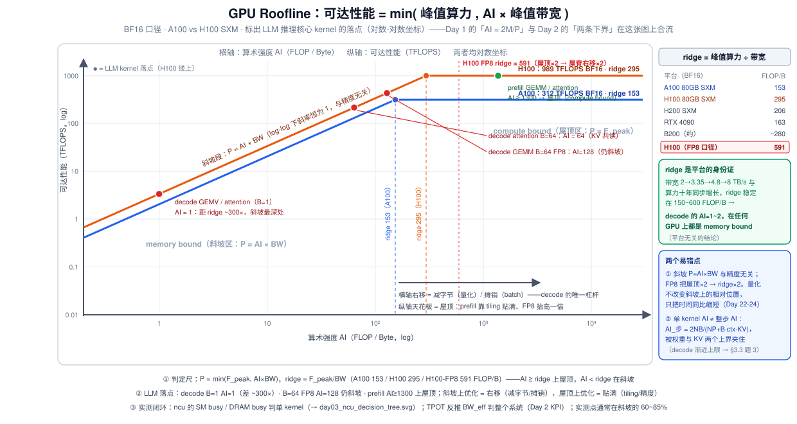
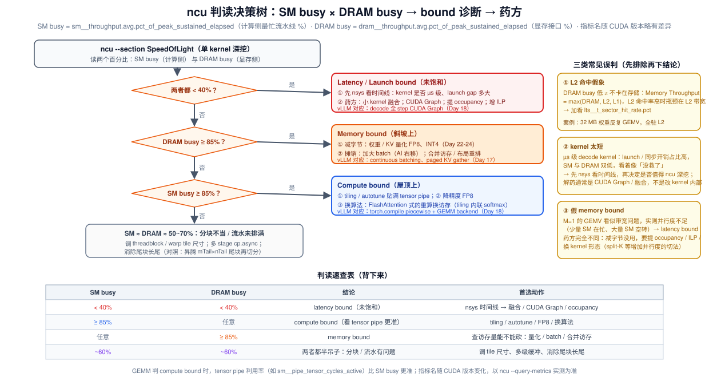
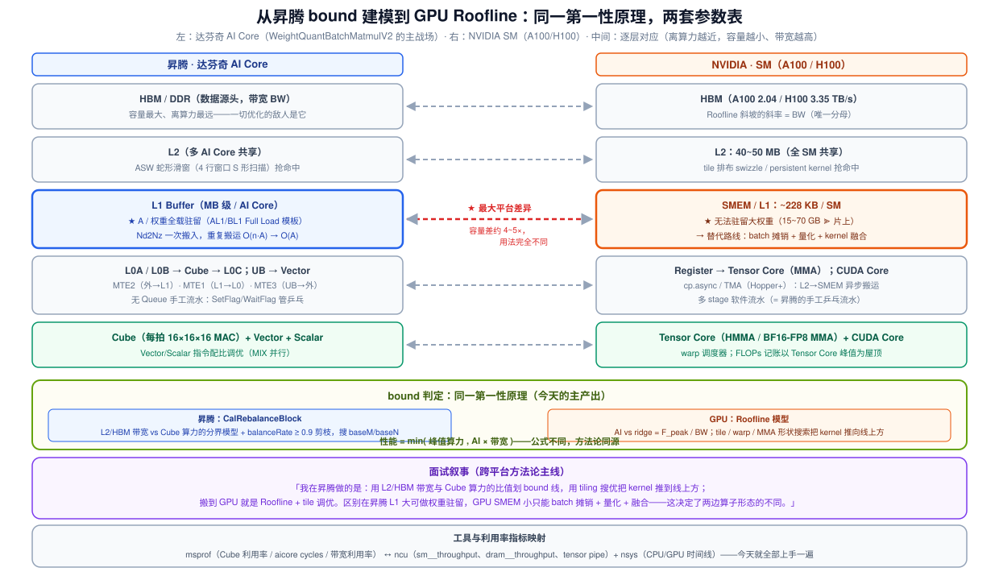

# Day 3 · Roofline 模型（GPU 版）：一把尺子丈量 prefill / decode / 一切 kernel

> **系列**：推理系统优化专家岗 · 56 天打卡 | 第 1 周「推理基础与性能建模」
> **今日位置**：Day 1 给出了尺子（AI = 2M/P）和两张账单，Day 2 把账单变成了显存与时延下界——但那两天的"屋脊点"（A100 ≈ 153 / H100 ≈ 295 FLOP/B）一直是引用而未推导。今天把**算力侧下界**与**带宽侧下界**拼成完整的 **Roofline 模型**，并用 **ncu 实测 SM busy / DRAM busy** 验证手算判定，这是性能工程最通用的一张图
> **前置要求**：Day 1（AI = 2M/P、prefill/decode 两张账单）、Day 2（TPOT 下界、锚点数字）；本篇直接复用其记号与结论
> **预计用时**：2.5 ~ 3.5 小时（精读 1.5h + 实验 1h + 整理映射表笔记 0.5h）
> **背景衔接**：你在昇腾上用 `CalRebalanceBlock` 划"L2/HBM 带宽 vs Cube 算力"的 bound 分界线、用 tiling 搜优把 kernel 推到线上方（85%+ 单核算力利用率）。今天的任务是把这条线**正式化**为 GPU 的 Roofline 模型，产出《从昇腾 bound 建模到 GPU Roofline 的映射表》——这是你"跨平台方法论"叙事的核心证据
> **配套材料**：`week1/README.md` Day 3 节是本篇的浓缩版；三张 SVG：`assets/day03_roofline_chart.svg`、`assets/day03_ncu_decision_tree.svg`、`assets/day03_ascend_gpu_mapping.svg`

---

## 0. 今日学习目标

完成今天的学习后，你应该能够：

- [ ] **推导** Roofline 模型：可达性能 $P = \min(F_{\text{peak}},\ \text{AI} \times \text{BW})$，说清斜坡、屋顶、屋脊点（ridge point）三要素，以及它为什么就是 Day 2 那两条下界的"合体"
- [ ] 会算并**背住** ridge point 锚点：A100 BF16 ≈ **153**、H100 BF16 ≈ **295**、H100 FP8 ≈ **591** FLOP/B；解释"为什么 decode 在任何 GPU 上都是 memory bound，平台无关"
- [ ] 把 LLM 推理的**核心 kernel**（decode GEMV/GEMM、prefill GEMM、两类 attention）在 Roofline 上定位，并与 Day 1-2 的账单**互验**
- [ ] 用 **ncu** 抓单个 kernel 的 SM busy / DRAM busy，按判读表诊断 bound 类型，并**识别三类常见误判**（L2 命中假象、kernel 太短、假 memory bound）
- [ ] 产出《从昇腾 bound 建模到 GPU Roofline 的映射表》，能在面试中用它讲清"同一第一性原理、两套参数表"

---

## 1. 核心概念速览

| 概念 | 一句话定义 | 今日要达到的深度 |
|---|---|---|
| **Roofline 模型** | 可达性能 = min(峰值算力, AI × 带宽)，画在对数坐标上是一条"斜坡 + 屋顶"折线 | 能推导、能画、能定位 kernel |
| **AI（算术强度）** | FLOPs ÷ 访存字节数（FLOP/B），kernel 的"横坐标" | 会区分权重口径 / 全流量口径 / 整步口径 |
| **ridge point（屋脊点）** | $F_{\text{peak}} / \text{BW}$，斜坡与屋顶的交点 | 会算 5 个平台 + 解释其十年稳定性 |
| **斜坡 / 屋顶** | AI < ridge 贴斜坡（memory bound）；AI > ridge 贴屋顶（compute bound） | 知道两种区域的**优化语义完全不同** |
| **SM busy** | ncu `sm__throughput`：计算侧最忙流水线占峰值的 % | 会抓取、会判读 |
| **DRAM busy** | ncu `dram__throughput`：显存接口占峰值的 % | 会抓取、会判读 |
| **latency bound** | SM 与 DRAM 都不饱和：并行度/依赖/launch 开销问题 | 与 memory bound 的**药方完全不同** |
| L2 命中假象 | DRAM busy 低 ≠ 不卡在存储（瓶颈可能在 L2 带宽） | 会用 `lts__t_sector_hit_rate` 排除 |

> **一句话本质**：Day 2 的两条下界——prefill 的 $2Ns/F_{\text{peak}}$（算力侧）和 decode 的 $NP/\text{BW}$（带宽侧）——分别是 Roofline 的**屋顶**和**斜坡**；今天只是把已经推出的零件拼成一张图，再加上"怎么用 ncu 验证你确实落在图上预言的位置"。

---

## 2. 原理深入讲解

### 2.1 回顾 Day 1-2：我们已经有了 Roofline 的全部零件

把前两天的结论排成一列，会发现 Roofline 已经呼之欲出：

| 来源 | 结论 | 在 Roofline 里的角色 |
|---|---|---|
| Day 1 §3.2 | 线性层 AI = 2M/P（BF16 下 ≈ M） | **横坐标**的算法 |
| Day 1 §3.2 | 屋脊点：A100 ≈ 153 / H100 ≈ 295 FLOP/B | 当时只引用、未推导——**今天补上** |
| Day 2 §2.4 | prefill 下界 ≈ $2Ns/F_{\text{peak}}$（算力侧） | **屋顶**（水平线） |
| Day 2 §2.4 | decode 下界 ≈ $NP/\text{BW}$（带宽侧） | **斜坡**（45° 线） |
| Day 2 §2.4 | 严格式 $T \ge \max(T_{\text{mem}}, T_{\text{calc}})$ | Roofline 的**原始形式** |

Day 2 结尾留的那句话——"prefill 与 decode 的下界分别取 Roofline 的两条边"——就是今天的全部内容：**把 max 形式的时间下界，改写成 min 形式的性能上界，再画成图**。

### 2.2 Roofline 模型：把两条下界拼成一张图



**推导**（§3.1 有完整版，这里先给直觉）：一个 kernel 要算 $F$ 个 FLOP、搬 $B_{yt}$ 个字节（避免与 batch 记号 B 冲突，字节记作 $B_{yt}$）。理想情况下计算与访存完全重叠，总时间取两者较大值：

$$
T = \max\!\left(\underbrace{\frac{B_{yt}}{\text{BW}}}_{T_{\text{mem}}},\ \underbrace{\frac{F}{F_{\text{peak}}}}_{T_{\text{calc}}}\right)
\qquad\Longrightarrow\qquad
\boxed{\;P_{\text{attainable}} = \frac{F}{T} = \min\!\left(\underbrace{F_{\text{peak}}}_{\text{屋顶}},\ \underbrace{\text{AI} \times \text{BW}}_{\text{斜坡}}\right)\;}
$$

其中 $\text{AI} = F / B_{yt}$。画在**双对数坐标**上（横轴 AI、纵轴可达性能）：

- **斜坡段**（AI < ridge）：$P = \text{AI} \times \text{BW}$ 是斜率恒为 1 的 45° 直线——性能**正比于 AI**，每提高 1 倍算术强度就提高 1 倍性能；
- **屋顶段**（AI > ridge）：$P = F_{\text{peak}}$ 是水平线——再多算术强度也换不来性能；
- **屋脊点（ridge point）**：$\text{AI}^* = F_{\text{peak}} / \text{BW}$，两条线的交点，单位 FLOP/Byte。

**这张图统一了前两天的所有判定**：

| 落点 | 判定 | 时间由什么决定 | 优化的语义 |
|---|---|---|---|
| 斜坡上 | memory bound | $T = B_{yt}/\text{BW}$ | **横轴右移**：减字节（量化）、摊销字节（batch）、提高复用（L2/融合） |
| 屋顶上 | compute bound | $T = F/F_{\text{peak}}$ | **贴满屋顶**：tiling 提利用率、降精度（FP8 屋顶 ×2）、换算法 |

> **关键认知**：两种区域的优化动作**完全不同且不可互换**。给 memory bound 的 kernel 优化计算指令序列是白费劲；给 compute bound 的 kernel 减少字节访问同样无效。**先判 bound，再动手**——这就是你在昇腾上"先跑 `CalRebalanceBlock` 分界模型、再做 tiling 搜优"的流程，GPU 上一字不差。

**两个容易忽视的性质**（面试加分点）：

1. **斜坡与精度无关**：$P = \text{AI} \times \text{BW}$ 里没有算力项。FP8 把屋顶 ×2（ridge 右移到 591），但斜坡原样不动——**量化不改变你在斜坡上的相对位置，只把字节数（进而时间）按比例缩短**。这就是 Day 2 题 1 里"FP8 把下界精确砍半"的图上解释。
2. **Roofline 是乐观界**：它假设计算与访存完美重叠、带宽打满、无 launch 开销。实测点通常落在斜坡的 **60~85%**（Day 2 的 BW_eff KPI）；差距本身就是一个诊断信号（差距大 → latency bound / 开销问题，见 §2.5）。

### 2.3 ridge point：平台的身份证

$$
\text{ridge} = \frac{F_{\text{peak}}}{\text{BW}} \quad [\text{FLOP/Byte}]
$$

| 平台 | BF16 算力（dense） | FP8 算力 | HBM 带宽 | ridge（BF16） | ridge（FP8） |
|---|---|---|---|---|---|
| A100 80GB SXM | 312 TFLOPS | — | 2.04 TB/s | **153** | — |
| H100 80GB SXM | 989 TFLOPS | 1979 TFLOPS | 3.35 TB/s | **295** | **591** |
| H200 SXM | 989 TFLOPS | 1979 TFLOPS | 4.8 TB/s | 206 | 412 |
| RTX 4090 | 165 TFLOPS | 330* | 1.01 TB/s | 163 | 327 |
| B200 | ~2.25 PFLOPS | ~4.5 PFLOPS | ~8 TB/s | ~280 | ~560 |

> \* 4090 的 FP8/FP16-accumulate 口径较绕，面试一般不问消费卡；B200 为约数，随最终规格与口径变化。

**关键观察**：从 A100（2020）到 B200（2025），带宽 2.04 → 3.35 → 4.8 → 8 TB/s，算力几乎**同步**增长——所以 ridge 十年稳定在 **150~600 FLOP/B** 这个窄带里。推论：

- **decode（AI ≈ 1~2）在任何 GPU 上都是 memory bound，平台无关**——这不是 H100 的性质，是"算力与带宽同步演进"这个产业规律的性质；
- 反过来，带宽越弱（相对算力）的平台，ridge 越靠左，decode 翻转的窗口越大（§3.3 题 3 会算出：A100 上 ctx ≤ ~730 就有理论翻转可能，H100 上收紧到 ~380）；
- **跨平台比较第一件事就是比 ridge**——所以叫"平台的身份证"。

### 2.4 LLM 推理核心 kernel 在 Roofline 上的定位


上图的红色/绿色圆点就是 Day 1 账单的"图上重放"。逐个推导（完整过程见 §3.2-3.3）：

| Kernel | FLOPs | 主要访存 | AI | H100 BF16 上的落点 |
|---|---|---|---|---|
| decode GEMV（B=1, BF16） | $2NK$ | $2NK$ B 权重 | **1** | 斜坡最深处（差 ridge 295×） |
| decode attention（B=1, ctx=4096） | $4 \cdot \text{ctx} \cdot d$ /头 | $4 \cdot \text{ctx} \cdot d$ B KV /头 | **1** | 斜坡（KV gather） |
| decode attention（B=64） | ×64 | KV 不变（共读） | **64** | 斜坡上部 |
| decode GEMM（B=64, FP8） | $2NK \times 64$ | $NK$ B 权重 | **128** | 仍斜坡（vs FP8 ridge 591） |
| prefill GEMM（4096³, BF16） | $2MNK$ | $3 \times 2MN$ B（全流量） | **~1365** | 屋顶 |
| prefill attention（s=4096, causal） | $\sim 2s^2 d$ /头 | $6sd$ B /头 | **~s/3 ≈ 1365** | 屋顶 |

**读这张表的三个层次**：

1. **Day 1 结论的定量重放**：decode 全链路（GEMV + attention gather）压在斜坡上，唯一杠杆是**右移**（减字节 / 摊销）；prefill 上屋顶，杠杆是**贴满**（tiling / 精度）。
2. **batch 的图上语义**：B 从 1 → 64，GEMM 的 AI 从 1 → 64（FP8 128），**沿斜坡向右滑动**——性能（FLOP/s 视角）线性上升，直到撞上屋顶或被 KV 访存拖住。这就是 Day 2 "batch 摊销"的几何表达。
3. **单 kernel AI ≠ 整步 AI**：整步 $\text{AI} = 2NB/(NP + B \cdot \text{ctx} \cdot \text{KV\_tok})$，同时被**两个上界**夹住——权重项给的上界 $2B/P$ 和 KV 项给的上界 $2N/(\text{ctx} \cdot \text{KV\_tok})$。后者意味着 **batch 再大也翻不上屋顶**（§3.3 题 3 展开，这是本周最反直觉的一个推导）。

> **与昇腾经验对接**：这张定位表就是你做 `WeightQuantBatchMatmulV2` 时的"窄 M 场景"判定——M≤256 的 GEMM 在昇腾上同样压在"L2/HBM 带宽限制"的斜坡区，你的 L1 全载模板本质上是**用片上驻留消灭权重字节的重复搬运**（横轴右移的极致形态）；而 GPU 没有这个能力，只能走 batch 摊销 + 量化（§3.4 映射表）。

### 2.5 ncu 实测：SM busy / DRAM busy 与判读

Roofline 告诉你**应该**落在哪里，ncu 告诉你**实际**在哪里。两者的差就是优化空间。



**工具分工**（今天先建立心智模型，Day 19 会用 nsys 深入）：

| 工具 | 看什么 | 对应昇腾工具 |
|---|---|---|
| **ncu**（Nsight Compute） | 单 kernel 深挖：SM/DRAM busy、occupancy、stall 原因 | msprof 的单算子细看 |
| **nsys**（Nsight Systems） | 整个进程的 CPU/GPU 时间线：kernel 间隙、launch 开销 | msprof 的时间线视图 |

ncu 的 SpeedOfLight 节直接给出两个百分比（**指标名随 CUDA 版本略有差异，以你环境的 `ncu --query-metrics` 为准**）：

```bash
# SM busy（计算侧最忙流水线占峰值 %）
sm__throughput.avg.pct_of_peak_sustained_elapsed
# DRAM busy（显存接口占峰值 %）
dram__throughput.avg.pct_of_peak_sustained_elapsed
# Memory Throughput（= max(DRAM, L2, L1)——排查 L2 命中假象用）
gpu__compute_memory_throughput.avg.pct_of_peak_sustained_elapsed
```

**判读表**（背下来，面试可能直接问）：

| SM busy | DRAM busy | 结论 | 首选动作 |
|---|---|---|---|
| < 40% | < 40% | **latency bound**（未饱和） | nsys 看时间线 → 融合 / CUDA Graph / occupancy |
| ≥ 85% | 任意 | **compute bound**（看 tensor pipe 更准） | tiling / autotune / FP8 / 换算法 |
| 任意 | ≥ 85% | **memory bound** | 查访存量能不能砍：量化 / batch / 合并访存 |
| ~60% | ~60% | 分块不当 / 流水未排满 | 调 tile 尺寸、多级缓冲、消尾块长尾 |

### 2.6 三类常见误判（今天的"防坑"重点）

1. **L2 命中假象**：DRAM busy 低 ≠ 不卡在存储。`Memory Throughput = max(DRAM, L2, L1)`——当工作集驻留 L2（如反复 GEMV 一个 32 MB 权重，A100 L2 有 40 MB）时，瓶颈是 **L2 带宽**而非 HBM，kernel 甚至能跑出"超过 HBM Roofline"的速度。判别方法：对比 `gpu__compute_memory_throughput` 与 `dram__throughput` 的差，加看 `lts__t_sector_hit_rate.pct`（L2 命中率）。**做实验 2 的 gemv_small 案例就能亲手复现这个假象**。
2. **kernel 太短**：decode 场景的 kernel 常是 µs 级，launch / 同步开销占比高，SM 与 DRAM 双低——这时 ncu 的百分比会"骗人"。**先 nsys 看时间线**（kernel 之间有多大的 gap），再决定是否值得对单个 kernel 深挖。解药通常是 CUDA Graph / 融合（Day 18），不是改 kernel 内部。
3. **假 memory bound**：M=1 的 GEMV 看似"带宽问题"，实则可能**并行度不足**——一个 SM 在算、其余空转（latency bound）。两者的药方完全不同：memory bound 减字节（量化），latency bound 提并行度（occupancy / ILP / split-K 这类增加并行度的切法）。Day 1 实验 2 里 mini 模型 decode 有效带宽只有峰值 10~20%，正是这个误判的活例子。

---

## 3. 数学推导：Roofline 形式化 + 三道手算题 + 昇腾映射（今日核心产出）

### 3.1 从 max(时间) 到 min(性能)：完整推导

**第 1 步：两个时间下界**。kernel 计算 $F$ 个 FLOP、搬 $B_{yt}$ 个字节：

$$
T_{\text{calc}} = \frac{F}{F_{\text{peak}}}, \qquad T_{\text{mem}} = \frac{B_{yt}}{\text{BW}}
$$

**第 2 步：重叠假设**。计算与访存在同一 kernel 内由硬件/编译器流水重叠，理想情况总时间取 max（完全不重叠取 sum，Roofline 取乐观的 max）：

$$
T \ge \max(T_{\text{calc}},\ T_{\text{mem}})
$$

**第 3 步：改写成性能**。定义 $\text{AI} = F/B_{yt}$：

$$
P = \frac{F}{T} \le \min\!\left(\frac{F}{T_{\text{calc}}},\ \frac{F}{T_{\text{mem}}}\right) = \min\!\left(F_{\text{peak}},\ \frac{F}{B_{yt}/\text{BW}}\right) = \min(F_{\text{peak}},\ \text{AI} \times \text{BW})
$$

**第 4 步：找交点**。令 $\text{AI} \times \text{BW} = F_{\text{peak}}$：

$$
\text{AI}^* = \frac{F_{\text{peak}}}{\text{BW}} \quad \text{（ridge point）}
$$

**第 5 步：对数坐标**。$\log P = \min(\log F_{\text{peak}},\ \log \text{AI} + \log \text{BW})$——斜坡在 log-log 图上是斜率 1 的直线，屋顶是水平线，整条 Roofline 是**凸折线**（这就是"屋脊"的几何含义）。

**一个值得记住的恒等式**（时间比 = ridge 比 AI）：

$$
\frac{T_{\text{mem}}}{T_{\text{calc}}} = \frac{B_{yt}/\text{BW}}{F/F_{\text{peak}}} = \frac{F_{\text{peak}}/\text{BW}}{F/B_{yt}} = \frac{\text{ridge}}{\text{AI}}
$$

例：70B FP8 decode，$\text{AI} = 2.01$，H100 FP8 ridge = 591 → 时间比 = 294×——**一次除法就得到 Day 2 手算的"21 ms vs 71 µs 差 297×"**（舍入差异）。

### 3.2 kernel AI 的三种口径（避免对不上账）

推导各 kernel 的 AI 时，**分母装什么字节**必须先声明——这是初学者最容易混乱的地方：

| 口径 | 分母 | 适用 | GEMM 公式 |
|---|---|---|---|
| **权重口径** | 只算权重字节 | decode（$M \ll K, N$，激活是零头）——Day 1 §3.2 的口径 | $\text{AI} = 2M/P$ |
| **全流量口径** | 权重 + 输入 + 输出 | prefill（$M \sim K \sim N$，激活不可忽略） | 方阵：$\text{AI} = 2K/3P$ |
| **整步口径** | 权重 + KV + 激活 | 系统级分析（一个 decode step / 一次前向） | $\text{AI} = 2NB/(NP + B\,\text{ctx}\,\text{KV\_tok})$ |

**逐个推导今天的落点表**：

- **decode GEMV（B=1, BF16）**：$F = 2NK$，$B_{yt} = KNP = 2NK$ → $\text{AI} = 1$。（Day 1 的 $2M/P$ 代 $M{=}1, P{=}2$。）
- **decode attention（每 KV 头）**：一次 query 对 ctx 个 key：QK^T 是 ctx 次 d 维点积（$2 \cdot \text{ctx} \cdot d$ FLOPs），·V 同样 → $F = 4\,\text{ctx}\,d$；读 K、V 各 ctx·d 个 BF16 → $B_{yt} = 4\,\text{ctx}\,d$ → **AI = 1**。batch=B 时 FLOPs ×B 而 KV 共读 → AI = B。
- **prefill GEMM（方阵 4096³, BF16）**：$F = 2MNK = 2 \cdot 4096^3 = 137.4$ GFLOP；$B_{yt} = 3 \times 4096^2 \times 2 = 100.7$ MB → $\text{AI} = 2K/3P = 4096/3 \approx 1365$。
- **prefill attention（causal, s=4096, 每头）**：因果掩码砍一半 → $F \approx 2 \cdot (s^2/2) \cdot d \times 2 = 2s^2 d$；读 Q/K/V 各 $sd$ 个元素 → $B_{yt} = 3sdP = 6sd$ B → $\text{AI} = 2s^2d / 6sdP = s/3P \approx 1365$。

**验证**：把 4096³ GEMM 代入 H100：$\text{AI} \times \text{BW} = 1365 \times 3.35 = 4573 > 989$ → compute bound，$T \ge 137.4\,\text{GFLOP} / 989\,\text{TFLOPS} \approx 139\,\mu s$；带宽侧只要 $100.7\,\text{MB} / 3.35\,\text{TB/s} \approx 30\,\mu s$。与 Day 1 §3.3 "prefill 计算时间是访存时间的 60 倍"完全一致——**同一账单的第三种读法**。

### 3.3 三道手算题（先自己做，再看解答）

#### 题 1：H100 上的 prefill GEMM（4096³ BF16）——判定、下界、带宽侧时间

**(a) 判定**：全流量口径 AI = 1365 > ridge 295 → **compute bound**。
**(b) 时间下界**：$T \ge 2 \cdot 4096^3 / 989\,\text{TFLOPS} \approx \mathbf{139\ \mu s}$。
**(c) 带宽侧**：$T_{\text{mem}} = 100.7\,\text{MB} / 3.35\,\text{TB/s} \approx 30\ \mu s$（若真能完全重叠，被计算掩盖）。
**(d) 现实修正**：cuBLAS/ CUTLASS 在此规模通常达峰值的 60~80% → 实测约 170~230 µs。**若实测 500 µs，说明没贴住屋顶**（tiling / 占用率问题，或者矩阵布局导致非合并访存）。
**(e) 反问**（面试官爱追问）：M 从 4096 降到 256（短 prompt 的最后一块 chunk）呢？AI = 2M/3P ≈ 85 < 295 → **掉回斜坡**！这正是 chunked prefill（Day 11）的代价之一：块切得太碎，GEMM 会从屋顶滑到斜坡——所以 token budget 不能设得太小。

#### 题 2：Day 2 题 1 的 Roofline 复盘——Llama-3-70B FP8 @ H100，decode B=1

Day 2 用账单算出了 21 ms；今天用 Roofline 重算一遍，**两套方法必须给出同一个数**：

| 步骤 | 计算 | 结果 |
|---|---|---|
| ① 整步 FLOPs | $2N = 141.2$ GFLOP | （attention 项 ~1%，忽略） |
| ② 整步字节 | GEMM 权重 69.5 GB + KV $4096 \times 160\,\text{KiB} \approx 0.67$ GB | 70.2 GB |
| ③ 整步 AI | $141.2 / 70.2$ | **2.01 FLOP/B** |
| ④ 对照 ridge | FP8 ridge = 1979/3.35 = **591** | 差 **294×** → 铁斜坡 |
| ⑤ 时间下界 | $70.2\,\text{GB} / 3.35\,\text{TB/s}$ | **20.9 ms**（Day 2 ✓） |
| ⑥ 计算侧 | $141.2\,\text{GFLOP} / 1979\,\text{TFLOPS}$ | 71 µs（差 294×，= ridge/AI 恒等式） |

**结论**：Day 1-2-3 三天的三套方法（AI 判定、账单下界、Roofline）在同一个例子上收敛——**这就是"能手算"的检验标准：换尺子不换答案**。

#### 题 3（今日最深的一道）：decode 到底能不能翻上屋顶？

**问题**：Qwen3-8B BF16 @ H100（ridge 295），decode 的 batch 加到多大才能 compute bound？

**第一步：写出整步 AI**（权重口径的分子 + KV 项的分母）：

$$
\text{AI}_{\text{step}}(B) = \frac{2NB}{NP + B \cdot \text{ctx} \cdot \text{KV\_tok}}
$$

**第二步：求 B→∞ 的渐近**（权重项被摊没）：

$$
\text{AI}_{\infty} = \frac{2N}{\text{ctx} \cdot \text{KV\_tok}} \xrightarrow{\ \text{Qwen3-8B, ctx=8K}\ } \frac{16.4\,\text{G}}{8192 \times 147456} \approx \mathbf{13.6\ FLOP/B}
$$

**13.6 ≪ 295——差 22 倍。结论：无论 batch 多大，ctx=8K 的 decode 在 H100 上永远 memory bound。**

**第三步：反解翻转条件**。令 $\text{AI}_\infty \ge \text{ridge}$：

$$
\text{ctx} \le \frac{2N}{\text{ridge} \cdot \text{KV\_tok}} = \frac{16.4 \times 10^9}{295 \times 147456} \approx \mathbf{377\ token}
$$

即：只有"**上下文短于 ~380 token 且 batch 趋于无穷**"这个理论极限下，decode 才可能翻上屋顶——真实负载不可能满足。A100（ridge 153）放宽到 ~730 token，也只是"理论窗口大一点"。

**第四步：解读**（面试加分）：

- 这精确化了 Day 1 的"只有短上下文 + 超大 batch 才可能翻转"——现在有公式了；
- **算力长得比带宽快的平台，decode 更彻底地 memory bound**（H100 的窗口比 A100 窄一半）——这是"堆算力救不了 decode"的数学表述，也是投机解码（Day 25，用闲置算力换带宽）和 P/D 分离（Day 29，decode 独占带宽型硬件）的根本动因；
- 对应昇腾经验：你在窄 M 场景从不指望"把 Cube 喂满"，而是想尽办法**减搬运**（L1 全载、ASW 提升 L2 命中）——同一个结论的两平台表达。

### 3.4 从昇腾 bound 建模到 GPU Roofline 的映射表（本周核心产出）



| 维度 | 昇腾（达芬奇架构） | NVIDIA GPU | 同一性 / 差异 |
|---|---|---|---|
| 计算单元 | Cube（每拍 16×16×16 MAC）/ Vector / Scalar，MIX 配比调优 | Tensor Core（HMMA / BF16 / FP8 MMA）/ CUDA Core | 峰值 FLOPS 的口径来源 |
| 存储层级 | HBM → L2 → L1 → L0A/L0B/L0C（+UB） | HBM → L2 → SMEM/L1 → Register | **同一分层思想**：离算力越近越小越快 |
| 片上私有缓冲 | **L1 为 MB 级**：AL1/BL1 全载模板，权重 Nd2Nz 一次驻留，O(n·A)→O(A) | **SMEM ~228 KB/SM**：无法驻留大权重 | ★ **最大平台差异**（见下方叙事） |
| 搬运引擎 | MTE2（外→L1）/ MTE1（L1→L0）/ MTE3（出）/ Fixpipe（L0C→外，含量化重排） | cp.async / TMA（Hopper+）、ld/st | 显式搬运 + 多缓冲 ↔ async copy 多 stage |
| 分块参数 | baseM / baseN / baseK（tiling 搜优） | threadblock tile / warp tile / MMA m,n,k | 同一个"分块凑局部性"问题 |
| **bound 判定** | **`CalRebalanceBlock`：L2/HBM 带宽 vs Cube 算力的分界模型 + balanceRate ≥ 0.9 剪枝**，三道选优搜 baseM/baseN | **Roofline：AI vs ridge = F_peak/BW**；tile/warp/MMA 搜索贴线 | **同一第一性原理：性能 = min(算力, AI×带宽)** |
| L2 优化 | ASW 蛇形滑窗（4 行窗口 S 形扫描，Round-Robin 分 tile，尾块再切分） | tile 排布 swizzle / persistent kernel | 提升片上复用，抢 L2 命中 |
| 流水线 | 无 Queue 手工流水（SetFlag/WaitFlag 管 L1/L0 乒乓，首 tile 半载隐藏 MTE2 延迟） | 软件流水 / cp.async 多 stage | 隐藏搬运延迟 |
| 利用率指标 | Cube 利用率 / aicore cycles（msprof） | SM busy / tensor pipe（ncu `sm__throughput`） | 两边都有"离峰值还差多少"的尺子 |
| Profile 工具 | msprof / Ascend Profiler | **nsys**（时间线）/ **ncu**（单 kernel 深挖） | 分工同构：先时间线定位，再单点深挖 |

**两条必须内化的结论**：

1. **方法论同源**：`CalRebalanceBlock` 的"L2/HBM 带宽与 Cube 算力之比划 bound 线、tiling 搜优把 kernel 推到线上方"，与 GPU 的"Roofline + tile/warp 调优"是**同一件事**——两边都是先量化"搬运时间 vs 计算时间"，再决定分块策略。你在昇腾达成 85%+ 单核算力利用率的方法，翻译成 GPU 语言就是"把 kernel 从斜坡推向屋顶、贴满 tensor pipe"。
2. **平台差异点（面试的差异化素材）**：昇腾 L1 是 MB 级，可以做**权重驻留**（单算子的权重全载，消灭重复搬运）；GPU SMEM 只有 ~228 KB/SM，驻留不了 15~70 GB 的模型权重——所以 GPU 推理走的是 **batch 摊销（AI 右移）+ 权重量化（字节减少）+ kernel 融合（减少往返）** 三条替代路线，而这正是 vLLM 侧 decode 优化的主轴（§4）。

---

## 4. 关键代码与 vLLM V1 的实际联系：Roofline 思维在 V1 里的五个落点

> **版本说明**：以下调用链以 2025 年中期的 vLLM（v0.10 / v0.11 前后）的 `vllm/v1/` 代码为参照。V1 仍在快速演进（profiling 逻辑、编译配置的字段名都在变），**类名/函数名可能随版本变化**，走读时以你环境里的实际代码为准；本文保证的是**机制与角色的对应关系**。

**Roofline 思维在 V1 代码树里的落点**（每一条都对应今天图上的一个动作）：

| V1 机制 | Roofline 语义 | 代码位置 | 展开日 |
|---|---|---|---|
| Scheduler 的 `max_num_seqs` / `max_num_batched_tokens` | decode 的 M=B → AI = 2B/P：**沿斜坡右移的控制器** | `vllm/v1/core/scheduler.py` | Day 10-11 |
| decode 全 step CUDA Graph | 消除 latency/launch bound 的开销，让实测**贴住斜坡**（Day 1 实验 2 里 10~20% 的元凶就是它） | `vllm/v1/worker/gpu_model_runner.py` 的 capture 逻辑 | Day 18 |
| torch.compile piecewise + GEMM backend 选择 | prefill GEMM **贴满屋顶**（tile 搜索 = 你的 baseM/baseN 搜优） | `vllm/compilation/` + `-O` 编译级别 | Day 18 |
| 权重 / KV 量化（FP8、INT4） | 字节 ÷2~÷4：斜坡上时间**同比缩短**，ridge 不变 | 详见各 quant 相关模块 | Day 22-24 |
| V1 自带 profiler + 外部 ncu/nsys | SM busy / DRAM busy 的**微观测量** | 见下方调用链 | Day 19 / 46 |

**profiling 的两条链路**（宏观 + 微观，对应 §2.5 的判读）：

```text
链路 A（宏观，V1 自带）：
$ vllm serve Qwen/Qwen3-8B ...
  ├─ API 进程（AsyncLLM）──(ZMQ)──► EngineCore 进程      # vllm/v1/engine/core.py
  └─ POST /start_profile → /stop_profile（OpenAI server 端点）
       └─ vllm/v1/engine/profiler.py（版本演进较快，以实际代码为准）
            └─ torch/kineto trace 落盘到 $VLLM_TORCH_PROFILER_DIR
                 └─ 用 chrome tracing / nsys UI 看 CPU-GPU 时间线（Day 19 找 bubble）
  ※ 事后用 TPOT（/metrics）反推 BW_eff =（NP + B·ctx·KV_tok）/ TPOT —— Day 2 的 KPI

链路 B（微观，外部 ncu attach）：
$ ncu --target-processes all \            # ★ V1 是多进程架构，EngineCore 是独立子进程，
                                           #   不加这个参数会 profile 到空的 API 进程！
       --kernel-name "regex:gemm|nvjet|cutlass|elementwise" \   # 一步几千个 kernel，必须过滤
       --launch-skip 200 --launch-count 5 \                      # 跳过热身/自调优探针
       --section SpeedOfLight \
       vllm serve Qwen/Qwen3-8B --enforce-eager   # 先关 CUDA Graph，否则 kernel 被图重放，难以逐个归因
```

三个工程要点：

- **`--target-processes all` 是 V1 专属的坑**：V1 把引擎拆成独立进程（Day 8 详述），默认 ncu/nsys 只 attach 主进程，什么都抓不到；
- **`--enforce-eager` 与 profiling 的取舍**：CUDA Graph 让 decode 快（消除 launch 开销 = 修复 latency bound），但让 kernel 级 profile 变难——测"真实性能"开着 CG，测"单 kernel 指标"关掉 CG，**两种测量目的不同**；
- **指标 → 结论的闭环**：ncu 的 DRAM busy（微观，单 kernel）与 TPOT 反推的 BW_eff（宏观，整系统）互相印证——如果单 kernel 都 85%+ 但整系统 BW_eff 只有 40%，说明损失在 kernel 之外（调度空泡、同步、通信）→ nsys 时间线（Day 19）。

---

## 5. 动手实验（约 60~90 分钟）

### 实验 1（无需 GPU）：Roofline 手算验证器

先跑脚本对账今天所有手算（已验证可跑，输出见下）：

```python
# day03_lab_roofline.py —— Day 3 实验 1：Roofline 手算验证器（无需 GPU）
TF, GB, TB, MS, US = 1e12, 1e9, 1e12, 1e-3, 1e-6

PLATFORMS = {  # name: (F_peak_BF16 [TFLOPS], F_peak_FP8 或 None, BW [TB/s])
    "A100 80GB SXM": (312, None, 2.04),
    "H100 80GB SXM": (989, 1979, 3.35),
    "H200 SXM":      (989, 1979, 4.80),
    "RTX 4090":      (165, None, 1.01),
    "B200 (约)":     (2250, 4500, 8.0),
}

# (名称, FLOPs, bytes)——BF16 口径（FP8 的条目单独注明）
KERNELS = [
    ("decode GEMV   M=1, K=N=4096",     2 * 1 * 4096 * 4096,     4096 * 4096 * 2),
    ("decode attn   B=1, ctx=4096（每头）", 4 * 4096 * 128,          2 * 4096 * 128 * 2),
    ("decode attn   B=64（每头）",       4 * 4096 * 128 * 64,     2 * 4096 * 128 * 2),
    ("decode GEMM   B=64, FP8",         2 * 64 * 4096 * 4096,    4096 * 4096 * 1),
    ("prefill GEMM  4096³（全流量口径）",  2 * 4096 ** 3,           3 * 4096 * 4096 * 2),
    ("prefill attn  s=4096 causal（每头）", 2 * 4096 * 4096 * 128,   3 * 4096 * 128 * 2),
]

def attainable(AI, F_peak, BW):
    return min(F_peak, AI * BW)  # BW 用 TB/s 时，AI×BW 的数值恰为 TFLOPS

print("== ① ridge point = F_peak ÷ BW（FLOP/Byte，平台的身份证）==")
for name, (f16, f8, bw) in PLATFORMS.items():
    row = f"{name:<16} BF16 {f16 / bw:>6.0f}"
    if f8:
        row += f"    FP8 {f8 / bw:>6.0f}"
    print(row)

print("\n== ② 核心 kernel 的 AI 与 H100 上的判定 ==")
F16, F8, BW = PLATFORMS["H100 80GB SXM"]
for name, flops, byts in KERNELS:
    F = F8 if "FP8" in name else F16
    AI = flops / byts
    p = attainable(AI, F, BW)
    t = flops / (p * TF)
    t_mem, t_calc = byts / (BW * TB), flops / (F * TF)
    verdict = "compute" if AI * BW >= F else "memory "
    unit = MS if t > 1e-4 else US
    print(f"{name:<28} AI={AI:>7.1f}  {verdict} bound  "
          f"T≥{t / unit:>7.2f}{'ms' if unit == MS else 'µs'}  "
          f"(T_mem={t_mem / unit:.2f}, T_calc={t_calc / unit:.2f})")

print("\n== ③ 与 Day 2 互验：Llama-3-70B FP8 @ H100，decode B=1，ctx=4096（整步口径）==")
N, L, HKV, D, P = 70.6e9, 80, 8, 128, 1
gemm = 80 * (8192 * 10240 + 8192 * 8192 + 3 * 8192 * 28672) + 8192 * 128256  # GEMM 权重（不含 embedding）
kv_tok = 2 * L * HKV * D * P
byts = gemm + 4096 * kv_tok
flops = 2 * N
print(f"必读字节 = {byts / GB:.1f} GB，FLOPs = {flops / GB:.1f} GFLOP")
print(f"整步 AI = {flops / byts:.2f} FLOP/B vs FP8 ridge = {F8 / BW:.0f} → 差 {F8 / BW / (flops / byts):.0f}×")
print(f"T_mem = {byts / (BW * TB) / MS:.1f} ms（Day 2 手算 21 ms ✓）  "
      f"T_calc = {flops / (F8 * TF) / US:.0f} µs（差 {(byts / (BW * TB)) / (flops / (F8 * TF)):.0f}×）")

print("\n== ④ decode 的渐近 AI（Qwen3-8B BF16）：整步 AI 的 KV 上界 = 2N/(ctx·KV_tok) ==")
N8, KV8 = 8.2e9, 2 * 36 * 8 * 128 * 2
for ctx in (512, 1024, 2048, 4096, 8192, 32768):
    print(f"ctx={ctx:<6} AI_上限 = 2N/(ctx·KV_tok) = {2 * N8 / (ctx * KV8):>6.1f} FLOP/B")
for tag, ridge in (("A100(BF16)", 153), ("H100(BF16)", 295)):
    print(f"{tag}: 翻成 compute bound 需要 ctx ≤ 2N/(ridge·KV_tok) = {2 * N8 / (ridge * KV8):.0f} token（且 B→∞）")
```

**预期输出**（已在无 GPU 环境验证）：

```text
== ① ridge point = F_peak ÷ BW（FLOP/Byte，平台的身份证）==
A100 80GB SXM    BF16    153
H100 80GB SXM    BF16    295    FP8    591
H200 SXM         BF16    206    FP8    412
RTX 4090         BF16    163
B200 (约)         BF16    281    FP8    562

== ② 核心 kernel 的 AI 与 H100 上的判定 ==
decode GEMV   M=1, K=N=4096  AI=    1.0  memory  bound  T≥  10.02µs  (T_mem=10.02, T_calc=0.03)
decode attn   B=1, ctx=4096（每头） AI=    1.0  memory  bound  T≥   0.63µs  (T_mem=0.63, T_calc=0.00)
decode attn   B=64（每头）       AI=   64.0  memory  bound  T≥   0.63µs  (T_mem=0.63, T_calc=0.14)
decode GEMM   B=64, FP8      AI=  128.0  memory  bound  T≥   5.01µs  (T_mem=5.01, T_calc=1.09)
prefill GEMM  4096³（全流量口径）   AI= 1365.3  compute bound  T≥   0.14ms  (T_mem=0.03, T_calc=0.14)
prefill attn  s=4096 causal（每头） AI= 1365.3  compute bound  T≥   4.34µs  (T_mem=0.94, T_calc=4.34)

== ③ 与 Day 2 互验：Llama-3-70B FP8 @ H100，decode B=1，ctx=4096（整步口径）==
必读字节 = 70.2 GB，FLOPs = 141.2 GFLOP
整步 AI = 2.01 FLOP/B vs FP8 ridge = 591 → 差 294×
T_mem = 20.9 ms（Day 2 手算 21 ms ✓）  T_calc = 71 µs（差 294×）

== ④ decode 的渐近 AI（Qwen3-8B BF16）：整步 AI 的 KV 上界 = 2N/(ctx·KV_tok) ==
ctx=512    AI_上限 = 2N/(ctx·KV_tok) =  217.2 FLOP/B
ctx=1024   AI_上限 = 2N/(ctx·KV_tok) =  108.6 FLOP/B
ctx=2048   AI_上限 = 2N/(ctx·KV_tok) =   54.3 FLOP/B
ctx=4096   AI_上限 = 2N/(ctx·KV_tok) =   27.2 FLOP/B
ctx=8192   AI_上限 = 2N/(ctx·KV_tok) =   13.6 FLOP/B
ctx=32768  AI_上限 = 2N/(ctx·KV_tok) =    3.4 FLOP/B
A100(BF16): 翻成 compute bound 需要 ctx ≤ 2N/(ridge·KV_tok) = 727 token（且 B→∞）
H100(BF16): 翻成 compute bound 需要 ctx ≤ 2N/(ridge·KV_tok) = 377 token（且 B→∞）
```

**值得注意的三个读数**：① 段印证 ridge 锚点；② 段能看到 B=64 FP8（AI=128）仍差 FP8 ridge 591 有 4.6 倍——decode 的 GEMM 连"接近分界"都做不到；④ 段的 ctx=512 行 AI=217 > A100 ridge 153，说明**弱带宽平台上短上下文确实存在理论翻转窗口**（但真实负载达不到）。

### 实验 2（需 GPU + ncu）：四类 kernel 的 SM / DRAM busy 实测

**目的**：亲手在 ncu 里看到"贴屋顶 / 贴斜坡 / 双低"三种形态，并复现 L2 命中假象。

```python
# day03_lab_ncu.py —— Day 3 实验 2：四类 kernel 的 SM/DRAM busy 实测（需 GPU + ncu）
# 用法：python day03_lab_ncu.py {gemm|elem|gemv_small|gemv_big|all}
import sys
import torch

mode = sys.argv[1] if len(sys.argv) > 1 else "all"
assert torch.cuda.is_available(), "需要 GPU"
torch.manual_seed(0)
dev = "cuda"

def run_gemm():        # compute bound：8192³ BF16 大 GEMM，AI≈2731（全流量 2K/3P）
    a = torch.randn(8192, 8192, device=dev, dtype=torch.bfloat16)
    b = torch.randn(8192, 8192, device=dev, dtype=torch.bfloat16)
    for _ in range(6):
        c = a @ b
    torch.cuda.synchronize()

def run_elem():        # memory bound：y = x+1，读 2 GB 写 2 GB，AI = 0.125 FLOP/B
    x = torch.randn(512 * 1024 * 1024, device=dev, dtype=torch.float32)
    for _ in range(6):
        y = x + 1
    torch.cuda.synchronize()

def run_gemv_small():  # 双低 + L2 命中假象：权重 32 MB，可全驻 L2（A100 40MB / 4090 72MB）
    w = torch.randn(4096, 4096, device=dev, dtype=torch.bfloat16)
    v = torch.randn(1, 4096, device=dev, dtype=torch.bfloat16)
    for _ in range(300):
        u = v @ w
    torch.cuda.synchronize()

def run_gemv_big():    # 干净的 memory bound：权重 512 MB > L2，流式过 HBM
    w = torch.randn(16384, 16384, device=dev, dtype=torch.bfloat16)
    v = torch.randn(1, 16384, device=dev, dtype=torch.bfloat16)
    for _ in range(20):
        u = v @ w
    torch.cuda.synchronize()

for name, fn in (("gemm", run_gemm), ("elem", run_elem),
                 ("gemv_small", run_gemv_small), ("gemv_big", run_gemv_big)):
    if mode in (name, "all"):
        fn()
        print(f"[done] {name}")
```

**ncu 命令**（注意两个坑：PyTorch 启动和 `randn` 初始化也会发射 kernel，**必须用 `--kernel-name` 过滤**；`--launch-skip` 跳过热身和 cuBLAS 自调优探针）：

```bash
# 环境检查：CUDA toolkit 自带，或 pip install ncu-nsight-cu-cli
# 若报 ERR_NVGPUCTRPERM：性能计数器需要 root/管理员（容器内需放开权限）
which ncu

# ① 大 GEMM：预期 SM busy 高、DRAM busy 低 → compute bound（贴屋顶）
ncu --kernel-name "regex:gemm|nvjet|cutlass|sm90|ampere" \
    --launch-skip 3 --launch-count 1 --section SpeedOfLight \
    python day03_lab_ncu.py gemm

# ② 逐元素：预期 DRAM busy 高、SM busy 低 → memory bound（贴斜坡）
ncu --kernel-name "regex:elementwise" \
    --launch-skip 3 --launch-count 1 --section SpeedOfLight \
    python day03_lab_ncu.py elem

# ③ 小 GEMV：预期双低 → latency bound；同时复现 L2 命中假象（对照 ④）
ncu --kernel-name "regex:gemv|gemm|nvjet" \
    --launch-skip 100 --launch-count 1 \
    --metrics sm__throughput.avg.pct_of_peak_sustained_elapsed,\
dram__throughput.avg.pct_of_peak_sustained_elapsed,\
gpu__compute_memory_throughput.avg.pct_of_peak_sustained_elapsed,\
lts__t_sector_hit_rate.pct,dram__bytes.sum,gpu__time_duration.sum \
    python day03_lab_ncu.py gemv_small

# ④ 大 GEMV：权重 512 MB 流式过 HBM → 干净的 memory bound
ncu --kernel-name "regex:gemv|gemm|nvjet" \
    --launch-skip 5 --launch-count 1 \
    --metrics sm__throughput.avg.pct_of_peak_sustained_elapsed,\
dram__throughput.avg.pct_of_peak_sustained_elapsed,lts__t_sector_hit_rate.pct \
    python day03_lab_ncu.py gemv_big
```

**预期结果**（典型区间，随 GPU 型号/驱动/版本浮动，**看相对格局**）：

| case | SM busy | DRAM busy | L2 hit | 判定 |
|---|---|---|---|---|
| gemm 8192³ BF16 | 60~90%（tensor pipe 更高） | 5~25% | 中 | **compute bound**（屋顶） |
| elem y=x+1（4 GB 流量） | 3~15% | 70~95% | 低 | **memory bound**（斜坡） |
| gemv_small（32 MB 权重） | 10~40% | 10~40% | **~90%+** | latency bound + **L2 命中假象** |
| gemv_big（512 MB 权重） | 10~30% | 50~80% | ~0% | **memory bound**（干净的斜坡） |

**对账三问**（做完实验必须能回答）：

1. 用 `dram__bytes.sum ÷ gpu__time_duration.sum` 算 elem 的有效带宽，与标称带宽比是多少？（预期 70~95%——**这就是"贴住斜坡"的定量含义**）
2. gemv_small 的 DRAM busy 为什么远低于 gemv_big？把 L2 hit rate 一并报出来，解释"32 MB 权重驻留 L2"如何制造了假象；
3. gemv_small 单次 kernel 只有几~十几 µs，SM/DRAM 双低——按 §2.6 判断它属于哪类问题，药方是什么？（latency bound → 融合 / CUDA Graph / 提并行度，**不是**减字节）

### 实验 3（可选）：nsys 时间线 + Roofline 散点

```bash
# ① nsys 看 gemv_small 的时间线：kernel 之间的 launch gap 有多大？
nsys profile -o day03_gemv python day03_lab_ncu.py gemv_small
nsys stats day03_gemv.nsys-rep --report cuda_gpu_kern_sum   # 报告名随版本变化
# 预期：单 kernel 几 µs，间隙占比显著 → 「先 nsys 再 ncu」的实战理由

# ② ncu 的 Roofline 散点图（GUI 里看每个 kernel 落在哪）
#    不同版本 section/集合名有差异，先查：ncu --list-sections
ncu --section SpeedOfLight_RooflineChart -o day03_report python day03_lab_ncu.py all
# 打开 GUI：ncu-ui day03_report.ncu-rep（部分教程写 --set roofline，以你版本支持为准）
```

把实验 2 的四个点**亲手标到 `assets/day03_roofline_chart.svg` 打印件上**（横轴用实验 1 算出的 AI，纵轴用 FLOPs ÷ 实测时间），对照理论落点——**手算、图上、实测三点一线**，今天的闭环就完成了。

---

## 6. 面试高频问题（含答题骨架）

**Q1：推导 Roofline 模型。怎么判定一个 kernel 是 compute bound 还是 memory bound？**（必考）

> 骨架：① kernel 算 $F$ 个 FLOP、搬 $B_{yt}$ 字节，理想重叠下 $T = \max(B_{yt}/\text{BW}, F/F_{\text{peak}})$；② 改写成性能 $P = F/T = \min(F_{\text{peak}}, \text{AI} \times \text{BW})$，AI = F/B_yt；③ 交点 ridge = F_peak/BW（A100 153 / H100 295 / H100-FP8 591 FLOP/B），AI < ridge 在斜坡（memory bound，性能 ∝ AI），AI > ridge 在屋顶（compute bound）。**收尾**：两种区域优化语义不同——斜坡上右移（量化/batch/复用），屋顶上贴满（tiling/精度/算法）。

**Q2：为什么说 decode 在任何 GPU 上都是 memory bound？这个论断什么时候失效？**

> 骨架：① decode 的 GEMM 权重口径 AI = 2B/P，B=1 时 BF16 为 1、FP8 为 2；② 带宽与算力十年同步增长，ridge 稳定在 150~600 → 差 150~600 倍，与具体平台无关；③ 更强：整步 AI 被 KV 上界 $2N/(\text{ctx} \cdot \text{KV\_tok})$ 封顶（Qwen3-8B、ctx=8K 时仅 13.6），**batch 再大也翻不上去**；④ 失效条件：ctx ≤ 2N/(ridge·KV_tok)（H100 上 ~380 token）且 batch 巨大——真实负载达不到。**点题**：这正是投机解码（用闲置算力换带宽）与 P/D 分离（decode 独占带宽硬件）的动因。

**Q3：ncu 显示某 kernel SM 25%、DRAM 30%。说明什么？下一步怎么做？**

> 骨架：① 双低 = latency bound（未饱和）——既不是算力也不是带宽卡住，是"喂不饱"；② 先分情况：kernel 是否 µs 级（先 nsys 看时间线与 launch gap，若是 → 融合 / CUDA Graph）；③ 若 kernel 不短，查 occupancy（block/线程够不够填满 SM）、依赖链与 ILP（一条指令流里的访存能否重叠）、是否有同步点；④ 给 GPU 版对照：vLLM 的 mini/小 batch decode 正是这个形态，解药是 CUDA Graph 而不是改访存。**坑点**：小 batch 的 GEMV 看着像 memory bound，其实是 latency bound，药方完全不同。

**Q4：你在昇腾上做 bound 建模的方法，和 GPU Roofline 是什么关系？**（跨平台叙事，你的差异化题）

> 骨架：① 昇腾侧：`CalRebalanceBlock` 用 L2/HBM 带宽与 Cube 算力之比划分界线，balanceRate ≥ 0.9 剪枝后搜 baseM/baseN，把 kernel 推到线上方（85%+ 利用率）；② GPU 侧：Roofline 用 AI vs ridge 判定，tile/warp/MMA 搜索贴线——**公式不同、方法论同源**（性能 = min(算力, AI×带宽)）；③ 差异点：昇腾 L1 是 MB 级可做权重全载驻留（O(n·A)→O(A)），GPU SMEM 只有 ~228 KB/SM，只能 batch 摊销 + 量化 + 融合——这决定了两边算子形态不同，但"先判 bound 再调 tiling"的流程一模一样。

**Q5：一个 kernel 的 DRAM busy 只有 40%，但耗时比 HBM 带宽算出的理论值还短。可能吗？为什么？**

> 骨架：可能——**L2 命中**。DRAM busy 只统计 HBM 接口流量；工作集驻留 L2（如 32 MB 权重反复 GEMV，L2 有 40~50 MB）时，实际读的是 L2，速度可以"超过 HBM Roofline"。判别：看 `Memory Throughput = max(DRAM, L2, L1)` 与 DRAM 的差、`lts__t_sector_hit_rate`（L2 命中率）。**引申**：这也意味着"用 HBM 带宽算的下界"只对**必然流经 HBM 的工作集**成立——Day 2 说"权重必须整份过 HBM"的前提是它驻留不了片上，十几 GB 的模型权重在推理时确实如此。

**Q6：prefill 的 GEMM 已经在屋顶上了，还有优化空间吗？**

> 骨架：有，四个方向：① **贴得更满**：cuBLAS/CUTLASS 在大 GEMM 上通常只有峰值的 60~80%，tile/布局仍有空间（torch.compile autotune / Triton）；② **抬高屋顶**：BF16 → FP8，屋顶 ×2（ridge 也右移 ×2，仍在屋顶）；③ **算法侧**：causal attention 用 FlashAttention 的分块在线 softmax，把中间结果留在片上（AI 的分母变小，落点右移）；④ **Roofline 看不见的开销**：launch、占用率尾部、chunked prefill 切太碎导致 GEMM 掉回斜坡（AI = 2M/3P，M 是块大小）——所以 token budget 不能太小。

---

## 7. 今日总结

1. **Roofline = Day 2 两条下界的合体**：$P = \min(F_{\text{peak}},\ \text{AI} \times \text{BW})$；斜坡（memory bound，性能 ∝ AI）与屋顶（compute bound，性能 = 峰值）在 ridge = F_peak/BW 处相交；时间比恒等式 $T_{\text{mem}}/T_{\text{calc}} = \text{ridge}/\text{AI}$ 一次除法复现 Day 2 的数字。
2. **ridge 是平台的身份证**：A100 153 / H100 295 / H100-FP8 591 FLOP/B；带宽与算力同步增长 → ridge 十年稳定 150~600 → **decode 的 AI≈1~2 在任何 GPU 都是 memory bound**。
3. **三种 AI 口径**：权重口径（decode，2M/P）、全流量口径（prefill GEMM，方阵 2K/3P）、整步口径（系统分析，2NB/(NP+B·ctx·KV)）——分母不声明清楚，账就对不上。
4. **decode 翻不上屋顶**：整步 AI 被 KV 上界 $2N/(\text{ctx} \cdot \text{KV\_tok})$ 封顶（Qwen3-8B@8K 只有 13.6），翻转需要 ctx ≤ ~380 token（H100）——堆算力救不了 decode，这是投机解码与 P/D 分离的数学根。
5. **ncu 判读**：SM/DRAM 双高各表一种 bound，双低是 latency bound（药方完全不同）；三类误判——L2 命中假象（加看 lts hit rate / Memory Throughput）、kernel 太短（先 nsys）、假 memory bound（实为并行度不足）。
6. **昇腾 ↔ GPU 同源映射**：`CalRebalanceBlock` 的分界模型 ↔ Roofline 的 ridge；baseM/baseN 搜优 ↔ tile/warp/MMA；最大差异是 L1 全载驻留 vs SMEM 太小只能摊销+量化+融合——这套映射表就是"跨平台方法论"的面试证据。

---

## 8. 今日自测题（先自己做，再展开答案）

**Q1**：A100 的 BF16 ridge 是多少？H100 的 FP8 ridge 呢？FP8 为什么让 ridge 翻倍而斜坡不变？

<details><summary>参考答案</summary>

A100 ≈ 153、H100 FP8 ≈ 591 FLOP/B。ridge = F_peak/BW：FP8 把峰值算力 ×2（1979 vs 989 TFLOPS）而带宽不变 → ridge ×2；斜坡 P = AI×BW 只含带宽项，与精度无关——所以 FP8 的作用是把"屋顶区"扩大一倍（原本 AI 在 295~591 的 kernel 从斜坡翻上屋顶），对仍在斜坡上的 decode 只是字节减半、时间同比缩短，**相对位置不变**。
</details>

**Q2**：某 kernel FLOPs = 82 GFLOP，访存 4 GB，在 A100（BF16）上是什么 bound？时间下界多少？

<details><summary>参考答案</summary>

AI = 82e9/4e9 = 20.5 FLOP/B < 153 → memory bound。T ≥ 4 GB / 2.04 TB/s ≈ **1.96 ms**（计算侧 82 GFLOP / 312 TFLOPS ≈ 0.26 ms，差 7.6 倍——正好等于 ridge/AI = 153/20.5）。优化方向：右移（减字节/摊销），优化计算序列无效。
</details>

**Q3**：ncu 里 SM 和 DRAM 都低于 40% 的 kernel，列出至少三种可能原因和对应药方。

<details><summary>参考答案</summary>

① kernel 太短、launch/同步开销主导（µs 级 decode）→ nsys 确认后用 CUDA Graph / 算子融合；② occupancy 不足（block/线程数没填满 SM，如 M=1 GEMV 只有少量 SM 在忙）→ 调 launch 配置、split-K 类增加并行度的切法；③ 指令依赖链长、ILP 不足（访存与计算无法重叠）→ 展开循环、双缓冲/多缓冲（昇腾对应：手工流水 SetFlag/WaitFlag 乒乓）。共同点：**药方是"提并行度/藏延迟"，不是"减字节"**。
</details>

**Q4**：用一句话向面试官说明你的昇腾 bound 建模与 GPU Roofline 的关系。

<details><summary>参考答案</summary>

「我在昇腾上用 L2/HBM 带宽与 Cube 算力的比值划 bound 分界线、用 tiling 搜优把 kernel 推到线上方；搬到 GPU 就是 Roofline 加 tile 调优——公式不同、第一性原理相同。区别在昇腾 L1 大可以做权重驻留，GPU SMEM 小只能 batch 摊销加量化加融合，这决定了两边算子形态的差异。」（外加一句：工具上 msprof 对应 nsys/ncu。）
</details>

**Q5**：Qwen3-8B BF16 在 H100 上，decode 想翻成 compute bound 需要什么条件？实际负载能达到吗？

<details><summary>参考答案</summary>

整步 AI 的上界（B→∞）= 2N/(ctx·KV_tok) ≈ 16.4e9/(ctx × 147456)；令其 ≥ ridge 295 → **ctx ≤ ~377 token 且 batch 趋于无穷**。实际负载的上下文远超 377、batch 受 KV 显存与 TPOT SLO 限制，不可能达到——所以 decode 在 H100 上**永远 memory bound**；A100（ridge 153）的窗口放宽到 ~727 token，同样达不到。推论：优化 decode 只能围绕"减字节 + 摊销 + 换带宽资源"做文章。
</details>

---

## 9. 今日产出物

按计划，今天要交付笔记**《从昇腾 bound 建模到 GPU Roofline 的映射表》**。归档要求：

- [ ] 用自己的话（不看本篇）重写 §3.1 的五步推导：max → min → ridge → log-log → 时间比恒等式
- [ ] **映射表本体**（§3.4）重抄一遍并补两列：昇腾侧的实例（你做过的具体优化）与 GPU/vLLM 侧的对应机制——这是面试"跨平台方法论"的核心证据
- [ ] 锚点数字单独成行（抽背卡）：ridge 153 / 295 / 591 / 206 / 163；decode AI 1、2、64、128；prefill 4096³ AI 1365；Qwen3-8B 翻转条件 ctx ≤ 377
- [ ] 实验 2 的四行实测表（有 GPU）或实验 1 的脚本输出与手算 diff（无 GPU），附"三个读数"的一句话结论
- [ ] 把 ncu 判读表 + 三类误判抄成卡片（与 Day 5 的指标卡片放一起，面试前最后看）
- [ ] 标注 1 个"今天没完全搞懂、明天再看"的点

建议笔记骨架（直接抄）：

```markdown
# 从昇腾 bound 建模到 GPU Roofline 的映射表（Day 3）
## 0. 常数表：5 个平台的 ridge（BF16/FP8）+ 锚点数字
## 1. 推导：T = max(T_mem, T_calc) → P = min(F, AI×BW) → ridge → log-log 折线
## 2. 三种 AI 口径（权重 / 全流量 / 整步）与各 kernel 落点表
## 3. 三道手算题：prefill GEMM 139µs / 70B FP8 复盘 294× / decode 翻转条件 ctx≤377
## 4. 映射表：计算单元/存储层级/搬运引擎/分块/bound 判定/L2 优化/流水/指标/工具（9 行）
## 5. 差异叙事：L1 全载驻留 vs SMEM 小 → batch 摊销 + 量化 + 融合（vLLM 三主轴）
## 6. ncu 判读表 + 三类误判卡片
## 7. 实验数据与结论
```

---

## 10. 明日预告（Day 4）

前三天我们反复说"decode 每步读全部 KV、追加 1 个槽位"，但一直**默认 KV cache 是连续存放的**。明天（Day 4）精读 PagedAttention 论文（SOSP 2023），看这个假设塌掉的地方：

- **KV cache 的显存碎片与浪费**：按最大长度预留 → 原方案浪费 **60~80%** 显存；外部碎片 + 内部碎片的定量拆解
- **block / block table / 引用计数 / COW** 四个机制的设计动机——操作系统分页思想搬到 KV cache
- 产出：论文精读笔记，**标注 3 个你觉得最巧的设计点**（提示：联系今天——PagedAttention 改变的是 Roofline 上 attention gather kernel 的访存效率与可实现的 batch 上限，也就是"斜坡上的实际位置"）

> 打卡：完成后在 README 的 Day 3 前打勾，并写一句话收获（例："把 70B FP8 在 Roofline 上重算了一遍，AI=2.01 对 ridge 591，一次除法就复现了 Day 2 的 294 倍——三天的三套方法在同一个数上收敛了"）。
