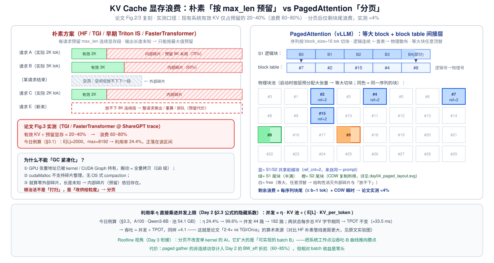
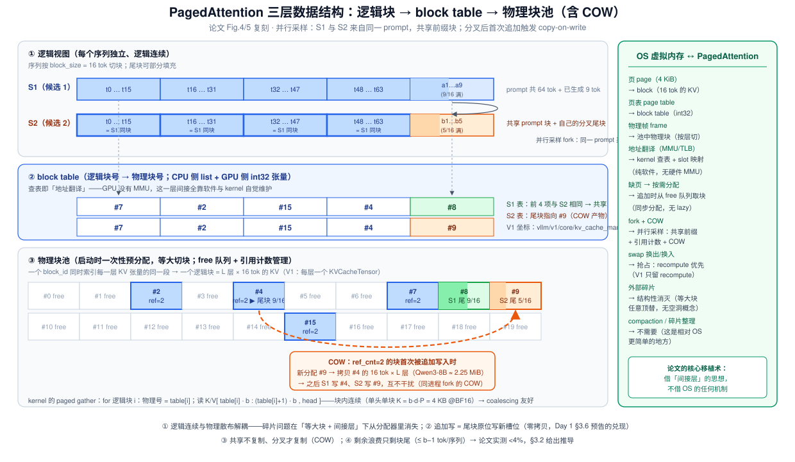
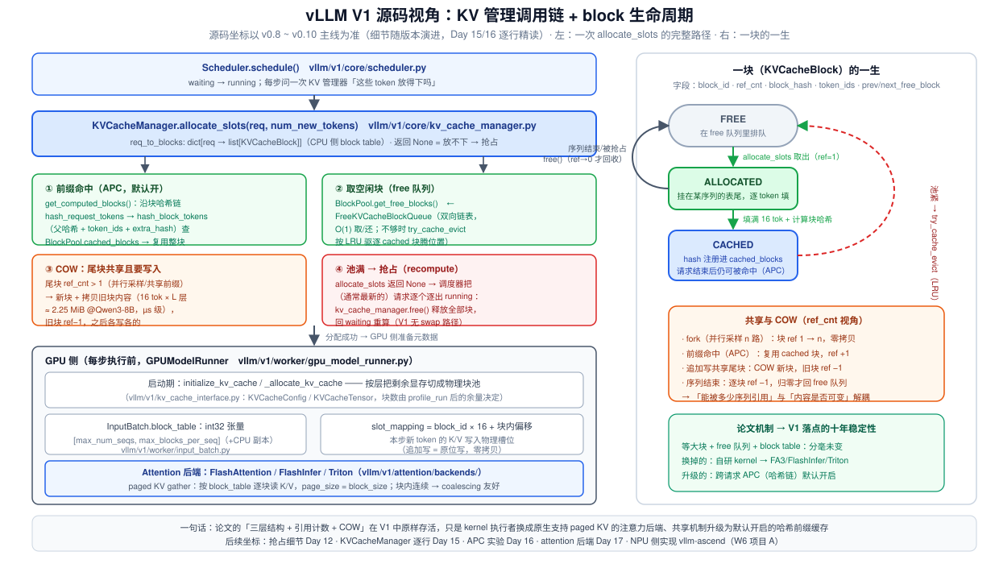

# Day 4 · PagedAttention 论文精读（SOSP 2023）：把操作系统虚拟内存搬进 GPU

> **系列**：推理系统优化专家岗 · 56 天打卡 | 第 1 周「推理基础与性能建模」
> **今日位置**：Day 1~3 完成了「数学」——AI = 2M/P、KV/token 公式、Roofline；今天读第一个「系统」——vLLM 的开山论文。Day 1 §2.5 账单里的 "KV cache = ctx × 144 KiB"、Day 2 §2.3 的 "并发上限 ∝ KV 池"，在今天变成问题定义：**这块显存在朴素方案里被浪费 60~80%**。PagedAttention 把 OS 分页思想整个搬进 GPU 用户态，把浪费压到 4% 以下——等于白捡 2~4× 吞吐
> **前置要求**：Day 1（KV cache 生成/复用、decode 张量流、§3.6 的 cat-vs-池伏笔）、Day 2（显存四件套、题 3 的 44 路并发）、Day 3（Roofline、decode attention 落在斜坡）
> **预计用时**：3 ~ 4 小时（论文精读 1.5h + 对照本篇 1h + 实验 0.5~1h）
> **背景衔接**：你在昇腾上做的是「片上存储的块管理」——L1 全载模板、L2 tiling、double buffer 乒乓，本质都是把有限高速存储切块复用。PagedAttention 对 HBM 做同样的事，还多借了一层 OS 累积五十年的弹药：页表、引用计数、copy-on-write。今天可以把你的「存储块管理」直觉原样映射到 LLM serving——这是 W6 做 vllm-ascend 贡献（项目 A）的概念地基
> **论文**：*Efficient Memory Management for Large Language Model Serving with PagedAttention*，Kwon et al., **SOSP 2023**（UC Berkeley / Stanford / UCSB；arXiv:2309.06180）
> **配套材料**：`week1/README.md` Day 4 节是本篇的浓缩版；三张 SVG：`assets/day04_kv_waste_taxonomy.svg`、`assets/day04_paged_layout.svg`、`assets/day04_v1_kv_callchain.svg`

---

## 0. 今日学习目标

完成今天的学习后，你应该能够：

- [ ] 讲清**三类浪费**（内部碎片 / 外部碎片 / 预留代价）的机理与量级，并在给定长度分布下**手算** 60~80% 这个数字
- [ ] **手画**论文的三层数据结构（逻辑块 → block table → 物理块池），说清 kernel 侧 paged gather 怎么按表寻址
- [ ] **推导**分页方案的浪费上界（块尾 ≤ b−1 token/序列 + COW 瞬时），解释外部碎片为什么被**结构性消灭**而不是被清理
- [ ] 用**引用计数 + COW** 讲清三个共享场景（并行采样 / beam search / 共享前缀），并算出 COW 成本（Qwen3-8B 一块 ≈ 2.25 MiB，n 路分叉只拷 n−1 次）
- [ ] 权衡抢占的 **recompute vs swap**，说清论文选 recompute 的资源逻辑，以及 V1 只保留 recompute 的现状
- [ ] 把论文机制**映射到 vLLM V1 源码坐标**（`KVCacheManager` / `BlockPool` / block table / `slot_mapping` / attention backend），为 Day 15/16 立好地图
- [ ] 交付：论文精读笔记 + **你标注的 3 个最巧设计点**（本篇 §2.7 给参考答案，自己重选更好）

---

## 1. 核心概念速览

| 概念 | 一句话定义 | 今日要达到的深度 |
|---|---|---|
| **内部碎片** | 按 max_len 预留、实际只用 L → (max−L) 段闲置且借不出去 | 会算 E[L]/max 的期望利用率 |
| **外部碎片** | 变长段有进有出 → 空闲洞放不下下一段（GPU 张量要求连续） | 会解释为什么不能 compact |
| **预留代价** | 池满 → 整请求换出/重算/排队，吞吐与尾延迟塌方 | 知道它是动态容量损失 |
| **block** | KV cache 的分配单位，默认 16 token × 全部层 | 会做 block size 的 trade-off |
| **block table** | 逻辑块号 → 物理块号的 int32 数组（软件页表） | 能画图、能算表项开销 |
| **物理块池** | 启动时按层预分配大张量，等大切块 + free 队列 | 知道"等大"是消灭外部碎片的关键 |
| **引用计数 ref_cnt** | 一块被几个序列引用；归零才能回收 | 与 COW 配套使用 |
| **COW** | 写共享块前先复制一份（copy-on-write），fork 语义 | 会算成本与次数（n−1） |
| **抢占（preemption）** | KV 不足时逐出请求：recompute（重算）或 swap（换出） | 会做两者的资源权衡 |
| **paged gather** | attention kernel 按 block table 逐块读非连续 KV | 知道块内连续救了 coalescing |
| **prefix caching（APC）** | 跨请求按块哈希自动共享/复用前缀（V1 默认开） | 今天只到机制层，Day 16 精读 |

> **一句话本质**：把 OS 分页（page=block、页表=block table、物理帧=池中块、fork+COW=并行采样）整个搬进 GPU 用户态——**没有 MMU 的世界里靠一张 int32 表 + kernel 查表自觉实现虚拟内存**；KV 显存利用率从 20~40% 提到 96% 以上，而并发上限 ∝ 利用率（Day 2 公式），于是吞吐 ×2~4，论文的全部魔法就这一句。

---

## 2. 原理深入讲解

### 2.1 回顾 Day 1~3：我们一直默认的一个假设

把前三天的相关结论排成一列：

| 来源 | 结论 | 隐藏假设 |
|---|---|---|
| Day 1 §2.3 | decode 每步**读全部历史 + 追加 1 个槽位** | cache 是连续数组，槽位就在数组末尾 |
| Day 1 §3.6 | `torch.cat` 式 cache 不可行 → "预分配池 + block table"（伏笔） | 今天兑现 |
| Day 2 §2.3 | 并发上限 ≈ KV 池 ÷（max_len × KV_per_token） | **KV 池没有浪费** |
| Day 2 §2.5 | KV_per_token 决定 block 池切分粒度（预告 Day 4/15） | 今天兑现 |
| Day 3 §2.4 | decode attention 是斜坡上的 KV gather kernel | gather 的地址是连续的 |

今天把最后一个假设拆掉：**KV 池是"被管理"的**。把它写进 Day 2 的公式：

$$
\text{并发上限} \;\approx\; \frac{\eta \cdot \text{KV\_pool}}{E[L] \cdot \text{KV\_per\_token}}, \qquad \eta \in (0, 1]
$$

$\eta$ 是 KV 池的**有效利用率**。朴素系统 $\eta \approx 0.2 \sim 0.4$（论文实测），PagedAttention $\eta > 0.96$——**$\eta$ 直接乘进并发与吞吐**，这就是"管理好显存 = 免费的数倍吞吐"的数学表述，也是本篇 §3 定量推导的主线。

### 2.2 问题定义：60~80% 的显存浪费从哪来



**朴素方案**（论文点名的 HF Transformers 管线、TGI、早期 Triton Inference Server、FasterTransformer 一族）：为每个请求按 `max_len` 预留**一段连续**显存。为什么只能"按最大值预留"？

1. **输出长度未知**：生成是自回归的（Day 1 §2.1），事先不知道会吐几个 token，只能按上限准备；
2. **连续性要求**：GPU 张量要求物理连续（attention kernel 要按地址一次读取），且静态 shape 才能高效执行；
3. **不能原地扩容**：KV 是逐 token 追加的，扩容 = 重新分配 + 全量拷贝（Day 1 §3.6 已算过这是每步 O(ctx) 的灾难）。

于是三类浪费（对照上图左半）：

| 浪费类型 | 机制 | 量级（今日例算） |
|---|---|---|
| **内部碎片** | 预留 8192、实际停在 2000 → 6192 token 段闲置但不能借给别人 | **75.6%**（§3.1 推导） |
| **外部碎片** | 变长请求有进有出，显存被切成洞；下一个 8K 连续段放不进任何洞 | 随时间累积（实验 1 Part B 实测：**空闲中 96% 是放不下的洞**） |
| **预留代价** | 池满 → 整请求换出/重算/排队 | 吞吐塌方 + TTFT 尾延迟（动态损失） |

论文 Fig.3 的测量方法（这是"60~80%"数字的出处，面试可能追问）：在 TGI 和 FasterTransformer 上回放 ShareGPT trace，**profile 预留显存中实际持有有效 KV 的比例 → 只有 20~40%**。即 $\eta \approx 0.2\sim 0.4$，浪费 60~80%。

**为什么不能"GC 紧凑化"？**（高频追问，见 §6 Q2）

- ① GPU 张量地址已经被 kernel / CUDA Graph 编译期持有，搬一个序列的 KV = 全量拷贝（GB 级、ms~s 级），serving 中做不了 stop-the-world；
- ② `cudaMalloc` 不提供碎片整理接口，也没有 OS 式 compaction；
- ③ 就算外部碎片清零，**长度未知 → 内部碎片（预留）依旧存在**。

> **第一性原理**：变长的需求 + 连续定长的供给 = 必然碎片。根治办法不是"把碎片打扫干净"，而是**改供给的粒度**——把"连续大段"换成"等大小块"。这正是 OS 在 1960 年代发明分页的同一个理由，论文只是把它搬进了 GPU。

### 2.3 核心设计：分页——三层数据结构



对照上图（论文 Fig.4/5 的复刻），自顶向下三层：

**① 逻辑视图**：每个序列的 KV cache 按 `block_size`（论文与 V1 默认 **16 token**）切成逻辑块。逻辑上序列仍然"连续"——第 $i$ 个 token 属于逻辑块 $\lfloor i/16 \rfloor$ 的第 $i \bmod 16$ 槽。尾块可以部分填充。

**② block table（块表）**：每个序列一张 int32 数组，逻辑块号 → 物理块号。这就是**软件实现的页表**。上图中 S1 的表是 `[7, 2, 15, 4, 8]`——它的 5 个逻辑块物理上散在池里。

**③ 物理块池**：启动时把 KV 预算**一次性**预分配成每层一个大张量（Day 2 §2.3 的"② KV 池"项），按 block_size 等大切块。**一个 block_id 同时索引每一层张量的同一段**——即一个逻辑块 = 全部 $L$ 层 × 16 token 的 KV（V1 中每层对应一个 `KVCacheTensor`，见 §4）。空闲块挂 free 队列，被引用块带 ref_cnt。

**核心收益逐条对照**：

| 朴素方案的痛点 | 分页方案 |
|---|---|
| 内部碎片 75% | 尾块浪费 ≤ 15 token/序列（期望 7.5，§3.2） |
| 外部碎片随时间累积 | **结构性消灭**：等大块之间任意顶替，"洞"的概念不存在 |
| 放不下 → 整请求换出 | 块粒度按需分配；抢占也只发生在"整池耗尽"时 |
| 变长管理成本 | 追加 = 尾块原位写一个槽位（**零拷贝**，Day 1 §3.6 伏笔兑现） |

**分配 / 释放 / 追加的复杂度**：从 free 队列头取块 O(1)；归还 O(1)；追加一个 token：若尾块未满 → 原位写（零开销）；若尾块满 → 取一个新块。所有路径都是 O(1)，且**全程无数据搬移**（除 COW，见 §2.4）。

> **为什么说"结构性消灭"外部碎片**：外部碎片的本质是"供给单位不齐 → 大小不匹配"。等大的块像固定面额的钞票——任何一张空闲块都能满足任何一个"再来一块"的请求。OS 的分页如此，PagedAttention 也如此；区别只在于 GPU 没有 MMU，"地址翻译"由 kernel 查表完成（§2.6）。

### 2.4 共享：引用计数 + COW

KV cache 有一个 OS 页没有的性质（Day 1 §2.2 推过）：**已生成的 K/V 永不改变**。于是"多序列共享同一块"是安全的，只要满足：**谁要写，谁先复制自己的那份**。这就是 ref_cnt + COW：

- **ref_cnt**：块被几个序列引用。fork 时 +、序列结束时 −；**归零才能回 free 队列**（正在被共享的块绝不能回收）。
- **COW（copy-on-write）**：向 `ref_cnt > 1` 的块**追加写入**前，先新分配一块、拷贝内容、旧块 ref−1。之后各写各的。

三个共享场景（论文 Fig.5 的三联画）：

| 场景 | 共享什么 | 分叉时机 | 备注 |
|---|---|---|---|
| **并行采样**（n=4 出 4 个候选） | 整个 prompt（76 块） | 每个候选各自生成第 1 个 token 时 | COW 只拷**尾块**（2.25 MiB），共 n−1 次 |
| **beam search** | beams 间的公共前缀 | beam 分叉时 | beam 淘汰/重排**只改 block table**（指针操作），不动数据 |
| **共享前缀**（system prompt） | 所有请求的公共前缀 | 各自生成时 | 论文讨论的场景；**跨请求自动去重（APC）是论文之后加入 vLLM 的**，V1 默认开启（Day 16） |

> **准确性备注**：论文的共享聚焦"运行中序列之间"；**自动前缀缓存（automatic prefix caching）**——用块哈希链跨请求自动发现并复用前缀、请求结束后仍保留可命中块——是论文发表后（2023 年底）合入 vLLM 的机制，V1 里默认开启。今天知道边界即可，细节（`hash_block_tokens` 的链式哈希、LRU 驱逐）留到 Day 16。

**COW 成本**（§3.5 完整推导）：拷一块 = 16 token × 36 层 × 4 KiB = **2.25 MiB**（Qwen3-8B BF16），在 H100 带宽下 ≈ **0.7 µs**——相对 ms 级的 decode 步是零头。而且 n 路分叉只拷 **n−1** 次：最后一个共享者免拷贝、原地写（实验 1 Part C 会亲眼看到）。

**收益**：并行采样 n=4、prompt 1207、各生成 800：不共享要 $4\times2007=8028$ token 的 KV，共享只要 $1207+4\times800=4407$ → 同显存多塞 1.82× 候选；共享前缀更夸张——32 个请求共享 512-token system prompt：不去重 16384 token vs 去重后 512 → **32×**（APC 的收益量级，Day 16 实验验证）。

### 2.5 调度：continuous batching 的另一半与抢占

PagedAttention 与 continuous batching（Orca, OSDI 2022）是**互为补集**的一对：continuous batching 解决"计算侧"的动态性（每步可以进新请求、出完成的请求），PagedAttention 解决"存储侧"的动态性（每步可以按块分配/释放 KV）。两者叠加才是完整的 iteration 级调度——vLLM 的起点。

**抢占（preemption）**：当某步 KV 池耗尽（free 队列空、无可驱逐 cached 块）时，调度器把（通常按 FCFS 最晚的）请求逐出 running，让新请求或剩余请求继续。被逐请求的两种恢复方式：

| | **recompute（重算）** | **swap（换出到 CPU）** |
|---|---|---|
| 恢复成本 | $2s \cdot N$ FLOPs（重跑一遍 prefill） | KV 从 HBM→CPU→HBM 的**往返带宽** |
| 占用的资源 | **算力**——decode 时大量闲置（Day 2：计算项比访存项小 260×） | **PCIe/NVLink 带宽**——与权重加载、TP 通信争抢 |
| 实现复杂度 | 低：请求回 waiting 队列重跑 | 高：CPU 侧池 + 异步传输 + 状态机 |
| 何时反噬 | prefill 算力不空闲时（→ P/D 分离后，Day 29） | 卡间带宽紧张 / 模型大时 |

**论文与 v0 支持两种、默认 recompute；V1 只保留 recompute**（swap 路径已移除）——理由正是上表第一行：**用空闲资源换稀缺资源**。这个选择不是永恒真理，Day 29 讲 P/D 分离时会看到它翻转的条件。抢占的触发路径与指标（`/metrics` 的 preemption 计数）→ Day 12。

### 2.6 kernel 侧：paged gather 的代价与工程

分页把"逻辑连续、物理散布"的矛盾推给了 attention kernel：

```text
# 朴素：一次大段连续读
K = cache_K[layer][0 : ctx]              # 连续内存，地址可预计算

# 分页：查表逐块读（论文的自研 kernel / V1 的 FA3·FlashInfer 都这么做）
for 逻辑块 i in 0 .. ceil(ctx/16)-1:
    物理号 p = block_table[seq][i]
    K_i    = cache_K[layer][p*16 : (p+1)*16]    # 块内连续！
    V_i    = cache_V[layer][p*16 : (p+1)*16]
    累积进 online softmax（FlashAttention 式分块）
```

**效率的关键在"块内连续"**：单头单块的 K 段 = $b \cdot d \cdot P = 16 \times 128 \times 2 = 4$ KB 连续——对 coalescing 仍然友好（这就是 block size 不能太小的 kernel 侧原因，§3.4）。代价是每块一次查表 + 跨块的地址跳变，论文的 kernel 微基准显示相比非分页 kernel 的开销在个位数百分比量级（**具体数字以原文为准**）——相对于它换来的 batch 上限，是零头。

**V1 现状**（重要的演进点）：GPU 路径上论文的自研 CUDA kernel 已被**原生支持 paged KV 的注意力后端**取代——FlashAttention / FlashInfer / Triton（`vllm/v1/attention/backends/`，`page_size = block_size`，Day 17 精读）；论文 kernel 的实现仍保留在仓库中供部分非 GPU 后端使用（以你手上版本为准）。

**昇腾侧**（你的背景对接）：vllm-ascend 在 `vllm-ascend/attention/` 下为 NPU 实现自己的 paged KV 后端；NPU 的 gather 对"连续段长度"更敏感，历史上 vllm-ascend 倾向**更大的 block size**（如 128，以版本为准）来保 coalescing——"平台参数决定 block size"是 W6 项目 A 选型时的一等公民问题。

### 2.7 我标注的三个最巧设计点（参考答案）

> 按计划这是今天的正式产出。下面是我的参考版本——**约束 + 选择的对称性破缺**是"巧"的共同结构；建议你自己重选并按这个骨架写。

**① block table 间接层：在没有 MMU 的世界实现虚拟内存。**
GPU 没有 MMU/TLB、没有缺页硬件，OS 的分页机制一行都用不上。论文的解法是把页表降维成一张 int32 数组，让 kernel 自觉查表。"间接层"换取的是虚拟内存的全部核心收益（逻辑连续与物理散布解耦），却没有付出任何 OS 代价（无系统调用、无上下文切换、无缺页中断——分配是同步 eager 的）。**借思想、不借机制**，是跨层迁移设计的教科书案例。

**② COW + 引用计数：fork 语义原样落地，共享的边际成本恒为零。**
并行采样的本质是"一份数据、n 个写者"。OS 对同构问题的答案（fork + COW）在这里**逐字成立**：prompt 块 ref=n 零拷贝，分叉瞬间只复制最后一个未满块，且 n 路只拷 n−1 次（最后一路免拷）。成本上界被"一块 × L 层 = 2.25 MiB"封死——**共享收益（GB 级显存）与共享成本（MiB 级拷贝）差了三个数量级**，这个不对称就是设计感的来源。

**③ 抢占选 recompute 而非 swap：花空闲的钱，办稀缺的事。**
直觉上"重算"比"搬运"浪费——但资源账相反：HBM↔CPU 往返占用的是稀缺的互连带宽，而 decode 阶段的算力本来就闲着（Day 2：计算项比访存项小两个数量级）。**用闲置资源置换瓶颈资源**，与投机解码（Day 25，用闲置算力换带宽）是同一个母题。更妙的是它自带失效条件：P/D 分离后 prefill 算力不再空闲，选择翻转（Day 29）——"正确的决策是情境的函数"，这是 trade-off 思维的最佳教学样本。

*备选（如果你想要自己的版本）*：block size=16 的折中（§3.4）；APC 的链式哈希（父哈希进子哈希，天然防错位，Day 16）；"cached 块也算可回收资源"的统一池设计（内存压力下的第二级水位）。

---

## 3. 定量推导：浪费、利用率与吞吐收益（今日核心）

> **规则**：先遮住解答自己推，再对答案。今天的推导目标是把论文的三个数字（60~80%、<4%、2~4×）全部变成自己的手算题。

### 3.0 记号与基准配置

| 记号 | 含义 | 取值（对齐 Day 2 题 3） |
|---|---|---|
| $b$ | block size | 16 token |
| $L_{\max}$ | max_model_len | 8192 |
| $E[L]$ | 负载平均总长（prompt+output） | 2000（prompt 1200 + output 800，ShareGPT 风格） |
| KV_tok | 每 token KV 字节 | 147,456 B = 144 KiB（Qwen3-8B BF16，Day 1 已推） |
| KV 池 | 80 GB × 0.9 − 权重 16.4 GB − 激活 1.5 GB | 54.1 GB（A100 或 H100 同账） |
| GEMM 权重 | 每步必读（Day 1 逐项拆解） | 15.1 GB |

### 3.1 朴素方案的利用率与并发（复现 60~80%）

**内部碎片主导的利用率**：按 $L_{\max}$ 预留、实际平均用 $E[L]$：

$$
\eta_{\text{naive}} = \frac{E[L]}{L_{\max}} = \frac{2000}{8192} = 24.4\% \quad\Rightarrow\quad \text{浪费 } 75.6\%
$$

落在论文实测的 20~40% 区间（实验 1 Part A 的随机负载实测 25.5%，同区间）。外部碎片还没算——实验 1 Part B 会看到它能把空闲显存切成 96% 不可用。

**并发上限**（Day 2 题 3 原样）：

$$
B_{\text{naive}} = \frac{54.1\,\text{GB}}{8192 \times 147456\,\text{B}} = \frac{54.1\,\text{GB}}{1.208\,\text{GB}} \approx 44\ \text{路}
$$

### 3.2 分页方案的浪费上界（复现 <4%）

**每序列浪费**只有尾块：$w \le b - 1 = 15$ token，期望（落点在块内均匀）$\bar{w} = (b-1)/2 = 7.5$。

**池级浪费率**（$n$ 个序列、无外部碎片、无 COW 瞬时）：

$$
\eta_{\text{paged}} = \frac{\sum L_i}{\sum \lceil L_i/b \rceil \cdot b} \;\approx\; \frac{E[L]}{E[L] + (b-1)/2} = \frac{2000}{2007.5} = 99.6\%
$$

再加上 COW 瞬时拷贝（并行采样时 n−1 块/请求）与真实负载的短序列占比，论文实测**总浪费 < 4%**——我们的上界估计与实测自洽。

**并发上限**：

$$
B_{\text{paged}} = \frac{54.1\,\text{GB}}{2007.5 \times 147456\,\text{B}} = \frac{54.1\,\text{GB}}{296\,\text{MB}} \approx 182\ \text{路}
$$

**并发比 $= 182 / 44 = 4.1\times = 1/\eta_{\text{naive}}$**——不是巧合，是结构（见下）。

### 3.3 吞吐收益：为什么恰好是 1/η 倍（复现 2~4×）

关键观察：**两种状态下 KV 池都被塞满**，所以每步的总访存字节几乎相同。用 Day 2 的 TPOT 下界公式（A100，2.04 TB/s）：

| | 朴素（B=44，全按 8192 跑满） | 分页（B=182，平均 2000） |
|---|---|---|
| 每步 KV 字节 | $44 \times 1.208 = 53.2$ GB | $182 \times 0.296 = 53.9$ GB |
| 每步总字节（+权重 15.1） | 68.3 GB | 69.0 GB |
| TPOT 下界 | $68.3/2.04 = 33.5$ ms | $69.0/2.04 = 33.8$ ms |
| **吞吐下界 = B/TPOT** | $44/0.0335 \approx 1315$ tok/s | $182/0.0338 \approx 5382$ tok/s |

**TPOT 几乎不变、并发 ×4.1 → 吞吐 ×4.1**。一般化：

$$
\frac{\text{Throughput}_{\text{paged}}}{\text{Throughput}_{\text{naive}}} \approx \frac{B_{\text{paged}}}{B_{\text{naive}}} \approx \frac{1}{\eta_{\text{naive}}} \in [2.5,\ 5]
$$

与论文摘要口径 **2~4×（vs TGI/Orca）** 吻合（TGI/Orca 自身的利用率比 24% 略好，所以倍数略低于我们的极端对照；对比 HF 朴素管线的差距更大，部分场景接近一个数量级——具体倍数以论文实验图为准）。

> **Roofline 视角**（Day 3 衔接）：PagedAttention **不改变任何单个 kernel 的 AI**——decode GEMV 还是 AI≈1、attention gather 还是读同样多的 KV 字节。它改变的是**系统可实现的工作点**：把图上的"batch 维"扩大 4 倍，沿 Day 2 的吞吐-B 曲线推向膝点（$B^* = 15.1/0.296 \approx 51$，182 已越过膝点进入 KV 主导区，但 SLO 允许时仍划算）。而 paged gather 的非连续访存开销，就计入 Day 2 说的 BW_eff 60~85% 折扣里——batch 收益比它大一个数量级。
>
> **现实折扣**：真实系统还有 `max_num_seqs` 上限、TPOT SLO（Day 2 题 3(c)：20 ms SLO 反推 B ≤ 21 就是很紧的约束）、长度方差与调度开销——§5 实验 2 用启动日志对账。

### 3.4 block size 的 trade-off（面试高频）

$b$ 是分页方案唯一的"尺寸参数"，两头都是悬崖：

| $b$ | 尾部浪费（期望） | 表项数 @8K | block table 显存 @1024 路 | 单头单块 K 连续段 | APC 命中尾损 |
|---|---|---|---|---|---|
| 8 | 0.18% | 1024 | 4 MiB | 2 KB | ≤ 7 tok |
| **16（默认）** | **0.38%** | **512** | **2 MiB** | **4 KB** | **≤ 15 tok** |
| 64 | 1.58% | 128 | 0.5 MiB | 16 KB | ≤ 63 tok |
| 256 | 6.38% | 32 | 128 KiB | 64 KB | ≤ 255 tok |

（尾部浪费 = $(b-1)/2 / E[L]$；表显存 = 表项 × max_num_seqs × 4 B）

- **$b \to 1$**：纯 token 级，零尾部浪费，但表项爆炸（8K 请求 8192 项）、访存完全随机化（coalescing 消失）→ kernel 崩溃；
- **$b \to L_{\max}$**：退化为整段预留 = 朴素方案，内部碎片全部回来；
- **中间的权衡**：小 $b$ 省显存、APC 命中粒度细（Day 16 会看到 hit rate 差异）；大 $b$ 保访存连续性、降管理开销。

论文与 V1 默认 **16**；V1 中实际值由 attention 后端的 `KVCacheSpec` 协商（不同后端/模型可能不同，如部分 MLA 后端用更大块，以版本为准）；**vllm-ascend 历史上倾向 128**（NPU 连续段敏感性，§2.6）。"给定平台与负载选 $b$"是 W6 项目的潜在实验题。

### 3.5 COW 与共享收益的算术

**单次 COW 成本**（Qwen3-8B BF16）：

$$
\underbrace{16\ \text{tok}}_{b} \times \underbrace{147456\ \text{B/tok}}_{\text{KV\_tok（已含 36 层）}} = 2.25\ \text{MiB} \quad\xrightarrow{\ H100\ 3.35\,\text{TB/s}\ }\approx 0.7\ \mu s
$$

**n 路并行采样的总 COW = n−1 次**（最后一个共享者免拷贝、原地写）：

$$
\text{成本}_{\text{COW}} = (n-1) \times 2.25\ \text{MiB} \;\ll\; \text{收益} = (n-1) \times s_{\text{prompt}} \times \text{KV\_tok}
$$

prompt=1207 时：成本 3 × 2.25 MiB ≈ 6.75 MiB，收益（省下的重复 prompt KV）= 3 × 1207 × 144 KiB ≈ 509 MiB——**成本收益比 ≈ 1:75**。

**显存需求对比**（n=4、prompt 1207、各出 800）：

$$
\text{不共享}: 4 \times 2007 = 8028\ \text{tok} \qquad \text{共享}: 1207 + 4 \times 800 = 4407\ \text{tok} \quad\Rightarrow\quad 1.82\times
$$

**共享前缀**（32 请求 × 512-token system prompt）：$32 \times 512 = 16384$ tok → 去重后 512 tok，**32×**——这就是 APC（Day 16）的收益量级，也是 Day 34 cache-aware routing 的动机。

---

## 4. 关键代码与 vLLM V1 的实际联系

> **版本说明**（同 Day 2 §4）：以下坐标以 v0.8 ~ v0.10 的 `vllm/v1/` 主线为准；V1 仍在演进（如 v0.10 起引入 `KVCacheCoordinator` 管理多组 attention 的块组），**类名/签名可能变化，Day 15/16 逐行精读**。今天只建立"论文机制 → 源码坐标"的地图，记住结构比记住名字重要。



### 4.1 论文机制 → V1 源码映射表

| 论文机制 | V1 源码坐标 | 关键类 / 函数 |
|---|---|---|
| 物理块池（按层等大切块） | `vllm/v1/worker/gpu_model_runner.py`、`vllm/v1/kv_cache_interface.py` | `GPUModelRunner.initialize_kv_cache` / `_allocate_kv_cache`；`KVCacheConfig` / `KVCacheTensor` |
| block | `vllm/v1/core/kv_cache_utils.py` | `class KVCacheBlock`：`block_id` / `ref_cnt` / `block_hash` / `token_ids` / `prev_free_block` / `next_free_block` |
| free 队列 | 同上 | `FreeKVCacheBlockQueue`：双向链表，O(1) 取/还/删（块节点即队列节点，零额外分配） |
| block table（CPU 侧） | `vllm/v1/core/kv_cache_manager.py` | `KVCacheManager.req_to_blocks: dict[req_id → list[KVCacheBlock]]` |
| block table（GPU 侧） | `vllm/v1/worker/input_batch.py` | `InputBatch.block_table`：int32 张量 `[max_num_seqs, max_blocks_per_seq]`（+CPU 副本 `block_table_cpu`） |
| 分配 / 释放 | `vllm/v1/core/kv_cache_manager.py` | `allocate_slots()` / `free()` → `BlockPool.get_free_blocks()` / `free_blocks()` |
| COW | `allocate_slots()` 内部 | 尾块 `ref_cnt > 1` 且需写入 → 复制块（分散在 KVCacheManager/BlockPool 的内部路径，Day 15 展开） |
| 前缀共享 → APC | `vllm/v1/core/kv_cache_utils.py` | `hash_request_tokens()` / `hash_block_tokens()`（父哈希 + token_ids + extra_hash 链式哈希）；`BlockPool.cached_blocks`；`KVCacheManager.get_computed_blocks()` |
| 抢占 | `vllm/v1/core/scheduler.py` | `allocate_slots` 返回 None → 逐出请求（recompute）→ `kv_cache_manager.free()`，请求回 waiting |
| paged gather | `vllm/v1/attention/backends/` | FlashAttention（`flash_attn.py`）/ FlashInfer / Triton：吃 `block_table`，`page_size = block_size` |
| 新 token 写入定位 | `vllm/v1/worker/gpu_model_runner.py` | `slot_mapping = block_id × block_size + 块内偏移` |

### 4.2 一次分配的调用链（对照 SVG 第三图走一遍）

```text
$ vllm serve ... 之后的每个调度步：
Scheduler.schedule()                        # vllm/v1/core/scheduler.py
  └─ KVCacheManager.allocate_slots(req, n)  # vllm/v1/core/kv_cache_manager.py
       ├─ ① get_computed_blocks(req)        # APC：哈希链找最长可复用前缀（命中块 ref+1）
       ├─ ② 尾块空位 → 原地追加（零拷贝）
       ├─ ③ 需新块 → BlockPool.get_free_blocks()
       │        └─ 不够 → try_cache_evict()：按 LRU 驱逐 cached 块（无人引用的 APC 块）
       ├─ ④ 尾块 ref_cnt>1 且要写 → COW（拷 2.25 MiB，旧块 ref−1）
       └─ 仍不够 → 返回 None → Scheduler 抢占（recompute）→ free()
GPU 侧（每步执行前）：
GPUModelRunner 更新 InputBatch.block_table（int32 张量）
  → slot_mapping = block_id × 16 + offset   # 新 token 的 K/V 写入物理槽位
  → FlashAttention/FlashInfer 按 block_table 做 paged gather（读全部历史）
```

**论文伪代码 ↔ V1 语义重构**（简化自 `allocate_slots`，不可运行，只为记住语义）：

```python
def allocate_slots(req, num_new_tokens):
    blocks = req_to_blocks[req.request_id]

    # ① 前缀命中（V1 默认开启）：hash_k = H(hash_{k-1}, tokens_k, extra_hash)
    #    沿链查 BlockPool.cached_blocks，命中整块直接复用（ref+1，零拷贝）
    num_cached = get_computed_blocks(req)

    # ② 尾块空位内的 token 原地追加；算出还需要几个新块
    num_needed = ceil((num_stored + num_new_tokens) / block_size) - len(blocks)
    if num_needed > available():          # free 队列 + 可驱逐的 cached 块
        return None                       # → Scheduler 触发抢占（§2.5）

    if num_needed > 0:
        # ③ COW：尾块共享且要继续写入 → 先复制自己的那份
        if tail_is_shared(blocks):
            blocks[-1] = block_pool.copy_block(blocks[-1])   # 2.25 MiB
        # ②' 取块（内部可能先 LRU 驱逐 cached 块）
        blocks += block_pool.get_free_blocks(num_needed)

    req_to_blocks[req.request_id] = blocks
    return num_needed                     # GPU 侧据此更新 block_table / slot_mapping
```

### 4.3 论文 → V1 的演进表（面试"你知道后续吗"）

| 论文时代（v0 首发） | V1 现状 | 备注 |
|---|---|---|
| 自研 PagedAttention CUDA kernel | FlashAttention / FlashInfer / Triton 插拔式后端（`vllm/v1/attention/backends/`） | kernel 会过时，机制不过时 |
| 共享限于运行中序列（并行采样/beam/前缀） | **APC 默认开启**：块哈希链跨请求去重，请求结束后块仍可命中 | 论文之后加入，Day 16 精读 |
| 抢占 recompute 默认、swap 可选 | **只保留 recompute**（swap 已移除） | Day 12 看触发路径与指标 |
| block size 16 | 默认仍 16，由后端 `KVCacheSpec` 协商 | MLA/滑窗后端可能不同 |

> **值得在面试里讲的一个观察**：论文发表十余年版本迭代后（v0→v1、kernel 全换、调度重写），**"等大块 + free 队列 + block table + 引用计数 + COW"这套三层结构分毫未动**——机制的生命力远超 kernel 的生命力。这是"把不变量做对"的系统设计范本（也是 §2.7 设计点①的延伸论据）。

---

## 5. 动手实验（约 60~90 分钟）

### 实验 1（无 GPU）：mini paged 池——亲手复现论文的"有效 KV 20~40%"

今天的核心实验。80 行纯 Python 把论文 Fig.3 的测量、三类浪费、COW 全部复现一遍（已验证可跑，预期输出见后）：

```python
# day04_lab.py —— mini paged KV 池：亲手复现论文的「有效 KV 20~40%」测量
# 纯 CPU 模拟，无依赖。运行：python3 day04_lab.py
import random

random.seed(42)
BLOCK = 16                                  # 论文 / V1 默认 block size
POOL_TOKENS = 54_100_000_000 // 147_456     # KV 池折成 token 数（Day 2 题 3 记账：54.1 GB）
L_MAX = 8192

def sample_lengths(n):
    """ShareGPT 风格长度分布：prompt 对数正态 + output 指数分布；多数短、长尾"""
    out = []
    for _ in range(n):
        p = min(int(random.lognormvariate(6.8, 1.0)), 4096)     # E ≈ 1.2K
        o = min(int(random.expovariate(1 / 800)) + 1, L_MAX - p)  # E ≈ 0.8K
        out.append(min(p + o, L_MAX))
    return out

# ---------- Part A：静态利用率（内部碎片的孤立测量） ----------
def part_a():
    lens = sample_lengths(10_000)
    E = sum(lens) / len(lens)
    naive_util = E / L_MAX
    paged_alloc = sum((l + BLOCK - 1) // BLOCK * BLOCK for l in lens)
    paged_util = sum(lens) / paged_alloc
    print(f"[A] E[L]={E:.0f} tok")
    print(f"    朴素（按 8192 预留）  利用率 = {naive_util:.1%}   ← 论文实测区间 20~40%")
    print(f"    分页（b=16）          利用率 = {paged_util:.1%}   ← 论文实测浪费 <4%")

# ---------- Part B：外部碎片（假设长度已知精确，变长段有进有出） ----------
def part_b():
    rng = random.Random(7)
    free = [(0, POOL_TOKENS)]                # 空闲区间表（有序、不相邻）
    live = []                                # (start, size, depart_tick)
    t, admitted, rejected = 0, 0, 0
    for l in sample_lengths(1_500):
        for (s, z, d) in [(s, z, d) for (s, z, d) in live if d <= t]:
            live.remove((s, z, d)); free.append((s, z))
        free.sort()
        merged = []
        for s, z in free:                    # 合并相邻空闲区间
            if merged and merged[-1][0] + merged[-1][1] == s:
                merged[-1] = (merged[-1][0], merged[-1][1] + z)
            else:
                merged.append((s, z))
        free = merged
        for i, (s, z) in enumerate(free):    # first-fit 放置
            if z >= l:
                live.append((s, l, t + rng.randint(100, 400)))
                free[i] = (s + l, z - l) if z > l else None
                free = [x for x in free if x]
                admitted += 1
                break
        else:
            rejected += 1                    # 空闲总量可能足够，但没有连续段放得下
        t += 1
    total_free = sum(z for _, z in free)
    biggest = max(z for _, z in free)
    print(f"[B] 长度精确已知（无内部碎片）+ first-fit + 有进有出：")
    print(f"    装下 {admitted} 个请求，被拒 {rejected} 个")
    print(f"    结束时空闲共 {total_free/1e3:.0f}K tok，其中最大连续段仅 {biggest/1e3:.0f}K tok"
          f" → {1 - biggest/max(total_free,1):.0%} 的空闲是放不下长请求的空洞")
    print(f"    （分页方案：等大块任意顶替，外部碎片恒为 0）")

# ---------- Part C：引用计数 + COW（并行采样分叉） ----------
class Block:
    __slots__ = ("bid", "ref", "tokens")
    def __init__(self, bid):
        self.bid, self.ref, self.tokens = bid, 1, []

class MiniPaged:
    def __init__(self, nblocks, b=BLOCK):
        self.b = b
        self.free = [Block(i) for i in range(nblocks)][::-1]
        self.copies = 0
    def alloc(self):
        blk = self.free.pop()
        blk.ref, blk.tokens = 1, []
        return blk
    def fork(self, blocks, n):
        """一条序列分叉成 n 个候选（并行采样）：父的份额变成 n 份"""
        for blk in blocks:
            blk.ref += n - 1
        return [list(blocks) for _ in range(n)]
    def append(self, blocks, n=1):
        """向序列追加 n 个 token；尾块共享（ref>1）则先 COW"""
        for _ in range(n):
            if not blocks or len(blocks[-1].tokens) == self.b:
                blocks.append(self.alloc())
            if blocks[-1].ref > 1:            # ★ COW：复制一份再写
                new = self.alloc()
                new.tokens = list(blocks[-1].tokens)
                blocks[-1].ref -= 1
                blocks[-1] = new
                self.copies += 1
            blocks[-1].tokens.append(1)
        return blocks

def part_c():
    pool = MiniPaged(nblocks=400)
    prompt = [pool.alloc() for _ in range(75)]
    for blk in prompt:
        blk.tokens = [1] * BLOCK
    tail = pool.alloc(); tail.tokens = [1] * 7       # prompt = 1207 tok，尾块 7/16
    prompt.append(tail)

    cands = pool.fork(prompt, n=4)                   # n=4 路并行采样
    for c in cands:
        pool.append(c, 800)                          # 各自生成 800 tok

    print(f"[C] 并行采样 n=4：prompt 76 块 ref=4（零拷贝共享）；")
    print(f"    各候选首次追加触发 COW，共 {pool.copies} 次 = n−1（最后一个共享者免拷贝、原地写）")
    print(f"    每次 COW = 16 tok × 36 层 × 4 KiB = 2.25 MiB（µs 级）")
    no_share, share = 4 * (1207 + 800), 1207 + 4 * 800
    print(f"    KV 需求：不共享 {no_share} tok vs 共享 {share} tok"
          f" → 同显存多塞 {no_share/share:.2f}× 候选")

if __name__ == "__main__":
    part_a(); part_b(); part_c()
```

**实测输出**（seed 固定，可直接对账）：

```text
[A] E[L]=2085 tok
    朴素（按 8192 预留）  利用率 = 25.5%   ← 论文实测区间 20~40%
    分页（b=16）          利用率 = 99.6%   ← 论文实测浪费 <4%
[B] 长度精确已知（无内部碎片）+ first-fit + 有进有出：
    装下 1199 个请求，被拒 301 个
    结束时空闲共 53K tok，其中最大连续段仅 2K tok → 96% 的空闲是放不下长请求的空洞
    （分页方案：等大块任意顶替，外部碎片恒为 0）
[C] 并行采样 n=4：prompt 76 块 ref=4（零拷贝共享）；
    各候选首次追加触发 COW，共 3 次 = n−1（最后一个共享者免拷贝、原地写）
    每次 COW = 16 tok × 36 层 × 4 KiB = 2.25 MiB（µs 级）
    KV 需求：不共享 8028 tok vs 共享 4407 tok → 同显存多塞 1.82× 候选
```

**对账三问**（把实验与手算钉在一起）：

1. Part A 的 25.5% vs §3.1 手算的 24.4%：同一公式 $\eta = E[L]/L_{\max}$，差异只是随机分布的 $E[L]$（2085 vs 2000）——手算用整数字、实验用真分布；
2. Part B 说明什么？**就算长度精确已知**（消掉内部碎片），变长段有进有出后 96% 的空闲仍是碎片——外部碎片是"连续供给"的固有病，与预留策略无关；
3. Part C 的 `fork` 为什么是 `ref += n-1` 而不是 `+= n`？父序列的 1 份份额直接拆成 n 份（父不再单独存在）——对应 vLLM 中并行采样请求的父/子关系。

### 实验 2（可选，需 GPU）：与 vLLM V1 启动日志对账

```bash
vllm serve Qwen/Qwen3-8B --max-model-len 8192 --gpu-memory-utilization 0.9
# 启动日志中找两行（措辞随版本略有出入）：
#   GPU KV cache size: 366,xxx tokens                  ← 54.1 GB ÷ 147456 B
#   Maximum concurrency for 8192 tokens per sequence: 44.x x   ← Day 2 题 3 的手算！
```

**对账**：`54.1e9 ÷ 147456 ≈ 366,779` tokens；`366,779 ÷ 8192 ≈ 44.8` 倍并发——与 Day 2 题 3 的 44 路完全同账（那里的 1.5 GB 激活预留对应这里的实测余量，差异在 profile 与图内存）。

**思考**：日志里的 Maximum concurrency 按 `max_model_len` 满长计算（保守口径 44.8×）；真实负载平均 2000 token 时，分页池实际能容纳 ~182 路（§3.2）——**这 44.8 → 182 的差距正是 PagedAttention 的 payoff**，只要 `max_num_seqs`（V1 默认 1024）与 TPOT SLO 不先封顶。若版本支持 `--block-size` 可再试 8/32 观察块数变化（新版本由后端协商，CLI 可能被覆盖，以实际行为为准；APC 开关的对比实验留给 Day 16）。

### 实验 3：论文精读任务清单（今天实验的主体）

按下面路线读原文（arXiv:2309.06180，图号以你手上版本为准）：

| 顺序 | 论文位置 | 带着问题读 | 对应本篇 |
|---|---|---|---|
| 1 | §1~2 + 浪费机理图 | 60~80% 怎么测出来的？三类浪费各占多少？ | §2.2 |
| 2 | 利用率测量图 | 有效 KV 20~40% 的测量口径（预留为分母） | §3.1、实验 1A |
| 3 | 布局图（Fig.4） | 三层结构画一遍：逻辑块/块表/物理块，ref 与 COW 箭头 | §2.3、SVG 2 |
| 4 | 解码方法共享图（Fig.5） | 并行采样/beam/共享前缀各共享什么？何时 COW？ | §2.4 |
| 5 | kernel 设计节 | paged gather 怎么组织？块内连续救了什么？ | §2.6 |
| 6 | 调度与抢占节 | recompute vs swap 的默认与理由 | §2.5 |
| 7 | 评估：吞吐-延迟主图 + 并行采样/共享前缀/kernel 微基准 | 2~4× 在哪些配置下测得？膝点形状与 Day 2 曲线像吗？ | §3.3 |

---

## 6. 面试高频问题（含答题骨架）

**Q1：PagedAttention 解决了什么问题？碎片率怎么算？**（必考）

> 骨架：① 问题：KV cache 按 max_len 连续预留 → 内部碎片 $(L_{\max}-E[L])/L_{\max}$、外部碎片（变长段进出留洞）、预留代价（换出重算）；论文实测有效 KV 仅 20~40%；② 解法：OS 分页搬进 GPU——16-token 等大块 + block table（软件页表）+ free 队列 + 引用计数 + COW；③ 碎片率：分页后浪费只剩块尾，期望 $(b-1)/2$ token/序列 → 利用率 $E[L]/(E[L]+(b-1)/2) ≈ 99.6\%$，论文实测 <4%；④ 收益：并发 ∝ 利用率 → 吞吐 2~4×（池塞满时 TPOT 不变，吞吐比 = 并发比 = 1/η）。**收尾**：外部碎片是"结构性消灭"（等大块任意顶替），不是清理出来的。

**Q2：为什么不做一个"显存整理器"（compacting GC）解决外部碎片？**

> 骨架：① KV 张量地址被 kernel/CUDA Graph 持有，搬动 = GB 级全量拷贝，serving 不能 stop-the-world；② cudaMalloc 无碎片整理接口；③ 就算外部碎片清零，长度未知 → 内部碎片照在。**根因**：变长需求 + 连续供给 = 必然碎片；正解是改供给粒度（等大块），这比"更聪明地打扫"便宜且彻底。

**Q3：block size 怎么选？两个极端会发生什么？**

> 骨架：① 小 b：尾部浪费小（∝ b）、APC 命中粒度细，但表项 ∝ 1/b、访存连续段 ∝ b（coalescing 恶化）、管理开销升；② 大 b：反之，b=L_max 退化回朴素方案（内部碎片全回来）；③ b=1 纯 token 级，访存完全随机，kernel 崩；④ 论文/V1 默认 16（4 KB 单头单块连续段）；平台差异：NPU 上 vllm-ascend 历史倾向 128 保连续段。**收尾**：给数字——b=16 @E[L]=2000 尾部浪费 0.38%，b=256 是 6.4%。

**Q4：COW 什么时候触发？成本多大？n 路并行采样要拷几次？**

> 骨架：① 触发：向 ref_cnt>1 的块追加写入时（分叉后各自的首个新 token）；② 成本：一块 = b × KV_tok，Qwen3-8B 是 2.25 MiB ≈ 0.7 µs @H100，收益是被共享的整段 prompt KV（GB 级），成本收益比 ~1:75；③ 次数：n−1（最后一个共享者免拷贝、原地写）；④ beam search 的重排只改 block table，不动数据。**坑点**：很多人答 n 次——最后一个共享者根本不用拷。

**Q5：抢占为什么默认 recompute 而不是 swap？这个选择什么时候翻转？**

> 骨架：① 资源账：swap 花 HBM↔CPU 往返带宽（稀缺、与 TP 通信/权重加载争抢），recompute 花 prefill 算力——decode 阶段算力大量闲置（计算项比访存项小两个数量级，Day 2）；② 用闲置资源换瓶颈资源，同投机解码一个母题；③ V1 干脆只留 recompute；④ 翻转条件：P/D 分离后 prefill 算力不再空闲（Day 29）、或互连带宽充裕（NVLink 内搬 KV 便宜）——决策是负载与拓扑的函数。

**Q6：分页对 attention kernel 提出了什么要求？性能损失在哪、多大？**

> 骨架：① 要求：按 block table 查表寻址，逐块 gather 非连续 KV；② 救命性质：块内连续（16×128×2B=4 KB/头/块），coalescing 仍友好；③ 损失：每块一次查表 + 跨块跳变，论文微基准是个位数百分比量级；④ V1 现状：FlashAttention/FlashInfer 原生 paged KV 接口（page_size=block_size），自研 kernel 已退居非 GPU 后端。**收尾**：相对它换来的 4× batch 上限，这个损失是零头——"系统级收益买 kernel 级开销"。

**Q7（差异化题）：如果让你在昇腾 NPU 上实现/优化 paged KV 后端，你会重点关注什么？**

> 骨架：① 语义不变量：block table 间接层、ref/COW、slot_mapping——这些跨平台不变；② 平台敏感项：连续段长度（NPU gather 对 coalescing 更敏感 → 倾向更大 block，如 vllm-ascend 历史上的 128）、L2/缓存行为（对照昇腾 L2 与 GM 的 bound 建模，Day 3 的映射表直接复用）、AI Core 的 tiling 与 block 内 16×128 的形状匹配；③ 验证方法：先手算该 workload 的 AI 与 ridge，再用 msprof 对 SM/ Cube 利用率判 bound——与 GPU 侧 ncu 流程同构。**这是 W6 项目 A 的面试预演。**

---

## 7. 今日总结

1. **问题**：朴素方案按 max_len 连续预留 KV → 三类浪费（内部碎片 75%、外部碎片随时间累积、预留代价），论文实测有效 KV 仅 20~40%；根因是"变长需求 + 连续供给"，清理无用，改粒度才行。
2. **设计**：OS 分页搬进 GPU 用户态——逻辑块（16 tok）→ block table（软件页表）→ 物理块池（按层等大切块 + free 队列）；追加写 = 尾块原位写（零拷贝）；外部碎片被等大块**结构性消灭**。
3. **共享**：KV 只读不变性（Day 1 的因果性推导）使多序列共享安全——ref_cnt 管生死，COW 管分叉；n 路并行采样拷 n−1 块（每块 2.25 MiB），成本收益比 ~1:75；跨请求 APC 是论文后加入的演进，V1 默认开。
4. **抢占**：recompute 用 decode 闲置算力换稀缺带宽，优于 swap；V1 只留 recompute；P/D 分离后此决策会翻转。
5. **收益的算术**：并发 ∝ η；池塞满时每步总 KV 字节相同 → TPOT 不变 → **吞吐比 = 并发比 = 1/η**（44→182 路 = ×4.1），复现论文 2~4×；Roofline 上不改单 kernel AI、只推大工作点。
6. **V1 坐标**：`KVCacheManager.allocate_slots/free` + `BlockPool`（free 队列/cached_blocks）+ `InputBatch.block_table` + `slot_mapping` + `vllm/v1/attention/backends/` 的 paged gather——三层结构十年未变，kernel 换了三代。

---

## 8. 今日自测题（先自己做，再展开答案）

**Q1**：给一个负载：prompt 固定 1024、output 平均 512（最大 2048）、max_model_len=4096。朴素方案的期望利用率是多少？分页后呢（b=16）？

<details><summary>参考答案</summary>

朴素：$E[L] = 1536$，$\eta = 1536/4096 = 37.5\%$（浪费 62.5%，仍在论文 60~80% 区间）。分页：每序列期望分配 $1536 + 7.5 = 1543.5$ tok，$\eta \approx 99.5\%$。吞吐潜力 $1/0.375 = 2.7\times$。
</details>

**Q2**：分页之后还剩哪些浪费？各自的量级？

<details><summary>参考答案</summary>

① 块尾内部碎片：≤ b−1 = 15 tok/序列，期望 7.5（E[L]=2000 时 0.38%）；② COW 瞬时拷贝：并行采样/共享前缀分叉时 n−1 块 × 2.25 MiB；③ APC 命中粒度损失：前缀复用按块对齐，最多浪费 15 tok 的"尾巴"（Day 16）；④ 查表与 gather 开销（时间上的，非显存）。论文实测总浪费 <4%。外部碎片 = 0（等大块任意顶替）。
</details>

**Q3**：一个序列当前 1000 token，b=16。它占几个块？浪费几个槽位？下个 token 追加时系统做什么？

<details><summary>参考答案</summary>

$\lceil 1000/16 \rceil = 63$ 块（62 块满 + 尾块 8/16），分配 63×16 = 1008 槽，浪费 8 个。下一个 token 追加：尾块未满 → **原位写第 9 个槽，零分配零拷贝**；若尾块被共享（ref_cnt>1）→ 先 COW 复制再写。写完后 slot_mapping = 尾块物理号 × 16 + 8。
</details>

**Q4**：为什么说"PagedAttention 不改变任何 kernel 的算术强度，却改变了系统的吞吐"？用 Day 2/3 的工具说。

<details><summary>参考答案</summary>

单 kernel：decode GEMV 仍读全部权重（AI≈1）、attention gather 仍读全部 KV 字节——AI 与 Roofline 落点不变。系统级：并发上限 $B \approx \eta \cdot M_{KV}/(E[L]\cdot\text{KV\_tok})$，η 从 24%→99.6% 使 B ×4.1；池塞满时每步总字节不变 → TPOT 不变 → 吞吐 = B/TPOT 同比 ×4.1。即它扩大的是"可实现的工作点"（沿吞吐-B 曲线右移），不是"单 kernel 的效率"。附带：paged gather 的非连续开销计入 BW_eff 折扣，远小于 batch 收益。
</details>

**Q5**：V1 为什么删掉了 swap 抢占？说说这个决策的资源和场景依赖。

<details><summary>参考答案</summary>

资源账：swap 恢复需要 KV 在 HBM↔CPU 间往返，占用 PCIe/NVLink 带宽且需要 CPU 侧池与异步传输的复杂状态机；recompute 只花 prefill 算力，而 decode 阶段算力大量闲置（计算项比访存项小两个数量级）——用闲置换稀缺，实现还更简单。场景依赖：① P/D 分离后 prefill 算力不再空闲，重算的边际成本上升；② 若互连带宽充裕（同节点 NVLink）或 KV 很小，swap 变划算；③ 抢占频繁本身说明 KV 超配，应该调 `max_num_seqs`/`max_model_len`（Day 12/51 的诊断树）。
</details>

**Q6**：论文里的"共享前缀"和 V1 默认开启的 prefix caching 是一回事吗？

<details><summary>参考答案</summary>

不是。论文的共享发生在**运行中的序列之间**（并行采样、beam search、已知公共前缀的请求），靠 ref_cnt + COW 手工/半自动地共享块；**automatic prefix caching** 是论文之后加入 vLLM 的机制：把每块的内容哈希（父哈希 + token_ids + extra_hash）注册进 `cached_blocks`，任何新请求自动按哈希链命中前缀，且请求结束后块仍保留可继续命中（LRU 驱逐）。V1 中 APC 默认开启（`enable_prefix_caching`）。区分这两代机制是"真的读过论文"的信号。
</details>

---

## 9. 今日产出物

按计划，今天交付**论文精读笔记（含 3 个最巧设计点）**。归档要求：

- [ ] 用自己的话写**一句话问题定义**（含 60~80% 的测量口径：有效 KV ÷ 预留显存，TGI/FT @ ShareGPT）
- [ ] **三类浪费机理图**自己画一遍（不看本篇 SVG）
- [ ] **数据结构字段级草图**：block（block_id/ref_cnt/block_hash/token_ids/free 指针）、block table、池
- [ ] **kernel 侧寻址流程**：5 行伪代码（查表 → 块内连续段 → online softmax 累积）
- [ ] **3 个最巧设计点** + 每点一段"为什么巧"（约束 → 选择的对称性破缺；可参考 §2.7 但必须换自己的话）
- [ ] 实验 1 的输出贴上 + 三问对账；有 GPU 再贴实验 2 的启动日志对账
- [ ] 如果是我：还有什么别的解法？（例：token 级分配 + 显式 compaction？分层 KV（GPU→CPU→SSD）？滑动窗口式截断？——各写一句为什么当前设计更优/什么场景会反超）

笔记骨架（直接抄）：

```markdown
# PagedAttention 论文精读（Day 4）
## 0. 一句话问题 + 60-80% 的测量方法
## 1. 三类浪费：机制图 + 各自量级（含实验 1 的 Part A/B 数据）
## 2. 三层结构手绘图：逻辑块 / block table / 物理块池（标注 ref_cnt=2 与 COW 箭头）
## 3. 共享语义：ref_cnt / COW / 并行采样 n−1 次拷贝 / beam 重排只动表
## 4. 抢占：recompute vs swap 资源账 + V1 现状
## 5. kernel：paged gather 伪代码 + 块内连续（4 KB）为什么救了 coalescing
## 6. 收益算术：η 24%→99.6% ⇒ 44→182 路 ⇒ ×4.1 吞吐（= 1/η，TPOT 不变）
## 7. 三个最巧设计点（自己的话 + 为什么巧）
## 8. 与 V1 源码的映射表（§4.1 抄一遍再默写一遍）
## 9. 如果是我：备选方案与批判
## 10. 面试 3 分钟讲稿（问题→设计→数字→演进）
```

---

## 10. 明日预告（Day 5）

今天我们反复说"PagedAttention 带来 ×4.1 吞吐""SLO 允许时仍划算"——但**吞吐和时延到底怎么定义、怎么测、怎么汇报**，还没系统化。明天（Day 5）搭指标体系：

- **TTFT / TPOT / ITL / E2E / throughput / goodput** 的精确定义与两个恒等式（`E2E = TTFT + (n−1)×TPOT`；Little's Law）
- 为什么生产系统按 **goodput** 而非 raw throughput 评估——今天"44 路 → 182 路"的收益，在 SLO 约束下要打多少折扣
- 产出：指标定义卡片（面试随时抽背）——Day 6 就带着这套卡去跑第一次真实压测

> 打卡：完成后在 README 的 Day 4 前打勾，并写一句话收获（例："用 80 行 Python 复现了论文的 20~40%——原来 60-80% 这个数字分母是预留显存；最巧的还是那张 int32 页表：没有 MMU 的世界，间接层全靠 kernel 自觉"）。
