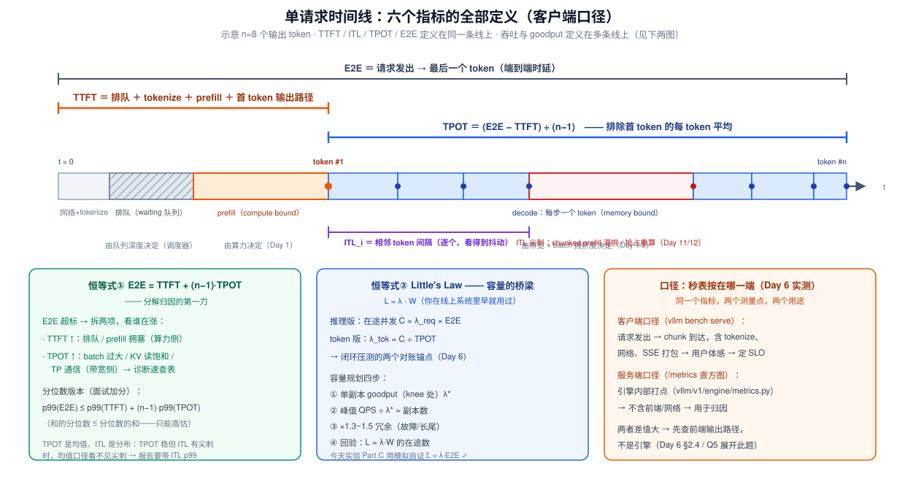
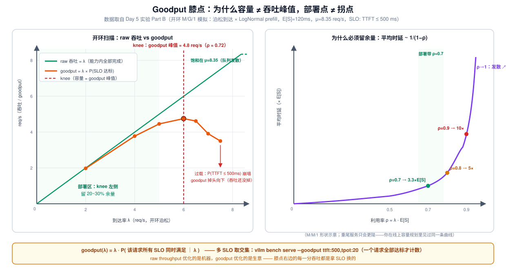
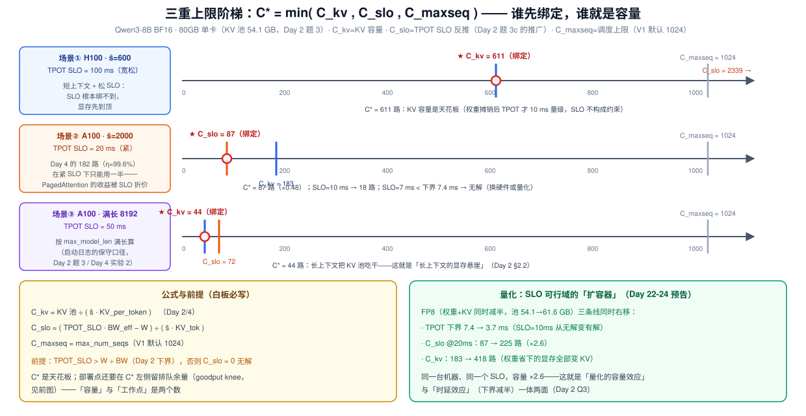

# Day 5 · Serving 指标体系：TTFT / TPOT / ITL / E2E / Throughput / Goodput

> **系列**：推理系统优化专家岗 · 56 天打卡 | 第 1 周「推理基础与性能建模」
> **今日位置**：Day 1~4 建立了推理的「物理层」——prefill/decode 两张账单（Day 1）、显存与时延手算公式（Day 2）、Roofline（Day 3）、PagedAttention 的显存管理（Day 4）。今天往上盖「指标层」：把每一步的毫秒与字节，翻译成**用户体感**（TTFT/TPOT/ITL/E2E）与**系统容量**（throughput/goodput），用**两个恒等式**把整周的手算串成一道完整的面试容量题。Day 4 结尾留的那句话——"182 路的收益在 SLO 约束下要打多少折扣"——今天用一张表兑现
> **前置要求**：Day 1（两阶段、§2.4 已埋 TTFT/TPOT 伏笔）、Day 2（TPOT 下界、$B^*$、题 3(c) 的 SLO 反推 B≤21）、Day 3（Roofline 斜坡与 batch 右移）、Day 4（44→182 路、`max_num_seqs`、η）
> **预计用时**：2.5 ~ 3.5 小时（精读 1.5h + 实验 1h + 制作指标卡 0.5h）
> **背景衔接**：你有高并发分布式架构经验——Little's Law（L=λW）、容量按 70% 利用率部署、p99 监控告警，这些你在线上系统里已经用了很多年。今天的任务是把这套运维直觉**原样迁移**到 GPU serving，再补上 LLM 特有的两块：①两阶段把时延天然拆成 TTFT/TPOT 两截（归因完全不同）；②KV 显存让容量变成**三维**的（C_kv / C_slo / C_maxseq 三重上限谁先绑定）
> **配套材料**：`week1/README.md` Day 5 节是本篇的浓缩版；三张 SVG：`assets/day05_request_timeline_metrics.svg`、`assets/day05_goodput_knee.svg`、`assets/day05_capacity_ladder.svg`
> **版本口径**：源码坐标与 CLI 参数按 v0.10~v0.11 主线（2026-10）核对；指标名/默认值随版本微调，以你环境的 `curl /metrics` 与 `--help` 输出为准

---

## 0. 今日学习目标

完成今天的学习后，你应该能够：

- [ ] 在一条请求时间线上**精确指出**六个指标（TTFT / ITL / TPOT / E2E / throughput / goodput）的起止点与测量端，并说出各自由哪一侧的物理决定（算力 / 带宽 / 队列）
- [ ] **白板默写**两个恒等式：`E2E = TTFT + (n−1)·TPOT` 与 Little's Law `C = λ·E2E`（含 token 版 `λ_tok = C/TPOT`），并用它们把 Day 1~4 的全部手算串成一道完整的容量题
- [ ] 解释**为什么必报 p99 而非 mean**（TTFT 的 mean 与 p99 差 3~10 倍的机理），以及 TPOT（均值）与 ITL（分布）的分工——TPOT 稳但 ITL 有尖刺时该查什么
- [ ] 讲清 **goodput 与 raw throughput 的区别**、膝点（knee）为什么会出现在利用率 ~70% 而非饱和点、为什么生产部署必须在 knee 左侧留 20~30% 余量
- [ ] 掌握**三重上限** $C^* = \min(C_{kv},\ C_{slo},\ C_{maxseq})$：同一模型在不同负载/SLO 下谁绑定，SLO 紧到什么程度直接「无解」（下界判据 `SLO > W/BW`）
- [ ] 用**诊断速查表**把症状映射到嫌疑与验证手段——这是 Day 51 性能诊断树的雏形
- [ ] 交付：**指标定义卡片**（面试随时抽背）+ 一道完整手算容量题（§3 题 1）

---

## 1. 核心概念速览

| 概念 | 一句话定义 | 今日要达到的深度 |
|---|---|---|
| **TTFT** | 请求发出 → 首 token 到达（客户端口径） | 会拆成分项归因：排队/prefill/输出路径 |
| **ITL** | 相邻 token 间隔（逐个，是分布） | 知道它比 TPOT 多看到什么：尖刺 |
| **TPOT** | 排除首 token 的每 token 平均 | 会推导、会预测 TPOT(C) 曲线 |
| **E2E** | 请求发出 → 最后一个 token | 会用恒等式①分解归因 |
| **Throughput** | 系统输出速率（三个口径！） | 会区分 req/s / output tok/s / total tok/s |
| **Goodput** | **满足 SLO 的**吞吐 | 会讲膝点、部署纪律、三重上限 |
| **SLO** | 用分位数写的性能承诺 | 会给典型量级与依据（业务感） |
| p50 / p99 | 分位数延迟 | 知道为什么报告必须带 p99 |
| **knee（膝点）** | goodput 峰值对应的负载点 | 知道它在 ρ≈0.7 而非 ρ=1 的排队论根源 |
| **C_kv / C_slo / C_maxseq** | 容量的三重上限 | 会算谁绑定、何时无解 |
| 闭环 / 开环 | 压测的两种负载范式 | 知道各自能回答什么（Day 6 实操） |
| 客户端 / 服务端口径 | 秒表按在哪一端 | 知道 SLO 用哪个、归因用哪个 |

> **一句话本质**：Day 1~4 算的是"**每一步的物理**"（毫秒、字节、FLOP）；今天定义"**怎么把物理汇报成体验与容量**"——六个指标是把毫秒翻译成承诺的语言，两个恒等式是翻译的语法，goodput 曲线是这门语言的终极考卷。

---

## 2. 原理深入讲解

### 2.1 回顾 Day 1~4：我们一直缺的那一层

把前四天的结论排成一列，看今天补什么：

| 来源 | 结论 | 今天的角色 |
|---|---|---|
| Day 1 §2.4 | prefill compute bound / decode memory bound；TTFT↔prefill、TPOT↔decode | **指标归因的第一性依据**：两项指标的物理来源不同 → 药方不同 |
| Day 2 §2.4 | TPOT(B) ≥ (W + B·ctx·KV_tok)/BW；$B^*$ 临界点 | TPOT(C) 曲线与吞吐曲线的**形状**；C_slo 的原型 |
| Day 2 题 3(c) | TPOT SLO=20ms 反推 B ≤ 21 | "SLO 决定 batch 上限"的第一次亮相——今天推广成 C_slo |
| Day 3 §2.4 | batch = 斜坡右移，吞吐随 batch 上升 | "吞吐为什么先线性后饱和"的 Roofline 解释 |
| Day 4 §3.2/3.3 | 44→182 路（η 24%→99.6%）；"SLO 允许时仍划算" | C_kv 与 C_maxseq；**"SLO 允许"今天定量**（§3.2） |
| Day 4 §2.5 | 抢占 recompute；preemption 计数 | 诊断表里 ITL 尖刺/吞吐反降的嫌疑之一（Day 12 展开） |

缺口很清楚：前四天的量全是**引擎视角的物理量**（每步读多少字节、能塞多少路），还没回答两个真正的问题——

1. **用户视角**：用户等的 5 秒怎么分解？哪一段是浪费？
2. **运营视角**：这台机器敢对外承诺多少 QPS？加到多少并发开始"赚了吞吐、丢了体验"？

这两个问题的答案就是今天的六个指标 + 两个恒等式 + 一条 goodput 曲线。

### 2.2 一条时间线定义六个指标



对照上图，把每个指标的**测量点**（在哪端、从哪到哪）说清楚——**定义不带测量点等于没定义**：

| 指标 | 定义（测量点：客户端） | 公式 | 由什么决定（第一性） | 典型陷阱 |
|---|---|---|---|---|
| **TTFT** | 请求发出 → 首 chunk 到达 | — | **排队**（调度器）+ **prefill 计算**（算力侧，Day 1）+ tokenize/输出路径 | mean 与 p99 差 3~10×（prompt 对数正态长尾 + 排队） |
| **ITL_i** | 相邻两个 chunk 的到达间隔 | 逐个记录，是一组数 | decode 步时延（带宽侧）+ 干扰源 | SSE 打包把多个 token 捆进一个 chunk 时 ITL 变粗、个数变少 |
| **TPOT** | 排除首 token 的每 token 平均 | $\frac{\text{E2E} - \text{TTFT}}{n-1}$ | decode 步时延 × batch 拥挤度（Day 2 的 TPOT(B)） | 是**均值**——ITL 的周期性尖刺会被它抹平 |
| **E2E** | 请求发出 → 最后 chunk | $\text{TTFT} + (n-1)\cdot\text{TPOT}$ | 上两者之和 | 长输出被 (n−1) 放大：TPOT 差 1ms，n=512 时 E2E 差 0.5s |
| **Throughput** | 系统输出速率 | $\lambda_{tok} \approx C/\text{TPOT}$ | decode 访存上限（Roofline 斜坡，Day 3） | **三个口径**见 §2.5 |
| **Goodput** | 满足 SLO 的吞吐 | $\lambda \cdot P(\text{全 SLO 达标})$ | 三重上限 + 排队余量（§2.6/2.7） | knee ≠ 吞吐峰值；多 SLO 取**交集** |

五个高频易错点（面试官最爱在这里挖）：

> **易错点 1**：TTFT **含排队**。低载时它 ≈ prefill 时间；高载时排队主导——"TTFT 升、ITL 稳"是过载的第一信号（§2.8）。
>
> **易错点 2**：TPOT 的分母是 **n−1 不是 n**——首 token 是 prefill 顺带产出的，不占用 decode 步。`vllm bench serve` 源码里就是这么写的（§4.2）。
>
> **易错点 3**：ITL ≠ TPOT。TPOT 是均值，ITL 是分布。**TPOT 稳但 ITL 有规律尖刺** = 混排/抢占在打点（Day 11/12 的预告）；只报 TPOT 的人看不见这些尖刺。
>
> **易错点 4**：三个吞吐不能混（§2.5 的表）。
>
> **易错点 5**：**客户端口径 vs 服务端口径**。SLO 面向用户 → 按客户端（含 tokenize、网络、SSE 打包）；服务端 `/metrics` 直方图是引擎内部打点，用于**归因**。两者差值大 → 先查前端输出路径，不是引擎。今天建立概念，Day 6 §2.4 拿真实数据量这个差值。

### 2.3 恒等式一：E2E = TTFT + (n−1)·TPOT —— 分解归因的第一刀

**推导**（按定义直接展开）：时间线从左到右是「首 token 之前的一段 + 之后 n−1 个 decode 间隔」：

$$
\text{E2E} \;=\; \underbrace{\text{TTFT}}_{\text{排队 + prefill + 输出路径}} \;+\; \underbrace{\sum_{i=2}^{n} \text{ITL}_i}_{\text{decode 段}} \;\approx\; \text{TTFT} + (n-1)\cdot\text{TPOT}
$$

最后一步把 n−1 个 ITL 的和换成 (n−1)×均值——**这正是 TPOT 的定义式**，所以这个恒等式在客户端口径下是**被源码强制成立**的（`tpot = (latency − ttft) / (output_len − 1)` 反解即得，§4.2）。

**用法一：归因**。E2E 超标先拆两项——两项的物理来源完全不同（Day 1：一个 compute bound、一个 memory bound），药方也完全不同：

| 涨的是 | 嫌疑 | 对应今天的诊断表行 |
|---|---|---|
| TTFT | 排队堆积 / prefill 拥塞 / 长 prompt 长尾 | 第 1 行 |
| TPOT | batch 过大 / KV 读饱和 / TP 通信占比 | 第 3 行 |

**用法二：预算分配**。给用户承诺 E2E ≤ 5s、n=512、TTFT SLO 0.5s 时，TPOT 的预算是 $(5-0.5)/511 \approx 8.8$ ms——**E2E SLO 会传导成 TPOT SLO**，这是很多团队定 SLO 时漏掉的一步。

**分位数版本**（面试加分）：

$$
p99(\text{E2E}) \;\le\; p99(\text{TTFT}) + (n-1)\cdot p99(\text{TPOT})
$$

和的分位数 ≤ 分位数的和（只有完全同单调才取等）——用右端做 E2E p99 的**上界估计**，白板三秒出数。

**体感锚点**：人类阅读速度约 10~20 tok/s → **TPOT 50~100 ms 是对话体感的下限**；TTFT 超过 0.5s 用户开始觉得"卡死了"。这两个数字就是对话场景 SLO 的来源（§2.6 的表）。

### 2.4 恒等式二：Little's Law —— 容量的桥梁

$$
\boxed{\;L \;=\; \lambda \cdot W\;}
$$

平均在途数 = 到达率 × 平均驻留时间。**它对任何稳态系统成立，与分布无关**（不是近似，是守恒律——今天实验 Part C 会模拟验证）。推理系统的三个变体：

| 变体 | 形式 | 用途 |
|---|---|---|
| 请求版 | $C = \lambda_{req} \cdot \text{E2E}$ | 已知 E2E 反推在途并发；已知 C 反推单副本 req/s |
| token 版 | $\lambda_{tok} \approx C / \text{TPOT}$ | 闭环压测对账锚点：`output_throughput × mean_TPOT ≈ C`（±15%） |
| 精确 token 版 | $\lambda_{tok} = C \cdot n / \text{E2E}$ | n 小或 TTFT 占比大时用（与上行差 ~2%，见 §3.1(d) 对账注） |

> **背景衔接**：这就是你在线上系统里配线程池/连接池时用的同一条定律——"QPS × 平均处理时间 = 需要的并发槽位"。GPU serving 唯一的新东西：**槽位是 KV 显存**（C_kv，Day 2/4），且每个"处理时间"（TPOT）本身随 C 变化（Day 2 的 TPOT(B) 曲线）——所以推理的容量题是**自洽方程**而不只是除法。

**容量的三级用法**（面试"怎么规划一个推理集群"的骨架）：

1. 单副本容量 = 单副本 **goodput**（knee 处的 λ，不是吞吐峰值，§2.6）；
2. 副本数 = 峰值 QPS ÷ 单副本 goodput，×1.3~1.5 冗余（故障转移/长尾/灰度）；
3. 回验：部署后监控 `num_requests_running`（在途 L）与 λ·E2E 是否一致——不一致说明测量口径或负载假设错了。

### 2.5 吞吐的物理：TPOT(C) 曲线 → 吞吐曲线（把 Day 2 系统化）

Day 2 已推出 decode 步的访存账；今天把它变成**曲线**。稳态下 output 吞吐：

$$
X_{tok}(C) \;=\; \frac{C}{\text{TPOT}(C)} \;\approx\; \frac{C \cdot \text{BW}}{W + C \cdot \bar{s} \cdot \text{KV\_tok}}
$$

- $C \ll B^* = W/(\bar{s}\cdot\text{KV\_tok})$（Day 2 的摊销临界点）：$X \approx C \cdot \text{BW}/W$，**近线性**——每加一路几乎白送（权重读被摊薄）；
- $C \gg B^*$：$X \to \text{BW}/(\bar{s}\cdot\text{KV\_tok})$，**饱和平台**——KV 读接管一切（Roofline 语言：工作点在斜坡上滑到 KV 项主导区，Day 3）。

例（H100，Qwen3-8B BF16，$\bar{s}=600$）：平台 = $3.35\,\text{TB/s} / (600 \times 147456\,\text{B}) \approx 3.8 \times 10^4$ tok/s（理论）；实测打 3~5 折 → 1~2 万 tok/s——Day 6 压测将验证这个数。

**三个吞吐口径**（混用是汇报事故的头号来源）：

| 口径 | 定义 | 谁在用 |
|---|---|---|
| request throughput（req/s） | 完成请求数/s | 业务容量（QPS）、副本数计算 |
| **output token throughput（tok/s）** | 生成侧 token/s | "吞吐"的默认含义；TPOT 对账（$C/\text{TPOT}$） |
| total token throughput | prefill + decode 全部 token/s | 算力利用率对账；**易被拿来吹**——ShareGPT 的 prompt:output ≈ 5:2，total ≈ 3.5× output |

**为什么必报 p99**：TTFT/ITL 的分布是**重尾**的（prompt 对数正态 + 排队 + 抢占毛刺）。mean 与 p99 差 3~10× 是常态（Day 6 实测将看到 mean 187ms / p99 1353ms 这类数字）。更关键的运营事实：**过载初期 mean 几乎不动、p99 先爆**——只盯 mean 的监控，会在系统已经过载时显示一切正常。

### 2.6 SLO 与 goodput：膝点、容量与部署点



**SLO（Service Level Objective）**是用分位数写的、面向**用户体感**的承诺：

| 场景 | TTFT | TPOT / ITL | 依据 |
|---|---|---|---|
| 在线对话 | p99 ≤ 0.5 s（严苛产品 0.2~0.4） | p99 ≤ 50~100 ms | >0.5s 感知"卡死"；10~20 tok/s 阅读速度下限 |
| 代码补全 | p99 ≤ 0.2~0.3 s | p99 ≤ 20~50 ms | 打字节奏内出建议 |
| 离线批处理 | 无 SLO | 无 SLO | 无约束 → goodput 退化为 raw throughput |

（具体数值因产品而异；面试给量级 + 依据即可，别背成教条。）

**raw throughput 的三重欺骗性**——为什么生产系统不按它评估：

1. **可博弈（古德哈特定律）**：加 batch、加并发总能换吞吐，代价全是 TPOT/TTFT——Day 2 例题三的剪刀差（TPOT 涨 3 倍换吞吐涨 10.7 倍）。**没有 SLO 锚点的吞吐是一个可以无限自我安慰的数字**；
2. **mean 掩盖长尾**：见 §2.5 末段；
3. **闭环压测看不见过载**：闭环客户端自适应限速（完成一个才发下一个），服务器永远"稳如老狗"；**只有开环（泊松到达）能暴露容量上限**——过载时 waiting 队列无界增长、TTFT 发散（Day 6 实验 4 亲手做）。

**goodput 形式化**：

$$
G(\lambda) \;=\; \lambda \cdot P\big(\forall i:\ m_i(\text{req}) \le \text{SLO}_i \ \big|\ \lambda\big)
$$

- $\lambda$ 小：$P \le P_0 < 1$（负载本身的长尾也可能违反——如 8K prompt 的 prefill 天生超 TTFT SLO，§3.3）；
- $\lambda$ 大：排队使 $P \to 0$，于是 $G \to 0$——**goodput 掉头向下，而吞吐还在涨**；
- 中间有峰，峰的位置由排队动态决定。

**膝点从哪来**（右图）：平均排队时延 ~ $1/(1-\rho)$（$\rho = \lambda \cdot E[S]$ 为利用率）。$\rho=0.7$ 时平均时延已是服务时间的 3.3 倍，$\rho=0.9$ 时 10 倍，$\rho \to 1$ 发散。所以 **goodput 峰值出现在 ρ≈0.7 左右，而不是吞吐饱和点 ρ=1**——今天实验 Part B 的模拟里，goodput 峰值 4.8 req/s 落在 λ=6.0 处，对应 ρ = 6.0/8.35 ≈ 0.72，与这条曲线的预言一致。

> 这就是你做线上容量规划时"部署在 70% 利用率"的同一条曲线——GPU serving 没有发明任何新定律，只是把 E[S] 换成了 prefill 时间、把"连接"换成了"KV 槽位"。

**部署纪律**（容量规划的黄金法则）：

- 单副本容量 = **goodput 峰值**（knee 处），不是吞吐峰值；
- 部署工作点 = knee **左侧再留 20~30% 余量**（扛突发与长尾）；
- 面试一句话：**"raw throughput 优化的是机器，goodput 优化的是生意。膝点右边的每一分吞吐，都是拿 SLO 换的。"**

### 2.7 三重上限：容量是三维的



Day 2 算过并发上限（容量），Day 2 题 3(c) 算过 SLO 反推的 batch 上限，Day 4 引入过 `max_num_seqs`——今天把它们统一成**三重上限**：

$$
\boxed{\;C^* \;=\; \min\!\Big(\ \underbrace{C_{kv}}_{\text{KV 容量}},\ \underbrace{C_{slo}}_{\text{TPOT SLO 反推}},\ \underbrace{C_{maxseq}}_{\text{调度上限}}\ \Big)\;}
$$

$$
C_{kv} = \frac{\text{KV 池}}{\bar{s}\cdot\text{KV\_tok}} \qquad
C_{slo} = \frac{\text{TPOT}_{SLO}\cdot \text{BW}_{eff} - W}{\bar{s}\cdot\text{KV\_tok}} \qquad
C_{maxseq} = \texttt{max\_num\_seqs（V1 默认 1024）}
$$

**三个必答的推论**：

1. **谁绑定随负载与 SLO 变**（对照 SVG 三层阶梯）：短上下文 + 松 SLO → KV 容量绑定（场景①）；紧 SLO → SLO 绑定（场景②）；长上下文 → KV 容量悬崖式绑定（场景③）。**不能只背一个数字**；
2. **无解判据**：$C_{slo} > 0$ 要求 $\text{TPOT}_{SLO} > W/\text{BW}_{eff}$（Day 2 的下界）。SLO 低于下界 → **这台硬件上此 SLO 永远无解**，出路只有换硬件、量化（下推下界）、或投机解码（Day 25：有效 TPOT ≈ 步时延 ÷ 平均接受长度）；
3. **量化的"扩容器"效应**（Day 22-24 预告）：FP8 同时推高三条线——下界 7.4→3.7 ms、$C_{slo}$@20ms 87→225、$C_{kv}$ 183→418。§3.2 完整算一遍。

还有一个容易忘的维度：$C^*$ 是**天花板**，**部署点是 knee 左侧**（§2.6）——"容量"与"工作点"是两个数，面试时主动区分它们是加分项。

### 2.8 诊断速查表（Day 51 诊断树的雏形）

| 症状 | 优先怀疑 | 验证手段 | 第一性解释（Day 1~4） |
|---|---|---|---|
| **TTFT ↑、ITL 稳** | 排队堆积 / prefill 拥塞 | `num_requests_waiting` 深度、prefill token budget | prefill 是算力侧；ρ→1 时队列 $1/(1-\rho)$ 发散 |
| ITL 稳中有**规律尖刺** | chunked prefill 混排 / 抢占重算 | `preemption_total` 计数、step 时间分布 | 混排步更大；重算把请求打回 waiting（Day 11/12） |
| **ITL / TPOT 整体抬升** | batch 过大 / KV 读饱和 / TP 通信占比 | running batch、`gpu_cache_usage`、NCCL 时间 | KV 项 ∝ C·s̄·KV_tok（Day 2 TPOT 第二项） |
| 吞吐**不升反降** | 频繁抢占、prefix 失效 | preemption 计数、cache hit rate | 重算浪费算力；缓存失效重跑 prefill |
| OOM / 崩溃 | KV 超配 | `gpu_cache_usage` 贴 100%、`max_num_seqs`、budget | 硬容量 = 池大小（Day 4：分页治碎片，不治容量） |
| 客户端 p99 ≫ 服务端 p99 | 前端输出路径（tokenize/detokenize/SSE） | 两端口径并排对比 | 口径差（§2.2 易错点 5），引擎无罪 |

这张表现在只建直觉，Day 13（动手验证调度行为）、Day 19（nsys 找 bubble）、Day 51（诊断树背熟）会逐步把它长成一棵完整的树。

---

## 3. 定量推导：三道手算题（今日核心）

> **规则**：先遮住解答自己推，再对答案。三道题分别覆盖：完整容量面试题（README 的指定练习）、Day 4 预告的"SLO 折扣"、TTFT 侧的可行性判定。

### 3.0 记号与基准配置

| 记号 | 含义 | 取值（沿用 Day 2/4/6 的账本） |
|---|---|---|
| $W$ | 每步必读权重 | 16.4 GB（整权重，对齐 Day 6）；GEMM 口径 15.1 GB（对齐 Day 2/4） |
| KV_tok | 每 token KV 字节 | 147,456 B = 144 KiB（Qwen3-8B BF16，Day 2） |
| KV 池 | 单卡可用 | 54.1 GB（80 GB × 0.9 − 16.4 − 1.5） |
| $\bar{s}$ | **平均已生长上下文** | 场景而异——**勿用 max_model_len**（附录 B 口径纪律） |
| BW | HBM 带宽 | A100 = 2.04、H100 = 3.35 TB/s |
| BW_eff | 工程有效带宽 | 标称 ÷ 1.5（Day 2：实测是下界的 1.2~2 倍） |
| MFU | prefill 算力利用率 | 40%（合格线，附录 B） |

### 3.1 题 1（完整面试题）：H100 + Qwen3-8B BF16，目标并发 64 @ 8K —— 全套指标

**题目**：单卡 H100 80GB 跑 Qwen3-8B BF16，`max_model_len=8192`，业务期望并发 64、平均输出 n=512。(a) 能装下吗？(b) TPOT 与吞吐？(c) E2E？(d) SLO 判定与容量收口。

**(a) 容量检查先行**（三重上限，最容易被跳过的一步）：

按**满长 8K** 保守口径：单序列 KV = $8192 \times 144\,\text{KiB} = 1.208$ GB →

$$
C_{kv} = 54.1 / 1.208 \approx 44.8 \ \text{路} < 64 \quad \Rightarrow \ \textbf{装不下（Day 2 题 3 / Day 4 实验 2 的同一本账）}
$$

两个出路：① 加卡/量化（架构动作）；② **改口径**——真实负载（ShareGPT 风格：$\bar{P}=500$、$\bar{O}=200$）的 decode 期间平均上下文 $\bar{s} \approx \bar{P} + \bar{O}/2 = 600$：

$$
C_{kv} = \frac{54.1\,\text{GB}}{600 \times 147456\,\text{B}} = \frac{54.1}{0.0885} \approx 611\ \text{路} \quad (<\ C_{maxseq}=1024,\ \checkmark)
$$

**口径纪律**：满长 44.8 是启动日志的保守口径，611 是真实负载的期望口径——**面试时先问清"8K ctx 是 max_len 还是平均长度"再动笔**，这一问本身就值印象分。

**(b) TPOT 与吞吐**（Day 2 公式 + 工程折扣）：

$$
\text{TPOT}(64) \ge \frac{16.4 + 64 \times 0.0885}{3.35} = \frac{22.06}{3.35} \approx 6.6\ \text{ms（下界）}
\;\xrightarrow{\times 1.5}\; \mathbf{9.9\ ms（工程口径）}
$$

$$
X_{tok} \approx \frac{64}{9.9\,\text{ms}} \approx \mathbf{6.5K\ tok/s}\quad(\text{下界口径 } 9.7\text{K})
$$

对照 $B^* = 16.4/0.0885 \approx 185$：64 ≪ B*，还在摊销区——C=1 时 TPOT 才 7.3 ms（工程），64 路只涨到 9.9 ms（+36%），**这就是 Day 2 例题三"剪刀差"在真实负载下的样子**。

**(c) E2E**（恒等式①，TTFT 用成分模型估）：

prefill 计算：$2Ns = 2 \times 8.2\text{e}9 \times 500 = 8.2$ TFLOP（attention 项 ~1%，忽略）÷ (MFU 0.4 × 989 TFLOPS) ≈ **21 ms**；加 tokenize/排队/输出路径，取 **TTFT ≈ 100 ms**（声明假设，Day 6 实测校准）：

$$
\text{E2E} = 0.1 + 511 \times 0.0099 \approx \mathbf{5.2\ s}
$$

首 token 只占 E2E 的 2%——**长输出的体验几乎完全由 TPOT 决定**，这就是 TPOT SLO 比看起来更重要的原因。

**(d) SLO 判定与 Little's Law 收口**：

- TPOT 9.9 ms ≤ 50 ms ✓（对应 101 tok/s ≫ 阅读速度）；TTFT 0.1 s ≤ 0.5 s ✓ → **全部达标，goodput ≈ 吞吐 ≈ 6.5K tok/s**；
- $C_{slo}$@50ms = $(0.05 \times 3350/1.5 - 16.4)/0.0885 \approx 1077$ 路 > $C_{kv}$=611 → 松 SLO 下容量由 KV 绑定（§2.7 场景①）；
- Little's Law：$\lambda_{req} = C/\text{E2E} = 64/5.15 \approx 12.4$ req/s；$\lambda_{tok} = 12.4 \times 512 \approx 6.4$K tok/s ≈ $C/\text{TPOT} = 6.5$K ✓（**差 ~2%：来自首 token 与 TTFT 的口径**，§2.4 的精确式 vs 近似式）；
- 容量收口：若业务峰值 100 QPS → 副本数 = $100 / 12.4 \approx 8$ 台，×1.4 冗余 → **~11 台**。

> **一句话答案**（面试 60 秒版）：装得下（真实负载口径 611 路上限）；TPOT ≈ 10 ms、吞吐 ≈ 6.5K tok/s、E2E ≈ 5.2 s（TTFT 占 2%）；SLO 全达标、KV 容量先绑定；单副本 ≈ 12 req/s，100 QPS 的业务要 11 台。

### 3.2 题 2（Day 4 预告兑现）：PagedAttention 的 182 路，在 TPOT SLO 下打多少折扣？

**账本**（对齐 Day 4 §3.2/3.3）：A100（2.04 TB/s）、GEMM 权重 15.1 GB、$\bar{s}=2000$（每路 KV = 0.295 GB）、$C_{kv} = 54.1/0.295 \approx 183$ 路（Day 4 算 182——差在尾块期望 7.5 token 的口径，两边都对）。

$$
\text{TPOT}(B) = \frac{15.1 + B \times 0.295}{2.04}\ \text{ms} \quad\Rightarrow\quad
C_{slo} = \frac{\text{SLO} \times 2040 - 15.1}{0.295}
$$

| TPOT SLO | $C_{slo}$ | $C^* = \min(C_{kv}, C_{slo})$ | 182 路的折扣 | 绑定者 |
|---|---|---|---|---|
| 100 ms | 641 | **183** | ×1.00 | KV 容量 |
| 50 ms | 295 | **183** | ×1.00 | KV 容量 |
| 30 ms | 156 | **156** | ×0.85 | SLO |
| **20 ms** | **87** | **87** | **×0.48** | **SLO（Day 2 题 3c 的 21 是满长口径，这里 87）** |
| 10 ms | 18 | 18 | ×0.10 | SLO |
| 7 ms | 无解（0） | 0 | — | **7 ms < 下界 7.4 ms** |

**FP8 对照**（权重+KV 双 FP8：W→7.55 GB、KV_tok→72 KiB、池→61.6 GB）：

| | BF16 | FP8 | 倍数 |
|---|---|---|---|
| TPOT 下界 | 7.4 ms | 3.7 ms | ÷2 |
| $C_{slo}$ @20ms | 87 | 225 | ×2.6 |
| $C_{kv}$ | 183 | 418 | ×2.3 |
| $C^*$ @20ms | 87 | **225** | **×2.6** |

**三个结论**（Day 4 结尾那句"SLO 允许时仍划算"的完整定量版）：

1. **SLO 越紧，显存管理的容量收益被吃得越狠**：182 → 87 → 18，折扣从 0.48 掉到 0.10——PagedAttention 解决的是 $\eta$（显存利用率），**解决不了 W/BW（带宽下界）**；两个瓶颈正交；
2. **SLO 低于下界直接无解**——这时唯一的出路是把下界本身打下去（量化 ÷2、换 H100 4.5ms、投机解码 ÷接受长度）；
3. **量化是 SLO 可行域的扩容器**：同一台机器、同一个 SLO，容量 ×2.6——Day 2 Q3 的"容量效应"与"时延效应"在 goodput 维度合流（Day 22-24 展开）。

### 3.3 题 3（TTFT 侧）：8K prompt 的 TTFT SLO 可行性

**题目**：对话场景，TTFT SLO = p99 ≤ 500 ms，Qwen3-8B，p99 prompt 长度 ≈ 8192。A100 和 H100 单卡分别可行吗？

**第一步：单请求 prefill 的计算时间**：

$$
\text{FLOPs} = \underbrace{2Ns}_{\text{GEMM}} + \underbrace{2LHs^2}_{\text{causal attention}} = 134.3 + 19.8 = 154\ \text{TFLOP}
$$

（attention 二次项占 15%——8K 时已不可忽略，见 Day 1 的 FLOPs 推导：`week1/README.md` §1.4。）

| 平台 | @MFU 40% | @MFU 100%（物理极限） | 判定 |
|---|---|---|---|
| A100（312 TFLOPS） | **1234 ms** | 494 ms | **不可行**——即使 MFU 拉满也贴着 SLO，没有排队/tokenize 余量 |
| H100（989 TFLOPS） | 389 ms | 156 ms | 纸面可行，余量 111 ms 要装 tokenize+排队+输出——**高载下危险** |

**第二步：排队会把纸面可行打成不可行**（M/M/1 简化，$E[S]=0.39$ s，H100）：

| 到达率 λ | ρ | 平均时延 $E[S]/(1-\rho)$ | 判定 |
|---|---|---|---|
| 0.5 req/s | 0.20 | 0.48 s | 勉强（无余量） |
| 1.0 req/s | 0.39 | 0.64 s | **超 SLO** |
| 2.0 req/s | 0.78 | 1.77 s | 远超 |

**解法菜单**（按成本排序，全部是后续课程的钩子）：

1. **prefix caching**（Day 16）：8K 里若有 6K 是共享 system prompt → 只算 2K，154 → ~35 TFLOP，389 → **88 ms**——命中率就是 TTFT 的折扣率；
2. **TP=2**（Day 32）：prefill 近线性扩展 → ~195 ms；
3. **P/D 分离**（Day 29）：prefill 独占实例、不受 decode 干扰，goodput 1.5~3×；
4. **MFU 优化**（Day 18：torch.compile / CUDA Graph）；
5. 换 H200/B200（算力侧硬解）。

**一个必须澄清的概念**（Day 11 的伏笔）：chunked prefill **不减少** prefill 总时间——它把"prefill 到来时 decode 卡顿"换成"prefill 被切成块拉长"，保护的是 TPOT/ITL 平滑，**不是 TTFT**。TTFT 的杠杆在算力、缓存与架构，不在切块。

### 3.4 手算流程卡（3 分钟白板版，面试直接用）

```text
① 抄负载    s̄（平均上下文，勿用 max_len！）、n（输出长度）、λ_req 峰值、SLO（TTFT/TPOT，p99）
② 容量账    C_kv = KV池 ÷ (s̄·KV_tok)   对照 max_num_seqs → 第一重上限
③ 时延账    TPOT(C) = (W + C·s̄·KV_tok) ÷ BW_eff
            → C_slo = (TPOT_SLO·BW_eff − W) ÷ (s̄·KV_tok)   → 第二重上限
            前提检查：TPOT_SLO > W ÷ BW（下界），否则此硬件无解
④ E2E 账    TTFT ≈ 2Ns/(MFU·F) + 排队；E2E = TTFT + (n−1)·TPOT（对照 E2E SLO）
⑤ 收口      C* = min(C_kv, C_slo, C_maxseq)——注意谁绑定
            部署点 = knee 左侧留 20~30%；副本数 = 峰值QPS ÷ 单副本goodput × 1.3~1.5
⑥ 对账      throughput × TPOT ≈ C（±15%）；p99/mean ≈ 3~10 才像真实负载
```

**必背锚点**（今天新增的）：TPOT 下界 8B→7.4ms@A100 / 4.9ms@H100；对话 SLO TTFT 0.5s / TPOT 50~100ms；knee ≈ ρ 0.7；V1 `max_num_seqs`=1024。

---

## 4. 关键代码与 vLLM V1 的实际联系

> **版本说明**（同 Day 2/4/6）：坐标按 v0.10~v0.11 的 `vllm/v1/` 与 `vllm/benchmarks/` 主线；指标名与字段随版本微调，以你环境实测为准。今天只到"**哪个指标在哪生产、在哪消费**"的深度，Day 6 起这些链条会被反复走读。

### 4.1 指标的生产者 / 消费者全景

```text
服务端（引擎自己的账本，归因口径）：
Scheduler.schedule()                              # vllm/v1/core/scheduler.py
  └─ update_stats() → SchedulerStats              #   running/waiting 深度、KV 占用、preemption
       └─ EngineCore --(ZMQ)--> AsyncLLM          # vllm/v1/engine/core.py → async_llm.py
            └─ PrometheusStatLogger.log_metrics() # vllm/v1/engine/metrics.py
                 ├─ Gauge:   vllm:num_requests_running / num_requests_waiting
                 ├─ Gauge:   vllm:gpu_cache_usage
                 ├─ Histogram: vllm:time_to_first_token_seconds      ← 服务端 TTFT
                 ├─ Histogram: vllm:time_per_output_token_seconds    ← 服务端 TPOT
                 ├─ Histogram: vllm:e2e_request_latency_seconds
                 └─ Counter: vllm:preemption_total / prompt_tokens_total / ...
                     └─ /metrics 端点（vllm/entrypoints/openai/api_server.py，Prometheus 抓取）

客户端（用户体感，SLO 口径，Day 6 的主角）：
vllm bench serve → aiohttp 流式请求（每个 chunk 打一次时间戳）
  └─ calculate_metrics()                          # vllm/benchmarks/serve.py
       ├─ tpot = (latency − ttft) / (output_len − 1)
       ├─ is_good_req = all([s >= r for s, r in zip(slo_values, req_metric)])
       └─ np.percentile → p50/p99 → 控制台报告 + 结果 JSON
```

### 4.2 定义如何被代码化（`vllm/benchmarks/serve.py::calculate_metrics` 节选）

```python
# ① TPOT：排除首 token 的每 token 平均——§2.2 易错点 2 的出处
if output_len > 1:
    tpot = (outputs[i].latency - outputs[i].ttft) / (output_len - 1)
    tpots.append(tpot)
# output_len ≤ 1 时 tpot 记 0（goodput 计算需要）

# ② goodput：所有 SLO 同时满足才算 good——§2.6"多 SLO 取交集"的代码化
for req_metric in zip(*valid_metrics):
    is_good_req = all([s >= r for s, r in zip(slo_values, req_metric)])
    if is_good_req:
        good_completed += 1
```

CLI 表面：`--goodput ttft:500,tpot:20`（毫秒）、`--percentile-metrics ttft,tpot,itl`、`--metric-percentiles 50,99`——**本篇 §2 的全部定义，在这几行代码里各有 exact 对应**。读代码对定义是最好的查漏：比如你会发现 bench 的 ITL 是"每个 chunk 一个时间戳"，SSE 打包行为直接决定 ITL 的粒度（§2.2 易错点 3）。

### 4.3 指标 → 源码映射表

| 指标 | 生产者（源码坐标） | 消费面 |
|---|---|---|
| TTFT/ITL/TPOT/E2E/goodput（客户端） | `vllm/benchmarks/serve.py::calculate_metrics` + `lib/endpoint_request_func.py`（时间戳） | bench 控制台 / 结果 JSON（Day 6 画图用） |
| TTFT/TPOT/E2E 直方图（服务端） | `vllm/v1/engine/metrics.py::PrometheusStatLogger` | `/metrics` → Grafana：`histogram_quantile(0.99, rate(..._bucket[1m]))` |
| running/waiting/KV 占用 | `Scheduler.update_stats → SchedulerStats` | `/metrics` Gauge + 引擎周期日志行（Day 6 §4.3 盯压测用） |
| preemption 计数 | Scheduler 抢占路径（Day 12 精读） | `vllm:preemption_total`（诊断表第 2/4 行的验证手段） |
| SLO 判定 | bench 层 `all(...)` | `--goodput` 参数 |

**一个重要的架构观察**（面试可讲）：**vLLM 引擎本身不知道你的 SLO**——Scheduler 按 token budget 与 KV 余量调度，没有内置"TTFT 快超了就拒绝/降级新请求"的通用准入控制（admission control；优先级与抢占是间接手段，具体能力以版本为准）。**goodput 是测量与规划层的概念**：引擎报指标，SLO 在门外。这留出了一个架构层级的讨论空间——SLO-aware 调度/准入该放在引擎、网关还是路由层（Day 34 的 cache-aware routing 是同一问题的表亲）。

---

## 5. 动手实验（约 60~90 分钟）

### 实验 1（无需 GPU）：指标计算器 + 开环排队模拟——亲眼看到 goodput 膝点

今天的主实验：Part A 对账 §3 手算，Part B 用 80 行事件模拟复现"TTFT 发散 + goodput 膝点"（已验证可跑，输出见下）：

```python
# day05_lab.py —— Day 5 实验：指标计算器 + 开环排队模拟（无需 GPU）
# Part A: TPOT(C)/吞吐(C)/三重上限的解析计算（对账 §3 手算）
# Part B: 开环 M/G/1 模拟——亲眼看到 TTFT 爆炸与 goodput 膝点
# Part C: Little's Law 自证（L = λ·W）
# 运行：python3 day05_lab.py
import math
import random

GB, TB, MS = 1e9, 1e12, 1e-3
KV_TOK = 147_456            # Qwen3-8B BF16 每 token KV 字节（Day 2）

def part_a():
    print("== Part A：TPOT(C) / 吞吐(C) / 三重上限（解析，对账 §3 手算）==")
    W_H, W_A = 16.4 * GB, 15.1 * GB      # H100 用整权重口径(对齐 Day 6)；A100 用 GEMM 口径(对齐 Day 2/4)
    BW_H, BW_A = 3.35 * TB, 2.04 * TB
    EFF = 1.5                             # 实测/下界 的典型折扣（Day 2：1.2~2）
    POOL = 54.1 * GB                      # Day 2 题 3 的 KV 池
    MAXSEQ = 1024                         # V1 默认 max_num_seqs

    print(f"{'':2}场景① H100 · s̄=600 tok（ShareGPT 风格，对齐 Day 6 预测表）")
    kv_seq = 600 * KV_TOK
    print(f"{'':4}TPOT 下界(C=1) = {W_H / BW_H / MS:.2f} ms；工程口径 ×{EFF} = {EFF * W_H / BW_H / MS:.1f} ms")
    for C in (1, 16, 64, 256):
        tpot = EFF * (W_H + C * kv_seq) / BW_H / MS
        thr = C / (tpot * MS)
        print(f"{'':6}C={C:<4} TPOT≈{tpot:6.1f} ms   吞吐≈{thr:7.0f} tok/s")
    c_kv = POOL / kv_seq
    for slo in (0.100, 0.050):
        c_slo = (slo * BW_H / EFF - W_H) / kv_seq
        print(f"{'':4}TPOT SLO {slo*1000:.0f} ms → C_slo = {c_slo:.0f} 路")
    print(f"{'':4}三重上限: C_kv={c_kv:.0f}  C_maxseq={MAXSEQ}  → 绑定者 = KV 容量（C_kv 最小）")

    print(f"\n{'':2}场景② A100 · s̄=2000 tok（对齐 Day 4 的 44→182 路账本）")
    kv_seq = 2000 * KV_TOK
    c_kv = POOL / kv_seq
    print(f"{'':4}C_kv = {c_kv:.0f} 路（Day 4 的 182）· TPOT 下界 = {W_A / BW_A / MS:.1f} ms")
    print(f"{'':4}{'SLO(ms)':>8} {'C_slo':>7} {'min(容量,SLO)':>13} {'182 路折扣':>10}")
    for slo_ms in (100, 50, 30, 20, 10, 7):
        slo = slo_ms * MS
        c_slo = (slo * BW_A - W_A) / kv_seq
        if c_slo <= 0:
            print(f"{'':4}{slo_ms:>8} {0:>7} {0:>13}   SLO < 下界 7.4ms，无解")
            continue
        c_star = min(c_kv, c_slo)
        print(f"{'':4}{slo_ms:>8} {c_slo:>7.0f} {c_star:>13.0f} {c_star / c_kv:>10.2f}")
    kv_fp8 = 2000 * KV_TOK / 2
    print(f"{'':4}FP8 对照（W→7.55GB、KV_tok→72KiB、池→61.6GB）：下界 3.7ms；"
          f"SLO 20ms → C_slo = {(0.020 * BW_A - 7.55 * GB) / kv_fp8:.0f}，C_kv = {61.6 * GB / kv_fp8:.0f}")

def simulate(lam, n=20000, warm=500, seed=42):
    """开环单服务台 FCFS：泊松到达 + LogNormal 服务。返回 TTFT 列表（含服务）。"""
    rng = random.Random(seed + int(lam * 10))
    MU, SIGMA = math.log(0.10), 0.6       # prefill 服务时间：中位数 100ms，长尾
    t_prev_end, ttfts = 0.0, []
    t_arr = 0.0
    for i in range(n + warm):
        t_arr += rng.expovariate(lam)
        s = rng.lognormvariate(MU, SIGMA)
        end = max(t_arr, t_prev_end) + s
        if i >= warm:
            ttfts.append(end - t_arr)
        t_prev_end = end
    return ttfts, math.exp(MU + SIGMA ** 2 / 2), math.exp(2 * MU + 2 * SIGMA ** 2)

def part_b():
    print("\n== Part B：开环 M/G/1 模拟——TTFT 发散与 goodput 膝点（SLO: TTFT ≤ 500 ms）==")
    MU, SIGMA = math.log(0.10), 0.6       # prefill 服务时间：中位数 100ms，长尾
    ES = math.exp(MU + SIGMA ** 2 / 2)    # E[S]
    ES2 = math.exp(2 * MU + 2 * SIGMA ** 2)
    CAP = 1 / ES                          # 服务能力（req/s）
    SLO = 0.5
    print(f"服务时间 ~ LogNormal(中位数 100 ms, σ=0.6)：E[S] = {ES*1000:.0f} ms → 单副本能力 μ = {CAP:.2f} req/s")
    print(f"理论均值（Pollaczek–Khinchine）：W = E[S] + λE[S²]/(2(1−ρ))")
    print(f"{'λ(req/s)':>9} {'ρ':>5} {'TTFT mean':>10} {'TTFT p50':>9} {'TTFT p99':>9} "
          f"{'P-K mean':>9} {'goodput':>8} {'P(≤SLO)':>8}")
    for lam in (2.0, 4.0, 5.0, 6.0, 6.5, 7.0, 7.5):
        ttfts, ES, ES2 = simulate(lam)
        ttfts.sort()
        rho = lam * ES
        w_pk = ES + lam * ES2 / (2 * (1 - rho))
        p = lambda q: ttfts[min(int(q * len(ttfts)), len(ttfts) - 1)]
        good = sum(1 for t in ttfts if t <= 0.5) / len(ttfts)
        print(f"{lam:>9.1f} {rho:>5.2f} {sum(ttfts)/len(ttfts)/MS:>8.0f}ms {p(0.5)/MS:>7.0f}ms "
              f"{p(0.99)/MS:>7.0f}ms {w_pk/MS:>7.0f}ms {lam*good:>7.2f} {good:>8.1%}")

def part_c():
    print("\n== Part C：Little's Law 自证（同一模拟里数在途请求数 L̄，验 L̄ = λ·E2E）==")
    MU, SIGMA = math.log(0.10), 0.6
    ES = math.exp(MU + SIGMA ** 2 / 2)
    ES2 = math.exp(2 * MU + 2 * SIGMA ** 2)
    for lam in (4.0, 6.0):
        n, warm = 20000, 500
        rng = random.Random(7)
        events = []
        t_arr, t_prev_end = 0.0, 0.0
        for i in range(n + warm):
            t_arr += rng.expovariate(lam)
            s = rng.lognormvariate(MU, SIGMA)
            end = max(t_arr, t_prev_end) + s
            t_prev_end = end
            if i >= warm:
                events.append((t_arr, 1))
                events.append((end, -1))
        events.sort()
        t0, T = events[0][0], events[-1][0]
        L, area = 0, 0.0
        for t, d in events:
            area += L * (t - t0)
            t0, L = t, L + d
        L_avg = area / (T - events[0][0])
        rho = lam * ES
        W_pk = ES + lam * ES2 / (2 * (1 - rho))
        print(f"λ={lam:.0f} req/s · 模拟 L̄ = {L_avg:.2f} 个在途 · "
              f"λ·W(P-K 理论) = {lam * W_pk:.2f} → {'✓ 对上' if abs(L_avg - lam * W_pk) / (lam * W_pk) < 0.05 else '✗'}")

if __name__ == "__main__":
    part_a()
    part_b()
    part_c()
```

**实测输出**（seed 固定，可直接对账）：

```text
== Part A：TPOT(C) / 吞吐(C) / 三重上限（解析，对账 §3 手算）==
  场景① H100 · s̄=600 tok（ShareGPT 风格，对齐 Day 6 预测表）
    TPOT 下界(C=1) = 4.90 ms；工程口径 ×1.5 = 7.3 ms
      C=1    TPOT≈   7.4 ms   吞吐≈    135 tok/s
      C=16   TPOT≈   8.0 ms   吞吐≈   2006 tok/s
      C=64   TPOT≈   9.9 ms   吞吐≈   6479 tok/s
      C=256  TPOT≈  17.5 ms   吞吐≈  14641 tok/s
    TPOT SLO 100 ms → C_slo = 2339 路
    TPOT SLO 50 ms → C_slo = 1077 路
    三重上限: C_kv=611  C_maxseq=1024  → 绑定者 = KV 容量（C_kv 最小）

  场景② A100 · s̄=2000 tok（对齐 Day 4 的 44→182 路账本）
    C_kv = 183 路（Day 4 的 182）· TPOT 下界 = 7.4 ms
     SLO(ms)   C_slo   min(容量,SLO)    182 路折扣
         100     641           183       1.00
          50     295           183       1.00
          30     156           156       0.85
          20      87            87       0.48
          10      18            18       0.10
           7       0             0   SLO < 下界 7.4ms，无解
    FP8 对照（W→7.55GB、KV_tok→72KiB、池→61.6GB）：下界 3.7ms；SLO 20ms → C_slo = 225，C_kv = 418

== Part B：开环 M/G/1 模拟——TTFT 发散与 goodput 膝点（SLO: TTFT ≤ 500 ms）==
服务时间 ~ LogNormal(中位数 100 ms, σ=0.6)：E[S] = 120 ms → 单副本能力 μ = 8.35 req/s
理论均值（Pollaczek–Khinchine）：W = E[S] + λE[S²]/(2(1−ρ))
 λ(req/s)     ρ  TTFT mean  TTFT p50  TTFT p99  P-K mean  goodput  P(≤SLO)
      2.0  0.24      147ms     117ms     555ms     147ms    1.97    98.5%
      4.0  0.48      199ms     150ms     837ms     199ms    3.78    94.6%
      5.0  0.60      249ms     186ms    1022ms     248ms    4.46    89.3%
      6.0  0.72      334ms     246ms    1447ms     339ms    4.75    79.2%
      6.5  0.78      427ms     293ms    2202ms     421ms    4.62    71.1%
      7.0  0.84      614ms     433ms    2611ms     564ms    3.90    55.7%
      7.5  0.90      749ms     544ms    3161ms     874ms    3.51    46.8%

== Part C：Little's Law 自证（同一模拟里数在途请求数 L̄，验 L̄ = λ·E2E）==
λ=4 req/s · 模拟 L̄ = 0.80 个在途 · λ·W(P-K 理论) = 0.79 → ✓ 对上
λ=6 req/s · 模拟 L̄ = 2.04 个在途 · λ·W(P-K 理论) = 2.03 → ✓ 对上
```

**对账三问**（把实验与手算钉在一起）：

1. **Part B 的 goodput 峰值为什么出现在 ρ≈0.72（λ=6）而不是 ρ≈1（λ=8.35）？** 从 λ=6→7.5，吞吐还在涨（=λ），但 P(TTFT≤500ms) 从 79% 崩到 47%——排队把尾部先打穿，**goodput 的峰在"尾部崩塌"处，不在"吞吐饱和"处**。SVG 第二张图右半的 1/(1−ρ) 曲线就是它的机理；
2. **Part A 场景② 的 C_kv=183 与 Day 4 的 182 差在哪？** 尾块期望浪费 (b−1)/2 = 7.5 token：Day 4 用 E[L]+7.5 = 2007.5，这里用 2000——两个口径都对，**对账时先对口径**；
3. **Part C 为什么 L̄ 与 λ·W 能精确对上（而不只是近似）？** Little's Law 与到达/服务分布无关，只要稳态——它是流量守恒，不是模型。这就是敢拿它做"对账锚点"的原因（Day 6 的 `throughput×TPOT≈C` 同源）。

**值得注意的三个读数**：① mean 与 p99 的差（199ms vs 837ms @λ=4）就是"只报 mean 会漏掉多少"；② P-K 理论与模拟均值在 λ≤6.5 贴合（±2%），但 ρ=0.84/0.90 两档差 8~17%——高利用率下有限时域的暂态偏差，**均值都未必稳，p99 更要靠实测**；③ λ=2 时 P(≤SLO)=98.5% 而非 100%——**负载本身的长尾（长 prompt 的 prefill）在空载时也违反 SLO**（§3.3 题 3 的影子）。

### 实验 2：制作指标定义卡片（今天的正式产出物）

按 §9 的模板做一套卡片（表格打印或 Anki 均可），然后**抽背互考**：

1. 正面写指标名，背面写公式 + 决定因素 + 一个陷阱（§2.2 的表已备好全部内容）；
2. 两个恒等式 + 三重上限 + 无解判据，各一张卡；
3. 考法：对方报一个场景（模型/GPU/SLO/负载），你 3 分钟内报出 C* 与谁绑定——就是 §3.4 流程卡的实操。

### 实验 3（可选）：手画 goodput 曲线 + 自造一道题

1. 白纸手画：x = 并发/到达率，双 y 轴画 throughput（先升后平/微降）与 goodput（先升后**陡降**），标出 knee、SLO 线、部署区——画完对照 `assets/day05_goodput_knee.svg` 校漏；
2. 自造题（并写出答案）：换一个你熟悉的模型（如 Day 2 表里的 Qwen3-32B，KV/token = 256 KiB），套 §3.4 流程卡算一遍 C* 与单副本容量——**能给别人出题 = 真的会了**。

---

## 6. 面试高频问题（含答题骨架）

**Q1：定义 TTFT / TPOT / ITL / E2E / 吞吐 / goodput，以及它们的关系。**（必考）

> 骨架：① 一条时间线：TTFT = 发出→首 token（排队+prefill+输出路径）；ITL_i = 相邻 token 间隔（分布）；TPOT = (E2E−TTFT)/(n−1)（排除首 token 的均值）；E2E = 端到端；② 两个恒等式：E2E = TTFT + (n−1)·TPOT（归因分解：TTFT 算力侧、TPOT 带宽侧）；Little's Law C = λ·E2E、λ_tok ≈ C/TPOT（容量桥梁）；③ 吞吐三口径（req/s / output tok/s / total tok/s），goodput = 满足 SLO 的吞吐、多 SLO 取交集。**收尾**：报指标必带分位数与口径（客户端/服务端），否则定义不完整。

**Q2：为什么生产系统按 goodput 而非 raw throughput 评估？**（必考，本日的题眼）

> 骨架：① 吞吐可博弈：加 batch 永远能换吞吐、代价全是时延（Day 2 剪刀差）——没有 SLO 锚点的吞吐没有意义；② mean 掩盖长尾：过载初期 mean 不动、p99 先爆；③ 闭环看不见过载：自适应限速，只有开环能暴露容量；④ goodput(λ) = λ·P(全 SLO 达标)：λ 大时排队使 P→0，goodput 掉头向下——峰值在 ρ≈0.7（排队 1/(1−ρ) 发散），不在吞吐饱和点；⑤ 容量规划 = goodput 峰值，部署 = knee 左侧留 20~30%。**收尾金句**："raw throughput 优化的是机器，goodput 优化的是生意；膝点右边的每一分吞吐都是拿 SLO 换的。"

**Q3：为什么报告必须带 p99？mean 的问题是什么？**

> 骨架：① 分布重尾：TTFT 由 prompt 长度（对数正态）+ 排队 + 抢占毛刺决定，mean/p99 差 3~10×；② 用户体感与 SLO 都定义在尾部（p99 = 100 个用户里最慢的那个也是用户）；③ 运维价值：过载/异常（抢占、GC、调度毛刺）先打尾部——p99 既是用户指标又是故障信号；④ 样本量陷阱：200 个样本的 p99 ≈ 第 2 慢，噪声大，报告要说明样本量。**坑点**：TPOT 是均值——"TPOT 达标"不等于"没有尖刺"，ITL p99 才看得见混排/抢占。

**Q4：给定 SLO，怎么做单副本容量与集群副本数规划？**

> 骨架：① 三重上限：C* = min(C_kv, C_slo, max_num_seqs)，逐个算、说清谁绑定；② 无解判据：TPOT_SLO > W/BW（下界），否则换硬件/量化/投机解码；③ E2E 传导：E2E SLO ÷ (n−1) 传导成 TPOT 预算，别漏；④ 单副本容量 = goodput(knee)，不是吞吐峰值；⑤ 副本数 = 峰值 QPS ÷ 单副本 goodput × 1.3~1.5 冗余；⑥ 回验：Little's Law 对账（在途 L vs λ·E2E）。**数字示范**：§3.1 题 1 的 60 秒版答案。

**Q5：线上出现"TTFT 升高但 ITL 稳定"，你的排查路径？反过来"ITL 整体抬升"呢？**

> 骨架：① TTFT↑/ITL 稳 → 排队与 prefill 侧：waiting 深度、prefill token budget、长 prompt 长尾（算力侧问题，Day 1）；② ITL↑ → decode 侧：running batch 是否过大、KV 池占用、TP 通信占比（带宽侧问题）；③ ITL 规律尖刺 → 混排/抢占：preemption 计数对时间点；④ 吞吐反降 → 频繁抢占或 prefix 失效；⑤ 客户端 p99 ≫ 服务端 → 前端输出路径。**收尾**：这套"症状→嫌疑→验证"就是 Day 51 诊断树的雏形，核心是 Day 1 的两阶段归因。

**Q6：业务方要求 TPOT SLO = 5 ms（代码补全场景），Qwen3-8B BF16 在 A100 上可行吗？**

> 骨架：① 先判下界：W/BW = 15.1 GB ÷ 2.04 TB/s = 7.4 ms > 5 ms → **此硬件上无解**（batch=1 都做不到，加 batch 只会更糟）；② 出路一：FP8 → 下界 3.7 ms，C_slo@5ms = (0.005×2040−7.55)/0.1475 ≈ 18 路（s̄=2000）——有解但容量小；③ 出路二：H100 → 下界 4.5 ms，勉强有解但 C_slo ≈ 5 路，太紧；④ 出路三：投机解码（Day 25）：有效 TPOT ≈ 步时延 ÷ 平均接受长度，把下界除以 2~3；⑤ 或换小模型。**点题**：SLO 可行性第一判据是硬件下界——"先看下界，再谈容量"。

**Q7（差异化题）：你做过高并发分布式系统，这套经验和 GPU serving 的容量规划是什么关系？**

> 骨架：① 同源：Little's Law、p99 监控、70% 利用率部署纪律、闭环/开环压测——全部原样迁移，我也是这么把 Web 侧的容量方法搬进推理的；② 新东西一：时延天然两截（TTFT/prefill 算力侧 vs TPOT/decode 带宽侧），归因要先拆恒等式①；③ 新东西二：容量是三维的（KV 显存 / SLO 反推 / 调度上限），且 TPOT 本身随并发变化——容量题从"一次除法"变成"解一个自洽方程"；④ 新东西三：SLO 可能低于硬件下界（W/BW）——传统服务加机器总能解，推理服务有时要换精度/换架构。**这是把分布式经验讲成推理系统经验的标准桥梁题。**

---

## 7. 今日总结

1. **六个指标一条线**：TTFT（排队+prefill，算力侧）、ITL（逐个间隔，看尖刺）、TPOT（排除首 token 的均值，带宽侧）、E2E、吞吐（三口径）、goodput——定义必须带测量点（客户端=SLO 口径，服务端=归因口径）与分位数。
2. **两个恒等式**：E2E = TTFT + (n−1)·TPOT（归因的第一刀，两项物理来源不同、药方不同）；Little's Law C = λ·E2E、λ_tok ≈ C/TPOT（容量的桥梁，守恒律而非近似——实验 Part C 验证）。
3. **p99 不是可选项**：重尾分布下 mean/p99 差 3~10×，过载先打尾部；TPOT 稳但 ITL 有尖刺 = 混排/抢占在打点。
4. **goodput 是生产的考卷**：raw throughput 可博弈、掩盖长尾、闭环看不见过载；goodput(λ) = λ·P(全 SLO 达标) 在 ρ≈0.7 处见峰（排队 1/(1−ρ) 发散），部署纪律 = knee 左侧留 20~30%。
5. **容量是三维的**：C* = min(C_kv, C_slo, C_maxseq)，谁绑定随负载与 SLO 变；无解判据 TPOT_SLO > W/BW；量化同时推高三条线（§3.2 的 ×2.6），投机解码把下界除以接受长度——本周手算与 W4/W5 的全部专题在这里接上。
6. **源码坐标**：客户端 = `vllm/benchmarks/serve.py::calculate_metrics`（TPOT 的 n−1、goodput 的 all() 交集）；服务端 = `Scheduler → SchedulerStats → PrometheusStatLogger → /metrics`。引擎不知道你的 SLO——goodput 是测量与规划层的概念。

---

## 8. 今日自测题（先自己做，再展开答案）

**Q1**：某请求 E2E = 4.6 s、TTFT = 0.4 s、输出 n = 201 个 token。TPOT 是多少？

<details><summary>参考答案</summary>

TPOT = (4.6 − 0.4) / (201 − 1) = 4.2 / 200 = **21 ms**。注意分母是 n−1 = 200——首 token 由 prefill 顺带产出，不占 decode 步（§2.2 易错点 2；`calculate_metrics` 的原式）。
</details>

**Q2**：闭环压测里 `output_throughput × mean_TPOT ≈ C` 为什么成立？什么时候不成立？

<details><summary>参考答案</summary>

稳态 Little's Law 的 token 版：每 TPOT 时间每路产出一个 token → 速率 = C/TPOT。不成立的情形：① 非稳态（预热期/收尾期占样本比例大）；② 开环（在途数 ≠ C，队列在涨）；③ 输出路径阻塞（前端 detokenize/SSE 打包成瓶颈，客户端 token 到达率 ≠ 引擎生成率）；④ TPOT 用 mean 而分布重尾且 n 小（首 token 占比大，精确式 λ_tok = C·n/E2E 与近似差 ~2%）。Day 6 用它做对账锚点 ②。
</details>

**Q3**：为什么 goodput 曲线会掉头向下而 raw throughput 曲线（在饱和前）不会？用一句话说出掉头的物理。

<details><summary>参考答案</summary>

吞吐只数"完成了多少"，goodput 只数"**按时**完成了多少"——λ 超过单副本服务能力后 waiting 队列无界增长，TTFT 按 1/(1−ρ) 发散，P(SLO 达标) → 0，于是 λ·P 先升后降。一句话：**吞吐是流量，goodput 是带截止时间的流量；排队把尾部先杀掉，而 SLO 定义在尾部**。
</details>

**Q4**：TPOT SLO = 5 ms，Qwen3-8B BF16，A100。C_slo 是多少？这说明什么？

<details><summary>参考答案</summary>

下界 = 15.1 GB ÷ 2.04 TB/s = 7.4 ms > 5 ms → **C_slo = 0，无解**——batch=1 都达不到，加 batch 只会更糟。出路：FP8（下界 3.7 ms，C_slo@5ms ≈ 18 路）、H100（4.5 ms，勉强）、小模型、或投机解码（有效 TPOT ≈ 步时延 ÷ 接受长度，Day 25）。教训：**SLO 可行性第一判据是硬件下界**——先看 W/BW，再谈容量与调度。
</details>

**Q5**：压测报告：客户端 TPOT p99 = 9 ms，服务端直方图 TPOT p99 = 7 ms。差的 2 ms 在哪？SLO 应该按哪个定？监控告警应该看哪个？

<details><summary>参考答案</summary>

差值在前端与网络：API 进程的 detokenize/output_processor、uvicorn 事件循环排队、SSE 打包、网络 RTT（V1 把引擎拆成独立进程，这些都不在引擎打点里）。**SLO 按客户端**（用户体感）；**告警两个都看**——客户端是"是否违约"，服务端是"引擎是否有问题"：客户端爆而服务端稳 → 查前端；两边一起爆 → 查引擎/负载。这是 §2.2 易错点 5 的实操版（Day 6 实验 4c 会真的量一次）。
</details>

**Q6**：Little's Law 在什么条件下失效？为什么它还能当"对账锚点"？

<details><summary>参考答案</summary>

条件：系统必须**稳态**（到达率 = 离开率，队列不发散）且**有限方差**；瞬态（预热、突发洪峰、队列爆炸中）不成立。它能当锚点因为它是**流量守恒**（每个在途请求都同时贡献 L 和 λ·W，与分布、调度策略无关），不是模型近似——所以"对不上"只能说明测量口径或稳态假设错了，这恰恰是它的诊断价值（实验 Part C：模拟 L̄ 与理论 λ·W 在 ±5% 内对上）。
</details>

---

## 9. 今日产出物

按计划，今天交付**指标定义卡片（面试随时抽背版）**。归档要求：

- [ ] 按 §9.1 模板制成卡片（打印/Anki 均可），**正面指标名，背面公式 + 决定因素 + 陷阱**
- [ ] 两个恒等式、三重上限、无解判据各一张卡（§2.3/2.4/2.7）
- [ ] §3.4 手算流程卡抄在笔记首页（与 Day 2 的显存流程卡并排——面试前最后看的就是这两张）
- [ ] 与 **Day 3 的 ncu 判读卡**放在一起（Day 3 §9 已约定，W8 冲刺时整套抽背）
- [ ] §3 题 1 完整重做一遍（不看解答），把 60 秒版答案录音自听一次
- [ ] 实验 1 输出贴上 + 对账三问的答案
- [ ] 标注 1 个"今天没完全搞懂、Day 6 带着疑问实测"的点（例：TTFT 里排队到底占多少——明天量）

### 9.1 卡片模板（直接抄）

```markdown
# Day 5 指标定义卡片（面试抽背版）
| 指标 | 定义（含测量点） | 公式 | 由什么决定（第一性） | 陷阱 |
|---|---|---|---|---|
| TTFT | 请求发出→首 token（客户端） | — | 排队+prefill（算力侧）+输出路径 | 含排队；mean/p99 差 3~10× |
| ITL | 相邻 token 间隔（逐个） | 分布 | decode 步+干扰 | SSE 打包变粗；尖刺它先看见 |
| TPOT | 排除首 token 的每 token 平均 | (E2E−TTFT)/(n−1) | decode×batch 拥挤（带宽侧） | 均值抹平尖刺 |
| E2E | 请求发出→最后 token | TTFT+(n−1)·TPOT | 上两者之和 | (n−1) 放大 TPOT |
| 吞吐 | 输出速率 | λ_tok≈C/TPOT | decode 访存上限 | req/s vs output vs total 三口径 |
| Goodput | SLO 内的吞吐 | λ·P(全 SLO 达标) | 三重上限+排队余量 | knee≠吞吐峰值；多 SLO 交集 |

# 恒等式（白板必写）
① E2E = TTFT + (n−1)·TPOT          —— 归因：TTFT 算力侧 / TPOT 带宽侧
② C = λ·E2E；λ_tok ≈ C/TPOT        —— 容量：L=λW 的推理版（守恒律）

# 三重上限
C* = min( C_kv = 池/(s̄·KV_tok),  C_slo = (SLO·BW_eff − W)/(s̄·KV_tok),  max_num_seqs )
无解判据：TPOT_SLO > W/BW（下界），否则换硬件/量化/投机解码
部署点：knee 左侧留 20~30%；副本数 = 峰值QPS ÷ 单副本 goodput × 1.3~1.5

# 锚点数字
TPOT 下界：8B→7.4ms@A100 / 4.9ms@H100；对话 SLO：TTFT 0.5s / TPOT 50~100ms
knee ≈ ρ 0.7；max_num_seqs=1024（V1）；mean/p99 ≈ 3~10×
```

---

## 10. 明日预告（Day 6）

今天的卡片还是纸面的。明天（Day 6）把整套指标**带着上真机**：部署最新版 vLLM、启动 Qwen3-8B、用 ShareGPT 跑 `vllm bench serve`，扫出**属于你自己的第一张性能曲线**（并发 vs TTFT p99 / TPOT p99）——

- §3.1 题 1 的每个数字（44.8 路启动日志、TPOT 9.9 ms、6.5K tok/s）明天逐一对账：对不上就查口径，对上了才算环境可信；
- 闭环 vs 开环今天只讲了定义，明天实验 4 用开环 + `--goodput ttft:500,tpot:20` 亲手把 goodput 膝点扫出来，与今天模拟的 ρ≈0.7 对照；
- 实验 4b 还会故意挤爆 KV 池，触发 Day 4 §2.5 讲过的 preemption——诊断表第 2/4 行的现场版。

> 打卡：完成后在 README 的 Day 5 前打勾，并写一句话收获（例："把 Day 4 的 182 路按 SLO 排了一遍：50ms 内全保留、20ms 只剩 87、10ms 只剩 18、7ms 直接无解——原来'管理好显存'和'扛得住 SLO'是两个正交的瓶颈；goodput 膝点落在 ρ=0.72，和我线上配连接池的直觉严丝合缝"）。
