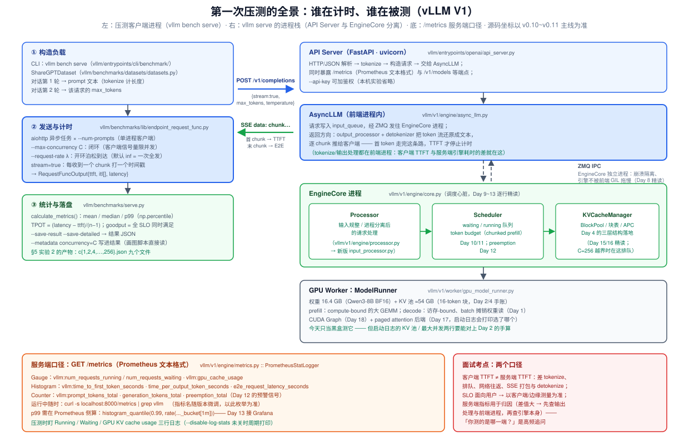
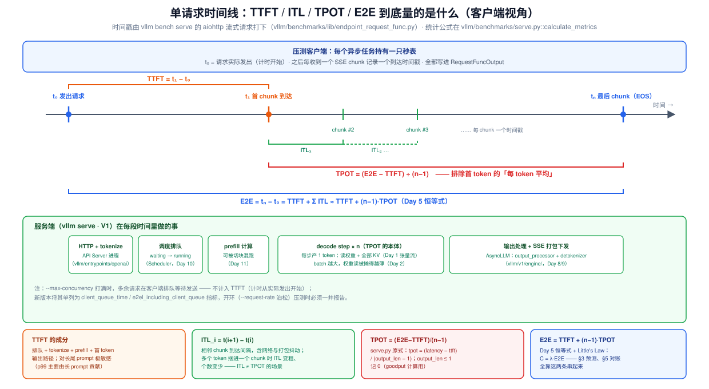
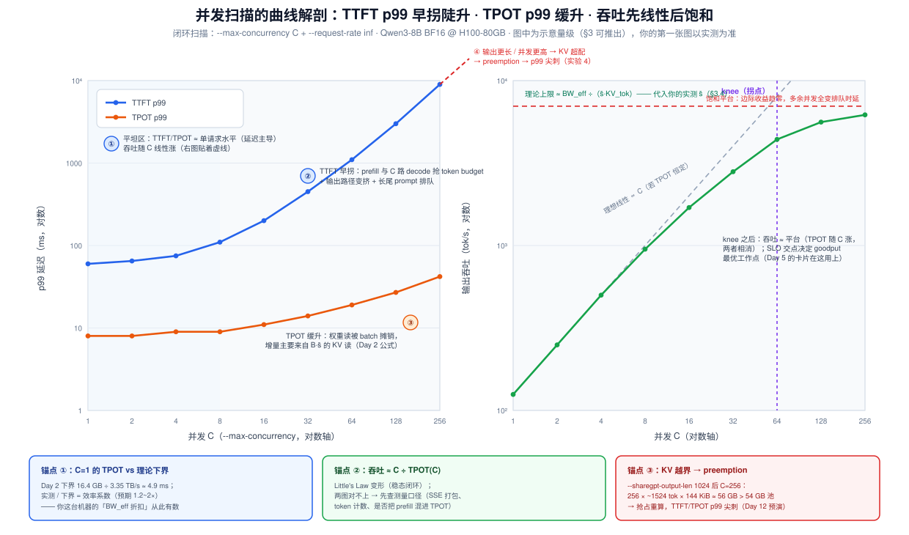

# Day 6 · 环境搭建与第一次压测：让 Day 1~5 的每个数字落地

> **系列**：推理系统优化专家岗 · 56 天打卡 | 第 1 周「推理基础与性能建模」
> **今日位置**：Day 1~4 攒了一堆"应该"——AI = 2M/P、KV 144 KiB/token、44 路并发、η > 96%、×4 吞吐；Day 5 给了"怎么量化"——TTFT/TPOT/ITL/E2E/throughput/goodput 的指标卡与两个恒等式。今天把两者全部落地：把 vLLM（最新版）真正跑起来，用 ShareGPT 负载做**第一次系统级压测**，扫出**属于你自己的第一张性能曲线**（并发 vs TTFT p99 / TPOT p99）。之后 50 天的所有源码阅读与优化实验，都以今天这张图和这份环境台账为基线
> **前置要求**：Day 2（显存四件套、44 路手算、TPOT 下界与锚点数字）、Day 5（指标定义卡：E2E = TTFT + (n−1)·TPOT；Little's Law：C = λ·E2E；goodput）；Day 4（V1 的 KV 管理坐标）可加深理解
> **预计用时**：3 ~ 3.5 小时（环境 0.5h + 启动与对账 0.5h + 并发扫描 1h + 画图与对账 1h）
> **背景衔接**：你在昇腾上做算子优化的习惯是"改一行代码之前先跑基线 benchmark，用 msprof 对账理论 bound"——今天把这个习惯升维到**系统级**：服务压测 = 推理系统的 baseline + roofline 对账。方法论完全同构：**先预测（§3），再测量（§5），最后对账差异来源（§5 实验 3 的对账三问）**。面试官问"你怎么评估一个推理系统"，答案就是今天这一整套
> **实验环境**：1 × H100/A100 80GB（建议租用）；只有 24 GB 消费卡（4090）见 §5 实验 0 的降级方案
> **配套材料**：`week1/README.md` Day 6 节；三张 SVG：`assets/day06_request_timeline.svg`、`assets/day06_bench_architecture.svg`、`assets/day06_concurrency_curves.svg`
> **版本口径**：本篇 CLI 参数与源码坐标按 **v0.10 ~ v0.11 主线**核对（2026-10）；vLLM 迭代快，参数默认值与模块路径随版本演进（如 V1 的 `processor.py` 在 main 上正被重构为 `input_processor.py`），**一切以你机器上 `vllm serve --help` 与 `vllm bench serve --help` 的输出为准**——对不上的地方先怀疑版本，再怀疑理解

---

## 0. 今日学习目标

完成今天的学习后，你应该能够：

- [ ] **独立部署**最新版 vLLM 并启动 Qwen3-8B 服务：装环境、下模型、下 ShareGPT 数据集、选对启动参数，并能解释每个参数为什么这么设
- [ ] 用**启动日志对账 Day 2 的手算**：`GPU KV cache size` ≈ 36.6 万 token、`Maximum concurrency` ≈ 44×——理论、源码、日志三边一致才算环境可信
- [ ] 讲清 **`vllm bench serve` 的完整链路**（CLI → 数据集采样 → aiohttp 流式发送 → `calculate_metrics`），并知道 TTFT/TPOT 是**客户端口径**、与服务端 `/metrics` 差在哪
- [ ] 区分**闭环（`--max-concurrency`）与开环（`--request-rate` 泊松）**两种压测范式各自能回答什么问题
- [ ] 在跑之前**预测**曲线形状与量级（§3 的三条公式），跑完后用三个锚点**对账**（效率系数、C ÷ TPOT ≈ 吞吐、KV 越界点）
- [ ] 交付：**第一张性能曲线**（并发 vs TTFT p99 / TPOT p99，外加吞吐子图）+ 环境台账 + 预测-实测对照表

---

## 1. 核心概念速览

| 概念 | 一句话定义 | 今日要达到的深度 |
|---|---|---|
| **`vllm serve`** | 启动 OpenAI 兼容 HTTP 服务的 CLI（FastAPI + V1 引擎） | 会选参数、会读启动日志 |
| **V1 进程栈** | API Server 进程（tokenize/输出处理）+ EngineCore 独立进程（调度/执行），ZMQ 相连 | 只到"谁在哪计时"的深度（Day 8 精读） |
| **`vllm bench serve`** | 官方在线服务压测 CLI（旧教程里的 `benchmarks/benchmark_serving.py` 已被整合取代） | 能说出内部三步：采样→发送→统计 |
| **ShareGPT 数据集** | 真实多轮对话；第 1 轮做 prompt、第 2 轮的 token 数做该请求的 max_tokens | 知道长度分布长尾、跨清洗版本差异大 |
| **闭环压测** | 客户端用 `--max-concurrency C` 维持恒定在途请求数 | 今天的主实验；知道它测"稳态服务质量" |
| **开环压测** | `--request-rate λ` 按泊松到达，服务器过载也不减速 | 知道容量上限/队列爆炸只有开环能暴露 |
| **p99 / p50** | 分位数延迟；p99 由长尾请求决定 | 会解释为什么报告必须带 p99 |
| **客户端口径 TTFT/TPOT** | 从"请求实际发出"到"首个/后续 chunk 到达"的客户端秒表 | 源码级：`(latency − ttft)/(n−1)` |
| **knee（拐点）** | 吞吐-并发曲线上边际收益崩塌的点 | 会和 SLO/goodput 连起来选工作点 |
| **`/metrics`** | 服务端 Prometheus 端口（直方图/Gauge/Counter） | 会 curl 枚举、知道与客户端口径的差异 |
| **preemption（预告）** | KV 池耗尽时逐出请求重算（Day 12 主角） | 今天在越界实验里"预演"一次 |

> **一句话本质**：压测不是"把工具跑起来"，而是**给系统建立一个可复现的、可对账的测量协议**——负载从哪来、并发怎么控、秒表在哪端按、分位数怎么报。协议错了，后面 50 天所有"优化了 X%"都是自欺。

---

## 2. 原理深入讲解

### 2.1 回顾 Day 1~5：从「手算」到「实测」缺的一环

把这一周的结论排成一列，看今天补什么：

| 来源 | 结论 | 今天的角色 |
|---|---|---|
| Day 1 | prefill 计算密集、decode 访存密集；decode 张量流 | 曲线形状的物理基础（§2.5） |
| Day 2 | KV/token = 144 KiB；并发上限 ≈ KV 池 ÷ (E[L]·KV_tok)；TPOT 下界 4.9 ms@C=1 | 启动日志与 C=1 实测的**对账锚点** |
| Day 3 | Roofline：AI 判 bound；ncu 看 SM/DRAM busy | "TPOT 为什么缓升"的解释（斜坡上的工作点右移） |
| Day 4 | PagedAttention：η > 96%、V1 的 BlockPool/块表坐标 | KV 池 54 GB / 36.6 万 token 的来源；越界实验的机制 |
| Day 5 | TTFT/TPOT/ITL/E2E/throughput/goodput；E2E = TTFT + (n−1)·TPOT；C = λ·E2E | **今天全部要实测的量**；§3 预测的全套记号 |

Day 4 结尾说"44.8 → 182 路的差距正是 PagedAttention 的 payoff"——这是**纸面推断**。今天要让它变成**测量事实**：真实负载（ShareGPT 长尾分布）+ 真实引擎（V1 默认配置）下，TTFT/TPOT 随并发到底怎么走、拐点在哪、离理论下界多远。

> **第一性原理**：性能测量本身就是建模问题——你只能测到"测量协议允许你看到的东西"。客户端秒表量到的是用户体感（含 tokenize/网络/流式打包），服务端直方图量到的是引擎内部（不含前端与网络）；把两者混着谈，是一切"我测的 TPOT 比你高一倍"式争吵的根源。

### 2.2 被测对象速览：`vllm serve` 背后的 V1 进程栈



对照上图（今天只到"**谁在计时、谁在被测**"的深度，Day 8 才逐模块精读）：

**① API Server 进程**（`vllm/entrypoints/openai/api_server.py`）：FastAPI + uvicorn。收到 `POST /v1/completions` 后做 HTTP/JSON 解析 → **tokenize** → 构造请求交给 `AsyncLLM`；同时暴露 `/metrics` 与 `/health`。

**② AsyncLLM**（`vllm/v1/engine/async_llm.py`，运行在前端进程）：请求写入 `input_queue` 经 **ZMQ** 发往 EngineCore；返回方向上 `output_processor` + `detokenizer` 把 token 流还原成文本、逐 chunk 推给客户端。**首 token 走完这条路，客户端的 TTFT 秒表才停**。

**③ EngineCore 独立进程**（`vllm/v1/engine/core.py`）：调度心脏——`Processor`（输入规整）→ `Scheduler`（waiting/running 队列 + token budget，Day 10/11）→ `KVCacheManager`（Day 4 的 BlockPool/块表，Day 15/16）。**为什么独立进程**：崩溃隔离（引擎炸了 API 进程还活着）+ 引擎循环不被前端 Python GIL 拖慢——细节 Day 8 展开，今天记住后果即可：**前端进程的 tokenize/输出处理是客户端 TTFT 的一部分，但不占引擎时间**。

**④ GPU Worker**（`vllm/v1/worker/gpu_model_runner.py`）：权重 16.4 GB + KV 池 ≈ 54 GB + CUDA Graph + paged attention 后端。今天当黑盒测——但启动日志的两行数字必须能对上 Day 2 的手算（§4.3）。

| 你在曲线里看到的量 | 物理来源（对应上图色块） |
|---|---|
| TTFT | 前端 tokenize + 引擎排队 + prefill 计算 + 首 token 输出路径 |
| TPOT | decode step（读权重 + 全部 KV）+ 输出处理/流式打包 |
| 吞吐饱和 | decode 访存上限（Day 2 的 BW 公式）与调度/输出路径的软上限 |

### 2.3 压测方法论：闭环 vs 开环，今天扫什么

**闭环（closed-loop）**：客户端维持恰好 C 个在途请求——`--request-rate inf`（默认，全部请求即刻发起）+ `--max-concurrency C`（客户端信号量，多的请求**在客户端排队、不计入 TTFT**，新版本单列为 `client_queue_time` 指标）。稳态下在途数恒为 C，服务**永远不会过载**。它回答的问题是：*"给定 C 个并发用户，服务质量（TTFT/TPOT 的分布）如何？"*——这正是 README 给今天的任务："观察 TTFT/TPOT 随并发的变化"。

**开环（open-loop）**：`--request-rate λ` 按泊松过程（`--burstiness` 调形状）合成到达时刻，**不管服务器跟不跟得上**。λ 超过服务能力时 waiting 队列无界增长、TTFT 发散——**容量上限与过载行为只有开环能暴露**（生产容量规划、goodput 曲线都用它）。

| | 闭环（今天主实验） | 开环（实验 4 尝鲜） |
|---|---|---|
| 控制量 | 在途并发 C | 到达率 λ（req/s） |
| 队列 | 客户端限流，服务端稳态 | 服务端 waiting 无界 |
| 擅长 | 稳态服务质量、batch 摊销效应 | 饱和点、过载崩溃模式、goodput |
| 副作用 | **永远看不出队列爆炸** | λ 设太高跑不完 |
| 面试一句话 | "闭环测服务，开环测容量" | |

**测量协议三件事**（比工具更重要）：

1. **预热**：首轮请求会撞上编译缓存冷启动、连接池建立等一次性成本。先跑一小批不落盘的 warmup；
2. **样本量**：p99 至少要有 ~100+ 个样本才有意义（200 个请求的 p99 ≈ 第 2 慢的那个，噪声大但可接受；正式报告建议 500+）；
3. **可复现**：固定 seed、把所有参数写进结果（`--metadata`），否则下周改了配置就没法对比。

### 2.4 指标是客户端口径：测量点与源码级定义



对照上图，`vllm bench serve` 的秒表全部按在**客户端**：

- **TTFT** = 首 chunk 到达时刻 − 请求实际发出时刻。成分：排队 + tokenize + prefill + 首 token 输出路径（含网络与 SSE 打包）；
- **ITL_i** = 相邻两个 chunk 的到达间隔。注意：若多个 token 被捆绑进同一个 chunk（部分后端/聚合行为），ITL 会变粗、个数变少——**ITL ≠ TPOT 的场景**；
- **TPOT** = (E2E − TTFT) / (n−1)，**排除首 token**的每 token 平均——这正是 `vllm/benchmarks/serve.py::calculate_metrics` 里的原式：

```python
# vllm/benchmarks/serve.py :: calculate_metrics()（节选，v0.10~v0.11 主线）
if output_len > 1:
    latency_minus_ttft = outputs[i].latency - outputs[i].ttft
    tpot = latency_minus_ttft / (output_len - 1)
    tpots.append(tpot)
# output_len ≤ 1 时 tpot 记 0（goodput 计算需要）
```

- **E2E** = 末 chunk − 发出时刻。Day 5 的恒等式在这里被源码强制成立：`E2E = TTFT + (n−1)·TPOT`；
- **goodput**：`--goodput ttft:500,tpot:20`（毫秒），一个请求**所有 SLO 同时满足**才计入（`is_good_req = all([s >= r for s, r in zip(slo_values, req_metric)])`）——与 Day 5 的定义一致，今天实验 4 实测它。

**客户端 vs 服务端口径**：`/metrics` 里 `vllm:time_to_first_token_seconds` 等直方图是引擎侧打点，**不含**前端 tokenize、网络往返、SSE 打包。两者差值大 → 先查前端输出路径。**SLO 面向用户，以客户端/边缘测量为准；服务端指标用于归因**——这是高频面试点（§6 Q5）。

### 2.5 曲线形状的先验推理：TTFT 为什么比 TPOT 先恶化

今天的实验结果出来之前，先用 Day 1/2 的物理推一遍形状（详细数值 §3）：

**TPOT(C) 缓升**——decode step 的访存账（Day 2）：

$$
\text{TPOT}(C) \;\gtrsim\; \frac{W_{\text{bytes}} + C \cdot \bar{s} \cdot \text{KV\_tok}}{\text{BW}_{\text{eff}}}
$$

权重项 $W$ = 16.4 GB **不随 C 变**——batch 越大，每个 token 分摊的权重读越薄（Day 1"并发几乎免费"）；增长只来自 $C\cdot\bar{s}$ 的 KV 读。$\bar{s}$（平均上下文）几百 token 时，C 从 1 加到 64，分子才从 16.5 GB 涨到 22 GB → TPOT 从 ~5 ms 涨到 ~6.6 ms（理论）。Roofline 语言：**工作点沿斜坡右移，还没到屋顶**（Day 3）。

**TTFT(C) 早拐陡升**——三个机制叠加：

1. **混跑**：新请求的 prefill 要与 C 路 decode 共享每个 step 的 token budget（chunked prefill，Day 11）。C 越大，每个 step 越慢（TPOT(C)↑），prefill 段等待越久；
2. **长尾 prompt**：TTFT p99 由最长的 prompt 主导——ShareGPT 的 p99 prompt 可能是平均值的 5~10 倍 FLOPs，这个长尾**不随 C 变**，但会被混跑放大；
3. **输出路径拥挤**：C 路 SSE 流的 detokenize/output_processor 都在前端进程，高并发时这里变挤——**客户端看得见、引擎指标看不见**，是口径差的主要来源。

> **预测**（§3 会给数字）：TPOT p99 在 C ≤ 32 基本平坦（≤ 2× 单请求值）；TTFT p99 从 C ≈ 16~32 就开始超线性。两条曲线的**分离点**就是"混跑与排队开始主导"的信号。

---

## 3. 跑之前的预测：性能模型与数量级（§5 对账用）

> **规矩**：先填完本节的表，再去跑 §5。实验后把实测填到旁边——**没有预测的测量只是观光**（你在昇腾上做 kernel 优化前先算理论 cycles，是同一个习惯）。

### 3.1 固定账本：部署参数与 Day 2 公式

| 项 | 值 | 来源 |
|---|---|---|
| 模型 | Qwen3-8B BF16（8.2B 参数） | Day 1/2 |
| 权重 $W$ | 16.4 GB | 8.2B × 2 B |
| KV/token | 144 KiB（2×36 层×8 KV 头×128×BF16） | Day 2 |
| GPU | H100 SXM 80GB：3.35 TB/s、989 TFLOPS | Day 2 锚点 |
| 显存预算 | 72 GB（80 × `--gpu-memory-utilization 0.9`） | Day 2 |
| KV 池 | ≈ 54.1 GB ≈ **36.6 万 token** | 72 − 16.4 − 1.5(激活) |
| @8192 满长并发 | ≈ 44 路（启动日志会打印） | Day 2 题 3 |
| max_num_seqs | V1 默认 1024 ≫ 256，今天不构成约束 | Day 4 |

**数据集统计待定**：ShareGPT 的 prompt/output 都是长尾分布，且跨清洗版本差异大——**先跑 C=1 探针（§5 实验 2 第一步）拿实测均值**：$\bar{P}$（平均 prompt 长度）、$\bar{O}$（平均输出长度），然后 $\bar{s} \approx \bar{P} + \bar{O}/2$。下文用示例值 $\bar{P}=500$、$\bar{O}=200$、$\bar{s}=600$ 演算，**请代入你的实测值**。

### 3.2 TPOT(C)：缓升的公式

$$
\text{TPOT}_{\text{floor}}(C) = \frac{16.4\,\text{GB} + C \times 600 \times 144\,\text{KiB}}{3.35\,\text{TB/s}}
$$

| C | 访存账（GB） | 理论下界 (ms) | 预测实测 ×(1.2~2) (ms) |
|---|---|---|---|
| 1 | 16.4 + 0.09 | **4.93** | 5.9 ~ 9.9 |
| 8 | 16.4 + 0.71 | 5.12 | 6.1 ~ 10.2 |
| 16 | 16.4 + 1.41 | 5.31 | 6.4 ~ 10.6 |
| 32 | 16.4 + 2.83 | 5.74 | 6.9 ~ 11.5 |
| 64 | 16.4 + 5.66 | 6.58 | 7.9 ~ 13.2 |
| 128 | 16.4 + 11.3 | 8.27 | 9.9 ~ 16.5 |
| 256 | 16.4 + 22.6 | 11.65 | 14.0 ~ 23.3 |

> **对账锚点 ①**：C=1 的实测 TPOT ÷ 4.93 ms = 你这台机器的 **BW_eff 折扣系数**（Day 2 说过实测通常是下界的 1.2~2 倍）。这个系数今天测出来，之后所有手算都能带上它——这就是"基线"的真正含义。

**饱和吞吐**（C 大到 KV 读主导、TPOT ∝ C 时）：

$$
\text{Throughput}_{\max} \rightarrow \frac{\text{BW}_{\text{eff}}}{\bar{s} \cdot \text{KV\_tok}} = \frac{3.35\,\text{TB/s}}{600 \times 147456\,\text{B}} \approx 3.8 \times 10^4\ \text{tok/s（理论）}
$$

实测会打 3~5 折（注意力二次项、调度与输出路径开销、带宽打不满）→ **预期平台 ~1~2 万 tok/s**。

### 3.3 TTFT(C)：成分模型

$$
\text{TTFT}_{p99}(C) \approx \underbrace{t_{\text{tok}}}_{\text{毫秒级}} + \underbrace{k(C)\cdot \text{TPOT}(C)}_{\text{混跑/排队步数} \times \text{步长}} + \underbrace{\frac{2 N P_{p99} + P_{p99}^2 \cdot \text{attn}}{\text{MFU} \cdot F_{\text{peak}}}}_{\text{prefill 计算}} + \underbrace{t_{\text{out}}}_{\text{首 token 输出路径}}
$$

C=1 数值例（假设 $P_{p99} \approx 3000$）：prefill FLOPs ≈ 2×8.2e9×3000 ≈ 49 TFLOP，按 MFU 40% → 989×0.4 = 396 TF/s → **≈ 125 ms**；加 tokenize/输出路径 → **TTFT p99 ≈ 150~300 ms @ C=1**（均值则由 $\bar{P}=500$ 主导，约 30~60 ms）。

C 增大时：分子第二项 $k(C)$·TPOT(C) 抬升（混跑步数 × 更慢的步），且输出路径 $t_{out}(C)$ 拥挤——**本项模型精度有限，重点是把"主导项"说清**：C 小时 prefill 计算主导，C 大时排队与输出路径主导。精确形状交给实验，这正是今天要动手的原因。

### 3.4 吞吐与 E2E：Little's Law 收口

稳态闭环下（Day 5）：$C = \lambda \cdot \text{E2E}$，且 $\lambda_{\text{req}} = C/\text{E2E}$、$\lambda_{\text{tok}} \approx C / \text{TPOT}$。

C=64 数值例：TPOT ≈ 9 ms → E2E ≈ TTFT(0.2 s) + 199×9 ms ≈ 2.0 s → req/s ≈ 32、output tok/s ≈ 64/0.009 ≈ **7.1K**（与 §3.2 的 7.9~13.2 ms 预测自洽）。

> **对账锚点 ②**：任意档位检查 `output_throughput × mean_TPOT ≈ C`（±15% 内算对账成功）。对不上 → 先查测量口径（SSE 打包、token 计数方式），再查引擎。

### 3.5 KV 越界点：preemption 什么时候登场

KV 池 54.1 GB 能装 $\approx 54.1\text{GB} / (\bar{L} \times 144\text{KiB})$ 路。默认负载（$\bar{L} \approx 700$）下 ≈ **524 路** → 今天扫到 256 都不会撞墙。但把输出拉长（实验 4b：`--sharegpt-output-len 1024` → $\bar{L} \approx 1524$）后容量降到 ≈ **241 路 < 256** → KV 超配 → 调度器**抢占**（逐出请求、释放块、回 waiting 重算，Day 12）→ TTFT/TPOT p99 出现尖刺。这是**有意设计的越界实验**：用今天的工具亲手触发一次 Day 4 §2.5 讲的机制。

---

## 4. 工具与源码调用链

### 4.1 `vllm bench serve`：从 CLI 到 aiohttp

```text
vllm bench serve（终端 CLI）
 └─ vllm/entrypoints/cli/benchmark/serve.py          # 子命令注册、参数解析
     └─ vllm/benchmarks/serve.py :: main/benchmark() # 主体：采样 → 发送 → 统计
         ├─ vllm/benchmarks/datasets/datasets.py
         │    ShareGPTDataset.sample()
         │      conversations[0] → prompt（tokenize 计 prompt_len）
         │      conversations[1] 的 token 数 → expected_output_len（= max_tokens）
         │      → list[SampleRequest]
         ├─ vllm/benchmarks/lib/endpoint_request_func.py
         │    aiohttp 异步任务：POST {base_url}/v1/completions（stream=true）
         │    每 chunk 打时间戳 → RequestFuncOutput{ttft, itl[], latency}
         └─ calculate_metrics() → BenchmarkMetrics → 控制台报告 + 结果 JSON
```

**ShareGPTDataset 的采样逻辑**（`vllm/benchmarks/datasets/datasets.py`，节选）：

```python
prompt, completion = (
    entry["conversations"][0]["value"],   # 第 1 轮（human）→ prompt
    entry["conversations"][1]["value"],   # 第 2 轮（assistant）→ 期望输出
)
prompt_len = len(tokenizer(prompt).input_ids)
new_output_len = len(tokenizer(completion).input_ids) if output_len is None else output_len
```

即：**输出长度是数据集自带的**（真实对话的下一轮），长尾且不可控——这正是我们要的真实负载；想固定输出长度用 `--sharegpt-output-len` 覆盖。

> **历史注**：老教程/老博客里常见的 `python benchmarks/benchmark_serving.py` 已被整合为 CLI 子命令（实现搬进 `vllm/benchmarks/` 包）；根目录同名脚本在仓库里仍可见但已非推荐入口。**认准 `vllm bench serve`**——README 的 Day 6 用的也是它。

**今天用到的关键参数**（默认值以 `--help` 为准）：

| 参数 | 作用 | 今天取值 |
|---|---|---|
| `--backend` / `--endpoint` | 请求协议（默认 `openai` + `/v1/completions`） | 默认 |
| `--dataset-name sharegpt` + `--dataset-path` | 数据集 | ShareGPT JSON 路径 |
| `--num-prompts` | 请求数（默认 1000） | 200（p99 样本量够用、总时长可控） |
| `--max-concurrency C` | 闭环并发上限 | 1→256 九档 |
| `--request-rate` | 到达率（默认 `inf` 一次全发） | 默认（闭环）；实验 4 用有限值 |
| `--percentile-metrics` / `--metric-percentiles` | 报哪些指标 / 哪些分位 | `ttft,tpot,itl` / `50,99` |
| `--temperature` | 采样温度 | 0（确定性、可复现） |
| `--save-result --save-detailed` | 落盘 JSON（含每请求 ttfts/itls） | 开 |
| `--result-dir/--result-filename` | 落盘位置 | `results/day06/c{C}.json` |
| `--metadata k=v` | 写进结果 JSON 顶层（画图脚本直接读） | `concurrency=$C` |
| `--goodput ttft:ms,tpot:ms` | SLO → goodput | 实验 4 |

### 4.2 `calculate_metrics`：p99 / TPOT / goodput 的计算源码

```python
# vllm/benchmarks/serve.py（节选，v0.10~v0.11 主线；行号为主线参考）
# ① TPOT：排除首 token 的每 token 平均（L624-628）
if output_len > 1:
    tpot = (outputs[i].latency - outputs[i].ttft) / (output_len - 1)
# ② goodput：所有 SLO 同时满足才算 good（L659-662）
for req_metric in zip(*valid_metrics):
    is_good_req = all([s >= r for s, r in zip(slo_values, req_metric)])
    if is_good_req:
        good_completed += 1
# ③ 分位数：np.percentile 后平铺进结果 JSON（L1402）
result[f"p{p_word}_{metric_attribute_name}_ms"] = value   # 如 p99_ttft_ms
```

结果 JSON（`--save-result`）顶层即含 `p50/p99_ttft_ms`、`p50/p99_tpot_ms`、`mean/median_*`、`request_throughput`、`output_throughput`、`total_token_throughput`、`duration`、`completed`，加上 `--metadata` 注入的键与 `max_concurrency`——画图脚本不需要解析文件名。

### 4.3 `vllm serve` 侧：启动日志的对账坐标

启动命令（§5 实验 1）后，日志里**必须对上账的三行**（措辞随版本微调）：

| 启动日志行 | 手算值 | 对不上怎么办 |
|---|---|---|
| `GPU KV cache size: 366,xxx tokens` | 54.1 GB ÷ 144 KiB ≈ 36.6 万 | 检查 `--gpu-memory-utilization`、权重 dtype、其他显存占用（Day 2 §2.3 的四件套） |
| `Maximum concurrency for 8,192 tokens per sequence: 44.x` | 36.6 万 ÷ 8192 ≈ 44.8 | 同上；注意这是**满长口径**，真实负载平均 2000 token 时实际可容纳 ~182 路（Day 4 §3.2） |
| attention backend / CUDA graph capture 行 | —（版本相关） | 记进台账即可；`-O0` 或 `--enforce-eager` 可跳过编译换启动速度，但**会伤 TPOT**（Day 18） |

运行期间（默认 log stats 开启，`--disable-log-stats` 可关）：周期打印 `Running: x reqs, Waiting: y reqs, GPU KV cache usage: z%` 一类的引擎统计行——**压测时盯着这三项**，它们就是曲线背后引擎视角的解释（实验 4 的 KV 越界就靠它发现）。

### 4.4 `/metrics`：服务端口径

```bash
curl -s http://localhost:8000/metrics | grep '^vllm:' | head -30   # 先枚举你版本的指标名
```

| 类型 | 指标（名字随版本微调） | 用途 |
|---|---|---|
| Gauge | `vllm:num_requests_running` / `vllm:num_requests_waiting` | 闭环扫描时应看到 Running ≈ C、Waiting ≈ 0 |
| Gauge | `vllm:gpu_cache_usage` | KV 池占用率；越界实验里冲到 ~100% |
| Histogram | `vllm:time_to_first_token_seconds`、`vllm:time_per_output_token_seconds` | **服务端** TTFT/TPOT（对比客户端口径） |
| Counter | `vllm:prompt_tokens_total`、`vllm:generation_tokens_total` | 与结果 JSON 的 total_input/total_output 互验 |
| Counter | `vllm:preemption_total` | Day 12 的预警信号（实验 4 观察） |

PromQL 算服务端 p99（Grafana 看板的核心一行，Day 13 接完整监控）：

```promql
histogram_quantile(0.99, rate(vllm:time_to_first_token_seconds_bucket[1m]))
```

---

## 5. 动手实验

### 实验 0：环境搭建与台账（0.5h）

```bash
# 硬件：1×H100/A100 80GB（建议）；Python 3.10~3.12；驱动满足 CUDA 12.x
python3 -m venv ~/venvs/vllm && source ~/venvs/vllm/bin/activate
pip install --upgrade vllm
vllm --version                                             # 台账第 1 行
python -c "import torch; print(torch.cuda.get_device_name(0), torch.version.cuda)"

# 数据集（~200 MB 量级；国内网络可先 export HF_ENDPOINT=https://hf-mirror.com）
mkdir -p ~/bench && cd ~/bench
wget https://huggingface.co/datasets/anon8231489123/ShareGPT_Vicuna_unfiltered/resolve/main/ShareGPT_V3_Vicuna_unfiltered_cleaned_split.json
```

模型首次启动时自动从 HF 下载 `Qwen/Qwen3-8B`（BF16 权重 ≈ 16.4 GB）；国内可 `export VLLM_USE_MODELSCOPE=1` 走 ModelScope。

> **降级方案（24 GB 消费卡）**：Qwen3-8B BF16 塞不下健康余量——换官方 `Qwen/Qwen3-8B-FP8`（权重 ≈ 8.6 GB，KV 池能到 ~10 GB）或 `Qwen/Qwen3-4B`，并加 `--max-model-len 4096`。注意 FP8 权重会把 §3 的账本分母砍半（16.4→8.6 GB），预测表要相应重算——**账本跟着部署走，这正是练习**。

**环境台账**（今天产出物之一，从此每个实验都记）：vLLM 版本 / torch 与 CUDA / GPU 型号与驱动 / 模型与 dtype / 启动参数全文 / 数据集文件与大小 / 日期。

### 实验 1：启动服务，对账启动日志（0.5h）

```bash
vllm serve Qwen/Qwen3-8B \
  --max-model-len 8192 \
  --gpu-memory-utilization 0.9 \
  --seed 0 \
  2>&1 | tee server.log
```

参数解释（台账里各写一句"为什么"）：`--max-model-len 8192` 对齐 Day 2 题 3 的手算口径；`--gpu-memory-utilization 0.9`（新版本默认已提到 0.92，显式写出避免歧义）；prefix caching / chunked prefill 用 V1 默认（APC 默认开，其影响见"坑 1"）。

等待就绪（首次含权重下载 + CUDA graph capture，几十秒到几分钟）：

```bash
curl -s http://localhost:8000/v1/models | head -4      # 就绪探测
```

**肉眼预览一次流式输出**（对 Day 1 的"decode 每 step 吐一个 token"建立体感）：

```bash
curl -sN http://localhost:8000/v1/completions \
  -H 'Content-Type: application/json' \
  -d '{"model":"Qwen/Qwen3-8B","prompt":"San Francisco is a","max_tokens":48,"stream":true}' \
  | while read -r line; do echo "$(date +%S.%N) ${line:0:50}"; done
```

相邻 chunk 的时间差 ≈ 单请求 TPOT（毫秒级、均匀节奏）；随后对照 §4.3 的三行启动日志完成对账。**对不上账不要进入实验 2**——基线错了后面全错。

### 实验 2：并发扫描（主体，1h）

**第一步：C=1 探针**——先拿数据集真实统计，回填 §3 的 $\bar{P}, \bar{O}$：

```bash
mkdir -p results/day06
vllm bench serve \
  --model Qwen/Qwen3-8B --tokenizer Qwen/Qwen3-8B \
  --base-url http://localhost:8000 \
  --dataset-name sharegpt \
  --dataset-path ~/bench/ShareGPT_V3_Vicuna_unfiltered_cleaned_split.json \
  --num-prompts 100 --max-concurrency 1 --seed 999 --temperature 0 \
  --percentile-metrics ttft,tpot,itl --metric-percentiles 50,99 \
  --save-result --result-dir results/day06 --result-filename c1_probe.json \
  --metadata concurrency=1
```

从 `c1_probe.json` 读 `total_input / completed` = $\bar{P}$、`total_output / completed` = $\bar{O}$，代回 §3.2/3.3 重算预测表（也可加 `--plot-dataset-stats` 让工具直接画长度分布图）。探针 seed 用 999、与后面九档（seed = C）错开——**同一批 prompt 刚跑完就在 KV 缓存里，重放会命中 prefix caching**（详见下方"常见坑"第 1 条）。

**第二步：预热 + 九档扫描**：

```bash
# 预热（不落盘）：编译缓存/连接池/首个 CUDA graph 路径全部热起来
vllm bench serve --model Qwen/Qwen3-8B --base-url http://localhost:8000 \
  --dataset-name sharegpt --dataset-path ~/bench/ShareGPT_V3_Vicuna_unfiltered_cleaned_split.json \
  --num-prompts 16 --max-concurrency 4 --seed 0 --temperature 0

# 正式扫描：每档独立 seed（坑 1：防 prefix caching 命中同一批 prompt）
for C in 1 2 4 8 16 32 64 128 256; do
  vllm bench serve \
    --model Qwen/Qwen3-8B --tokenizer Qwen/Qwen3-8B \
    --base-url http://localhost:8000 \
    --dataset-name sharegpt \
    --dataset-path ~/bench/ShareGPT_V3_Vicuna_unfiltered_cleaned_split.json \
    --num-prompts 200 --max-concurrency $C --seed $C --temperature 0 \
    --percentile-metrics ttft,tpot,itl --metric-percentiles 50,99 \
    --save-result --save-detailed \
    --result-dir results/day06 --result-filename c${C}.json \
    --metadata concurrency=$C 2>&1 | tee results/day06/c${C}.log
done
```

时长预估：C=1 一档 ≈ 200 × E2E ≈ 5~8 分钟（嫌慢可减到 100）；大 C 档位几分钟内完成；全程约 30~50 分钟。**扫描时开另一个终端盯服务端日志的 `Running / Waiting / GPU KV cache usage`**。

控制台报告示例（**数值为量级示意，格式随版本微调**；真实数字以你的运行为准）：

```text
================ Serving Benchmark Result ================
Successful requests:                     200
Failed requests:                         0
Maximum request concurrency:             64
Benchmark duration (s):                  6.28
Total input tokens:                      103417
Total generated tokens:                  41722
Request throughput (req/s):              31.85
Output token throughput (tok/s):         6643.7
Peak output token throughput (tok/s):    7012.3
Peak concurrent requests:                64
Total token throughput (tok/s):          23068.6
---------------Time to First Token---------------
Mean TTFT (ms):                          318.42
Median TTFT (ms):                        187.19
P50 TTFT (ms):                           187.19
P99 TTFT (ms):                           1352.90
----------Time per Output Token (excl. 1st token)----------
Mean TPOT (ms):                          9.21
Median TPOT (ms):                        8.84
P99 TPOT (ms):                           15.06
...
```

读数要点：`Mean` vs `P99` 的差距就是**长尾**（TTFT 尤其悬殊）；`Output token throughput` 与 `Mean TPOT` 相乘应 ≈ C（锚点 ②）。

### 实验 3：画第一张性能曲线（0.5h）

```python
# day06_plot.py —— 汇总 results/day06/c*.json，画出第一张性能曲线
# 用法：python day06_plot.py results/day06
import glob, json, sys

import matplotlib.pyplot as plt

d = sys.argv[1] if len(sys.argv) > 1 else "results/day06"
pts = []
for f in glob.glob(f"{d}/c*.json"):
    r = json.load(open(f))
    c = int(r.get("concurrency") or r.get("max_concurrency"))   # --metadata 注入
    pts.append((c, r["p99_ttft_ms"], r["p99_tpot_ms"], r["output_throughput"]))
pts.sort()

C    = [p[0] for p in pts]
ttft = [p[1] for p in pts]
tpot = [p[2] for p in pts]
thr  = [p[3] for p in pts]

fig, (ax1, ax2) = plt.subplots(1, 2, figsize=(12, 4.5))
ax1.loglog(C, ttft, "o-",  color="tab:blue",   label="TTFT p99")
ax1.loglog(C, tpot, "s-", color="tab:orange", label="TPOT p99")
ax1.set_xlabel("concurrency (--max-concurrency)")
ax1.set_ylabel("ms")
ax1.set_title("Day 06 · latency vs concurrency")
ax1.grid(True, which="both", alpha=0.3)
ax1.legend()

ax2.loglog(C, thr, "^-", color="tab:green", label="output throughput")
ax2.set_xlabel("concurrency")
ax2.set_ylabel("tok/s")
ax2.set_title("Day 06 · throughput vs concurrency")
ax2.grid(True, which="both", alpha=0.3)
ax2.legend()

fig.suptitle("Qwen3-8B BF16 · ShareGPT · vllm bench serve (closed-loop)")
fig.tight_layout()
fig.savefig("day06_curves.png", dpi=150)
print("saved day06_curves.png")
```



对照上图检查你的曲线是否具备三个特征（不具备也要能解释为什么）：

1. **TPOT p99 缓升**：C 从 1 到 256 通常只涨 2~5 倍——权重读被摊销（§3.2）；
2. **TTFT p99 早拐陡升**：在 TPOT 还平坦的区间就开始超线性——混跑 + 排队 + 长尾 prompt（§3.3）；
3. **吞吐先线性后饱和**：低 C 时 ≈ ∝ C，高 C 时逼近平台——平台值对照 §3.2 的理论上限打几折。

**对账三问**（把实验与手算钉在一起，写进产出物）：

1. C=1 的 mean TPOT ÷ 4.93 ms = 效率系数，落在 1.2~2× 吗？不在 → 查 dtype、是否 eager 模式、GPU 是否降频；
2. 每档 `output_throughput × mean_TPOT ≈ C` 吗（±15%）？对不上 → 查 SSE 打包与 token 计数口径；
3. 扫描期间 `Waiting` 恒为 0、`GPU KV cache usage` 峰值离 100% 还有多远？——这决定了你的**容量余量**，也是实验 4b 的伏笔。

### 实验 4（进阶，可选）：goodput、KV 越界与 preemption 预演

**(a) 开环 + goodput**（Day 5 的卡片实战）：

```bash
vllm bench serve --model Qwen/Qwen3-8B --base-url http://localhost:8000 \
  --dataset-name sharegpt --dataset-path ~/bench/ShareGPT_V3_Vicuna_unfiltered_cleaned_split.json \
  --num-prompts 500 --request-rate 16 --burstiness 1 --temperature 0 \
  --goodput ttft:500,tpot:20 \
  --percentile-metrics ttft,tpot,itl --metric-percentiles 50,99 \
  --save-result --result-dir results/day06 --result-filename open16.json --metadata rate=16
```

把 `--request-rate` 从 4 逐步翻倍：某档开始 TTFT p99 爆炸、`Request goodput` 与 throughput 分道扬镳——**那个分岔点就是 SLO 意义下的容量**。对比闭环图：同样的服务器，开环下"能扛多少"一目了然。

**(b) KV 越界 → preemption**（Day 12 预演，§3.5 的手算验证）：

```bash
vllm bench serve --model Qwen/Qwen3-8B --base-url http://localhost:8000 \
  --dataset-name sharegpt --dataset-path ~/bench/ShareGPT_V3_Vicuna_unfiltered_cleaned_split.json \
  --num-prompts 300 --max-concurrency 256 --sharegpt-output-len 1024 --seed 99 --temperature 0 \
  --percentile-metrics ttft,tpot,itl --metric-percentiles 50,99 \
  --save-result --result-dir results/day06 --result-filename overflow.json --metadata overflow=1
```

观察三件事：服务端日志 `GPU KV cache usage` 逼近 100%、出现被逐出/重算的请求（措辞随版本）、`overflow.json` 的 p99 对 `c256.json` 出现**尖刺**。对照 Day 4：η > 96% 的分页池也躲不过**硬容量**——$256 \times 1524 \times 144\text{KiB} \approx 56\,\text{GB} > 54\,\text{GB}$。

**(c) 两端口径对比**：压测进行时另开终端 `curl -s localhost:8000/metrics | grep -E 'num_requests|time_to_first'`，把服务端 p99（`histogram_quantile`）与客户端 p99 并排记一列——差值就是 tokenize/网络/输出路径的成本。

### 常见坑（方法论清单，面试可直接引用）

| # | 坑 | 后果 | 解法 |
|---|---|---|---|
| 1 | **同 seed 重放**：V1 默认开 prefix caching，同一批 prompt 第二次跑命中缓存 | TTFT 虚低、曲线失真 | 每档换 `--seed`；或档间重启服务；或对照 `--no-enable-prefix-caching`（改变被测配置，只用于验证） |
| 2 | 只报平均值 | 长尾被抹平（TTFT 的 mean 与 p99 差 3~10 倍） | 必报 p50/p99；`--metric-percentiles 50,99` |
| 3 | 不预热 | 首轮慢（编译/缓存冷启动）混进统计 | 先跑一小批不落盘的 warmup |
| 4 | 闭环/开环结论混用 | 用闭环数据做容量规划（永远"稳定"） | 容量结论必须开环 + goodput（实验 4a） |
| 5 | 客户端单进程瓶颈 | 高吞吐档位实际在测压测机自己 | 盯客户端 CPU；正式测量压测机与服务器分机部署 |
| 6 | 版本漂移 | 参数名/默认值/指标名对不上 | 以 `--help` 与 `curl /metrics` 实测为准；台账记录版本 |

---

## 6. 面试高频问题（含答题骨架）

**Q1：你怎么对一个 LLM serving 系统做性能评估？**（必考，考方法论完整性）

> 骨架：① 定目标：评**服务质量**（闭环，扫并发看 TTFT/TPOT 分布）还是**容量**（开环泊松，找 SLO 分岔点）；② 定负载：真实 trace（ShareGPT）或合成（random，长度可控），先量出长度分布；③ 定口径：客户端秒表（用户体感，SLO 口径）与服务端 `/metrics`（归因口径）分开报告；④ 协议：预热、足够样本（p99 需 100+）、固定 seed、全参数进台账；⑤ 报告：p50/p99 而非均值，吞吐与时延成对出现（goodput 收口）；⑥ 对账：与第一性原理下界比（权重字节 ÷ BW），得到效率系数。**收尾**：vLLM 上工具就是 `vllm bench serve`，能说出闭环 `--max-concurrency` 与开环 `--request-rate` 的区别是及格线。

**Q2：TTFT 和 TPOT 随并发增长的曲线形状分别是什么样？为什么 TTFT 先恶化？**

> 骨架：① TPOT 缓升：decode 访存 bound，每 step 读 $W + C\bar{s}\text{KV\_tok}$ 字节，权重项被 batch 摊销，增长只来自 KV 读 → 近似平坦后再线性；② TTFT 早拐陡升：成分是排队 + prefill + 输出路径，三个都随 C 恶化——新请求 prefill 与 C 路 decode 抢 token budget（chunked prefill 混跑）、每步变慢、前端输出路径拥挤，且 p99 由长尾 prompt 主导；③ 联系 chunked prefill：它把"prefill 到来时 decode 卡顿"换成"prefill 被拉长"——TTFT 换 TPOT 平滑（Day 11 展开）。**收尾**：所以诊断树里"TTFT 升 / ITL 稳 → prefill 拥塞"（Day 51）。

**Q3：为什么报告 p99 而不是平均值？**

> 骨架：① 指标分布重尾：TTFT 由 prompt 长度（对数正态）决定，mean 与 p99 差 3~10 倍；② 用户体感由尾部决定（100 个用户里最慢的 1 个也是用户）——SLO 用 p99 定义；③ 均值还会被并发的 batch 效应掩盖：吞吐涨时均值可能不变而尾部爆炸；④ 工程上 p99 对异常（抢占、GC、调度毛刺）敏感——它既是用户指标又是**故障信号**。**坑点**：样本不足时 p99 噪声大（200 个样本的 p99 = 第 2 慢），要说明样本量。

**Q4：闭环和开环压测的区别？各自适合回答什么问题？**

> 骨架：① 闭环：客户端恒定 C 个在途，系统永不过载 → 测稳态服务质量、batch 摊销、单并发时延；② 开环：到达率 λ 外生（泊松），λ 超容量 → 队列无界 → TTFT 发散 → 测容量上限、过载行为、goodput；③ 本质：闭环的反馈让系统"自适应降速"，掩盖排队；④ 生产对齐：真实用户行为介于两者之间，容量规划必须开环。**收尾**：vLLM 的对应参数 `--max-concurrency` vs `--request-rate`（+ `--burstiness`）。

**Q5：你测的 TPOT 是服务端还是客户端口径？差在哪？哪个算数？**

> 骨架：① 客户端：请求发出 → chunk 到达（含 tokenize、网络、SSE 打包、detokenize、前端进程排队）；服务端 `/metrics`：引擎内部打点；② 差值来源清单：API 进程 tokenize/输出处理、uvicorn 事件循环、网络 RTT、流式聚合；③ SLO 面向用户 → **客户端/边缘口径为准**；服务端口径用于**归因**（差值大 → 查前端而非引擎）；④ vLLM 里 `vllm bench serve` 是客户端口径，`vllm:time_per_output_token_seconds` 直方图是服务端口径。**坑点**：两者混报是常见事故。

**Q6：给你一张"并发 vs TTFT p99 / 吞吐"曲线，怎么用它做部署决策？**

> 骨架：① 找 knee：吞吐边际收益 < 时延代价的拐点；② 叠 SLO：给定 TTFT p99 ≤ X ms 画横线，与曲线的交点给出**允许的最大并发/吞吐 = goodput**；③ 反推容量：Little's Law $C = \lambda \cdot \text{E2E}$ → 单副本 goodput λ → 峰值 QPS ÷ λ = 副本数（+冗余）；④ 别忘了 KV 余量（`gpu_cache_usage` 峰值）——曲线平坦但 KV 贴 100% 意味着长请求一来就抢占。**收尾**：Day 5 的 goodput 思维在图上的落地。

**Q7（差异化题）：你在 NPU 上做过 kernel 级 benchmark，和服务级压测的方法论有什么异同？**

> 骨架：① 同：先建理论模型（cycles/访存量 vs 时延下界/显存账）→ 预测 → 测量 → 对账得效率系数；控制变量；报告分布/最坏情况；② 异：kernel 级用 profiler 归因到指令/访存（msprof/ncu），系统级归因到**组件与路径**（前端/调度/引擎/网络）——测量点从"寄存器时钟"变成"两端秒表"；系统级多了协议问题（开环/闭环、预热、样本量、seed）；③ 迁移：昇腾上"改 tiling 前先跑基线并算理论上限"的习惯，等价于今天的"改配置前先有曲线和效率系数"。**这是把 NPU 经验讲成推理系统经验的桥梁题。**

---

## 7. 今日总结

1. **测量协议优先于工具**：闭环（`--max-concurrency`）测稳态服务质量、开环（`--request-rate`）测容量与过载；预热、样本量、seed、台账、p99——五件事没做，数据就是废的。
2. **口径要分两端**：客户端秒表（`vllm bench serve`：TTFT = 首 chunk、TPOT = (E2E−TTFT)/(n−1)）是 SLO 口径；服务端 `/metrics`（`vllm/v1/engine/metrics.py`）是归因口径；差值 = tokenize/网络/输出路径。
3. **被测对象的形状**：`vllm serve` = API Server 进程（tokenize/输出处理）+ ZMQ + EngineCore 独立进程（Processor → Scheduler → KVCacheManager）+ GPU Worker——今天当黑盒，但启动日志的 KV 池 36.6 万 token / 44× 并发两行已与 Day 2 手算对上。
4. **曲线的物理**：TPOT(C) ≈ (W + C·s̄·KV_tok)/BW → 缓升（权重摊销，Roofline 斜坡）；TTFT(C) = 排队 + 混跑 prefill + 输出路径 → 早拐陡升；吞吐 → BW_eff/(s̄·KV_tok) 的平台；knee 之上全是排队。
5. **对账三锚点**：C=1 TPOT ÷ 4.93 ms = 效率系数（典型 1.2~2×）；任意档 throughput × TPOT ≈ C；KV 用量峰值 = 容量余量。**没预测的测量是观光，没对账的优化是玄学。**
6. **越界预演**：`--sharegpt-output-len 1024` + C=256 → 56 GB > 54 GB 池 → preemption → p99 尖刺——Day 12 的主角今天已经见过一面。

---

## 8. 今日自测题（先自己做，再展开答案）

**Q1**：你的 C=1 实测 mean TPOT 是 7.4 ms。这台 H100 的 BW_eff 折扣是多少？用一个数概括，并说明它后续怎么用。

<details><summary>参考答案</summary>

7.4 / 4.93 ≈ **1.5×**（理论下界 = 权重 16.4 GB ÷ 3.35 TB/s）。含义：实际有效带宽约为标称的 2/3（注意力二次读、未完美合并的访存、kernel/调度开销、激活写回都在扣）。用法：之后所有"这台机器"的手算都把下界 × 1.5 当**工程下界**——例如预测 C=64 的 TPOT：下界 6.58 ms × 1.5 ≈ 9.9 ms。注意这个系数只在"同机器、同 dtype、同 batch 量级"下可迁移。
</details>

**Q2**：为什么闭环压测下 TTFT 会上升，但永远不会"爆炸"？什么实验才能看到爆炸？

<details><summary>参考答案</summary>

闭环客户端用信号量限制在途数 C：一个请求完成、下一个才发出，服务端的到达率被完成率自适应钳制（λ = C/E2E），waiting 队列有界 → TTFT 恶化只来自混跑与输出路径，幅度有限。要看到"爆炸"必须**开环**（`--request-rate λ` 固定泊松到达）：λ 超过服务能力后 waiting 无界增长，TTFT 随时间线性发散——这就是容量上限的可视化（实验 4a）。
</details>

**Q3**：跑 `--sharegpt-output-len 1024 --max-concurrency 256` 之前，怎么手算出会不会触发 preemption？写出不等式。

<details><summary>参考答案</summary>

需求峰值 ≈ C × (P̄ + O) × KV_tok = 256 × (500 + 1024) × 144 KiB ≈ 256 × 1524 × 147456 B ≈ **57.5 GB**（若 P̄ 用你实测值代入更准）。供给 = KV 池 54.1 GB。57.5 > 54.1 → **会超配** → 调度器逐出请求（recompute 型抢占）。分页只消灭**碎片**（η > 96%），不消灭**硬容量**——这正是 Day 4"预留代价"的现代版：现在的"预留"由调度器用抢占动态消化（Day 12）。
</details>

**Q4**：`--goodput ttft:500,tpot:20` 下，一个 TTFT = 300 ms、TPOT = 25 ms 的请求算不算 good？源码里怎么判的？

<details><summary>参考答案</summary>

**不算**。源码（`vllm/benchmarks/serve.py::calculate_metrics`）：`is_good_req = all([s >= r for s, r in zip(slo_values, req_metric)])`——**所有** SLO 同时满足才计数；TPOT 25 ms > 20 ms 违反第二条。goodput = good 请求数 ÷ 总时长（req/s）。这也是 Day 5"多约束 SLO 取交集"的代码化。
</details>

**Q5**：九档并发扫描为什么每档要换 `--seed`？不换会发生什么？这背后是哪个 V1 默认机制？

<details><summary>参考答案</summary>

seed 控制数据集 shuffle：同 seed → 九档重放**同一批** 200 条 prompt；V1 默认开启 **prefix caching（APC，Day 16）**——第一档跑完后这些 prompt 的前缀块已在 `cached_blocks` 里，后续档位 TTFT 被缓存命中**虚低**，且档位越靠后越假。换 seed → 每档采样不同的子集（数据集数万条，重叠可忽略）。本质：被测系统有**状态**（KV 缓存），测量协议必须管理状态——生产上对应 cache-aware routing（Day 34）。
</details>

**Q6**：压测进行中，服务端 `/metrics` 的哪两个 Gauge 最直接说明"引擎在排队"？闭环扫描时它们的正常读数是什么？

<details><summary>参考答案</summary>

`vllm:num_requests_waiting`（waiting 队列长度）与 `vllm:num_requests_running`（running 批大小）。闭环 C ≤ 256 < max_num_seqs(1024) 时正常读数：running ≈ C、waiting ≈ 0；若 waiting 持续 > 0，说明有请求进不了 running——去查 KV 余量（`gpu_cache_usage`）与 token budget（Day 10/11 的伏笔）。（指标名随版本微调，先 `curl /metrics` 枚举。）
</details>

---

## 9. 今日产出物

按计划，今天交付**第一张性能曲线（并发 vs TTFT p99 / TPOT p99）**。归档要求：

- [ ] **环境台账**：vLLM / torch / CUDA / GPU 与驱动 / 模型 dtype / 启动参数全文 / 数据集与大小 / 日期（此后每个实验沿用同一格式）
- [ ] **九档结果 JSON**（`results/day06/c*.json`）+ 汇总表（模板如下，含 §3 预测列）

| C | TTFT p50/p99 (ms) 预测→实测 | TPOT p50/p99 (ms) 预测→实测 | output tok/s 预测→实测 | Running/Waiting（观测） |
|---|---|---|---|---|
| 1 | → / → | → / → | → / → | / |
| … | … | … | … | … |

- [ ] **曲线图** `day06_curves.png`（左：TTFT/TPOT p99 vs C；右：吞吐 vs C，log-log）
- [ ] **对账三问的答案**（效率系数 / throughput×TPOT≈C / KV 余量），每问一句话结论
- [ ] （做了实验 4）goodput 分岔的 λ、越界实验的 preemption 证据（日志行或指标截图）
- [ ] **一句话收获**（写进打卡，例："C=1 的 TPOT 是下界的 1.6 倍——这台 H100 的 BW_eff 从今天有数了；TTFT p99 在 C=32 就开始超线性，比我预期早，元凶是 ShareGPT 的长尾 prompt"）

---

## 10. 明日预告（Day 7 · 复盘日）

第 1 周收官：把 Day 1~6 的公式（AI = 2M/P、KV 账本、Roofline、η、指标体系）+ 今天的实测曲线，整理成一篇**《LLM 推理性能的第一性原理》**——这是附表里 W1 的面试作品。自测：不看笔记，手推 70B 模型的显存与并发上限（Day 2 题 2 的升级版），并把今天的曲线放进去当"理论 vs 实测"的锚点。从 Day 8 起进入 vLLM V1 源码精读——今天图里每个黑盒（Scheduler、KVCacheManager、ModelRunner）都会被逐个打开。

> 打卡：完成后在 README 的 Day 6 前打勾。如果今天环境搭得不顺（租卡/下载/驱动），允许顺延一天，但**对账没做完不许进 Day 7**——基线的可信度决定后面 50 天所有结论的可信度。
