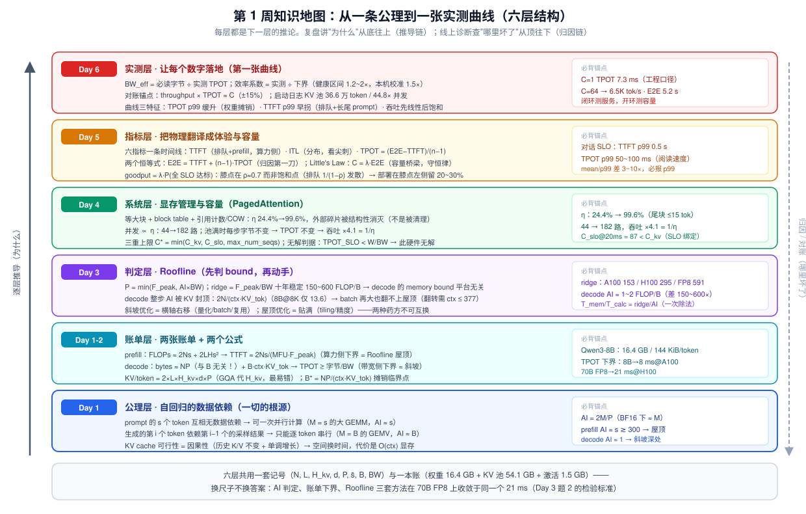
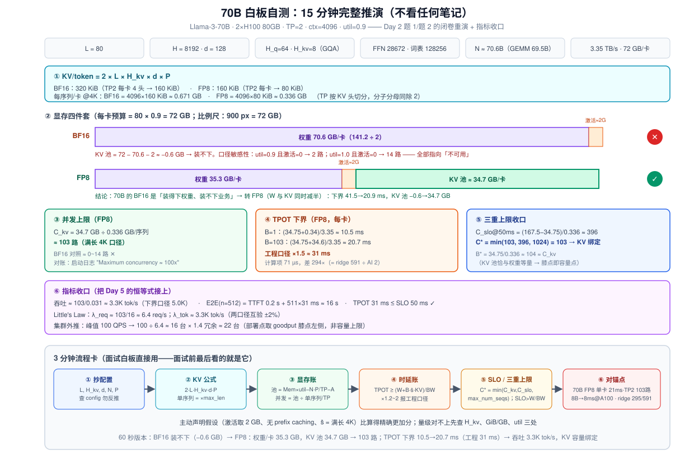

# Day 7（复盘日）· 《LLM 推理性能的第一性原理》：把六天拼成一张图 + 70B 白板闭卷自测

> **系列**：推理系统优化专家岗 · 56 天打卡 | 第 1 周「推理基础与性能建模」· 收官
> **今日位置**：Day 1~6 攒了六块碎片——两张账单（Day 1）、两个公式（Day 2）、一个模型（Day 3）、一个系统（Day 4）、一套指标（Day 5）、一张实测曲线（Day 6）。今天不引入任何新知识，只做两件事：**① 把六块碎片拼成一篇能带进面试室的《LLM 推理性能的第一性原理》**（附表 W1 面试作品）；**② 闭卷自测**——不看任何笔记，15 分钟白板手推 70B 模型的显存与并发上限。拼不拢、推不出，就说明某一天的知识是"观光"而不是"学会"
> **前置要求**：Day 1~6 全部（本篇每一节都在回收前六天的结论，按引用回跳）
> **预计用时**：2.5 ~ 3 小时（复盘精读 1h + 闭卷自测与对答案 1h + 写一页总结 0.5h）
> **背景衔接**：你在昇腾上做优化的收尾动作是"把 tiling 调优过程整理成可复用的方法论"——今天就是这一步：**第 1 周的全部内容将压缩成一张六层知识地图 + 八条推论 + 一套锚点数字**，它们是你第 8 周白板四件套的第一件
> **配套材料**：`week1/README.md` Day 7 节（初稿版总结）；两张 SVG：`assets/day07_week1_knowledge_map.svg`（六层知识地图）、`assets/day07_70b_whiteboard.svg`（自测推演图）；验证脚本 `day07_lab.py`（§5 实验 2）

---

## 0. 今日学习目标

完成今天的学习后，你应该能够：

- [ ] **闭卷**在 15 分钟内白板推完：Llama-3-70B 在 2×H100 上的显存四件套、并发上限、TPOT 下界、吞吐与 E2E——不看任何笔记，只有一支笔
- [ ] 把 Day 1~6 的结论组织成**六层知识地图**（公理 → 账单 → 判定 → 系统 → 指标 → 实测），并能**从任一层出发**向上讲"为什么"、向下讲"哪里坏了"
- [ ] 默写**八条推论**（《第一性原理》一页总结的正文）：两阶段、两公式、一模型 + 容量/摊销/量化/prefill 四推论 + 指标层
- [ ] 说出每个推论对应的**锚点数字**（ridge 295/591、144 KiB/token、8 ms、21 ms、103 路、η ×4.1……）——数字是第一性原理的"防伪标识"
- [ ] 完成**十道周复盘自测题**（§8，含 week1/README 7.2 的全部题目），错题回跳对应 Day 重修
- [ ] 交付：**《LLM 推理性能的第一性原理》一篇**（§9 给骨架，必须用自己的话重写）

---

## 1. 核心概念速览（本周概念的最终收拢表）

| 层 | 概念 | 一句话 | 出处 |
|---|---|---|---|
| 公理 | 自回归数据依赖 | prompt 并行（M=s）、生成串行（M=B），一切差异的根源 | Day 1 |
| 公理 | KV cache 可行性 | 因果性 → 历史 K/V 不变 → 空间换时间，代价 O(ctx) 显存 | Day 1 |
| 账单 | 两张账单 | prefill 记 FLOPs（算力侧）、decode 记 bytes（带宽侧） | Day 1 |
| 账单 | **KV/token** | $2 \times L \times H_{kv} \times d \times P$（GQA 代 $H_{kv}$） | Day 2 |
| 账单 | **TPOT 下界** | $\ge (NP + B\,\text{ctx}\,\text{KV\_tok})/\text{BW}$；B=1 时 ≈ $NP/\text{BW}$ | Day 2 |
| 判定 | **Roofline** | $P = \min(F_{\text{peak}},\ \text{AI} \times \text{BW})$；ridge = $F_{\text{peak}}/\text{BW}$ | Day 3 |
| 判定 | 三种 AI 口径 | 权重（decode，2M/P）/ 全流量（prefill，2K/3P）/ 整步 | Day 3 |
| 系统 | **η（KV 利用率）** | 朴素 20~40% → 分页 >96%；并发 ∝ η → 吞吐 ×1/η | Day 4 |
| 系统 | 三重上限 | $C^* = \min(C_{kv},\ C_{slo},\ C_{maxseq})$；无解判据 SLO > W/BW | Day 5 |
| 指标 | 两个恒等式 | E2E = TTFT + (n−1)·TPOT；Little's Law $C = \lambda \cdot \text{E2E}$ | Day 5 |
| 指标 | **goodput** | 满足 SLO 的吞吐；膝点 ρ≈0.7，部署在膝点左侧 | Day 5 |
| 实测 | **BW_eff / 效率系数** | 实测 TPOT ÷ 下界（1.2~2×）；本机校准值贯穿后续所有手算 | Day 6 |

> **一句话本质**：LLM 推理性能 = **一条数据依赖**（自回归）推出**两张账单**（FLOPs / bytes），账单除以**两个极限**（算力 / 带宽）得到**两个下界**（TTFT / TPOT），下界经过**一层管理**（显存 η + 调度三重上限）和**一层翻译**（指标 + goodput）变成工程决策，最后用**一次实测**（效率系数对账）闭环。

---

## 2. 原理深入讲解：把六天拼成一张图

### 2.1 知识地图总览



上图是本周的最终形态：**六层栈，每层都是下一层的推论**。两种读法：

- **自底向上（推导链）**：讲"为什么"——面试串讲、技术布道用这条路径（§2.2~2.6 就是这条链的完整走法）；
- **自顶向下（归因链）**：查"哪里坏了"——线上诊断用这条路径（Day 5 §2.8 的诊断表、Day 51 的诊断树都挂在这条链上）。

复盘的检验标准：**随机指一层，你能不假思索地说出它的上一层（它从哪推出）和下一层（它推出什么）**。

### 2.2 L0 → L1：一条数据依赖推出两张账单（Day 1 → Day 2）

一切从自回归开始：$x_t \sim P(x_t \mid x_{<t})$。

- **prompt 内部无依赖** → $s$ 个 token 一次并行 → 矩阵形态 M=s 的大 GEMM → 每读 1 字节权重算 ~s 个 FLOP → **算力是瓶颈**；
- **生成逐 token 串行** → 每步 M=B 的窄 GEMM/GEMV → 每读 1 字节权重算 ~1 个 FLOP → **带宽是瓶颈**。

把这两个观察写成账单（Day 1 §3）：

$$
\text{Prefill（每请求）}: \text{FLOPs} \approx 2Ns + 2LHs^2,\quad \text{bytes} \approx NP + s \cdot \text{KV\_tok}
$$

$$
\text{Decode（每步）}: \text{FLOPs} \approx 2NB,\quad \text{bytes} \approx \underbrace{NP}_{\text{与 } B \text{ 无关}} + B \cdot \text{ctx} \cdot \text{KV\_tok}
$$

再配两个"换算公式"（Day 2）把账单变成工程数字：

$$
\text{KV\_tok} = 2 \times L \times H_{kv} \times d \times P \qquad\qquad
\text{TPOT} \ge \frac{NP + B \cdot \text{ctx} \cdot \text{KV\_tok}}{\text{BW}} \;\xrightarrow{B=1}\; \frac{NP}{\text{BW}}
$$

**复盘自查三问**（答不上回 Day 1/2）：

1. decode 的权重项为什么与 B 无关？——B 个行向量拼成 $B \times H$ 矩阵乘同一个 $W$，权重只读一次（GEMM 本身的性质，不是实现技巧）；
2. KV/token 公式的五个因子各对应什么？——2 是 K/V 两份、L 是每层独立投影、$H_{kv}$ 是 GQA 的 KV 头数（**最易代错**）、d 查 config 勿反推、P 是精度；
3. "下界"为什么敢叫下界？——权重必须整份过 HBM（片上驻留不了几十 GB）、峰值带宽打不满（有效 60~85%）、开销只增不减 → 实测 1.2~2 倍。

### 2.3 L1 → L2：三套方法，一个答案（Day 3）

账单只给了字节和 FLOP，Roofline 把它们放进同一张图：$P = \min(F_{\text{peak}},\ \text{AI} \times \text{BW})$。第 1 周最值得反复回味的一个事实是——**三套独立的方法在同一个例子上收敛**（Day 3 题 2，Llama-3-70B FP8 @ H100，B=1）：

| 方法 | 计算 | 结果 |
|---|---|---|
| ① AI 判定（Day 1） | 整步 AI = 141.2 GFLOP ÷ 70.2 GB = 2.01 FLOP/B vs ridge 591 | 差 294× → memory bound |
| ② 账单下界（Day 2） | 70.2 GB ÷ 3.35 TB/s | **20.9 ms** |
| ③ Roofline 恒等式（Day 3） | $T_{\text{mem}}/T_{\text{calc}} = \text{ridge}/\text{AI} = 591/2.01 = 294\times$ | 计算侧 71 µs，差 294× |

**换尺子不换答案**——这是"能手算"的检验标准，也是你敢在面试里当场报数的底气来源。

另一个必须内化的推导（Day 3 题 3，本周最反直觉的一条）：decode 的**整步 AI 被 KV 项封顶**：

$$
\text{AI}_{\infty} = \frac{2N}{\text{ctx} \cdot \text{KV\_tok}} \;\xrightarrow{\ \text{Qwen3-8B, ctx=8K}\ }\; 13.6\ \text{FLOP/B} \ll 295
$$

**batch 加到无穷大也翻不上屋顶**（翻转需要 ctx ≤ ~377 token，H100）。这条不等式是第 4 周投机解码（用闲置算力换带宽）和第 5 周 P/D 分离（decode 独占带宽型硬件）的数学根——第 1 周的所有"为什么"到这里全部闭环。

### 2.4 L2 → L3：账单怎么被"管理"改写（Day 4 → Day 5）

Roofline 描述单个 kernel 的物理；系统层回答"**这台机器实际能装多少活**"。

**显存侧（Day 4）**：朴素方案按 max_len 连续预留 → $\eta \approx 20\sim40\%$；PagedAttention 用"等大块 + block table + 引用计数/COW"把 $\eta$ 推到 >96%，外部碎片被**结构性消灭**。把它乘进 Day 2 的容量公式：

$$
\text{并发上限} \approx \frac{\eta \cdot \text{KV\_pool}}{E[L] \cdot \text{KV\_tok}} \qquad\Rightarrow\qquad 44 \to 182\ \text{路} \approx \frac{1}{\eta_{\text{naive}}}
$$

**调度侧（Day 5）**：容量不是一维的，是三重上限的 min：$C^* = \min(C_{kv},\ C_{slo},\ C_{maxseq})$。Day 5 题 2 的表是本周最重要的"折扣表"——182 路的显存收益，在 TPOT SLO = 20 ms 下只剩 87 路（×0.48），SLO = 10 ms 只剩 18 路（×0.10），SLO < 7.4 ms（下界）直接无解。**PagedAttention 解决 η，解决不了 W/BW——两个瓶颈正交**，这句话是第 4~5 周所有专题的入口。

### 2.5 L3 → L4 → L5：从物理到生意，再到对账（Day 5 → Day 6）

- **指标层（Day 5）**：E2E = TTFT + (n−1)·TPOT 把用户时延切成两截（算力侧 / 带宽侧，药方完全不同）；Little's Law 把并发、到达率、时延焊在一起；goodput 回答"这台机器敢对外承诺多少"——膝点在 ρ≈0.7，不在吞吐饱和点，部署纪律是膝点左侧再留 20~30%。
- **实测层（Day 6）**：理论下界的最后一公里是**效率系数**——本机实测 TPOT ÷ 理论下界（典型 1.2~2×，你的 H100 校准为 1.5×）。拿到这个系数后，本周所有手算都从"理论口径"升级为"工程口径"（预测 C=64 的 6.58 ms × 1.5 ≈ 9.9 ms）。**这就是"基线"的真正含义：不是一个数字，而是一个可复算的换算关系。**

### 2.6 八条推论：《LLM 推理性能的第一性原理》正文

> 这是本篇的核心产出初稿（week1/README 7.1 的升级版）。**必须用自己的话重写才算你的**——§9 给归档骨架。

1. **两阶段**：prefill compute bound（AI ≈ s），decode memory bound（AI ≈ 1~2 vs ridge 150~600）——根源是自回归数据依赖，与框架/硬件无关；
2. **两公式**：`KV/token = 2L·H_kv·d·P`；`TPOT ≥ (N·P + B·ctx·KV_tok)/BW`——前者管容量，后者管时延，共用一本账；
3. **一模型**：Roofline。ridge = 算力/带宽，十年稳定 150~600 FLOP/B → decode 的 memory bound 是**平台无关的宿命**；整步 AI 被 $2N/(\text{ctx·KV\_tok})$ 封顶 → batch 救不了 decode；
4. **推论①（容量）**：并发 ≈ $\eta \cdot (\text{Mem} \times \text{util} - NP/\text{TP} - A_{\text{act}}) \div (\bar{s} \cdot \text{KV\_tok}/\text{TP})$——**显存管理就是吞吐**（PagedAttention 的 ×4 从这来），但受三重上限与 SLO 截断；
5. **推论②（摊销）**：$B^* = NP/(\bar{s}\cdot\text{KV\_tok})$ 之前加 batch 近似免费、之后 KV 主导、吞吐边际递减——continuous batching 的理论根基，batch 上限最终由 SLO 定；
6. **推论③（量化）**：P 缩小同时打权重字节（TPOT 下界÷P 缩小倍数）和 KV 字节（容量×、$C_{slo}$×）——decode 侧第一优先级杠杆；70B 的 BF16→FP8 把 2×H100 从"装不下"（−0.6 GB）变成"103 路"，是"从不可用到可用"而非简单的 2 倍；
7. **推论④（prefill）**：TTFT ≈ 2Ns/(MFU·$F_{\text{peak}}$)，杠杆是算力利用率（kernel/调度/通信）与缓存（prefix caching），与 decode 的杠杆（字节/带宽）完全不同——**P/D 分离的种子**（W5）；
8. **指标层**：E2E = TTFT + (n−1)·TPOT；生产看 **goodput 膝点**（ρ≈0.7）而非 raw throughput；SLO 低于 W/BW 时此硬件无解——出路只有量化、换硬件或投机解码。

### 2.7 昇腾方法论：一行的收拢

本周反复出现的映射（Day 1 §3.7 / Day 3 §3.4 的最终压缩版）：

> **同一套"量化账单 → 判定 bound → 逼近上限"，在昇腾上作用于单算子的 tiling（`CalRebalanceBlock` 的分界线 + baseM/baseN 搜优 + L1 全载驻留），在 GPU 推理上作用于整个 serving（Roofline + batch 摊销 + 量化 + 融合——因为 SMEM 只有 ~228 KB/SM，驻留不了权重）。公式不同，第一性原理相同。**

第 8 周面试的"跨平台叙事"（Day 53）今天就该把骨架立起来。

---

## 3. 数学推导：70B 白板闭卷推演（今日核心自测）



### 3.0 自测规则（先守规则，再谈对错）

1. **合上本篇和全部笔记**，白纸 + 笔 + 计时器，**15 分钟**；
2. 题目（就是 README 给 Day 7 指定的自测）：

   > **Llama-3-70B（L=80，H=8192，H_q=64，H_kv=8，d=128，FFN=28672，词表 128256，N≈70.6B）部署在 2×H100 80GB（3.35 TB/s）上，TP=2，ctx=4096，`gpu_memory_utilization=0.9`。求：(a) BF16 与 FP8（权重+KV）两种精度下的并发上限；(b) FP8 满载并发下的 TPOT 下界与吞吐；(c) 用一句话给出部署结论。**

3. 只允许记牢的常数：A100 2.04 / H100 3.35 TB/s、Qwen3-8B 16.4 GB / 144 KiB、70B BF16 141 GB / 320 KiB——**其余全部现场推**；
4. 做完再展开 §3.1 对答案；卡壳的步骤记进错题本（§9）。

### 3.1 完整推演（对答案版，六步）

**第 ① 步：拆参数量（口算友好版）**。每层 QKV $8192 \times 10240 = 83.9$M、O $67.1$M、MLP $3 \times 8192 \times 28672 = 704.6$M → 每层 855.6M；80 层 68.5B + lm_head 1.05B → **GEMM 权重 69.5B**（N ≈ 70.6B，差值是 Embedding 表——每步只查 1 行，时延账里剔除，容量账里算半份）。

**第 ② 步：KV/token（最容易错的一步）**：

$$
\text{BF16}: 2 \times 80 \times 8 \times 128 \times 2 = 320\ \text{KiB} \qquad
\text{FP8}: 160\ \text{KiB}
$$

TP=2 按 **KV 头对半切**（8→4 头/卡）→ 每卡 KV/token：BF16 160 KiB、FP8 80 KiB → **每序列每卡 @4K：BF16 0.671 GB、FP8 0.336 GB**。

**第 ③ 步：显存四件套（每卡预算 72 GB）**：

| | BF16 | FP8 |
|---|---|---|
| 权重/卡 | $141.2/2 = 70.6$ GB | $70.6/2 = 35.3$ GB |
| KV 池/卡 | $72 - 70.6 - 2 \approx \mathbf{-0.6\ GB}$ ✕ | $72 - 35.3 - 2 \approx \mathbf{34.7\ GB}$ ✓ |

**第 ④ 步：并发上限**：BF16 池为负 → **装不下**（详见 §3.2 口径敏感性）；FP8 = $34.7 / 0.336 \approx \mathbf{103\ \text{路}}$。

**第 ⑤ 步：TPOT 下界（时延账用 GEMM 权重 34.75 GB/卡）**：

$$
B=103:\quad \text{TPOT} \ge \frac{34.75 + 103 \times 0.336}{3.35} = \frac{69.3}{3.35} \approx \mathbf{20.7\ ms} \;\xrightarrow{\times 1.5\ \text{工程口径}}\; \approx 31\ \text{ms}
$$

（B=1 时为 10.5 ms；计算项 $2N/1979\,\text{TFLOPS} \approx 71\ \mu s$，差 294× = ridge 591 ÷ AI 2.01——Day 3 恒等式顺手复验。）

**第 ⑥ 步：三重上限收口与指标**：

- $C_{slo}@\text{TPOT 50ms} = (0.05 \times 3350 - 34.75)/0.336 \approx 396$ → $C^* = \min(103,\ 396,\ 1024) = \mathbf{103}$，**KV 容量绑定**；
- 吞吐 ≈ $103/0.031 \approx \mathbf{3.3K\ tok/s}$（下界口径 5.0K）；E2E（n=512）≈ $0.2 + 511 \times 0.031 \approx \mathbf{16\ s}$；Little's Law：$\lambda_{req} \approx 103/16 \approx 6.4$ req/s；
- 健全性检查：$B^* = 34.75/0.336 \approx 104 \approx C_{kv}$——**KV 池恰与权重等量，膝点即容量点**，再加并发先撞 KV 墙（抢占，Day 12）。

**60 秒版本**（面试嘴上说的那段）：*"70B BF16 在 2×H100 上装得下权重、装不下业务（KV 池 −0.6 GB）；转 FP8 后每卡权重 35.3 GB、KV 池 34.7 GB，4K 满长口径约 103 路并发；TPOT 下界从 B=1 的 10.5 ms 涨到满载 20.7 ms（工程口径约 31 ms），吞吐约 3.3K tok/s；容量由 KV 绑定，TPOT SLO 50 ms 内有余量。要再往上就是 KV 量化（Day 23）或加卡。"*

### 3.2 口径敏感性：为什么不同资料给出不同答案

同一道题，你会看到从"装不下"到"~40 路"的各种 BF16 答案——**差异不在算法，在假设**：

| 口径 | 假设 | BF16 并发 |
|---|---|---|
| vLLM 实际行为 | util=0.9、激活 2 GB | **−0.6 GB → 装不下（0 路）** |
| 只扣权重 | util=0.9、激活 0 | ≈ 2 路 |
| 极限乐观 | util=1.0、激活 0 | ≈ 14 路 |
| 部分资料的 "~40 路" | 不扣 util、显存按 GiB→GB 换算再放余量 | ~40 路 |

**三个结论**：① 无论哪种口径，工程判断都是"BF16 不可用"——量级结论对口径不敏感，**精确数字敏感**；② 面试时**先声明口径再动笔**（"我按 util 0.9、激活 2 GB 估"），这一句比算得准更加分；③ 对不上别人的数，先查三处：$H_{kv}$ 是否代错、GiB/GB（差 7.4%）、util 是否扣了。

### 3.3 本周锚点数字总表（抽背卡，面试前最后看）

| 类别 | 锚点 | 出处 |
|---|---|---|
| 硬件 | A100 2.04 TB/s · ridge 153；H100 3.35 TB/s · ridge 295（FP8 591） | Day 2/3 |
| Qwen3-8B | 权重 16.4 GB · GEMM 15.1 GB · KV 144 KiB/token · @8K 单序列 1.21 GB | Day 1/2 |
| 时延下界 | 8B BF16：8 ms@A100 / 4.9 ms@H100；70B FP8：21 ms@H100 单卡 / 10.5 ms TP2 | Day 2/§3 |
| 容量 | 8B@A100 8K：44 路；70B FP8 TP2 4K：103 路；4×H100 才谈 BF16 | Day 2/§3 |
| PagedAttention | η 24.4%→99.6% · 44→182 路 · 吞吐 ×4.1 = 1/η · COW 2.25 MiB/块、n−1 次 | Day 4 |
| Day 5/6 | C_kv 611（H100, s̄=600）· C_slo@50ms=1077 · 膝点 ρ≈0.7 · 效率系数 1.5× | Day 5/6 |

---

## 4. 与 vLLM V1 的实际联系：第一性原理在代码树里的落点（总表）

> **版本说明**（同前六天）：坐标按 v0.10~v0.11 主线，类名/签名随版本演进，以你 checkout 的代码为准。本节把本周散落各天的 V1 坐标**收拢成一张表**——下周起逐个开盒。

| 本周结论（层） | V1 里的落点 | 源码坐标 | 开盒日 |
|---|---|---|---|
| 两阶段（L0） | attn_metadata 区分 extend/decode 两条路径；`forward_extend` / `forward_decode` | `vllm/v1/attention/backends/*.py` | Day 17 |
| batch 摊销（L1） | `max_num_batched_tokens` / `max_num_seqs`——AI 沿斜坡右移的控制器 | `vllm/v1/core/scheduler.py` | Day 10-11 |
| 显存四件套（L1） | `load_model` → `profile_run` → `determine_num_available_blocks`，启动日志三行对账 | `vllm/v1/worker/gpu_worker.py`、`gpu_model_runner.py` | Day 8/15 |
| η 与分页（L3） | `KVCacheManager.allocate_slots/free` + `BlockPool` + `InputBatch.block_table` + `slot_mapping` | `vllm/v1/core/kv_cache_manager.py`、`kv_cache_utils.py` | Day 15-16 |
| 抢占（L3） | 池耗尽 → 逐出请求 recompute → 回 waiting；`vllm:preemption_total` | `vllm/v1/core/scheduler.py` | Day 12 |
| 指标层（L4） | `SchedulerStats → PrometheusStatLogger → /metrics`；客户端口径在 bench 的 `calculate_metrics` | `vllm/v1/engine/metrics.py`、`vllm/benchmarks/serve.py` | Day 13 |
| 效率系数的修复手段（L5） | decode 全 step CUDA Graph（消除 latency bound 的开销） | `gpu_model_runner` 的 capture 逻辑 | Day 18 |
| BW_eff 诊断（L5） | TPOT 反推 + nsys 时间线找 kernel 之外的开销 | `vllm/v1/engine/profiler.py` + nsys | Day 19/46 |

一个值得今天就想清楚的观察：**上表左列全部来自本周的"账单与下界"，右列全部是"把下界往下压的工程动作"**——第 2~3 周读源码时，每读一个机制就问一句"它在推高哪一条上限 / 压低哪一项下界"，源码就不会迷路。

---

## 5. 动手实验（复盘日的实验 = 输出）

### 实验 1（今日主体）：闭卷白板自测

1. 按 §3.0 的规则做题（15 分钟计时，白纸）；
2. 对照 §3.1 / SVG2 逐步打分：每一步（拆参数 → KV/token → 四件套 → 并发 → 时延 → 收口）独立记分，**卡壳的步骤注明回跳哪一天**；
3. 把 60 秒版本**口头说一遍并录音**——说不顺的段落就是"看起来会了"的部分；
4. 时长不够用（>20 分钟）不算失败，但要在错题本记下超时的一步。

### 实验 2（无需 GPU）：验证器对账

跑下面的脚本核对你的白板数字（已在无 GPU 环境验证，输出可复现）：

```python
# day07_lab.py —— Day 7 复盘验证器：70B 白板自测对账 + 本周锚点数字总复习（无需 GPU）
# 运行：python3 day07_lab.py
GB, TB, KiB, MS = 1e9, 1e12, 1024, 1e-3

def kv_per_token(L, hkv, d, p):
    return 2 * L * hkv * d * p

# ===== Part A：70B 白板自测验证器（Llama-3-70B，2×H100 TP=2，ctx=4096）=====
print("== Part A：Llama-3-70B · 2×H100 TP=2 · ctx=4096 · util=0.9 ==")
L, H, HQ, HKV, D, FFN, VOCAB = 80, 8192, 64, 8, 128, 28672, 128256
N = 70.6e9                                             # 参数量（Day 2 口径）
qkv, o, mlp = H*(HQ+2*HKV)*D, H*H, 3*H*FFN
per_layer = qkv + o + mlp
gemm = L*per_layer + H*VOCAB                            # GEMM 权重（不含 embedding）
print(f"每层: QKV {qkv/1e6:.1f}M + O {o/1e6:.1f}M + MLP {mlp/1e6:.1f}M = {per_layer/1e6:.1f}M")
print(f"{L} 层 = {L*per_layer/1e9:.1f}B；lm_head = {H*VOCAB/1e9:.2f}B → GEMM 合计 {gemm/1e9:.1f}B（N ≈ {N/1e9:.1f}B）")

BW = 3.35 * TB
budget = 80 * GB * 0.9                                  # 每卡 72 GB
print(f"\nKV/token：BF16 无TP = {kv_per_token(L,HKV,D,2)/KiB:.0f} KiB，TP2 每卡(4头) = {kv_per_token(L,4,D,2)/KiB:.0f} KiB")
print(f"          FP8  无TP = {kv_per_token(L,HKV,D,1)/KiB:.0f} KiB，TP2 每卡(4头) = {kv_per_token(L,4,D,1)/KiB:.0f} KiB")

print("\n-- ① BF16 口径敏感性（结论：怎么算都不可用）--")
seq_kv_bf16 = 4096 * kv_per_token(L, 4, D, 2)           # 每序列每卡 0.671 GB
for tag, pool in (("util=0.9, 激活2G", budget - N*2/2 - 2*GB),
                  ("util=0.9, 激活0 ", budget - N*2/2),
                  ("util=1.0, 激活0 ", 80*GB - N*2/2)):
    print(f"  {tag}  KV池/卡 = {pool/GB:+.1f} GB → 并发 ≈ {max(pool,0)/seq_kv_bf16:.0f} 路")

print("\n-- ② FP8（权重+KV 双 FP8）--")
w_cap = N / 2                                           # 容量账：35.3 GB/卡
w_lat = gemm / 2                                        # 时延账：34.75 GB/卡（GEMM 口径）
pool = budget - w_cap - 2*GB
seq_kv = 4096 * kv_per_token(L, 4, D, 1)                # 每序列每卡 0.336 GB
conc = pool / seq_kv
print(f"  每卡权重 {w_cap/GB:.1f} GB → KV 池/卡 = {pool/GB:.1f} GB")
print(f"  每序列/卡 = 4096 × 80 KiB = {seq_kv/GB:.3f} GB → 并发 = {pool/GB:.1f}/{seq_kv/GB:.3f} ≈ {conc:.0f} 路")
print(f"  B* = W/(s̄·KV_tok) = {w_lat/GB:.2f}/{seq_kv/GB:.3f} ≈ {w_lat/seq_kv:.0f}（≈ 并发上限：KV 池恰与权重大小相当）")
for B in (1, 32, 64, round(conc)):
    t = (w_lat + B*seq_kv) / BW
    print(f"  B={B:<4} 每卡字节 = {(w_lat + B*seq_kv)/GB:5.1f} GB → TPOT 下界 = {t/MS:5.1f} ms → 吞吐 = {B/t:5.0f} tok/s")

c_slo = (0.050*BW - w_lat) / seq_kv
print(f"  C_slo@TPOT50ms = (0.05×3350 − 34.75)/0.336 ≈ {c_slo:.0f} 路 → C* = min(C_kv {conc:.0f}, C_slo {c_slo:.0f}, maxseq 1024) = {min(conc,c_slo):.0f}（KV 绑定）")
tpot_e = 1.5 * (w_lat + conc*seq_kv) / BW
e2e = 0.2 + 511*tpot_e
print(f"  工程口径 ×1.5：TPOT({conc:.0f}) ≈ {tpot_e/MS:.1f} ms → 吞吐 ≈ {conc/tpot_e:.0f} tok/s；E2E(n=512) ≈ 0.2 + 511×{tpot_e/MS:.0f}ms ≈ {e2e:.0f} s")
print(f"  Little's Law：λ_req ≈ {conc:.0f}/{e2e:.0f} ≈ {conc/e2e:.1f} req/s；λ_tok ≈ {conc/tpot_e:.0f} tok/s")

# ===== Part B：本周锚点数字总复习 =====
print("\n== Part B：本周锚点数字总复习 ==")
print("-- ridge point（平台的身份证，Day 3）--")
for name, f, bw in (("A100 BF16", 312, 2.04), ("H100 BF16", 989, 3.35), ("H100 FP8", 1979, 3.35)):
    print(f"  {name:<10} = {f/bw:.0f} FLOP/B")

print("-- Qwen3-8B BF16 @H100（Day 2/5/6 账本，s̄=600）--")
N8, W8, kv8, pool8 = 8.2e9, 16.4*GB, kv_per_token(36, 8, 128, 2), 54.1*GB
print(f"  权重 {W8/GB:.1f} GB，GEMM {15.1:.1f} GB；KV/token = {kv8/KiB:.0f} KiB")
print(f"  TPOT 下界(C=1) = {W8/3.35e12/MS:.2f} ms；×1.5 = {1.5*W8/3.35e12/MS:.1f} ms")
print(f"  C_kv(满长8K) = {pool8/(8192*kv8):.0f} 路（启动日志口径 44.8×）；C_kv(s̄=600) = {pool8/(600*kv8):.0f} 路")
print(f"  整步 AI 上限(B→∞, 8K) = 2N/(ctx·KV_tok) = {2*N8/(8192*kv8):.1f} FLOP/B ≪ ridge 295 → 永远 memory bound")

print("-- PagedAttention（Day 4，E[L]=2000，A100）--")
eta = 2000/8192
print(f"  η_naive = 2000/8192 = {eta:.1%}；η_paged ≈ 2000/2007.5 = {2000/2007.5:.1%}")
print(f"  并发 44 → 182 路（×{182/44:.1f} ≈ 1/η）；池满时 TPOT 不变 → 吞吐 ×{1/eta:.1f}")
```

**实测输出**（可直接对账）：

```text
== Part A：Llama-3-70B · 2×H100 TP=2 · ctx=4096 · util=0.9 ==
每层: QKV 83.9M + O 67.1M + MLP 704.6M = 855.6M
80 层 = 68.5B；lm_head = 1.05B → GEMM 合计 69.5B（N ≈ 70.6B）

KV/token：BF16 无TP = 320 KiB，TP2 每卡(4头) = 160 KiB
          FP8  无TP = 160 KiB，TP2 每卡(4头) = 80 KiB

-- ① BF16 口径敏感性（结论：怎么算都不可用）--
  util=0.9, 激活2G  KV池/卡 = -0.6 GB → 并发 ≈ 0 路
  util=0.9, 激活0   KV池/卡 = +1.4 GB → 并发 ≈ 2 路
  util=1.0, 激活0   KV池/卡 = +9.4 GB → 并发 ≈ 14 路

-- ② FP8（权重+KV 双 FP8）--
  每卡权重 35.3 GB → KV 池/卡 = 34.7 GB
  每序列/卡 = 4096 × 80 KiB = 0.336 GB → 并发 = 34.7/0.336 ≈ 103 路
  B* = W/(s̄·KV_tok) = 34.75/0.336 ≈ 104（≈ 并发上限：KV 池恰与权重大小相当）
  B=1    每卡字节 =  35.1 GB → TPOT 下界 =  10.5 ms → 吞吐 =    95 tok/s
  B=32   每卡字节 =  45.5 GB → TPOT 下界 =  13.6 ms → 吞吐 =  2357 tok/s
  B=64   每卡字节 =  56.2 GB → TPOT 下界 =  16.8 ms → 吞吐 =  3813 tok/s
  B=103  每卡字节 =  69.3 GB → TPOT 下界 =  20.7 ms → 吞吐 =  4978 tok/s
  C_slo@TPOT50ms = (0.05×3350 − 34.75)/0.336 ≈ 396 路 → C* = min(C_kv 103, C_slo 396, maxseq 1024) = 103（KV 绑定）
  工程口径 ×1.5：TPOT(103) ≈ 31.1 ms → 吞吐 ≈ 3325 tok/s；E2E(n=512) ≈ 0.2 + 511×31ms ≈ 16 s
  Little's Law：λ_req ≈ 103/16 ≈ 6.4 req/s；λ_tok ≈ 3325 tok/s

== Part B：本周锚点数字总复习 ==
-- ridge point（平台的身份证，Day 3）--
  A100 BF16  = 153 FLOP/B
  H100 BF16  = 295 FLOP/B
  H100 FP8   = 591 FLOP/B
-- Qwen3-8B BF16 @H100（Day 2/5/6 账本，s̄=600）--
  权重 16.4 GB，GEMM 15.1 GB；KV/token = 144 KiB
  TPOT 下界(C=1) = 4.90 ms；×1.5 = 7.3 ms
  C_kv(满长8K) = 45 路（启动日志口径 44.8×）；C_kv(s̄=600) = 611 路
  整步 AI 上限(B→∞, 8K) = 2N/(ctx·KV_tok) = 13.6 FLOP/B ≪ ridge 295 → 永远 memory bound
-- PagedAttention（Day 4，E[L]=2000，A100）--
  η_naive = 2000/8192 = 24.4%；η_paged ≈ 2000/2007.5 = 99.6%
  并发 44 → 182 路（×4.1 ≈ 1/η）；池满时 TPOT 不变 → 吞吐 ×4.1
```

白板数与脚本差 ±10% 以内即可（多半是尾数舍入）；差出一个量级 → 回 §3.2 查三处口径。

### 实验 3：3 分钟互讲（面试模拟，Day 54 的预演）

1. 对着知识地图（SVG1）**从 L0 到 L5 讲一遍**"LLM 推理性能的第一性原理"，录音 3 分钟；
2. 讲的时候强制带上至少 **5 个锚点数字**（ridge / KV/token / 下界 / 并发 / η）——没有数字的串讲在面试里等于没讲；
3. 回放录音，标记：哪一层讲得最虚（通常是 L3 系统层）→ 回读对应 Day 的 §7 总结。

---

## 6. 面试高频问题（复盘综合级）

**Q1：用 3 分钟讲清"LLM 推理性能的第一性原理"。**（串讲总纲题，本周一切的总装）

> 骨架：① 公理：自回归数据依赖 → prompt 并行（M=s，AI≈s，compute bound）、生成串行（M=B，AI≈1，memory bound）；② 两张账单：prefill 记 FLOPs（TTFT ≈ 2Ns/MFU/F）、decode 记字节（TPOT ≥ (NP + B·ctx·KV_tok)/BW）；③ 三个推论：容量（并发 ∝ η·KV 池 ÷ 单序列 KV——显存管理就是吞吐）、摊销（B* 前免费、之后 KV 主导）、量化（同时打两个字节项，"从不可用到可用"）；④ 收口：生产看 goodput 膝点（ρ≈0.7），SLO 低于 W/BW 则此硬件无解；⑤ 数字防伪：ridge 295、144 KiB/token、70B FP8 TP2 103 路。**讲的时候按六层从下往上，每层一个数字。**

**Q2：给你 Llama-3-70B 和 2 张 H100，设计部署方案。**（§3 的展开版）

> 骨架：① BF16 装不下（KV 池 −0.6 GB）→ FP8：权重 35.3 GB/卡、KV 池 34.7 GB；② 并发 ≈ 103 路（4K 满长口径），TPOT 下界 10.5→20.7 ms、工程 ~31 ms；③ 三重上限收口：C_slo@50ms = 396 > 103 → KV 绑定；④ 吞吐 ~3.3K tok/s、E2E(n=512) ~16 s、λ ≈ 6.4 req/s；⑤ 增长路径：KV FP8 已做 → 下一步 KV 量化到 INT4 / prefix caching / 加卡 TP4（通信账 Day 32 补）。**主动声明口径（util、激活、s̄=满长）是这套答案的一部分。**

**Q3：你怎么知道自己的手算/优化结论是"对的"？**（对账方法论题，区分"背过"与"会算"）

> 骨架：三道防线：① **换尺子**：AI 判定、账单下界、Roofline 恒等式（T_mem/T_calc = ridge/AI）三套方法必须给同一个数；② **对系统**：vLLM 启动日志（KV 池 tokens、Maximum concurrency）、`throughput × TPOT ≈ C`（±15%）、p99/mean 比 3~10 才像真实负载；③ **对物理**：效率系数 = 实测 ÷ 下界，健康区间 1.2~2×，超出区间先怀疑测量（口径/SSE 打包/降频）再怀疑理论。**金句**：没预测的测量是观光，没对账的优化是玄学（Day 6）。

**Q4：为什么说 decode 的所有优化手段都写在一张账单上？**

> 骨架：TPOT ≥ (W + B·s̄·KV_tok)/BW，四个杠杆正好对应四类手段：① 减 W——权重量化（FP8/INT4，下界÷2~÷4）；② 减 KV——KV 量化、GQA/MLA、prefix caching、限制 ctx；③ 摊销与开销——batch（到 B* 为止）、CUDA Graph、算子融合（压效率系数）；④ 换资源——投机解码（用闲置算力换带宽，有效 TPOT ≈ 步时延÷接受长度）、TP（分摊权重读，代价 all-reduce）、P/D 分离（decode 独占带宽硬件）。**按账单分类作答，而不是零散报菜名。**

**Q5（差异化题）：从昇腾算子优化到 GPU 推理系统，你的方法论怎么迁移？**（§2.7 的口语版）

> 骨架：① 同一套三步：量化账单 → 判定 bound → 逼近上限；② 两套参数表：`CalRebalanceBlock` 的 L2/HBM vs Cube 分界 ↔ Roofline 的 ridge；baseM/baseN 搜优 ↔ tile/warp/MMA；msprof ↔ nsys/ncu；③ 一个关键差异：昇腾 L1 是 MB 级可做权重全载驻留（O(n·A)→O(A)），GPU SMEM ~228 KB/SM 驻留不了 → 走 batch 摊销 + 量化 + 融合；④ 本周把这套直觉升维到了系统级：手算下界 ↔ 容量规划，效率系数 ↔ 带宽利用率 KPI。**这是 W8 Day 53 叙事主线的第一次完整彩排。**

**Q6：线上"用户反馈回答变慢，但打字出来后速度正常"，你先查什么？**（诊断题，六层地图的归因链走一遍）

> 骨架：① 症状翻译：TTFT 恶化、TPOT/ITL 正常——prefill 侧（算力侧）问题，不是 decode；② 按诊断表查：waiting 队列深度（排队）、prefill token budget（拥塞）、长尾 prompt 分布（p99 由最长 prompt 决定）；③ 深挖方向：chunked prefill 的 budget 设置、是否被大 C 的 decode 混跑拖慢每个 step、前端 tokenize/输出路径（客户端口径 vs 服务端口径的差值）；④ 修复菜单：加 prefill 算力/实例、prefix caching 命中率、P/D 分离。**对应 Day 5 §2.8 表第 1 行 + Day 6 曲线的"TTFT 早拐"特征。**

---

## 7. 今日总结（第 1 周总结）

1. **一条公理**：自回归数据依赖——prompt 并行、生成串行，推出两阶段的一切差异（bound、指标、优化手段的分裂）。
2. **两张账单 + 两个公式**：prefill FLOPs ≈ 2Ns + 2LHs²（算力侧）；decode bytes ≈ NP（与 B 无关）+ B·ctx·KV_tok（带宽侧）；KV/token = 2L·H_kv·d·P、TPOT ≥ 字节/BW。
3. **一个模型**：Roofline——ridge 十年稳定 150~600 → decode 平台无关地 memory bound；整步 AI 被 2N/(ctx·KV_tok) 封顶 → **batch 救不了 decode**，这是投机解码与 P/D 分离的数学根。
4. **一层管理**：η（PagedAttention 24.4%→99.6%，吞吐 ×4.1 = 1/η）+ 三重上限（C* = min(C_kv, C_slo, max_num_seqs)，无解判据 SLO > W/BW）——**显存管理就是吞吐，但 SLO 是更硬的天花板**。
5. **一层翻译 + 一次实测**：E2E = TTFT + (n−1)·TPOT、Little's Law、goodput 膝点 ρ≈0.7；效率系数（本机 1.5×）让所有手算从理论口径升级为工程口径。
6. **闭卷自测达标线**：15 分钟内推完 70B → BF16 装不下（−0.6 GB）、FP8 103 路、TPOT 下界 10.5→20.7 ms（工程 31 ms）、吞吐 3.3K tok/s、KV 容量绑定——**换尺子不换答案，带口径报数字**。

---

## 8. 今日自测题（十道周复盘题，先做再展开）

> 覆盖 week1/README 7.2 的全部题目；每题答完自查回跳日。

**Q1**：70B BF16，2×H100 TP=2，4K ctx：并发上限？（这题的"标准答案"为什么会有争议？）

<details><summary>参考答案</summary>

按 vLLM 口径（util=0.9、激活 2 GB）：KV 池 = 72 − 70.6 − 2 ≈ **−0.6 GB → 装不下（0 路）**；只扣权重 ≈ 2 路；util=1.0 且激活 0 ≈ 14 路。争议来自**口径**（util、激活、GiB/GB、TP 是否切 KV 头）——量级结论（不可用）对口径不敏感，精确数字敏感；面试先声明口径再动笔（§3.2）。工程结论：70B BF16 至少 4×H100（TP4，每卡权重 35.3 GB）才谈得上容量——与 FP8 TP2 同水平。
</details>

**Q2**：手推：为什么 decode 的 AI 在 BF16 下恰是 1 FLOP/B？

<details><summary>参考答案</summary>

线性层 $Y = XW$，M=1：FLOPs = 2KN（乘加各一），bytes ≈ KNP = 2KN（BF16 权重主导）→ AI = 2KN/2KN = **1**。一般化 AI = 2M/P：每个权重字节被用 M 次、每次 2 个 FLOP、每字节 P…即 AI = 2M/P；FP8 时 M=1 → AI=2。与矩阵宽窄无关，只看"行数"（Day 1 §3.2）。
</details>

**Q3**：H100 BF16 的 ridge point？不要背，现场算。

<details><summary>参考答案</summary>

ridge = 峰值算力 ÷ 带宽 = 989 TFLOPS ÷ 3.35 TB/s ≈ **295 FLOP/B**（FP8：1979/3.35 ≈ 591）。含义：AI 低于它的 kernel 性能 ∝ AI（斜坡），高于它贴峰值算力（屋顶）。十年稳定 150~600 的原因是带宽与算力同步演进（Day 3 §2.3）。
</details>

**Q4**：batch=128、ctx=1024 时 decode 还一定 memory bound 吗？

<details><summary>参考答案</summary>

算整步 AI 的上限（B→∞）：$2N/(\text{ctx·KV\_tok})$。Qwen3-8B、ctx=1024：$16.4\text{e}9/(1024 \times 147456) \approx 108.6$ FLOP/B——B=128 时实际 AI = $2 \times 8.2\text{e}9 \times 128 / (16.4\text{e}9 + 128 \times 1024 \times 147456) \approx 59$，仍 < 295 → **仍然 memory bound**。"短 ctx + 大 batch 贴近分界"要验算而不是凭感觉：H100 上真正的翻转条件是 ctx ≤ ~377 且 B→∞（Day 3 题 3）；A100（ridge 153）窗口放宽到 ~727，同样达不到。
</details>

**Q5**：PagedAttention 把浪费从 60~80% 降到 <4%，为什么吞吐"只"提升 2~4× 而不是 5×+？

<details><summary>参考答案</summary>

三层折扣：① 论文对照对象（TGI/Orca）自身的 η 比 24% 的极端值略好（~0.3~0.4 → 1/η ≈ 2.5~3.3），对 HF 朴素管线的倍数才更大；② 吞吐比 = 并发比 = 1/η 只在"池塞满且 TPOT 不变"时成立——越过 B* 后 TPOT 随 B 线性涨、吞吐边际递减；③ SLO 截断：C_slo < C_kv 时收益被砍（182 → 87 @20ms，×0.48；10 ms 只剩 18 路）——**PagedAttention 解决 η，解决不了 W/BW 下界，两个瓶颈正交**（Day 5 题 2）。
</details>

**Q6**：用户反馈"回答变慢但打字速度正常"，先查什么？

<details><summary>参考答案</summary>

TPOT/ITL 正常、**TTFT 恶化** → prefill/排队侧：`num_requests_waiting` 深度、prefill token budget、长尾 prompt（p99 由最长 prompt 决定，prefill FLOPs ∝ s）。不是 decode/bandwidth 问题——查 `gpu_cache_usage`、batch 都是用错药方（Day 5 §2.8 第 1 行 + §6 Q6 的完整走法）。
</details>

**Q7**：为什么 vLLM 抢占选 recompute 而非 swap？

<details><summary>参考答案</summary>

资源账：swap 花 HBM↔CPU 往返带宽（稀缺、与 TP 通信/权重加载争抢）+ CPU 侧池与异步传输的复杂状态机；recompute 花 prefill 算力——而 decode 阶段算力大量闲置（计算项比访存项小两个数量级）。**用闲置资源换瓶颈资源**，与投机解码同母题；V1 干脆只留 recompute。翻转条件：P/D 分离后 prefill 算力不再空闲，或互连带宽充裕（同节点 NVLink）（Day 4 §2.5，Day 29 展开）。
</details>

**Q8**：一句话讲清 GQA 对 serving 的意义。

<details><summary>参考答案</summary>

KV/token 缩小 $H_{kv}/H_q$ 倍（70B：8/64 = 1/8），**容量（并发上限）与 decode 的 KV 读带宽同步缓解**——一箭双雕；代价仅是 KV 投影的少量计算与权重。反例：70B 无 GQA 则 KV/token = 2.5 MiB、每序列 4K ≈ 10 GB，2×H100 只能 ~7~8 路——大并发 serving 根本做不了（Day 2 练习题 2）。
</details>

**Q9**：TTFT p99 = 500 ms、TPOT p99 = 60 ms、n = 400，E2E p99 大约多少？

<details><summary>参考答案</summary>

上界估计（和的分位数 ≤ 分位数的和）：$p99(\text{E2E}) \le 0.5 + 399 \times 0.06 \approx \mathbf{24.4\ s}$。两个要点：分母是 n−1=399（首 token 由 prefill 顺带产出）；长输出的体验几乎完全由 TPOT 决定（500 ms 只占 2%）——TPOT 差 1 ms，E2E 差 0.4 s（Day 5 §2.3）。
</details>

**Q10**：把 Day 2 例题一（70B FP8 @ H100 单卡 decode 下界）完整重推一遍，含单位。

<details><summary>参考答案</summary>

GEMM 权重 69.5B 参数 × 1 B = **69.5 GB**；KV（ctx=4096，FP8）= 4096 × 160 KiB ≈ 0.67 GB；TPOT ≥ (69.5+0.67)/3.35 TB/s ≈ **20.9 ms**（≈ 48 tok/s）；计算侧 141.2 GFLOP ÷ 1979 TFLOPS ≈ 71 µs，差 294× = ridge 591 ÷ AI 2.01；单卡放不下（69.5 + KV + 激活 > 72 GB）→ TP2 下界 ≈ 10.4~10.5 ms。与 §3 的 TP2 推演是同一本账的两个视角（Day 2 §3.1 + 本篇 §3.1）。
</details>

---

## 9. 今日产出物

按计划，今天交付**《LLM 推理性能的第一性原理》一篇**（附表 W1 面试作品，week1/README 7.3 归档为 `summary_first_principles.md`）。归档要求：

- [ ] **用自己的话重写 §2.6 的八条推论**（一条都不许照抄本篇——抄的是我的话，面试时讲不出来）
- [ ] 每条推论后面**跟一个锚点数字**（ridge 295 / 144 KiB / 8 ms / 21 ms / 103 路 / η ×4.1 / 膝点 ρ0.7……）
- [ ] 贴上**闭卷自测的白纸照片** + 六步得分表（哪步卡壳、回跳哪一天）
- [ ] 贴上 `day07_lab.py` 的输出（与白板数字的 diff）
- [ ] 贴上 3 分钟互讲的录音要点（哪一层讲得最虚）
- [ ] 错题本：本周累计的"没完全搞懂"清单（每天留一个的那批）——第 2 周开盒时逐一消灭

建议骨架（直接抄）：

```markdown
# LLM 推理性能的第一性原理（Day 7 · 第 1 周总结）
## 0. 一句话总纲 + 六层知识地图（手绘版，对照 SVG1 校漏）
## 1. 公理：自回归数据依赖 → 两阶段
## 2. 账单：prefill FLOPs / decode bytes + KV/token 与 TPOT 下界公式
## 3. 判定：Roofline、ridge、AI 三口径、decode 翻不上屋顶（2N/(ctx·KV_tok)）
## 4. 推论①容量：η 与三重上限（44→182、C* = min(...)、无解判据）
## 5. 推论②摊销：B*、剪刀差、SLO 是更硬的天花板
## 6. 推论③量化：同时打两个字节项（−0.6 GB → 103 路的例子）
## 7. 推论④prefill：TTFT ≈ 2Ns/(MFU·F)——P/D 分离的种子
## 8. 指标与实测：两恒等式、goodput 膝点、效率系数 1.5×
## 9. 闭卷自测记录（70B 六步 + 得分 + 错题）
## 10. 锚点数字总表（§3.3 抄一遍——面试前最后看这页）
```

---

## 10. 明日预告（Day 8 · 第 2 周开篇：V1 架构总览）

第 1 周把推理系统当**黑盒**测出了曲线、推出了下界；从明天起连续 7 天正式开盒。Day 8 刻意不进任何单个组件的细节，先做三件事：

- **V0 的四个结构性问题**与 V1 的对应解法（进程模型 / tokenize 位置 / APC 默认 / 调度器形态 / preemption 策略）——先知道"为什么重写"，再读"重写成什么"
- **默画 V1 进程架构图**：`AsyncLLM` → `Processor` →（ZMQ）→ `EngineCore`（`Scheduler` + `KVCacheManager`）→ `Executor` → `Worker/GPUModelRunner`，标出每层的源码坐标与两条跨进程通道
- 用 `ps` + `py-spy` **实测**多进程结构，并用**进程数公式**回答任意并行配置的拓扑（单卡 = 2，`-tp 4` 单机 = 6……）

本周图里每个黑盒（Scheduler、KVCacheManager、ModelRunner）从 Day 9 起逐个打开——带着今天的知识地图去读，每读一个机制就问："它在推高哪条上限、压低哪项下界？"

> 打卡：完成后在 README 的 Day 7 前打勾，并写一句话收获（例："闭卷推 70B，卡在 TP 的 KV 头切分上——单卡口径和每卡口径混了一下；重推一遍后 103 路和启动日志的 100x 终于对上了，这周的手算算是闭环了"）。
