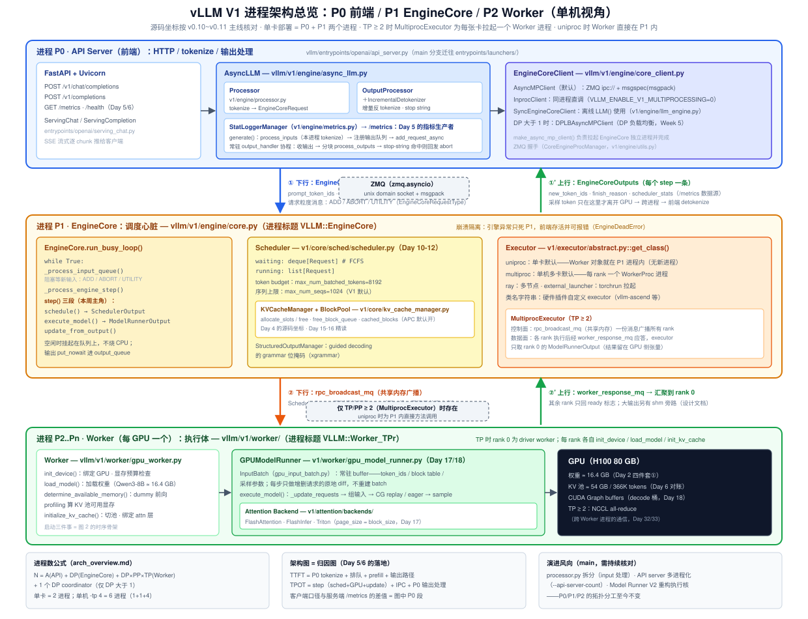
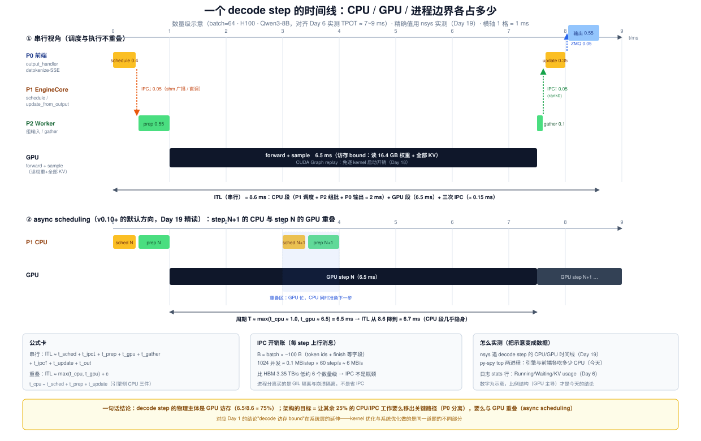
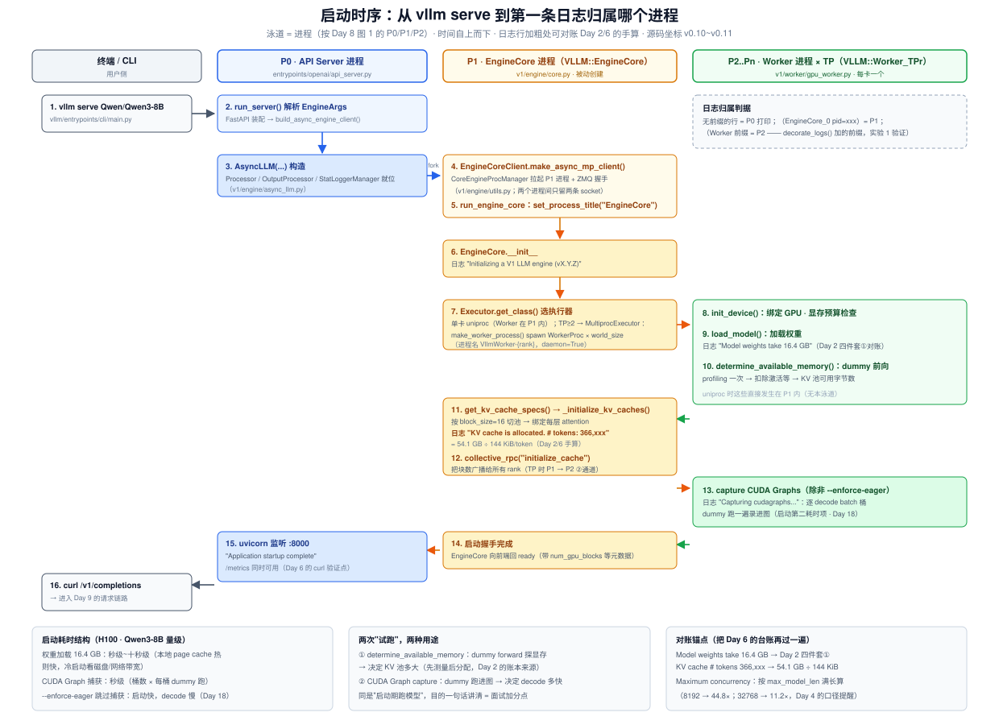

# Day 8 · V1 架构总览：先把地图画对，再进源码

> **系列**：推理系统优化专家岗 · 56 天打卡 | 第 2 周「vLLM V1 源码精读（上）—— 调度链路」
> **今日位置**：第 1 周把推理系统当黑盒测出了曲线（Day 6），Day 4 又提前记下了 KV 管理的源码坐标。从今天起连续 7 天正式开盒——但**第一天刻意不进任何单个组件的细节**：先把 V1 的进程架构、模块地图、进程间通信立起来，谁在哪个进程、数据怎么跨边界、每个盒子对应哪段源码。这张地图是 Day 9~13（调度链路）与 Week 3（KV 与执行层）的坐标系——之后每读一个组件，都要能回答"它在图中的哪一格、和谁隔着进程边界"
> **前置要求**：Day 4（PagedAttention 机制与 V1 的 `KVCacheManager`/`BlockPool`/block table 坐标）、Day 5（TTFT/TPOT 的成分分解——今天要把每个成分钉到图上）、Day 6（`vllm serve` 部署台账、启动日志 KV 池 ≈ 36.6 万 token 对账、`/metrics` 端口）
> **预计用时**：3 ~ 3.5 小时（官方材料阅读 1h + 源码骨架走读 1h + 实验 1h + 画图收尾 0.5h）
> **背景衔接**：你在昇腾上熟悉"Host 下发任务 / Device 执行 / AICPU 管控制流"的分层——V1 的多进程架构是同一命题在软件层的重演：**API 进程 = 控制面**（连接管理、tokenize、输出格式化），**EngineCore = 任务调度器**（组批、记账、分发），**Worker/ModelRunner = 执行体**（真正吃 GPU）。把 Python GIL 想象成"单核上的控制总线"：控制面流量大时会饿死计算流，所以 V1 干脆把两者拆进不同进程。面试里"从昇腾 Host/Device 分层讲到 vLLM 前后端分离"是现成的跨平台叙事
> **实验环境**：复用 Day 6 的 1 × H100/A100 + Qwen3-8B 环境；无 GPU 时做实验 0 + 实验 4B（纯源码走读，见 §5）
> **配套材料**：`week2/README.md` Day 8 节；三张 SVG：`assets/day08_v1_process_architecture.svg`（今日主产出的参照图）、`assets/day08_startup_sequence.svg`（启动时序）、`assets/day08_step_ipc_timeline.svg`（step 时间线与 IPC 开销账）
> **版本口径**：源码坐标按 **v0.10 ~ v0.11 主线**核对，关键代码逐行对照 **v0.11.0 tag**（2026-10 复核）；main 分支仍在演进（`processor.py` 正拆分为 input 处理、API server 入口迁往 `entrypoints/launchers/`、Model Runner V2 重构执行核），**以你 checkout 的 tag 为准**——坐标对不上时先怀疑版本，再怀疑理解

---

## 0. 今日学习目标

完成今天的学习后，你应该能够：

- [ ] 讲清 **V0 的四个结构性问题**与 V1 的对应解法，并能背出 V0→V1 差异表的主干（进程模型 / tokenize 位置 / APC 默认 / 调度器形态 / preemption 策略）
- [ ] **默画 V1 进程架构图**：P0 前端（AsyncLLM + Processor + OutputProcessor + EngineCoreClient）→ ZMQ → P1 EngineCore（busy loop + Scheduler + KVCacheManager + Executor）→ Worker/ModelRunner，标出每层的源码坐标与两条跨进程通道
- [ ] 用一个**进程数公式**回答任意并行配置下的进程拓扑（单卡 = 2，`-tp 4` 单机 = 6，`-tp 2 -dp 4` 8 卡 = 17）
- [ ] 解释三个"为什么"：为什么 tokenize/detokenize 在前端进程？为什么跨进程传 token ids 而不是文本？为什么 stop string 只能在前端判？
- [ ] 用 `ps` + `py-spy` **实测验证**多进程结构（空闲时栈在哪、压测时栈在哪），并对比 `VLLM_ENABLE_V1_MULTIPROCESSING=0` 的行为
- [ ] 交付：**自己画一张 V1 进程架构图**（进程边界 + 通信通道 + 数据流方向 + 源码坐标）——这是本周所有源码走读的底图

---

## 1. 核心概念速览

| 概念 | 一句话定义 | 今日要达到的深度 |
|---|---|---|
| **P0 / API Server 进程** | 跑 FastAPI + uvicorn 的前端进程：HTTP、tokenize、输出处理 | 知道它持有哪些对象、为什么独占一进程 |
| **`AsyncLLM`** | 前端引擎门面（`v1/engine/async_llm.py`）：组装 Processor/OutputProcessor/Client，暴露 `generate()` | 读过 `__init__`/`add_request`/`output_handler` 骨架 |
| **`Processor`** | 输入规整器（`v1/engine/processor.py`）：校验 + tokenize → `EngineCoreRequest` | 知道 tokenize 发生在 P0、发给 P1 的是 token ids |
| **`OutputProcessor`** | 输出处理器：`EngineCoreOutputs` → `RequestOutput`（含增量 detokenize、stop string） | 知道 stop string 在这里判、为什么 |
| **`EngineCoreClient`** | 前端↔引擎的客户端族（`v1/engine/core_client.py`）：AsyncMP / Inproc / Sync / DPLB | 会区分"进程拓扑"与"引擎逻辑"的分离 |
| **ZMQ + msgspec** | 跨进程通道与序列化（msgpack 编码的 msgspec.Struct） | 会算每步消息量级（§3.2） |
| **P1 / `EngineCore` 进程** | 调度心脏（`v1/engine/core.py`）：busy loop + `step()` 三段 | 背下 `schedule → execute_model → update_from_output` |
| **`Scheduler`** | waiting/running 队列 + token budget（`v1/core/sched/scheduler.py`） | 今天只到"它在 P1、管什么"，Day 10-12 精读 |
| **`KVCacheManager`** | Day 4 的老朋友：`allocate_slots`/`free` + BlockPool | 知道它被 Scheduler 持有、在 P1 进程里 |
| **`Executor`** | 执行器抽象（`v1/executor/abstract.py::get_class()`）：uniproc / multiproc / ray / 插件 | 会讲三种后端的选择逻辑与 Worker 拓扑差异 |
| **`Worker` / `GPUModelRunner`** | 每 GPU 一个的执行体：常驻 `InputBatch` + CUDA Graph + attention 后端 | 只看 `execute_model` 骨架，Day 17/18 精读 |
| **`VllmConfig`** | 贯穿全类层级的配置对象（模型/缓存/并行/调度全在一处） | 理解它支撑的三条设计选择（§2.6） |
| **进程标题** | `set_process_title()` 设的 `VLLM::EngineCore`、`VLLM::Worker_TP0` | 实验 1 用 `ps` 亲眼看到 |

> **一句话本质**：V1 把"一个推理服务"拆成了**三层不同节奏的机器**——P0 面向用户（毫秒级的连接与文本处理）、P1 面向全局（每 step 一次的调度决策）、P2 面向 GPU（微秒级的 kernel 编排）；层与层之间用 ZMQ/共享内存传**最小的消息**（token ids，而非文本）。所有后续的源码与优化，都是在不破坏这个分层的前提下做局部替换。

---

## 2. 原理深入讲解

### 2.1 回顾 Week 1：黑盒里我们知道了什么，今天开什么盒

| 来源 | 结论 | 今天的角色 |
|---|---|---|
| Day 1 | prefill 计算密集、decode 访存密集；decode 迭代的张量流 | 图 1 中 GPU 盒子的物理属性（§3 的时间线主体） |
| Day 2 | KV/token = 144 KiB；TPOT 下界 ≈ W/BW = 4.93 ms；显存四件套 | 启动日志对账锚点（图 2：16.4 GB 权重 + 366K token KV 池） |
| Day 3 | Roofline：AI 判 bound；ncu 看 SM/DRAM busy | "decode step 的主体是 GPU 访存"——系统层同一结论 |
| Day 4 | PagedAttention：η > 96%；V1 的 `KVCacheManager`/BlockPool/block table 坐标 | 图 1 中 Scheduler 盒子内部的构件，**位置今天就确定** |
| Day 5 | TTFT/TPOT/E2E/throughput/goodput 的定义与成分 | 每个成分今天都能钉到图上某一格（= 归因图） |
| Day 6 | `vllm bench serve` 曲线；闭环/开环；客户端 vs 服务端口径 | 被测对象的进程结构今天展开；差值 = 图中 P0 段 |

为什么源码精读要"先架构后细节"？因为 vLLM 的调用链**横跨三个进程**，从任何一个文件开始逐行走读都会在进程边界处"断线"（比如在 `EngineCore` 里找不到谁调它）。先把进程/模块/通信三件事立住，后面六天每天的精读都只是"在地图上放大某一块"。本周七天的分工：

| Day | 放大哪一块 |
|---|---|
| Day 8（今天） | 整张地图 |
| Day 9 | P0 的入口链路（tokenize → Request → 跨进程） |
| Day 10-12 | P1 的 Scheduler（队列/budget、chunked prefill、preemption） |
| Day 13 | 用压测验证调度行为（回到 Day 6 的方法论） |
| Day 14（复盘） | 请求在 scheduler 中的状态机（把 P1 内部画细） |

### 2.2 为什么要重构出 V1：V0 的四宗罪与 V1 的答案

V0 的问题（面试可作为开场叙事，每条都能落到"用户可感知的症状"）：

1. **前后端耦合，GIL 互踩**：API server 与引擎逻辑在同一进程的同一 asyncio 世界里。tokenize/detokenize/HTTP 解析这些重 Python 工作与引擎 step 循环共享一个解释器——GIL 争抢的直接后果是 **ITL 抖动**：解码明明是稳定的每步 ~7 ms，却因为前端一个慢请求的输出处理被拉出尖刺。Day 6 曲线里 TPOT p99 与 p50 的差距，一部分就来自这类噪声。
2. **双引擎实现**：`LLMEngine`（同步，离线）与 `AsyncLLMEngine`（异步，在线）两套代码长期分叉——同一个 bug 要修两遍，行为还不完全一致。
3. **调度器分相运行**：V0 的调度器在"prefill 优先步"与"decode 优先步"之间交替，chunked prefill 是后补的补丁；prefill/decode 不能自然混排在同一个 step 里（Day 11 会看到混排的价值）。
4. **prefix caching 默认关闭**：V0 的 APC 实现有额外开销顾虑，默认 off——而真实负载里 system prompt / few-shot / 多轮对话的历史，重复前缀是常态（Day 16 用数据说话）。

V1 的答案一句话：**前后端分离 + 单一 EngineCore + 统一单循环 + APC 默认开**。官方博客给出的代表性成绩：DeepSeek-R1 在 H100 上端到端最高约 **1.7×** 提速（不同负载差异大，面试引用时记得带"最高"二字）。时间线：

| 时间 | 事件 |
|---|---|
| 2023 | vLLM 开源：PagedAttention + continuous batching（V0 形态） |
| 2025-01 | V1 alpha 博客发布（架构重写预告） |
| 2025-03（v0.8.0） | **V1 成为默认引擎** |
| 2025 年中 | V0 正式弃用（issue #18571），随后代码移除 |
| 2025-09 | "Inside vLLM: Anatomy"官方深度博客（今日主读材料，基于 2025-08 的 commit） |
| 现在（v0.10~v0.11+） | V1 是唯一架构——**README 的"不要读旧代码"就是指别再去看 V0 的教程与代码** |

> **提示**：这套演进脉络本身就是面试素材——"你读过 V0 吗？为什么 V1 要重写？"是区分"用过 vLLM"和"理解 vLLM"的经典题（§6 Q3）。

### 2.3 进程架构全景（今日主图）



对照上图，从上到下过一遍三层（**今天的目标是"指图讲 90 秒"**，不需要任何组件内部细节）：

**① P0 · API Server 进程**（`vllm/entrypoints/openai/api_server.py`，main 分支迁往 `entrypoints/launchers/`）
FastAPI + uvicorn 提供 OpenAI 兼容 API 与 `/metrics`。真正干活的是 `AsyncLLM`（`vllm/v1/engine/async_llm.py`）组装的前端三件套：`Processor`（tokenize → `EngineCoreRequest`）、`OutputProcessor`（含每请求一个的 `IncrementalDetokenizer`，做增量反 tokenize 与 stop string 判定）、`StatLoggerManager`（`v1/engine/metrics.py`——Day 5 那些 `/metrics` 指标的生产者）。右边的 `EngineCoreClient` 是跨进程的门面。**注意**：`vllm serve` 的 API 进程默认 1 个；DP 部署时自动扩到 DP 个（也可 `--api-server-count` 手工设），每个 API 进程都能连到所有 EngineCore（多对多 ZMQ 拓扑）。

**② P1 · EngineCore 独立进程**（`vllm/v1/engine/core.py`，进程标题 `VLLM::EngineCore`）
调度心脏，一个 busy loop 跑到底（`run_busy_loop`：收输入 → `step()` → 发输出）。`step()` 三段——`scheduler.schedule()` 组本步的批 → `executor.execute_model()` 交给执行层 → `scheduler.update_from_output()` 记账与 finish 判定——**这三段就是本周 Day 9~13 的目录**。Scheduler 内部持有 Day 4 见过的 `KVCacheManager` + BlockPool。右侧的 `Executor` 决定执行拓扑（§2.5）。崩溃隔离是额外收益：引擎炸了只死 P1，P0 还能活着给用户报错（前端会收到 `EngineDeadError`）。

**③ P2..Pn · Worker 进程**（`vllm/v1/worker/`，每 GPU 一个，进程标题 `VLLM::Worker_TPr`）
`Worker`（`gpu_worker.py`）负责进程级三件事：`init_device` / `load_model` / `initialize_kv_cache`；真正每步执行的是 `GPUModelRunner`（`gpu_model_runner.py`）——常驻 `InputBatch` buffer（token ids、block table、采样参数都在里面，增删请求只做原地 diff）、CUDA Graph replay、attention 后端（`v1/attention/backends/`，Day 17）。TP 时 rank 0 是 driver worker，采样出的 token ids 留在 GPU 张量里回传。

**进程数公式**（来自官方 `docs/design/arch_overview.md`，单机场景背下来）：

$$N_{proc} = \underbrace{A}_{\text{API 进程}} + \underbrace{DP}_{\text{EngineCore}} + \underbrace{DP \times PP \times TP}_{\text{Worker（每 GPU 一个）}} + \mathbb{1}[DP > 1]$$

- 单卡（你的 Day 6 环境）：1 + 1 + 1 = **2 个进程**（API + EngineCore；Worker 在 P1 内，见 §2.5）
- 单机 `-tp 4`：1 + 1 + 4 = **6 个进程**
- 8 卡 `-tp 2 -dp 4`：4（API，随 DP 扩）+ 4（EngineCore）+ 8（Worker）+ 1（DP coordinator）= **17 个进程**

> **为什么这个公式重要**：生产容量规划里 CPU 核数要按进程数配（每进程还有内部线程，如前端的媒体加载线程默认 8 个）；进程数配错 → 进程间抢核 → ITL 抖动重现——绕了一圈又回到 V0 的病根。

### 2.4 跨进程通信：ZMQ + msgspec，传的是 token ids

**通道**：P0 ↔ P1 之间就两条 ZMQ socket（unix domain socket，前端用 `zmq.asyncio`）——下行发请求级消息，上行收 step 级输出。地址与握手由 `CoreEngineProcManager`（`v1/engine/utils.py`）管理：前端 `make_async_mp_client()` 拉起 P1 进程 → P1 里 `run_engine_core()` 设进程标题、完成握手 → 双方各持两条 socket。

**消息（DTO 全家住在 `vllm/v1/engine/__init__.py`，都是 msgspec.Struct）**：

| 方向 | DTO | 载荷 | 粒度 |
|---|---|---|---|
| P0 → P1 | `EngineCoreRequest` | `prompt_token_ids`、sampling_params、lora、mm 输入、priority | 每请求 1 条 |
| P0 → P1 | `EngineCoreRequestType` | `ADD` / `ABORT` / `UTILITY`（profile、sleep 等 RPC） | 控制消息 |
| P1 → P0 | `EngineCoreOutputs` | 每请求 `new_token_ids`、finish_reason/stop_reason + **一份 `scheduler_stats`**（/metrics 的数据源） | **每 step 1 条** |

三个高频追问，一次说清：

1. **为什么传 token ids 不传文本？** ① token id 是定长小整数（msgpack 里 1~5 B/token），文本是变长 UTF-8（约 3~4 字符/token）且要转义；② 上行只传**新增**的几个 token id，而非全量上下文——增量传输让消息量与生成长度解耦；③ 引擎根本不需要文本：调度与 forward 只消费 token ids，文本只在最终面向用户时才需要（detokenize 放 P0，§2.3）。
2. **stop string 为什么在 P0 判？** `stop_token_ids`/EOS/max_tokens 只看 token id——P1 在 `update_from_output` 里判，**判得最早、省算最多**；stop string 要看 detokenize 后的**文本**，而 detokenize 在 P0 → 只能由 `OutputProcessor` 判，命中后再通过下行通道发 `ABORT` 回 P1。代价是一个隐蔽行为：stop string 命中时 P1 可能已经多算了几步（多生成的 token 被丢弃）。这是"数据放哪、判定就在哪"的直接推论，面试聊数据流设计时是好细节。
3. **开销会不会成为瓶颈？** §3.2 算账：答案是不会（差 6 个数量级）。

**进程可见性**：所有 P1/P2 进程的日志行都带形如 `(EngineCore_0 pid=12345)` 的前缀（`decorate_logs()` 加的），P0 的日志无前缀——**日志前缀就是进程归属的免费证据**，实验 1 直接用。另外前端 `output_handler` 把大 batch 输出切成 `VLLM_V1_OUTPUT_PROC_CHUNK_SIZE` 大小的块处理，避免一次 detokenize 霸占事件循环太久——这是"前端节奏别拖累别人"的自觉。

### 2.5 Executor 家族：Worker 的进程拓扑由它决定

`Executor.get_class()`（`vllm/v1/executor/abstract.py`）按 `distributed_executor_backend` 分发：

| 后端 | 何时用 | Worker 拓扑 |
|---|---|---|
| `uniproc` | **单卡默认**（TP=PP=1） | **没有独立 Worker 进程**——Worker 对象直接在 P1 里，`execute_model` 就是方法调用 |
| `multiproc` | 单机多卡默认（TP ≥ 2） | 每 rank 一个 `WorkerProc` 进程（`make_worker_process` spawn，daemon，进程名 `VllmWorker-{rank}`） |
| `ray` | 多节点 / 弹性调度 | Worker 跑在 Ray actor 里 |
| `external_launcher` | torchrun 等外部拉起 | Worker 由外部编排 |
| 类名字符串 | **硬件插件**（昇腾等） | 平台注册自己的 Executor |

**MultiprocExecutor 的通信设计**（`v1/executor/multiproc_executor.py`，官方设计文档 `docs/design/multiprocessing.md`，面试可讲的两点）：

1. **控制面广播**：一份 `SchedulerOutput` 通过 `rpc_broadcast_mq`（共享内存 message queue）**同时发给所有 rank**——广播一次，不是逐个单播；
2. **数据面汇聚**：各 rank 执行完经自己的 `worker_response_mq` 应答，**executor 只取 rank 0 的 `ModelRunnerOutput`**（采样 token ids 留在 GPU），其余 rank 的应答只是 ready 标志；输出过大时另有共享内存旁路。

从 `EngineCore` 的视角看，这一切被 `execute_model()` 一个调用完全隐藏——uniproc 是直调，multiproc 是"广播 + 等 rank0"。**这就是"执行拓扑与引擎逻辑解耦"**：同一份 EngineCore 代码，单卡两进程、8 卡十七进程地跑。

> **易混点**：`VLLM_ENABLE_V1_MULTIPROCESSING` 控制的是 **P0 与 P1 是否分离**（默认 1 = 分离；设 0 时 `InprocClient` 让 EngineCore 直接跑在 API 进程里）；而 **P1 与 P2 是否分离**由 `distributed_executor_backend` 控制（单卡 uniproc 本来就不分）。两个开关、两道边界，别混。

### 2.6 VllmConfig 与类层级：为"换硬件"留的缝

官方 `docs/design/arch_overview.md` 讲了三条类层级设计选择，每条都值得面试引用：

1. **可扩展性**：全系统只传一个 `VllmConfig`（model/cache/parallel/scheduler 配置的聚合体）。加新配置项不用改任何构造函数签名——"把全局状态装进一个对象传到底"。
2. **统一性**：所有模型的构造签名统一为 `__init__(self, *, vllm_config: VllmConfig, prefix: str = "")`（keyword-only），ModelRunner 不需要按模型类型写 if-else；视觉-语言模型可以由统一构造的子模型组合出来。
3. **初始化期做切分与量化**：TP 切分/量化发生在**权重加载时**而非加载后——跑 405B 模型时先整体加载再切分需要每卡装下全量权重再丢弃，不可行。

**与你背景的接口**（Day 17 预热、W6 项目主线）：vLLM 的硬件插件机制（官方博客 *Introducing vLLM Hardware Plugin, Best Practice from Ascend NPU*，2025-05）就是沿这条缝插入的——平台注册自己的 **Platform / Executor / Worker / ModelRunner / AttentionBackend / Communicator** 钩子，vllm-ascend 正是这样接入的。今天你只需要在图 1 上把"可替换层"圈出来：Executor（拓扑）、ModelRunner（执行）、Attention Backend（kernel）——**P0 与 P1 的调度框架不用动**。

### 2.7 演进风向（main 分支，读源码前先看一眼）

> **注（随版本变化，以 main 为准）**：① `processor.py` 正被拆分重构（input 预处理独立）；② API server 入口迁往 `vllm/entrypoints/launchers/`，且支持多进程 `--api-server-count`；③ **Model Runner V2**（2026-03 官方博客）在重构执行核（GPU 原生输入准备、稳定常驻批、async-first 调度）；④ DP coordinator、KV connector 等新组件加入。**共同点：P0/P1/P2 的拓扑分工至今没变**——这也是今天这张图的价值：它比任何具体类名都长寿。

---

## 3. 性能模型：进程分离的收益账（今日的数学）

### 3.1 命题：为隔离付 IPC 的钱，值不值？

不分离时（V0 形态 / `InprocClient`），前端工作与引擎循环共享一个 Python 解释器。设每 step 前端要做的 Python 工作（tokenize 摊销 + 输出处理 + 事件循环杂务）为 $t_{fe}$，则：

$$ITL_{\text{耦合}} \approx t_{engine} + t_{fe} + \text{GIL 抖动项}$$

关键在**抖动项**：GIL 争抢不是简单的加法，而是排队论意义上的抢占——偶发的慢请求（长输出、大 prompt 的 detokenize）会把引擎的 CPU 段拉出**尾部尖刺**（Day 5 讲过为什么 p99 由尾部决定）。分离后：

$$ITL_{\text{分离}} \approx t_{engine} + t_{ipc}, \quad t_{ipc} \sim 几十\,\mu s \ll t_{fe}$$

即：**用几十微秒的确定性 IPC，换掉百微秒~毫秒级且带尾部的共享解释器开销**。$t_{fe}$ 没有消失——它去 P0 并行了（另一个进程、另一个核），只在最宽松的意义下（P0 处理不及时导致输出延迟）影响用户体感。

### 3.2 消息量级：IPC 永远不是瓶颈（要会现场算）

每 step 上行的 `EngineCoreOutputs`：

$$B_{step} \approx \sum_{i \in \text{batch}} (1 + k_i) \cdot b_{msg}, \quad b_{msg} = O(10^2 \text{ B})$$

其中 $k_i$ 是请求 $i$ 本步新增 token 数（普通解码 = 1；投机解码可以更多，Day 25）。代入极端场景——**满配 1024 并发**、每请求 1 token、每请求消息 ~100 B：

$$B_{step} \approx 1024 \times 100\,\text{B} \approx 0.1\,\text{MB}, \quad 60\,\text{step/s} \Rightarrow \sim 6\,\text{MB/s}$$

对比 HBM 3.35 TB/s（差 ~6 个数量级）、对比哪怕一张 25 GbE 网卡（~3 GB/s，差 ~500 倍）——**unix socket 上的这点流量连零头都算不上**。下行更小：请求级消息，每请求一生一次。这道题的价值在于面试反问："既然要进程分离，为什么不把 EngineCore 也拆成多进程流水线？"——你会算账之后就知道：拆到哪一层、拆到什么粒度，取决于消息量与隔离收益的比值，而不是"进程越多越高级"。

### 3.3 一个 decode step 的时间线（图 3）



对照上图（数量级示意，对齐 Day 6 实测 TPOT ≈ 7~9 ms @ batch 64）：

$$ITL_{\text{串行}} \approx \underbrace{t_{sched} + t_{prep} + t_{update}}_{t_{cpu} \approx 1.3\,\text{ms}} + \underbrace{t_{gpu} \approx 6.5\,\text{ms}}_{\text{访存 bound，Day 1/2}} + \underbrace{t_{ipc} \approx 0.15\,\text{ms}}_{\text{三次跨边界}} + t_{out}$$

三个结论：

1. **GPU 段占 ~75%**——decode 访存 bound 在系统层的再现（Day 1 的 kernel 视角 → 今天的进程视角，同一道题）；
2. **CPU 段是系统优化的靶子**：两个动作分别是"移出关键路径"（前端处理 → P0，2.4 节）与"藏进 GPU 阴影"（async scheduling：step N+1 的 `schedule`/`prep` 与 step N 的 forward 重叠，$ITL \to \max(t_{cpu}, t_{gpu})$，v0.10+ 默认方向，**Day 19 用 nsys 实测**）；
3. **IPC 三次共 ~0.15 ms**，占 ~2%——再次印证 3.2 的账。

### 3.4 复杂度小结

| 对象 | 每步开销 | 备注 |
|---|---|---|
| `Scheduler.schedule()` | $O(|running| + \text{队首若干 waiting})$ | running 逐个查 KV/budget；waiting 只看队首（Day 10） |
| `update_from_output()` | $O(\text{本步 finish/新增})$ | 增量记账 |
| IPC 上行 | $O(\text{batch})$ 字节 | §3.2 |
| OutputProcessor | $O(\sum \text{new tokens})$ 的 Python 工作 | 在 P0 并行消化，分块防独占 |

> **验证方法**（prompt 要求的"实际测量"）：① `py-spy top` 分别盯 P0/P1 的 CPU 占比（今天实验 2）；② nsys 抓一次 decode step 的 CPU/GPU 时间线（Day 19）；③ `--log-stats` 的周期统计行看 Running/Waiting/KV usage（Day 6 已熟）。

---

## 4. 关键代码走读（v0.11.0 逐行核对版）

> **阅读方法**：先 `git checkout v0.11.0`（或对照你安装版本的 `site-packages/vllm/`），拿着图 1，按 4.1 → 4.3 → 4.4 → 4.5 的顺序只读骨架。以下代码都是**节选**：主干保真、删减分支，行号以 v0.11.0 为准，版本不同以你本地为准。

### 4.1 前端门面：`AsyncLLM`（`vllm/v1/engine/async_llm.py`）

```python
class AsyncLLM(EngineClient):
    def __init__(self, vllm_config, executor_class, log_stats, ...):
        # --- 前端三件套（全部在本进程 P0）---
        self.tokenizer = init_tokenizer_from_configs(...)
        self.processor = Processor(vllm_config, self.tokenizer, mm_registry)
        self.output_processor = OutputProcessor(self.tokenizer, log_stats)
        # --- 引擎核心客户端：默认拉起独立进程 P1 ---
        self.engine_core = EngineCoreClient.make_async_mp_client(
            vllm_config=vllm_config, executor_class=executor_class, ...)
        self.logger_manager = StatLoggerManager(...)   # /metrics 生产者（Day 5）
        self.output_handler = None                     # 常驻输出协程，首次 generate 时启动

    async def add_request(self, request_id, prompt, params, ...) -> RequestOutputCollector:
        queue = RequestOutputCollector(output_kind=params.output_kind)
        # 1) tokenize + 校验 + 构造 EngineCoreRequest（本进程完成！）
        prompt_str, request = self.processor.process_inputs(
            request_id, prompt, params, arrival_time, ...)
        # 2) 注册到 OutputProcessor（建立 request_id → 输出队列 的路由表）
        self.output_processor.add_request(request, prompt_str, ..., queue)
        # 3) 跨进程边界 ①：发给 EngineCore
        await self.engine_core.add_request_async(request)
        return queue

    async def generate(self, prompt, sampling_params, request_id, ...):
        q = await self.add_request(request_id, prompt, sampling_params, ...)
        while True:                       # 迭代产出 RequestOutput（SSE 由 serving 层消费）
            out = q.get_nowait() or await q.get()
            yield out
            if out.finished: break
        # 客户端断开 → abort；引擎已死 → EngineDeadError（崩溃隔离的用户面）

    def _run_output_handler(self):
        async def output_handler():       # 常驻协程：收引擎输出 → 分发到各请求队列
            while True:
                outputs = await engine_core.get_output_async()        # ← 跨进程边界 ①'
                for slice in chunked(outputs.outputs, VLLM_V1_OUTPUT_PROC_CHUNK_SIZE):
                    output_processor.process_outputs(slice, outputs.timestamp, ...)
                await engine_core.abort_requests_async(
                    processed.reqs_to_abort)   # ← stop string 命中，回发 ABORT（§2.4）
                logger_manager.record(scheduler_stats=outputs.scheduler_stats, ...)
```

**读这段代码要抓的三件事**：① tokenize 在 `process_inputs` 里、在 P0——`generate()` 从头到尾没碰 GPU；② `output_handler` 是**唯一的**输出消费者，`/metrics` 数据搭同一班车（`scheduler_stats`）；③ `finish` 的判定分布在两端（token 级在 P1、string 级在 P0），呼应 §2.4。

### 4.2 消息定义（`vllm/v1/engine/__init__.py`，msgspec.Struct）

```python
class EngineCoreRequest(msgspec.Struct, ...):
    request_id: str
    prompt_token_ids: list[int]     # ← 跨进程传的是 token ids，不是文本
    params: SamplingParams          #   （§2.4 的"为什么"落地处）
    mm_inputs / lora_request / priority / ...

class EngineCoreOutputs(msgspec.Struct, ...):
    outputs: list[EngineCoreOutput]        # 每请求：new_token_ids + finish/stop_reason
    scheduler_stats: SchedulerStats        # 搭车回 P0 → StatLoggerManager → /metrics
    # （v0.11 起还带 engine 索引等字段以支持多前端/DP，此处省略）

class EngineCoreRequestType(enum.Enum):    # 下行控制消息的类型标签
    ADD / ABORT / UTILITY                  # UTILITY：profile、sleep、collective_rpc 等
```

### 4.3 调度心脏：`EngineCore`（`vllm/v1/engine/core.py`）

```python
class EngineCore:
    """Inner loop of vLLM's Engine."""
    def __init__(self, vllm_config, executor_class, log_stats, ...):
        self.model_executor = executor_class(vllm_config)        # ① 执行器（决定 P2 拓扑）
        num_gpu_blocks, num_cpu_blocks, kv_cache_config = \
            self._initialize_kv_caches(vllm_config)              # ② 显存 profiling → KV 池
        self.collective_rpc("initialize_cache",
                            args=(num_gpu_blocks, num_cpu_blocks))
        self.structured_output_manager = StructuredOutputManager(vllm_config)
        self.scheduler = Scheduler(vllm_config=vllm_config,       # ③ 调度器 + KVCacheManager
                                   kv_cache_config=kv_cache_config, ...)
        # 日志 "Initializing a V1 LLM engine (vX.Y.Z) with config: ..." 就在这里

    def step(self):                                   # ← 本周的主角，三段式
        if not self.scheduler.has_requests():         # 空转保护
            return {}, False
        scheduler_output = self.scheduler.schedule()              # (1) 组批（Day 10-12）
        model_output = self.model_executor.execute_model(
            scheduler_output)                                    # (2) 执行（→ P2）
        engine_core_outputs = self.scheduler.update_from_output(
            scheduler_output, model_output)                      # (3) 记账 + finish 判定
        return engine_core_outputs, ...

class EngineCoreProc(EngineCore):
    """EngineCore 的进程包装：socket ↔ 队列。"""
    def run_busy_loop(self):              # ← P1 的心跳
        while True:
            self._process_input_queue()   # 阻塞在 input_queue.get() 等新输入（不烧 CPU）
            self._process_engine_step()   # step() → output_queue.put_nowait(...)

# P1 进程入口（CoreEngineProcManager spawn 后执行）：
#   set_process_title("EngineCore")      → ps 里的 VLLM::EngineCore
#   decorate_logs()                      → 日志行的 (EngineCore_0 pid=xxx) 前缀
#   EngineCoreProc(...).run_busy_loop()
```

**读这段代码要抓的三件事**：① `__init__` 的顺序（executor → KV 池 → scheduler）正是图 2 启动时序的主体；② `step()` 三段与图 1 中 P1 盒子的文字一一对应；③ 空闲时**阻塞在队列上**而不是自旋——所以空闲的 EngineCore 进程 CPU 占用接近 0（实验 2 用 py-spy 验证这一点）。

### 4.4 执行拓扑：`Executor.get_class()` 与 `MultiprocExecutor`

```python
# vllm/v1/executor/abstract.py
class Executor(ExecutorBase):
    @staticmethod
    def get_class(vllm_config) -> type["Executor"]:
        backend = vllm_config.parallel_config.distributed_executor_backend
        if isinstance(backend, type):       # 直接传类：自定义/插件 executor
            return backend
        if backend == "ray":                return RayDistributedExecutor
        if backend == "multiproc" or (backend is None and 多卡):
            return MultiprocExecutor         # 单机多卡默认
        if backend == "uniproc":            return UniProcExecutor   # 单卡默认
        if backend == "external_launcher":  return ExecutorWithExternalLauncher
        return resolve_obj_by_qualname(backend)   # 字符串：昇腾等平台插件
```

```python
# vllm/v1/executor/multiproc_executor.py（骨架）
class MultiprocExecutor(Executor):
    def __init__(self, vllm_config, ...):
        # ① 共享内存广播队列：一份 SchedulerOutput 发给所有 rank
        self.rpc_broadcast_mq = MessageQueue(self.world_size, 1)
        # ② 每 rank 一个 daemon Worker 进程
        for local_rank in range(world_size):
            handle = WorkerProc.make_worker_process(
                vllm_config, local_rank, rank, ...)
            # WorkerProc.worker_main → init_device / load_model / init_kv_cache → 忙循环
        # ③ 各 worker 经 worker_response_mq 应答，executor 只等 rank 0 的结果

    def execute_model(self, scheduler_output) -> ModelRunnerOutput:
        self.rpc_broadcast_mq.enqueue(...)                  # 广播（非阻塞）
        status, result = rank0_handle.worker_response_mq.dequeue()   # 只等 rank 0
        return result
```

### 4.5 执行体：`GPUModelRunner.execute_model`（只看骨架，Day 17/18 精读）

```python
# vllm/v1/worker/gpu_model_runner.py（骨架）
class GPUModelRunner(...):
    def __init__(self, ...):
        self.input_batch = InputBatch(...)   # 常驻 CPU 侧 buffer：token_ids /
                                             # block table / 采样参数（gpu_input_batch.py）

    def execute_model(self, scheduler_output) -> ModelRunnerOutput:
        # (1) 增量更新常驻 batch：完成的移出、新增的移入、追加 token + 更新 block table
        self._update_requests(scheduler_output)
        # (2) 组装输入：positions、attn 元数据（paged）、CPU → GPU 拷贝
        model_input = self._gather_model_input()
        # (3) 执行：decode 命中 bucket → CUDA Graph replay；prefill → eager / torch.compile
        if graph_ok:  output = self._replay_graph(model_input)
        else:         output = self.model.forward(...)
        # (4) 采样：sampled token ids 留在 GPU（直到 §2.4 的 ①' 才离开）
        return ModelRunnerOutput(sampled_token_ids=...)
```

### 4.6 启动时序与日志归属（把 Day 6 的台账再过一遍）



对着上图把 `vllm serve` 的启动日志逐行归属（这是实验 1 的检查表）：

| 日志行（措辞随版本微调） | 打印者 | 对应代码 | 对账 |
|---|---|---|---|
| `Initializing a V1 LLM engine (vX.Y.Z) with config: ...` | P1 | `core.py::EngineCore.__init__` | 版本 + 全部关键配置快照（`max_num_batched_tokens=8192`、`max_num_seqs=1024`） |
| `Model weights take 16.4 GB` | P2（经 P1 前缀） | `load_model` | Day 2 四件套① |
| `KV cache is allocated. # tokens: 366,xxx` | P2 | `initialize_kv_cache` | 54.1 GB ÷ 144 KiB/token（Day 2/6 手算） |
| `Maximum concurrency for 8,192 tokens per sequence: 44.x` | P1 | 启动收尾 | 满长口径（Day 4 的 44.8→182 提醒）；换 `--max-model-len 32768` 则变 ~11.2× |
| `Capturing cudagraphs ...` | P2 | graph capture | Day 18 主角；`--enforce-eager` 跳过 |
| `Application startup complete` | P0 | uvicorn | 这行**没有** `(EngineCore)` 前缀 |

两次"启动期跑模型"用途不同，能一句话讲清是加分项：`determine_available_memory()` 的 dummy forward 是**测显存**（先测量后分配——Day 2 账本的来源），CUDA Graph capture 是**录 decode 图**（测的是将来跑多快）。

---

## 5. 动手实验（约 60~90 分钟）

> 实验环境沿用 Day 6 台账（Qwen3-8B / `--gpu-memory-utilization 0.9` / `--max-model-len 8192`）。无 GPU 时做实验 0 + 实验 4 的源码走读部分。

### 实验 0（无 GPU 可做，5 min）：版本对齐

```bash
pip show vllm | head -3                     # 记录版本
python -c "import vllm, os; print(os.path.dirname(vllm.__file__))"
grep -rn "VLLM_ENABLE_V1_MULTIPROCESSING" $(python -c "import vllm,os;print(os.path.dirname(vllm.__file__))")/envs.py
```

把版本号写进台账。若你在读源码仓，`git checkout v0.11.0` 后再对照本篇坐标。

### 实验 1（必做，15 min）：进程树观察——把图 1 变成 `ps` 输出

```bash
# 终端 1：启动服务（参数同 Day 6）
vllm serve Qwen/Qwen3-8B --gpu-memory-utilization 0.9 --max-model-len 8192 --log-level info

# 终端 2：进程树
ps -ef --forest | grep -E "vllm|VLLM" | grep -v grep
# 单卡预期：主进程（命令行是 vllm serve ...）+ 一个 VLLM::EngineCore
# 记录：pid、进程标题、父子关系、启动先后（谁先出现在 ps 里）

# 终端 3：发一个请求验证 + 看日志前缀
curl http://localhost:8000/v1/completions -H "Content-Type: application/json" \
  -d '{"model":"Qwen/Qwen3-8B","prompt":"用一句话介绍 vLLM","max_tokens":32}'
```

**检查点**：① 数出 2 个进程；② 启动日志里哪些行带 `(EngineCore_0 pid=xxx)` 前缀、哪些不带（对照 §4.6 的表逐行打钩）；③ `Maximum concurrency` 那行的数字与 `--max-model-len` 的关系。

### 实验 2（必做，20 min）：py-spy 看两个进程分别在干什么

```bash
pip install py-spy

# ① 空闲时抓 EngineCore 的栈（pid 来自实验 1）
py-spy dump --pid <EngineCore_pid>
#    预期：栈停在 input_queue.get / ZMQ 等待 —— §4.3 的"空闲阻塞不烧 CPU"
py-spy top --pid <EngineCore_pid>     # 看 CPU 占用：应接近 0%

# ② 压测时再抓（另一终端先跑负载，可用 Day 6 的 bench 或简单循环 curl）
py-spy dump --pid <EngineCore_pid>
#    预期：栈出现在 run_busy_loop → step → schedule / execute_model 一带
py-spy dump --pid <API_server_pid>
#    预期：栈出现在 output_handler / process_outputs 一带
```

**产出**：三张栈摘录（空闲 P1 / 压测 P1 / 压测 P0），把每个栈帧标注到自己画的架构图上——**这一步做完，"代码坐标 ↔ 进程"的映射就从书面试成了实测**。注意：py-spy 需与目标进程同用户或 root；采样是瞬时的，压测时多抓几次看分布。

### 实验 3（必做，15 min）：`VLLM_ENABLE_V1_MULTIPROCESSING=0`——分离是部署选择

```bash
# Ctrl-C 停掉服务后：
VLLM_ENABLE_V1_MULTIPROCESSING=0 vllm serve Qwen/Qwen3-8B \
  --gpu-memory-utilization 0.9 --max-model-len 8192
# 另一终端：ps 对比 —— EngineCore 进程消失了；日志不再有 (EngineCore) 前缀
# 再 curl 一次：功能完全等价
```

**结论一句话**：同一份 `EngineCore` 代码，`InprocClient` 直接方法调用、`AsyncMPClient` 走 ZMQ——**进程分离改变的是部署拓扑与故障域，不改变引擎逻辑**。什么时候会想关掉它？调试引擎代码时（单进程好打断点）——这也是你后面做 Day 13/Week 6 实验的实用技巧。

### 实验 4（有双卡做 A，无双卡做 B，15 min）

```bash
# A：双卡 TP=2
vllm serve Qwen/Qwen3-8B -tp 2 --gpu-memory-utilization 0.9 --max-model-len 8192
ps -ef --forest | grep VLLM
# 预期：1 API + 1 EngineCore + 2 个 Worker 进程（标题带 _TP0/_TP1）
# 对照 §2.5：SchedulerOutput 经 rpc_broadcast_mq 广播、结果从 rank 0 汇聚
```

B（降级）：走读 `vllm/v1/executor/multiproc_executor.py` 的 `__init__` 与 `execute_model` + 官方设计文档 `docs/design/multiprocessing.md`（main 分支），在图 1 上补画 ②/②' 通道。

### 实验 5（产出，20 min）：自己画 V1 进程架构图

白纸 / draw.io / Excalidraw 均可，**不许临摹**——对着 `ps` 结果和源码目录凭理解画，画完再对照本文图 1 自查。必含要素清单：

- [ ] 三个（或两类）进程边界 + 每类的源码坐标
- [ ] 两条 ZMQ 通道 + 两条 shm 通道（TP 时），标注消息 DTO 与方向
- [ ] 每个盒子的"一句话职责"
- [ ] 一条请求的数据流（用序号 ①~⑥ 标出跨边界次数）
- [ ] 自己加一个批注：你觉得哪条边界最可能成为瓶颈、为什么（Day 19 验证你的猜想）

### 常见坑（方法论清单）

| # | 坑 | 后果 | 解法 |
|---|---|---|---|
| 1 | 版本漂移（processor 拆分 / api_server 迁移 / MRV2） | 坐标对不上，怀疑自己理解错 | 先 `pip show vllm` / `git log -1` 记版本；对照 §2.7 演进表 |
| 2 | `ps` 看不到 `VLLM::` 前缀（版本/平台差异） | 以为没有进程分离 | 用 py-spy 的栈判断；或看日志前缀 |
| 3 | py-spy 权限不足 | dump 失败 | 同用户运行或 sudo；容器内需 `--cap-add=SYS_PTRACE` |
| 4 | 把 `VLLM_ENABLE_V1_MULTIPROCESSING` 与 executor 后端混为一谈 | 解释不了实验 3/4 的现象 | 回看 §2.5 末的"易混点"：两道边界、两个开关 |
| 5 | 把"进程多"当"性能差" | 误判系统 | §3.2 的账：IPC 每步 ~0.1 MB、~50 µs 级，差 6 个数量级 |

---

## 6. 面试高频问题（含答题骨架）

**Q1：V1 为什么把 EngineCore 拆成独立进程？**（必考，至少答 3 条）

> 骨架：① **GIL 隔离**：API 进程的重 Python 工作（tokenize/detokenize/HTTP/事件循环）与引擎 step 循环共享解释器会互相抢占，直接表现为 ITL 尾部抖动——分离后引擎的节奏只由自己决定；② **崩溃隔离**：引擎 fatal 只死 P1，API 进程存活可报错（前端收到 `EngineDeadError`），也便于死亡诊断与自动重启；③ **为独立部署铺路**：EngineCore 不依赖前端进程后，P/D 分离、engine-only 进程、DP 多前端（多对多 ZMQ）都成为可能（Week 5 伏笔）；④ 附带收益：离线 `LLM()` 与在线 serving 共享同一份 `EngineCore`（双引擎合一）。**收尾**：代价是 ZMQ IPC，量级每步 ~0.1 MB / 几十 µs，差带宽 6 个数量级——这笔账我会现场算。

**Q2：tokenize/detokenize 为什么放在前端进程？stop string 为什么只能在前端判？**

> 骨架：① tokenize 在前端（`Processor.process_inputs`）→ 跨进程传 token ids 而非文本：定长小整数 + 增量传输，序列化开销小且引擎不需要文本；② detokenize/OutputProcessor 在前端 → 重 CPU 的输出处理与引擎循环隔离，且能直接对接流式 SSE；③ stop 判定的分裂是数据位置的推论：EOS/stop_token_ids/max_tokens 只看 token id → P1 的 `update_from_output` 判（最早、省算）；stop string 要看文本 → 只能 P0 的 `OutputProcessor` 判，命中后回发 `ABORT`，引擎可能多算几步（token 被丢弃）。**收尾**："数据在哪、判定就在哪"是分布式系统的一般设计原则。

**Q3：V0 → V1 的关键差异？**（背表题——完整对照表另见 `week2/README.md` §8.4）

> 骨架：进程模型（同进程 → P0/P1/P2 分离）；引擎抽象（LLMEngine/AsyncLLMEngine 双实现 → 单一 EngineCore）；tokenize/detokenize（引擎内 → 前端）；调度器（prefill/decode 分相 + chunked prefill 补丁 → 统一单循环、prefill/decode 可混排）；prefix caching（默认关 → 默认开，hash 近零开销）；preemption（recompute/swap 可选 → 仅 recompute）；默认参数（budget 2048→8192、seqs 256→1024）；CUDA Graph（有限 → 默认开、覆盖大）；调度与执行（串行 → async scheduling 重叠）。**收尾**：官方数字 DeepSeek-R1 H100 端到端最高 ~1.7×，但要补一句"不同负载差异大"。

**Q4：跨进程传什么数据？开销多大？怎么算？**

> 骨架：① 下行请求级 `EngineCoreRequest`（token ids + params），上行每 step 一条 `EngineCoreOutputs`（每请求 new_token_ids + finish + 一份 scheduler_stats 搭车）；② 量级公式 B ≈ batch × ~100 B：1024 并发 ≈ 0.1 MB/step，60 step/s ≈ 6 MB/s，比 HBM 3.35 TB/s 低 ~6 个数量级；③ 序列化用 msgspec/msgpack（比 pickle/json 快且安全）；④ TP 时另有 shm 广播（SchedulerOutput 一份同发所有 rank，结果从 rank 0 汇聚）。**收尾**：结论不是"IPC 免费"，而是"IPC 便宜到不构成不做隔离的理由"。

**Q5：`-tp 2` 之后进程模型变成什么样？Executor 怎么选？**

> 骨架：① 1 API + 1 EngineCore + 2 Worker（每 GPU 一个，`VLLM::Worker_TP0/1`，rank 0 为 driver）；② Executor 由 `Executor.get_class()` 分发：单卡默认 uniproc（Worker 在 P1 内、无新进程），单机多卡默认 multiproc，多节点 ray，torchrun 场景 external_launcher，硬件插件可注册自定义类；③ EngineCore 视角不变：`execute_model()` 一个调用隐藏全部拓扑。**收尾**（对接 Day 32）：TP 引入跨卡 all-reduce 与进程开销——"能单卡放下就别上 TP"的量化版留到 Day 32/33 实验。

**Q6（差异化题）：如果让你把 vLLM 接到昇腾上，动哪一层？**（你的主场题）

> 骨架：① 换执行层不换框架——Platform/Executor/Worker/ModelRunner/AttentionBackend/Communicator 是官方留的插件钩子，vllm-ascend 正是这么接入的；② 对照图 1：P0 前端与 P1 调度（Scheduler/KVCacheManager）完全复用——token 级的调度语义与硬件无关；③ 真正要重写的是图 1 的 P2：ModelRunner 的输入组装、attention 后端（paged KV 的 NPU kernel、block size 的平台选择——Day 4 提过 vllm-ascend 历史上倾向 128）、通信原语；④ 我在昇腾上做 Tiling/流水线/量化的经验全部映射到 P2 盒子里。**收尾**：这也是 W6 项目 A 的选题依据。

**Q7：EngineCore 进程崩了会发生什么？这个设计的代价是什么？**

> 骨架：① P1 挂 → 前端 `AsyncLLM` 收到死亡通知，后续请求立刻 `EngineDeadError`，已建立的流报错终止——但 API 进程活着，能返回结构化错误、保留 /metrics、支持外部拉起重启；② 代价：进程间状态不可共享（前端想查引擎内部状态只能走 UTILITY RPC 或搭车的 scheduler_stats）、调试链路变长（要 attach 两个进程）；③ 权衡的本质：用一点通信复杂度换故障域与执行节奏的隔离。**收尾**：这题考的是"你有没有真的跑过多进程系统"——实验 3 里你可以现场演示两种拓扑。

---

## 7. 今日总结

1. **地图先于细节**：V1 = 三层进程（P0 前端 / P1 EngineCore / P2 Worker）+ 两条 ZMQ 通道（请求下行、输出上行）+ TP 时的 shm 广播/汇聚。本周 Day 9~13 的所有精读都在这张图上放大局部。
2. **V1 重写的动机**是四宗罪：GIL 互踩（ITL 抖动）、双引擎分叉、调度器分相、APC 默认关——对应四个答案：进程分离、单一 EngineCore、统一单循环、hash 式 APC 默认开。
3. **进程数公式**：N = A + DP + DP×PP×TP + [DP>1]；单卡 2 进程、`-tp 4` 6 进程、8 卡 `-tp 2 -dp 4` 17 进程——CPU 容量规划的基础。
4. **数据放哪、判定就在哪**：tokenize/detokenize 在 P0 → 跨进程传 token ids（增量、定长小整数）；stop token 在 P1 判、stop string 在 P0 判（命中时引擎可能多算几步）。
5. **IPC 的账**：每步 B ≈ batch × ~100 B，满配 1024 并发 ≈ 6 MB/s，比 HBM 低 6 个数量级——进程分离买的是 GIL/崩溃隔离，不是省 IPC。
6. **step 的物理**：GPU 段 ~75%（decode 访存 bound 的系统层再现），CPU 段是靶子——前端处理移出关键路径（P0 分离），调度/组批藏进 GPU 阴影（async scheduling，Day 19）。
7. **换硬件动哪层**：P0/P1 复用，P2 全换（Platform/Executor/Worker/ModelRunner/AttentionBackend 钩子）——vllm-ascend 的接入路径，也是 W6 项目的地图。

---

## 8. 今日自测题（先自己做，再展开答案）

**Q1**：8 张 GPU 跑 `vllm serve -tp 2 -dp 4`，一共几个进程？分别是什么？

<details><summary>参考答案</summary>

**17 个**：4 个 API server（API 进程数默认随 DP 扩到 4）+ 4 个 EngineCore（每 DP rank 一个）+ 8 个 Worker（DP×PP×TP = 4×1×2，每 GPU 一个）+ 1 个 DP coordinator（仅 DP>1 时存在，负责 DP 间负载均衡与同步）。用公式 N = A + DP + DP×PP×TP + 𝟙[DP>1] = 4+4+8+1。（coordinator 的存在与职责以 `docs/design/arch_overview.md` 为准，细节 Week 5 展开。）
</details>

**Q2**：一个请求从 `curl` 到收到首 token，数据跨了几次进程边界（单卡 uniproc）？各传什么？

<details><summary>参考答案</summary>

**两次 ZMQ 边界**（P0↔P1）：① 下行 `EngineCoreRequest`（prompt_token_ids + params，tokenize 已在 P0 完成）；①' 上行首 token 所在的 `EngineCoreOutputs`（new_token_ids + scheduler_stats）。单卡 uniproc 下 P1 与 Worker 之间**没有**进程边界（`execute_model` 是进程内方法调用），所以总共 2 次。TP≥2 时再加 P1→P2 的 shm 广播与 rank 0 回传，共 4 次。注意 GPU 内部的采样结果到 ①' 才离开 GPU——"token 的最后一站是前端 detokenizer"。
</details>

**Q3**：`VLLM_ENABLE_V1_MULTIPROCESSING=0` 之后，什么变了、什么没变？为什么这个开关对调试有用？

<details><summary>参考答案</summary>

变的是**部署拓扑**：`InprocClient` 让 `EngineCore` 直接跑在 API 进程里，`ps` 里少了 `VLLM::EngineCore`，日志失去 `(EngineCore)` 前缀；没变的是**引擎逻辑**——同一份 `EngineCore`/`Scheduler` 代码，同一份 `step()` 三段。对调试有用：单进程里打断点、跑 pdb/IDE 调试器不会因跨进程而断线；做 Day 13 / Week 6 的调度实验时也常用它简化观察。副作用是 GIL 隔离消失，性能结论不能从这种模式下外推。
</details>

**Q4**：空闲的 EngineCore 进程 CPU 占用是多少？它停在代码的哪一行（函数）？压测时呢？

<details><summary>参考答案</summary>

接近 **0%**——busy loop 的名字有误导性：空闲路径阻塞在 `input_queue.get()`（`_process_input_queue` 内）等新请求，是**阻塞等待**而非自旋空转（对比例子：某些系统的 busy-poll 会烧满一个核换取 µs 级唤醒延迟）。压测时栈会出现在 `run_busy_loop → step → schedule()/execute_model()` 一带，CPU 明显上升（调度 + 组批的 Python 工作）。这就是实验 2 的两个观察点，也是 §4.3 的"读代码要抓的第 ③ 件事"。
</details>

**Q5**：为什么 V1 敢把 prefix caching 设为默认开启？它的开销顾虑是怎么被消掉的？

<details><summary>参考答案</summary>

V0 的顾虑：每次分配块都要维护哈希、查表、管理缓存失效，怕常态开销大于命中收益。V1 的消法：① hash 只在**块粒度**算（16 token 一次而非每 token），且是**链式**的（父块 hash + 本块 tokens + 附加标识），哈希计算 O(块数)；② 命中与驱逐都挂在已有的 BlockPool 数据结构上（free_block_queue 兼作 LRU），没有第二套缓存系统；③ 未命中时代价 ≈ 一次哈希计算，命中时省的是整块 prefill 计算——期望收益天然不对称。所以"默认开"是工程上把开销压到常数级后的决策（细节与 `cached_blocks` 的失效时机，Day 16 精读）。
</details>

**Q6**：给你一台 96 核的机器跑 `-tp 8` 的 vLLM，CPU 侧要怎么配？用今天的知识给出三条原则。

<details><summary>参考答案</summary>

① **进程数先算清**：N = 1 API + 1 EngineCore + 8 Worker = 10 个主进程，每个进程内部的线程（前端 asyncio + 媒体加载默认 8 线程、NCCL 通道、torch 线程池）还要乘一个系数——10 进程 × 若干线程 ≈ 数十个活跃线程，96 核够但要防邻居；② **防进程抢核**：关键路径是 P1 的 step 循环与各 Worker 的 CPU 段，用 taskset/cgroups 把它们与前端、与宿主其他负载隔开，否则 ITL 抖动重现（V0 的病根换了种方式回来）；③ **前端也要喂饱**：大并发下 tokenize/detokenize 是 P0 的串行资源（output_handler 还分块让路）——必要时 `--api-server-count` 加前端进程。原则的共同出处：**架构图就是资源图**。
</details>

---

## 9. 今日产出物

按计划，今天交付 **V1 进程架构图（自己画）**。归档要求：

- [ ] **架构图**（实验 5）：进程边界、通信通道（ZMQ ×2 + shm ×2）、数据流方向、每盒源码坐标、请求路径序号——对照图 1 自查补漏
- [ ] **进程树观察记录**：实验 1/3/4 的 `ps --forest` 输出摘录 + 每个进程的标注（pid / 标题 / 谁是谁）
- [ ] **py-spy 三张栈摘录**（空闲 P1 / 压测 P1 / 压测 P0），关键栈帧标到自己的架构图上
- [ ] **InprocClient 对比一行结论**（进程数差异 + 日志前缀差异 + 功能等价）
- [ ] **一句话收获**（写进打卡，例："日志里的 `(EngineCore_0 pid=xxx)` 前缀今天才对上号——原来 Day 6 的启动日志一直在告诉我进程结构；以及 busy loop 空闲时是阻塞不是自旋，ps 里 0% CPU 亲眼看到了"）

---

## 10. 明日预告（Day 9 · 请求入口链路）

今天立好了地图，明天走**第一条完整路径**：`POST /v1/chat/completions` → `serving_chat` → `AsyncLLM.generate` → `Processor.process_inputs`（chat template 渲染 + tokenize）→ `EngineCoreRequest` 跨进程 → `Scheduler.add_request` 进 waiting 队列。重点是 `Request` 对象解剖（`num_computed_tokens` 这个"调度器最重要的账本"字段的首次登场）和"打日志跟踪一个请求"的实验基建——那个实验会贯穿本周每一天。今天图 1 里的每个盒子，从明天开始逐个变成你读过的代码。
