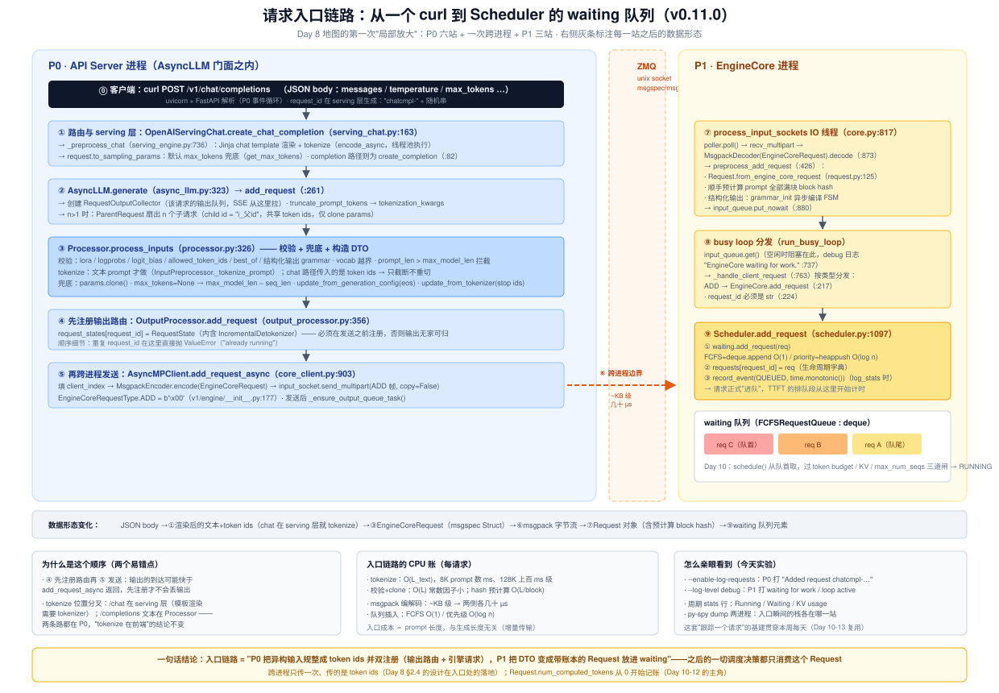
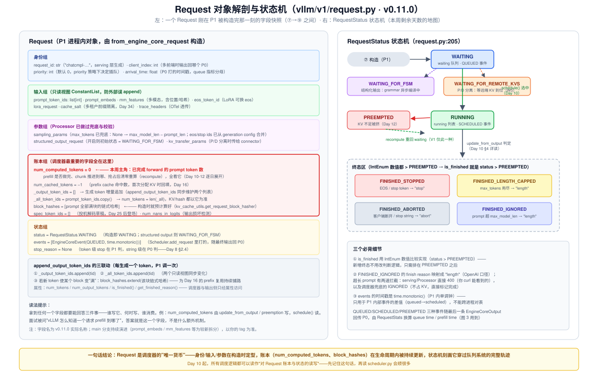
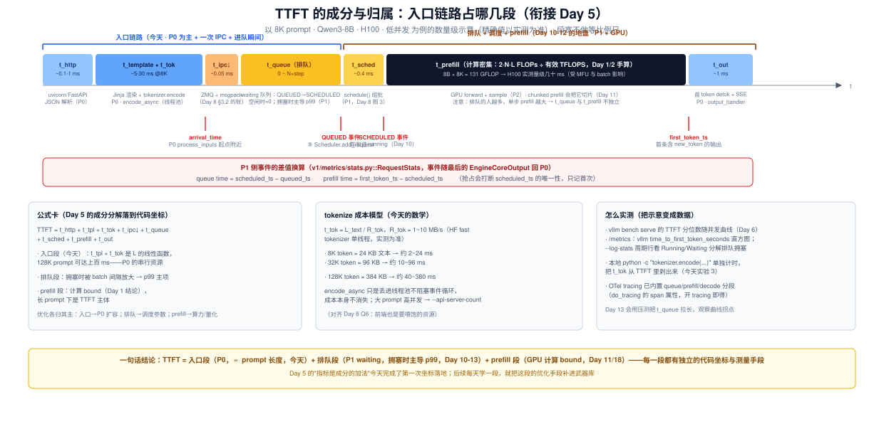

# Day 9 · 请求入口链路：从一个 curl 到 Scheduler 的 waiting 队列

> **系列**：推理系统优化专家岗 · 56 天打卡 | 第 2 周「vLLM V1 源码精读（上）—— 调度链路」
> **今日位置**：昨天（Day 8）立好了 V1 的三层地图（P0 前端 / P1 EngineCore / P2 Worker）并数清了进程，今天走**第一条完整路径**：`POST /v1/chat/completions` → serving 层 → `AsyncLLM` → `Processor`（tokenize 与校验）→ `EngineCoreRequest` 跨进程 → `EngineCore`/`Scheduler.add_request` 落进 waiting 队列。入口链路是"每来一个请求都要付一次的固定成本"，它决定 TTFT 的下限成分，也是本周剩余五天（Day 10-13 调度器 + Day 14 复盘）的**请求视角起点**
> **前置要求**：Day 8（进程架构图、ZMQ 两条通道、`EngineCoreRequest`/`EngineCoreOutputs` DTO 表——今天全部要落地到代码行）、Day 5（TTFT 成分分解——今天把每个成分钉到代码坐标）、Day 6（Qwen3-8B 部署台账与 `/metrics`）、Day 4（block hash 的概念——今天会在 `Request` 构造里提前遇到它的真身）
> **预计用时**：3 ~ 3.5 小时（源码走读 1.5h + 实验 1h + 笔记与对账 0.5~1h）
> **背景衔接**：你在昇腾上写过 Host 侧任务下发——`aclmdlExecute` 之前要把输入 tensor 准备好、校验 shape、再进任务队列等 stream 调度。vLLM 的入口链路是同一命题的软件版：**serving 层 = 协议适配**（把 OpenAI JSON 变成模型能吃的 token ids），**Processor = 入参规整与兜底**（校验 + 默认值，相当于驱动层的参数合法性检查），**Scheduler.add_request = 入队即记账**（QUEUED 事件就是队列系统的时间戳起点）。区别在于：这套逻辑全部运行在用户态 Python 里、每个请求都要走一遍，所以它的成本模型（§3）值得手算
> **实验环境**：复用 Day 6 的 1 × H100/A100 + Qwen3-8B（`--gpu-memory-utilization 0.9 --max-model-len 8192`）；无 GPU 时做实验 0 + 实验 4B（纯源码与日志形态走读）
> **配套材料**：`week2/README.md` Day 9 节；三张 SVG：`assets/day09_request_entry_pipeline.svg`（今日主图：九站全链路）、`assets/day09_request_object_anatomy.svg`（Request 解剖 + 状态机）、`assets/day09_ttft_decomposition.svg`（TTFT 成分归属）
> **版本口径**：源码坐标按 **v0.11.0 tag** 逐行核对（2026-10 复核）；main 分支正在拆分 `processor.py`（input 预处理独立化）、API 入口迁往 `entrypoints/launchers/`——**坐标对不上先查版本**。本周实验"打日志跟踪一个请求"从今天建好，Day 10-13 每天复用

---

## 0. 今日学习目标

完成今天的学习后，你应该能够：

- [ ] **默写入口链路的九站**：`create_chat_completion` → `_preprocess_chat`（chat template + tokenize）→ `AsyncLLM.add_request` → `Processor.process_inputs` → `OutputProcessor.add_request`（注册）→ `AsyncMPClient.add_request_async`（跨进程）→ `process_input_sockets`（解码）→ `EngineCore.add_request` → `Scheduler.add_request`——每站能报出**文件名与职责一句话**
- [ ] 说清 **tokenize 到底发生在哪**：为什么 `/v1/chat/completions` 在 serving 层就 tokenize 了，而 `/v1/completions` 的文本 prompt 要等到 `Processor`——以及为什么两者都仍然是"P0 前端 tokenize"这个大结论
- [ ] **解剖 `Request` 对象**：六个字段组（身份/输入/参数/账本/状态/多模态）各自的作用，特别是 `num_computed_tokens`（调度器最重要的账本，Day 10-12 的主角）和构造时就预计算好的 `block_hashes`
- [ ] 画出 **`RequestStatus` 状态机**：WAITING → RUNNING → 终态区，含 `WAITING_FOR_FSM`、`PREEMPTED` 两个旁路；解释 `is_finished = status > PREEMPTED` 这个 IntEnum 技巧
- [ ] 讲清**注册与发送的顺序**（先 `OutputProcessor.add_request` 再跨进程发送）以及 **QUEUED/SCHEDULED 事件**如何支撑 queue time 的测量（TTFT 分解的落地）
- [ ] 建好**"日志跟踪一个请求"的实验基建**（`--enable-log-requests` + debug 日志 + py-spy + token 对账）——本周每天都会用
- [ ] 交付：一页**请求生命周期走读笔记**（调用栈 + 日志证据链 + 在 Day 8 架构图上标注入口数据流）

---

## 1. 核心概念速览

| 概念 | 一句话定义 | 今日要达到的深度 |
|---|---|---|
| **`OpenAIServingChat`** | `/v1/chat/completions` 的协议层（`entrypoints/openai/serving_chat.py`） | 读过 `create_chat_completion` 主干：校验 → 预处理 → `engine_client.generate` |
| **`_preprocess_chat`** | serving 层的输入预处理（`serving_engine.py`）：渲染 chat template + tokenize | 知道 chat 路径的 tokenize 在这里、走 `encode_async` 线程池 |
| **`request_id`** | 请求全局唯一 id，**serving 层生成**（`chatcmpl-` / `cmpl-` 前缀） | 知道它是后续所有路由（`requests` 字典、`request_states`）的 key |
| **`AsyncLLM.add_request`** | 前端门面的入口方法（`v1/engine/async_llm.py`） | 背下三步曲：collector → `process_inputs` → 双注册 |
| **`RequestOutputCollector`** | 每请求一个的输出队列（P0 内），SSE 从这里拉 | 理解它是"输出路由"的终点，与 `request_states` 配对 |
| **`Processor.process_inputs`** | 校验 + tokenize（文本路径）+ 兜底 + 构造 `EngineCoreRequest`（`v1/engine/processor.py`） | 能列出校验清单与三个兜底动作（§2.5） |
| **`InputPreprocessor`** | 真正做 tokenize 的组件（`inputs/preprocess.py`），区分 text/tokens/embeds/multimodal | 知道 `prompt["type"] == "tokens"` 时只截断不重切 |
| **`EngineCoreRequest`** | 跨进程 DTO（msgspec.Struct，`v1/engine/__init__.py`） | 讲清 `array_like/omit_defaults/gc=False` 三个标志（§2.6） |
| **`AsyncMPClient`** | 前端侧 ZMQ 客户端（`v1/engine/core_client.py`） | 走读 `add_request_async` → `send_multipart` |
| **`process_input_sockets`** | P1 的输入 IO 线程（`core.py`）：poll + 解码 + 入队 | 知道 decode 之后、入队之前还做了 `preprocess_add_request` |
| **`Request.from_engine_core_request`** | DTO → P1 内部对象的转换（`v1/request.py`） | 知道 block hash 预计算在这里发生（Day 16 伏笔） |
| **`Scheduler.add_request`** | 请求正式进队：`waiting` + `requests` 字典 + QUEUED 事件（`v1/core/sched/scheduler.py`） | 背下三行动作；区分 FCFS/priority 两种队列实现 |
| **`RequestStatus`** | 请求状态机（IntEnum）：WAITING/RUNNING/PREEMPTED/终态×4 | 能画图 2 右侧；理解 `status > PREEMPTED` |
| **`num_computed_tokens`** | "已完成 forward 的 token 数"账本 | 知道初始为 0、谁读谁写（Day 10-12 展开） |
| **`EngineCoreEventType`** | QUEUED / SCHEDULED / PREEMPTED 三种带单调时间戳的事件 | 知道它如何换算成 queue time（图 3） |

> **一句话本质**：入口链路 = **P0 把异构输入（chat JSON / 文本 / token ids / 多模态）规整成 token ids 并做双注册（输出路由 + 引擎请求），P1 把 DTO 变成带账本的 `Request` 放进 waiting 队列**。跨进程只传一次、传的是 token ids（Day 8 §2.4 的设计在入口处的落地）；此后调度器的一切决策都只消费这个 `Request` 对象。

---

## 2. 原理深入讲解

### 2.1 回顾 Day 8：今天放大地图的哪一段

Day 8 立了三层进程地图，并给本周排了分工。今天起逐格开盒：

| Day | 放大哪一块 | 状态 |
|---|---|---|
| Day 8 | 整张地图（进程/通道/DTO） | ✅ 已完成 |
| **Day 9（今天）** | **P0 入口六站 + 跨进程一次 + P1 入队三站** | ▶ |
| Day 10-12 | P1 的 `Scheduler.schedule()`（队列/budget、chunked prefill、preemption） | 待 |
| Day 13 | 用压测验证调度行为（复用今天的日志基建） | 待 |
| Day 14（复盘） | 请求在 scheduler 中的状态机（今天图 2 的右侧会长大） | 待 |

一个提前的提醒：今天的链路**全在 CPU 上**、每个请求只走一遍，所以它不出现在 TPOT 里（decode 的每步成本里没有 tokenize），只出现在 **TTFT 的固定成分**里。读的时候心里带着两个问题：① 这一站做的事，放 P0 还是 P1，为什么？② 这一站的成本是 prompt 长度的什么函数？

### 2.2 全链路总览（今日主图）



对照上图，把九站串成一句话版（**先能指图讲 60 秒，再进细节**）：

> 客户端 POST 进来（⓪），serving 层校验并预处理（①：chat template 渲染 + tokenize + 默认参数兜底），`AsyncLLM.add_request` 创建该请求的输出队列（②），`Processor.process_inputs` 做最终校验、构造 `EngineCoreRequest`（③），**先**在 `OutputProcessor` 注册输出路由（④），**再**通过 ZMQ 把 DTO 发给 EngineCore（⑤⑥）。P1 的 IO 线程解码并构造 `Request` 对象（⑦，顺手预计算 block hash），busy loop 分发到 `EngineCore.add_request`（⑧），最终 `Scheduler.add_request` 把它放进 waiting 队列并打下 QUEUED 时间戳（⑨）——请求从此进入调度系统的管辖。

两个贯穿今天的问题，先给答案、后给论据：

1. **tokenize 在哪发生？** 分三种情况，但**都在 P0**（§2.3）。
2. **为什么"先注册、后发送"？** 输出的到达可能快于 `add_request_async` 的返回（send 是异步的、引擎 step 可能立刻带回首 token）；先注册才能保证输出有家可归（§2.4）。

### 2.3 第 ① 站：HTTP 与 serving 层——tokenize 其实发生在这里

**路由与协议适配**。`POST /v1/chat/completions` 由 FastAPI 路由（`entrypoints/openai/api_server.py`）转给 `OpenAIServingChat.create_chat_completion`（`serving_chat.py:163`）。这一层做四件事：

1. `_check_model` / 工具参数校验等协议级检查；
2. **`_preprocess_chat`（`serving_engine.py:736`）**：用 Jinja chat template 把 `messages` 渲染成一条文本 prompt（`apply_hf_chat_template`，来自 `chat_utils.py`），然后**立刻 tokenize**（`_tokenize_prompt_input_async` → `_normalize_prompt_text_to_input`，内部经 `encode_async` 把 `tokenizer.encode` 丢进线程池，避免阻塞事件循环）；
3. 构造 `SamplingParams`：`request.to_sampling_params`，其中 `max_tokens` 未指定时由 `get_max_tokens` 按上下文长度兜底；
4. 生成 `request_id = "chatcmpl-" + <随机串>`（`serving_chat.py:266`；completions 路径是 `"cmpl-"` 前缀，`serving_completion.py:120`）——**这个 id 是之后一切路由的 key**。

**关键分叉（面试易错点）**：tokenize 的确切位置取决于入口形态：

| 入口 | tokenize 位置 | 原因 |
|---|---|---|
| `/v1/chat/completions` | **serving 层**（`_preprocess_chat`） | chat template 渲染本来就要 tokenizer；渲染完顺手切了，产出 `TextTokensPrompt(prompt, prompt_token_ids)` |
| `/v1/completions`（文本 prompt） | **Processor**（`InputPreprocessor._tokenize_prompt`，`preprocess.py:184`） | 协议层没有渲染步骤，文本原样传给引擎门面 |
| `/v1/completions`（`prompt_token_ids`）/ 离线 `TokensPrompt` | **不 tokenize** | 用户自带 token ids，`_process_tokens` 只做截断 |
| 多模态 | merged preprocessor（`mm_processor.apply`） | 图片/音频先过编码器预处理，再展开成 placeholder token |

**但大结论不变**：无论哪条路，tokenize 都发生在 **P0 前端进程**、发生在进 EngineCore 之前——Day 8 §2.4"跨进程传 token ids 不传文本"的前提，正是在这一站成立的。另外一个工程细节：`AsyncLLM.generate` 会把 `truncate_prompt_tokens` 翻译成 `tokenization_kwargs = {"truncation": True, "max_length": ...}` 传下去，截断方向由 `tokenizer.truncation_side` 决定（chat 模型多为 left——保住最近的对话）。

### 2.4 第 ②~④ 站：`AsyncLLM.add_request` 三步曲与"双注册"

`AsyncLLM.generate`（`async_llm.py:323`）是 serving 层拿到的生成器入口，它自己只做三件小事：首次调用时启动常驻 `output_handler` 协程（Day 8 §4.1）、处理 truncate 参数、然后调 `add_request` 并把队列里的 `RequestOutput` 逐个 yield 出去（SSE 的数据源）。真正的人口是 `add_request`（`async_llm.py:261`）：

```text
add_request(request_id, prompt, params, ...)
  ├─ errored 检查（引擎已死则 EngineDeadError——Day 8 崩溃隔离的前半句）
  ├─ ① queue = RequestOutputCollector(output_kind)     # 本请求专属输出队列
  ├─ ② prompt_str, req = processor.process_inputs(...)  # 校验 + tokenize + 构造 DTO
  ├─ ③ n == 1 → _add_request(req, prompt_str, None, 0, queue)
  │        n > 1 → ParentRequest 扇出 n 个子请求        # parallel_sampling.py
  │                 （child id = "i_父id"，共享 token ids，只 clone params/seed）
  └─ return queue                                        # generate() 从这里拉输出
```

`_add_request`（`async_llm.py:303`）只有两行核心，但**顺序是考点**：

```python
self.output_processor.add_request(request, prompt_str, ...)  # ① 先注册输出路由
await self.engine_core.add_request_async(request)            # ② 再发给引擎
```

为什么顺序不能反：`add_request_async` 里 `send_multipart` 是异步投递，P1 可能在极短时间内就通过上行通道送回首 token（尤其 prompt 全部 prefix cache 命中时，prefill 几乎为零）。如果输出先到而路由未注册，`output_handler` 在 `request_states` 里查不到这个 id，输出就被丢弃了。**"消费者先就位，再触发生产"**——这是所有异步系统接入新消费者的通用时序纪律（你在高并发服务里注册回调 before subscribe，是同一个道理）。

注册的内容也值得看一眼（`output_processor.py:356`）：`request_states[request_id] = RequestState.from_new_request(...)`——`RequestState` 是 P0 侧的请求影子，内含 `IncrementalDetokenizer`（增量反 tokenize，Day 8 提过 stop string 在这里判）。同时它会查重：同一个 `request_id` 二次进队直接 `ValueError("already running")`。

> **n > 1 扇出补充**（`parallel_sampling.py`）：`ParentRequest` 在 P0 把一个 `n=4` 的请求拆成 4 个独立子请求（id 形如 `0_chatcmpl-xxx`），共享同一份 `prompt_token_ids`（对象级复用，不复制大列表），每个子请求有独立采样参数（seed 不同时各自 clone）。子请求对引擎来说完全平等——**引擎层面没有"一个请求的 n 路输出"这个概念**，聚合（非流式时合并 n 份结果）由 P0 的 `ParentRequest` 完成。这是"复杂度放前端、引擎保持简单"设计哲学的又一个例子。

### 2.5 第 ③ 站：`Processor.process_inputs`——校验清单与三个兜底

`Processor`（`v1/engine/processor.py`）是引擎门面里最厚的一块，`process_inputs`（:326）的骨架可以读成"**校验 → tokenize → 兜底 → 组装**"四段：

**（a）校验清单**（失败即抛 `ValueError`，serving 层捕获后返回 400）：

| 校验 | 位置 | 拦下什么 |
|---|---|---|
| LoRA 合法性（未启用却带 lora_request） | `_validate_lora` :205 | 配置错误 |
| structured output 的 grammar 预校验（xgrammar/guidance/outlines/lm-format-enforcer，auto 则先 xgrammar 后降级 guidance） | `_validate_structured_output` :222 | 非法 schema；顺便把后端选择写回 params |
| `logprobs`/`prompt_logprobs` ≤ `max_logprobs` | `_validate_logprobs` :66 | 防内存放大 |
| `logit_bias` 的 token id 在 vocab 内 | `_validate_logit_bias` :114 | 越界 id |
| `allowed_token_ids` 非空且在 vocab 内 | `_validate_sampling_params` :94 | 越界 id |
| V1 不支持的参数：`best_of > 1`、用户 `logits_processors` | `_validate_supported_sampling_params` :134 | 明确报错而不是静默忽略 |
| token id ≤ max(tokenizer.max_token_id, vocab−1) | `_validate_model_input` :468 | OOV token（注意 Qwen3 词表与 tokenizer 不严格相等的坑，源码注释里专门写了） |
| `prompt_len ≤ max_model_len` | 同上 :511 | 超长 prompt（多模态有专门的提示文案） |
| DP rank 范围 | :343 | 路由到不存在的 DP rank |

**（b）tokenize**：`input_preprocessor.preprocess(prompt, ...)`（`inputs/preprocess.py`）按 prompt 类型分派——chat 路径传进来的已经是 token ids（`_process_tokens`，只截断），文本才真正 `tokenizer.encode`（`_tokenize_prompt` :184）。多模态走 merged processor 展开占位 token。**硬件插件也在这里有一票否决权**：`current_platform.validate_request(...)`（:382）——昇腾等平台可以在这里拒绝自己不支持的请求形态（W6 的接口伏笔）。

**（c）三个兜底动作**（params 的"最后修饰"，全在 :405-419）：

1. `sampling_params = params.clone()`——**拷贝而非原地改**（请求参数不回写用户对象；注释还提醒多进程场景避免共享）；
2. `max_tokens is None` → `max_model_len − seq_len`（生成上限默认吃到上下文尽头）；
3. `update_from_generation_config(generation_config_fields, eos_token_id)` + `update_from_tokenizer(tokenizer)`——把模型自带的 generation config（如 eos_token_id、重复惩罚类默认值）与 tokenizer 的 stop token 合并进采样参数。**EOS 的最终口径在这里定型**，之后 P1 只认 `request.eos_token_id`。

**（d）组装**：返回 `(prompt_str, EngineCoreRequest(...))`。注意它**返回的是 DTO 而不是 `Request`**——真正的 `Request` 对象在 P1 才构造（§2.7），P0 从头到尾不知道 `Request` 的存在。这个"两端各有一个请求对象"的结构（P0 的 `RequestState` + P1 的 `Request`）是进程边界的自然结果，读代码时别把两者混为一谈。

### 2.6 第 ⑤⑥ 站：跨进程——msgspec 序列化与 ZMQ 发送

`AsyncMPClient.add_request_async`（`core_client.py:903`）是 P0 侧的最后一站：

```python
async def add_request_async(self, request: EngineCoreRequest) -> None:
    request.client_index = self.client_index           # 标记输出发回哪个前端
    await self._send_input(EngineCoreRequestType.ADD, request)   # b'\x00'
    self._ensure_output_queue_task()
```

`_send_input`（:849）→ `self.encoder.encode(request)`（msgspec MsgpackEncoder）→ `input_socket.send_multipart(msg, copy=False)`（:859）。三个值得记住的细节：

1. **`EngineCoreRequest` 的三个 msgspec 标志**（`v1/engine/__init__.py:43`）：
   - `array_like=True`——按位置编码为数组而非字典，省掉字段名重复传输（8K token 的请求，payload 主要是 token ids 数组）；
   - `omit_defaults=True`——默认值字段不传（绝大多数请求没有 LoRA/多模态/DP rank）；
   - `gc=False`——关掉 msgspec 逐字段的 GC 追踪，编解码更快（高频小对象的标准优化）。
   数量级：8K token 的请求 ≈ 8K × 1~2 B ≈ **10~20 KB**，msgpack 编解码两侧各几十 µs——Day 8 §3.2 "IPC 不是瓶颈"在请求维度的再现（且每请求只发生一次，比 step 级输出更低频）。
2. **`client_index`**：多前端（`--api-server-count` / DP 多 API）时，多个 P0 连着同一个 EngineCore；这个字段保证输出回送到"发来请求的那个前端"。单前端时恒为 0——但它解释了 `EngineCoreOutputs` 为什么按 client 分桶。
3. **`send_multipart` 的帧结构**：`(engine_identity, request_type, payload...)`——第一帧是 ZMQ ROUTER/DEALER 模式的路由信封，第二帧就是 `EngineCoreRequestType.ADD = b'\x00'`（用单字节枚举省一次编码，`v1/engine/__init__.py:177`）。

### 2.7 第 ⑦~⑨ 站：P1 侧接收——IO 线程、busy loop、Scheduler 入队

**⑦ `process_input_sockets`（IO 线程，`core.py:817`）**。P1 不是在主循环里收 ZMQ，而是专门起了线程：`zmq.Poller` 上阻塞等待 → `recv_multipart` → 按 type 帧分派解码（`MsgpackDecoder(EngineCoreRequest).decode`，:873）→ **`preprocess_add_request`（:426）** → `input_queue.put_nowait`（:880）。`preprocess_add_request` 做三件事：

1. `Request.from_engine_core_request(request, self.request_block_hasher)`（`request.py:125`）——DTO 变身，**同时预计算 prompt 全部满块的链式 block hash**（`get_request_block_hasher`，`kv_cache_utils.py:576`：只 hash 满 block，hash = H(父hash, 本块 token ids, extra_keys)，extra_keys 携带多模态/LoRA 标识）。注意这个计算在 **IO 线程**做——与主循环的 step 并行，注释明确说"request initialization running in parallel with Model forward"。8K prompt / block 16 = 512 次哈希，亚毫秒级，但放对位置就不会挤占调度节奏（Day 16 会看到这些 hash 的用途：prefix cache 查表的 key）。
2. 结构化输出请求：`structured_output_manager.grammar_init(req)`——**异步编译** FSM，期间请求状态是 `WAITING_FOR_FSM`，编译完才可被调度（这就是状态机里那个旁路的来历）。
3. 返回 `(req, current_wave)`——wave 是 DP 场景的代际标记，单机版可以忽略。

**⑧ busy loop 分发（`core.py:763`）**。主循环 `run_busy_loop` 阻塞在 `input_queue.get()`（空闲时 debug 日志会打 `"EngineCore waiting for work."`，:737——今天实验用它确认"请求到达瞬间"）；拿到消息后 `_handle_client_request` 按 type 分派：ADD → `EngineCore.add_request`（:217）。`EngineCore.add_request` 只做三个轻量检查（`request_id` 必须是 str、pooling 任务受支持、`kv_transfer_params` 有没有 connector 配套）然后直通 `scheduler.add_request(request)`（:243）——**EngineCore 自己不存任何请求状态**，它是"流程协调者"而非"数据持有者"。

**⑨ `Scheduler.add_request`（`scheduler.py:1097`）**——今天的终点站，三行动作：

```python
def add_request(self, request: Request) -> None:
    self.waiting.add_request(request)                    # ① 进 waiting 队列
    self.requests[request.request_id] = request          # ② 生命周期字典
    if self.log_stats:
        request.record_event(EngineCoreEventType.QUEUED) # ③ 打时间戳
```

- ① `waiting` 由 `create_request_queue(self.policy)` 构造（:125）：`fcfs` → `FCFSRequestQueue`（本质是 `deque`，`add_request` = `append`，O(1)；`request_queue.py`）；`priority` → 堆实现（按 `(-priority, arrival_time)` 排序，O(log n)）。**Day 10 会看到 `peek/pop/prepend` 这套抽象是为 preemption 的"塞回队首"准备的**。
- ② `requests: dict[str, Request]` 是全生命周期索引：abort/finish 时从这里 O(1) 定位请求。
- ③ QUEUED 事件用 `time.monotonic()` 打点（P1 单调钟），**随该请求最后一条 `EngineCoreOutput` 回传 P0**（`update_from_output` 里 `take_events()`，`scheduler.py:972`），P0 的 `RequestStats` 用它算 queue time（§2.9）。注意 `log_stats=False` 时事件不记录——省开销与可观测性的开关。

到这里，请求完成了从 JSON 到 `waiting` 队列元素的完整旅程。**它还没消耗任何 GPU**——第一次 GPU 接触发生在下一次 `schedule()` 把它选进 running（Day 10）。

### 2.8 `Request` 对象解剖（图 2）



P1 的 `Request`（`v1/request.py:26`）是调度器的"唯一货币"。按图 2 左侧的分组过一遍（**记忆锚点：谁写它、何时写、谁消费**）：

**账本组**（红框，本周主角）：

- `num_computed_tokens`：已完成 forward 的 prompt token 数。构造时 0；`update_from_output` 每个 step 推进；被抢占（recompute 模式）时**清零**（Day 12）。`schedule()` 用它判断 prefill 是否完成、chunk 推进到哪。**面试一句话：vLLM 怎么知道一个请求 prefill 到哪了？就这一个字段。**
- `num_cached_tokens`：prefix cache 命中的 token 数，初始 −1（= 未知），首次分配 KV 时回填（Day 16）。
- `_output_token_ids` / `_all_token_ids`：输出与全量 token 列表（后者 = prompt + 输出）。对外只暴露 `ConstantList` 只读视图（`output_token_ids` / `all_token_ids`），**防止绕过 `append_output_token_ids` 直接 append 导致两列表失同步**——这是"用类型系统维护不变量"的小而美的例子。
- `block_hashes`：**构造时就预计算好 prompt 全部满块的链式哈希**（§2.7），每生成满一个新块就增量追加（`append_output_token_ids` :150-162 的三联动）。
- `spec_token_ids`：投机解码草稿 token（Day 25 后登场，先占位）。

**状态组**：`status`（构造即 `WAITING`；结构化输出则 `WAITING_FOR_FSM`）与 `events`（QUEUED 已在包里）。右侧状态机的两个技巧：① `RequestStatus` 是 `IntEnum`，终态全部排在 `PREEMPTED` 之后，于是 `is_finished(status) = status > RequestStatus.PREEMPTED` 一行搞定（新增终态零改动）；② `FINISHED_IGNORED`（prompt 超长被忽略）映射的 finish reason 是 **"length"**——对齐 OpenAI 口径（源码注释明说）。

**输入/身份/参数组**：见 Day 8 §2.6 的"统一构造签名"哲学——`Request` 不区分模型类型，多模态/LoRA/P/D 都是以"可选字段 + extra"的方式挂上来（`mm_features`、`lora_request`、`kv_transfer_params`、`cache_salt`）。

> **易混点（再次强调）**：`Request`（P1，调度视角）vs `RequestState`（P0，输出视角）vs `EngineCoreRequest`（跨进程 DTO）vs `ChatCompletionRequest`（HTTP 协议对象）。四个"请求"各守一段边界，同名不同命——面试时能主动区分这四者，是"真读过源码"的信号。

### 2.9 TTFT 视角：入口链路占哪几段（图 3）



把 Day 5 的 TTFT 成分分解钉到今天的代码坐标上（图 3 上半部）：

$$TTFT = \underbrace{t_{http}}_{\text{uvicorn}} + \underbrace{t_{tpl} + t_{tok}}_{\text{① preprocess\_chat}} + \underbrace{t_{ipc\downarrow}}_{\text{⑤⑥ ZMQ}} + \underbrace{t_{queue}}_{\text{⑨→Day10}} + \underbrace{t_{sched}}_{\text{P1}} + \underbrace{t_{prefill}}_{\text{GPU}} + \underbrace{t_{out}}_{\text{P0 detok+SSE}}$$

三个结构性观察：

1. **入口段是"固定成本 + prompt 长度的线性函数"**：`t_tpl + t_tok ∝ L`。8K prompt 数 ms；128K prompt 上百 ms（§3.1 手算）——在长上下文场景，这部分会大到不能忽略，且它吃的是 **P0 的 CPU**（`encode_async` 进线程池只是不阻塞事件循环，成本本身不消失）。这就解释了 Day 8 Q6 的第三条原则："前端也要喂饱"。
2. **排队段是 TTFT p99 的 usual suspect**：$t_{queue} = scheduled\_ts - queued\_ts$，空闲时 ≈ 0，拥塞时被 batch 间隔逐 step 放大。Day 13 会专门把它拉长做实验。
3. **事件时间戳是测量的基础设施**：`RequestStats`（`v1/metrics/stats.py:67-69`）的 `queued_ts / scheduled_ts / first_token_ts` 全部来自 `EngineCoreEvent`（QUEUED/SCHEDULED）与输出时间戳；OTel tracing 的 `queue_time / prefill_time` span 属性（`output_processor.py::do_tracing`）就是它们的差值。**今天在 ⑨ 打下的那个 QUEUED 时间戳，是整个排队可观测性的起点。**

---

## 3. 性能模型：入口链路的成本账（今日的数学）

### 3.1 tokenize 成本模型

HF fast tokenizer（Rust 后端）单线程吞吐量级（以实测为准）：

$$t_{tok} \approx \frac{L_{text}}{R_{tok}}, \quad R_{tok} \sim 1\text{~}10\ \text{MB/s}$$

代入 Qwen3 tokenizer（中文约 1.5~2 字符/token，UTF-8 每汉字 3 B）：

| prompt 规模 | 文本字节（约） | t_tok 量级 | 占 TTFT 的份额（prefill 几十 ms 口径） |
|---|---|---|---|
| 8K token | ~24 KB | 2 ~ 24 ms | 5%~30% |
| 32K token | ~96 KB | 10 ~ 96 ms | 与 prefill 同量级 |
| 128K token | ~384 KB | 40 ~ 380 ms | **可能超过 prefill 成为第一大头** |

三个推论：① 长上下文 + 高并发时，tokenize 是 P0 的串行资源，`--api-server-count` 加前端进程是正解（Day 8 进程公式里 A 的由来）；② chat template 渲染（Jinja，纯 Python）与 tokenize 同量级甚至更慢，两者都在 ① 站；③ 给客户端发 token ids（`prompt_token_ids` 直传）可以把这段整体跳过——这就是为什么做 benchmark 或内部服务时"能传 ids 就别传文本"。

### 3.2 入口链路的每请求 CPU 账（复杂度表）

| 站点 | 操作 | 复杂度 | 量级（8K prompt） |
|---|---|---|---|
| ① | chat template 渲染 + tokenize | O(L) | 数 ms（§3.1） |
| ③ | 校验（OOV 扫描 max(prompt_ids) 等）+ params.clone | O(L) + O(1) | 数十 µs |
| ⑤ | msgpack encode | O(L) 字节 | 几十 µs（10~20 KB） |
| ⑥ | ZMQ send + P1 唤醒 | O(1) | 几十 µs |
| ⑦ | msgpack decode + Request 构造 + **block hash 预计算** | O(L) | 几十 µs + 亚 ms |
| ⑨ | 队列插入 + 字典插入 + QUEUED 事件 | O(1) / O(log n) | µs 级 |

**总结论**：入口成本 ≈ Θ(L) 且常数不小（tokenize 主导），**与生成长度完全无关**——因为上行输出是增量的（Day 8 §2.4）。一个 8K-in/2K-out 和 8K-in/2-token 的请求，入口成本相同。这也是"入口成本进 TTFT、不进 TPOT"的数学表述。

顺带一提 block hash 预计算的账：$N_{hash} = \lfloor L / block\_size \rfloor$（8K/16 = 512 次），每次对一个 (父 hash, 16 个 token, extra) 元组做哈希，链式依赖（子块哈希含父块哈希）——不可并行但每次极快，整体亚毫秒。放 IO 线程做是"用不在关键路径的核换主循环的干净"（呼应 Day 8 §3.3 的 CPU 段优化思路：移出或藏进阴影）。

### 3.3 队列插入：FCFS vs priority

`FCFSRequestQueue.add_request` = `deque.append`——均摊 O(1)，缓存友好。`priority` 策略换堆：`heappush` O(log n)，键是 `(-priority, arrival_time)`（同优先级回到 FCFS）。什么时候值得为 O(log n) 付费：请求方有明显 VIP 分级时。注意 **V1 的 priority 是"入队优先级"不是"抢占优先级"**——已经 running 的请求不会被高优先级新请求挤掉（那是 preemption 的领地，Day 12），这个区分面试常考。

### 3.4 一个练手的对账题（答案自测 §8 Q6）

> 100 并发、每个 8K prompt 的请求同时打到 Day 6 的单卡服务上，入口段总共要付多少 P0 CPU 时间？

t_entry ≈ (t_tpl + t_tok + t_validate + t_encode) ≈ 每请求 ~5~30 ms → 100 个 ≈ **0.5 ~ 3 s 的 P0 CPU 总量**。它们分布在 asyncio 事件循环 + tokenize 线程池上：如果 P0 只有单核可用，排队本身就可能把 TTFT 抬高数十 ms 量级——**TTFT 的拥塞不只在 P1 的 waiting 队列，也可能在 P0 的入口**。诊断方法：py-spy 看 P0 栈分布（今天实验 2），或对比"传 ids"与"传文本"两种压测的 TTFT 差。

---

## 4. 关键代码走读（v0.11.0 逐行核对版）

> **阅读方法**：拿图 1 从上往下走。以下均为**节选**（主干保真、删减分支），行号以 v0.11.0 为准；版本不同以你本地 `site-packages/vllm/` 为准。

### 4.1 serving 层入口（`vllm/entrypoints/openai/serving_chat.py`）

```python
async def create_chat_completion(self, request, raw_request=None):
    error_check_ret = await self._check_model(request)          # 协议级校验
    if error_check_ret is not None: return error_check_ret
    if self.engine_client.errored:                              # 引擎已死提前失败
        raise self.engine_client.dead_error
    ...
    # 常见路径：渲染 + tokenize 都在这里完成
    (conversation, request_prompts, engine_prompts) = await self._preprocess_chat(
        request, tokenizer, messages, request.chat_template, ...)   # ← ①
    request_id = "chatcmpl-" + f"{self._base_request_id(raw_request, request.request_id)}"

    for i, engine_prompt in enumerate(engine_prompts):         # n>1 时有多个
        max_tokens = get_max_tokens(max_model_len=self.max_model_len,
                                    request=request, input_length=len(engine_prompt["prompt_token_ids"]), ...)
        sampling_params = request.to_sampling_params(...)      # 默认值兜底
        generator = self.engine_client.generate(               # ← ② AsyncLLM.generate
            engine_prompt, sampling_params, request_id=request_id, ...)
    # 流式：把 generator 交给 SSE；非流式：聚合后一次性返回
```

**读这段要抓的三件事**：① `engine_prompt` 是 `{"prompt": ..., "prompt_token_ids": [...]}`——**到达 `generate` 时已经切好 token**；② `request_id` 在这一层生成并贯穿全程；③ `create_error_response` 是所有校验失败的统一出口（HTTP 400）。

### 4.2 前端门面（`vllm/v1/engine/async_llm.py`）

```python
async def add_request(self, request_id, prompt, params, ...) -> RequestOutputCollector:
    if self.errored: raise EngineDeadError()
    queue = RequestOutputCollector(output_kind=params.output_kind)      # 输出队列
    prompt_str, request = self.processor.process_inputs(                # ③ 校验+tokenize+DTO
        request_id, prompt, params, arrival_time, lora_request, ...)
    if is_pooling or params.n == 1:
        await self._add_request(request, prompt_str, None, 0, queue)
        return queue
    parent_request = ParentRequest(request_id, params)                  # n>1 扇出
    for idx in range(params.n):
        request_id, params = parent_request.get_child_info(idx)         # child id = "i_父id"
        child_request = request if idx == params.n - 1 else copy(request)
        await self._add_request(child_request, prompt_str, parent_request, idx, queue)
    return queue

async def _add_request(self, request, prompt, parent_req, index, queue):
    self.output_processor.add_request(request, prompt, parent_req, index, queue)  # ④ 先注册
    await self.engine_core.add_request_async(request)                             # ⑤ 后发送
    if self.log_requests:
        logger.info("Added request %s.", request.request_id)                      # 实验观测点
```

### 4.3 Processor（`vllm/v1/engine/processor.py`，主干节选）

```python
def process_inputs(self, request_id, prompt, params, arrival_time=None, ...) \
        -> tuple[Optional[str], EngineCoreRequest]:
    self._validate_lora(lora_request)                 # 校验段开始
    self._validate_params(params)                     #   grammar/logprobs/logit_bias/allowed_ids/best_of
    if arrival_time is None: arrival_time = time.time()
    processed_inputs = self.input_preprocessor.preprocess(   # tokenize（或 tokens 直通）
        prompt, tokenization_kwargs=tokenization_kwargs, mm_uuids=mm_uuids)
    current_platform.validate_request(...)            # 硬件插件的否决权（昇腾等）
    eos_token_id = self.input_preprocessor.get_eos_token_id()
    encoder_inputs, decoder_inputs = split_enc_dec_inputs(processed_inputs)
    self._validate_model_inputs(encoder_inputs, decoder_inputs)   # OOV / 超长 / 空 prompt
    ...
    sampling_params = params.clone()                  # 兜底段开始
    if sampling_params.max_tokens is None:
        seq_len = length_from_prompt_token_ids_or_embeds(...)
        sampling_params.max_tokens = self.model_config.max_model_len - seq_len
    sampling_params.update_from_generation_config(self.generation_config_fields, eos_token_id)
    sampling_params.update_from_tokenizer(self.tokenizer)
    ...
    return prompt_str, EngineCoreRequest(             # 组装 DTO
        request_id=request_id, prompt_token_ids=prompt_token_ids,
        mm_features=mm_features, sampling_params=sampling_params,
        eos_token_id=eos_token_id, arrival_time=arrival_time,
        lora_request=lora_request, cache_salt=..., priority=priority, ...)
```

### 4.4 跨进程 DTO（`vllm/v1/engine/__init__.py`）

```python
class EngineCoreRequest(msgspec.Struct, array_like=True, omit_defaults=True, gc=False):
    request_id: str
    prompt_token_ids: Optional[list[int]]    # 跨进程的"正文"：token ids，不是文本
    mm_features: Optional[list[MultiModalFeatureSpec]]
    sampling_params: Optional[SamplingParams]
    pooling_params: Optional[PoolingParams]
    eos_token_id: Optional[int]
    arrival_time: float                      # P0 打的，queue 指标用它对表
    lora_request / cache_salt / data_parallel_rank
    prompt_embeds: Optional[torch.Tensor] = None
    client_index: int = 0                    # 输出回送到哪个前端
    current_wave: int = 0                    # DP 代际标记
    priority: int = 0
    trace_headers: Optional[Mapping[str, str]] = None

class EngineCoreRequestType(enum.Enum):     # 单字节类型标签，免编码直传
    ADD = b'\x00'; ABORT = b'\x01'
    START_DP_WAVE = b'\x02'; UTILITY = b'\x03'
```

### 4.5 P1 侧接收链（`vllm/v1/engine/core.py`）

```python
# IO 线程（EngineCoreProc.process_input_sockets，:817）
add_request_decoder = MsgpackDecoder(EngineCoreRequest)
while True:
    for input_socket, _ in poller.poll():
        type_frame, *data_frames = input_socket.recv_multipart(copy=False)
        request_type = EngineCoreRequestType(bytes(type_frame.buffer))
        if request_type == EngineCoreRequestType.ADD:
            request = add_request_decoder.decode(data_frames)      # bytes → DTO
            request = self.preprocess_add_request(request)         # DTO → Request（+hash 预计算）
        self.input_queue.put_nowait((request_type, request))       # 交给 busy loop

# busy loop 分发（:739 / :763）
req = self.input_queue.get()                 # 空闲时阻塞（"waiting for work."）
self._handle_client_request(*req)
    if request_type == ADD:
        req, request_wave = request
        self.add_request(req, request_wave)  # :217 → 校验 id 类型/pooling/kv_transfer
        ... → self.scheduler.add_request(request)                  # :243 直通

# preprocess_add_request（:426）——在 IO 线程并行做
req = Request.from_engine_core_request(request, self.request_block_hasher)
if req.use_structured_output:
    self.structured_output_manager.grammar_init(req)  # FSM 异步编译（WAITING_FOR_FSM）
return req, request.current_wave
```

### 4.6 `Request` 构造（`vllm/v1/request.py`，字段注释版）

```python
class Request:
    def __init__(self, request_id, prompt_token_ids, sampling_params, pooling_params,
                 eos_token_id, client_index=0, arrival_time=None, ..., block_hasher=None):
        self.status = RequestStatus.WAITING            # 构造即 WAITING
        if sampling_params.structured_outputs is not None:
            self.status = RequestStatus.WAITING_FOR_FSM  # 结构化输出旁路
        self.max_tokens = sampling_params.max_tokens   # Processor 已兜底，此处断言非空
        self._output_token_ids: list[int] = []         # 账本们
        self._all_token_ids = self.prompt_token_ids.copy()   # = prompt（拷贝！）
        self.num_computed_tokens = 0                   # ← 本周主角
        self.num_cached_tokens = -1                    # prefix 命中数，Day 16 回填
        self.output_token_ids = ConstantList(self._output_token_ids)   # 只读视图
        self.all_token_ids = ConstantList(self._all_token_ids)
        if block_hasher is not None:
            self.get_hash_new_full_blocks = partial(block_hasher, self)
            self.block_hashes = self.get_hash_new_full_blocks()  # prompt 满块哈希：现在就算

    def append_output_token_ids(self, token_ids):      # 每生成一个 token 调一次
        self._output_token_ids.append(...)             # ① 输出列表
        self._all_token_ids.append(...)                # ② 全量列表
        self.block_hashes.extend(self.get_hash_new_full_blocks())  # ③ 新满块哈希
```

### 4.7 调用链速查表（今日总账）

| # | 站点 | 函数 | 文件 | 进程 |
|---|---|---|---|---|
| ⓪ | HTTP | FastAPI 路由 → `create_chat_completion` | `entrypoints/openai/api_server.py` → `serving_chat.py:163` | P0 |
| ① | 预处理 | `_preprocess_chat` → `apply_hf_chat_template` + `encode_async` | `serving_engine.py:736` / `chat_utils.py` | P0 |
| ② | 门面 | `AsyncLLM.generate` / `add_request` | `v1/engine/async_llm.py:323/:261` | P0 |
| ③ | 规整 | `Processor.process_inputs` → `InputPreprocessor.preprocess` | `v1/engine/processor.py:326` / `inputs/preprocess.py` | P0 |
| ④ | 注册 | `OutputProcessor.add_request` → `RequestState` | `v1/engine/output_processor.py:356` | P0 |
| ⑤ | 发送 | `AsyncMPClient.add_request_async` → `_send_input` | `v1/engine/core_client.py:903/:849` | P0 |
| ⑥ | **边界** | ZMQ `send_multipart`（msgpack） | `core_client.py:859` | P0→P1 |
| ⑦ | 接收 | `process_input_sockets` → `preprocess_add_request` → `Request.from_engine_core_request` | `v1/engine/core.py:817/:426`、`v1/request.py:125` | P1（IO 线程） |
| ⑧ | 分发 | `run_busy_loop` → `_handle_client_request` → `EngineCore.add_request` | `v1/engine/core.py:739/:763/:217` | P1 |
| ⑨ | 入队 | `Scheduler.add_request`（waiting + requests + QUEUED） | `v1/core/sched/scheduler.py:1097` | P1 |

---

## 5. 动手实验（约 60~90 分钟）——"日志跟踪一个请求"基建日

> 按 README 的要求，今天起一个服务、打日志**贯穿跟踪一个请求**，这套观察方法本周每天复用。环境沿用 Day 6 台账（Qwen3-8B / `--gpu-memory-utilization 0.9` / `--max-model-len 8192`）。

### 实验 0（无 GPU 可做，5 min）：版本对齐

```bash
pip show vllm | head -3        # 记录版本，写进台账
python - <<'EOF'
import vllm, os
print(os.path.join(os.path.dirname(vllm.__file__), "v1", "engine", "processor.py"))
EOF
# 用编辑器打开上面打印的 processor.py，对照 §4.3 的行号（对不上 = 版本差异，正常，标注即可）
```

### 实验 1（必做，20 min）：日志证据链——九站里能看到几站？

```bash
# 终端 1：启动服务（相比 Day 6 多了两个开关）
vllm serve Qwen/Qwen3-8B --gpu-memory-utilization 0.9 --max-model-len 8192 \
  --enable-log-requests --log-level info
#   --enable-log-requests：P0 打 "Added request chatcmpl-…"（默认关；旧名 --disable-log-requests 已废弃）
#   注意：请求日志可能含敏感内容，生产环境慎开

# 终端 2：发一个请求（记录返回体里的 id 字段）
curl http://localhost:8000/v1/chat/completions -H "Content-Type: application/json" \
  -d '{"model":"Qwen/Qwen3-8B","messages":[{"role":"user","content":"用一句话介绍 vLLM"}],
       "max_tokens":32}' | python -m json.tool | grep -E '"id"|"prompt_tokens"|"completion_tokens"'
```

**检查点**（对照图 1 逐站打钩）：

- [ ] P0 日志：`Added request chatcmpl-xxxx.`（无进程前缀——它在 API 进程打的，Day 8 的前缀规则）
- [ ] 周期统计行（带 `(EngineCore_0 pid=…)` 前缀，措辞随版本）：`Avg prompt throughput / Running: n / Waiting: m / GPU KV cache usage`——**发出请求后的第一个周期行里 Waiting 或 Running 应该 +1 过又归位**
- [ ] 返回体的 `id` 与日志里的 `chatcmpl-` 完全一致（⓪ 站生成、⑨ 站做 key 的同一个字符串）
- [ ] `usage.prompt_tokens`：记下这个数，实验 3 对账用

**进阶（5 min）**：重启服务加 `--log-level debug`，再发一次请求，观察 `(EngineCore_0 …)` 的 `EngineCore waiting for work.` → `EngineCore loop active.` 翻转——这就是 §2.7 里 busy loop 空闲阻塞与唤醒的日志面（debug 级日志量大，看完就改回 info）。

### 实验 2（必做，20 min）：py-spy 抓"入口瞬间"的栈

```bash
pip install py-spy
# 终端 1：服务正常启动（info 级即可）
# 终端 2：制造一小串请求（10 个并发，每个 max_tokens=1，让入口工作集中出现）
for i in $(seq 1 10); do
  curl -s http://localhost:8000/v1/chat/completions -H "Content-Type: application/json" \
    -d '{"model":"Qwen/Qwen3-8B","messages":[{"role":"user","content":"第 '$i' 个请求：你好"}],"max_tokens":1}' &
done; wait

# 终端 3：趁请求在飞，连续抓栈（pid 来自 Day 8 实验 1 的台账）
py-spy dump --pid <API_server_pid>     # 多抓几次
#   预期能抓到：_tokenize_prompt_input_async / encode（tokenize 线程）
#               或 create_chat_completion / process_inputs（事件循环）
py-spy dump --pid <EngineCore_pid>
#   预期能抓到：process_input_sockets / preprocess_add_request（IO 线程）
#               或 add_request / schedule（主循环）
```

**产出**：2~4 张栈摘录，把每个栈帧标注到图 1 的对应站点上。**这是"九站从书面试成实测"的动作**——Day 8 你验证了进程结构，今天验证的是这些代码确实在跑请求的路上。技巧：并发 10 个、连续 dump，命中率不高但足够；抓不到也正常（ms 级窗口），抓到的每一帧都是证据。

### 实验 3（必做，15 min）：token 口径对账——把 ① 站的输出算出来

```bash
# 本地用同一个 tokenizer 复算 chat 路径的 prompt tokens
python - <<'EOF'
from transformers import AutoTokenizer
tok = AutoTokenizer.from_pretrained("Qwen/Qwen3-8B")
msgs = [{"role": "user", "content": "用一句话介绍 vLLM"}]
text = tok.apply_chat_template(msgs, tokenize=False, add_generation_prompt=True)
ids = tok.encode(text)
print("渲染后文本:", repr(text))
print("token 数:", len(ids))
EOF
# 与实验 1 的 usage.prompt_tokens 对账：应完全一致（chat 路径 = serving 层 tokenize 的直接证据）
```

再做一组对照（`/v1/completions`，文本在 ③ 站才 tokenize）：

```bash
curl http://localhost:8000/v1/completions -H "Content-Type: application/json" \
  -d '{"model":"Qwen/Qwen3-8B","prompt":"用一句话介绍 vLLM","max_tokens":4,"echo":false}' \
  | python -m json.tool | grep prompt_tokens
# 本地直接 tok.encode("用一句话介绍 vLLM") 对账——注意与 chat 路径差了模板 token（<|im_start|> 等），
# 这个差值就是 chat template 的贡献，也是 ① 站存在的理由
```

**进阶**：用 `%timeit` 给 `tok.encode` 计时（§3.1 的 R_tok 实测），把你的实测值填进图 3 的 tokenize 卡片。

### 实验 4（可选，15 min；无 GPU 做 B）

**A. n>1 扇出与请求家族**：开 `--enable-log-requests` 后发 `{"n": 3, ...}` 的请求，在日志里找 `Added request 0_chatcmpl-xxx` / `1_chatcmpl-xxx` / `2_chatcmpl-xxx`——ParentRequest 扇出的实证（§2.4）。

**B. 降级（纯源码）**：走读 `vllm/v1/core/sched/request_queue.py`（FCFS 与 priority 两个实现，注意 `prepend_request` 为何存在——Day 12 preemption 的伏笔），并在图 1 上用第三种颜色补画 abort 的反向路径（`AsyncLLM.abort` → `ABORT` 帧 → `finish_requests(FINISHED_ABORTED)`）。

### 实验 5（产出，20 min）：生命周期笔记 + 图标注

1. **一页请求生命周期走读笔记**：抄一遍 §4.7 速查表，在每行补一句"这一步发生了什么数据变化"（例：③ 站之后，数据从"文本或 ids"变成"完整的 EngineCoreRequest"）；
2. **在 Day 8 自己画的架构图上**用红笔描出今天的九站路径，标注两个新学到的细节（先注册后发送、QUEUED 时间戳）；
3. 对照本文图 1 自查补漏。

### 常见坑（方法论清单）

| # | 坑 | 后果 | 解法 |
|---|---|---|---|
| 1 | 把 `Request` / `RequestState` / `EngineCoreRequest` / `ChatCompletionRequest` 混为一谈 | 讲不清"请求在哪一层是什么形态" | §2.8 末的"四个请求"对照，写进笔记 |
| 2 | 以为 tokenize 在 EngineCore 里 | 解释不了 `usage.prompt_tokens` 与本地复算完全一致 | 分清 chat（serving 层）与 completions 文本（Processor）两条路，都在 P0 |
| 3 | `--enable-log-requests` 忘开，等半天没有 "Added request" | 以为链路走读失败 | 该开关 serving 默认关（`enable_log_requests=False`） |
| 4 | debug 日志开太久 | 日志洪水、磁盘暴涨 | 只在需要看 busy loop 翻转时短暂开 |
| 5 | py-spy 抓不到入口栈 | 以为方法错了 | ms 级窗口本来就难抓；加大并发、连续 dump；抓到一帧即算证据 |
| 6 | 旧版本坐标对不上（processor 拆分中） | 怀疑理解 | 实验 0 先记版本；Day 8 §2.7 演进表 |

---

## 6. 面试高频问题（含答题骨架）

**Q1：一个请求从 HTTP 到进入 waiting 队列，经历了什么？**（必考——要求能报出函数名）

> 骨架（九站，报五站以上即达标）：serving 层 `create_chat_completion` 做 chat template 渲染 + tokenize（chat 路径在 `_preprocess_chat` 就切好 token）→ `AsyncLLM.add_request` 创建输出队列 → `Processor.process_inputs` 做最终校验（OOV/超长/参数合法性）与兜底（max_tokens、eos 合并）构造 `EngineCoreRequest` → **先** `OutputProcessor.add_request` 注册输出路由、**再** `AsyncMPClient.add_request_async` 经 ZMQ/msgpack 发送 → P1 的 `process_input_sockets` IO 线程解码并构造 `Request`（预计算 block hash）→ busy loop → `EngineCore.add_request` → `Scheduler.add_request` 进 waiting、记 QUEUED 时间戳。**收尾**：全程 P0/P1 各一个请求对象（RequestState/Request），跨进程只传 token ids；此后第一个 GPU 接触要等 `schedule()`（Day 10）。

**Q2：tokenize 为什么放在前端进程？慢 tokenizer 会怎样？怎么扩容？**

> 骨架：① 引擎只消费 token ids，调度与 forward 不需要文本；tokenize 是重 CPU 的纯前端工作，放 P0 与引擎 step 循环隔离（GIL，Day 8 四宗罪之一）；② 成本 $t_{tok} ≈ L/R_{tok}$：8K 数 ms、128K 上百 ms，长上下文高并发下成为 P0 串行资源，抬 TTFT（且 encode_async 只是移入线程池，成本不消失）；③ 扩容手段：`--api-server-count` 水平加前端进程（进程公式里的 A）；客户端直传 `prompt_token_ids` 直接跳过。**收尾**：能现场算 3.1 的表是加分项——"前端也是要喂饱的资源"。

**Q3：`Request.num_computed_tokens` 是什么？谁更新、谁消费？**

> 骨架：① 已完成 forward 的 prompt token 数，构造时 0；② `update_from_output` 每步推进（prefill 完成时 = prompt 长度，之后 decode 阶段每步 +1），recompute 型抢占时**清零**（Day 12）；③ `schedule()` 消费它判断该请求本步还要算多少 token（chunked prefill 的推进游标，Day 11）。**收尾**：它是调度器最重要的账本——"vLLM 怎么知道 prefill 到哪了"的答案就这一个字段，没有别的机制。

**Q4：怎么测量一个请求的排队时间？**

> 骨架：① `Scheduler.add_request` 打 QUEUED 事件（`time.monotonic()`），首次进 running 打 SCHEDULED，事件随最后一条 `EngineCoreOutput` 回 P0；② P0 的 `RequestStats` 换算 `queue_time = scheduled_ts − queued_ts`、`prefill_time = first_token_ts − scheduled_ts`（OTel tracing 的 span 属性同源）；③ 聚合面：`/metrics` 的 TTFT 直方图 + `--log-stats` 的 Running/Waiting 行看拥塞。**收尾**：注意事件时间戳是 P1 单调钟，只做差值不做跨进程对表；抢占时只记首次 SCHEDULED。

**Q5：`EngineCoreRequest` 用 msgspec 序列化，`array_like/omit_defaults/gc=False` 各解决什么？**

> 骨架：① `array_like=True` 按位置编码省字段名（payload 主体是 token ids 数组）；② `omit_defaults=True` 默认值不传（多数请求没有 LoRA/多模态）；③ `gc=False` 关闭逐字段 GC 追踪，编解码更快；④ 量级：8K prompt ≈ 10~20 KB，两侧编解码各几十 µs，每请求仅一次——配合 Day 8 的 step 级账（~0.1 MB/step），IPC 全链路便宜到不构成不做进程隔离的理由。**收尾**：能对比 pickle/json 说明为什么选 msgpack（快、紧凑、安全——无任意代码执行）。

**Q6：为什么先注册输出路由、再发送请求？反过来会怎样？**

> 骨架：① send 是异步投递，引擎可能在 `add_request_async` 返回前就把首 token 送回来（极端：全量 prefix 命中，prefill≈0）；② 若 `request_states` 尚无此 id，`output_handler` 查不到就丢弃输出，请求表现为"永远无输出"；③ 这是异步系统的通用纪律——消费者先就位再触发生产（等价于"先 subscribe 再 publish"）。**收尾**：顺带能讲 `request_id` 查重（二次进队 ValueError）和 `client_index`（多前端路由）说明你对 P0 侧数据结构有整体感。

**Q7：prompt 超过 max_model_len 会发生什么？在哪一层被拦？**

> 骨架：① 两道防线：正常路径在 P0 的 `Processor._validate_model_input`（prompt_len > max_model_len 抛 ValueError → HTTP 400，带多模态专门提示）；② 若走到引擎（如直接构造请求），调度器把它标记 `FINISHED_IGNORED`、不分配 KV 直接完成，finish reason 映射为 "length" 对齐 OpenAI 口径；③ 与 `truncate_prompt_tokens` 的区别：后者主动左截断保最近的对话。**收尾**：这题考"错误路径你也读过"——生产上 400 的响应时间与排队无关（在入口就失败了）。

---

## 7. 今日总结

1. **九站链路**：serving 层（模板渲染 + tokenize）→ `AsyncLLM.add_request`（collector）→ `Processor.process_inputs`（校验+兜底+DTO）→ 先注册 `OutputProcessor` 再 ZMQ 发送 → P1 IO 线程解码构造 `Request`（预计算 block hash）→ busy loop → `Scheduler.add_request`（waiting + requests 字典 + QUEUED 事件）。
2. **tokenize 位置分叉但都在 P0**：chat 在 serving 层（模板渲染需要 tokenizer）、completions 文本在 Processor、token ids 直传则跳过——"跨进程传 ids 不传文本"的前提在入口成立。
3. **顺序纪律**：先注册输出路由再发送（异步系统"消费者先就位"）；`request_id` 在 serving 层生成，是两端两张路由表（`request_states` / `requests`）的共同 key。
4. **`Request` 是调度器的唯一货币**：身份/输入/参数构造时定型；账本组（`num_computed_tokens`、`block_hashes`、两个 token 列表）在生命周期内被持续更新；`append_output_token_ids` 的三联动维护不变量。
5. **状态机**：WAITING →（FSM/远端 KV 旁路）→ RUNNING ⇄ PREEMPTED → 终态区；`is_finished = status > PREEMPTED` 用 IntEnum 排序一行实现。
6. **成本账**：入口成本 Θ(L) 且 tokenize 主导（8K 数 ms、128K 上百 ms），与生成长度无关、不进 TPOT 只进 TTFT；FCFS 入队 O(1)、priority O(log n) 且只是入队优先级、不是抢占优先级。
7. **可观测性起点**：QUEUED 时间戳（⑨ 站）+ SCHEDULED（Day 10）+ first_token 支撑 queue/prefill 分解——今天的日志基建（`--enable-log-requests`、debug 翻转、py-spy、token 对账）本周每天复用。

---

## 8. 今日自测题（先自己做，再展开答案）

**Q1**：`/v1/chat/completions` 和 `/v1/completions`（文本 prompt）分别在哪个函数里 tokenize？这个差异为什么不影响"tokenize 在前端进程"的大结论？

<details><summary>参考答案</summary>

chat 路径在 serving 层的 `OpenAIServing._preprocess_chat`（`serving_engine.py:736`，`apply_hf_chat_template` 渲染后紧跟 `_tokenize_prompt_input_async`）；completions 文本路径在 `Processor.process_inputs` → `InputPreprocessor._tokenize_prompt`（`preprocess.py:184`）。差异的原因：chat 必须先用 tokenizer 做 Jinja 模板渲染，切词顺手完成；completions 协议层没有渲染步骤。两条路都在 P0、都在跨进程之前，所以 Day 8 的结论（传 token ids 不传文本、重 CPU 与引擎隔离）不受影响。
</details>

**Q2**：为什么 `_add_request` 里必须先调 `output_processor.add_request` 再调 `engine_core.add_request_async`？构造一个能暴露这个 bug 的场景。

<details><summary>参考答案</summary>

`send_multipart` 是异步投递，引擎可能在 send 返回前就送回首 token。场景：prompt 全量命中 prefix cache（Day 16 后）且系统空闲——请求进队后下一次 step 就能产出 token，若 `request_states` 里还没有这个 id，`output_handler` 会静默丢弃输出（`process_outputs` 对未知 id 是 continue），请求挂死到超时。等价的通用表述：先 subscribe 再 publish / 消费者先就位再生产。
</details>

**Q3**：`Request` 构造完成的那一刻，`block_hashes` 里是什么？`num_computed_tokens` 是多少？后者什么时候第一次变成非零？

<details><summary>参考答案</summary>

`block_hashes` = prompt 中所有**满块**的链式哈希（`get_request_block_hasher` 在 `from_engine_core_request` 时预计算；不满的尾块不算，等生成 token 补满后再算）；`num_computed_tokens = 0`。它第一次非零发生在请求被 `schedule()` 选进 running 并完成第一次 forward 之后——`update_from_output` 把本步算过的 token 数记进账本（Day 10 读源码验证；若命中 prefix cache，首次分配时可能直接跳到命中长度——Day 16）。
</details>

**Q4**：`RequestStatus` 的 `is_finished` 是怎么实现的？为什么这样设计比维护一个 `is_finished` 布尔字段好？

<details><summary>参考答案</summary>

`is_finished(status) = status > RequestStatus.PREEMPTED`——`RequestStatus` 是 IntEnum，约定所有终态（FINISHED_STOPPED/LENGTH_CAPPED/ABORTED/IGNORED）的数值排在 PREEMPTED 之后。好处：新增终态（历史上加过 IGNORED）不需要改任何判断逻辑，只需排在后面；一次整数比较也快于额外字段的一致性维护（布尔字段要和状态更新同步，容易漏）。
</details>

**Q5**：单卡部署、100 个 8K-token 的请求同时到达，入口段会给 P0 造成多重的负担？这个负担会体现在 TTFT 还是 TPOT 上？怎么验证？

<details><summary>参考答案</summary>

每请求入口 ≈ 模板渲染 + tokenize（数 ms 级，8K 文本 ~24 KB ÷ 1~10 MB/s）+ 校验/编码（几十 µs），总计约 **0.5~3 s 的 P0 CPU 量**，摊在事件循环与 tokenize 线程池上；若 P0 可用核不足，入口本身就排队，抬高 TTFT（不影响 TPOT——decode 每 step 的成本里没有 tokenize）。验证：py-spy 看 P0 栈分布是否集中在 encode/preprocess（实验 2）；或对照"传 `prompt_token_ids`"与"传文本"两种压测的 TTFT 差（差值 ≈ 模板 + tokenize）。
</details>

**Q6**：优先级策略（`--scheduling-policy priority`）下，一个高优先级请求到达时，正在 running 的低优先级请求会被挤掉吗？

<details><summary>参考答案</summary>

**不会**——至少不是"因为新请求优先级高"而直接挤。priority 只影响 waiting 队列的**入队排序**（堆，键 `(-priority, arrival_time)`），高优先级请求会更早被 `schedule()` 选中。挤掉 running 请求的唯一机制是 preemption，触发条件是 KV block 不足（Day 12）——且 V1 的 preemption 选择也与 priority 相关但语义不同（抢救高优先级、牺牲低优先级是在资源不够时的权衡）。"入队优先级 ≠ 抢占优先级"是这题的考点。
</details>

---

## 9. 今日产出物

按计划，今天交付**一页请求生命周期走读笔记 + "打日志跟踪一个请求"的实验基建**。归档要求：

- [ ] **走读笔记一页**（实验 5）：§4.7 速查表为底，每站补一句数据形态变化；标注两个顺序细节（先注册后发送、QUEUED 时间戳）
- [ ] **日志证据链摘录**（实验 1）：`Added request chatcmpl-…`（P0）+ 周期统计行（P1 前缀）+ 返回体 id 三者对上号的一小段日志
- [ ] **py-spy 栈摘录 2~4 张**（实验 2），每帧标注到图 1 的站点
- [ ] **token 对账记录**（实验 3）：本地复算 prompt_tokens = `usage.prompt_tokens`；chat 与 completions 的模板差值一笔
- [ ] **Day 8 架构图更新**：红笔描出九站路径
- [ ] **一句话收获**（写进打卡，例："一直以为 tokenize 在引擎里，今天发现 chat 路径在 serving 层就切完了；以及 `Added request` 默认根本不打，得 `--enable-log-requests`——这个坑替 Day 13 提前踩掉了"）

---

## 10. 明日预告（Day 10 · Scheduler（一）：队列与 budget）

请求已经躺在 waiting 队列里，明天让引擎"动起来"：`Scheduler.schedule()`（`scheduler.py:179`）每步怎么从 waiting/running 两边凑批——`max_num_batched_tokens` 的 token budget 怎么数（running 优先扣、waiting 只看队首）、`max_num_seqs` 与 KV 余量两道闸、以及 `SchedulerOutput` 里那几个数组的含义（`num_scheduled_tokens` 正是消费 `num_computed_tokens` 账本的第一现场）。今天在 ⑨ 站打下的 QUEUED 时间戳，明天会配上 SCHEDULED——queue time 从此可测。
