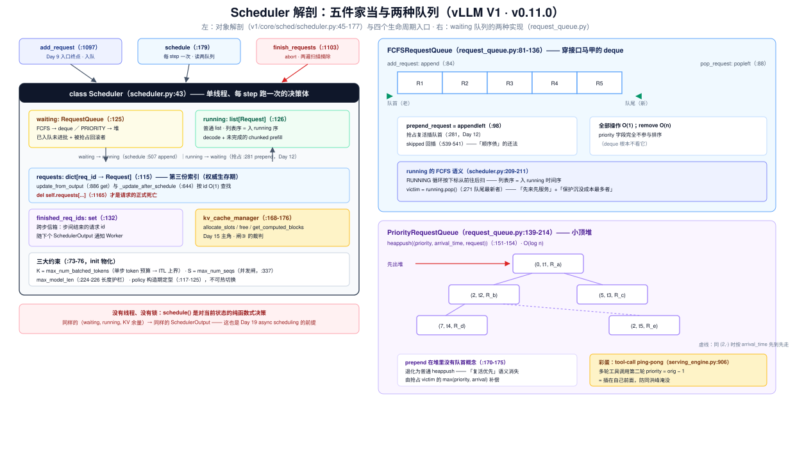
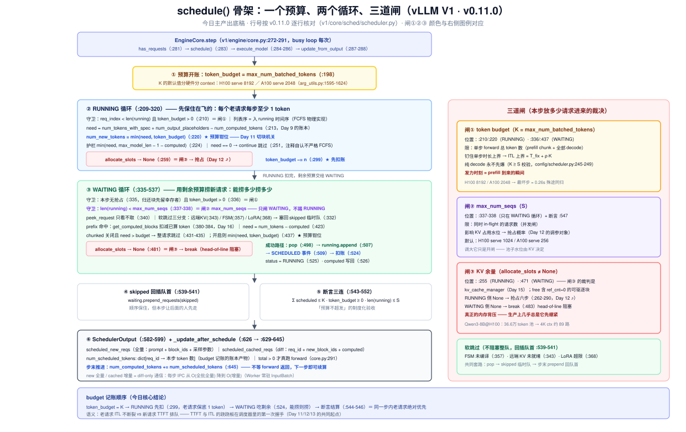
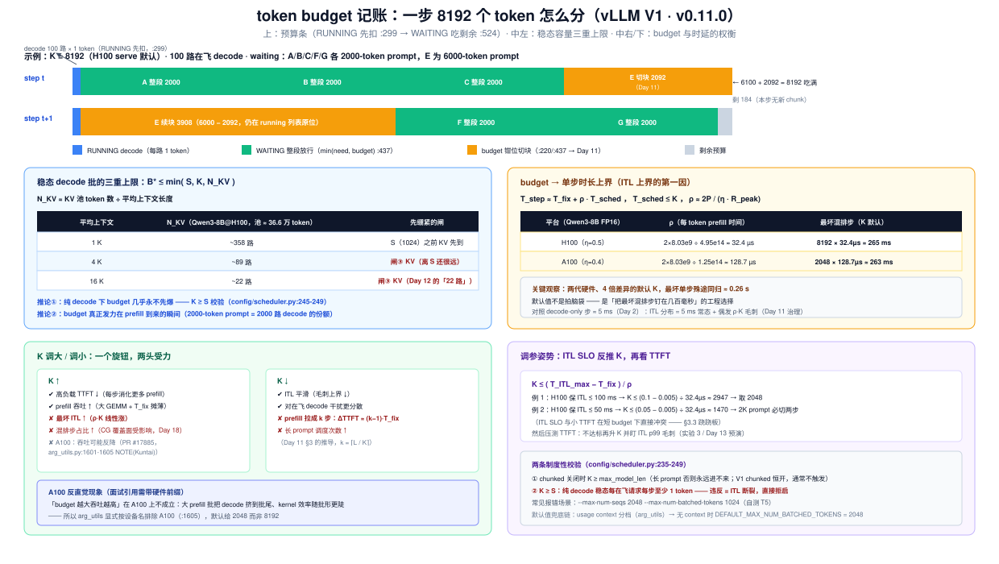

# Day 10 · Scheduler（一）—— 队列与 budget：一步到底算谁、算多少

> **系列**：推理系统优化专家岗 · 56 天打卡 | 第 2 周「vLLM V1 源码精读（上）—— 调度链路」
> **今日位置**：Day 9 把请求送到了 `Scheduler.add_request` 门口（waiting 队列 + QUEUED 事件），今天推开这扇门读 `Scheduler` 本体。它的家当少得惊人——**两个队列**（waiting / running）+ **一本预算**（`max_num_batched_tokens`）——却要每个 step 回答同一个问题：**这一步到底算谁、算多少 token？** 今天只读骨架：两队列的数据结构（FCFS 的 deque vs priority 的堆）、budget 的记账顺序（running 先扣、waiting 吃剩余）、三道闸（budget / max_num_seqs / KV 余量）、`SchedulerOutput` 的数组含义。两个"深坑"刻意绕行：**切块算法是明天（Day 11 chunked prefill）的主场，KV 失守的抢占是后天（Day 12）的主场**——今天遇到只挂牌、不进门
> **前置要求**：Day 8（P1 EngineCore 的 busy loop 与 `step()` 三段）、Day 9（`Request` 账本组——`num_computed_tokens` / `num_tokens_with_spec`、QUEUED/SCHEDULED 事件、"日志跟踪一个请求"基建）、Day 5（TTFT/TPOT/ITL 定义——budget 直接钉住 ITL 上界）、Day 2（TPOT 下界 ≈ 4.93 ms 的手算——今天反着用：算 ITL **上界**）、Day 6（Qwen3-8B 部署台账 + `vllm bench serve` 压测方法）
> **预计用时**：3 ~ 3.5 小时（源码走读 1.5h + 实验 1~1.5h + 画流程图 0.5h）
> **背景衔接**：你在昇腾上做过流水资源调度，那里同样有三件套：**任务队列**（先来先服务）、**在流水线里的一批任务**（in-flight）、**每拍能喂进去的指令预算**（issue width）。`max_num_batched_tokens` 就是推理引擎的 issue width——**一个 forward 就是"一拍"，这一拍最多喂 K 个 token**。做高并发服务的经验同样直接迁移：这就是一个"每 tick 醒一次的 event loop + 准入控制器"——budget 是令牌桶容量、`max_num_seqs` 是连接池上限、KV 池是真正的内存背压（Day 12 的爆点）
> **实验环境**：复用 Day 6 的 1 × H100/A100 + Qwen3-8B（`--gpu-memory-utilization 0.9`）；实验 0/1 无 GPU 可做
> **配套材料**：`week2/README.md` Day 10 节；三张 SVG：`assets/day10_scheduler_anatomy.svg`（Scheduler 解剖 + 队列结构）、`assets/day10_schedule_flow.svg`（**今日主产出底稿**：schedule() 骨架 + budget 记账 + 三道闸）、`assets/day10_budget_accounting.svg`（预算记账条 + 时延权衡）
> **版本口径**：源码坐标按 **v0.11.0 tag** 逐行核对（2026-10 复核），与 Day 8/9/11/12 一致。注意：总计划 README 与部分官方文档写的 `vllm/v1/core/scheduler.py` 是**旧路径**，v0.11.0 已拆进 `vllm/v1/core/sched/` 包（`scheduler.py` / `request_queue.py` / `output.py` / `interface.py`）；`max_num_batched_tokens` 的默认值**分硬件、分 usage context**（§2.5），随版本演进较快——读码先对版本

---

## 0. 今日学习目标

完成今天的学习后，你应该能够：

- [ ] **解剖 `Scheduler.__init__`**：两个队列（`waiting` :125 / `running` :126）、一个字典（`requests` :115）、三大约束（:73-76）各自的作用；说清 `requests` 字典为什么必须存在（`waiting`/`running` 之外的第三份索引）
- [ ] **背下队列数据结构**：`RequestQueue` 抽象（`request_queue.py`）→ FCFS 是 `deque`（进出 O(1)）、PRIORITY 是 `(priority, arrival_time)` 小顶堆（O(log n)）；`create_request_queue` 工厂（:217-224）
- [ ] **说全 priority 的语义**：小值先走、同值按 `arrival_time` 先到先走、默认 0；**只影响 waiting 出队顺序与抢占 victim 选择，running 列表不按优先级重排**；多轮工具调用的"ping-pong 提权"细节（`priority = orig_priority − 1`）
- [ ] **手推 budget 记账顺序**：`token_budget` 初始化（:198）→ RUNNING 循环先扣（:220/:299）→ WAITING 循环吃剩余（:437/:524）——以及这个顺序隐含的公平性语义
- [ ] **数清三道闸**：① token budget ② `max_num_seqs`（:337-338）③ KV 余量（`allocate_slots → None`）；外加 FSM / 远端 KV / LoRA 三种"软跳过"
- [ ] **读懂 `SchedulerOutput` 的数组**：`scheduled_new_reqs`（全量）vs `scheduled_cached_reqs`（diff-only）的通信设计；`total_num_scheduled_tokens` 如何被 `EngineCore.step` 用来判断"本步是否真的执行了模型"
- [ ] **完成队列的生死簿**：`add_request`（:1097）三行动作、`finish_requests`（:1103）的两遍扫描、`update_from_output`（:861）如何摘除 stopped 请求
- [ ] 交付：**一张 `schedule()` 流程图**（含 budget 记账与两个限流旋钮的位置，§9 有模板，图 2 是底稿）

---

## 1. 核心概念速览

| 概念 | 一句话定义 | 今日要达到的深度 |
|---|---|---|
| **`Scheduler`** | V1 的调度心脏（`v1/core/sched/scheduler.py:43`），每 step 产出一份 `SchedulerOutput` | 能默写它的五件家当（§2.2） |
| **`waiting` 队列** | 已入队、尚未进过任何 forward 的请求（+ 被抢占回滚的请求） | 知道它是 `RequestQueue` 抽象的实例，FCFS/priority 两种实现 |
| **`running` 列表** | 已进过 forward 的请求（decode + 未完成的 chunked prefill） | 知道它是普通 `list`，**列表序 = 入 running 的时间序**——这就是 FCFS 的物理实现 |
| **`RequestQueue` 抽象** | 队列接口（`request_queue.py:21-78`）：add / pop / peek / prepend / remove | 会背 FCFS 实现是 `deque`、priority 实现是堆 |
| **`FCFSRequestQueue`** | `deque[Request]` 子类（:81）：`append` 入队、`popleft` 出队 | O(1) 全部操作；`prepend_request` = `appendleft`（抢占复活插队首靠它） |
| **`PriorityRequestQueue`** | `(priority, arrival_time, request)` 小顶堆（:139-154） | 知道"小值先走"与 tie-break 规则；`prepend` 在堆里无意义 = 退化为普通入堆 |
| **`priority` 字段** | 请求优先级（`request.py:42`，默认 0），OpenAI API 可传（`protocol.py:315-321`） | 知道 FCFS 下它完全不参与排序（只在 PRIORITY 策略生效） |
| **`max_num_batched_tokens`** | **单步 forward 的总 token 预算** K（scheduler.py:74-75） | 能推导你机器的默认值（分硬件分 context，§2.5）并算出最坏单步时长 |
| **`max_num_seqs`** | 同时 in-flight 的请求数上限 S（:73） | 知道它闸在 WAITING 循环（:337）而非 RUNNING 循环 |
| **`token_budget`** | `schedule()` 内的局部变量（:198），每步从 K 开始扣减 | 背下扣减顺序：RUNNING 先、WAITING 后 |
| **`allocate_slots`** | 向 `KVCacheManager` 要 block（:255/:471） | 知道返回 `None` 的两条分支分别去哪（抢占 / break，Day 12） |
| **`SchedulerOutput`** | 一步的批描述（`output.py:122-166`），跨进程发给 Worker | 能说全四组数组的含义与 new/cached 二分的设计动机 |
| **`num_scheduled_tokens`** | `dict[req_id → 本步算几个 token]`（:135） | 这是 budget 记账的"账本产物"，ModelRunner 按它切行组批 |
| **`vllm:num_requests_waiting/running`** | 双水位指标（`loggers.py:190/:199`，来自 `make_stats` :1176-1193） | 实验 2 用它们观察队列涨落 |

> **一句话本质**：V1 Scheduler = **一个每 step 跑一次的两层准入控制器**——先保住 running（老请求每步至少 1 token，保证 ITL 不断裂），再用剩余预算从 waiting 捞新请求（能捞多少捞多少，捞不动就整请求跳过）。`max_num_batched_tokens` 是这一切的"节拍器"：它同时决定**单步时长上界**（→ ITL 上界）与**队列排空速度**（→ 高负载下的 TTFT）——一个旋钮，两头受力，这就是 Day 11/12 一切故事的起点。

---

## 2. 原理深入讲解

### 2.1 回顾 Day 8/9：Scheduler 在地图的哪一格，本周怎么拆它

Day 8 的三层地图里，Scheduler 住在 **P1 EngineCore 进程**，是 busy loop 每次 `step()` 的第一段；Day 9 我们把请求送到了它的 `add_request`。本周中段三天对它的拆法：

| Day | 放大哪一块 | 深度 |
|---|---|---|
| **Day 10（今天）** | **骨架**：两队列 + budget 记账 + 三道闸 + SchedulerOutput | 结构与账本，不进分支细节 |
| Day 11 | WAITING/RUNNING 循环里的**切块算法**（chunked prefill、混排） | 逐个 `min()` 钳位推导 + 公式 |
| Day 12 | `allocate_slots → None` 的**抢占分支**（victim、六步复位、恢复） | 逐行 + 仿真 + 诊断 |
| Day 13 | 用压测把三者打出来（chunked / preemption / 排队） | 实验 |

Day 9 埋的两颗伏笔今天兑现：**`num_computed_tokens`**（账本，今天看它在 `_update_after_schedule` 里怎么被推进）与 **QUEUED/SCHEDULED 事件**（今天看 SCHEDULED 在哪一行打出）。今天再埋一颗给 Day 11：**`num_new_tokens = min(need, token_budget)` 这行钳位**（:220/:437）就是 chunked prefill 的全部机关——今天只把它当"预算记账"读。

### 2.2 Scheduler 对象解剖：五件家当（`__init__`，scheduler.py:45-177）



```python
# vllm/v1/core/sched/scheduler.py —— __init__ 摘录（行号按 v0.11.0）
 73:        self.max_num_running_reqs = self.scheduler_config.max_num_seqs
 74:        self.max_num_scheduled_tokens = \
 75:            self.scheduler_config.max_num_batched_tokens
 76:        self.max_model_len = self.scheduler_config.max_model_len
...
115:        self.requests: dict[str, Request] = {}          # req_id → Request 全集
117:        if self.scheduler_config.policy == "priority":   # 策略字符串 → 枚举
118:            self.policy = SchedulingPolicy.PRIORITY
119:        elif self.scheduler_config.policy == "fcfs":
120:            self.policy = SchedulingPolicy.FCFS
125:        self.waiting = create_request_queue(self.policy) # deque 或 堆
126:        self.running: list[Request] = []                 # 普通 list！
132:        self.finished_req_ids: set[str] = set()          # 跨步收集，步末通知 Worker
168:        self.kv_cache_manager = KVCacheManager(...)      # Day 15 的主角
```

五个要点：

1. **`requests` 字典是第三份索引**。waiting/running 只保证"调度顺序"，不保证"按 id 查找"——`update_from_output`（:886 `self.requests.get(req_id)`）和 `_update_after_schedule`（:644）都要 O(1) 查请求。**请求的权威生存期由这个字典管理**：`_free_blocks` 里 `del self.requests[request.request_id]`（:1165）才是真正的"死亡"。
2. **`running` 是普通 `list`，不是堆也不是 deque**。它的顺序 = 请求进入 running 的时间序（`append` :507），RUNNING 循环按下标从前往后扫（:209-211）——**FCFS 对"已在飞请求"的优先，就是这条列表的物理实现**。它也解释了抢占 victim 为什么是 `running.pop()`（:271，最新者在队尾，Day 12）。
3. **三大约束在 init 就物化成属性**：`max_num_scheduled_tokens`（budget K）、`max_num_running_reqs`（并发 S）、`max_model_len`（护栏，:224-226 的钳位用）。注意 K 和 S 是**两个不同的旋钮**，分工见表（面试必考）：

| 参数 | 限制什么 | 直接影响 |
|---|---|---|
| `max_num_batched_tokens`（K） | **单步 forward 的总 token 数**（prefill chunk + 全部 decode） | 单步耗时上界 → **ITL 上界**；prefill 吞吐 |
| `max_num_seqs`（S） | 同时 in-flight 的请求数 | 并发上限 → KV 占用水位 → **抢占概率**（Day 12） |

4. **策略是构造期决定、运行期不变**：`--scheduling-policy fcfs|priority`（arg_utils.py:902-903）→ `SchedulerConfig.policy`（config/scheduler.py:107，默认 `"fcfs"`）→ :117-123 转成枚举 → :125 决定 waiting 的具体实现。**不能热切换**。
5. **`finished_req_ids` 是跨步信箱**：请求在两次 schedule 之间结束时（如客户端断连 abort），id 先进这个 set（:1153），下一次 `SchedulerOutput.finished_req_ids`（:594）捎给 Worker 释放常驻状态——"批末统一结算"而不是随时打断。

### 2.3 队列数据结构：`RequestQueue` 家族（request_queue.py 全景）

v0.11.0 把队列抽成了独立文件 `vllm/v1/core/sched/request_queue.py`（旧版本这段逻辑长在 scheduler.py 里——又一个"坐标随版本走"的例子）。三层结构：

```
RequestQueue(ABC)                     # :21-78，11 个抽象方法
├── FCFSRequestQueue(deque[Request])  # :81-136，双端队列
└── PriorityRequestQueue              # :139-214，小顶堆
        create_request_queue(policy)  # :217-224，工厂函数
```

**FCFS 实现（:81-136）**——就是穿了一层接口马甲的 `deque`：

| 操作 | 实现 | 复杂度 | 谁在用 |
|---|---|---|---|
| `add_request` | `append`（:84-86） | O(1) | `add_request`（Day 9 入口终点） |
| `pop_request` | `popleft`（:88-90） | O(1) | WAITING 循环捞出队首（:498） |
| `peek_request` | `self[0]`（:92-96） | O(1) | WAITING 循环先看再决定（:340） |
| `prepend_request` | `appendleft`（:98-100） | O(1) | **抢占复活插队首**（:281，Day 12）+ skipped 回插（:539-541） |
| `remove_requests` | 过滤重建（:111-120） | O(n) | abort / stop 批量摘除（:1140） |

**PRIORITY 实现（:139-214）**——堆里存三元组：

```python
# request_queue.py:151-154
def add_request(self, request: Request) -> None:
    heapq.heappush(self._heap,
                   (request.priority, request.arrival_time, request))
```

语义三连（面试细节，全在 :143-146 的 docstring 里）：

- **小值先走**（"Requests with a smaller value of `priority` are processed first"）——和直觉的"数值大 = 优先级高"**相反**；
- **同值按 `arrival_time` 先到先走**（tie-break，`request.py:56-57` 默认 `time.time()`）；
- `prepend_request` 在堆里**没有"队首"概念**（:170-175 docstring 直说了）——退化为普通 `heappush`。这意味着 **PRIORITY 策略下"抢占复活优先"这个语义消失了**（Day 12 的 victim 选择改用 `max(priority, arrival_time)` 补偿）。

**priority 的真实用法与一个彩蛋**。priority 从 OpenAI API 一路透传：`protocol.py:315-321`（字段定义，"lower means earlier handling; default: 0"）→ `serving_engine.py:391` → `Processor.process_inputs`（processor.py:335/:456）→ `EngineCoreRequest.priority`（engine/__init__.py:69）→ `Request.priority`（request.py:42）。彩蛋在 `serving_engine.py:906`：**多轮工具调用的后续轮次用 `priority = orig_priority − 1`**——比原请求小 1，即"插自己前面"，防止一次 tool call 的第二轮被同类请求淹没。这是个仅四行的优化，却是"priority 语义用对地方"的教科书案例。

> ⚠️ **两个版本相关的坑**：① FCFS 策略下 priority 字段**完全不参与排序**（deque 不看它）；protocol.py 的 docstring 声称"非 0 且未开 priority 调度会报错"，但 v0.11.0 的 V1 链路里我没找到这个校验的落地代码——以你版本的实测为准。② PRIORITY 策略下 **running 列表不按优先级重排**（v0.11.0 没有任何 sort 调用）：高优先级请求只能等 running 里自然腾位置，或等 KV 失守时抢占 victim 选择（:262-266）偏向它——"优先"只作用于准入，不作用于在飞。

### 2.4 schedule() 骨架：一个预算、两个循环、五段收尾（:179-627）



先背**顶部注释**（:180-189，Day 11 的"统一调度模型"原文，今天只取前半句）：

> "There's no 'decoding phase' nor 'prefill phase' in the scheduler. Each request just has the `num_computed_tokens` and `num_tokens_with_spec`... the scheduler tries to assign tokens to the requests so that each request's `num_computed_tokens` can catch up its `num_tokens_with_spec`."

**骨架五段**（删节版，完整摘录见 §4.3）：

```python
def schedule(self) -> SchedulerOutput:                       # :179
    token_budget = self.max_num_scheduled_tokens             # :198 ① 预算初始化

    # ② RUNNING 循环：先保住在飞的（:209-320）
    req_index = 0
    while req_index < len(self.running) and token_budget > 0:   # :210
        request = self.running[req_index]
        num_new_tokens = (request.num_tokens_with_spec        # :213 账本差值
                          + request.num_output_placeholders
                          - request.num_computed_tokens)
        num_new_tokens = min(num_new_tokens, token_budget)    # :220 ★预算钳位
        ...
        new_blocks = self.kv_cache_manager.allocate_slots(...)  # :255 闸③
        if new_blocks is None: ...                            # :259 → 抢占（Day 12）
        token_budget -= num_new_tokens                        # :299 ★先扣账
        req_index += 1

    # ③ WAITING 循环：剩余预算捞新人（:335-537）
    if not preempted_reqs:                                    # :335 抢占后不捞
        while self.waiting and token_budget > 0:              # :336 闸①
            if len(self.running) == self.max_num_running_reqs: # :337 闸②
                break
            request = self.waiting.peek_request()             # :340
            ... # 软跳过：FSM(:357) / 远端KV(:343) / LoRA(:368)
            num_new_tokens = request.num_tokens - num_computed_tokens  # :423
            num_new_tokens = min(num_new_tokens, token_budget) # :437 ★预算钳位
            new_blocks = self.kv_cache_manager.allocate_slots(...)    # :471 闸③
            if new_blocks is None:                            # :481
                break                                         #     → head-of-line
            request = self.waiting.pop_request()              # :498 出队
            self.running.append(request)                      # :507 入 running
            request.record_event(EngineCoreEventType.SCHEDULED, ...)  # :509
            token_budget -= num_new_tokens                    # :524 ★后扣账
            request.status = RequestStatus.RUNNING            # :525

    # ④ skipped 回插队首（:539-541）+ 断言三连（:543-552）
    # ⑤ 构造 SchedulerOutput（:582-599）+ _update_after_schedule（:626）
```

**budget 记账顺序**（今天的核心结论，Day 11 开篇原话引用它）：

```
token_budget = K
    ↓ RUNNING 循环：每个在飞请求扣掉本步 token（decode = 1）     ← 先扣
    ↓ WAITING 循环：用剩余预算捞新请求（整段或切块）             ← 吃剩余
    ↓ 断言：0 ≤ token_budget，Σ scheduled ≤ K（:544-546）
```

这个顺序的**公平性语义**：在同一 step 内，**老请求永远优先于新请求**——哪怕新请求 priority 更高（priority 只决定 waiting 出队顺序，不决定"先扣谁的账"）。代价与收益同样鲜明：老 decode 每步保底 1 token（ITL 不断裂），新 prefill 只能吃剩饭（TTFT 排队）。**这就是 TTFT 与 ITL 在调度器里的第一次握手**。

### 2.5 三道闸 + 三个软跳过：每步到底放多少请求进来

**硬闸三道**（过不去就本步不进 / 触发回滚）：

| 闸 | 位置 | 判定 | 过不去的行为 |
|---|---|---|---|
| ① token budget | :210/:220（RUNNING）、:336/:437（WAITING） | 本步已调度 token 数 < K | WAITING 侧：要么整请求跳过（chunked 关闭，:431-435），要么切成小块（Day 11） |
| ② `max_num_seqs` | :337-338 | `len(running) < S` | `break`——**只闸 WAITING**，RUNNING 不会被它踢人 |
| ③ KV 余量 | :255（RUNNING）、:471（WAITING） | `allocate_slots() 非 None` | RUNNING 侧 → **抢占**（Day 12）；WAITING 侧 → `break`（:481-483，head-of-line 阻塞：队首放不下就全队等待） |

**软跳过三个**（跳过当个请求、不阻塞整队，":248-250 注释原文承认这不严格 FCFS"）：FSM 未编译完（:357-364，structured output）、远端 KV 未就绪（:343-353，P/D 分离）、LoRA 超限（:368-374）。共同套路：`pop_request` → 塞进临时队列 `skipped_waiting_requests`（:332）→ 循环外 `prepend_requests` 回队首（:539-541）——**顺序保住了，但本步让后面的人先走**。

**"每步调度多少请求"的完整答案**由此可得：

```
本步新接纳数 N_admit = max{ n : 前 n 个 waiting 请求的 token 需求可在
                            (剩余预算, 剩余 KV, S − len(running)) 内依次满足 }
稳态 decode 批大小  B*  ≤ min(S, K, N_KV)        （§3.2 展开）
```

**budget 默认值的推导链**（分硬件分 context，arg_utils.py:1595-1674）：

| 硬件（显存 ≥ 70 GiB 且非 A100，即 H100/MI300x） | `LLM_CLASS` | `OPENAI_API_SERVER` |
|---|---|---|
| `max_num_batched_tokens` | 16384 | **8192** |
| `max_num_seqs` | 1024 | **1024** |

| 其他（含 A100） | `LLM_CLASS` | `OPENAI_API_SERVER` |
|---|---|---|
| `max_num_batched_tokens` | 8192 | **2048** |
| `max_num_seqs` | 256 | **256** |

- **为什么 A100 特殊**：`arg_utils.py:1601-1605` 的 NOTE(Kuntai)——"Setting large `max_num_batched_tokens` for A100 reduces throughput, see PR #17885"。大 budget 在 A100 上反而降吞吐（大 prefill 批的 kernel 效率 + 混排干扰），所以显式按设备名排除。
- **兜底链**：不经过 usage context 的路径（自定义 EngineArgs）落到 `SchedulerConfig.__post_init__`：chunked 开启时 K = `DEFAULT_MAX_NUM_BATCHED_TOKENS = 2048`（utils/__init__.py:88）；pooling 模型抬到 32768、多模态抬到 5120（config/scheduler.py:180-190）。
- **两条校验**（config/scheduler.py:235-249）：① chunked 关闭时 K ≥ `max_model_len`（否则长 prompt 永远进不来）；② **K ≥ S**——物理意义：纯 decode 稳态每个在飞请求每步至少 1 token，K < S 意味着 running 里有请求一步拿不到 token，ITL 断裂（§3.2）。V1 里 chunked 恒开（arg_utils.py:1544-1548 "V1 always uses chunked prefills"，pooling 除外），所以①通常不触发，②是唯一常见报错（把 S 调得比 K 还大时）。

### 2.6 SchedulerOutput：一步的批描述，"diff-only" 通信（output.py:122-166）

schedule() 的返回值是一个纯数据对象，跨进程发给所有 Worker（Day 8 §3.2 的 IPC 账）。四组核心数组：

| 数组 | 元素 | 语义 |
|---|---|---|
| `scheduled_new_reqs` | `list[NewRequestData]`（:27-55） | **首次**进批的请求，发**全量**：prompt_token_ids、block_ids、sampling_params |
| `scheduled_cached_reqs` | `CachedRequestData`（:92-103） | 老请求只发 **diff**：`req_ids` + `new_block_ids` + `num_computed_tokens`；`resumed_from_preemption` 标记复活请求的 block_ids 是**整表替换**而非追加（:95-97，Day 12） |
| `num_scheduled_tokens` | `dict[req_id → int]`（:135） | **每个请求本步算几个 token**——budget 记账的账本产物，ModelRunner 按它把 token 拼成变长批（Day 11 §2.5） |
| `total_num_scheduled_tokens` | `int`（:138） | `= Σ num_scheduled_tokens`；`EngineCore.step` 用 `> 0` 判断本步是否真的执行了模型（core.py:291） |

**为什么分 new / cached 两组**：Worker 的 `InputBatch` 常驻缓存了每个在批请求的状态（Day 8 伏笔，Day 18 展开）——新请求才需要传 prompt 和采样参数，老请求只需"增量"。这使每步 IPC 量从 O(全批全量) 降到 O(增量)，是 V1 高并发下控制面不塌的第一根支柱。面试常问"vLLM 每 step 主进程和 Worker 之间传什么"——答案就是这份 diff。

### 2.7 FCFS 的六个"违反点"（面试加分题：FCFS 真的是先来先服务吗）

1. **RUNNING 循环的 `continue`**（:248-252）：某请求本步拿不到 token（如 encoder budget 耗尽）时跳过它继续扫后面的——注释原文："we do not strictly follow the FCFS scheduling policy"；
2. **WAITING 的软跳过**（§2.5）：FSM / 远端 KV / LoRA 超限的队首请求被绕过，后面的人先走（顺序由回插保住）；
3. **budget 钳位切块**（:220/:437）：队首大 prompt 被切成多步，后续请求可以和它的后续块**同 step 混排**（Day 11 主场）；
4. **抢占复活插队首**（:281）：被抢占的请求 `prepend_request` 回 waiting 队首，优先于更早到达但还没进过批的请求（Day 12 主场）；
5. **PRIORITY 策略**：整体替换出队顺序（§2.3）；
6. **tool-call ping-pong 提权**（serving_engine.py:906）：多轮工具调用的第二轮 `priority − 1`，插在自己前面。

结论：**"FCFS"是默认倾向而非不变量**——vLLM 愿意为 ITL 平滑、吞吐、优先级语义在局部破坏它，但每次破坏都用"回插队首"把顺序债还上。

---

## 3. 性能模型：今日的数学



### 3.1 budget → 单步时长上界（ITL 上界的第一因）

混排步（prefill chunk + decode 拼批）的一阶时间模型（Day 1 的 prefill compute-bound 直接落地）：

```
T_step ≈ T_fix + ρ · T_sched ,   T_sched = total_num_scheduled_tokens ≤ K
ρ ≈ 2P / (η · R_peak)            （每 token 的 prefill 计算时间，一阶忽略 attention 项）
```

代入 Day 6 台账的 Qwen3-8B（P ≈ 8.03 B 参数，FP16）：

| 平台 | R_peak (FP16) | η（保守） | ρ | K（serve 默认） | **最坏混排步** |
|---|---|---|---|---|---|
| H100 | 990 TFLOPS | 0.5 | 2×8.03e9 ÷ 4.95e14 ≈ **32.4 µs/token** | 8192 | ≈ 8192 × 32.4µs ≈ **265 ms** |
| A100 | 312 TFLOPS | 0.4 | 2×8.03e9 ÷ 1.25e14 ≈ **128.7 µs/token** | 2048 | ≈ 2048 × 128.7µs ≈ **263 ms** |

**关键观察（面试可直接引用）**：两代硬件、两个相差 4 倍的默认 budget，算出来的**最坏单步时长殊途同归 ≈ 0.26 s**——默认值不是拍脑袋，而是"把最坏混排步钉在几百毫秒量级"的工程选择。对照 decode-only 步 ≈ 5 ms 量级（Day 2 的 4.93 ms 下界 + 开销），ITL 分布的形状就是：**5 ms 常态 + 偶发 ρ·K 的毛刺**——毛刺的治理（切小 budget、混排）正是 Day 11 的主题。

### 3.2 每步容量：稳态 decode 批的三重上限

纯 decode 稳态下，每个在飞请求每步恰好 1 token（`num_tokens_with_spec − num_computed_tokens = 1`），于是：

```
B* ≤ min( S , K , N_KV )
N_KV ≈ KV 池 token 数 ÷ 平均上下文长度
```

三道上限谁先绷紧？用 Day 6/8 台账手算（H100 80G，util 0.9，Qwen3-8B FP16，KV 池 ≈ 36.6 万 token）：

| 平均上下文 | N_KV | 先绷紧的是 |
|---|---|---|
| 1 K | ~358 | S（1024）之前，KV 先到 |
| 4 K | ~89 | **KV**（离 S=1024 还远） |
| 16 K | ~22 | **KV**（Day 12 手算的"22 路"出处） |

两个推论：① **`max_num_batched_tokens` 在纯 decode 下几乎永不先爆**——因为校验 K ≥ S（config/scheduler.py:245-249）从制度上保证了"每 running 每步至少 1 token"；budget 真正发力是在 **prefill 到来的瞬间**（一个 2 K prompt 一步吃掉 2000 预算，相当于 2000 路 decode 的份额）。② 生产上"并发上限"几乎总是 KV 说了算——调大 S 只是打开闸门，池子大小才是水位（Day 12 的 preemption 专题）。

### 3.3 budget 作为 SLO 旋钮：TTFT 与 ITL 的跷跷板

| K 调大 | 收益 | 代价 |
|---|---|---|
| 队列排空更快 | 高负载下 **TTFT ↓**（每步能消化更多 prefill token） | 最坏 ITL ↑（ρ·K 线性涨） |
| prefill 吞吐 ↑ | 大 GEMM 效率更高、固定开销 T_fix 摊薄 | 混排步占比 ↑，CUDA Graph 覆盖面受影响（Day 18 伏笔） |
| 步数减少 | 长 prompt 的调度次数 ↓ | 对在飞 decode 的干扰更集中 |

| K 调小 | 收益 | 代价 |
|---|---|---|
| ITL 平滑 | 毛刺上界 ↓ | prefill 拉成 k 步：ΔTTFT ≈ (k−1)·T_fix（Day 11 §3 推导） |

**A100 反直觉现象**（PR #17885，arg_utils.py:1601-1605）：大 budget 在 A100 上吞吐不升反降——大 prefill 批把 decode 挤到批尾、kernel 效率随批形的曲线在 A100 上更陡。**"budget 越大吞吐越高"这句话必须带硬件前缀**。

**反推法（调参的实际姿势）**：先定 ITL SLO，再反解 K：`K ≤ (T_ITL_max − T_fix) / ρ`。例：H100 上要 ITL ≤ 100 ms → K ≤ (0.1 − 0.005) ÷ 32.4µs ≈ 2947 → 取 2048。然后看 TTFT 是否达标，不够再往上加并观察 ITL 毛刺——这就是 Day 13 实验的预演。

### 3.4 练手对账题（答案见 §8）

1. A100 serve（K=2048）+ Qwen3-8B：一个 8192-token prompt 的纯 prefill 需要几步？每步多长（η=0.4）？
2. H100 上想保 ITL ≤ 50 ms，K 最大取多少（η=0.5）？此时 2K prompt 一步能否放完？
3. 1024 路 decode 同时在飞、K=8192：budget 会不会耗尽？哪道闸反而危险？
4. `--max-num-seqs 2048 --max-num-batched-tokens 1024` 为什么直接报错？

---

## 4. 关键代码走读（v0.11.0 逐行核对版）

### 4.1 调用链总览：谁在调 schedule()

```python
# vllm/v1/engine/core.py:272-291 —— EngineCore.step()，busy loop 的每次心跳
def step(self) -> tuple[dict[int, EngineCoreOutputs], bool]:
    if not self.scheduler.has_requests():          # :281 空转判断
        return {}, False
    scheduler_output = self.scheduler.schedule()   # :283 ← 今天的一切
    model_output = self.execute_model_with_error_logging(
        self.model_executor.execute_model, scheduler_output)   # :284-286
    engine_core_outputs = self.scheduler.update_from_output(
        scheduler_output, model_output)            # :287-288 记账 + 摘除
    return (engine_core_outputs,
            scheduler_output.total_num_scheduled_tokens > 0)   # :291
```

Day 8 的三段（schedule → execute → update）今天闭合到方法级。注意 :291——**"本步是否执行了模型"以 `total_num_scheduled_tokens > 0` 为准**：budget/KV 全绷紧时 schedule() 可能返回一个几乎空的输出，EngineCore 就不必空跑 forward。

### 4.2 队列的生老病死：add / finish / update

**出生（Day 9 已走，今天补齐三行动作）**：

```python
# scheduler.py:1097-1101
def add_request(self, request: Request) -> None:
    self.waiting.add_request(request)              # 入队（deque 尾/堆）
    self.requests[request.request_id] = request    # 全集登记
    if self.log_stats:
        request.record_event(EngineCoreEventType.QUEUED)   # queue time 起点
```

**死亡的两条路**——`finish_requests`（外部信号：abort / max_tokens 由 update 判定后也走这里）:

```python
# scheduler.py:1103-1145（骨架）
def finish_requests(self, request_ids, finished_status) -> None:
    # 第一遍：收集（running 里的进 set，waiting 里的进 list）:1123-1134
    # 批量摘除：running 重建 list（remove_all，:1138）；waiting 整表过滤（:1140）
    # 第二遍：置终态 + _free_request（:1143-1145）
```

两遍扫描 + 批量摘除是刻意为之：`deque.remove` 是 O(n)，逐个删 k 个是 O(kn)；先收集再一次过滤是 O(n)。**`_free_request` → `_free_blocks`（:1162-1165）做三件事**：connector 收尾 → `kv_cache_manager.free`（block 归还池子，Day 15）→ `del self.requests[...]`——**字典删除才是请求的正式死亡**，比状态置终态更"最终"。

**自然死亡（在 update_from_output 里）**：`update_from_output`（:861-1022）逐请求检查 stop（EOS / max_tokens / stop token，`check_stop`），`stopped_running_reqs` / `stopped_preempted_reqs` 两个集合在 :982-986 一次性摘除——和 finish_requests 同款"先收集后批量"。

### 4.3 schedule() 骨架完整摘录（删节注释版）

```python
# vllm/v1/core/sched/scheduler.py:179-627（保留主干，★ = 今日要点）
def schedule(self) -> SchedulerOutput:
    # 顶部注释 :180-189 —— 统一调度模型（Day 11 展开）
    scheduled_new_reqs, scheduled_resumed_reqs = [], []         # :191-192
    scheduled_running_reqs, preempted_reqs = [], []             # :193-194
    req_to_new_blocks, num_scheduled_tokens = {}, {}            # :196-197
    token_budget = self.max_num_scheduled_tokens                # :198 ★预算开账

    # ============ ① RUNNING 循环（:209-320）============
    req_index = 0
    while req_index < len(self.running) and token_budget > 0:   # :210 ★闸①
        request = self.running[req_index]
        num_new_tokens = (request.num_tokens_with_spec +
                          request.num_output_placeholders -
                          request.num_computed_tokens)           # :213 账本差值
        if (0 < self.scheduler_config.long_prefill_token_threshold
                < num_new_tokens):                              # :216 钳位（Day 11）
            num_new_tokens = self.scheduler_config.long_prefill_token_threshold
        num_new_tokens = min(num_new_tokens, token_budget)      # :220 ★预算钳位
        num_new_tokens = min(num_new_tokens,
                             self.max_model_len - 1
                             - request.num_computed_tokens)      # :224 长度护栏
        if num_new_tokens == 0:
            req_index += 1                                      # :251 跳过（违反FCFS #1）
            continue
        while True:                                             # :254 分配-重试环
            new_blocks = self.kv_cache_manager.allocate_slots(
                request, num_new_tokens,
                num_lookahead_tokens=self.num_lookahead_tokens) # :255 ★闸③
            if new_blocks is None:                              # :259
                ...  # 抢占六步（:262-290，Day 12 逐行）
            else:
                break
        scheduled_running_reqs.append(request)                  # :296
        num_scheduled_tokens[request.request_id] = num_new_tokens
        token_budget -= num_new_tokens                          # :299 ★先扣账
        req_index += 1

    # ============ ② WAITING 循环（:335-537）============
    if not preempted_reqs:                                      # :335 抢占后不捞新人
        while self.waiting and token_budget > 0:                # :336 ★闸①
            if len(self.running) == self.max_num_running_reqs:  # :337 ★闸②
                break
            request = self.waiting.peek_request()               # :340 只看不取
            # 软跳过三分支：REMOTE_KVS(:343) / FSM(:357) / LoRA(:368)
            if request.num_computed_tokens == 0:
                new_computed_blocks, num_new_local_computed_tokens = \
                    self.kv_cache_manager.get_computed_blocks(request)  # :380-384
                                                              # prefix 命中（Day 16）
            num_new_tokens = request.num_tokens - num_computed_tokens  # :423
            if (not self.scheduler_config.chunked_prefill_enabled
                    and num_new_tokens > token_budget):         # :431 chunked 关闭
                self.waiting.pop_request()                      # → 整请求跳过
                skipped_waiting_requests.prepend_request(request)  # :433-434
                continue
            num_new_tokens = min(num_new_tokens, token_budget)  # :437 ★预算钳位
            new_blocks = self.kv_cache_manager.allocate_slots(...)  # :471 ★闸③
            if new_blocks is None:
                break                                           # :483 head-of-line
            request = self.waiting.pop_request()                # :498 出队
            req_index += 1
            self.running.append(request)                        # :507 入 running 尾
            if self.log_stats:
                request.record_event(EngineCoreEventType.SCHEDULED,
                                     scheduled_timestamp)       # :509 SCHEDULED 事件
            num_scheduled_tokens[request.request_id] = num_new_tokens
            token_budget -= num_new_tokens                      # :524 ★后扣账
            request.status = RequestStatus.RUNNING              # :525
            request.num_computed_tokens = num_computed_tokens   # :526 写回命中数

    # ============ ③④⑤ 收尾 ============
    if skipped_waiting_requests:                                # :539-541 回插队首
        self.waiting.prepend_requests(skipped_waiting_requests)
    total_num_scheduled_tokens = sum(num_scheduled_tokens.values())  # :544
    assert total_num_scheduled_tokens <= self.max_num_scheduled_tokens  # :545
    assert token_budget >= 0                                    # :546
    assert len(self.running) <= self.max_num_running_reqs       # :547
    ...
    scheduler_output = SchedulerOutput(...)                     # :582-599
    self._update_after_schedule(scheduler_output)               # :626
    return scheduler_output

def _update_after_schedule(self, scheduler_output):             # :629
    for req_id, num_scheduled_token in num_scheduled_tokens.items():
        request = self.requests[req_id]
        request.num_computed_tokens += num_scheduled_token      # :645 ★账本推进
    self.finished_req_ids = set()                               # :658 信箱清空
```

**读码三问**（自检）：
- `:526` 为什么把 `num_computed_tokens` 直接赋成命中数？（新请求的 0 → prefix 命中数；`:645` 再 += 本步调度数——两次写账一个在入批时一个在步末）
- `req_index += 1` 在两个循环里出现三次（:251/:300/:506），分别意味着什么？（跳过 / running 已调度 / waiting 转正——注意 :506 递增的是 RUNNING 循环的游标，但此刻 RUNNING 循环**已经退出**，所以这行不影响本步结果；读码时别误以为新请求会立刻被续扫）
- `:335` 为什么要 `if not preempted_reqs`？（本步抢占过 → 归还的 block 留给幸存者，不再收新人——Day 12 §2 的"止血优先"）

### 4.4 调用链速查表（今日总账）

| 动作 | 方法 | 坐标 | 队列效应 |
|---|---|---|---|
| 入队 | `Scheduler.add_request` | :1097-1101 | waiting +1，requests 登记，QUEUED 事件 |
| 调度 | `Scheduler.schedule` | :179-627 | waiting → running（:507），SCHEDULED 事件（:509） |
| 账本推进 | `_update_after_schedule` | :629-658 | `num_computed_tokens +=`（:645） |
| 外部终止 | `finish_requests` | :1103-1145 | 双队列批量摘除 + free KV + 删字典 |
| 自然终止 | `update_from_output` | :861-1022 | stopped 集合摘除（:982-986） |
| 释放 | `_free_request`/`_free_blocks` | :1147-1165 | KV 归还池子（Day 15） |
| 指标 | `make_stats` | :1176-1193 | `num_running_reqs`/`num_waiting_reqs`/`kv_cache_usage` |

---

## 5. 动手实验（约 60~90 分钟）

> 沿用 Day 9 建好的"日志跟踪一个请求"基建。今天新增一件武器：**双水位指标**（`vllm:num_requests_waiting` / `vllm:num_requests_running`）。

### 实验 0（必做，5 min；无 GPU 可做）：版本对账 + 默认 budget 推导

```bash
python - <<'EOF'
# 对照 §2.5 的默认值表，算出你自己机器的 K 和 S
import torch
mem = torch.cuda.get_device_properties(0).total_memory / 2**30
name = torch.cuda.get_device_properties(0).name
# v0.11.0 判定：mem >= 70GiB 且设备名不含 "a100"（arg_utils.py:1605）
print(f"{name}, {mem:.0f} GiB ->",
      "H100/MI300x 档: serve K=8192 S=1024" if mem >= 70 and "a100" not in name.lower()
      else "A100/其他档: serve K=2048 S=256")
EOF
```

有 GPU 时用日志验证（两条独立证据）：

```bash
# 证据 1：arg_utils 的 debug 行（arg_utils.py:1672-1674）
VLLM_LOGGING_LEVEL=DEBUG vllm serve Qwen/Qwen3-8B --gpu-memory-utilization 0.9 \
  2>&1 | grep -i "Setting max_num_batched_tokens"

# 证据 2：SchedulerConfig 的 info 行（config/scheduler.py:204-207）
vllm serve Qwen/Qwen3-8B --gpu-memory-utilization 0.9 \
  2>&1 | grep -i "Chunked prefill is enabled"
```

**对账**：两行数字应与推导一致（H100: 8192 / A100: 2048）。不一致先查版本（`pip show vllm`）——这个默认值在 0.9 → 0.11 之间改过多次。

### 实验 1（必做，25 min；无 GPU 可做）：队列 + budget 仿真器

写 `day10_sim.py`——把 §2.4 的骨架抽成 60 行仿真（**不含 KV**：allocate_slots 恒成功；KV 失守留给 Day 12 的仿真器，那是它的主场）：

```python
"""day10_sim.py —— V1 Scheduler 骨架仿真：两队列 + budget 记账（无 KV）
复刻 scheduler.py:198-541 的主干：RUNNING 先扣账、WAITING 吃剩余、闸①②。
用法: python day10_sim.py [budget]"""
import heapq, sys
from dataclasses import dataclass

K = int(sys.argv[1]) if len(sys.argv) > 1 else 8192   # max_num_batched_tokens
S = 1024                                              # max_num_seqs

@dataclass
class Req:
    rid: int; prompt: int; out: int = 0
    priority: int = 0; arrival: float = 0.0
    computed: int = 0                                  # num_computed_tokens
    ttft: float = -1.0

waiting, running = [], []        # PRIORITY 模式用堆；FCFS 换 deque 即可
t, step_n = 0.0, 0

def arrivals():                   # (id, 到达时刻, prompt, priority)
    return [(1, 0.00, 2000, 0), (2, 0.05, 2000, 0), (3, 0.10, 2000, 0),
            (4, 0.15, 2000, 0), (5, 0.20, 6000, 0)]

future = arrivals()
while future or waiting or running:
    while future and future[0][1] <= t:               # add_request（:1097）
        rid, arr, p, pr = future.pop(0)
        heapq.heappush(waiting, (pr, arr, Req(rid, p, 0, pr, arr)))
    budget = K                                        # :198 预算开账
    batch = []
    for r in list(running):                           # ① RUNNING 循环（:209）
        if r.computed < r.prompt:                     #   prefill 未完（chunk 续算）
            n = min(r.prompt - r.computed, budget)    #   :220 ★预算钳位
            r.computed += n; budget -= n              #   :299 ★先扣账
            batch.append((r.rid, n, "P"))
            if r.computed == r.prompt:                #   prefill 完成时采出首 token
                r.ttft = t; r.out = 1
        elif r.out < 9:                               #   decode：每步恰好 1 token
            budget -= 1; r.out += 1
            batch.append((r.rid, 1, "D"))
    while waiting and budget > 0 and len(running) < S: # ②③ 闸①②（:336-337）
        _, _, r = waiting[0]
        n = min(r.prompt - r.computed, budget)        # :437 ★预算钳位
        heapq.heappop(waiting)                        # :498 出队
        running.append(r)                             # :507 入 running
        r.computed += n; budget -= n                  # :524 ★后扣账
        batch.append((r.rid, n, "N"))
        if r.computed == r.prompt:
            r.ttft = t; r.out = 1
    assert sum(b[1] for b in batch) <= K              # :545 断言
    step_n += 1
    sched = sum(b[1] for b in batch)
    print(f"step {step_n:>2}  t={t:6.1f}ms  batch={batch}  Σ={sched}  "
          f"running={len(running)} waiting={len(waiting)}")
    t += 5 + 0.033 * sched        # 粗粒度: T_fix=5ms + ρ=33µs/token（H100 §3.1）
    done = [r for r in running if r.out >= 9]         # 假设生成 8 个 token
    for r in done:
        running.remove(r)                             # update_from_output 摘除
        print(f"    req {r.rid} finished, TTFT={r.ttft:.1f}ms")
```

（简化说明：真实代码里"本步调度数"与"computed 推进"分两处写——:526/:645；这里合并。prefill 的最后一步顺带采出首 token，所以 `out` 从 1 数起——这正是 `:213` 的 `num_tokens_with_spec = prompt + out` 与 decode `need = 1` 的来历。完整版含 KV 与抢占的仿真器在 Day 12/14。）

**跑三个 case 并记录**（以下为实测输出要点，可对照）：
1. `python day10_sim.py 8192`（H100 默认）：step 2 的批组成 = `[req1 的 1 个 decode token | req2/3/4 各整段 2000 | req5 切块 2191]`，Σ 恰好吃满 8192 → **RUNNING 先扣 1 token、WAITING 整段放行、放不下就切块**（Day 11 的伏笔）；req5 的 TTFT = 346 ms（切块跨步的代价）；
2. `python day10_sim.py 4096`：整段变切块（req4 只拿到 95）、步数变多、prefill 段拉长——对照 §3.3 的 K↓ 代价；
3. 把 arrivals 里第 5 项改成 `(5, 0.00, 6000, -1)`（与 req1 同刻到达、优先级更高）：step 2 里 **req5 先于 req2 出堆**（6000 整段放行，挤掉后来者的空间）——堆模式验证 §2.3 的 `(priority, arrival_time)` 排序。

### 实验 2（GPU，20 min）：双水位观测——看见 waiting 与 running

```bash
# 终端 1
vllm serve Qwen/Qwen3-8B --gpu-memory-utilization 0.9 --max-model-len 8192

# 终端 2：32 路并发、2000-token prompt 的突发
seq 1 32 | xargs -P 32 -I{} curl -s http://localhost:8000/v1/completions \
  -H "Content-Type: application/json" -d \
  '{"model":"Qwen/Qwen3-8B","prompt":"Explain paging. {}","max_tokens":256}' \
  -o /dev/null &

# 终端 3：双水位
watch -n 0.5 'curl -s http://localhost:8000/metrics | grep -E \
  "vllm:num_requests_(waiting|running)|gpu_cache_usage_perc"'
```

**预期与解读**：waiting 先冲高（32 路同时入队）→ running 稳定在"KV 允许的并发"→ waiting 逐步排空。对照引擎的 periodic 日志行（`Avg generation throughput ... Running: n / Waiting: m`——Day 9 基建）与 `/metrics` 的一致性。**把 waiting 曲线的排队时长与 Day 9 的 QUEUED→SCHEDULED 事件差值互相印证**——一个从指标侧、一个从事件侧量同一件事。

### 实验 3（GPU，25 min）：budget 扫描——一个旋钮，两头受力

```bash
for K in 2048 8192 32768; do
  vllm serve Qwen/Qwen3-8B --gpu-memory-utilization 0.9 \
    --max-num-batched-tokens $K --disable-log-requests &   # 重启才生效（非动态参数）
  sleep 60
  vllm bench serve --model Qwen/Qwen3-8B --dataset-name random \
    --random-input-len 2048 --random-output-len 128 \
    --request-rate 8 --num-prompts 200 \
    --metric-percentiles 50,99 | tee bench_K${K}.json
  pkill -f "vllm serve"; sleep 10
done
```

记录表（模板）：

| K | TTFT p50/p99 | ITL p50/p99 | throughput (tok/s) | 现象解读 |
|---|---|---|---|---|
| 2048 | | | | ITL 稳但 TTFT 排队 |
| 8192 | | | | 基线 |
| 32768 | | | | TTFT ↓；ITL 毛刺 ↑（对照 §3.1 的 ρ·K 预测）；A100 上吞吐可能反降 |

**验证目标**：K↑ 时 TTFT p99 是否下降、ITL p99 毛刺是否上移——毛刺上界按 §3.1 预估：ρ×K 从 265 ms（8192）涨到 ≈ 1.06 s（32768），观察 p99（尾部）而非均值。这条曲线是 Day 13 压测实验的预演。

### 实验 4（可选，GPU，15 min）：priority 插队

```bash
vllm serve Qwen/Qwen3-8B --gpu-memory-utilization 0.9 --scheduling-policy priority
# 灌 20 路 priority=5 的长请求后，发 1 路 priority=0：
curl http://localhost:8000/v1/completions -H "Content-Type: application/json" -d \
  '{"model":"Qwen/Qwen3-8B","prompt":"Hi","max_tokens":16,"priority":0}'
```

对照 FCFS 模式重跑一次，比较 queue time（Day 9 的事件日志）或 TTFT。**注意**：priority 只加速"出 waiting"，不踢已在飞的 running（§2.3）——观察它是否只缩短排队、不缩短在飞请求的 ITL。

### 常见坑（方法论清单）

1. **K ≥ S 校验报错**（config/scheduler.py:245-249）：把 `--max-num-seqs` 调得比 budget 还大时直接拒启——先想清楚"每 running 每步至少 1 token"的制度意义再调；
2. **budget 不是动态参数**：实验 3 每档都要重启服务，别在同一进程里改；
3. **K 只在默认路径被钳**：`min(max_num_seqs × max_model_len, K)` 只作用于"用户没显式传 K"的路径（config/scheduler.py:195-199 在 `if self.max_num_batched_tokens is None` 里）——显式传 32768 就是 32768；
4. **A100 上别按 H100 经验调参**：PR #17885——大 budget 反降吞吐（§3.3）；
5. **`--scheduling-policy priority` 下别期待"抢占式优先"**：v0.11.0 的 running 不重排，priority 只影响准入与 victim 选择。

---

## 6. 面试高频问题（含答题骨架）

**Q1：vLLM V1 的 Scheduler 有哪些队列？各是什么数据结构？**
骨架：两个调度队列 + 一个字典——waiting（`RequestQueue` 抽象：FCFS 时是 `deque`、priority 时是 `(priority, arrival_time)` 小顶堆）+ running（普通 `list`，**列表序 = 入 running 时间序**）+ `requests: dict`（按 id 的权威索引，`update_from_output`/`_update_after_schedule` 都靠它 O(1) 查找；字典删除才是请求的正式死亡）。追问"为什么 running 不用堆"：running 的顺序语义是**到达序**（FCFS 语义的物理实现 + 抢占 victim 取队尾最新者），不需要按 key 重排。

**Q2：`max_num_batched_tokens` 和 `max_num_seqs` 分别限制什么？为什么要强制前者 ≥ 后者？**
骨架：K 限**单步 forward 的总 token 数**（决定单步时长上界 → ITL 上界 + prefill 吞吐）；S 限**同时 in-flight 的请求数**（决定 KV 水位 → 抢占概率）。强制 K ≥ S（config/scheduler.py:245-249）是因为纯 decode 稳态每个在飞请求每步至少要 1 token——K < S 时必有请求一步拿不到 token，ITL 断裂。加分：默认值分硬件（H100 serve 8192 / A100 serve 2048，arg_utils.py:1605-1624），且 A100 上大 K 反降吞吐（PR #17885）。

**Q3：一个 step 里 budget 怎么花的？新请求和老请求谁优先？**
骨架：`token_budget = K` 开账（:198）→ RUNNING 循环先扣（在飞请求保底，decode 每“人”1 token）→ WAITING 循环用剩余预算捞新请求（整段或切块 :437）→ 断言结算（:544-546）。语义：**同一步内老请求绝对优先**——哪怕新请求 priority 更高也只决定 waiting 内部的出队顺序。代价与收益：老请求 ITL 不断裂 vs 新请求 TTFT 排队——TTFT/ITL 的跷跷板在调度器里的第一次握手。

**Q4：V1 的 FCFS 真的是先来先服务吗？**
骨架：是默认倾向而非不变量，六个违反点：RUNNING 循环 continue（:248-252 注释自认）、WAITING 软跳过（FSM/远端 KV/LoRA，:343-374）、budget 钳位切块（:220/:437）、抢占复活插队首（:281）、PRIORITY 策略、tool-call ping-pong 提权（priority−1）。共同手法：**破坏顺序的同时用"回插队首"还债**。

**Q5：priority 调度的语义细节？**
骨架：小值先走（与直觉相反）、tie 用 `arrival_time`、默认 0（request.py:42）；**只影响 waiting 出队顺序与抢占 victim 选择（:262-266），running 不重排**——高优先级请求不能踢走在飞的；堆实现 O(log n)，FCFS 的 deque 全 O(1)；`prepend_request` 在堆里退化为普通入堆（"复活优先"语义消失，由 victim 选择补偿）。彩蛋：多轮 tool call 的后续轮 priority−1 插队（serving_engine.py:906）。

**Q6：budget 调大/调小分别影响什么指标？怎么定？**
骨架：K↑ → 高负载 TTFT ↓（排空快）、prefill 吞吐 ↑（大 GEMM + T_fix 摊薄）；代价最坏 ITL ↑（≈ ρ·K，给 H100/A100 各代一个数：8192×33µs ≈ 265ms / 2048×129µs ≈ 263ms——殊途同归 0.26s）。K↓ 反之，且 prefill 拉成 k 步多付 (k−1)·T_fix。**定法是反推**：先定 ITL SLO → K ≤ (T_max − T_fix)/ρ，再看 TTFT。带硬件前缀（A100 反例）。

**Q7：SchedulerOutput 为什么要分 new/cached 两组？**
骨架：Worker 端 `InputBatch` 常驻缓存批内请求状态 → 新请求发全量（NewRequestData：prompt、block_ids、采样参数），老请求只发 diff（CachedRequestData：req_ids + new_block_ids + num_computed_tokens）→ 每 step IPC 从 O(全量) 降到 O(增量)，是 V1 高并发控制面不塌的第一根支柱。追问复活请求：`resumed_from_preemption` 标记 block_ids 整表替换（:95-97）。

**Q8：一步里能同时有 prefill 和 decode 吗？**
骨架：能——V1 没有 prefill/decode 阶段之分（schedule() 顶部注释 :180-189），只有一个账本目标（`num_computed_tokens` 追上 `num_tokens_with_spec`）；混排批的物理构成（`num_scheduled_tokens` 切行、positions、中间块采样丢弃）是 Day 11 的内容，今天记住入口：`num_scheduled_tokens: dict[req_id → 本步 token 数]`。

---

## 7. 今日总结

1. **Scheduler 的全部家当**：两队列（waiting: deque/堆，running: list）+ requests 字典 + 三约束（K/S/max_model_len）+ kv_cache_manager——没有线程、没有锁，**单线程每 step 跑一次的纯函数式决策**（同样的输入状态 → 同样的 SchedulerOutput）；
2. **FCFS 的物理实现就是 running 的列表序 + waiting 的 deque 序**；priority 是构造期选择、运行期不变，且只影响准入不影响在飞；
3. **budget 记账顺序**：RUNNING 先扣（在飞保底）→ WAITING 吃剩余（能捞则捞）→ 断言结算；同一步内老请求绝对优先；
4. **三道闸**：token budget（ITL 上界）、max_num_seqs（并发闸，只闸 WAITING）、KV 余量（真正的内存背压，Day 12 的爆点）；外加三个软跳过（FSM/远端 KV/LoRA）；
5. **K 的数学**：最坏混排步 ≈ T_fix + ρ·K；H100 8192 与 A100 2048 殊途同归 ≈ 0.26s——默认值是"钉住单步时长"的工程选择；调参姿势是 ITL SLO 反推 K；
6. **SchedulerOutput 是 diff-only 协议**：new 全量 / cached 增量，`num_scheduled_tokens` 是 budget 记账的账本产物，也是 Day 11 混排批的原料；
7. **本周路线**：今天骨架 → Day 11 切块（:220/:437 两个 min 的深挖）→ Day 12 抢占（:254-292 分支）→ Day 13 压测验证。

---

## 8. 今日自测题（先自己做，再展开答案）

**T1**：`add_request` 之后、第一次被 schedule 之前，请求存在于哪几处？（答：waiting 队列 + `requests` 字典——两份索引一份实体；`running` 里还没有。QUEUED 事件已打，SCHEDULED 未打。）

**T2**：§3.4-1：A100 serve（K=2048）+ Qwen3-8B，一个 8192-token prompt 的纯 prefill 几步？每步多长？
答：8192 ÷ 2048 = **4 步**（chunked 默认开，每步吃满 budget）；每步 ≈ 2048 × 128.7µs ≈ **263 ms**（η=0.4），总 TTFT ≈ 4 × (263 + T_fix) ≈ **1.1 s 量级**——这就是 Day 11 要算的"ΔTTFT ≈ (k−1)·T_fix"的 k=4 情形。

**T3**：§3.4-2：H100 上保 ITL ≤ 50 ms，K 最大多少（η=0.5）？2K prompt 一步放得完吗？
答：K ≤ (0.05 − 0.005) ÷ 32.4µs ≈ **1470** → 取 1024/1408 这档；此时 2048-token prompt **放不完**，必然切块两步——ITL SLO 与小 TTFT 在短 budget 下直接冲突，需要 §3.3 的跷跷板权衡。

**T4**：§3.4-3：1024 路 decode 在飞、K=8192：budget 会耗尽吗？哪道闸危险？
答：**不会**——1024 个 token 的需求 ≤ 8192（K ≥ S 校验的制度保证）。危险的是**闸③ KV**：1024 路 × 平均上下文的 KV 早已超出池子（H100 Qwen3-8B 池 ≈ 36.6 万 token，1024 × 1K 上下文就超了）——实际跑不到 1024 路，早就在抢占（Day 12）。

**T5**：§3.4-4：`--max-num-seqs 2048 --max-num-batched-tokens 1024` 为什么报错？
答：config/scheduler.py:245-249 校验 K ≥ S：S=2048 > K=1024 时，纯 decode 稳态下最多只有 1024 个请求每步拿到 token，第 1025~2048 个请求**一步一个 token 都拿不到**，ITL 无限劣化——制度上直接禁止。

**T6**：为什么 `finish_requests` 要两遍扫描而不是逐个删除？
答：`deque.remove` / list.remove 都是 O(n)，逐个删 k 个是 O(kn)；先收集到 set/list 再一次过滤重建是 O(n)。同款手法在 `update_from_output` 的 stopped 集合摘除（:982-986）——**"先收集后批量"是调度器里反复出现的模式**。

---

## 9. 今日产出物

### 9.1 schedule() 流程图（README 指定产出）

以 `assets/day10_schedule_flow.svg` 为底稿，**手画一遍**（面试白板版只需 5 个框）：预算开账 → RUNNING 循环（先扣账）→ 三道闸 → WAITING 循环（吃剩余）→ 断言 + SchedulerOutput。**必须在图上标出两个限流旋钮的位置**：K 在循环守卫与钳位（:210/:220/:336/:437），S 只在 WAITING 的闸（:337）。

### 9.2 budget 记账卡（一页，模板）

```markdown
# budget 记账卡（我的机器：____，vLLM v____）
## 默认值（实验 0 实测）
K = ____（依据：arg_utils debug 行 / 启动日志），S = ____，policy = fcfs
## 关键数字
ρ ≈ ____ µs/token（2P ÷ η·R_peak）→ 最坏混排步 ≈ T_fix + ρ·K ≈ ____ ms
KV 池 ≈ ____ token → N_KV ≈ ____ 路 @平均上下文 ____ → 真正先爆的闸：____
## 实验 3 数据（budget 扫描）
| K | TTFT p99 | ITL p99 | throughput | 备注 |
## 调参结论（对照 §3.3 反推法）
```

---

## 10. 明日预告（Day 11 · Scheduler（二）—— chunked prefill）

今天两处刻意绕行的 `min(need, token_budget)`（:220/:437）就是明天的主战场：**长 prompt 如何被切块、chunk 与 decode 如何混进同一个 forward、为什么这一切只靠 `num_computed_tokens` 一个字段驱动**。要回答 README 的两问——为什么 chunked prefill 能降 TPOT 抖动（ITL 上界从 ρ·L 塌缩到 ρ·K）、代价是什么（ΔTTFT ≈ (k−1)·T_fixed，以及 FLOPs 守恒为什么说它"近乎免费"）。今天的 `token_budget` 记账顺序是那篇文章的第一块积木。
