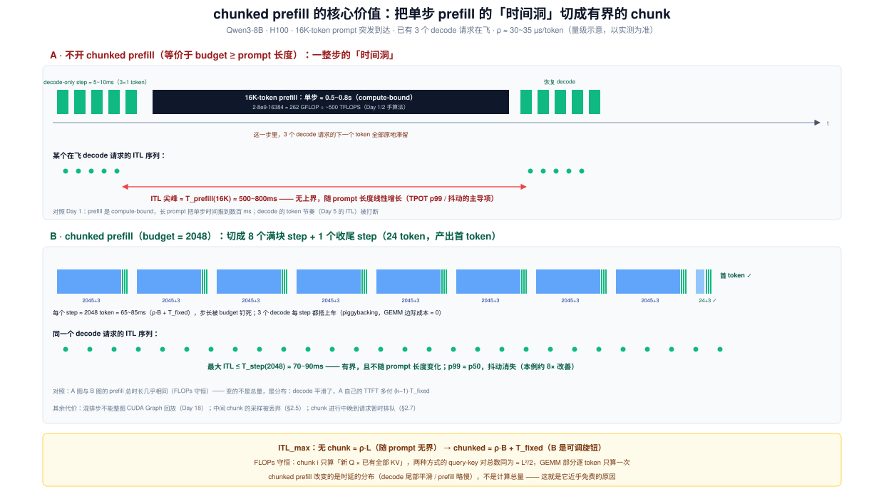
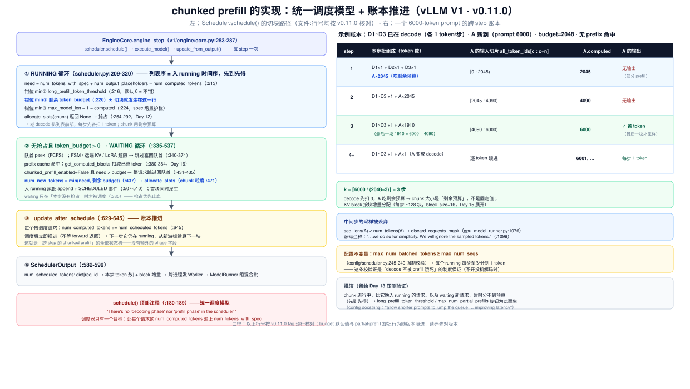
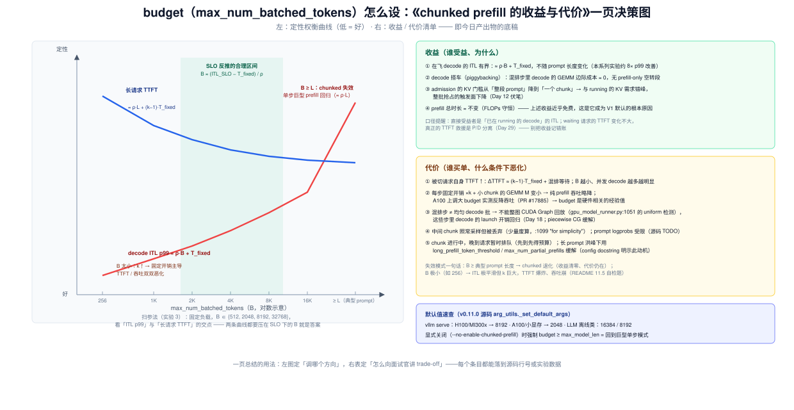

# Day 11 · Scheduler（二）—— chunked prefill：长 prompt 的切块与混排

> **系列**：推理系统优化专家岗 · 56 天打卡 | 第 2 周「vLLM V1 源码精读（上）—— 调度链路」
> **今日位置**：昨天（Day 10）读了 `Scheduler.schedule()` 的骨架——waiting/running 两队列、`max_num_batched_tokens` 的记账顺序（running 先扣、waiting 用剩余）、`max_num_seqs` 与 KV 余量两道闸、`SchedulerOutput` 的数组含义。今天放大其中最反直觉的一块：**V1 的调度器里根本没有 "prefill 阶段 / decode 阶段" 之分**——长 prompt 如何被切成 chunk、chunk 与 decode 如何混进同一个 forward、以及这一切只靠 `num_computed_tokens` 一个账本字段驱动（Day 9 埋的伏笔今天全部兑现）。回答 README 的两问：**为什么 chunked prefill 能降低 TPOT 抖动？代价是什么？**
> **前置要求**：Day 9（`Request` 账本组、QUEUED/SCHEDULED 事件、"日志跟踪一个请求"基建）、Day 10（两队列与 budget 记账、`num_scheduled_tokens` 的含义）、Day 1（prefill compute-bound vs decode memory-bound——今天的所有公式都是它的应用）、Day 5（TTFT/TPOT/ITL 定义）、Day 6（Qwen3-8B 台账与 `/metrics`）
> **预计用时**：3 ~ 3.5 小时（源码走读 1.5h + 实验 1~1.5h + 一页总结 0.5h）
> **背景衔接**：你在昇腾上做算子优化时干过无数次"切大任务"：大 GEMM 按 tile 切、L1 放不下就分块流式搬、流水线按拍均衡。chunked prefill 是同一思想在**系统层**的重现——把一个不可预测的大任务（16K prompt 的整段 prefill）切成规模可预测的小任务（budget 大小的 chunk），用**每步时间的上界**换全系统的时延平滑。而且它和你熟悉的 tiling 一样遵守同一条守恒律：**切块不增加计算量（FLOPs 守恒），增加的只是控制开销**——这句话今天会用数学证一遍（§3.2），也是面试的高频误区（§6 Q1）。你做高并发服务时的"长任务切片防队头阻塞"经验同样直接适用（§2.7 的晚到者排队问题）。
> **实验环境**：复用 Day 6 的 1 × H100/A100 + Qwen3-8B（`--gpu-memory-utilization 0.9`）；实验 1（仿真器）无 GPU 也可做
> **配套材料**：`week2/README.md` Day 11 节；三张 SVG：`assets/day11_chunked_prefill_timeline.svg`（今日主图：时间洞 vs 有界 chunk）、`assets/day11_unified_scheduling_ledger.svg`（schedule() 切块路径 + 账本推进表）、`assets/day11_budget_tradeoff.svg`（收益/代价一页决策图——今日产出物的底稿）
> **版本口径**：源码坐标按 **v0.11.0 tag** 逐行核对（2026-10 复核），与 Day 8/9/10 一致；`max_num_batched_tokens` 默认值与 partial-prefill 相关旋钮（`long_prefill_token_threshold` / `max_num_partial_prefills`）**随版本演进较快**，读码先对版本（实验 0）

---

## 0. 今日学习目标

完成今天的学习后，你应该能够：

- [ ] **讲清问题**：不用 chunked prefill 时，一个 16K prompt 如何把在飞 decode 的 ITL 从 ~6ms 打到 ~500ms+（两个数量级）——现场手算（§2.2）
- [ ] **背下统一调度模型**：schedule() 顶部注释（scheduler.py:180-189）——"没有 prefill/decode 阶段，只有让 `num_computed_tokens` 追上 `num_tokens_with_spec`"；chunked prefill / prefix caching / 投机解码都是这一个模型的不同侧面
- [ ] **手推切块算法**：chunk 大小 = 三个 `min()` 的叠加（need → `long_prefill_token_threshold` → 剩余 budget → `max_model_len−1`），以及 waiting 侧 `chunked_prefill_enabled=False` 时"整请求跳过"的分支（§2.4）
- [ ] **解释混排的物理实现**：同一个 forward 里 `[A 的 2045 个 token | D1 | D2 | D3]` 怎么组 batch、positions 怎么算、中间 chunk 的采样为什么被丢弃（`discard_requests_mask`，§2.5）
- [ ] **推导两个公式**：ITL 上界 ≈ ρ·B + T_fixed（收益），ΔTTFT ≈ (k−1)·T_fixed（代价），并用 FLOPs 守恒解释"为什么近乎免费"（§3）
- [ ] **说全代价清单**（README 原题）：TTFT 略升、固定开销 ×k、混排步不能用整图 CUDA Graph、晚到者排队、A100 上大 budget 反降吞吐——每条能落到源码或实验数据（§2.7）
- [ ] 交付：**一页总结《chunked prefill 的收益与代价》**（§9 有模板，图 3 是底稿）

---

## 1. 核心概念速览

| 概念 | 一句话定义 | 今日要达到的深度 |
|---|---|---|
| **chunked prefill** | 把长 prompt 的 prefill 按 token 预算切成多个 chunk，跨多个 step 完成 | 能背出"V1 默认开启"的出处（`arg_utils.py:1544-1548`"V1 always uses chunked prefills"） |
| **统一调度模型** | 调度器无 prefill/decode 阶段之分，只有一个追赶目标 | 背下 schedule() 顶部注释（:180-189），能解释为什么这个抽象同时覆盖 prefix caching / spec decode |
| **`num_computed_tokens`** | 已完成 forward 的 token 数（Day 9 的账本） | 能手推它在一个 6000-token prompt 生命周期里的完整取值序列（图 2 右表） |
| **`num_tokens_with_spec`** | prompt + 已生成 + 草稿 token 总数（request.py:172-174） | 知道 running 循环的 need 就是"它减去 computed" |
| **token budget** | `max_num_batched_tokens`：单步 forward 的总 token 上限 | 知道它先被 running 消耗、再给 waiting；默认值分硬件（H100 serve 8192 / A100 2048） |
| **chunk 大小** | `min(need, threshold?, 剩余 budget, max_model_len−1−computed)` | 能在给定负载下手算每步的批组成（实验 1） |
| **`_update_after_schedule`** | 调度后立即把 `num_computed_tokens += num_scheduled_tokens`（:645） | 理解"为什么不等 forward 返回"——下一步就能续算 |
| **混排（mixed batch）** | 同一 forward 里 prefill chunk 行 + decode 行拼成一个变长批 | 能描述 ModelRunner 怎么按 `num_scheduled_tokens` 切行、算 positions（:946-985） |
| **`discard_requests_mask`** | 中间 chunk（`seq_lens < num_tokens`）的采样结果被丢弃（:1076） | 知道这是"为简单起见"的取舍（:1099 注释原文） |
| **piggybacking / 搭车** | decode token 附在 prefill chunk 的 GEMM 里，边际计算 ≈ 0 | 能与昇腾的"搬运与计算重叠"类比；知道出处是 Sarathi-Serve（OSDI 2024） |
| **ρ（每 token 计算时间）** | prefill 段 ≈ 2·P / (η·R_peak)，compute-bound 的斜率 | 会代入 Day 1/2 公式算 H100/A100 的量级并用于 ITL 上界 |
| **FLOPs 守恒** | 切块不增加计算量：query-key 对总数 ≈ L²/2 两种方式相同 | 能现场推导（§3.2），这是面试高频误区 |
| **`long_prefill_token_threshold`** | 单个请求单步 prefill 的钳位（config/scheduler.py:59） | 知道默认 0（不钳）、与 `max_num_partial_prefills` 配套的"短请求插队"动机 |
| **`max_num_batched_tokens ≥ max_num_seqs`** | config 强制校验（:245-249） | 理解它是"每个 running 每步至少 1 token"的制度保证——ITL 平滑的底线 |

> **一句话本质**：chunked prefill = **把 budget 从"准入单位"变成"切片刀"**。Day 10 里 budget 决定"这一步一共算多少 token"；今天看到它顺带决定了"单个请求这一步最多算多少 token"——于是单步时间有了上界，decode 的 ITL 有了上界；代价是 prefill 被拉长成 k 步、多付 (k−1) 次每步固定开销，且计算总量不变（FLOPs 守恒）。

---

## 2. 原理深入讲解

### 2.1 回顾与今日地图

Day 10 立了 schedule() 的骨架，本周剩余日程：

| Day | 放大哪一块 | 状态 |
|---|---|---|
| Day 8 | 进程地图（P0/P1/P2、ZMQ、DTO） | ✅ |
| Day 9 | 入口链路九站 + `Request` 解剖 | ✅ |
| Day 10 | 两队列 + budget 记账 + `max_num_seqs`/KV 两道闸 | ✅（计划内） |
| **Day 11（今天）** | **budget 的第二重身份：切片刀（chunked prefill）** | ▶ |
| Day 12 | budget/KV 失守时：preemption（`allocate_slots` 返回 None 的分支） | 待 |
| Day 13 | 压测验证：长 prompt 洪峰 + 高并发挤爆 KV | 待 |
| Day 14（复盘） | 请求在 scheduler 中的状态机 | 待 |

先校准一个口径（Day 5 的纪律）：**TPOT 是均值，"TPOT 抖动"指的是 ITL（inter-token latency）分布的尾部**。chunked prefill 的收益全部落在 ITL 的 p99/max 上，对均值几乎无影响——面试时主动做这个区分是加分项。

### 2.2 问题：一个 16K prompt 如何打崩在飞 decode（图 1 上半部）



用 Day 1/2 的手算法给"混跑干扰"定量（Qwen3-8B，P ≈ 8e9 非嵌入参数，FP16 权重 ≈ 16GB）：

| 量 | H100（3.35TB/s，~500 TFLOPS 有效） | A100（2TB/s，~140 TFLOPS 有效） |
|---|---|---|
| decode-only step（小 batch，访存下界） | 16GB ÷ 3.35TB/s ≈ **4.8ms**（实际 5~10ms） | 16GB ÷ 2TB/s ≈ **8ms** |
| 16K prefill 单步（计算下界） | 2·8e9·16384 ≈ 262 GFLOP ÷ 500TFLOPS ≈ **0.52s** | ÷ 140TFLOPS ≈ **1.9s** |
| ρ（每 token 计算时间） | ≈ 30~35 µs/token | ≈ 115 µs/token |

不开 chunked prefill（等价于 budget ≥ prompt 长度）：16K prompt 到来并被接纳的那个 step，**同批所有 decode 请求的下一个 token 要等 0.5~1.9s**——ITL 从 ~6ms 尖峰到数百 ms（两个数量级），流式体验直接崩坏。这正是 week2/README 11.1 的 A100 算例（7.5ms → 900ms，120 倍），今天是它的 H100 版 + 源码版。

注意这个问题的**结构性**：prefill 与 decode 的硬件特性相反（Day 1），混跑时计算密集的一方会定义 step 时长。解法只有两个方向：**要么在时间上切片让两者共存（chunked prefill），要么在空间上分离（P/D 分离，Day 29）**。今天讲前者。

### 2.3 统一调度模型：没有 prefill/decode 阶段，只有账本

打开 `vllm/v1/core/sched/scheduler.py`，`schedule()`（:179）的**第一段就是设计宣言**（:180-189，原文）：

```python
# NOTE(woosuk) on the scheduling algorithm:
# There's no "decoding phase" nor "prefill phase" in the scheduler.
# Each request just has the num_computed_tokens and num_tokens_with_spec.
# num_tokens_with_spec = len(prompt_token_ids) + len(output_token_ids)
#                        + len(spec_token_ids).
# At each step, the scheduler tries to assign tokens to the requests
# so that each request's num_computed_tokens can catch up its
# num_tokens_with_spec. This is general enough to cover chunked prefills,
# prefix caching, speculative decoding, and the "jump decoding"
# optimization in the future.
```

这段注释值得逐句翻译并背下来：

1. **没有阶段**：请求没有 "正在 prefill" / "正在 decode" 的显式状态。一个请求是"还有 `num_tokens_with_spec − num_computed_tokens` 个 token 没算"的欠账者。
2. **追赶模型**：每一步，调度器给每个请求分配 0~N 个 token 的计算量，让账本追上欠账。
3. **一个模型覆盖四种特性**：
   - *chunked prefill* = 欠账 6000，每步只还 2045，分 3 步还清（今天）；
   - *prefix caching* = 一部分欠账已被别的请求还过（缓存命中），起点不是 0（Day 16）；
   - *投机解码* = 欠账里混着"猜的 token"，被拒绝时账本**回退**（Day 25，`update_from_output` 里 `num_computed_tokens -= num_rejected`，:908）；
   - *jump decoding* = 未来特性。

所以"chunked prefill 是怎么实现的"这个问题的第一层答案是：**它不是被"实现"的，它是统一模型的一个自然推论**——只要 budget 限制了单步还款额，长 prompt 自然被切。第二层答案（§2.4）才是 budget 怎么切。这也是为什么 V1 敢把 chunked prefill 设为默认开启（`EngineArgs._set_default_args`，`arg_utils.py:1544-1548`："V1 always uses chunked prefills and prefix caching for non-pooling tasks"）——它的实现复杂度约等于零。

### 2.4 切块算法：三个 `min()` 与一个不变量（图 2 左侧）



**Running 循环**（scheduler.py:209-320）对每个在跑请求计算本步 token 数：

```python
num_new_tokens = (request.num_tokens_with_spec +          # 欠账总额
                  request.num_output_placeholders -       # async scheduling 的预占位
                  request.num_computed_tokens)            # 已还
if (0 < long_prefill_token_threshold < num_new_tokens):  # 钳位①（:216）
    num_new_tokens = long_prefill_token_threshold
num_new_tokens = min(num_new_tokens, token_budget)        # 钳位②（:220）★ 切块
num_new_tokens = min(num_new_tokens,
                     max_model_len - 1 - num_computed_tokens)  # 钳位③（:224）
```

四个关键点：

1. **钳位②就是 chunked prefill 的全部**：`token_budget` 从 `max_num_batched_tokens` 起步（:198），每个请求扣走自己的份额。一个欠账 24K 的请求在 budget 8192 下每步只能还 ~8182——剩余部分**没有状态、没有回调、没有定时器**，下一轮循环它还在 running 列表里，need 自动变成 24K−8182。
2. **钳位①是可选的"每请求单步上限"**：`long_prefill_token_threshold`（config/scheduler.py:59，默认 0 = 不钳）。它不是 chunked prefill 本身，而是 chunk 的**再切小**——动机见 §2.7（给晚到请求留预算）。
3. **decode 请求走同一条路**：decode 的欠账恒为 1（+ 草稿 token），所以 `num_new_tokens = 1`。**同一段代码同时服务 chunk 和 decode，这就是"混排"的源码形态**——没有 if prefill/else decode。
4. **KV 分配按 chunk 粒度**：`allocate_slots(request, num_new_tokens)`（:255）只为这一步的 token 申请 block（Day 15 展开）——admission 的 KV 门槛从"整段 prompt"降到"一个 chunk"，这是收益清单第 ③ 条的来源。

**账本推进**（`_update_after_schedule`，:629-645）：

```python
for req_id, num_scheduled_token in num_scheduled_tokens.items():
    self.requests[req_id].num_computed_tokens += num_scheduled_token   # :645
```

注释（:636-639）说得清楚：**调度后立即推进，不等 forward 返回**——这样下一个调度 step 马上就能续算下一块。（代价是这个账本先于真实执行乐观推进；投机解码拒绝时在 `update_from_output` 里回退，:908。）

**Waiting 循环的 chunked 分支**（:335-537）：waiting 只在"本步没有发生抢占"时才被调度（:335）。队首请求算出 `num_new_tokens = request.num_tokens − num_computed_tokens`（:423，用 `num_tokens` 而不是 `num_prompt_tokens` 是为了照顾被抢占后带着输出 token 恢复的请求——Day 12），然后是今天最重要的一段（:431-437）：

```python
if not self.scheduler_config.chunked_prefill_enabled and \
        num_new_tokens > token_budget:
    self.waiting.pop_request()                    # 整请求拿出来
    skipped_waiting_requests.prepend_request(request)  # 塞回队首
    continue                                      # 试下一个（更短的）请求
num_new_tokens = min(num_new_tokens, token_budget)
```

读法：**关掉 chunked prefill 时，放不下整段 prompt 的请求被整体推迟**（短请求可以越过它——这是 `skipped_waiting_requests` 临时队列存在的第二个理由）；**开启时，`min` 直接把队首请求切到剩余预算大小**，一步完成"入 running + 第一块 chunk"。V1 默认走后者。

**一个不变量收尾**：`max_num_batched_tokens ≥ max_num_seqs` 被 config 强制校验（config/scheduler.py:245-249）。为什么？running 循环先到先得，若 budget < running 请求数，排后面的请求连 1 个 token 都拿不到。这条校验保证**（不开投机解码时）每个 running 请求每步至少分到 1 token**——它是"decode 节奏不被饿死"的制度保证。两个看似独立的旋钮被一条不变量绑在一起，这是 V1 设计里我最喜欢的一处。

### 2.5 混排的物理实现：一个 forward 里的变长批（ModelRunner 侧）

调度器输出的是 `SchedulerOutput.num_scheduled_tokens: dict[req_id → 本步 token 数]`（:585）。P2 的 `GPUModelRunner`（`vllm/v1/worker/gpu_model_runner.py`）把它变成一个**变长（ragged）批**：

```python
# :946-947  每请求本步 token 数 → 数组，如 [2045, 1, 1, 1]
tokens = [scheduler_output.num_scheduled_tokens[i] for i in req_ids]
num_scheduled_tokens = np.array(tokens, dtype=np.int32)

# :958-961  positions = 各自的 num_computed_tokens + 批内序号
#           A 的行：0..2044；D1 的行：它自己的上下文长度
np.add(self.input_batch.num_computed_tokens_cpu[req_indices], arange,
       out=positions_np)

# :985  按 (请求槽位 × max_model_len + position) 从 2D token 表里 gather 输入行
torch.index_select(self.input_batch.token_ids_cpu_tensor.flatten(), 0,
                   token_indices_tensor, out=self.input_ids.cpu[...])
```

也就是说：**A 的 chunk 切片就是 `all_token_ids[num_computed_tokens : num_computed_tokens + num_scheduled_tokens]`**——账本字段直接就是数组下标。A 的 2045 行和 D1/D2/D3 的各 1 行拼成一个 2048 行的输入，共享同一组权重做一次 GEMM（M = 2048）——这就是"chunk 与 decode 混排在同一个 step"的物理含义。

**采样的丢弃机制**（最容易被问的细节）：

```python
# :1060  seq_lens = 已算 + 本步新算（attention 看到的 KV 长度）
self.seq_lens.np[:num_reqs] = (num_computed_tokens_cpu + num_scheduled_tokens)

# :1074-1081  还没追上 num_tokens 的请求 = 中间 chunk → 采样结果丢弃
# Record the index of requests that should not be sampled,
discard_requests_mask = self.seq_lens.np[:num_reqs] < num_tokens_np

# :1099-1104  每个请求取批内最后一行算 logits，部分 prefill 也照算，随后忽略
# NOTE(woosuk): Due to chunked prefills, the batch may contain
# partial requests. While we should not sample any token
# from these partial requests, we do so for simplicity.
logits_indices = query_start_loc[1:] - 1
```

三个层次：① 采样只取每个请求批内**最后一行**（`query_start_loc[1:] − 1`）；② 中间 chunk 的最后一行并不是 prompt 的末 token，算出来的 logits 无意义，**照算然后丢弃**（"for simplicity"——不为 3 个 decode 行单独跳过 prefill 行的采样路径）；③ 调度器侧对齐这个约定：`update_from_output` 有不变量注释（:978）"EngineCore returns no partial prefill outputs"——**中间 chunk 不产生任何 `EngineCoreOutput`，首 token 一定出自最后一块**。这也是 Day 9 TTFT 分解里 `prefill_time = first_token_ts − scheduled_ts` 能干净成立的原因。

### 2.6 为什么能降 TPOT 抖动：数学（图 1 下半部）

把 §2.2 的表变成公式。设 prefill 段每 token 计算时间 ρ、每步固定开销 T_fixed（调度 CPU ~0.4ms + input 构建 + kernel launch + IPC，Day 8 §3 的账）：

**无 chunked**：接纳 16K prompt 的那一步
$$T_{step} \approx \rho \cdot L + T_{fixed} \xrightarrow{L=16384,\ \rho=32\mu s} \approx 520\,ms$$
所有同批 decode 的 ITL 尖峰 ≈ 520ms，且**随 prompt 长度线性增长、无上界**。

**chunked（budget B）**：任何一步的总 token ≤ B（decode 先扣、chunk 吃剩余），
$$ITL_{max} \approx \rho \cdot B + T_{fixed} \xrightarrow{B=2048} \approx 66\,ms + \epsilon$$
**有上界，且不随 prompt 长度变化**——B 是你能调的旋钮。本例 p99 ITL 改善 ≈ 8 倍。

**为什么 decode 的边际成本 ε ≈ 0（piggybacking）**：混排步的 GEMM 已经为 chunk 的 2045 行把全部权重从 HBM 读了一遍（compute-bound，Day 3 的 Roofline：算力是瓶颈、访存有余量），decode 的 1 行搭车只是 M 维 +1——权重**不用再读一遍**。所以混排步时间 ≈ chunk 时间 + 1~3ms。这个"用 prefill 的算力余量免费捎带 decode"的思路出自 Sarathi-Serve（OSDI 2024，术语 piggybacking / stall-free batching），vLLM V1 的默认行为就是它。对照你在昇腾上的经验：这就是"搬运与计算重叠"在 batch 维度的版本。

**反过来看均值**：TPOT（均值）≈ 总生成时间 ÷ token 数，无论切不切，prefill 总时长和 decode 步数都几乎不变——**均值不动、尾部塌缩**，这就是"降 TPOT 抖动而不降 TPOT"的完整含义（week2/README 11.5 自检题的答案）。

### 2.7 代价的精确清单（图 3 右侧，逐条落到源码/实验）

**① 被切请求自身 TTFT 略升**。prefill 从 1 步变 k = ⌈L/(B−n_decode)⌉ 步：
$$\Delta TTFT \approx (k-1)\cdot T_{fixed} + k\cdot\epsilon$$
16K/B=2048 时 k=9、T_fixed≈1~3ms → ΔTTFT ≈ 10~25ms（在 ~500ms 上，<5%）。但 B=256 时 k=64+，开销和 GEMM 效率损失一起上来了（见 ②）。**并发 decode 越多，每步留给 chunk 的预算越少，k 越大**——高负载下代价被放大。

**② 每步固定开销 ×k + 小 chunk 的计算效率损失**。FLOPs 守恒（§3.2 证明），但每步都要重新付 T_fixed，且 GEMM 的 M 从 L 变成 B——B 很小时矩阵乘效率下降。极端实证：A100 上把 budget 调大（如 8192）反而**降低**吞吐（`arg_utils.py:1598-1600` 注释引用 PR #17885 的实测，vLLM 为此按设备名把 A100 的默认值钉在 2048）——budget 是硬件相关的经验值，不是越大越好。

**③ 混排步不能用整图 CUDA Graph**。decode-only 的均匀批（每请求 1 token）能命中 CUDA Graph 回放；混排批 token 数不均匀，通不过 uniform 检测（`gpu_model_runner.py:1051` 的 `max_num_scheduled_tokens == uniform_decode_query_len and total == num_reqs × max`），只能走 eager/piecewise 路径——这些步里 decode 的 kernel launch 开销回归。Day 18 展开，piecewise CG 就是为此设计的缓解。

**④ 中间 chunk 的废算与功能边界**。照常采样再丢弃（§2.5）是少量浪费；`prompt_logprobs` 在 chunked 下的支持有 TODO（:1103 注释）；结构化输出的 grammar bitmask 在无新 token 的步上可能空转（:845-848 的 PERF 注释）。

**⑤ 晚到者排队（深入一步，留给 Day 13 验证）**。running 循环**先到先得**：mid-prefill 的 chunk 请求若每步吃满剩余预算，那么比它晚入 running 的请求、以及 waiting 里的新请求，在 chunk 完成前分不到预算（只能等最后一块的富余）。推演：budget 8192、一个 24K chunk 在跑 → 新短请求等 ⌈24K/8182⌉ = 3 步 ≈ 0.8s——与不开 chunked 时等一个 0.77s 巨型步**总时长相同**（预算消耗速率不变），受害的只是"期间新到的请求没有提前量"。两个配套旋钮就是为此而生：`long_prefill_token_threshold`（把每请求单步 chunk 钳小，给晚到者留预算）和 `max_num_partial_prefills`（限制并发部分 prefill 数）——config docstring 明示动机（config/scheduler.py:53-57："allow shorter prompts to jump the queue in front of longer prompts in some cases, improving latency"）。**这条推论的正确打开方式**：记下推理链，Day 13 用长 prompt 洪峰压测验证。

**收益侧也要记对账**：直接受益者是**已在 running 的 decode 的 ITL**；waiting 请求的 TTFT 变化不大（预算速率不变）；被切请求 TTFT 略升。**真正系统性改善 TTFT 尾部的是 P/D 分离（Day 29）**——面试时把这三笔账分开记，是"真理解 trade-off"的信号。

### 2.8 配置旋钮与默认值（v0.11.0 源码口径）

| 旋钮 | 默认（serve 语境） | 出处 | 一句话 |
|---|---|---|---|
| `max_num_batched_tokens` | H100/MI300x → **8192**；A100/小显存 → **2048**；LLM 离线类 → 16384/8192 | `arg_utils.py:1607-1623` | 单步 token 预算 = 切片刀 = ITL 上界 |
| `max_num_seqs` | H100 → 1024；A100 → 256（config 兜底 128） | 同上 / config:169 | 并发上限；受 budget ≥ max_num_seqs 约束 |
| `long_prefill_token_threshold` | 0（不钳）；设 `max_num_partial_prefills>1` 时自动 = 4% × max_model_len | config:59, :210-213 | 单请求单步 chunk 的再钳位 |
| `max_num_partial_prefills` / `max_long_partial_prefills` | 1 / 1 | config:49-57 | 并发部分 prefill 数上限（行为随版本演进） |
| `enable_chunked_prefill` | **V1 generate 任务恒 True** | `arg_utils.py:1544-1548` | 显式关闭时强制 budget ≥ max_model_len（config:235-243） |
| 兜底常量 | `DEFAULT_MAX_NUM_BATCHED_TOKENS = 2048` | `vllm/utils.py:88` | 无 usage_context 时的缺省 |

启动日志可观察：`Chunked prefill is enabled with max_num_batched_tokens=8192.`（config/scheduler.py:204-207，EngineCore 进程打印）——实验 0 的检查点。

---

## 3. 性能模型：今日的数学

### 3.1 ITL 上界与"8 倍改善"的完整手算

$$T_{step}(N) \approx \underbrace{\rho \cdot N}_{\text{prefill 段（compute-bound）}} + \underbrace{T_{fixed}}_{\text{调度+组批+launch}} + \underbrace{\epsilon \cdot n_{decode}}_{\text{decode 搭车（≈0）}}， \quad \rho = \frac{2P}{\eta \cdot R_{peak}}$$

Qwen3-8B @ H100（P=8e9，η·R_peak ≈ 500 TFLOPS → ρ ≈ 32µs/token；T_fixed ≈ 1~3ms）：

| 场景 | 每步 token | ITL 上界 | 说明 |
|---|---|---|---|
| decode-only step | 3×1 | **5~10ms** | 访存下界主导（16GB/3.35TB/s ≈ 4.8ms） |
| 无 chunked，16K prompt 到达 | 16384+3 | **≈ 530ms** | ρ·L，随 L 线性增长、无界 |
| chunked B=2048 | ≤2048 | **≈ 68~72ms** | ρ·B + T_fixed，**B 是旋钮** |
| chunked B=8192 | ≤8192 | **≈ 265ms** | 默认预算下的最坏 ITL——H100 用户该知道的数 |

**测量口径**：ITL 用流式接口逐 chunk 记时（实验 2）；`/metrics` 的 histogram 看全局分布；nsys 看单步 GPU 时间（Day 19 的方法）。

### 3.2 FLOPs 守恒的证明（面试高频误区）

误区："切块要重复读 KV/重复计算，所以总计算量变大。" **错**。逐项对账：

- **GEMM/FFN 部分**：每个 token 恰好过一遍网络，切不切都是 2·P·L FLOPs，**精确守恒**。
- **Attention 部分**：因果 attention 只算 query-key 对 (q, k), pos(k) ≤ pos(q)。把 L 个 token 切成 k 块、每块 c = L/k：
  - 单次 prefill：对数 = L(L−1)/2 ≈ L²/2
  - chunked：块 i 的 c 个 query 各自面对 i·c 个 key → Σᵢ c·(i·c) − 块内重复计的 c/2 ≈ c²·k(k+1)/2 ≈ **L²/2**
  - **同为 L²/2**。直觉：chunk i 的 attention 是"新 Q × 已有全部 KV"——新 KV 只是**追加**，旧对子从不重算。

所以 chunked prefill 多付的**只有** (k−1)·T_fixed 的控制开销与小 chunk 的 GEMM 效率差（M = B 而非 L），这就是"近乎免费"的数学表述。这也正是你昇腾经验里"大矩阵分块不增加计算量、只增加控制开销"的系统层版本（week2/README 11.3 的对照）。

### 3.3 budget 怎么设：SLO 反推（图 3 左侧）



两条约束夹出合理区间：

- **ITL SLO（上界约束）**：ρ·B + T_fixed ≤ SLO_ITL → **B ≤ (SLO_ITL − T_fixed)/ρ**。SLO 100ms → B ≲ 3K；SLO 250ms → B ≲ 7.7K。
- **TTFT/吞吐（下界压力）**：k = ⌈L/(B−n_decode)⌉ 不要太大 → B 别小于典型 prompt 的 1/8~1/16。
- **失效边界**：B ≥ 典型 L → chunked 退化（收益清零）；B ≪ L 且 k·T_fixed 可观 → TTFT/吞吐恶化。

实操：从默认值出发（H100 serve 8192 / A100 2048——不是玄学，是两条曲线的实测折中），用 Day 6 的压测法固定负载扫 {512, 2048, 8192, 32768}，画"ITL p99 vs B"与"长请求 TTFT p50 vs B"的交点（实验 3 就是它的缩小版）。**这正是 Day 5 的 SLO/goodput 思维：budget 是把 ITL SLO 翻译成引擎语言的那个参数**。

### 3.4 练手对账题（答案见 §8 Q1/Q2）

> **题 1**：H100，ρ=32µs/token，T_fixed=2ms，B=8192，10 个 decode 在飞，新到 32K prompt。求：k、每步 chunk 大小、ITL 上界、ΔTTFT。
>
> **题 2**：你的产品流式 SLO 是"ITL p99 ≤ 120ms"，模型 Qwen3-8B @ H100。budget 应设多少？如果运维同时要求"32K 长文 TTFT ≤ 1.5s"，两个 SLO 打架吗？

---

## 4. 关键代码走读（v0.11.0 逐行核对版）

> **阅读方法**：先看图 2 左列从上往下走。以下为**节选**（主干保真、删减分支），行号以 v0.11.0 为准。

### 4.1 step 入口与 budget 初始化（`vllm/v1/engine/core.py` + scheduler.py）

```python
# core.py:283-287 —— 每 step 的三段式（Day 8 图 3 的落地）
scheduler_output = self.scheduler.schedule()                # ① 调度
model_output = self.execute_model_with_error_logging(       # ② 执行
    self.model_executor.execute_model, scheduler_output, ...)
engine_core_outputs = self.scheduler.update_from_output(    # ③ 回填
    scheduler_output, model_output)
# 注：async scheduling（Day 19）把 ① 和 ② 重叠，链路见 core.py:325-349

# scheduler.py:197-198 —— budget 就是一个局部变量
token_budget = self.max_num_scheduled_tokens    # = max_num_batched_tokens（:74-75）
```

### 4.2 running 循环：切块主战场（scheduler.py:209-320）

```python
req_index = 0
while req_index < len(self.running) and token_budget > 0:   # :210 先到先得
    request = self.running[req_index]
    num_new_tokens = (request.num_tokens_with_spec +        # :213 欠账
                      request.num_output_placeholders -
                      request.num_computed_tokens)
    if (0 < self.scheduler_config.long_prefill_token_threshold
            < num_new_tokens):                              # :216 钳位①
        num_new_tokens = self.scheduler_config.long_prefill_token_threshold
    num_new_tokens = min(num_new_tokens, token_budget)      # :220 钳位②★切块
    num_new_tokens = min(num_new_tokens,
                         self.max_model_len - 1 -
                         request.num_computed_tokens)        # :224 钳位③
    ...
    while True:                                             # :254 KV 分配
        new_blocks = self.kv_cache_manager.allocate_slots(
            request, num_new_tokens, ...)
        if new_blocks is None:
            # KV 不足 → 抢占 victim（FCFS: running.pop() 最新者，:271）
            # → free、num_computed_tokens=0、塞回 waiting 队首（:281）
            ...                                             # Day 12 的全部内容
        else:
            break
    scheduled_running_reqs.append(request)                  # :296
    num_scheduled_tokens[request.request_id] = num_new_tokens
    token_budget -= num_new_tokens                          # :299 记账
    req_index += 1
```

注意循环条件 `token_budget > 0`：budget 归零即停——**排在前面的（老）请求永远先拿到 token**，这就是 §2.4 不变量的运行时形态。

### 4.3 waiting 循环：chunked 分支与入队（scheduler.py:335-537）

```python
if not preempted_reqs:                                      # :335 抢占时不收新
    while self.waiting and token_budget > 0:
        if len(self.running) == self.max_num_running_reqs:  # :337 max_num_seqs 闸
            break
        request = self.waiting.peek_request()               # :340 只看队首（Day 10）
        ...  # FSM / 远端 KV / LoRA 超限 → 跳过塞回（:340-374）
        if request.num_computed_tokens == 0:                # :380 prefix cache
            new_computed_blocks, num_new_local_computed_tokens = \
                self.kv_cache_manager.get_computed_blocks(request)   # Day 16
            ...
        num_new_tokens = request.num_tokens - num_computed_tokens    # :423
        if (0 < long_prefill_token_threshold < num_new_tokens):     # :424 钳位①
            num_new_tokens = long_prefill_token_threshold
        if not self.scheduler_config.chunked_prefill_enabled and \
                num_new_tokens > token_budget:              # :431 关闭时的整请求跳过
            self.waiting.pop_request()
            skipped_waiting_requests.prepend_request(request)
            continue
        num_new_tokens = min(num_new_tokens, token_budget)  # :437 切到剩余预算
        new_blocks = self.kv_cache_manager.allocate_slots(  # :471 chunk 粒度
            request, num_new_tokens + num_external_computed_tokens, ...)
        if new_blocks is None:
            break                                            # :481 KV 闸
        request = self.waiting.pop_request()
        self.running.append(request)                         # :507 入 running 尾部
        if self.log_stats:
            request.record_event(EngineCoreEventType.SCHEDULED,
                                 scheduled_timestamp)        # :509 queue time 终点
        num_scheduled_tokens[request.request_id] = num_new_tokens
        token_budget -= num_new_tokens
        request.status = RequestStatus.RUNNING
        request.num_computed_tokens = num_computed_tokens    # :526 起点回填（缓存命中值）
```

### 4.4 账本推进与输出（scheduler.py:582-645）

```python
scheduler_output = SchedulerOutput(                         # :582-599
    scheduled_new_reqs=new_reqs_data,                       # 新请求全量数据（P2 缓存）
    scheduled_cached_reqs=cached_reqs_data,                 # 老请求只发增量
    num_scheduled_tokens=num_scheduled_tokens,              # ★ 今日主角
    total_num_scheduled_tokens=total_num_scheduled_tokens,  # = Σ，即 M 维
    ...)

def _update_after_schedule(self, scheduler_output):         # :629
    # 调度后立即推进（不等 forward 完成）：
    # 1) 当前步输出仍含原始 scheduled 数，供 ModelRunner 确定输入
    # 2) 提前推进 → 下一个调度 step 立刻能续算同一请求的下一块
    for req_id, num_scheduled_token in \
            scheduler_output.num_scheduled_tokens.items():
        self.requests[req_id].num_computed_tokens += num_scheduled_token  # :645
```

### 4.5 ModelRunner：变长批构建与采样丢弃（gpu_model_runner.py）

```python
total = scheduler_output.total_num_scheduled_tokens         # :935 批的 M 维
tokens = [scheduler_output.num_scheduled_tokens[i] for i in req_ids]
num_scheduled_tokens = np.array(tokens)                     # :946 如 [2045,1,1,1]
# positions：批内第 j 行 = 其请求的 num_computed_tokens + 段内偏移（:958-961）
# 输入行：token_ids_cpu[req 槽位][position] 逐行 gather（:985）
# attention 的 seq_lens = computed + scheduled（:1060）→ chunk 的 Q 看到全部已有 KV
seq_lens = num_computed_tokens_cpu + num_scheduled_tokens
discard_requests_mask = seq_lens < num_tokens_np            # :1076 中间 chunk → 丢弃采样
if not use_spec_decode:
    # :1099 "…partial requests, we do so for simplicity…"
    logits_indices = query_start_loc[1:] - 1                # :1104 每请求取批内末行
```

### 4.6 调用链速查表（今日总账）

| # | 站点 | 函数 | 文件:行 |
|---|---|---|---|
| ⓪ | step 三段式 | `EngineCore.engine_step` | `v1/engine/core.py:283-287` |
| ① | budget 初始化 | `schedule()`（`token_budget = max_num_batched_tokens`） | `v1/core/sched/scheduler.py:198` |
| ② | 欠账计算 | running 循环 `num_new_tokens = need` | `:213-215` |
| ③ | **切块** | `min(need, threshold)` → `min(·, token_budget)` → `min(·, max_model_len−1)` | `:216/:220/:224` |
| ④ | KV 分配（chunk 粒度） | `allocate_slots`（失败→抢占，Day 12） | `:255/:271` |
| ⑤ | waiting 的 chunked 分支 | `min(need, 剩余预算)`；关闭时整请求跳过 | `:431-437` |
| ⑥ | 入 running + SCHEDULED | `running.append` + `record_event` | `:507-510` |
| ⑦ | 账本推进 | `_update_after_schedule`（computed += scheduled） | `:629-645` |
| ⑧ | 输出 DTO | `SchedulerOutput.num_scheduled_tokens` | `:582-599` |
| ⑨ | 变长批构建 | positions / gather / seq_lens | `v1/worker/gpu_model_runner.py:946-985, :1060` |
| ⑩ | 采样丢弃 | `discard_requests_mask` / `logits_indices` | `:1076/:1104` |
| ⑪ | 回填与不变量 | `update_from_output`（"no partial prefill outputs"） | `scheduler.py:861, :978` |

---

## 5. 动手实验（约 60~90 分钟）

> 环境沿用 Day 6 台账（Qwen3-8B / `--gpu-memory-utilization 0.9`）。实验 1 无 GPU 可做；实验 2/3 需要 GPU；Day 13 会把今天的脚本升级成正式压测。

### 实验 0（必做，5 min）：版本对齐 + 默认 budget 确认

```bash
pip show vllm | head -3
vllm serve Qwen/Qwen3-8B --gpu-memory-utilization 0.9 --max-model-len 32768 2>&1 \
  | grep -i "chunked prefill"
# 预期（H100）: Chunked prefill is enabled with max_num_batched_tokens=8192.
#              （A100 上应是 2048；来源 config/scheduler.py:205-207）
# 把你机器的默认值记进台账——§2.8 的表对上号了吗？
```

### 实验 1（必做，25 min；无 GPU 可做）：手算 + 仿真器验证切块算法

先把 §2.4 的账本例子手算一遍（图 2 右表：D1~D3 + A(6000)，B=2048，算 5 步），然后写一个 ~50 行的仿真器复刻调度算术（**只复刻预算记账，不做 KV/抢占**）：

```python
# day11_sim.py —— chunked prefill 切块算术的最小仿真（对应 scheduler.py:209-320）
class Req:
    def __init__(self, rid, prompt_len, max_tokens):
        self.rid, self.prompt_len, self.max_tokens = rid, prompt_len, max_tokens
        self.output, self.computed, self.first_token_step = 0, 0, None

def simulate(new_reqs, B, running=(), max_seqs=1024, max_steps=300):
    waiting, running = list(new_reqs), list(running)
    everyone = running + new_reqs          # 每个请求对象只出现一次
    rows = []
    for step in range(1, max_steps + 1):
        budget, sched = B, {}
        for r in running:                                   # RUNNING：先到先得
            n = min(r.prompt_len + r.output - r.computed, budget)
            if n > 0:
                budget -= n; sched[r.rid] = n
        while waiting and budget > 0 and len(running) < max_seqs:   # WAITING
            r = waiting[0]
            n = min(r.prompt_len - r.computed, budget)      # ← :437 的 min
            waiting.pop(0); running.append(r)
            budget -= n; sched[r.rid] = n
        rows.append((step, dict(sched)))
        for r in everyone:                                  # _update_after_schedule
            if r.rid in sched:
                r.computed += sched[r.rid]
                if r.computed == r.prompt_len + r.output and r.output < r.max_tokens:
                    if r.output == 0:
                        r.first_token_step = step           # 最后一块 → 首 token
                    r.output += 1
        running = [r for r in running if r.output < r.max_tokens]
        if not running and not waiting:
            break
    return rows, everyone

if __name__ == "__main__":
    import sys
    B = int(sys.argv[1]) if len(sys.argv) > 1 else 2048
    decodes = [Req("D1", 32, 200), Req("D2", 32, 200), Req("D3", 32, 200)]
    for d in decodes:                 # 预热：三个请求已在 decode（对应图 2 的前提）
        d.computed, d.output = d.prompt_len, 1
    rows, reqs = simulate([Req("A", 6000, 3)], B, running=decodes)
    for s, d in rows[:12]:
        print(f"step {s:3d}: " + "  ".join(f"{k}×{v}" for k, v in d.items()))
    a = next(r for r in reqs if r.rid == "A")
    print(f"\nA 的首 token 出现在 step {a.first_token_step}"
          f"（budget={B}）")
```

**检查点**：
- [ ] B=2048 时输出与图 2 右表**逐步一致**（A：2045/2045/1910，首 token 在 step 3；D1~D3 每步各 1）
- [ ] B=6000 时 A 的首 token 在 step 2——为什么差 3 个 token 才能一步进批？（decode 先扣：剩 5997 < 6000；B=6003 才一步进批）——"chunk 大小是剩余预算"的最直观一课
- [ ] B=512 时数一数 k（=12：11×509 + 收尾块），对照 §3.1 的 TTFT 公式感受"小 budget 的代价"
- [ ] 把 decodes 从 3 个改 30 个，再跑 B=2048：A 每步 chunk 从 2045 变多少？（2018——高并发 decode 分流预算，k 变大的微观机制）

### 实验 2（必做，GPU，25 min）：ITL 有界性——同一负载、两种 budget

```bash
# 终端 1：小 budget 启动（显式钉死）
vllm serve Qwen/Qwen3-8B --gpu-memory-utilization 0.9 --max-model-len 32768 \
  --max-num-batched-tokens 2048

# 终端 2：起一个长流式 decode（512 token），后台记录 ITL
python day11_itl_probe.py decode &

# 终端 3：等 2 秒后，突发一个 16K prompt（max_tokens=1）
sleep 2 && python day11_itl_probe.py burst --prompt-tokens 16000

# 等 decode 结束，看打印的 ITL p50/p99/max；然后换 --max-num-batched-tokens 32768
# 重启服务重复实验（此时 16K < budget → 近似"不开 chunked"的巨型单步）
```

探针脚本（`day11_itl_probe.py`，流式逐 chunk 计时）：

```python
#!/usr/bin/env python3
"""Day 11 实验 2/3：ITL 探针（decode 模式）与 TTFT 探针（burst 模式）"""
import argparse, json, sys, time
import requests

BASE = "http://localhost:8000"
PARA = "vLLM 的调度器没有 prefill 与 decode 阶段之分，chunked prefill 只是预算切片的自然推论。"

def make_prompt(n_tokens):
    try:                                    # 优先用 tokenizer 精确定长
        from transformers import AutoTokenizer
        tok = AutoTokenizer.from_pretrained("Qwen/Qwen3-8B")
        unit = len(tok.encode(PARA))
        return tok.decode(tok.encode(PARA * (n_tokens // unit + 1))[:n_tokens])
    except Exception:                       # 降级：按字符近似
        return PARA * (n_tokens // 24 + 1)

def stream(prompt, max_tokens, tag):
    t0 = time.perf_counter(); itls, first = [], None
    with requests.post(f"{BASE}/v1/completions", stream=True, timeout=600, json={
        "model": "Qwen/Qwen3-8B", "prompt": prompt,
        "max_tokens": max_tokens, "stream": True}) as r:
        last = t0
        for line in r.iter_lines():
            if not line or not line.startswith(b"data: "): continue
            if line.strip() == b"data: [DONE]": break
            if json.loads(line[6:])["choices"][0].get("text", ""):
                now = time.perf_counter()
                if first is None: first = now - t0
                else: itls.append(now - last)
                last = now
    p = sorted(itls)
    q = lambda x: p[min(int(x * len(p)), len(p) - 1)] * 1e3 if p else float("nan")
    print(f"[{tag}] TTFT={first*1e3:.1f}ms  n={len(itls)}  "
          f"ITL p50={q(.5):.1f}  p99={q(.99):.1f}  max={p[-1]*1e3:.1f} (ms)")

if __name__ == "__main__":
    ap = argparse.ArgumentParser()
    ap.add_argument("mode", choices=["decode", "burst"])
    ap.add_argument("--prompt-tokens", type=int, default=16000)
    a = ap.parse_args()
    if a.mode == "decode":
        stream(make_prompt(64), 512, "decode 流")
    else:
        for _ in range(3):                  # burst 测 3 次取稳定值
            stream(make_prompt(a.prompt_tokens), 1, f"burst {a.prompt_tokens}tok")
```

**预期与检查点**（H100 量级，以实测为准）：
- [ ] 小 budget：decode 流的 ITL max ≈ ρ·B 量级（60~100ms），p99 ≈ p50（平滑）；burst 的 TTFT ≈ 数百 ms
- [ ] 大 budget（32768）：decode 流出现**一个**数百 ms~1s 的尖峰（16K 单步巨型 prefill），p99/max 悬殊——这就是图 1 上半部的实测版
- [ ] 两组的 decode 流总时长接近（FLOPs 守恒的体感版）
- [ ] 注意口径：客户端 chunk ≠ 严格单 token（含网络/反 tokenize 抖动，ms 级），对 100ms+ 的效应无影响

### 实验 3（GPU，20 min）：TTFT 代价——budget 扫描

同一 16K prompt（`max_tokens=1`，串行无并发），扫 `--max-num-batched-tokens` ∈ {512, 2048, 8192, 32768}（每次重启服务），记录 TTFT 中位数：

| budget | k（理论） | TTFT 实测 | 备注 |
|---|---|---|---|
| 512 | 32 | | 每步开销开始可见 |
| 2048 | 8 | | |
| 8192 | 2 | | |
| 32768 | 1（不切） | | 与 8192 差 ≈ (k−1)·T_fixed？ |

**检查点**：ΔTTFT(32768 vs 512) 是否在 (k₁−k₃₂)·T_fixed 量级（几十 ms）？prefill 总时长近似守恒验证了吗？

### 实验 4（可选，15 min）：日志与旋钮

- 用 `--log-stats` 观察 16K burst 期间的周期统计行（EngineCore 前缀）：`Running: n` 不变、`GPU KV cache usage` **逐周期爬升**——chunk 逐步分配 block 的侧证（Day 15 前的直观预览）。
- 加 `--max-num-partial-prefills 2` 重启，观察日志 `Concurrent partial prefills enabled with ... long_prefill_token_threshold=1310`（= 4% × 32768，config:210-213 的自动设置）——亲手摸一次 §2.7⑤ 的旋钮。

### 实验 5（产出，20 min）：写《chunked prefill 的收益与代价》一页总结

模板见 §9。要求：每条收益/代价都带**公式或源码行号或今天的实测数据**三者之一，能对面试官讲 90 秒。

### 常见坑（方法论清单）

| # | 坑 | 后果 | 解法 |
|---|---|---|---|
| 1 | 以为 chunked prefill 要显式开启 | 解释不了 V1 默认行为 | `arg_utils.py:1544-1548`"V1 always uses chunked prefills"；启动日志即证据 |
| 2 | 把 `max_num_batched_tokens` 当"batch 大小" | 与 `max_num_seqs` 混淆 | 它限**token 数**（M 维），`max_num_seqs` 限请求数；§2.8 表 |
| 3 | 以为切块按句子/语义/attention 窗口切 | 面试翻车 | 纯 token 预算算术：三个 `min()`，无任何语义 |
| 4 | 以为中间 chunk 会产出 token | 解释不了"首 token 一定出自最后一块" | `discard_requests_mask`（:1076）+ 不变量（:978） |
| 5 | 以为 budget 越大越好 | 忽略 ITL 上界与 A100 反例 | §3.3 两条约束夹逼；PR #17885 |
| 6 | 用非流式接口测 ITL | 测到的是 E2E | 必须 `stream: true` 逐 chunk 计时 |
| 7 | 推演当结论讲 | 被 follow-up 问穿 | §2.7⑤ 标注"推演，Day 13 验证"——诚实标注本身是加分项 |

---

## 6. 面试高频问题（含答题骨架）

**Q1：什么是 chunked prefill？解决什么问题？**（必考）

> 骨架：① 问题：prefill compute-bound、decode 访存 bound（Day 1），混跑时长 prompt 的整段 prefill 把单步推到数百 ms~秒级，同批 decode 的 ITL 出现两个数量级的尖峰；② 机制：把 prompt 按 token 预算切成多个 chunk 跨 step 完成，与 decode 混排在同一 forward（piggybacking，Sarathi-Serve OSDI 2024）；③ 实现：vLLM V1 里它不是独立特性——调度器无阶段之分（schedule() 顶部注释），budget 的 `min` 钳位（scheduler.py:220）天然切片，V1 默认开启；④ 数学：ITL 上界从 ρ·L（无界）变为 ρ·B + T_fixed（可调）。**收尾**：FLOPs 守恒——attention 的 query-key 对总数两种方式同为 ≈L²/2，切块只增加控制开销，所以近乎免费。

**Q2：为什么 chunked prefill 能降低 TPOT 抖动？代价是什么？**（README 原题，高频）

> 骨架：收益侧——① 抖动的本质是 ITL 尾部：无 chunked 时 ITL 尾部 ≈ 最长 prefill 的单步时长 ρ·L；② chunked 把每步 token 钉在 budget 内 → ITL ≤ ρ·B + T_fixed，且 decode 每 step 搭车（GEMM 边际成本 ≈ 0，权重反正要读）；③ 均值 TPOT 几乎不变（prefill 总时长守恒）——**改善的是分布尾部，不是均值**。代价侧——① 被切请求 TTFT ↑ ≈ (k−1)·T_fixed（k=⌈L/B⌉）；② 每步固定开销 ×k + 小 chunk GEMM 效率损失（A100 上大 budget 反降吞吐，PR #17885）；③ 混排步不能整图 CUDA Graph（uniform 检测不过，gpu_model_runner.py:1051）；④ 中间 chunk 采样被丢弃的少量废算 + prompt logprobs 边界；⑤ chunk 进行中晚到请求暂时排队（先到先得预算，有 threshold/partial_prefills 旋钮缓解）。**收尾**：能把 ⑤ 的推演讲清并主动标注"待压测验证"，是区分背题与理解的信号。

**Q3：切块在哪里发生？一块多大？由什么决定？**

> 骨架：① 位置：`Scheduler.schedule()` 的 running 循环（scheduler.py:220）与 waiting 循环（:437）两处 `min(num_new_tokens, token_budget)`；② 大小 = `min(欠账, long_prefill_token_threshold?, 剩余 budget, max_model_len−1−computed)`——**是"剩余预算"不是固定值**：decode 先扣完后 chunk 吃剩余，所以并发 decode 越多每块越小；③ 没有任何语义切块（句子/窗口都不看）。**收尾**：chunk 的输入切片 = `all_token_ids[num_computed_tokens : +num_scheduled_tokens]`——账本字段就是数组下标。

**Q4：chunk 与 decode 怎么混排在同一个 step？中间 chunk 会产出 token 吗？**

> 骨架：① ModelRunner 按 `num_scheduled_tokens` 把各请求的行拼成变长批（如 [2045,1,1,1]），positions = 各自 computed + 段内偏移，一次 GEMM（M=2048）；② attention 的 seq_lens = computed + scheduled → chunk 的 Q 看到全部已有 KV；③ 采样只取每请求批内末行（`query_start_loc[1:]−1`），中间 chunk 的请求 `seq_lens < num_tokens` → `discard_requests_mask` 丢弃——源码注释明说 "we do so for simplicity"；④ 调度器侧不变量："EngineCore returns no partial prefill outputs"——**首 token 一定出自最后一块**。**收尾**：这个约定让 TTFT 的 prefill 段测量干净（Day 9 §2.9）。

**Q5：decode 会被长 prefill 饿死吗？vLLM 怎么保证？**

> 骨架：三层保证——① 顺序：running 列表 = 入 running 时间序，老 decode 排在 chunk 前，先到先得每步先扣 1 token；② 制度：config 强制 `max_num_batched_tokens ≥ max_num_seqs`（:245-249），保证每个 running 每步至少 1 token（不开投机解码时）；③ 上界：budget 钉死单步时长 → 即使最坏情况 ITL 也 ≤ ρ·B + T_fixed。**反向坑**：比 chunk 晚入 running 的请求、waiting 新请求在 chunk 存续期可能分不到预算（先到先得的另一面）——有 `long_prefill_token_threshold` 等旋钮缓解；极端情况才需要 P/D 分离。

**Q6：`max_num_batched_tokens` 怎么设？**

> 骨架：① 上界由 ITL SLO 反推：B ≤ (SLO_ITL − T_fixed)/ρ；② 下界压力：k=⌈L/B⌉ 别太大，否则 TTFT/吞吐被每步开销吃掉；③ 硬约束：B ≥ max_num_seqs、关闭 chunked 时 B ≥ max_model_len；④ 经验值硬件相关：v0.11.0 默认 H100 serve 8192 / A100 2048（A100 上调大反降吞吐，PR #17885）；⑤ 方法论：固定负载扫 {512…32768}，画 ITL p99 与长请求 TTFT 的交点。**收尾**：把它定位成"把 ITL SLO 翻译成引擎语言的参数"——Day 5 的 goodput 思维。

**Q7：既然有 chunked prefill，为什么还要 P/D 分离？**（衔接 Day 29）

> 骨架：① chunked 解决的是"共存时的干扰"（把 ITL 钉住），代价转嫁给被切请求的 TTFT 和混排开销；② 它不改变预算消耗速率——waiting 请求的排队时间没变短；③ P/D 分离从硬件维度根治：prefill/decode 各用适合的机型与批形，decode 节奏完全不受 prefill 影响，TTFT 与 ITL 同时优化，goodput 可再提 1.5~3 倍（Day 29 展开数据）；④ 代价是架构复杂度（KV 传输、双池负载均衡）。**收尾**：chunked 是"单机内的和平协议"，P/D 是"分家"——先有 chunked 的分析框架，才能讲清 P/D 的收益从哪来。

---

## 7. 今日总结

1. **问题定量**：混跑干扰 = 长 prompt 的整段 prefill（ρ·L，如 16K@H100 ≈ 0.52s）定义了 step 时长，decode 的 ITL 出现两个数量级尖峰且无上界（§2.2）。
2. **统一调度模型**：调度器没有 prefill/decode 阶段（schedule() 顶部注释 :180-189），只有"让 `num_computed_tokens` 追上 `num_tokens_with_spec`"——chunked prefill / prefix caching / spec decode 是同一模型的不同侧面；实现复杂度 ≈ 0 是 V1 默认开启的原因。
3. **切块算法**：chunk = `min(欠账, long_prefill_token_threshold?, 剩余 budget, max_model_len−1)`；waiting 侧 chunked 关闭时整请求跳过（:431）；chunk 大小是"剩余预算"而非固定值——decode 先扣，chunk 吃剩余。
4. **账本推进**：`_update_after_schedule`（:645）调度后立即 `computed += scheduled`，下一步在 running 里续算——跨 step chunked 的全部状态机就这一个字段。
5. **混排物理层**：变长批 `[chunk 行 | decode 行]` 一次 GEMM；positions/输入行/seq_lens 全由 `num_scheduled_tokens` + `num_computed_tokens` 推出；中间 chunk 采样被 `discard_requests_mask` 丢弃，首 token 一定出自最后一块（不变量 :978）。
6. **收益与代价的数学**：ITL 上界 ρ·L → ρ·B + T_fixed（≈8× 尾部改善）；FLOPs 守恒（attention 对数同为 L²/2、GEMM 每 token 一遍）→ 近乎免费；代价 = (k−1)·T_fixed + GEMM 效率 + CUDA Graph 不可用 + 晚到者排队。
7. **两条制度保证**：`max_num_batched_tokens ≥ max_num_seqs`（每 running 每步 ≥1 token）；budget 先到先得 + running 时间序（老 decode 优先）——ITL 平滑不靠运气，靠不变量。
8. **调参**：budget 由 ITL SLO 反推（B ≈ (SLO−T_fixed)/ρ），从硬件默认出发扫参验证；A100 大 budget 反例提醒"经验值随硬件走"。

---

## 8. 今日自测题（先自己做，再展开答案）

**Q1**：H100，ρ=32µs/token，T_fixed=2ms，B=8192，10 个 decode 在飞，新到 32K prompt。求 k、每步 chunk、ITL 上界、ΔTTFT。

<details><summary>参考答案</summary>

每步 decode 先扣 10 → chunk 拿 8182。k = ⌈32768/8182⌉ = 5 步（4×8182=32728，末块 40）。ITL 上界 ≈ ρ·8192 + 2ms ≈ 262+2 ≈ **264ms**（这是 H100 默认预算下该知道的最坏 ITL）。单步 prefill ≈ 8182×32µs ≈ 262ms；不开 chunked 的 ITL 尖峰 ≈ 32768×32µs ≈ 1.05s → 约 4× 尾部改善。ΔTTFT ≈ (k−1)·T_fixed = 4×2ms = 8ms，在 ~1.05s 的 prefill 上可忽略。
</details>

**Q2**：流式 SLO"ITL p99 ≤ 120ms"（Qwen3-8B @ H100，ρ≈32µs，T_fixed≈2ms），budget 应设多少？若同时要求"32K 长 prompt TTFT ≤ 1.5s"，两个 SLO 冲突吗？

<details><summary>参考答案</summary>

B ≤ (120−2)ms ÷ 32µs ≈ **3687** → 取 2048~4096。TTFT 侧：k = ⌈32768/(2048−n_decode)⌉ ≈ 16~17 步，prefill 总时长 ≈ 32768×32µs ≈ 1.05s + (k−1)×2ms ≈ 1.08s < 1.5s → **不冲突**（这正是 FLOPs 守恒的红利：切多细总时长都 ≈ ρ·L）。冲突的形态是另一侧：若 SLO_ITL 再收紧到 50ms → B ≤ ~1500 → k≈22，TTFT 仍 ≈1.09s——其实仍不冲突；真正的冲突在**并发**：高并发下 budget 被 decode 分流，k 与排队时间一起涨，TTFT 才被推高——这时才需要 P/D 分离（Day 29）。
</details>

**Q3**：证明"chunked prefill 的总计算量不变"。

<details><summary>参考答案</summary>

GEMM/FFN：每个 token 恰过一遍网络，2·P·L 与切法无关。Attention（因果）：单次 prefill 的 query-key 对数 = L(L−1)/2 ≈ L²/2；切成 k 块每块 c=L/k，块 i 的 c 个 query 面对前 i·c 个 key，总对数 = Σᵢ c·i·c − 块内多算的 Σᵢ c(c−1)/2 ≈ c²·k(k+1)/2 − L/2 ≈ L²/2（kc=L）。直觉版：chunk i 是"新 Q × 已有全部 KV"，旧对子从不重算、新 KV 只是追加。所以增量只有 (k−1)·T_fixed 的控制开销与小 chunk 的 GEMM M 维效率差。
</details>

**Q4**：一个新短请求在长 chunk 进行中到达（budget 被吃满），它什么时候被 admission？

<details><summary>参考答案</summary>

三个时机：① 活跃 chunk 的**最后一块**没吃满预算的那一步（running 循环剩多少，waiting 循环就能接纳多少）；② 活跃 chunk 完成、其请求转 decode 后（每步只占 1 token，budget 大量释放）；③ `long_prefill_token_threshold` 把每请求单步 chunk 钳小，让每步都留出剩余预算。推演边界：预算消耗速率不变，所以短请求的**总等待时长**与不开 chunked 时接近——chunked 的直接受益者是在飞 decode 的 ITL，不是 waiting 的 TTFT（后者靠 P/D 分离，Day 29）。
</details>

**Q5**：为什么 config 强制 `max_num_batched_tokens ≥ max_num_seqs`？违反了会怎样？

<details><summary>参考答案</summary>

running 循环先到先得扣 budget：若 budget < running 请求数，排在后面的请求 `num_new_tokens = min(need, 0) = 0`（:238-252 continue），本步无 token——decode 的 ITL 出现"预算性空洞"。校验（config/scheduler.py:245-249）保证每个 running 每步至少 1 token（不开投机解码时；spec decode 下每请求需 draft+1，是已知的例外场景）。这是"ITL 平滑靠不变量不靠运气"的制度层体现。
</details>

**Q6**：中间 chunk 的 logits 到底算没算？为什么这样设计？

<details><summary>参考答案</summary>

算了但丢弃。`logits_indices = query_start_loc[1:] − 1` 对批内**每个**请求取最后一行算 logits（包括部分 prefill 请求），随后 `discard_requests_mask = seq_lens < num_tokens`（gpu_model_runner.py:1076）把这些请求的采样结果清空。设计理由（:1099 注释原文）："we do so for simplicity"——为混排批里的 3 个 decode 行单独跳过 prefill 行的采样路径，分支成本高于白算几行 logits 的成本。配套不变量在调度器侧（:978）："EngineCore returns no partial prefill outputs"——中间 chunk 不产生任何输出，首 token 一定出自最后一块。
</details>

---

## 9. 今日产出物：一页总结《chunked prefill 的收益与代价》

按计划交付一页总结（图 3 是它的图形版底稿）。归档模板：

```markdown
# chunked prefill 的收益与代价（Day 11）

## 一句话
budget 的第二重身份：从"准入单位"变成"切片刀"——ITL 上界从 ρ·L（无界）变为 ρ·B + T_fixed（可调），
计算总量守恒，代价是 (k−1)·T_fixed 与混排开销。

## 收益（带证据）
1. ITL 有界 ≈ ρ·B + T_fixed          [实验 2 数据：B=2048 vs 32768 的 ITL p99/max 对比]
2. decode 搭车边际成本 ≈ 0            [piggybacking，Sarathi-Serve OSDI 2024]
3. admission 的 KV 门槛降到 chunk 粒度 [allocate_slots 按 chunk 申请，:255]
4. prefill 总时长不变                 [FLOPs 守恒推导；实验 3 的 TTFT 差 < x ms]

## 代价（带证据）
1. 被切请求 TTFT ↑ ≈ (k−1)·T_fixed    [实验 3 数据：B=512 vs 32768]
2. 固定开销 ×k + 小 chunk GEMM 效率    [A100 大 budget 反例，PR #17885]
3. 混排步不能用整图 CUDA Graph         [gpu_model_runner.py:1051 uniform 检测，Day 18]
4. 中间 chunk 废算 + logprobs 边界     [:1099 "for simplicity"；:1103 TODO]
5. 晚到者排队（先到先得预算）          [推演，Day 13 压测验证]

## 调参
B ≈ (ITL_SLO − T_fixed)/ρ；从硬件默认出发（H100 serve 8192 / A100 2048）扫参验证。

## 失效模式
B ≥ 典型 L → chunked 退化；B 极小 → TTFT/吞吐崩；高并发 decode 分流预算 → k 涨。
```

- [ ] 一页总结（上面的模板填上你的实测数据）
- [ ] 实验 1 的手算表 + 仿真输出（与图 2 右表对账）
- [ ] 实验 2 的两组 ITL 统计（小/大 budget）——这就是你自己的"图 1"
- [ ] 实验 3 的 budget- TTFT 扫描表
- [ ] 在图 2 上补一条：如果 `chunked_prefill_enabled=False`，A 的三步会变成什么样？（答案分两种：B=8192 时剩余预算 8189 ≥ 6000，A 一步整段进批（不切）；B=2048 时 A 永远放不进去——而这种组合 vLLM 根本拒绝启动：config 校验"关 chunked 时 budget 必须 ≥ max_model_len"（config/scheduler.py:235-243）防的就是这种死锁）
- [ ] 一句话收获（写进打卡，例："一直以为 chunked prefill 是个独立模块，今天发现它只是 budget 钳位的自然推论；以及 H100 默认 budget 8192 意味着最坏 ITL ~260ms——这个数我以前从来没算过"）

---

## 10. 明日预告（Day 12 · Scheduler（三）：preemption）

今天的链路里留了一个分支没展开：`allocate_slots` 返回 `None`（scheduler.py:259）——KV block 不够了。明天沿这条分支读 preemption：victim 怎么选（FCFS 下 `running.pop()` 弹**最新**者，:271——"保护已投入计算的旧请求"）、recompute 模式如何把请求打回 `num_computed_tokens = 0`（今天最重要的账本字段会被清零）、塞回 waiting **队首**的恢复语义（`prepend_request`——Day 9 埋的伏笔兑现）、V1 为什么砍掉 swap 只留 recompute、以及 `/metrics` 里的 `vllm:num_preemptions` 怎么读、什么时候该降 `max_num_seqs`。今天实验 2/3 的脚本明天直接复用——构造"KV 挤爆"只差一个参数。
