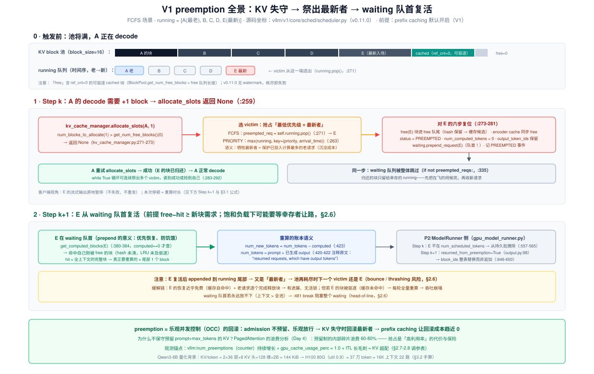
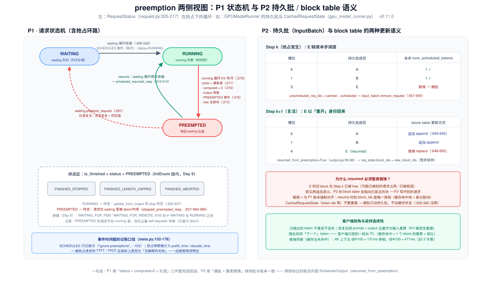
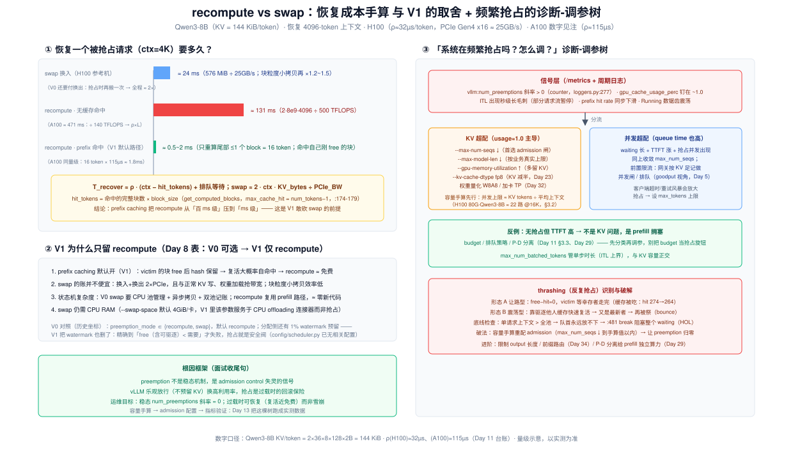

# Day 12 · Scheduler（三）—— preemption：KV 失守时的自我救济

> **系列**：推理系统优化专家岗 · 56 天打卡 | 第 2 周「vLLM V1 源码精读（上）—— 调度链路」
> **今日位置**：Day 11 读 chunked prefill 时，running 循环里留了一个分支没展开——`allocate_slots` 返回 `None`（scheduler.py:259），KV block 不够了。今天沿这条分支走完全程：**触发条件的精确判定（"free" 到底是什么）→ victim 怎么选（为什么是最新者）→ 六步复位（`num_computed_tokens = 0`、output 保留、waiting 队首）→ 恢复路径（prefix caching 让复活近乎免费）→ recompute vs swap（V1 为什么砍掉 swap）**，并回答 README 的两连问：**什么指标说明系统在频繁抢占？怎么调？** 今天也是 Day 14 复盘自测题「10 个请求、KV 只够 6 个」的预演日——实验 1 的仿真器就是它的可执行版
> **前置要求**：Day 9（`Request` 账本组与 `RequestStatus` 状态机、QUEUED/SCHEDULED 事件、`prepend_request` 的伏笔——今天全部兑现）、Day 10（waiting/running 两队列、`max_num_seqs` 与 KV 余量两道闸）、Day 11（running 循环的记账顺序、`allocate_slots` 的 chunk 粒度、§2.7 抢占触发面）、Day 2（KV 显存公式——今天的容量手算是它的直接应用）、Day 4（PagedAttention 的 60-80% 浪费分析——今天讲它的另一面：为什么不预留）、Day 5/6（指标体系与 Qwen3-8B 台账）
> **预计用时**：3 ~ 3.5 小时（源码走读 1.5h + 实验 1~1.5h + 诊断卡 0.5h）
> **背景衔接**：你在昇腾上遇到过同一个抉择：L1/DDR 放不下时，是**重算**（再跑一遍 kernel，吃算力）还是**换出**（搬到 DDR，吃带宽和搬运流水）？recompute vs swap 就是它在调度层的版本，而 V1 的答案（只留 recompute）依赖一个昇腾上没有的前提——**prefix caching 默认开启，换出后的数据大概率还在原地没被驱逐**。你做高并发服务的经验也直接适用：preemption 本质是**乐观并发控制（OCC）的回滚**——admission 不做悲观预留、乐观放行，资源失守时回滚"最年轻的事务"；而 V0 的 watermark（预留水位线）则是悲观派的余绪，V1 连它也删了
> **实验环境**：复用 Day 6 的 1 × H100/A100 + Qwen3-8B；实验 0/1（含仿真器）无 GPU 可做；实验 2/3 需要 GPU，是 Day 13 正式压测的缩小版
> **配套材料**：`week2/README.md` Day 12 节；三张 SVG：`assets/day12_preemption_flow.svg`（今日主图：触发→复位→复活全链路）、`assets/day12_preemption_state_machine.svg`（P1 状态机 + P2 持久批/block table 语义）、`assets/day12_recompute_vs_swap.svg`（恢复成本手算 + 诊断-调参树——今日产出物的底稿）
> **版本口径**：源码坐标按 **v0.11.0 tag** 逐行核对（2026-10 复核），与 Day 8/9/10/11 一致。两个随版本演进的点已标注：① v0.11.0 的 PRIORITY 策略下抢占"本步已调度的 victim"的回滚不完整，main 分支已补全（§2.3 附注）；② V0 的 swap/watermark 坐标属历史记忆（V0 代码已删除），面试引用时要带版本前缀

---

## 0. 今日学习目标

完成今天的学习后，你应该能够：

- [ ] **写出触发条件的精确判定**：`num_blocks_to_allocate > get_num_free_blocks()` → `None`（kv_cache_manager.py:271-273），并能解释 **"free" 含 ref_cnt=0 的可驱逐 cached 块**、v0.11.0 **没有 watermark**（§2.2）
- [ ] **手算 KV 池容量与并发上限**：H100 80G（util 0.9）+ Qwen3-8B FP16 ≈ 37 万 token / 2.3 万 block ≈ 16K 上下文 **22 路**——判断"会不会抢占"永远是先做这道题（§3.2）
- [ ] **背下六步复位序列**（scheduler.py:271-281）：`running.pop()` 弹最新 → free（hash 保留）→ `status=PREEMPTED` → `num_computed_tokens=0` → **output 保留** → `waiting.prepend_request`（队首）
- [ ] **解释 victim 选择**：FCFS 下保护最老者（沉没成本最多）；PRIORITY 下 `max(running, key=(priority, arrival_time))`——"数值大 = 不重要"的语义坑（§2.3）
- [ ] **讲清恢复路径**：队首优先 → `get_computed_blocks` 自命中（:380-384）→ 重算 ≈ 尾部 1 个 block；`num_tokens = prompt + output` 的重算语义（:420-423 注释原文）；P2 侧 `resumed_from_preemption` 的 **block table 整表替换**（§2.4、图 2）
- [ ] **回答 README 两连问**：频繁抢占的指标组合（`vllm:num_preemptions` 斜率 + `gpu_cache_usage_perc≈1.0` + ITL 长毛刺 + hit rate 下滑）与调参树（§2.7-2.8，图 3 右）
- [ ] **说全 recompute vs swap**：手算对比（4K ctx：swap≈24ms vs recompute 131ms vs 命中后≈1ms）+ V1 砍 swap 的 4 条理由（§2.5、§3.3）
- [ ] 交付：**preemption 诊断-调参卡**（§9 模板，图 3 是底稿）+ 实验 1 仿真推演（Day 14 自测题的预演）

---

## 1. 核心概念速览

| 概念 | 一句话定义 | 今日要达到的深度 |
|---|---|---|
| **preemption（抢占）** | KV 不足以让 running 请求继续时，把某些请求"打回 waiting"的回滚机制 | 能定位到 `schedule()` running 循环 :254-292 的 `while True` 分支 |
| **`allocate_slots` → None** | 本步需要的 block 数 > 池里可用 block 数 | 背下判定式（kv_cache_manager.py:271-273）；知道它发生在**每个请求、每步**的分配尝试里 |
| **free 的三重含义** | `get_num_free_blocks()` = 真空闲 + ref_cnt=0 的可驱逐 cached 块 | 理解"usage≈1.0 才是真耗尽"——cached 块在指标里算 free（block_pool.py:385-404） |
| **victim** | 被抢占的请求 | FCFS：`running.pop()` 最新者（:271）；PRIORITY：`max(priority, arrival_time)`（:262-266） |
| **沉没成本保护** | 牺牲最新者 = 保护已投入计算最多的老请求 | 能用 FCFS 语义讲清"为什么不是砍最大的" |
| **`num_computed_tokens = 0`** | Day 9 的账本字段被清零 | 知道这是"从头重算"的全部状态（recompute 模式的本体） |
| **output 保留** | 已生成的 token 不丢，恢复时作为输入重算 | 能推演恢复后采样"下一个" token 的连续性（§2.4） |
| **`prepend_request`（队首）** | 被抢占请求插到 waiting 队头（:281） | 双重语义：优先恢复（已投入最多）+ 防饥饿震荡；Day 9 埋的伏笔 |
| **本步 waiting 跳过** | `if not preempted_reqs:`（:335） | 理解"归还的块先留给幸存 running，再收新请求" |
| **`resumed_from_preemption`** | SchedulerOutput 里标记"这是复活请求"（output.py:95-98） | 知道 P2 据此把 block_ids **整表替换**而非追加（:646-650） |
| **缓存自命中** | victim 的块 free 后 hash 保留 → 复活时 `get_computed_blocks` 命中自己 | 这是"recompute 近乎免费"和"V1 敢砍 swap"的共同前提（§2.4-2.5） |
| **bounce / thrashing** | 同一请求反复被祭：复活 → 长几步 → 再被祭 | 能推演触发条件与"有进展、无活锁"的边界（§2.6） |
| **head-of-line 阻塞** | 队首请求永远放不下时 `break`（:481-483）阻塞整个 waiting | 知道"单请求上下文 > 全池"是必须排查的配置底线 |
| **recompute vs swap** | 重算（吃 FLOPs）vs KV 搬到 CPU 再搬回（吃 PCIe + RAM） | 能手算两者成本并讲 V1 只留 recompute 的 4 条理由 |
| **watermark（V0 历史）** | 分配时预留 ~1% 块的水位线 | 知道 V1 删掉了它：精确耗尽 + 抢占兜底，代替悲观预留 |
| **`vllm:num_preemptions`** | Prometheus counter（loggers.py:277-282） | 会读斜率；知道它由 PREEMPTED 事件驱动、随请求下次输出上报（§2.7） |

> **一句话本质**：preemption = **乐观并发控制的回滚路径**。vLLM 的 admission 不为每个请求预留 prompt+max_tokens 的 KV（那是 PagedAttention 论文批判的 60-80% 浪费，Day 4），而是乐观放行、靠抢占在失守时回滚"最年轻的事务"；prefix caching 默认开启后，回滚成本从"全量重算"塌缩到"尾部一个 block"，这就是 V1 删掉 swap 与 watermark 的全部底气。

---

## 2. 原理深入讲解

### 2.1 回顾与今日地图

Day 10 立了 `schedule()` 的骨架，Day 11 放大了 budget 的"切片刀"身份，今天补上最后一块拼图：

| Day | 放大哪一块 | 状态 |
|---|---|---|
| Day 8 | 进程地图（P0/P1/P2、ZMQ、DTO） | ✅ |
| Day 9 | 入口链路九站 + `Request` 解剖 | ✅ |
| Day 10 | 两队列 + budget 记账 + 两道闸 | ✅（计划内） |
| Day 11 | budget 的切片刀：chunked prefill | ✅ |
| **Day 12（今天）** | **KV 失守：preemption（`allocate_slots` → None 的分支）** | ▶ |
| Day 13 | 压测验证：长 prompt 洪峰 + 高并发挤爆 KV | 待 |
| Day 14（复盘） | 请求在 scheduler 中的状态机 | 待（今天图 2 左半是预演） |

Day 11 的两个伏笔今天兑现：① running 循环里 `allocate_slots` 返回 None 的分支（day11 §4.2 里注释"Day 12 的全部内容"）；② waiting 循环用 `request.num_tokens` 而不是 `num_prompt_tokens` 算欠账（:423）——"为了照顾被抢占后带着输出 token 恢复的请求"。

### 2.2 触发条件：`allocate_slots` 什么时候返回 None（图 1 顶部）



**判定式只有一行**（`vllm/v1/core/kv_cache_manager.py:260-273`）：

```python
num_tokens_need_slot = min(num_computed_tokens + num_new_tokens
                           + num_lookahead_tokens, self.max_model_len)
num_blocks_to_allocate = self.coordinator.get_num_blocks_to_allocate(...)
if num_blocks_to_allocate > self.block_pool.get_num_free_blocks():
    return None                                   # :271-273 ★ 抢占的起点
```

三个必须想透的语义：

1. **"free" 不只是"没人的块"**。`get_num_free_blocks()`（block_pool.py:385-391）返回 free 队列长度，而 free 队列里既有真正空闲的块，也有 **ref_cnt=0 但 hash 还在的 cached 块**（可驱逐、也是缓存命中候选）。所以精确的失败边界是：**"需要的块数 > 真空闲 + 可驱逐缓存"**。推论：抢占前系统会先经历一轮**缓存驱逐**（cached 块被 allocation 借走、prefix hit rate 下滑），最后才轮到抢 running 请求——这个顺序就是 §2.7 观测链的机制来源。
2. **v0.11.0 没有 watermark**。V0 时代分配侧有 ~1% 块的预留水位线（`watermark_blocks`），宁可少用也不碰底；V1 把它删了——精确到"free < 需要"才失败，靠抢占兜底。这是"悲观预留 → 乐观放行 + 回滚"的完整转向。
3. **触发面是"每请求每步"的**。Day 11 说过：chunked prefill 让 admission 的 KV 门槛降到 chunk 粒度，**同理也让 running 请求每步的增量申请变小**（decode 每步只要 `ceil` 到 block 边界时才 +1 块）。所以触发抢占的不是"池小"本身，而是**池小 × admission 超配 × 输出比预期长**三者叠加——`max_num_seqs` 默认 1024（H100），而 KV 容量可能只够 20 路 16K 上下文（§3.2 手算），admission 完全不看 KV 足印，这就是抢占的"设计内"成因。

**诱因画像**（week2/README 12.1 的口径）：`max_num_seqs` 过大 + 长输出请求堆积 → KV 增长超预期。**它是 admission control 失当的信号，不是正常态**——这句话就是面试的收尾框架。

### 2.3 处理流程：六步复位与 victim 选择（图 1 中部）

抢占分支在 running 循环的 KV 分配处（scheduler.py:254-292，完整代码见 §4.1）。逐行读六步复位：

```python
# ① 选 victim（:262-271）
if self.policy == SchedulingPolicy.PRIORITY:
    preempted_req = max(self.running,
                        key=lambda r: (r.priority, r.arrival_time))  # :263-266
    self.running.remove(preempted_req)                               # :267
    if preempted_req in scheduled_running_reqs:                      # :268
        scheduled_running_reqs.remove(preempted_req)                 # :269
else:
    preempted_req = self.running.pop()                               # :271 ★ FCFS：弹最新
# ② 归还 KV（:273-274）
self.kv_cache_manager.free(preempted_req)        # 块进 free 队尾，hash 保留 → 缓存候选
self.encoder_cache_manager.free(preempted_req)   # 多模态 encoder cache 同步归还
# ③④ 状态与账本复位（:275-276）
preempted_req.status = RequestStatus.PREEMPTED
preempted_req.num_computed_tokens = 0            # ★ Day 9 账本清零 = "从头重算"
# ⑤ 事件（:277-279）
preempted_req.record_event(EngineCoreEventType.PREEMPTED, scheduled_timestamp)
# ⑥ 队首复活（:281-282）
self.waiting.prepend_request(preempted_req)      # ★ 队首，不是队尾！
preempted_reqs.append(preempted_req)
```

六个设计点，每个都值得在面试里展开：

1. **victim = 最新者（FCFS）**。`running` 是时间序列表，`pop()` 弹出**最新入场**的请求。语义：保护已投入计算最多的老请求（沉没成本），牺牲最年轻的。注意 **victim 通常不是"导致失败的请求"**——老请求 A 分配失败，被祭的是最新的 E（图 1）。反直觉但正确：A 的剩余价值最大。
2. **PRIORITY 策略下的 victim**：`max(running, key=(priority, arrival_time))`——priority **数值最大**（= 最不重要，V1 语义是"小值优先"，request_queue.py:143-145）优先被祭，同值再比谁来得晚。这是"入队优先级 ≠ 抢占优先级"（Day 9 考点）的另一半：高优先级（小值）请求**确实更不容易被抢占**。
3. **free 的方向有讲究**：`free()` 按 block 逆序归还（kv_cache_manager.py:306-314 docstring），尾部块先进 free 队列**尾端**——LRU 语义下"最不容易被驱逐"，让 victim 的前缀在复活时大概率还在（§2.4 的前提）。
4. **output 保留、computed 清零**：被抢占请求带着已生成 token 回到 waiting。恢复时 `prompt + output` 全量作为输入重算（见 §2.4）——这就是 recompute 模式的全部状态机，没有别的隐藏状态。
5. **`while True` 可以连续祭出多个 victim**：free 一个不够就再 free 一个，直到 `allocate_slots` 成功；若抢到了**自己**（`preempted_req == request`，:283-286，发生在自己就是最新者时）→ `can_schedule=False` → **本步 running 扫描整体终止**（:291-292）。FCFS 下victim 永远从队尾弹出，所以"抢到自己"= 自己就是最新者。
6. **同一步 waiting 被整体跳过**（:335 `if not preempted_reqs:`）：归还的块先满足幸存的 running，本步不收新请求。两重效果：避免"刚 free 的块立刻被新 prefill 吃掉、下一步又抢占"的震荡；代价是短请求的 admission 被推迟一步。

> **附注（版本演进，读码记版本的一个活案例）**：v0.11.0 的 PRIORITY 分支里，若 victim 恰好是**本步已调度**的请求（在 `scheduled_running_reqs` 里），只把它从 `scheduled_running_reqs` 移除（:268-269），`num_scheduled_tokens` 的残留条目与 token_budget 都没有回滚；main 分支后来补全了这条路径（`num_scheduled_tokens.pop`、`req_to_new_blocks.pop`、encoder 预算恢复，并把六步复位提成 `_preempt_request` 方法）。FCFS 主路径（vLLM 默认）在 v0.11.0 就是干净的：victim 弹自队尾、必然未调度。**面试讲这段的前提是先讲清 FCFS 主干，再以"我对比过 main 分支"的姿态带出**。

### 2.4 恢复路径：从队首复活到 block table 整表替换（图 1 底部、图 2）



抢占发生后，E 就在 waiting **队首**。此后的某个 step（该步没再发生抢占，且 E 的复活判定 `need + hit ≤ free` 通过——可能是下一步，也可能要等幸存者让路，见 §2.6 两种形态），waiting 循环把它接回来。恢复的四段语义：

**① 缓存查询（救命的一步）**。E 的 `num_computed_tokens` 已被清零，所以走 `if request.num_computed_tokens == 0:` 分支（:380-384）→ `get_computed_blocks(E)`。由于 E 的块刚被 free、hash 保留、LRU 序里排在最后被驱逐的位置——**大概率命中自己刚才的几乎全部上下文**（命中数 = 完整块数 × block_size，上限 `num_tokens − 1`，kv_cache_manager.py:174-179 注释：最后一块必须重算以拿到 logits）。注意前提：**这些块还没被幸存请求的增长驱逐**——饱和负载下 hit 会打折甚至清零（§2.6 形态 A，实验 1 实测 hit 274→264）。即便如此，"重算量从整个上下文塌缩到尾部块"仍是 V1 把恢复设计成"全量重算"的物质基础。

**② 欠账的口径**（:420-423，注释原文值得背）：

```python
# We use `request.num_tokens` instead of
# `request.num_prompt_tokens` to consider the resumed
# requests, which have output tokens.
num_new_tokens = request.num_tokens - num_computed_tokens
```

`num_tokens = prompt + output`（request.py:169-170）——恢复请求的"重算 prompt"是 prompt+已生成 token 的拼接。新请求与复活请求在同一段代码里被统一处理（Day 11 统一模型的又一次兑现）。

**③ 重新入队与标记**。E 被 pop 出 waiting、append 回 running（:498-507）；因 `status == PREEMPTED` 走 `scheduled_resumed_reqs.append`（:513-514，区别于新请求的 `scheduled_new_reqs`）；随后 `status = RUNNING`（:525）、`num_computed_tokens` 回填为缓存命中的 token 数（:526）。**注意：E append 回 running 尾部 → 又是最新者** → 若池再次耗尽，下一个 victim 还是 E（§2.6 的 bounce）。

**④ P2 侧的配合**（`gpu_model_runner.py`，图 2 右）。抢占当步，E 不在本步 `num_scheduled_tokens` 里 → `unscheduled_req_ids = cached − scheduled`（:557-559）→ 从持久批 `remove_request`，但 `CachedRequestState`（token ids 等）保留（:552-565 注释："preempted requests or running requests that are not scheduled…keep their cached states"）。复活当步，`SchedulerOutput.scheduled_cached_reqs` 里带着 `resumed_from_preemption=True`（output.py:95-98），P2 据此把 `req_state.block_ids = new_block_ids` **整表替换**（:646-650）——对比正常 decode 的 append（:640-645）。为什么必须替换：E 的旧 block 已被 free、可能已易主，追加语义会让 block table 指向别人的块；替换 = 与 P1 账本强制对齐（命中块 + 新分配块的完整列表是唯一真相）。

**客户端视角与采样连续性**：已输出的 token 不重发不丢失；恢复时把 prompt+output 全量重算（KV 确定性重建），随后采样"下一个"token。用户看到的是**一段长 ITL**：缓存命中 ≈ 1 个 block 的重算 + 一次排队；缓存全未命中 = 全量重算（4K ctx @H100 ≈ 131ms，@A100 ≈ 471ms，§3.3）。

**终态旁路**：请求也可能**死在 waiting 里**——被抢占后在 waiting 队首等恢复时被 abort（客户端断开）或判停。`update_from_output` 用 `stopped_preempted_reqs` 集合处理这条路径（scheduler.py:883/:937/:984-986，`self.waiting.remove_requests(...)`），注释自嘲"This is a rare case and unlikely to impact performance"。

### 2.5 recompute vs swap：V1 为什么砍掉 swap（图 3 左/中）



V0 的 `preemption_mode` 可选 recompute（默认）/ swap；V1 只留 recompute（Day 8 的 V0→V1 表）。先把两种模式的成本摆到桌面上（详细手算见 §3.3）：

| | recompute（V1 唯一） | swap（V0 可选，V1 已删） |
|---|---|---|
| 恢复成本 | 重算 `(ctx − 命中)` 个 token 的 FLOPs | KV 经 PCIe 搬出再搬回（2× 单程） |
| 前提条件 | 无（复用 prefill 路径） | CPU 池 + pinned memory + 异步拷贝管理 |
| prefix caching 交互 | **命中则近似免费**（尾部 1 block） | 与缓存机制纠缠（换出的块 hash 怎么办） |
| 实现复杂度 | ≈ 零新代码（六步复位 + 队首复活） | 双池记账、拷贝流水、swap 队列，V0 的一坨历史包袱 |
| 带宽竞争 | 无（吃算力） | 与权重加载/其他传输抢 PCIe |

**V1 砍 swap 的 4 条理由**（图 3 中部）：

1. **前提变了**：V1 prefix caching 默认开。victim 的块 free 后 hash 保留 → 复活大概率自命中 → recompute 从"百 ms 级"塌缩到"ms 级"，**比 swap 还快**（swap 换入 4K ctx ≈ 24ms，还得先付换出 2×）。
2. **swap 的账并不便宜**：块粒度小拷贝（16 token = 2.25 MiB/块）PCIe 效率低；抢占时换出 + 恢复时换入 = 两次全量搬运。
3. **状态机复杂度**：swap 需要 CPU 池管理 + 异步拷贝 + 双池一致性；recompute 只是"把请求塞回 waiting 队首"，调度器几乎零新增代码（今天读的 :271-281 就是全部）。
4. **资源占用**：swap 要 CPU RAM（`--swap-space` 默认 4 GiB/卡——这个参数 V1 还在，cache.py:51，但服务于 CPU offloading 连接器如 LMCache，与调度器抢占无关；面试时这是个"你真的读过 V1 吗"的鉴别题）。

**顺带把 watermark 一起讲**（图 3 中部底注）：V0 分配侧留 ~1% 块的水位线，属于悲观派；V1 删掉它，"精确耗尽才失败 + 抢占兜底"。悲观预留 vs 乐观放行 + 回滚——这组对立贯穿 PagedAttention（Day 4）、调度 admission（Day 10）和今天的 preemption，面试可以串成一条主线。

### 2.6 thrashing：被祭者的两种走向，什么时候反复抢占（图 3 右下）

抢占后的 victim 有两种形态（实验 1 都能复现）：

**形态 A · 让路型（饱和负载的常态）**。victim 被祭后，池里的空闲块**全是它自己的缓存**——复活判定 `need + hit > free` 里 free 含自己的命中块，认领后所剩为零（`free − hit = 0`）→ 它每个 step 都在队首尝试、每个 step 都失败（waiting 循环 `break`），直到幸存者完成让出块。实验 1 主场景：R7 在 step 290 被祭，step 321 才复活（等 R1-R6 走完），期间幸存者的增长还吃掉了它 10 块缓存（hit 274 → 264）。FCFS"保护老请求"在这里体现得最彻底。

**形态 B · bounce 震荡型**。若池里还有**别人的**可驱逐缓存（早完成的请求留下的），victim 可以靠驱逐它们立刻复活、append 回 running 尾部——**又是最新者** → 池再耗尽时再被祭。实验 1 的进阶配方（池 1820 块、R1 短输出 100、其余输出 900）：R7 被祭两次（step 66 / 754），两次复活都靠缓存命中，总重算只有 ~1K token——震荡但便宜。

**关键结论**：
- **有进展、无活锁**：两种形态下老请求都在推进、逐个完成释放块——FCFS + 队首复活保证系统总能走出震荡。真正的"假死"需要另一个条件（见下）。
- **缓存被吃光时才是灾难**：形态 A 里若幸存者的增长把 victim 的缓存全部驱逐，复活退化为全量重算——实验 1 主场景 `--no-cache`：重算 161 → 4385 token（**27×**），真实系统的停顿差 ≈ 4224 token × ρ ≈ 135ms @H100 / 486ms @A100。
- **head-of-line 阻塞（配置底线）**：若**单个请求的上下文 > 整个 KV 池**，它作为队首永远 `allocate_slots` 失败 → waiting 循环 `break`（:481-483）→ **阻塞它身后所有请求**，系统假死（实验 1 的 `--blocks 250`：4000 步 0 完成）。排查式：`max_model_len × KV/token ≤ KV 池总量` 必须成立（§3.2 手算的一行版）。
- **破法**（按层次）：容量手算重配 admission（`max_num_seqs` 降到并发上限以内）→ 限制输出长度 / `max_model_len` → KV FP8 → 前缀感知路由（Day 34）→ P/D 分离给 prefill 独立算力（Day 29）。

### 2.7 观测：抢占如何流到指标（图 3 右上）

事件 → 统计 → 指标的三级链路（全部 v0.11.0 实测坐标）：

1. **P1 记事件**：`record_event(PREEMPTED)`（:277-279）。事件附着在 Request 上，**随该请求下一次产生输出时**发到 P0——被抢占当步请求没有输出，所以计数延迟到复活之后（对斜率无影响，对"抢占与指标的对时"有偏移，Day 13 实验时会看到）。
2. **P0 记统计**：`IterationStats.update_from_events` 里 `num_preempted_reqs += 1`（stats.py:156-157）。同函数还有两个口径细节：SCHEDULED 事件**只记首次**（:153 注释 "ignore preemptions"，queue_time 不因抢占重复计时）；而 `prefill_time`/`decode_time`/`inference_time` **包含抢占停顿**（:169-178 注释原文 "Any preemptions during prefill/decode is included"）→ 被抢占请求的 TTFT/TPOT 表现为"无解释的毛刺"。
3. **Prometheus**：`vllm:num_preemptions`（counter，"Cumulative number of preemption from the engine"，loggers.py:277-282，:560-561 递增）。

**频繁抢占的指标组合**（README 第一问的答案，四件套缺一不可）：

| 指标 | 频繁抢占时的形态 | 机制对应 |
|---|---|---|
| `vllm:num_preemptions` | **斜率持续 > 0**（counter 看 rate，不是绝对值） | PREEMPTED 事件流 |
| `vllm:gpu_cache_usage_perc` | 钉在 **~1.0**（含可驱逐块都耗尽） | `get_usage` = 1 − free/total，free 含 cached |
| ITL（`vllm:time_per_output_token_seconds`） | **秒级长毛刺**（被抢占请求流暂停） | 全量/尾部重算 + 排队 |
| prefix hit rate | **同步下滑**（缓存先被驱逐再轮到抢占） | §2.2 的"先驱逐后抢占"顺序 |
| Running 数（周期日志） | 锯齿震荡（祭出→复活） | 队首复活循环 |

诊断树见 **图 3 右侧**：抢占 + usage≈1.0 → KV 超配；抢占 + queue time 高 → 并发超配；**无抢占但 TTFT 高 → 是 prefill 拥塞，别乱动 KV 旋钮**（Day 13 实验会做出这条分类线）。

### 2.8 调参：旋钮表与根因框架

| 旋钮 | 方向 | 作用面 | 备注 |
|---|---|---|---|
| `--max-num-seqs` | ↓ | admission 闸（请求维度） | **首选**；收到 §3.2 手算的并发上限以内 |
| `--max-model-len` | ↓ | 单请求 KV 上限 | 按业务真实分布设，别照模型能力设 |
| `--gpu-memory-utilization` | ↑ | KV 池总量 | 留意与 activation 峰值的安全边际 |
| `--kv-cache-dtype fp8` | fp8 | KV/token 减半 → 块数×2 | Day 23 实验；有精度代价 |
| 权重量化（W8A8 等） | 量化 | 权重省下的显存全给 KV | Day 22-24 专题 |
| `--max-num-batched-tokens` | ✗ | **不是抢占的旋钮** | 它管单步时长/ITL 上界（Day 11），与 KV 容量正交 |
| 前置限流（网关） | ↓ 并发 | 按 KV 足记做 admission | goodput 视角的根治法（Day 5） |
| 架构级 | — | P/D 分离、前缀路由 | Day 29/34 |

**根因框架**（面试收尾句，图 3 左下）：preemption 不是稳态机制，是 **admission control 失灵的信号**。vLLM 用乐观放行换高利用率（不预留 = 不浪费），抢占是过载时的回滚保险；运维目标是**稳态斜率为 0**，过载时可恢复（复活近免费）而非雪崩。

---

## 3. 性能模型：今日的数学

### 3.1 抢占的代价公式

**victim 视角的停顿时延**：

$$T_{stall} \approx \underbrace{T_{wait}}_{\text{排队到复活}} + \underbrace{\rho \cdot (L_{ctx} - L_{hit})}_{\text{重算}}， \quad L_{hit} = \lfloor (L_{ctx}-1)/B_{blk} \rfloor \cdot B_{blk}$$

其中 ρ 是每 token 计算时间（Day 11 台账：H100 ≈ 32µs，A100 ≈ 115µs），$L_{hit}$ 是缓存命中的完整块覆盖（上限 `num_tokens − 1`，最后一块必重算）。两个极端：全命中 → ρ·16token ≈ 0.5~2ms；全未命中 4K ctx → 131ms(H100) / 471ms(A100)。

**系统视角的浪费**：每次抢占浪费的 FLOPs = $2P \cdot (L_{ctx} - L_{hit})$。10 个请求的系统若每分钟 60 次全量 4K 重算 ≈ 60 × 65.5 GFLOP ≈ 3.9 TFLOP/min——H100 有效算力 500 TFLOPS 下占 0.13%，看似不大；**真正的代价在时延**（victim 的 ITL 毛刺）与**连锁反应**（bounce 时的反复浪费、HOL 阻塞）。这也是"吞吐掉得不明显但 SLO 先崩"的典型形态（Day 5 的 goodput 视角）。

### 3.2 容量-并发上限手算（判断"会不会抢占"的第一步）

沿用 Day 2 公式，Qwen3-8B（36 层、GQA 8 KV 头、head_dim 128、FP16）：

$$KV/token = 2 \times 36 \times 8 \times 128 \times 2B = 147{,}456B = 144\ \text{KiB} \qquad (B_{blk}=16 \Rightarrow 2.25\ \text{MiB/block})$$

H100 80G、`--gpu-memory-utilization 0.9`：

| 项 | 数值 |
|---|---|
| 显存预算 | 0.9 × 80 = 72 GB |
| − 权重（8.2B × FP16） | ≈ 16.4 GB |
| − activation 峰值（profiling 实测，budget 8192 下） | ≈ 2~4 GB |
| **= KV 池** | **≈ 51~53 GB** |
| **KV token 容量** | 51e9~53e9 ÷ 147456 ≈ **35~36 万 token**（以启动日志 `GPU KV cache size: N tokens` 为准，kv_cache_utils.py:1087） |
| **block 数** | ≈ 2.2 万块（÷16） |
| **并发上限 @16K ctx** | 36 万 ÷ 16384 ≈ **22 路** |
| **并发上限 @8K / @4K** | ≈ 44 路 / ≈ 88 路 |

**三个直接推论**：① `max_num_seqs` 默认 1024 ≫ 22——**KV 远先于 max_num_seqs 成为瓶颈**，超过 22 路 16K 请求就开始"先驱逐缓存、后抢占"；② 启动日志的 `Maximum concurrency for 16,384 tokens per request: 22.xx`（kv_cache_utils.py:1091）就是这道手算的官方版——实验 0 对账；③ 配置底线：`max_model_len × 144 KiB ≤ KV 池`，否则 HOL 假死（§2.6）。

### 3.3 recompute vs swap 定量对比（图 3 左）

恢复 4096-token 上下文（KV = 4096 × 144 KiB = 576 MiB）：

| 方案 | H100 | A100 | 备注 |
|---|---|---|---|
| swap 换入（PCIe Gen4 x16 ≈ 25GB/s） | ≈ 24 ms | ≈ 24 ms | 块粒度小拷贝 ×1.2~1.5 开销；**换出再 +1×** |
| recompute · 无缓存命中 | 2·8e9·4096 ÷ 500T ≈ **131 ms** | ÷ 140T ≈ **471 ms** | ρ×L |
| recompute · prefix 自命中（V1 默认路径） | 16 token × 32µs ≈ **0.5 ms** | ≈ 1.8 ms | 只重算尾部 ≤1 block |

结论：**swap 在"无缓存"假设下确实快于 recompute（24 vs 131ms）**——V0 选它有道理；**V1 的前提是缓存命中把 recompute 压到 0.5ms，反超 swap 一个量级**，于是 swap 的全部复杂度都不值得保留。1K ctx 的版本：swap ≈ 6ms、recompute ≈ 33/109ms、命中 ≈ 0.5ms（同一套公式，自查题 Q3）。

### 3.4 练手对账题（答案见 §8）

> **题 1**：A100 80G、util 0.85、Qwen3-8B FP16、budget 4096。算 KV token 容量、block 数、12K 上下文并发上限；若 `max_num_seqs=64`，会发生什么？
>
> **题 2**：README Day 14 自测题预演——10 个请求（prompt 4096、output 320）、KV 池 1920 块（够 ~7 个 prompt / ~6.9 个全上下文）、budget 32768、block 16。推演：第一步 admission 收几个？什么时候第一次抢占？victim 是谁？它何时复活、重算多少？关掉 prefix caching 浪费放大几倍？（用实验 1 的仿真器对账）

---

## 4. 关键代码走读（v0.11.0 逐行核对版）

> **阅读方法**：对照图 1 从上往下走。以下为主干保真节选，行号以 v0.11.0 为准。

### 4.1 running 循环的抢占分支（scheduler.py:254-300）

```python
while True:                                                    # :254
    new_blocks = self.kv_cache_manager.allocate_slots(
        request, num_new_tokens,
        num_lookahead_tokens=self.num_lookahead_tokens)        # :255-258
    if new_blocks is None:
        # The request cannot be scheduled.
        # Preempt the lowest-priority request.                 # :260-261
        if self.policy == SchedulingPolicy.PRIORITY:           # :262
            preempted_req = max(
                self.running,
                key=lambda r: (r.priority, r.arrival_time))    # :263-266
            self.running.remove(preempted_req)                 # :267
            if preempted_req in scheduled_running_reqs:        # :268
                scheduled_running_reqs.remove(preempted_req)   # :269
        else:
            preempted_req = self.running.pop()                 # :271 ★ FCFS victim
        self.kv_cache_manager.free(preempted_req)              # :273
        self.encoder_cache_manager.free(preempted_req)         # :274
        preempted_req.status = RequestStatus.PREEMPTED         # :275
        preempted_req.num_computed_tokens = 0                  # :276 ★ 账本清零
        if self.log_stats:
            preempted_req.record_event(
                EngineCoreEventType.PREEMPTED, scheduled_timestamp)  # :277-279
        self.waiting.prepend_request(preempted_req)            # :281 ★ 队首
        preempted_reqs.append(preempted_req)                   # :282
        if preempted_req == request:                           # :283
            # No more request to preempt.                      # :284
            can_schedule = False
            break
    else:
        can_schedule = True                                    # :289
        break
if not can_schedule:
    break                       # :291-292 ← 整个 running 扫描终止（本步）
# ...成功路径：
scheduled_running_reqs.append(request)                         # :296
num_scheduled_tokens[request.request_id] = num_new_tokens      # :298
token_budget -= num_new_tokens                                # :299
```

### 4.2 waiting 循环的恢复分支（scheduler.py:335, 380-384, 420-437, 471-526）

```python
if not preempted_reqs:                                         # :335 本步无抢占才收新
    while self.waiting and token_budget > 0:
        if len(self.running) == self.max_num_running_reqs:     # :337 max_num_seqs 闸
            break
        request = self.waiting.peek_request()                  # :340 队首 = 复活者优先
        ...
        if request.num_computed_tokens == 0:                   # :380 复活/新请求都走这里
            new_computed_blocks, num_new_local_computed_tokens = \
                self.kv_cache_manager.get_computed_blocks(request)  # :382-384 ★ 缓存自命中
            ...
        # We use `request.num_tokens` instead of
        # `request.num_prompt_tokens` to consider the resumed
        # requests, which have output tokens.                  # :420-422 注释原文
        num_new_tokens = request.num_tokens - num_computed_tokens   # :423
        ...
        num_new_tokens = min(num_new_tokens, token_budget)     # :437 复活也要过 budget
        new_blocks = self.kv_cache_manager.allocate_slots(     # :471
            request, num_new_tokens + num_external_computed_tokens, ...)
        if new_blocks is None:
            break                                              # :483 ★ HOL：队首放不下即止
        request = self.waiting.pop_request()                   # :498
        self.running.append(request)                           # :507 又回队尾 = 又是最新者
        if request.status == RequestStatus.WAITING:
            scheduled_new_reqs.append(request)                 # :512 新请求
        elif request.status == RequestStatus.PREEMPTED:
            scheduled_resumed_reqs.append(request)             # :514 ★ 复活请求
        ...
        request.status = RequestStatus.RUNNING                 # :525
        request.num_computed_tokens = num_computed_tokens      # :526 回填命中值
```

### 4.3 SchedulerOutput 与 P2 侧（output.py + gpu_model_runner.py）

```python
# output.py:92-98 —— resumed 标记随 CachedRequestData 下发
# If resumed_from_preemption is False, new_block_ids will be appended to
# the request's block IDs. If True, new_block_ids will be used as the
# request's block IDs instead of appending to the existing block IDs.
resumed_from_preemption: list[bool]

# scheduler.py:696-699 —— resumed 段在 cached_reqs_data 尾部拼接
resumed_from_preemption = [False] * len(running_reqs)
resumed_from_preemption += [True] * len(resumed_reqs)

# gpu_model_runner.py:552-565 —— 被抢占请求从持久批摘除
# NOTE(woosuk): The unscheduled requests are either preempted requests
# or running requests that are not scheduled in this step. We remove
# them from the persistent batch but keep their cached states ...
scheduled_req_ids = scheduler_output.num_scheduled_tokens.keys()
unscheduled_req_ids = self.input_batch.req_id_to_index.keys() - scheduled_req_ids
for req_id in unscheduled_req_ids:
    self.input_batch.remove_request(req_id)

# gpu_model_runner.py:639-657 —— block table 的两种更新语义
if not resumed_from_preemption:
    for block_ids, new_ids in zip(req_state.block_ids, new_block_ids):
        block_ids.extend(new_ids)                              # :643-645 正常：追加
else:
    assert new_block_ids is not None
    # The request is resumed from preemption.
    # Replace the existing block IDs with the new ones.
    req_state.block_ids = new_block_ids                        # :646-650 复活：整表替换
```

### 4.4 终判与指标（scheduler.py + stats.py + loggers.py）

```python
# scheduler.py:932-937 —— 请求死在 waiting（如被 abort）的旁路
if stopped:
    if status_before_stop == RequestStatus.RUNNING:
        stopped_running_reqs.add(request)
    else:
        stopped_preempted_reqs.add(request)                    # :937
# :984-986
if stopped_preempted_reqs:
    # This is a rare case and unlikely to impact performance.
    self.waiting.remove_requests(stopped_preempted_reqs)

# stats.py:152-157 —— 事件口径
elif event.type == EngineCoreEventType.SCHEDULED:
    if req_stats.scheduled_ts == 0.0:  # ignore preemptions    # :153 只记首次
        req_stats.scheduled_ts = event.timestamp
elif event.type == EngineCoreEventType.PREEMPTED:
    self.num_preempted_reqs += 1                               # :157

# stats.py:169-178（注释节选）—— 抢占停顿计入时延
# Prefill interval is from first SCHEDULED to first NEW_TOKEN
# Any preemptions during prefill is included in the interval

# loggers.py:277-282, :560-561 —— Prometheus counter
counter_num_preempted_reqs = self._counter_cls(
    name="vllm:num_preemptions",
    documentation="Cumulative number of preemption from the engine.")
...
self.counter_num_preempted_reqs[engine_idx].inc(
    iteration_stats.num_preempted_reqs)
```

### 4.5 调用链速查表（今日总账）

| # | 站点 | 函数 / 判定 | 文件:行 |
|---|---|---|---|
| ⓪ | step 三段式 | `EngineCore.engine_step` | `v1/engine/core.py:283-287` |
| ① | running 扫描 | `schedule()` 循环 | `v1/core/sched/scheduler.py:210` |
| ② | **失败判定** | `allocate_slots` → None | `v1/core/kv_cache_manager.py:260-273` |
| ③ | free 语义 | `get_num_free_blocks`（含可驱逐） | `v1/core/block_pool.py:385-391` |
| ④ | victim 选择 | FCFS `running.pop()` / PRIORITY `max(...)` | `scheduler.py:262-271` |
| ⑤ | 六步复位 | free → PREEMPTED → computed=0 → 队首 | `scheduler.py:273-281` |
| ⑥ | 自我抢占终止 | `preempted_req == request` → break | `scheduler.py:283-292` |
| ⑦ | waiting 跳过 | `if not preempted_reqs:` | `scheduler.py:335` |
| ⑧ | 复活缓存查询 | `get_computed_blocks`（computed==0 才查） | `scheduler.py:380-384` |
| ⑨ | 欠账含 output | `num_tokens − computed` | `scheduler.py:420-423` |
| ⑩ | resumed 标记 | `scheduled_resumed_reqs` → status=RUNNING | `scheduler.py:513-514/:525-526` |
| ⑪ | DTO 下发 | `CachedRequestData.resumed_from_preemption` | `v1/core/sched/output.py:95-98` + `scheduler.py:698-699` |
| ⑫ | P2 摘批 | `unscheduled_req_ids → remove_request` | `v1/worker/gpu_model_runner.py:552-565` |
| ⑬ | block table 替换 | `req_state.block_ids = new_block_ids` | `gpu_model_runner.py:646-650` |
| ⑭ | 终判旁路 | `stopped_preempted_reqs` | `scheduler.py:883/:937/:984-986` |
| ⑮ | 事件→统计→指标 | PREEMPTED → `num_preempted_reqs` → counter | `v1/metrics/stats.py:156-157` + `loggers.py:277-282/:560-561` |

---

## 5. 动手实验（约 60~90 分钟）

> 环境沿用 Day 6 台账。实验 0/1 无 GPU 可做；实验 2/3 是 Day 13 正式压测的缩小版——今天只看现象，明天做"现象 → 源码机制 → 指标表现"三段对照记录。

### 实验 0（必做，10 min）：容量手算对账

```bash
pip show vllm | head -3        # 记录版本（本篇坐标：v0.11.0）
vllm serve Qwen/Qwen3-8B --gpu-memory-utilization 0.9 --max-model-len 32768 2>&1 \
  | grep -E "GPU KV cache size|Maximum concurrency"
# 预期（H100 80G 量级，以你的机器为准）：
#   GPU KV cache size: ~3XX,XXX tokens
#   Maximum concurrency for 32,768 tokens per request: ~11.xx
```

- [ ] 用 §3.2 公式手算，与日志对账（误差应在 activation 峰值那一项）
- [ ] 换算并发上限 @8K / @16K，和你预期的业务并发比一比——离抢占有多远？

### 实验 1（必做，30 min；无 GPU 可做）：preemption 仿真器——"10 个请求、KV 只够 7 个"

在 Day 11 仿真器上加三样东西：**block 池（free = 真空闲 + 可驱逐 cached，LRU 驱逐——BlockPool 口径）、抢占分支、复活自命中**。对应 scheduler.py:254-292 与 block_pool.py 的 free 语义：

```python
#!/usr/bin/env python3
"""day12_sim.py —— preemption 最小仿真（v0.11.0 scheduler.py + BlockPool 语义）
用法: python day12_sim.py [--blocks 1920] [--no-cache] [--steps 6]
场景: 10 个请求 × (prompt 4096, output 320)，budget 32768（让 KV 而非 budget 成为约束）
"""
import argparse
from collections import deque

class Req:
    def __init__(self, rid, prompt, max_tokens):
        self.rid, self.prompt, self.max_tokens = rid, prompt, max_tokens
        self.output, self.computed, self.blocks = 0, 0, 0
        self.recomputed, self.preemptions, self.done_step = 0, 0, None

    @property
    def ctx(self):                       # num_tokens = prompt + output（request.py:169）
        return self.prompt + self.output

def bfor(n, bs):                         # ceil(n / bs) 个 block
    return (n + bs - 1) // bs

def simulate(reqs, num_blocks, bs=16, budget=32768, cache=True, max_steps=4000):
    waiting, running = list(reqs), []
    free, cached, lru = num_blocks, {}, deque()  # free=真空闲+可驱逐（BlockPool 口径）
    total_pre, log = 0, []

    def try_alloc(r, rows, hit=0):
        """allocate_slots：need+hit > free 即失败且无副作用
        （single_type_kv_cache_manager.py:82-86：命中块此刻在 free 队列里，
          认领它们也要占 free 名额——想想为什么两边都要算 hit）"""
        nonlocal free
        need = bfor(rows, bs) - r.blocks - hit
        if need + hit > free:
            return False
        if hit:                                    # 认领命中块：ref_cnt 0→1
            free -= hit
            cached.pop(r.rid, None)
            if r.rid in lru: lru.remove(r.rid)
            r.blocks += hit
        if need > 0:                               # 分配按 LRU 先驱逐最老缓存
            remaining = need
            while remaining > 0 and lru:
                rid0 = lru[0]
                take = min(cached[rid0], remaining)
                cached[rid0] -= take
                remaining -= take
                if cached[rid0] == 0:
                    lru.popleft()
            free -= need
            r.blocks += need
        return True

    for step in range(1, max_steps + 1):
        budget_left, preempted, sched = budget, False, {}
        i = 0
        while i < len(running) and budget_left > 0:          # RUNNING 循环 :210
            r = running[i]
            n = min(r.ctx - r.computed, budget_left)         # 欠账（复活请求含重算）
            target, ok = r.computed + n, True
            if not try_alloc(r, target):                     # :254-258 失败 → 抢占
                while True:                                  # :254-290
                    v = running.pop()                        # :271 FCFS 弹最新
                    free += v.blocks                         # 块进 free 队列
                    if cache:                                # hash 保留 → 缓存候选
                        cached[v.rid] = v.blocks; lru.append(v.rid)
                    v.blocks, v.computed = 0, 0              # :276 账本清零
                    v.preemptions += 1
                    waiting.insert(0, v)                     # :281 队首！
                    total_pre, preempted = total_pre + 1, True
                    if v is r:                               # :283 抢到自己 → 止
                        ok = False; break
                    if try_alloc(r, target):
                        break
            if not ok:
                break                                        # :291-292 本步 running 终止
            budget_left -= n; r.computed += n; sched[r.rid] = n
            i += 1
        if not preempted:                                    # :335 本步无抢占才收新
            while waiting and budget_left > 0:               # WAITING 循环 :336
                r = waiting[0]
                hit = 0
                if r.computed == 0 and cache:                # :380 get_computed_blocks
                    hit = min(cached.get(r.rid, 0), (r.ctx - 1) // bs)
                n = min(r.ctx - hit * bs, budget_left)       # :423/:437
                if not try_alloc(r, hit * bs + n, hit):      # :471
                    break                                    # :483 HOL
                waiting.pop(0); running.append(r)            # :507 又回队尾
                if r.preemptions:                            # 只有复活才记重算账
                    r.recomputed += r.ctx - hit * bs         # 重算 = ctx − 命中
                r.computed = hit * bs                        # :526 回填命中值
                budget_left -= n; r.computed += n; sched[r.rid] = n
        for r in reqs:                                       # 采样推进（Day 11 同款）
            if r.rid in sched and r.computed == r.ctx:
                r.output += 1
                if r.output >= r.max_tokens and r.done_step is None:
                    r.done_step = step
                    if r in running: running.remove(r)
                    free += r.blocks                         # 完成也走 cached 语义
                    if cache: cached[r.rid] = r.blocks; lru.append(r.rid)
                    r.blocks = 0
        if step <= (args.steps or 0):
            log.append(f"step {step:3d} | free={free:4d} cached={sum(cached.values()):4d} "
                       f"running={len(running)} waiting={len(waiting)} "
                       f"pre={total_pre} | " + " ".join(f"{r.rid}:{sched.get(r.rid,0)}" for r in running))
        if all(r.done_step for r in reqs):
            break
    return total_pre, step, log

if __name__ == "__main__":
    ap = argparse.ArgumentParser()
    ap.add_argument("--blocks", type=int, default=1920)   # ≈ 7 个 prompt / 6.9 个全上下文
    ap.add_argument("--no-cache", action="store_true")
    ap.add_argument("--steps", type=int, default=0)
    args = ap.parse_args()
    reqs = [Req(f"R{i}", 4096, 320) for i in range(1, 11)]    # 10 个请求
    total_pre, fin, log = simulate(reqs, args.blocks, cache=not args.no_cache)
    for line in log[:24]: print(line)
    print(f"\n总步数={fin}  总抢占={total_pre}  cache={'on' if not args.no_cache else 'off'}")
    for r in reqs:
        print(f"{r.rid}: 抢占 {r.preemptions} 次 | 重算 {r.recomputed} token | 完成于 step {r.done_step}")
```

**检查点**（先手推再跑，对不上就 debug 你的理解——以下数字为实测）：
- [ ] Step 1：admission 收 **7 个**（7×4096 = 28672 token / 1792 块 ≤ 1920；R8 再要 256 块 > 剩 128 → `break`——HOL 保序，R8-R10 的顺序不乱）
- [ ] Step 290：**唯一一次抢占**：victim = **R7**（最新者，ctx 4385，归还 274 块进 cached）；本步 waiting 被跳过（:335）
- [ ] Step 291-320：R7 每步在队首尝试复活、每步失败（`free − hit = 0`：空闲块全是它自己的缓存）——§2.6 形态 A"让路型"；期间幸存者的增长吃掉它 10 块缓存（hit 274 → 264）；R1-R6 在 step 320 完成，**全程未被抢占**（FCFS 保护）
- [ ] Step 321：R7 复活（hit=264 块 → **重算仅 161 token**），R8-R10 同步入场（budget 还很宽裕）；全部完成于 step 640
- [ ] `--no-cache` 再跑：R7 重算 **4385 token（27×）**——完成步数不变（sim 只记 token 账、不记时间；真实系统差 ≈ 4224 × 32µs ≈ 135ms @H100 的停顿）
- [ ] `--blocks 250`：R1 连 admission 都过不去（bfor(4096) = 256 > 250）→ waiting 永久阻塞 → 4000 步 0 完成——**HOL 假死**的仿真版（§2.6 底线检查）
- [ ] 进阶（§2.6 形态 B 复现）：改 `__main__`——池 1820 块、R1 的 output 改 100、其余改 900 → R7 被**祭两次**（step 66 / 754），两次复活都靠缓存命中（第二次靠驱逐 R1 留下的缓存），总重算 ~1K token

### 实验 2（GPU，20 min）：挤爆 KV——看指标四件套（Day 13 实验 13.2 的缩小版）

```bash
# 终端 1：故意压缩 KV 池 + 放开并发（对照 §3.2：util 0.5 → KV ≈ 21GB ≈ 14 万 token；
# 16 × (12000+512) = 20 万 token > 14 万 → 必然抢占）
vllm serve Qwen/Qwen3-8B --gpu-memory-utilization 0.5 --max-model-len 16384 --max-num-seqs 128

# 终端 2：
vllm bench serve --backend openai --model Qwen/Qwen3-8B \
  --dataset-name random --random-input-len 12000 --random-output-len 512 \
  --num-prompts 16 --request-rate 4 --percentile-metrics ttft,tpot,itl

# 终端 3：持续观测（名字以实际输出为准）
watch -n1 'curl -s localhost:8000/metrics | grep -E "num_preemptions|gpu_cache_usage|num_requests_waiting|num_requests_running|prefix_cache"'
```

**预期**：`gpu_cache_usage_perc` 冲 ~1.0 → `num_preemptions` 开始爬（注意 counter 是延迟上报的，§2.7）→ ITL 出现秒级长毛刺 → Running 数锯齿震荡 → prefix hit rate 下滑。把这四条抄进台账——明天补"源码机制"列。

### 实验 3（GPU，20 min）：调参对照——把 admission 收到容量以内

同实验 2 的负载，重启服务换参数，对比三组：

| 组 | 参数 | 预期 num_preemptions | 预期 TTFT/吞吐 |
|---|---|---|---|
| A | `--max-num-seqs 128`（基线） | 持续增长 | ITL 毛刺大 |
| B | `--max-num-seqs 8`（≈ 容量手算 11 路以内） | ≈ 0 | ITL 平滑、TTFT 略升（排队） |
| C | `--kv-cache-dtype fp8` + `--max-num-seqs 16` | ≈ 0（容量×2） | 兼顾并发与平滑（Day 23 预演） |

- [ ] 记录三组的 `num_preemptions` 终值、ITL p99、TTFT p50/p99——**这就是诊断卡的实测数据**

### 实验 4（可选，15 min）：给抢占分支加探针

editable 安装（week2/README Day 8 的 `pip install -e .`）后，在 scheduler.py:275 附近临时加：

```python
print(f"[preempt] victim={preempted_req.request_id} "
      f"ctx={preempted_req.num_tokens} free_blocks="
      f"{self.kv_cache_manager.block_pool.get_num_free_blocks()}", flush=True)
```

重跑实验 2：victim 的 ctx 与 free=0 的时间点，与 `/metrics` 的计数对时序——验证 §2.7 的"延迟上报"。**测完记得还原**。

### 实验 5（产出，15 min）：写 preemption 诊断-调参卡（§9 模板）

### 常见坑（方法论清单）

| # | 坑 | 后果 | 解法 |
|---|---|---|---|
| 1 | 以为抢占是 bug/异常 | 讲不清设计动机 | OCC 框架：乐观 admission 的回滚（§1 本质句） |
| 2 | 以为 free blocks = 没人用的块 | 解释不了"usage 还没到 1.0 就驱逐缓存" | free 含 ref_cnt=0 的可驱逐块（§2.2） |
| 3 | 以为被抢占请求会失败/重发 | 客户端语义讲错 | 流暂停（长 ITL），token 不丢不重（§2.4） |
| 4 | 以为恢复要全量重算 | 高估 recompute 成本 | 缓存自命中 → 尾部 1 block（§3.3 第三行） |
| 5 | 以为 victim 是"占 KV 最大的" | victim 语义讲错 | 最新者（沉没成本保护）；PRIORITY 才看优先级（§2.3） |
| 6 | 把 V0 的 swap/watermark 讲进 V1 | 鉴别题翻车 | V1 无 swap 无 watermark；`--swap-space` 服务于 offloading 连接器（§2.5） |
| 7 | 用 `max_num_batched_tokens` 调抢占 | 调错旋钮 | 它管单步时长；抢占旋钮是 KV 侧（§2.8 表） |
| 8 | 忽略 HOL 底线 | 解释不了"整体假死" | `max_model_len × KV/token ≤ 全池`（§2.6） |

---

## 6. 面试高频问题（含答题骨架）

**Q1：vLLM V1 什么时候发生抢占？触发条件是什么？**（必考）

> 骨架：① 判定式：running 循环里 `allocate_slots` 需要 `num_blocks_to_allocate > get_num_free_blocks()` 时返回 None（kv_cache_manager.py:271-273）；② free 的精确含义：真空闲 + ref_cnt=0 的可驱逐 cached 块——所以顺序是**先驱逐缓存、后抢占请求**；③ v0.11.0 无 watermark，精确耗尽才失败；④ 诱因：`max_num_seqs` 超配 + 长输出堆积 → KV 增长超预期。**收尾**：抢占是 admission control 失灵的信号，不是正常态——vLLM 乐观放行（不预留）换利用率，抢占是过载保险。

**Q2：被抢占的请求后来怎么样了？客户端看到什么？**

> 骨架：① 六步复位：victim（最新者）free 全部块（hash 保留）→ status=PREEMPTED → `num_computed_tokens=0` → **output 保留** → `waiting.prepend_request`（队首）；② 本步 waiting 整体跳过（:335）——归还的块先留给幸存者；③ 恢复：队首优先 → `get_computed_blocks` 自命中（自己的块还在缓存）→ 重算 ≈ 尾部 1 block → `scheduled_resumed_reqs` → P2 整表替换 block table；④ 客户端：**流暂停（一段长 ITL），不失败、token 不丢不重**；恢复后 prompt+output 全量作为输入重算、采样下一个 token。**收尾**：队首 = 优先恢复（已投入最多）+ 防饥饿震荡，双重语义。

**Q3：recompute vs swap？V1 为什么砍掉 swap？**（README 原题，标准答案）

> 骨架：① 手算（4K ctx，Qwen3-8B，KV 576MiB）：swap 换入 ≈ 24ms（PCIe 25GB/s）且抢占时还要换出（2×）；recompute 无命中 ≈ 131ms(H100)/471ms(A100)；**prefix 自命中 ≈ 0.5ms**；② V0 默认就是 recompute、swap 是可选——因为无缓存时 swap 确实快；③ V1 砍 swap 四条：prefix caching 默认开让 recompute 反超一个量级；swap 双倍 PCIe 且块粒度小拷贝效率低；swap 状态机复杂（CPU 池/异步拷贝/双池）而 recompute ≈ 零新代码；CPU RAM 占用。**收尾**：`--swap-space` 参数 V1 还在但服务于 CPU offloading 连接器（LMCache 等），与抢占无关——这句话是"真读过 V1"的信号。

**Q4：victim 怎么选？为什么不是占 KV 最大的请求？**

> 骨架：① FCFS：`running.pop()` = 最新者（:271）；PRIORITY：`max(running, key=(priority, arrival_time))` = priority 数值最大（最不重要）且最新（:263-266）；② 为什么不是最大的：抢占的目标是**最小化浪费的沉没成本**，不是最小化释放的块数——最新者已投入计算最少；且 FCFS 语义下老请求本来就是服务承诺的优先履行对象；③ 连续抢占：`while True` 可连祭多个 victim，直到成功或抢到自己（自己就是最新者时，:283-292 本步 running 扫描终止）。**收尾**：复活请求 append 回 running 尾部又是最新者 → bounce 风险（§2.6），靠"复活近免费 + 老请求完成释放"保证有进展无活锁。

**Q5：什么指标说明系统在频繁抢占？怎么调？**（README 原题）

> 骨架：① 四件套：`vllm:num_preemptions` 斜率持续 >0（counter，PREEMPTED 事件驱动、随请求下次输出延迟上报）+ `gpu_cache_usage_perc` 钉 ~1.0（free 含可驱逐块，到 1.0 = 连缓存都没得驱逐）+ ITL 秒级长毛刺 + prefix hit rate 下滑（驱逐先于抢占）；② 调参分诊：usage≈1.0 主导 → KV 超配 → `max_num_seqs`↓（首选）/`max_model_len`↓/`gpu-mem-util`↑/KV FP8/加卡；queue time 也高 → 并发超配 → 前置限流；**无抢占但 TTFT 高 → prefill 拥塞，别动 KV 旋钮**；③ 容量手算先行：并发上限 ≈ KV tokens ÷ 平均上下文（H100 80G Qwen3-8B ≈ 22 路 @16K）。**收尾**：目标是稳态斜率 0；`max_num_batched_tokens` 不是抢占的旋钮（它管单步时长/ITL 上界）。

**Q6：什么负载会反复抢占（thrashing）？怎么破？**

> 骨架：① 两种形态：让路型（饱和常态——free−hit=0，victim 每步尝试复活失败，等幸存者走完；期间它的缓存被幸存者的增长逐块吃掉，hit 打折）；震荡型 bounce（池里还有别人的可驱逐缓存 → victim 靠驱逐它们快速复活 → 又是最新者 → 再被祭）；② 诱因：长输出堆积 + `max_num_seqs` 远超容量手算 + 前缀不共享；有缓存命中时每轮只浪费尾部块、有进展无活锁（ITL 长毛刺但能走出来），缓存被吃光时全量重算 → 吞吐崩塌；③ 底线：单请求上下文 > 全池 → 队首永远放不下 → `break` 阻塞整个 waiting（HOL 假死）；④ 破法按层次：`max_num_seqs` 收到手算值内（治本）→ 限制输出/`max_model_len` → KV FP8 → 前缀路由（Day 34）→ P/D 分离（Day 29）。**收尾**：先做一行底线检查 `max_model_len × KV/token ≤ 全池`，再谈其他。

**Q7：为什么 vLLM 不给每个请求预留足额 KV，而是宁可抢占？**

> 骨架：① 预留制 = 按最坏情况（prompt+max_tokens，通常 ≤ max_model_len）分配 → 内部碎片浪费 60-80%（PagedAttention 论文的核心动机，Day 4）；② 乐观放行 + 抢占 = OCC：正常路径高利用率，过载时回滚最年轻者，代价集中在少数请求的一段 ITL；③ 前提是回滚便宜——V1 的 prefix caching 让复活 ≈ 1 个 block，这个设计才闭环；④ 生产补丁：入口侧按 KV 足记限流（goodput 视角），把"抢占"挡在引擎外面。**收尾**：这是"利用率 vs 稳定性"的经典权衡，vLLM 选了前者 + 便宜的回滚，生产系统再加一层 admission 兜底。

---

## 7. 今日总结

1. **触发条件**：`num_blocks_to_allocate > get_num_free_blocks()` → None（kv_cache_manager.py:271-273）；free 含 ref_cnt=0 的可驱逐 cached 块 → **先驱逐缓存、后抢占请求**；v0.11.0 无 watermark，精确耗尽才失败。
2. **六步复位**（:271-281）：`running.pop()` 弹最新（沉没成本保护；PRIORITY 下 `max(priority, arrival_time)`）→ free（hash 保留、逆序入 free 队尾）→ `PREEMPTED` → `num_computed_tokens=0` → output 保留 → `waiting.prepend_request` 队首。
3. **两个"本步"语义**：抢到自己 → running 扫描整体终止（:283-292）；发生抢占 → waiting 整体跳过（:335）——归还的块先留给幸存者。
4. **恢复路径**：队首优先 → `get_computed_blocks` 自命中（:380-384）→ 欠账 = `num_tokens(prompt+output) − 命中`（:420-423）→ `scheduled_resumed_reqs`（:513-514）→ P2 `resumed_from_preemption` 触发 **block table 整表替换**（gpu_model_runner.py:646-650）。
5. **客户端语义**：流暂停（长 ITL），不失败、token 不丢不重；恢复后全量重算 KV、采样下一个 token——TTFT/TPOT 指标含抢占停顿（stats.py:169-178），SCHEDULED 只记首次（:153）。
6. **recompute vs swap**：4K ctx 手算 24ms(swap) vs 131ms(无命中重算) vs 0.5ms(自命中)；V1 砍 swap 四条理由，核心前提是 **prefix caching 默认开**；watermark 同步被删——悲观预留全面让位乐观放行 + 回滚。
7. **观测四件套**：`num_preemptions` 斜率 + `gpu_cache_usage_perc≈1.0` + ITL 长毛刺 + hit rate 下滑；计数经事件随下次输出**延迟上报**。
8. **调参与根因**：旋钮在 KV 侧（`max_num_seqs`/`max_model_len`/`gpu-mem-util`/KV dtype），`max_num_batched_tokens` 与抢占正交；容量手算（H100 80G Qwen3-8B ≈ 22 路 @16K）永远先行；根因框架——**preemption 是 admission control 失灵的信号，目标是稳态斜率 0**。

---

## 8. 今日自测题（先自己做，再展开答案）

**Q1**：A100 80G、util 0.85、Qwen3-8B FP16、budget 4096。算 KV token 容量、block 数、12K 上下文并发上限；`max_num_seqs=64` 会发生什么？

<details><summary>参考答案</summary>

预算 0.85×80=68GB；权重 ≈16.4GB；activation（budget 4096）≈2GB；KV 池 ≈49.6GB → 49.6e9÷147456 ≈ **33.6 万 token** ≈ **2.1 万 block**（2.25MiB/块）。12K 上下文（含输出余量按 12.5K 算）并发上限 ≈ 33.6万 ÷ 12512 ≈ **26~27 路**。`max_num_seqs=64` ≫ 27：第 28 个请求起先驱逐 prefix cache（hit rate 下滑），池真耗尽后开始抢占——victim 是最新者，老请求受保护；长输出堆积时 bounce 出现，ITL 长毛刺。修法：`max_num_seqs` 收到 ~24（留 10% 余量）或 KV FP8（容量×2 → 64 可用）。
</details>

**Q2**：10 个请求（prompt 4096、output 320）、KV 池 1920 块（够 ~7 个 prompt / ~6.9 个全上下文）、budget 32768、block 16。推演全程；关掉 prefix caching 后浪费放大几倍？

<details><summary>参考答案</summary>

① Step 1 admission：7×4096 = 28672 token / 1792 块 ≤ 1920 → 收 **7 个**；R8 再要 256 块 > 剩 128 → `break`（HOL 保序）。② Steps 2-290：7 路 decode，128 块余量 = 2048 token ÷ 7 ≈ 292 步耗尽 → **step 290 第一次（也是唯一一次）抢占，victim = R7（最新者，ctx 4385，归还 274 块）**，本步 waiting 跳过。③ Steps 291-320：R7 每步尝试复活失败——free 全是它自己的缓存（`free − hit = 0`），幸存者增长吃掉它 10 块（hit 274→264）；R1-R6 step 320 完成，全程未被抢占。④ Step 321：R7 复活（hit=264 块，重算仅 **161 token**），R8-R10 同步入场，全部完成于 step 640——**有进展、无活锁**。⑤ `--no-cache`：R7 全量重算 **4385 token，放大约 27×**（完成步数不变——sim 不计时；真实系统差 ≈ 4224×32µs ≈ 135ms @H100）。⑥ 想看 bounce（形态 B）：池 1820 + 一个短输出请求先完成留缓存 → victim 靠驱逐"别人"的缓存快速复活 → 再被祭（实验 1 进阶项，R7 被祭两次）。
</details>

**Q3**：恢复 1K-token 上下文（Qwen3-8B），swap 与 recompute 各要多久（H100 与 A100）？

<details><summary>参考答案</summary>

KV = 1024×144KiB = 144MiB。swap 换入 = 144MiB ÷ 25GB/s ≈ **6ms**（块粒度小拷贝 ×1.2~1.5，且抢占时还有等量换出 → 全程 ≈2×）；recompute 无命中 = 2·8e9·1024 FLOPs：H100 ÷500TFLOPS ≈ **33ms**、A100 ÷140TFLOPS ≈ **109ms**；recompute 自命中 = 16token×ρ ≈ **0.5ms / 1.8ms**。结论：无缓存时 swap 快 4~5 倍（V0 选它有理）；有缓存时 recompute 快一个量级（V1 砍它有理）。
</details>

**Q4**：被抢占请求的 `output_token_ids` 为什么保留？恢复后第一个"新 token"是怎么产生的？

<details><summary>参考答案</summary>

保留的原因：① 已发给客户端的 token 不可收回（流式语义），丢弃会导致输出不完整；② 它们是"已确定的上下文"，重算时必须作为输入喂回。恢复流程：`num_computed_tokens=0` → 缓存查询命中若干完整块 → 欠账 = `num_tokens − hit`（num_tokens = prompt+output，:423）→ 重算这些 token（重建 KV，前向确定性保证与被抢占前一致）→ 追平后采样**下一个** token。采样连续性：同样的上下文 → 同样的 logits 分布（温度采样下具体样本可能不同，统计等价）；per-request seed 只在 `RANDOM_SEED` 采样类型下使用。
</details>

**Q5**：开了 prefix caching 后，`gpu_cache_usage_perc` 的语义有什么变化？为什么它到 ~1.0 才是抢占前兆？

<details><summary>参考答案</summary>

`get_usage = 1 − get_num_free_blocks/total`（block_pool.py:393-404），而 free 队列**包含 ref_cnt=0 的可驱逐 cached 块**。所以缓存块在指标里算"free"：usage = 被 running 请求 pin 住的块占比。演化链：池压力上升 → 先驱逐 cached 块（此期间 usage 缓涨、hit rate 先跌）→ 连可驱逐块都不剩（usage→1.0）→ 下一次分配失败 → 抢占。所以"usage≈1.0 + num_preemptions 爬升 + hit rate 已跌"是完整前兆序列；只盯 usage 会晚一步，只看 hit rate 会早一步——四件套要一起看（§2.7）。
</details>

**Q6**：P2 侧为什么 resumed 请求的 block table 是**替换**而不是追加？追加会出什么事？

<details><summary>参考答案</summary>

被抢占时 P1 已把该请求的全部块 free（hash 保留进 free 队列）——这些块随后可能被驱逐、或被**其他请求的 allocation 借走**。若 P2 沿用追加语义，持久批里该请求的旧 block_ids 仍指向已易主的块，attention gather 和 KV 写入会读到/写坏别人的数据。替换语义（`req_state.block_ids = new_block_ids`，gpu_model_runner.py:646-650）让 P2 的表与 P1 复活时的"命中块 + 新分配块"完整列表强制对齐——`resumed_from_preemption` 标记（output.py:95-98）就是两种语义的切换开关。配套细节：摘批时 `CachedRequestState` 不删（:552-565），复活时 token ids 无需重传。
</details>

---

## 9. 今日产出物：preemption 诊断-调参卡

```markdown
# preemption 诊断-调参卡（Day 12）

## 触发判定（一行）
num_blocks_to_allocate > get_num_free_blocks()（真空闲 + 可驱逐 cached）→ None → 抢占
v0.11.0 无 watermark；顺序：先驱逐缓存（hit rate↓）→ 后抢占（usage≈1.0 → preemptions↑）

## 处理六步（scheduler.py:271-281）
pop 最新（FCFS）/ max(priority, arrival_time)（PRIORITY）→ free（hash 保留）
→ PREEMPTED → computed=0 → output 保留 → waiting 队首（本步 waiting 跳过，:335）

## 观测四件套
[ ] num_preemptions 斜率 >0（counter，延迟上报）  [ ] gpu_cache_usage_perc ≈1.0
[ ] ITL 秒级毛刺  [ ] prefix hit rate 下滑（+ Running 锯齿）

## 调参（按手算并发上限 = KV tokens ÷ 平均上下文）
KV 超配: max_num_seqs↓ | max_model_len↓ | gpu-mem-util↑ | KV FP8 | W8A8 | 加卡
并发超配: 同上 + 前置限流（网关按 KV 足记）
⚠️ 不是抢占旋钮: max_num_batched_tokens（管单步时长/ITL）
底线检查: max_model_len × 144KiB ≤ KV 池（否则 HOL 假死，:483 break）

## 手算台账（我的机器）
KV/token = 2×layers×kv_heads×head_dim×dtype_bytes = ______
KV 池 = util×显存 − 权重 − act峰值 = ______ tokens / ______ blocks
并发上限 @我的业务上下文 = ______ 路（启动日志 Maximum concurrency 对账 ✓）

## 实测（实验 2/3 数据）
| 组 | max_num_seqs | num_preemptions | ITL p99 | TTFT p50 |
|---|---|---|---|---|
| A | 128 | | | |
| B | 8 | | | |

## 一句话
preemption = admission control 失灵的信号；乐观放行换利用率，
prefix caching 让回滚 ≈ 免费 —— 目标是稳态斜率 0。
```

- [ ] 诊断卡（填上你的手算台账与实测数据）
- [ ] 实验 1 的手推 + 仿真输出（对账：admission 收 7 个、victim=R7 @step 290、复活 hit=264/重算 161、no-cache 放大 27×、HOL 假死与 bounce 两个加练）
- [ ] 实验 2/3 的指标四件套记录（Day 13 在此基础上补"源码机制"列，凑齐三段对照）
- [ ] 在图 2 上用第三种颜色补画：请求被 abort 时从 PREEMPTED 直达 FINISHED_ABORTED 的旁路（:937/:984-986）
- [ ] 一句话收获（写进打卡，例："一直以为 victim 该选占 KV 最大的，今天才想通抢占优化的是沉没成本不是释放量；以及 swap 在 V1 里连代码都没了，`--swap-space` 是留给 offloading 连接器的"）

---

## 10. 明日预告（Day 13 · 动手验证调度行为）

今天的实验 2/3 明天升级为正式压测，凑齐 README 要求的**三段对照记录**（现象 → 源码机制 → 指标表现）：① 长 prompt 洪峰 + budget 分组（{2048, 8192, 16384}）验证 Day 11 的 ITL 有界性与 TTFT 代价；② 高并发挤爆 KV（64 prompts @ rate 4）验证今天的抢占链路——`gpu_cache_usage_perc` 冲 1.0 的时点、`num_preemptions` 的爬升斜率（记得延迟上报）、ITL 毛刺与 victim 的对应关系；③ 实验 4 的探针日志与 `/metrics` 对时序。产出：实验记录表——这张表同时是 Day 51 性能诊断树（"preemption 增长 → KV 超配调 max_num_seqs"）的一手证据。带上今天的诊断卡，明天的每一行日志你都知道它在源码的哪一行。
