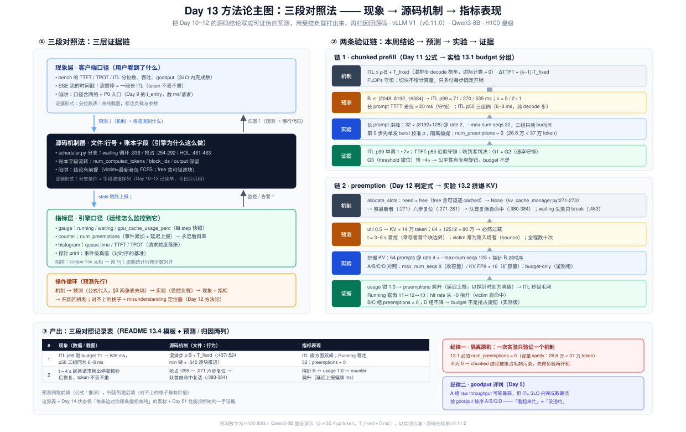
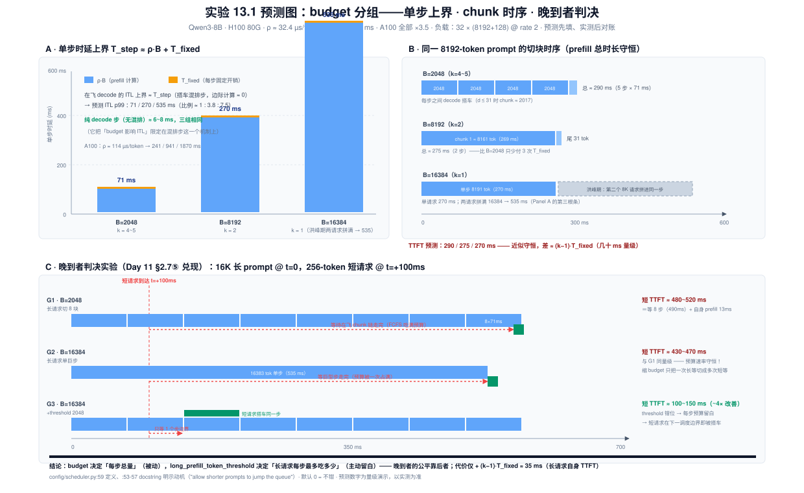
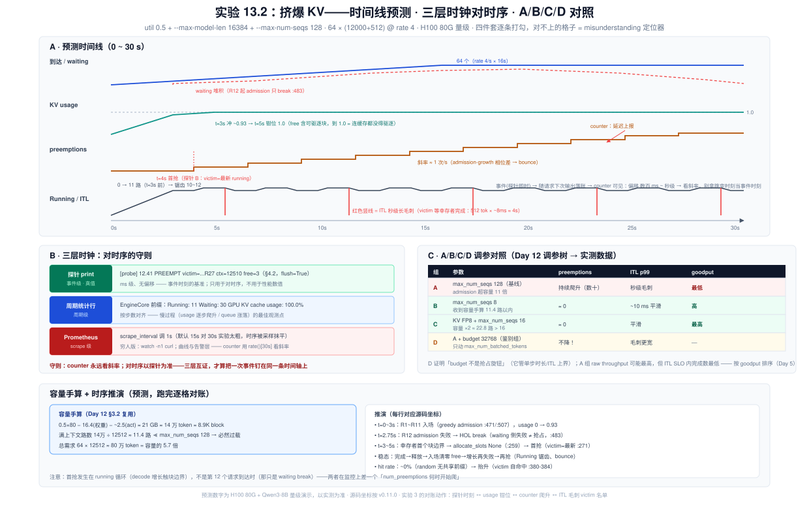

# Day 13 · 动手验证调度行为 —— 把本周的源码结论跑成数据

> **系列**：推理系统优化专家岗 · 56 天打卡 | 第 2 周「vLLM V1 源码精读（上）—— 调度链路」
> **今日位置**：Day 8~12 攒了五块碎片——进程地图、入口链路、两队列与 budget、chunked prefill 的切片刀、preemption 的六步复位——今天**不读任何新分支**，而是把 Day 11 的两个公式、Day 12 的诊断卡、Day 9 的日志基建、Day 6 的压测方法论组装成一台"验证机器"：**三段对照法（现象 → 源码机制 → 指标表现）**。两个正式实验：① **长 prompt 洪峰 × budget 分组 {2048, 8192, 16384}**，验证 Day 11 的 ITL 有界性、TTFT 近似守恒、以及 §2.7⑤ 留到今天的"晚到者排队"推论；② **高并发挤爆 KV**（util 0.5 + 64 prompts @ rate 4），验证 Day 12 的抢占链路与指标四件套，并做 A/B/C 调参对照。产出 README 要求的**三段对照实验记录表**——这张表同时是 Day 51 性能诊断树（"preemption 增长 → KV 超配调 `max_num_seqs`"）的一手证据
> **前置要求**：Day 6（压测方法论 + Qwen3-8B 台账 + `vllm bench serve`）、Day 9（日志证据链、`t_queue` 伏笔、客户端口径 vs 引擎口径）、Day 10（budget 记账、反推法 K ≤ (T_ITL_max − T_fix)/ρ）、Day 11（ITL 上界 ≈ ρ·B + T_fixed、ΔTTFT ≈ (k−1)·T_fixed、FLOPs 守恒、晚到者推论 §2.7⑤、`day11_itl_probe.py` 探针）、Day 12（抢占触发判定、六步复位、指标四件套、诊断-调参卡、实验 2/3 的缩小版数据）、Day 5（goodput 视角——今天 A/B/C 对照的评判标准）
> **预计用时**：3 ~ 3.5 小时（预测手算 0.5h + 实验 1~4 共 1.5~2h + 记录表与归因 0.5h）——本周动手占比最高的一天，GPU 是主角
> **背景衔接**：你在昇腾上做算子优化的收尾动作永远是同一套纪律：**改动前先量化基线、固定负载跑回归、指标对齐到 micro-op 级归因**——不跑数据的优化结论在 review 里活不过三个问题。今天把同样的纪律搬到调度层：Day 10~12 读出的每个"源码行为"都是一个待验证的假设，压测是它的回归测试。你做高并发服务的"压测 → 看监控 → 归因 → 调参"三板斧也原样适用，唯一的新东西是**指标的上报时机**（counter 延迟上报、scrape 间隔）——这在业务监控里同样坑过你（客户端打点和服务端打点对不上时序），今天的"三层时钟"就是它的系统化解法
> **实验环境**：复用 Day 6 的 1 × H100/A100 + Qwen3-8B；实验 0（预测手算）无 GPU 可做；实验 1~4 需要 GPU。可选：Day 6 装好的 Prometheus + Grafana（把 scrape_interval 调到 1s，§2.4 说明为什么）；没有的话 `watch -n1 curl` 是穷人版
> **配套材料**：`week2/README.md` Day 13 节（13.1~13.4 的命令与指标清单是本篇的骨架）；三张 SVG：`assets/day13_three_layer_validation.svg`（今日主图：三段对照法 + 两条验证链）、`assets/day13_budget_sweep_predictions.svg`（实验 13.1 预测：单步上界、chunk 时序、晚到者判决实验）、`assets/day13_kv_burst_observability.svg`（实验 13.2 预测：挤爆 KV 时间线 + 三层时钟 + A/B/C 对照）；探针脚本 `day13_probe.py`（§5 实验 2）
> **版本口径**：源码坐标按 **v0.11.0 tag** 逐行核对（2026-10 复核），与 Day 8~12 一致，全部复用前三天的核对结果；`/metrics` 的指标名**随版本演进较快**，本文一律给出 grep 模式并在 §2.3 标注"以实际输出为准"；`vllm bench serve` 的输出列（mean/median/p99）以你版本的 `--help` 为准

---

## 0. 今日学习目标

完成今天的学习后，你应该能够：

- [ ] **背下三段对照法**：现象（客户端可见的数据）→ 源码机制（文件:行为，能指到分支与账本字段）→ 指标表现（/metrics 与日志里可监控的量），并说清为什么"只有现象和指标"是相关性、"补上机制"才够到因果的门槛（§2.2，图 1）
- [ ] **跑实验前先交预测表**：13.1 的单步上界 / ITL p99 / 长 prompt TTFT / 晚到者 TTFT，13.2 的容量、抢占时点、victim 身份、恢复时长——每格一个公式或一行推演，实测后逐格对账（§2.5-§2.6，§3 两张总表；图 2 / 图 3 是它们的图形版）
- [ ] **说全七个核心指标的上报时机与四个陷阱**：counter 延迟上报（PREEMPTED 事件随下次输出）、`gpu_cache_usage_perc` 的 free 含可驱逐块、queue time 是引擎口径而 bench 的 TTFT 是客户端口径、scrape 间隔与周期日志的粒度（§2.3-§2.4）
- [ ] **会插三个探针并与 /metrics 对时序**：chunk 组批（waiting 循环）、抢占 victim（Day 12 实验 4 升级版）、admission——统一带 wall-clock 时间戳，测后还原（§4.2）
- [ ] **做出 13.1 的结论**：budget 从 2048 扫到 16384，ITL p99 差 ~7×（71ms → 535ms 量级）而长 prompt TTFT 近似不变（FLOPs 守恒的实测版）——每条结论背后有一条曲线（§5 实验 1，图 2 为预测底稿）
- [ ] **完成晚到者判决实验**：证明"缩小 budget 不帮晚到者（预算速率守恒）、`--long-prefill-token-threshold` 才帮（主动切片留预算）"——Day 11 §2.7⑤ 推论的落地（§5 实验 2）
- [ ] **复现 13.2 的四件套并完成 A/B/C 对照**：usage 冲 1.0 → preemptions 爬升 → ITL 秒级毛刺 → hit rate 抬升；`max_num_seqs` 收容量内 / KV FP8 扩容量后归零；并用 goodput 而非 raw throughput 评判（§5 实验 3/4，图 3 为对账清单）
- [ ] 交付：**三段对照实验记录表**（§9 模板 + 示例行）——Day 14 复盘与 Day 51 诊断树的直接素材

---

## 1. 核心概念速览

| 概念 | 一句话定义 | 今日要达到的深度 |
|---|---|---|
| **三段对照法** | 现象 → 源码机制 → 指标表现，每段都有独立的证据形式 | 能对任意一条调度行为现场设计这三段（§2.2，图 1） |
| **现象层** | 客户端可感知的数据：TTFT/ITL 分布、流暂停、吞吐 | 知道它的口径含网络与 P0 入口（Day 9 的 t_entry） |
| **机制层** | 源码里的分支与账本：文件:行号 + 字段流转 | Day 10~12 已读完毕，今天只引用不新读 |
| **指标层** | 引擎可观测的量：/metrics、周期统计行、探针 print | 分得清 gauge / counter / histogram 与各自陷阱 |
| **预测先行** | 跑实验前把每个格子用公式填上，实测后逐格对账 | 今天 §3 两张表必须先填"预测"列再开机 |
| **ITL 上界公式** | 混排步里在飞 decode 的 ITL ≤ ρ·B + T_fixed（Day 11） | 代入 B∈{2048, 8192, 16384} 得 71/270/535ms（H100） |
| **ΔTTFT 公式** | 被切请求 TTFT 增量 ≈ (k−1)·T_fixed，k = ⌈prompt/(B−d)⌉ | 能算出三组 k = 4~5 / 2 / 1，差值只有几十 ms——近似守恒 |
| **晚到者排队** | running 循环 FCFS 吃预算，晚到者等在飞 chunk 链走完 | 能论证"budget 不帮晚到者"（速率守恒）并设计判决实验（§2.5） |
| **`long_prefill_token_threshold`** | 超过该长度的 prompt 单步 chunk 被钳位（config/scheduler.py:59） | 知道它是"给晚到者留预算"的专用旋钮，默认 0 = 不钳 |
| **指标四件套（抢占）** | preemptions 斜率 + usage≈1.0 + ITL 长毛刺 + hit rate 变化（Day 12） | 今天逐条跑出实测曲线，并加上"Running 锯齿"第五证 |
| **延迟上报** | counter 由 PREEMPTED 事件驱动、随请求下次输出落账（Day 12 §2.7） | 对时序时用探针的即时时间戳校正（§2.4、§4.2） |
| **三层时钟** | 探针 print（事件即时）/ 周期统计行（步数对齐）/ Prometheus（scrape 间隔） | 知道默认 scrape 15s 对 30s 实验太粗，要调 1s |
| **挤爆配方** | util 0.5 + `max_num_seqs 128` + 64 × (12000+512) @ rate 4 | 能手算为什么"必然抢占"：80 万 token 需求 vs 14 万容量 |
| **A/B/C 对照** | admission 收进容量内（B）/ KV FP8 扩容量（C）/ 超配基线（A） | 能用 goodput 而非 raw throughput 排序三组（Day 5） |
| **隔离原则** | 一次实验只验证一个机制，其余变量钉死 | 13.1 必须 num_preemptions=0，否则 chunked 结论被污染 |

> **一句话本质**：三段对照法 = **把"我读过源码"升级成"我测过它"**。Day 10~12 的每条源码结论今天都要经受同一道工序：先写成可证伪的预测（公式或推演），再用受控负载打出来（现象 + 指标），最后归因回源码（哪一行决定了这条曲线的形状）。跑完今天，"budget 一个旋钮两头受力"和"preemption 是 admission 失灵的信号"就不再是笔记里的句子，而是你亲手画出来的两条曲线。

---

## 2. 原理深入讲解

### 2.1 回顾与今日地图：五块碎片的验证清单

本周前五天立下的结论，今天逐条对账：

| Day | 立下的结论（一句话） | 今日验证手段 | 预期证据形态 |
|---|---|---|---|
| Day 9 | `t_queue`（scheduled_ts − queued_ts）是 TTFT p99 的 usual suspect | 13.1 洪峰期看 `request_queue_time` 直方图与 TTFT 同步爬升 | 两条曲线同形 |
| Day 10 | budget 一个旋钮两头受力：钉住 ITL 上界，也决定队列排空速度 | 13.1 budget 分组 {2048, 8192, 16384} | ITL p99 单调升（71→535ms），TTFT p50 近似不变 |
| Day 11 | ITL ≤ ρ·B + T_fixed；ΔTTFT ≈ (k−1)·T_fixed；FLOPs 守恒 | 13.1 的 ITL p99 与 TTFT 两组数 + 实验 2 晚到者判决 | ITL 差 ~7×，TTFT 差几十 ms，晚到者 TTFT 同量级 |
| Day 12 | 抢占四件套 + "preemption 是 admission 失灵的信号" + 调参树 | 13.2 挤爆 KV + A/B/C 对照 + 探针对时序 | 四件套逐条出现；B/C 组归零 |
| Day 5/6 | goodput 视角：按 SLO 内完成的请求数评估，不按 raw throughput | 13.2 的 A/B 组排序 | A 组吞吐可能更高但 goodput 更低 |

> 本周读码地图到此收官：Day 10 骨架 → Day 11 切片刀 → Day 12 抢占 → **Day 13 压测验证** → Day 14 收拢成状态机。今天的角色是**裁判**——前四天是控方举证，今天是交叉质证。

### 2.2 三段对照法：为什么是这三段、为什么是这个顺序（图 1）



*图 1 · 今日主图：左半是三层证据链（现象 / 源码机制 / 指标，预测 ↓ 与归因 ↑ 双向流动），右半是两条验证链（Day 11 公式 → 实验 13.1、Day 12 判定式 → 实验 13.2），底部是产出记录表与两条纪律。*

README 给的产出格式是"现象 → 源码机制 → 指标表现"三段对照。它不是排版要求，而是一条**证据链的层级结构**：

| 段 | 证据形式 | 回答的问题 | 典型陷阱 |
|---|---|---|---|
| **现象** | 客户端侧数据：bench 输出的 TTFT/ITL 分位数、SSE 流的时间戳、吞吐 | 用户看到了什么？ | 口径污染：含网络、P0 入口（Day 9 的 t_entry ≈ 0.5~3s/百请求）、client 聚合开销 |
| **源码机制** | 文件:行号 + 分支条件 + 账本字段流转 | 引擎为什么这么做？ | 背结论不背前提：如"victim 是最新者"只对 FCFS 成立（Day 12 §2.3） |
| **指标表现** | /metrics 的 gauge/counter/histogram、周期统计行、探针 print | 运维怎么监控到它？ | 上报时机：counter 延迟上报、scrape 间隔、usage 含可驱逐块 |

**为什么必须有机制层**：只有现象和指标，你得到的是**相关性**（"ITL 毛刺和 preemption 计数同时出现"）；补上机制层，你才能回答反事实问题——"如果我把 `max_num_seqs` 收到 8，毛刺会消失吗？"（会，因为 admission 不再超容量，`allocate_slots` 不会失败，Day 12 §2.8 调参树的第一条边）。**能做预测 = 机制理解的试金石**，这是今天实验 0 要求"先填预测表再开机"的全部理由。

**实际操作顺序**与写作顺序相反，是一个循环：

```
机制（Day 10~12 已读） → 预测（公式代入，§3 两张表） → 实验（受控负载）
        ↑                                                        ↓
归因（对不上的格子 = misunderstanding 定位器，Day 12 实验 1 方法论） ← 现象 + 指标
```

### 2.3 观测面盘点：七个指标的上报时机与四个陷阱

`/metrics`（P0 进程暴露，Day 6 已用）里与今天相关的指标——**名字以实际输出为准**，抓取用 grep 模式：

| 指标（grep 模式） | 类型 | 源码位置 | 上报时机 | 调度关联 |
|---|---|---|---|---|
| `num_requests_running` / `num_requests_waiting` | gauge | loggers.py:190/:199（数据源 `make_stats`，scheduler.py:1176-1193） | 每 step 更新，随下一次 scrape 可见 | budget / max_num_seqs / KV 三道闸的直接体现 |
| `gpu_cache_usage_perc` | gauge | block_pool.py:385-404 口径 | 每 step 更新 | 抢占前兆：= 1 − free/total，**free 含可驱逐 cached 块** |
| `prefix_cache`（hit rate） | gauge | PrefixCacheStats 聚合 | 周期窗口平均 | 驱逐先于抢占（hit rate 先跌）；victim 自命中会**抬升**它 |
| `num_preemptions` | **counter** | loggers.py:277-282 | **PREEMPTED 事件驱动、随请求下次输出延迟上报**（Day 12 §2.7） | KV 超配报警，看斜率不看绝对值 |
| `request_queue_time` | histogram | loggers.py 的 PrometheusStatLogger（行号随版本浮动） | 请求生命周期事件落账 | 入队 → 首次调度，引擎口径的排队时长（Day 9 伏笔） |
| `time_to_first_token` / `time_per_output_token` | histogram | stats.py:169-178 从输出时间戳计算；SCHEDULED 事件只记首次（:153） | 随请求输出/完成 | chunked 代价面 / budget 上界 + 抢占毛刺 |
| `e2e_request_latency` | histogram | 同上 | 请求完成 | goodput 计算的原料（配 SLO 阈值，Day 5） |

四个陷阱，每个都对应今天实验的一个具体动作：

1. **counter 延迟上报**：被抢占当步请求没有输出，`num_preemptions` 的样本要等它复活后随下一次输出发给 P0。对**斜率**无影响，对"抢占发生在哪一秒"有偏移——所以实验 3 要用探针 B（§4.2）的即时时间戳来对时序，而不是拿 counter 的跳变时刻当事件时刻。
2. **usage 的 free 含可驱逐块**：`gpu_cache_usage_perc` 到 ~1.0 才是"连缓存都没得驱逐"的真耗尽（Day 12 §1）。所以观测顺序是 **hit rate 先动、usage 后到 1.0、counter 再爬**——三者的时间差本身就是信息。
3. **客户端口径 vs 引擎口径**：bench 报的 TTFT 含网络往返 + P0 入口（tokenize/校验，Day 9 §2）；`request_queue_time` 只含引擎内排队。两者相减 ≈ 入口 + 网络开销——顺手能做一次 Day 9 实验 3 的复测。
4. **采样粒度**：Prometheus 默认 `scrape_interval: 15s`，而今天的实验窗口只有 30~90s——**必须调到 1s**（改 prometheus.yml 重启），否则四件套的时序关系会被采样抹平。周期统计行（EngineCore 前缀的 `Running/Waiting/GPU KV cache usage/Prefix cache hit rate`）粒度介于两者之间，且**按步数对齐**——它是"usage 逐步爬升"这类慢过程的最佳观测点（Day 11 实验 4 已预演）。

### 2.4 对时序：三层时钟与两条守则

今天要把三类时间戳放进同一条时间轴：

| 时钟 | 粒度 | 延迟 | 用途 |
|---|---|---|---|
| 探针 print（§4.2，自带 `time.time()`） | 事件级（ms） | ~0（flush 后立即可见） | 事件时刻的**真值**：victim 是谁、free 多少 |
| 周期统计行 | 周期级 | ≤ 一个周期 | 慢过程：usage 爬升、queue 涨落 |
| Prometheus / `watch -n1` | scrape 级（1s 起步） | ≤ 一个间隔 | 曲线与告警；counter 看斜率 |

**守则一：counter 永远看斜率**。`num_preemptions` 是单调递增计数器，`rate(vllm:num_preemptions[30s]) > 0` 才是"正在发生抢占"；绝对值只在对照实验的终值比较里有意义（A 组 vs B 组）。

**守则二：对时序以探针为准**。今天实验 3 的对账动作：探针 B 打出 `[preempt] t=12.41s victim=...`，再去 Prometheus 的 `gpu_cache_usage_perc` 曲线上确认 t≈12s 处已钳在 ~1.0，最后在 ITL 序列上找该请求后续输出的秒级间隔——三层互证，才算把"现象 → 机制 → 指标"钉在同一次事件上。

### 2.5 实验 13.1 的预测手算：budget 分组，先把每格填上（图 2）



*图 2 · 实验 13.1 预测：A 单步时延上界的堆叠分解（ρ·B + T_fixed）；B 同一 8192-token prompt 在三组 budget 下的切块时序（prefill 总时长守恒）；C 晚到者判决实验的三条时间线（G1 ≈ G2 验证守恒，G3 验证 threshold 旋钮）。*

负载（week2/README 13.1 原样）：`random-input-len 8192 --random-output-len 128 --num-prompts 32 --request-rate 2`，服务 `--max-num-seqs 32`。三组只动一个变量：`--max-num-batched-tokens` ∈ {2048, 8192, 16384}。

**容量 sanity（隔离原则）**：util 0.9 的 H100 80G，KV 池 ≈ 37 万 token（Day 12 §3.2 台账）；需求 32 × (8192+128) = 26.6 万 < 37 万 → **三组全程 `num_preemptions` 必须为 0**。哪一组不是 0，先别下 chunked 的结论——查容量假设（A100 40G 卡：0.9×40 − 16.4 − ~2 ≈ 17.6GB ≈ 12 万 token < 26.6 万，**会爆**——把 `--num-prompts` 减半或换 80G 卡，量级公式不变）。这条 sanity 把 chunked prefill 的观测和 preemption 的污染隔离开。

**逐项代入**（Qwen3-8B，ρ_H100 ≈ 32.4 µs/token，T_fixed ≈ 5 ms——Day 10/11 的台账；A100 把 ρ 换 ≈ 114 µs/token，全部 ×3.5）：

| 量 | 公式（出处） | B=2048 | B=8192 | B=16384 |
|---|---|---|---|---|
| 单步时延上界 T_step | ρ·B + T_fixed（Day 11 §3.1） | ≈ 71 ms | ≈ 270 ms | ≈ 535 ms |
| 8192-prompt 切块数 k | ⌈8191 / (B − d)⌉，d = 在飞 decode 数 ≤ 31 | 4~5 | 2 | 1 |
| 长 prompt 自身 prefill 时长 | 8191·ρ + k·T_fixed | ≈ 290 ms | ≈ 275 ms | ≈ 270 ms |
| **在飞 decode 的 ITL 上界** | ≈ T_step（decode 搭车混排步，边际计算 ≈ 0，Day 11 §2.5） | **≈ 70 ms** | **≈ 270 ms** | **≈ 530 ms** |
| 纯 decode 步的 ITL（无混排时） | ≈ T_fixed + ε | 6~8 ms | 6~8 ms | 6~8 ms |
| TTFT 增量（相对不切） | (k−1)·T_fixed | +20 ms | +5 ms | 0 |

三个可证伪的预测：

1. **ITL p99 随 B 单调、近似线性**：71 → 270 → 535 ms（比例 ≈ 1 : 3.8 : 7.5）。洪峰期几乎每步都有 prefill chunk 在飞（32 个 8K prompt、16s 内到齐，offered 16K tok/s < 容量 28.8~30.6K tok/s，队列有界但持续非空）→ 在飞 decode 的 ITL 分布整体被抬到 T_step 量级，p99 ≈ max。
2. **长 prompt TTFT 近似守恒**：三组 p50 差 ≈ (k−1)·T_fixed = 20 ms 量级——**FLOPs 守恒的实测版**（Day 11 §3.2）。若实测差出几百 ms，先查排队（p99 与 queue time 同步涨才是排队，p50 稳定才是计算）。
3. **ITL p50 三组相同**（6~8 ms）：纯 decode 步不含 prefill 行，budget 大小无关——它把"budget 影响 ITL"限定在**混排步**这一个机制上，防止把别的因素（如 batch 规模）算到 budget 头上。

**晚到者（Day 11 §2.7⑤ 的兑现，§5 实验 2 做判决）**。推演链：running 循环 FCFS，在飞 chunk 吃满预算 → 晚到者分不到 → 等 chunk 链走完。关键论证是**预算速率守恒**：无论 B 多大，prefill token 的消耗速率 ≈ 1/ρ（每 token 计算量不变，step 切分不改变总量）→ 晚到者前面那 8K/16K 的"债"总要还完，**缩小 B 只是把一次长等待切成多次短等待，总时长不变**。真正帮晚到者的是 `--long-prefill-token-threshold`（config/scheduler.py:59，默认 0 = 不钳）：把长 prompt 的单步 chunk **主动钳小**，让每步预算留出富余给短请求插队——config docstring 明示动机（:53-57 "allow shorter prompts to jump the queue"）。判决实验的预测（16K 长 prompt @ t=0，256-token 短 prompt @ t=+100ms，三组配置）：

| 组 | 配置 | 短请求 TTFT 预测（H100 量级） | 机制 |
|---|---|---|---|
| G1 | B=2048 | ≈ 480~520 ms | 等 8 步 chunk 链（8×71ms）走完 |
| G2 | B=16384 | ≈ 430~470 ms | 等一个巨型步（535ms）走完——**与 G1 同量级** |
| G3 | B=16384 + `--long-prefill-token-threshold 2048` | **≈ 100~150 ms** | 长请求被钳成 2048/步 → 首步预算剩 14K → 短请求**同一步**搭车 |

G1 ≈ G2 验证守恒（Day 11 的推论），G3 ≪ G1/G2 验证旋钮（今天的新知识）。G3 的代价：长请求自身 TTFT 仅 + (k−1)·T_fixed ≈ +35 ms——又是一次"代价小到反直觉"的实测机会。

### 2.6 实验 13.2 的预测手算：挤爆 KV 的时序推演（图 3）



*图 3 · 实验 13.2 预测：A 四轨时间线（到达/waiting 堆积、usage 钳位 1.0、preemptions 阶梯爬升含延迟上报标注、Running 锯齿 + ITL 毛刺）；B 三层时钟与对时序守则；C A/B/C/D 调参对照；底部是容量手算与逐行推演——实验 3 的对账清单就是这张图。*

负载（week2/README 13.2 原样）：`--gpu-memory-utilization 0.5 --max-model-len 16384 --max-num-seqs 128`，`random-input-len 12000 --random-output-len 512 --num-prompts 64 --request-rate 4`。

**容量手算（Day 12 §3.2 直接复用）**：0.5 × 80 = 40 GB − 权重 16.4 GB − activation 峰值 ~2.5 GB ≈ **21 GB KV ≈ 14 万 token ≈ 8.9K block**。满上下文路数 14 万 ÷ 12512 ≈ **11.4 路**；按 prompt 算 14 万 ÷ 12000 ≈ 11.8 个。总需求 64 × 12512 ≈ 80 万 token ≈ 容量的 5.7 倍——**必然过载**，问题只是以什么形态过载。

**时序推演**（H100 量级；每格都是待证伪的预测，跑完逐格对账——对不上的格子 = misunderstanding 定位器，Day 12 实验 1 方法论）：

| 时段 | 预测 | 机制（源码坐标） |
|---|---|---|
| t = 0~3 s | R1~R11 依次入场，usage 从 0 爬到 ~0.93；queue 短暂为 0 | waiting 循环 greedy admission：allocate_slots 成功即入（scheduler.py:471/:507） |
| t ≈ 2.75 s 起 | R12 到达，admission 需 ~750 block > free → **HOL break**（waiting 侧失败只跳过、不抢占！） | :481-483；抢占的触发点在 **running 循环**（:254-292），别混 |
| t ≈ 3~5 s | 幸存者 decode 触到块边界（每 16 token 一块），某 running 的 `allocate_slots` 返回 None → **第一次抢占**，victim = 最新 running（往往是刚入场者） | :259 → :271；六步复位 :271-281；本步 waiting 跳过 :335 |
| 稳态（~5 s 后） | 完成一个 → 释放 → 新请求入场把 free 再次清零 → 幸存者增长再失败 → 再抢占：**Running 数锯齿 11↔12↔10，`num_preemptions` 每 0.5~1 s 爬一格，全程数十次** | admission（greedy）与 growth（每 16 步/请求）的相位差是震荡源 |
| 全程 | victim 自命中 → `prefix_cache` hit rate 从 ~0%（random 无共享前缀）**抬升**；被抢占者等幸存者完成（512 token × ~8ms ≈ 4 s）→ **ITL 秒级长毛刺**；TTFT p99 随 queue 堆积持续恶化 | `get_computed_blocks` 自命中（:380-384，Day 12 §2.4）；queue time 直方图右移 |

**A/B/C/D 调参对照的预测**（Day 12 实验 3 升级为正式数据，goodput 评判）：

| 组 | 参数 | 预测 preemptions | 预测 ITL p99 | 预测 TTFT p50 | goodput 排序 |
|---|---|---|---|---|---|
| A | `--max-num-seqs 128`（基线） | 持续增长（数十） | 秒级毛刺 | 高（queue 堆积 + 重算占用） | 最低 |
| B | `--max-num-seqs 8`（< 11.4 容量） | ≈ 0 | ~10 ms 平滑 | 略升（排队换平滑） | 高 |
| C | `--kv-cache-dtype fp8` + `--max-num-seqs 16` | ≈ 0（容量 ×2 ≈ 22.8 路 > 16） | 平滑 | 三组最优 | **最高** |
| D（可选） | A + `--max-num-batched-tokens 32768` | **不降**（budget 不是抢占旋钮，Day 12 §2.8） | 毛刺更宽 | — | — |

D 组是鉴别组：它证明"调 budget 解决不了抢占"不是笔记结论而是实测事实——面试里这句差别很大。

### 2.7 预测错了怎么办：归因循环

今天的实验一定会出现预测偏差（比如 ITL p99 在 B=8192 组明显高于 270ms）。处理工序：

1. **先分档**：偏差是量级错（2× 以上）还是形状错（该平滑的地方毛刺）？量级错查参数（ρ 的实际值——用 Day 11 实验 2 的 burst TTFT 实测反推），形状错查机制（有没有漏掉一个分支，比如 prefix caching 的干扰）。
2. **用仿真器隔离**：Day 12 的 `day12_sim.py` 不含时延模型，但能验证**调度逻辑**预测（谁被祭、何时复活）；实测与仿真都偏离预测 → 机制理解错；只有实测偏离 → 时延模型错（ρ、T_fixed、attention 的实测非线性）。
3. **把归因写进记录表**：§9 模板里"归因"一栏就是干这个的——Day 14 复盘时，带归因的偏差比吻合的预测更值钱（它标记了你的模型边界）。

---

## 3. 性能模型与数量级汇总：两张跑前必填的预测表

### 3.1 实验 13.1 预测总表（H100 80G；A100 全部 ×3.5；40G 卡先做 §2.5 的容量 sanity）

| 观测项 | 预测：B=2048 | 预测：B=8192 | 预测：B=16384 | 实测 | 归因 |
|---|---|---|---|---|---|
| ITL p50 (ms) | 6~8 | 6~8 | 6~8 | | 纯 decode 步 |
| ITL p99 (ms) | ≈ 70 | ≈ 270 | ≈ 530 | | ρ·B + T_fixed |
| ITL max (ms) | ≈ 80 | ≈ 300 | ≈ 600 | | 同上 + 抖动 |
| TTFT p50 (ms) | ≈ 290 + queue | ≈ 275 + queue | ≈ 270 + queue | | FLOPs 守恒 + (k−1)·T_fixed |
| TTFT p99 (ms) | queue 主导 | queue 主导 | queue 主导 | | 与 queue time 直方图同形 |
| `num_preemptions` 终值 | 0 | 0 | 0 | | **sanity：不为 0 则实验作废** |
| prompt throughput | ≈ 28.8K tok/s | ≈ 30K tok/s | ≈ 30.6K tok/s | | B/(ρ·B+T_fixed) |
| 晚到者短请求 TTFT（实验 2） | G1 ≈ 500ms | — | G2 ≈ 450ms / **G3 ≈ 115ms** | | 守恒 vs threshold 钳位 |

### 3.2 实验 13.2 预测总表

| 观测项 | 预测（A 组基线） | 实测 | 归因 |
|---|---|---|---|
| KV 容量 | ≈ 14 万 token / 8.9K block（与启动日志 `GPU KV cache size` 对账，误差归 activation） | | 手算 vs 实际 |
| 首次抢占时点 | t ≈ 3~5 s（第 12 个 admission 之后、幸存者首次块边界） | | 探针 B 时间戳 |
| victim 身份 | 最新 running（常为刚入场者——bounce 形态） | | :271 `running.pop()` |
| `num_preemptions` 终值 | 数十次；斜率 ≈ 每 0.5~1 s 一次 | | admission-growth 相位差 |
| Running 数 | 锯齿 10~12 | | 抢占/完成/入场三事件叠加 |
| `gpu_cache_usage_perc` | 冲 1.0 后钳位（free 含可驱逐块，Day 12 §1） | | block_pool.py:385-404 |
| hit rate | 从 ~0% 抬升（victim 自命中） | | :380-384 |
| ITL | 秒级长毛刺（victim 等幸存者完成 ≈ 4 s） | | :335 waiting 跳过 + 队首排队 |
| B/C/D 组 preemptions | ≈ 0 / ≈ 0 / 不降 | | 容量对齐 / FP8 ×2 / budget 正交 |

### 3.3 误差预算：预测允许偏多少

- **ρ 与 T_fixed**：Day 10/11 的推导值，实测 attention 随 ctx 增长有 O(L²) 项，8K 上下文时 H100 实际 ρ 可能到 35~40 µs/token → ITL 预测允许 +20%；**先跑 Day 11 实验 2 的单请求 burst 校准 ρ，再开机跑分组**（实验 1 的第 0 步）。
- **activation 峰值**：手算 KV 容量的主要误差源（Day 12 §3.2 已标注），对账基准是启动日志 `GPU KV cache size`，别和手算值较劲到个位数。
- **client 侧开销**：`vllm bench serve` 自身的请求构造/HTTP 开销在 ms 级，对 100ms+ 的效应无影响（Day 11 实验 2 的口径说明），但会污染 6~8ms 的 ITL p50——所以 p50 的对账以 `/metrics` 的 `time_per_output_token` 直方图为准，bench 只看 p99/max 的相对关系。
- **共享机器**：同卡跑着别的进程（哪怕一个 `watch`）会引入毛刺；实验期间 `nvidia-smi` 确认独占。

---

## 4. 关键代码：观测链路与三个探针

### 4.1 指标的生产链路：从 scheduler 到 Prometheus

```
P1 EngineCore（每 step）
  scheduler.update_from_output()                       # :861 记账/finish
  └─ make_stats()                                      # scheduler.py:1176-1193
       ├─ SchedulerStats（running/waiting/kv usage → gauge）
       ├─ PrefixCacheStats（hit rate → gauge）
       └─ RequestStats（含 PREEMPTED 事件 → counter 累加，loggers.py:277-282）
  → EngineCoreOutputs 搭车发往 P0
P0 AsyncLLM
  └─ PrometheusStatLogger（loggers.py）暴露 /metrics
       ├─ num_requests_running/waiting（:190/:199，gauge）
       ├─ num_preemptions（counter，**随请求下次输出延迟落账**）
       └─ request_queue_time / ttft / tpot / e2e（histogram；stats.py:169-178
          从输出时间戳计算，SCHEDULED 事件只记首次 :153）
→ Prometheus scrape（interval 调 1s）→ Grafana（Day 6 的看板加两个 panel）
```

三个口径要点：① gauge 是"每 step 快照、scrape 时采样"，counter 是"事件累加、延迟落账"，histogram 是"请求粒度落账"——三种时间语义混在一条时间轴上时，以探针为真值；② TTFT/TPOT 的引擎侧计算在 stats.py:169-178，bench 的客户端侧含网络与 P0 入口，差值就是 Day 9 的 t_entry + 网络；③ 周期统计行（EngineCore 前缀）走的是同一条 stats 链路的日志分支，数字应与 /metrics 的同时刻 gauge 一致——不一致说明你在跨 scrape 窗口对比。

### 4.2 三个探针：插桩点、代码、还原

editable 安装（`pip install -e .`——week2/README 开头已提醒：Day 13 要在 `schedule()` 里临时加打印）。三个探针统一带 wall-clock 时间戳，格式 `[probe] <t> <event> ...`：

**探针 A · chunk 组批**（waiting 循环切块处，:437 附近 `new_token_count` 计算之后）：

```python
print(f"[probe] {time.time():.3f} chunk req={request.request_id[-8:]} "
      f"need={num_new_tokens} sched={new_token_count} "
      f"budget_left={token_budget}", flush=True)
```

**探针 B · 抢占 victim**（Day 12 实验 4 升级版，:271-281 六步复位内部）：

```python
print(f"[probe] {time.time():.3f} PREEMPT victim={preempted_req.request_id[-8:]} "
      f"ctx={preempted_req.num_tokens} free="
      f"{self.kv_cache_manager.block_pool.get_num_free_blocks()}", flush=True)
```

**探针 C · admission**（waiting 出队处，:507 附近）：

```python
print(f"[probe] {time.time():.3f} ADMIT req={request.request_id[-8:]} "
      f"prompt={request.num_tokens} hit={len(cached_block_ids)}", flush=True)
```

四条纪律：① `flush=True` 必须加，否则缓冲把"事件级"探针退化成"批处理级"；② 变量名以你版本的局部变量为准（`num_new_tokens`/`cached_block_ids` 等，插桩前先读上下文五行）；③ 探针会拖慢 P1（I/O 在关键路径上）——**带探针的 run 只用于对时序，不用于性能数值**；④ 测完 `git checkout -- vllm/v1/core/sched/scheduler.py` 还原，别把探针带进后面的实验。

### 4.3 bench 口径速查

`vllm bench serve` 输出的 TTFT/TPOT/ITL 分位数是**客户端口径**（SSE 时间戳）；`--percentile-metrics ttft,tpot,itl` 打开三列，`--save-result` 可存 JSON（选项以 `--help` 为准）。它测不到的：queue time 的引擎侧分解、KV usage、preemption——这些只能从 `/metrics` + 探针来。**记录表里现象列用 bench，指标列用 /metrics + 探针，机制列用源码坐标——三列天然分工。**

---

## 5. 动手实验（约 100~120 分钟）

> 环境沿用 Day 6 台账（Qwen3-8B，H100/A100 80G，`--gpu-memory-utilization 0.9` 起）。实验 0 无 GPU 可做；实验 1~4 需要 GPU。每个实验都对应 §3 预测表的一块——**先填预测，再开机**。

### 实验 0（必做，10 min；无 GPU 可做）：台账对齐 + 预测表落笔

```bash
pip show vllm | head -3          # 版本对齐（本篇坐标：v0.11.0）
nvidia-smi --query-gpu=name,memory.total --format=csv   # 显存决定 §2.5 的 sanity 是否成立
```

- [ ] 抄下 §3.1/§3.2 两张表到你的笔记，**预测列不许空着开机**
- [ ] 用 Day 12 §3.2 公式重算你机器的 KV 容量，标注 13.1 的隔离前提（`num_preemptions=0`）是否成立
- [ ] Prometheus `scrape_interval` 改 1s 并重启（没有就用 `watch -n1` 方案）

### 实验 1（必做，GPU，35 min）：长 prompt 洪峰 × budget 分组

```bash
# 三组各一次，只动 --max-num-batched-tokens（其余钉死）
vllm serve Qwen/Qwen3-8B --gpu-memory-utilization 0.9 --max-model-len 16384 \
  --max-num-batched-tokens 2048 --max-num-seqs 32
# 换 8192 / 16384 各重启一遍

# 每组的压测（week2/README 13.1 原样）：
vllm bench serve --backend openai --model Qwen/Qwen3-8B \
  --dataset-name random --random-input-len 8192 --random-output-len 128 \
  --num-prompts 32 --request-rate 2 --percentile-metrics ttft,tpot,itl

# 另开终端：
watch -n2 'curl -s localhost:8000/metrics | grep -E "num_preemptions|gpu_cache_usage|num_requests_waiting|num_requests_running"'
```

- [ ] 开机先看启动日志：`Chunked prefill is enabled with max_num_batched_tokens=...`（config/scheduler.py:204-207）——budget 生效的第一证
- [ ] 第 0 步校准 ρ：先单发一个 8K burst（Day 11 `day11_itl_probe.py burst`），TTFT ≈ 8191·ρ + T_fixed 反推你机器的 ρ，回填 §3.1 的预测列
- [ ] 每组抄录：ITL p50/p99/max、TTFT p50/p99、`num_preemptions` 终值（**必须 0**，不为 0 → §2.5 容量 sanity 失败，先修负载）
- [ ] 洪峰进行时瞄一眼周期统计行：`Running` 爬到 32、`GPU KV cache usage` 逐步爬升——chunk 逐块分配的侧证（Day 11 实验 4 的复看）
- [ ] 对账三预测：ITL p99 单调（~7×）、TTFT p50 近似守恒（差几十 ms）、ITL p50 三组相同

### 实验 2（必做，GPU，25 min）：晚到者判决实验——Day 11 推论的落地

探针脚本 `day13_probe.py`（复用 Day 11 `day11_itl_probe.py` 的 `make_prompt`/流式计时骨架）：

```python
#!/usr/bin/env python3
"""Day 13 实验 2：晚到者排队判决（16K 长 prompt @ t0，256 短 prompt @ +100ms）"""
import json, time, threading
import requests
from day11_itl_probe import make_prompt, stream     # 把 Day 11 的函数抄进来；
                                                      # stream 需小改为返回 TTFT（ms）

def fire_late(prompt, max_tokens, delay, tag, out):
    time.sleep(delay)
    out[tag] = stream(prompt, max_tokens, tag)       # 返回 TTFT（ms）

if __name__ == "__main__":
    out = {}
    t1 = threading.Thread(target=fire_late,
        args=(make_prompt(16384), 1, 0.0, "long", out))
    t2 = threading.Thread(target=fire_late,
        args=(make_prompt(256), 8, 0.1, "short", out))
    t1.start(); t2.start(); t1.join(); t2.join()
    print(json.dumps(out, indent=2))
```

三组配置（每组重启服务）：

| 组 | 启动参数 | 短请求 TTFT 预测 |
|---|---|---|
| G1 | `--max-num-batched-tokens 2048` | ≈ 500 ms |
| G2 | `--max-num-batched-tokens 16384` | ≈ 450 ms（与 G1 同量级——守恒） |
| G3 | `--max-num-batched-tokens 16384 --long-prefill-token-threshold 2048` | **≈ 115 ms** |

- [ ] G1 vs G2 相差 < 100 ms → 预算速率守恒成立（Day 11 §2.7⑤ 推论验证 ✓）
- [ ] G3 比 G1/G2 快 3~5× → threshold 是晚到者的专用旋钮 ✓；同时记录 long 请求自身 TTFT 的增量（预测仅 +35 ms）
- [ ] 有时间加 G4：`--max-num-partial-prefills 2` 看 config 自动设 threshold 的日志（Day 11 实验 4 的 `long_prefill_token_threshold=1310`，config:210-213）

### 实验 3（必做，GPU，30 min）：挤爆 KV——四件套 + 探针对时序

```bash
# 终端 1：插好探针 B（§4.2，editable 安装）后启动
vllm serve Qwen/Qwen3-8B --gpu-memory-utilization 0.5 --max-model-len 16384 \
  --max-num-seqs 128

# 终端 2：
vllm bench serve --backend openai --model Qwen/Qwen3-8B \
  --dataset-name random --random-input-len 12000 --random-output-len 512 \
  --num-prompts 64 --request-rate 4 --percentile-metrics ttft,tpot,itl

# 终端 3（穷人版持续观测）：
watch -n1 'curl -s localhost:8000/metrics | grep -E "num_preemptions|gpu_cache_usage|num_requests_waiting|num_requests_running|prefix_cache"'
```

观察点（对照 §2.6 的时序表逐格打勾）：

- [ ] `gpu_cache_usage_perc` 爬到 ~1.0 并钳位——记下首次到 1.0 的墙钟时间
- [ ] 探针 B 的首个 `[probe] ... PREEMPT victim=...`——**与 usage 到 1.0 的时点对齐**；victim 的 ctx 是否 ≈ 刚入场请求的 prompt（bounce 形态）
- [ ] `num_preemptions` 随后爬升（注意 counter 延迟上报：探针时刻早于 counter 可见时刻）——斜率 ≈ 每 0.5~1 s 一格
- [ ] `num_requests_running` 锯齿、`num_requests_waiting` 单调堆积
- [ ] `prefix_cache` hit rate 从 ~0 抬升（victim 自命中）——驱逐/复活循环的侧证
- [ ] bench 结束后 ITL 分布里的秒级长毛刺，与探针 B 的 victim 名单**对得上人**（被祭请求的后续输出间隔 = 毛刺）

### 实验 4（必做，GPU，25 min）：A/B/C 调参对照——把 Day 12 的调参树跑成数据

同实验 3 负载，四组各重启一次（D 可选但强烈建议——它是鉴别组）：

| 组 | 参数 | 记录：preemptions 终值 / ITL p99 / TTFT p50 / 总吞吐 | goodput（ITL SLO=100ms 内完成数） |
|---|---|---|---|
| A | `--max-num-seqs 128` | | |
| B | `--max-num-seqs 8` | | |
| C | `--kv-cache-dtype fp8 --max-num-seqs 16` | | |
| D | A + `--max-num-batched-tokens 32768` | | |

- [ ] B/C 组 preemptions ≈ 0、ITL 平滑；A 组四件套齐全——Day 12 调参树第一条边（"usage≈1.0 主导 → `max_num_seqs`↓"）的一手证据
- [ ] D 组 preemptions 不降——"budget 不是抢占旋钮"的实测版
- [ ] 用 goodput 排序（Day 5 方法：固定 SLO，数 SLO 内完成的请求数），和 raw throughput 排序**比较是否一致**——不一致正是 A 组"吞吐好看但体验差"的教学点

### 实验 5（产出，20 min）：填三段对照记录表（§9 模板）

### 常见坑（方法论清单）

| # | 坑 | 后果 | 解法 |
|---|---|---|---|
| 1 | 预测列空着开机 | 实验变成"观光"，无法归因 | 实验 0 强制先填表（§3） |
| 2 | 13.1 出现 preemption 没察觉 | chunked 结论被抢占毛刺污染 | 每组结束检查 `num_preemptions=0`（sanity） |
| 3 | 把 counter 跳变时刻当事件时刻 | 对时序偏移几百 ms~秒级 | 以探针 B 时间戳为真值（§2.4 守则二） |
| 4 | scrape 15s 不改 | 四件套时序被采样抹平 | prometheus.yml 调 1s；或 `watch -n1` |
| 5 | 带探针跑性能组 | 数值偏低、结论失真 | 探针 run 只对时序；数值 run 还原代码 |
| 6 | 40G 卡照抄 80G 负载 | 13.1 也挤爆，全部作废 | §2.5 容量 sanity：按 KV 池缩放 `--num-prompts` |
| 7 | 忘了 `--percentile-metrics ttft,tpot,itl` | bench 不报 ITL，预测无法对账 | 命令照抄 week2/README 13.1 |
| 8 | 三组实验共用一个服务改参重启一半 | 变量没钉死 | 每组完整重启；启动日志的 budget 行核对 |

---

## 6. 面试高频问题（含答题骨架）

**Q1：线上收到"输出一顿一顿"的投诉，你怎么定位？（现场设计题，今天的方法论直答）**

> 骨架：① 先分层拿证据——现象层：拉该时段 ITL 分布（/metrics 的 `time_per_output_token` 直方图），确认毛刺的量级（几十 ms / 秒级）与占比；指标层：同时段四件套（`num_preemptions` 斜率、`gpu_cache_usage_perc`、`num_requests_running` 锯齿、hit rate）；② 量级分诊：几十~几百 ms 且与长 prompt 到达相关 → chunked prefill 的混排步（ITL ≤ ρ·B + T_fixed，调 budget）；秒级且伴随 preemption 爬升 → KV 超配（调 `max_num_seqs`）；秒级但无抢占 → 查 P0 入口/网络；③ 机制定位：探针/日志确认 victim 名单与毛刺请求对得上人；④ 验证：调参后 A/B 对照（今天的实验 4 就是模板），用 goodput 收尾。**收尾**：这套"现象 → 指标 → 机制 → 调参 → 复测"的顺序不能乱——先调参后归因是事故复盘最常见的方法论错误。

**Q2：怎么用指标区分 KV 超配、prefill 拥塞、并发超配？（Day 51 诊断树的预演）**

> 骨架：① KV 超配：preemptions 斜率 >0 + usage≈1.0 + ITL 秒级毛刺——旋钮在 KV 侧（`max_num_seqs`↓/`max_model_len`↓/KV FP8/加卡）；② prefill 拥塞：无抢占但 TTFT p99 高、queue time 右移、ITL 平滑——旋钮是 budget 与容量（`max_num_batched_tokens`↑、扩容）；③ 并发超配：queue time 高 + TTFT 高但 ITL 平滑且无抢占——前置限流/admission control；④ 今天的实测数据各配一条曲线（13.1 是②的复现、13.2 A 组是①的复现、B 组是"收到容量内"的对照）。**收尾**：三个症状可以叠加，先看四件套定主因，再逐层收敛——这也是为什么单靠一个告警阈值（如只盯 TTFT）做不了根因。

**Q3：`num_preemptions` 是延迟上报的 counter，对监控告警设计有什么影响？**

> 骨架：① 机制：PREEMPTED 事件附着在请求上、随它下次输出发给 P0（Day 12 §2.7）→ counter 的可见时刻晚于事件时刻（复活快的请求偏移小、让路型的偏移可达秒级）；② 对策一：告警用 `rate()` 斜率不用绝对值——斜率对偏移鲁棒；③ 对策二：事件级时序需求（如根因定位）用日志/探针补，别指望 counter；④ 对策三：scrape 间隔要和事件密度匹配（1s 级），15s 默认会漏掉短促震荡；⑤ 延伸：gauge（usage）是每 step 快照、histogram（TTFT）是请求粒度落账——三类指标的"时间语义"混用时以最快的那个为基准对齐。**收尾**：这是"指标口径"题的模板答案——任何指标都要先问三个问题：谁生产、何时落账、多久可见。

**Q4：把 budget 调大后，TTFT 为什么可能不降反升？**

> 骨架：① budget 大 → 单步时长上界高（ρ·B + T_fixed）→ ITL 毛刺变大，这是已知的；② TTFT 反升的两条路：a) 晚到的短请求要等在飞巨型步走完才能搭车（Day 11 §2.7⑤，今天实验 2 G2 实测）——总等待受预算速率守恒限制，budget 大小不改变"债要还完"，但把等待集中成一次长等；b) 大 budget 让 admission 一次放更多 prefill 行入批 → 混排步更重 → 后续步的排队漂移；③ 解法不是缩 budget（那牺牲不了什么但也不解决排队），而是 `--long-prefill-token-threshold` 给短请求留预算（实验 2 G3：~4× 改善，长请求自身只 +几十 ms）。**收尾**：budget 管的是"单步时长/ITL 上界"，晚到者公平要靠 threshold——两个旋钮各管一头，混着调是常见误操作。

**Q5：你加的 print 探针会不会污染测量？怎么控制？**

> 骨架：① 会——print 的 I/O 在 P1 调度关键路径上，且 `flush=True` 每次强制 syscall（µs~ms 级/次）；抢占分支每秒最多几次影响小，chunk/admission 探针在高压时每 step 多次、累积可观；② 控制四条：探针 run 与数值 run 分离（今天 §4.2 纪律③）；低频分支才插（preemption 探针最安全）；用环境变量做开关（`if os.environ.get("VLLM_PROBE"):`）避免反复改码；对时序需求用时间戳差值而非绝对吞吐；③ 生产环境的正确姿势是 log level/结构化日志或 eBPF/周期 stats，而不是 print——今天的方法论（先内建观测再归因）不变，工具升级。**收尾**：这题考的是"测量干扰仪器的自觉"——和 ncu 的 replay 误差、nsys 的 overhead 是同一类问题。

**Q6：为什么今天的实验设计里，实验 13.1 必须保证 `num_preemptions = 0`？**

> 骨架：① 隔离原则：一次实验只验证一个机制——13.1 验证 chunked prefill 的 ITL/TTFT 权衡，若 KV 同时超配，ITL 毛刺里就混入抢占停顿（秒级），budget 分组的因果链被污染；② 落地：负载设计前先做容量手算（32×8320=26.6 万 < util 0.9 的 37 万 → 隔离成立），40G 卡上手算失败就要缩负载；③ 反例即实验 13.2——它是故意让容量失守、钉死 budget，单验证抢占；④ 泛化：A/B 测试的"一次一变量"在系统实验里还要加上"一次一机制"，因为机制之间会通过同一批指标（ITL/TTFT）互相污染。**收尾**：能讲出这层的设计题答案，比背出 chunked 公式更能区分"跑过"和"读过"。

---

## 7. 今日总结

1. **三段对照法**：现象（客户端口径）→ 源码机制（文件:行号 + 账本字段）→ 指标表现（/metrics + 日志 + 探针）——只有现象和指标是相关性，补上机制才够到因果；操作顺序是"机制 → 预测 → 实验 → 归因"的循环，预测表先于开机。
2. **观测口径**：gauge（usage/running，每 step 快照）、counter（preemptions，事件累加 + **延迟上报**）、histogram（TTFT/TPOT/queue time，请求粒度）；bench 的 TTFT 是客户端口径，与 `request_queue_time` 的差 ≈ P0 入口 + 网络（Day 9 兑现）。
3. **对时序**：三层时钟（探针事件级 / 周期统计行 / Prometheus scrape）以探针为真值；counter 永远看斜率；scrape_interval 调 1s。
4. **13.1 实测结论**（对照 Day 11 公式）：ITL p99 随 budget 单调（71 → 270 → 535 ms 量级，≈ ρ·B + T_fixed），长 prompt TTFT 近似守恒（差 ≈ (k−1)·T_fixed），ITL p50 三组相同——budget 的作用面被精确钉在"混排步"。
5. **晚到者判决**（Day 11 §2.7⑤ 兑现）：预算速率守恒 → 缩 budget 不帮晚到者（G1≈G2）；`--long-prefill-token-threshold` 主动钳位留预算 → 短请求 TTFT ~4× 改善、长请求只付几十 ms——公平性有专用旋钮。
6. **13.2 实测结论**（对照 Day 12 链路）：util 0.5 + 64@rate4 → usage 钳 1.0 → preemptions 持续爬（victim 常为刚入场者，bounce 形态）→ ITL 秒级毛刺 + Running 锯齿 + hit rate 抬升（自命中）；`max_num_seqs` 收容量内（B）与 KV FP8 扩容量（C）都归零，budget（D）不降——调参树每条边配上了实测曲线。
7. **goodput 收尾**：A 组 raw throughput 可能最高但 ITL SLO 内完成数最低——Day 5 的"SLO 驱动评估"从概念变成今天的排序方法。
8. **产出落袋**：三段对照记录表（§9）是 Day 14 状态机的"每条边对应哪条指标曲线"素材，也是 Day 51 性能诊断树的一手证据——面试时"我测过"和"我读过"的分界线就在这张表。

---

## 8. 今日自测题（先自己做，再展开答案）

**Q1**：H100 80G、Qwen3-8B、budget 分组 {2048, 16384}、input 8192 / output 128 / 32 prompts @ rate 2。预测两组的 ITL p50 / p99 与 TTFT p50，并说出每个数背后的机制。

<details><summary>参考答案</summary>

ITL p50 两组相同 ≈ 6~8 ms（纯 decode 步 ≈ T_fixed，无 prefill 行）；ITL p99 ≈ ρ·B + T_fixed：2048 → ~71 ms，16384 → ~535 ms（混排步里 decode 搭车，边际计算 ≈ 0——Day 11 §2.5）；TTFT p50 ≈ 8191·ρ + k·T_fixed + queue：2048 组 k=5 → ~290 ms，16384 组 k=1 → ~270 ms——差 ≈ (k−1)·T_fixed = 20 ms（FLOPs 守恒：切块不增加计算量，只多付每步固定开销）。机制坐标：k 由 waiting 循环的 min 链决定（:437/:524），ITL 上界由 `_update_after_schedule` 的"下一步就能续算"（:645）+ 混排组批（Day 11 §2.5）共同保证。注意 queue 项：offered 16K tok/s < 容量 ~29K tok/s，队列有界，p50 的 queue 贡献小、p99 主导。
</details>

**Q2**：实验 13.2 中，为什么第一次"失败"是 waiting 侧的 HOL break 而不是抢占？两者在源码里分别走哪条分支？

<details><summary>参考答案</summary>

waiting 侧：R12 的 admission 调 `allocate_slots`（scheduler.py:471）失败 → `break`（:481-483）——waiting 循环整体跳过、R12 留在队首，**不触发抢占**（waiting 侧没有"释放别人"的语义）。抢占只发生在 **running 循环**：幸存者 decode 增长到块边界，`allocate_slots`（:259）返回 None → 进入 :254-292 的 `while True`，`running.pop()` 祭最新者（:271）→ 六步复位 → 本步 waiting 跳过（:335）。时间差：HOL break 在第 12 个请求到达时（t≈2.75s）立刻发生；首次抢占要等幸存者从 prompt 边界再长 ~16 token 触到下一个块边界（t≈3~5s）。监控上的区别：HOL break 只表现为 waiting 堆积；抢占才有 `num_preemptions` + ITL 毛刺。把两者混为一谈会误判"一到容量线就抢占"。
</details>

**Q3**：为什么缩小 budget 不能改善晚到者的排队？哪个参数能？各自机制是什么？

<details><summary>参考答案</summary>

守恒论证：prefill token 的消耗速率 ≈ 1/ρ（每 token 计算量固定），budget 切分不改变总计算量（Day 11 §3.2 FLOPs 守恒）→ 晚到者前面的"债"（在飞 prompt 的剩余 token）还完的总时长不变；缩 budget 只是把一次 535ms 的等待切成 8×71ms 的等待。能帮的是 `--long-prefill-token-threshold`（config/scheduler.py:59）：超过该长度的 prompt 单步 chunk 被钳位 → 每步预算留出富余 → 短请求在**下一个调度边界**就能搭车（实验 2 G3：~4× 改善）。本质区别：budget 决定"每步总量多大"（被动），threshold 决定"单个长请求每步最多吃多少"（主动留白）——后者才改变预算的**分配**而不只是**粒度**。代价：长请求 TTFT + (k−1)·T_fixed（几十 ms）。
</details>

**Q4**：今天用到了 gauge / counter / histogram 三类指标，各举一例并说明"何时落账、多久可见、看什么"。

<details><summary>参考答案</summary>

gauge——`gpu_cache_usage_perc`（`num_requests_running/waiting` 同类）：每 step 由 `make_stats`（scheduler.py:1176-1193）快照、随 scrape 可见；看瞬时水位与钳位形态（冲 1.0 = 连可驱逐块都不剩）。counter——`num_preemptions`（loggers.py:277-282）：PREEMPTED 事件累加、**随请求下次输出延迟落账**；看 `rate()` 斜率（正在发生 vs 历史累计），绝对时点要靠探针。histogram——`request_queue_time` / `time_per_output_token`：请求粒度落账（TTFT/TPOT 由 stats.py:169-178 从输出时间戳算，SCHEDULED 只记首次 :153）；看分布形状与分位数漂移（右移 = 拥塞，长尾 = 毛刺）。三类混在一条时间轴上时，事件定位以最快的（探针）为基准，趋势看最稳的（gauge），告警用最鲁棒的（counter 斜率）。
</details>

**Q5**：实验 4 的 A/B/C/D 四组，哪组 goodput 最高？如果只看 raw throughput 会得出什么错误结论？

<details><summary>参考答案</summary>

C 组（KV FP8 + `max_num_seqs 16`）通常最高：容量 ×2 → admission 不超配 → 无抢占、ITL 平滑，且并发比 B 组（8 路）高——SLO 内完成数最多。B 组次之（无抢占但并发低、TTFT 排队）。A 组 raw throughput 可能最高（并发 128、KV 满载运转、抢占后自命中复活便宜），但 ITL 秒级毛刺让 SLO 内完成数最低——这就是 Day 5 "goodput vs raw throughput" 的实测版：**按 SLO 内完成数评估，超配的 A 组是"看起来忙、实际违约"**。D 组证明 budget 不是抢占旋钮——它的 preemptions 与 A 组同量级，防止有人把"调大 budget"当成抢占的解法写进预案。
</details>

---

## 9. 今日产出物：三段对照实验记录表

README 13.4 模板的扩展版（加了"预测"与"归因"两列——预测列跑前填，归因列跑后填；示例数据为 H100 量级演示，**以你的实测为准**）：

```markdown
# Day 13 实验记录：调度行为三段对照（v0.11.0，Qwen3-8B，<你的 GPU 型号>）

## 13.1 长 prompt 洪峰 × budget 分组（隔离前提：num_preemptions = 0 ✓）

| B | 预测 ITL p99 | 实测 ITL p99 | 预测 TTFT p50 | 实测 TTFT p50 | 归因（对不上时） |
|---|---|---|---|---|---|
| 2048 | ~71ms | | ~290ms | | ρ 实测偏大？queue 污染？ |
| 8192 | ~270ms | | ~275ms | | |
| 16384 | ~530ms | | ~270ms | | |

| # | 现象（数据/截图） | 源码机制（文件:行为） | 指标表现 |
|---|---|---|---|
| 1 | B=16384 时 ITL p99 ~530ms、p50 仍 ~7ms | scheduler.py 混排步：chunk 吃满 ρ·B，decode 搭车（:437/:524 min 链） | ITL 直方图双峰；Running 稳定 32 |
| 2 | 三组 TTFT p50 差 < 30ms | FLOPs 守恒 + (k−1)·T_fixed（k=4~5/2/1，:645 逐块推进） | TTFT p50 平坦、p99 随 queue |
| 3 | 晚到者 G1≈G2、G3 快 ~4× | 预算速率守恒 vs threshold 钳位（config/scheduler.py:59） | G3 短请求 TTFT ~115ms |

## 13.2 挤爆 KV（util 0.5，64×12512 @ rate 4）+ A/B/C/D 对照

| 组 | max_num_seqs / KV dtype | preemptions 终值 | ITL p99 | TTFT p50 | goodput@ITL 100ms |
|---|---|---|---|---|---|
| A | 128 / fp16 | | | | |
| B | 8 / fp16 | | | | |
| C | 16 / fp8 | | | | |
| D | 128 / fp16 + budget 32768 | | | | |

| # | 现象 | 源码机制 | 指标表现 |
|---|---|---|---|
| 4 | t≈3~5s 起输出出现秒级停顿，之后恢复 | running 循环 allocate_slots→None（:259）→ 祭最新者（:271）六步复位（:271-281）→ 队首复活自命中（:380-384） | 探针 B 时刻 ↔ usage 钳 1.0 ↔ counter 爬升（延迟上报偏移 ______ ms） |
| 5 | victim 多为刚入场请求 | running.pop() 弹最新（FCFS）+ admission-growth 相位差 → bounce | Running 锯齿 11↔12↔10 |
| 6 | hit rate 从 ~0% 抬升 | victim free 后 hash 保留（Day 12 §2.4） | prefix_cache 曲线与 preemptions 同步上行 |

## 探针对时序记录
[probe] 首次 PREEMPT: t=____s  victim ctx=____  free=____
counter 可见时刻: t=____s（偏移 = ______）
usage 首次到 1.0: t=____s
```

- [ ] 记录表（两节 + 探针对时序，预测/归因两列不许空）
- [ ] 13.1 三组数据 + 晚到者三组数据（实验 2）
- [ ] 13.2 四件套曲线截图（Prometheus 或 watch 手抄）+ A/B/C/D 表
- [ ] 代码还原确认：`git status` 无 scheduler.py 改动残留
- [ ] 一句话收获（写进打卡，例："一直以为缩 budget 能帮晚到的短请求，实验 2 两个 500ms 摆在一起才看清守恒——公平要靠 threshold 主动留白；以及 counter 延迟上报让我对齐了半天时序，最后靠探针时间戳救场"）

---

## 10. 明日预告（Day 14 · 复盘日）

今天的三段对照表把本周五块碎片钉在了数据上，明天收拢成 README 要求的两件套：**① 画"一个请求在 scheduler 中的状态机"**——把 Day 10~12 的队列迁移、Day 12 的 PREEMPTED 复位、今天的指标曲线合到一张图上（每条边标注"对应哪条指标曲线"，今天的记录表就是素材库）；**② 闭卷口头推演"10 个请求、KV 只够 6 个"**——Day 12 仿真器换参数复跑对账，预测-实测-归因的循环再走一遍。本周产出的清点也在明天：架构图、源码走读笔记、收益-代价页、诊断卡、实验记录表——Day 15 起，我们进入 KV Cache Manager 的领地（block pool 的数据结构、allocate/free/append 的路径），今天看到的"usage 逐步爬升"将变成一行行具体的队列操作。


