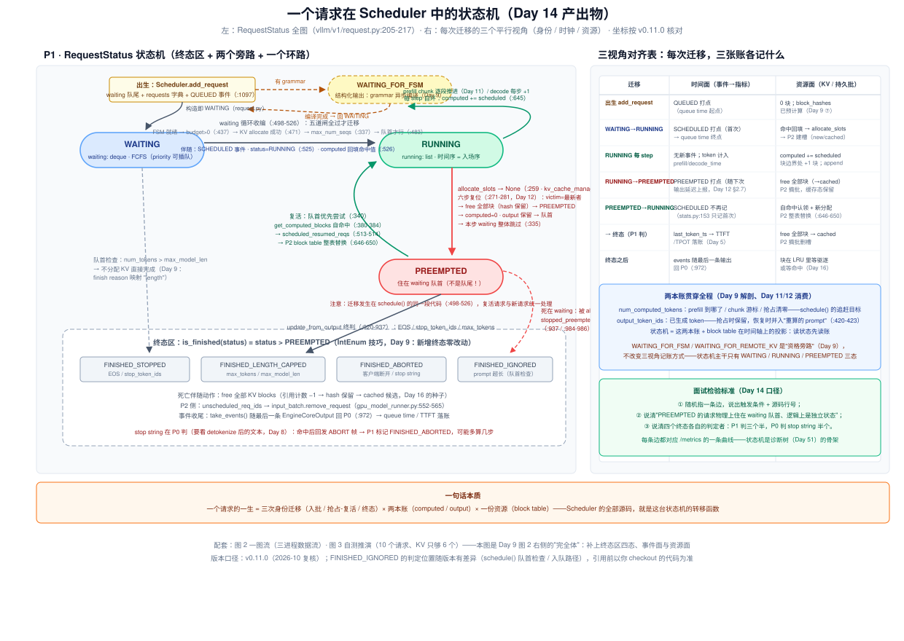
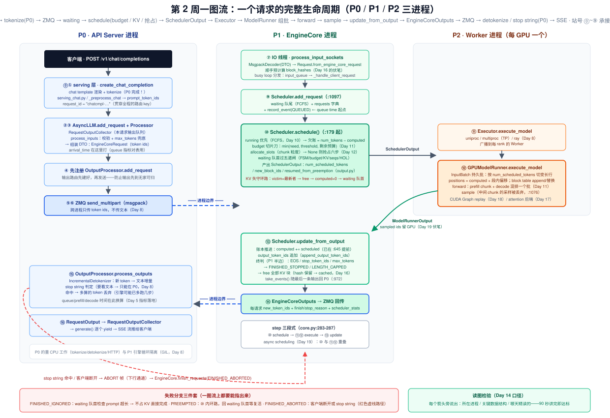
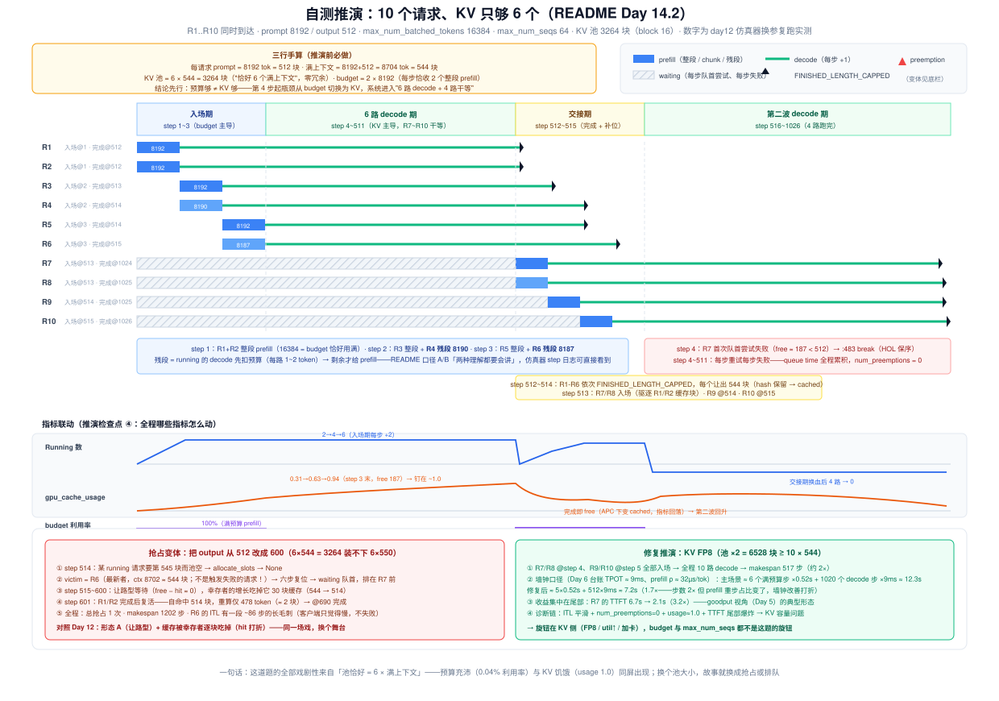

# Day 14（复盘日）· 请求状态机 + 闭卷推演：把六天源码收拢成一张图和一道题

> **系列**：推理系统优化专家岗 · 56 天打卡 | 第 2 周「vLLM V1 源码精读（上）—— 调度链路」· 收官
> **今日位置**：Day 8~13 攒了六块碎片——一张进程地图（Day 8）、九站入口链路与 `Request` 解剖（Day 9）、两队列与 budget（Day 10）、chunked prefill 的切片刀（Day 11）、preemption 的六步复位（Day 12）、压测三段对照（Day 13）。今天不引入任何新知识，只做两件事：**① 把散在六天里的状态迁移收拢成一张「一个请求在 scheduler 中的状态机」**（README Day 14 的产出物，面试白板题的原图）；**② 闭卷口头推演「10 个请求、KV 只够 6 个」的完整调度过程**（README Day 14 的自测题，Day 12 实验 1 的仿真器就是它的可执行版——今天换参数复跑对账）。画不出、推不动，就说明某一天的知识是"观光"而不是"学会"
> **前置要求**：Day 8（P0/P1/P2 三进程、step 三段式）、Day 9（`Request` 账本组、`RequestStatus` 雏形、QUEUED/SCHEDULED 事件）、Day 10（waiting/running 两队列、`max_num_batched_tokens` 与 `max_num_seqs` 两道闸——当日若未单独成文，以 `week2/README.md` §10 为读本）、Day 11（budget 切片刀、`num_computed_tokens` 游标、混排批）、Day 12（抢占六步、队首复活、诊断-调参卡）、Day 13（压测三段对照，`week2/README.md` §13）、Week 1 全部（今天推演里的每个数字都来自 Day 2 公式与 Day 6 台账）
> **预计用时**：2.5 ~ 3 小时（复盘精读 1h + 闭卷画图与口头推演 1h + 仿真器对账与产出物 0.5~1h）
> **背景衔接**：你在昇腾上做收尾的动作是"把任务状态迁移整理成状态机文档、把调优过程整理成方法论"——今天两件事都是它：**状态机图是文档版（面试白板四件套的第二件，Day 51 调度推演的原稿），闭卷推演是口头版（code review 时走读任务状态转移的演练）**。你做高并发服务的经验也直接适用：今天的推演本质是**容量规划沙盘**——"10 个请求、资源只够 6 个"就是过载系统的最小可复现模型，而"先手算、再仿真、最后压测对账"正是你做容量评估的三步法
> **实验环境**：核心实验（闭卷画图、口头推演、仿真器对账）**无 GPU 可完成**；实验 3（把推演搬进真实引擎）可选，复用 Day 6 的 1 × H100/A100 + Qwen3-8B
> **配套材料**：`week2/README.md` Day 14 节（初稿版状态机与推演表）；三张 SVG：`assets/day14_request_state_machine.svg`（今日主产出：状态机全图 + 三视角对齐表）、`assets/day14_week2_one_graph_flow.svg`（本周一图流：三进程数据流 + 失败分支）、`assets/day14_ten_requests_six_kv_timeline.svg`（自测推演时间线 + 指标联动 + 变体与修复）；验证脚本 `day14_sim.py`（§5 实验 2，Day 12 仿真器换参版）
> **版本口径**：源码坐标按 **v0.11.0 tag** 逐行核对（2026-10 复核），与 Day 8/9/11/12 一致；`FINISHED_IGNORED` 的判定位置（schedule() 队首检查）随版本有迁移，引用前以你 checkout 的代码为准

---

## 0. 今日学习目标

完成今天的学习后，你应该能够：

- [ ] **闭卷**在白纸/白板上画出「一个请求在 scheduler 中的状态机」：WAITING → RUNNING ⇄ PREEMPTED → 终态区四态，外加 `WAITING_FOR_FSM` 旁路——每条边标注**触发条件 + 源码行号**（§2，图 1）
- [ ] 说清状态机的**三个平行视角**：身份面（`RequestStatus`）、时钟面（QUEUED/SCHEDULED/PREEMPTED 事件 → queue time / TTFT）、资源面（block table 的建/增/弃/换）——每次迁移三张账各记什么（§2.4，复盘日的增量）
- [ ] **口头推演**「10 个请求、KV 只够 6 个」：每步 batch 组成、为什么第 3 步后 R7 进不来（KV 约束 vs budget 约束）、抢占变体的 victim 与恢复、全程指标怎么动（§3，图 3）——不看笔记讲满 3 分钟
- [ ] 用**仿真器对账**：先手推预测、再跑 `day14_sim.py` 验证（入场步、残段 8190/8187、完成步、抢占变体、FP8 修复），误差能归因（§3.6、§5 实验 2）
- [ ] 指着**一图流**讲 90 秒：一个请求从 HTTP 到 SSE 的全路径，标出进程边界、数据结构、三个失败分支（§2.5，图 2）
- [ ] 交付：**状态机手绘图一张** + **推演记录表**（预测列 vs 仿真列）+ **本周速查卡**（§9 模板，week2/README 14.4 的扩写版）

---

## 1. 核心概念速览（本周概念的最终收拢表）

| 组 | 概念 | 一句话 | 出处 |
|---|---|---|---|
| 身份 | **`RequestStatus`** | IntEnum：WAITING / RUNNING / PREEMPTED + 终态×4；`is_finished = status > PREEMPTED` | Day 9 |
| 身份 | `WAITING_FOR_FSM` | 结构化输出的"资格旁路"：grammar 异步编译期间不算 WAITING | Day 9 |
| 时钟 | **事件三件套** | QUEUED（入队）/ SCHEDULED（首次进批）/ PREEMPTED（被抢占），单调时间戳 | Day 9/12 |
| 时钟 | queue time | `scheduled_ts − queued_ts`；SCHEDULED 只记首次（"ignore preemptions"） | Day 9 |
| 队列 | **waiting / running** | `deque`（FCFS，`prepend_request` 队首插入）与 `list`（时间序 = 入场序） | Day 10 |
| 队列 | **两道闸** | `max_num_batched_tokens`（单步 token 上界 → ITL 上界）与 `max_num_seqs`（并发 → KV 水位） | Day 10 |
| 推进 | **`num_computed_tokens`** | 已完成 forward 的 token 数：chunk 游标、抢占清零、`schedule()` 的追赶目标 | Day 9/11 |
| 推进 | **chunked prefill** | budget 从"准入单位"变"切片刀"：单步时间有界、FLOPs 守恒、代价转嫁 TTFT | Day 11 |
| 回滚 | **preemption 六步** | victim=最新者 → free（hash 保留）→ PREEMPTED → computed=0 → output 保留 → waiting 队首 | Day 12 |
| 回滚 | **队首复活** | `prepend_request`：优先恢复（已投入最多）+ 防饥饿震荡；自命中让重算 ≈ 尾部 1 块 | Day 12 |
| 终态 | **终态四态** | STOPPED（EOS/stop token）/ LENGTH_CAPPED（max_tokens）/ ABORTED / IGNORED（prompt 超长） | Day 8/9 |
| 终态 | **判定分裂** | token id 类在 P1 `update_from_output` 判（最早最省）；stop string 在 P0 判（要看文本），命中回发 ABORT | Day 8 |
| 资源 | **block table** | 请求的 KV 足迹：入场建表、decode 追加（append）、复活整表替换（replace） | Day 4/12 |
| 资源 | free 的语义 | 真空闲 + ref_cnt=0 的可驱逐 cached 块——先驱逐缓存、后抢占请求 | Day 12 |
| 执行 | **step 三段式** | `schedule() → execute_model() → update_from_output()`（core.py:283-287） | Day 8 |
| 执行 | 持久批 InputBatch | P2 常驻 buffer，增删请求做原地 diff；`num_scheduled_tokens` 切变长行 | Day 11 |

> **一句话本质**：一个请求的一生 = **三次身份迁移**（入批 / 抢占-复活 / 终态）× **两本账**（`num_computed_tokens`、`output_token_ids`）× **一份资源**（block table）。Scheduler 的全部源码就是这台状态机的**转移函数**——而一周读下来你会发现：转移函数本身不到 100 行，理解它的难点全在"每条边上的触发条件是三张账（身份/时钟/资源）的联合判定"。

---

## 2. 原理深入讲解：把六天拼成一台状态机

### 2.1 本周地图：六天各贡献了哪一块

| Day | 贡献的状态机碎片 | 在图 1 中的位置 |
|---|---|---|
| Day 8 | 三进程地图 + step 三段式 | 图 1 的宿主（P1 的 Scheduler）；终态判定的"分裂"依据 |
| Day 9 | 出生（add_request + QUEUED）、`RequestStatus` 雏形、FSM 旁路 | 顶部入口 + 右侧旁路 |
| Day 10 | waiting/running 两队列、两道闸 | WAITING 与 RUNNING 两个"住所" |
| Day 11 | RUNNING 的内部生活：chunk 推进、budget 切片、`_update_after_schedule` | RUNNING 的自环 |
| Day 12 | PREEMPTED 环路：六步复位、队首复活、死在 waiting 的旁路 | 右下的红色环路 |
| Day 13 | 压测验证：每条边对应哪条指标曲线 | 图 1 右侧"时钟面"的观测落地 |
| **Day 14（今天）** | **收拢：补终态区四态、补三视角对齐表、闭卷默画** | 全图 |

复盘的检验标准（和 Day 7 同款）：**随机指一条边，说出它的触发条件、源码行号、以及它对应 `/metrics` 的哪条曲线**。三问都答上，这一周才算闭环。

### 2.2 主图与读法（图 1）



对照上图，把状态机压缩成 60 秒口头版（**先能指图讲，再谈细节**）：

> 请求在 P1 出生（`Scheduler.add_request`，:1097）：进 waiting 队尾、打 QUEUED 时间戳，结构化输出则先在 `WAITING_FOR_FSM` 等 grammar 编译。此后每个 step，`schedule()` 的 waiting 循环窥视队首：过五道闸（FSM 就绪、budget 有余、`allocate_slots` 成功、`max_num_seqs` 未满、队首才行）就迁入 RUNNING——打 SCHEDULED、建 block table。RUNNING 不是稳态而是"追赶循环"：每步 `num_computed_tokens += num_scheduled_tokens`（:645），prefill 逐 chunk 推进、decode 每步 +1。KV 失守时（`allocate_slots` → None）触发六步复位进 PREEMPTED——注意它**物理上住在 waiting 队首、逻辑上是独立状态**，复活走同一段 waiting 循环代码，靠 `get_computed_blocks` 自命中把重算压到尾部。终态有四个：三个半在 P1 的 `update_from_output` 判（EOS / stop_token_ids / max_tokens），stop string 半个在 P0 判（要看 detokenize 后的文本，命中回发 ABORT）；死亡伴随 free 全部 KV 块（hash 保留 → cached 候选，Day 16 的种子）。

### 2.3 逐态精讲：四个必考细节

**① 出生即记账，且带"预计算"**。`Request.from_engine_core_request`（request.py:125）构造时就完成三件事：`status = WAITING`（结构化输出则 `WAITING_FOR_FSM`）、`num_computed_tokens = 0`、**prompt 所有满块的链式哈希已算好**（Day 9 ⑦ 站）——最后这件意味着：请求还没跑一个 token，它未来命中 prefix cache 的"钥匙"已经备齐（Day 16 的伏笔埋在这里）。QUEUED 事件用 P1 单调钟打点，随该请求**最后一条** `EngineCoreOutput` 回传 P0（:972）——"事件搭输出的便车"是本周反复出现的模式。

**② RUNNING 的本质是"追赶循环"，不是稳态**。Day 11 的统一调度模型：调度器眼里没有 prefill/decode 阶段，只有一个追赶目标 `num_tokens_with_spec − num_computed_tokens`（request.py:172-174）。于是 RUNNING 的自环每步做的事完全同构：算欠账 → 切到 budget 以内 → `allocate_slots`（chunk 粒度）→ 记入 `num_scheduled_tokens` → `_update_after_schedule` 立即推进游标（:645，不等 forward 返回）。**prefill 与 decode 的区别只是"欠账还剩多少"**——这个抽象同时覆盖了 chunked prefill、prefix caching 命中抵扣、投机解码的 lookahead（三者的官方理由，Day 11 背过）。

**③ PREEMPTED：物理在 waiting 队首，逻辑是独立状态**。六步复位（:271-281，Day 12）之后，请求的 `status` 是 `PREEMPTED` 而不是回到 `WAITING`——区别在复活路径的记账：`scheduled_resumed_reqs`（:513-514）而非 `scheduled_new_reqs`，P2 据此把 block table **整表替换**（gpu_model_runner.py:646-650）而非追加。为什么必须替换：它旧的块已 free、可能易主，追加会指到别人的块上。另外记住那条红色虚线：**请求也可能死在 waiting 里**（被 abort 或判停，`stopped_preempted_reqs`，:937/:984-986，源码注释自嘲 "rare case"）——PREEMPTED 不是"等一下"，是"可能等很久甚至等死"。

**④ 终态区的判定者是分裂的**。"数据在哪、判定就在哪"（Day 8）：

| 终态 | 判定者 | 判据 | 时机 |
|---|---|---|---|
| `FINISHED_STOPPED` | P1 `update_from_output` | EOS / stop_token_ids（只看 token id） | 最早能判，省算 |
| `FINISHED_LENGTH_CAPPED` | P1 `update_from_output` | max_tokens / max_model_len | 同上 |
| `FINISHED_ABORTED` | P1（收到 ABORT 帧）| 客户端断开 或 P0 stop string 命中回发 | stop string 场景引擎已多算几步 |
| `FINISHED_IGNORED` | P1 schedule() 队首检查 | prompt 超过 max_model_len | 不分配 KV 直接完成；finish reason 映射 "length" 对齐 OpenAI 口径 |

死亡伴随动作三件：free 全部 KV 块（引用计数 −1，hash 保留 → cached 候选）、P2 从持久批摘除、`take_events()` 把事件打包随最后一条输出回 P0（queue time / TTFT / TPOT 在此落账，Day 5 指标的闭环点）。

### 2.4 三视角对齐表（复盘日的增量）

Day 9 给了状态机的雏形，Day 12 补了抢占环路，今天补上最后一块：**每次迁移时，三张账各记什么**（图 1 右侧表格的完整版）：

| 迁移 | 身份面（status） | 时钟面（事件 → 指标） | 资源面（KV / 持久批） |
|---|---|---|---|
| 出生 `add_request`（:1097） | =WAITING（FSM 旁路除外） | QUEUED 打点（queue time 起点） | 0 块；block_hashes 已预计算 |
| WAITING → RUNNING（:498-526） | =RUNNING（:525） | SCHEDULED 打点（首次，queue time 终点） | 命中回填（:526）→ `allocate_slots` 建块 → P2 建槽 |
| RUNNING 每 step（:645） | 不变 | 无新事件；token 计入 prefill/decode_time | 游标推进；跨块边界 +1 块；P2 append |
| RUNNING → PREEMPTED（:271-281） | =PREEMPTED | PREEMPTED 打点（**随下次输出延迟上报**，Day 12 §2.7） | free 全部块（→cached）；P2 摘批、缓存态保留 |
| PREEMPTED → RUNNING（:513-526） | =RUNNING（resumed） | SCHEDULED **不再记**（stats.py:153 只记首次） | 自命中认领 + 新分配；P2 **整表替换** |
| → 终态（:920-937） | STOPPED / LENGTH_CAPPED / ABORTED | last_token_ts → TTFT/TPOT 落账 | free 全部块 → cached；P2 摘批删槽 |
| 终态之后 | `is_finished`（一次整数比较） | events 随最后一条输出回 P0（:972） | 块在 LRU 里等驱逐或等命中（Day 16） |

这张表为什么值一节：**它把"读源码"变成"对账"**。面试官追问任何一条边，你都有一条三列的应答路径——先答身份怎么变（状态语义），再答时钟怎么记（可观测性），最后答资源怎么动（工程正确性）。Day 51 的性能诊断树之所以成立，正是因为每条指标曲线都能沿"时钟面"反推回某条迁移边。

### 2.5 本周一图流（图 2，README 14.3 的产出）



读图检验（**90 秒讲完即达标**，每个箭头旁说出：所在进程 / 关键数据结构 / 哪天精读的）：

> 客户端 POST → P0 serving 层渲染 chat template 并 tokenize（⓪①，产出 token ids）→ `AsyncLLM.add_request` 建输出队列、`Processor` 校验兜底组装 DTO（②③）→ **先注册** `OutputProcessor` 再 ZMQ 发送（④⑤⑥，防输出先到无家可归）→ P1 IO 线程解码并构造 `Request`（⑦，预计算 block hash）→ busy loop 分发到 `Scheduler.add_request`（⑨，waiting + QUEUED）→ `schedule()` 组批（⑩，budget 切片 + KV 分配 + 抢占环路）→ `SchedulerOutput` 跨到 P2（⑪⑫，InputBatch 切变长行、混排 forward、sample，ids 留 GPU）→ `update_from_output` 记账终判（⑬）→ `EngineCoreOutputs` 经 ZMQ 回 P0（⑭）→ 增量 detokenize + stop string 判定（⑮）→ SSE（⑯）。失败分支三件套：IGNORED（队首超长）、PREEMPTED（⑩ 内环回 waiting 队首）、ABORTED（客户端断开 / stop string 回发 ABORT）。

### 2.6 与 Week 1 的闭环：每条边对应哪条公式

| 状态机的事件 | Week 1 的公式/结论 | 联结点 |
|---|---|---|
| WAITING → RUNNING 的排队时长 | Day 5：queue time 是 TTFT 的成分之一 | 排队不是抽象等待，是"每 step 队首尝试、每步失败"的累积（今天 §3 实测 509 步） |
| RUNNING 自环的步长 | Day 2：TPOT ≥ W/BW ≈ 4.9ms（Qwen3-8B@H100）；Day 6 实测 ≈ 9ms | decode 步长 = ITL 下界 × 效率系数 |
| prefill chunk 的步长 | Day 11：ρ ≈ 32µs/token → 8192-token 段 ≈ 0.26s | budget 16384 的满步 ≈ 0.52s |
| PREEMPTED 的恢复成本 | Day 12：ρ × (ctx − hit) | 全命中 ≈ 0.5ms，全未命中 4K ≈ 131ms |
| 终态的容量意义 | Day 4：η > 96%；Day 2：并发上限 = KV 池 ÷ (E[L]·KV_tok) | "6 个满上下文"就是这道公式取等号的临界点 |

**第 1 周给公式，第 2 周给机制**——今天的推演就是把两边焊在一起。

---

## 3. 自测推演：10 个请求、KV 只够 6 个（图 3）



### 3.1 推演前的三行手算（30 秒，不许跳过）

设定（README 14.2 原题）：R1..R10 同时到达（编号即到达序），每个 prompt 8192、输出 512；`max_num_batched_tokens = 16384`、`max_num_seqs = 64`；KV 池恰好容纳 6 个请求的满上下文（block_size = 16）。

1. **每请求的块账**：prompt 8192 token = **512 块**；满上下文 8192+512 = 8704 token = **544 块**（整除，无尾块——出题人选数字是故意的）；
2. **池容量**：6 × 544 = **3264 块**（= 52,224 token，零冗余——这是全部戏剧性的来源）；
3. **预算**：16384 = 2 × 8192——满预算一步恰收两个整段 prefill；`max_num_seqs=64` 全程不构成约束（10 < 64）。

### 3.2 主线推演（先自己推，再对表）

**口径 A（干净版，README 表格的口径）**——把每步预算视作全给 prefill：

| Step | 动作 | running | waiting | 说明 |
|---|---|---|---|---|
| 1 | R1、R2 整段 prefill（2×8192 = 16384 用满预算） | R1,R2 | R3..R10 | budget 钉死单步 token 数；R1/R2 本步末采出首 token |
| 2 | R3、R4 整段 prefill（+R1/R2 各 1 decode token） | R1-R4 | R5..R10 | |
| 3 | R5、R6 整段 prefill | R1-R6 | R7..R10 | 池被 6 个请求的上下文占据（free ≈ 187 < 512） |
| 4..511 | R1..R6 每步各 +1 token（6 token/步，预算大量闲置） | R1-R6 | R7..R10 | **R7 想进：allocate_slots 失败 → 留在 waiting。预算够 ≠ KV 够** |
| 512 | R1、R2 生成满 512 → `FINISHED_LENGTH_CAPPED` → free 各 544 块 | R3-R6 | R7..R10 | 块转 cached（hash 保留） |
| 513 | R7、R8 prefill 进批（驱逐 R1/R2 的缓存块） | R3-R8 | R9,R10 | 队首 FCFS 接替 |
| 514-515 | R3~R6 依次完成；R9、R10 相继入场 | R7-R10 | — | 换血完成，第二波 4 路 decode |
| 516..1026 | R7..R10 decode 至完成（R7@1024 … R10@1026） | R7-R10 | — | makespan ≈ 1026 步；**全程 0 次抢占** |

**口径 B（精确版，真实代码的口径）**——running 的 decode **先**扣预算（每个 1~2 token），剩余才给 prefill，于是入场步出现**残段**（chunked prefill 的必然副产物，仿真器 step 日志原样可见）：

```text
step 1 | free=2240 running=2 | R1:8192 R2:8192
step 2 | free=1214 running=4 | R1:1 R2:1 R3:8192 R4:8190     ← R4 残段（16384−2−8192=8190）
step 3 | free= 189 running=6 | R1:1 R2:1 R3:1 R4:2 R5:8192 R6:8187  ← R4 补 2；R6 残段 8187
step 4 | free= 187 running=6 | R1:1 R2:1 R3:1 R4:1 R5:1 R6:5 ← R6 补 5；R7 首次尝试失败（187 < 512）
```

README 特意标注"两种理解都要会讲"：口径 A 讲给面试官听（主干不失真），口径 B 用来对账源码与仿真（残段导致 R4~R6、R8~R10 的完成步比口径 A 晚 1~2 步：513/514/514/515 → 实测 513/514/514/515 与 1024/1025/1025/1026）。

**推演检查点**（README 14.2 原文，口头能讲清才算过）：

- [ ] **每一步 batch 的组成**：入场期每步 2 个整段/残段 prefill + 0~4 个 decode；decode 期每步恰 6 个 decode（各 1 token）；交接期 prefill 与 decode 混排（Day 11 的混排批活样本）；
- [ ] **为什么第 3 步后 R7 进不来**：budget 还剩 16378（≈100% 闲置），但 free 只有 187 块 < R7 需要的 512 块 → `allocate_slots` 返回 None → `break`（:483，HOL 保序）。**budget 管单步时长，KV 管能不能进来——两个约束正交**；
- [ ] **抢占选谁、为什么、恢复排哪、重算多少**：见 §3.3 变体；
- [ ] **全程指标怎么动**：见 §3.4。

### 3.3 抢占变体：把 output 从 512 改成 600

主线为什么 0 抢占：6 × 544 = 3264 **恰好**装满，六个请求都在触顶前完成。把输出改成 600：满上下文变 8792 token = 550 块，6 × 550 = 3300 > 3264——**过订**。推演（仿真实测）：

1. **触发**：step 514，某个 running 请求要第 545 块而池空 → `allocate_slots` → None（kv_cache_manager.py:271-273）；
2. **victim = R6**（`running.pop()` 最新者，当时 ctx 8702 ≈ 544 块）——**注意 victim 不是触发失败的请求**（触发者多半是 R1/R3 这类老请求）：抢占优化的是**沉没成本**，不是释放量（Day 12 §2.3）；
3. **复位**：free 544 块（hash 保留 → cached）→ PREEMPTED → computed=0 → output 保留 → waiting **队首**（排在 R7 前）；
4. **让路型等待**（Day 12 形态 A）：step 515~600 共 86 步，R6 每步队首尝试、每步失败（free − hit ≈ 0：空闲块几乎全是它自己的缓存）；期间幸存者的增长吃掉它 **30 块缓存（544 → 514）**——"复活近免费"的前提在饱和负载下会打折；
5. **复活**：step 601（R1/R2 完成让出块后）：自命中 514 块，**重算仅 478 token（≈ 2 块）**；同一步 R7/R8 也入场（budget 足够混排）；
6. **为什么只抢一次不再震荡**：交接期完成释放（每个 ~550 块）跟得上新增入场（每个 512 块），系统回到容量以内——FCFS + 短交接窗口的自愈。总账：总抢占 1 次、makespan 1202 步、R6 的 ITL 有一段 ~86 步的长毛刺（客户端只觉得慢，不失败）。

### 3.4 指标联动（推演检查点④的完整答案）

| 阶段 | Running/Waiting | gpu_cache_usage | budget 利用率 | num_preemptions | TTFT/ITL |
|---|---|---|---|---|---|
| step 1-3 | 2→4→6 / 8→4 | 0.31→0.63→0.94 | **100%** | 0 | R1/R2 TTFT ≈ 1 步 |
| step 4-511 | 6 / 4（钉死） | 0.94 → **1.0** | **0.04%**（6/16384） | 0 | R7~R10 queue time 累积 ≈ 509 步 |
| step 512-515 | 换血 6→6→4 | 完成即 free → 回落 | 100% | 0（主线）/ 1（变体 @514） | R7 TTFT ≈ 513 步 |
| step 516-1026 | 4→0 | 回升 → 0 | 0.02% | 0 | ITL 全程平滑 |

墙钟口径（Day 6 台账 TPOT ≈ 9ms、Day 11 ρ ≈ 32µs/token）：主线 makespan ≈ 6 个满预算步 ×0.52s + 1020 个 decode 步 ×9ms ≈ **12.3s**；R7 的 TTFT ≈ 1.56 + 4.58 + 0.52 ≈ **6.7s**——其中 queue time ≈ 6.1s 占 91%。**这段话就是诊断**：TTFT 尾部爆炸而 ITL 平滑、无抢占、usage 钉 1.0 → 不是 prefill 拥塞，是 **KV 容量饥饿**。

### 3.5 修复推演（这道题的"然后呢"——面试官一定追问）

旋钮只在 KV 侧：`--kv-cache-dtype fp8`（池 ×2 = 6528 块 ≥ 10 × 544 = 5440）：

- **入场**：R7/R8 @step 4、R9/R10 @step 5 全部入场，全程 10 路 decode；
- **makespan**：517 步（≈ 2×）——但墙钟 ≈ 5×0.52 + 512×9ms ≈ **7.2s（1.7×）**：步数减半不等于墙钟减半，因为 prefill 重步的占比变了（诚实的数量级分析要带这一句）；
- **尾部收益**：R7 的 TTFT 6.7s → 2.1s（**3.2×**）——收益集中在 TTFT 尾部，正是 Day 5 goodput 视角的典型形态；
- **对照**：`--max-num-batched-tokens` 调到 32768？R7 还是进不来（free 不变）。`--max-num-seqs` 调小？它本来就不是约束（10 < 64）。**先做容量手算再动旋钮**（Day 12 §3.2 的纪律）。

### 3.6 仿真器对账（先填预测列，再跑）

Day 12 实验 1 的仿真器（`day12_sim.py`）换参数即是本题的可执行版（完整脚本见 §5 实验 2）：

| 检查点 | 我的手推预测 | 仿真实测（对账） |
|---|---|---|
| step 1-3 的批组成 | 2×8192 / 8192+8190 / 8192+8187 | ✅ 一致（残段口径 B） |
| R7 首次入队失败的步号 | 4（free ≈ 187 < 512） | ✅ step 4 |
| 主线总抢占数 | 0（恰好装满，不触顶） | ✅ 0 |
| R1..R10 完成步 | 512,512,513,514,514,515 / 1024,1025,1025,1026 | ✅ 一致 |
| 变体：首次抢占 | ~514，victim=R6 | ✅ (514, R6, ctx 8702) |
| 变体：R6 重算量 | 尾部数块（缓存被吃后 >1 块） | ✅ 478 token（30 块被吃） |
| FP8 修复 makespan | ~517 步 | ✅ 517（R7@4 … R10@5） |

预测错了不是坏事——**每一个对不上的格子，都是一条 misunderstanding 的定位器**（Day 12 实验 1 的方法论原样适用）。

---

## 4. 关键代码走读：状态机的转移函数在哪里

> **阅读方法**：拿着图 1 从上往下走。以下为 v0.11.0 主干保真节选；今天不逐行重读（Day 10-12 已读过），只标**迁移点**。

### 4.1 状态定义（`vllm/v1/request.py:205-217`）

```python
class RequestStatus(IntEnum):          # 数值顺序是设计的一部分
    WAITING = 0
    WAITING_FOR_FSM = 1                # 结构化输出旁路
    RUNNING = 2
    PREEMPTED = 3                      # ← 分界线：终态全部排在它之后
    FINISHED_STOPPED = 4               # EOS / stop_token_ids
    FINISHED_LENGTH_CAPPED = 5         # max_tokens / max_model_len
    FINISHED_ABORTED = 6               # 客户端断开 / stop string
    FINISHED_IGNORED = 7               # prompt 超长（finish reason 映射 "length"）

def is_finished(status): return status > RequestStatus.PREEMPTED   # 一次整数比较
```

IntEnum 技巧（Day 9 背过，今天再默一遍）：新增终态零改动、无需维护冗余布尔字段。**顺序即语义**——这是"用数据结构编码不变量"的小范例，面试可以主动讲。

### 4.2 转移函数的三个现场（全在 `vllm/v1/core/sched/scheduler.py`）

```python
# 现场① 出生（:1097）—— Day 9 ⑨ 站
self.waiting.add_request(request)                 # FCFS 队尾；priority 则入堆
self.requests[request.request_id] = request       # 字典：PREEMPTED/WAITING 都可查可 abort
request.record_event(EngineCoreEventType.QUEUED)  # 时钟面起点

# 现场② WAITING → RUNNING（waiting 循环 :498-526）—— Day 10/11/12 三天合读
if not preempted_reqs:                            # :335 本步发生过抢占则整体跳过
    while self.waiting and token_budget > 0:
        if len(self.running) == self.max_num_running_reqs: break   # :337 闸②
        request = self.waiting.peek_request()     # :340 只看队首（复活者优先）
        ...
        if request.num_computed_tokens == 0:      # :380 新请求或复活请求
            ... = self.kv_cache_manager.get_computed_blocks(request)  # 自命中
        num_new_tokens = request.num_tokens - num_computed_tokens   # :423 复活含 output
        num_new_tokens = min(num_new_tokens, token_budget)          # :437 闸③
        new_blocks = self.kv_cache_manager.allocate_slots(...)      # :471 闸④
        if new_blocks is None: break              # :483 闸⑤ HOL：队首放不下即止
        request = self.waiting.pop_request()      # :498
        self.running.append(request)              # :507 尾部 = 又是最新者（bounce 风险）
        if request.status == RequestStatus.WAITING:
            scheduled_new_reqs.append(request)    # :512 新兵
        elif request.status == RequestStatus.PREEMPTED:
            scheduled_resumed_reqs.append(request) # :514 复活者 → P2 整表替换
        request.status = RequestStatus.RUNNING    # :525 ★ 身份迁移就在这一行
        request.num_computed_tokens = num_computed_tokens           # :526 回填命中值

# 现场③ RUNNING → PREEMPTED（:271-281）—— Day 12 全文，六步复位
preempted_req = self.running.pop()                # :271 victim = 最新者（FCFS）
self.kv_cache_manager.free(preempted_req)         # :273 块 → cached（hash 保留）
preempted_req.status = RequestStatus.PREEMPTED    # :275
preempted_req.num_computed_tokens = 0             # :276 ★ 账本清零 = recompute 全部状态
self.waiting.prepend_request(preempted_req)       # :281 ★ 队首（不是队尾）
```

**一个值得玩味的观察**：状态机里最"重"的两条边（入批与抢占），源码都不到 30 行——**复杂度不在转移本身，而在转移前的多重可行性判定**（五道闸）与转移后的三面记账（身份/时钟/资源）。这也是读调度器源码的正确姿势：先找 `status =` 赋值点（全文件只有寥寥数处），再向外扩判定条件。

### 4.3 终判与两进程分裂（`update_from_output` + P0 `OutputProcessor`）

```python
# P1 侧（scheduler.py:920-937 节选）—— token id 类判据，最早能判
if request_status == RequestStatus.FINISHED_STOPPED: ...
# 触发源：sampled token == eos_token_id / stop_token_ids，
#         或 output 达到 max_tokens / max_model_len → FINISHED_LENGTH_CAPPED
if stopped:
    if status_before_stop == RequestStatus.RUNNING:
        stopped_running_reqs.add(request)
    else:
        stopped_preempted_reqs.add(request)       # :937 死在 waiting 的旁路
# 死亡伴随：kv_cache_manager.free(request)（块 → cached 候选）
#           request.take_events() 随最后一条输出回 P0（:972）

# P0 侧（output_processor.py，示意）—— stop string 类判据，要看文本
# IncrementalDetokenizer 增量反 tokenize → 检查 stop 字符串
# 命中 → 经下行通道发 ABORT 帧 → P1 finish_requests(FINISHED_ABORTED)
# 代价：引擎此刻可能已多算几步（多生成的 token 被丢弃）—— Day 8 的隐蔽行为
```

### 4.4 调用链速查表（本周总账 · 状态机版）

| # | 迁移边 | 站点 | 文件:行 |
|---|---|---|---|
| ⓪ | （出生前） | 九站入口链路 | Day 9 §4.7 速查表 |
| ① | → WAITING | `Scheduler.add_request`（QUEUED） | `scheduler.py:1097` |
| ② | WAITING → RUNNING | waiting 循环 `status = RUNNING` | `scheduler.py:525` |
| ③ | RUNNING 自环 | `_update_after_schedule`（computed += scheduled） | `scheduler.py:629-645` |
| ④ | RUNNING → PREEMPTED | 六步复位 | `scheduler.py:271-281` |
| ⑤ | PREEMPTED → RUNNING | `scheduled_resumed_reqs` → `status = RUNNING` | `scheduler.py:513-514/:525` |
| ⑥ | PREEMPTED → ABORTED | `stopped_preempted_reqs` | `scheduler.py:937/:984-986` |
| ⑦ | RUNNING → STOPPED/CAPPED | `update_from_output` 终判 | `scheduler.py:920-937` |
| ⑧ | WAITING → IGNORED | 队首超长检查（位置随版本迁移） | schedule() waiting 循环 |
| ⑨ | 终态 → （资源清理） | free → cached；P2 摘批 | `kv_cache_manager` + `gpu_model_runner.py:552-565` |
| ⑩ | （P0 半边） | stop string → ABORT 帧下行 | `output_processor.py` → `core_client.py` |

---

## 5. 动手实验（约 90 分钟：复盘日的实验 = 输出）

### 实验 0（必做，15 min）：闭卷画状态机

白纸 + 笔，不看任何材料，画「一个请求在 scheduler 中的状态机」。**扣分点自查**（图 1 为标准答案）：

- [ ] 缺 `WAITING_FOR_FSM` 旁路（−1）/ 缺"死在 waiting"的红虚线（−1）
- [ ] PREEMPTED 没标"住在 waiting **队首**"（−2——这是 Day 12 的核心）
- [ ] 终态只画了一个框没分四态（−1）/ 没标判定者分裂（P1 vs P0 stop string）（−1）
- [ ] 边上没写触发条件与行号（每缺一条 −0.5：:1097 / :525 / :271-281 / :513-514 / :920-937）
- [ ] 没画自环的"每步 computed += scheduled"（−1）——RUNNING 是循环不是稳态

画完贴在工位上——它就是 Day 51 白板四件套之二的原稿。

### 实验 1（必做，15 min）：口头推演并录音

手机录音 3~5 分钟，讲 §3 的主线推演（不看笔记）。自评五个检查点（README 14.2 原文）：

- [ ] 每步 batch 组成（几个 decode / 几个 chunk / 各多少 token）
- [ ] 为什么第 3 步后 R7 进不来（KV 约束 vs budget 约束的区别）
- [ ] 抢占变体：选谁、为什么、恢复排哪、重算多少
- [ ] 全程指标怎么动（running/waiting、gpu_cache_usage、num_preemptions、queue time）
- [ ] 收尾给诊断与旋钮（§3.5 的"然后呢"）

卡壳的检查点回跳对应 Day 重修（10-12）。录音留档——Day 54 模拟面试的素材。

### 实验 2（必做，20 min；无 GPU 可做）：仿真器对账

把 Day 12 实验 1 的仿真器（`day12_sim.py`）换到本题参数——改动集中在 `__main__`（请求参数、块数、budget），调度逻辑一行不动（本身这就是一次复习：对照 Day 12 §5 逐行确认你还能讲出每段对应 scheduler.py 的哪一段）。完整脚本（已实测，输出见 §3.6 右列）：

```python
#!/usr/bin/env python3
"""day14_sim.py —— README 14.2 场景：10 × (prompt 8192, output 512)，budget 16384，
KV 池 3264 块（= 6 × 544 满上下文）。调度逻辑与 day12_sim.py 完全一致。
用法: python day14_sim.py [--steps 6] [--blocks 3264] [--out 512] [--no-cache]
"""
import argparse
from collections import deque

class Req:
    def __init__(self, rid, prompt, max_tokens):
        self.rid, self.prompt, self.max_tokens = rid, prompt, max_tokens
        self.output, self.computed, self.blocks = 0, 0, 0
        self.recomputed, self.preemptions, self.done_step = 0, 0, None
        self.admit_step = None

    @property
    def ctx(self):                       # num_tokens = prompt + output（request.py:169）
        return self.prompt + self.output

def bfor(n, bs):                         # ceil(n / bs) 个 block
    return (n + bs - 1) // bs

def simulate(reqs, num_blocks, bs=16, budget=16384, cache=True, max_steps=4000, trace=0):
    waiting, running = list(reqs), []
    free, cached, lru = num_blocks, {}, deque()  # free=真空闲+可驱逐（BlockPool 口径）
    total_pre, log, first_fail, first_pre = 0, [], None, None

    def try_alloc(r, rows, hit=0):       # allocate_slots（kv_cache_manager.py:260-273）
        nonlocal free
        need = bfor(rows, bs) - r.blocks - hit
        if need + hit > free:
            return False
        if hit:                          # 认领命中块：ref_cnt 0→1
            free -= hit
            cached.pop(r.rid, None)
            if r.rid in lru: lru.remove(r.rid)
            r.blocks += hit
        if need > 0:                     # 按 LRU 先驱逐最老缓存
            remaining = need
            while remaining > 0 and lru:
                rid0 = lru[0]
                take = min(cached[rid0], remaining)
                cached[rid0] -= take
                remaining -= take
                if cached[rid0] == 0:
                    lru.popleft()
            free -= need
            r.blocks += need
        return True

    for step in range(1, max_steps + 1):
        budget_left, preempted, sched = budget, False, {}
        i = 0
        while i < len(running) and budget_left > 0:          # RUNNING 循环 :210
            r = running[i]
            n = min(r.ctx - r.computed, budget_left)         # 欠账（复活请求含重算）
            target, ok = r.computed + n, True
            if not try_alloc(r, target):                     # :254-258 失败 → 抢占
                while True:                                  # :254-290
                    v = running.pop()                        # :271 FCFS 弹最新
                    free += v.blocks                         # 块进 free 队列
                    if cache:                                # hash 保留 → 缓存候选
                        cached[v.rid] = v.blocks; lru.append(v.rid)
                    v.blocks, v.computed = 0, 0              # :276 账本清零
                    v.preemptions += 1
                    waiting.insert(0, v)                     # :281 队首！
                    total_pre, preempted = total_pre + 1, True
                    if first_pre is None:
                        first_pre = (step, v.rid, v.ctx)
                    if v is r:                               # :283 抢到自己 → 止
                        ok = False; break
                    if try_alloc(r, target):
                        break
            if not ok:
                break                                        # :291-292 本步 running 终止
            budget_left -= n; r.computed += n; sched[r.rid] = n
            i += 1
        if not preempted:                                    # :335 本步无抢占才收新
            while waiting and budget_left > 0:               # WAITING 循环 :336
                r = waiting[0]
                hit = 0
                if r.computed == 0 and cache:                # :380 get_computed_blocks
                    hit = min(cached.get(r.rid, 0), (r.ctx - 1) // bs)
                n = min(r.ctx - hit * bs, budget_left)       # :423/:437（残段在这里出现）
                if not try_alloc(r, hit * bs + n, hit):      # :471
                    if first_fail is None:
                        first_fail = (step, r.rid, free)     # ★ R7 首次入队失败
                    break                                    # :483 HOL
                if r.admit_step is None:
                    r.admit_step = step
                waiting.pop(0); running.append(r)            # :507 又回队尾
                if r.preemptions:                            # 只有复活才记重算账
                    r.recomputed += r.ctx - hit * bs         # 重算 = ctx − 命中
                r.computed = hit * bs                        # :526 回填命中值
                budget_left -= n; r.computed += n; sched[r.rid] = n
        for r in reqs:                                       # 采样推进（Day 11 同款）
            if r.rid in sched and r.computed == r.ctx:
                r.output += 1
                if r.output >= r.max_tokens and r.done_step is None:
                    r.done_step = step
                    if r in running: running.remove(r)
                    free += r.blocks                         # 完成也走 cached 语义
                    if cache: cached[r.rid] = r.blocks; lru.append(r.rid)
                    r.blocks = 0
        if step <= trace:
            log.append(f"step {step:3d} | free={free:4d} cached={sum(cached.values()):4d} "
                       f"running={len(running)} waiting={len(waiting)} pre={total_pre} | "
                       + " ".join(f"{r.rid}:{sched.get(r.rid,0)}" for r in running))
        if all(r.done_step for r in reqs):
            break
    return total_pre, step, log, first_fail, first_pre

if __name__ == "__main__":
    ap = argparse.ArgumentParser()
    ap.add_argument("--blocks", type=int, default=3264)   # = 6 × 544（满上下文）
    ap.add_argument("--out", type=int, default=512)       # 600 = 抢占变体
    ap.add_argument("--no-cache", action="store_true")
    ap.add_argument("--steps", type=int, default=0)
    args = ap.parse_args()
    reqs = [Req(f"R{i}", 8192, args.out) for i in range(1, 11)]  # 10 个请求
    total_pre, fin, log, ff, fp = simulate(reqs, args.blocks,
                                           cache=not args.no_cache, trace=args.steps)
    for line in log: print(line)
    print(f"\n总步数={fin}  总抢占={total_pre}  cache={'on' if not args.no_cache else 'off'}"
          f"  首次入队失败={ff}  首次抢占={fp}")
    for r in reqs:
        print(f"{r.rid}: 入场 step {r.admit_step} | 抢占 {r.preemptions} 次 | "
              f"重算 {r.recomputed} token | 完成于 step {r.done_step}")
```

```bash
python day14_sim.py --steps 6      # 看入场期的残段（R4:8190、R6:8187）
python day14_sim.py                # 主线：总步数 1026、总抢占 0、完成步逐个对账
python day14_sim.py --out 600      # 变体：抢占 @514 victim=R6、重算 478、makespan 1202
python day14_sim.py --blocks 6528  # FP8 修复：R7@4 入场、makespan 517
python day14_sim.py --blocks 6528 --no-cache   # 体会：本题主线 0 抢占，APC 开关不改变结局
```

- [ ] 先填 §3.6 的"手推预测"列，再跑，再填"仿真实测"列——**对不上的格子逐个归因**（99% 是块边界取整或残段口径）
- [ ] 思考最后一行：为什么 `--no-cache` 对主线无影响、对变体影响巨大？（主线 0 抢占无恢复路径；变体的恢复成本全靠自命中——APC 的价值集中在"回滚便宜"这一件事上）

### 实验 3（可选，GPU，20 min）：把推演搬进真实引擎（缩小版）

8192/512 太重，按比例缩小到 2048/256（保持"10 个请求、KV 恰好 6 个满上下文"的拓扑）：

```bash
# 手算先行：满上下文 = 2048+256 = 2304 tok = 144 块；6 × 144 = 864 块 = 12,442 tok ≈ 1.79 GB
# → H100 80G 上把 util 压到 ≈ 0.25（权重 16.4G + act ≈ 2G + KV 1.8G），让启动日志落在 864 块附近
vllm serve Qwen/Qwen3-8B --gpu-memory-utilization 0.25 --max-model-len 4096 \
  --max-num-batched-tokens 8192 --max-num-seqs 64

# 终端 2：10 个请求同时打入（request-rate 拉满 = "同时到达"）
vllm bench serve --backend openai --model Qwen/Qwen3-8B \
  --dataset-name random --random-input-len 2048 --random-output-len 256 \
  --num-prompts 10 --request-rate 100 --percentile-metrics ttft,tpot,itl

# 终端 3：
watch -n1 'curl -s localhost:8000/metrics | grep -E "num_requests_running|num_requests_waiting|gpu_cache_usage|num_preemptions"'
```

- [ ] **先写下预测**（Running 钉在几？Waiting 几？usage 到不到 1.0？preemptions 涨不涨？TTFT 分几档？），再看指标——预测-对账才是实验，看热闹不算
- [ ] 预期：Running 钉 6、Waiting 4、usage → ~1.0、preemptions ≈ 0（若 util 给多了变 7 路也正常——用启动日志 `GPU KV cache size` 反推真实块数，**重新手算后再解释**）；TTFT 呈两档（先入的 6 个 vs 后补的 4 个）——§3.4 表格的实拍版
- [ ] 对照 Day 13 的三段式记录法补"源码机制"列（现象 → 机制 → 指标）

### 实验 4（产出，20 min）：速查卡定稿 + 一图流手绘

按 §9 模板把本周速查卡写成自己的一页（week2/README 14.4 的扩写）；再手绘一图流（对照图 2 校漏）。

### 常见坑（方法论清单）

| # | 坑 | 后果 | 解法 |
|---|---|---|---|
| 1 | 把 PREEMPTED 画成回到 WAITING 的普通回流 | 复活语义讲错（resumed 标记 / 整表替换全丢） | 独立状态 + "物理在队首"（§2.3③） |
| 2 | 忘了残段（口径 B） | 仿真对账差 1~2 步就开始怀疑理解 | decode 先扣预算（§3.2） |
| 3 | 把"预算闲置"当成"系统空闲" | 误诊为 prefill 拥塞、乱调 budget | 预算够 ≠ KV 够；看 usage（§3.5） |
| 4 | 把 victim 当成"触发失败的请求" | 抢占语义讲错 | 最新者；优化沉没成本（§3.3②） |
| 5 | 主线变体混着讲 | 面试现场自相矛盾 | 先讲"恰好装满 0 抢占"，再主动升级到 600 变体 |
| 6 | 以为 stop string 判定在 P1 | 与 EOS 判定混为一谈 | 数据在哪、判定就在哪（§4.3） |
| 7 | 墙钟直接按步数比例折算 | 修复收益报高（2× → 实际 1.7×） | prefill 重步与 decode 步分别计价（§3.5） |
| 8 | 画状态机漏掉事件面 | 讲不清指标从哪来 | 三视角对齐表（§2.4） |

---

## 6. 面试高频问题（复盘综合级）

**Q1：白板画一个请求在 vLLM V1 scheduler 中的状态机。**（现场题，本周总结晶）

> 骨架：① 三主干态 + 终态区四态 + FSM 旁路 + 死在 waiting 旁路；② 每条边给触发条件与行号：入批五道闸（:498-526）、自环 computed += scheduled（:645）、抢占六步（:271-281）、复活 resumed（:513-514）、终判（:920-937）；③ 点出三个深点：PREEMPTED 物理在 waiting 队首、`is_finished` 的 IntEnum 技巧、终态判定者分裂（P1 判 token id 类 / P0 判 stop string）。**收尾**：这张图我闭卷画过——每条边还能说出它对应哪条 `/metrics` 曲线（三视角对齐）。

**Q2：10 个请求、KV 只够 6 个，推演完整调度过程。**（README 原题）

> 骨架：① 三行手算先行（512 块/544 块/3264 块，budget = 2×8192）；② 入场期 3 步收 6 个（decode 先扣预算 → 残段 8190/8187）；③ 第 4 步起 R7 每 step 尝试失败（free 187 < 512，:483 break）——**预算利用率 0.04% 与 KV 饥饿同屏**，0 抢占（恰好装满）；④ step 512-515 交接：完成释放 544 块/个 → FCFS 补位，makespan 1026 步；⑤ 升级到变体（output 600）：抢占 @514、victim=R6、让路型等待 86 步、复活重算 478 token；⑥ 收诊断：TTFT 尾部爆炸 + ITL 平滑 + usage 1.0 → KV 容量问题 → FP8（makespan 517 步、墙钟 1.7×、R7 TTFT 3.2×）。**收尾**：这些数字我用仿真器对过账（预测列 vs 实测列）。

**Q3：「预算够 ≠ KV 够」——两个约束的区别？从指标怎么分辨？**

> 骨架：① budget 管单步 forward 的 token 数 → 步长/ITL 上界（Day 11 的切片刀）；KV 管请求能不能进来/活下来 → 容量/抢占（Day 12）；两者正交；② 指标分辨：budget 受限 → token 利用率打满 + TTFT 排队 + ITL 正常；KV 受限 → usage≈1.0 + Waiting 堆积 + TTFT 尾部爆炸 + ITL 依然平滑（0 抢占时）；叠加抢占 → num_preemptions 斜率 + ITL 毛刺；③ 旋钮各异：budget 侧 `max_num_batched_tokens`；KV 侧 `max_num_seqs`/`max_model_len`/util/KV dtype。**收尾**：今天这道题就是"budget 极度过剩 + KV 恰好卡死"的极端样本。

**Q4：请求什么时候真正释放 KV？终态之后那些块去哪了？**

> 骨架：① 释放点在 `update_from_output` 的终判之后：`kv_cache_manager.free(request)`，引用计数 −1；② prefix caching 默认开：free 的块 **hash 保留 → cached 候选**，进 free 队列（LRU 尾部最不易被驱逐）——"释放"是"可驱逐"不是"清零"；③ 后续两种命运：被同前缀的新请求命中（Day 16）或被 allocation 逐步驱逐；④ `gpu_cache_usage_perc` 因此回落（free 含可驱逐块）。**收尾**：所以"刚完成的请求让出的块"与"被抢占请求让出的块"在池里是同一种东西——这是复活近免费与缓存复用共享同一套机制的原因。

**Q5：同一个请求的状态在三个进程里各有影子，一致性怎么维持？**

> 骨架：① 三份影子：P0 `RequestState`（输出路由/detokenize）、P1 `Request`（唯一权威：status + 两本账 + block_ids）、P2 `CachedRequestState`（持久批的 token ids 与 block table）；② 一致性协议：**SchedulerOutput 是唯一真相源**——P2 只按它 diff（unscheduled 摘批、new 追加、resumed 整表替换），不自行判断；③ 采样结果 ids 留 GPU（P2 → P1 只传长度语义，Day 19 伏笔）；④ abort 走下行 ABORT 帧由 P1 权威执行。**收尾**：P1 是单写者（single writer），P0/P2 是投影——这是避免分布式状态机分裂的最省心设计。

**Q6：终态判定为什么分裂在两个进程？代价怎么权衡？**

> 骨架：① 判据的物理位置决定判定位置：EOS/stop_token_ids/max_tokens 只看 token id → P1 判，最早最省；stop string 要看 detokenize 后的文本，而 detokenize 在 P0（GIL 隔离的设计选择，Day 8）→ 只能 P0 判；② 代价：stop string 命中时引擎可能已多算几步（token 丢弃）；③ 缓解：stop string 通常在客户端可预期处（如句末），多算步数有限；要绝对精确就把判据改成 token id 类。**收尾**："数据在哪、判定就在哪"——把文本判据搬到 P1 反而要跨进程传文本，更亏。

**Q7：如果只能带 5 句话进面试室，调度链路你记哪 5 句？**

> 速查卡原文（§9）：三段式 / 两个旋钮 / 优先级 / chunked prefill / 抢占五要素 / 三进程。多一句都不背——**速查卡的意义是收敛，不是堆砌**。

---

## 7. 今日总结（第 2 周总结）

1. **状态机收拢**：一个请求的一生 = 三次身份迁移（WAITING→RUNNING、RUNNING⇄PREEMPTED、→终态四态）× 两本账（`num_computed_tokens` / `output_token_ids`）× 一份资源（block table）；转移函数不到 100 行，难点在每条边的三面联合判定（身份/时钟/资源）。
2. **三个深点**：PREEMPTED 物理住 waiting 队首（复活走同一段代码、P2 整表替换）；RUNNING 是追赶循环不是稳态（统一调度模型）；终态判定者分裂（P1 判 token id 类、P0 判 stop string，"数据在哪判定就在哪"）。
3. **推演方法论**：三行手算先行 → 干净口径讲主干 → 精确口径对账（decode 先扣预算 → 残段）→ 变体升级（恰好装满 0 抢占 → 过订 1 抢占 + 让路型等待 + 缓存被吃 30 块）→ 修复与诊断（FP8：步数 2×、墙钟 1.7×、TTFT 尾部 3.2×）。
4. **本周源码地图**（Day 8-14 合账）：P0 九站入口（Day 9）→ P1 两队列与 budget（Day 10）→ 切片刀与混排（Day 11）→ 抢占与复活（Day 12）→ P2 持久批与 block table 两种更新（Day 12）→ 压测三段对照（Day 13）→ 状态机与一图流（今天）。
5. **可观测性闭环**：QUEUED/SCHEDULED/PREEMPTED 三个事件撑起 queue time / TTFT / preemption 计数；每条指标曲线都能沿时钟面反推回某条迁移边——这是 Day 51 诊断树的骨架，也是"读源码 = 对账"的含义。
6. **Week 1 ↔ Week 2 焊点**：公式（TPOT 下界、ρ、KV/token、η、三重上限）全部找到了机制宿主；反过来，本周每条调度边的成本都可用 Week 1 公式计价——**第 1 周是计量经济学，第 2 周是政法条文，合起来才是完整系统**。
7. **面试资产清点**：状态机图（白板四件套之二）、一图流、速查卡、推演录音、Day 12 诊断卡、Day 11 收益-代价页、Day 13 实验记录——第 2 周产出全部落袋。

---

## 8. 今日自测题（十道周复盘题，先做再展开答案）

**Q1**：默画状态机，然后回答：`status = RequestStatus.RUNNING` 这一行赋值在源码里出现几处？为什么这么少？

<details><summary>参考答案</summary>

本质上两处语义（新入批 :525 与复活共用的同一行——waiting 循环里新兵和复活者走同一段代码，赋值只有一次；另有终态的多处赋值）。少的原因：**状态迁移是稀缺事件，全部经由 `schedule()`/`update_from_output` 两个权威入口**——这也是"单写者"设计的体现。读调度器源码的技巧：先 grep `status =` 找到全部迁移点，再向外扩判定条件。
</details>

**Q2**：主线推演：step 2 的批组成是什么？为什么 R4 是 8190 而不是 8192？

<details><summary>参考答案</summary>

R1:1 + R2:1 + R3:8192 + R4:8190 = 16384。running 循环先跑（Day 10 的优先级），R1/R2 各消耗 1 个 decode token 的预算，剩 16382；R3 整段 8192 入选后剩 8190，R4 的 `num_new_tokens = min(need, token_budget)`（:437）被切到 8190——chunked prefill 的残段。R4 在 step 3 补 2 个 token。**两种口径都要会讲**：干净口径（README 表格）把预算视作全给 prefill；精确口径对账源码与仿真。
</details>

**Q3**：为什么第 3 步之后 R7 一直进不来？此时系统"忙"还是"闲"？

<details><summary>参考答案</summary>

step 3 末 free ≈ 187 块 < R7 的 prompt 需要的 512 块 → `allocate_slots` 返回 None → waiting 循环 `break`（:483，HOL 保序）。系统处于"**计算极闲、容量极满**"的畸形态：budget 利用率 6/16384 = 0.04%，而 gpu_cache_usage ≈ 1.0——算力与显存两类资源的状态可以完全解耦，这正是"预算够 ≠ KV 够"的极端样本。R7 的 queue time 每 step 累积一次失败尝试。
</details>

**Q4**：抢占变体里 victim 为什么是 R6？R6 复活时重算 478 token 是怎么来的？为什么不是 16？

<details><summary>参考答案</summary>

victim = `running.pop()` = 最新者（:271）——抢占最小化的是**沉没成本**而非释放量，且触发失败的往往是老请求（本例 R6 被祭时触发者是别人）。478 = ctx − hit×16：R6 被祭时 ctx 8702、块 544 进 cached；等待的 86 步里幸存者的 decode 增长**驱逐了它 30 块缓存**（544→514）→ 复活时自命中 514 块 = 8224 token → 重算 8702 − 8224 = 478。不是 16（尾部一块）的原因：饱和负载下"复活近免费"的前提（缓存不被吃）会打折——Day 12 形态 A 的定量版。
</details>

**Q5**：PREEMPTED 状态的请求物理上在哪里？它可能"死"在哪里？死后客户端看到什么？

<details><summary>参考答案</summary>

物理上在 waiting **队首**（`prepend_request`，:281），逻辑上是独立状态（复活走 `scheduled_resumed_reqs`、P2 整表替换）。两条死路：① 在 waiting 里被 abort（客户端断开）或判停 → `stopped_preempted_reqs`（:937/:984-986）→ FINISHED_ABORTED；② 正常复活后走终态。客户端视角：**流暂停（长 ITL），不失败、token 不丢不重**——已输出 token 保留，恢复后 prompt+output 全量重算、采样下一个 token。
</details>

**Q6**：`is_finished` 是怎么实现的？相比维护一个布尔字段好在哪？

<details><summary>参考答案</summary>

`is_finished(status) = status > RequestStatus.PREEMPTED`——IntEnum 数值顺序约定所有终态排在 PREEMPTED 之后（request.py:205-217）。好处：新增终态（历史上加过 IGNORED）零改动、只需排在后面；一次整数比较快于布尔字段与状态的一致性维护（容易漏同步）。设计模式角度：**用数据结构编码不变量**，而不是靠约定俗成。
</details>

**Q7**：一个请求的一生跨几次进程边界？三份"影子状态"分别是什么、谁是权威？

<details><summary>参考答案</summary>

两次下行上行往返涉及的边界穿越：请求侧 P0→P1（EngineCoreRequest，token ids）、输出侧 P1→P0（EngineCoreOutputs，每 step 1 条）——另有 abort 的 P0→P1 下行帧。三份影子：P0 `RequestState`（输出路由、detokenize、stop string）、P1 `Request`（**唯一权威**：status + 两本账 + block_ids）、P2 `CachedRequestState`（持久批 token ids + block table）。一致性：SchedulerOutput 是唯一真相源，P2 只做 diff；P1 是单写者。
</details>

**Q8**：stop string 为什么在 P0 判？这个设计最坏会浪费多少计算？

<details><summary>参考答案</summary>

判据物理位置：stop string 要看 detokenize 后的**文本**，而 detokenize 在 P0（重 CPU 工作与引擎循环隔离，Day 8）→ 只能 P0 的 OutputProcessor 判，命中后回发 ABORT 帧。最坏浪费：从命中到 ABORT 帧生效之间的所有 step（每步该请求还在 decode）——上限受 step 周期与 IPC 时延限制，典型几个 step、几十 ms 量级；换算成 FLOPs = 每步 2N × 1 token（相对全请求可忽略），但会占 budget 与 KV。要绝对精确：改用 stop_token_ids（token id 类，P1 判）。
</details>

**Q9**：KV FP8 修复后 makespan 从 1026 步降到 517 步，为什么墙钟只改善 1.7×？R7 的 TTFT 为什么改善 3.2×？

<details><summary>参考答案</summary>

步数 ≠ 墙钟：1026 步里有 6 个满预算 prefill 重步（每个 ≈ 16384 × 32µs ≈ 0.52s）和 1020 个 decode 轻步（≈ 9ms）——修复后重步 5 个、轻步 512 个：12.3s → 7.2s = 1.7×。TTFT 改善更大的原因：R7 从"等 509 个 decode 步 + 排在第二波"变成"step 4 直接入场"——**排队时间的消除是全额的**（6.7s → 2.1s），而 decode 期本身没变快。结论：容量类修复的收益集中在**尾部延迟**（goodput 视角），这决定了该优化的优先级评估要用 SLO 加权而非平均吞吐。
</details>

**Q10**：诊断题（Day 51 预演）：三组指标组合，各给根因与第一个动作——① TTFT p99 升、ITL 平稳、无抢占；② ITL 长毛刺、num_preemptions 斜率 > 0、usage ≈ 1.0；③ TTFT 升、usage ≈ 1.0、无抢占、Waiting 堆积。

<details><summary>参考答案</summary>

① prefill 拥塞（budget 不足以消化入场负载）→ 动作：`--max-num-batched-tokens` ↑ 或 P/D 分离（Day 29），**别动 KV 旋钮**；② KV 超配触发抢占 → 动作：容量手算 → `--max-num-seqs` 收到手算值内 / `max_model_len` ↓ / KV FP8；③ KV 容量饥饿但未过订（今天的 10/6 主线就是它）→ 动作：KV 侧扩容（util ↑ / FP8 / 加卡）或前置限流；注意与 ① 的分辨：③ 的 usage 钉 1.0 且 budget 利用率极低，① 的 token 利用率打满。**共同纪律：先容量手算，再动旋钮。**
</details>

---

## 9. 今日产出物

```markdown
# 第 2 周速查卡（Day 14 定稿版 · 面试前 10 分钟看这页）

## step 三段式
schedule() → execute_model() → update_from_output()（core.py:283-287）
async scheduling（Day 19）：schedule 与 execute 重叠

## 两个旋钮（正交！）
max_num_batched_tokens：单步 token 上界 → 步长 / ITL 上界（prefill 拥塞的旋钮）
max_num_seqs：并发 → KV 水位 → 抢占风险（KV 超配的旋钮）
默认：H100 serve 8192 / 1024；config 强制 budget ≥ max_num_seqs

## 调度优先级
running（decode/续算）> waiting（新 prefill）；running 内 FCFS；
victim = 最新者（PRIORITY 下 max(priority, arrival_time)）

## chunked prefill
FLOPs 守恒；多付 (k−1) 次每步固定开销；收益 ITL/goodput、代价 TTFT；
decode 先扣预算 → 入场步有残段（两种口径都要会讲）

## 抢占五要素
触发：allocate_slots → None（free = 真空闲 + 可驱逐 cached）
victim：最新者（沉没成本保护）
复位：六步（free/PREEMPTED/computed=0/output 保留/队首/waiting 跳过）
恢复：队首优先 + 自命中 → 重算 ≈ 尾部块（饱和时缓存被吃、打折）
模式：V1 仅 recompute（prefix caching 让它近免费 → swap 被砍）

## 三进程
P0 AsyncLLM（Processor/Detokenizer/OutputProcessor）· P1 EngineCore（Scheduler/KVManager）
· P2+ Worker（ModelRunner/AttnBackend）· ZMQ+msgspec 连接 · token ids 过边界

## 状态机一句话
WAITING → RUNNING ⇄ PREEMPTED（住队首）→ 终态四态；
两本账（computed/output）+ 一份资源（block table）；
is_finished = status > PREEMPTED

## 我的台账
TPOT ≈ ____ ms · ρ ≈ ____ µs/token · KV 池 ____ 块 · 并发上限 @我的上下文 ____ 路
（Day 6 / Day 12 手算回填；Day 51 复用）
```

- [ ] **状态机手绘图**（实验 0，对照图 1 扣分自查后定稿）——白板四件套之二
- [ ] **一图流手绘图**（实验 4，对照图 2 校漏）
- [ ] **推演记录表**（§3.6：手推预测列 vs 仿真实测列 + 对不上的归因）
- [ ] **速查卡**（上面的模板用自己的话重写 + 台账回填）
- [ ] 打卡一句话（例："状态机画完才发现我一直把 PREEMPTED 当成 WAITING 的回流；以及 10/6 这道题里最反直觉的是 budget 利用率 0.04% 的同时 usage 钉在 1.0——两类资源可以一个闲死一个饿死"）

---

## 10. 明日预告（Day 15 · 第 3 周开篇：KV Cache Manager（一））

第 2 周把"谁被调度"讲完了，第 3 周开"被调度的东西住在哪"。今天状态机里反复出现的三个 KV 接口——`allocate_slots`（:471/:255）、`free`（:273）、`get_computed_blocks`（:382）——明天全部开盒：`vllm/v1/core/kv_cache_manager.py` 与它身后的 block pool、free block 队列；block table 的数据结构（Day 4 只看过图，明天读实现）；allocate/free/append 的完整路径。你会发现今天推演里"free 187 块""驱逐 30 块缓存"这些数字的生产车间全在那一层——**状态机的资源面，明天成为主角**；而 block hash 与 COW（今天出生时"预计算"的伏笔）是后天（Day 16 prefix caching）的主菜。带着今天的手绘图去读：每个函数回来都能在这张图上找到它服务的那条边。
