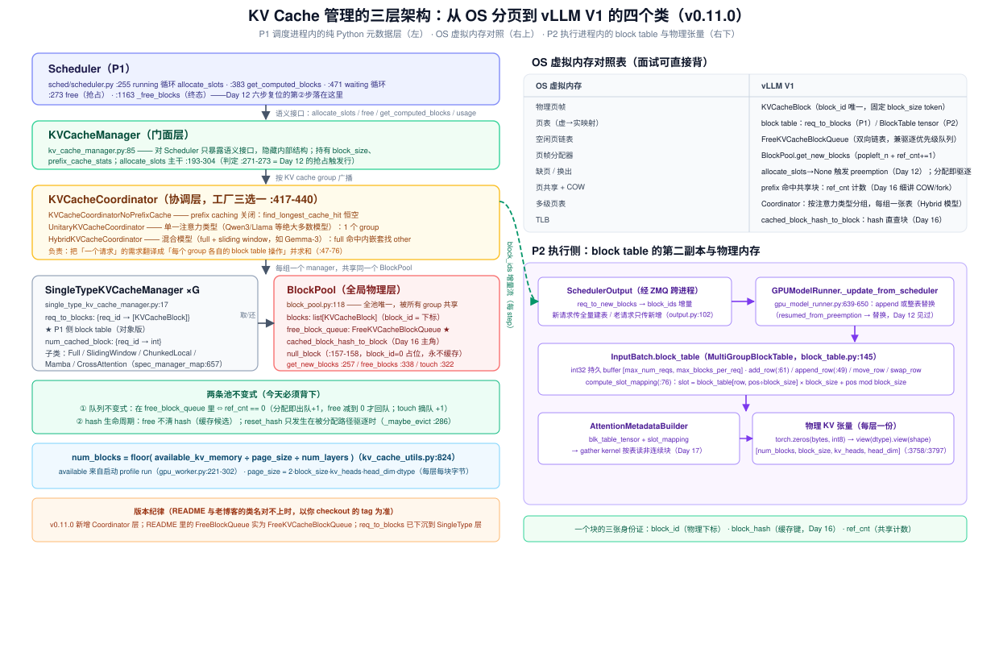
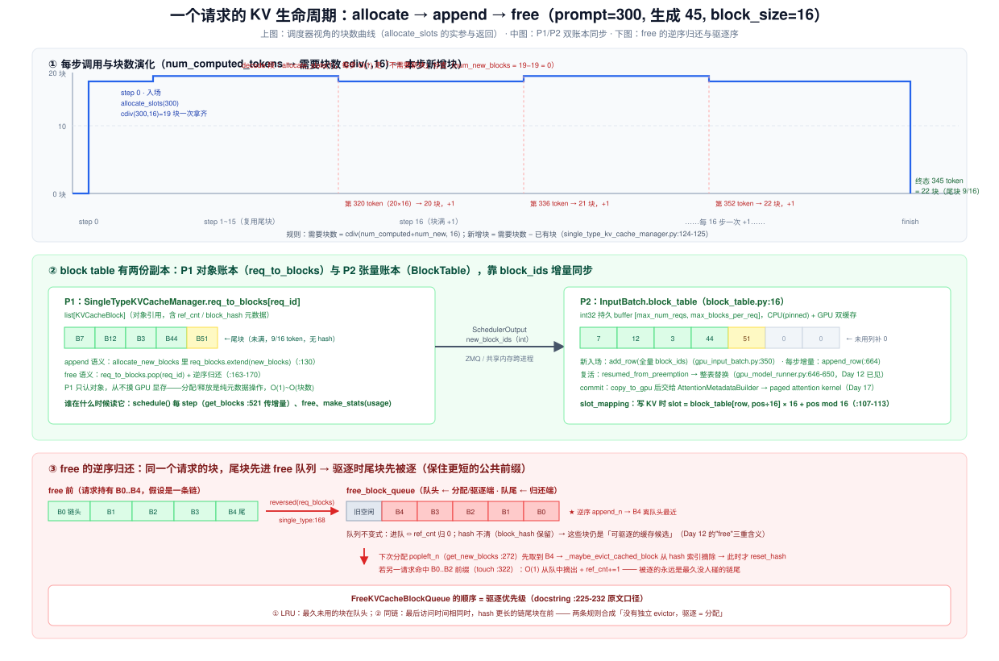
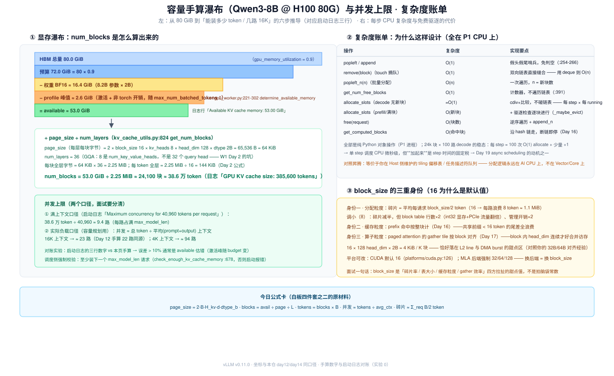

# Day 15 · KV Cache Manager（一）—— block pool 与 free 队列：KV 的物理内存管理

> **系列**：推理系统优化专家岗 · 56 天打卡 | 第 3 周「vLLM V1 源码精读（下）—— KV 管理与执行」
> **今日位置**：第 2 周把调度链路读完了——两队列、budget、chunked prefill、preemption、状态机。但调度器眼里只有 `allocate_slots` 一个黑盒：给它 token 数，它给 block，或者给 `None`。今天打开这个黑盒：**三层数据结构（Manager 门面 → Coordinator 分组 → SingleTypeManager/BlockPool 物理）· KVCacheBlock 与 FreeKVCacheBlockQueue 的两条池不变式 · allocate/append/free 的完整路径 · block table 的两份副本（P1 对象账本与 P2 张量账本）· num_blocks 的容量推导**。Day 12 留下的三处伏笔（"free 的三重含义"、`get_num_free_blocks` 的实现、`free` 时 hash 为什么保留）今天全部兑现；Day 16 的 prefix caching（hash 链、COW、touch）所需的全部地基也今天打好
> **前置要求**：Day 4（PagedAttention 论文：block/table/引用计数的设计动机）、Day 2（KV 每 token 显存公式 `2×layers×kv_heads×head_dim×dtype_bytes`）、Day 9（`Request` 账本组——`block_hashes` 出生即预计算的伏笔）、Day 11（统一调度模型：`num_computed_tokens` 追赶循环、`allocate_slots` 的 chunk 粒度）、Day 12（**最重要**：`allocate_slots → None` 判定、六步复位第②步 `free`、缓存自命中）、Day 14（三视角状态机：身份/时钟/资源三张账——今天是"资源面"的下钻）；Day 10/13 若未单独成文，以 `week2/README.md` §10/§13 为读本
> **预计用时**：3 ~ 3.5 小时（源码走读 1.5h + 实验 1~1.5h + 手算对账与产出物 0.5h）
> **背景衔接**：这套数据结构就是**操作系统虚拟内存分页的 Python 翻版**——`KVCacheBlock` 是页帧、block table 是页表、`FreeKVCacheBlockQueue` 是空闲链表、preemption 是换出、prefix 共享是页共享。你在昇腾上用偏移表管理 L1/L0A/L0B 多级 buffer 是同构问题：**用"小表 + 大池"换分配灵活性**，且分配逻辑永远在 Host（AI CPU）侧、从不在算子上。两个直接可迁移的经验：① free 队列的**逆序归还**是经典的 LRU 实现（链表序 = 驱逐序，无独立 evictor）；② `block_size × head_dim × dtype` 是否构成高效搬运粒度，就是你做 DMA burst 对齐（32B/64B）的同一道题——它同时决定 block table 行宽与 paged attention gather 的合并访存（Day 17 呼应）
> **实验环境**：实验 0/1（手算 + 仿真器）**无 GPU 可完成**；实验 2/3 复用 Day 6 的 1 × H100/A100 + Qwen3-8B（Day 13 压测环境的缩小版）
> **配套材料**：`week3/README.md` Day 15 节；三张 SVG：`assets/day15_three_layer_architecture.svg`（今日主图：三层架构 + OS 对照 + P2 侧）、`assets/day15_request_kv_lifecycle.svg`（allocate→append→free 生命周期 + 双账本 + 逆序归还）、`assets/day15_capacity_handcalc_lru.svg`（容量瀑布 + 复杂度账单 + block_size 三重身份——产出物公式卡的底稿）
> **版本口径**：源码坐标按 **v0.11.0 tag** 逐行核对（2026-10 复核），与 Day 8/9/11/12/14 一致。⚠️ 三处与旧博客/README 速查表不一致，**以 tag 为准**：① v0.11.0 新增 `KVCacheCoordinator` 层（老版本 Manager 直连 BlockPool）；② 队列类名是 `FreeKVCacheBlockQueue`（不是 `FreeBlockQueue`）；③ `req_to_blocks` 已下沉到 `SingleTypeKVCacheManager`（不在 Manager 上）。Scheduler 路径也已是 `v1/core/sched/scheduler.py`。引用前先 `git log --oneline -3` 记版本

---

## 0. 今日学习目标

完成今天的学习后，你应该能够：

- [ ] **画出三层架构图**（闭卷）：`KVCacheManager`（门面）→ `KVCacheCoordinator`（NoPrefixCache / Unitary / Hybrid 三选一，工厂 :417-440）→ `SingleTypeKVCacheManager`（每组一个，持 `req_to_blocks`）→ `BlockPool`（全池唯一），并逐条背出 OS 分页对照表（§2.2，图 1）
- [ ] **背下两条池不变式**：① 在 free 队列 ⇔ `ref_cnt == 0`；② `free` 不清 hash，`reset_hash` 只发生在被分配路径驱逐时（`_maybe_evict_cached_block`）——它们分别是 Day 12 "free 三重含义"和"缓存自命中"的机制来源（§2.4）
- [ ] **逐行走完 `allocate_slots` 九步**（kv_cache_manager.py:193-304）：从 docstring 的 token 区间布局图，到 `get_num_blocks_to_allocate` 的三笔账（需要 − 已有 − 命中 + 可驱逐命中），再到 `:271-273` 的判定行（§2.6）
- [ ] **解释 decode 的 O(1) 路径**：为什么 decode 大多数步 `num_new_blocks = 0` 完全不碰链表，每 16 步才 +1 块；以及 prefill 入场一次拿齐（§2.7，图 2 上）
- [ ] **说清 block table 的两份副本**：P1 的 `req_to_blocks`（`list[KVCacheBlock]` 对象）与 P2 的 `BlockTable`（int32 tensor），谁在什么时机写、`new_block_ids` 增量怎么跨进程同步（新请求全量 add_row / 老请求增量 append_row / 复活整表替换）、`slot_mapping` 怎么算（§2.5，图 2 中）
- [ ] **推导容量公式并手算**：`num_blocks = floor(available ÷ page_size ÷ num_layers)`，Qwen3-8B @ H100 ≈ 24.1k 块 ≈ 38.6 万 token ≈ 16K 上下文 23 路，并与启动日志三行对账（§3.1，图 3 左）
- [ ] **回答 block_size 三重身份**：分配粒度（碎片）/ hash 粒度（命中率）/ gather tile 粒度（算子效率），为什么 CUDA 默认 16、MLA 强制 32~128（§3.3）
- [ ] 交付：**《KV cache 三层数据结构图》笔记**（对照 OS 分页）+ **手算 vs 启动日志对账表** + **README 三个验证点的答案**（§9）

---

## 1. 核心概念速览

| 概念 | 一句话定义 | 今日要达到的深度 |
|---|---|---|
| **`KVCacheManager`** | 请求视角的门面：对 Scheduler 只暴露 `allocate_slots / free / get_computed_blocks / usage`（kv_cache_manager.py:85） | 知道它是**纯元数据层**——不碰 GPU 显存，分配是 Python 对象操作 |
| **`KVCacheCoordinator`** | 把"一个请求"的需求翻译成"每个 KV cache group 各自的 block table 操作"（kv_cache_coordinator.py:15） | 能说出工厂三选一：NoPrefixCache / Unitary / Hybrid（:417-440），及各自适用模型 |
| **KV cache group** | 共享同一张 block table 的一组层（`KVCacheGroupSpec`） | 普通模型 = 1 组全层；混合模型（full+sw）按注意力类型分组、每组层 数相同 |
| **`SingleTypeKVCacheManager`** | 每组一个：持 `req_to_blocks`（P1 侧 block table）与 `num_cached_block`（:17-54） | 知道 `allocate_new_blocks :109` / `free :156` 的增删语义在这里 |
| **`BlockPool`** | 全池唯一物理层：`blocks` 数组 + `free_block_queue` + `cached_block_hash_to_block`（block_pool.py:118） | 背下 `get_new_blocks :257` / `free_blocks :338` / `touch :322` 三个入口 |
| **`KVCacheBlock`** | 一个物理块的元数据：`block_id` / `ref_cnt` / `block_hash` + 双向链表指针（kv_cache_utils.py:169） | 理解"块的身份证有三张"：物理下标 / 缓存键 / 共享计数 |
| **`FreeKVCacheBlockQueue`** | 双向链表空闲队列，**同时就是驱逐优先级队列**（:216） | 背下 docstring 两条排序规则：LRU 在前；同链尾块在前（§2.4） |
| **池不变式 ①** | 在 free 队列 ⇔ `ref_cnt == 0` | 能推出"ref_cnt>0 的块绝不在队里"——README 验证点 1 |
| **池不变式 ②** | `free` 不清 hash；`reset_hash` 只在驱逐时 | 能解释 Day 12 "free 后 hash 保留 → 缓存自命中"的机制层来源 |
| **`null_block`** | `block_id=0` 的占位块，启动时从队头摘走、永不缓存/归还（:157-158） | 知道它给 sliding window 的"滑出块"和 encoder-only 层当占位符；`get_usage` 分母 −1 |
| **block table（P1 版）** | `req_to_blocks: {req_id → list[KVCacheBlock]}`——对象账本 | 知道 schedule() 的 `get_blocks`(:521) 读它产生增量 |
| **block table（P2 版）** | `InputBatch.block_table`：int32 持久 tensor `[max_reqs, max_blocks_per_req]`（block_table.py:16） | 能说出 `add_row / append_row / move_row / swap_row` 四个操作各自对应什么调度事件 |
| **`slot_mapping`** | 逻辑位置 → 物理 slot：`slot = block_table[row, pos÷B]×B + pos mod B`（:107-113） | 这是 attention kernel 写 KV 的地址翻译——Day 17 的入口 |
| **`page_size`** | 每层每块字节数 = `2·B·H_kv·d·dtype`（kv_cache_interface.py:64-66） | 手算 Qwen3-8B = 64 KiB；注意 GQA 用 `num_key_value_heads` |
| **`num_blocks`** | `floor(available ÷ page_size ÷ num_layers)`（kv_cache_utils.py:824） | 能对着启动日志三行验证（实验 0） |
| **profile run** | 启动时用 dummy 输入跑满载 forward，量出激活峰值 → 得 available（gpu_worker.py:221-302） | 理解为什么"扣完权重还要扣峰值"——否则运行到第 N 步 OOM |
| **`num_gpu_blocks_override`** | 强制覆盖 num_blocks 的调试旋钮（config/cache.py:65） | 实验 3 用它把池改小，观察 usage 与驱逐行为 |
| **驱逐 = 分配** | 没有独立 evictor：`get_new_blocks` 取到带 hash 的块时顺手摘索引（:277/:286） | 这是 Day 16 prefix caching"LRU 藏在分配路径里"的伏笔 |

> **一句话本质**：KV cache 管理器 = **一套跑在 P1 CPU 上的纯元数据分页系统**。`BlockPool` 用"块数组 + 双向链表空闲队列 + hash 索引"三件套管理 24k 个物理块的租借，`ref_cnt` 让多个请求可以共享同一物理块（prefix 复用的地基），而**队列的顺序本身就是驱逐优先级**——分配从队头拿（顺手驱逐最老的缓存）、归还从队尾进（逆序进队让同链尾块先被逐）。GPU 侧只有一个按 `[num_blocks, B, H_kv, d]` view 出来的大 int8 buffer，和一个由 `block_ids` 增量驱动的 int32 block table tensor：**逻辑在 P1，物理在 P2，两者靠 SchedulerOutput 对账**。

---

## 2. 原理深入讲解

### 2.1 回顾与今日地图：从调度链路到 KV 管理

第 2 周读的是"一个请求怎么被调度"；第 3 周读"调度出去之后，KV 显存怎么被管理和执行"。衔接点正是 Day 12 打开的那个黑盒：

| Day | 视角 | 已学 / 待学 |
|---|---|---|
| Day 10/11 | 调度：两队列、budget、chunked prefill | ✅ `allocate_slots` 的调用方（running :255 / waiting :471） |
| Day 12 | 失守：preemption 六步复位 | ✅ `allocate_slots → None` 判定、`free` 被调用、**自命中复活**（机制未展开） |
| Day 14 | 复盘：三视角状态机 | ✅ 资源面账本："入场建表、decode 追加、复活整表替换"（今天全部下钻到源码） |
| **Day 15（今天）** | **KV 物理：块池、free 队列、双账本** | ▶ |
| Day 16 | KV 逻辑：prefix caching（hash 链、COW、touch、驱逐实验） | 待（今天的地基：hash 索引、ref_cnt、队列驱逐序） |
| Day 17 | 执行：attention 后端怎么按 block table gather | 待（今天的伏笔：slot_mapping、`[num_blocks,B,H,d]` 张量） |
| Day 18/19 | 执行：CUDA Graph、async scheduling | 待（今天的伏笔：调度 CPU 开销账单） |
| Day 20/21 | mini 引擎：自己写 block 池 + 调度器 | 待（**今天的实验 1 仿真器就是项目 B 的第一块积木**） |

三处 Day 12 的伏笔今天兑现：① "free 的三重含义"→ `get_num_free_blocks` 返回的是**队列长度**，队里既有真空闲也有 ref_cnt=0 的可驱逐缓存块（§2.4）；② 六步复位第②步 `kv_cache_manager.free(preempted_req)` → 今天走到 `block_pool.free_blocks` 的逆序归还（§2.8）；③ "victim 的块 free 后 hash 保留 → 复活自命中" → 池不变式②（§2.4）。

### 2.2 三层数据结构：把 OS 分页搬进 Python（图 1）



先建立总图（图 1 左侧的调用栈自上而下）：

```
Scheduler (P1, sched/scheduler.py)
    │ allocate_slots / free / get_computed_blocks        ← 语义接口
    ▼
KVCacheManager                    (kv_cache_manager.py:85)   门面：校验、统计、转发
    ▼
KVCacheCoordinator                (kv_cache_coordinator.py)  工厂三选一 :417-440
    │  ├─ NoPrefixCache   prefix caching 关闭：find_longest_cache_hit 恒空
    │  ├─ Unitary         单一注意力类型（Qwen3/Llama…）：1 个 group，绝大多数模型
    │  └─ Hybrid          full + sliding window（Gemma-3/GPT-OSS…）：full 命中内嵌套找 other
    ▼ （每组一个，共享同一个 BlockPool）
SingleTypeKVCacheManager ×G       (single_type_kv_cache_manager.py:17)
    │  req_to_blocks: {req_id → list[KVCacheBlock]}   ← P1 侧 block table
    │  子类: Full / SlidingWindow / ChunkedLocal / Mamba / CrossAttention (:657-664)
    ▼
BlockPool                         (block_pool.py:118)        全池唯一物理层
       blocks: list[KVCacheBlock]          （block_id = 数组下标）
       free_block_queue: FreeKVCacheBlockQueue
       cached_block_hash_to_block          （Day 16 主角）
       null_block                          （:157-158）
```

**为什么要有 Coordinator 这一层？** v0.11.0 之前的代码里 KVCacheManager 直连 BlockPool，只能处理"所有层同一种注意力"的模型。混合模型（如 Gemma-3：5 层 sliding window + 1 层 full 循环）的每种注意力需要**独立的 block table**（sw 层只需缓存窗口内的块），于是重构出"按注意力类型分组、每组一个 SingleTypeManager、共享一个物理池"的结构。分组的产物就是 `KVCacheConfig.kv_cache_groups`——它同时决定了 P2 侧有几张 block table tensor（`MultiGroupBlockTable`）。对普通模型（Unitary，1 个 group），这层退化成直通，但面试时能讲出"为什么分层"就是区分度。

与 OS 虚拟内存的逐条对照（图 1 右上表，面试可直接背）：

| OS 虚拟内存 | vLLM V1 | 数据结构 |
|---|---|---|
| 物理页帧 | KV block（固定 `block_size` 个 token） | `KVCacheBlock`（`block_id` 唯一） |
| 页表（虚→实） | block table（token 位置 → block_id） | P1 `req_to_blocks` / P2 `BlockTable` tensor |
| 空闲页链表 | free block 队列 | `FreeKVCacheBlockQueue`（双向链表） |
| 页帧分配器 | block 池 | `BlockPool.get_new_blocks` |
| 缺页 / 换出 | preemption（Day 12）/ 缓存驱逐 | `allocate_slots → None`；驱逐=分配 |
| 页共享 + COW | prefix 共享：`ref_cnt` 计数 | touch +1；fork（Day 16） |
| 多级页表 | 按注意力类型分组，每组一张表 | `KVCacheGroupSpec` |
| TLB | hash 直查块 | `cached_block_hash_to_block`（Day 16） |

### 2.3 物理层：KV cache tensor 长什么样，容量怎么定

P2 侧的物理显存只有一件事：**按 `KVCacheConfig` 分配大 buffer，再按层 view 成模型要的形状**。

```python
# gpu_model_runner.py:3758-3786（节选）
def _allocate_kv_cache_tensors(self, kv_cache_config):
    kv_cache_raw_tensors: dict[str, torch.Tensor] = {}
    for kv_cache_tensor in kv_cache_config.kv_cache_tensors:
        tensor = torch.zeros(kv_cache_tensor.size, dtype=torch.int8,   # ★ 一整块 int8
                             device=self.device)
        for layer_name in kv_cache_tensor.shared_by:      # 多层可共享同一 buffer
            kv_cache_raw_tensors[layer_name] = tensor
    ...

# gpu_model_runner.py:3797-3856（节选）
def _reshape_kv_cache_tensors(...):
    for layer_name in group.layer_names:
        num_blocks = raw_tensor.numel() // kv_cache_spec.page_size_bytes
        kv_cache_shape = attn_backend.get_kv_cache_shape(   # 后端决定形状/布局
            num_blocks, block_size, num_kv_heads, head_size, ...)
        kv_caches[layer_name] = (raw_tensor.view(dtype)
                                  .view(kv_cache_shape)     # ★ int8 → dtype → NDA 形状
                                  .permute(*inv_order))
```

三个要点：

1. **先 int8 后 view**：先按字节整块 `torch.zeros`（一个 `KVCacheTensor` 一次分配，避免碎片），再 `view(dtype).view(shape)` 拆成每层的 `[num_blocks, block_size, num_kv_heads, head_dim]`（K/V 各一或拼一维，具体由 attention 后端的 `get_kv_cache_shape` 决定——Day 17 细讲）。Qwen3-8B（Unitary）是 36 个 `KVCacheTensor`、每层一份 24.1k × 64 KiB ≈ 1.47 GiB。
2. **`num_blocks` 的推导链**（图 3 左的瀑布，§3.1 手算）：启动时 `EngineCore._initialize_kv_caches`（engine/core.py:169-212）→ `determine_available_memory`（gpu_worker.py:221-302，跑一次 `max_num_batched_tokens` 规模的 profile run，量出激活与非 torch 峰值）→ `get_kv_cache_configs`（kv_cache_utils.py:1211）→ **`num_blocks = available ÷ page_size ÷ num_layers`**（:824），多卡取 min（:1286-1289）保证一致。
3. **启动日志就是手算答案**（对账用，实验 0）：
   - `Available KV cache memory: X GiB`（gpu_worker.py:299）
   - `GPU KV cache size: X tokens`（kv_cache_utils.py:1087）= `num_blocks × block_size`
   - `Maximum concurrency for <max_model_len> tokens per request: Yx`（:1091）

### 2.4 元数据层：KVCacheBlock、FreeKVCacheBlockQueue 与两条池不变式

`KVCacheBlock`（kv_cache_utils.py:169-213）比 README 速查表里的版本**瘦**——v0.11.0 已把 `token_ids` 移走（hash 校验不再需要逐块存 token，链式 hash 本身就是内容指纹）：

```python
@dataclass
class KVCacheBlock:
    block_id: int                       # 0 ~ num_blocks-1，= blocks 数组下标
    ref_cnt: int = 0                    # 被多少请求（的 block table）引用
    _block_hash: Optional[BlockHashWithGroupId] = None   # None=私有/未满；非 None=可共享缓存块
    prev_free_block / next_free_block   # 双向链表指针（只归队列管）
    is_null: bool = False               # null_block 标记
```

`FreeKVCacheBlockQueue`（:216-398）是手写双向链表，**不用 `collections.deque` 的原因写在 docstring 里**：需要 O(1) 的"从中间摘除"（touch 命中块出队），deque 的 remove 是 O(n)；且直接操作块的 `prev/next` 指针、不新建包装对象，缩小与 C++ deque 的性能差。工程细节：假头假尾哨兵（`block_id=-1`）让 `popleft/append` 免判空（:254-266）；`popleft_n` 批量分配一次遍历（:301-332）。

队列的排序规则（docstring :225-232，**必背**）：

> 1. The least recent used block is at the front (LRU).
> 2. If two blocks have the same last accessed time (allocated by the same sequence), the one with more hash tokens (the tail of a block chain) is at the front.

由此得到今天的核心——**两条池不变式**：

- **不变式①（队列 ⇔ ref_cnt=0）**：分配 `popleft` 出队 + `ref_cnt += 1`；归还 `free_blocks` 减到 **0 才** `append` 回队；`touch` 把命中的 ref_cnt=0 块从队中摘出 +1。所以 `ref_cnt > 0` 的块**绝不在** free 队列里（README 验证点 1 的答案）。推论：`get_num_free_blocks()`（计数器，O(1)，block_pool.py:385-391）= 真空闲 + 可驱逐缓存块——Day 12 "free 三重含义"的出处。
- **不变式②（hash 活得比租约长）**：`free` 时**不清** `block_hash`、不从 `cached_block_hash_to_block` 摘除——块带着 hash 进 free 队列，仍是"可驱逐的缓存候选"（Day 12 自命中复活、Day 16 cache hit rate 的机制来源）。`reset_hash` 只发生在 `_maybe_evict_cached_block`（:286-320）：**分配**路径取到带 hash 的块时，才从索引摘除并清 hash。一句话：**驱逐不发生在释放时，发生在下一次分配时**——"驱逐 = 分配"。

`null_block`（:157-158）：启动时 `popleft` 摘走 block_id=0，标 `is_null=True`，永不参与分配/缓存。两个用途：① sliding window / chunked local attention 的请求里，"滑出窗口、不再需要"的块位置用 null 占位（`remove_skipped_blocks`，single_type:375-391/486-519——这就是 `allocate_slots` 第一步为什么是它）；② encoder-only 层的 dummy 表。`get_usage`（:393-404）分母 `num_gpu_blocks - 1` 就是在扣它。

### 2.5 逻辑层：block table 的两份副本与 slot_mapping（图 2 中）



"block table"这个词在第 2 周出现过多次，今天把它拆成**两份副本、三个写入时机**：

| | P1 副本（对象账本） | P2 副本（张量账本） |
|---|---|---|
| 数据结构 | `req_to_blocks: {req_id → list[KVCacheBlock]}`（single_type:47-48） | `BlockTable`：int32 `[max_num_reqs, max_blocks_per_req]` + `num_blocks_per_row`（block_table.py:16） |
| 谁写 | `allocate_new_blocks` extend（:130）/ `free` pop（:164） | `add_row`（新入场，gpu_input_batch.py:350）/ `append_row`（增量，gpu_model_runner.py:664）/ 整表替换（复活，:646-650） |
| 谁读 | schedule() 每步 `get_blocks`(:521) 产生增量、`get_num_common_prefix_blocks`、free | AttentionMetadataBuilder → paged attention kernel（Day 17） |
| 存活 | 请求生命周期 | 持久批（InputBatch）生命周期，请求进出做原地 diff |

同步协议（SchedulerOutput，output.py:92-116）：调度器把**新增块的 id** 放进 `req_to_new_blocks`；**新请求传全量**（P2 `add_row` 建行）、**running 请求只传增量**（`append_row`）、**复活请求传全量 + `resumed_from_preemption=True`**（整表替换——Day 12 见过的语义，因为旧块已 free 可能易主）。`CachedRequestData` 的注释原文就是协议本身（:95-96）。

P2 侧最终把"逻辑位置"翻译成"物理 slot"喂给 kernel——`compute_slot_mapping`（block_table.py:76-113）：

```
slot = block_table[row, pos ÷ block_size] × block_size + (pos mod block_size)
      └────────── 块号（查表）───────────┘                └── 块内偏移 ──┘
```

例：pos=35、B=16、该行块表 `[7, 12, 3, …]` → 35÷16=2 → 块号 3 → slot = 3×16+3 = 51。**这就是 paged attention 一切"非连续 gather"的源头**（Day 17 的入口）。

### 2.6 allocate_slots 全路径：九步走读（图 2 上）

先看 docstring 里这张 token 区间布局图（kv_cache_manager.py:221-232，所有 `num_*_blocks` 变量都定义在它上面）：

```
-----------------------------------------------------------------------
| < computed > | < new computed > |    < new >    | < pre-allocated > |
-----------------------------------------------------------------------
|                  < required >                   |        （lookahead）
--------------------------------------------------
|                    < full >                  |
------------------------------------------------
                                  | <new full> |
                                  --------------
```

- `computed`：请求已有的块（上次调用前就分配好）
- `new computed`：本次 prefix 命中将挂上的块（`get_computed_blocks` 查出来的，Day 16）
- `new`：本次要新算的 token（chunk / decode 增量）
- `pre-allocated`：投机解码 lookahead（W4 Day 25 伏笔）

九步主干（`:193-304`）：

```python
def allocate_slots(self, request, num_new_tokens,
                   num_new_computed_tokens=0, new_computed_blocks=None,
                   num_lookahead_tokens=0, ...):
    # ① 滑出窗口的块先释放（FullAttention 是 no-op；sw 才有动作）
    self.coordinator.remove_skipped_blocks(request.request_id,
                                           request.num_computed_tokens)      # :253-254
    # ② 需要槽位的总 token 数（封顶 max_model_len）
    num_computed_tokens = request.num_computed_tokens + num_new_computed_tokens
    num_tokens_need_slot = min(num_computed_tokens + num_new_tokens
                               + num_lookahead_tokens, self.max_model_len)  # :258-262
    # ③ 三笔账：要几块 − 已有 − 命中 + 可驱逐的命中块
    num_blocks_to_allocate = self.coordinator.get_num_blocks_to_allocate(...) # :264-269
    # ④ 判定（Day 12 的触发行）
    if num_blocks_to_allocate > self.block_pool.get_num_free_blocks():
        return None                                                        # :271-273 ★
    # ⑤ 命中块"摸一下"：从 free 队列摘出 + ref_cnt+=1（防被别人驱逐）
    self.block_pool.touch(new_computed_block_list)                          # :276-277
    # ⑥ 命中块挂进 req_to_blocks（只有新请求才 extend，:88-107）
    self.coordinator.save_new_computed_blocks(request.request_id,
                                              new_computed_block_list)      # :285-286
    # ⑦ 真正取块：从队头 pop、顺手驱逐、ref_cnt+=1
    new_blocks = self.coordinator.allocate_new_blocks(
        request.request_id, num_tokens_need_slot, num_encoder_tokens)       # :288-289
    # ⑧ P/D 分离：远端 KV 未到则延迟缓存（W5 伏笔）
    if not self.enable_caching or delay_cache_blocks:
        return KVCacheBlocks(new_blocks)                                    # :293-294
    # ⑨ 满块算 hash 入索引（Day 16 的全部内容）
    num_tokens_to_cache = min(num_computed_tokens + num_new_tokens,
                              request.num_tokens)
    self.coordinator.cache_blocks(request, num_tokens_to_cache)             # :300-302
    return KVCacheBlocks(new_blocks)
```

第③步的"三笔账"在 `SingleTypeKVCacheManager.get_num_blocks_to_allocate`（single_type:59-86）：

```python
num_required_blocks = cdiv(num_tokens, self.block_size)              # 总需求
num_new_blocks = (num_required_blocks - len(new_computed_blocks)     # − 新命中
                  - len(self.req_to_blocks[request_id]))             # − 已有
num_evictable_computed_blocks = sum(                                # + 命中但还在队里的
    blk.ref_cnt == 0 and not blk.is_null for blk in new_computed_blocks)
return num_new_blocks + num_evictable_computed_blocks
```

为什么**可驱逐的命中块也要计入需求**：它现在 ref_cnt=0、还躺在 free 队列里。本次分配会把它"借"给这个请求（touch 出队 +1），池子必须先确认这份"借出"不会超支——这就是判定式能严格成立的原因。注意 `len(self.req_to_blocks[request_id])` 是 `defaultdict`，新请求自动是 `[]`，所以同一段代码同时服务 waiting（入场）和 running（追加）两个调用点（scheduler.py:471 / :255）。

**与 Day 12 的对账**：`:271-273` 这三行就是 Day 12 背过的判定式（当时引用号 :260-273 是含②③步的整段），语义完全一致——"需要的块数 > 真空闲 + 可驱逐缓存"才失败，**没有 watermark**。

### 2.7 append：decode 每步的 O(1) 路径（图 2 上）

running 循环每步对每个请求调 `allocate_slots(request, num_new_tokens=1)`。走进第③步：

```
num_required = cdiv(num_computed + 1, 16)     # 大多数步不变
num_new      = num_required − len(req_blocks)  # = 0
```

`allocate_new_blocks`（single_type:109-131）看到 `num_new_blocks <= 0` 直接 `return []`——**不碰链表、不碰字典**，纯算术。只有当 token 数跨过 16 的整数倍边界（第 16/32/48…个新 token），才 +1 块：从队头 `popleft_n(1)`、驱逐检查、`ref_cnt += 1`、`req_blocks.extend`。这就是图 2 上部的台阶曲线：**入场一次拿齐 `cdiv(prompt,16)` 块 → 之后每 16 步 +1 块**。

把这笔账放到时间维度（Day 11 的统一调度模型）：调度器每 step 的 KV 开销 ≈ `O(running 数)` 次 O(1) 判定 + 少量 +1 块操作。100 路 decode 稳态下每 step 只有 ~6 次 `+1`（100/16）——这是 P1 单核 Python 能撑住的关键设计（复杂度账单见 §3.2，Day 19 async scheduling 的伏笔）。

prefill 入场则是"一次拿齐"：`allocate_slots(request, num_new_tokens=chunk)`，`cdiv(300,16)=19` 块一次 `popleft_n(19)`。注意 chunked prefill（Day 11）让这里也是 chunk 粒度：第一个 chunk 拿 `cdiv(2048,16)=128` 块，不是 `cdiv(16K,16)=1024` 块——**admission 的 KV 门槛与 budget 门槛同粒度**，两道闸（Day 10）在资源面完全对齐。

### 2.8 free：逆序归还的驱逐语义（图 2 下）

请求终态（`_free_blocks`，scheduler.py:1161-1164）或被抢占（Day 12 六步复位第②步）时：

```python
# SingleTypeKVCacheManager.free（single_type:156-171）
req_blocks = self.req_to_blocks.pop(request_id, [])   # 默认 []：aborted 早于 alloc 也安全
ordered_blocks = reversed(req_blocks)                 # ★ 逆序：尾块在前
self.block_pool.free_blocks(ordered_blocks)

# BlockPool.free_blocks（block_pool.py:338-353）
blocks_list = list(ordered_blocks)
for block in blocks_list:
    block.ref_cnt -= 1                                # 共享块可能减不到 0
self.free_block_queue.append_n([
    block for block in blocks_list
    if block.ref_cnt == 0 and not block.is_null])     # 只有归 0 才回队
```

三个层次的理解：

1. **为什么逆序**：`append_n` 把列表按序接到队尾。逆序传入 ⇒ **尾块（链上 hash 最长的最后一块）离队头最近** ⇒ 下次分配从队头拿块时**先驱逐尾块**。驱逐一条 prefix 链时从尾往头砍，剩下的部分仍是合法前缀链——保住了更短但更可能被共享的前缀。这就是 docstring 排序规则②的实现（规则① LRU 靠"释放时间 = 追加时间"天然成立）。
2. **hash 不清**（不变式②）：块带着 hash 回队，仍是缓存候选。所以 Day 12 的 victim 能在复活时自命中——它的块大概率还在队里没被逐。
3. **ref_cnt 是共享计数**：两个请求命中同一前缀块时该块 ref_cnt=2，一个请求结束减到 1，块**不回队**、继续服务另一个请求——prefix 共享的物理实现就是这一个整数（Day 16 COW 的前置知识）。

**README 验证点 2 的完整答案**：preemption 时（recompute 模式）victim 的块被 `free`——`ref_cnt` 减 1（独占块归 0 回队）、**hash 全部保留**、`req_to_blocks` 删行。数据没有被删除，只是"租约解除、变成可驱逐缓存"；配合 `num_computed_tokens=0` 的重算账本，复活时 `get_computed_blocks` 大概率把这些块原样租回来——**recompute 的实际代价 ≈ 尾部 1 个块**（Day 12 §2.4 的结论今天闭环）。

### 2.9 Coordinator 三态与 group：为 Day 16/17 铺垫

工厂 `get_kv_cache_coordinator`（kv_cache_coordinator.py:417-440）的三种选择，以及它们对今天内容的影响：

| Coordinator | 何时用 | `find_longest_cache_hit` | 对 block table 的影响 |
|---|---|---|---|
| `NoPrefixCache` | `--no-enable-prefix-caching` | 恒返回空（:216-223） | touch/驱逐路径关闭；块 hash 恒 None |
| `Unitary` | 1 个 group（绝大多数模型） | 委托给唯一 manager | P2 一张 `BlockTable` |
| `Hybrid` | full + sw / chunked-local 混合 | 先找 full 命中，**在命中长度内**再找 other（:352-414） | 每组一张表（`MultiGroupBlockTable`）；sw 的滑出块靠 `remove_skipped_blocks` 释放 |

分组规则（`_get_kv_cache_groups_uniform_page_size`，kv_cache_utils.py:894-1001）有个值得读注释的约束：**每组的层数必须相同**（保证物理块大小一致，避免跨组碎片），混合模型按 `n:1` 模式切组、必要时加 padding 层（浪费 &lt; 数 %，有 warning 日志）。这是"数据结构服务于物理布局"的又一个例子。

---

## 3. 性能模型与复杂度：今日的数学

### 3.1 容量手算：Qwen3-8B @ H100 80G（图 3 左，实验 0 的底稿）



沿用 Day 2/6/12 的台账（Qwen3-8B：36 层、GQA 8 KV head、head_dim=128、BF16 权重、BF16 KV、`block_size=16`、`--gpu-memory-utilization 0.9`）：

| 步骤 | 计算 | 结果 |
|---|---|---|
| HBM 预算 | 80 GiB × 0.9 | 72.0 GiB |
| − 权重 | 8.2B 参数 × 2 B | −16.4 GiB |
| − profile 峰值 | 激活 + 非 torch（随 `max_num_batched_tokens`↑，H100 serve 默认 8192） | −≈2.6 GiB |
| = available | （日志第 1 行） | **≈53.0 GiB** |
| page_size（每层每块） | 2 × 16 × 8 × 128 × 2 B | 65,536 B = 64 KiB |
| 每块全层 | 64 KiB × 36 层 | 2.25 MiB |
| 每 token 全层 | 2.25 MiB ÷ 16（= Day 2 公式 2×36×8×128×2B） | 144 KiB |
| **num_blocks** | 53.0 GiB ÷ 2.25 MiB | **≈24,100 块** |
| **token 容量** | ×16（日志第 2 行） | **≈38.6 万 token** |
| 并发（满 40,960 ctx） | 38.6万 ÷ 40,960（日志第 3 行） | ≈9.4 路 |
| 并发（16K ctx） | 38.6万 ÷ 16,384 | **≈23 路**（Day 12 的 22 路同源，差异来自 available 估计 52~55 GiB） |
| 并发（4K ctx） | 38.6万 ÷ 4,096 | ≈94 路 |

常见算错点（Day 2 的坑在容量题里重演）：① GQA 用了 32 个 query head（应 8 个 KV head，结果大 4 倍）；② 忘乘 K+V 的 2；③ 忘除层数或 block_size 混淆 page_size 与"每块全层字节"；④ 拿总显存当 available（忘了 profile 峰值——budget 调大会让 available 变小，这是"用 KV 容量换单步时延"的隐藏代价）。

**碎片的下界**（PagedAttention 的卖点，Day 4 的定量版）：每请求最后一个块平均半满，浪费 ≈ `Σ_req B/2` token。23 路 × 8 token × 144 KiB ≈ 26 MiB，相对 53 GiB 是 **0.05%**——对比连续分配的 60-80% 浪费，这就是"分页"二字的全部意义（内部碎片 vs 外部碎片的故事）。

### 3.2 复杂度账单：P1 CPU 上的每 step 固定税（图 3 右上）

| 操作 | 复杂度 | 位置 | 每 step 发生次数（稳态） |
|---|---|---|---|
| `popleft / append` | O(1) | queue:268/354 | 分配/归还各一次起 |
| `remove`（touch 摘队） | **O(1)** | queue:334 | 每个命中块一次（Day 16） |
| `popleft_n(n)` | O(n) | queue:301 | prefill chunk / 满 16 倍数时 |
| `get_num_free_blocks` | O(1) 计数器 | block_pool:385 | 每 allocate_slots 调用 |
| decode 的 `allocate_slots` | ≈O(1) | manager:193 | **每 running 每 step** |
| `free(request)` | O(请求块数) | single_type:156 | 终态/抢占时 |
| `get_computed_blocks` | O(命中块) | manager:154 | 每 waiting 入场（Day 16） |

两个结论：① **稳态 decode step 的 KV 管理是 O(running) 次 O(1)**——24k 块池、100 路，每 step ≈ 100 次字典查找 + 算术，几十微秒级；② 但这是**串行在 `schedule()` 里的纯 Python 税**，`running` 越大税越重，且和 forward 的 GPU 时间不能重叠（默认模式）——Day 19 async scheduling（把 schedule 与 execute 流水起来）的动机清单里就有这笔账。今天先记住量级，nsys 的证据 Day 19 再采。

**对照昇腾**：这套"Host 侧元数据 + Device 侧大 buffer"的分工，和你在 NPU 上用任务描述符/偏移表管理 L1、L0A、L0B 的做法同构——**分配逻辑永远在 AI CPU 上，从不在 Vector/Matrix 核上**；区别是 NPU 的表通常静态（编译期 tiling），vLLM 的表动态（每 step 增量），所以才有"O(1) 摘队""append-only 行"这类为高频更新设计的细节。

### 3.3 block_size 的三重身份：16 为什么是默认值（图 3 右下）

`block_size` 同时是三样东西的单位，四方拉扯出一个甜点值：

1. **分配粒度（碎片率）**：内部碎片 ≈ 每请求 B/2 token。B=16 → 每路浪费 8 token ≈ 1.1 MiB；B=8 碎片减半，但 block table 行宽×2（int32 显存 + PCIe 增量流量×2）、链表操作次数×2。
2. **缓存粒度（命中率）**：prefix 命中按整块计（Day 16）——两个请求共享 1000 token 前缀，命中 62 块 + 尾差 8 token 全浪费；B 越小命中率越高，但 hash 计算与索引条目×2。
3. **算子粒度（gather 效率）**：paged attention 的 gather 以 block 为 tile 单位（Day 17）。块内 `head_dim` 连续才好合并访存：16 token × 128 × 2B = 4 KiB/K 块，恰在 L2 line 与 DMA burst 的甜点区（对照你的 32B/64B 对齐经验——**跨平台同一道题**）。

平台覆盖逻辑（platforms/cuda.py:126-175）：CUDA 默认 16；某些 MLA/cutlass/sparse 路径强制 64/128——**换后端 = 换 block_size**，这也是 Day 17"后端决定 `get_kv_cache_shape`"的先声。面试一句话：*block_size 不是拍脑袋常数，是碎片率、表大小、缓存粒度、gather 效率的四方折中，平台/后端可以也应该各自选。*

### 3.4 练手对账题（答案见 §8）

1. 同机部署 Qwen3-8B，把 `max_num_batched_tokens` 从 8192 调到 32768，`num_blocks` 变大还是变小？大约变多少？（提示：profile 峰值里激活项 ~ 线性于 budget）
2. Llama-3-70B（80 层、8 KV head、head_dim=128、BF16、TP=1）在 H100 80G 上还剩多少 KV 容量？这份手算为什么直接告诉你"必须上 TP"（W5 Day 32 伏笔）？
3. 一个 300-token prompt、生成 45 token 的请求一共租过几个块？其中几个是"满块"？（对照图 2 上）

---

## 4. 关键代码走读（v0.11.0 逐行核对版）

> 建议按 §2.1 的地图跳读：`kv_cache_utils.py` 的两个类 → `block_pool.py` 三个入口 → `single_type_kv_cache_manager.py` 增删 → `kv_cache_manager.py` 主干 → `block_table.py`（P2）。每个文件先看 class 与方法签名、猜职责，再挑实现验证。

### 4.1 `kv_cache_manager.py`：门面与 KVCacheBlocks

`KVCacheBlocks`（:18-82）是 v0.11.0 新引入的**调度器侧接口类型**：`blocks: tuple[list[KVCacheBlock], ...]`（外层 = group，内层 = 块序列），向 Scheduler 隐藏 Coordinator 的存在。四个方法值得记：`get_block_ids`（全空的组可返回 None，`allow_none=True`）、`get_unhashed_block_ids`（尾块，P/D 传输用）、`new_empty`、`__add__`（两组拼接——"computed + new" 的语法糖）。

`KVCacheManager` 其余方法都是一行转发（`free` → `coordinator.free`，:314；`usage` → `block_pool.get_usage`，:140）。**门面模式的意义**：Scheduler（sched/scheduler.py:168-177 构造它）从不需要知道模型有几个 attention group。

### 4.2 `block_pool.py`：三个入口与驱逐

```python
def get_new_blocks(self, num_blocks: int) -> list[KVCacheBlock]:   # :257-284
    if num_blocks > self.get_num_free_blocks():
        raise ValueError(...)          # 防御：不该到这（manager 已判过），到这说明状态损坏
    ret = self.free_block_queue.popleft_n(num_blocks)               # :272 队头批量取
    if self.enable_caching:
        for block in ret:
            self._maybe_evict_cached_block(block)                   # :277 ★ 驱逐=分配
            assert block.ref_cnt == 0
            block.ref_cnt += 1
    ...

def _maybe_evict_cached_block(self, block) -> bool:                 # :286-320
    block_hash = block.block_hash
    if block_hash is None:            return False                  # 私有块，无需驱逐
    if self.cached_block_hash_to_block.pop(block_hash, block.block_id) is None:
        return False                                                  # 已不在索引（别人逐过）
    block.reset_hash()                                                # ★ 唯一的 reset_hash 现场
    ...

def touch(self, blocks) -> None:                                     # :322-336
    for blocks_per_group in blocks:
        for block in blocks_per_group:
            if block.ref_cnt == 0 and not block.is_null:
                self.free_block_queue.remove(block)                   # O(1) 摘队
            block.ref_cnt += 1
```

读码自问（答案都在注释里）：① `get_new_blocks` 里的 `raise` 什么时候触发？——manager 判定与取块之间状态被改坏的 bug 场景，正常运行不可达，是断言性防御。② `pop(key, block_id)` 为什么带 block_id？——同 hash 可能有多块（`BlockHashToBlockMap` 的 union 结构：单块 or `{block_id: block}`，:21-115，不去重是为了 block table append-only）。

### 4.3 `FreeKVCacheBlockQueue`：链表操作三件套

`popleft`（:268-299）/ `popleft_n`（:301-332）/ `remove`（:334-352）/ `append` / `append_n`（:354-398）。重点验证两个细节：① 假头假尾（`block_id=-1`）如何消灭边界分支——`popleft` 里对 `next is fake_tail` 的判断就是"队空"唯一出口；② `remove` 只做三次指针缝合 + `num_free_blocks -= 1`，没有任何搜索——**O(1) 的前提是调用方手里有块对象**（Python 引用即指针），这是"元数据跟对象走"设计的回报。

### 4.4 `single_type_kv_cache_manager.py`：请求粒度的增删

`allocate_new_blocks`（:109-131）的 `num_required − len(req_blocks)` 是**增量语义**的关键：传入的 `num_tokens` 是"总需求"（含已分配），差值才是新增；`req_blocks.extend(new_blocks)` 保证 block table **只追加不改写**（P2 `append_row` 才能放心接）。`free`（:156-171）的 `pop(request_id, [])` 默认空列表——abort 可能发生在 alloc 之前（Day 14 终态区的边界 case）。`cache_blocks`（:133-154）只把"满块"交给 `cache_full_blocks` 入索引（`num_tokens // block_size` 向下取整）——**未满块不入缓存**（内容还会变，Day 16 的第一句话）。

### 4.5 P2 侧：`block_table.py` 与增量的落地

```python
def append_row(self, block_ids, row_idx):        # :49-59 追加到行尾
    num_blocks = len(block_ids)
    start = self.num_blocks_per_row[row_idx]
    self.num_blocks_per_row[row_idx] += num_blocks
    self.block_table.np[row_idx, start:start + num_blocks] = block_ids

def add_row(self, block_ids, row_idx):           # :61-63 新行 = 清零 + 追加
    self.num_blocks_per_row[row_idx] = 0
    self.append_row(block_ids, row_idx)
```

`BlockTable` 内部是 `CpuGpuBuffer`（pinned CPU numpy + GPU tensor 双份），`commit_block_table / commit_slot_mapping` 时 `copy_to_gpu`。`MultiGroupBlockTable`（:145-209）按 group 持多张表，把 P1 的 `tuple[list[int], ...]` 逐组落行。消费端在 `_update_attention_metadata`（gpu_model_runner.py:1153-1180）：`blk_table.get_device_tensor(num_reqs)` + `slot_mapping.gpu[:total_num_scheduled_tokens]` 直接喂给后端——**没有第二次翻译**，调度器的 block_ids 一步到位变成 kernel 的地址参数。

### 4.6 调用链速查表（今日总账）

| 时机（P1） | 调用链 | P2 对应动作 |
|---|---|---|
| 启动 | core.py:92 → `_initialize_kv_caches`(:169) → gpu_worker `determine_available_memory`(:221) → `get_kv_cache_configs`(utils:1211) → `initialize_from_config` | `_allocate_kv_cache_tensors` + `_reshape_kv_cache_tensors`；`BlockPool(num_blocks)` 也在 `Coordinator.__init__` 期间建好 |
| waiting 入场 | scheduler.py:383 `get_computed_blocks` → manager:154 → coordinator `find_longest_cache_hit` | — |
| waiting 入场 | scheduler.py:471 `allocate_slots` → §2.6 九步 → `popleft_n` | `add_row(全量)`（gpu_input_batch.py:350） |
| running 每步 | scheduler.py:255 `allocate_slots(≈O(1))` | `append_row(增量)`（gpu_model_runner.py:664） |
| 复活 | 同 waiting 路径 + `resumed_from_preemption` | 整表替换（:646-650） |
| 终态/抢占 | scheduler.py:1163/:273 `free` → 逆序 `free_blocks` | 持久批摘除行（`free_request_state`） |
| 每 step 收尾 | `make_stats`（scheduler.py:1187）取 `usage` / prefix stats | — |

---

## 5. 动手实验（约 60~90 分钟）

### 实验 0（必做，15 min；无 GPU 可用 Day 6 日志）：容量手算 vs 启动日志对账

1. 填 §3.1 表（你的机器/模型）；有 GPU 则起服务抓启动日志三行：
   ```bash
   vllm serve Qwen/Qwen3-8B --gpu-memory-utilization 0.9 \
       2>&1 | tee day15_startup.log
   grep -E "Available KV cache memory|GPU KV cache size|Maximum concurrency" day15_startup.log
   ```
2. 对账三项：available（误差应 &lt; 5%，你的"profile 峰值"估计可反推）、tokens（应精确等于 num_blocks×16）、满长并发。
3. 变量法（可选，各 2 min）：`--max-num-batched-tokens 32768`、`--gpu-memory-utilization 0.85` 各重启一次，看 num_blocks 怎么动——验证 §3.4 题 1 的预测。

### 实验 1（必做，30 min；无 GPU）：mini BlockPool 仿真器——逆序归还与 LRU 驱逐序

目标：用 ~80 行纯 Python 复刻 `BlockPool + FreeKVCacheBlockQueue` 的核心语义，**亲眼验证两条池不变式与驱逐序**（这也是 Day 20 mini 引擎块池的第一块积木）：

```python
# day15_sim.py —— 语义对齐 v0.11.0：popleft_n / touch / 逆序 free / 驱逐=分配
class Block:
    def __init__(self, bid): self.id, self.ref, self.hash = bid, 0, None

class Pool:
    def __init__(self, n):
        self.blocks = [Block(i) for i in range(n)]
        self.free = list(self.blocks)                    # 队头在前（真实实现是双向链表）
    def num_free(self): return len(self.free)
    def alloc(self, k):                                  # get_new_blocks :257
        assert k <= self.num_free()
        ret, self.free = self.free[:k], self.free[k:]    # popleft_n
        for b in ret:
            if b.hash is not None: b.hash = None         # _maybe_evict（驱逐=分配）
            b.ref += 1
        return ret
    def touch(self, bs):                                 # touch :322
        for b in bs:
            if b.ref == 0 and b in self.free: self.free.remove(b)
            b.ref += 1
    def free_req(self, bs):                              # free_blocks :338（逆序由调用方保证）
        for b in bs: b.ref -= 1
        self.free += [b for b in bs if b.ref == 0]

pool = Pool(10)
A = pool.alloc(5); [setattr(b, "hash", f"h{i}") for i, b in enumerate(A)]  # A 占 B0-B4 并缓存
B = pool.alloc(3)                                                          # B 占 B5-B7
print("free 队:", [b.id for b in pool.free])                # [8, 9]
pool.free_req(list(reversed(A)))                            # ★ A 结束：B4 先进队
print("A free 后:", [b.id for b in pool.free])              # [8, 9, 4, 3, 2, 1, 0] ← 尾块在前
print("不变式①:", all(b.ref == 0 for b in pool.free))       # True
print("hash 仍保留:", [b.hash for b in pool.free[-5:]])     # 驱逐前 hash 不清
C = pool.alloc(6)                                          # 分配顺手驱逐 B4、B3、B2、B1
print("C 拿到:", [b.id for b in C], " B4/B3 的 hash 被清:",
      [b.hash for b in pool.blocks if b.id in (4, 3)])      # [None, None] ← reset_hash 现场
pool.free_req(list(reversed(B)))                           # B 也结束 → free=[0, 7, 6, 5]
D_hit = [pool.blocks[0]]                                  # 模拟另一请求命中 A 的链头块
pool.touch(D_hit)                                         # 命中块出队 + ref_cnt+=1
print("touch 后 free:", [b.id for b in pool.free],
      " D_hit 的 ref:", [b.ref for b in D_hit])            # [7, 6, 5] / [1] ← B0 出队入账
```

跑完后回答三个问题（写进笔记）：① 驱逐顺序为什么是 B4→B3→…（而不是 B0 先）？对 prefix 链意味着什么？② 如果 `free_req` 不逆序，第二个复用 A 前缀的请求会发生什么？（提示：命中块被逐）③ `touch` 在真实代码里发生在 `allocate_slots` 第⑤步、`popleft_n` 之前——顺序反了会怎样？

### 实验 2（GPU，可选，20 min）：monkey-patch 看 allocate_slots 实参

不打断点、不改源码——在进程内给 `allocate_slots` 套一层探针（测完即弃，不改仓库代码）：

```python
# day15_probe.py
from vllm import LLM, SamplingParams
from vllm.v1.core.kv_cache_manager import KVCacheManager

_orig = KVCacheManager.allocate_slots
def traced(self, request, num_new_tokens, *a, **kw):
    ret = _orig(self, request, num_new_tokens, *a, **kw)
    print(f"[alloc] {request.request_id[:8]} new={num_new_tokens:>5} "
          f"computed={request.num_computed_tokens:>5} -> "
          f"{'None' if ret is None else sum(len(g) for g in ret.blocks)} blk")
    return ret
KVCacheManager.allocate_slots = traced

llm = LLM(model="Qwen/Qwen3-8B", gpu_memory_utilization=0.9)
llm.generate(["今天天气" * 100], SamplingParams(max_tokens=48))
```

观察点：① 入场一次大 `new=`（prompt 全长，本例 tokenizer 后约 300+）一次拿到 `cdiv(·,16)` 块；② 之后每步 `new=1` 且新增 0 块（O(1) 路径）；③ 每逢 16 的倍数（第 336/352…个 token）新增 1 块——与图 2 上的台阶曲线逐点对上。

### 实验 3（GPU，可选，20 min）：强制小池，看 usage 与驱逐

注意启动校验：`check_enough_kv_cache_memory`（kv_cache_utils.py:678）要求池至少装下一个 `max_model_len` 的请求，所以 override 小池必须同时调小 `--max-model-len`：

```bash
vllm serve Qwen/Qwen3-8B --gpu-memory-utilization 0.9 \
    --num-gpu-blocks-override 600 --max-model-len 8192 &   # ≈ 9,600 token 容量
# 压测：4 路 4K 上下文长输出（每路满长需 256 块，4 路 = 1024 块 > 600）：
#   vllm bench serve ... 观察 /metrics：
#   vllm:gpu_cache_usage_perc 逼近 1.0 → preemption 计数上涨（Day 12 现象在 Day 15 的池上复现）
#   vllm:prefix_cache_queries/hits —— free 后 hash 保留带来的"自命中"（Day 16 的预演）
```

对照源码解释你看到的每条曲线：usage = `1 − num_free/(num_blocks−1)`（block_pool.py:393-404）；hit rate 上涨的证据正是池不变式②。

### 常见坑（方法论清单）

- **把 `get_num_free_blocks` 当"没人用过的块"**——Day 12 踩过、今天必须根治：它是**队列长度**，含可驱逐缓存块；真耗尽的信号是 usage≈1.0 **且** hit rate 同步崩。
- **以为 free 会清数据/hash**——都不清：GPU 上的 KV 字节原样躺着，hash 也在索引里；被逐的判定只发生在下一次分配。
- **把 block table 当一份数据**——P1/P2 两份、三种同步时机（add/append/replace），画图时永远画两栏。
- **手算容量忘扣 profile 峰值**，或 budget 调大后忘了重新对账（available 变小）。
- **老博客类名对不上**（FreeBlockQueue / Manager 直连 Pool / scheduler.py 路径）——先 `git log --oneline -3` 记版本，本文坐标 v0.11.0。

---

## 6. 面试高频问题（含答题骨架）

**Q1：vLLM 的 KV cache 管理和操作系统什么机制同构？逐条说。**
骨架：分页虚拟内存 → 六条对照（页帧/页表/空闲链表/分配器/缺页换出/页共享+COW，§2.2 表）；落点在"分页解决的是 Day 4 说的 60-80% 外部碎片，代价是 B/2 token 的内部碎片 + 一次间接寻址"；加分项：说出"多级页表 ↔ KV cache group""TLB ↔ hash 索引"两条引申。

**Q2：一个请求的 KV 生命周期中，块的租借模式是什么？**
骨架：入场一次拿齐 `cdiv(prompt,B)` → decode 每步 O(1) 判定、每 B 步 +1 块（`num_required − len(req_blocks)` 的增量语义）→ 终态/抢占逆序归还、ref_cnt 归 0 回队尾、hash 保留 →（复活时大概率原样租回）。落点：台阶曲线（图 2 上）+ "为什么 decode 稳态是 O(1)：差值为零直接 return []"。

**Q3：`allocate_slots` 什么时候失败？精确条件是什么？**
骨架：`num_blocks_to_allocate > get_num_free_blocks()`（:271-273）；三笔账展开（需要 − 已有 − 命中 + **可驱逐命中**）；"free = 真空闲 + ref_cnt=0 缓存"（不变式①）；上游反应是 preemption 六步复位（Day 12）。加分项：解释为什么可驱逐命中块要计入需求（touch 会把它借走）。

**Q4：为什么请求结束归还块要逆序？这个顺序决定了什么？**
骨架：`append_n` 按序接队尾 → 逆序让**链尾块离队头最近** → 分配从队头取 = 驱逐先砍链尾 → 剩余部分仍是合法前缀。落点：队列序 = 驱逐优先级（LRU + 同链尾块优先），"没有独立 evictor，驱逐 = 分配"。

**Q5：free 队列为什么手写双向链表而不用 deque？**
骨架：需要 O(1) 中间摘除（touch 命中块出队），deque.remove 是 O(n)；指针直接存在块对象上，零包装对象分配（docstring :216-223 原文口径）；假头假尾哨兵免判空。落点：调用方持有对象引用 = O(1) 的前提，"元数据跟对象走"的设计回报。

**Q6：block table 在系统里有几份？怎么保持一致？**
骨架：P1 对象版（`req_to_blocks`，分配/释放时写）与 P2 张量版（int32 持久 buffer，`add_row` 全量 / `append_row` 增量 / 复活整表替换）；同步介质是 SchedulerOutput 的 `new_block_ids`；P2 再由 `compute_slot_mapping` 翻译成 kernel 地址。加分项：为什么复活必须整表替换（旧块已 free 可能易主）。

**Q7：`num_gpu_blocks` 怎么来的？启动时做了什么？**
骨架：profile run（满 budget 的 dummy forward）量激活+非 torch 峰值 → available = 预算 − 权重 − 峰值 → `num_blocks = available ÷ page_size ÷ layers` → 多卡取 min；两条日志对账；`num_gpu_blocks_override` 可强改。落点：**为什么要 profile**——KV 池是"剩下多少给多少"，不预扣运行时峰值就会在第 N 步 OOM。

**Q8：block_size 调大/调小各影响什么？为什么默认 16？**
骨架：三重身份（分配碎片 / 缓存粒度 / gather tile）× 表大小与开销；16×128×2B=4KiB 的访存甜点；后端可强制改（MLA 32~128）。落点：这是四方折中而非常数，"换后端 = 换 block_size"。

**Q9（追问 Day 12）：被抢占请求的 KV 数据是被删掉了吗？**
骨架：没有——`free` 只解租约（ref_cnt−1）不清 GPU 字节、不清 hash；块成为"可驱逐缓存候选"排在 free 队列里；复活时 `get_computed_blocks` 大概率原样租回，recompute 实际只算尾部 ~1 块。这条链从 Day 12 的现象描述升级为今天的机制解释。

---

## 7. 今日总结

- KV cache 管理是**三件套分页系统**：块数组（物理）+ 双向链表空闲队列（可分配序 = 驱逐序）+ hash 索引（缓存键，Day 16）；`ref_cnt` 让"块"可以安全地被多个请求共享。
- **两条池不变式**贯穿一切行为：在队 ⇔ ref_cnt=0（free 的三重含义）；hash 活得比租约长（自命中复活、Day 16 prefix caching 的地基）。驱逐不在释放时、在下一次分配时——**驱逐 = 分配**。
- `allocate_slots` 是九步事务：滑出释放 → 三笔账 → 判定 → touch → 挂命中 → 取新块 → 延迟缓存 → 满块入索引；decode 稳态走 O(1) 空路径，每 B 步 +1 块——P1 的 Python 税因此可控（Day 19 伏笔）。
- block table 有**两份副本**：P1 对象账本与 P2 张量账本，靠 `new_block_ids` 增量同步（add/append/replace 三种时机），P2 再翻译成 `slot_mapping` 喂 kernel（Day 17 入口）。
- 容量一句话：`num_blocks = available ÷ (2·B·H_kv·d·dtype) ÷ L`；Qwen3-8B @ H100 ≈ 24.1k 块 ≈ 38.6 万 token ≈ 16K 上下文 23 路——**手算、日志、指标三角对账**是容量题的完整答案。

## 8. 今日自测题（先做，再展开答案）

**T1**：ref_cnt=3 的块会在 free 队列里吗？它被多少个请求引用？它会被驱逐吗？
> 答：不在（不变式①）。被 3 个请求的 block table 引用（通常 = 1 个原始 + 2 个 prefix 命中）。不会被驱逐——驱逐只发生在分配路径取到队内块时，而它根本不在队里。三个请求全部结束后才可能回队成为候选。

**T2**：§3.4 题 1：budget 8192→32768，num_blocks 怎么变？
> 答：变小。available = 72 − 16.4 − profile 峰值；激活峰值近似随 budget 线性（attention 中间量、logits buffer 都按 token 数开），32768 时峰值约 ×3~4（≈8-10 GiB）→ available ≈ 45~47 GiB → num_blocks ≈ 20-21k（掉 ~15%）。这就是"chunk 大 → 单步时延上限大（Day 11）但 KV 容量小"的隐藏权衡，实验 0 步骤 3 可验证。

**T3**：§3.4 题 2：Llama-3-70B 单卡 H100？
> 答：权重 70.6B×2B ≈ 132 GiB > 80 GiB——**根本装不下**，先于任何 KV 讨论。TP=2（每卡 66 GiB 权重）后 available ≈ 72−66−2 ≈ 4 GiB，每 token KV = 2×80×8×128×2B = 320 KiB（BF16）→ 仅 ~1.3 万 token（≈0.8 路 16K）→ 生产上 TP=4/8 或 FP8 权重（W4 Day 22-24 的动机链）。这道题演示"容量手算 → 并行策略"的推导顺序。

**T4**：§3.4 题 3：300 prompt + 45 output 租过几块？几个满块？
> 答：峰值 22 块（cdiv(345,16)=21.56→22），全部经过它手；满块 21 个（345÷16=21.56 → 21 个整块 + 尾块 9/16）。若 prefix caching 开启，21 个满块都会入 hash 索引（cache_blocks :143 的 `num_tokens // block_size`）。

**T5**：两个请求共享一个 1K-token 系统提示词（64 块），第二个请求入场时这 64 块发生什么？第一个请求结束时又发生什么？
> 答：入场：`get_computed_blocks` 沿 hash 链命中 64 块 → `touch`：块从 free 队列摘出（若在队）+ ref_cnt 2 → 这 64 块的 token **不重算**（TTFT 直降，Day 16 主题）。结束时：第二个请求 free，64 块 ref_cnt 2→1（若第一请求已结束则 →0 回队尾）——**物理数据零拷贝**，共享的全部成本是整数加减。

**T6**：为什么 `get_new_blocks` 里已经判过 free 数、还要 `raise ValueError`？
> 答：manager 的判定（:271-273）与池的取块（:268-270）之间没有任何锁——单线程 P1 里正常不可达；这个 raise 是**断言性防御**：若触发说明中间状态被改坏（bug），宁可 fail fast 也不返回错误的块。区分"业务分支"（manager 判 None → preemption）与"不变式防御"（池内 raise）是读这套代码的关键。

## 9. 今日产出物

**① 笔记《KV cache 三层数据结构图》**（对照 OS 分页，图 1 是底稿，闭卷重画）：

> 三层：Manager（门面，:85）→ Coordinator（NoPrefixCache/Unitary/Hybrid，:417-440）→ SingleTypeManager（req_to_blocks）+ BlockPool（blocks/queue/hash 索引/null_block）
> 两不变式：在队 ⇔ ref_cnt=0；free 不清 hash，reset_hash 只在驱逐（=分配）时
> 一驱逐序：队头=LRU+同链尾块优先；逆序归还（single_type:168）保证
> 双账本：P1 对象 / P2 int32 tensor；add_row（新）/ append_row（增量）/ 整表替换（复活）；slot = 块号×B + 偏移

**② 手算 vs 启动日志对账表**（实验 0，填你的数字）：

| 量 | 手算 | 日志 | 误差 | 归因 |
|---|---|---|---|---|
| available GiB | 53.0 | ___ | | profile 峰值估计 |
| GPU KV cache tokens | 385,600 | ___ | | 应精确（=blocks×16） |
| Maximum concurrency | 9.4x | ___ | | 满 max_model_len 口径 |
| 我的目标负载并发 | 23 路(16K) | 压测验证 | | Day 13 曲线对照 |

**③ README 三个验证点的答案**（一句话版，全文见 §2.4/§2.8/§3.3）：
1. ref_cnt>0 的块**不会**在 free 队列（不变式①；队列里只有 ref_cnt=0 的真空闲与可驱逐缓存块）。
2. preemption 时块被 `free`（解租约）但**数据与 hash 都保留**——recompute 靠复活自命中把代价压到尾部 1 块。
3. block_size 默认 16（CUDA）；三重身份：分配粒度（碎片 B/2）、hash 缓存粒度（Day 16）、attention gather tile 粒度（Day 17）。

## 10. 明日预告（Day 16 · prefix caching）

今天池里躺着的 24k 个块中，凡是带 hash 的都是"可共享的缓存候选"——明天让它们真正工作：**block hash 的链式计算**（`hash(parent_hash, token_ids, extra_keys)`——Day 9 预计算的 `block_hashes` 今天只用到"满块"这个性质）；**`get_computed_blocks` 的命中路径与 `cache_full_blocks` 的入库时机**；**COW/fork**：共享链的最后一块被写入时怎么办（v0.11.0 的实现里"拷贝"到底发生在哪一层——这是个高频追问，明天给源码级答案）；以及**实验**：构造高重复前缀负载，看 `vllm:prefix_cache_hits/queries` 与 TTFT 的关系。今天的 `touch`、驱逐序、`BlockHashToBlockMap` 将全部派上用场。
