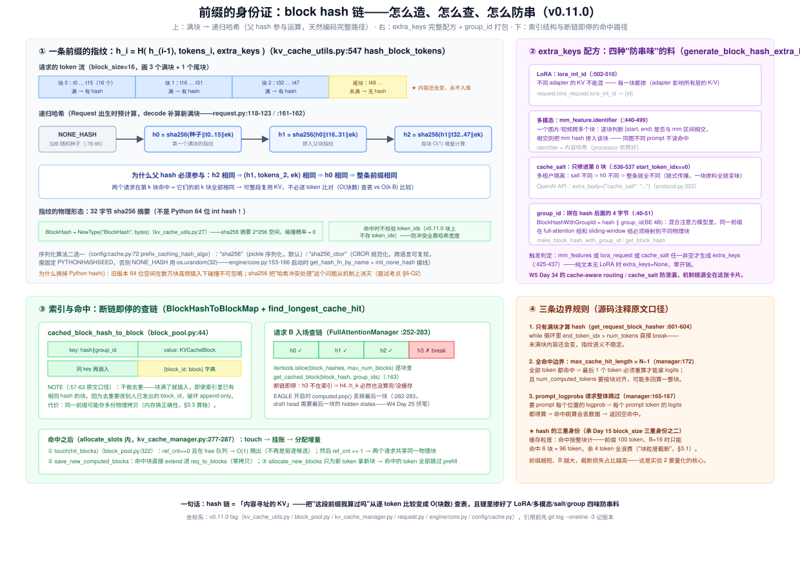
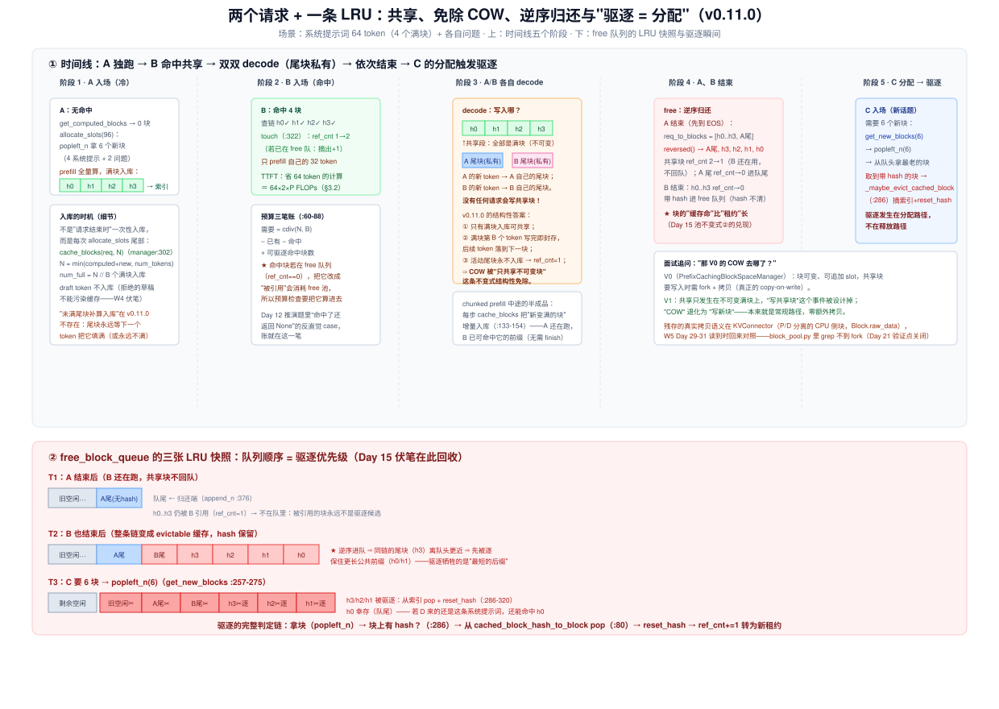
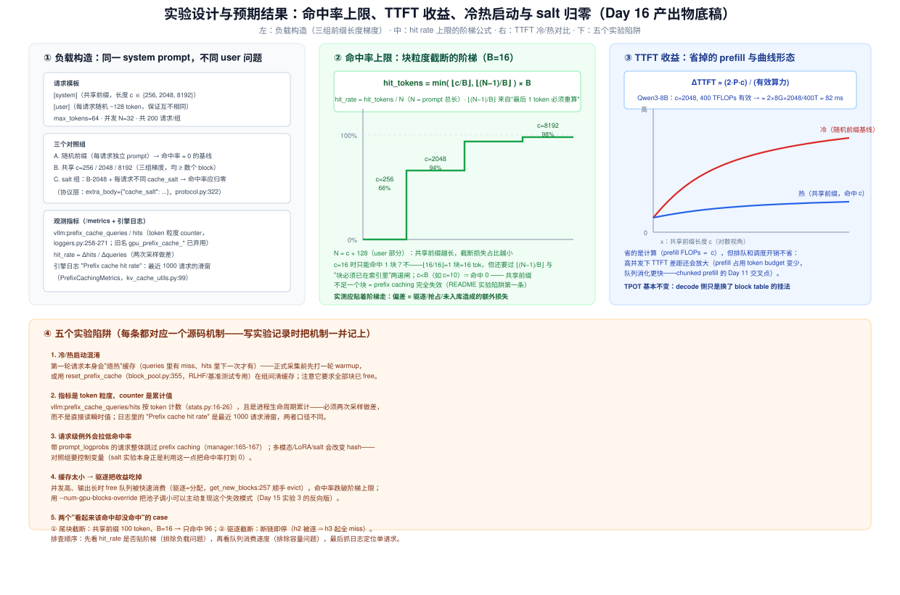

# Day 16 · KV Cache Manager（二）—— prefix caching：hash 链、COW 的最终答案与 LRU 驱逐

> **系列**：推理系统优化专家岗 · 56 天打卡 | 第 3 周「vLLM V1 源码精读（下）—— KV 管理与执行」
> **今日位置**：Day 15 把 KV 的**物理层**读完了——块池、free 队列、双账本、`ref_cnt`，当时反复说"`cached_block_hash_to_block` 是 Day 16 的主角"。今天正式打开这个索引：**前缀复用怎么判定（递归 hash 链 + extra_keys 四味防串料）· 命中路径怎么走（断链即停 + touch + 三条边界规则）· 满块什么时候入库（每步增量，不是请求结束）· 共享块为什么不会被写坏（v0.11.0 对 COW 的结构性答案——这是 Day 21 留下的读码验证点，今天关闭）· LRU 藏在哪（驱逐 = 分配，Day 15 池不变式② 的完整兑现）· `enable_prefix_caching` 的开关行为**。Day 12 的"自命中复活"、Day 4 论文里的"引用计数 + COW 设计动机"、Day 15 的三条伏笔（hash 索引 / ref_cnt 共享 / 队列驱逐序）今天全部收口；实验拿到第一组 **cache hit rate 与 TTFT 改善** 的量化数据（W7 Day 46 消融实验② 的预演）
> **前置要求**：Day 15（**最重要**：`KVCacheBlock` 三张身份证、池不变式①②、`allocate_slots` 九步、`cache_blocks` 只收满块）、Day 12（preemption 六步复位：`num_computed_tokens = 0` + 自命中复活——今天给出机制层完整解释）、Day 4（PagedAttention 论文：block/table/引用计数/COW 的设计动机——今天对照"V1 把 COW 设计掉了"）、Day 9（`Request` 账本组——`block_hashes` 出生即预计算的伏笔）、Day 11（chunked prefill：被切块的请求中途已算好的块怎么办）、Day 5（TTFT 定义——今天的收益指标）
> **预计用时**：3 ~ 3.5 小时（源码走读 1.5h + 实验 1~1.5h + 手算与产出物 0.5h）
> **背景衔接**：prefix caching 的本质是**内容寻址的 KV 复用**——把"这段前缀我算过吗"从逐 token 比较（O(N)）变成查哈希表（O(块数)）。你在昇腾上做 ASW 模板提升 L2 命中率，本质是"让重复访问的数据驻留高带宽层"；prefix caching 是同一思想在引擎层的实现："重复计算 → 命中即跳过"。两者都是**以便宜资源换昂贵资源**：L2 命中用片上 SRAM 换 HBM 带宽，prefix caching 用一点 CPU 哈希 + 索引内存换整个 prefill 的 GPU 计算。另一个直接可迁移的点：`cache_salt` 只掺进第 0 块、靠链式传播让整条链变味——这是"最小注入点"设计的教科书案例，和你做算子时"在边界处一次性融合标识"是同一个思路
> **实验环境**：实验 0/1（手算 + 仿真器）**无 GPU 可完成**；实验 2/3 复用 Day 6 的 1 × H100/A100 + Qwen3-8B（Day 13/15 压测环境）
> **配套材料**：`week3/README.md` Day 16 节；三张 SVG：`assets/day16_hash_chain_and_hit_path.svg`（今日主图：hash 链递归结构 + extra_keys 配方 + 索引与断链即停）、`assets/day16_share_evict_lifecycle.svg`（两请求时间线：共享 → 免除 COW → 逆序归还 → 驱逐 = 分配，含 free 队列三张 LRU 快照）、`assets/day16_hit_rate_ttft_experiment.svg`（实验设计：命中率阶梯公式 + TTFT 冷热对比 + 五个陷阱——产出物数据表的底稿）
> **版本口径**：源码坐标按 **v0.11.0 tag** 逐行核对（2026-10 复核，与 Day 8/9/11/12/15 一致）。⚠️ **四处与 week3/README.md Day 16 节、旧博客不一致，以 tag 为准**：① README 写"请求结束后其最后一个未满块会被补算 hash 入库（找 `cache_partial_blocks`）"——v0.11.0 **无此机制**：未满块永不上索引（等下一个 token 把它填满），请求 finish 不触发任何 hash 计算（§2.5）；② README 写"`BlockPool.fork(last_block)`"——v0.11.0 的 `block_pool.py` **没有 fork，grep 不到任何 COW 物理拷贝**：共享被限制在不可变满块上，"写时复制"被结构性免除（§2.6，Day 21 的验证点在此关闭）；③ README 思考题 2 问"命中后是否校验 `token_ids`"——v0.11.0 **不校验**：`KVCacheBlock` 上不存 token_ids（kv_cache_utils.py:170-186），防冲突全靠 32 字节 sha256 摘要（:27，从旧版 64 位 `hash()` 迁移而来）；④ 指标名 `vllm:gpu_prefix_cache_queries/hits` 已于 0.9.2 改名为 **`vllm:prefix_cache_queries/hits`**（loggers.py:224-271，旧名保留为 deprecated）。引用前先 `git log --oneline -3` 记版本

---

## 0. 今日学习目标

完成今天的学习后，你应该能够：

- [ ] **画出 hash 链递归图**（闭卷）：`h_i = H(h_{i-1}, tokens_i, extra_keys)`，说清"父 hash 参与运算 ⇒ 第 k 块命中 ⇒ 前 k 块全同"的推理链，以及 `NONE_HASH` 种子、sha256 32 字节、每块 O(1) 增量计算三个事实（§2.2，图 1）
- [ ] **背出 extra_keys 四味配方**：LoRA id（每块掺）/ 多模态 hash（跨块掺）/ cache_salt（**只掺第 0 块，链式传播**）/ group_id（4 字节后缀打包，混合注意力组隔离），以及触发判定（mm 或 lora 或 salt 非空，纯文本零开销）（§2.3，图 1 右）
- [ ] **逐行走完命中路径**：scheduler 入场 → `get_computed_blocks`（kv_cache_manager.py:154）→ `find_longest_cache_hit` 断链即停（single_type:252-283）→ `touch` → 挂账，外加三条边界规则（只查满块 / `max_cache_hit_length = N−1` / prompt_logprobs 整体跳过）（§2.4）
- [ ] **说清入库时机**：不是"请求结束时"，而是每次 `allocate_slots` 尾部增量入库（manager:297-302），chunked prefill 的半成品也边算边入库；draft token 被显式排除（§2.5）
- [ ] **给出 COW 的 v0.11.0 标准答案**：为什么"只共享不可变满块 + 活动尾块私有 + 入场一次性挂载"三条不变式让写共享块这个事件**从未发生**；V0 的真 COW 长什么样；残存的拷贝语义在哪（KVConnector，W5）（§2.6，图 2）
- [ ] **推演完整的 LRU 驱逐**：touch 的双语义、free 的逆序归还（同链尾块先逐）、"驱逐 = 分配"（`get_new_blocks` 顺手 `_maybe_evict_cached_block`）、`reset_prefix_cache` 的用途（§2.7，图 2 下）
- [ ] **解释开关行为**：`enable_prefix_caching` V1 默认开（config/cache.py:70）；关掉时 coordinator 换 `NoPrefixCache`、hasher 不接线（但 KVConnector 在时仍接）；hash 算法 sha256 / sha256_cbor 二选一（§2.8）
- [ ] **手算命中率上限与 TTFT 收益**：`hit_tokens = min(⌊c/B⌋, ⌊(N−1)/B⌋) × B`，`ΔTTFT ≈ 2·P·c / 有效算力`，三组梯度数值对得上实验（§3.1/3.2）
- [ ] 交付：**实验数据表**（≥3 组前缀长度梯度的 hit rate + TTFT 冷热对比）+ **hash 链 / 共享驱逐 两张手画图** + **README 思考题 4 道的答案**（§9）

---

## 1. 核心概念速览

| 概念 | 一句话定义 | 今日要达到的深度 |
|---|---|---|
| **prefix caching** | 相同前缀的 KV 只算一次，后来者查 hash 直接挂块（vLLM 默认开） | 能从 hash 链 → 命中 → touch → 跳算整条链讲下来，含所有边界 |
| **`BlockHash`** | 满块内容的指纹：**32 字节 sha256 摘要**（kv_cache_utils.py:27） | ⚠️ 不是 Python int——旧版 `hash()` 64 位空间有碰撞风险，v0.11.0 用 sha256 把问题从机制上消灭 |
| **`NONE_HASH`** | 链的"创世种子"：`sha256(PYTHONHASHSEED)` 或 `os.urandom(32)`（:78-95） | 知道它随进程随机 ⇒ 跨进程/跨重启的 hash 不可比（sha256_cbor + 固定种子才可复现） |
| **`hash_block_tokens`** | `h = hash_fn((parent_hash, tuple(tokens), extra_keys))`（:547） | 背下参数三元组；父 hash 参与运算是"路径编码"的全部秘密 |
| **`block_hashes`（Request）** | 请求的指纹列表：出生时对 prompt 满块预计算，decode 每填满一块 extend 一次（request.py:118-123/:161-162） | 这是 Day 9 埋的伏笔——hash 计算不在 KV 管理器里，在 Request 身上 |
| **`get_request_block_hasher`** | 造 hasher 的工厂：闭包捕获 block_size 和 hash 函数（:576-621） | 理解"增量"：从 `len(block_hashes)×B` 起步，只算新满块（`end > num_tokens` 即 break） |
| **`extra_keys`** | 防串味的料：LoRA id / mm hash / cache_salt（:513-545） | **salt 只掺第 0 块**（:536-537）——一块变味，全链变味 |
| **`BlockHashWithGroupId`** | 索引真正的键 = `hash ‖ group_id`（4 字节大端后缀，:40-51） | 混合注意力模型里同一前缀在不同 group 必须映射不同物理块 |
| **`BlockHashToBlockMap`** | hash 索引：`{key → block}`，同 key 多块时 value 变 `{block_id: block}` 字典（block_pool.py:44） | 记住 NOTE #1：**不做去重**——保证 block table append-only 的代价是可能存重复物理拷贝 |
| **`get_cached_block`** | 按内容查块：对每个 group 查一次，任一 miss 返回 None（:163-186） | 命中**不校验 token_ids**（块上不存）——面试必考（§6-Q2） |
| **`find_longest_cache_hit`** | 逐块查链、**断链即停**（single_type:252-283） | 能解释为什么敢停：h_k 不在索引 ⇒ h_{k+1..} 必然没入库 |
| **`touch`** | 命中块转正：在 free 队列则 O(1) 摘出，然后 `ref_cnt += 1`（block_pool.py:322-343） | 双语义：既是"转私有"也是 LRU 的"最近使用"更新 |
| **`cache_full_blocks`** | 入库：给新满块挂 hash、插索引（:188-255） | 注意 assert `blk.block_hash is None`——一个物理块一辈子只有一个指纹 |
| **`_maybe_evict_cached_block`** | 驱逐：从索引 pop + `reset_hash`（:286-320） | **只被 `get_new_blocks` 调用**——驱逐永远发生在分配路径上 |
| **`reset_prefix_cache`** | 手动清空全部缓存（:355-383） | RLHF 换权重后失效缓存 / 基准测试组间隔离；要求全部块已 free |
| **可驱逐命中块** | 命中块若 `ref_cnt==0`（在 free 队列），预算检查要把它算进去（single_type:76-82） | Day 12 推演题里"命中了还返回 None"的那笔账 |
| **`max_cache_hit_length = N−1`** | 全命中也要回算最后 1 个 token 拿 logits（manager:172） | 会推导：⌊(N−1)/B⌋ 让实际命中再截掉一块的可能 |
| **`num_cached_tokens`** | 请求首次调度时记录的命中 token 数（scheduler:528-530） | 它进 `RequestOutput` 的 metrics——用户侧可见"这次省了多少" |
| **`PrefixCacheStats`** | 每步累计的 (requests, queries, hits)，**token 粒度**（stats.py:16-26） | queries += prompt 长度、hits += 命中长度——hit rate 的分子分母 |
| **`PrefixCachingMetrics`** | 最近 **1000 个请求**的滑窗命中率（kv_cache_utils.py:99-164） | 引擎日志 "Prefix cache hit rate" 的来源；与 Prometheus counter 口径不同 |
| **`enable_prefix_caching`** | V1 默认开（config/cache.py:70）；关掉 → `NoPrefixCache` coordinator | 知道 KVConnector 在时即使关缓存也接 hasher（P/D 要用 hash 对齐块，W5） |

> **一句话本质**：prefix caching = **给 KV cache 装了一套内容寻址（content-addressed）的缓存层**——满块按 `H(父hash, tokens, extra_keys)` 领身份证，索引挂在 BlockPool 上；命中 = 查链 + `ref_cnt` 共享（零拷贝、零重算），淘汰 = free 队列顺序（LRU 藏在分配路径里）。全部精妙都在"**只缓存不可变的满块**"这一条不变式上：它同时解决了写入安全（COW 被结构性免除）、缓存键稳定性（指纹永不失效）和驱逐简洁性（摘索引 + 清 hash 两个 O(1) 操作）。

---

## 2. 原理深入讲解

### 2.1 回顾与今日地图：从"物理块"到"块的内容"

Day 15 结束时我们停在 `allocate_slots` 的第 ⑨ 步：`cache_blocks`——"满块算 hash 入索引（Day 16 的全部内容）"。今天把这一步、以及它两端连接的机制全部展开：

| Day | 已学 / 埋下的伏笔 | 今天兑现 |
|---|---|---|
| Day 4（论文） | block/table/引用计数/COW 的**设计动机** | 引用计数 → `ref_cnt` 共享（§2.6）；COW → **V1 把它设计掉了**（§2.6） |
| Day 9（Request） | `block_hashes` 出生即预计算 | §2.2/§4.1：hasher 的完整接线（engine/core.py:153-166） |
| Day 11（chunked prefill） | 被切块的请求中途已算好的块怎么办 | §2.5：每步增量入库，**无需请求 finish**——B 可命中 A 的半成品 |
| Day 12（preemption） | 六步复位后"自命中复活"（现象） | §2.4：`num_computed_tokens = 0`（scheduler:276）⇒ 重新入场 ⇒ 重新查链 ⇒ 命中自己刚 free 的块（hash 保留） |
| Day 15（池） | ① hash 索引是主角 ② `ref_cnt` 让块可共享 ③ 队列顺序 = 驱逐序、free 不清 hash | §2.3 索引结构 / §2.6 共享语义 / §2.7 驱逐完整链 |
| **Day 16（今天）** | **缓存层：hash 链 / 命中 / 入库 / 共享 / 驱逐 / 开关** | ▶ |
| Day 17（预告） | attention 后端怎么按 block table gather | 今天的 `ref_cnt == num_running` 判公共前缀 → cascade attention（§2.6 尾） |
| Day 19（预告） | async scheduling 的 CPU 开销 | 今天的 hash 注册/查链全在调度 CPU 段上（§3.4 复杂度账单） |
| Day 20/21（mini 引擎） | 自己写 block 池 | 今天的实验 1 仿真器就是"带缓存的 BlockPool"积木 |
| W5 Day 34 | cache-aware routing / cache_salt 防泄漏 | §2.3 的 salt 机制 + 实验 3 的归零验证 |

### 2.2 hash 链：一块的身份证怎么造（图 1）



**递归定义**。对请求的第 i 个满块（token 区间 `[i·B, (i+1)·B)`）：

```
h_i = hash_fn( ( h_{i-1}, tuple(token_ids_i), extra_keys_i ) )     # kv_cache_utils.py:547
h_{-1} = NONE_HASH                                                   # 创世种子（:78-95）
```

`hash_fn` 由 `prefix_caching_hash_algo` 决定（config/cache.py:72）：`"sha256"`（pickle 序列化 + sha256，默认）或 `"sha256_cbor"`（CBOR 规范化 + sha256，跨语言可复现）。产物是 **32 字节 bytes**——`BlockHash = NewType("BlockHash", bytes)`（:27）。

**为什么父 hash 必须参与**——这是整个机制的支点，值得三行证明：

1. `h_i` 相同 ⇒ 元组 `(h_{i-1}, tokens_i, extra_keys_i)` 相同（sha256 抗碰撞）；
2. 递归展开 ⇒ `h_0 … h_i` 全部相同 ⇒ 前 `(i+1)·B` 个 token **加上全部 extra_keys** 都相同；
3. 所以**在第 i 块命中 = 整段前缀可复用**，比较成本从 O(N) token 级降到 O(⌊N/B⌋) 块级，且每块查表 O(1)。

反过来说：如果 hash 只覆盖本块 token，两个请求在第 5 块内容相同但前 4 块不同时会被误判可复用——**KV 是前缀函数，缓存键必须编码路径**。这和 Merkle 树的哈希链、git 的 commit hash 是同一构造：增量计算 O(1)，验证整链 O(k)。

**增量计算**。hash 不在 KV 管理器里算，而在 `Request` 身上（Day 9 伏笔）。接线在 EngineCore 启动时（engine/core.py:153-166）：

```python
# engine/core.py:153-166（节选）
if (self.vllm_config.cache_config.enable_prefix_caching
        or self.scheduler.get_kv_connector() is not None):   # ⚠️ P/D 也需要 hash
    block_size = vllm_config.cache_config.block_size
    caching_hash_fn = get_hash_fn_by_name(
        vllm_config.cache_config.prefix_caching_hash_algo)
    init_none_hash(caching_hash_fn)                          # 播 NONE_HASH 种子
    self.request_block_hasher = get_request_block_hasher(
        block_size, caching_hash_fn)
```

之后每个请求出生即预计算（request.py:118-123），decode 每填满一块 extend 一次（:161-162）：

```python
# request.py:118-123 / :161-162（节选）
self.block_hashes: list[BlockHash] = []
if block_hasher is not None:
    self.get_hash_new_full_blocks = partial(block_hasher, self)
    self.block_hashes = self.get_hash_new_full_blocks()      # prompt 的满块，出生时一次算完

def append_output_token_ids(self, token_ids):
    ...
    if self.get_hash_new_full_blocks is not None:
        self.block_hashes.extend(self.get_hash_new_full_blocks())  # decode 中新满块
```

`get_request_block_hasher` 内层（:584-621）的关键是**只算增量**：`start_token_idx = len(block_hashes) × B`，`while` 循环里 `end_token_idx > num_tokens` 直接 break——**只有满块才算 hash**（:601-604 注释原文 "We only hash full blocks"）。所以一个 8K prompt 的 hash 成本是 512 次 sha256（每次序列化 ~100 字节，总计 < 1ms，§3.4），且 decode 期间每 16 步才补一次。

**NONE_HASH 的可复现性陷阱**：默认情况下 `NONE_HASH = os.urandom(32)`（:93）——每个进程不同 ⇒ **跨进程比较 hash 无意义**。这对单进程 V1 无影响（索引和查询同进程），但做 KV 事件导出、P/D 跨进程对齐、或复现实验时必须用 `sha256_cbor` + 固定 `PYTHONHASHSEED`（:85-91 的警告日志说的就是这件事）。

### 2.3 extra_keys：四味防串料（图 1 右）

裸 token 链只保证"内容相同"，但 KV 还依赖**模型身份和上下文身份**。`generate_block_hash_extra_keys`（:513-545）往哈希里掺料：

| 料 | 掺法 | 防什么 |
|---|---|---|
| **LoRA** | `lora_int_id`，**每一块都掺**（:502-510） | 不同 adapter 对同一 prompt 算出的 K/V 不同 |
| **多模态** | `mm_feature.identifier`（内容 hash），只掺**与该块区间相交**的 mm 输入（:440-499） | 一张图占几百个 token、跨多块——块边界与图边界不对齐 |
| **cache_salt** | **只掺第 0 块**（`start_token_idx == 0`，:536-537） | 多租户：不同 salt 的相同 prompt 不能共享（防跨租户缓存泄漏，W5 Day 34） |
| **group_id** | 4 字节大端后缀**拼在 hash 后面**（:40-51），不是掺进哈希 | 混合注意力模型：同一前缀在 full-attention 组和 sliding-window 组要映射到**不同物理块** |

两个值得咀嚼的设计：

- **salt 只掺第 0 块**就够——因为链式传播：`h_0` 变 ⇒ `h_1` 的输入变 ⇒ 整条链全变。最小注入点、全链生效。反过来说，第 0 块不掺够料，后面掺再多也白搭。
- **触发判定是惰性的**（:425-437）：纯文本、无 LoRA、无 salt 的请求 `extra_keys = None`，`hash_fn` 的输入里就是一个 None——**零额外开销**。绝大多数纯文本流量走的就是这条路。

**group_id 为什么不做成 extra_key 而是后缀拼接**：extra_keys 进哈希会改变摘要值，group_id 拼接保持摘要不变、只改索引键（`get_block_hash(key)` 能原样抠出内容 hash，:52）。这样 KV 事件导出、跨 group 的内容比较都不用重算。

### 2.4 命中路径：断链即停 + 三条边界（图 1 下）

一个 waiting 请求入场时（scheduler.py:382-410）：

```python
# scheduler.py:383-396（节选）
if request.num_computed_tokens == 0:                    # ★ 只有"从零"入场才查缓存
    new_computed_blocks, num_new_local_computed_tokens = \
        self.kv_cache_manager.get_computed_blocks(request)
    if self.connector is not None:                       # P/D 的外部命中（W5）
        num_external_computed_tokens, load_kv_async = \
            self.connector.get_num_new_matched_tokens(...)
    num_computed_tokens = num_new_local_computed_tokens + num_external_computed_tokens
```

`get_computed_blocks`（kv_cache_manager.py:154-188）做四件事：

```python
# kv_cache_manager.py:163-188（节选）
# ① prompt_logprobs 例外：要每个位置的 logprob ⇒ 全量重算，跳过缓存
if (not self.enable_caching
        or (request.sampling_params is not None
            and request.sampling_params.prompt_logprobs is not None)):
    return self.create_empty_block_list(), 0

# ② 全命中边界：最后 1 个 token 必须重算才能产生 logits
max_cache_hit_length = request.num_tokens - 1
computed_blocks, num_new_computed_tokens = (
    self.coordinator.find_longest_cache_hit(request.block_hashes,
                                            max_cache_hit_length))
# ③ 指标：queries/hits 都是 token 粒度
if self.log_stats:
    self.prefix_cache_stats.requests += 1
    self.prefix_cache_stats.queries += request.num_tokens
    self.prefix_cache_stats.hits += num_new_computed_tokens
```

**查链本体**在 `FullAttentionManager.find_longest_cache_hit`（single_type:252-283）：

```python
# single_type_kv_cache_manager.py:268-283（节选）
max_num_blocks = max_length // block_size          # ← N−1 再对齐到块
for block_hash in itertools.islice(block_hashes, max_num_blocks):
    if cached_block := block_pool.get_cached_block(
            block_hash, kv_cache_group_ids):       # 每个 group 各查一次
        for computed, cached in zip(computed_blocks, cached_block):
            computed.append(cached)
    else:
        break                                       # ★ 断链即停
if use_eagle and computed_blocks[0]:
    for computed in computed_blocks:
        computed.pop()                              # EAGLE：丢最后一块（draft head
                                                    # 需要它的 hidden states，W4 Day 25）
```

**为什么敢 break**：块 hash 链式传播 ⇒ `h_k` 不在索引里 ⇒ `h_{k+1}` 及之后要么没算完、要么早已连着 `h_k` 一起被逐（驱逐只摘单个块，但插入是按链序的——`h_{k+1}` 入库时 `h_k` 必然在库里）。所以断链之后**不可能再有命中**，O(命中块) 而非 O(全部块)。

**命中之后**，回到 `allocate_slots`（kv_cache_manager.py:193-304，Day 15 九步中的缓存相关步骤）：

```python
# kv_cache_manager.py:271-287（节选）
if num_blocks_to_allocate > self.block_pool.get_num_free_blocks():
    return None                                    # ① 先预算（含可驱逐命中块，见 §3.3）

if self.enable_caching:
    self.block_pool.touch(new_computed_block_list)  # ② 后 touch：摘出 free 队列 + ref_cnt+=1
...
self.coordinator.save_new_computed_blocks(...)      # ③ 挂账：命中块 extend 进 req_to_blocks
new_blocks = self.coordinator.allocate_new_blocks(...)  # ④ 只为新 token 拿新块
```

顺序有讲究：**先预算后 touch**（避免把块摘出队列后分配失败还要回滚）；**touch 在挂账前**（挂上账的块必须有引用计数）。`touch`（block_pool.py:322-343）逐块执行：`ref_cnt == 0 且在 free 队列` → `free_block_queue.remove(block)`（O(1) 双向链表摘除）→ `ref_cnt += 1`。两个请求命中同一块时，第二次 touch 只是 `1 → 2`——**物理数据零拷贝，共享的全部成本是一个整数自增**。

最后，命中数被记进请求账本（scheduler.py:528-530）：`if request.num_cached_tokens < 0: request.num_cached_tokens = num_computed_tokens`——这个数最终出现在 `RequestOutput.metrics` 里（API 侧可见"本次命中了多少 token"），也解释了 Day 12 的一个现象：

> **自命中复活的机制层解释**：请求被抢占时 `num_computed_tokens = 0`（scheduler:276）+ 块被 free（hash 保留，Day 15 池不变式②）。它重新排队入场时 `num_computed_tokens == 0` 成立 ⇒ 走 `get_computed_blocks` ⇒ 查链命中**自己刚释放的块** ⇒ `num_new_computed_tokens` 几乎等于抢占前的计算量 ⇒ recompute 变成"零成本挂账"。这就是 Day 12 说"抢占的 recompute 模式其实常常不用真重算"的准确机制——前提是这些块还没被别的分配驱逐（free 队列里它们排在队尾，Day 15 的逆序归还规则在保护它们）。

### 2.5 写入路径：满块什么时候入库（图 2 上左）

Day 15 的 `allocate_slots` 九步里，第 ⑨ 步是 `cache_blocks`。今天展开它的内部（注意与"请求结束时入库"的直觉区分）：

```python
# kv_cache_manager.py:297-302（allocate_slots 尾部）
# NOTE(woosuk) 原文口径：只提交"已敲定"的 token —— draft token 可能被拒绝，不能污染缓存
num_tokens_to_cache = min(num_computed_tokens + num_new_tokens,
                          request.num_tokens)
self.coordinator.cache_blocks(request, num_tokens_to_cache)

# single_type_kv_cache_manager.py:133-154（节选）
num_cached_blocks = self.num_cached_block[request.request_id]
num_full_blocks = num_tokens // self.block_size      # ★ 满块数 = 向下取整
self.block_pool.cache_full_blocks(
    request=request, blocks=self.req_to_blocks[request.request_id],
    num_cached_blocks=num_cached_blocks, num_full_blocks=num_full_blocks,
    block_size=self.block_size, kv_cache_group_id=self.kv_cache_group_id)
self.num_cached_block[request.request_id] = num_full_blocks

# block_pool.py:188-255（cache_full_blocks 核心，节选）
new_full_blocks = blocks[num_cached_blocks:num_full_blocks]     # 只处理"新变满"的
for i, blk in enumerate(new_full_blocks):
    assert blk.block_hash is None        # ★ 一个物理块一辈子只有一个指纹
    block_hash = new_block_hashes[i]     # Request 早已算好的指纹（§2.2）
    blk.block_hash = make_block_hash_with_group_id(block_hash, kv_cache_group_id)
    self.cached_block_hash_to_block.insert(block_hash_with_group_id, blk)
```

四个要点：

1. **入库时机是"每次 allocate_slots"**，即每个调度 step——prefill 一块一块算、块一满就入库，**不等请求 finish**。推论：chunked prefill 把 8K prompt 切成 8 段时，第 1 段算完它的满块就已入库，第 8 段还没算——此时新来的同前缀请求已经能命中前 7 段（这正是 week3/README 思考题 3 的答案：**未完成请求的块保留且可被命中，v0.11.0 无需 `cache_unfinished` 特殊路径，增量入库天然覆盖**）。
2. **满块才入库**：`num_full_blocks = N // B` 向下取整，尾块（哪怕只差 1 个 token）不入库。⚠️ week3/README 说"请求结束后最后一个未满块会被补算入库（找 `cache_partial_blocks`）"——**v0.11.0 没有这条路径**（grep 不到该函数；finish 处理器不做任何 hash 操作）。未满块要么等 decode 把它填满（此时照常入库），要么请求结束就永远不入库。
3. **无去重**（BlockHashToBlockMap NOTE #1，:57-63）：块满了就插入，即使索引里已有同 hash 的块（value 从单块变 `{block_id: block}` 字典）。为什么不去重、把新请求直接挂到已有块上？——那要**改写已发出的 block table**（把别人 row 里的块号换掉），破坏 Day 15 讲过的 append-only 性质（P2 的 `append_row` 依赖"只追加不改写"）。代价是同一前缀可能存多份物理拷贝（§3.3 算账）。
4. **draft token 不入库**：投机解码的草稿 token 可能被 verifier 拒绝，被拒绝的草稿的 KV 是"脏数据"，不能进缓存。`min(·, request.num_tokens)` 的 cap 就是这层保护（W4 Day 25 会回来）。

### 2.6 共享与 COW：v0.11.0 的结构性答案（图 2 中，本节关闭 Day 21 验证点）



这是今天最重要的小节——README 和 Day 21 都把"**COW 的物理拷贝发生在哪一层、什么时机**"列为读码验证点。v0.11.0 的答案分两半：**簿记层有"写时另起新块"，物理层零拷贝**。

**场景推演**。请求 A、B 共享 64 token 系统提示（4 个满块 h0..h3）：

```
A 的块表：[h0] [h1] [h2] [h3] [A尾块(私有)]
B 的块表：[h0] [h1] [h2] [h3]      [B尾块(私有)]     ← B 入场时 touch 挂上 h0..h3
                     ↑ ref_cnt = 2 的共享段           尾块 ref_cnt = 1
```

B 开始生成，新 token 写到哪？——**B 自己的尾块**。A 继续生成，写到 **A 自己的尾块**。共享段 h0..h3 呢？**没有任何请求会写它**。逐步拆解为什么：

1. **入库即满、满即封存**：一个块只有在第 B 个 token 的 KV 写完之后才入库（§2.5），后续 token 落到下一块。所以"被共享的块"必然已经写满——**共享的对象是不可变对象**。
2. **尾块永不在索引里**：未满块没有 hash ⇒ `find_longest_cache_hit` 查不到它 ⇒ 它永远不会被 touch ⇒ `ref_cnt == 1`（私有）。**每个请求的活动写入点永远是私有块**。
3. **命中只发生在入场**：`save_new_computed_blocks`（single_type:90-107）对 running 请求有断言 `assert len(new_computed_blocks) == 0`——因为 scheduler 只在 `num_computed_tokens == 0` 时查缓存（§2.4）。运行中的请求不会突然"再挂一块共享块"。

三条合起来：**"向共享块写入"这个事件在 V1 的正常路径上从未被定义过**。所谓 COW 的"写时复制"，在这里退化为"写新块"——而分配新块本来就是每 16 步一次的常规操作（Day 15 §2.7）。`block_pool.py` 里 grep 不到 `fork`、`copy`、`cow` 任何一个词，**不是遗漏，是设计**。

**与 V0 对比**（面试的加分段）：V0 的 `PrefixCachingBlockSpaceManager` 时代，块对象是可变的（partial block 可以继续 append slot），两个请求共享同一个块对象后，一方要 append 时必须 fork + 物理拷贝——真正的 copy-on-write。V1 把"可变块共享"这个危险场景从数据结构上删掉了，用"**只共享不可变满块**"一条不变式换掉了一整类同步问题。这是"用不变式消灭机制"的范例——和你做算子时"用对齐约束消灭分支"是同一种思路。

**残存的真实拷贝在哪**：KVConnector（P/D 分离、CPU offload）侧的 `Block` 有 `raw_data`（Day 15 一笔带过的 `Block` 子类）——跨设备传 KV 时存在真实的字节搬运。但那是**传输语义**不是 COW 语义（没有"共享后写入才拷贝"的触发条件）。W5 Day 29-31 读 P/D 时回来对照。

**共享的变现不止于 prefill**。Day 17 的 cascade attention 用 `get_num_common_prefix_blocks`（kv_cache_manager.py:332-373：沿任一 running 请求的块表走，`ref_cnt == num_running_requests` 的块就是全批公共前缀）把"多个请求共享前缀"翻译成"公共前缀只从 HBM 读一次"——今天挂上的 `ref_cnt=2`，明年在 decode 带宽上兑现（§3.2 尾）。

### 2.7 驱逐与 LRU：藏在分配路径里的回收站（图 2 下）

把 Day 15 的不变式②（free 不清 hash）和"驱逐 = 分配"补全成完整生命周期：

**① 请求结束 → 逆序归还**（single_type:156-171 → block_pool:338-353）：

```python
# single_type_kv_cache_manager.py:167-171
ordered_blocks = reversed(req_blocks)   # 注释原文：tail blocks are freed first
self.block_pool.free_blocks(ordered_blocks)

# block_pool.py:345-353（节选）
for block in blocks_list:
    block.ref_cnt -= 1                  # 共享块 2→1：不回队，继续服务另一方
self.free_block_queue.append_n([
    block for block in blocks_list
    if block.ref_cnt == 0 and not block.is_null])   # 归零才进队尾，hash 保留
```

逆序进队的效果：同一条链上，**尾块（h3）离队头更近、先被逐；链头（h0）最后被逐**。为什么这样设计？——驱逐是断链式伤害：逐掉 h3 只损失 1 块缓存（h0..h2 还能命中 48 token），逐掉 h0 损失整条链（后面全部断链）。**牺牲最短后缀、保住最长前缀**，LRU 的期望收益最大化。

**② 新分配 → 顺手驱逐**（block_pool.py:257-296）：

```python
# block_pool.py:273-284（get_new_blocks 核心）
ret = self.free_block_queue.popleft_n(num_blocks)     # 从队头拿最老的
if self.enable_caching:
    for block in ret:
        self._maybe_evict_cached_block(block)         # 带 hash → 摘索引 + reset_hash
        block.ref_cnt += 1                            # 转为新租约
```

没有独立 evictor、没有"内存不足"回调：**需要块的时候，从队头拿，拿到缓存块就逐**。队头永远是"最久没人 touch 的块"（LRU），且如上所述同链尾块靠前。`_maybe_evict_cached_block`（:286-320）只做两个 O(1) 操作：从 `BlockHashToBlockMap` pop（同 hash 多块时只摘本块，:80-108）+ `reset_hash()`。**KV 数据不用清零**——新租约的 token 会把它整个覆盖写掉（slot_mapping 直写，Day 17）。

**③ 手动兜底 → `reset_prefix_cache`**（:355-383）：清空整个索引 + 全部块 `reset_hash`。两个用途：RLHF 换权重后旧 KV 全部失效（不 reset 会用旧权重算的 KV 服务新模型——错误结果）；基准测试组间隔离（实验 3 用得上）。前置条件：所有块必须已 free（只允许在"池干净"时调）。

**④ 指标口径**：Prometheus 的 `vllm:prefix_cache_queries / hits` 是 **token 粒度累计 counter**（stats.py:16-26 → loggers.py:258-271）；引擎日志的 `Prefix cache hit rate` 是 **最近 1000 个请求的滑窗平均**（`PrefixCachingMetrics`，kv_cache_utils.py:99-164，`observe` 里逐请求入队、超窗出队）。两者不可混用——实验 2 的坑 #2。

### 2.8 开关行为：`enable_prefix_caching` 拨到 OFF 会怎样

```python
# config/cache.py:70-76
enable_prefix_caching: Optional[bool] = None
"""Whether to enable prefix caching. Enabled by default for V1."""
prefix_caching_hash_algo: PrefixCachingHashAlgo = "sha256"   # 或 "sha256_cbor"
```

拨开关时三处联动：

| 联动点 | ON（默认） | OFF |
|---|---|---|
| coordinator 工厂（kv_cache_coordinator.py:415-440） | 1 个 group → `Unitary`；多个 → `Hybrid` | **`NoPrefixCache`**：`find_longest_cache_hit` 永远返回空（:216-224） |
| hasher 接线（engine/core.py:153-166） | 接 | 不接——**除非有 KVConnector**（P/D 跨进程对齐块仍需 hash，W5） |
| BlockPool（block_pool.py:118-175） | `enable_caching=True`：free 队列里混着"真空闲 + 可驱逐缓存" | `get_new_blocks` 走 else 分支（:285-288），块永远无 hash、队列为纯空闲链表 |

OFF 的语义代价：多轮对话每轮全量重算 prefill；抢占恢复从"自命中复活"退化成真·recompute（Day 12）。OFF 的收益：省掉 hash 计算/查链的 CPU（§3.4）、省掉索引内存、行为更好预测（无驱逐抖动）。**vLLM 团队选择默认 ON**，因为收益/代价比在真实负载下太悬殊——多轮对话、few-shot 模板、RAG 的固定文档段，全是高重复前缀。

版本注意：`_verify_prefix_caching`（config/cache.py:188-203）里"sliding window 不支持 prefix caching"的检查**只在 V0 生效**（`not envs.VLLM_USE_V1` 才 raise）——V1 的 sliding window 组由 `SlidingWindowManager` 自己处理命中语义（滑出窗口的块用 null_block 占位，single_type:304+），不受此限。

---

## 3. 性能模型与复杂度：今日的数学

### 3.1 命中率上限：块粒度截断的阶梯（图 3 中）



设共享前缀长度 `c`、prompt 总长 `N = c + u`（u 为每请求独有部分）、block size `B`。可命中的满块数与 token 数：

$$
\text{hit\_blocks} = \min\left(\left\lfloor \frac{c}{B} \right\rfloor,\ \left\lfloor \frac{N-1}{B} \right\rfloor\right), \qquad
\text{hit\_tokens} = \text{hit\_blocks} \times B
$$

$$
\boxed{\ \text{hit\_rate} = \frac{\text{hit\_tokens}}{N}\ } \qquad
1 - \text{hit\_rate} \approx \underbrace{\frac{u}{N}}_{\text{新内容，本就不该命中}} + \underbrace{O\!\left(\frac{B}{N}\right)}_{\text{块对齐截断}}
$$

三处截断来源：① `c mod B`——前缀尾巴不满一块（c=100、B=16 时浪费 4 token）；② `N−1`——最后 1 个 token 必须重算拿 logits，取整到块再截一块的可能；③ 前缀必须**已在索引里**（上一轮请求算过且未被逐）。Qwen3-8B（B=16）的三组梯度（u=128）：

| 共享前缀 c | N | 命中块 | hit_tokens | **hit rate 上限** | 截断损失 |
|---|---|---|---|---|---|
| 256 | 384 | 16 | 256 | **66.7%** | 33%（u 占比大） |
| 2048 | 2176 | 128 | 2048 | **94.1%** | ~6% |
| 8192 | 8320 | 512 | 8192 | **98.5%** | ~1.5% |
| 16 | 144 | 1 | 16 | 11.1% | 前缀只够 1 块 |
| 10 | 134 | **0** | 0 | **0%** | c < B：完全失效 |

**hit rate 的上限由负载决定，不由系统决定**——系统只决定你离上限有多近（驱逐、未入库时序、边界处理）。这是 README 思考题 1 的定量一半：多轮对话（每轮 = 上一轮全部历史 + 少量新 token，c/N → 95%+）收益极高；独立问题（c → 0）收益趋零。

### 3.2 TTFT 收益：省掉的是计算，不只是显存

命中的经济账（Day 1 公式的直接应用）：prefill 是 compute-bound，省 c 个 token 的 prefill = 省 `2·P·c` FLOPs：

$$
\Delta \text{TTFT} \approx \frac{2 \cdot P \cdot c}{\text{有效算力}}，\qquad
\text{Qwen3-8B}（P = 8\text{B}）:\ c = 2048,\ 400\ \text{TFLOPs 有效} \Rightarrow \frac{2 \times 8 \times 10^9 \times 2048}{400 \times 10^{12}} \approx 82\ \text{ms}
$$

三个二阶效应（面试讲出来就是区分度）：

1. **高并发下差距放大**：省掉的不只是自己的计算，还有 token budget 的占用——A 的 2K prefill 不进 budget，B/C/D 的 TTFT 一起降（chunked prefill 排队模型，Day 11 §3）。
2. **TPOT 基本不变**：decode 侧只是 block table 换了挂法，gather 的访存量不变（Day 17 唯一例外：cascade attention 能把共享前缀的读放大从 N 倍降到 1 倍，§2.6 尾）。
3. **显存收益是"软"的**：命中不减少 KV 占用（数据本来就在），只是让新请求**不再重复生成一份**——省的是"将要发生的分配"，不是"已经存在的占用"。

### 3.3 代价账：CPU、索引内存与重复拷贝

| 代价项 | 数量级（Qwen3-8B, B=16） | 说明 |
|---|---|---|
| hash 计算 | 每 prompt `⌊N/B⌋` 次 sha256，8K prompt ≈ 512 次 ≈ < 1ms | 出生时一次性，decode 每 16 步 1 次 |
| 查链 + touch | O(命中块) 次 dict 查找 + O(1) 链表摘除 | 入场时一次，2K 命中 = 128 次查找 |
| 索引内存 | 每缓存块 ~1 个 dict entry + 32B 键 | 24k 块全满时几 MB 量级，可忽略 |
| **重复物理拷贝** | 并发同前缀请求数 × c × page_size | 无去重的代价（§2.5-3）：32 路并发共享 2K 前缀最坏 32×128×64KiB ≈ 256 MiB |
| 池挤占 | 正被引用的命中块不回队 | 高命中率 ⇔ 高在引用块数 ⇒ `get_num_free_blocks` 下降 ⇒ 抢占风险左移（Day 12 交互） |

最后一行值得展开：**prefix caching 与 preemption 的交互**。命中块被 touch 后 `ref_cnt > 0`、不回 free 队列——它们**真实占用**了池。命中率越高、并发越多，留给"新请求 + 正常 decode 追加"的余量越小。Day 12 的"KV 失守 → 抢占"在开了缓存的系统里更容易被高重复负载触发（32 路共享 2K 前缀 = 128 块共享 + 每路自己的增长）。调参思路：`max_num_seqs` 对"有效并发"的估计要扣除共享块的占用。

### 3.4 复杂度账单（P1 CPU，每 step 固定税的缓存增量）

| 操作 | 复杂度 | 触发频率 | 坐标 |
|---|---|---|---|
| `request_block_hasher`（prompt） | O(⌊N/B⌋) sha256 | 每请求 1 次（出生） | kv_cache_utils:576 |
| `request_block_hasher`（decode） | O(1) | 每 B 步 1 次 | request.py:161 |
| `find_longest_cache_hit` | O(命中块) | 每请求入场 1 次 | single_type:252 |
| `touch` | O(命中块) | 同上（含在 allocate_slots） | block_pool:322 |
| `cache_full_blocks` | O(新满块) | 每 step | block_pool:188 |
| `_maybe_evict_cached_block` | O(1) × 新分配块 | 每 step | block_pool:286 |

全部加在调度 CPU 段上——Day 19 讲 async scheduling 时会回来算这笔账（"开缓存换 TTFT 的同时给 CPU 段加码"）。

### 3.5 练手对账题（答案见 §8）

1. **手算**：系统提示 1000 token（Qwen3-8B, B=16），user 问题平均 200 token，多轮对话第 5 轮（前 4 轮各留 150 token 输出）。第 5 轮请求的 hit rate 上限是多少？哪一项截断损失最大？
2. **推演**：请求 X 的 prompt 256 token（16 块），命中 12 块（其中 5 块 ref_cnt=0 在 free 队列）。池里只剩 10 个 free 块。`get_num_blocks_to_allocate` 算出几？X 能入场吗？入场后 free 剩几？（对齐 §2.4 的预算三笔账）
3. **设计**：想让"不同租户相同 prompt"绝不共享、但"同租户跨实例"可以共享（未来接全局 KV 池），salt 应该按什么粒度取值？第 0 块只掺一次够吗？

---

## 4. 关键代码走读（v0.11.0 逐行核对版）

### 4.1 接线全景：hasher 是怎么长到 Request 上的

```
EngineCore.__init__ (engine/core.py:153-166)
  └─ enable_prefix_caching or KVConnector → get_request_block_hasher(block_size, hash_fn)
       └─ init_none_hash(hash_fn)                          # 播种 NONE_HASH
Processor → EngineCoreRequest(含 cache_salt, mm, lora)      # API 层透传
  └─ Request.from_engine_core_request(req, self.request_block_hasher)  # :442
       └─ Request.__init__: block_hashes = hasher(self)    # 出生即预计算（request.py:118-123）
decode: append_output_token_ids → block_hashes.extend(hasher())  # :161-162
```

### 4.2 `kv_cache_utils.py`：hash 三件套

```python
# :547-570 hash_block_tokens —— 全部秘密在一个元组里
def hash_block_tokens(hash_function, parent_block_hash,
                      curr_block_token_ids, extra_keys=None) -> BlockHash:
    if not parent_block_hash:
        parent_block_hash = NONE_HASH
    curr_block_token_ids_tuple = tuple(curr_block_token_ids)
    return BlockHash(hash_function(
        (parent_block_hash, curr_block_token_ids_tuple, extra_keys)))

# :513-545 generate_block_hash_extra_keys —— 四味料的调配现场
mm_extra_keys, new_start_mm_idx = _gen_mm_extra_hash_keys(...)      # 跨块相交的 mm hash
lora_extra_keys = _gen_lora_extra_hash_keys(request)               # [lora_int_id]
cache_salt_keys = [request.cache_salt] if (
    start_token_idx == 0 and request.cache_salt) else []            # ★ 只掺第 0 块
extra_keys = lora_extra_keys + mm_extra_keys + cache_salt_keys
```

### 4.3 `block_pool.py`：索引、入库、驱逐的三个入口

```python
# :62-78 BlockHashToBlockMap.insert —— 同 hash 多块：单块 → 字典（无去重）
elif isinstance(blocks, KVCacheBlock):
    self._cache[key] = {blocks.block_id: blocks, block.block_id: block}

# :322-343 touch —— 命中转正（双语义：摘队 + 计数）
for block in blocks_per_group:
    if block.ref_cnt == 0 and not block.is_null:
        self.free_block_queue.remove(block)
    block.ref_cnt += 1

# :286-296 _maybe_evict_cached_block —— 驱逐的全部动作（两个 O(1)）
if self.cached_block_hash_to_block.pop(block_hash, block.block_id) is None:
    return False
block.reset_hash()
```

### 4.4 `kv_cache_manager.py`：get_computed_blocks 与 allocate_slots 的缓存五步

```python
# 入场（每请求一次）：scheduler:383 → manager:154
get_computed_blocks:
  ① prompt_logprobs → 返回空      ② max_cache_hit_length = N-1
  ③ coordinator.find_longest_cache_hit（断链即停）   ④ stats（token 粒度）

# 分配（每 step）：manager:193-304 中与缓存相关的五步
  ⑤ 预算检查（含可驱逐命中块，single_type:60-88）  → 不足返回 None
  ⑥ touch（摘队 + ref_cnt+=1）→ ⑦ save（挂账）
  ⑧ allocate_new_blocks（只拿增量）→ ⑨ cache_blocks（新满块入库，draft 排除）
```

### 4.5 调用链速查表（今日总账）

| 链路 | 调用序列 |
|---|---|
| **入场命中** | scheduler:383 → manager.get_computed_blocks:154 → coordinator:251 → FullAttentionManager.find_longest_cache_hit:252 → block_pool.get_cached_block:163 → BlockHashToBlockMap.get_one_block:48 |
| **入场分配** | manager.allocate_slots:193 → (预算) coordinator.get_num_blocks_to_allocate:47 → single_type:60 → (touch) block_pool.touch:322 → queue.remove:334 → (挂账) single_type.save_new_computed_blocks:90 → (分配) block_pool.get_new_blocks:257 → (驱逐) _maybe_evict_cached_block:286 |
| **增量入库** | manager.allocate_slots 尾部:297-302 → single_type.cache_blocks:133 → block_pool.cache_full_blocks:188 → BlockHashToBlockMap.insert:62 |
| **结束归还** | scheduler finish → manager.free:306 → single_type.free:156（reversed）→ block_pool.free_blocks:338 → queue.append_n:376 |
| **指标外送** | manager.get_computed_blocks:185-187 → PrefixCacheStats → make_prefix_cache_stats:142 → SchedulerStats → loggers:98 → Prometheus `vllm:prefix_cache_queries/hits`:258-271 + 日志滑窗 PrefixCachingMetrics:99 |
| **API 侧 salt** | protocol.py:322（字段）→ :411-421（校验）→ EngineCoreRequest → Request.cache_salt:96 → extra_keys:536 |

---

## 5. 动手实验（约 60~90 分钟）

### 实验 0（必做，15 min；无 GPU）：手算命中率阶梯与 TTFT 收益

对着 §3.1 的表格自己算一遍（Qwen3-8B，B=16，u=128）：c ∈ {256, 2048, 8192} 三组的 hit rate 上限、截断损失分解、ΔTTFT（有效算力按 400 TFLOPs 估）。再算两个极端：c=10（完全失效）、多轮对话第 5 轮（§3.5-Q1）。把结果填进 §9 的数据表模板——实验 2 的实测值就贴在同一张表的"实测"列，偏差就是"系统损耗"。

### 实验 1（必做，30 min；无 GPU）：mini hash 链仿真器——把今天的机制全部跑一遍

语义对齐 v0.11.0 的最小实现（sha256 链 / 无去重索引 / 断链即停 / touch / 逆序 free / 驱逐 = 分配 / salt / 预算三笔账）：

```python
# day16_sim.py —— 语义对齐 v0.11.0（简化点见文末清单）
import hashlib
from dataclasses import dataclass

B = 16
NONE_HASH = hashlib.sha256(b"day16-seed").digest()        # 真实实现：os.urandom(32)（:93）

def hash_block_tokens(parent, tokens, extra_keys=None):   # :547
    return hashlib.sha256(
        parent + repr((tuple(tokens), extra_keys)).encode()).digest()

def request_hashes(tokens, salt=None):                    # :576 get_request_block_hasher
    hs, i = [], 0
    while i + B <= len(tokens):                           # 只算满块（:601-604）
        ek = (salt,) if (i == 0 and salt) else None       # ★ salt 只掺第 0 块（:536）
        hs.append(hash_block_tokens(hs[-1] if hs else NONE_HASH,
                                    tokens[i:i + B], ek))
        i += B
    return hs

@dataclass
class Block:
    block_id: int
    ref_cnt: int = 0
    block_hash: bytes = None

class Pool:                                                # BlockPool 的缓存语义子集
    def __init__(self, n):
        self.blocks = [Block(i) for i in range(n)]
        self.free_queue = list(range(n))                   # 队头 = 分配/驱逐端
        self.index = {}                                    # cached_block_hash_to_block（:44）
    def show(self, tag):
        q = " ".join(f"{i}{'·h' if self.blocks[i].block_hash else ''}"
                     for i in self.free_queue)
        print(f"    free 队列(头→尾): [{q}]  索引 {len(self.index)} 条")
    def touch(self, blks):                                 # :322
        for b in blks:
            if b.ref_cnt == 0 and b.block_id in self.free_queue:
                self.free_queue.remove(b.block_id)         # 真实实现：双向链表 O(1)
            b.ref_cnt += 1
    def get_new_blocks(self, n):                           # :257
        ret, evicted = [], []
        for _ in range(n):
            b = self.blocks[self.free_queue.pop(0)]        # 队头拿最老的
            if b.block_hash is not None:                   # 驱逐 = 分配（:286）
                self.index.pop(b.block_hash, None)
                b.block_hash = None
                evicted.append(b.block_id)
            b.ref_cnt += 1
            ret.append(b)
        return ret, evicted
    def cache_full_blocks(self, req_blocks, hs, n_full):   # :188
        for b, h in zip(req_blocks[:n_full], hs[:n_full]):
            if b.block_hash is None:                       # assert：一辈子一个指纹
                b.block_hash = h
                self.index.setdefault(h, []).append(b)     # 无去重（NOTE #1）
    def free(self, req_blocks):                            # :338
        for b in reversed(req_blocks):                     # ★ 逆序：尾块先进队（:167）
            b.ref_cnt -= 1
            if b.ref_cnt == 0:
                self.free_queue.append(b.block_id)         # hash 保留（不变式②）

def run_request(pool, tokens, salt=None, tag=""):
    hs = request_hashes(tokens, salt)
    hit = []
    for h in hs:                                           # 断链即停（:268-277）
        b = pool.index.get(h)
        if not b: break
        hit.append(b[0])
    evictable = sum(b.ref_cnt == 0 for b in hit)           # ★ 可驱逐命中块（:76-82）
    need = -(-len(tokens) // B) - len(hit)
    if need + evictable > len(pool.free_queue):            # 预算三笔账（manager:271）
        print(f"  [{tag}] 命中 {len(hit)*B} tok，但预算 {need}+{evictable}"
              f" > free {len(pool.free_queue)} → None（等待）")
        return None, len(hit) * B
    pool.touch(hit)
    new, evicted = (pool.get_new_blocks(need) if need else ([], []))
    blocks = hit + new
    pool.cache_full_blocks(blocks, hs, len(tokens) // B)
    print(f"  [{tag}] 命中 {len(hit)*B:>3} tok | 新块 {len(new)} | 驱逐 {evicted}")
    return blocks, len(hit) * B

if __name__ == "__main__":
    pool = Pool(16)
    sys_prompt = list(range(1000, 1064))                   # 64 token 系统提示 = 4 块
    A = sys_prompt + [7] * 20                              # 84 token = 6 块（5 满 + 1 尾）
    B_ = sys_prompt + [9] * 20
    print("① A 冷启动：")
    bA, _ = run_request(pool, A, tag="A"); pool.show("A 后")
    print("② B 同前缀：")
    bB, _ = run_request(pool, B_, tag="B")
    print("③ A、B 结束（逆序归还，hash 保留）：")
    pool.free(bA); pool.free(bB); pool.show("free 后")
    print("④ C 新话题（13 块）：")
    bC, _ = run_request(pool, [5] * 208, tag="C"); pool.show("C 后")
    print("⑤ D 同系统提示：")
    run_request(pool, sys_prompt + [1] * 20, tag="D")
    print("⑥ 释放 C 后 D 重试：")
    pool.free(bC)
    run_request(pool, sys_prompt + [1] * 20, tag="D")
    print("⑦ E 加 salt：")
    run_request(pool, sys_prompt + [2] * 20, salt="tenant-B", tag="E")
```

预期输出（关键行，跑出来对一遍）：

```text
② B 同前缀：  [B] 命中  64 tok | 新块 2 | 驱逐 []          ← touch 共享，零拷贝
③ free 后队列: [8 9 10 11 12 13 14 15 5 4·h 7 6·h 3·h 2·h 1·h 0·h]  ← 逆序归还：同链尾块(3,2,1,0)靠后=先被逐
④ C 新话题（13 块）：[C] 命中   0 tok | 新块 13 | 驱逐 [4, 6, 3]  ← 驱逐=分配；被逐的是
                                                          h4/h4'/h3——三条链各自的"尾"，链头 0/1/2 幸存
⑤ D 同系统提示：[D] 命中  48 tok，但预算 3+3 > free 3 → None   ← 命中了却进不去（Day 12 反直觉 case）：
                                                          h3 被逐断链只命中 3 块，且这 3 块本身占预算
⑥ 释放 C 后 D 重试：[D] 命中  48 tok | 新块 3 | 驱逐 [3, 6, 7]  ← 断链即停；新分配逐掉 C 链的尾
⑦ E 加 salt：  [E] 命中   0 tok                            ← 第 0 块变味，整条链变味
```

与真实实现的差异清单（写在笔记里，别背错）：free 队列用 list（`pop(0)/remove` 是 O(n)，真实是双向链表 O(1)）；哈希序列化用 `repr`（真实是 pickle/CBOR + sha256，:547）；省略了 group_id、coordinator 分层、null_block、`N−1` 规则和 prompt_logprobs 例外；`index` 的 value 恒为 list（真实是"单块或 {block_id: block}"的节省 GC 联合类型，:44-60）。

### 实验 2（GPU，30~40 min）：高重复前缀压测——hit rate 与 TTFT 梯度

```bash
# 1. 启动（V1 默认开 prefix caching；启动日志确认）
vllm serve Qwen/Qwen3-8B --max-model-len 16384
#    日志里应能看到周期性的 "Prefix cache hit rate: xx.xx%" 行

# 2. 生成负载：共享前缀 c ∈ {256, 2048, 8192} + 随机 user 128 token，各 200 请求
python3 gen_prefix_load.py --shared 2048 --unique 128 --num 200 --out b2048.jsonl
```

```python
# gen_prefix_load.py（生成 + 压测一体；TTFT 用流式首 token 时间）
import argparse, asyncio, json, random, time, aiohttp

ap = argparse.ArgumentParser()
ap.add_argument("--shared", type=int, default=2048)
ap.add_argument("--unique", type=int, default=128)
ap.add_argument("--num", type=int, default=200)
ap.add_argument("--concurrency", type=int, default=32)
ap.add_argument("--salt", type=str, default=None)      # 实验 3 用
a = ap.parse_args()
random.seed(16)
VOCAB = list(range(1000, 4000))
SYS = [random.choice(VOCAB) for _ in range(a.shared)]  # 组内共享；换组换 seed

async def metrics(session):
    async with session.get("http://localhost:8000/metrics") as r:
        t = await r.text()
    def pick(name):
        for line in t.splitlines():
            if line.startswith(name) and not line.startswith(name + "_"):
                return float(line.rsplit(" ", 1)[1])
        return 0.0
    return pick("vllm:prefix_cache_queries"), pick("vllm:prefix_cache_hits")

async def one(session, sem, idx):
    payload = {"prompt": " ".join(map(str, SYS + [random.choice(VOCAB)
                    for _ in range(a.unique)])),
               "max_tokens": 64, "stream": True}
    if a.salt:
        payload["cache_salt"] = a.salt + f"-{idx % 4}"   # 4 个租户
    async with sem:
        t0 = time.perf_counter()
        async with session.post("http://localhost:8000/v1/completions",
                                json=payload) as r:
            async for _ in r.content:                    # 首个 chunk 即首 token
                ttft = time.perf_counter() - t0
                break
            await r.read()
        return ttft

async def main():
    sem = asyncio.Semaphore(a.concurrency)
    async with aiohttp.ClientSession() as s:
        q0, h0 = await metrics(s)                        # ★ counter 是累计值：前后做差
        # warmup：20 个同前缀请求焐热缓存（区分冷/热）
        await asyncio.gather(*[one(s, sem, i) for i in range(20)])
        q1, h1 = await metrics(s)
        t0 = time.perf_counter()
        ttfts = await asyncio.gather(*[one(s, sem, i)
                                       for i in range(a.num)])
        q2, h2 = await metrics(s)
        d_q, d_h = (q2 - q1), (h2 - h1)
        ts = sorted(ttfts)
        print(f"shared={a.shared} salt={bool(a.salt)} | "
              f"hit_rate={d_h / d_q:.1%} (queries={d_q:.0f}) | "
              f"TTFT p50={ts[len(ts)//2]*1e3:.0f}ms p99={ts[int(len(ts)*0.99)]*1e3:.0f}ms")

asyncio.run(main())
```

```bash
# 3. 三组梯度 + 基线（每组之间重启服务最干净；不重启则先等滑窗过期或接受组间残留）
for c in 0 256 2048 8192; do
  python3 gen_prefix_load.py --shared $c --unique 128 --num 200 --concurrency 32
done
# c=0 的组用 --shared 1（无有效共享），作"随机前缀基线"
```

**预期与判读**（对照 §3.1 阶梯）：

| 组 | hit rate 实测应≈ | TTFT 相对基线 |
|---|---|---|
| c=256 | ~60-66% | 降 ~30% |
| c=2048 | ~90-94% | 降 ~80%+ |
| c=8192 | ~95-98% | 降 ~90%+ |
| 随机基线 | <5% | 1× |

偏差方向：实测**低于**上限 ⇒ 驱逐（看 `vllm:gpu_cache_usage_perc` 是否逼近 1）或并发下部分请求在首块入库前就入场；实测 TTFT 降幅**小于**计算值 ⇒ 排队与 chunked prefill 的混合效应（正常）。把"实测 − 上限"作为一列写进数据表——这是 W7 Day 46 消融实验②的方法论预演。

### 实验 3（GPU，可选，20 min）：三个失效模式复现

1. **salt 归零**：`python3 gen_prefix_load.py --shared 2048 --salt tenant` → hit rate 应跌到 ~0（第 0 块变味 ⇒ 整链变味）。⚠️ 注意脚本是 4 个租户轮转——同租户内的请求仍互相命中，预期是小正值而非严格 0；想看严格 0 就把 `idx % 4` 改成 `idx`。
2. **冷热启动**：去掉 warmup 段重跑 c=2048 → 首轮 hit rate 明显低于热启动（前 20 个请求在"焐热"）。
3. **驱逐吃掉收益**：`vllm serve ... --num-gpu-blocks-override 2000`（Day 15 实验 3 的旋钮，池从 ~24k 压到 2k）重跑 c=8192 → 命中率跌破阶梯上限，`gpu_cache_usage_perc` 常驻高位——"缓存容量 vs 命中率"的跷跷板（§3.3 最后一行）。组间复位：重启服务最干净；`reset_prefix_cache`（block_pool.py:355）供代码内/RLHF 调用，HTTP 是否暴露随版本而异（grep `reset_prefix_cache` in `vllm/entrypoints/` 确认你版本的行为）。

### 常见坑（方法论清单）

- Prometheus counter 是**进程累计**，忘了做差 → hit rate 恒为 100% 或乱跳；
- 日志滑窗（1000 请求）与 counter（累计）口径混用 → 两组数对不上；
- `vllm bench serve` 的 ShareGPT 负载**天然低重复**，测不出 prefix caching 收益——必须自构高重复前缀；
- 温度/采样参数不影响命中（hash 只看 token ids + extra_keys），但 `max_tokens` 影响池压力 → 影响驱逐 → 间接影响命中；
- 多模态/LoRA 请求的 hash 掺了料，与纯文本对照组不可直接对比。

---

## 6. 面试高频问题（含答题骨架）

**Q1：prefix caching 为什么对多轮对话收益极高、对独立问题收益趋零？hit rate 上限由什么决定？**
> 骨架：① 上限公式 `min(⌊c/B⌋, ⌊(N−1)/B⌋)×B / N`——**由负载的前缀结构决定，不由系统决定**；② 多轮对话 c/N → 95%+（每轮 prompt = 全部历史），独立问题 c→0；③ 系统决定"离上限多远"：驱逐（LRU 池容量）、入库时序（边算边入库）、块粒度截断（c mod B）；④ 报数字：c=2048/u=128 → 94% 上限，实测 90%+。

**Q2：hash 冲突怎么处理？**
> 骨架：① v0.11.0 **命中后不校验 token_ids**（`KVCacheBlock` 不存 token，省内存也省比较）；② 防冲突靠哈希宽度：sha256 32 字节摘要，单对碰撞概率 2^-256，数万块规模下 birthday bound 仍 ~2^-128，工程上视为不可能；③ 历史演进：旧版用 Python `hash()`（64 位，且跨进程不稳定），迁移到 sha256 后"冲突处理"从机制问题变成不存在的问题；④ 碰撞的后果是静默的错误 KV（输出错但不报错），所以值得用加密哈希；⑤ 诚实收尾：这是"概率性正确"的设计取舍，若要绝对正确可加 token_ids 校验，代价是每块存 16 个 int + 命中时 O(B) 比较。

**Q3：为什么 block hash 必须包含父块的 hash？**
> 骨架：① KV 是**前缀函数**——第 k 块的 KV 依赖前面所有 token，缓存键必须编码路径；② 三行证明：h_i 相同 ⇒ (h_{i-1}, tokens_i, ek) 相同 ⇒ 递归展开整链相同；③ 工程红利：增量计算 O(1)/块、断链即停 O(命中块)、链式传播让 salt 只掺第 0 块；④ 同构对照：Merkle 树 / git commit hash。

**Q4：vLLM V1 的 COW（copy-on-write）发生在哪里？**（Day 21 留的验证点，今日标准答案）
> 骨架：① 先纠正前提——**v0.11.0 的 `block_pool.py` 里没有 COW**（grep 不到 fork/copy）；② 结构性论证：只缓存满块（入库即不可变）+ 活动尾块永不在索引（ref_cnt=1 私有）+ 命中只发生在入场（`save_new_computed_blocks` 断言）⇒ "写共享块"事件从未被定义；③ V0 对比：可变块共享才需要真 COW（fork + 物理拷贝），V1 用"只共享不可变块"这条不变式换掉了整类问题；④ 残存拷贝语义在 KVConnector（P/D 的 CPU 侧 `Block.raw_data`），那是传输不是 COW；⑤ 面试姿态：先讲语义和不变式（稳定），再报"我核对的版本是 v0.11.0"（防版本差异）。

**Q5：缓存什么时候被驱逐？LRU 是怎么实现的？**
> 骨架：① **驱逐 = 分配**：没有独立 evictor、没有内存不足回调，`get_new_blocks` 从 free 队列头拿块，拿到带 hash 的块顺手摘索引 + reset_hash（两个 O(1)）；② LRU 的物理载体就是队列顺序：touch 把命中块摘出（= 最近使用），free 逆序归还到队尾（同链尾块先逐——牺牲最短后缀、保住最长前缀）；③ 好处：路径单一无回调、无锁（全在调度线程）、天然与预算检查融合；④ 兜底：`reset_prefix_cache`（RLHF 换权重 / benchmark 隔离）。

**Q6：chunked prefill 把 prompt 切成多段，中间被打断的请求已算好的块怎么办？**
> 骨架：① 入库是**每步增量**的（`allocate_slots` 尾部 `cache_blocks`），不等 finish——第 1 chunk 算完它的满块就入库；② 对自己：继续算后续 chunk，块表只追加；对他人：同前缀新请求立刻能命中已算部分（断链即停在未算处）；③ 衔接 preemption：被抢占请求 free 后 hash 保留 + `num_computed_tokens=0` 重新入场 → 自命中复活（Day 12）；④ 一句话：**块的生命周期与请求的生命周期解耦**——这是增量入库设计的全部回报。

**Q7：请求明明命中了缓存，为什么 `allocate_slots` 还可能返回 None？**
> 骨架：① 预算三笔账：需要 − 已有 − 命中 + **可驱逐命中块**（single_type:76-82）；② 命中块若 ref_cnt=0 在 free 队列，touch 会把它摘出——**这消耗 free 池**，所以预算检查必须计入；③ 数字例：命中 12 块（5 块 evictable）、需要 4 新块、free=8 → 4+5=9 > 8 → None；④ 这是"命中让并发容量变小"的量化体现（§3.3 池挤占）。

**Q8：cache_salt 是怎么防跨租户缓存泄漏的？**
> 骨架：① 威胁模型：无 salt 时攻击者可用"探测 prompt + 观察响应速度/命中指标"推断其他租户是否问过某问题（时序侧信道），或直接吃到别人的 KV（内容串扰）；② 机制：salt 只掺进第 0 块 hash（:536），链式传播 ⇒ 不同 salt 的相同 prompt 指纹全不同 ⇒ 物理上不可能共享；③ 取值要求：随机、保密、够长（protocol.py:322 建议 256 bit base64）；④ 粒度：按租户（同租户要共享、跨租户要隔离）；⑤ 局限与延伸：跨实例共享需要 hash 可复现（sha256_cbor + 固定种子）+ 路由层把同租户请求送同实例（cache-aware routing，W5 Day 34）。

---

## 7. 今日总结

- prefix caching = **内容寻址的 KV 缓存**：满块按 `H(父hash, tokens, extra_keys)` 领 32 字节 sha256 指纹，`BlockHashToBlockMap` 做索引，`BlockHashWithGroupId` 用 4 字节后缀隔离注意力组。
- **hash 链三件套红利**：O(1) 增量计算、断链即停 O(命中块)、salt 只掺第 0 块全链生效——全部来自"父 hash 参与运算"这一个决定。
- **命中 = 查链 + touch + 挂账**：零拷贝零重算，共享的全部成本是 `ref_cnt` 整数自增；三条边界规则（只查满块 / N−1 重算最后 token / prompt_logprobs 跳过）决定实测命中率贴不贴上限。
- **入库是每步增量的**：不等 finish——chunked prefill 的半成品可被他人命中、被抢占的请求可自命中复活；draft token 被显式排除。
- **COW 的 v0.11.0 答案：结构性免除**。"只共享不可变满块"一条不变式，同时消灭了写冲突、指纹失效和驱逐复杂度——Day 21 的验证点关闭，面试先讲不变式再报版本。
- **驱逐 = 分配**：LRU 就是 free 队列的顺序（touch 摘队 + 逆序归还 + 队头拿块顺手 evict），没有独立 evictor；同链尾块先逐，保最长前缀。
- **收益/代价要能报数**：收益 = 省 `2·P·c` FLOPs 的 TTFT + 高并发下的排队缓解；代价 = 每请求 O(⌊N/B⌋) 次哈希 + 索引内存 + 无去重的重复拷贝 + 命中块对 free 池的挤占（与 preemption 交互）。
- 指标口径：Prometheus `vllm:prefix_cache_queries/hits`（token 粒度累计，做差用）≠ 日志滑窗（1000 请求平均）——实验数据表的两列来源。

## 8. 今日自测题（先做，再展开答案）

**T1**：服务刚启动（索引为空），4 个共享 8K prompt 的请求几乎同时到达。它们各自的命中是多少？如果错开 10 秒到达呢？
> 答：同时到达：调度顺序入场，第 1 个查链全 miss（索引空）；第 2~4 个入场时第 1 个**尚未计算**（还在 waiting 或刚进 running，块没入库）→ 也全 miss——入库发生在 `allocate_slots` 之后的 forward，所以"同时到达的相同请求互不命中"是正常现象。错开 10 秒：第 1 个已算完（512 块全部入库），后 3 个各命中 8K−1 对齐后的 511 块左右 → TTFT 大降。考点：**入库时序**（每步增量）与**入场时序**（只在 num_computed_tokens==0 时查一次）。

**T2**：为什么 `save_new_computed_blocks` 敢对 running 请求断言"新命中块数 = 0"？谁保证的？
> 答：scheduler 只在 `request.num_computed_tokens == 0` 时调 `get_computed_blocks`（scheduler:383），且命中块只在这次调用中产生；请求进入 running 后 `num_computed_tokens > 0`，永远不会再走查链分支。抢占复活的请求例外——但它已被 reset 回 `num_computed_tokens = 0` 并重新走 waiting 入场（对调度器而言是"新入场"）。

**T3**：`reset_prefix_cache` 为什么要求"所有块已 free"才能成功？
> 答：它要把全部块 `reset_hash` + 清空索引。若有块正被引用（ref_cnt>0），其所属请求的 block table 还指着这些块、且这些请求后续可能**自命中**或被他人命中——清掉 hash 会造成"账上挂着块但索引查不到"的不一致；带引用强行驱逐更会破坏正确性。所以只能在池干净（只剩 null block）时整体复位（:361-367 的检查与警告日志）。

**T4**：命中率上限公式 `min(⌊c/B⌋, ⌊(N−1)/B⌋)` 里，两项各防什么？
> 答：第一项：**前缀本身**的块对齐（c=100、B=16 → 只有 6 块可命中，尾巴 4 token 浪费）；第二项：** logits 边界**——全命中也必须重算最后 1 个 token（`max_cache_hit_length = N−1`，manager:172），对齐到块后可能再截一块。加上第三道隐含闸门"块必须已在索引且未被逐"，才是完整的实测命中模型。

**T5**：白板画"自命中复活"的完整时序（6 步）。
> 答：① 请求 R 运行中，持有块 [h0..h_k]，全部已入库；② KV 失守，scheduler 抢占：`num_computed_tokens = 0`（:276）+ 状态 PREEMPTED + `kv_cache_manager.free(R)`；③ 块逆序归还：ref_cnt 归零、**hash 保留**、进 free 队尾（驱逐序最后）；④ R 回 waiting 队头，重新入场：`num_computed_tokens == 0` 成立 → `get_computed_blocks` 查链；⑤ 命中自己刚 free 的 h0..h_k（若未被逐）→ touch 重新引用 + 挂账；⑥ 只需重算被打断时正在算的 chunk。前提：这些块没在 R 等待期间被别人的分配驱逐——逆序归还是在保护它们。

**§3.5 对账题答案**：
1. 第 5 轮 prompt N = 1000(sys) + 4×(200 user + 150 输出) + 200(本轮) = 2600；c = 2400。hit_blocks = min(⌊2400/16⌋=150, ⌊2599/16⌋=162) = 150 → hit_tokens = 2400，**hit rate = 2400/2600 ≈ 92.3%**。最大损失项是"本轮新增 200 token"（本就不该命中）；真正的系统浪费只有最后 1 token 重算的块对齐（≤16/2600）。
2. X 需要 16 块：num_new = 16 − 12 = 4；可驱逐命中 = 5；预算 = 4 + 5 = **9** ≤ free 10 → **能入场**。入场后：touch 摘走 5 块 + 新分配 4 块 → free 剩 1。若 free=8：9 > 8 → None，X 回 waiting——"命中了却进不去"（Q7）。
3. salt 按租户粒度取（同租户共享、跨租户隔离），可选加轮换期（epoch）；第 0 块掺一次即够（链式传播）；但"跨实例共享"还需要 hash 可复现：`sha256_cbor` + 固定 `PYTHONHASHSEED`（否则 NONE_HASH 随进程随机），且路由层保证同租户请求落同实例——W5 Day 34 的 cache-aware routing 正是这最后一块。

## 9. 今日产出物

- [ ] **手画图 ×2**（对照 SVG 校对）：① hash 链递归 + extra_keys 配方 + 断链即停（图 1）；② 两请求共享 → 免除 COW → 逆序归还 → 驱逐 = 分配的时间线，含 free 队列三张快照（图 2）——这两张就是 W8 Day 50"白板四件套"里 block table 题的弹药
- [ ] **实验数据表**（≥3 组前缀梯度，贴实测）：

| 组 | c | N | 命中率上限 | 命中率实测 | 偏差归因 | TTFT p50 基线 | TTFT p50 热 | 降幅 |
|---|---|---|---|---|---|---|---|---|
| 随机 | ~0 | 128 | ~0% | | | | | |
| 短前缀 | 256 | 384 | 66.7% | | | | | |
| 中前缀 | 2048 | 2176 | 94.1% | | | | | |
| 长前缀 | 8192 | 8320 | 98.5% | | | | | |
| salt | 2048 | 2176 | 0%（设计） | | | | | |

- [ ] **README 思考题 4 道的答案卡**（§6-Q1/Q2/Q3/Q6 已给骨架，抄成 3 分钟口述版）
- [ ] （选做）实验 1 仿真器 + 输出贴进笔记——W7 Day 46 消融实验②的方法论底稿
- [ ] 在 week3/README.md 的 Day 16 处打勾，写一句话收获（建议格式："COW 在 V1 被结构性免除，面试先讲不变式再报版本"）

## 10. 明日预告（Day 17 · Attention 后端抽象）

今天 P1 侧的"账"全部记完了：块有了指纹（hash 链）、有了租约（ref_cnt）、有了回收（驱逐 = 分配）。明天跨过进程边界进 **P2 执行层**：`GPUModelRunner` 拿到 block table 增量之后，**谁来写 KV、谁来读 KV、怎么读非连续的块**。三条主线：① 五层插拔抽象（`Attention` 层 → selector → platform → Backend/Impl/Builder → kernel）怎么让 FlashAttention / FlashInfer / Triton / 昇腾共用同一份模型代码；② 一次 forward 里 `slot_mapping`（写侧，今天 §2.5 的入库落地）与 `block_table`（读侧）的完整生命周期；③ paged gather kernel 逐行剖析——查表二步走 + online softmax。今天埋的三处伏笔明天兑现：slot 公式（Day 15）、`get_kv_cache_shape` 的物理布局、cascade attention 用今天的 `ref_cnt == num_running` 判公共前缀（kv_cache_manager.py:332）。预习动作：`ls vllm/v1/attention/backends/` 看一眼文件名，猜猜每个对应哪个后端。


