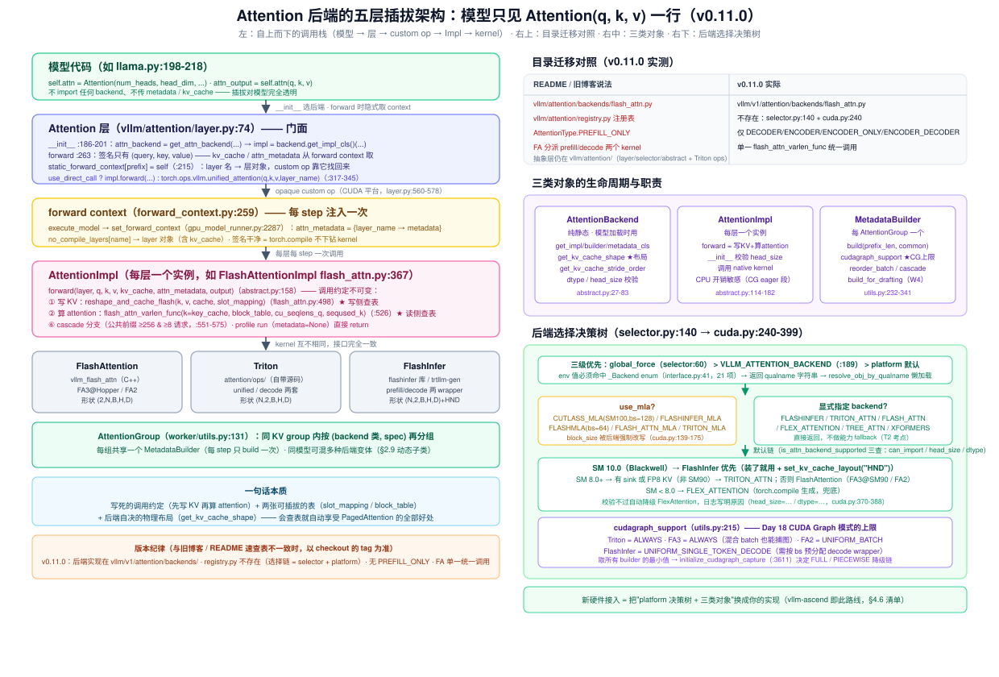
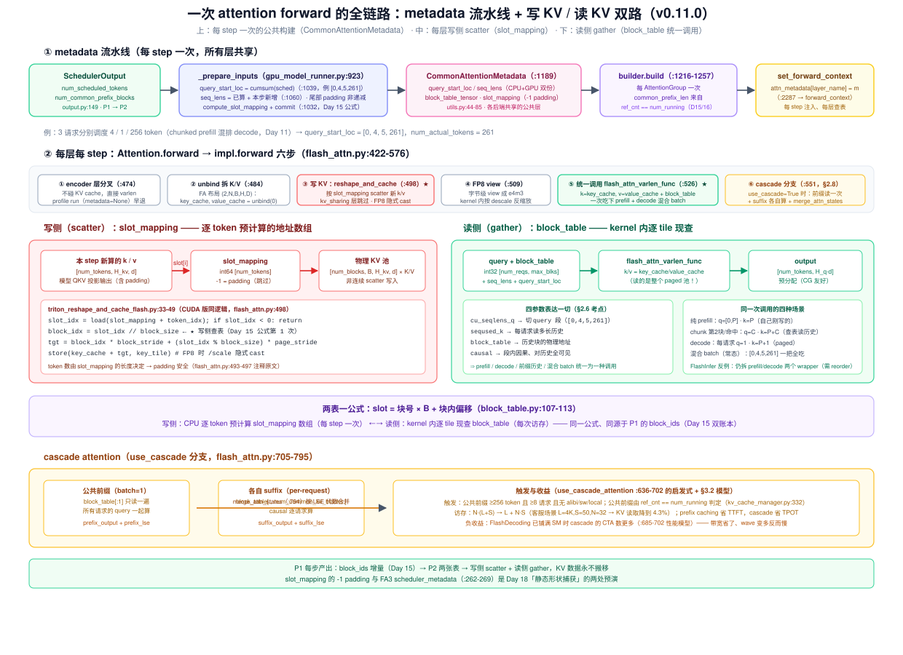
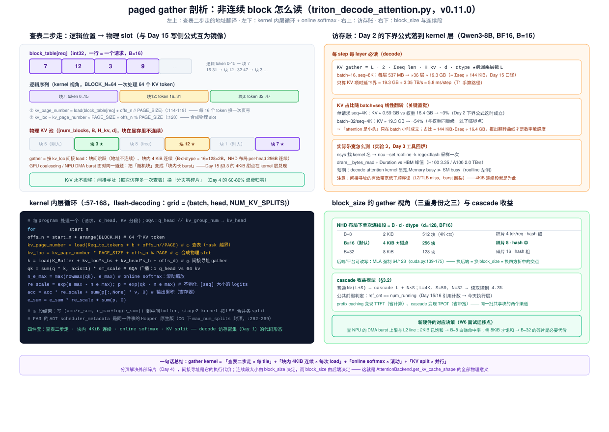

# Day 17 · Attention 后端抽象——插拔机制、paged gather 与新硬件接入清单

> **系列**：推理系统优化专家岗 · 56 天打卡 | 第 3 周「vLLM V1 源码精读（下）—— KV 管理与执行」
> **今日位置**：Day 15 把 KV 的**元数据层**（块池/双账本/slot_mapping）读完了，Day 16 把**缓存层**（hash 链/COW/命中率）读完了。今天跨过进程边界走进**执行层**：P2 的 GPUModelRunner 每 step 拿到 block table 增量之后，**谁来写 KV、谁来读 KV、怎么读非连续的块**。答案是"Attention 后端"——一套五层抽象（Attention 层 → selector → platform → Backend/Impl/Builder → kernel），让 FlashAttention / FlashInfer / Triton / MLA 全家桶乃至昇腾后端共用同一份模型代码。三条主线：**① 插拔是怎么发生的（模型只见 `Attention(q, k, v)` 一行）；② 一次 forward 里 `slot_mapping`（写侧）与 `block_table`（读侧）的完整生命周期；③ paged gather kernel 的逐行剖析（查表二步走 + online softmax + KV split）**。Day 15 留下的三处伏笔（slot 公式、`get_kv_cache_shape`、block_size 的 gather 粒度）今天全部兑现；产出物《新硬件 backend 接入清单》就是 W6 项目 A（vllm-ascend 贡献）的入场券
> **前置要求**：Day 15（**最重要**：slot = 块号×B+偏移、`[num_blocks,B,H,d]` 张量、`_reshape_kv_cache_tensors` 的 view/permute、block_size 三重身份）、Day 16（block hash 与 ref_cnt 共享——今天的 cascade attention 用 `ref_cnt == num_running` 判公共前缀）、Day 11（chunked prefill：**混合 batch 是常态**这个前提）、Day 2（decode 时延下界 = KV 字节数 ÷ 带宽——今天在 kernel 层兑现）、Day 3（Roofline / ncu：实验 3 回炉）、Day 9（Request 账本组）
> **预计用时**：3 ~ 3.5 小时（源码走读 1.5h + 实验 1~1.5h + 接入清单与产出物 0.5h）
> **背景衔接**：这套抽象本质是**驱动模型（driver model）的推理系统版**——`AttentionBackend` 是"能力描述"（设备能跑什么形状/什么 dtype），`AttentionImpl` 是"每层一次的调用约定"，`AttentionMetadataBuilder` 是"batch 级的参数打包器"，kernel 是"设备固件"。你在昇腾上给一群算子写 tiling 模板（Nz/Nd 布局、对齐约束、burst 合并），对应到 GPU 就是给一个 backend 写 `get_kv_cache_shape`（布局）+ gather kernel（间接寻址）。两个直接可迁移的经验：① **写侧 scatter 与读侧 gather 是同一张表的两次查表**（slot_mapping 与 block_table 都源于 P1 的 block_ids，公式互为镜像）——你做 L1 偏移表时"一表两用"的技巧在这里是系统级设计；② `block_size × head_dim × dtype = 4 KiB` 的连续段是 gather 的 DMA burst 甜点（Day 15 已算过），**新硬件接入时 block_size 该取几，取决于你的搬运引擎喜欢多大连续段**——这正好是你 W6 选题时能讲出区分度的地方
> **实验环境**：实验 0/1（决策树 dry-run + mini gather 仿真器）**无 GPU 可完成**；实验 2/3 复用 Day 6 的 1 × H100/A100 + Qwen3-8B（FlashInfer 后端需 `pip install flashinfer-python`；4090 无 FA3，对比结论按卡型标注）
> **配套材料**：`week3/README.md` Day 17 节；三张 SVG：`assets/day17_backend_abstraction_layers.svg`（今日主图：五层插拔架构 + 目录迁移对照 + 选择决策树）、`assets/day17_forward_dataflow.svg`（一次 forward 全链路：metadata 构建 → forward context → 写 KV/读 KV 双路）、`assets/day17_paged_gather.svg`（非连续 gather 剖析：查表二步走 + online softmax + 访存账——产出物的底稿）
> **版本口径**：源码坐标按 **v0.11.0 tag** 逐行核对（2026-10 复核），与 Day 8/9/11/12/15 一致。⚠️ **四处与本仓库 week3/README.md 速查表、旧博客不一致，以 tag 为准**：① 后端实现已从 `vllm/attention/backends/` 迁到 **`vllm/v1/attention/backends/`**（`vllm/attention/` 只剩抽象层 `layer.py`/`selector.py`/`backends/abstract.py` 与 Triton ops）；② **`vllm/attention/registry.py` 不存在**——注册与选择是 `selector.py:get_attn_backend` + `current_platform.get_attn_backend_cls`（返回 qualname 字符串再动态 import）；③ `AttentionType` 只有 DECODER / ENCODER / ENCODER_ONLY / ENCODER_DECODER 四种（**没有** PREFILL_ONLY，MTP draft 层复用 DECODER）；④ v0.11.0 的 FlashAttention 后端**不再分派 prefill/decode 两个 kernel**——单一 `flash_attn_varlen_func` 统一调用同时吃混合 batch（§2.6，这是与所有旧文章差异最大的一处）。引用前先 `git log --oneline -3` 记版本

---

## 0. 今日学习目标

完成今天的学习后，你应该能够：

- [ ] **画出五层插拔架构图**（闭卷）：`Attention`（layer.py:74）→ `get_attn_backend`（selector.py:140）→ `Platform.get_attn_backend_cls`（cuda.py:240）→ `AttentionBackend`（静态描述）/`AttentionImpl`（每层实例）→ kernel，并说清"模型代码只 import `Attention`、后端对模型完全透明"是怎么做到的（§2.2，图 1）
- [ ] **背出选择优先级与 CUDA 默认决策树**：global force > `VLLM_ATTENTION_BACKEND` > platform 默认；默认链 = SM100 优先 FlashInfer(HND) → SM80+ 用 FlashAttention → 有 sink/FP8 KV 且非 SM90 → Triton → 老卡 FlexAttention；head_size/dtype 不符自动 fallback（§2.3）
- [ ] **解释后端为什么决定物理布局**：`get_kv_cache_shape` 的三种返回（FA `(2,N,B,H,D)` vs Triton/FlashInfer `(N,2,B,H,D)`）+ `get_kv_cache_stride_order` 的 NHD/HND permute，与 Day 15 `_reshape_kv_cache_tensors` 的 view/permute 对上（§2.4）
- [ ] **走完一次 forward 的 metadata 流水线**：`_prepare_inputs` 构建 `CommonAttentionMetadata`（query_start_loc 的 cumsum、slot_mapping 的 -1 padding）→ 每个 `AttentionGroup` 一次 `builder.build()` → `set_forward_context` 塞进 forward context → `attn_metadata[layer_name]` 逐层取用（§2.5，图 2 上）
- [ ] **逐行讲出 `FlashAttentionImpl.forward` 六步**（flash_attn.py:422-576）：encoder 分支 → unbind → `reshape_and_cache_flash` 写 KV → FP8 view → **单一 `flash_attn_varlen_func` 统一调用**（cu_seqlens_q + seqused_k + block_table 三参数如何同时表达 prefill/decode/前缀历史）→ cascade 分支（§2.6）
- [ ] **逐行讲出 paged gather 的内层循环**（triton_decode_attention.py:112-127）：查表拿页号 → `kv_loc = 页号×PAGE_SIZE + 页内偏移` → 间接寻址 load，配 online softmax（e_max/e_sum/re_scale）与 KV split；并解释它与写侧 slot_mapping 公式的镜像关系（§2.7，图 3）
- [ ] **算出 decode gather 的访存账**：每 step 每层读 `2·Σseq_len·H_kv·d·dtype` 字节 → 与 Day 2 的"decode 时延下界"公式在 kernel 层对上；cascade 为什么能把公共前缀的读放大从 N 倍降到 1 倍（§3.1/§3.2）
- [ ] 交付：**后端抽象分层图笔记**（带源码行号）+ **《新硬件 backend 接入清单》一页**（v0.11.0 接口实测版，W6 Day 36 直接当 checklist）+ **三后端对比实验数据表**（§9）

---

## 1. 核心概念速览

| 概念 | 一句话定义 | 今日要达到的深度 |
|---|---|---|
| **`Attention`**（layer.py:74） | 模型代码唯一 import 的层：`self.attn(q, k, v)`（llama.py:218）就是全部调用 | 知道 forward 签名里**没有** kv_cache/attn_metadata——都从 forward context 隐式取（为 torch.compile/CG 服务） |
| **`AttentionType`**（abstract.py:12-24） | 层的语义角色：DECODER / ENCODER / ENCODER_ONLY / ENCODER_DECODER | ⚠️ v0.11.0 **没有** PREFILL_ONLY；encoder 层不碰 KV cache（flash_attn.py:474-481） |
| **`get_attn_backend`**（selector.py:140） | 后端选择总入口：三级优先（global force > env var > platform 默认），`@cache` 去重 | 能背出 env var 传入后的完整链：`_Backend` enum → `get_attn_backend_cls` 返回 qualname → `resolve_obj_by_qualname`（:166-213） |
| **`_Backend` enum**（platforms/interface.py:41-62） | 21 个后端枚举值，`VLLM_ATTENTION_BACKEND` 的合法取值域 | 记住主力六个：FLASH_ATTN / FLASHINFER / TRITON_ATTN / FLEX_ATTENTION / TORCH_SDPA / TREE_ATTN + MLA 家族五个 |
| **`get_attn_backend_cls`**（cuda.py:240-399） | 平台决策树：MLA 五选一；非 MLA 按 SM 代数/特性选默认 | 能画出 §2.3 的决策树；知道 FA3 只在 Hopper（fa_utils.py:36-49） |
| **`AttentionBackend`**（abstract.py:27-83） | **静态能力描述**：get_name / get_impl_cls / get_builder_cls / get_kv_cache_shape / get_kv_cache_stride_order + dtype/head_size 校验 | 这是新硬件接入要实现的第一张契约（§4.1） |
| **`AttentionImpl`**（abstract.py:114-182） | **每层一个实例**：`forward(layer, q, k, v, kv_cache, attn_metadata, output)` = 写 KV + 算 attention | 知道 `__init__` 时就完成 head_size 校验（flash_attn.py:405）；forward 里的 CPU 开销警告（:462-469）是 Day 18/19 的伏笔 |
| **`AttentionMetadataBuilder`**（utils.py:232-341） | **batch 级**：`build(common_prefix_len, CommonAttentionMetadata)` 产出后端专属 metadata | 知道三个可覆盖点：`cudagraph_support`、`reorder_batch`、`use_cascade_attention`；`build_for_drafting` 是 W4 伏笔 |
| **`CommonAttentionMetadata`**（utils.py:44-85） | 各后端共享的 batch 级元数据：query_start_loc / seq_lens / block_table_tensor / slot_mapping（CPU+GPU 双份） | 能说出它是 v0.11.0 "metadata 统一重构"的产物——builder 只做增量翻译，不再各自算 cumsum |
| **`AttentionGroup`**（worker/utils.py:131-167） | 同 group 内按 (backend 类, kv_cache_spec) 再分组，每组共享一个 builder | 理解为什么同模型可以混多种 backend（chunked local 层 vs 普通层，§2.9） |
| **`AttentionCGSupport`**（utils.py:215-229） | 后端对 CUDA Graph 的支持等级：ALWAYS / UNIFORM_BATCH / UNIFORM_SINGLE_TOKEN_DECODE / NEVER | 记住三家：Triton=ALWAYS、FA3=ALWAYS、FA2=UNIFORM_BATCH、FlashInfer=UNIFORM_SINGLE_TOKEN_DECODE → Day 18 降级链的输入 |
| **`get_kv_cache_shape`** | 后端声明的 KV cache 逻辑形状：FA `(2,N,B,H,D)`；Triton/FlashInfer `(N,2,B,H,D)`；MLA 各不同 | 这是"**换后端 = 换物理布局**"的直接证据（Day 15 §2.3 的兑现） |
| **`get_kv_cache_stride_order`** | 布局微调：NHD `(0,1,2,3,4)` vs HND `(0,1,3,2,4)`——交换 B 与 H_kv 维的物理顺序 | 理解"逻辑形状不变、物理顺序变"——HND 让 head 维更连续（Blackwell/trtllm-gen 偏好） |
| **`slot_mapping`（写侧）** | batch 内第 i 个 token 的 KV 写到哪个物理槽：`slot = 块号×B + 块内偏移`（Day 15 :107-113） | 写 KV 由 `reshape_and_cache_flash` 按 slot_mapping scatter（flash_attn.py:498） |
| **`block_table`（读侧）** | attention 计算时每序列去哪读历史 KV：`[num_reqs, max_blocks_per_req]` int32 | gather kernel 逐 tile 查表读非连续块——**KV 永不搬移**（§2.7） |
| **`reshape_and_cache_flash`** | 写 KV 算子：把本 step 新算的 k/v 按 slot_mapping scatter 进 paged buffer（CUDA op 或 Triton 版） | 知道它用 slot_mapping 的**长度**决定 token 数，padding 不用切（flash_attn.py:493-497） |
| **`flash_attn_varlen_func` 统一调用** | v0.11.0 FA 的唯一 attention 入口：cu_seqlens_q + seqused_k + block_table 一次吃下混合 batch | ⚠️ 与旧文章差异最大处：不再有 prefill/decode 两个分派分支（§2.6） |
| **cascade attention** | 公共前缀只读一次（batch=1）+ 各自 suffix，再 `merge_attn_states` 合并 | 触发阈值：前缀 ≥256 且 ≥8 个请求；`ref_cnt == num_running` 判公共前缀（kv_cache_manager.py:332） |
| **forward context**（forward_context.py:259） | 每 step 的隐式传参通道：`attn_metadata: {layer_name → metadata}` + `no_compile_layers` | 理解它为什么存在：签名干净 → torch.compile 把 attention 当 opaque op（layer.py:331/344） |
| **`subclass_attention_backend`**（utils.py:708-718） | 元编程包 builder：换 metadata 不换 kernel（ChunkedLocal / FastPrefill 都用它） | 新硬件接入的"组合技"：一个底层 backend 派生多个变体（§2.9） |

> **一句话本质**：Attention 后端抽象 = **一份写死的调用约定（Impl.forward：先写 KV 再算 attention）+ 两张可插拔的表（写侧 slot_mapping、读侧 block_table）+ 一个后端自决的物理布局（get_kv_cache_shape）**。模型代码、调度器、KV 管理器都不需要知道底下是 FlashAttention 还是昇腾算子——**只要你的 kernel 会查表，PagedAttention 的全部好处（Day 4 的 60-80% 浪费归零）就自动归你**。

---

## 2. 原理深入讲解

### 2.1 回顾与今日地图：从"账本"到"执行"

Day 15/16 读的是 P1 的元数据世界；今天的入口是 Day 15 §2.5 结尾那句话——"P2 侧最终把逻辑位置翻译成物理 slot 喂给 kernel"。三处伏笔今天全部兑现：

| Day 15/16 的伏笔 | 今日兑现处 |
|---|---|
| `slot = block_table[row, pos÷B]×B + pos mod B`（block_table.py:107-113）"paged attention 一切非连续 gather 的源头" | §2.7 gather kernel 的查表二步走——**同一公式的读取侧** |
| "具体由 attention 后端的 `get_kv_cache_shape` 决定——Day 17 细讲"（§2.3） | §2.4 三种形状 + NHD/HND permute |
| block_size 三重身份之三："gather tile 粒度，4 KiB 在 DMA burst 甜点区"（§3.3） | §3.3 的访存账 + 新硬件 block_size 决策 |
| Day 16：`ref_cnt` 共享、`get_num_common_prefix_blocks`（kv_cache_manager.py:332） | §2.8 cascade attention 的公共前缀判定 |

本周路线中今天的位置：Day 15/16 是"KV 管理核心①"（分配侧），Day 17-19 是"执行核心②"——今天讲**执行层的接口与算子**，Day 18 讲 CUDA Graph（`cudagraph_support` 今天见过就懂），Day 19 讲调度与执行重叠（`builder.build` 的 CPU 开销今天先记账）。

### 2.2 五层抽象：插拔是怎么发生的（图 1）



先给证据——模型代码到底"看到"了什么。Llama 的 attention 模块（llama.py:198-218）：

```python
self.attn = Attention(                      # ← 模型唯一 import 的 attention 类
    self.num_heads, self.head_dim, self.scaling,
    num_kv_heads=self.num_kv_heads, cache_config=cache_config, ...)
...
def forward(self, positions, hidden_states):
    qkv, _ = self.qkv_proj(hidden_states)
    q, k, v = qkv.split([self.q_size, self.kv_size, self.kv_size], dim=-1)
    q, k = self.rotary_emb(positions, q, k)
    attn_output = self.attn(q, k, v)        # ← llama.py:218，就这一行
    output, _ = self.o_proj(attn_output)
```

没有 backend 参数、没有 metadata 参数、没有 kv_cache 参数。**插拔的全部魔法在 `Attention.__init__` 里**（layer.py:186-201）：

```python
if attn_backend is None:
    self.attn_backend = get_attn_backend(     # selector.py:140 → 平台决策
        head_size, dtype, kv_cache_dtype, block_size,
        use_mla=use_mla, has_sink=self.has_sink, use_sparse=use_sparse)
else:
    self.attn_backend = attn_backend          # 显式指定（ChunkedLocal 等，§2.9）

impl_cls = self.attn_backend.get_impl_cls()   # 静态方法 → Impl 类
self.impl = impl_cls(num_heads, head_size, scale, num_kv_heads, ...,
                     attn_type, kv_sharing_target_layer_name)  # 每层一个实例
```

再把五层职责钉死（图 1 左侧栈，自上而下）：

| 层 | 文件:行 | 生命周期 | 职责一句话 |
|---|---|---|---|
| ① `Attention` 层 | vllm/attention/layer.py:74 | 每层一个 | 门面：持有 impl/kv_cache/scale；把 q/k/v 转给 custom op |
| ② selector | vllm/attention/selector.py:140 | 模型加载时、`@cache` | 三级优先级选 backend，产出 qualname 字符串 |
| ③ platform | vllm/platforms/cuda.py:240 | 同上 | **决策树**：MLA 家族 / SM 代数 / 特性 → 具体后端类 |
| ④ `AttentionBackend` | vllm/attention/backends/abstract.py:27 | 纯静态 | 能力描述：impl/builder/metadata 类名 + **KV cache 形状** + dtype/head_size 校验 |
| ④′ `AttentionImpl` | 各后端文件 | 每层一个实例 | `forward` = 写 KV + 调 kernel |
| ⑤ `AttentionMetadataBuilder` | vllm/v1/attention/backends/utils.py:232 | 每 AttentionGroup 一个 | batch 级：把 CommonAttentionMetadata 翻译成本后端格式 |

**关键机制一：forward context 隐式传参**。`Attention.forward`（layer.py:263-345）的签名只有 `(query, key, value, output_shape=None)`——kv_cache 和 attn_metadata 从哪来？答案在 forward context：

```python
def forward(self, query, key, value, output_shape=None):
    ...
    if self.use_direct_call:                    # 非 CUDA 平台：直接调
        forward_context = get_forward_context()
        attn_metadata = forward_context.attn_metadata
        if isinstance(attn_metadata, dict):
            attn_metadata = attn_metadata[self.layer_name]     # ★ 逐层查表
        self_kv_cache = self.kv_cache[forward_context.virtual_engine]
        return self.impl.forward(self, query, key, value,
                                 self_kv_cache, attn_metadata)
    else:                                        # CUDA 类平台：包成 opaque custom op
        return torch.ops.vllm.unified_attention(query, key, value, self.layer_name)
```

`unified_attention`（layer.py:560-578）内部做同样的事：`forward_context.no_compile_layers[layer_name]` 拿回 layer 对象 → 拿 kv_cache 与 impl → 调 forward。**为什么绕这一圈**：CUDA 平台 `opaque_attention_op()` 返回 True（cuda.py:411），把 attention 注册成**一整个 opaque custom op**，torch.compile 就不会试图拆解它（kernel 是 CUDA C++/Triton，拆了也编不动，反而引入 graph 断点）。签名干净 + 全局 context = **模型代码零感知 + 编译器零感知**，一个设计同时伺候两个主人。

**关键机制二：AttentionGroup**。`initialize_attn_backend`（gpu_model_runner.py:3538-3609）在启动时按 `(backend full_cls_name, kv_cache_spec)` 把同 group 的层再分组——于是**同一个模型可以同时跑多种后端变体**（如 Qwen3-Next 的 chunked-local 层用动态子类后端、普通层用 FA，§2.9），每组一个共享的 metadata builder（每 step 只 build 一次，§2.5）。

> ⚠️ **目录迁移对照**（与 week3/README.md 速查表、旧博客不一致，以 v0.11.0 为准）：
>
> | README/旧博客说法 | v0.11.0 实际 |
> |---|---|
> | 后端都在 `vllm/attention/backends/` | 抽象留在 `vllm/attention/`（layer/selector/abstract），**实现全部在 `vllm/v1/attention/backends/`**（flash_attn/flashinfer/triton_attn/mla/…），Triton kernel 在 `vllm/attention/ops/` |
> | `vllm/attention/registry.py` 注册表 | **不存在**。选择链 = selector.py + platforms/cuda.py；没有 enum→builder 的注册装饰器，平台直接返回 qualname 字符串 |
> | AttentionType 有 PREFILL_ONLY | 没有（abstract.py:12-24），MTP draft 层是 DECODER |
> | FA 分派 prefill(varlen)/decode(paged) 两个 kernel | v0.11.0 单一 `flash_attn_varlen_func`（§2.6） |

### 2.3 后端选择：从 `VLLM_ATTENTION_BACKEND` 到最终类名

选择链三级优先（selector.py:166-213，`@cache` 保证全进程只选一次）：

1. **global force**（`global_force_attn_backend`，:60）——测试/内部用途，优先级最高；
2. **环境变量 `VLLM_ATTENTION_BACKEND`**（:189-204）——必须命中 `_Backend` enum（platforms/interface.py:41-62），否则 ValueError 列出全部合法值；`XXX_VLLM_V1` 后缀已废弃（:192-199，V0 删除后不再需要）；
3. **platform 默认**——`current_platform.get_attn_backend_cls(...)`（:207-213）返回 **qualname 字符串**（如 `"vllm.v1.attention.backends.flash_attn.FlashAttentionBackend"`），`resolve_obj_by_qualname` 懒加载——**避免 import 环**（platform 模块不能 import 后端模块）。

CUDA 平台的默认决策树（cuda.py:240-399，图 1 右下）：

```
use_mla? ──是──> CUTLASS_MLA(SM100, bs=128) / FLASHINFER_MLA(SM100, bs∈{32,64})
                 / FLASHMLA(bs=64) / FLASH_ATTN_MLA / TRITON_MLA（按 selected_backend 与卡型）
   │否
   ▼
selected_backend 显式指定? ──是──> FLASHINFER / FLEX_ATTENTION / TRITON_ATTN /
   │否（默认）                        FLASH_ATTN / TREE_ATTN / XFORMERS 直接返回
   ▼
SM 10.0（Blackwell）: FlashInfer 可导入 → 用它，并 set_kv_cache_layout("HND")
SM 8.0+            : 有 sink 或 FP8 KV（且非 SM90）→ TRITON_ATTN
                      否则 FA 可支持 → FLASH_ATTN
SM < 8.0           : FLEX_ATTENTION（torch.compile 生成，兜底）
```

两个容易忽略的细节：

- **默认也会做能力校验再 fallback**：`is_attn_backend_supported`（selector.py:93-137）查三件事——`can_import`（库装没装）、`head_size`（FA 只支持 [32,64,96,128,160,192,224,256]，flash_attn.py:47-48；FlashInfer 只支持 [64,128,256]，flashinfer.py:152-155）、`dtype`。校验不过 → 降级 FlexAttention（cuda.py:370-388，错误信息里会写明是 head_size 还是 dtype 不符）。**这就是"backend 报不支持某模型"的机制层答案**（面试 Q5）。
- **FA 版本由卡型决定**（fa_utils.py:23-63）：SM90（Hopper）→ FA3，其他 → FA2；Blackwell 强制 FA2（FA3 不支持）。FA3 才支持 FP8 KV（:66-68）、才支持 sink；这直接决定了 §2.8 的 `cudagraph_support` 差异。

对照昇腾：`vllm-ascend` 仓库做的事，就是把③这层换成 NPUPlatform 的决策树（返回自己的 backend qualname），①②④⑤ 照抄接口——**平台层是唯一"认识硬件"的地方**，这正是分层的目的。

### 2.4 后端决定物理布局：`get_kv_cache_shape` 与 stride_order（Day 15 的兑现）

Day 15 §2.3 读过 `_reshape_kv_cache_tensors`（gpu_model_runner.py:3797）：先按字节整块 `torch.zeros(int8)`，再 `view(dtype).view(shape).permute(*inv_order)`。当时留了两个问题——shape 谁定？permute 什么？今天拆开：

```python
# gpu_model_runner.py:3806-3838（节选）
kv_cache_shape = attn_backend.get_kv_cache_shape(   # ★ 后端说了算
    num_blocks, kv_cache_spec.block_size,
    kv_cache_spec.num_kv_heads, kv_cache_spec.head_size,
    cache_dtype_str=self.cache_config.cache_dtype)
kv_cache_stride_order = attn_backend.get_kv_cache_stride_order()  # 布局微调
kv_cache_shape = tuple(kv_cache_shape[i] for i in kv_cache_stride_order)  # 物理序
inv_order = [kv_cache_stride_order.index(i) for i in range(len(...))]
kv_caches[layer_name] = raw.view(dtype).view(kv_cache_shape).permute(*inv_order)
```

三个后端的"形状主张"对比（**必背**，面试可直接写）：

| 后端 | `get_kv_cache_shape` 返回 | K/V 在哪维 | 出处 |
|---|---|---|---|
| FlashAttention | `(2, num_blocks, block_size, H_kv, d)` | 第 0 维（`kv_cache.unbind(0)`） | flash_attn.py:77-87 |
| Triton | `(num_blocks, 2, block_size, H_kv, d)` | 第 1 维（`unbind(1)`） | triton_attn.py:168-178 |
| FlashInfer | `(num_blocks, 2, block_size, H_kv, d)` | 第 1 维 | flashinfer.py:184-192 |

注意三家都要求 `block_size % 16 == 0`（否则 raise）。**逻辑形状描述"语义"，物理顺序由 stride_order 描述"摆放"**：

- `NHD`（默认）：`(0,1,2,3,4)` 恒等——token 维（N）连续靠前，`[slot] → [B 内 token][head][dim]`，一块 K 的头 0 是 `block_size×d` 连续字节；
- `HND`：`(0,1,3,2,4)`——交换 block_size 与 H_kv 维，让**同一个 head 的整块连续**（`[slot] → [head][B 内 token][dim]`）。Blackwell 上 FlashInfer/trtllm-gen kernel 偏好这种（cuda.py:335-356 默认开启时会 `set_kv_cache_layout("HND")`）。

这块的物理意义（衔接你的 DMA 经验）：同一份字节、同一段显存，**两种摆放决定 gather kernel 的合并访存模式**——NHD 对"一次读多个 token 同一 head"友好（decode 单 token 逐 head 读），HND 对"一个 head 连续处理整块"友好（tensor core 分块加载）。跟你昇腾上 Nz vs Nd 格式选型（矩阵搬运对齐方式）是同一道题，只是决策权从算子作者上移到了 backend 接口。

**block_size 也由后端/平台改写**：CUDA 默认 16（cuda.py:127-128）；MLA 路径强制 FlashMLA→64、CutlassMLA→128、FlashInferMLA→{32,64}（cuda.py:139-175，Day 15 §3.3 已见）——**换后端 = 换 block_size = 换 hash 粒度 + 换碎片率 + 换 gather 连续段**，这是四方折中在接口层的落点。

### 2.5 metadata 流水线：CommonAttentionMetadata → builder.build → forward context（图 2 上）



v0.11.0 把"每 step 的 attention 元数据"收敛成两级结构：**公共层算一次，后端层做翻译**。

**第一级（公共层）**：`_prepare_inputs`（gpu_model_runner.py:923）后半段构建 `CommonAttentionMetadata`（:1189-1208）：

```python
common_attn_metadata = CommonAttentionMetadata(
    query_start_loc=query_start_loc,       # [num_reqs+1] cumsum：每请求 query 起点前缀和
    query_start_loc_cpu=query_start_loc_cpu,
    seq_lens=seq_lens,                     # [num_reqs] 每请求总长（含历史 + 本步新增）
    seq_lens_cpu=seq_lens_cpu,
    num_computed_tokens_cpu=...,           # [num_reqs] 历史已算 token 数
    num_reqs=num_reqs, num_actual_tokens=total_num_scheduled_tokens,
    max_query_len=..., max_seq_len=...,
    block_table_tensor=blk_table_tensor,   # ★ Day 15 的 P2 张量账本（读侧）
    slot_mapping=slot_mapping,             # ★ Day 15 的 slot 公式（写侧）
    causal=True, ...)
```

构建细节两个（都是考点）：

- **query_start_loc 是 varlen 的核心**：`np.cumsum(num_scheduled_tokens)`（:821/:1039-1040），例：3 个请求各调 4/1/256 token → `[0,4,5,261]`。kernel 不需要 padding 到最长序列，**一个 batch 里 prefill 的 256 token 和 decode 的 1 token 混排**（Day 11 chunked prefill 的混合 batch 在这里落地为数据结构）。尾部用 `cu_num_tokens[-1]` 填充保持非递减（:1043，FA kernel 要求）。
- **slot_mapping 的 -1 padding**：`blk_table.slot_mapping.gpu[total:] .fill_(-1)`（:1166-1167，`PAD_SLOT_ID=-1`，utils.py:37）——full CUDA Graph 模式下 buffer 是按 max 尺寸静态分配的，写 KV kernel 见 -1 直接跳过（triton_reshape_and_cache_flash.py:35-37 的 `if slot_idx < 0: return`）。**这行是 Day 18"静态形状"主题的预演**。

**第二级（后端层）**：对每个 `AttentionGroup` 调一次 `builder.build(common_prefix_len, common_attn_metadata)`（:1216-1257），产出后端专属 metadata（如 `FlashAttentionMetadata`），然后**逐层挂进 dict**：`attn_metadata[layer_name] = attn_metadata_i`（:1257）——同 group 的层共享同一份（36 层 Qwen3 只有 1 个 group，每 step 只 build 一次）。

`common_prefix_len` 是 cascade 的开关量：来自 `SchedulerOutput.num_common_prefix_blocks[group]`（output.py:149），而它在 P1 由 `KVCacheManager.get_num_common_prefix_blocks`（kv_cache_manager.py:332-373）算出——**遍历任一 running 请求的块表，`ref_cnt == num_running_requests` 的就是全批公共前缀**。Day 15 的引用计数、Day 16 的共享前缀，在这里接上了今天的执行层。

**第三级（注入）**：`execute_model`（gpu_model_runner.py:2231）里 `set_forward_context(attn_metadata, ...)`（:2287-2294）把整个 dict 挂进全局 forward context → 模型 forward → 每层 `Attention.forward` → `attn_metadata[self.layer_name]` 取自己的那份（layer.py:320-321）。**每 step 一次构建、每层一次查表**——这就是 36 层共享一份 metadata 的流水线。

### 2.6 `FlashAttentionImpl.forward` 全景：写 KV + 一次统一调用（图 2 下）

v0.11.0 的 FA forward（flash_attn.py:422-576）可以拆成六步：

```python
def forward(self, layer, query, key, value, kv_cache, attn_metadata, output, ...):
    assert output is not None                    # accept_output_buffer=True（:39）
    if attn_metadata is None:                    # profile run（Day 15 实验 0 的 dummy forward）
        return output

    # ① encoder 层不碰 KV cache，直接 varlen（:474-481）
    if attn_type in (ENCODER_ONLY, ENCODER):
        return self._forward_encoder_attention(...)

    # ② 拆 K/V：FA 布局第 0 维是 2（§2.4）
    key_cache, value_cache = kv_cache.unbind(0)  # :484

    # ③ 写 KV：按 slot_mapping scatter（:498-507）
    reshape_and_cache_flash(key, value, key_cache, value_cache,
                            attn_metadata.slot_mapping,      # ★ 写侧查表
                            self.kv_cache_dtype, layer._k_scale, layer._v_scale)
    #    （kv_sharing 层跳过：共享目标层已写过，:489-490）

    # ④ FP8 KV：字节级 view 成 e4m3，kernel 里按 descale 反缩放（:509-514）
    if self.kv_cache_dtype.startswith("fp8"):
        key_cache = key_cache.view(torch.float8_e4m3fn); value_cache = ...

    # ⑤ 统一 attention 调用：一次吃下 prefill + decode 混合 batch（:526-548）
    flash_attn_varlen_func(
        q=query[:num_actual_tokens],
        k=key_cache, v=value_cache,              # ★ 不是新 k/v，是整个 paged cache！
        out=output[:num_actual_tokens],
        cu_seqlens_q=attn_metadata.query_start_loc,   # 每请求 query 段
        seqused_k=attn_metadata.seq_lens,             # 每请求读多长的历史
        max_seqlen_q=..., max_seqlen_k=...,
        causal=attn_metadata.causal,
        block_table=attn_metadata.block_table,        # ★ 读侧查表
        scheduler_metadata=...,                # FA3 AOT 调度（CG 模式，Day 18）
        q_descale/k_descale/v_descale=...,     # FP8 缩放因子
        s_aux=self.sinks)                      # attention sink（FA3 only）
    return output

    # ⑥ cascade 分支（use_cascade=True 时走 :551-575，§2.8）
```

**第 ⑤ 步是理解 v0.11.0 的钥匙**，务必想透三个参数怎么表达所有场景：

| 场景 | query_start_loc 给出 | seq_lens 给出 | kernel 行为 |
|---|---|---|---|
| 纯 prefill（无前缀历史） | `[0, P]` | `[P]` | 对自己刚 scatter 进 cache 的 P 个 token 做 causal attention |
| chunked prefill 第 2 块 / prefix 命中 | `[0, C]` | `[P + C]` | query 是新 C 个 token；**K/V 直接从 cache 读 P 个历史块**（block_table）+ 自己写的 C 个 |
| decode | `[i, i+1) 每请求 1 token` | `[P+1]` | 每请求 1 query 对全部历史——paged decode |
| 混合 batch（常态） | `[0, 4, 5, 261]` | `[...]` | 同一次调用内逐段处理，causal mask 自动区分"段内因果 + 对历史全可见" |

一句话：**`cu_seqlens_q` 切 query 段，`seqused_k` 圈历史范围，`block_table` 解析物理地址，`causal` 保证段内不对未来可见**——四个参数合起来，prefill/decode/混合/前缀历史全部统一成"varlen + paged KV"一种调用。这就是与旧文章"分派 prefill(varlen)/decode(paged) kernel"叙事的本质差异（v0.10 及之前是两个分支两个 kernel 入口）。收益不只是代码简洁：**混合 batch 不再需要把 decode 请求单独凑一个 batch**，调度器怎么混排（Day 11）kernel 就怎么吃。

Triton 后端同理（triton_attn.py:339-359 也叫 `unified_attention`，但那是 Triton kernel `kernel_unified_attention_2d`，attention/ops/triton_unified_attention.py:52——grid 是 `(q_blocks, kv_heads)` 二维，kernel 内用 `find_seq_idx` 二分 query_start_loc 定位请求，:33-48）。**FlashInfer 是反例**：它仍把 batch 显式拆成 prefill/decode 两段（`prefill_wrapper.run` / `decode_wrapper.run`，flashinfer.py:880-990），因此需要 `reorder_batch` 把 decode 请求排到前面（`reorder_batch_threshold=1`，:255；reorder 用最少 swap，utils.py:774-834）。三家三种风格，接口不约束内部实现——这正是抽象的价值（对比表见 §2.7 末）。

### 2.7 paged gather kernel：非连续 block 怎么读（图 3，今日核心）



"KV 永不搬移，靠间接寻址读非连续内存"（Day 4 论文的代码落点）到底长什么样？最好的教材是 vLLM 自带的 Triton decode kernel（`vllm/attention/ops/triton_decode_attention.py`，源自 SGLang/LightLLM 一系，注释完整、无黑盒）。它的 stage1 主循环（:57-168）把 paged gather 拆得干干净净：

```python
# 每个 program 处理一个 (batch, q_head, kv_split)：grid=(batch, head_num, NUM_KV_SPLITS)
cur_batch = tl.program_id(0); cur_head = tl.program_id(1); split_kv_id = tl.program_id(2)
...
for start_n in range(split_kv_start, split_kv_end, BLOCK_N):   # BLOCK_N=64：一次 64 个 KV token
    offs_n = start_n + tl.arange(0, BLOCK_N)
    # ── 查表二步走（与 Day 15 写侧 slot 公式完全镜像）──────────────
    kv_page_number = tl.load(                                  # ① 查 block_table 拿页号
        Req_to_tokens + cur_batch_req_idx * stride + offs_n // PAGE_SIZE,
        mask=offs_n < split_kv_end, other=0)
    kv_loc = kv_page_number * PAGE_SIZE + offs_n % PAGE_SIZE   # ② 合成物理 slot
    # ── 间接寻址 gather：k/v 散在各块，靠 kv_loc 索引拼起来 ─────────
    k = tl.load(K_Buffer + kv_loc[:, None] * stride_buf_kbs
                        + cur_kv_head * stride_buf_kh + offs_d[None, :], ...)
    qk = tl.sum(q[None, :] * k, 1) * sm_scale                  # GQA：q_head 对 kv_head 广播
    # ── online softmax（flash 精神）：边扫边缩放，不需要整行 logits ──
    n_e_max = tl.maximum(tl.max(qk, 0), e_max)
    re_scale = tl.exp(e_max - n_e_max)
    p = tl.exp(qk - n_e_max)
    acc *= re_scale; acc += tl.sum(p[:, None] * v, 0)          # 输出累积
    e_sum = e_sum * re_scale + tl.sum(p, 0)
    e_max = n_e_max
```

四个层次的理解：

1. **查表二步走是 PagedAttention 的全部秘密**：`逻辑 token 位置 n → block_table[req][n÷B] → 物理位置 = 页号×B + n mod B`。对照 Day 15 的写侧 `slot = block_table[row, pos÷B]×B + pos mod B`（block_table.py:107-113）——**写侧在 CPU 上逐 token 算好 slot_mapping 数组，读侧在 kernel 内逐 tile 现查 block_table**；公式一模一样，只是发生的位置和频率不同（写侧每 step 一次预计算，读侧每次访存都查）。面试画图就画这一行。
2. **块内连续、块间跳跃**：一次 `tl.load` 的 64 个 token 通常跨 4~5 个 block（B=16），每个 block 内 `B×d×dtype = 16×128×2 = 4 KiB` 连续（NHD 布局下 head 粒度 256 B 连续、head 间 stride 固定）。GPU 的 coalescing/预取器和 NPU 的 DMA burst 面对的是同一个问题：**把"随机块"变成"块内长 burst"**。这也是 Day 15 §3.3 说 4 KiB 是甜点的 kernel 层含义——B=8 会让连续段减半，B=32 翻倍但内部碎片加倍。
3. **online softmax**：`acc/e_max/e_sum` 的滚动更新（:144-151）让 kernel 只需 O(BLOCK_DV) 寄存器而非 O(seq_len) 显存——这是 flash attention "不物化 attention matrix"的核心（Day 1 的 softmax 分块思想在 decode kernel 的体现）。
4. **KV split = flash-decoding**：长序列时一个 program 扫全部 KV 会饿死并行度，所以第 3 个 grid 维把 KV 切成 `NUM_KV_SPLITS` 段并行，各段输出部分 `(acc, lse)`，stage2 kernel 再合并（`merge_attn_states` 同款逻辑）。**split 数是 metadata/launch 时决定的**——Triton 版在 builder 里按 seq_len 算；FA3 的 AOT `scheduler_metadata`（§2.6 第 ⑤ 步参数）是同一件事的 Hopper 原生版（`get_scheduler_metadata`，flash_attn.py:271-294，CG 模式下 `max_num_splits` 封顶防中间 buffer 爆炸，:262-269）。

三后端分派风格对比（§2.6 的收口，面试 Q1 的素材）：

| | FlashAttention | Triton | FlashInfer |
|---|---|---|---|
| attention 入口 | 单一 `flash_attn_varlen_func`（混合 batch 一次吃） | 单一 Triton `unified_attention` kernel（二分定位请求） | prefill/decode 两个 wrapper 各跑各的（需 reorder batch） |
| kernel 来源 | vLLM 内嵌 flash-attention（C++/CUDA） | vLLM 自带 Triton 源码 | flashinfer 库 / trtllm-gen |
| KV 形状 | `(2,N,B,H,D)` | `(N,2,B,H,D)` | `(N,2,B,H,D)` + HND permute |
| head_size | 32~256（8 档） | ≥32 | {64,128,256} |
| `cudagraph_support` | FA3=ALWAYS / FA2=UNIFORM_BATCH | ALWAYS | UNIFORM_SINGLE_TOKEN_DECODE |
| 写 KV 算子 | `_C_cache_ops.reshape_and_cache_flash`（CUDA） | `triton_reshape_and_cache_flash`（Triton，逻辑同款） | 同 FA 的 CUDA op |

### 2.8 cascade attention：共享前缀的带宽优化（Day 16 的直接延伸）

§2.5 说过 `common_prefix_len` 怎么来（`ref_cnt == num_running` 的块数 × B）。当它 > 0 时 FA 走 cascade 分支（flash_attn.py:551-575 → :705-795）：

```
普通路径：  每个请求各读一遍公共前缀 → N 请求 × L_prefix 字节
cascade：   ① batch=1 一次算所有 query 对前缀的 attention（block_table[:1]）
           ② 每请求只对自己的 suffix 做 attention（block_table[:, num_common_kv_blocks:]）
           ③ merge_attn_states 按 LSE 合并两段（:794，softmax 的代数合并）
```

是否启用由 `use_cascade_attention`（:636-702）的启发式决定，**这个函数本身就是一份小型性能模型**，值得读注释：① 前缀 < 256 token 不值得（省的带宽太少）；② < 8 个请求不值得；③ 已用 FlashDecoding（GQA+全 decode）时要对比 CTA 数——cascade 的 CTA = `num_heads × cdiv(tokens,128)`×前缀 tile 波数 vs FlashDecoding 的 CTA = `num_reqs × num_kv_heads × 前缀 tile 数`，谁少用谁（:685-702）。**这是"用性能模型在两个 kernel 策略间选择"的完整样本**——W6 做算子选型分析时可以直接套这个方法论。

访存收益（§3.2 详算）：N 个请求共享 L 前缀，普通路径读 `N·L`、cascade 读 `L + Σ(suffix)`——prefix caching（省计算）与 cascade（省带宽）是**同一份共享块的两个变现渠道**，前者吃 TTFT、后者吃 TPOT。

### 2.9 组合的艺术：动态子类 backend（元编程层）

最后一块拼图：`subclass_attention_backend`（utils.py:708-718）——用 `type()` 动态造一个"只换 builder"的后端子类。两个内置用户：

- **ChunkedLocalAttention**（attention/layers/chunked_local_attention.py:19-46，Qwen3-Next 类模型）：builder 里先把 `CommonAttentionMetadata` 变换成"局部注意力虚拟 batch"（`make_local_attention_virtual_batches`，utils.py:503-642——把长序列按 attn_chunk_size 切成多个虚拟请求、block_table 同步切片），**底层 kernel 完全复用 FA**，只是把它"骗"进局部窗口；代价是 `cudagraph_support = NEVER`（:37-39）。
- **FastPrefill**（`create_fast_prefill_custom_backend`，utils.py:894-940，KV sharing 模型）：builder 里把 query 过滤成"只算 logits 位置的 token"，prefill 算力直降。

这个模式对新硬件接入的启示：**变体需求优先考虑"包 builder"而不是"fork backend"**——metadata 翻译层的复用粒度，比 kernel 层细得多。vllm-ascend 的 `AscendAttentionBackend` 体系同样可以从一个基础 backend 派生 sliding-window/本地注意力变体。

---

## 3. 性能模型与复杂度：今日的数学

### 3.1 decode gather 的访存账：把 Day 2 的下界落到 kernel 层（图 3 右）

Day 2 背过：decode 单 token 理论时延下界 ≈ 每 step 必读字节数 ÷ HBM 带宽。今天把分子拆到 attention kernel（Qwen3-8B，BF16，B=16，H_kv=8，d=128）：

| 每 step 必读 | 公式 | 量级（Qwen3-8B） |
|---|---|---|
| KV gather（K+V，**全部 36 层**） | `L · 2 · Σseq_len · H_kv · d · dtype`（= Σseq × 144 KiB，Day 15 每 token 全层） | 每**层** 537 MB @ batch=32/seq=4K → ×36 层 ≈ **19.3 GB** |
| Q / O | `batch · H_q · d · 2 · dtype` × 层数 | ≈ 19 MB（可忽略） |
| block_table | `Σseq_len ÷ B × 4B` × 层数 | ≈ 1.2 MB（可忽略） |
| 权重（每 step 全读，batch 共享） | 参数量 × dtype | 16.4 GB（Day 2 已算） |

三个结论（**先把账算对，再说直觉**——最常见的错点是漏乘层数）：① KV gather 占比 = `144 KiB × Σseq ÷ 16.4 GB`，**单请求 seq=4K 时 ≈ 3%**（Day 2"参数/带宽"下界公式这时成立）；但它是**随 batch×seq 线性增长的唯一大项**——batch=32/seq=4K 时 KV ≈ 19.3 GB、与权重同量级（占比 ~54%），seq=32K/batch=32 时 ≈ 154 GB、KV 绝对主导（TPOT 下界 ≈ 46 ms）。**"attention 是小头"只在 batch 小时成立**，面试报出 3% → 54% 这条随 batch 翻转的曲线，才是数字敏感度；② 这也解释了为什么长上下文 + 大 batch 是 FA3/FlashInfer 拉开差距的战场（实验 2 会看到），以及为什么 decode 要靠 continuous batching 摊薄权重（Day 5 吞吐曲线的机制层）；③ **间接寻址的代价不在字节数，在访存模式**——非连续 gather 的有效带宽低于顺序读（L2/TLB miss、burst 断裂），这正是 §2.7 说"块内 4 KiB 连续是甜点"的原因。ncu 里看 `dram__bytes_read` 与 kernel 时长算实际带宽，对照 HBM 峰值就是这行的实证（实验 3）。

### 3.2 cascade 的收益模型

N 个请求共享长 L 的前缀（如同一系统提示词 + few-shot）、各自 suffix 均长 S：

```
普通：  bytes_read ≈ N × (L + S) × unit
cascade：bytes_read ≈ (L + N×S) × unit        （前缀只读一次）
节省比 = N·L / (N·(L+S))，当 S≪L 时趋近 100%，当 L≪S 时趋近 0
```

代入：客服场景 L=4K、S=50、N=32 → 普通读 32×4050=129.6K unit，cascade 读 4K+1.6K=5.6K unit，**KV 读取降到 4.3%**——配合 §2.8 的阈值（≥256、≥8），这就是 cache-aware routing（W5 Day 34）能把共享前缀请求聚到同实例的量化理由。注意 CTA 模型（§2.8 ③）：请求多到 FlashDecoding 本身已铺满 SM 时，cascade 的收益被并行度差异吃掉——**带宽省了、wave 数变多，反而慢**，这是"优化要看两级资源"（带宽 + SM）的标准案例。

### 3.3 block_size 的 gather 视角：三重身份之三的最终版

Day 15 §3.3 留下的最后一块：gather tile 粒度。NHD 布局下一次连续段 = `B × d × dtype`（per head）：

| B | 连续段（d=128, BF16） | 块数（4K ctx） | 内部碎片 | hash 粒度 |
|---|---|---|---|---|
| 8 | 2 KiB | 512 | 4 tok/req | 细（命中率高） |
| **16（默认）** | **4 KiB** | 256 | 8 tok/req | 中 |
| 32 | 8 KiB | 128 | 16 tok/req | 粗 |

GPU 经验值：≥ 2 KiB 的连续段基本能把 DRAM burst 与 L2 line 吃满；4 KiB 是"三重身份"的交点。**新硬件的对应决策**：查你 NPU 的 DMA burst 上限与 L2 line 大小——若 2 KiB 已饱和带宽，B=8 换来的碎片/命中率收益是白赚的；若需要 8 KiB 才饱和（如某些片上共享内存粒度大的架构），B=32 的碎片代价就必须付。**这就是"block_size 由后端/平台决定"（§2.4）的完整推导链**——W6 面试时把这条链讲出来，就是"从昇腾 tiling 经验到 GPU 系统设计"的迁移样本。

### 3.4 练手对账题（答案见 §8）

1. Qwen3-8B（36 层、H_kv=8、d=128、BF16）、batch=16、平均 seq=8K，decode 每 step 的 KV gather 总字节数是多少？占 H100（3.35TB/s）理论时延的多少 ms（只算 KV 项）？
2. FlashInfer 后端跑 head_dim=96 的模型会怎样？完整 fallback 链是？（提示：§2.3 的三查 + cuda.py:370-388）
3. 同一实例上把 `--block-size` 从 16 改成 8：block_table 行数、slot_mapping 长度、kernel 单次连续段、prefix 命中粒度各怎么变？（对照 §3.3 表）

---

## 4. 关键代码走读（v0.11.0 逐行核对版）

> 建议按 §2 的顺序跳读：`abstract.py`（契约）→ `layer.py`（forward 路径）→ `selector.py` + `platforms/cuda.py`（选择）→ `flash_attn.py`（主后端）→ `triton_decode_attention.py`（gather 内循环）→ `gpu_model_runner.py` 三段（:923/:3538/:3797）。attention 目录几乎每个 minor 版本都动，**行号以 v0.11.0 为锚、以类/方法名为准**。

### 4.1 `abstract.py`：接口即文档（新硬件接入的第一张契约）

四个静态方法 + 两个校验类方法就是 `AttentionBackend` 的全部契约（abstract.py:27-83）：

| 成员 | 签名 | 你要回答的问题 |
|---|---|---|
| `get_name()` | `→ str` | 与 `_Backend` enum 名一致（`"FLASH_ATTN"`） |
| `get_impl_cls()` / `get_metadata_cls()` / `get_builder_cls()` | `→ type` | 三个类名 |
| `get_kv_cache_shape(num_blocks, block_size, H_kv, d, cache_dtype_str)` | `→ tuple[int,...]` | **你的硬件喜欢什么布局**（§2.4） |
| `get_kv_cache_stride_order()` | `→ tuple[int,...]` | NHD/HND 或自定（可不实现，runner 会兜底 identity，gpu_model_runner.py:3818-3824） |
| `get_supported_dtypes()` / `get_supported_head_sizes()`（或 `validate_head_size`） | `→ list` | 能力校验，selector 的 fallback 依据 |

类属性两个：`accept_output_buffer`（True 则 runner 预分配 output、CG 友好，layer.py:211/297-302）与 `supports_quant_query_input`（FP8 query 在 layer 层量化、可被 torch.compile 融合，layer.py:256-261——W4 量化专题回接）。`AttentionImpl.forward` 的完整签名（abstract.py:158-171）注意两个可选参数 `output_scale/output_block_scale`：FP8/FP4 输出量化融合的挂点（FlashInfer 的 `fused_output_quant_supported`，flashinfer.py:740-744——同样 W4 伏笔）。

### 4.2 `flash_attn.py`：六步 forward 的两处必读注释

除了 §2.6 的代码，两段注释值得原文读：① :462-469 "With piece-wise CUDA graphs, this method is executed in eager-mode... `view` and `slice` are surprisingly slow"——**piecewise CG 下这段 Python 每 step 都要跑**，作者明令少写 PyTorch op（Day 18 的 pre-hook）；② :493-497 "we don't need `key[:num_actual_tokens]` because reshape_and_cache uses slot_mapping's shape"——写 KV 的 token 数由 slot_mapping 长度决定，padding 安全。

### 4.3 `triton_reshape_and_cache_flash.py`：写侧 scatter 的最小实现

175 行的小文件，是"写侧查表"的最佳读物（attention/ops/triton_reshape_and_cache_flash.py:10-87）：

```python
token_idx = tl.program_id(0)                 # grid=(num_tokens, cdiv(H*d, TILE))
slot_idx = tl.load(slot_mapping_ptr + token_idx)
if slot_idx < 0: return                      # padding（§2.5 的 -1）
block_idx = slot_idx // block_size           # ★ 与读侧 §2.7 互为镜像
block_offset = slot_idx % block_size
tgt_idx = block_idx * block_stride + block_offset * page_stride
tl.store(key_cache_ptr + tgt_idx + tile_pos, key_tile, ...)   # FP8 时 store 隐式 cast + /scale
```

TILE_SIZE 启发式（:139-147）：`min(2048, next_pow2(H_kv·d))`，SM<9 时压到 512——**Triton 后端用自己这份实现而不用 CUDA op**，就是为了让无 flash-attn 二进制的环境也能跑通（写侧逻辑两家等价，§2.7 表末行）。

### 4.4 selector + platform：选择链的最后一块

selector.py:166-213 的 `@cache` 有个注释值得注意：env 值在 `get_attn_backend` 里读、显式传参给私有函数（:150-153）——避免 lru_cache 缓存住过期的 env 快照。cuda.py:240-399 走读时拿张纸把 §2.3 的决策树抄一遍，注意六处 `logger.info_once`（FlashInfer :312/:337、Triton :322/:361、Flash Attention :325/:366，显式分支与默认分支各三处）——**实验 2 的"确认选择"就用 grep 这些日志**。

### 4.5 调用链速查表（今日总账）

| 时机 | 调用链 | 行号锚点 |
|---|---|---|
| 模型加载 | `LlamaAttention.__init__` → `Attention.__init__` → `get_attn_backend` → `current_platform.get_attn_backend_cls` → `resolve_obj_by_qualname` → `impl_cls(...)` | llama.py:198 / layer.py:187 / selector.py:207 / cuda.py:240 |
| 启动（Day 15 已学） | `_allocate_kv_cache_tensors` → `_reshape_kv_cache_tensors`（get_kv_cache_shape + stride_order）→ `initialize_attn_backend`（AttentionGroup 分组）→ `bind_kv_cache`（layer.kv_cache = [tensor]） | gpu_model_runner.py:3758/3797/3538 / worker/utils.py:265 |
| 每 step（metadata） | `_prepare_inputs`（query_start_loc/seq_lens/slot_mapping）→ 每 AttentionGroup `builder.build(common_prefix_len, common)` → `attn_metadata[layer_name]=…` → `execute_model` → `set_forward_context` | gpu_model_runner.py:1039/1189/1216-1257/2287 |
| 每层每 step | `Attention.forward` → `torch.ops.vllm.unified_attention`（或 direct call）→ `impl.forward` → ①`reshape_and_cache_flash`（slot_mapping）②`flash_attn_varlen_func`（block_table） | layer.py:263/560 / flash_attn.py:498/526 |
| capture（Day 18 预演） | `_dummy_run` → `builder.build_for_cudagraph_capture`（如 Triton 的 seq_lens.fill_(1)） | gpu_model_runner.py:2897/3079-3082 / triton_attn.py:79-87 |

### 4.6 写作业：新硬件 backend 接入清单（v0.11.0 接口实测版）

> 这就是 README 说的"W6 Day 36 的 checklist"。按依赖顺序六步，每步给"验收标准"——对着 vllm-ascend 的 PR 逐条打勾就是选题调研。

**① `AttentionBackend` 子类**（能力声明）
- 必须实现：`get_name` / `get_impl_cls` / `get_metadata_cls` / `get_builder_cls` / **`get_kv_cache_shape`**
- **`get_kv_cache_shape` 是你最有发言权的地方**（§2.4）：哪个维度连续能让你的搬运引擎合并成大 burst？NPU 上通常回答"head 维内联 + token 维跨块"（NHD）或整块 per-head（HND）；`block_size` 若需非 16，连 platform 的默认值一起改
- 可选：`get_kv_cache_stride_order`（布局微调）、`accept_output_buffer=True`（CG 友好，强烈建议）、`supports_quant_query_input`（FP8）
- 验收：`is_attn_backend_supported`（selector.py:93）三查通过；`get_supported_dtypes` / `validate_head_size` 与你的 kernel 真实能力一致（**宁可校验严格也别让 fallback 链失灵**）

**② `AttentionImpl` 子类**（每层一次的调用）
- `__init__`：head_size 校验、FA 版本类的能力断言（参照 flash_attn.py:405-420）
- `forward(layer, q, k, v, kv_cache, attn_metadata, output)`：**先写 KV（slot_mapping scatter）再算 attention（block_table gather）**——调用约定不可变；attention 部分委托你的 native 算子（昇腾：torch_npu 的 flash attention / 自研 paged attention）
- 硬约束：`attn_metadata is None` 时直接 return（profile run，Day 15）；kv_sharing 层跳过写 KV（:489）
- 验收：`tests/v1/attention/test_attention_backends.py` 的 golden 对比通过（固定 seed 对照参考实现）

**③ `AttentionMetadataBuilder` 子类**（batch 级翻译）
- `__init__(kv_cache_spec, layer_names, vllm_config, device)`：预分配持久 buffer（CG 需要，参照 FlashInfer 的 per-bs decode wrapper，flashinfer.py:367-407）
- `build(common_prefix_len, common_attn_metadata)`：把公共 metadata 翻译成你算子的参数（昇腾侧：tiling 参数、block 索引数组、split 数）
- 类属性三选一：`cudagraph_support`（**决定 Day 18 的 CG 模式上限**，ALWAYS 最优）、`reorder_batch_threshold`（需要 prefill/decode 分离时设 1）、覆盖 `use_cascade_attention`（有 cascade kernel 才覆盖）
- 验收：`_update_attention_metadata`（gpu_model_runner.py:1216-1257）不改一行就能跑你的 builder

**④ Platform 接入**（选择与默认值）
- 独立仓库模式（vllm-ascend 路线）：实现 platform 的 `get_attn_backend_cls` 决策树（对照 cuda.py:240 写你自己的：按 NPU 型号/特性选默认后端）+ `opaque_attention_op()` 返回值（决定 attention 是否被包成 custom op）+ `device_check_and_config` 里的 block_size 默认值
- 验收：`VLLM_ATTENTION_BACKEND=你的名字` 能强制选中；不设时默认决策正确并打 `info_once` 日志

**⑤ 特性声明对上层功能的传导**（容易被忽略的一步）
- `cudagraph_support` → `initialize_cudagraph_capture` 的降级链（gpu_model_runner.py:3611-3660）：NEVER 会把 FULL 降成 PIECEWISE 甚至 NONE——**你的 CG 支持等级直接改写用户的 TPOT**
- head_size/dtype 校验 → selector fallback 到 FlexAttention（功能可用但性能差）
- impl 层参数（sliding_window / logits_soft_cap / sinks）不支持时要在 `__init__` raise，别静默错算

**⑥ 测试与基准**
- 单测：`tests/v1/attention/`（golden + selection 两个套件）
- 基线：改前先量化（Day 37 的纪律）——`vllm bench serve` 起数据，TPOT/TTFT 按 Day 5 口径记录

---

## 5. 动手实验（约 60~90 分钟）

### 实验 0（必做，15 min；无 GPU）：决策树 dry-run + 目录寻宝

1. **目录迁移验证**：在安装了 vllm 的环境（或 GitHub tag v0.11.0）里：
   ```bash
   python - <<'EOF'
   import vllm.attention as A, inspect
   print(A.Attention, A.get_attn_backend)          # 抽象层在 vllm/attention/
   from vllm.v1.attention.backends import flash_attn, triton_attn, flashinfer
   print(inspect.getsourcefile(flash_attn))        # 实现在 vllm/v1/attention/backends/
   from vllm.platforms.interface import _Backend
   print(list(_Backend.__members__))               # VLLM_ATTENTION_BACKEND 合法值
   EOF
   ```
   对照 §2.2 的迁移表，把"README 速查表 → 实际路径"的四行更正写进笔记。
2. **决策树推演**（纸面）：分别推"H100 + head_dim=128 + BF16"、"H100 + FP8 KV cache"、"4090 + head_dim=96"、"B200 + flashinfer 已装/未装"四种配置的默认后端与 fallback 链，再读 cuda.py:240-399 对答案。

### 实验 1（必做，30 min；无 GPU）：mini paged gather 仿真器——写侧/读侧镜像验证

用 ~60 行纯 Python 复刻"写侧 scatter + 读侧 gather"，**亲眼验证两张表、一个公式**（这也是 Day 20 mini 引擎的 attention 积木）：

```python
# day17_sim.py —— 语义对齐 v0.11.0：slot_mapping（写侧）与 block_table 查表（读侧）
import numpy as np
B, N_blocks, H, d = 16, 8, 2, 4          # block_size=16、8 个物理块、2 KV head、dim=4

def slot_mapping(block_table, pos):       # Day 15 block_table.py:107-113
    return block_table[pos // B] * B + pos % B

# P1 调度结果：请求 r0 拿到块 [3,1,7]，r1 拿到 [2,5]（Day 15 的 allocate 产物）
reqs = {"r0": ([3, 1, 7], 40), "r1": ([2, 5], 20)}   # (block_table 行, 总 token 数)
pool = np.zeros((N_blocks, B, H, d))                  # 物理 KV 池（单层）

# ── 写侧：本 step r0 新增 30~39 共 10 个 token 的 K，按 slot_mapping scatter ──
for pos in range(30, 40):
    slot = slot_mapping(reqs["r0"][0], pos)           # 公式第 1 次：写侧
    pool[slot // B, slot % B, 0] = f"K_r0[{pos}]"     # reshape_and_cache_flash 同款

# ── 读侧：attention 要读 r0 全部 40 个历史 token，kernel 内逐 tile 查表 gather ──
gathered = []
for tile_start in range(0, 40, B):                    # BLOCK_N = B（§2.7 内层循环）
    page = reqs["r0"][0][tile_start // B]             # ① 查表拿页号
    for j in range(B):                                # ② 页内偏移 → kv_loc
        kv_loc = page * B + j                         # 公式第 2 次：读侧（镜像！）
        if tile_start + j < 40:
            gathered.append(pool[kv_loc // B, kv_loc % B, 0, 0])
print("r0 的 40 个 K 按 gather 序：", gathered)
assert "K_r0[39]" in str(gathered[-1])                # 刚写的第 39 个 token 立即可读
print("块内连续段（head 0, 一块）：", B * d * 2, "bytes/2head =", B * d * H * 2, "B")  # §3.3 的 4KiB 缩影
```

跑完后回答三个问题（写进笔记）：① 写侧公式与读侧公式为什么可以相同？（都是"逻辑位置→物理 slot"，只是调用方与频率不同）；② 若 r0、r1 共享前缀块 2（ref_cnt=2，Day 16），gather 时会发生几次对块 2 的读？cascade 打开呢？（N 次 vs 1 次，§3.2）；③ 把 B 改成 8，`pool` 形状、gather 连续段、`reqs` 行宽各怎么变？

### 实验 2（GPU，30 min）：三后端 bench + 选择确认

```bash
pip install flashinfer-python -q        # FlashInfer 可选；装不上就跑两家并记录
for BE in FLASH_ATTN TRITON_ATTN FLASHINFER; do
  VLLM_ATTENTION_BACKEND=$BE vllm serve Qwen/Qwen3-8B --gpu-memory-utilization 0.9 \
      2>&1 | tee day17_$BE.log &
  sleep 90    # 等就绪后跑两组压测（复用 Day 6 脚本）：
  #   短上下文：sharegpt 原样（输入 ~200 tok，并发 32）
  #   长上下文：构造 32K 输入（--max-model-len 40960），并发 8
  #   记录：TTFT p99 / TPOT p99 / 吞吐；grep -E "Using.*backend" day17_$BE.log 确认选择
  pkill -f "vllm serve"; sleep 20
done
```

观察点（填进 §9 产出③ 的表）：① 三家日志里的 `Using Flash Attention/Triton/FlashInfer backend on V1 engine`（显式分支 cuda.py:312/:322/:325，默认分支 :337/:361/:366）确认 env 生效；② 短上下文（输入 ~200 tok）decode 为主时 KV 占比低（§3.1：单请求 3% 量级）、权重主导，三家差距通常 < 5%；③ 长上下文 + 大 batch 时 KV 占比翻转（batch=32/seq=4K 已达 ~54%），差距拉大（KV gather 占比上升 + FA3/FlashInfer 的 split-kv 调度更优）；④ FA3（H100）注意日志里的 AOT scheduler 与 `VLLM_FLASH_ATTN_MAX_NUM_SPLITS_FOR_CUDA_GRAPH`。⚠️ 不确定处（Blackwell 上 FlashInfer 需 HND、4090 无 FA3）**在表中标注卡型**，别把单卡结论说成普适。

### 实验 3（GPU，可选，20 min）：ncu 看 gather kernel 的真实带宽（Day 3 回炉）

```bash
# 用 LLM 离线推理构造纯 decode 场景，nsys 先拿 kernel 名：
nsys profile -o day17_nsys python -c "
from vllm import LLM, SamplingParams
llm = LLM(model='Qwen/Qwen3-8B', gpu_memory_utilization=0.9)
llm.generate(['长上下文请自行构造到 8K tokens'], SamplingParams(max_tokens=32))"
nsys stats day17_nsys.nsys-rep | grep -iE "flash|reshape|attn"   # 找 kernel 名
# 再对 decode 稳态 kernel 上 ncu（采样一次即可）：
ncu --set roofline -k "regex:flash" --launch-skip 20 --launch-count 1 \
    python day17_decode_bench.py 2>&1 | grep -E "dram|Duration|SM \[|Memory"
```

对照三个数：`dram__bytes_read` ÷ Duration vs HBM 峰值（H100 3.35TB/s、A100 2.0TB/s）；`reshape_and_cache` 的 kernel 名与写侧耗时（它按 slot_mapping 长度工作，§4.3）；SM busy vs Memory busy 的 roofline 判定（Day 3 的 `busy` 指标在真实 decode kernel 上的读数）。**decode attention kernel 应呈现 Memory busy ≫ SM busy**——Day 1"decode 访存密集"的最终实证。

### 常见坑（方法论清单）

- **拿旧博客/README 的路径找代码**：`vllm/attention/backends/flash_attn.py` 在 v0.11.0 是 `vllm/v1/attention/backends/flash_attn.py`；`registry.py` 不存在——先跑实验 0 的目录寻宝再读码。
- **以为 prefill/decode 走两个 kernel 分支**：v0.11.0 FA 是单一 varlen+paged 调用（§2.6 表）；FlashInfer 才是两段式。**读的是哪个版本，先 `git log --oneline -3`**。
- **把 `Attention.forward(q,k,v)` 的"干净签名"当成缺参数**：kv_cache/attn_metadata 在 forward context 里（layer.py:277-281 的 docstring 原文）；改后端时千万别往签名里加参数——会同时破坏 torch.compile 与 CUDA Graph。
- **head_size 不在校验列表里就硬上**：后端 `__init__` 的 validate 是 fallback 链的触发器（§2.3），静默放行会导致 kernel 内越界/错算，比报错难查十倍。
- **实验 2 忘了确认"到底选中了谁"**：env 变量拼错不会报错（会走默认），**每轮必须 grep 日志**里的 `Using ... backend on V1 engine`。

---

## 6. 面试高频问题（含答题骨架）

**Q1：vLLM 怎么实现 attention 后端可插拔？模型代码需要改吗？**
骨架：模型只 import `Attention`，调用就一行 `self.attn(q,k,v)`（llama.py:218）；`__init__` 里 selector 三级优先（global force > env > platform 决策树，selector.py:166）选出 backend → `get_impl_cls()` 造每层 impl；kv_cache/attn_metadata 走 forward context 隐式传参，CUDA 平台再包成 `torch.ops.vllm.unified_attention` opaque op（layer.py:344）。落点：**签名干净同时伺候了插拔与编译器两个主人**；加分项：AttentionGroup 让同模型混多种后端变体（§2.2/§2.9）。

**Q2：一次 attention forward 里 slot_mapping 和 block_table 分别解决什么问题？**
骨架：都是"逻辑位置→物理 slot"的翻译（`块号×B+偏移`），**写侧/读侧各用一次**——slot_mapping 是**逐 token 展开的数组**，`_prepare_inputs` 在 CPU 算好（gpu_model_runner.py:1032），`reshape_and_cache_flash` 按它把新 K/V scatter 进池子（flash_attn.py:498）；block_table 是**每请求一行的块号表**，attention kernel 内逐 tile 现查（§2.7）。落点：两表同源于 P1 的 block_ids 增量（Day 15 双账本）；KV 数据永不搬移。

**Q3：paged attention kernel 怎么读非连续的 KV？（白板题）**
骨架：画三样——block_table 行、散在池里的块、kernel 内层循环：`page = block_table[req][n÷B]`，`kv_loc = page×B + n mod B`，间接 load；块内 `B·d·dtype=4KiB` 连续（coalescing/burst 甜点）；配 online softmax（e_max/e_sum/re_scale）不物化 logits；长序列 KV split + stage2 merge（flash-decoding）。落点：**分页把外部碎片清零（Day 4），代价是每次访存多一次查表**——间接寻址换利用率。

**Q4：为什么 prefill 用 varlen（query_start_loc）而不是 padding 到最长？**
骨架：padding 浪费 = `(max_len − Σlen) × 每 token 计算量`，混合 batch 里 1 token decode 和 4K prefill 同批时浪费 > 99%；varlen 用 cumsum 前缀和 `[0,4,5,261]` 描述边界，kernel 按段处理（FA 的 cu_seqlens_q）。落点：v0.11.0 更进一步——**decode 也并入同一个 varlen 调用**（§2.6 表），混合 batch 零拆分。

**Q5：backend 报"不支持某模型"通常是什么原因？**
骨架：三类——① head_size 不在列表（FA 8 档、FlashInfer 仅 {64,128,256}，§2.7 表）；② dtype 不支持；③ 库没装（can_import）。机制：`is_attn_backend_supported` 三查 → 默认链 fallback FlexAttention（cuda.py:370-388）；显式 env 指定时则直接报错列出合法值。落点：**校验是 fallback 链的触发器，宁可严格**。

**Q6：给一块新 NPU 写 attention 后端，最小工作集是什么？**
骨架：按 §4.6 六步——Backend 子类（**get_kv_cache_shape 是布局话语权**）、Impl 子类（写 KV + 调 native 算子，调用约定不可变）、Builder 子类（翻译 CommonAttentionMetadata、cudagraph_support 定 CG 上限）、Platform（决策树 + block_size 默认）、特性传导（CG 降级链）、测试（golden + selection 套件）。落点：**平台层是唯一认识硬件的地方**；vllm-ascend 就是这套接口的完整实现。

**Q7：cascade attention 什么时候有收益？什么时候负收益？**
骨架：收益 = 公共前缀只读一次（`N·L → L + ΣS`，§3.2）；触发阈值前缀 ≥256、请求 ≥8；负收益场景：① FlashDecoding 已铺满 SM 时 cascade CTA 数更多（:685-702 的性能模型）；② 前缀短/请求少，额外 merge 开销不回本。落点：prefix caching 省计算（TTFT）、cascade 省带宽（TPOT），同一份共享块的两个变现渠道；公共前缀的判定是 `ref_cnt == num_running`（Day 15/16 的引用计数接到今天）。

**Q8：block_size 调大/调小，对 attention 执行层影响什么？**
骨架：三重身份（Day 15）+ 今天的第 3 条落地——gather 连续段 `B·d·dtype`（16→4KiB 甜点）；B=8 连续段减半（burst 效率降）但碎片/hash 粒度减半（命中率升）；B=32 反之。落点：**后端/平台可改写**（MLA 强制 64/128，cuda.py:139-175），"换后端 = 换 block_size"是新硬件接入的真实决策点。

**Q9：v0.11.0 的 FlashAttention 后端和旧版本比，forward 结构有什么演进？为什么？**
骨架：旧版 prefill（varlen）/decode（paged）两分支两 kernel；v0.11.0 单一 `flash_attn_varlen_func`——cu_seqlens_q 切 query 段、seqused_k 圈历史、block_table 解析物理地址、causal 保证段内因果，四参数统一全部场景（§2.6 表）。收益：混合 batch 零拆分（chunked prefill 常态化后调度自由度↑）、metadata/代码路径减半；代价：kernel 必须原生支持"query 段 + paged 历史"混合语义（FA3 支持，FA2 部分、CG 支持降为 UNIFORM_BATCH）。落点：**接口统一是调度策略演进的下游**——先有 Day 11 的统一调度模型，才有 kernel 层的统一调用。

---

## 7. 今日总结

- Attention 后端抽象 = **五层各司其职**：Attention 层（门面，forward 签名只有 q/k/v）→ selector（三级优先）→ platform（决策树，**唯一认识硬件的地方**）→ Backend（静态能力：形状/dtype/head_size/CG 等级）→ Impl（每层：写 KV + 算 attention）+ Builder（每 group：batch 级翻译）；模型代码、编译器、调度器三者零感知。
- **两表一公式贯穿读写两侧**：`slot = 块号×B + 块内偏移`——写侧 slot_mapping 逐 token 预计算（scatter 进池），读侧 block_table 逐 tile kernel 内现查（gather 出池）；KV 数据永不搬移，这就是 PagedAttention 的执行层实现。
- v0.11.0 的 FA 用**单一 varlen+paged 调用**统一 prefill/decode/前缀历史（cu_seqlens_q + seqused_k + block_table + causal 四参数表达一切）；Triton 同理（unified kernel），FlashInfer 仍是两段式（reorder + 两个 wrapper）——接口不约束内部实现。
- paged gather kernel 的四件套：**查表二步走、块内 4KiB 连续、online softmax、KV split**；访存账上 KV gather 占比随 batch×seq 线性增长（单请求 seq=4K ≈ 3% → batch=32/seq=4K ≈ 54% → seq=32K 主导），过了临界点后 attention 就是 TPOT 的大头——长上下文大 batch 是后端差距的主战场。
- **《新硬件 backend 接入清单》六步**（Backend→Impl→Builder→Platform→特性传导→测试）就是 W6 项目 A 的路线图：`get_kv_cache_shape` 是布局话语权，`cudagraph_support` 决定 Day 18 的 CG 模式上限，vllm-ascend 是这套接口的现成参照。

## 8. 今日自测题（先做，再展开答案）

**T1**：§3.4 题 1：KV gather 字节数与理论时延？
> 答：Σseq = 16×8192 = 131,072 token；每 token 每层 KV = 2×8×128×2B = 4 KiB（Day 2/15 口径）；每层 = 131072×4 KiB ≈ 537 MB；**×36 层 ≈ 19.3 GB**（最容易漏的就是乘层数——公式 `L·2·Σseq·H_kv·d·dtype` 的 L）。只算 KV 项的时延下界 = 19.3 GB ÷ 3.35 TB/s ≈ **5.8 ms/step**（TPOT ≥ 5.8 ms）。对照：加上权重 16.4 GB（≈4.9 ms）就是 Day 2 公式在 16×8K 场景的完整展开：总 ≈ 35.7 GB ≈ 10.7 ms——此时 KV:权重 ≈ 54:46，**已经过了"权重主导"的临界点**（§3.1 的翻转曲线）。

**T2**：§3.4 题 2：FlashInfer + head_dim=96 的完整链路？
> 答：`VLLM_ATTENTION_BACKEND=FLASHINFER` 显式指定 → `get_attn_backend_cls` 命中 selected_backend 分支直接返回 FlashInfer（cuda.py:310-313）→ `Attention.__init__` 里 `validate_head_size` raise（flashinfer.py:156-166，96 ∉ {64,128,256}）。**显式指定不做 fallback，直接失败**；若不指定走默认链：H100 SM90 → 先查 FA（支持 96）→ 选中 FA。fallback 到 FlexAttention 只发生在**默认路径**上 FA 校验失败时（cuda.py:370-388）。区分"显式指定即硬约束"与"默认链软降级"是这道题的考点。

**T3**：§3.4 题 3：block_size 16→8 的四项变化？
> 答：① block_table 行宽 ×2（4K ctx 从 256 列变 512 列，int32 显存与每 step 增量流量翻倍）；② slot_mapping 长度不变（逐 token），但公式中 B 换 8；③ kernel 单次连续段 `B·d·dtype` 从 4 KiB 降到 2 KiB（gather burst 效率降，§3.3）；④ hash/命中粒度减半（前缀 100 tok：6 个满块+余 4 → 12 个满块+余 4，Day 16 的"块粒度截断"浪费减少）。落点：四方拉扯，没有免费午餐——**新硬件按 DMA burst 需求选**。

**T4**：`Attention.forward` 的签名里为什么没有 attn_metadata？这样设计的两个受益者是谁？
> 答：通过 `get_forward_context()` 隐式取（layer.py:283/318-321），`set_forward_context` 在 execute_model 里每 step 注入（gpu_model_runner.py:2287）。受益者：① **模型代码**——换后端/换 metadata 类型零改动；② **torch.compile/CUDA Graph**——签名静态 + attention 包成 opaque custom op（`torch.ops.vllm.unified_attention`，layer.py:344），编译器不会试图把 kernel 拆进 graph。代价：全局可变状态（测试要注意 context 栈）。

**T5**：两个请求共享 2K token 前缀（128 块、ref_cnt=2，Day 16 的场景），今天在执行层会发生什么？
> 答：① 调度器算 `get_num_common_prefix_blocks`：公共前缀 128 块（ref_cnt==2 的块，kv_cache_manager.py:332-373）→ `common_prefix_len = 2048 > 0` → builder 置 `use_cascade=True`；② FA 走 cascade：前缀 2048 token 用 block_table[:1] 只读**一次**（batch=1），两请求各自 suffix 再算，`merge_attn_states` 按 LSE 合并（flash_attn.py:741-794）；③ 无 cascade 时两请求各读一遍前缀（§3.2 的 2×→1×）。这就是 Day 16"共享"在 TPOT 上的变现。

**T6**：为什么 Triton 后端的 `cudagraph_support` 能是 ALWAYS，而 FlashInfer 只有 UNIFORM_SINGLE_TOKEN_DECODE？
> 答：Triton 的 unified kernel 天然接受任意 query 段混合（kernel 内二分定位，§2.7），静态形状下 padding 即可 replay；FlashInfer 的 decode wrapper 需要按 batch size 预分配 plan buffer（`_decode_wrappers_cudagraph` 每 bs 一个，flashinfer.py:367-407），且 prefill/decode 两个 wrapper 分开跑，只能对"全 1-token decode"的 batch 捕图。落点：**cudagraph_support 不是"想不想支持"，是 kernel 接口形态决定的**——这直接接到明天 initialize_cudagraph_capture 的降级链（gpu_model_runner.py:3611-3660）。

## 9. 今日产出物

**① 笔记《Attention 后端抽象分层图》**（闭卷重画，图 1 是底稿）：

> 五层：Attention（layer.py:74，forward 只有 q/k/v）→ selector（:140 三级优先）→ platform（cuda.py:240 决策树）
> 三类对象：Backend（静态能力）/ Impl（每层 forward = 写 KV + 算 attention）/ Builder（每 group build 一次）
> 两张表：slot_mapping（写侧，scatter）/ block_table（读侧，gather）；一公式：slot = 块号×B + 偏移
> 一布局：get_kv_cache_shape（FA (2,N,B,H,D) vs Triton/FlashInfer (N,2,B,H,D)）+ NHD/HND stride_order
> 一调用：flash_attn_varlen_func(cu_seqlens_q, seqused_k, block_table, causal) 统一 prefill/decode

**② 《新硬件 backend 接入清单》一页**（§4.6 的六步表格版，W6 Day 36 当 checklist 用）：

> 1. Backend 子类：五个静态方法 + get_kv_cache_shape（布局话语权）+ dtype/head_size 校验（fallback 触发器）
> 2. Impl 子类：forward 先写后读、profile run 早退、kv_sharing 跳写、output buffer 支持
> 3. Builder 子类：build(common_prefix_len, common) + cudagraph_support（CG 上限）+ 持久 buffer
> 4. Platform：get_attn_backend_cls 决策树 + block_size 默认值 + opaque_attention_op
> 5. 特性传导：CG 降级链 / FlexAttention fallback / 不支持的参数要在 __init__ raise
> 6. 测试：tests/v1/attention golden + selection；基线先量化（Day 37 纪律）

**③ 三后端对比实验数据表**（实验 2，填你的数字）：

| 后端 | 卡型/FA 版本 | 短上下文 TPOT p99 | 32K TPOT p99 | 32K TTFT p99 | 吞吐 | 日志确认行 |
|---|---|---|---|---|---|---|
| FLASH_ATTN | ___ | ___ | ___ | ___ | ___ | Using Flash Attention backend |
| TRITON_ATTN | ___ | ___ | ___ | ___ | ___ | Using Triton backend |
| FLASHINFER | ___ | ___ | ___ | ___ | ___ | Using FlashInfer backend |

> 一句话结论模板：在我的卡上，短上下文差距 __%（此时权重主导，验证 §3.1 的低占比段），长上下文差距拉大到 __%（KV 占比翻转，batch=32/seq=4K 时 ~54%），主因是 __（KV gather 占比 / split-kv 调度 / HND 布局）。

## 10. 明日预告（Day 18 · CUDA Graph）

今天两次路过了明天的大门：① `cudagraph_support` 的四级枚举（ALWAYS/UNIFORM_BATCH/UNIFORM_SINGLE_TOKEN_DECODE/NEVER）——明天看它如何在 `initialize_cudagraph_capture`（gpu_model_runner.py:3611）里把 FULL 一路降级到 FULL_AND_PIECEWISE → FULL_DECODE_ONLY → PIECEWISE；② slot_mapping 的 **-1 padding** 与 FA3 的 `scheduler_metadata`/`max_num_splits` 静态化——为什么 decode 必须用 CUDA Graph（每 step 上百个 kernel launch，CPU 发射开销吃掉 GPU），capture 的 batch size bucket 怎么定，full CG 与 piecewise CG 的取舍在哪。实验用 `-O0/-O1/-O3` 对比 TPOT——今天的 `unified_attention` opaque op 正是 piecewise CG 的分割边界。
