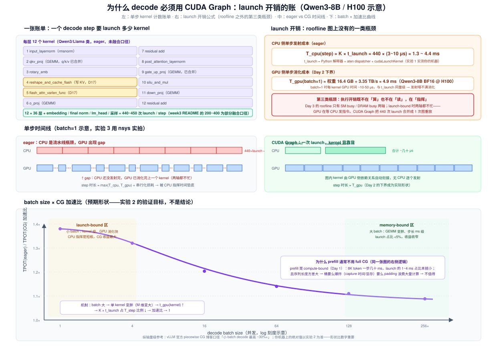
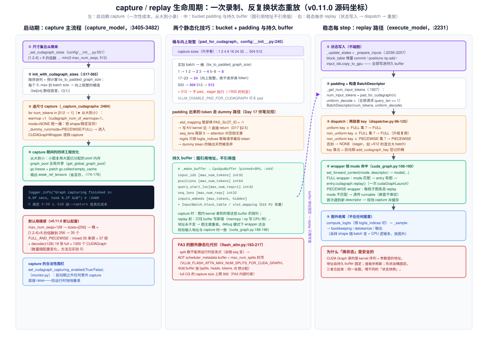
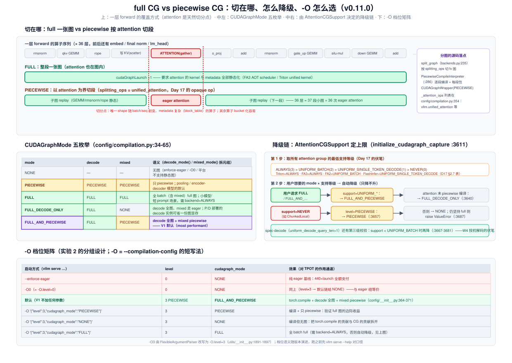

# Day 18 · CUDA Graph —— decode 的 launch 开销、capture/replay 机制与 full vs piecewise 取舍

> **系列**：推理系统优化专家岗 · 56 天打卡 | 第 3 周「vLLM V1 源码精读（下）—— KV 管理与执行」
> **今日位置**：Day 17 把执行层的**算子**读完了（attention 后端、slot_mapping/block_table、gather kernel），结尾埋了两处通往今天的伏笔：`AttentionCGSupport` 四级枚举（ALWAYS/UNIFORM_BATCH/UNIFORM_SINGLE_TOKEN_DECODE/NEVER）和 slot_mapping 的 **-1 padding**。今天回答的是执行层的**另一个问题：kernel 由谁、以什么代价发射**。decode 一步 400+ 个 kernel，eager 模式下 CPU 逐个发射要 1~4 ms，而 batch=1 时 GPU 全部计算只要 ~5 ms——**GPU 在等 CPU 发指令**。CUDA Graph 把整步录成一张图、一次 launch 重放。四条主线：**① launch 开销的定量账单（roofline 之外的第三类瓶颈）；② 三个静态化技巧（bucket+padding / 持久 buffer / 共享 graph pool）；③ full CG vs piecewise CG 的取舍与降级链（`CUDAGraphMode` 五枚举）；④ `-O` 档位 × batch size 的 TPOT 矩阵实测**
> **前置要求**：Day 17（**最重要**：`cudagraph_support` 四级枚举、`unified_attention` opaque op、slot_mapping 的 -1 padding、FA3 的 `scheduler_metadata`——今天全部兑现）、Day 2（decode 时延下界 = 必读字节数 ÷ 带宽：batch=1 时 ≈ 4.9 ms，今天它成为 launch 开销的对照组）、Day 3（Roofline / ncu：今天讲"两轴都不忙"的第三类瓶颈，实验 3 回炉 nsys）、Day 11（chunked prefill：**混合 batch 是常态**——它决定了 full CG 必须支持 mixed 才有用）、Day 15（P2 持久 tensor 账本：block_table/slot_mapping 的"固定地址"语义）、Day 8（EngineCore 独立进程：capture 发生在 Worker 启动期）
> **预计用时**：3 ~ 3.5 小时（源码走读 1.5h + 实验 1~1.5h + 账单手算与产出物 0.5h）
> **背景衔接**：这就是你做了三年的**"控制面慢于数据面时，合并控制流"**。昇腾上 Host 侧算子下发/acl 调用同样有 μs 级开销，等价物是**整图模式下发/计算图下沉**；你的 Fixpipe 无 Queue 手工流水（绕过 TPipe/TQue 抽象、直接管硬事件）本质也是消除框架逐算子调度开销——今天在 GPU 上把这件事定量化：单次 launch 3~10 μs × 每步 440 次 = 1.3~4.4 ms，这个数字决定了一张卡在 batch=1 时的 TPOT 下限。两个直接可迁移的经验：① **bucket + padding ≈ tiling 的"对齐到整块，尾块单独处理"**——用少量计算浪费换路径统一（今天 §3.2 会算这笔浪费账）；② **地址静态是录制的前提**，等价于昇腾多 buffer 乒乓时"地址表固定、数据轮换"——vLLM 的持久 buffer 就是这张地址表。P/D 分离（W5 Day 29）里 decode 实例的 `FULL_DECODE_ONLY` 模式、投机解码（W4 Day 25）里 draft 步变短后 launch 占比上升，今天都是它们的地基
> **实验环境**：实验 0（bucket 推演 + 源码寻宝）**无 GPU 可完成**；实验 1/2/3 复用 Day 6 的 1 × H100/A100 + Qwen3-8B（实验 1 只需任意 CUDA 卡，包括 4090）
> **配套材料**：`week3/README.md` Day 18 节；三张 SVG：`assets/day18_launch_bound_timeline.svg`（今日主图：单步 kernel 计数账单 + launch 开销公式 + eager/CG 时间线 + batch × 加速比曲线）、`assets/day18_capture_replay_lifecycle.svg`（capture/replay 全生命周期：启动期从大到小录 + bucket padding 表 + 持久 buffer + 稳态每步的六步 replay 路径）、`assets/day18_full_vs_piecewise.svg`（full vs piecewise 的切分结构 + CUDAGraphMode 五枚举 + 降级链 + `-O` 档位矩阵）
> **版本口径**：源码坐标按 **v0.11.0 tag** 逐行核对（2026-10 复核），与 Day 8/9/11/12/15/17 一致。⚠️ **三处与 week3/README.md Day 18 节的旧说法不一致，以 tag 为准**：① README 写"`-O1` 默认：torch.compile + piecewise"——v0.11.0 的默认是**不加任何参数**即 level=3（PIECEWISE）+ `FULL_AND_PIECEWISE`（config/__init__.py:334-376），`-O1` 实际是 `DYNAMO_AS_IS`（裸 dynamo，小众用法，实验里不要用它当"默认组"）；② v0.11.0 新增了 `cudagraph_mode` 配置（取代 `use_cudagraph`/`full_cuda_graph` 旧旗标，compilation.py:464-481 的 deprecate 迁移），五枚举语义见 §2.5；③ 默认 `max_num_seqs=128`（scheduler.py:168-169，不是老博客的 1024）→ 默认桶集合是 `[1,2,4]+8 的倍数到 256` 共 **35 个**，不是"到 512"。档位语义随版本演进，跑实验前先 `vllm serve --help` 对口径，引用前 `git log --oneline -3` 记版本

---

## 0. 今日学习目标

完成今天的学习后，你应该能够：

- [ ] **算出 decode 单步的 launch 账单**（闭卷）：Qwen3-8B 每层 12 个 kernel × 36 层 + 头尾 ≈ **440+ 次 launch/step**，eager 下 CPU 发射 1.3~4.4 ms，对照 batch=1 的 GPU 理论下界 ≈ 4.9 ms（Day 2 公式），说清"launch-bound 是 roofline 两轴之外的第三类瓶颈"（§2.2，图 1）
- [ ] **背出三个静态化技巧及其源码落点**：① shape 静态 → bucket + padding（`_set_cudagraph_sizes`、`bs_to_padded_graph_size` 向上取整、`pad_for_cudagraph`）；② 数据可变 → 持久 buffer + replay 前写状态（`_make_buffer` 的 CpuGpuBuffer 家族、"图引用地址不引用值"）；③ 显存爆炸 → 全局共享 graph pool + 从大到小 capture + `weak_ref_tensors`（§2.4，图 2）
- [ ] **画出 full CG vs piecewise CG 的覆盖结构**（白板题）：full = 整个 forward 一张图（attention 也要静态化：FA3 AOT scheduler + `max_num_splits` 封顶）；piecewise = 在 `unified_attention` 处切段（`splitting_ops` = `_attention_ops`），36 层 = 37 段小图 + 36 次 eager attention；并解释**为什么 attention 是天然切分点、为什么 prefill 不值得 full CG**（§2.5，图 3 上）
- [ ] **背出 CUDAGraphMode 五枚举与降级链**：NONE/PIECEWISE/FULL/FULL_DECODE_ONLY/FULL_AND_PIECEWISE（`decode_mode()`/`mixed_mode()` 拆元组）；`initialize_cudagraph_capture`（:3611-3697）怎么按 `AttentionCGSupport` 的最低等级把 FULL 一路降级——Day 17 的四级枚举今天全部兑现（§2.5，图 3 中）
- [ ] **走完稳态 replay 的六步路径**：`_update_states`/`_prepare_inputs` 写 buffer → `_get_num_input_tokens` pad → 构造 `BatchDescriptor` → `CudagraphDispatcher.dispatch` 两级查 key（FULL-uniform → FULL-non-uniform → PIECEWISE → NONE）→ wrapper 命中 `entry.cudagraph.replay()` → 图外 `compute_logits` + `_sample`（§2.6）
- [ ] **估算 capture 成本与 padding 浪费**：默认 35 桶 × (37 段 piecewise + ≤128 的 19 张 full) ≈ 1300 个 CUDAGraph 对象、启动 5~20 s、GiB 级显存；8 步长桶的期望 padding ≈ 3.5 token（§3.2/§3.3）
- [ ] 交付：**《decode 单步 launch 账单》手算笔记**（自己的模型算一遍）+ **`-O` 档位 × batch 的 TPOT 矩阵实验数据** + **full/piecewise 对照表**（§9）

---

## 1. 核心概念速览

| 概念 | 一句话定义 | 今日要达到的深度 |
|---|---|---|
| **kernel launch 开销** | CPU 侧发射一个 kernel 的成本：Python 解释器 + aten dispatcher + `cudaLaunchKernel` ≈ 3~10 μs | 能算账：440 次 × 3~10 μs = 1.3~4.4 ms/step（实验 1 实测你机器的值） |
| **launch-bound** | GPU 计算与访存都不饱和，瓶颈在 CPU 发射速度——roofline 两轴之外的第三类瓶颈 | 知道它只在 **decode 小 batch** 时主导；batch 变大后自然消退（图 1 下） |
| **CUDA Graph** | 把一段 kernel 序列录成图，之后**一次 `cudaGraphLaunch` 重放全部** | 理解录制语义：图记录的是 **kernel 序列 + 参数中的地址**，不记录值 |
| **capture / replay** | 启动期用 dummy 输入录制；稳态每步写状态 + 重放 | 能说出 warmup 的作用（锁 shape、稳定显存分配）与合法性围栏（`validate_cudagraph_capturing_enabled`） |
| **bucket（capture sizes）** | 预录的 batch size 集合；实际 batch **向上取整** pad 到桶值 | 背出默认：`[1,2,4] + 8 的倍数 … min(2·max_num_seqs, 512)`；v0.11.0 默认 max_num_seqs=128 → 35 个桶 |
| **`bs_to_padded_graph_size`** | `[0..max]` → 桶值的查找表（list[int]，O(1) 直查），编译期预计算（compilation.py:553-565） | 会手推：17→24、500→504、>256→不 pad 走 eager |
| **持久 buffer（CpuGpuBuffer）** | `input_ids/positions/query_start_loc/seq_lens/inputs_embeds` + `InputBatch.block_table/slot_mapping`：pinned CPU + GPU 双份、**地址全生命周期固定** | 理解"图引用地址不引用值"：replay 前只写 buffer，图永不重录 |
| **-1 padding（`PAD_SLOT_ID`）** | pad 出来的 token 在 slot_mapping 里填 -1，写 KV kernel 见 -1 直接跳过（Day 17 §2.5） | 今天是"padding 安全性"的证据：dummy token 不污染 KV 池 |
| **graph pool 共享** | 所有图共享一个显存池（`get_global_graph_pool`），配合**从大到小 capture**，小图复用大图的 workspace | 能解释为什么几十张图不会线性爆显存 |
| **`CUDAGraphMode`** | 五枚举：NONE / PIECEWISE / FULL / FULL_DECODE_ONLY=(FULL,NONE) / FULL_AND_PIECEWISE=(FULL,PIECEWISE)（compilation.py:34-65） | 会用 `decode_mode()`/`mixed_mode()` 拆元组读语义（§2.5 表） |
| **`CompilationLevel`** | 0=NO_COMPILATION、1=DYNAMO_AS_IS、2=DYNAMO_ONCE、3=PIECEWISE（compilation.py:26-31） | 记住：**V1 默认 level=3**；`-O3` → `-O.level=3`（utils/__init__.py:1891） |
| **`-O` / `--compilation-config`** | 编译配置的 CLI 入口（arg_utils.py:934），可给数字档位或 JSON | 实验分组的核心旋钮：`-O '{"level":3,"cudagraph_mode":"NONE"}'` 可以**编译但无图** |
| **`CudagraphDispatcher`** | 运行时图选择器：持有 `{PIECEWISE: set, FULL: set}` 两套合法 key，dispatch 两级查找（cudagraph_dispatcher.py:12-125） | 能背查找顺序：FULL(uniform) → FULL(non-uniform) → PIECEWISE(non-uniform) → NONE |
| **`BatchDescriptor`** | 图的 key：`(num_tokens, uniform_decode)`（forward_context.py:31-49） | 理解 `non_uniform` 属性的用途：uniform decode batch 可复用更一般的 non-uniform 图 |
| **`CUDAGraphWrapper`** | 通用录制/重放包装器（cuda_graph.py:43）：mode 匹配则 capture-or-replay，不匹配透传 | 逐段读过 capture（:130-186）与 replay（:198）；debug 模式校验输入地址一致（:188-196） |
| **piecewise CG** | 以 attention 为切分点分段录制：子图重放 + attention eager（splitting_ops 切 fx 图，backends.py:235-379） | 知道 36 层 = 37 段小图、每段一个 CUDAGraphWrapper(PIECEWISE)（:350-373） |
| **`AttentionCGSupport`**（Day 17） | 后端对 full CG 的支持等级：ALWAYS(3) > UNIFORM_BATCH(2) > UNIFORM_SINGLE_TOKEN_DECODE(1) > NEVER(0) | 今天它是**降级链的输入**：FA3/Triton=ALWAYS、FA2=UNIFORM_BATCH、FlashInfer=UNIFORM_SINGLE_TOKEN_DECODE |
| **`build_for_cudagraph_capture`** | 各后端为 capture 构造"安全的静态 metadata"：Triton 把 `seq_lens.fill_(1)`（triton_attn.py:79-87） | 理解妙处：录图时 metadata 只要**形状对**，真值 replay 前刷新 |
| **AOT `scheduler_metadata`** | FA3 的 KV split 预调度表：full CG 下 split 数不能随 seq 变 → buffer 化 + `max_num_splits` 封顶（flash_attn.py:193-217） | 知道代价：capture size 上限 992、中间 buffer 按 splits 预分配 |
| **`--enforce-eager`** | 关掉编译与所有图（level=0 + cudagraph_mode=NONE，config/__init__.py:379-383） | 实验对照基线：launch 开销全额支付 |

> **一句话本质**：CUDA Graph 解决的是**控制面问题，不是数据面问题**——模型一步的计算量和访存量一点没变，变的是"谁来指挥"：eager 是 CPU 逐 kernel 指挥（440 次 × 3~10 μs），CG 是启动时把指挥序列**录下来**、之后一次下令。代价是**三个静态化**（形状、地址、数据布局都得固定），vLLM 的工程 = bucket+padding 管形状、持久 buffer 管地址、共享 pool 管显存；而 full vs piecewise 的全部取舍，就一句话——**attention 是全链路唯一"形状随 batch/seq 剧变且带复杂 metadata"的算子，信不信能把它也静态化，决定了你录整图还是切段**。

---

## 2. 原理深入讲解

### 2.1 回顾与今日地图：从"算子"到"发射"

Day 17 结束时，一个 decode step 的执行层图景是：`_prepare_inputs` 构建 metadata → `execute_model` → 36 层 ×（写 KV scatter + attention gather）→ 采样。但有一个成本项被刻意跳过了：**这 400 多个 kernel 是怎么上 GPU 的**。Day 17 留了三处伏笔，今天全部兑现：

| Day 17 的伏笔 | 今日兑现处 |
|---|---|
| `AttentionCGSupport` 四级枚举（utils.py:215-229）"决定 Day 18 的 CG 模式上限" | §2.5 降级链：`initialize_cudagraph_capture`（:3611-3697）的每一次降级判定都拿它当输入 |
| slot_mapping 的 **-1 padding**（`PAD_SLOT_ID`，Day 17 §2.5）"full CUDA Graph 模式下 buffer 按 max 尺寸静态分配" | §2.4 技巧①：padding token 的安全性——写 KV kernel 见 -1 跳过，logits 按 `logits_indices` 只取真 token |
| FA3 的 `scheduler_metadata` / `max_num_splits`（flash_attn.py:262-269）"CG 模式下封顶防中间 buffer 爆炸" | §2.5：full CG 要求 attention 连 split 策略都静态化——这是 ALWAYS 等级的技术门槛 |

本周路线中今天的位置：Day 17 讲执行层**算子**（写 KV/读 KV），今天讲执行层**发射机制**（kernel 怎么上卡），Day 19 讲执行层**流水**（调度与执行怎么重叠）。三天是同一个问题的三个尺度：算子 μs 级、发射 ms 级、流水 step 级。

### 2.2 问题定量：decode 单步要 launch 多少 kernel（图 1）



先数 kernel。Qwen3-8B（36 层，Llama 结构）一个 decode step，eager 口径每层 12 个 kernel：

| # | 算子 | # | 算子 |
|---|---|---|---|
| 1 | `input_layernorm`（rmsnorm） | 7 | residual add |
| 2 | `qkv_proj`（GEMM，q/k/v 已合并） | 8 | `post_attention_layernorm` |
| 3 | `rotary_emb` | 9 | `gate_up_proj`（GEMM，已合并） |
| 4 | `reshape_and_cache_flash`（写 KV，Day 17） | 10 | `silu_and_mul` |
| 5 | `flash_attn_varlen_func`（Day 17） | 11 | `down_proj`（GEMM） |
| 6 | `o_proj`（GEMM） | 12 | residual add |

再加上 embedding 查表、final norm、lm_head GEMM（按 `logits_indices` 切）、logits 处理与采样，**总计 ≈ 440~450 次 launch/step**（week3 README 的"200~400"是部分融合口径；torch.compile/inductor 会把 rmsnorm+add、silu_mul+quant 融合掉一批，但量级不变）。

再给每次 launch 定价。CPU 侧一次 PyTorch eager op 的发射成本 = Python 解释器 + aten dispatcher + `cudaLaunchKernel`，典型 **3~10 μs**（与 CPU 主频、Python 版本、op 复杂度相关——实验 1 实测你的机器）。于是：

```
T_cpu(step) ≈ K × t_launch ≈ 440 × (3~10 μs) ≈ 1.3 ~ 4.4 ms
```

对照组是 Day 2 的下界公式：batch=1 时 GPU 每步必读 16.4 GB 权重 ÷ 3.35 TB/s ≈ **4.9 ms**。两个数同量级——而它们是**串行竞争**的：CPU 发射不完成的 kernel GPU 没法跑，Python 侧每 op 的框架开销（不是 cudaLaunchKernel 本身）往往比 kernel 本身还贵，于是 GPU 时间线上出现密集的 gap（图 1 中）。这就是 **launch-bound**：

> Day 3 的 roofline 只有 SM busy / DRAM busy 两轴；launch-bound 时**两轴都不忙**——瓶颈既不在算也不在读，在"指挥"。ncu 的 kernel 级指标看不见它，只有 nsys 的时间线（实验 3 / Day 19）能看见。

为什么 decode 独有？三个条件同时成立：① **kernel 又多又瘦**（batch=1 时每个 GEMV 只有 10~50 μs 的 GPU 时间，消化快于发射）；② **step 又短又频繁**（TPOT 5~20 ms，每秒上百步，launch 成本每步都付一遍）；③ **形状稳定**（每步都是"每请求 1 token"，适合录制）。prefill 恰好三条全不满足：kernel 胖（compute-bound，launch 占比天然小）、一步几十 ms、且序列长度方差大（§2.5）。

**CUDA Graph 的解法**：capture 阶段把这 440 个 kernel 的**序列与参数地址**录进一张 `cudaGraph`，replay 阶段一次 `cudaGraphLaunch`，GPU 侧按录好的依赖关系自动衔接，CPU 的指挥成本从 440 次降为 1 次。上限也明确：加速比 ≤ `T_step_eager / max(T_gpu, T_cpu_replay)`——**CG 只消除 launch 项，消不掉 Day 2 的访存下界**（图 1 下的曲线形状由此决定）。

### 2.3 CUDA Graph 基本语义：录制的是地址，不是值

三个必须刻进肌肉记忆的语义（实验 1 用 20 行代码验证）：

1. **capture 在旁路 stream 上发生**：`with torch.cuda.graph(g)` 内部会切到一条捕获 stream，逐 op 记录 kernel + 参数。捕获期间**不能有 CPU 分支依赖 tensor 值**（`.item()`/`if tensor` 会炸），不能动态分配新形状。
2. **图引用地址，不引用值**：录制时 kernel 参数里的指针被固化。之后**改这些地址里的值 → replay 读到新值**；换一个地址（新建 tensor）→ 图读的还是老地址，**静默算错**。这就是"持久 buffer"存在的全部理由。
3. **输出活在图的私有显存池里**：PyTorch 为 capture 分配私有 pool，图内中间张量都从池里来。多张图共享一个 pool（vLLM 的做法）能大幅省显存；副作用是输出 tensor 的生命周期要小心管理——vLLM 用 `weak_ref_tensors`（:174-178）只留弱引用，读完后内存归还池子。

对照昇腾：这三条分别对应你熟悉的"算子序列静态化下发"、"多 buffer 乒乓的地址表固定"、"workspace 复用"。整图下沉/二进制下发是同一思想在 CANN 侧的实现。

### 2.4 三个静态化技巧：V1 的工程核心（图 2）



CUDA Graph 的前提是"图内一切静态"，但推理的现实是**形状每步变、数据每步变、图还很多张**。V1 的三个对应技巧：

**技巧①：形状可变 → bucket + padding。** 不能为每个 batch size 录一张图，于是预录一个尺寸集合（bucket），实际 batch **向上取整** pad 到桶值：

```python
# config/__init__.py:589-613 —— 桶集合怎么来
cuda_graph_sizes = [min(max_num_seqs * 2, 512)]      # scheduler.py:226 默认单值
batch_size_capture_list = [1, 2, 4] + [
    i for i in range(8, cuda_graph_sizes[0] + 1, 8)]  # → [1,2,4,8,16,...,256]

# config/__init__.py:240-245 —— 每 step 运行时怎么查
def pad_for_cudagraph(self, batch_size: int) -> int:
    return self.compilation_config.bs_to_padded_graph_size[batch_size]  # O(1)
```

`bs_to_padded_graph_size` 是编译期预计算的 `[0..max_capture_size]` → 桶值数组（compilation.py:553-565），规则是**向上取整**：1→1、3→4、5~8→8、17~23→24、500→504；**超过最大桶 → 不 pad，eager 执行**（gpu_model_runner.py:1932 的判定）。v0.11.0 默认 `max_num_seqs=128` → 桶上限 256 → 35 个桶。

padding 出来的 token 是 dummy：slot_mapping 填 -1（写 KV kernel 直接 return，Day 17 §2.5 的伏笔）；seq_lens 尾部为 0（attention 对空段无害）；logits 按 `logits_indices`（`np.cumsum(num_scheduled_tokens) - 1`）只取每请求最后一个真 token——**dummy 的输出天然被丢弃**。

**技巧②：数据可变 → 持久 buffer + replay 前写状态。** `_make_buffer`（gpu_model_runner.py:444-452）在启动时一次性分配全生命周期不变的 buffer 对（pinned CPU + GPU）：

```python
# gpu_model_runner.py:344-351 —— "Persistent buffers for CUDA graphs."
self.input_ids      = self._make_buffer(self.max_num_tokens, dtype=torch.int32)
self.positions      = self._make_buffer(self.max_num_tokens, dtype=torch.int64)
self.query_start_loc= self._make_buffer(self.max_num_reqs + 1, dtype=torch.int32)
self.seq_lens       = self._make_buffer(self.max_num_reqs, dtype=torch.int32)
```

加上 Day 15 读过的 `InputBatch.block_table`（int32 持久 tensor）与 slot_mapping——**这一整套地址在 capture 时被录进图**。稳态每步 `execute_model` 做的不是"构造新输入"，而是**往老地址写新值**：block_table 增量 `commit_block_table`（:942）、positions 用 `np.add` 直接算进 numpy 视图（:961-964）、input_ids `copy_to_gpu`（:840）。模型拿到的 `input_ids = self.input_ids.gpu[:num_input_tokens]`（:2024）——**切片不改首地址**，图照常命中。debug 日志级别下 wrapper 还会断言输入地址与 capture 时一致（cuda_graph.py:188-196），换地址立刻暴露。

**技巧③：显存爆炸 → 共享 graph pool + 从大到小 capture。** 35 个桶 × 37 段 ≈ 1300 张图，若各配私有 pool 显存直接爆炸。V1 的三连招：① 全部图共享**一个**全局 pool（`current_platform.get_global_graph_pool()`，platforms/interface.py:513-520，进程级单例）；② capture **从大到小**（`compilation_cases = reversed(...)`，:3445）——大图先把 pool 撑到最大，小图全部复用；③ 图间输出用 `weak_ref_tensors` 弱引用（:174-178），配合 capture 期间 patch 掉 `gc.collect`/`empty_cache`（:147-157，逐层 capture 时反复 GC 会把 capture 拖慢一个量级）。启动日志的 `Graph capturing finished in ~X secs, took Y GiB`（:3480）就是这笔账的实测值——**capture 是真实成本，5~20 s 和 GiB 级都是常态**。

### 2.5 full CG vs piecewise CG：取舍与降级链（图 3，今日核心）



两个问题分开答：**能不能录整图**（attention 怎么办）与**值不值得录整图**（prefill 怎么办）。

**为什么 attention 是天然切分点**：回看 Day 17 的 forward 结构，全链路算子里只有 attention 满足"形状随 batch/seq 剧变 + metadata 复杂"——GEMM 只看 token 总数（bucket 化即可），rmsnorm/rope/add 是逐 token 算子；而 attention 要查 block_table、按 `query_start_loc` 分段、kernel 内部还要决定 KV split 数。**FA3 的 full CG 支持是把这三样全部 buffer 化换来的**：`scheduler_metadata` 变成启动期分配的 int32 buffer（flash_attn.py:208-212）、split 数用 `VLLM_FLASH_ATTN_MAX_NUM_SPLITS_FOR_CUDA_GRAPH` 封顶（:216-217，代价是中间 buffer 按 `[splits, heads, tokens, d]` 预分配、capture size 上限 992，:200-206）。Triton 的 unified kernel 天然接受任意混合段（Day 17 §2.7），所以它俩是 ALWAYS；FA2 只有 uniform batch 分支 → UNIFORM_BATCH；FlashInfer 的 decode wrapper 按形状预分配 plan → UNIFORM_SINGLE_TOKEN_DECODE。

**CUDAGraphMode 五枚举**（config/compilation.py:34-65，v0.11.0 新口径）——注意后两个是**元组**，`decode_mode()` 取第一项、`mixed_mode()` 取第二项，分别描述"纯 decode batch"与"prefill/decode 混合 batch"两种 step 用什么图：

| mode | decode_mode | mixed_mode | 语义 | 什么时候 |
|---|---|---|---|---|
| `NONE` | — | — | 无图 | enforce-eager / level≠3 / 平台不支持 |
| `PIECEWISE` | PIECEWISE | PIECEWISE | 只 piecewise | pooling / encoder-decoder 模型默认；NEVER 后端的归宿 |
| `FULL` | FULL | FULL | 全 batch（含 mixed）整图 | 小模型 / 短 prompt 负载，需 backend=ALWAYS |
| `FULL_DECODE_ONLY` | FULL | **NONE** | decode 整图、mixed 走 eager | P/D 分离的 decode 实例（省一份图显存，W5 Day 29 伏笔） |
| `FULL_AND_PIECEWISE` | FULL | **PIECEWISE** | decode 整图 + mixed piecewise | **V1 默认**（most performant） |

**降级链**（`initialize_cudagraph_capture`，:3611-3697）：用户要的 mode 只是**愿望**，真正的上限由所有 attention group 的**最低** `cudagraph_support` 决定（:3612-3619 取 min——Day 17 的伏笔在此兑现）：

```
用户要 FULL 系 + min_support = UNIFORM_*（如 FA2/FlashInfer）
    → attention 被 piecewise 编译（splitting_ops 含 attention）？→ 降 FULL_AND_PIECEWISE（:3635-3638）
    → 否则                                            → 降 FULL_DECODE_ONLY（:3640-3642）
min_support = NEVER（如 ChunkedLocal，Day 17 §2.9）
    → level=PIECEWISE 且 attention 编译 piecewise？→ 降 PIECEWISE（:3651-3657）
    → 否则 → 降 NONE（:3658-3662）；此时仍坚持 full 则直接 raise（:3685-3691）
spec-decode（uniform_decode_query_len>1，W4 伏笔）还有第三级校验（:3667-3681）
```

**为什么 prefill 通常不用 full CG**：两个独立理由，面试常被追问"是不是因为不支持"——不是，是**不值得**：① prefill 是 compute-bound（Day 1），一步几十 ms，launch 的 1~4 ms 占比 <10%，消除它收益有限；② prefill 的 token 数方差极大（chunked prefill 还把它切得更碎），桶要么爆炸（几百个桶 × capture 时间/显存）要么 padding 浪费大量真实计算。piecewise 恰好补位：切掉 attention 后，剩下的子图形状只由 token 总数决定（bucket 化容易），attention 每次带着真 metadata eager 执行——**mixed batch（Day 11 的常态）也能享受大部分录制收益**。这正是 `FULL_AND_PIECEWISE` 成为默认的原因：decode 步（TPOT 最敏感）拿最激进的 full 图，mixed 步退而求其次。

| | full CUDA Graph | piecewise CUDA Graph |
|---|---|---|
| 覆盖范围 | 整个 forward 一张图 | attention 两侧各录子图，attention eager |
| attention 处理 | 必须全静态（FA3 AOT / Triton unified），metadata 全 buffer 化 | 每步真 metadata，天然支持 varlen |
| CPU 发射次数/步 | 1 | 37 段重放 + 36 次 attention eager 调用（仍远小于 440） |
| 适用 step | decode（uniform query_len，桶化后形状稳定） | prefill / chunked / mixed 通吃 |
| 前提 | backend `cudagraph_support` 达标 | level=3 + attention 在 splitting_ops（:596 默认满足） |
| 代价 | 图多则 capture 慢/显存涨；桶少则 padding 浪费 | 切分点处仍有 Python/eager 开销，上限低于 full |
| 与 torch.compile | 可独立于编译使用（load_model 直接包，:2688-2692） | 与 piecewise 编译共生（每段先编后录，backends.py:350-373） |

### 2.6 dispatch：BatchDescriptor 与两级查 key

稳态每步（`execute_model`，:2231）的完整路径（图 2 右）：

```python
# :2271-2278 —— uniform_decode 判定 + 两级 dispatch
uniform_decode = (max_query_len == self.uniform_decode_query_len) and (
    num_scheduled_tokens == self.input_batch.num_reqs * max_query_len)
batch_descriptor = BatchDescriptor(num_tokens=num_input_tokens,   # 已 pad 的 token 数
                                   uniform_decode=uniform_decode)
cudagraph_runtime_mode, batch_descriptor = \
    self.cudagraph_dispatcher.dispatch(batch_descriptor)
```

`CudagraphDispatcher`（v1/cudagraph_dispatcher.py）持有两套合法 key：PIECEWISE 集（所有桶的 `non_uniform` descriptor）与 FULL 集（`FULL_DECODE_ONLY`/`FULL_AND_PIECEWISE` 时登记 `uniform_decode=True` 的 decode 桶，:82-93）。`dispatch` 的查找顺序（:110-124）：

1. `(n, uniform=True) ∈ FULL` 集 → **FULL**（decode 步命中 decode 整图）；
2. `(n, uniform=False) ∈ FULL` 集 → **FULL**（`FULL` 模式下的 mixed 步；uniform batch 也会"降级复用"这张更一般的图）；
3. `(n, uniform=False) ∈ PIECEWISE` 集 → **PIECEWISE**（mixed 步命中分段图）；
4. 都不在 → **NONE**（eager：token 数超过最大桶的混合大 batch、warmup、profile run）。

选出 mode 后塞进 forward context（:2287-2294），模型调用链上的 wrapper 们各自比对：`CUDAGraphWrapper.__call__`（cuda_graph.py:108-121）**mode 不匹配就透传**——FULL wrapper 在 PIECEWISE 模式下让路，子图 wrapper 在 FULL 模式下让路（外层整图已包含它们），嵌套不串扰。这个"单一事实源（dispatcher）+ 盲信的 wrapper"设计，是把**图的选择权**从编译层剥离出来的关键。

### 2.7 capture 全流程：启动期的最后一公里

`capture_model`（:3405-3482）把上面所有机制串起来，时序值得整段读：

```python
# ① 冻结 GC（:3419-3433）：先 collect 再 freeze，capture 期间不回收
with freeze_gc(), graph_capture(device=self.device):     # ② 分布式 capture 上下文
    if cudagraph_mode.mixed_mode() != CUDAGraphMode.NONE:    # FULL_AND_PIECEWISE → PIECEWISE
        compilation_cases = list(reversed(self.cudagraph_batch_sizes))  # ★ 从大到小
        self._capture_cudagraphs(compilation_cases,
                                 cudagraph_runtime_mode=PIECEWISE, uniform_decode=False)
    if cudagraph_mode.decode_mode() == CUDAGraphMode.FULL and separate_routine():
        decode_sizes = [x for x in self.cudagraph_batch_sizes
                        if x <= max_num_seqs * self.uniform_decode_query_len]  # ≤128
        self._capture_cudagraphs(decode_sizes, CUDAGraphMode.FULL, uniform_decode=True)
# ④ 关闸：此后任何意外 capture 直接 raise（monitor.py:46-52）
set_cudagraph_capturing_enabled(False)
```

每个尺寸的 `_capture_cudagraphs`（:3484-3536）跑两遍 `_dummy_run`：先 **warmup**（`cudagraph_num_of_warmups=1`，mode=NONE——让 allocator/autotuner/惰性初始化先发生，锁住形状与显存布局），再**正式 capture**（mode=PIECEWISE 或 FULL——wrapper 录图）。`_dummy_run`（:2897）里两个细节值得停留：

- **FULL 模式要构造 attention metadata**（:3023-3082）：`force_attention=True` 时对每个 AttentionGroup 调 `builder.build_for_cudagraph_capture(common)`——Triton 的实现（triton_attn.py:79-87）直接 `seq_lens.fill_(1)`：**录图时 metadata 只需形状正确，不必是真序列**（decode kernel 读的是 buffer，replay 前会刷真值；若填 `max_model_len` 反而会把 capture 拖到不可用）。
- **piecewise 模式不建 attention metadata**（attention 在图外，每步真算）——`_dummy_run` 里 mode=PIECEWISE 时 `attn_metadata=None`，子图 wrapper 只录 attention 两侧的计算。

capture 的产物规模（v0.11.0 默认）：35 个 mixed 桶 × 37 段 piecewise 图 + 19 个 decode 桶（≤128）的 full 图 ≈ **1300 个 CUDAGraph 对象**——`VLLM_LOGGING_LEVEL=DEBUG` 时每个 wrapper 打一行 `Capturing a cudagraph on (MODE, descriptor)`（cuda_graph.py:136-137），实验 0 就靠数这些行。

---

## 3. 性能模型与复杂度：今日的数学

### 3.1 加速比模型：CG 的收益上限与衰减曲线

设 decode 单步：kernel 数 `K`、单次发射成本 `t_l`、GPU 纯执行时间 `T_gpu`（Day 2 下界：`(W + KV) / BW`），eager 与 CG 的步长：

```
T_eager  ≈ max(K·t_l, T_gpu) + ε_ser        （CPU/GPU 谁慢谁垫底 + 串行化损耗 ε）
T_cg     ≈ max(N_launch·t_l + T_memcpy, T_gpu)
加速比 S = T_eager / T_cg ≤ T_eager / T_gpu        ← 硬上限：CG 消不掉访存下界
```

`N_launch`：full=1；piecewise=37（段数）+36（eager attention）≈ 73；eager=440。`T_memcpy` 是状态写入（input_ids/positions/block_table 的 H2D，量级 10~100 μs）。代入 Qwen3-8B @ H100：

| batch | T_gpu（权重+KV） | T_cpu,eager | 主导项 | CG 理论收益 |
|---|---|---|---|---|
| 1 | ≈ 4.9 ms | 1.3~4.4 ms | 相当 → gap 叠加 | 大（上限 ~1.3-1.8×，实测常见 20~40%） |
| 32 | ≈ 5.4 ms（KV 54% 时更大） | 同上 | T_gpu | 小（<10%） |
| 256 | ≈ 10+ ms | 同上 | T_gpu（访存） | 趋近 1 |

两个推论（图 1 下的曲线）：① **加速比随 batch 单调衰减**——batch 大 → GEMM 的 M 维变大 → 单 kernel GPU 时间变长 → launch 占比自然下降。这不是 CG 失效，是瓶颈换了轴；② **piecewise 的收益略低于 full**（N_launch=73 vs 1），但 73 ≪ 440，大部分收益已到手——这就是"attention 切出去只损失小头"的定量版。面试被问"CG 能不能让 TPOT 低于 Day 2 下界"——**不能**，下界是数据面（带宽）给的，CG 只动控制面。

### 3.2 bucket 的 padding 浪费：期望账

8 步长的桶序列 `[8,16,24,…,256]`，实际 batch 落在 `[b, b+7]` 内均匀分布时，期望 padding ≈ 3.5 token。对 decode（batch=请求数 n，每请求 1 token）：pad 后计算量 ≈ `(n+3.5)/n`，浪费比：

| n | pad 到 | 浪费 |
|---|---|---|
| 1 / 2 / 4 | 恰好是桶 | 0 |
| 5~8 | 8 | 12.5%~37.5%（小 n 处浪费大，但绝对值小） |
| 125 | 128 | 2.3% |
| 250 | 256 | 2.4% |

结论：**浪费集中在小 n**，但小 n 时单步本就便宜（TPOT 由权重读主导），绝对代价 µs 级——bucket 设计是"用 µs 级浪费换路径统一"的典型工程折中（与你 tiling 时"对齐到整块，尾块单独处理"同构）。桶策略对比：**指数桶（1,2,4,8,…）**图少（capture 快/省显存）但平均 padding 大；**线性 8 步长**图多但浪费小；vLLM 的混合方案（1,2,4 密集 + 之后 8 步长）是对"decode batch 常年 <8（交互场景）"与"大 batch 浪费比例低"两头兼顾。想自定义：`--cuda-graph-sizes 1 2 4 8 16 32 64 128`（scheduler_config 的 `cuda_graph_sizes` 字段，arg_utils.py:893），或 `-O '{"cudagraph_capture_sizes":[...]}'` 直改编译配置。

### 3.3 capture 成本模型

```
capture 时间 ≈ Σ_桶 [ warmup + capture ] × (1 + 编译摊销)
            ≈ N_bucket × (2 × T_step) + torch.compile 一次性编译（有 cache_dir 复用）
capture 显存 ≈ pool 峰值（最大桶的 workspace）+ Σ 每图固定开销
            ≈ 最大桶 workspace × (1 + 小常数)   ← 共享 pool + 从大到小的功劳
```

默认 35 桶：54 次 dummy forward（warmup+capture 各一遍）≈ 54 × 5 ms ≈ 0.3 s 的 GPU 时间，但实际启动要 5~20 s（:3479 注释）——大头是 Python 发射、inductor 编译与 GC patch 的开销，**这就是启动时间随桶数线性增长的机制**。运维含义：**频繁冷启动的弹性场景（serverless/多租户扩容）里，capture 成本是隐藏税**——`--enforce-eager` 启动快但 TPOT 差，全量 capture TPOT 好但启动慢，这是个可量化的部署决策（W5 Day 29 P/D 分离的 decode 实例选 `FULL_DECODE_ONLY` 省一份图的逻辑同源）。

### 3.4 练手对账题（答案见 §8）

1. 你的卡上单次 launch 开销 `t_l` 用实验 1 测得 6 μs。Llama-3-70B（80 层、GQA、BF16、权重 140 GB）在 2×H100 TP2 上 batch=1 decode：估算 eager 的 `T_cpu`、`T_gpu`（每卡 70 GB 权重）、判断是否 launch-bound、CG 理论收益上限。
2. 默认配置（桶 = [1,2,4]+8 的倍数到 256）下，本步调度出 37 个 decode 请求 + 1 个 3000-token 的 prefill chunk：`_get_num_input_tokens` 返回多少？dispatch 落到哪个 mode？attention 怎么执行？
3. 为什么 `cudagraph_num_of_warmups` 默认是 1 而不是 0？（提示：capture 时 allocator 的行为 + `maybe_randomize_inputs` 的用途，:3144）

---

## 4. 关键代码走读（v0.11.0 逐行核对版）

> 建议按 §2 顺序跳读：`config/compilation.py`（两枚举）→ `config/__init__.py` 的 `_set_cudagraph_sizes`/`pad_for_cudagraph` → `compilation/cuda_graph.py`（wrapper）→ `compilation/backends.py` 的 `split_graph`+Interpreter → `v1/cudagraph_dispatcher.py` → `gpu_model_runner.py` 五段（:336/:1927/:2231/:2688/:3405）。这套代码 2025 年大重构过（`cudagraph_mode` 取代 `use_cudagraph`/`full_cuda_graph`），**旧博客的 `CUDAGraphRunner` 类已不存在**——现在没有独立的 runner，capture 逻辑长在 model_runner 里、录制器是通用的 `CUDAGraphWrapper`。

### 4.1 配置层：从 CLI 到两个枚举

`-O` 是 `--compilation-config` 的短写法（engine/arg_utils.py:934），`FlexibleArgumentParser` 把 `-O3` 改写成 `-O.level=3`（utils/__init__.py:1891-1897），JSON 形式 `-O '{"level":3,"cudagraph_mode":"PIECEWISE"}'` 逐字段填 `CompilationConfig`。默认值解析集中在 `VllmConfig.__post_init__`（config/__init__.py:333-386）：

```python
if self.compilation_config.level is None:            # :334
    if VLLM_USE_V1 and not enforce_eager:
        level = CompilationLevel.PIECEWISE            # ← V1 默认就是 level 3
if self.compilation_config.cudagraph_mode is None:    # :362
    if VLLM_USE_V1 and level == PIECEWISE:
        cudagraph_mode = CUDAGraphMode.FULL_AND_PIECEWISE   # ← 默认
        if pooling or encoder_decoder:
            cudagraph_mode = CUDAGraphMode.PIECEWISE
    else:
        cudagraph_mode = CUDAGraphMode.NONE
if enforce_eager:                                     # :379-383
    cudagraph_mode = CUDAGraphMode.NONE               # "Cudagraph is disabled under eager mode"
elif VLLM_USE_V1:
    cudagraph_num_of_warmups = 1                      # :384 ← 练手题 3 的答案源头
self._set_cudagraph_sizes()                           # :386 → 桶集合（§2.4 技巧①）
```

### 4.2 `CUDAGraphWrapper`：199 行的录制/重放核心（cuda_graph.py）

全文只做四件事，值得逐段读：

| 段 | 行 | 机制要点 |
|---|---|---|
| `__call__` 分诊 | :108-121 | 从 forward context 取 mode+descriptor；**mode 不匹配 → 透传 runnable**（嵌套 wrapper 的让路机制，§2.6） |
| capture | :130-186 | ① `validate_cudagraph_capturing_enabled()`（围栏）；② 记录输入 `data_ptr()` 列表；③ `torch.cuda.graph(cudagraph, pool=self.graph_pool)` 内跑 runnable——**全局 pool 在此生效**；④ `gc_disable` 选项 patch 掉 GC/empty_cache（piecewise 逐层 capture 时避免反复回收）；⑤ 输出 `weak_ref_tensors`（最后一段才安全，:167-173 注释） |
| 地址校验 | :188-196 | `VLLM_LOGGING_LEVEL=DEBUG` 时断言 replay 输入地址 == capture 地址——**换 buffer 没报错但结果错**这类暗病的第一道防线 |
| replay | :198-199 | `entry.cudagraph.replay(); return entry.output`——就这两行，前文 200 行工程都是为了让它成立 |

注意 wrapper **不管 buffer**（docstring :59-65 明说"不存持久 buffer、不拷输入，由外部保证"）——持久化是 model_runner 的职责（§2.4 技巧②）。这个切分让 wrapper 与编译逻辑正交：FULL 模式它包整个 model（:2688-2692），PIECEWISE 模式它包每个编译子图（backends.py:366-373）。

### 4.3 分图与逐段包装：piecewise 的编译-录制共生（backends.py）

`split_graph`（:235-280）遍历 fx 图节点，`str(node.target) ∈ splitting_ops` 处递增 subgraph_id，再 `split_module` 切开（`keep_original_order=True`——有 mutation 时重排会改变语义）。`PiecewiseCompileInterpreter`（:286-379）用假张量跑一遍解释器，在命中的子模块处做三件事：按 general shape 编译（inductor）→ 造 `PiecewiseBackend`（按 runtime_shape 惰性再编译具体尺寸，cuda_piecewise_backend.py:92-111）→ **包一层 `CUDAGraphWrapper(runtime_mode=PIECEWISE)`**（:350-373，选项很讲究：第一段开 debug log、非首段禁 GC、只有末段 weak_ref 输出）。`splitting_ops` 默认 = `_attention_ops`（config/compilation.py:354-364）：`vllm.unified_attention`、`vllm.unified_attention_with_output`、mamba/short_conv/linear_attention 等——**Day 17 讲的"attention 包成 opaque op"正是今天的切分边界**，两天在这里合龙。

### 4.4 capture 主流程与 `_dummy_run`

§2.7 已走主干，补三个走读锚点：① `capture_model` 里 `graph_capture(device=...)` 是分布式上下文（TP 时各 rank 的 capture 要对齐，NCCL 通信也被录进图）；② `_dummy_run` 的 batch 构造（:2951-2980）：uniform_decode 时 `[query_len]*num_reqs`、否则把 num_tokens 均摊给 min(num_tokens, max_num_seqs) 个请求——**模拟最坏形状分布**；③ `maybe_randomize_inputs`（:3144）：warmup/capture 用随机值防 NaN 扩散。FULL 模式下 `force_attention=True` 走 `build_for_cudagraph_capture`（§2.7 的 `seq_lens.fill_(1)`）；EAGLE 等 drafter 也有自己的 `dummy_run`（:3165-3167，W4 伏笔）。

### 4.5 运行时路径与调用链速查表

| 时机 | 调用链 | 行号锚点 |
|---|---|---|
| 启动·配置解析 | `VllmConfig.__post_init__` → level/cudagraph_mode 默认 → `_set_cudagraph_sizes` → `init_with_cudagraph_sizes`（降序 + pad 表） | config/__init__.py:334/362/386/551；compilation.py:517 |
| 启动·模型加载 | `load_model` → has_full_cudagraphs？→ `CUDAGraphWrapper(model, FULL)`（或 UBatchWrapper） | gpu_model_runner.py:2688-2699 |
| 启动·后端协商 | `initialize_attn_backend` → `initialize_cudagraph_capture`（min CGSupport → 降级链）→ `dispatcher.initialize_cudagraph_keys`（登记合法 key） | :3538/3611-3697；dispatcher.py:63-94 |
| 启动·录制 | `capture_model` → freeze_gc → mixed 段（reversed sizes）+ decode 段（≤max_num_seqs）→ `_capture_cudagraphs`（warmup + capture）→ 关闸 | :3405-3482/3484-3536；monitor.py:46 |
| 每 step·状态 | `execute_model` → `_update_states` → `_prepare_inputs`（写持久 buffer）→ `_preprocess`（pad → num_input_tokens） | :2239/2257/2268；:1927 |
| 每 step·选图 | `BatchDescriptor(n, uniform)` → `dispatcher.dispatch` → `set_forward_context` → `model(...)` → wrapper 命中 → `replay()` / 透传 | :2271-2304；cuda_graph.py:108/198 |
| 每 step·图外 | `compute_logits`（logits_indices 切）→ `_sample` → bookkeeping/detokenize | :2331/2366-2367/2404 |

### 4.6 和昇腾的最后一层映射（写给 W6 的你）

| GPU 概念 | 昇腾对应 | 迁移要点 |
|---|---|---|
| cudaLaunchKernel 的 Host 开销 | aclnn/op launch 的 Host 开销 | vllm-ascend 的"图模式"同样在消这个——阅读其 `graph_runner` 时用今天的账单框架先算收益上限 |
| bucket + padding | tiling 尾块对齐 | 浪费/统一的折中账（§3.2）跨平台通用 |
| 持久 buffer + 地址静态 | 乒乓 buffer 地址表固定 | NPU 图模式下发同样要求输入地址不变 |
| `cudagraph_support` 降级链 | 后端能力声明 | 新硬件接入时**诚实声明等级**，让上层降级而不是硬吃 |

---

## 5. 动手实验（约 60~90 分钟）

### 实验 0（必做，15 min；无 GPU）：桶推演 + capture 规模寻宝

1. **桶推演**（纸面）：设 `max_num_seqs=128`、`max_num_batched_tokens=8192`、FA3 后端、默认配置。手算：桶集合（35 个）、`bs_to_padded_graph_size[17]`、`[200]`、`[257]`（注意 257 > 256 → eager）、FULL_AND_PIECEWISE 下 FULL 图的桶数（≤128 → 19 个）、CUDAGraph 对象总数（35×37+19）。再用 §4.5 的源码对答案。
2. **源码寻宝**（有 pip 环境或 GitHub tag v0.11.0 均可）：
   ```bash
   python - <<'EOF'
   from vllm.config import CUDAGraphMode, CompilationConfig
   c = CompilationConfig()  # 观察默认字段
   print(c.cudagraph_mode, c.cudagraph_num_of_warmups)
   cc = CompilationConfig(level=3, cudagraph_mode="piecewise")  # 字符串解析
   print(cc.cudagraph_mode, cc.cudagraph_mode.decode_mode(), cc.cudagraph_mode.mixed_mode())
   cc.init_with_cudagraph_sizes([1,2,4]+list(range(8,257,8)))
   print(cc.cudagraph_capture_sizes[:5], "...", cc.max_capture_size)
   print([cc.bs_to_padded_graph_size[b] for b in [1,3,5,17,125,200,256]])
   EOF
   ```
   对照 §2.4：`bs_to_padded_graph_size[257]` 为什么会 IndexError？谁保证运行时不越界（:1932）？

### 实验 1（必做，GPU 20 min）：微实验——测 t_launch、验证"地址不是值"

```python
# day18_lab.py —— 20 行验证今天的全部语义
import torch, time
dev = "cuda"
K = 440                                    # 模拟一个 decode step 的 kernel 数
xs = [torch.randn(128, 128, device=dev) for _ in range(K)]
w  = torch.randn(128, 128, device=dev)

# ① eager：发射时间（不 sync，只测 CPU 侧）与步长（sync）
for _ in range(5):  ys = [x @ w for x in xs]        # warmup
torch.cuda.synchronize(); t0 = time.perf_counter()
for _ in range(50): ys = [x @ w for x in xs]
issue_ms = (time.perf_counter() - t0) / 50 * 1e3   # ≈ CPU 发射 440 次的时间
torch.cuda.synchronize(); t0 = time.perf_counter()
for _ in range(50): ys = [x @ w for x in xs]
torch.cuda.synchronize()
step_ms = (time.perf_counter() - t0) / 50 * 1e3
print(f"eager: issue≈{issue_ms:.2f} ms  step≈{step_ms:.2f} ms  t_launch≈{issue_ms/K*1e3:.1f} µs")

# ② capture：warmup → 旁路 stream → 录制
s = torch.cuda.Stream(); s.wait_stream(torch.cuda.current_stream())
with torch.cuda.stream(s):
    for _ in range(3): ys = [x @ w for x in xs]
torch.cuda.current_stream().wait_stream(s)
g = torch.cuda.CUDAGraph()
with torch.cuda.graph(g):
    ys = [x @ w for x in xs]
torch.cuda.synchronize(); t0 = time.perf_counter()
for _ in range(50): g.replay()
torch.cuda.synchronize()
print(f"graph: step≈{(time.perf_counter()-t0)/50*1e3:.2f} ms  speedup≈{step_ms/((time.perf_counter()-t0)/50*1e3):.2f}x")

# ③ 语义验证：图引用地址，不引用值
buf = torch.zeros(128, 128, device=dev)             # 固定地址的输入
g2 = torch.cuda.CUDAGraph()
with torch.cuda.graph(g2):
    out = (buf @ w) * 2
src1 = torch.randn(128, 128, device=dev)
buf.copy_(src1); g2.replay()
print("改值后 replay 读到新值:", torch.allclose(out, (src1 @ w) * 2))
src2 = torch.randn(128, 128, device=dev)
buf.copy_(src2); g2.replay()
print("再改再 replay 仍正确:", torch.allclose(out, (src2 @ w) * 2))
# 思考：若写 buf2 = src1 然后 g2.replay()，out 会变吗？（答：不会——图读的还是 buf 的地址）
```

预期：`t_launch` 在 3~10 μs 区间（CPU/Python 版本决定）；`speedup` 明显（tiny kernel 下 launch 占比极端）；③ 的两行都是 True。把 `t_launch` 记进笔记——§3.4 题 1 和实验 2 的预测都靠它。

### 实验 2（核心，GPU 45 min）：`-O` 档位 × batch 的 TPOT 矩阵

六组配置（§2.5 图 3 下的矩阵），decode 为主的负载（random 数据集固定 input/output 长度，`--random-range-ratio 0` 消除长度方差）：

```bash
declare -A CFG=(
  [eager]="--enforce-eager"
  [O0]="-O0"
  [default]=""                                            # level=3 + FULL_AND_PIECEWISE
  [pw]='-O {"level":3,"cudagraph_mode":"PIECEWISE"}'
  [compile_only]='-O {"level":3,"cudagraph_mode":"NONE"}'
  [full]='-O {"level":3,"cudagraph_mode":"FULL"}'
)
for name in eager O0 default pw compile_only full; do
  START=$(date +%s)
  vllm serve Qwen/Qwen3-8B ${CFG[$name]} --gpu-memory-utilization 0.9 \
      2>&1 | tee day18_$name.log &
  until grep -q "Application startup complete" day18_$name.log; do sleep 5; done
  echo "$name startup: $(( $(date +%s) - START ))s" | tee -a day18_startup.txt
  for C in 1 8 32 128; do
    vllm bench serve --model Qwen/Qwen3-8B --base-url http://localhost:8000 \
      --dataset-name random --random-input-len 512 --random-output-len 256 \
      --random-range-ratio 0 --num-prompts 64 --max-concurrency $C \
      --seed 42 --temperature 0 --percentile-metrics ttft,tpot,itl \
      --metric-percentiles 50,99 --save-result \
      --result-dir results/day18 --result-filename ${name}_c${C}.json
  done
  grep -E "Graph capturing|Cudagraph is disabled|not supported" day18_$name.log
  pkill -f "vllm serve"; sleep 20
done
```

观察点（填进 §9 产出② 的矩阵）：① **batch=1 列**：eager vs default 的 TPOT 差距应最大（launch 占比最高），这就是图 1 曲线的左端；② **batch=128 列**：差距应收窄（单 kernel 变胖）——曲线右端；③ **default vs pw**：full 图对 decode 的边际收益（应小但可测）；④ **compile_only vs eager**：torch.compile 本身（算子融合）的贡献，与 CG 解耦；⑤ **full 组的日志**：FA3 下应成功；若你用 FA2/FlashInfer 默认链，看降级 warning 的原文（`setting cudagraph_mode=...`）——**降级链的实证**；⑥ **startup 列**：eager 最快、default/pw/full 递增——capture 成本（§3.3）。⚠️ 坑：random 数据集的请求 prompt 无共享前缀（prefix caching 不干扰）；`--temperature 0` 消采样随机；每档独立服务进程，`pkill` 后务必等端口释放。

### 实验 3（可选，GPU 20 min）：nsys 看 gap 密度（Day 19 预演）

```bash
nsys profile -o day18_eager --duration 12 -t cuda,nvtx \
    vllm serve Qwen/Qwen3-8B --enforce-eager &      # 跑完 12s 后再对 default 组重复
# nsys ui 打开两张报告，对比 decode 稳态段：
#   eager：CUDA stream 上 kernel 间密集 gap + CPU 线程 Python 段填满
#   default：full CG 下 decode step = 一整块连续 kernel + 图外采样的小段
```

数一个指标：**每 10 ms 窗口内的 kernel 间隙数量**。eager 组几十个、CG 组接近 0——这就是 §2.2 的"两轴都不忙"在时间线上的形态。把两张截图存好，Day 19 的 async scheduling 分析直接复用。

### 常见坑（方法论清单）

- **拿旧博客的 `CUDAGraphRunner` 找代码**：v0.11.0 已重构为 model_runner 内联 + 通用 `CUDAGraphWrapper` + dispatcher；`use_cudagraph`/`full_cuda_graph` 旗标已 deprecate（compilation.py:464-481 的迁移逻辑）。先 `git log --oneline -3` 再读码。
- **把 `-O1` 当默认组跑实验**：`-O1` 是 DYNAMO_AS_IS（裸 dynamo），v0.11.0 的默认是**不加参数**（level=3 + FULL_AND_PIECEWISE）。README Day 18 的这句旧口径已在本文版本口径里更正。
- **实验混入 prefill 负载**：ShareGPT 的长 prompt 会让 prefill/chunked 步稀释 decode 提升观测——本实验必须用 random 固定长度数据集把 decode 项干净分离。
- **忘看降级 warning**：显式要 FULL 但后端不支持时**不报错、静默降级**（只打一行 warning）——每轮 `grep -E "cudagraph_mode|Capturing"` 确认实际生效的模式，跟 Day 17"必须 grep 后端选择日志"同一个纪律。
- **capture 显存挤爆 KV**：桶集合调大（如加到 512）会显著增加 capture 显存，`--gpu-memory-utilization` 不变时 KV 池变小 → preemption 反而变多（Day 12）。两个旋钮要一起动。
- **以为 CG 能突破 Day 2 下界**：CG 只消 launch 项。看到"CG 后 TPOT 低于理论下界"先检查下界算错了没（GQA 用 kv_heads、dtype 字节、层数——Day 2 的三个经典错点）。

---

## 6. 面试高频问题（含答题骨架）

**Q1：为什么 decode 用 CUDA Graph 而 prefill 通常不用？（Day 52 清单原题）**
骨架：三个条件——decode ① kernel 多且瘦（440+ 个、每个 10~50 μs，发射 3~10 μs/个与消化同量级 → launch-bound）；② 步短而频繁（成本每步重复支付）；③ 形状稳定（每请求 1 token，桶化容易）。prefill 三条全反：compute-bound（launch 占比 <10%）、序列方差大（桶爆炸或 padding 浪费真实计算）。落点：**vLLM 用 FULL_AND_PIECEWISE 两全——decode 拿 full 图、mixed 步退 piecewise**；加分项：报出自己的 t_launch 实测值与 batch=1 的收益数字（实验 1/2）。

**Q2：CUDA Graph 的 capture/replay 是怎么工作的？为什么换数据不用重录？**
骨架：capture 在旁路 stream 上录下 kernel 序列 + **参数中的地址**；replay 一次 `cudaGraphLaunch`。图引用**地址不引用值**——vLLM 启动期分配持久 buffer（input_ids/positions/seq_lens/block_table/slot_mapping，gpu_model_runner.py:344-391），capture 时地址被固化，replay 前只往 buffer 写新值（`_prepare_inputs` 的全部工作）。落点：debug 模式下 wrapper 校验输入地址一致（cuda_graph.py:188-196）；换地址不报错但静默算错——这是 CG 最危险的暗病。

**Q3：bucket 怎么选？指数好还是线性好？（Day 52 清单原题）**
骨架：桶数 → capture 时间/显存（§3.3，每桶 warmup+capture 各一遍）；桶距 → padding 浪费（8 步长期望 3.5 token）。指数桶：图少、浪费大；线性桶：反之。vLLM 混合：`[1,2,4]` 密集（交互场景 decode batch 常年个位数）+ 之后 8 步长（大 batch 处浪费比例 <3%）；实际 batch **向上取整**到桶（`bs_to_padded_graph_size` O(1) 查表），超过最大桶 eager。落点：**浪费集中在小 n 但绝对值 µs 级**——"用小浪费换路径统一"，与 tiling 尾块对齐同构。

**Q4：full CG 和 piecewise CG 的区别与取舍？**
骨架：full = 整个 forward 一张图，attention 也必须静态（FA3 AOT scheduler + max_num_splits 封顶；Triton unified kernel），发射 1 次；piecewise = 在 `unified_attention` 处切段（splitting_ops），37 段子图重放 + attention eager，发射 ~73 次但 attention 拿真 metadata、varlen/mixed 通吃。取舍轴：① 后端能力（`AttentionCGSupport`：ALWAYS 才能 FULL，FA2/FlashInfer 自动降级）；② 负载形态（纯 decode 小模型 → FULL 甚至 FULL mixed；chunked prefill 常态 → mixed 步只有 piecewise 能吃）；③ 显存/启动（full 每桶一张大图 vs piecewise 每桶 37 张小图但共享 pool）。落点：**attention 是唯一"形状剧变 + 复杂 metadata"的算子，所以它是天然切分点**；V1 默认 FULL_AND_PIECEWISE = 两头都占。

**Q5：capture 之前为什么必须 warmup？**
骨架：三层——① allocator：capture 模式下 PyTorch 切换到图私有 pool，若还有惰性分配/cuBLAS workspace 初始化没发生，会把一次性开销录进图或直接 capture 失败；② autotuner/kernel JIT：首次调用某形状会触发选 kernel/编译，必须发生在录制的形状上；③ vLLM 设 `cudagraph_num_of_warmups=1`（config/__init__.py:384），warmup 用 mode=NONE 跑（不录图）+ `maybe_randomize_inputs` 防 NaN。落点：这就是"capture 的输入形状必须是稳态形状"的工程化表达。

**Q6：CUDA Graph 模式下 block_table / slot_mapping / seq_lens 这些每步都变的量怎么办？**
骨架：它们本来就是持久 tensor（Day 15 的 P2 账本、`_make_buffer` 家族）——**地址固定，值每步刷新**：block_table 增量 `commit_block_table`、seq_lens `copy_to_gpu`、slot_mapping 按 pad 后长度填 -1。FULL 模式下连 FA3 的 split 调度都 buffer 化（`scheduler_metadata`）。落点：Day 15"两份账本"设计的前瞻性在这里兑现——如果当年 block_table 是每步新建的 list，今天就得整个重写。

**Q7：什么时候 CUDA Graph 是负收益 / 不值得开？**
骨架：① 大 batch 稳态：launch 占比 <5%，收益趋近 0 但显存/启动成本照付；② 频繁冷启动的弹性场景：5~20 s capture 是启动税；③ 后端 NEVER（ChunkedLocal 等）：被迫降级 PIECEWISE，full 图的显存白占；④ 形状剧烈变化的负载（每步 batch 大幅跳动）→ padding 浪费 + 频繁落 eager。落点：`--enforce-eager` 与全量 capture 是可量化权衡的两端（§3.3 的成本模型）；P/D 的 decode 实例可选 FULL_DECODE_ONLY 省一份图。

**Q8：`-O` 的档位和 CUDA Graph 是什么关系？`--enforce-eager` 关掉了什么？**
骨架：`-O` = `--compilation-config`（level + cudagraph_mode 等）。level 管 torch.compile（0/1/2/3，V1 默认 3=PIECEWISE 按 attention 切图编译）；cudagraph_mode 管图（NONE/PIECEWISE/FULL/FULL_DECODE_ONLY/FULL_AND_PIECEWISE，默认最后一个）。两者正交但耦合：piecewise CG 要求 level=3（dispatcher.py:45-53 的断言），full CG 独立成立。`--enforce-eager` = level 0 + mode NONE（全关）。落点：`-O '{"level":3,"cudagraph_mode":"NONE"}'` 能把"编译收益"与"图收益"解耦测量——实验 2 的 compile_only 组。

**Q9：vLLM 怎么防止运行时"意外录了一张图"？**
骨架：全局开关 `set_cudagraph_capturing_enabled(True/False)`（monitor.py）——启动期 capture 窗口打开，结束后关闸；wrapper capture 前调 `validate_cudagraph_capturing_enabled()`，窗口外的任何 capture 直接 raise（gpu_model_runner.py:3468-3473 的注释明说这是为将来的 lazy capture 留口子）。落点：CG 的错误模式是"静默错算"而非崩溃，**围栏 + debug 地址断言**是仅有的两道防线——面试讲出这个风险意识是加分项。

---

## 7. 今日总结

- **CUDA Graph 解决的是控制面问题**：eager 下 CPU 逐 kernel 发射（Qwen3-8B decode ≈ 440 次 × 3~10 μs = 1.3~4.4 ms/step），与 batch=1 时 ~5 ms 的 GPU 下界同量级——launch-bound 是 roofline 两轴之外的第三类瓶颈，只在小 batch decode 主导。
- **三个静态化技巧是全部工程**：形状 → bucket + padding（默认 `[1,2,4]+8` 的倍数到 `min(2·max_num_seqs,512)`，实际 batch **向上取整**，超桶 eager）；数据 → 持久 buffer + replay 前写值（图引用**地址不引用值**，Day 15 的 P2 张量账本因此逢生）；显存 → 全局共享 graph pool + **从大到小 capture** + weak_ref 输出（1300 张图共处一个 pool）。
- **full vs piecewise 的取舍一句话**：attention 是唯一"形状剧变 + 复杂 metadata"的算子——信不信能把它静态化决定录整图还是切段。`CUDAGraphMode` 五枚举（NONE/PIECEWISE/FULL/FULL_DECODE_ONLY/FULL_AND_PIECEWISE）× 后端 `AttentionCGSupport` 最低等级 → `initialize_cudagraph_capture` 的降级链；**V1 默认 FULL_AND_PIECEWISE**：decode 步 full 图（TPOT 最敏感）、mixed 步 piecewise（Day 11 的常态负载）。
- **收益有硬上限**：加速比 ≤ `T_eager/T_gpu`，CG 消不掉 Day 2 的访存下界；随 batch 增大，单 kernel 变胖 → launch 占比自然下降 → 收益单调收窄（图 1 曲线，实验 2 验证）。capture 是真实成本：默认 35 桶 ≈ 1300 张图、5~20 s 启动、GiB 级显存。
- **调度机制三件套**：`BatchDescriptor(num_tokens, uniform_decode)` 是图的 key；`CudagraphDispatcher` 两级查找（FULL-uniform → FULL-non-uniform → PIECEWISE → NONE）是唯一事实源；wrapper 盲信 context 里的 mode、不匹配就透传——选择权与执行权分离。
- **给 W4/W5/W6 的三份地基**：投机解码的 draft 步更短 → launch 占比回升（spec-decode 的 CG 三级校验 :3667-3681）；P/D 分离 decode 实例的 `FULL_DECODE_ONLY`（省一份图显存）；vllm-ascend 的图模式收益可用今天的账单框架直接套算。

## 8. 今日自测题（先做，再展开答案）

**T1**：§3.4 题 1：Llama-3-70B TP2 的 launch 账与 CG 上限？
> 答：70B/80 层每层 kernel 数与 8B 同量级（结构同，~12/层）→ K ≈ 80×12+10 ≈ 970 次；T_cpu ≈ 970 × 6 μs ≈ **5.8 ms**。T_gpu：权重 TP2 每卡 140/2 = 70 GB ÷ 3.35 TB/s ≈ **20.9 ms**（再加每卡 KV）。T_cpu < T_gpu → **不是 launch-bound**，CG 理论收益 ≤ 20.9/(20.9+ε) ≈ 接近 1×——大模型 decode 步长被权重读垫高，launch 占比天然小。反过来说：**同一张卡上模型越小、batch 越小，CG 越关键**（Qwen3-0.6B batch=1 时 T_gpu < 1 ms，eager 的 1~4 ms launch 直接翻倍 TPOT）。这解释了为什么 CG 是小模型/边缘场景的生死线、大模型上的"锦上添花"。

**T2**：§3.4 题 2：37 decode + 1×3000 prefill chunk 的完整路径？
> 答：总 token = 37 + 3000 = 3037 > 最大桶 256 → `_get_num_input_tokens`（:1932）不 pad，eager 数量；max_query_len=3000 ≠ 1 → uniform_decode=False；dispatch：3037 不在 FULL 也不在 PIECEWISE 的 key 集（都只登记 ≤256 的桶）→ **NONE，整步 eager**。attention 用真 metadata（`builder.build` 而非 capture 版）正常算。注意：这一步里 37 个 decode 请求本可享受图，但**一个 batch 只有一个 mode**——chunked prefill 的 mixed 步为此存在 piecewise 模式；若这个 batch 是"37 decode + 1×200 chunk"（237 token ≤ 256），则 pad 到 240 桶、PIECEWISE 命中，37 个 decode 与 200-token chunk 同图重放。

**T3**：§3.4 题 3：为什么 warmup 恰好是 1？
> 答：0 次的话，capture 那一遍本身承担"首次调用"的全部副作用：cuBLAS/cuDNN 的惰性 workspace 分配、kernel autotune、Triton JIT 编译、PyTorch dispatcher 的缓存冷启动——这些要么把一次性开销**录进图**（重放时重跑，白费），要么触发 capture 窗口内的非法内存操作直接失败。1 次恰好让这些副作用发生在"不录图的普通执行"里；更多次无额外收益（副作用只发生一次），纯浪费启动时间（35 桶 × 每多一遍 warmup = 35 × 5 ms 量级）。`maybe_randomize_inputs`（:3144）配合 warmup 防 NaN/Inf 污染后续真执行。

**T4**：为什么 dispatcher 的 key 用 `(num_tokens, uniform_decode)` 两个字段就够，不需要 seq_lens？
> 答：因为**桶已经把 num_tokens 离散化**了：pad 后只有 35 种取值，图也只按它录制——`num_tokens` 是"图的形状"的完备描述。seq_lens 是**值**不是形状（kernel 从 buffer 读它，replay 前刷新），同一个 `(n, uniform)` 的图可以服务任意 seq_lens 组合——这正是 buffer 化的全部意义。uniform_decode 需要单独编码是因为 decode 整图（FULL）只在"全 batch 每请求 1 token（或 spec-decode 的 1+k）"时成立，FA2 的 FlashDecode 路径按此分派（`_dummy_run` :2945-2948 的注释）；non_uniform 属性（forward_context.py:44-49）让 uniform batch 能复用更一般的 non-uniform 图，反向不行。

**T5**：实验 2 里 `full` 组如果后端是 FlashInfer，实际会发生什么？怎么从日志确认？
> 答：`initialize_cudagraph_capture` 取 min_cg_support = UNIFORM_SINGLE_TOKEN_DECODE（<ALWAYS）→ 用户要 FULL 且 attention 在 splitting_ops → 自动改 `FULL_AND_PIECEWISE` 并打 warning `...is not supported with FlashInfer...; setting cudagraph_mode=FULL_AND_PIECEWISE`（:3625-3643）。日志确认：① grep 这行 warning；② grep `Capturing CUDA graphs (decode, FULL)` 与 `(mixed prefill-decode, PIECEWISE)` 两个 tqdm 标题（:3496-3498）都出现；③ DEBUG 级别数 `Capturing a cudagraph on (FULL,...)` 只出现在 ≤128 的桶上。**静默降级不报错**——这就是"每轮必须 grep"的原因。

**T6**：为什么 `_capture_cudagraphs` 要"从大到小"录制？反过来会怎样？
> 答：所有图共享一个 graph pool，pool 的峰值由**最大图**撑起。从大到小：512（或 256）先录，workspace 把 pool 扩到峰值；之后的小图全部从 pool 里已分配的区域拿内存，pool 不再增长。从小到大：录 1 时 pool 只有小图的量，录 2/4/8…每一步都可能再扩 pool——**峰值相同但碎片化更严重**，且已录好的图的 pool 引用可能因 pool 重分配而失效（PyTorch 私有 pool 的 realloc 语义脆弱）。capture 日志里 `took X GiB` 在两种顺序下可能差出可见的百分点——这也是面试能报出的"读过源码级"细节（:3435-3437 的注释原文：*"Capture the large shapes first so that the smaller shapes can reuse the memory pool allocated for the large shapes"*）。

## 9. 今日产出物

**① 笔记《decode 单步 launch 账单》**（闭卷重画，图 1 是底稿）：

> 每层 12 kernel（rmsnorm/qkv/rope/写 KV/attn/o_proj/add ×2/rmsnorm/gate_up/silu·mul/down）× L 层 + 头尾 = K
> T_cpu = K × t_launch（实测 t_launch = ___ μs，实验 1）
> T_gpu = (W + KV) ÷ BW（Day 2 公式，自己的模型代入）
> 判定：T_cpu 与 T_gpu 的比值 → 是否 launch-bound；CG 收益上限 = T_eager/T_gpu
> 我的模型：K=___，T_cpu=___，T_gpu(batch=1)=___，预测 CG 收益 ___%（实验 2 对账）

**② `-O` 档位 × batch 的 TPOT 矩阵**（实验 2，填你的数字）：

| TPOT p50 (ms) | batch=1 | batch=8 | batch=32 | batch=128 | 启动时间 | capture 显存 |
|---|---|---|---|---|---|---|
| --enforce-eager | ___ | ___ | ___ | ___ | ___ | 0 |
| -O0 | ___ | ___ | ___ | ___ | ___ | 0 |
| default（FULL_AND_PIECEWISE） | ___ | ___ | ___ | ___ | ___ | ___ |
| level3 + PIECEWISE | ___ | ___ | ___ | ___ | ___ | ___ |
| level3 + NONE（compile only） | ___ | ___ | ___ | ___ | ___ | 0 |
| level3 + FULL | ___ | ___ | ___ | ___ | ___ | ___ |

> 一句话结论模板：我的卡上 batch=1 时 CG 带来 __% 的 TPOT 改善（与 §3.1 预测对账），batch=128 时收窄到 __%（单 kernel 变胖，launch 占比下降）；torch.compile 单独贡献 __%；full 对 decode 的边际收益比 piecewise 多 __%。

**③ full/piecewise 对照表**（§2.5 末表 + 你版本的补充）——面试白板可直接默写版本。

## 10. 明日预告（Day 19 · Async scheduling 与 CPU 开销隐藏）

今天把**单步内部**做快了（launch 440 次 → 1 次），明天把**步与步之间**重叠起来：调度器的 `schedule()` + `_prepare_inputs`（今天看到的"写 buffer"那段 CPU 工作）能不能和 GPU 执行上一步**并行**？V1 的答案是 async scheduling（`--async-scheduling`，v1/engine/core.py + AsyncScheduler）——代价是调度器看到的是"上一步之前"的状态，preemption 这类必须基于最新状态的决策要特殊处理（Day 12 的伏笔在异步视角下重考）。工具正是今天实验 3 的 nsys 时间线：找到 decode step 之间的 CPU 段（调度/输入构建/launch）——今天的 CG 让 GPU 段变短后，**CPU 段反而成了新瓶颈**，这正是"优化-转移瓶颈"链条的下一环。今天的三张图和实验 3 的截图，明天全部复用。
