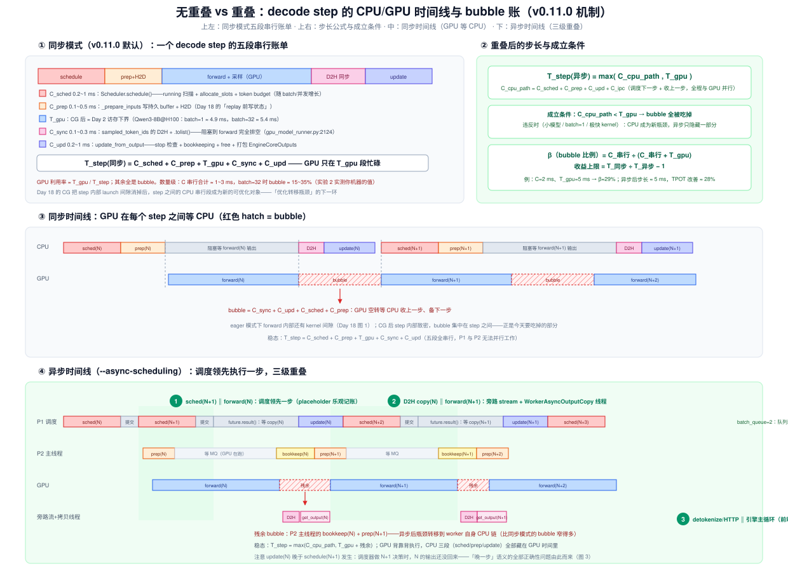
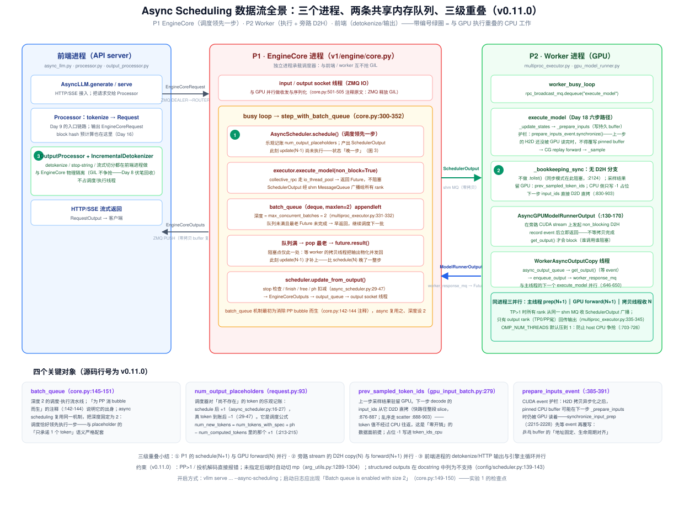
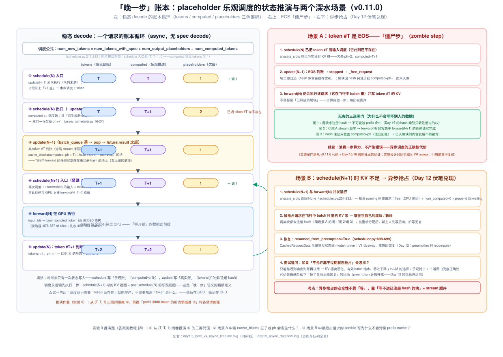

# Day 19 · Async Scheduling 与 CPU 开销隐藏——调度/执行流水重叠、placeholder 乐观调度与 bubble 实测

> **系列**：推理系统优化专家岗 · 56 天打卡 | 第 3 周「vLLM V1 源码精读（下）—— KV 管理与执行」
> **今日位置**：Day 17 读执行层的**算子**、Day 18 读执行层的**发射机制**，今天收尾执行层的**流水**：一个 decode step 的时间线上，除了 kernel 执行，还有 `schedule()` / `_prepare_inputs` / D2H 同步 / `update_from_output` 四段 CPU 串行段——它们与 GPU 执行**完全串行**，GPU 在每步之间空转。Day 18 结尾的伏笔今天全部兑现：**CG 把 step 内部做快之后，step 之间的 CPU 段反而成了新瓶颈**。V1 的答案是 async scheduling（`--async-scheduling`）：调度领先执行恰好一步，CPU 三段全部藏进 GPU 时间。四条主线：**① 串行账单与 bubble 的定量（哪个段、多少 ms、占步长几成）；② 三级重叠架构（batch_queue 流水线 / 旁路 stream 拷贝 / 前端进程隔离）；③ placeholder 乐观调度——「晚一步」语义的全部正确性深水区（EOS 僵尸步、异步抢占）；④ nsys 双模式实测：找到并量出你机器上的 bubble**
> **前置要求**：Day 18（**最重要**：`execute_model` 的 Preprocess/Forward/Sample/Bookkeep 四个 NVTX 段、持久 buffer 与"replay 前写状态"、实验 3 的 nsys 截图今天直接复用）、Day 12（preemption 的触发与 recompute 语义——今天在异步视角下重考）、Day 10（schedule 的 running/waiting 与 token budget）、Day 11（chunked prefill 混合 batch 是常态——残余 bubble 分析要用）、Day 15/16（free 保留 hash、hash 注册时机、驱逐=分配——异步抢占安全性的三道闸门全靠它们）、Day 8（EngineCore 独立进程与 GIL 隔离——第三级重叠的地基）、Day 2（decode 时延下界 = T_gpu 的来源）、Day 5（TPOT/ITL 定义——实验 1 的观测指标）
> **预计用时**：3 ~ 3.5 小时（源码走读 1.5h + 实验 1~1.5h + 账本推演与产出物 0.5h）
> **背景衔接**：这就是你做了三年的**生产者-消费者流水线**，一天不差地在系统层重演：CPU 调度 ≈ MTE2 搬数据，GPU 执行 ≈ Cube 计算，async scheduling ≈ 你的 SetFlag/WaitFlag 事件驱动多 buffer 乒乓——`prepare_inputs_event`（CUDA event 护栏：上一步 H2D 没被 GPU 读完不得覆写 pinned buffer）就是"乒乓 buffer 地址固定、生命周期对齐"的 GPU 版；旁路 stream + 专用拷贝线程 ≈ 你绕开主队列的独立 DMA 通道。区别只在粒度：你做的是指令级（μs），这里是 step 级（ms）——**方法论完全同构，这条线是你面试最强的差异化叙事**。另一个可迁移点：调度器"不看 token 值、只看账本"就能排产，等价于你做流水时"控制面只同步描述符、不同步数据"——数据留在"设备侧"（GPU 上的 `prev_sampled_token_ids`），控制面只传状态
> **实验环境**：实验 0（账本推演 + 源码寻宝）**无 GPU 可完成**；实验 1/2 复用 Day 6 的 1 × H100/A100 + Qwen3-8B + nsys（Day 18 实验 3 已装好；NVTX 需要 `pip install nvtx` 或让 vLLM 自动忽略）
> **配套材料**：`week3/README.md` Day 19 节；三张 SVG：`assets/day19_sync_vs_async_timeline.svg`（今日主图：五段串行账单 + 同步/异步时间线对照 + 三级重叠标注 + 步长公式）、`assets/day19_async_dataflow.svg`（三进程数据流全景：batch_queue / 旁路 stream / 前端 detokenize，含四个关键对象速查）、`assets/day19_placeholder_ledger.svg`（「晚一步」账本：稳态循环推演 + EOS 僵尸步 + 异步抢占三道闸门）
> **版本口径**：源码坐标按 **v0.11.0 tag** 逐行核对（2026-10 复核），与 Day 8/9/11/12/15/17/18 一致。⚠️ **五处与两份 README / 旧博客不一致，以 tag 为准**：① **v0.11.0 里 `async_scheduling` 默认 `False` 且 docstring 自标 EXPERIMENTAL**（config/scheduler.py:138-143）——总计划说"V1 把 async scheduling 设为默认方向"，指的是**官方演进方向**：2025-12 的 large-scale serving（DeepSeek wide-EP 2.2k tok/s/H200）、2026-02 的 GPT-OSS Blackwell 优化、2026-08 的 Qwen3.5 25K TPS 等官方博客都把 async scheduling 列入生产配方，2026-03 的 Model Runner V2 博客更直接说 "async-first scheduling"——但**不是** v0.11.0 的默认值，实验必须显式加 `--async-scheduling`；② week3 README 写"executor 的结果通过 **callback 异步回传**"——v0.11.0 的实现不是 callback，是 **batch_queue（Future 队列）+ `non_block=True` 的 collective_rpc + io_thread_pool**（core.py:141-167），callback 是早期 PR/博文的说法；③ `AsyncScheduler` 在 **`v1/core/sched/async_scheduler.py`**（调度器全家已从 `v1/core/scheduler.py` 迁到 `v1/core/sched/` 目录），`core.py` 里的是 batch_queue 主循环；④ 旧博客的 "multi-step scheduling" 是**已移除的 V0 特性**（arg_utils.py:900-901 注释原文），与 async scheduling 不是一回事，不要混；⑤ `max_num_seqs` 默认 128（scheduler.py:168-169）→ 高并发实验时记得显式调大。引用前先 `git log --oneline -3` 记版本

---

## 0. 今日学习目标

完成今天的学习后，你应该能够：

- [ ] **画出无重叠时间线并指出 bubble 的构成**（闭卷）：同步模式一个 decode step = `C_sched + C_prep + T_gpu + C_sync + C_upd` 五段全串行；GPU 只在 `T_gpu` 段忙碌，bubble = `C_sync + C_upd + C_sched + C_prep`（§2.2，图 1）
- [ ] **背出异步模式的步长公式与成立条件**：`T_step(异步) = max(C_cpu_path, T_gpu + 残余)`，`C_cpu_path = C_sched + C_prep + C_upd + C_ipc`；成立条件 `C_cpu_path < T_gpu`，违反时（小模型 / batch=1 / 极快 kernel）CPU 成为新瓶颈——"优化转移瓶颈"链条的下一环（§3.1）
- [ ] **走通 `step_with_batch_queue` 的完整路径**（core.py:300-352）：`schedule()` → `execute_model(non_block=True)` 返回 Future → `batch_queue`（deque maxlen=2）appendleft → 队列未满**早返回继续调度** → 满则 pop 最老 + `future.result()` + `update_from_output`；并解释深度为什么是 2（§2.3，图 2）
- [ ] **推演 placeholder 账本**（白板题）：稳态 decode 从 `(tokens=T, computed=T, ph=1)` 出发，经 schedule 出口 `(T, T+1, 2)` → update 到账 `(T+1, T+1, 1)` 的循环；说出调度公式 `num_new_tokens = num_tokens_with_spec + ph − computed`（scheduler.py:213-215）里那 +1 的含义（§2.4，图 3 左）
- [ ] **讲清"晚一步"的三个正确性深水区**：① 什么决策不需要 token 值（调度/KV 分配）、什么需要（stop 检查 → 推迟到 update）；② EOS 僵尸步为何无害（三道闸门：尾块未注册 hash / stream 顺序 / hash 只覆盖 computed−ph）；③ 异步抢占为何安全——Day 12 伏笔全部兑现（§2.5，图 3 右）
- [ ] **列出 v0.11.0 的约束与原因**：PP>1 与投机解码直接 raise（spec 的接受数在输出前未知，破坏 placeholder 语义）、未指定后端自动切 mp、structured outputs 列为不支持（§2.6）
- [ ] **用 nsys 量出 bubble**：`VLLM_NVTX_SCOPES_FOR_PROFILING=1` 打开 Preprocess/Forward/Sample/Bookkeep 标注；双模式对比 GPU busy 比例、步间 gap、CPU 线程重叠；产出手量化的对照表（§5 实验 2）
- [ ] 交付：**手画重叠/不重叠时间线图**（图 1 底稿闭卷重画）+ **nsys bubble 量化表**（同步 vs 异步各一列）+ **async on/off 的 TPOT/ITL/吞吐 A/B 数据** + **Zero-Overhead Scheduling 博文精读笔记**（§9）

---

## 1. 核心概念速览

| 概念 | 一句话定义 | 今日要达到的深度 |
|---|---|---|
| **bubble（GPU 空转）** | 同步模式下 step 之间 GPU 等 CPU 的时段：收上一步（D2H+update）+ 备下一步（schedule+prep） | 能拆成四段并估 ms；知道 CG 后它集中到 step 之间（step 内已被 Day 18 消掉） |
| **async scheduling** | 调度领先执行恰好一步：`schedule(N+1)` 与 `forward(N)` 并行 | 能画图 1 下；能说出 v0.11.0 默认关、`--async-scheduling` 开、EXPERIMENTAL |
| **`batch_queue`** | EngineCore 里的 `deque[(Future, SchedulerOutput)]`，maxlen=2 | 背出两条路径：未满早返回 / 满则 pop+result+update（core.py:300-352） |
| **`max_concurrent_batches`** | executor 声明的流水深度：async scheduling 时=2，否则=PP size（multiproc_executor.py:329-333） | 知道 batch_queue 机制"为 PP 消 bubble 而生"（core.py:142-144 注释），async 复用之 |
| **`non_block=True`** | `collective_rpc` 的非阻塞模式：请求发进 shm MQ，回复由 io_thread_pool 的 Future 承接（:257-269） | 理解"non_block 只在 max_concurrent_batches>1 时合法"的断言（:266-268） |
| **`AsyncScheduler`** | Scheduler 子类，只 override 两个方法：`_update_after_schedule`（打欠条）与 `_update_request_with_output`（扣欠条） | 全文 47 行值得逐行读（async_scheduler.py:14-47） |
| **`num_output_placeholders`** | Request 上的"欠条"计数：调度器假设本步将为该请求生成 1 个新 token（request.py:93） | 会推账本（图 3 左）；知道它进调度公式的那 +1（scheduler.py:213-215） |
| **「晚一步」语义** | schedule(N+1) 时 `update_from_output(N)` 还没跑——调度器看到的是 post-schedule(N) 的乐观状态 | 能说出哪些决策因此必须推迟（stop/finish），哪些不受影响（KV 分配/budget） |
| **`prev_sampled_token_ids`** | 上一步采样结果驻留 GPU（gpu_input_batch.py:279）；下一步 input_ids 从它 D2D 直拷 | 能指出快路径（batch 无重排时单 slice，:876-887）与一般路径（scatter，:888-903） |
| **`AsyncGPUModelRunnerOutput`** | 输出包装器：在旁路 stream 上发起 non_blocking D2H + record event，`get_output()` 才阻塞（gpu_model_runner.py:130-170） | 理解"谁调用 get_output 谁阻塞"——阻塞点被搬到了 worker 的拷贝线程 |
| **`async_output_copy_stream`** | 专门做输出 D2H 的 CUDA 旁路 stream（:329-330） | 与 Day 18 的 capture stream 对比：一个避开录制、一个避开关键路径 |
| **`WorkerAsyncOutputCopy` 线程** | worker 进程里的守护线程：`async_output_queue.get()` → `get_output()` → 回 MQ（multiproc_executor.py:646-650） | 知道它是"同进程三并行"的第三条腿（主线程 prep / GPU forward / 拷贝线程收输出） |
| **`prepare_inputs_event`** | CUDA event 护栏：H2D 异步化后 pinned buffer 可能仍被 GPU 读，`synchronize_input_prep` 先等再覆写（:385-391, :2215-2228） | 映射到你的乒乓 buffer 经验："地址固定、生命周期对齐" |
| **`finished_req_ids`** | 上一步与本步之间 finishing 的请求集合，随**下一个** SchedulerOutput 发给 worker 清理（scheduler.py:590-594） | 又一处"晚一步"：InputBatch 的清理也滞后一步 |
| **`update_from_output`** | 输出到账后的状态回写：stop 检查 / finish / free / ph 扣减 / hash 注册 | 能说出 async 下它被推迟到队列满弹出之后——比 schedule(N) 晚一整步 |
| **僵尸步（zombie step）** | 请求已 finish 但仍在飞行中 batch 里被 forward 一步 | 能讲三道闸门（§2.5 场景 A）；知道这是"浪费算力不产生错误"的代价 |
| **残余 bubble** | 异步后 GPU 仍有的小 gap：worker 主线程的 bookkeep(N) + prep(N+1) | 理解瓶颈转移到 worker 自身 CPU 链——下一步优化的方向（MRV2 的 GPU-native 输入准备） |
| **`--async-scheduling`** | CLI 开关（arg_utils.py:915-916）；未指定后端时自动切 mp（:1289-1294） | 背出三不允许：PP>1 / 投机解码 raise；structured outputs docstring 不支持 |

> **一句话本质**：async scheduling = **把"调度-执行-回收"的串行环剪开成深度 2 的流水线**——调度器靠"欠条"（placeholder）领先执行一步排产，执行侧靠"数据留 GPU"（D2D 直拷 + 旁路 stream）把 token 值彻底从关键路径上拿掉，回收侧靠专用拷贝线程在 worker 内自成一条腿。CPU 从"每步串行做四件事"变成"每步与 GPU 并行做三件事"，GPU 从"跑一段歇一段"变成背靠背。全部正确性问题浓缩成一句话：**调度只需要"token 会存在"，不需要"token 是什么"**——值留在 GPU，账记在 CPU，谁需要真值（stop 检查/detokenize）谁就晚一步拿。

---

## 2. 原理深入讲解

### 2.1 回顾与今日地图：本周三部曲的最后一环

本周执行层三天的关系，用时间尺度串起来：**Day 17 算子级（μs）→ Day 18 发射级（μs×440 = ms）→ Day 19 流水级（step = ms × 串行段数）**。Day 18 结尾埋的伏笔今天全部兑现：

| Day 18 的伏笔 | 今日兑现处 |
|---|---|
| "CG 让 GPU 段变短后，**CPU 段反而成了新瓶颈**——优化-转移瓶颈链条的下一环" | §2.2 的五段账单：CG 消掉的是 step 内 launch 间隙，step 之间的 `C_sched/C_prep/C_sync/C_upd` 原封不动 |
| 实验 3 的 nsys 截图（eager vs CG 的 kernel 间隙密度） | §5 实验 2 直接复用同一套 profiling 方法，加 async 维度变成三组对照 |
| `execute_model` 的 Preprocess/Forward/Sample/Bookkeep 四个 `record_function_or_nullcontext` 段（:2236/:2295/:2366/:2404） | NVTX 打开后它们就是 nsys 时间线上的 CPU 段标尺——实验 2 量 bubble 全靠它们 |
| Day 12 的 preemption（"KV 不足触发、只 recompute"） | §2.5 场景 B：异步视角下抢占基于"晚一步"状态，安全性靠三道闸门 |

也回收 Day 8 的伏笔：**EngineCore 为什么是独立进程**——除了故障隔离，还有 GIL：今天要看到 vLLM 把"会争抢 CPU 的工作"拆到三个进程 + 五条线程里（前端 detokenize / EngineCore 调度 / worker 执行 / worker 拷贝 / ZMQ IO），每一层拆分都是为了某一段 CPU 工作不挡 GPU。

### 2.2 问题定量：同步模式一个 decode step 的五段串行账单（图 1）



同步模式下（v0.11.0 默认），`EngineCore.step()`（core.py:272-291）是严格串行的三段：`schedule()` → `execute_model()`（阻塞到输出回来）→ `update_from_output()`。把 `execute_model` 内部再拆开，一个 decode step 的完整时间线是五段：

| 段 | 位置 | 内容 | 典型量级 |
|---|---|---|---|
| `C_sched` | EngineCore，`Scheduler.schedule()` | running 扫描 + `allocate_slots` + token budget + 构造 SchedulerOutput | 0.2~1 ms（随 batch 增长；千级并发时显著变大） |
| `C_prep` | Worker，`_prepare_inputs` | 写持久 buffer（Day 18 技巧②）+ H2D + attention metadata | 0.1~0.5 ms |
| `T_gpu` | GPU | forward + 采样；CG 后 ≈ Day 2 访存下界 | Qwen3-8B@H100：b1≈4.9 / b32≈5.4 ms |
| `C_sync` | Worker，`_bookkeeping_sync` | `sampled_token_ids` 的 D2H + `.tolist()`——**阻塞到 forward 完全排空**（gpu_model_runner.py:2124 的注释原文："GPU -> CPU Sync happens here. Move as many CPU operations as possible before this sync point"） | 0.1~0.3 ms |
| `C_upd` | EngineCore，`update_from_output` | stop 检查 + bookkeeping + free + 打包 EngineCoreOutputs | 0.2~1 ms |

> ⚠️ 量级标注：CPU 四段的 ms 数随 CPU 型号 / batch / 是否开 prefix caching（hash 注册也是 CPU 工作）浮动一个量级，上表是**待实测的先验估计**——实验 2 用你机器的 nsys 数据回填，面试时报自己的实测值。

于是：

```
T_step(同步) = C_sched + C_prep + T_gpu + C_sync + C_upd
GPU 利用率  ≈ T_gpu / T_step
bubble      = C_sync + C_upd + C_sched + C_prep   ← GPU 空转
```

代一组数：`C` 合计 ≈ 2 ms、`T_gpu` ≈ 5.4 ms（batch=32）→ bubble ≈ 27%，TPOT 直接垫高四分之一以上。**为什么 CG 之后这个问题反而更突出**：Day 18 把 step 内部的 launch 间隙消掉后，GPU 段压到接近访存下界，而 CPU 四段一点没少——bubble 的**占比**被动上升。这就是"优化-转移瓶颈"：每优化掉一层，下一层就浮出水面。

**为什么 decode 独有**：与 Day 18 的 launch-bound 三条件同构——① decode 步短（5~20 ms），每步都把 CPU 四段全付一遍；② prefill 步长几十 ms 且 compute-bound，CPU 段占比 <5%，重叠收益小；③ decode 的形状/流程稳定，"领先一步"的排产在 decode 上最容易做对（prefill chunk 的 token 数方差大，placeholder 语义复杂）。所以 async scheduling 的收益集中在 **decode 为主的负载**——实验 1 用 random 固定长度数据集把 decode 项分离干净。

### 2.3 V1 的三级重叠架构：batch_queue、旁路 stream、前端进程（图 2）



先看已经默认存在的两级（Day 8 讲过架构，今天补"为什么"）：

- **第三级：前端进程隔离**。detokenize（`IncrementalDetokenizer`）、stop-string 检查、流式切分（`OutputProcessor`）全在 API server 进程做（async_llm.py:124-125），与 EngineCore 物理隔离——它们是纯 CPU 工作，隔离后既不抢 EngineCore 的 GIL，也不抢 worker 的 CPU。
- **IO 线程**。EngineCore 的 ZMQ 收发在两条守护线程里（core.py:501-519），注释原文点名两个动机："overlap ZMQ socket IO with GPU since they release the GIL, and overlap some serialization/deserialization with the model forward pass"；输出侧还有 msgspec 零拷贝 buffer 复用（:882-941）。

今天的主角是**第一、二级**——`--async-scheduling` 打开后新增的两级重叠。装配链三步（§4.1 有行号）：配置把 `scheduler_cls` 换成 `AsyncScheduler` → `MultiprocExecutor.max_concurrent_batches` 从 1 变 2 → `EngineCore.__init__` 因此创建 `batch_queue` 并把 `step_fn` 换成 `step_with_batch_queue`。核心循环值得逐行读（core.py:300-352，此处保留主干）：

```python
def step_with_batch_queue(self):
    model_executed = False
    if self.scheduler.has_requests():
        scheduler_output = self.scheduler.schedule()          # ① 调度（AsyncScheduler：打欠条）
        future = self.model_executor.execute_model(
            scheduler_output, non_block=True)                 # ② 发进 shm MQ，立即拿 Future
        batch_queue.appendleft((future, scheduler_output))    # ③ 挂进深度 2 的队列
        if model_executed and len(batch_queue) < self.batch_queue_size \
                and not batch_queue[-1][0].done():
            return None, True                                 # ④ 早返回：继续调度下一批！
    future, scheduler_output = batch_queue.pop()              # ⑤ 队列满：弹出最老
    model_output = ... future.result()                        #    阻塞等 worker 拷贝线程物化输出
    engine_core_outputs = self.scheduler.update_from_output(
        scheduler_output, model_output)                       # ⑥ 补真实账（晚一步）
    return engine_core_outputs, model_executed
```

把两个 step 展开在时间线上（图 1 下）：`schedule(N+1)` 跑的时候 GPU 还在执行 `forward(N)`——第一级重叠达成。注意 ⑤ 的阻塞语义：`future.result()` 等的是"worker 的拷贝线程把 D2H 拷完、`.tolist()` 物化、塞进 response MQ"，这个等待**本身**与 GPU 并行（forward N+1 已经在跑），EngineCore 只是"账晚记一步"，GPU 一步没歇。

**第二级重叠在 worker 侧**。`execute_model` 的收尾不再是同步 D2H，而是三连：

```python
# gpu_model_runner.py:2139-2171 —— _bookkeeping_sync 的 async 分支：消灭 CPU 同步点
valid_sampled_token_ids = []                       # 不再 .tolist()！
self.input_batch.prev_sampled_token_ids = sampled_token_ids   # 结果留在 GPU
self.input_batch.prev_req_id_to_index = {...}      # 记住行号映射
# :2181-2183：CPU 侧账本只写 -1 占位（真值稍后由 GPU 直拷路径补）

# gpu_model_runner.py:2440-2445 —— 返回值换成异步包装
return AsyncModelRunnerOutput(
    model_runner_output=output,
    sampled_token_ids=sampler_output.sampled_token_ids,
    async_output_copy_stream=self.async_output_copy_stream)   # 旁路 stream

# multiproc_executor.py:636-650 —— 输出走专用线程，与主线程的下一个 execute 并行
def handle_output(self, output):
    if self.use_async_scheduling:
        self.async_output_queue.put(output)        # 主线程立即回去取下一个 batch
    ...
def async_output_busy_loop(self):                  # WorkerAsyncOutputCopy 线程
    while True:
        output = self.async_output_queue.get()
        self.enqueue_output(output)                 # get_output()：等 D2H event → tolist → 回 MQ
```

`AsyncGPUModelRunnerOutput.__init__`（gpu_model_runner.py:130-155）在**旁路 CUDA stream** 上发起 `non_blocking=True` 的 D2H 并 record event——拷贝与默认 stream 上的 `forward(N+1)` 真正并行；`get_output()` 里 `event.synchronize()` 才阻塞，而调用它的是拷贝线程，不占任何关键路径。

还有一个容易忽略的细节：H2D 也异步化之后，pinned CPU buffer 有了新危险——下一步 `_prepare_inputs` 覆写 buffer 时，上一步的 H2D 可能还没被 GPU 读完。`prepare_inputs_event`（:385-391）+ `synchronize_input_prep`（:2215-2228）就是护栏：每次 prep 前等 event、prep 完 record event。**这就是你乒乓 buffer 经验里"地址固定、生命周期对齐"的 GPU 翻版**。

至此得到异步稳态公式（图 1 右上）：

```
T_step(异步) = max( C_cpu_path , T_gpu + 残余bubble )
C_cpu_path = C_sched + C_prep + C_upd + C_ipc
残余bubble  ≈ bookkeep(N) + prep(N+1)   ← 在 worker 主线程上（图 1 下的红色窄条）
```

**残余 bubble 是理解这章的钥匙**：异步之后瓶颈并未消失，而是转移到了 worker 自己的 CPU 链（dequeue → prep → bookkeep）——官方后续的 Model Runner V2 博客（2026-03）说要做 "GPU-native input preparation"，打的就是这段。面试讲到这里，就从"会用开关"升级到"知道这条优化路线的下一站在哪"。

### 2.4 乐观调度：placeholder 账本与「晚一步」语义（图 3 左）



第一级重叠留下一个根本问题：`schedule(N+1)` 跑的时候，forward(N) 还没产出 token——**调度器拿什么排产？** 答案分三层：

**第一层：调度不需要 token 值，只需要 token 会在。** 回看 Day 10 的调度公式，决定"本步调度几个 token"的只有三个量：`num_tokens_with_spec`（现在有多少 token）、`num_computed_tokens`（算完了多少）、`num_output_placeholders`（欠条）：

```python
# scheduler.py:213-215 —— running 分支的核心公式
num_new_tokens = (request.num_tokens_with_spec
                  + request.num_output_placeholders
                  - request.num_computed_tokens)
```

同步模式稳态：schedule 入口 `(tokens=T, computed=T−1, ph=0)` → 调 1。异步模式入口 `(tokens=T, computed=T, ph=1)` → 同样调 1——**欠条把"+1 差"提前记上了**。欠条在两处被维护：

```python
# async_scheduler.py:16-27 —— schedule 出口：打欠条
def _update_after_schedule(self, scheduler_output):
    super()._update_after_schedule(scheduler_output)      # computed += 调度数
    for req_id in scheduler_output.num_scheduled_tokens:
        request = self.requests[req_id]
        if (request.num_computed_tokens == request.num_tokens +
                request.num_output_placeholders):
            request.num_output_placeholders += 1          # 本步将为它生成一个新 token

# async_scheduler.py:29-47 —— update 出口：扣欠条 + 只 hash 值已到账的块
def _update_request_with_output(self, request, new_token_ids):
    new_token_ids, stopped = super()._update_request_with_output(request, new_token_ids)
    request.num_output_placeholders -= len(new_token_ids)  # 真到账，欠条核销
    if status_before_update == RequestStatus.RUNNING:
        self.kv_cache_manager.cache_blocks(
            request, request.num_computed_tokens
            - request.num_output_placeholders)             # ★ hash 只注册"值已知"的块
```

稳态循环（图 3 左，闭卷推演是实验 0 的作业）：`schedule(N) 入口 (T,T,1)` → 出口 `(T, T+1, 2)` → `update(N−1) 到账 (T+1, T+1, 1)` → `schedule(N+1) 入口 (T+1, T+1, 1)`——循环闭合，每半步只有一次状态写入：schedule 写乐观账，update 写真实账。

**第二层：token 值根本不过 CPU。** `schedule(N+1)` 给 decode 请求排的输入 token 是 #T——forward(N) 正在生成它。它的值走 GPU 直通路径：`_prepare_input_ids`（gpu_model_runner.py:830-903）发现 `prev_sampled_token_ids` 非空，就把上一步采样结果 **D2D 直拷**进 `input_ids.gpu`——batch 无重排时是单条 slice 拷贝（:876-887 的快路径），有进出/重排时按索引 scatter（:888-903）。CPU 侧的 `token_ids_cpu` 在该位置只写过 `-1` 占位（:2181-2183）。控制面同步描述符、数据面留在设备——和你做流水的原则一字不差。

**第三层：需要真值的决策全部推迟一步。** stop/finish 判断、`logprobs` 组装、请求完成通知——都在 `update_from_output` 里，而它晚于 `schedule(N+1)`。于是出现一串"晚一步"细节：请求 finish 的清理靠 `finished_req_ids` 随**下一个** SchedulerOutput 通知 worker（scheduler.py:590-594，`has_finished_requests` 因此单独成为接口方法）；到达 `max_model_len` 边界的请求在本步被 `num_new_tokens=0` 跳过（:238-252 的注释点名 async scheduling 场景）；客户端"看见最后一个 token"的时刻平均晚半步。**这些都是拿延迟换吞吐的明确交易**，不是 bug。

### 2.5 正确性深水区：EOS 僵尸步与异步抢占（图 3 右，今日核心）

「晚一步」最尖锐的两个场景，是今天面试区分度最高的部分（也是 Day 12 伏笔的兑现）。

**场景 A：EOS 僵尸步。** `schedule(N)` 把 token #T 当输入调度了（欠条 ph=2），随后 `update(N−1)` 发现 #T 是 EOS → 请求 finish、块全部 `_free_request`。但飞行中的 forward(N) 仍会执行这个"已死"请求：算力白费一步，还要把 token #T 的 KV 写进**已释放的尾块**。为什么无害？三道闸门（图 3 右上）：

1. **尾块未注册 hash**：`cache_blocks` 只注册到 `computed − ph = T`（§2.4 第二段代码的 ★ 行），装着 EOS 的尾块不在 `cached_block` 索引里 → **不可能被 prefix 命中**（Day 16：命中必须查索引）；
2. **stream 顺序**：forward(N) 的写在同一个 CUDA stream 上，先于 forward(N+1) 的任何读/写完成；
3. **已注册块不再被写**：decode 只写请求自己的尾槽，满块入册后内容冻结（Day 15/16 的机制今天兜底）。

> ⚠️ 诚实标注：三道闸门是我从 v0.11.0 代码 + Day 15/16 机制推出的论证框架（每条都有代码锚点），完整的对抗性讨论散在相关 PR 的 review 里——面试引用时说"我的理解是…依据是这三条"，比背结论稳。

**场景 B：异步抢占（Day 12 伏笔）。** `schedule(N+1)` 与 forward(N) 并发，此时 `allocate_slots` 返回 None → 照 Day 12 的语义抢占 running 尾部请求（scheduler.py:254-292：free + `num_computed=0` + prepend 回 waiting）。注意抢占**没有**等 forward(N) 结束——被抢占请求在飞行 batch 里的 KV 写照样发生，落到它自己的尾块/新块（都未注册 hash）。安全性仍是三道闸门：未注册块不会被 prefix 命中；新主人分到这些块后**先写后读**（同层 forward 里 `reshape_and_cache_flash` 先于 attention gather，Day 17 的调用顺序）；stream 顺序保证时序。恢复走 `resumed_from_preemption=True`（scheduler.py:698-699）→ `CachedRequestData` 全量重发，V1 无 swap、重算即恢复。

反面试追问：**如果"不允许基于过期状态抢占"会怎样？** 只能把抢占推迟到输出到账 → KV 超卖恶化、有效 batch 缩水、吞吐反降。vLLM 的选择是乐观抢占 + 闸门兜底——代价是极端负载下"抢了又马上恢复"的抖动，`/metrics` 的 preemption 计数（Day 13）照样适用。**"异步抢占的安全性不靠『等』，靠『写不进已注册 hash 的块』+ stream 顺序"**——这句话值得进白板四件套。

### 2.6 约束、不支持特性与「默认方向」的准确含义

v0.11.0 的硬约束（arg_utils.py:1289-1304）：

| 约束 | 行为 | 原因 |
|---|---|---|
| PP > 1 | 直接 `raise ValueError` | batch_queue 深度=2 与 PP 的多级流水冲突（PP 场景用同一机制但深度=PP size） |
| 投机解码 | 直接 `raise ValueError`（TODO: woosuk） | draft 接受数量在输出前未知，placeholder 的"恰好 1 个"语义被破坏（`_update_after_schedule` 里的 TODO 注释同名） |
| 未指定 executor 后端 | 自动切 `mp` 并打日志 | uniproc 单进程下 Future/多线程模型不成立（:266-268 的断言） |
| structured outputs | docstring 列为不支持（config/scheduler.py:139-143） | grammar bitmask 需要基于最新 token 的决策 |

至于总计划那句"为什么 V1 把 async scheduling 设为默认方向"——准确表述是：**它是官方生产配方的标准件**（large-scale serving / GPT-OSS Blackwell / Qwen3.5 25K TPS 等博客全部启用；MRV2 博客提出 "async-first scheduling"），但 **v0.11.0 默认关闭且标 EXPERIMENTAL**。面试被问"默认开吗"：答"我核对过 v0.11.0，默认关、显式开；官方方向是把它做成默认，理由是 decode 负载下它近乎免费、代价都在正确性工程上"。

---

## 3. 性能模型与复杂度：今日的数学

### 3.1 步长模型与收益上限

```
T_sync  = C_ser + T_gpu                    （C_ser = C_sched + C_prep + C_sync + C_upd，全串行）
T_async = max(C_cpu_path, T_gpu + C_r)     （C_cpu_path = C_sched + C_prep + C_upd + C_ipc；C_r = 残余）
加速比 S = T_sync / T_async
bubble 比例 β = C_ser / (C_ser + T_gpu)
```

代入 Qwen3-8B @ H100（CPU 段取 §2.2 先验中值 C≈2 ms，标注待实验 2 校准）：

| 场景 | T_gpu | T_sync | T_async | S | 判读 |
|---|---|---|---|---|---|
| batch=32，8B 模型 | ≈5.4 ms | ≈7.4 ms | ≈5.4+C_r | **≈1.3×** | 甜点区：C 与 T_gpu 同量级，bubble 占 27% |
| batch=256，8B | ≈10+ ms | ≈12 ms | ≈10 ms | ≈1.2× | T_gpu 长到把 C 全藏住，绝对收益仍可观 |
| batch=1，8B | ≈4.9 ms | ≈6.9 ms | ≈4.9 ms | ≈1.4× | C 占比最高的 decode 敏感区（TPOT 直接受益） |
| batch=1，0.6B 模型 | **<1 ms** | ≈3 ms | ≈3 ms（CPU-bound） | ≈1.0× | **C_cpu_path > T_gpu：异步救不了，瓶颈换轴到 CPU** |
| 纯 prefill 负载 | 几十 ms/步 | — | — | →1 | CPU 段占比 <5%，无重叠必要 |

三个推论：① **收益条件就是流水线条件** `C_cpu_path < T_gpu`——违反时异步只是把串行环改成 CPU 密集环（图 1 右上）；② **模型越小、batch 越小、kernel 越快，异步越重要也越无效**——重要是因为 bubble 占比大，无效是因为 CPU 段压不过 T_gpu（与 Day 18 T1 的"CG 是小模型生死线"结论呼应：两者打的是同一个 CPU 开销的两面，CG 打发射次数、async 打串行段）；③ **加速比上限 = T_sync/T_gpu**——异步与 CG 一样，**消不掉 Day 2 的访存下界**，它们都是控制面优化。

### 3.2 CPU 段的增长律：schedule 的 O(N) 项

CPU 段不是常数，随 batch/并发增长。三个增长点（都有源码锚点）：

- `schedule()` 的 running 扫描：O(num_running)，每请求一次 `allocate_slots`（多数步复用尾块，但 Python 循环本身有成本）；
- `update_from_output` 的逐请求循环：scheduler.py:879-881 的注释原文直言："As len(num_scheduled_tokens) can be up to 1K or more, the below loop can be a performance bottleneck"——官方口径里千级并发下 CPU 段可达 10 ms 量级（博文说法，**实验 3 用你的环境实测**）；
- prefix caching 的 hash 注册（`cache_blocks`）也在 update 路径上——开缓存换 TTFT 的同时给 CPU 段加码，这是 Day 16 与今天的交叉点。

增长律的推论：**并发越高，async scheduling 的相对收益越大**（T_gpu 也随 batch 增长，但 CPU 段的增长更线性于请求数）——实验 1 的并发梯度就是为验证它设计的。同时它解释了"为什么把 scheduler 本身做快仍是主题"（数据结构、增量计算、甚至把输入准备搬到 GPU——MRV2 的方向）。

### 3.3 流水线深度为什么是 2

深度 2 = 调度领先执行恰好 1 步，与 placeholder 的"只承诺 1 个 token"严格配套。加深到 3 意味着：调度领先两步 → 欠条 +2、KV 按两个未生成的 token 预留（内存超卖翻倍）、僵尸步最多连续两步、抢占的过期窗口翻倍——收益（隐藏更长的 CPU 抖动）远小于正确性成本。这与你在昇腾做多级流水的经验一致：**深度只要盖住最慢一级的抖动即可，再深就是白付状态复杂度**。（PP 场景深度=PP size 是另一回事：那是给流水级数配队列，不是给调度加 lookahead。）

### 3.4 练手对账题（答案见 §8）

1. 你的机器实测 `C_ser = 2.5 ms`（实验 2 会量）。Qwen3-8B、batch=64 时 nsys 测得 GPU busy 6.2 ms/step。估算 async 开启后的 TPOT 改善百分比；若换成 Qwen3-0.6B（权重 1.2 GB）同 batch，改善变成多少？
2. 稳态 decode 中某请求 `schedule(N+1)` 入口的三元组是 `(tokens=517, computed=517, ph=1)`。写出 `update(N)` 执行完后的三元组；若该请求还有 3 个 token 到 `max_model_len`，写出它到达边界那一步 `num_new_tokens` 的值与请求的处理路径。
3. 为什么 `prev_sampled_token_ids` 的快路径（:876-887）要求 `indices_match and max_flattened_index == num_common_tokens - 1`？什么样的负载变化会让它退化到 scatter 路径（:888-903）？

---

## 4. 关键代码走读（v0.11.0 逐行核对版）

> 建议按 §2 顺序跳读：`config/scheduler.py:138-143/229-231`（开关与 scheduler_cls 替换）→ `arg_utils.py:1289-1304`（约束检查）→ `core.py:141-167/300-352`（装配与主循环）→ `async_scheduler.py` 全文 47 行 → `multiproc_executor.py:329-333/621-650`（深度与拷贝线程）→ `gpu_model_runner.py` 五段（:328/:2139/:830/:130/:2215）。⚠️ 调度器已迁到 `v1/core/sched/` 目录；旧博客说的 callback 回传、multi-step scheduling 都不是这套代码，以 tag 为准。

### 4.1 装配链：从 CLI 开关到 step_fn 替换

```python
# config/scheduler.py:138-143 —— 开关本体（默认 False，EXPERIMENTAL）
async_scheduling: bool = False
"""EXPERIMENTAL: If set to True, perform async scheduling..."""

# config/scheduler.py:229-231 —— 打开后换调度器类
if self.async_scheduling:
    self.scheduler_cls = "vllm.v1.core.sched.async_scheduler.AsyncScheduler"

# arg_utils.py:1289-1297 —— 启动期约束
if self.async_scheduling:
    if self.distributed_executor_backend is None:
        self.distributed_executor_backend = "mp"     # 自动切 mp + 打日志
    if self.pipeline_parallel_size > 1:
        raise ValueError(...)                          # PP 不支持
    if self.speculative_config is not None:
        raise ValueError(...)                          # spec decode 不支持

# core.py:145-167 —— 深度协商与 step_fn 替换
self.batch_queue_size = self.model_executor.max_concurrent_batches   # async→2
if self.batch_queue_size > 1:
    logger.info("Batch queue is enabled with size %d", ...)          # ← 实验 1 的检查点日志
    self.batch_queue = deque(maxlen=self.batch_queue_size)
self.step_fn = (self.step if self.batch_queue is None
                else self.step_with_batch_queue)
```

### 4.2 `AsyncScheduler`：全文 47 行的两个 override

§2.4 已贴核心，走读时补三个细节：① `num_output_placeholders` 的 assert（:40）——欠条永不为负，这是账本闭环的运行时验证；② `cache_blocks(request, computed − ph)` 的减法是**场景 A 闸门 1** 的代码落点；③ 文件头 import 里能看到它只依赖 `Scheduler` 本体——说明"乐观记账"是**纯增量能力**，调度器的其他 900 行一行不改（对比 V0 multi-step 的侵入式改造，这是接口设计的一课）。

### 4.3 ModelRunner 侧五件套

| 件 | 位置 | 机制要点 |
|---|---|---|
| 开关与旁路 stream | :328-330 | `use_async_scheduling` 决定是否建 `async_output_copy_stream`（专司输出 D2H） |
| 无同步分支 | :2139-2171 | `_bookkeeping_sync` 不做 `.tolist()`；`prev_sampled_token_ids` 三件套（值/无效行/行号映射）挂到 InputBatch |
| `-1` 占位 | :2181-2199 | CPU 侧 `token_ids_cpu`/`output_token_ids` 写 -1；真值走 GPU 直通（`req_state.output_token_ids` 的 -1 会被 update 路径覆盖） |
| D2D 直拷 | :830-903 | `_prepare_input_ids`：无 `prev` → 普通 `copy_to_gpu`；有 → 快路径单 slice / 乱序 scatter |
| 事件护栏 | :385-391, :2215-2228 | `prepare_inputs_event` 初始 record（完成态起步）；`synchronize_input_prep` 包住 `_update_states + _prepare_inputs` |

### 4.4 Worker 与 Executor 侧

- `multiproc_executor.py:329-333`：`max_concurrent_batches` 的 cached_property——`async_scheduling → 2`，否则 `PP size`。**同一机制服务两个特性**，这是读这段代码最该带走的架构观察。
- `:257-269`：`collective_rpc` 的 non_block 分支——请求 enqueue 进 shm MQ 后，`io_thread_pool.submit(get_response)` 返回 Future；`:266-268` 的 `raise` 说明 non_block 严格依赖多批并发。
- `:621-650`：`enqueue_output`（`AsyncModelRunnerOutput → get_output()` 物化）、`handle_output`（分诊）、`async_output_busy_loop`（守护线程名 `WorkerAsyncOutputCopy`）。
- `:703-726`：`set_multiprocessing_worker_envs` 把 `OMP_NUM_THREADS` 压到 1——**host CPU 争抢管理**是 CPU 开销隐藏主题的一部分：EngineCore、多个 worker、API server 共享一台机器，线程超配会放大 bubble。

### 4.5 运行时路径与调用链速查表

| 时机 | 调用链 | 行号锚点 |
|---|---|---|
| 启动·配置 | `--async-scheduling` → `SchedulerConfig.__post_init__` 换 `scheduler_cls` → 约束检查（mp/PP/spec） | config/scheduler.py:229-231；arg_utils.py:1289-1304 |
| 启动·装配 | `EngineCore.__init__` → `max_concurrent_batches=2` → `batch_queue` → `step_fn=step_with_batch_queue` | core.py:145-167；multiproc_executor.py:329-333 |
| 每 step·调度 | `run_busy_loop → _process_engine_step → step_with_batch_queue → AsyncScheduler.schedule()`（打欠条） | core.py:720-761/300-336；async_scheduler.py:16-27 |
| 每 step·发射 | `execute_model(non_block=True) → collective_rpc → shm MQ → io_thread_pool Future → appendleft` | abstract.py:98-106；multiproc_executor.py:234-269 |
| 每 step·执行 | Worker `worker_busy_loop → execute_model`：prep（event 护栏）→ CG replay → sample → 无同步 bookkeep → `AsyncGPUModelRunnerOutput` | gpu_model_runner.py:2231-2445 |
| 每 step·回收 | 拷贝线程 `get_output()`（等 event）→ response MQ → P1 `future.result()` → `update_from_output`（扣欠条/stop/free/hash） | multiproc_executor.py:621-650；async_scheduler.py:29-47 |
| 输出·下游 | `EngineCoreOutputs → output_queue → output socket 线程 → 前端 OutputProcessor/detokenize` | core.py:501-519；async_llm.py:124-125 |

### 4.6 和昇腾经验的映射（写给 W6 的你）

| GPU/vLLM 概念 | 昇腾对应 | 迁移要点 |
|---|---|---|
| `prepare_inputs_event` 护栏 | 乒乓 buffer 的 SetFlag/WaitFlag | 异步化之后"生命周期对齐"比"地址固定"更关键——读 vllm-ascend 的异步改造时先找它的护栏 |
| 旁路 stream + 拷贝线程 | 独立 DMA 通道/搬运队列 | 把 D2H 从计算流上摘出去，两边都可满载 |
| placeholder 账本 | 控制面只传描述符、数据留在设备 | "不看值先排产"是流水线通用原则 |
| `OMP_NUM_THREADS=1` 压争抢 | Host 侧绑核/优先级配置 | 多进程共享 host 时，CPU 争抢管理是隐性瓶颈 |
| `batch_queue` 深度=2 | 流水深度盖住最慢级抖动即可 | 深度与 lookahead 语义绑定，不是越大越好 |

---

## 5. 动手实验（约 60~90 分钟）

### 实验 0（必做，15 min；无 GPU）：账本推演 + 源码寻宝

1. **账本推演**（纸面，图 3 左为底稿）：从 `(tokens=T, computed=T, ph=1)` 出发闭卷推 ⑥；再推两个变体：① 3000-token 新请求在 ② 之后插入（prefill 的欠条行为：`_update_after_schedule` 对它的判定成立吗？）；② 一个请求距 `max_model_len` 还剩 1 个 token 时，它在边界步的 `num_new_tokens` 与处理路径（scheduler.py:238-252 的 continue 分支）。
2. **源码寻宝**（GitHub tag v0.11.0 或 pip 环境均可）：

```bash
# 三个 grep 各应命中至少一处——读上下文 20 行：
# ① 装配链
grep -n "Batch queue is enabled" vllm/v1/engine/core.py
grep -n "async_scheduling" vllm/config/scheduler.py vllm/engine/arg_utils.py
# ② 欠条的两端
grep -n "num_output_placeholders" vllm/v1/request.py vllm/v1/core/sched/*.py
# ③ 无同步分支与直拷路径
grep -n "prev_sampled_token_ids" vllm/v1/worker/gpu_input_batch.py vllm/v1/worker/gpu_model_runner.py
```

3. 对答案：`_update_after_schedule` 的判定条件为什么是 `computed == num_tokens + ph` 而不是 `computed == num_tokens`？（提示：异步入口 computed 已经领先 tokens。）

### 实验 1（核心，GPU 30 min）：async on/off 的 A/B 矩阵

```bash
declare -A CFG=(
  [sync]=""
  [async]="--async-scheduling"
)
for name in sync async; do
  vllm serve Qwen/Qwen3-8B ${CFG[$name]} --gpu-memory-utilization 0.9 \
      2>&1 | tee day19_$name.log &
  until grep -q "Application startup complete" day19_$name.log; do sleep 5; done
  grep -E "Batch queue is enabled|Defaulting to mp" day19_$name.log   # ← 检查点！
  for C in 1 32 128; do
    vllm bench serve --model Qwen/Qwen3-8B --base-url http://localhost:8000 \
      --dataset-name random --random-input-len 512 --random-output-len 256 \
      --random-range-ratio 0 --num-prompts 64 --max-concurrency $C \
      --seed 42 --temperature 0 --percentile-metrics ttft,tpot,itl \
      --metric-percentiles 50,99 --save-result \
      --result-dir results/day19 --result-filename ${name}_c${C}.json
  done
  pkill -f "vllm serve"; sleep 20
done
```

观察点（填进 §9 产出③ 的表）：① **async 组必须有** `Batch queue is enabled with size 2`（core.py:149）——没有它说明没生效（比如走了 uniproc 路径），一切数据作废；② **TPOT p50**：batch=1/32 列应看到改善（图 1 的 bubble 被吃掉），batch=128 改善收窄或持平（CPU 段被更长的 T_gpu 天然藏住）；③ **ITL p99**：异步削掉 step 间的确定性停顿，**尾部（p99）改善通常比 p50 明显**——这是生产上开它的主要理由之一；④ **吞吐**：decode 为主的负载应有小幅提升（每步省下的 bubble × 每秒步数）；⑤ 若改善为 0 甚至倒挂：先查 `C_cpu_path` 是否本来就 < `T_gpu`（你的 CPU 太快/负载偏 prefill），再看 §5 末的坑表。⚠️ 别混 `--guided-decoding`/结构化输出（§2.6 不支持）；别混投机解码（直接报错）。

### 实验 2（核心，GPU 40 min）：nsys 双模式对比，量出 bubble

Day 18 实验 3 的方法直接复用，加 NVTX 段标注：

```bash
pip install nvtx   # NVTX 标注依赖（v1/utils.py:391-393）
VLLM_NVTX_SCOPES_FOR_PROFILING=1 nsys profile -o day19_sync \
    -t cuda,nvtx,osrt --duration 15 \
    vllm serve Qwen/Qwen3-8B --gpu-memory-utilization 0.9 &
# 等 startup 后立刻压测（并发 32、时长盖住 duration 窗口）：
vllm bench serve ... --max-concurrency 32 --num-prompts 256 ...
# 对 async 组重复（文件名 day19_async），然后：
nsys stats day19_sync.nsys-rep -r nvtx_gpu_proj_trace > day19_sync_trace.txt
nsys stats day19_async.nsys-rep -r nvtx_gpu_proj_trace > day19_async_trace.txt
nsys ui day19_async.nsys-rep   # GUI 里对照看
```

看什么（对照图 1 的段名）：

1. **GPU 流（CUDA HW 行）**：稳态 decode 窗口内，`Forward` NVTX 段之间的**空隙**就是 bubble。sync 组：gap ≈ `Preprocess + Sample尾 + Bookkeep`（EngineCore 的段在另一进程，GUI 里按进程分轨找 `EngineCore` 的主线程）；async 组：gap 应收窄成 worker 自己的 `Bookkeep(N)+Preprocess(N+1)`（残余 bubble）。
2. **CPU 线程分轨**：`EngineCore-...` 进程主线程上 `schedule` 的 Python 长段（osrt/采样栈），在 sync 组与 GPU 空隙**对齐**（串行证据），在 async 组与 `Forward` **重叠**（重叠证据）——截图时把这两个对齐关系框出来，就是产出物②。
3. **量化**：取 ≥100 ms 稳态窗口，数 `Forward` 段个数 n、窗口长 W、GPU busy 总和 B：

```
step 时长 = W / n          GPU busy 比例 = B / W
bubble    = (W − B) / n ms/step     bubble 占比 = 1 − B/W
```

4. **旁路证据**（async 组）：找 `WorkerAsyncOutputCopy` 线程与 GPU 上的小段 D2H copy——确认它们与 `Forward` 并行。
5. 把 `C_sched/C_prep/C_upd` 从 NVTX 段时长里拆出来，回填 §3.1 表的先验值——**你的机器数字从此可引用**。

### 实验 3（可选，GPU 20 min）：压出 CPU-bound 区

用 Qwen3-0.6B（或你的最小模型）+ `--max-num-seqs 256` + 并发 256 跑 async 组：预期 TPOT 改善趋近 0——`C_cpu_path`（schedule 的 O(N) 项在 256 并发下膨胀）反超 `T_gpu`（小模型权重读 <1 ms）。若肉眼不够明显，把 osrt 线程栈打开看 `schedule` 的 Python 段时长。这一组数据是 §3.1 表最后一行的实证，也是面试讲"async 什么时候无效"的证据。

### 常见坑（方法论清单）

- **没 grep 生效日志就跑数据**：`--async-scheduling` 在某些后端/模型组合下静默走错路径。每轮必查 `Batch queue is enabled with size 2`；TP/多 worker 时还要确认所有 rank 都在。
- **拿 TTFT 评判 async**：调度重叠优化的是 step 间停顿（TPOT/ITL/吞吐），TTFT 主要由 prefill 排队决定（Day 13 的诊断树）——用错指标会得出"无效"的错误结论。
- **nsys 没开 NVTX 就硬看**：没有 `Preprocess/Forward/Sample/Bookkeep` 标注时，CPU 段混在 Python 栈里几乎不可分辨——`VLLM_NVTX_SCOPES_FOR_PROFILING=1` 是本实验的前提（v1/utils.py:381-396）。
- **profiling 本身放大 CPU 段**：nsys 的 osrt 采样有开销，对比实验两组必须**同配置同时长**，只做相对比较；绝对值以实验 1 的 bench 为准。
- **把 batch_queue 深度 2 理解成"并发跑两个 batch"**：GPU 上同一时刻只有一个 batch 在跑（单 stream 串行）；2 是**调度领先量**，不是执行并发度。
- **混淆 async scheduling 与 multi-step scheduling**：后者是 V0 已移除特性（arg_utils.py:900-901），搜到的旧文一律跳过。

---

## 6. 面试高频问题（含答题骨架）

**Q1：不重叠时 GPU bubble 从哪来？多大？怎么量？
骨架**：五段串行账单——`schedule / prep+H2D / forward / D2H 同步 / update`，GPU 只占第三段；bubble = 其余四段，量级 1~3 ms、占步长 15~35%（batch 32、8B 模型口径）。CG 之后 step 内 launch 间隙已消，bubble 集中在 step 之间。量法：nsys + NVTX 段（Preprocess/Forward/Bookkeep），数稳态窗口内 Forward 段间 gap。落点：报自己的实测值与占比（实验 2）。

**Q2：async scheduling 是怎么做到"零开销"的？三个关键机制。
骨架**：① **non_block 发射 + batch_queue**：`execute_model` 进 shm MQ 立即返回 Future，EngineCore 队列未满就继续 `schedule` 下一批——调度领先一步；② **数据留 GPU**：采样结果驻留 `prev_sampled_token_ids`，下一步 input_ids D2D 直拷，D2H 拷贝挪到旁路 stream + 专用拷贝线程，CPU 同步点（`.tolist()`）整体消失；③ **placeholder 乐观记账**：调度公式加 `num_output_placeholders`，调度器假设"token 会生成"就排产，真值到账再核销。落点：三级重叠里已有两级是 V1 默认（前端进程隔离、ZMQ IO 线程），async 补上最关键的第三级。

**Q3：调度器不看 token 值就调度下一步，凭什么安全？什么必须推迟？
骨架**：拆成"不需要值"与"需要值"两类：排产/KV 分配/budget 只依赖计数账本（tokens/computed/ph），不需要值；stop 检查、finish、logprobs 需要值 → 全部推迟到 `update_from_output`（晚一步）。配套机制：`finished_req_ids` 晚一步通知 worker 清理、边界请求跳过调度、客户端看见最后一个 token 平均晚半步。落点：这是"控制面同步描述符、数据面留设备"的通用流水原则。

**Q4：异步下 preemption 为什么变难？vLLM 怎么处理？
骨架**：`schedule(N+1)` 与 `forward(N)` 并发 → 抢占决策基于"晚一步"的乐观状态，且被抢占请求可能在飞行 batch 里。vLLM 的处理：**不等**——free 是 CPU 簿记（hash 保留），安全性靠三道闸门：① 僵尸写只落未注册 hash 的尾块/新块（不可能被 prefix 命中，`cache_blocks` 只注册 computed−ph）；② CUDA stream 顺序（写在后续任何读之前）；③ 已注册块内容冻结。恢复走 `resumed_from_preemption` 全量重发 + recompute。落点：一句话——"安全性不靠等，靠写不进已注册的块 + stream 顺序"；代价是极端负载下抢占抖动，Day 13 的 preemption 指标仍适用。

**Q5：async scheduling 什么时候无效甚至负收益？
骨架**：① `C_cpu_path > T_gpu`（小模型、batch=1、kernel 极快）——CPU 成为新瓶颈，异步只隐藏一部分（流水线条件）；② prefill 为主的负载——CPU 段占比 <5%，收益趋零；③ 需要不支持特性（spec decode/PP>1/structured outputs）——直接不可用；④ 附加成本：内存多一步 lookahead、结束检测晚一步、代码路径复杂。落点：报 0.6B 模型的反例数据（实验 3）最能压住面试官。

**Q6：GPU step 变得很短之后，谁成为新瓶颈？系统怎么继续优化？
骨架**：瓶颈沿"发射（Day 18 CG）→ step 间串行（今天 async）→ **worker 自身 CPU 链**"转移：残余 bubble = `bookkeep(N) + prep(N+1)` 在 worker 主线程上。继续优化的方向：把输入准备搬上 GPU（官方 MRV2 博客的 "GPU-native input preparation"）、schedule 的数据结构/增量计算（千级并发下 O(N) 项成主导）。落点：这条"优化-转移瓶颈"的链条本身就是面试叙事框架——每一步优化都让下一层浮出，好的系统工程师永远在追下一层。

**Q7：detokenization 在哪个进程做？为什么？
骨架**：前端进程（API server）的 `OutputProcessor` + `IncrementalDetokenizer`（async_llm.py:124-125）。三个理由：① GIL 隔离——纯 CPU 工作不抢 EngineCore/worker；② 数据流方向——EngineCoreOutputs 本来就要发给前端，detokenize 顺势在消费端做；③ 增量 detokenize 需要每请求的 tokenizer 状态，天然属于请求生命周期管理方。落点：在 Day 8 的进程架构图上标出它——"哪些 CPU 工作放哪个进程"是今天主题的空间维度。

**Q8：把 async scheduling 映射到你做过的硬件流水线（跨平台叙事）。
骨架**：同构四点——① 调度领先 ≈ MTE2 预取与 Cube 计算的乒乓；② `prepare_inputs_event` ≈ SetFlag/WaitFlag 事件对齐 buffer 生命周期；③ 旁路 stream+拷贝线程 ≈ 独立 DMA 通道；④ placeholder ≈ 控制面只传描述符。差异一点：粒度（指令级 μs vs step 级 ms）与纠错成本（NPU 上流水错误=结果错，vLLM 有欠账核销机制兜底）。落点：这是简历上"方法论跨平台迁移"的最强例证——同一问题在三个抽象层级上重复出现。

---

## 7. 今日总结

- **同步模式的账单**：一个 decode step = `C_sched + C_prep + T_gpu + C_sync + C_upd` 五段全串行，GPU 只占 `T_gpu`；bubble = 其余四段（典型 1~3 ms、占 15~35%）。Day 18 的 CG 消掉 step **内部**的 launch 间隙后，step **之间**的 CPU 串行段成了新瓶颈——优化-转移链条的第三环。
- **async scheduling 的机制三件套**：① `batch_queue`（深度 2）+ `non_block` 发射 + 早返回——调度领先执行恰好一步（`step_with_batch_queue`，core.py:300-352）；② 数据留 GPU——`prev_sampled_token_ids` D2D 直拷 + 旁路 stream 拷贝 + `WorkerAsyncOutputCopy` 线程，`.tolist()` 同步点整体消失；③ placeholder 乐观记账——调度公式 +`num_output_placeholders`，schedule 打欠条、update 核销，`cache_blocks` 只注册 `computed − ph` 的块。
- **「晚一步」的正确性深水区**：需要 token 值的决策（stop/finish）全部推迟一步；EOS 产生"僵尸步"（白算一步、写已释放尾块）但被三道闸门兜底（未注册 hash 不可命中 / stream 顺序 / 已注册块冻结）；异步抢占不等待，同样靠闸门——**安全性不靠"等"，靠"写不进已注册的块"**。
- **收益模型**：`T_async = max(C_cpu_path, T_gpu + 残余)`；成立条件 `C_cpu_path < T_gpu`，违反时（小模型/batch=1）异步无效、瓶颈换轴到 CPU。CPU 段随并发 O(N) 增长（schedule 扫描 + update 循环，千级并发下 10 ms 量级）→ 并发越高相对收益越大。加速比上限仍是 `T_sync/T_gpu`——**控制面优化消不掉 Day 2 的访存下界**。
- **v0.11.0 口径**：默认关、`--async-scheduling` 显式开、EXPERIMENTAL；三不允许（PP>1 / spec decode / structured outputs）；"官方默认方向"指的是生产配方普遍启用（large-scale serving、GPT-OSS、Qwen3.5 25K TPS 等博客）而非 tag 默认值。
- **给 Day 20/21/29 的三份地基**：mini 引擎先写**同步**调度（今天理解的状态依赖在单线程里天然安全，Day 27 加 preemption 时再考账本一致性）；W5 P/D 分离的 decode 实例是 async scheduling 收益最大的场景（纯 decode、步短、bubble 占比高）；W6 读 vllm-ascend 时，用今天的四点映射表检查它的异步改造有没有护栏缺失。

## 8. 今日自测题（先做，再展开答案）

**T1**：§3.4 题 1：batch=64 的改善与 0.6B 的反例？
> 答：batch=64：`T_sync = 2.5 + 6.2 = 8.7 ms`；async 后 `max(C_cpu_path, T_gpu+残余)`，`C_cpu_path = C_ser − C_sync + C_ipc ≈ 2.5`（D2H 挪走但加了 IPC/等待），设残余 ≈ 0.5 → `T_async ≈ 6.7 ms` → **TPOT 改善 ≈ 23%**。0.6B：权重 1.2 GB → `T_gpu ≈ 1.2/3.35 ≈ 0.36 ms`（batch=64 时加 KV 仍 <1 ms）→ `C_cpu_path ≈ 2.5 ms` 反超 → `T_async ≈ 2.5 ms ≈ T_sync`（CPU-bound），**改善趋近 0**——此时该做的是减 CPU 段（更快的 schedule/GPU 侧输入准备）而不是重叠。

**T2**：§3.4 题 2：`(517, 517, 1)` 的后续与边界处理？
> 答：`update(N)`：token #517 到账 → `(518, 518, 1)`（tokens+1、ph 先 2 后核销 1；computed 在 schedule(N+1) 已推进到 518，update 不改它）。距边界剩 3 个 token：每次 schedule 照常调 1，直到剩 1 时——schedule 入口 `(T_max−1, T_max−1, 1)`，公式给出 1，但 `num_new_tokens = min(..., max_model_len − 1 − computed) = 0`（scheduler.py:224-226）→ **continue 跳过**（:238-252，注释点名 async 场景：请求卡在 max_total_tokens/max_model_len），不再打欠条；update 里 stop-by-length 兜底 finish。

**T3**：§3.4 题 3：快路径条件与退化场景？
> 答：快路径要求两件事同时成立：`indices_match`（本批行序与上批完全一致）且 `max_flattened_index == num_common_tokens − 1`（公共请求的展平索引恰好是 0..N−1 连续）——此时 `input_ids.gpu[:N]` 一条 slice 拷完。退化场景：本步有请求 finish/被抢占（行被压缩、行号错位）、混入新 prefill 请求（公共 decode 请求的展平位置被挤后）、请求顺序重排——只要行号对不齐就走 scatter：上传两个索引张量（pinned → non_blocking），`input_ids.gpu.scatter_(0, idx, prev[prev_idx, 0])`（:888-903）。稳态纯 decode 是快路径的甜点，混合/churn 负载退化为每步两次小 H2D + gather 拷贝。

**T4**：为什么 `cache_blocks` 要传 `computed − ph` 而不是 `computed`？
> 答：`computed` 含欠条（乐观账），末尾 1 个 token 的**值**还没回来；若按 `computed` 注册，尾块的 hash 声称的内容与物理内容不符（或尚不存在）——此后该块被 prefix 命中就会读到错误/未写数据，且违背"已注册块内容冻结"的闸门 3。减去 `ph` 保证**只注册值已到账的块**，这是 EOS 僵尸步与异步抢占安全性的账本根基。配套断言 `ph ≥ 0`（async_scheduler.py:40）保证欠条不超核销。

**T5**：如果让你把 batch_queue 深度提到 3，需要改哪些东西？为什么官方不做？
> 答：至少四处：① placeholder 语义从 1 改 2（`_update_after_schedule` 判定与核销逻辑、边界 min 计算全部重推）；② KV 预留翻倍——每请求按两个未生成 token 超卖块，preemption 频率上升；③ 僵尸步窗口两步——finish 清理、`finished_req_ids` 语义、InputBatch 行管理全部要多步一致性；④ 抢占的过期窗口翻倍，闸门论证要重做。官方不做的原因：深度 2 已把 `C_cpu_path` 藏进 `T_gpu`（收益边际趋零），而 lookahead 的正确性成本线性涨——**深度只要盖住最慢级抖动即可**（§3.3，与硬件流水线同律）。

**T6**：实验 1 里 async 组 batch=128 的 TPOT 几乎没变，但 ITL p99 明显下降。机制是什么？
> 答：batch=128 时 `T_gpu ≈ 10 ms` 已天然大于 `C_cpu_path ≈ 2~3 ms`——中位步长本就由 GPU 决定，TPOT p50 改善有限（收益条件边际）。但同步模式的 bubble 是**每步固定发生**的串行停顿，叠加队列/调度抖动后集中在 p99 尾巴上；异步把这些停顿从关键路径拿掉，**尾部的确定性改善**比均值大——这正是生产系统开 async scheduling 的主要理由之一（ITL/交互体验），也呼应 Day 5 "SLO 看尾部不看均值"的结论。

## 9. 今日产出物

**① 手画时间线图**（图 1 底稿闭卷重画，含标注）：

> 同步：CPU 五段 / GPU 一段 + bubble 四段；异步：P1 调度领先一步、GPU 背靠背、旁路 stream D2H、前端 detokenize 并行
> 公式两条：T_sync 五段和；T_async = max(C_cpu_path, T_gpu + 残余)
> 我的机器：C_sched=___、C_prep=___、C_sync=___、C_upd=___ ms（实验 2 回填）

**② nsys bubble 量化表**（实验 2，填你的数字）：

| 指标（稳态 decode 窗口 ≥100 ms） | sync | async | 变化 |
|---|---|---|---|
| step 时长（ms） | ___ | ___ | |
| GPU busy 比例 | ___% | ___% | |
| bubble（ms/step） | ___ | ___ | |
| 残余 bubble 构成（NVTX 段） | — | Bookkeep+Preprocess | |
| `EngineCore` 调度段与 GPU 的关系 | 对齐 gap（串行） | 与 Forward 重叠 | 截图编号 |

**③ async on/off A/B 数据表**（实验 1）：

| | TPOT p50 b1 | TPOT p50 b32 | TPOT p50 b128 | ITL p99 b32 | 吞吐 b32 | 生效日志 |
|---|---|---|---|---|---|---|
| sync | ___ | ___ | ___ | ___ | ___ | — |
| async | ___ | ___ | ___ | ___ | ___ | `Batch queue ... size 2` ✓ |

> 一句话结论模板：我的部署中 async scheduling 使 TPOT p50 改善 __%（batch=1）/ __%（batch=32），ITL p99 改善 __%，与 §3.1 模型预测（β≈__%）对账；反例组（小模型/高并发）：___。

**④ 《Zero-Overhead Scheduling in vLLM V1》博文精读笔记**（模板）：

> 三机制对照表：博文说法 ↔ v0.11.0 源码落点（本文 §2.3/§2.4 的机制 ①②③ + 行号）——有出入处标注（如 callback vs batch_queue）
> 我复现的数字：博文声称的收益 vs 我实验 1/2 的实测（差异归因：模型/卡型/负载）
> 一段话讲给面试官：为什么叫"零开销"——CPU 三段不再出现在关键路径上，且代价（晚一步的状态、内存超卖一步）都在可管理范围内

## 10. 明日预告（Day 20 · mini 引擎开工——项目 B）

今天把 vLLM 的执行流水读完了，明天开始**亲手写一个**：mini 引擎的 KV 池 + block table + 引用计数（纯 Python，语义对齐 Day 15 的三层结构）。今天学的账本思想直接迁移：`BlockPool` 的 free/allocate/驱逐序、`ref_cnt` 与 COW 的不变式（I1~I4）就是"调度领先一步"赖以安全的那套簿记的微缩版——先在单线程同步模型里把它写对，Day 27 加 chunked prefill 与 preemption 时再体会异步账本的复杂度从哪来。验收标准是 `pytest` 全绿 + 不变式各有用例——**别小看这步**，它是 W4 投机解码与 W8 白板四件套的地基。
