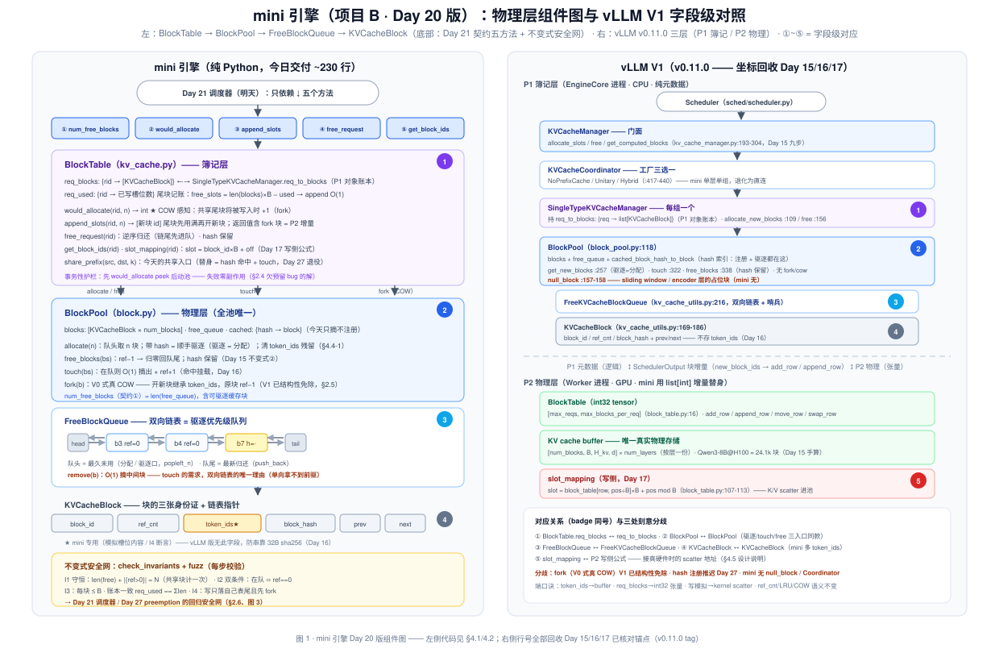
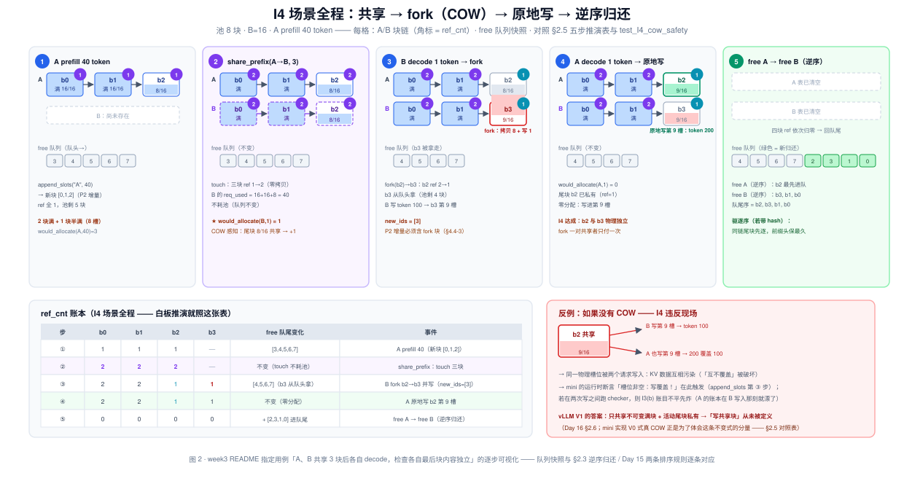
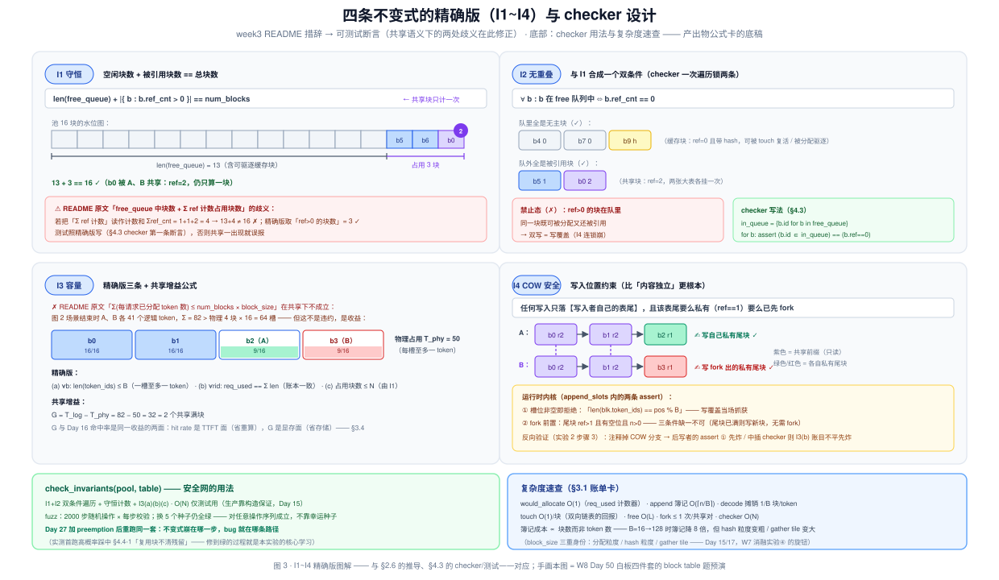

# Day 20 · mini 引擎开工（项目 B · 第 1 天）——KV 池、block table 与引用计数：亲手写出 vLLM 的 KV 簿记

> **系列**：推理系统优化专家岗 · 56 天打卡 | 第 3 周「vLLM V1 源码精读（下）—— KV 管理与执行」
> **今日位置**：Day 15~19 把 KV 的元数据层（block pool）、缓存层（hash 链）、执行层（attention 后端）、发射层（CUDA Graph）、流水层（async scheduling）依次读完——从今天起进入**写**的节奏：项目 B（mini 引擎）正式开工，为期三天（**D20 物理层与簿记层 → D21 continuous batching 调度器 → D27 chunked prefill + preemption + benchmark**）。今天的交付物是 KV 管理的地基：**BlockPool（固定大小块池 + 双向链表 free 队列 + 引用计数）· BlockTable（请求 → 块表 + 尾块记账）· COW（V0 式真·写时复制）**，纯 Python 约 200 行，但语义逐条对齐 vLLM v0.11.0，并用四条不变式 I1~I4 + 单元测试 + fuzz 校验器锁死——这套测试就是 Day 21 调度器与 Day 27 抢占逻辑的**安全网**。四条主线：**① 接口冻结（Day 21 只依赖五个方法——先定契约再写实现，这是多天项目的第一纪律）；② 三件套语义的代码级兑现（队序 = LRU 驱逐序、驱逐 = 分配、逆序归还——Day 15 仿真器的正式化）；③ COW 全流程（今天实现 V0 式真 COW，同时讲清 V1 为什么把它结构性设计掉——Day 16 答案的代码级复现）；④ 不变式的精确化（week3 README 的 I1/I3 措辞在共享语义下有歧义，本文给出可测试的精确版）**
> **前置要求**：Day 15（**最重要**：池不变式①②、三层结构、`allocate_slots` 九步、逆序归还、驱逐 = 分配——今天的 `BlockPool` 就是 Day 15 实验 1 仿真器的正式版）、Day 16（COW 的 v0.11.0 结构性答案、touch、hash 保留——今天实现「V0 式真 COW」并逐条对照）、Day 17（slot_mapping 写侧公式 `slot = block_id×B + offset`——今天的 `slot_mapping()` 直接抄它）、Day 4（PagedAttention 论文：引用计数与 COW 的设计动机）、Day 12（preemption 语义——I1~I4 是 Day 27 加抢占时的回归测试）、Day 19（账本思想：「调度只需要 token 会存在」——今天写的正是那套簿记的微缩版）；Day 15/16/17 实验 1 的三个仿真器今天全部升级为正式类
> **预计用时**：4 ~ 4.5 小时（写代码 2~2.5h + 测试与 fuzz 1~1.5h + 设计说明 0.5h）——项目日，比阅读日长，属正常
> **背景衔接**：这就是你做了三年的「**小表 + 大池**」：用偏移表管理 L1/L0A/L0B 多级 buffer、DMA burst 按 32B/64B 对齐——block table + 块池是同一道题的推理系统版，且分配逻辑永远在 Host 侧、从不在算子上（Day 15 的结论今天用代码再验一遍）。两个直接可迁移的习惯：① **引用计数管 buffer 生命周期**——你的双 buffer 乒乓靠 flag 对齐生命周期，这里的 `ref_cnt` 靠计数对齐块生命周期，共享与回收的语义一模一样；② **随机压力测试验证生命周期**——今天实验 3 的 fuzzer（2000 步随机操作 × 每步校验不变式）就是你验 buffer 生命周期的老办法，Day 27 加 preemption 后同一把安全网直接复用
> **实验环境**：纯 Python（3.10+）+ pytest，**无 GPU**——今天全部在笔记本完成
> **配套材料**：`week3/README.md` Day 20 节；三张 SVG：`assets/day20_mini_kv_architecture.svg`（今日主图：mini 组件图 ↔ vLLM V1 字段级对照 + 五方法契约面）、`assets/day20_cow_lifecycle.svg`（I4 场景全程：共享 → fork → 原地写 → 逆序归还，含 ref_cnt 账本与「无 COW 会怎样」反例）、`assets/day20_invariants_ledger.svg`（I1~I4 精确版图解 + checker 设计 + 复杂度速查卡——产出物公式卡的底稿）
> **版本口径**：本篇**几乎不新引源码坐标**——所有 vLLM 行号回收 Day 15/16/17 已按 **v0.11.0 tag** 逐行核对的锚点（引用处标注 Day N），mini 引擎代码为原创实现。⚠️ **三处与 week3/README.md Day 20 节的表述差异，以本文为准**：① **工程结构**：按 README 用 `block.py + kv_cache.py` 两文件；Day 21 §4.1 的目录树把两者合并为 `blocks.py`——**两种都对**，契约是五个方法（§2.2），合并或拆分随意，本文按两文件讲（职责分层更清楚）；② **I1/I3 措辞精确化**：README 写「free_queue 中块数 + Σ ref 计数占用块数 == num_blocks」「Σ(每请求已分配 token 数) ≤ num_blocks × block_size」——两处在**共享语义**下均有歧义（共享块会被重复计数），§2.6 给出可测试的精确版（I1 用「ref>0 的**块数**」，I3 拆成物理层三条），测试照精确版写；③ **prefix_cache.py**：README 自己注明「明日可选，Day 27 前完成即可」——今天**不实现** hash 链，`test_prefix.py` 也不存在，I4 的共享入口用显式 `share_prefix()`（hash 命中路径的替身）；今天的验收 = **`pytest tests/test_block.py` 全绿（I1~I4 各有用例）**——Day 21 实验 0 跑的正是这条命令。引用前先 `git log --oneline -3` 记版本

---

## 0. 今日学习目标

完成今天的学习后，你应该能够：

- [ ] **画出 mini 引擎组件图并背出字段级对照**（闭卷）：`BlockTable`（req_blocks / req_used + 五方法）→ `BlockPool`（blocks / free_queue / cached + allocate / free_blocks / touch / fork）→ `FreeBlockQueue`（双向链表三操作）→ `KVCacheBlock`（六字段），每个成员都能指认 vLLM v0.11.0 的对应物与行号出处（§2.2~2.3，图 1）
- [ ] **背出接口冻结的五个方法**：`num_free_blocks / would_allocate / append_slots / free_request / get_block_ids`——Day 21 的调度器只依赖它们（§2.2，图 1 底部）
- [ ] **论证双向链表的必要性**：free 队列为什么必须双向（touch 要 O(1) 摘中间块——单向链表无 prev 指针做不到），以及「队序 = LRU、驱逐 = 分配、逆序归还」三件套如何在代码里各就各位（§2.3）
- [ ] **手推 I4 场景的 ref_cnt 全程账本**（白板题）：A、B 共享 3 块 → B 追加触发 fork → A 原地写 → 双双释放 → 队尾序 `b2, b3, b1, b0`，并说出每一步哪些块进队、哪些块 ref 变几（§2.5，图 2）
- [ ] **解释 would_allocate 为什么必须 COW 感知**：共享尾块将被写入时要 +1，漏掉会怎样（欠预留 → append 中途 `NoFreeBlocksError` → 事务性破坏），对应 vLLM `allocate_slots → None` 判定的完整性（§2.4）
- [ ] **给出 I1/I3 的精确版并说明 README 措辞为何歧义**：共享块在 I1 只计一次；I3 的「Σ 每请求 token」在共享下可超物理容量——那是共享的收益不是违约（§2.6，图 3）
- [ ] **跑绿 `pytest tests/test_block.py`**：I1~I4 各有用例 + LRU/驱逐序 + touch + decode 节律 + 2000 步 fuzz（§5）
- [ ] 交付：**可复用的 BlockPool/BlockTable 代码** + **I4 账本推演表（预测 vs 实跑）** + **项目 README 设计说明第一段**（字段级对照 + slot 映射真硬件段落——week3 README Day 20 节的原始要求，§4.5）

---

## 1. 核心概念速览

| 概念 | 一句话定义 | 今日要达到的深度 |
|---|---|---|
| **`KVCacheBlock`** | 一个物理块的元数据：`block_id / ref_cnt / token_ids / block_hash / prev / next` | 对照 vLLM 版（kv_cache_utils.py:169-186）：**vLLM 不存 token_ids**（防串靠 sha256）——mini 存它是为了 I4 断言 |
| **`ref_cnt`** | 共享计数：几张块表上挂着这个块 | 能手推它在 share/fork/free 三条路径上的增减（§2.5） |
| **`FreeBlockQueue`** | 双向链表空闲队列，**队序本身就是驱逐优先级** | 背出三操作与调用方：`popleft_n`（allocate）/ `push_back`（free）/ `remove`（touch，O(1)） |
| **队序 = LRU** | 队头 = 最久未用（分配/驱逐口），队尾 = 最新归还 | 知道**没有独立 evictor**——Day 15 不变式②的代码级兑现 |
| **驱逐 = 分配** | `allocate` 从队头取到带 hash 的块时顺手清 hash、摘索引 | 能指出 `cached` 索引今天「只摘不注册」——注册是 Day 27 prefix_cache.py 的事 |
| **逆序归还** | `free_request` 按**链尾→链头**的顺序归还 | 两条排序规则（Day 15）：LRU 时间序 + 同链尾块先逐（前缀头保最久） |
| **`BlockTable`** | 簿记层：`req_blocks`（rid → 块链）+ `req_used`（已写槽位数） | 对照 `SingleTypeKVCacheManager.req_to_blocks`（P1 对象账本，Day 15） |
| **尾块记账 `req_used`** | 一个计数器换 O(1) append：`free_slots = len(blocks)×B − used` | 知道不存它就得 `sum(len(b.token_ids))`，O(L)/步 |
| **`would_allocate(rid, n)`** | peek：本次 append 要几个新块，**不动池** | 对照 `get_num_blocks_to_allocate`（Day 15 三笔账）；**必须 COW 感知**（§2.4） |
| **`append_slots(rid, n)`** | 尾块空位先用满、不够开新块、共享尾块先 fork | 对照 `allocate_slots`（kv_cache_manager.py:193-304）；返回值 = 新块 id 增量（**含 fork 块**） |
| **`free_request(rid)`** | 请求结束：逆序 ref−1，归零回队尾，hash 保留 | hash 保留 = Day 16「free 不清 hash → 缓存自命中」的地基 |
| **`get_block_ids(rid)`** | 读块表（测试断言 / P2 `add_row` 的原料） | 对照 `req_to_blocks` 与 P2 int32 tensor（block_table.py:16，Day 15） |
| **`slot_mapping(rid)`** | 逻辑位置 → 物理 slot：`bid×B + off` | Day 17 写侧公式的直投——接真硬件时的 scatter 地址 |
| **`share_prefix(src, dst, k)`** | 显式共享前 k 块（**今天**的共享入口） | 替身 = `get_computed_blocks` 命中 + touch（Day 16）；Day 27 换成 hash 链 |
| **`fork(block)`** | V0 式真 COW：开新块继承 token_ids，原块 ref−1 | **vLLM V1 无此方法**（结构性免除，Day 16 §2.6）——今天刻意实现的分歧点 |
| **I1~I4** | 守恒 / 无重叠 / 容量 / COW 安全 | 能背精确版（§2.6）：I1 用「ref>0 的块数」；I3 拆三条；I4 = 「写只落自己表尾且表尾要么私有要么先 fork」 |
| **checker** | O(N) 双条件遍历校验 I1~I3 的函数 | fuzz 每步调用；Day 27 加 preemption 后同一把安全网 |
| **`NoFreeBlocksError`** | 池耗尽的信号（事务性护栏：先 peek 后动池） | 对照 vLLM `allocate_slots → None`（Day 12/15）——调度器据此 stall/抢占 |

> **一句话本质**：mini 的 BlockPool + BlockTable = **把 Day 15 的三层元数据结构压成两个纯 Python 类的「账本系统」**——池管物理块的租借（谁空闲、谁被几张表引用、驱逐谁），表管逻辑链的记账（每请求写到哪个槽位、还差几个块）。全部正确性浓缩成四条不变式：**物理块要么在队且无人引用、要么不在队且被引用（I1/I2）；每个槽位至多一个 token、每本账算得平（I3）；写入只落在自己表尾，而表尾要么私有、要么先 fork（I4）**。逻辑在账本、物理在槽位、正确性在不变式——这三句话就是 vLLM KV 管理的全部，也是 Day 19「调度领先一步」赖以安全的那套簿记的微缩版。

---

## 2. 原理深入讲解

### 2.1 回顾与今日地图：从「读过」到「写过」

总计划在 Day 20 只写了一行：「实现：固定大小 block 的 KV 池 + block table + 引用计数（纯 Python）」。week3 README 把它展开为工程结构 + 骨架 + 四条不变式。今天的关键认知是项目 B 的**三天日程**——今天写的东西必须为后两天留好口子：

| 天 | 交付 | 站在什么上面 |
|---|---|---|
| **D20（今天）** | BlockPool + BlockTable + 引用计数 + COW + I1~I4 测试 | Day 15/16/17 的源码阅读与仿真器 |
| D21（明天） | waiting/running + token budget 四道闸 + 模拟执行器 + 端到端 demo | **今天冻结的五个方法** |
| D27（W4） | chunked prefill + preemption + static vs continuous benchmark | 今天的 fuzz 测试（不变式安全网） |

本周前五天的「积木」今天全部归位——三个实验仿真器不是白写的，它们分别是今天三个类的直系祖先：

| 本周积木 | 今天长成 | 归位动作 |
|---|---|---|
| Day 15 实验 1：`Pool` 仿真器（~30 行，list 当队列） | `BlockPool` + `FreeBlockQueue` | list 换真双向链表；`free_req` 的逆序语义搬进 `free_request`；补 `fork` |
| Day 16 实验 1：hash 链仿真器 | `cached` 索引 + `touch` + 驱逐 = 分配 | hash 字段与索引**占位**（今天只有驱逐路径摘它）；注册留给 Day 27 |
| Day 17 实验 1：paged gather 仿真器 | `BlockTable.slot_mapping` | 写侧公式原样抄：`slot = bid×B + off` |

还有一条暗线值得点破：Day 19 讲 async scheduling 时说，「调度领先一步」的安全性全靠那套**账本**（hash 只覆盖 computed−ph、写只落未注册块……）。今天你写的 `ref_cnt / req_used / token_ids` 就是同类账本的单线程版——先在同步模型里把账算平，Day 27 才有资格谈异步与抢占下的账本一致性。

### 2.2 设计决策：抄什么、省什么、冻结什么接口

**抄什么**（语义必须逐条对齐，错一条 Day 21/27 就崩）：

| 保留的 vLLM 语义 | 出处 | 今天的落点 |
|---|---|---|
| 固定大小 block，按块分配 | Day 4/15 | `block_size` 常量贯穿 |
| `ref_cnt` 引用计数共享 | Day 15（页共享） | `KVCacheBlock.ref_cnt` |
| 双向链表 free 队列，队序 = 驱逐序 | Day 15（FreeKVCacheBlockQueue） | `FreeBlockQueue` |
| 驱逐 = 分配（队头取到缓存块顺手清） | Day 15/16 | `BlockPool.allocate` |
| 逆序归还（链尾先进队） | Day 15（free_blocks :338 的调用约定） | `BlockTable.free_request` |
| free 不清 hash | Day 15 不变式② / Day 16 | `free_blocks` 原样保留 |
| touch 出队 + ref+1 | Day 16（命中挂载） | `BlockPool.touch` |
| 尾块空位先用满再开新块 | Day 15（allocate_slots 九步） | `append_slots` |
| slot = block_id×B + offset | Day 17（block_table.py:107-113） | `slot_mapping` |
| COW：共享块写入前分裂 | week3 README 骨架（**V0 式**，§2.5 对照） | `fork` |

**省什么**（每条都要能说出「为什么可以省」和「什么时候不能省」）：

| 省掉的 | 替身 | 为什么可以省 / 什么时候不能 |
|---|---|---|
| GPU KV buffer（真实物理存储） | `token_ids: list[int]` 模拟槽位内容 | 正确性不依赖存储介质；接真硬件时按 §4.5 的映射换 |
| hash 链与 `cached_blocks` 自动注册 | 显式 `share_prefix()` | 少的只是**自动命中**（复用机会），不动正确性；Day 27 补 `prefix_cache.py` |
| P2 张量账本（int32 block table） | `append_slots` 返回 `list[int]` 增量 | 增量的**形状**保住了（Day 21/27 对账用）；真系统里它是 `append_row` 的输入 |
| 多层 / 多 KV cache group | 单层单组 | Coordinator 三选一退化为直连；混合注意力模型才需要分组（Day 15） |
| null_block（占位块） | 无 | mini 无 sliding window / encoder-only 层（Day 15 §2.3） |
| watermark / 异步 / 抢占 | 无 | 分别是 Day 12 / Day 19 / Day 27 的主题，本周语义 = stall |

**冻结什么**——接口契约是三天项目里最值钱的一页纸。Day 21 §4.1 已经按这五个方法写好了它的调度器，今天实现的命名必须与之对齐（若你自己的实现命名不同，适配这五个即可）：

| # | Day 20 方法 | 语义 | vLLM 对照（Day 15） |
|---|---|---|---|
| ① | `pool.num_free_blocks` | 空闲块数（free 队列长度，**含可驱逐缓存块**） | `get_num_free_blocks` |
| ② | `would_allocate(rid, n) → int` | **peek**：本次 append 要几个新块，不动池（COW 感知） | `get_num_blocks_to_allocate`（三笔账） |
| ③ | `append_slots(rid, n) → list[int]` | 尾块空位先用满，不够则从池里取新块；返回新块增量 | `allocate_slots`（kv_cache_manager.py:193-304） |
| ④ | `free_request(rid)` | 请求结束：块 ref−1，归零回队尾（hash 保留） | `free`（hash 保留——Day 16 驱逐语义） |
| ⑤ | `get_block_ids(rid) → list[int]` | 读 block table（测试断言 / P2 `add_row` 原料） | `req_to_blocks` / P2 tensor |

> 为什么「先冻结接口」是多天项目的第一纪律：Day 21 的调度器逻辑（四道闸、stall、预算）与 KV 簿记逻辑（怎么分块）**解耦**后，两边可以独立演进——Day 27 给调度器加 preemption 时，只要五个方法的语义不变，簿记层一行都不用改。这正是 vLLM 把 `Scheduler` 与 `KVCacheManager` 拆开、只靠 `allocate_slots` 一个窄接口对话的原因（Day 10/15）。

### 2.3 BlockPool 与 FreeBlockQueue：双向链表、LRU 与「驱逐 = 分配」（图 1）



**为什么是双向链表**（面试必问，先在此想清楚）：free 队列的三个操作里，`popleft_n`（分配）和 `push_back`（归还）单向链表也能 O(1)（记个 tail 指针即可）；唯独 **`remove`（touch 摘块）要从队列中间摘任意块**——命中一个缓存块时，它在队列里的位置是任意的，摘除它必须改它的**前驱**的 next 指针，而找前驱必须反向走——单向链表做不到 O(1)。vLLM 的 `FreeKVCacheBlockQueue`（kv_cache_utils.py:216，Day 15）正是双向链表，`KVCacheBlock` 上的 `prev/next` 两个指针就是为此存在的。mini 版照抄，并把摘除后指针置 None（`b.prev = b.next = None`）——块会被反复回收复用，脏指针是链表 bug 的头号来源。

**三件套语义的落位**：

1. **队序 = LRU 驱逐序**：分配从队头拿（拿到的就是最久未用的空闲块）、归还从队尾进（最新归还的离驱逐口最远）——所以**不需要独立的 evictor**，队列本身就是驱逐优先级队列。Day 15 说过这是「链表序 = 驱逐序，无独立 evictor」，今天它变成三行代码。
2. **驱逐 = 分配**：`allocate` 从队头取块时，若取到的块**带 hash**（曾经是缓存块、其主人已结束），顺手 `del cached[hash]; b.block_hash = None`——这就是 Day 16 的「LRU 藏在分配路径里」。注意方向：**今天只有摘、没有注册**（注册发生在真系统的分配/入场路径 `cache_blocks`，Day 16 §2.5），所以 `cached` 索引在 Day 27 之前基本是空的，但驱逐分支的语义今天就位。
3. **逆序归还**：`free_request` 把请求的块链**反转后**逐个 `ref−1`、归零进队尾。效果：链尾块先进队（离驱逐口更近）、链头块后进（保得更久）。为什么合理？**前缀的复用价值集中在链头**——命中必然从链头开始（hash 链的递归结构，Day 16 图 1），驱逐时先丢链尾保链头，缓存命中率最大化。这是 Day 15 两条排序规则的第二条，今天由 `list(reversed(blocks))` 一行兑现。

**字段级对照表**（week3 README Day 20 节的原始要求——「这段话在面试里就是我读源码读进去了的证据」，§4.5 给出可直接贴进项目 README 的版本）：

| mini（block.py / kv_cache.py） | vLLM v0.11.0（坐标回收 Day 15/16） | 语义对齐点 |
|---|---|---|
| `KVCacheBlock.block_id / ref_cnt / block_hash` | `KVCacheBlock`（kv_cache_utils.py:169-186） | 块的三张身份证：物理下标 / 共享计数 / 缓存键 |
| `KVCacheBlock.token_ids` | **无此字段**（防串靠 32B sha256，kv_cache_utils.py:27） | mini 专用：模拟槽位内容，I4 断言的依据 |
| `KVCacheBlock.prev / next` | 同款链表指针 | 双向链表的物理基础（touch O(1)） |
| `FreeBlockQueue.popleft_n(n)` | `popleft_n`（`get_new_blocks` :257 调） | 队头分配 = 驱逐口 |
| `FreeBlockQueue.push_back(b)` | 归还路径（`free_blocks` :338 调） | 队尾进 = 逆序归还的落点 |
| `FreeBlockQueue.remove(b)` | touch :322 调 | **O(1) 摘中间块——双向的唯一理由** |
| `BlockPool.allocate(n)` | `get_new_blocks`（含顺手驱逐） | 驱逐 = 分配 |
| `BlockPool.free_blocks(bs)` | `free_blocks :338` | ref−1 / 归零回队尾 / hash 保留 |
| `BlockPool.touch(bs)` | `touch :322` | 命中挂载：出队 + ref+1 |
| `BlockPool.fork(b)` | **无**（V1 结构性免除，Day 16 §2.6） | V0 式真 COW——今天的刻意分歧（§2.5） |
| `BlockPool.cached` | `cached_block_hash_to_block`（block_pool.py:118 字段） | hash 索引：今天只摘不注册 |
| `BlockTable.req_blocks` | `SingleTypeKVCacheManager.req_to_blocks`（Day 15） | P1 对象账本 |
| `BlockTable.req_used` | 无显式对应（vLLM 靠满块性推断尾块） | 尾块记账：O(1) append 的关键（§2.4） |
| `BlockTable.append_slots` | `allocate_slots`（kv_cache_manager.py:193-304） | 尾块先用满再开新块 |
| `BlockTable.free_request` | Manager `free` → `free_blocks` | 逆序由调用方保证 |
| `BlockTable.slot_mapping` | 写侧公式（block_table.py:107-113） | `slot = block_id×B + off` |
| （无） | `null_block`（:157-158） | mini 无占位场景；`get_usage` 分母也无需 −1 |
| （无） | `KVCacheCoordinator` 工厂（:417-440） | 单层单组模型，门面直连物理层 |

### 2.4 BlockTable 与尾块记账：O(1) append、would_allocate 的账与 slot 映射

**尾块记账**是 `BlockTable` 的核心技巧：每个请求维护一个计数器 `req_used`（已写入的槽位数），于是「尾块还剩几个空位」= `len(blocks)×B − used`，**O(1)**。不存这个计数器，每次 append 都要 `sum(len(b.token_ids) for b in blocks)` 遍历整条链——Day 15 §2.7 讲过 vLLM decode 的 O(1) 路径靠的就是「不扫链表」，mini 用同一个计数器达成同款复杂度契约。

**`would_allocate(rid, n)` 的账**（对齐 Day 15 `get_num_blocks_to_allocate` 的三笔账；mini 无命中路径，退化为两笔 + COW 一笔）：

```
base = ⌈(n − 尾块空位) / B⌉⁺        # 笔1：装下 n 个 token 还差几个整块
fork = 1  若 尾块共享(ref>1) 且 尾块有空位 且 n>0    # 笔2：COW——共享尾块要写入前先分裂
返回 base + fork                     # 调度器拿它与 num_free_blocks 比较（Day 21 的 KV 闸）
```

**笔 2 是今天最容易漏的一行，漏掉的后果值得手推一遍**（欠预留 bug）：

- 场景：池只剩 0 块；A 有 `[b0满, b1满, b2(8/16)]`；B 通过 `share_prefix` 共享了这 3 块；B 要 decode 1 个 token。
- **不感知 COW** 的 `would_allocate`：尾块空位 = 8 ≥ 1 → 答 0。调度器（Day 21 的 KV 闸）判定「不用新块，放行」→ `append_slots` 执行到写入步才发现共享尾块不能写、要 fork、池里没块 → `NoFreeBlocksError` **在操作中途炸掉**——此时账本可能已半写（事务性破坏）。
- **感知 COW** 的版本：答 1 > 0 → 调度器把 B 标记 stalled，本步不排它——**在动池之前就把失败暴露出来**。这正是 vLLM 把 `allocate_slots` 设计成「先 `get_num_blocks_to_allocate` 算全、不够返回 `None`」的原因（Day 12/15）：判定必须完整，宁可拒绝，不可半途而废。

顺带精确化 fork 的触发条件——**不是「尾块共享就 fork」**：若尾块已满（ref>1 但空位 = 0），追加的 token 落在**新块**里，共享块一个字节都不写，不需要 fork。所以条件是三者同时成立：`num_tokens > 0`、`tail.ref_cnt > 1`、`尾块空位 > 0`。

**`append_slots` 的三步结构**（对照 `allocate_slots` 九步的 mini 版）：① 共享尾块先 fork（换表尾，新块 id 计入返回值）；② 空位不够则 `allocate(⌈need/B⌉)` 补块；③ 模拟写 token 落槽。注意**分层**：真实系统里第 ③ 步是 GPU 侧按 slot_mapping 的 scatter 写（Day 17），CPU 只付前两步的簿记成本——这也是 §3 复杂度账单把「簿记 O(⌈n/B⌉)」与「写模拟 O(n)」分开记的原因。

**`slot_mapping` 与真硬件的桥**（Day 17 写侧公式的直投）：

```
slot(逻辑位置 pos) = block_table[pos ÷ B] × B + (pos mod B)
```

例：B=16，某请求块表 `[3, 7, 12]`、已写 35 个 token → 第 36 个 token（pos=35）落在块 12 的 3 号槽 → 物理 slot = 12×16+3 = **195**。物理槽位在全池大 buffer 里**不连续**（12 后面跳到谁的块都行）——这就是 paged KV「靠间接寻址读非连续内存」的写侧入口（Day 17 图 2 的左半）。

### 2.5 共享与 COW：share_prefix、fork 五步账与 V0/V1 对照（图 2）



今天没有 hash 链，共享入口是显式的 `share_prefix(src, dst, k)`：把 src 块表的前 k 块挂给新请求 dst（`touch`：在队则摘出、ref+1）。**它替身的是 Day 16 的命中路径**（`get_computed_blocks` 查链 + touch + 断链即停）——语义等价的部分是「块被多张表引用」，缺的只是「自动发现前缀相同」。Day 27 的 `prefix_cache.py` 把 hash 链补上时，`share_prefix` 退役，`fork` 与不变式原封不动。

**fork 的五步账**（I4 场景第 ③ 步的慢动作）：

| 步 | 操作 | 副作用 |
|---|---|---|
| 1 | `allocate(1)` 开新块 | 可能顺手驱逐队头缓存块（驱逐 = 分配） |
| 2 | `new.token_ids = list(old.token_ids)` | 簿记层「复制」——真硬件的物理拷贝问题见下 |
| 3 | `old.ref_cnt −= 1` | fork 只发生在 ref≥2 的块上，减完 ≥1，**原块不会回队** |
| 4 | 调用方（BlockTable）把表尾换成新块 | 从此原块与新块各为其主 |
| 5 | 新块 id 计入 `append_slots` 返回值 | **P2 增量**：真系统里张量账本必须知道这个新块 |

**I4 场景全程推演**（图 2 的底稿；池 8 块、B=16，建议先在纸上自己推一遍再对照）：

| 步 | 操作 | A 的表 | B 的表 | ref 变化 | free 队尾变化 |
|---|---|---|---|---|---|
| ① | A prefill 40 token | `[b0(16), b1(16), b2(8)]` | — | b0,b1,b2 = 1 | — |
| ② | `share_prefix(A→B, 3)` | 同上 | `[b0, b1, b2]`（同三块） | 三块 1→**2** | —（touch 不动已占块） |
| ③ | B decode 1 token | 不变 | `[b0, b1, b3(9)]` ← fork | b2: 2→1；b3 = 1 | —（fork 消耗队头 b3） |
| ④ | A decode 1 token | `[b0, b1, b2(9)]` ← 原地写 | 不变 | b2 已私有（ref=1） | — |
| ⑤ | `free_request(A)` 后 `free_request(B)` | — | — | 依次归零 | 队尾序：**b2, b3, b1, b0** |

第 ⑤ 步的队序值得盯一眼：A 先结束，它的**尾块 b2 最先进队**；B 结束时 b3（fork 出来的）、b1、b0 依次进队。若这些块带 hash，下次驱逐从队头拿——**同链的尾块（b3）比链头（b0）先被逐**，前缀头保得最久（§2.3 逆序归还的效果，在此亲眼看到）。另外注意第 ④ 步：B fork 之后 b2 的 ref 已经回到 1（A 独占），所以 A 原地写、**零分配**——`would_allocate("A", 1) = 0`。fork 的成本在一对共享者身上**只付一次**。

**今天最重要的对照：mini 的真 COW vs vLLM V1 的结构性免除**。Day 16 给出过 v0.11.0 的标准答案——`block_pool.py` 里 grep 不到 `fork/copy/cow`，因为三条不变式（**只缓存不可变满块、活动尾块私有、命中只发生在入场**）让「向共享块写入」这个事件**从未被定义过**。今天的 mini 刻意反着做（week3 README 骨架要求 `fork`）：

| | mini（今天，V0 式真 COW） | vLLM V1（v0.11.0） |
|---|---|---|
| 共享什么块 | 任意前缀块，**含未满尾块** | 只共享满块（入库即不可变） |
| 活动尾块 | 可以共享（所以要 fork） | 永远私有（ref=1） |
| 「写共享块」事件 | 发生 → fork 分裂 | **从未发生**（结构性免除） |
| fork 方法 | 有（§4.1） | 无 |
| 物理拷贝 | 簿记层 copy token_ids；真硬件需一次 D2D（8 token × dtype） | 零——「写新块」本来就是常规路径（Day 15 §2.7） |
| 正确性依赖 | 靠 COW 分支的正确性 | 靠不变式的构造 |

为什么今天要写一遍「V1 已经设计掉的东西」：**没写过真 COW，就体会不到 V1 那条不变式的分量**。你在 fork 五步账里踩过的每一个坑（漏 +1 的欠预留、返回值漏 fork 块、ref 减错方向），都是 V1 用「只共享不可变块」一条不变式一次性消灭的整类问题——Day 16 说的「用不变式消灭机制」，和你做算子时「用对齐约束消灭分支」，今天在代码里对上了。面试被问 COW 时，这段「我实现过 V0 式的、然后理解了 V1 为什么不要它」就是最硬的答案。

### 2.6 四条不变式的精确化：README 措辞的歧义与可测试的版本（图 3）



week3 README 给的四条不变式是「意图正确、措辞在共享语义下有歧义」的典型——把它们变成**可测试的断言**之前必须先精确化（这就是「写测试逼你想清楚语义」的第一课）：

**I1（守恒）**。README 原文「free_queue 中块数 + Σ ref 计数占用块数 == num_blocks」——「Σ ref 计数」若读作 `Σ ref_cnt`（计数和），共享块会被重复计数（A、B 共享 3 块时 Σref=5 但占用块只有 3），等式破坏。精确版：

```
I1:  len(free_queue) + |{ b : b.ref_cnt > 0 }|  ==  num_blocks
     （空闲块数 + 「被引用的块」的个数 —— 共享块只计一次）
```

**I2（无重叠）**。原文「free_queue 中不存在 ref_cnt > 0 的块」。它和 I1 合起来其实是一个**双条件**，checker 就按这个写（一次遍历同时锁死两条）：

```
I2:  ∀b:  b 在 free 队列中  ⇔  b.ref_cnt == 0
     （在队 ⇔ 无主；不在队的块必然被 ≥1 张表引用）
```

**I3（容量）**。README 原文「Σ(每请求已分配 token 数) ≤ num_blocks × block_size」——共享下**不成立**，而且不成立得很有道理：§2.5 场景结束后，A、B 各有 41 个逻辑 token（Σ=82），而物理上只占 4 块 ×16 = 64 槽。**逻辑 token 数超过物理槽位数不是违约，是 prefix 共享的收益本身**（省下的 32 槽 = 2 个共享满块）。精确版拆成物理层三条，加上 I1 就完备了：

```
I3(a)  ∀b:  len(b.token_ids) ≤ B                # 每块不超载——一个槽位至多一个 token
I3(b)  ∀rid:  req_used[rid] == Σ_{b∈表(rid)} len(b.token_ids)   # 每本账算得平（账本一致性）
I3(c)  占用块数 × B ≤ num_blocks × B              # 由 I1 直接保证（分配块数 ≤ 总块数）
```

I3(b) 为什么总成立：写入只发生在自己表尾、表尾要么私有要么先 fork（I4 的运行时断言），且 fork 会复制 `token_ids`——所以每张表看到的块内容与它的 `req_used` 永远同步。这条断言是 fuzz 里抓「写覆盖 / 账本漂移」类 bug 的主力。

**I4（COW 安全）**。README 原文「两请求共享前缀后各自追加 token，互不覆盖」——精确化为**写入位置的约束**（比「内容独立」更根本）：

```
I4:  任何写入只落在 写入者自己的表尾，且 该表尾要么私有(ref==1) 要么已先 fork
     （append_slots 内的两条 assert 就是它：槽位非空即拒绝）
```

**checker 的设计**：把 I1+I2 合成双条件遍历 + I3 三条账目检查，写成一个 O(N) 的 `check_invariants(pool, table)`，fuzz 测试**每步操作后**调用（§5 实验 3）。两个工程细节：① 遍历队列收集 `in_queue` 集合再逐块比对——O(N) 对测试够用（生产系统靠构造保证，不靠检查，Day 15 的观点）；② I4 不进 checker——它是**行为**不变式，由 `append_slots` 内的运行时断言 + 场景测试覆盖。这套东西的复用价值在 Day 27 兑现：给调度器加 preemption（free 最新 running + computed=0 + 塞回 waiting）之后，重跑同一个 fuzz，不变式若崩，bug 就在抢占路径——**安全网不是文档，是可执行的回归测试**。

---

## 3. 性能模型与复杂度：今日的数学

### 3.1 操作复杂度账单（簿记层 ≠ 写入层）

mini 不追求运行性能（纯 Python、池只有几十块），但**复杂度契约**必须与 vLLM 对齐——因为这组操作在真系统里跑在调度的热路径上（Day 19 的 `C_sched`）：

| 操作 | mini 复杂度 | 真系统里的调用频率（Day 15/19） | 备注 |
|---|---|---|---|
| `would_allocate` | **O(1)** | 每请求每步一次（调度器 KV 闸的 peek） | 靠 `req_used` 计数器；扫链表版本是 O(L) |
| `append_slots`（簿记） | **O(⌈n/B⌉)** | prefill 入场一次；decode 绝大多数步 **0 新块 → O(1)** | decode 的 O(1) 快路径 = Day 15 §2.7 |
| `append_slots`（写模拟） | O(n) | **真系统不付**：token 落槽是 GPU 侧 scatter（Day 17） | mini 的 O(n) 是模拟代价，不是簿记代价 |
| `free_request` | O(L) | 请求 finish 时一次 | L = 该请求块链长 |
| `allocate(n)` | O(n) | 每步 Σ 新块数（下节算期望） | 含顺手驱逐的 O(1)/块 |
| `touch` | **O(1)/块** | prefix 命中时 | **双向链表的存在理由** |
| `fork` | O(1) + O(len) 拷贝 | 每对共享者的尾块**至多一次** | §2.5 第 ④ 步：先 fork 者独占，后者原地写 |
| `check_invariants` | O(N) | 仅测试（每步 fuzz） | 生产靠不变式构造保证（Day 15） |

一个值得记的分层结论：**KV 簿记的每步成本与「块数」同阶、与「token 数」无关**（decode 步 `⌈n/B⌉` 中 n=1）。把 B 从 16 调到 128，簿记成本降 8 倍——但 hash 粒度变粗（命中率降）与 gather tile 变大（Day 15/17 的 block_size 三重身份）——同一个旋钮的三本账，W7 消融实验④ 的预演。

### 3.2 decode 的分配节律：每 B 步一次台阶

S 路 running、每路每步 1 token：单路第 k 个 token 需要新块当且仅当 k ≡ 1 (mod B)。所以每步的期望新块数：

```
E[新块/步] = S × (1/B)      B=16, S=128 → 8 块/步；B=16, S=16 → 1 块/步
```

这就是 Day 15 图 2 台阶曲线的解析式——今天你可以直接在 `test_decode_cadence` 里数出来（B=4 时每 4 个 token 一个台阶）。对池设计的含义：free 队列的 churn 是**平稳的小溪**而不是洪峰（prefill 入场才是洪峰），所以 `allocate` 的 O(n) 摊到每步很小——这也是 vLLM 敢把 free 队列做成链表（而非更复杂结构）的底气。

### 3.3 碎片手算：内部碎片 vs 连续预留的浪费

固定块大小的代价是**内部碎片**（最后一块填不满）。每请求浪费上界 B−1 槽；停止位置均匀时期望 ~B/2：

```
内部碎片率 ≈ (S × B/2) / (S × L̄_blocks × B) ≈ 1/(2⌈L̄/B⌉)     L̄ = 平均上下文长
```

手算两档（Qwen3-8B @ H100，Day 15 的池：24.1k 块 × B=16 ≈ 38.6 万槽）：

| 场景 | 每请求上下文 | 内部碎片 | 对照：连续预留的浪费 |
|---|---|---|---|
| S=16 路、L̄=4k | ⌈4096/16⌉=256 块，浪费期望 8 槽/路 → 总 128 槽 | **0.03%** | 按 max_model_len=8k 预留 → 浪费 ~50% |
| S=192 路、L̄=300 | ⌈300/16⌉=19 块，浪费期望 8 槽/路 → 总 1536 槽 | **2.7%** | 预留 8k/实际 300 → 浪费 ~96% |

右列就是 Day 4 论文「原方案浪费 60-80%」的构成（预留差 + 外部碎片）；分页用**期望 B/2 的内部碎片**换掉整块外部碎片——两个数量级的差距，这就是 PagedAttention 的全部卖点压缩成的一行数。

### 3.4 共享的容量增益：I3 为什么必须精确化（定量面）

把 §2.6 的观察写成公式。定义**逻辑 token 总量**与**物理槽位占用**：

```
逻辑总量  T_log = Σ_r req_used[r]           （每请求账本求和——README 的 I3 左边）
物理占用  T_phy = Σ_{所有块} len(token_ids)   （每槽至多一 token，I3(a)）
共享增益  G = T_log − T_phy ≥ 0              （等于被共享的槽位数）
```

§2.5 场景：T_log = 41+41 = 82，T_phy = 16+16+9+9 = 50，**G = 32 = 2 个共享满块**。G 与 Day 16 的命中率是同一收益的两个侧面：hit rate 是 TTFT 面（省重算），G 是显存面（省存储）——W7 消融实验② 同时测两面。

---

## 4. 关键代码走读（完整可运行实现：引擎 ~230 行 + 测试 ~170 行）

> 阅读姿势：先看 §2 的语义再读代码，读完合上本文自己写一遍——**代码是检验理解的唯一标准**（Day 21 同款要求）。工程结构按 §2.2（block.py + kv_cache.py 两文件；想合并成 blocks.py 也行，契约不变）。

### 4.1 block.py：KVCacheBlock / FreeBlockQueue / BlockPool（~120 行）

```python
# mini_vllm/block.py
"""Day 20：固定大小 block 的 KV 池——BlockPool / FreeBlockQueue / KVCacheBlock。
语义对齐 vLLM v0.11.0（字段级对照见 §2.3 表）：队序=LRU 驱逐序、驱逐=分配、
逆序归还、touch O(1)、free 不清 hash。fork 为 V0 式真 COW（与 V1 的刻意分歧见 §2.5）。"""
from __future__ import annotations

from dataclasses import dataclass, field
from typing import Optional


class NoFreeBlocksError(Exception):
    """池中无空闲块（Day 21 调度器的 stall 信号；vLLM 里是 allocate_slots 返回 None）"""


@dataclass
class KVCacheBlock:
    """一个物理块的元数据（对照 kv_cache_utils.py:169-186——vLLM 版无 token_ids，防串靠 sha256）。"""
    block_id: int
    ref_cnt: int = 0                                    # 共享计数：几张块表挂着它
    token_ids: list[int] = field(default_factory=list)  # mini 专用：模拟槽位内容（I4 断言用）
    block_hash: Optional[int] = None                    # Day 27 prefix_cache.py 的钥匙；今天只有驱逐路径清它
    prev: Optional["KVCacheBlock"] = None               # 双向链表指针（FreeBlockQueue 用）
    next: Optional["KVCacheBlock"] = None


class FreeBlockQueue:
    """双向链表空闲队列 = 驱逐优先级队列（对照 FreeKVCacheBlockQueue，kv_cache_utils.py:216）。
    队头 = 最久未用（分配/驱逐口）；队尾 = 最新归还。双向的理由：remove 要 O(1) 摘中间块。"""

    def __init__(self, blocks: list[KVCacheBlock]):
        self._head, self._tail = KVCacheBlock(-1), KVCacheBlock(-1)    # 哨兵：边界零分支
        self._head.next, self._tail.prev = self._tail, self._head
        self._num_free = 0
        for b in blocks:
            self.push_back(b)

    def __len__(self) -> int:
        return self._num_free

    def __iter__(self):
        cur = self._head.next
        while cur is not self._tail:
            yield cur
            cur = cur.next

    def push_back(self, b: KVCacheBlock) -> None:       # 归还（free_blocks 调）
        last = self._tail.prev
        last.next, b.prev = b, last
        b.next, self._tail.prev = self._tail, b
        self._num_free += 1

    def popleft_n(self, n: int) -> list[KVCacheBlock]:  # 分配（allocate 调）
        assert n <= self._num_free
        out = []
        for _ in range(n):
            b = self._head.next
            self._head.next, b.next.prev = b.next, self._head
            b.prev = b.next = None                      # 摘干净：块会被复用，脏指针=链表 bug 之源
            out.append(b)
        self._num_free -= n
        return out

    def remove(self, b: KVCacheBlock) -> None:          # touch 摘块（O(1)——双向链表的存在理由）
        b.prev.next, b.next.prev = b.next, b.prev
        b.prev = b.next = None
        self._num_free -= 1


class BlockPool:
    """全池唯一物理层（对照 block_pool.py:118 的 BlockPool）。"""

    def __init__(self, num_blocks: int, block_size: int):
        self.num_blocks = num_blocks
        self.block_size = block_size
        self.blocks = [KVCacheBlock(i) for i in range(num_blocks)]
        self.free_queue = FreeBlockQueue(self.blocks)   # 开局全空闲：0..N-1 依次在队
        self.cached: dict[int, KVCacheBlock] = {}       # block_hash → block（今天只摘不注册，Day 27 接管）

    @property
    def num_free_blocks(self) -> int:                   # 契约①：Day 21 调度器的 KV 闸
        return len(self.free_queue)

    def allocate(self, n: int) -> list[KVCacheBlock]:
        """队头取 n 块（对照 get_new_blocks :257）。取到带 hash 的块 = 驱逐（=分配，Day 15 不变式②）。"""
        if n > self.num_free_blocks:
            raise NoFreeBlocksError(f"need {n}, free {self.num_free_blocks}")
        out = self.free_queue.popleft_n(n)
        for b in out:
            if b.block_hash is not None:                # reset_hash 只发生在被分配路径驱逐时
                del self.cached[b.block_hash]
                b.block_hash = None
            b.token_ids = []                            # 复用块清残留内容（§4.4 易错点 1——fuzz 第一咬）
            b.ref_cnt += 1
        return out

    def free_blocks(self, blocks: list[KVCacheBlock]) -> None:
        """ref_cnt−1，归零回队尾（对照 free_blocks :338）。调用方保证逆序（链尾先进队）。
        hash 保留——Day 16「free 不清 hash → 缓存自命中」的地基。"""
        for b in blocks:
            b.ref_cnt -= 1
            if b.ref_cnt == 0:
                self.free_queue.push_back(b)

    def touch(self, blocks: list[KVCacheBlock]) -> None:
        """缓存命中挂载（对照 touch :322）：在队则摘出，ref_cnt+1。"""
        for b in blocks:
            if b.ref_cnt == 0:
                self.free_queue.remove(b)
            b.ref_cnt += 1

    def fork(self, block: KVCacheBlock) -> KVCacheBlock:
        """V0 式真 COW（week3 README 骨架要求；vLLM V1 已结构性免除——§2.5 对照）：
        开新块继承 token_ids，原块 ref_cnt−1。调用方（BlockTable）负责换表尾。"""
        new = self.allocate(1)[0]
        new.token_ids = list(block.token_ids)           # 簿记层"复制"；真硬件的拷贝时机见 §2.5 表
        self.free_blocks([block])                       # fork 只发生在 ref≥2 上：原块不会真的回队
        return new
```

三个读码检查点（能答出说明读进去了）：① `popleft_n` 里为什么必须 `b.prev = b.next = None`？（块复用 + `remove` 的前提是「在队的块指针有效、不在队的为 None」……严格说 remove 只信 prev/next，脏指针会在下次 push_back 后串链）；② `allocate` 的驱逐分支为什么**不能**改成「先把整个队扫一遍挑无 hash 的块」？（那就不是 LRU 了——驱逐序是语义不是优化；真系统宁可驱逐缓存块也保持 O(1) 队头取）；③ `fork` 里 `free_blocks([block])` 为什么不会把原块归还进队？（fork 的前置条件 ref≥2，减 1 后 ≥1——这个前置条件由 `append_slots` 的 COW 判定保证，`fork` 自己不查，查了是防御性冗余）。

### 4.2 kv_cache.py：BlockTable——簿记层 + 容量记账（~110 行）

```python
# mini_vllm/kv_cache.py
"""Day 20：BlockTable——请求 → 块表的簿记层 + 池容量记账。
对照 vLLM 的 SingleTypeKVCacheManager.req_to_blocks（P1 对象账本，Day 15）；
P2 张量账本在 mini 里退化为 append_slots 的返回值（新块 id 增量）。"""
from __future__ import annotations

from math import ceil

from .block import BlockPool, KVCacheBlock, NoFreeBlocksError


class BlockTable:
    def __init__(self, pool: BlockPool):
        self.pool = pool
        self.block_size = pool.block_size
        self.req_blocks: dict[str, list[KVCacheBlock]] = {}  # P1 账本：rid → 块链
        self.req_used: dict[str, int] = {}                   # 尾块账：已写槽位数（O(1) append 的关键）

    # ---------- 内部 ----------
    def _free_slots(self, rid: str) -> int:
        return len(self.req_blocks.get(rid, [])) * self.block_size - self.req_used.get(rid, 0)

    def _tail(self, rid: str) -> KVCacheBlock | None:
        blocks = self.req_blocks.get(rid)
        return blocks[-1] if blocks else None

    # ---------- Day 21 契约：五个方法 ----------
    def would_allocate(self, rid: str, num_tokens: int) -> int:
        """peek：这次 append 要几个新块（不动池）。对照 get_num_blocks_to_allocate（Day 15 三笔账）。
        ⚠ COW 感知：共享尾块将被写入时 +1（fork）——漏掉的欠预留 bug 见 §2.4。"""
        need = num_tokens - self._free_slots(rid)
        n = max(0, ceil(need / self.block_size))
        tail = self._tail(rid)
        if (num_tokens > 0 and tail is not None and tail.ref_cnt > 1
                and self._free_slots(rid) > 0):
            n += 1                                         # fork 一块（尾块已满则不需要——写的是新块）
        return n

    def append_slots(self, rid: str, num_tokens: int,
                     token_ids: list[int] | None = None) -> list[int]:
        """为 rid 追加写 num_tokens 个 token（对照 allocate_slots，kv_cache_manager.py:193-304）。
        三步：① 共享尾块先 COW；② 空位外补新块；③ 模拟写（真系统 = GPU scatter，Day 17）。
        返回新块 id 增量（含 fork 块）——P2 张量账本 add_row/append_row 的 mini 替身。"""
        if self.would_allocate(rid, num_tokens) > self.pool.num_free_blocks:
            raise NoFreeBlocksError                        # 事务性护栏：先 peek 后动池，失败零副作用
        blocks = self.req_blocks.setdefault(rid, [])
        used = self.req_used.setdefault(rid, 0)
        new_ids: list[int] = []
        # ① COW：尾块共享且有空位且要写 → fork 换表尾
        if (blocks and num_tokens > 0 and blocks[-1].ref_cnt > 1
                and len(blocks) * self.block_size - used > 0):
            forked = self.pool.fork(blocks[-1])
            blocks[-1] = forked
            new_ids.append(forked.block_id)                # fork 块也是"新块"——P2 必须知道
        # ② 补块
        need = num_tokens - (len(blocks) * self.block_size - used)
        if need > 0:
            fresh = self.pool.allocate(ceil(need / self.block_size))
            blocks.extend(fresh)
            new_ids.extend(b.block_id for b in fresh)
        # ③ 模拟写：token 逐槽落位（断言 = I4 的运行时内核：写只落空槽）
        if token_ids is not None:
            assert len(token_ids) == num_tokens
            pos = used
            for t in token_ids:
                blk = blocks[pos // self.block_size]
                assert len(blk.token_ids) == pos % self.block_size, "槽位非空：写覆盖！"
                blk.token_ids.append(t)
                pos += 1
        self.req_used[rid] = used + num_tokens
        return new_ids

    def free_request(self, rid: str) -> None:
        """请求结束：逆序归还（链尾先进队 → 同链尾块先被逐，前缀头保最久）。hash 保留。"""
        blocks = self.req_blocks.pop(rid, [])
        self.req_used.pop(rid, None)
        self.pool.free_blocks(list(reversed(blocks)))

    def get_block_ids(self, rid: str) -> list[int]:       # 契约⑤：读表（断言 / P2 add_row 原料）
        return [b.block_id for b in self.req_blocks.get(rid, [])]

    # ---------- 共享入口（今天显式；Day 27 换成 hash 链命中） ----------
    def share_prefix(self, src_rid: str, dst_rid: str, num_blocks: int) -> int:
        """把 src 的前 num_blocks 块共享给新请求 dst（替身 = get_computed_blocks 命中 + touch，Day 16）。
        返回共享到的 token 数。dst 必须是新请求。"""
        src = self.req_blocks.get(src_rid, [])
        assert 0 < num_blocks <= len(src) and dst_rid not in self.req_blocks
        shared = src[:num_blocks]
        self.pool.touch(shared)                           # 在队则摘出（缓存块复活）+ ref+1
        self.req_blocks[dst_rid] = list(shared)
        self.req_used[dst_rid] = sum(len(b.token_ids) for b in shared)
        return self.req_used[dst_rid]

    # ---------- 观测 ----------
    def slot_mapping(self, rid: str) -> list[int]:
        """逻辑位置 → 物理 slot（Day 17 写侧公式）：slot = block_id×B + offset。接真硬件时拿它 scatter。"""
        return [b.block_id * self.block_size + off
                for b in self.req_blocks.get(rid, [])
                for off in range(len(b.token_ids))]

    @property
    def usage(self) -> float:                             # gpu_cache_usage_perc 微缩（分母含可驱逐缓存块）
        return 1.0 - self.pool.num_free_blocks / self.pool.num_blocks
```

### 4.3 checker + tests/test_block.py：不变式即测试（~140 行）

```python
# mini_vllm/checker.py
"""不变式校验器：I1+I2 合成双条件遍历 + I3 三条账目检查（§2.6 的精确版）。
fuzz 每步调用；Day 27 加 preemption 后，同一把安全网直接复用。"""
from __future__ import annotations

from .block import BlockPool
from .kv_cache import BlockTable


def check_invariants(pool: BlockPool, table: BlockTable) -> None:
    in_queue = {b.block_id for b in pool.free_queue}
    # I1 + I2（双条件，一次遍历锁两条）：在队 ⇔ ref_cnt==0
    for b in pool.blocks:
        assert (b.block_id in in_queue) == (b.ref_cnt == 0), \
            f"I1/I2 破坏：block {b.block_id} 在队={b.block_id in in_queue} ref={b.ref_cnt}"
    assert len(in_queue) + sum(1 for b in pool.blocks if b.ref_cnt > 0) == pool.num_blocks  # I1 守恒
    # I3 精确版（README 措辞的歧义见 §2.6——共享块只计一次，逻辑 token 可超物理槽）
    for b in pool.blocks:                                 # (a) 每块不超载：一槽至多一 token
        assert len(b.token_ids) <= pool.block_size, f"I3(a)：block {b.block_id} 超载"
    for rid, blocks in table.req_blocks.items():          # (b) 账本一致 + (c) 每请求容量
        assert table.req_used.get(rid, 0) == sum(len(b.token_ids) for b in blocks), \
            f"I3(b)：{rid} 账目不平"
        assert table.req_used.get(rid, 0) <= len(blocks) * pool.block_size
```

```python
# tests/test_block.py
"""Day 20 验收：I1~I4 各有用例 + 行为测试 + fuzz。全绿 = Day 21 的地基。"""
import random

import pytest

from mini_vllm.block import BlockPool, NoFreeBlocksError
from mini_vllm.checker import check_invariants
from mini_vllm.kv_cache import BlockTable


def make(num_blocks: int = 16, block_size: int = 4):
    pool = BlockPool(num_blocks, block_size)
    return pool, BlockTable(pool)


# ---------- I1/I2：守恒与无重叠（含共享块只计一次） ----------
def test_I1_I2_conservation_across_ops():
    pool, table = make()
    table.append_slots("A", 6, list(range(6)))            # 2 块（4+2）
    table.append_slots("A", 3, list(range(6, 9)))         # 尾块补满 → 3 块
    table.share_prefix("A", "B", 1)                       # 共享 b0：ref 1→2
    check_invariants(pool, table)
    table.free_request("A")                               # 共享块不回队（ref 2→1）
    check_invariants(pool, table)
    assert sum(1 for b in pool.blocks if b.ref_cnt > 0) == 1     # 只有 b0 被占（共享块计一次！）
    assert pool.num_free_blocks == pool.num_blocks - 1
    table.append_slots("B", 1, [100])                     # B 的尾块已私有 → 原地写 + 开 1 新块
    check_invariants(pool, table)
    assert table.get_block_ids("B") == [0, 3]             # 新块从队头拿：queue=[3..15,2,1] → 拿到 b3


# ---------- I3：容量与账本一致性 ----------
def test_I3_ledger_consistency_and_capacity():
    pool, table = make(num_blocks=4)                      # 4 块池 × B=4 = 16 槽
    table.append_slots("A", 7, list(range(7)))
    assert table.req_used["A"] == sum(len(b.token_ids) for b in table.req_blocks["A"])
    with pytest.raises(NoFreeBlocksError):                # 容量护栏：4 块池装不下 17+ token
        table.append_slots("A", 10, list(range(7, 17)))
    check_invariants(pool, table)                         # 失败后账本无损（事务性）


# ---------- I4：COW 安全（week3 README 指定场景） ----------
def test_I4_cow_safety():
    pool, table = make(num_blocks=8, block_size=16)
    table.append_slots("A", 40, list(range(40)))          # [b0满, b1满, b2(8/16)]
    table.share_prefix("A", "B", 3)                       # A、B 共享 3 块
    assert table.would_allocate("B", 1) == 1              # ★ COW 感知：尾块有空位本可 0 块，共享 → fork 1 块
    assert table.append_slots("B", 1, [100]) == [3]       # B fork 出 b3 并写入
    assert table.would_allocate("A", 1) == 0              # A 的尾块已私有（ref 2→1）→ 原地写
    assert table.append_slots("A", 1, [200]) == []
    check_invariants(pool, table)
    a_tail, b_tail = table.req_blocks["A"][-1], table.req_blocks["B"][-1]
    assert a_tail is not b_tail                           # 各自尾块物理独立
    assert a_tail.token_ids[-1] == 200 and 100 not in a_tail.token_ids
    assert b_tail.token_ids[-1] == 100 and 200 not in b_tail.token_ids
    assert table.req_blocks["A"][0] is table.req_blocks["B"][0]      # 共享前缀未被破坏
    assert table.slot_mapping("A")[:32] == table.slot_mapping("B")[:32]
    table.free_request("A")
    table.free_request("B")
    assert [b.block_id for b in pool.free_queue][-4:] == [2, 3, 1, 0]  # 逆序归还的队尾序（§2.5 ⑤）


# ---------- would_allocate 的 COW 感知：欠预留 bug 的反例 ----------
def test_cow_reservation_and_transactional_guard():
    pool, table = make(num_blocks=4, block_size=16)
    table.append_slots("A", 40, list(range(40)))          # b0,b1,b2(8/16)，剩 1 块
    table.append_slots("D", 4, [0, 0, 0, 0])              # D 拿走最后 1 块 → 池空
    table.share_prefix("A", "B", 3)                       # B 共享（touch 不耗池）
    assert table.would_allocate("B", 1) == 1              # 感知版：+1；无感知版会答 0 → 调度器放行 → 中途炸
    with pytest.raises(NoFreeBlocksError):                # 事务性护栏：动池前先 peek
        table.append_slots("B", 1, [100])
    check_invariants(pool, table)                         # 失败零副作用，账本无损


# ---------- 行为：LRU 队序 / 驱逐=分配 / hash 保留 ----------
def test_lru_eviction_is_allocation():
    pool, table = make(num_blocks=4, block_size=4)
    table.append_slots("A", 8, list(range(8)))            # b0,b1 满
    for b, h in zip(table.req_blocks["A"], ("h0", "h1")): # 手动入库（真系统在分配路径注册，Day 16）
        b.block_hash = h
        pool.cached[h] = b
    table.free_request("A")                               # 逆序：b1 先入队尾 → 队序 [2,3,1,0]
    assert [b.block_id for b in pool.free_queue] == [2, 3, 1, 0]
    assert pool.blocks[1].block_hash == "h1"              # ★ hash 保留（Day 15 不变式②）
    got = pool.allocate(3)                                # 队头取 2,3,1 —— b1 带 hash → 顺手驱逐
    assert [b.block_id for b in got] == [2, 3, 1]
    assert pool.blocks[1].block_hash is None and "h1" not in pool.cached
    assert pool.blocks[0].block_hash == "h0"              # 队头未取到 → 缓存仍活


def test_touch_rescues_from_middle_of_queue():
    pool, table = make(num_blocks=4, block_size=4)
    table.append_slots("A", 4, [1, 1, 1, 1])
    table.free_request("A")                               # 队 [1,2,3,0]
    pool.blocks[0].block_hash = "h0"                      # 模拟缓存块（带 hash 躺在队中）
    pool.cached["h0"] = pool.blocks[0]
    pool.touch([pool.blocks[0]])                          # 命中：从队中 O(1) 摘出 + ref+1
    assert pool.num_free_blocks == 3
    assert pool.blocks[0].ref_cnt == 1 and pool.blocks[0].block_hash == "h0"
    assert [b.block_id for b in pool.free_queue] == [1, 2, 3]


# ---------- 行为：decode 分配节律（Day 15 台阶曲线的 mini 版） ----------
def test_decode_cadence_every_B_steps():
    pool, table = make(block_size=4)
    news = [table.append_slots("A", 1, [i]) for i in range(10)]
    assert [len(n) for n in news] == [1, 0, 0, 0, 1, 0, 0, 0, 1, 0]   # 第 1/5/9 个 token 开新块
    assert table.get_block_ids("A") == [0, 1, 2]
    assert table.slot_mapping("A") == list(range(10))     # 新池连续；非连续场景见下一测试


def test_slot_mapping_is_paged_not_contiguous():
    pool, table = make(num_blocks=8, block_size=4)
    table.append_slots("W", 3, [0, 0, 0])                 # W 占 b0
    table.free_request("W")                               # b0 回队尾 → 队序 [1..7, 0]
    table.append_slots("X", 9, list(range(9)))            # X 拿 b1,b2,b3（b0 在队尾拿不到）
    assert table.get_block_ids("X") == [1, 2, 3]
    assert table.slot_mapping("X") == [4, 5, 6, 7, 8, 9, 10, 11, 12]  # 跳过 0..3：物理不连续


# ---------- fuzz：随机操作 × 每步校验（Day 27 的安全网） ----------
def test_fuzz_invariants_hold_after_every_op():
    rng = random.Random(20260215)
    pool, table = make(num_blocks=32, block_size=4)
    live: list[str] = []
    counter = 0
    for _ in range(2000):
        op = rng.random()
        if op < 0.45 or not live:                         # 新请求 prefill
            rid = f"r{counter}"; counter += 1
            n = rng.randint(1, 12)
            if table.would_allocate(rid, n) <= pool.num_free_blocks:
                table.append_slots(rid, n, list(range(n)))
                live.append(rid)
        elif op < 0.75:                                   # decode 追加
            rid = rng.choice(live)
            n = rng.randint(1, 3)
            if table.would_allocate(rid, n) <= pool.num_free_blocks:
                table.append_slots(rid, n, list(range(n)))
        elif op < 0.85 and len(live) >= 2:                # 共享前缀（COW 压力源）
            src = rng.choice(live)
            rid = f"r{counter}"; counter += 1
            table.share_prefix(src, rid, rng.randint(1, len(table.req_blocks[src])))
            live.append(rid)
        else:                                             # 请求结束
            rid = rng.choice(live)
            live.remove(rid)
            table.free_request(rid)
        check_invariants(pool, table)                     # ★ 每步全量校验 I1~I3；I4 由 append 内断言把守
    assert all(len(b.token_ids) <= pool.block_size for b in pool.blocks)
```

### 4.4 五个易错点剖析（写错概率从高到低；第 1 条与表后注的 harness bug 是我在首次跑 fuzz 时真实踩中的）

| # | 易错点 | 症状 | 根因与修法 |
|---|---|---|---|
| 1 | `allocate` 不清复用块的 `token_ids` | fuzz 跑几十步后在「**槽位非空：写覆盖！**」断言炸 | 块归还后内容仍在，被重新分配时原主人的 token 还挂在上面。修法：`allocate` 时清空。**必须在 allocate 清、不能在 free 清**——free 保留内容是缓存复用的前提（Day 16：物理 KV 留在原地，命中才能零拷贝）。vLLM 无此问题：块上不存内容，物理残留无害（读必须经元数据授权） |
| 2 | `would_allocate` 不感知 COW | 池空时共享尾块的 append 在**中途**抛 `NoFreeBlocksError`，Day 21 调度器无法预判 | 判定不完整。修法：fork 条件成立时 +1（§2.4 的手推）——**判定宁可拒绝、不可半途而废** |
| 3 | `append_slots` 返回值漏掉 fork 块 | I4 仍绿（物理块独立），但 P2 视角丢增量：真系统里张量 block table 不知道 b3，attention 读表错块 | fork 出的块对**这张表**就是新块。修法：`new_ids.append(forked.block_id)` |
| 4 | `free_request` 忘了逆序 | 队尾序变成 `b0, b1, b2, b3`——驱逐时先丢**前缀头**，命中率反转向 | `list(reversed(blocks))` 一行。记住「命中的入口在链头，所以链头最值钱」 |
| 5 | 链表摘除后不清指针 | 复用块带着脏 `prev/next`，下一次 push_back 后队列**成环**，`__iter__` 死循环 | `popleft_n/remove` 里 `b.prev = b.next = None`。这是所有「对象池 + 链表」设计的通病 |

> 另一类坑属于**压测脚本自己**：fuzz 的 rid 生成若两个分支模式不一致（先自增 vs 后自增），会撞名 → `live` 里出现重复 rid → 释放一次后 `req_blocks` 查无此键（KeyError）。压测器也要守自己的不变式（rid ↔ live ↔ req_blocks 三者同步）——**看到异常先分清是引擎的 bug 还是 harness 的账不平**，这个判断本身就是要练的工程能力。

### 4.5 设计说明（可直接扩写进项目 README——week3 README Day 20 节的原始要求）

> **与 vLLM V1 的对应**：本实现的 `BlockPool/FreeBlockQueue/BlockTable` 是 vLLM v0.11.0 三层 KV 管理的单层微缩（字段级对照见 §2.3 表）：`allocate/free_blocks/touch` 对应 `get_new_blocks(:257) / free_blocks(:338) / touch(:322)`，队序即 LRU 驱逐序、驱逐即分配、归还按链逆序。三处**刻意分歧**：① mini 的 `KVCacheBlock` 存 `token_ids`（模拟物理槽位、支撑 I4 断言），vLLM 不存（防串靠 sha256）；② mini 实现 V0 式真 COW（`fork`），vLLM V1 用「只共享不可变满块」一条不变式结构性免除之；③ hash 注册推迟（Day 27 `prefix_cache.py`），今天 `cached` 索引只有驱逐路径会摘。
>
> **如果底层换成真实设备**：`token_ids` 消失，换成 `[num_blocks, B, H_kv, d]` 的 KV buffer（按层一份）；`req_blocks` 变成 P2 的 int32 张量 block table（`[max_reqs, max_blocks_per_req]`，`add_row/append_row` 吃 `append_slots` 的返回增量）；写入不再由 CPU 模拟，而是 attention kernel 按 `slot_mapping` scatter：**`slot = block_id × block_size + offset`**——逻辑在 P1（Python 对象账本），物理在 P2（张量与显存），两者靠 SchedulerOutput 的块增量对账。给新硬件（如昇腾）移植时，唯一必须重写的是这个 buffer 的物理布局与 gather 算子（Day 17 的五项接口清单），簿记层原封不动。

---

## 5. 动手实验（约 3 ~ 3.5 小时，无 GPU）

### 实验 0（必做，15 min）：搭工程 + Day 15 仿真器迁移

1. 建目录（§2.2 的结构），`pip install pytest`；
2. **先不写实现**，把 §4.3 的测试文件原样存好——今天按「测试先行」的节奏走：测试就是需求文档（I1~I4 的可执行版本）；
3. 迁移 Day 15 实验 1 的验证到新类上（池级 API 直调，不走 BlockTable），确认三个老断言仍然成立：

```python
# tests/test_day15_upgrade.py —— 实验 0：老积木的回归测试（池级 API 直调）
from mini_vllm.block import BlockPool

def test_day15_scenarios_on_real_classes():
    pool = BlockPool(10, 1)                               # block_size=1：一块一 token，纯粹看池行为
    A = pool.allocate(5)                                  # A 占 b0..b4
    for b, i in zip(A, range(5)):
        b.block_hash, pool.cached[f"h{i}"] = f"h{i}", b
    B = pool.allocate(3)                                  # B 占 b5..b7
    assert pool.num_free_blocks == 2
    pool.free_blocks(list(reversed(A)))                   # ★ 逆序：b4 先进队
    assert [b.block_id for b in pool.free_queue] == [8, 9, 4, 3, 2, 1, 0]
    C = pool.allocate(6)                                  # 驱逐 = 分配：顺手清 b4..b1 的 hash
    assert [b.block_id for b in C] == [8, 9, 4, 3, 2, 1]
    assert pool.blocks[4].block_hash is None and pool.blocks[0].block_hash == "h0"
    pool.touch([pool.blocks[0]])                          # 命中链头块：出队 + ref+1
    assert pool.num_free_blocks == 0 and pool.blocks[0].ref_cnt == 1
```

> 池级行为与 Day 15 仿真器逐条对上后，把 Day 15 的三个思考题（驱逐顺序为什么是 B4→B0？不逆序会怎样？touch 与 popleft_n 的顺序？）再口答一遍——**今天之后它们应该全部变成肌肉记忆**。

### 实验 1（核心，90 ~ 120 min）：实现 block.py + kv_cache.py，I1~I3 绿

1. **先自己写**（合上本文），从 §2.6 的不变式出发推语义，卡住了再看 §4.1/4.2——尤其 `would_allocate` 的 COW 感知和 `append_slots` 的三步顺序；
2. 每写完一个类就跑对应测试：`pytest tests/test_block.py -k "I1_I2 or I3 or cadence or slot_mapping" -v`；
3. **预测 → 跑 → 归因**：在 `test_decode_cadence` 里，跑之前先手写你预测的 10 个 `len(new)`；在 `test_slot_mapping_is_paged_not_contiguous` 里，先手算 X 会拿到哪三块、slot 列表长什么样。不一致就找出是哪笔账算错了——这个循环是今天最重要的学习行为（Day 21 同款要求）。

### 实验 2（45 ~ 60 min）：COW + I4 + ref_cnt 账本推演

1. 实现 `fork` + `share_prefix`（注意 §4.4 易错点 1/2），跑绿 `test_I4_cow_safety` 与 `test_cow_reservation_and_transactional_guard`；
2. **白板推演**（本实验的产出物）：池 8 块、B=16，把 §2.5 的五步表遮住，从「A prefill 40 → share 3 块 → B decode → A decode → free A → free B」逐步手写每步的：A/B 块表、每个相关块的 ref_cnt、free 队列全文。写完与 §2.5 表和图 2 对照；
3. 反向实验（加深理解）：把 `append_slots` 里 COW 分支的 `new_ids.append(forked.block_id)` 注释掉——测试照样全绿（为什么？I1~I4 都在 P1 侧，不查跨层增量）；再把整个 ① COW 分支注释掉（不 fork、直接写共享块）——哪个断言先炸？**答案**：后写者 A 的「槽位非空：写覆盖！」（B 先把 token 100 写进了共享尾块 b2 的第 9 槽）；若在两次 append 之间插一次 `check_invariants`，则 **I3(b) 账目不平**更先炸——A 的账本在 B 写入那一刻就漂了（req_used=40 vs 块内容和 41）。把两个报错都记进笔记（这就是「写覆盖」的两种现场：行为断言 vs 账本断言）。

### 实验 3（选做但强烈建议，30 ~ 45 min）：fuzz + 驱逐序 + 容量手算

1. 跑 `test_fuzz_invariants_hold_after_every_op`（2000 步 × 每步校验），记录用时。**预期第一跑就会踩 §4.4 的易错点 1 或 harness 撞名**——修到绿的过程就是本实验的核心学习；
2. 改造 fuzz 观察 COW 触发率：在 `append_slots` 的 fork 分支加计数器，跑完打印「fork 次数 / append 次数」——调整 `op < 0.85` 的共享概率（0.85 → 0.60），看触发率怎么变（参考值：share 概率 0.15 时 fork ≈ appends 的 4~6%）；
3. **容量手算对账**（§3.3/§3.4 的 mini 版）：池 32 块 × B=4 = 128 槽，fuzz 结束时打印 `Σ req_used`（逻辑）与 `Σ len(token_ids)`（物理）——验证 G = 逻辑 − 物理 ≥ 0，并解释为什么 fuzz 的 G 通常很小（共享概率低 + 前缀短，Day 16 命中率公式的直觉版）；
4. 把 fuzz 的随机种子换 3~5 个重跑——不变式仍全绿（这就是「安全网」的含义：对任意操作序列成立，而不是对某个幸运种子成立）。

## 6. 面试高频问题（含答题骨架）

**Q1：vLLM 的 free 队列为什么是双向链表？数组或单向链表行不行？**

> 骨架：先列三个操作的需求——`popleft_n`（分配，队头）、`push_back`（归还，队尾）、`remove`（touch，**任意位置**）。数组：头出尾进 O(1)，但 remove 是 O(N) 且内存不紧凑（对象数组）；单向链表：头出尾进 O(1)（记 tail 指针），**remove 拿不到前驱**；双向链表：三者全部 O(1)，代价是每块两个指针。落点：touch 是 prefix 命中路径上的必经操作，命中块在队列中的位置任意——所以「O(1) 摘中间块」是硬需求，双向是下限。加分项：我实现过（fork/touch/free 的指针清理是坑），并知道队列序本身就是驱逐优先级——**没有独立 evictor**。

**Q2：（白板题）两个请求共享 3 个块后各自 decode，推演 ref_cnt 与 free 队列的全过程。**

> 骨架：就是 §2.5 的五步表——共享时三块 ref 1→2；先写者 fork（新块 ref=1、原块 2→1）、后写者原地写（尾块已私有）；释放时逆序归还、队尾序 = 尾块在前。三个考点全在里面：fork 至多发生一次（先到先得）、原块不回队（ref≥1）、驱逐序保前缀头。能当场写出这张表 = KV 簿记真正过关。

**Q3：你实现过真 COW，那 vLLM V1 为什么没有 COW？**

> 骨架：先纠正前提——v0.11.0 的 `block_pool.py` grep 不到 fork/copy；三条不变式（只缓存不可变满块 / 活动尾块私有 / 命中只发生在入场）让「写共享块」事件从未被定义，COW 被结构性免除；V0 对比（可变块共享才需要真 fork + 物理拷贝）；我今天实现 V0 式的动机：踩过 fork 五步账的坑（欠预留、返回值漏块、指针脏），才理解 V1 用一条不变式消灭整类问题的分量——「用不变式消灭机制」，与算子优化里「用对齐约束消灭分支」同构。残存的真实拷贝在 KVConnector（P/D 传输语义），不是 COW。

**Q4：`would_allocate` 这类「先算账再动手」的接口为什么必须完整（比如算上 COW 的 +1）？**

> 骨架：不完整的判定会让失败**延迟暴露**在动池之后——append 半途抛异常意味着账本可能已半写（事务性破坏），调用方（调度器）无法安全重试。vLLM 的同款设计：`allocate_slots` 先 `get_num_blocks_to_allocate` 算全三笔账，不够直接返回 `None`，调度器据此排队/抢占。落点：**判定的完整性 = 系统的可恢复性**。我实现里的事务性护栏（先 peek 后动池）就是这个原则的 mini 版，fuzz 证明失败零副作用。

**Q5：固定大小 block 的浪费在哪？与连续分配比呢？给数字。**

> 骨架：内部碎片 ≤ B−1 槽/请求、期望 ~B/2，碎片率 ≈ 1/(2⌈L̄/B⌉)——L̄=4k、B=16 时 0.03%；对照连续预留（按 max_model_len 预留）：L̄=300、预留 8k 时浪费 ~96%，这正是 PagedAttention 论文 60-80% 浪费的构成。加分项：block_size 的三重身份（分配粒度 / hash 粒度 / gather tile）与「簿记成本 ∝ 块数而非 token 数」的复杂度账（§3.1/3.3）。

**Q6：如果把你的 mini 引擎接到真实 GPU/NPU 上，哪些部分变成张量、哪些不变？**

> 骨架：四换四不换——`token_ids` → 按 `[num_blocks, B, H_kv, d]` view 的 KV buffer（每层一份）；`req_blocks` → int32 block table 张量（`add_row/append_row` 吃增量）；写模拟 → kernel 按 `slot = block_id×B + off` scatter（Day 17 写侧）；`num_free_blocks` 判定 → 语义完全不变。不换的：ref_cnt/逆序归还/LRU 队序/COW 语义——**簿记层与物理层解耦正是这个设计的可移植性所在**，也是给新硬件写后端时唯一要动 gather/buffer 布局而不用动调度的原因（Day 17 五项清单）。

## 7. 今日总结

- **接口先行**：五方法契约（`num_free_blocks / would_allocate / append_slots / free_request / get_block_ids`）先于实现冻结——Day 21 的调度器、Day 27 的抢占都站在它上面，三天项目的解耦纪律。
- **三件套的代码级兑现**：队序 = LRU（无独立 evictor）、驱逐 = 分配（顺手清 hash）、逆序归还（尾块先逐、前缀头保最久）——Day 15 的语义今天全部变成可执行、可测试的行为。
- **COW 的完整闭环**：mini 实现 V0 式真 fork（五步账 + COW 感知的判定 + P2 增量含 fork 块），同时讲清 V1 用「只共享不可变满块」一条不变式把它结构性免除——「用不变式消灭机制」。
- **不变式的精确化**：I1 共享块只计一次；I3 拆成物理层三条（每块不超载 / 账本一致 / 容量）——「Σ 逻辑 token 可超物理槽」是共享的收益（G = T_log − T_phy），不是违约。
- **安全网思维**：checker + 2000 步 fuzz × 每步校验——Day 27 加 preemption 时重跑同一套测试，bug 就藏在不变式崩掉的那一步。**读过源码和亲手实现是两个段位**（week3 README Day 20 节的原话），今天的每一个坑（欠预留、漏增量、脏指针）都是下周的免疫力。

## 8. 今日自测题（先做，再展开答案）

**T1**：`FreeBlockQueue` 的三个操作里，哪两个用单向链表也能 O(1)？双向链表的不可替代性只在哪个操作、为什么？

> 答：`popleft_n`（头出）与 `push_back`（尾进，记 tail 指针）单向即可；不可替代的是 `remove`——touch 要从队列**中间**摘任意块，必须修改其前驱的 next，而单向链表找不到前驱（得从头扫，O(N)）。

**T2**：B=16 的池里，一个请求的第 97 个 token 会触发第几块新块？写出判定式。

> 答：第 **7** 块。新块当且仅当 token 序号 k 满足 k ≡ 1 (mod B)：k=1,17,33,49,65,81,**97**。判定式：`⌈k/B⌉ > ⌈(k−1)/B⌉`。每 B 个 token 一次台阶（§3.2）。

**T3**：举一个具体反例证明 README 的 I3 原文（「Σ 每请求 token ≤ num_blocks×B」）在共享下不成立，并说明为什么这不是 bug。

> 答：§2.5 场景结束时：A、B 各 41 个逻辑 token，Σ = 82 > 物理 4 块 × 16 = 64 槽。不是 bug 而是收益：两人共享了 b0、b1 两个满块（省 32 槽），G = T_log − T_phy = 82 − 50 = 32。物理层的正确约束是 I3(a)：每槽至多一个 token。

**T4**：`append_slots` 的返回值为什么必须包含 fork 出来的块？漏掉它哪个测试仍然全绿、什么场景下才会暴露？

> 答：fork 块对这张表是「新出现的物理块」——真系统里 P2 的 int32 block table 靠返回增量 `append_row`，漏了它 attention 读表就缺一块（读到旧值/越界）。I1~I4 测试不暴露（不变式都在 P1 侧，物理独立性与账目都平）；只有接到执行层（Day 21 的 demo / 真系统的 P2 对账）才暴露——**簿记层测试的盲区在跨层增量**，这是「每层测试绿 ≠ 系统对」的典型例子。

**T5**：逆序归还保护的是什么？如果改为正序归还，给出一个具体的损失场景。

> 答：保护**前缀头的缓存寿命**（命中入口在链头）。正序归还时链头先进队、离驱逐口更近：A 结束后 b0（链头）先被后续分配取走驱逐，B 随后到来时 hash 链在第一块就断——本来可命中 3 块的只剩 0 块。逆序则先逐 b2/b1，B 的命中率梯度下降更慢（Day 16 断链即停的镜像场景）。

**T6**：fuzz 测试里，「share 之后紧跟 append」为什么是价值最高的操作组合？

> 答：它是唯一能触发 I4 运行时断言（「槽位非空：写覆盖」）的路径——share 制造共享尾块，append 对它写入。没有 share，append 永远写私有尾块，COW 分支是死代码；没有紧跟的 append，共享只是 ref_cnt 变大。**fuzz 的价值 = 操作组合覆盖不变式的触发条件**，这与你做 buffer 生命周期压测时「分配→共享→释放交错」是同一条方法论。

## 9. 今日产出物

**① mini 引擎物理层代码 + 全绿测试**（项目 B 里程碑 1/3）：

> `block.py / kv_cache.py / checker.py`（~230 行，§4.1~4.3）+ `tests/test_block.py`（9 个用例）
> `pytest tests/test_block.py -v` 全绿截图/贴文（含 `test_I4_cow_safety` 与 fuzz）
> fuzz 记录：2000 op × 每步校验，用时 ___s；fork 触发 ___ 次（共享概率 0.15）/ ___ 次（调到 0.40）

**② I4 账本推演表**（实验 2，先预测后实跑）：

| 步 | 操作 | A 表 | B 表 | b2 ref | b3 ref | free 队尾 |
|---|---|---|---|---|---|---|
| ① | A prefill 40 | ___ | — | 1 | — | — |
| ② | share 3 块 | ___ | ___ | ___ | — | ___ |
| ③ | B decode 1 | ___ | ___ | ___ | ___ | ___ |
| ④ | A decode 1 | ___ | ___ | ___ | ___ | ___ |
| ⑤ | free A → free B | — | — | 0 | 0 | ___ ___ ___ ___ |

> 全对（含队尾序 b2,b3,b1,b0）= 白板四件套 Day 50「手绘 block table 含 COW 分裂」的预演已过。

**③ 项目 README 设计说明第一段**（§4.5 扩写成你的话：字段级对照 + 三处刻意分歧 + slot 映射真硬件段落）——week3 README Day 20 节的验收项，Day 27 补数据后进面试作品集。

**④ 打卡**：在 week3/README.md 的 Day 20 处打勾，写一句话收获（建议格式：「fork 漏进 new_ids 的坑让我明白 P1/P2 靠增量对账」或你的版本）。

## 10. 明日预告（Day 21 · 复盘日 + 项目——continuous batching 调度器 + V1 大图）

物理层就位，明天给 mini 引擎装**大脑**：iteration 级 continuous batching 调度器——waiting/running 两队列 + token budget 四道闸，直接站在今天冻结的五方法上（`would_allocate` 的 peek 语义就是 KV 闸的判定式）。你会亲手把「预算闸放行 / KV 闸拒绝 / reserve 余量 / 补位」逐步对账，还会构造一个**故意死锁**的场景，亲眼看见「保守准入只能推迟失败、preemption 才是活性问题的通解」——那正是 Day 12 读过的语义、Day 27 要写的代码。同时是第 3 周复盘日：把 Day 8~19 的全部源码层收进**一张 V1 完整数据流大图**（三进程泳道 + 五个标注点 + Day 8-19 覆盖色带）——本周最重要、也是 W8 白板四件套的底稿。今天的 `check_invariants` 明天继续当安全网：调度器每一步调度之后跑一次，I1~I4 崩了就是闸门算错了账。

