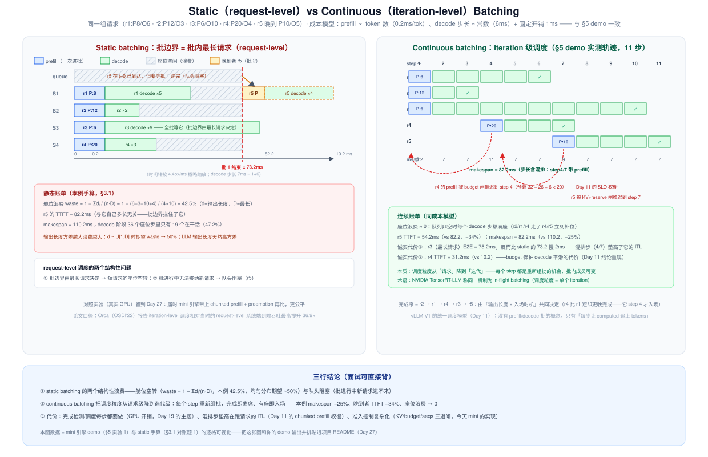
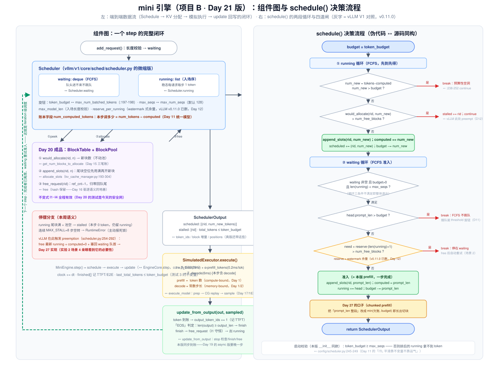
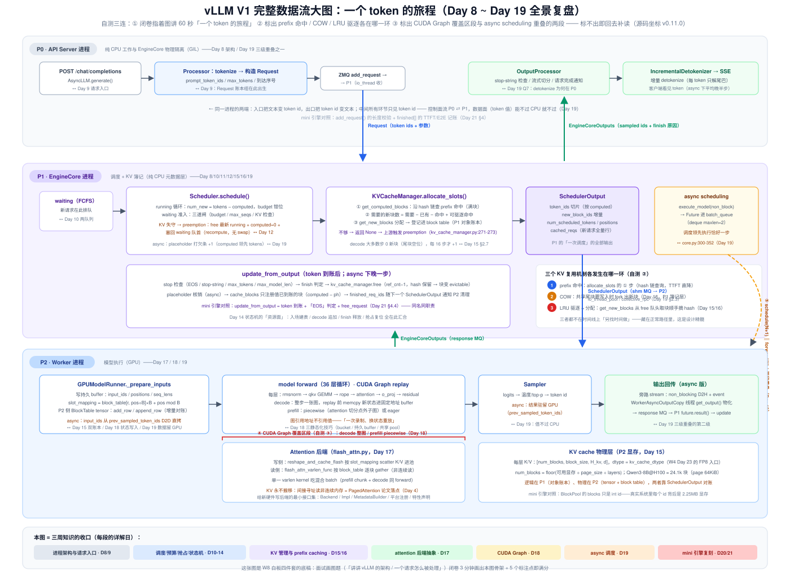

# Day 21 · 复盘日 + 项目 B——iteration 级 continuous batching 调度器 + V1 完整数据流大图

> **系列**：推理系统优化专家岗 · 56 天打卡 | 第 3 周「vLLM V1 源码精读（下）—— KV 管理与执行」收官
> **今日位置**：Day 20 把 KV 的物理层写完了（BlockPool + BlockTable + 引用计数，I1~I4 全绿），今天给项目 B 装上**大脑**：iteration 级 continuous batching 调度器——waiting/running 两队列 + token budget 四道闸，配一个模拟执行器跑通端到端 demo；同时是第 3 周复盘日，把 Day 8~19 读过的全部源码层（进程架构 → 请求入口 → 调度 → KV 管理 → attention 后端 → CUDA Graph → async scheduling）收进**一张 V1 完整数据流大图**——本周最重要、也是 W8 白板四件套的底稿。四条主线：**① static → continuous 的数学**（舱位浪费公式，为什么这是 LLM serving 的第一性优化）；**② 调度器的决策顺序与四道闸**（running 优先 / FCFS 准入 / KV 检查——本周的「保守准入 + reserve 余量」与 vLLM 的「乐观放行 + preemption」是一对活的架构权衡，今天会亲手把前者的死锁构造出来）；**③ 端到端 demo 与四个验收测试**（含一个故意构造的死锁，亲眼看见 preemption 的必要性——Day 27 的伏笔）；**④ 复盘大图 + 本周十问**（week3/README.md 的自测清单，答不上的标记为 W4 前补课项）**
> **前置要求**：Day 20（**最重要**：BlockPool/BlockTable 的 `would_allocate / append_slots / free_request` 三方法与 I1~I4 不变式——今天的调度器直接站在它上面；若 Day 20 未单独成文，以 `week3/README.md` Day 20 节为读本，§5 实验 0 附 50 行最小替身）、Day 10/11（waiting/running、token budget、`max_num_batched_tokens ≥ max_num_seqs` 不变量——week2/README.md §10/§11）、Day 12（preemption：本周不做它，但要 constantly 知道为什么本周可以不做）、Day 14（请求状态机：资源面账本）、Day 15/16（`allocate_slots` 语义、`get_num_blocks_to_allocate` 三笔账、hash/COW/驱逐——大图标注用）、Day 17（slot_mapping 写侧 / block_table 读侧）、Day 18/19（CG 区段、async 重叠——大图标注用）、Day 8/9（进程架构与请求入口）、Day 5（TTFT/TPOT/E2E 指标）、Day 1/2（prefill 计算 bound / decode 访存 bound——今天模拟执行器的成本模型就建在这两条上）
> **预计用时**：4 ~ 4.5 小时（写代码 2~2.5h + 测试与旋钮实验 0.5~1h + 复盘画图与本周十问 1h）
> **背景衔接**：这就是你做了三年的「让每个 cycle 都有活干」：AI Core 多任务混排、双 buffer 乒乓时每个 beat 都能换任务、高并发服务里把攒批窗口从「等一批做完」改成「每个 tick 检查一次」——continuous batching 的本质与你做流水的原则一字不差：**流水级的空闲（seat idle）= 白白烧掉的算力**。第二个映射是资源管理这道老题：本周 mini 的「reserve 余量式保守准入」vs vLLM 的「乐观放行 + 抢占回滚」，就是你在 NPU 上管理显存/L1 buffer 时「预留 vs 按需 + 回滚」的同一权衡——而今天会用一个死锁实验证明：**只要不能预知未来（输出长度），预留就永远只是推迟失败**，反悔机制（preemption）才是通用解
> **实验环境**：纯 Python（3.10+）+ pytest，**无 GPU**——今天全部实验在笔记本完成；复盘实验只需纸笔
> **配套材料**：`week3/README.md` Day 21 节；三张 SVG：`assets/day21_static_vs_continuous.svg`（图 1：两种批策略时间线对照，含舱位浪费公式与 demo 实测轨迹）、`assets/day21_mini_engine_architecture.svg`（图 2：mini 引擎组件图 + schedule() 决策流程，每道闸标 vLLM 对照）、`assets/day21_v1_full_dataflow.svg`（图 3：**今日复盘主图**——V1 完整数据流大图，三进程泳道 + 五个标注点 + Day 8-19 覆盖色带）
> **版本口径**：本篇**几乎不新引源码坐标**——所有 vLLM 行号回收 Day 8~19 已按 **v0.11.0 tag** 逐行核对的锚点（引用处标注 Day N），mini 引擎代码为原创实现。⚠️ 两处与 week3/README.md 的表述差异，以本文为准：① README Day 21 节调度器骨架把 KV 失守写作「抛 NoFreeBlocks」——本文实现为**先 peek 再决策**（`would_allocate` + `num_free_blocks` 比较），不靠异常做控制流，语义更贴近 vLLM 的 `allocate_slots → None`（Day 12）；② 本周十问第 3 题（COW 物理拷贝时机）Day 16 未单独成文，本文只给**簿记层**的确定答案，物理层明确标注「以你版本源码为准」。引用前先 `git log --oneline -3` 记版本

---

## 0. 今日学习目标

完成今天的学习后，你应该能够：

- [ ] **说清 continuous batching 与 static batching 的本质区别**（闭卷）：调度粒度从请求级降到迭代级——每个 step 都是重新组批的机会；手推舱位浪费公式 `waste = 1 − Σdᵢ/(n·D)`，并指出 static 的第二个结构性问题（批进行中新请求进不来 = 队头阻塞）（§2.2，图 1）
- [ ] **写出并讲通 `schedule()` 的两段循环与四道闸**：running 优先（稳态 `num_new = num_tokens − computed` = 1）、waiting FCFS 准入（budget / max_seqs / KV+reserve 三道闸 + 队头进不来不跳队）；解释为什么 running 必须优先、为什么 config 要校验 `budget ≥ max_seqs`（§2.3，图 2）
- [ ] **论证「准入控制保证不了活性」**（今日最深的洞见）：reserve 余量是快照不是配额——只要不能预知输出长度，保守准入只能推迟停摆；唯一通用解是允许反悔（preemption）——这是 vLLM 从 V0 watermark 走到 V1 乐观+抢占的理由，用死锁实验亲手验证（§2.4，实验 2 场景 4）
- [ ] **跑通端到端 demo 并逐步对账**：11 步日志里的每一次 admission / done / stalled 都能对应到四道闸的某一条；TTFT/E2E 记账点说得出为什么在那（§4.4）
- [ ] **画出 V1 完整数据流大图**（本周最重要产出）：三进程泳道（P0 前端 / P1 EngineCore / P2 Worker）+ 要素清单逐个检查；对着图做三连自测——60 秒讲「一个 token 的旅程」、指认 prefix 命中/COW/LRU 驱逐的环节、框出 CUDA Graph 覆盖区段与 async scheduling 重叠的两段（§5 实验 3，图 3）
- [ ] **过完本周十问**：week3/README.md Day 21 节的自测清单 10 题，答不上的标记为 W4 前补课项（§8.2）
- [ ] 交付：**continuous batching 端到端 demo**（代码 + 4 个集成测试全绿）+ **V1 大图**（手画底稿 + 60 秒讲演）+ **本周十问自测结果** + 项目 README 骨架的第一段（Day 27 补数据）

---

## 1. 核心概念速览

| 概念 | 一句话定义 | 今日要达到的深度 |
|---|---|---|
| **static（request-level）batching** | 攒一批请求一起跑，批边界 = 批内最长请求；期间不进不出 | 能背出它的两个结构性浪费：舱位空转 + 队头阻塞（§2.2） |
| **continuous（iteration-level）batching** | 每个 step（iteration）重新组批：完成即离席、有座即入场 | 知道收益全部来自「churn」——晚到者补位、早完成者让座；无 churn 时与 static 等价（§8.1 T1） |
| **in-flight batching** | NVIDIA/TensorRT-LLM 对同一机制的叫法 | 一句话辨析：带 paged KV 的 iteration 级调度，调度粒度 = 单个 iteration |
| **waiting / running** | 两级队列：新请求进 waiting（FCFS），被准入后进 running | running 优先 + FCFS 准入；队头进不来不跳队（跳队是 `long_prefill_token_threshold` 的可选行为，Day 11） |
| **token budget** | 单步 forward 的总 token 上限（`max_num_batched_tokens`） | 三重身份：Day 10 的准入单位 / Day 11 的切片刀 / 今天 mini 里的第四道闸；`budget ≥ max_seqs` 不变量 |
| **四道闸** | running 侧：预算闸、KV 闸；waiting 侧：budget+max_seqs 闸、KV+reserve 闸 | 每道闸都能在 vLLM 里指认对应物（图 2 右侧灰字） |
| **准入控制（admission control）** | 决定「谁能进 running」的策略集合 | 能论证它**保证不了活性**——这是 preemption 存在的根本理由（§2.4） |
| **`num_computed_tokens`** | 账本字段：已调度进 KV 的 token 数 | 本步调多少 = `num_tokens − computed`（Day 11 统一模型；本版同步、无 placeholder） |
| **reserve 余量（watermark）** | 准入时给每个 running（含自己）预留 1 块的 admission 谓词 | 知道它是 V0 watermark 思想的微缩版、v0.11.0 已删（Day 12）；能演示它只是推迟死锁 |
| **停摆（stall）** | running 尾块满且池空 → 该请求本步 0 token，留在 running | 对照 vLLM 的预算性空洞（scheduler.py:238-252，Day 11）；连续 8 步全空 → 主动报死锁 |
| **preemption** | free 最新 running + `computed=0` + 塞回 waiting 队首，靠重算恢复 | **今天不实现**（Day 27），但要能说清为什么它是活性问题的唯一通用解（Day 12） |
| **SchedulerOutput** | 一次调度的全部输出：`scheduled[(rid, n)] / stalled / total_tokens` | 与 vLLM 同名同职责（真版还带 token_ids 切片 / block 增量 / positions） |
| **SimulatedExecutor** | 不跑模型，按成本模型给每步记时间、产假 token | 成本模型两条：prefill ∝ token 数、decode ≈ 常数步长（Day 1/2 的直接应用） |
| **update_from_output** | token 到账后的回写：append 输出 → 「EOS」判定 → free → 出 running | 与 vLLM 同名同职责；本版同步到账，Day 19 的 async 版要晚一步 |
| **「EOS」模拟** | 用 `output_len` 预设「第几个输出 token 是 EOS」 | **调度器禁止读取**——只有 update 看，这是 Day 19「调度不需要 token 值」的微缩版 |

> **一句话本质**：continuous batching = **把批的定义从「一批请求」改成「一个 step」**。调度器每个 step 做三件事：给 running 的每个请求排 1 个 decode token、把 waiting 队头能装下的请求整段 prefill 进来、把装不下的继续留在队列里——批内成员因此永远可变。而它的一切工程难点都藏在「装不下」三个字里：token 装不下（budget）、座位装不下（max_seqs）、KV 装不下（块池）——前两道闸 vLLM 用不变量和钳位干净解决，第三道闸（KV）就是 preemption 存在的理由。

---

## 2. 原理深入讲解

### 2.1 回顾与今日地图：三周知识在 mini 引擎里的落点

项目 B 的意义（week3/README.md Day 20 节）：**读过源码和亲手实现是两个段位**。今天写的每一行代码，都应该能在前两周的笔记里找到出处：

| 你已读过的（Day） | 今天写的（mini 组件） | 衔接点 |
|---|---|---|
| D8/9 进程架构、请求入口 | `add_request()` 长度校验 + waiting 入队 | Processor 的 tokenize/Request 构造不模拟，长度即 token 数 |
| D10/11 两队列、budget、统一模型 | `schedule()` 两段循环 + `token_budget` | `num_new = num_tokens − computed`；budget 先 running 后 waiting |
| D12 preemption | **不写**（本周语义：stall / 停 waiting） | 死锁实验（实验 2 场景 4）就是「为什么需要它」的活教具 |
| D14 状态机（资源面） | `update_from_output()` 的建表/追加/释放 | 入场建表、decode 追加、finish 释放、（Day 27）抢占复位 |
| D15/16 KV 管理 | Day 20 的 `BlockTable/BlockPool`（已有） | `would_allocate` ↔ `get_num_blocks_to_allocate` 三笔账；free 的 hash 语义（替身版无 prefix，Day 27 补） |
| D17 attention 后端 | `SimulatedExecutor`（打时间戳的占位） | 真版的「写 slot_mapping / 读 block_table」在大图（图 3）上标 |
| D18 CG / D19 async | `t = T_fixed + ...` 里的 `T_fixed`；同步 update | 本版同步调度——Day 19 的「晚一步」复杂性推迟到 Day 27 之后 |

**本版的三个刻意简化**（都要能说出「为什么可以省」和「什么时候不能省」）：

1. **prefill 一步完成**（admission 即 prefill）：所以 running 循环里永远是 decode（`num_new = 1`）。省掉的是 chunked prefill 的 `min(欠账, budget)`——Day 27 把准入处一行 `prompt_len` 改成 `min(prompt_len − computed, budget)` 就长出来了；
2. **无 prefix caching**：Day 20 替身版 BlockPool 没有 hash/COW——语义上只是少了复用，不动正确性（Day 27 前补上 `prefix_cache.py` 即可，week3/README.md Day 20 节的规划）；
3. **同步 update**：token 到账即刻回写，没有 Day 19 的「晚一步」——单线程同步模型里那些正确性深水区（僵尸步、异步抢占）天然不存在，但**接口形状保持一致**（schedule 产 output、update 吃 output），Day 27 加 preemption 时账本一致性才有地方考。

### 2.2 continuous batching 的本质：调度粒度从请求级降到迭代级（图 1）



**static batching 的两个结构性浪费**（图 1 左，面试可直接背）：

1. **舱位空转**：批边界由最长请求决定，短请求提前完成后座位空转。定量：

```
waste = 1 − Σdᵢ / (n·D)        dᵢ = 第 i 个请求的输出长度，D = max dᵢ，n = 批大小
```

   代 demo 负载（输出 [6,3,10,4]）：`1 − 23/40 = 42.5%`。输出长度 d ~ U[1,D] 时期望 waste → 50%——**而 LLM 输出长度天然高方差**（客服一句话 vs 代码补全几百行），所以这个数字在实践中只升不降。
2. **队头阻塞**：批进行中不能接纳新请求。图 1 里 r5 在 t=0 就到了，却要等整个批 1 跑完（73.2ms）才能开始——它的 TTFT 与自己的长度无关，被批边界拦死了。

**continuous batching**（图 1 右）把调度粒度降到 iteration：每个 step 都是重新组批的机会。demo 的 11 步里，r2 第 3 步完成离席、r4 第 4 步补位（budget 闸放行）、r5 第 7 步补位（KV+reserve 闸放行）——座位零浪费，makespan 110.2 → 82.2ms（−25%），r5 的 TTFT 82.2 → 54.2ms（−34%）。

**三个诚实的注脚**（图 1 右下也标了，面试讲出这些才是真懂）：

- **收益全部来自 churn**：晚到者补位、早完成者让座。如果所有请求同时到达且 KV/budget 都不紧张，continuous 与 static **等价**（§8.1 T1 会亲手算一遍）；
- **最长请求可能更慢**：r3 的 E2E 在 continuous 下是 75.2ms，比 static 的 73.2 还慢 2ms——混排步（step 4/7 带 prefill）垫高了它的 ITL。这正是 Day 11 chunked prefill 权衡的再现：用 decode 的每步平滑换整体吞吐；
- **mid 批请求的 TTFT 可能变差**：r4 的 TTFT 31.2 vs static 的 10.2——budget 闸为了 decode 平滑推迟了它的 prefill。SLO 视角下这是**制度化的权衡**，不是 bug。

**与 vLLM V1 的关系**：V1 调度器没有 prefill/decode 批的概念——schedule() 顶部注释的原话是「让 `num_computed_tokens` 追上 `num_tokens_with_spec`」（Day 11 精读）。continuous batching 在 V1 里不是特性，是**统一调度模型的自然推论**。术语上，NVIDIA/TensorRT-LLM 称同一机制为 **in-flight batching**；论文口径（Orca，OSDI'22——iteration-level scheduling 的出处）报告相对当时的 request-level 系统端到端吞吐最高提升 **36.9×**（负载方差越大差距越大）。

### 2.3 调度器设计：两段循环、四道闸与账本字段（图 2）



`schedule()` 的完整决策顺序（图 2 右，与 §4.2 源码逐行同构）：

```
schedule():
  budget = token_budget
  ① running 循环（FCFS，入场序）:
       num_new = num_tokens − computed          # 稳态 = 1（统一模型）
       闸 1（预算）:  num_new > budget → break        # 预算性空洞
       闸 2（KV）:    would_allocate(rid, num_new) > num_free_blocks
                          → stalled += rid; continue  # 本周语义（vLLM: preemption）
       append_slots(rid, num_new); computed += num_new; budget −= num_new
  ② waiting 循环（FCFS，队头进不来不跳队）:
       条件: waiting 非空 且 budget > 0 且 len(running) < max_seqs   # 闸 3
       闸 3b（预算）: head.prompt_len > budget → break
       闸 4（KV）:    need + reserve·(len(running)+1) > num_free_blocks
                          → break                            # 停在 waiting，free 后自动重试
       准入 = 本版 prefill: append_slots(rid, prompt_len); computed = prompt_len
  return SchedulerOutput
```

**为什么 running 优先**：decode 等不起。Day 5 的体感数字——流式场景 ITL SLO 通常在几十 ms 量级，每 step 都是「一个 token 的交付节点」；prefill 等得起，TTFT 本来就是秒级指标，且 prefill 推迟只是排队（waiting 里好好待着），decode 推迟则是**在跑请求的 ITL 直接出洞**。这与 vLLM 的循环顺序一致（running 循环 scheduler.py:209-320 先于 waiting 循环 :335-537，Day 11）。

**为什么 `budget ≥ max_nums_seqs` 是不变量**（本版 `__init__` 直接 raise，对照 config/scheduler.py:245-249，Day 11）：running 循环先到先得，若 budget < running 请求数，排后面的请求 `num_new > budget` 拿到 0 个 token——decode 的 ITL 出现**预算性空洞**。这条校验保证（不开投机解码时）每个 running 请求每步至少 1 token——ITL 平滑靠不变量，不靠运气。

**为什么 FCFS 不跳队**：队头进不来就 break，不去队列后面找短的——否则短请求洪峰会把长请求无限推后（ starvation）。vLLM 同样不跳队；「短请求插队」是 `long_prefill_token_threshold` 的可选行为（Day 11 §2.7 的晚到者排队问题）。

**账本字段 `num_computed_tokens`** 是整个调度器的状态机核心（Day 14 的「时钟面」）：schedule 时推进（`computed += num_new`）、准入时置位（`computed = prompt_len`）、（Day 27）抢占时清零。调度器对「一步调度多少」的全部知识浓缩成一个公式：`num_new = num_tokens − computed`——本版同步语义下不需要 Day 19 的 `num_output_placeholders`（没有「晚一步」），这个差异值得记一笔：**placeholder 是 async 语义在账本上的投影**。

### 2.4 KV 准入控制：本周的保守语义 vs vLLM 的乐观语义（一对活的架构权衡）

第三道闸（KV）是今天最有讲头的地方。三种方案放在一张表里：

| 方案 | 准入策略 | KV 失守时（running 要新块、池空） | 利用率 | 活性（liveness） | 复杂度 |
|---|---|---|---|---|---|
| **mini 本周** | 保守：`need + reserve·(len(running)+1) ≤ free` 才准入 | 该请求本步 stalled（0 token，留 running） | 低（reserve 闲着） | **不保证**（死锁窗口） | 低 |
| **V0 时代** | watermark：常备 ~1% 块的预留水位线 | 强制换出（swap）或重算 | 中 | 较好 | 中 |
| **V1（v0.11.0）** | **乐观：有块就进，无 watermark**（Day 12 核对） | **preemption**：free 最新 running + `computed=0` + 塞回 waiting 队首，靠重算恢复 | 高 | **保证**（抢占兜底） | 高（账本一致性） |

**为什么 reserve 保证不了活性——今日最深的洞见**。reserve 谓词检查的是**准入瞬间的快照**，不是配额：它保证「下一 step 每个 running 最多取 1 块也够」，但一个请求每 B 步（B=block_size）就会再要一块——单看某个长输出请求，它的 KV 需求**无界增长**（直到 `max_model_len`）。所以：

```
死锁条件：所有 running 请求的尾块同时满 且 池空 且 waiting 也进不来
        → 没有任何请求能前进 → 没有任何块会被释放 → 永久停摆
```

reserve=1 只是把死锁窗口推后（实验 2 场景 4 会分别用 reserve=0 和 reserve=1 构造出它）；**reserve 调到任何有限值都一样**——除非准入时按 `max_model_len` 全额预留（等于按最坏情况配额，利用率惨到不可用）。结论一句话：

> **准入控制无法在不知道未来的情况下保证活性；「反悔」（preemption）是唯一通用解。** 这就是 vLLM 从 V0 的 watermark 走到 V1 的「乐观放行 + 抢占」的完整理由（Day 12：v0.11.0 连 1% 的 watermark 都删了，精确到 free < 需要 才失败）——也是 Day 27 要给 mini 引擎补上的那块拼图。

本版的工程处理：连续 8 步 `scheduled` 为空 → `RuntimeError("停摆：……缺 preemption——Day 27 的课题")`——**主动报死锁而不是无限空转**，且死锁时 I1 守恒仍然成立（测试里断言了），说明账本没坏、只是策略到头了。

### 2.5 执行器与 update：账本闭环（同步版的形状）

**SimulatedExecutor 的成本模型**直接建在 Day 1/2 的两条性质上：

```
t_step = T_fixed + α · num_prefill_tokens + T_decode · [本步含 decode 请求]

  T_fixed  = 1 ms   每步固定开销（调度/launch——Day 18/19 的账）
  α        = 0.2 ms/token   prefill 计算 bound：时延 ∝ token 数
  T_decode = 6 ms   decode 访存 bound：步长 ≈ 权重字节数 / HBM 带宽，与 batch 内请求数弱相关
```

关键在第三项：**decode 步长对 batch 大小不敏感**（读一遍权重是下界，Day 2）——这正是舱位浪费那么贵的原因：static batching 空着的座位**不省时间**，decode 步照样付全款。也正因如此，continuous batching 的补位几乎是免费的。

**update_from_output 的账本闭环**（与 vLLM 同名同职责，图 2 左下）：

1. **token 到账**：`output_token_ids.extend(sampled[rid])`——每个被调度的请求恰产出 1 个 token（prefill 的最后一个位置产第 1 个输出 token，decode 每步 1 个，Day 1）；
2. **TTFT 记账**：第一个输出 token 到账的时刻 = 该请求的 TTFT（prefill 步的 clock）；
3. **「EOS」判定**：`len(output_token_ids) ≥ output_len` → finish。注意 `output_len` **只有 update 读**——调度器从头到尾不知道请求会生成多久（正如 vLLM 的调度器不知道 EOS 何时来，stop 检查在 update 侧用真实 token 值做）。这是 Day 19「调度不需要 token 值」原则的微缩版；
4. **释放**：finish → `free_request`（ref_cnt 归零回队尾，I1 守恒）→ 出 running → 下一 step 的准入闸自动放行 waiting 里等座的（验收场景 2）。

本版同步到账，schedule(N+1) 看到的一定是 update(N) 之后的世界——**Day 19 的全部正确性深水区（僵尸步、异步抢占、hash 只注册 computed−ph）在这里天然不存在**。但接口形状刻意与 vLLM 对齐（schedule 产 output / update 吃 output 分开写）：Day 27 加 preemption 时，你会发现「抢占发生在 schedule、状态回收依赖 update」的账本一致性 suddenly 变难——那是 Day 19 知识的第二次兑现。

---

## 3. 性能模型与复杂度：今日的数学

### 3.1 static vs continuous：舱位浪费与 makespan 的手算

用 demo 负载（r1-r4 同时到达，输出 [6,3,4,10]... 精确为 [6,3,10,4]，r5 晚到，prompt [8,12,6,20,10]，成本模型 §2.5）把两种策略**全部手算**一遍（详细过程是 §8.1 T1 的作业）：

| 量 | static（批 1 = r1-r4，r5 等批 2） | continuous（demo 实测） | 差异 |
|---|---|---|---|
| makespan | 110.2 ms | 82.2 ms | **−25%** |
| r5（晚到者）TTFT | 82.2 ms | 54.2 ms | **−34%** |
| r3（最长请求）E2E | 73.2 ms | 75.2 ms | **+2 ms**（混排代价） |
| r4 TTFT | 10.2 ms | 31.2 ms | **+21 ms**（budget 闸） |
| decode 阶段座位利用率 | 19/36 = 52.8% | ~100%（队列非空时） | — |

三条推论：

1. **收益来源可拆**：makespan 的 −25% 里，一部分来自 r5 提前补位（批边界消失），一部分来自 r4 的 prefill 与 r1-r3 的 decode 混排（计算资源不再整段闲置）；
2. **没有人免费赢**：r3 和 r4 是这场交易里付账的人——continuous batching 是**吞吐/尾部时延 vs 个别请求的 TTFT/ITL** 的系统性再分配，SLO 视角下要配 budget/优先级旋钮（Day 11 的 `long_prefill_token_threshold` 就是干这个的）；
3. **真实系统的数字大得多**：本例只有 5 个请求、输出长度方差小。生产负载（高并发 + 输出长度高方差 + 持续到达）下，Orca 论文口径是最高 **36.9×**——因为 static 的 waste 随方差线性涨，而 continuous 的座位利用率在队列非空时恒为 100%。

### 3.2 调度的复杂度账单

| 操作 | 复杂度 | 说明 |
|---|---|---|
| `schedule()` | O(R + A)（R=running 数，A=本步准入数） | 每请求 O(1)：`would_allocate` 是算术（尾块空位账），不扫链表 |
| `update_from_output()` | O(R + A) | 逐请求 append + finish 判定 |
| `would_allocate`（decode） | O(1) | 对应 vLLM decode 的 O(1) 路径（大多数步 0 新块，每 16 步才 +1，Day 15 §2.7） |
| 内存 | O(Σ 每请求块数) | block table 本体；`used` 字段是 O(1) 的尾块账 |

这与 Day 19 §3.2 的增长律对上：vLLM 的 schedule 是 O(N) 于并发数，千级并发下 CPU 段可达 10 ms 量级——**调度器自身的复杂度就是 async scheduling 要藏掉的那段 CPU**。mini 版没有 hash 注册/多请求簿记的常数项，但增长律相同。

### 3.3 练手对账题（答案见 §8.1）

1. **无 churn 等价性**：4 个请求同时到达（prompt 均 8、输出 [2,3,4,8]），KV 池与 budget 都不设限。(a) static 与 continuous 的 makespan 各多少？(b) 若第 5 个请求（prompt 8、输出 5）恰好在第 3 步末到达，两者各变成多少？
2. **闸门手推**：用 §4.4 demo 的状态（16 块池、reserve=1），推演 step 5 时 r5（prompt 10）的准入判定全过程（`need + reserve` 与 free 的具体数字）；若把 reserve 调成 0，r5 最早哪一步能进来？
3. **不变量违反**：若 `token_budget=3` 而 `max_seqs=4` 且 4 个 running 都在 decode，第 4 个请求每步拿到几个 token？这个现象叫什么？vLLM 在哪一层防住它？

---

## 4. 关键代码走读（完整可运行实现，~230 行）

### 4.1 工程结构与 Day 20 接口契约

```
mini_vllm/
├── blocks.py         # Day 20：KVCacheBlock/BlockPool/BlockTable（已有；替身见 §5 实验 0）
├── request.py        # 今天：MiniRequest 账本
├── scheduler.py      # 今天：Scheduler + SchedulerOutput（核心 ~100 行）
├── executor.py       # 今天：SimulatedExecutor
├── engine.py         # 今天：MiniEngine 主循环（step = schedule → execute → update）
└── tests/
    ├── test_block.py     # Day 20 的 I1~I4
    └── test_scheduler.py # 今天：4 个验收场景
```

调度器只依赖 Day 20 的**五个方法**（若你的实现命名不同，适配这五个即可）：

| Day 20 方法 | 语义 | vLLM 对照（Day 15） |
|---|---|---|
| `pool.num_free_blocks` | 空闲块数（free 队列长度，含可驱逐缓存块——替身版无缓存） | `get_num_free_blocks` |
| `would_allocate(rid, n)` | **peek**：这次 append 要几个新块，不动池 | `get_num_blocks_to_allocate`（三笔账） |
| `append_slots(rid, n)` | 尾块空位先用满，不够则从池里取新块 | `allocate_slots`（kv_cache_manager.py:193-304） |
| `free_request(rid)` | 请求结束：块 ref_cnt−1，归零回队尾 | `free`（hash 保留——Day 16 驱逐语义） |
| `get_block_ids(rid)` | 读 block table（测试断言用） | `req_to_blocks` / P2 tensor |

### 4.2 request.py + scheduler.py（核心）

```python
# mini_vllm/request.py
from dataclasses import dataclass, field

@dataclass
class MiniRequest:
    request_id: str
    prompt_len: int
    output_len: int                 # 模拟「EOS 出现在第 output_len 个输出 token」——调度器禁止读取
    arrival: float = 0.0
    num_computed_tokens: int = 0    # 账本：已调度进 KV 的 token 数（Day 14 时钟面）
    output_token_ids: list = field(default_factory=list)
    ttft: float | None = None
    e2e: float | None = None

    @property
    def num_tokens(self) -> int:          # prompt + 已产出
        return self.prompt_len + len(self.output_token_ids)

    @property
    def is_finished(self) -> bool:        # 只有 update 路径读（「EOS」判定）
        return len(self.output_token_ids) >= self.output_len
```

```python
# mini_vllm/scheduler.py
from collections import deque
from dataclasses import dataclass, field

@dataclass
class ScheduledReq:
    request: "MiniRequest"
    num_new_tokens: int
    is_prefill: bool

@dataclass
class SchedulerOutput:
    scheduled: list = field(default_factory=list)   # [(req, num_new_tokens, is_prefill)]
    stalled: list = field(default_factory=list)     # 本步因 KV 停摆的 running（rid）
    num_waiting: int = 0
    num_free_blocks: int = 0
    @property
    def total_tokens(self) -> int:
        return sum(s.num_new_tokens for s in self.scheduled)

class Scheduler:
    def __init__(self, block_table, token_budget: int, max_seqs: int,
                 max_model_len: int, reserve_per_running: int = 1):
        if token_budget < max_seqs:   # ↔ config/scheduler.py:245-249（Day 11 不变量）
            raise ValueError("token_budget < max_seqs：排后的 running 将拿不到 token")
        self.block_table = block_table
        self.token_budget = token_budget
        self.max_seqs = max_seqs
        self.max_model_len = max_model_len
        self.reserve_per_running = reserve_per_running
        self.waiting: deque = deque()   # ↔ Scheduler.waiting（Day 10）
        self.running: list = []         # ↔ Scheduler.running（入场序 = FCFS）

    def add_request(self, req) -> None:
        if req.prompt_len + 1 > self.max_model_len:
            raise ValueError("prompt+1 > max_model_len，直接拒绝")
        if req.prompt_len > self.token_budget:
            # 无 chunked prefill 时 budget 必须 ≥ prompt ↔ Day 11 config:235-243 的校验
            raise ValueError("无 chunked prefill：budget 必须 ≥ prompt")
        self.waiting.append(req)

    def has_requests(self) -> bool:
        return bool(self.waiting or self.running)

    def schedule(self) -> SchedulerOutput:
        budget = self.token_budget
        out = SchedulerOutput()

        # ① running 优先（FCFS）：稳态 decode，num_new = num_tokens − computed = 1
        for req in self.running:
            num_new = req.num_tokens - req.num_computed_tokens
            if num_new > budget:                      # 闸 1（预算）↔ :238-252 的 continue 分支
                break
            if self.block_table.would_allocate(req.request_id, num_new) \
                    > self.block_table.pool.num_free_blocks:   # 闸 2（KV）
                out.stalled.append(req.request_id)    #   本周语义；vLLM 此处触发 preemption（Day 12）
                continue
            self.block_table.append_slots(req.request_id, num_new)
            req.num_computed_tokens += num_new        #   schedule 推进账本（Day 11 统一模型）
            out.scheduled.append(ScheduledReq(req, num_new, is_prefill=False))
            budget -= num_new

        # ② waiting 准入（FCFS，队头进不来不跳队）
        while self.waiting and budget > 0 and len(self.running) < self.max_seqs:  # 闸 3
            head = self.waiting[0]
            if head.prompt_len > budget:              # 闸 3b（预算）
                break
            need = self.block_table.would_allocate(head.request_id, head.prompt_len)
            reserve = self.reserve_per_running * (len(self.running) + 1)   # 闸 4（KV+reserve）
            if need + reserve > self.block_table.pool.num_free_blocks:
                break                                 #   停在 waiting，free 后自动重试（场景 2）
            self.block_table.append_slots(head.request_id, head.prompt_len)
            head.num_computed_tokens = head.prompt_len   # 本版 prefill 一步完成
            self.running.append(head)
            self.waiting.popleft()
            out.scheduled.append(ScheduledReq(head, head.prompt_len, is_prefill=True))
            budget -= head.prompt_len

        out.num_waiting = len(self.waiting)
        out.num_free_blocks = self.block_table.pool.num_free_blocks
        return out

    def update_from_output(self, output: SchedulerOutput, sampled: dict, now: float) -> list:
        """token 到账：append 输出 → 「EOS」判定 → 释放。晚于 schedule（接口形状与 vLLM 对齐）"""
        finished = []
        for s in output.scheduled:
            req = s.request
            req.output_token_ids.extend(sampled[req.request_id])   # 每请求恰 1 个 token
            if req.ttft is None:
                req.ttft = now - req.arrival           # TTFT = 第一个输出 token 到账
            if req.is_finished:                        # 「EOS」（调度器从未偷看）
                req.e2e = now - req.arrival
                finished.append(req)
        for req in finished:
            self.running.remove(req)
            self.block_table.free_request(req.request_id)   # I1 守恒的释放点
        return finished
```

### 4.3 executor.py + engine.py

```python
# mini_vllm/executor.py
class SimulatedExecutor:
    """模拟执行器：不跑模型。成本模型对齐 Day 1 两性质（§2.5 公式）。"""
    T_FIXED = 1.0          # 每步固定开销（调度 + launch，Day 18/19 的账）
    T_DECODE = 6.0         # decode forward ≈ 权重字节 / HBM 带宽（Day 2），与 batch 弱相关
    ALPHA_PREFILL = 0.2    # 每 prefill token 的计算时间（compute-bound）

    def execute(self, output: SchedulerOutput):
        t = self.T_FIXED
        decode_present = False
        sampled = {}
        for s in output.scheduled:
            rid = s.request.request_id
            if s.is_prefill:
                t += self.ALPHA_PREFILL * s.num_new_tokens
            else:
                decode_present = True
            sampled[rid] = [len(s.request.output_token_ids)]   # 假 token：值无关紧要
        if decode_present:
            t += self.T_DECODE
        return sampled, t

# mini_vllm/engine.py
class MiniEngine:
    MAX_STALL = 8          # 连续 8 步空转 → 主动报死锁（§2.4）

    def __init__(self, num_blocks=16, block_size=4, token_budget=32, max_seqs=4,
                 max_model_len=64, reserve_per_running=1, verbose=False):
        pool = BlockPool(num_blocks)
        self.block_table = BlockTable(pool, block_size)
        self.scheduler = Scheduler(self.block_table, token_budget, max_seqs,
                                   max_model_len, reserve_per_running)
        self.executor = SimulatedExecutor()
        self.clock = 0.0
        self.step_id = 0
        self.stall_run = 0
        self.finished = []
        self.last_total_tokens = 0

    def add_request(self, request_id, prompt_len, output_len):
        self.scheduler.add_request(
            MiniRequest(request_id, prompt_len, output_len, arrival=self.clock))

    def has_unfinished(self) -> bool:
        return self.scheduler.has_requests()

    def step(self) -> bool:
        out = self.scheduler.schedule()             # ↔ EngineCore.step 第一段（core.py:272-291）
        self.step_id += 1
        if not out.scheduled:                       # 全体停摆：计数 + 死锁检测
            self.stall_run += 1
            if self.stall_run >= self.MAX_STALL:
                raise RuntimeError("停摆：waiting 进不来 + running 全停（缺 preemption——Day 27 的课题）")
            return False
        self.stall_run = 0
        sampled, dt = self.executor.execute(out)    # ↔ execute_model（Day 17/18/19）
        self.last_total_tokens = out.total_tokens
        self.clock += dt
        self.finished.extend(                       # ↔ update_from_output（晚于执行）
            self.scheduler.update_from_output(out, sampled, self.clock))
        if self.verbose:
            ...                                     # 打印格式见 §4.4
        return True

    def run(self):
        while self.has_unfinished():
            self.step()
        return self.finished
```

### 4.4 端到端 demo：逐步日志与手算对账

```python
# demo.py
from mini_vllm.engine import MiniEngine

eng = MiniEngine(num_blocks=16, block_size=4, token_budget=32, max_seqs=4,
                 max_model_len=64, reserve_per_running=1, verbose=True)
for rid, p, o in [("r1", 8, 6), ("r2", 12, 3), ("r3", 6, 10), ("r4", 20, 4), ("r5", 10, 5)]:
    eng.add_request(rid, p, o)
eng.run()
```

实测输出（**每一步都能对上四道闸**，建议拿笔逐行标注）：

```text
step   1: t=    6.2ms  running=['r1','r2','r3']  new_tokens=[r1:8,r2:12,r3:6]  waiting=2 free_blocks=9
step   2: t=   13.2ms  running=['r1','r2','r3']  new_tokens=[r1:1,r2:1,r3:1]  waiting=2 free_blocks=7
step   3: t=   20.2ms  running=['r1','r3']       new_tokens=[r1:1,r2:1,r3:1]  waiting=2 free_blocks=11  done=['r2']
step   4: t=   31.2ms  running=['r1','r3','r4']  new_tokens=[r1:1,r3:1,r4:20] waiting=1 free_blocks=5
step   5: t=   38.2ms  running=['r1','r3','r4']  new_tokens=[r1:1,r3:1,r4:1]  waiting=1 free_blocks=4
step   6: t=   45.2ms  running=['r3','r4']       new_tokens=[r1:1,r3:1,r4:1]  waiting=1 free_blocks=7   done=['r1']
step   7: t=   54.2ms  running=['r3','r5']       new_tokens=[r3:1,r4:1,r5:10] waiting=0 free_blocks=10  done=['r4']
step   8: t=   61.2ms  running=['r3','r5']       new_tokens=[r3:1,r5:1]       waiting=0 free_blocks=9
step   9: t=   68.2ms  running=['r3','r5']       new_tokens=[r3:1,r5:1]       waiting=0 free_blocks=9
step  10: t=   75.2ms  running=['r5']            new_tokens=[r3:1,r5:1]       waiting=0 free_blocks=12  done=['r3']
step  11: t=   82.2ms  running=[]                new_tokens=[r5:1]            waiting=0 free_blocks=16  done=['r5']
---- all done: makespan=82.2ms, steps=11, I1 check: free=16/16
  r2: ttft=6.2 e2e=20.2    r1: ttft=6.2 e2e=45.2    r4: ttft=31.2 e2e=54.2
  r3: ttft=6.2 e2e=75.2    r5: ttft=54.2 e2e=82.2
```

四个值得逐个讲清的对账点（面试讲 demo 就按这四条讲）：

| 步 | 现象 | 闸门解释 |
|---|---|---|
| step 1 | 只准入 r1-r3（26 token），r4 留 waiting | **闸 3b（预算）**：budget 32 − 26 = 6 < r4 的 20——budget 优先给了先到的，r4 的 prefill 被推迟（Day 11 权衡） |
| step 4 | r4 进来了（prefill 20 与 decode 混排，步长 11ms） | r2 完成释放 4 块后 **闸 4** 通过：need 5 + reserve 1×3 = 8 ≤ free 10；混排步 = chunked prefill 的雏形 |
| step 5-6 | r5 进不来（free 4→3，need 3 + reserve 4 = 7 > free） | **闸 4（KV+reserve）**：KV 不够时新请求停在 waiting，free 后自动放入（验收场景 2） |
| step 7 | r1 完成让座，r5 立刻补位；r4 同步完成 | need 3 + reserve 1×3 = 6 ≤ free 7——**完成即离席、有座即入场**，continuous batching 的一句话定义 |

### 4.5 四个验收场景（集成测试）

week3/README.md Day 21 节的三个验收场景 + 一个死锁构造，全部写成 `tests/test_scheduler.py`（Day 27 加 preemption 前它们是安全网）：

```python
import pytest
from mini_vllm.engine import MiniEngine

def test_mixed_lengths_dynamic_running():
    # 场景 1：不同长度请求混合到达，running 集合动态进出（对比 static 的「等最长的」）
    eng = MiniEngine(num_blocks=16, block_size=4, token_budget=32, max_seqs=4, max_model_len=64)
    for rid, p, o in [("r1", 8, 6), ("r2", 12, 3), ("r3", 6, 10), ("r4", 20, 4)]:
        eng.add_request(rid, p, o)
    for _ in range(3):
        eng.step()
    eng.add_request("r5", 10, 5)                    # 晚到：中途加入
    while eng.has_unfinished():
        eng.step()
    assert [r.request_id for r in eng.finished] == ["r2", "r1", "r4", "r3", "r5"]  # 完成序=长度×入场时机
    by_id = {r.request_id: r for r in eng.finished}
    assert by_id["r4"].ttft > by_id["r1"].ttft      # budget 闸推迟了 r4 的 prefill
    assert by_id["r5"].ttft > by_id["r4"].ttft      # KV+reserve 闸推迟了 r5
    assert eng.block_table.pool.num_free_blocks == 16   # I1 守恒横跨整个 run

def test_kv_exhaustion_waits_then_resumes():
    # 场景 2：KV 耗尽 → 新请求停在 waiting；free 后自动放入
    eng = MiniEngine(num_blocks=8, block_size=4, token_budget=32, max_seqs=4, max_model_len=64)
    eng.add_request("r1", 16, 4)                    # 4 blocks
    eng.add_request("r2", 16, 8)                    # 4 blocks——池只有 8 块
    while eng.has_unfinished():
        eng.step()
    by_id = {r.request_id: r for r in eng.finished}
    assert by_id["r2"].ttft > by_id["r1"].e2e       # r2 严格在 r1 完成之后才被准入
    assert eng.block_table.pool.num_free_blocks == 8

def test_token_budget_limits_prefill():
    # 场景 3：token budget 限制单步 prefill 量（为 Day 27 chunked prefill 留口子）
    eng = MiniEngine(num_blocks=32, block_size=4, token_budget=16, max_seqs=4, max_model_len=64)
    eng.add_request("r1", 12, 4)
    eng.add_request("r2", 8, 4)
    totals = []
    while eng.has_unfinished():
        eng.step()
        totals.append(eng.last_total_tokens)
    assert max(totals) <= 16                        # 不变量：单步总量 ≤ budget
    assert totals[0] == 12                          # 第 1 步只有 r1 的 prefill
    assert totals[1] == 8 + 1                       # r2 的 prefill 推到第 2 步，与 decode 混排
    assert eng.block_table.pool.num_free_blocks == 32

def test_deadlock_detected_needs_preemption():
    # 场景 4（bonus）：故意构造停摆——亲眼看 preemption 的必要性（Day 27 的伏笔）
    eng = MiniEngine(num_blocks=4, block_size=4, token_budget=32, max_seqs=4,
                     max_model_len=64, reserve_per_running=0)
    eng.add_request("r1", 8, 100)                   # 2 blocks
    eng.add_request("r2", 8, 100)                   # 2 blocks——reserve=0 时双双进池
    with pytest.raises(RuntimeError, match="preemption"):
        while eng.has_unfinished():
            eng.step()
    assert eng.block_table.pool.num_free_blocks == 0            # 死锁时 I1 仍守恒：
    assert len(eng.block_table.get_block_ids("r1")) == 2        # free(0) + r1(2) + r2(2) == 4
    assert len(eng.block_table.get_block_ids("r2")) == 2
```

### 4.6 与 vLLM V1 的逐条对照表（写进项目 README 的「设计说明」）

| mini 组件/行为 | vLLM V1（v0.11.0） | 出处（核对 Day） |
|---|---|---|
| `waiting / running` 两队列 | `Scheduler.waiting / .running` | D10 |
| running 优先 + `num_new = tokens − computed` | running 循环（scheduler.py:209-320） | D11 |
| waiting FCFS 准入、不跳队 | waiting 循环（scheduler.py:335-537） | D11 |
| `token_budget` 与 `budget ≥ max_seqs` 校验 | `max_num_batched_tokens`（:197-198）+ config 校验（:245-249） | D11 |
| 预算耗尽 → 本步 0 token | `num_new_tokens = 0 → continue`（:238-252 预算性空洞） | D11 |
| `would_allocate` 先 peek | `get_num_blocks_to_allocate` 三笔账 | D15 |
| KV 失守 → stalled / 停 waiting | `allocate_slots → None` → **preemption**（scheduler.py:254-292） | D12 |
| `reserve_per_running`（watermark） | **v0.11.0 已删**（精确到 free < 需要 才失败） | D12 |
| `update_from_output`（到账/EOS/free） | `update_from_output`（stop 检查/finish/free，:879+） | D11/D14 |
| `SimulatedExecutor.execute` | `execute_model`：prep → CG replay → sample | D17/18/19 |
| `MiniEngine.step` 三段 | `EngineCore.step`（core.py:272-291）/ async 版 `step_with_batch_queue`（:300-352） | D19 |
| 「EOS」= output_len（update 才读） | stop checker 用真实 token 值（调度不看值） | D19 |
| 死锁检测 RuntimeError | 不需要（preemption 兜底活性） | D12/D27 |

---

## 5. 动手实验（约 3 ~ 3.5 小时，无 GPU）

### 实验 0（必做，15 min）：Day 20 自检 / 最小替身

先跑 Day 20 的测试：`pytest tests/test_block.py`——I1~I4 全绿才有地基。若 Day 20 实现未完成，用下面的 50 行替身（**无 prefix caching**，hash/COW 留给 Day 27；命名对齐 Day 20 契约）：

```python
# mini_vllm/blocks.py —— Day 20 成品的精简替身
from collections import deque
from math import ceil

class NoFreeBlocksError(Exception):
    pass

class BlockPool:
    def __init__(self, num_blocks: int):
        self.num_blocks = num_blocks
        self._free = deque(range(num_blocks))   # 队头分配 / 队尾归还（LRU 语义就位，Day 15）
        self.ref_cnt = [0] * num_blocks

    @property
    def num_free_blocks(self) -> int:
        return len(self._free)

    def allocate(self) -> int:
        if not self._free:
            raise NoFreeBlocksError
        bid = self._free.popleft()
        self.ref_cnt[bid] += 1
        return bid

    def release(self, block_id: int) -> None:
        self.ref_cnt[block_id] -= 1
        if self.ref_cnt[block_id] == 0:
            self._free.append(block_id)

class BlockTable:
    def __init__(self, pool: BlockPool, block_size: int):
        self.pool = pool
        self.block_size = block_size
        self.req_blocks: dict[str, list[int]] = {}
        self.req_used: dict[str, int] = {}       # 已写入的 token 槽位数（尾块账）

    def _free_slots(self, request_id: str) -> int:
        if request_id not in self.req_blocks:
            return 0
        return len(self.req_blocks[request_id]) * self.block_size - self.req_used[request_id]

    def would_allocate(self, request_id: str, num_tokens: int) -> int:
        need = num_tokens - self._free_slots(request_id)
        return max(0, ceil(need / self.block_size))

    def append_slots(self, request_id: str, num_tokens: int) -> list[int]:
        need_blocks = self.would_allocate(request_id, num_tokens)
        if need_blocks > self.pool.num_free_blocks:
            raise NoFreeBlocksError
        new_ids = [self.pool.allocate() for _ in range(need_blocks)]
        self.req_blocks.setdefault(request_id, []).extend(new_ids)
        self.req_used[request_id] = self.req_used.get(request_id, 0) + num_tokens
        return new_ids

    def free_request(self, request_id: str) -> None:
        for bid in self.req_blocks.pop(request_id, []):
            self.pool.release(bid)
        self.req_used.pop(request_id, None)

    def get_block_ids(self, request_id: str) -> list[int]:
        return list(self.req_blocks.get(request_id, []))
```

### 实验 1（核心，60 ~ 90 min）：实现调度器 + 跑通 demo

1. 按 §4.2/§4.3 写 `request.py / scheduler.py / executor.py / engine.py`（**不要抄**：先自己写，卡住了再看本文——尤其 schedule() 的两段循环，写错顺序的典型症状见坑 3）；
2. 跑 §4.4 的 demo，逐行对账四个标注点（step 1 的预算闸、step 4 的 KV 闸放行、step 5-6 的 reserve 拒绝、step 7 的补位）；
3. **先预测后跑**（检验理解的唯一标准）：自己构造 5 个请求（改 prompt/output/池大小），先在纸上写出你预测的前 5 步日志，再跑——不一致就找出是哪道闸的账算错了。这个「预测 → 验证 → 归因」循环是今天最重要的学习行为。

### 实验 2（30 ~ 45 min）：四个验收测试 + reserve 旋钮

1. `pytest tests/test_scheduler.py` 四个场景全绿（场景 4 的 RuntimeError 是**预期的通过方式**）；
2. **reserve 旋钮实验**：用 demo 负载分别跑 `reserve_per_running = 0 / 1 / 2`，记录三个量——r5 的 TTFT、停摆步数、makespan。预期定性结论：reserve 越小准入越激进（r5 越早进来、makespan 越短），但 running 被「抢块」停摆的风险越高；reserve 越大越保守（利用率越低）。再用 §2.4 的 4 块小池 + 长输出构造死锁，验证 **reserve=1 也防不住**（单请求无界增长独占全池）——水印只是推迟失败，这一条是今天要带进 Day 27 的核心认知；
3. 把手算的 reserve=0 死锁轨迹（哪些步、free 怎么变）写进实验记录——Day 27 实现 preemption 后，同一个场景就是你的回归测试。

### 实验 3（复盘，45 ~ 60 min）：V1 完整数据流大图（本周最重要产出）



1. **闭卷画**：一张 A4 纸，从「POST /chat/completions」画到「SSE 吐出 token」，对照 week3/README.md Day 21 节的要素清单逐个打勾——缺哪个回去补读那一天；
2. **对照补漏**：与本文图 3（三进程泳道版）比对，重点检查五个标注点——① prefix 命中在 `allocate_slots` 的 ① 步（hash 链查询）；② COW 在共享尾块写入时（fork）；③ LRU 驱逐藏在分配路径里（`get_new_blocks` 队头取块顺手摘 hash）；④ CUDA Graph 覆盖区段（decode 整图 / prefill piecewise）；⑤ async scheduling 重叠的两段（schedule(N+1) ∥ forward(N)，batch_queue 深度 2）；
3. **60 秒讲演**：指着图录音讲一遍「一个 token 的旅程」——从 Processor tokenize 到 detokenize 出去，途经哪个进程、哪个队列、哪张表、哪块显存。讲不顺的环节就是你三周学习的盲区，标记进 W4 前补课清单；
4. 这张手绘图 + 录音是 **W8 白板四件套的底稿**（Day 50-52 直接复用）。

### 常见坑（方法论清单）

- **跳过测试直接写调度器**：week3/README.md 常见坑第 5 条原话——Day 27 加 preemption 时不变式崩了无从查起。四个场景测试今天就写好；
- **调度器偷读 `output_len`**：比如准入时按「prompt + 预期输出」预留块——真实系统不知道输出多长（EOS 不可预知），偷看未来会让你的实验结论全部失真。`output_len` 只许 update 读；
- **两段循环写反（waiting 优先）**：症状是 decode 请求的 ITL 出现规律性大洞——新 prefill 每步插队。正确顺序是 running 先扣预算；
- **把 schedule 和 update 揉在一个函数里**：图省事，但 Day 27 的 preemption 发生在 schedule、状态回收依赖 update 的先后关系——接口不分开，账本一致性就没地方保证；
- **读回 V0**：搜资料看到 `BlockSpaceManager / SequenceGroup / swap 模式`立即关掉（week3/README.md 常见坑第 1 条）。V1 无 swap，preemption 只重算；
- **demo 负载没触发任何闸门**：四道闸全绿的 demo 什么也没验证。构造负载时要故意让某一道闸爆掉（长 prompt 挤预算 / 大 prompt 挤 KV / 高并发挤 max_seqs），观察对应行为才算测过。

---

## 6. 面试高频问题（含答题骨架）

**Q1：continuous batching vs static batching？in-flight batching 的调度粒度？
骨架**：① static 两个结构性浪费：舱位空转（waste = 1 − Σdᵢ/(n·D)，输出长度高方差时 →50%）+ 队头阻塞（批进行中新请求进不来）；② continuous 把调度粒度从请求级降到迭代级：每 step 重新组批，完成即离席、有座即入场；③ in-flight batching 是 NVIDIA/TensorRT-LLM 的同义词，粒度 = 单个 iteration；④ 收益全部来自 churn（晚到补位 + 早完成让座）；Orca（OSDI'22）口径最高 36.9×。落点：讲我在 mini 引擎里实现过——running 优先 decode + FCFS 准入 + 四道闸，demo 里 makespan −25%、晚到者 TTFT −34%。

**Q2：为什么 running 优先？decode 被饿死怎么防？
骨架**：① decode 等不起：每 step 是一个 token 的交付节点，ITL SLO 几十 ms；prefill 等得起：TTFT 秒级且 waiting 里只是排队；② 制度保证是 `max_num_batched_tokens ≥ max_num_seqs` 的 config 校验——保证（不开投机解码时）每个 running 每步至少 1 token，否则先到先得下排后者拿到 0 个 token（预算性空洞）；③ FCFS 不跳队防 starvation，短请求插队交给 `long_prefill_token_threshold` 旋钮。

**Q3：token budget 怎么设？
骨架**：Day 11 的五条——上界由 ITL SLO 反推（B ≤ (SLO−T_fixed)/ρ）、下界防 k=⌈L/B⌉ 过大伤 TTFT、硬约束 B ≥ max_num_seqs（关 chunked 时还要 ≥ max_model_len）、经验值硬件相关（H100 serve 8192 / A100 2048）、方法论是固定负载扫 B 画 ITL p99 与长请求 TTFT 的交点。本质：把 ITL SLO 翻译成引擎语言的参数。

**Q4：KV 不够时系统该怎么办？
骨架**：三段式——① 保守准入（watermark 式预留）：永不抢占但利用率低，且**保证不了活性**：预留是快照不是配额，单请求 KV 无界增长（直到 max_model_len），死锁窗口永远存在；② 乐观放行 + preemption：利用率高，活性靠抢占兜底（free 最新 running + computed=0 + 塞回 waiting 队首，recompute 恢复，V1 无 swap）；③ vLLM 的选择是 ②，v0.11.0 连 1% watermark 都删了——精确到 free < 需要 才失败。落点：我在 mini 引擎里两种都实现过（reserve 参数 + 死锁实验），亲眼看到 watermark 只推迟失败——**不能预知未来时，反悔机制是唯一通用解**。

**Q5：讲一遍「一个 token 的旅程」（60 秒白板题）。
骨架**：指着图 3 按顺序——P0 Processor tokenize → Request 过 ZMQ 进 P1 → waiting → schedule()（budget/max_seqs/KV 三道闸）→ allocate_slots（prefix 命中查 hash 链 → 新块 → block table 增量）→ SchedulerOutput 过 shm MQ 进 P2 → _prepare_inputs 写持久 buffer（input_ids/positions/slot_mapping/block_table）→ CUDA Graph replay 跑 36 层（attention 写按 slot_mapping、读按 block_table）→ 采样 →（async：结果留 GPU，旁路 stream D2H）→ update_from_output（stop 检查/finish/free）→ EngineCoreOutputs 回 P0 → detokenize → SSE。**讲得出每个环节在哪个进程、动哪张表**，这题就满分。

**Q6：为什么 mini 引擎先不做 preemption / chunked prefill？
骨架**：增量演进的工程方法：先让**无反悔语义**的正确性站稳（I1~I4 + 四场景测试是安全网），再逐步加机制——每加一个机制，不变式必须继续成立。preemption 的账本一致性（抢占发生在 schedule、回收依赖 update）和 chunked 的「未完成请求块不释放」都是在这套安全网上才敢动的手术。落点：这也是读 vLLM 演进的框架——V0 watermark → V1 乐观+抢占，每一步都是在换一种「对未来的假设」。

**Q7：prefix caching / COW / LRU 驱逐分别发生在数据流的哪个环节？
骨架**：图 3 的三个标注点——prefix 命中在 allocate_slots 的 hash 链查询步（命中 token 不重算 prefill，TTFT 直降）；COW 在共享尾块要被写入时（fork 新块，P1 簿记层）；LRU 驱逐不在任何独立回调里——**驱逐 = 分配**：get_new_blocks 从 free 队头取块，取到带 hash 的缓存块顺手摘索引。三者都藏在正常路径里，这是 vLLM 设计最优雅的一点。

**Q8：把 continuous batching 映射到你做过的系统（跨平台叙事）。
骨架**：同构三点——① 批边界从「一批做完」改成「每个 beat 检查一次」= 你做流水时每个 cycle 都保证有活干，seat idle 就是白白烧掉的算力；② running 优先 + budget 钳位 = 你的流水级仲裁（关键级优先、非关键级让路）；③ watermark vs 乐观+抢占 = NPU 上显存/buffer 管理的「预留 vs 按需 + 回滚」老题，结论也同构：不能预知未来就必须允许反悔。落点：这条线把 W1-W3 的所有主题串成「同一个问题在三个抽象层级的重现」——面试最强的差异化叙事。

---

## 7. 今日总结

- **continuous batching 的本质**：把批的定义从「一批请求」改成「一个 step」——调度粒度降到迭代级，每个 step 都是重新组批的机会。static 的两个结构性浪费（舱位空转 waste = 1 − Σdᵢ/(n·D)、队头阻塞）在 LLM 输出长度高方差的现实下被放大（期望 ~50%）；收益全部来自 churn：晚到者补位、早完成者让座。demo 实测：makespan −25%、晚到者 TTFT −34%、座位浪费 → 0，代价是最长请求 E2E +2ms（混排步）与 mid 批请求 TTFT +21ms（budget 闸）——**没有人免费赢**。
- **调度器 = 两段循环 + 四道闸 + 一个账本字段**：running 优先（decode 等不起）、waiting FCFS 准入（不跳队防 starvation）；预算闸（`budget ≥ max_seqs` 不变量防预算性空洞）、max_seqs 闸、KV+reserve 闸；`num_computed_tokens` 是状态机核心（`num_new = num_tokens − computed`，Day 11 统一模型的同步版）。
- **今日最深的洞见**：准入控制保证不了活性——reserve 是快照不是配额，单请求 KV 无界增长意味着任何有限 watermark 都只是推迟死锁（reserve=0/1 双双复现）。**不能预知未来时，「反悔」（preemption）是唯一通用解**——vLLM 从 V0 watermark 走到 V1 乐观+抢占的完整理由，也是 Day 27 的第一块拼图。死锁时 I1 仍守恒：账本没坏，是策略到头了。
- **工程方法**：接口形状与 vLLM 对齐（schedule 产 output / update 吃 output / 先 peek 再分配），四个验收场景（动态进出 / KV 等待恢复 / budget 限流 / 死锁构造）就是 Day 27 的回归测试安全网；「先预测后跑」是验证理解的唯一标准。
- **复盘大图**（图 3）把三周收口：三进程泳道 + 五个标注点（prefix 命中 / COW / LRU=分配 / CG 区段 / async 重叠）+ Day 8-19 覆盖色带——这张图是 W8 白板四件套的底稿，60 秒「一个 token 的旅程」讲演是每周都该过一遍的保留节目。
- **给 Day 22-31 的地基**：W4 量化回到 Day 15 的 `kv_cache_dtype`（FP8 KV = 每 block 显存减半 → num_blocks 翻倍的连锁反应）与图 3 的 KV 物理层；投机解码回到「decode 步变短后 launch 占比上升」（Day 18）与图 3 的 P2 执行段；W5 P/D 分离的大图就是在图 3 上把 P1/P2 拆成两套互连的实例。

## 8. 今日自测题（先做，再展开答案）

### 8.1 对账题答案

**T1**（无 churn 等价性）：(a) 4 请求同时到达、无闸门约束：static = prefill 一步（1+0.2×32=7.4ms）+ 7 个 decode 步（最长 8 输出，prefill 已给 1 个）×7ms = **56.4ms**；continuous 同样 1 个 prefill 步 + 7 个 decode 步 = **56.4ms——完全等价**。没有 churn（无晚到、无提前离场收益）时 continuous 退化为 static，收益来自「变化」本身。(b) r5 在第 3 步末到达（prompt 8、输出 5）：static 要等批 1 完成（56.4），再加 prefill 步 8.6ms + 4 个 decode 步 28ms = **93.0ms**；continuous 在第 4 步补进 r1 离开的空位，第 8 步完成（输出 5 = 1 个 prefill token + 4 个 decode 步）→ 56.4 + 7 = **63.4ms**，加速 1.47×。

**T2**（闸门手推）：step 5 时 running=[r1,r3,r4]，free=4。r5 的判定：`need = ceil(10/4) = 3`，`reserve = 1×(3+1) = 4`，`3+4=7 > 4` → 拒，留 waiting。reserve=0 时：step 4 末 free=5，r5 的 `need=3 ≤ 5` → **step 5 就能进来**（比 reserve=1 早 2 步），代价是 running 的 decode 余量变薄——三个 running 的下一个新块需求与 r5 的 3 块同池竞争，停摆风险上升。

**T3**（不变量违反）：第 4 个 running 请求 `num_new = 1 > budget = 0` → break，本步 **0 个 token**——ITL 出现预算性空洞（scheduler.py:238-252 的分支，Day 11）。vLLM 在 **config 层**（启动校验 `max_num_batched_tokens ≥ max_num_seqs`，config/scheduler.py:245-249）直接拒绝这种配置启动；本版 mini 在 `Scheduler.__init__` 里同款 raise。

### 8.2 本周复盘十问（week3/README.md Day 21 节清单；答不上的标记 W4 前补课）

1. **`FreeBlockQueue` 的顺序为什么天然就是 LRU 驱逐序？** 分配从队头拿、归还从队尾进 → 队头永远是「最久未被使用」的空闲块；同链尾块优先归还（Day 15 的两条排序规则）。没有独立的 evictor，驱逐优先级就是队列序本身。
2. **block hash 为什么必须链式包含父块 hash？extra_keys 有哪些？** `hash(parent_hash, token_ids, extra_keys)` → 命中一块 = 整条前缀链相同（父 hash 已编码全部祖先路径），可整段复用。extra_keys：多租户 `cache_salt`（防跨租户缓存泄漏，Day 34）、LoRA id、多模态输入 hash——各防「内容相同但语义上下文不同」的错配。
3. **COW 的触发与拷贝时机？** 触发：共享块即将被写入（语义上不可变）。簿记层（确定）：`fork` 分配新块、继承 token_ids 与 hash 链语义、调整 ref_cnt——纯 P1 元数据操作。**物理层拷贝发生在哪一层、什么时机（显式 D2D 还是依赖「新块未写过直接写」）是 Day 16 的读码验证点，随版本演进——以你版本源码为准**（定位：`block_pool.py` 的 fork 族 + grep COW/block_copy 在 sched 与 gpu_model_runner 的痕迹）。面试姿态：先讲稳的语义与簿记，再报你版本的物理层结论（带版本号）。
4. **`slot_mapping` 与 `block_table` 分别在 attention 的哪一侧？** 写侧 / 读侧（Day 17）：`slot = block_table[row, pos÷B]×B + pos mod B`——prefill/decode 算出的 K/V 按 slot_mapping scatter 进池；attention 计算按 block_table 逐块 gather 读历史 KV。KV 永不搬移，靠间接寻址读非连续内存。
5. **给新硬件写 attention backend 的最小接口集？** 五项（Day 17）：① `AttentionBackend` 子类（`get_kv_cache_shape` 定物理布局——你最有发言权的地方）；② `AttentionImpl.forward`（写 KV + 调 paged attention 算子）；③ `AttentionMetadataBuilder`（SchedulerOutput → 算子参数）；④ 平台注册与默认选择；⑤ 特性声明（prefix caching / MLA / 精度）。
6. **decode 单步 launch 开销怎么估算？CG 三个静态化技巧？** ~200-400 kernel × 3-10μs = 1-4ms（36 层 × 每层 5-10 kernel + 采样）。三技巧：shape 静态→bucket+padding；数据可变→持久 buffer + replay 前写状态（图引用地址不引用值）；显存→`graph_pool_handle` 共享 pool（Day 18）。
7. **full vs piecewise CG 的取舍？attention 为什么是切分点？** full 整图覆盖（decode 甜点，形状 bucket 后稳定）；piecewise 以 attention 为界切图（prefill+decode 通吃，配 torch.compile）。attention 是唯一 shape 随序列集合剧烈变化、且带复杂 metadata（block table）的算子——其余算子 bucket 化容易；且 prefill compute-bound、launch 占比小，不值得为它付 bucket 爆炸/ padding 浪费。
8. **async scheduling 成立的条件？对 preemption 的约束？** 条件 `C_cpu_path < T_gpu`（小模型/batch=1 时 CPU 反超，异步无效）。preemption：基于「晚一步」状态抢占、不等 forward——安全性靠三道闸门：写只落未注册 hash 的块（不可能被 prefix 命中）/ CUDA stream 顺序 / 已注册块内容冻结（Day 19）。
9. **block_size 增大/减小各影响什么？** 至少四项：分配粒度（内部碎片）、hash 粒度（prefix 命中率——块粒度截断：前缀 100 只能共享 6 个满块）、block table 行宽、decode gather 的连续访存长度（算子效率）；再加 COW 拷贝粒度与驱逐粒度。CUDA 默认 16；MLA 强制 32-128（Day 15/17）。
10. **Qwen3-8B BF16 每 block 显存？** `2×36 层×8 KV头×128 head_dim×2B ×16 token = 2.25MB`（GQA 用 kv_heads！Day 2/15 的坑）。

## 9. 今日产出物

**① continuous batching 端到端 demo**（项目 B 里程碑）：

> 代码：`scheduler.py / executor.py / engine.py`（~230 行，§4）
> `pytest tests/test_scheduler.py` 4 场景全绿（含死锁构造的预期 RuntimeError）
> demo 逐步日志 + 四个对账点标注（§4.4 表格填你的版本）

**② reserve 旋钮实验记录**（实验 2）：

| reserve | r5 TTFT | 停摆步数 | makespan | 死锁（4 块小池场景） |
|---|---|---|---|---|
| 0 | ___ | ___ | ___ | 第 ___ 步 RuntimeError |
| 1 | ___ | ___ | ___ | 第 ___ 步 RuntimeError（更晚——只是推迟） |
| 2 | ___ | ___ | ___ | ___ |

> 一句话结论模板：watermark 越大越___（利用率），但活性___（仍不保证）——Day 27 的 preemption 才是通解。

**③ V1 完整数据流大图**（本周最重要，W8 底稿）：

> 手画 A4 底稿（闭卷）+ 与图 3 对照的补漏清单（缺哪个环节 → 补读 Day N）
> 60 秒「一个 token 的旅程」讲演录音（讲不顺的环节 = 补课项）
> 三连自测勾选：□ 指认 prefix/COW/LRU □ 框出 CG 区段 □ 标出 async 重叠两段

**④ 本周十问自测结果**（§8.2）：答对 ___/10，补课项：___（W4 Day 22 开工前清零）。

**⑤ 项目 README 骨架**（Day 27 补数据后进面试作品集）：

> 第一段今天写：架构图（图 2）+ 与 vLLM 的逐条对照表（§4.6）+ 「设计说明」——含 slot 映射如何变成 `block_id × block_size + offset`（week3/README.md Day 20 节要求的字段级对照，§8.1 T2/T4 的答案都是素材）。

## 10. 明日预告（Day 22 · 量化基础串讲——W4 开篇）

mini 引擎今天到达「能跑」里程碑，暂停到 Day 27 收尾（chunked prefill + preemption + static vs continuous benchmark——今天的死锁场景就是那天的回归测试）。第 4 周进入第一个高频专题：**量化**。三处本周伏笔将被回收：① Day 15 的 `kv_cache_dtype`——FP8 KV cache = 每 block 2.25MB → 1.125MB，`num_blocks` 翻倍的连锁反应（图 3 的 KV 物理层就是入口）；② W8 Day 50 的显存手算会加上「量化后」一列；③ 你的昇腾 `WeightQuantBatchMatmul` 经验——W8A8/W4A16/FP8 的 per-tensor/per-channel/block-wise 粒度、激活 outlier 难点与 SmoothQuant/AWQ/GPTQ 思路，最后整理成《昇腾量化算子 vs GPU 量化 GEMM 对照》一页。面试里量化题的区分度全在**粒度 × 精度代价 × 算子收益**的三维权衡上——明天把它变成表格。
