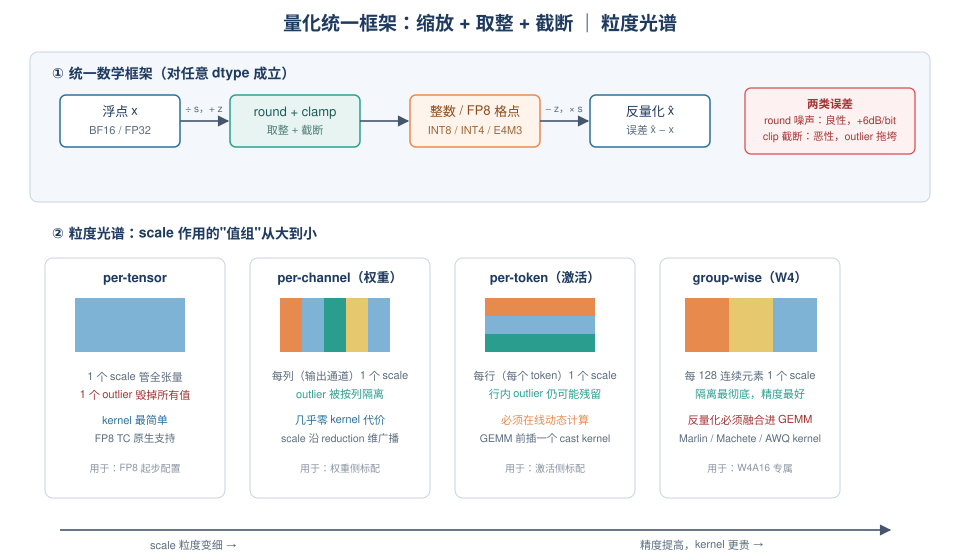
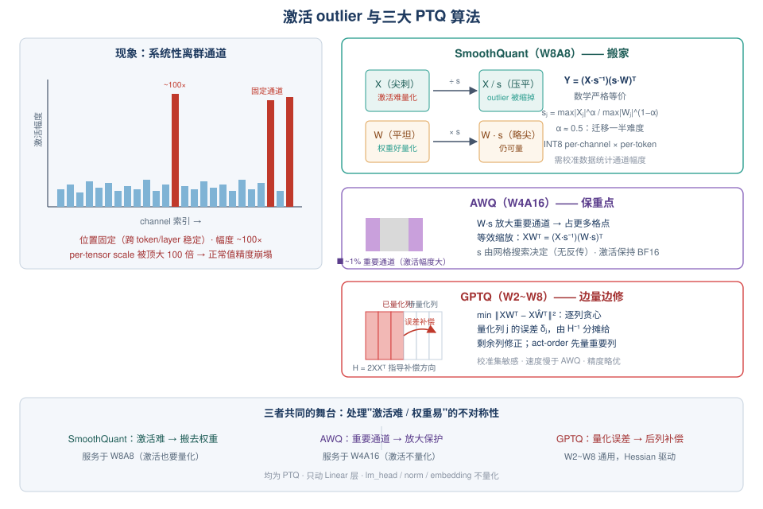
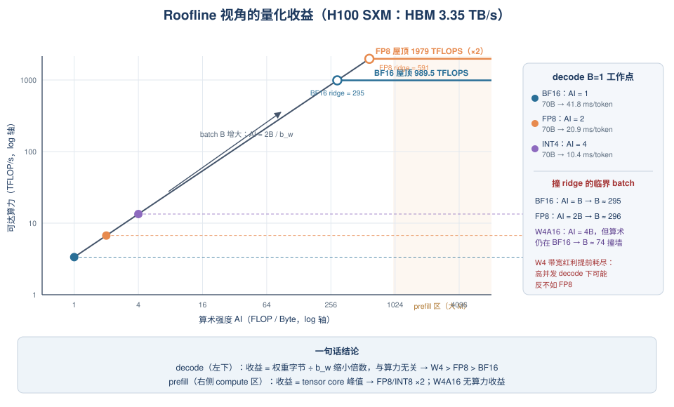

# Day 22：量化基础串讲 —— W8A8 / W4A16 / FP8 与激活 outlier

> **第 4 周 · Day 22** ｜ 预计投入：3~3.5 小时
> **衔接回顾**：Day 1（prefill 计算密集 vs decode 访存密集）、Day 2（decode 时延下界 = 参数字节 ÷ HBM 带宽）、Day 3（GPU Roofline 与 ridge point）——今天这三块知识将全部被"量化"重新串一遍。
> **本周前瞻**：Day 23（KV cache 量化）、Day 24（llm-compressor 动手 + 专题总结）、W6-7 项目 A（量化 GEMM 优化素材）。
> **产出目标**：一页《昇腾量化算子 vs GPU 量化 GEMM 对照》+ 三精度 decode 时延手推。

---

## 一、今日学习目标

学完今天，你应该能：

- [ ] 用**一个统一数学框架**（缩放 + 取整 + 截断）解释所有量化方案，说清对称/非对称、affine/non-affine 的区别
- [ ] 画出**粒度光谱**（per-tensor → per-channel / per-token → group-wise），并解释"粒度越细，outlier 隔离越好，但 kernel 越难写"
- [ ] 讲清 **W8A8 / W4A16 / FP8** 三大部署形态各自的收益来源（算力翻倍 vs 带宽减半）与适用场景（prefill 重 vs decode 重）
- [ ] 解释**激活 outlier** 为什么是激活量化的天敌（系统性、固定 channel、~100× 幅度），并手推 SmoothQuant 的等效变换
- [ ] 一句话说清 **SmoothQuant（搬家）/ AWQ（保重点）/ GPTQ（边量边修）** 的核心思想与差异
- [ ] 手推：Llama-3-70B 在 H100 上 BF16 / FP8 / INT4 的 decode 时延下界，以及 batch=64 时三种形态与 ridge point 的距离
- [ ] 沿 vLLM V1 源码说出**从 checkpoint 的 `quantization_config` 到具体 GEMM kernel** 的调用链
- [ ] 把昇腾 `WeightQuantBatchMatmulV2` 的优化经验映射到 GPU 的 Marlin / CUTLASS FP8 路径（面试差异化素材）

---

## 二、核心概念：一切量化都是"缩放 + 取整 + 截断"

### 2.1 统一数学框架

无论 INT8、INT4 还是 FP8，量化-反量化永远可以用同一对公式描述：

$$
\text{量化：} \quad x_q = \mathrm{clamp}\big(\mathrm{round}(x / s) + z,\; q_{\min},\; q_{\max}\big)
$$

$$
\text{反量化：} \quad \hat{x} = (x_q - z) \times s
$$

- $s$：**scale**（浮点缩放因子），把浮点区间映射到整数格点；
- $z$：**zero point**（零点偏移），浮点 0 在整数格点上的位置；
- $[q_{\min}, q_{\max}]$：整数格点范围，INT8 对称是 $[-127, 127]$，FP8 E4M3 是 $[-448, 448]$（但格点**不均匀**，见 2.3）。

| 方案 | zero point | scale 公式（校准） | 适用 |
|---|---|---|---|
| **对称量化** | $z = 0$ | $s = \max\|x\| / q_{\max}$ | 权重（近似零均值、分布对称） |
| **非对称量化** | $z = q_{\min} - \mathrm{round}(\min(x)/s)$ | $s = (\max x - \min x)/(q_{\max}-q_{\min})$ | 激活（如 ReLU 后非负分布） |

> **为什么权重标配对称、激活常非对称**：LLM 权重近似零均值高斯，对称量化不浪费格点；激活常有单侧偏移（如 SiLU/GLU 后仍偏正），非对称能多榨一格动态范围。FP8 因为自带指数位，动态范围大，实践中**一律用对称**就够了。

### 2.2 量化误差的两副面孔：噪声 vs 截断

总误差 $\hat{x} - x$ 分两类，性质完全不同：

$$
\underbrace{e_{\text{round}}}_{\text{量化噪声（良性）}} \sim U(-s/2,\; s/2) \quad\text{vs}\quad \underbrace{e_{\text{clip}}}_{\text{截断误差（恶性）}}
$$

- **量化噪声**：round 引入，近似均匀分布，幅度 $\le s/2$。对近似满量程的信号，经验法则 **每多 1 bit，信噪比 SQNR 约 +6 dB**（$6.02 \cdot B$）。per-channel INT8 下权重 SQNR 典型 ~40 dB——这就是"INT8 权重几乎无损"的数学底气。
- **截断误差**：outlier 超出 $[q_{\min}, q_{\max}]$ 被 clip。它的恶性在于**连锁反应**：只要张量里有一个 100× 的 outlier，$\max|x|$ 被它顶上去，$s$ 随之放大 **100 倍**，于是其余 99.9% 正常值的量化步长全部变粗 100 倍——**一个 outlier 毁掉整个张量的精度**。

> **记忆锚点**：量化噪声是"均匀地撒沙子"，截断误差是"被一个人带崩全组"。激活量化的全部难点（第 4 节）都是围绕后者展开的。

### 2.3 FP8 不是"小号的 INT8"：E4M3 / E5M2

INT8 是**均匀格点**（8192 个等距整数）；FP8 是**浮点格点**（1 符号 + 指数 + 尾数），格点随幅度指数变稀：

| 格式 | 布局 | 最大值 | 最小正规数 | 相对精度 | 备注 |
|---|---|---|---|---|---|
| **E4M3** | 1s + 4e + 3m | ±448 | $2^{-6}$ | 最坏 ~$2^{-4}$（6.25%） | **LLM 推理权重/激活/KV 的主流选择** |
| **E5M2** | 1s + 5e + 2m | ±57344 | $2^{-14}$ | 最坏 ~$2^{-3}$（12.5%） | 范围大但精度差，多用于梯度 |

FP8 的指数位让它对 outlier **天然鲁棒**：100× 的 outlier 只是落在大指数区，格点自动变粗，但**不会反向拖垮小数值的精度**（每个数量级内有自己独立的格点密度）。这一条性质是"FP8 免校准、取代 INT8 W8A8"的根因（第 4.4 节展开）。

### 2.4 粒度光谱：scale 的粒度决定一切

scale $s$ 可以作用在不同大小的"值组"上，形成一条粒度光谱：

| 粒度 | scale 数量 | 抗 outlier | kernel 代价 | 典型用途 |
|---|---|---|---|---|
| **per-tensor** | 1 | 最差（一个 outlier 毁全部） | 最低；FP8 tensor core 原生支持 | FP8 起步配置 |
| **per-channel**（weight 按输出通道） | $N$（out_features） | 好 | 几乎零代价（scale 沿 reduction 维广播） | 权重侧标配 |
| **per-token**（activation 按行） | $B$（batch×row） | 好 | 需在线求 scale（动态量化） | 激活侧标配 |
| **group-wise / block-wise**（如 group=128） | $N \times K/g$ | 最好 | 反量化逻辑必须**融合进 GEMM**（Marlin/Machete/AWQ kernel） | W4 的救命稻草 |
| per-token-per-channel（2D） | $B \times N$ | 最好 | 只在 dequant 路径可行，不实用 | 仅离线分析 |



**记忆锚点**：粒度越细 → outlier 被隔离得越好 → 精度越高；代价是 scale 元数据越多、GEMM kernel 里反量化逻辑越复杂。GPU 上 per-channel（权重）/ per-token（激活）是"免费"的；group-wise 是 W4A16 专属的昂贵选项——这就是为什么 W4 几乎总是和 `group_size=128` 绑定出现。

---

## 三、三大部署形态：W8A8 / W4A16 / FP8

把"量化什么"（权重 or 激活 or 都量）、"量化成什么"组合起来，生产上真正常用的就三种形态：

| 形态 | 权重 | 激活 | 收益来源 | 收益场景 | 代表路径 |
|---|---|---|---|---|---|
| **W8A8 (INT8)** | INT8 per-channel | INT8 per-token（动态） | **算力**：INT8 TC ≈ 2× BF16 峰值 | prefill 重、吞吐优先 | SmoothQuant + INT8 GEMM |
| **W4A16** | INT4 group-wise(128) | 不量化（BF16） | **带宽**：decode 权重读取量 ÷4 | decode 重、显存紧张 | AWQ/GPTQ + Marlin |
| **W8A8 (FP8, E4M3)** | FP8 per-channel | FP8 per-token（动态） | **算力 + 带宽双 2×**（Hopper 起） | 当前生产默认推荐 | `torch._scaled_mm` / CUTLASS |

### 3.1 W4A16 的本质：不动激活，只压权重

- **动机**：激活有 outlier（难量化），权重没有（好量化）→ 那就只压权重。
- **收益来源**：decode 是 memory-bound（Day 1/2 结论），单 token 的 GEMV 访存几乎全是读权重 → 权重字节 ÷4，理论上 TPOT 减为 1/4。
- **kernel 形态**：**"边反量化边算"**的 fused dequant GEMM/GEMV——INT4 权重从显存搬进 SM 后，在寄存器/共享内存里解包 + 乘 group scale 还原成 BF16，再进 BF16 tensor core 累加。GPU 上的代表是 **Marlin**（及其 Hopper 后继 Machete），昇腾上对应的正是你做过的 `WeightQuantBatchMatmulV2`——**同一个思想，两个平台的实现**（第 6 节对照）。
- **实际加速比只有 1.5~2.2×**（而非 4×）的原因：激活/KV cache 仍是 BF16、反量化与解包开销、部分层（lm_head、norm）不量化、大 batch 下滑向 compute-bound（第 5.3 节手推）。

### 3.2 FP8 的本质：赢在"工程简单性"

- **精度**：E4M3 的指数位提供了 ~18 个数量级的动态范围（相对 INT8 均匀格点的 ~2.5 个数量级），对 LLM 权重/激活分布**几乎无量化难点**——不需要 SmoothQuant 这类"把难度搬家"的预处理。
- **性能**：Hopper 起 FP8 tensor core 原生支持（峰值 ≈ 2× BF16），显存/带宽同时减半 → **prefill 和 decode 双受益**，这是它对 W4A16（prefill 无算力收益）和对 INT8 W8A8（要校准）的全面优势。
- **工程链路**：per-tensor scale 直接进 tensor core 的 epilogue，PyTorch 一等公民 `torch._scaled_mm` 就能用 → **取代 INT8 W8A8 的根本原因是工程简单性，而不只是精度**。

### 3.3 量化的第三重收益：容量（容易被面试官追问）

除了速度，量化改变的是**能部署什么**：

| 模型 | BF16 权重 | FP8 | INT4 | 单卡 80GB H100 能否部署 |
|---|---|---|---|---|
| Llama-3-70B | 141 GB | ~71 GB | ~35 GB | BF16 不行（需 TP2）；FP8 勉强（KV 空间紧张）；INT4 从容 |

这直接联动 Day 2 的显存手算与 Day 15 的 KV block 容量问题：**权重省下的每一 GB 都会变成 KV cache 的 block 数，进而变成 scheduler 能容纳的并发数**（Day 23 展开）。

---

## 四、原理深入：激活 outlier 与三大 PTQ 算法

### 4.1 现象：系统性离群通道

LLM（约 >2.7B 起涌现）的激活值中存在**固定 channel 位置的离群值**：

- **位置固定**：outlier 总是出现在同一批输入通道上（跨 token、跨 layer 稳定），不是随机噪声；
- **幅度极端**：可达正常值的 70~100×；
- **系统性而非个例**：这正是 per-tensor INT8 激活量化"直接崩掉"（精度损失不可接受）的根因——$s$ 被 outlier 顶大 100 倍，正常值全部变成粗步长下的"沙子"。

注意一个关键对比：**权重的分布是良性的**（近似零均值高斯、无系统性 outlier）→ 权重量化容易；**激活的分布是恶性的** → 激活量化难。三大 PTQ 算法的所有设计都围绕"如何处理这个不对称性"展开。



### 4.2 SmoothQuant（W8A8 路线）：搬家

**核心思想**：线性层 $Y = XW^\top$ 在数学上允许一个**等效缩放变换**——把激活的量化难度按比例"搬"到权重侧：

$$
Y = (X \cdot \mathrm{diag}(s)^{-1}) \cdot (\mathrm{diag}(s) \cdot W)^\top = X' W'^\top
$$

其中逐通道缩放因子：

$$
s_j = \frac{\max|X_{:,j}|^{\alpha}}{\max|W_{:,j}|^{1-\alpha}}, \quad \alpha \in [0, 1]
$$

- $s_j$ 的效果：激活通道 $j$ 除以 $s_j$（**压扁 outlier**），权重通道 $j$ 乘以 $s_j$（权重本来好量化，稍微变难无伤大雅）；
- $\alpha$ 是"迁移强度"：$\alpha = 0$ 完全不迁移，$\alpha = 1$ 全部搬到权重。**经验值 $\alpha \approx 0.5$**（迁移一半）在多数模型上最优；
- **数学严格等价**：变换前后 $Y$ 一字不差（这是它与"裁剪 outlier"类 trick 的本质区别）；
- 代价：需要一份**校准数据**（几百条代表性样本）离线统计 $\max|X_{:,j}|$；对 LayerNorm / residual 这类逐元素算子要同步做等效变换（把 $s$ 吸收进相邻 norm 的 $\gamma$）。

> **一句话记忆：SmoothQuant = 搬家**（激活难量化、权重好量化 → 按幅度比例把难度迁移过去）。

### 4.3 AWQ（W4A16 路线）：保重点

**核心观察**：并非所有通道同等重要——约 **1% 的"重要通道"**（激活幅度大）承载了输出的大部分能量。如果这 1% 通道的量化误差大，输出质量崩塌；其余 99% 通道即使误差大也无碍。

**做法**：

1. 对重要通道做**逐通道放大** $W' = W \cdot \mathrm{diag}(s)$、$X' = X \cdot \mathrm{diag}(s)^{-1}$（同样是等效变换，保持 $XW^\top$ 不变）；
2. 放大后的通道在 group 量化中占据更多格点 → **相对量化误差变小**（同一个 $s$ 下，值大 round 误差占比小）；
3. $s$ 不靠反传，而是对每层做**网格搜索**，目标是最小化该层输出的重建误差 $\|XW^\top - X'\hat{W}'^\top\|$。

**与 SmoothQuant 的差异**：SmoothQuant 服务于"激活也要量化"（W8A8），把激活压平；AWQ 服务于"激活不量化"（W4A16），scale 的作用是**保护权重侧的重要通道**，方向恰好相反。

> **一句话记忆：AWQ = 保重点**（找到 1% 重要通道，用等效缩放保住它们的精度）。

### 4.4 GPTQ（W2~W8 通用路线）：边量边修

**核心思想**：把量化当成一个**逐列贪心 + 误差补偿**的过程，用该层输入的二阶信息（Hessian）指导"每量化一列，如何修改还没量化的列来补偿误差"：

$$
\min_{\hat{W}} \|XW^\top - X\hat{W}^\top\|_F^2 \;\Longleftrightarrow\; \min_{\hat{W}} \; \mathrm{tr}\big((W-\hat{W}) H (W-\hat{W})^\top\big), \quad H = 2XX^\top
$$

**流程**（逐列 $j = 1, 2, \dots, K$）：

1. 量化当前列 $w_j \to \hat{w}_j$，产生误差 $\delta_j = \hat{w}_j - w_j$；
2. 用预计算的 $H^{-1}$ 把 $\delta_j$ 的影响**分摊到未量化的列**上：$W_{:, j+1:} \mathrel{-}= \delta_j \cdot \big(H^{-1}_{j, j+1:} / H^{-1}_{j,j}\big)$——即"这一列犯的错，让后面的列来修"；
3. **act-order 技巧**：按 Hessian 对角元（通道重要度）降序处理列，重要的列先量化、误差让不重要的列承担。

**与 AWQ 的对比**：

| 维度 | GPTQ | AWQ |
|---|---|---|
| 优化目标 | 最小化逐层输出重建误差（有"修误差"能力） | 最小化输出重建误差（只搜 scale，不修列） |
| 校准数据敏感性 | **高**（Hessian 直接由校准集决定） | 较低（网格搜索只看通道统计量） |
| 速度 | 慢（逐列 + 大矩阵求逆，需 GPU） | 快（无反传、无求逆） |
| 精度 | 校准集匹配时略优 | 泛化更稳，跨域更鲁棒 |
| 形态 | W2~W8 灵活 | 基本只做 W4A16 |

> **一句话记忆：GPTQ = 边量边修**（量化一列、补偿一列，Hessian 告诉你误差往哪推）。

### 4.5 三算法速查表

| 算法 | 形态 | 核心思想 | 一句话 | 校准依赖 |
|---|---|---|---|---|
| **SmoothQuant** | W8A8 | 等效变换把激活量化难度迁移到权重 | 搬家 | 需要（统计通道幅度） |
| **AWQ** | W4A16 | 等效缩放保护 ~1% 重要通道 | 保重点 | 需要（搜 scale） |
| **GPTQ** | W2~W8 | 逐列量化 + Hessian 误差补偿 | 边量边修 | 需要（且最敏感） |

> **共同点**：三者都是 PTQ（训练后量化），都不改模型结构，都只动 Linear 层；`lm_head`、norm、embedding 通常不量化。区别只在"误差往哪放"。

---

## 五、性能模型推导：量化收益的 Roofline 手推（面试必考）

> 本节把 Day 3 的 Roofline 框架套到量化上。结论先行：**量化对 TTFT 和 TPOT 是两条独立曲线，因为 prefill 和 decode 的瓶颈根本不同**（Day 1 的第一性原理在这里兑现）。

### 5.1 Decode（memory-bound）：收益来自带宽

单个 decode step 中，每个 Linear 层对单 token 做的是 **GEMV**：读完整权重矩阵，只算 1 行。算术强度：

$$
AI_{\text{decode}} = \frac{2NK \;\text{FLOPs}}{K \cdot N \cdot b_w \;\text{bytes}} = \frac{2}{b_w} \;\; \text{FLOP/byte} \quad (b_w = \text{权重每元素字节数})
$$

| 权重精度 | $b_w$ | $AI_{\text{decode}}$ | 说明 |
|---|---|---|---|
| BF16 | 2 B | 1 FLOP/byte | |
| FP8 / INT8 | 1 B | 2 FLOP/byte | 带宽减半 |
| INT4 | 0.5 B | 4 FLOP/byte | 带宽减为 1/4 |

对照 H100 SXM 的 ridge point（BF16 ≈ 989.5 TFLOPS ÷ 3.35 TB/s ≈ **295 FLOP/byte**；FP8 ≈ **591 FLOP/byte**）：decode 的 AI = 1~4，**离 ridge 差了两个数量级** → decode 深度 memory-bound → **decode 时量化的全部收益来自权重字节变少，与算力峰值无关**。

由此直接推出 **decode 单 token 时延下界**（Day 2 公式的量化版）：

$$
t_{\text{decode}} \geq \frac{\text{参数量} \times b_w}{\text{HBM 带宽}}
$$

**Llama-3-70B @ 单卡 H100（3.35 TB/s）手推**：

| 精度 | 计算 | 下界 |
|---|---|---|
| BF16 | 70 × 2 / 3350 GB/ms | **≈ 41.8 ms/token** |
| FP8 | 70 × 1 / 3350 | **≈ 20.9 ms/token** |
| INT4 | 70 × 0.5 / 3350 | **≈ 10.4 ms/token** |

（注意 BF16 的 141 GB 单卡放不下，实际要 TP2——每卡读一半权重，下界 ÷2。这个"放不放下"的问题本身就是量化的容量收益，见 3.3。）

**实际加速比打折**（W4A16 实测 1.5~2.2× 而非 4×）的原因，面试要能张口就来：

1. 激活与 KV cache 仍是 BF16，非权重访存占比随 batch 上升；
2. 反量化/depack 开销（group scale 的读取与运算）；
3. 大 batch 时滑入 compute-bound（5.3 节手推）；
4. `lm_head`、norm、embedding 未量化。

### 5.2 Prefill（compute-bound）：收益来自算力

prefill 是大 GEMM（M = prompt 长度），$AI \approx 2M / b_w$。M = 4096 时：BF16 的 AI ≈ 4096 FLOP/byte，远超 ridge 295 → compute-bound：

- **W8A8（INT8/FP8）**：tensor core 峰值 ×2 → **TTFT 理论最多减半**（实际 1.2~1.7×，受 attention 与非量化层拖累）；
- **W4A16**：算术仍在 BF16 TC 上做 → **prefill 无算力收益，TTFT 基本不变甚至略劣**（dequant 开销）；它的收益只在显存/容量维度。

> 这就是面试题"量化对 TTFT 和 TPOT 的影响分别是什么"的第一性答案：**TPOT 看 b_w（带宽），TTFT 看是不是 FP8/INT8（算力）**。

### 5.3 Batch 增大：收益衰减与"W4 不如 FP8"的临界点

batch = $B$ 时，权重只读一次，$AI = 2B/b_w$。分别对三种形态算"何时撞上自己的 ridge point"（用各自**计算精度的峰值**）：

| 形态 | $AI(B)$ | 计算峰值（H100） | 撞 ridge 的 batch |
|---|---|---|---|
| BF16 | $B$ | 989.5 TFLOPS @ 295 | $B \approx 295$ |
| FP8 W8A8 | $2B$ | 1979 TFLOPS @ 591 | $B \approx 296$ |
| W4A16 | $4B$ | **989.5 TFLOPS（BF16 算术！）** @ 295 | $B \approx 74$ |

**关键洞察**：W4A16 省带宽但**不省算力**（反量化后还是 BF16 乘加）→ 它在 $B \approx 74$ 就撞上 BF16 ridge point，带宽红利提前耗尽；FP8 直到 $B \approx 296$ 才撞自己的 ridge。**这就是"高并发 decode 下 W4A16 可能反而不如 FP8"的定量解释**——batch 一大，W4 的瓶颈从带宽切换成了 BF16 算力，而 FP8 仍有 tensor core 红利。



> **手推作业**（今日产出物之一）：Llama-3-70B @ H100，batch=64 时三种形态的 $AI$ 与各自 ridge point 的距离，并据此判断哪个形态还有带宽红利。

---

## 六、与 vLLM V1 的实际联系：从 checkpoint 到 kernel 的调用链

> 以下以 vLLM ≥ 0.9（V1 为默认架构）为准；类名与文件名可能随版本微调，但**链路结构稳定**：`量化配置解析 → 量化方法对象 → 权重加载/重排 → forward 时 apply`。

### 6.1 端到端调用链

```text
vllm serve <model> [--quantization xxx]        # EngineArgs
  └─ ModelConfig（vllm/config/model.py）
       ├─ quantization：命令行覆盖（可强制 --quantization fp8 做动态量化）
       └─ hf_quant_config：读 checkpoint config.json 里的 quantization_config
  └─ vllm/model_executor/layers/quantization/__init__.py
       └─ QUANTIZATION_REGISTRY：scheme 字符串 → Config 类
            "fp8" → Fp8Config；"gptq" → GptqConfig；"awq"/"awq_marlin" → ...
            "compressed-tensors" → CompressedTensorsConfig（llm-compressor 产物）
  └─ V1 进程链（回顾 Day 8）：AsyncLLM → Processor → EngineCore → GPUWorker
       └─ GPUWorker.load_model()（vllm/v1/worker/gpu_worker.py）
            └─ model_loader（vllm/model_executor/model_loader/loader.py）
                 └─ 逐层构建模型：每个 LinearBase / ColumnParallelLinear
                      └─ quant_config.get_quant_method(layer) → 如 Fp8LinearMethod
                           ├─ create_weights()：分配量化权重 + scale 张量
                           └─ process_weights_after_loading()：重排（Marlin repack）/
                              requantize（per-channel → per-tensor）/ scale 转置
  └─ 运行时 forward：layer(x) → quant_method.apply(layer, x, bias)
       ├─ FP8：x 动态 per-token cast → torch._scaled_mm（Hopper/Ada FP8 TC）
       ├─ GPTQ/AWQ（W4A16）：Marlin fused-dequant GEMM（kernel 内解包+反量化）
       └─ BF16：UnquantizedLinearMethod（退化为普通 GEMM）
```

**三个关键设计**（面试可讲）：

1. **量化是"方法对象"而不是模型分支**：模型代码（如 `llama.py`）里只有 `QKVParallelLinear(...)`，不知道自己会被量化成什么——量化方案完全由 `get_quant_method` 在加载期注入。这就是"**新量化方案 = 注册一个 Config 类 + 若干 kernel**"的插件化设计（Day 17 讲过 attention backend 的同款思路）。
2. **`process_weights_after_loading` 是离线一次性的**：所有昂贵的重排（GPTQ/AWQ 权重 repack 成 Marlin 布局、per-channel scale requantize）都在加载期做完，**不在推理热路径上**。
3. **激活动态量化在 `apply` 里在线完成**：per-token cast 是 GEMM 前的小 kernel，量与算在同一方法内闭环。

### 6.2 FP8 路径细读（`vllm/model_executor/layers/quantization/fp8.py`）

`Fp8LinearMethod.apply` 的核心逻辑（简化伪代码）：

```python
# 权重：加载期为 FP8（per-tensor 或 per-channel scale）
# 激活：动态 per-token 量化（无需校准，E4M3 对 outlier 鲁棒）
def apply(layer, x, bias):
    if cutlass_fp8_supported:                       # Hopper/Ada 检测
        x_fp8, x_scale = per_token_cast_fp8(x)      # 动态 per-token cast
        y = torch._scaled_mm(x_fp8, layer.weight_fp8,
                             scale_a=x_scale,       # per-token scale
                             scale_b=layer.weight_scale,  # per-tensor/channel
                             out_dtype=torch.bfloat16)
    else:                                           # 老硬件回退
        y = dequant_bf16(layer.weight_fp8) @ x      # 反量化后普通 GEMM
    return y + bias
```

- **per-tensor vs per-channel 的分歧**：早期 `torch._scaled_mm` 只支持 per-tensor scale，vLLM 会在 `process_weights_after_loading` 里把 per-channel checkpoint **requantize 回 per-tensor**（精度小损换 kernel 兼容）；新版 torch 支持逐行 scale 后逐步放宽。**此处实现细节随版本演进较快，读源码时先看当前版本的 `fp8_utils` 辅助函数**。
- **DeepSeek 风格的 block-wise FP8**（`weight_block_size=[128,128]`）：MoE 场景 per-channel 粒度不够，走 `Fp8MoEMethod` + `per_block_cast_fp8`，与 W4 的 group-wise 思想同源——**粒度光谱的同一套逻辑在 FP8 上重演**。
- **`--quantization fp8` 的含义**：对 BF16 checkpoint 做**在线 RTN 量化**（加载时 round-to-nearest，无校准）；官方 FP8 checkpoint（如 `Qwen/Qwen3-8B-FP8`）则带着离线量化的 scale 一起发布，精度更有保障。

### 6.3 GPTQ / AWQ 路径：Marlin 一统 W4A16

```text
checkpoint (awq / gptq, INT4 packed + group scale)
  └─ AwqConfig / GptqConfig
       └─ 加载期自动升级：awq → awq_marlin, gptq → gptq_marlin（日志可见）
            └─ GptqMarlinLinearMethod.process_weights_after_loading()
                 └─ marlin_utils.repack：重排成 Marlin 期望的 tile 布局
  └─ forward: marlin_gemm(x_bf16, w_packed_int4, scales, workspace)
       └─ kernel 内：INT4 解包 → × group scale → BF16 累加（fused dequant GEMM）
```

- **Marlin 的定位**：专为推理设计的 W4A16 fused-dequant GEMM——权重在显存中保持 4-bit，进 SM 后在寄存器里解包反量化，直接喂 BF16 MMA 指令，避免"先整体反量化回 BF16"的中间显存爆炸。Hopper 上有后继 Machete（利用 TMA/WGMMA）。
- **这与你在昇腾做的 `WeightQuantBatchMatmulV2` 是同一个思想**：量化权重直进 Cube，反量化融合在算子内部——对照详见第 7 节。

### 6.4 compressed-tensors（llm-compressor 的落盘格式）

vLLM 官方量化工具链 **llm-compressor** 的产出格式（Day 24 动手）：

```json
{
  "quant_method": "compressed-tensors",
  "config_groups": {
    "group_0": {
      "input_activations": { "actorder": null, "dynamic": true,
                             "num_bits": 8, "observer": "per_token", "strategy": "token", "type": "float" },
      "weights": { "num_bits": 8, "observer": "minmax", "strategy": "channel", "type": "float" }
    }
  }
}
```

读取时由 `CompressedTensorsConfig` 解析成 W8A8-dynamic / W4A16 / FP8 等内部路径——**描述式配置 + 统一运行时**，是目前官方推荐的生产路径（GPTQ/AWQ 的"原生"路径更多服务于社区存量 checkpoint）。

### 6.5 量化与 V1 调度链路的联动（Day 23 预告）

量化不只是 kernel 层的事，它沿 Day 9-13 的调度链路**向上传导**：

```text
权重 FP8 → 模型占用显存 ↓ → KVCacheManager 可用 block 数 ↑
  → scheduler 的 running batch 上限 ↑ → preemption ↓ → goodput ↑
KV FP8（明天）→ 每 block 字节数 ÷2 → 同显存并发 ×2
```

这就是分析量化收益时必须有的**全链路视角**：单看 kernel TPOT 只是一半，另一半在 scheduler。

---

## 七、核心产出：昇腾量化算子 vs GPU 量化 GEMM 对照（一页）

> 这是今天的**面试差异化素材**：你做过的昇腾优化与 GPU 生态的方法论映射。建议打印成一页 A4。

| 维度 | 昇腾（你的经验） | GPU（vLLM 生态） | 方法论共性 |
|---|---|---|---|
| **量化算子形态** | `WeightQuantBatchMatmulV2`：量化 GEMM + 反量化**算子级融合**，一条算子出结果 | 融合下沉到 kernel/epilogue：Marlin（W4A16）、CUTLASS FP8 GEMM + `torch._scaled_mm`、CUTLASSSmoothQuant | 都是"**量化权重直进矩阵单元，反量化融在乘加之间**"，避免中间 BF16 物化 |
| **多精度路径** | INT4/INT8/FP8/FP16/BF16 的 Cube 指令序列择优 | CUTLASS 模板按 dtype 实例化；kernel 注册表按 (格式, 硬件, 形状) 选优 | 精度 × 形状 × 硬件的**组合空间**都要有自动选路 |
| **带宽/算力建模** | L2/HBM 带宽与 Cube 算力的 bound 分界模型；`balanceRate ≥ 0.9` 剪枝搜优 baseM/baseN | ncu 看 SM busy / DRAM busy；roofline 手算 ridge point（今天第 5 节） | **先判 bound 再调 tiling**；理论模型指导搜索空间剪枝 |
| **数据搬运优化** | ASW 蛇形滑窗提升 L2 命中；L1 全载模板（A/权重驻留 L1，重复搬运 $O(n \cdot A) \to O(A)$） | 共享内存 swizzle / L2 persistence；权重驻留对 decode GEMV 天然友好 | ** locality 决定有效带宽**；驻留 + 滑窗是跨平台通用的两板斧 |
| **流水线** | Fixpipe / 无 Queue 手工流水（SetFlag/WaitFlag 事件驱动 L0A/L0B/L0C 乒乓） | cp.async / TMA 多级流水，software pipelining | **用异步搬运藏访存延迟**，事件/栅栏驱动乒乓缓冲 |
| **量化粒度** | 算子内 per-tensor / per-channel 反量化路径 | per-channel weight + per-token activation + group-wise W4（第 2.4 节光谱） | 粒度光谱的取舍逻辑完全同构：精度 ↔ kernel 复杂度 |
| **典型失效模式** | 撞墙在 Cube 算力（INT4 数据喂不够） | W4A16 撞 BF16 算力墙 @ B≈74（第 5.3 节） | **量化省带宽不省算力**——batch 上去后红利耗尽 |

**面试话术主线**（30 秒版）：

> "我在昇腾上做过量化 GEMM 的访存/计算 bound 建模 + tiling 搜优 + L1 驻留优化，这套方法论映射到 GPU 就是 roofline 分析 + kernel 选型（Marlin vs CUTLASS）+ batch 维度的收益衰减建模——**平台变了，方法论不变**。比如昇腾上我建模过'INT4 数据喂不满 Cube'的失效模式，对应 GPU 上就是 W4A16 在 batch≈74 撞 BF16 ridge point、高并发反不如 FP8 的现象。"

---

## 八、动手实验（今天 2 个必做 + 1 个可选）

### 实验 1（必做，CPU 即可，约 40 分钟）：粒度光谱、outlier 与三大算法的数值实验

用 60 行 PyTorch 把今天第 2、4 节的全部结论**亲手复现**。保存为 `day22_quant_lab.py`：

```python
import torch

torch.manual_seed(42)

M, N, K = 600, 256, 512          # 校准 token 数 / out_features / in_features
W = torch.randn(N, K) * 0.02     # 权重：良性近零均值高斯
X = torch.randn(M, K)            # 激活：注入固定通道 outlier
outlier_ch = [3, 17, 100, 233]
X[:, outlier_ch] *= 60

def sqnr(x, xq):
    return 10 * torch.log10((x ** 2).sum() / ((x - xq) ** 2).sum())

def quant_sym(x, bits, scales):
    qmax = 2 ** (bits - 1) - 1
    return torch.clamp(torch.round(x / scales), -qmax, qmax) * scales

def scales_for(x, bits, granularity, group=128):
    qmax = 2 ** (bits - 1) - 1
    if granularity == "tensor":
        return x.abs().max() / qmax
    if granularity == "row":        # 权重=per-channel，激活=per-token
        return x.abs().amax(dim=-1, keepdim=True) / qmax
    if granularity == "group":      # 最后一维每 group 个元素一个 scale
        xg = x.reshape(*x.shape[:-1], -1, group)
        s = xg.abs().amax(dim=-1, keepdim=True) / qmax
        return s.expand_as(xg).reshape(x.shape)

print("=== A. 权重量化：粒度光谱（良性分布，无 outlier）===")
print(f"W per-tensor INT8 : SQNR = {sqnr(W, quant_sym(W, 8, scales_for(W, 8, 'tensor'))):.1f} dB")
print(f"W per-channel INT8: SQNR = {sqnr(W, quant_sym(W, 8, scales_for(W, 8, 'row'))):.1f} dB")
print(f"W group128  INT4  : SQNR = {sqnr(W, quant_sym(W, 4, scales_for(W, 4, 'group'))):.1f} dB")

print("\n=== B. 激活量化：channel outlier 的破坏力 ===")
mask = torch.ones(K, dtype=torch.bool); mask[outlier_ch] = False

def sqnr_ch(x, xq, m):   # 只统计"正常通道"的 SQNR（outlier 自己总能被量准）
    return 10 * torch.log10((x[:, m] ** 2).sum() / ((x[:, m] - xq[:, m]) ** 2).sum())

Xq_ten = quant_sym(X, 8, scales_for(X, 8, 'tensor'))
Xq_tok = quant_sym(X, 8, scales_for(X, 8, 'row'))
print(f"X per-tensor INT8 : 正常通道 SQNR = {sqnr_ch(X, Xq_ten, mask):.1f} dB")
print(f"X per-token  INT8 : 正常通道 SQNR = {sqnr_ch(X, Xq_tok, mask):.1f} dB")
print(f"  （每行 amax / 全局 amax = {(X.abs().amax(dim=1).max() / X.abs().max()).item():.2f}"
      "  → per-token scale 仍被 outlier 主导）")

alpha = 0.5                                   # SmoothQuant：迁移一半难度
s = X.abs().amax(dim=0) ** alpha / W.abs().amax(dim=0) ** (1 - alpha)
Xs, Ws = X / s, W * s                         # 等效变换：Xs @ Ws.T == X @ W.T
Xs_ten = quant_sym(Xs, 8, scales_for(Xs, 8, 'tensor'))
print(f"SmoothQuant 后 X per-tensor INT8 : 正常通道 SQNR = {sqnr_ch(Xs, Xs_ten, mask):.1f} dB")
print(f"SmoothQuant 后 W per-channel INT8: SQNR = "
      f"{sqnr(Ws, quant_sym(Ws, 8, scales_for(Ws, 8, 'row'))):.1f} dB")

Y = X @ W.T
Wq = quant_sym(W, 8, scales_for(W, 8, 'row'))
Y0, Y1 = Xq_ten @ Wq.T, Xq_tok @ Wq.T
Y2 = Xs_ten @ quant_sym(Ws, 8, scales_for(Ws, 8, 'row')).T
rel = lambda Yq: ((Y - Yq) ** 2).sum().sqrt() / (Y ** 2).sum().sqrt()
print(f"整层输出相对误差: per-tensor 激活 = {rel(Y0):.2%} | per-token 激活 = {rel(Y1):.2%}"
      f" | SmoothQuant = {rel(Y2):.2%}")
print(f"等效性检查 ||Y - Xs@Ws.T||/||Y|| = "
      f"{((Y - Xs @ Ws.T) ** 2).sum().sqrt() / (Y ** 2).sum().sqrt():.2e}")

print("\n=== C. GPTQ：逐列量化 + Hessian 误差补偿 vs RTN（INT4）===")

def gptq_quant(W, X, bits=4):
    N, K = W.shape
    qmax = 2 ** (bits - 1) - 1
    H = 2 * X.T @ X                             # 该层 Hessian 近似
    H += 0.01 * H.diagonal().mean() * torch.eye(K)   # 轻微阻尼，数值稳定
    Hinv = torch.linalg.inv(H)
    Wq, W_r = W.clone(), W.clone()
    for j in range(K):
        w = W_r[:, j]
        s = w.abs().max() / qmax                # 逐列 scale（演示简化，真实 GPTQ 支持 group）
        wq = torch.clamp(torch.round(w / s), -qmax, qmax) * s
        Wq[:, j] = wq
        err = (w - wq) / Hinv[j, j]             # 误差补偿：推给未量化的列
        W_r[:, j + 1:] -= torch.outer(err, Hinv[j, j + 1:])
    return Wq

def rtn_per_col(W, bits=4):
    qmax = 2 ** (bits - 1) - 1
    s = W.abs().amax(dim=0, keepdim=True) / qmax
    return torch.clamp(torch.round(W / s), -qmax, qmax) * s

Yref = X @ W.T
for name, Wq2 in [("RTN  逐列 INT4", rtn_per_col(W)),
                  ("GPTQ 逐列 INT4（简化版）", gptq_quant(W, X))]:
    r = ((Yref - X @ Wq2.T) ** 2).sum().sqrt() / (Yref ** 2).sum().sqrt()
    print(f"{name}: 权重 SQNR = {sqnr(W, Wq2):.1f} dB, 层输出相对误差 = {r:.2%}")
```

**实测输出**（seed=42，你的运行结果应完全一致）：

```text
=== A. 权重量化：粒度光谱（良性分布，无 outlier）===
W per-tensor INT8 : SQNR = 39.6 dB
W per-channel INT8: SQNR = 42.6 dB
W group128  INT4  : SQNR = 18.6 dB

=== B. 激活量化：channel outlier 的破坏力 ===
X per-tensor INT8 : 正常通道 SQNR = 5.3 dB
X per-token  INT8 : 正常通道 SQNR = 13.1 dB
  （每行 amax / 全局 amax = 1.00  → per-token scale 仍被 outlier 主导）
SmoothQuant 后 X per-tensor INT8 : 正常通道 SQNR = 23.4 dB
SmoothQuant 后 W per-channel INT8: SQNR = 32.8 dB
整层输出相对误差: per-tensor 激活 = 9.48% | per-token 激活 = 3.89% | SmoothQuant = 1.57%
等效性检查 ||Y - Xs@Ws.T||/||Y|| = 8.82e-08

=== C. GPTQ：逐列量化 + Hessian 误差补偿 vs RTN（INT4）===
RTN  逐列 INT4: 权重 SQNR = 18.0 dB, 层输出相对误差 = 12.80%
GPTQ 逐列 INT4（简化版）: 权重 SQNR = 6.3 dB, 层输出相对误差 = 8.59%
```

**结果解读**（务必写进你的实验记录）：

1. **A 组**：权重无 outlier → per-channel 比 per-tensor 只好 3 dB；但 W4 即使 group-wise 也掉到 18.6 dB——**W4 必须靠算法补偿**（AWQ/GPTQ），不能裸 RTN 上生产。
2. **B 组**：正常通道 SQNR 从 5.3 dB（per-tensor）→ 13.1 dB（per-token）→ **23.4 dB（SmoothQuant）**。per-token 只能靠细粒度"缓解"（因为 outlier 在每个 token 行里，行 amax ≈ 全局 amax = 1.00）；SmoothQuant 从**根源**消除了 outlier，整层输出误差从 9.48% 降到 1.57%（6 倍改善）。等效性检查 ~1e-08 验证了"搬家不改变数学"。
3. **C 组**：GPTQ 的权重 SQNR（6.3 dB）**反而远低于** RTN（18.0 dB），但层输出误差更小（8.59% vs 12.80%）——GPTQ 优化的是**输出重建误差**，允许个别权重"错得离谱"只要输出对；这就是"边量边修"的直观证据。

**延伸作业**：把 `alpha` 从 0 扫到 1（步长 0.1），画出层输出误差 vs alpha 曲线，验证 α≈0.5 附近最优、α=1（全搬到权重）时权重先崩——这是 SmoothQuant 论文 Fig.5 的复现。

### 实验 2（必做，约 20 分钟）：读真实 checkpoint 的量化配置

对以下三段真实风格的 `quantization_config`（摘自 config.json），**先遮住答案口头判断**：量化形态、粒度、vLLM 会走哪条 kernel 路径、scale 张量的形状。

```json
// ① AWQ checkpoint
{ "quant_method": "awq", "bits": 4, "group_size": 128, "zero_point": true, "version": "GEMM" }

// ② GPTQ checkpoint
{ "quant_method": "gptq", "bits": 4, "group_size": 128, "desc_act": false }

// ③ 官方 FP8 checkpoint（llm-compressor 产物，节选）
{ "quant_method": "compressed-tensors",
  "config_groups": { "group_0": {
      "weights":     { "num_bits": 8, "strategy": "channel", "type": "float" },
      "activations": { "num_bits": 8, "strategy": "token", "dynamic": true, "type": "float" } } } }
```

<details>
<summary>参考答案（先自己判断再展开）</summary>

| | 形态 | 粒度 | vLLM kernel 路径 | scale 形状 |
|---|---|---|---|---|
| ① | W4A16 | group=128（+zero point 非对称） | `awq` → 自动升级 `awq_marlin`（Marlin fused-dequant GEMM） | `(N, K/128)` 权重 scale + zero point |
| ② | W4A16 | group=128，`desc_act=false` 按自然列序 | `gptq` → `gptq_marlin`（加载期 repack） | `(N, K/128)`（若 desc_act=true 另有 perm 索引） |
| ③ | W8A8 FP8 | 权重 per-channel + 激活动态 per-token | `CompressedTensorsConfig` → FP8 → `torch._scaled_mm` | 权重 `(N, 1)`，激活 scale 运行时由 `per_token_cast_fp8` 产生 |

</details>

有网络的话再做一个：`huggingface-cli download` 任一 AWQ/GPTQ 模型（几百 MB 的 0.5B 小模型即可），用 safetensors 打开权重文件，打印 `qweight` / `scales` 的实际 shape，与你的判断对照。

### 实验 3（可选，需 GPU，约 30 分钟）：FP8 vs BF16 初见

今天的定性验证（完整对比实验留给 Day 23-24）：

```bash
# 基线
vllm serve Qwen/Qwen3-8B --max-model-len 8192 --port 8000 &
# FP8 官方 checkpoint
vllm serve Qwen/Qwen3-8B-FP8 --max-model-len 8192 --port 8001 &
```

观察三点并记录：

1. **启动日志**：量化方法被识别为什么（FP8 checkpoint 应显示 fp8 / compressed-tensors 相关字样）；若 checkpoint 名不可用，任选同系列 FP8 版本即可；
2. **显存**：日志中模型权重占用（FP8 应约为 BF16 一半）与 `GPU KV cache size: N tokens` 的变化——**省下的权重显存变成了 KV block**（呼应第 6.5 节）；
3. **快速压测**：`vllm bench serve` 各跑 100 条，记录 TPOT 大致变化（预期 1.2~1.7×，低于理论 2×，原因见 5.1 的四条打折）。

---

## 九、面试高频问题

**Q1：为什么 W4A16 的加速比到不了 4×？**
A：① 激活与 KV cache 仍是 BF16，非权重访存占比随 batch 上升；② 反量化/depack 开销（group scale 读取与运算）；③ 大 batch 时滑入 compute-bound——W4 省带宽不省算力，B≈74 就撞 BF16 ridge point；④ lm_head、norm、embedding 不量化。实测典型 1.5~2.2×。

**Q2：为什么 FP8 比 INT8 W8A8 更受欢迎？**
A：E4M3 的指数位保留了动态范围，对激活 outlier 天然鲁棒，**免去 SmoothQuant 校准环节**；Hopper 起 FP8 tensor core 原生支持 per-tensor scale，`torch._scaled_mm` 工程链路最短。一句话：**精度够用 + 工程简单 + 算力带宽双 2×**。

**Q3：量化对 TTFT 和 TPOT 的影响分别是什么？**
A：TPOT——decode memory-bound，收益 = 权重字节缩小倍数（W4 最猛，batch 越小收益越大）；TTFT——prefill compute-bound，只有 W8A8/FP8（tensor core 峰值 ×2）受益，W4A16 基本不变甚至略劣（dequant 开销）。两条独立曲线。

**Q4：per-channel 和 per-tensor 量化的区别？什么时候必须 group-wise？**
A：per-tensor 一个 scale 管全张量，一个 outlier 毁全部；per-channel 按输出通道隔离，对权重"免费"。当位宽压到 4 bit 时，即使无 outlier，粗步长的相对误差也过大（实验 A：INT8 42 dB vs INT4 18 dB），必须 group-wise 把粒度细化到 128 元素级才有救。

**Q5：SmoothQuant 为什么不改变模型输出？α 调大调小分别会怎样？**
A：它是严格的代数等效变换 $Y = (X \cdot s^{-1})(s \cdot W)^\top$，浮点意义上误差 ~1e-8（实验 B 已验证）；α=0 不迁移（激活继续崩），α=1 全迁移（权重先崩，因为权重 per-channel 也扛不住极端缩放），α≈0.5 平衡点。注意 s 要同步吸收进相邻 norm 的 γ，否则会破坏等效性。

**Q6：GPTQ 和 AWQ 怎么选？**
A：GPTQ——校准集与目标分布匹配时精度上限更高（误差补偿），支持 W2~W8 灵活位宽，但校准敏感、量化过程慢；AWQ——只搜 scale 不反传，速度快、跨域泛化更稳，基本只做 W4A16。生产上两者精度差距通常在 0.5 个点以内，**工程稳定性优先选 AWQ，追求极限压缩选 GPTQ**。

**Q7：什么信号说明量化"翻车"了？生产上如何兜底？**
A：翻车信号——生成重复/循环、长上下文召回丢失、代码/数学任务准确率跳水、困惑度突增；排查顺序：先 lm_eval 跑基准对比 BF16、再定位敏感层（常是 down_proj/lm_head 附近）、最后对该层升位宽或跳过量化（mixed-precision）。**KV cache 量化还要单独看 K 的精度（Day 23）**。

---

## 十、今日总结

```text
一个框架：量化 = 缩放 + 取整 + 截断（x_q = clamp(round(x/s)+z)，误差分良性噪声/恶性截断两类）
一条光谱：per-tensor → per-channel/token → group-wise（精度升、kernel 贵）
三种形态：W8A8 赚算力（prefill）· W4A16 赚带宽（decode）· FP8 赚一切（Hopper 起生产默认）
一个天敌：激活系统性 channel outlier（~100×，per-tensor/per-token 都救不了）
三招应对：SmoothQuant 搬家 · AWQ 保重点 · GPTQ 边量边修
一条铁律：量化收益 = b_w↓ 时看带宽（TPOT），位宽不动算力峰值时看 TC（TTFT）；
          W4A16 在 B≈74 撞 BF16 算力墙 → 高并发下可能反不如 FP8
一套迁移：昇腾 WeightQuantBatchMatmulV2 ↔ GPU Marlin/CUTLASS——平台变了，方法论不变
```

**与本周的钩子**：今天把"权重+激活"的量化讲完了，明天（Day 23）把同一套框架套到 **KV cache** 上——那是一个"精度更敏感（K 被 QK^T 点积放大）、但收益更直接（并发/上下文翻倍）"的第二战场；Day 24 用 llm-compressor 亲手产出一个量化 checkpoint，把今天的理论全部落地。

---

## 十一、今日自测题

1. INT8 对称量化的 $q_{\max}$ 是多少？FP8 E4M3 的最大值、最坏相对误差分别是多少？
2. 量化误差的两种成分，哪种是"良性的"？经验法则下每多 1 bit 信噪比提升多少 dB？
3. W4A16 的 GEMM 路径中，INT4 权重在哪一级存储、哪一级被反量化？"边反量化边算"避免了什么开销？
4. 激活 outlier 的三个特征（位置/幅度/涌现规模）是什么？为什么 per-token 量化解决不了它？
5. 写出 SmoothQuant 的缩放公式和 α 的典型取值；为什么该变换在浮点意义上严格等价？
6. 手推：Llama-3-70B、INT4 权重、单卡 H100，decode 单 token 时延下界是多少 ms？
7. 手推：batch=64 时 W4A16 的算术强度是多少？距离它的 ridge point（注意计算精度）还有多少余量？
8. vLLM 中 `--quantization fp8`（在线 RTN）和直接加载官方 FP8 checkpoint 的区别是什么？
9. AWQ checkpoint 加载进 vLLM 后，实际执行的 kernel 是哪一族的？重排发生在哪个阶段、为什么不在热路径上？

<details>
<summary>参考答案</summary>

1. INT8 对称 $q_{\max}=127$；E4M3 最大 ±448，最坏相对误差 ~$2^{-4}$（6.25%）。
2. round 噪声良性（均匀分布，幅度 ≤ s/2），截断恶性（outlier 连锁拖垮）；≈ +6 dB/bit。
3. 显存中保持 INT4（省带宽），进 SM 后在寄存器/共享内存解包 ×group scale 还原 BF16 进 tensor core；避免"整体反量化回 BF16"的中间显存物化与额外访存。
4. 位置固定（跨 token/layer 稳定）、幅度 70~100×、>2.7B 模型涌现；per-token 的 scale 仍被行内 outlier 顶大（行 amax ≈ 全局 amax），正常通道步长依旧过粗。
5. $s_j = \max|X_j|^{\alpha}/\max|W_j|^{1-\alpha}$，α≈0.5；因为 $Y=(X s^{-1})(sW)^\top$ 是结合律重排，纯代数恒等（数值实验误差 ~1e-8）。
6. 70 × 0.5 B / 3350 GB/s ≈ **10.4 ms/token**。
7. $AI = 4B = 256$ FLOP/byte；计算在 BF16（ridge 295）→ 只剩 295-256 的余量，约 87% of ridge，接近算力墙；同样 batch 下 FP8 的 AI=256 距其 ridge 591 还有 2.3× 余量。
8. 前者加载期对 BF16 权重在线 round-to-nearest（无校准、scale 现算）；后者带离线量化的 scale（可能 per-channel/block-wise），精度更有保障，且可能走了不同的 kernel 路径。
9. Marlin（awq → awq_marlin）；repack 发生在 `process_weights_after_loading`（加载期一次性完成），热路径上只有 fused-dequant GEMM。

</details>

---

## 十二、今日产出物

- [ ] **《昇腾量化算子 vs GPU 量化 GEMM 对照》一页**：第 7 节表格 + 面试话术，扩写为独立 A4（加入你自己的具体 case 数据）
- [ ] **手推作业**：Llama-3-70B 三精度 decode 时延下界（41.8 / 20.9 / 10.4 ms）+ batch=64 时三种形态与 ridge point 的距离推导
- [ ] **实验记录**：`day22_quant_lab.py` 代码 + 实测输出 + 三段结果解读（A 粒度光谱 / B outlier 与 SmoothQuant / C GPTQ 误差补偿）
- [ ] **延伸（可选）**：α 扫描曲线（SmoothQuant 迁移强度 vs 层输出误差）
- [ ] 打卡一句话：今天最大收获是 ______，还没搞透的是 ______（明天的钩子：KV cache 量化的 K 敏感问题）

---

> **明日预告（Day 23）**：KV cache 量化——每 token KV 显存公式（`2 × layers × kv_heads × head_dim × dtype_bytes`）的量化版；为什么 K 比 V 敏感（QK^T 点积放大）；Qwen3 FP8 + KV FP8 三列对比实验（吞吐/显存/精度）。
>
> **版本说明**：本文 vLLM 源码引用以 V1 架构（vLLM ≥ 0.9）为准，`fp8.py` / `compressed_tensors.py` 内的 scale 处理细节随版本演进较快，阅读时以当前版本 `fp8_utils` 实现为准；H100 数据（989.5/1979 TFLOPS、3.35 TB/s）为 SXM 版官方标称值。
