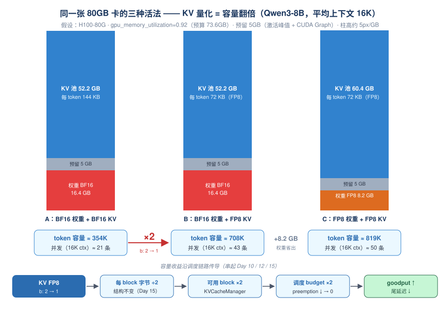
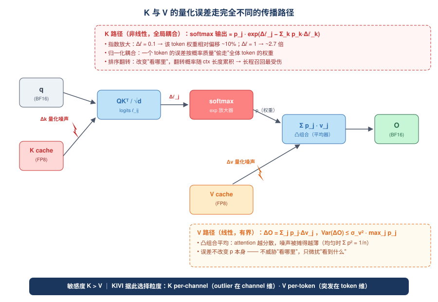
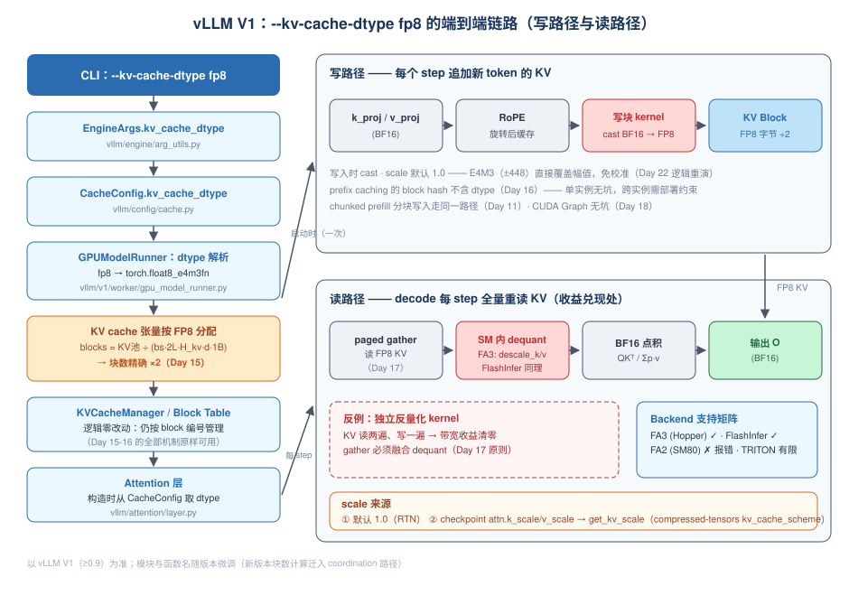

# Day 23：KV Cache 量化 —— 容量翻倍的第二战场与 K 的敏感性

> **第 4 周 · Day 23** ｜ 预计投入：3~3.5 小时
> **衔接回顾**：Day 2（每 token KV 显存公式、decode 时延下界）、Day 22（量化统一框架 / 粒度光谱 / E4M3 免校准 / 激活 outlier 三特征）、Day 15-16（block pool、block hash 与 prefix caching）、Day 12-13（preemption 的触发与观察）——今天把 Day 22 的量化框架搬到 KV cache 上，并让它顺着 Week 2-3 的调度链路"传导"出收益。
> **本周前瞻**：Day 24（llm-compressor 亲手产出量化 checkpoint + 专题 A4《量化》四段式总结）。
> **产出目标**：Qwen3 FP8 + KV FP8 三列对比实验记录（显存 / 吞吐 / 精度）+ Qwen3-8B 并发上限手算。

---

## 一、今日学习目标

- [ ] 把 Day 2 的 KV 显存公式升级为**量化版**（`dtype_bytes` 成为唯一可调变量），30 秒内算出任意模型 × 精度的每 token KV 字节与并发上限
- [ ] 说清 KV 量化与权重量化**收益模型的本质区别**（一个赚容量、一个赚带宽/算力），并讲出容量收益如何沿 `num_gpu_blocks → scheduler budget → running batch / preemption → goodput` 传导（串起 Day 10/12/15）
- [ ] 手推 decode 访存模型里 **KV 流量与权重流量的交叉点** `ctx*(B)`，用它判断"什么时候 KV 量化能直接降 TPOT"
- [ ] 从误差传播数学解释**为什么 K 比 V 敏感**（指数放大 + 排序翻转 vs 凸组合压缩），并由此推出 KIVI "K 按 channel、V 按 token" 的粒度不对称设计
- [ ] 沿 vLLM V1 源码讲出 `--kv-cache-dtype fp8` 的**完整链路**：配置解析 → block 字节减半、块数翻倍 → 写路径 cast → 读路径 kernel 内 dequant → scale 的三个来源
- [ ] 列出 KV 量化与 **prefix caching / CUDA Graph / P/D 分离**的交互与坑
- [ ] 用决策表回答"什么负载适合开 KV 量化"
- [ ] 完成三列实验（BF16 / FP8 权重 / FP8 权重+FP8 KV），按"现象 → 源码机制 → 指标表现"三段归档

---

## 二、核心概念：KV 量化是"容量优先"的第二战场

### 2.1 权重量化 vs KV 量化：两种完全不同的收益模型

Day 22 的一切推导都围绕一个事实：**权重是常驻的、只读的**——压它赚的是带宽（TPOT）和算力（TTFT）。KV cache 完全不同：它是**运行时才生长的、按 token 计费的库存**——压它首先赚的是**容量**，其次才是带宽。

| 维度 | 权重量化（Day 22） | KV cache 量化（今天） |
|---|---|---|
| 作用对象 | 常驻只读的参数 | 运行时按 token 生长的状态 |
| 第一收益 | **带宽/算力**：decode 每 step 少读权重 | **容量**：同显存装 2× 的 token（并发或上下文翻倍） |
| 第二收益 | 显存（权重省下的变成 KV 池） | 带宽：长上下文时 decode 每 step 少读 KV（见 2.4） |
| 直接指标 | TPOT↓（batch 越小越明显）、TTFT↓ | goodput↑、preemption↓→0、长 ctx 时 TPOT↓ |
| 精度风险 | 权重分布静态、校准可控 | **K 的误差被 softmax 放大**（第 3 节），随 ctx 变长累积 |
| 与调度器的关系 | 间接（腾出 KV 池显存） | **直接**：可用 block 数翻倍 = scheduler 的 KV budget 翻倍 |

> **记忆锚点**：权重量化改的是"**读得多快**"，KV 量化改的是"**装得下多少**"；只有当 $B\cdot\bar{ctx}$ 越过交叉点（2.4 节）时，KV 量化才同时改"读得多快"。

### 2.2 Day 2 公式的量化版：`dtype_bytes` 是唯一可调变量

$$M_{\text{token}} = \underbrace{2}_{K\ \text{与}\ V} \times L \times H_{kv} \times d_{head} \times b$$

- $L$ 层数、$H_{kv}$ **KV 头数**（GQA 用 kv_heads，不是 q_heads——Day 2 踩过的坑）、$d_{head}$ 头维度、$b$ 每元素字节数。
- 模型结构（$L, H_{kv}, d$）动不了，**量化就是动 $b$**：BF16 $b{=}2$ → FP8 $b{=}1$ → INT4 $b{=}0.5$。

| 模型 | L | H_kv | d_head | 每 token 元素 | BF16 (b=2) | FP8 (b=1) | INT4 (b=0.5) |
|---|---|---|---|---|---|---|---|
| Llama-3-70B | 80 | 8 | 128 | 163,840 | 320 KB | 160 KB | 80 KB |
| Qwen3-8B | 36 | 8 | 128 | 73,728 | 144 KB | **72 KB** | 36 KB |

- Llama-3-70B 单条 100K 上下文 = **32 GB** BF16 KV——这就是长上下文服务"一卡一用户"的第一原因。
- Qwen3-8B 开 FP8 KV：每 token 144→72 KB，**同一块卡的 token 容量精确翻倍**——不是近似：`num_gpu_blocks = KV 池显存 ÷ 每 block 字节`，$b$ 减半 → 块数 ×2。

> **注意 MLA 特例**：DeepSeek 系 MLA 把 KV 压缩成单个 c-KV（每 token 字节远小于上式），其 FP8 cache 走专门路径，今天不展开（Day 17 提过接口差异，W6-7 项目 A 的候选方向）。

### 2.3 容量收益如何沿调度链路传导（串起 Week 2-3）

这是今天的核心分析框架——**量化收益不是孤立的数字，要顺着调度链路传导**：

```text
KV FP8（b: 2 → 1）
 → 每 block 物理字节减半（block 仍是 block_size 个 token，Day 15 的 block table 结构不变）
 → 同一显存下 num_gpu_blocks ×2          （KVCacheManager 可分配池翻倍）
 → scheduler 的 KV budget 放宽            （Day 10 的 token budget / max_num_seqs 不变，但 KV 不再是短板）
 → ① running batch 更大 → 吞吐↑
    ② preemption 触发条件右移 → 归零      （Day 12：抢占 = KV block 不足时被迫 recompute/swap）
    ③ 更长 prompt 可排队消化 → ρ 下降     （排队论：利用率下降，等待时间超线性下降）
 → goodput↑（满足 SLO 的有效吞吐）
```

对应的 `/metrics` 表现（Day 13 的观察方法直接复用）：`gpu_cache_usage` 峰值下降、preemption 计数归零、队列等待时间缩短。



配套手算（今天产出物之一，假设全部写清楚）：

> **设定**：H100-80G，`gpu_memory_utilization=0.92`（预算 73.6 GB），Qwen3-8B，平均上下文 16K（16,384 token），预留 5 GB（激活峰值 + CUDA Graph + 运行时杂项）。
>
> | 配置 | 权重 | KV 池 = 73.6 − 权重 − 5 | 每序列 KV（16K ctx） | 最大并发 |
> |---|---|---|---|---|
> | A：BF16 权重 + BF16 KV | 16.4 GB | 52.2 GB | 16,384 × 144 KB ≈ 2.42 GB | **≈ 21 条** |
> | B：BF16 权重 + FP8 KV | 16.4 GB | 52.2 GB（池不变！） | 1.21 GB | **≈ 43 条**（精确 2×） |
> | C：FP8 权重 + FP8 KV | 8.2 GB | 60.4 GB | 1.21 GB | **≈ 50 条**（2.4×） |
>
> 注意 B 的关键点：**KV 池显存一字节没变，容量却翻倍**——因为分母（每 token 字节）减半了。实验 B（第 6 节）用启动日志的块数 / "Maximum concurrency" 行校验这张手算。

### 2.4 带宽视角：KV 什么时候成为 decode 的第一访存大户

容量之外，KV 量化还直接作用于 decode 访存量。把 Day 2 的单序列时延下界升级为 **batch 版**：

$$\text{TPOT}_{\text{lower}} \approx \frac{W_{\text{bytes}} + \sum_{i=1}^{B} ctx_i \cdot M_{\text{token}}}{BW}$$

- 权重每 step **只读一次**（与 batch 无关）；KV 每 step **每条序列全量重读**（attention 的本性）；
- 定义**交叉点**——KV 总流量追上权重流量的平均上下文长度：

$$ctx^{*}(B) = \frac{W_{\text{bytes}}}{B \cdot M_{\text{token}}}$$

Qwen3-8B（$W_{\text{bytes}}$ = 16.4 GB，BF16 KV $M_{\text{token}}$ = 144 KB）：

| Batch B | 1 | 4 | 8 | 16 | 32 |
|---|---|---|---|---|---|
| ctx* | 111K | 27.8K | **13.9K** | 6.9K | 3.5K |

数值例子（B=8、ctx=32K，H100 3.35 TB/s）：KV 流量 = 8 × 32768 × 144 KB ≈ 38.7 GB，**超过**权重 16.4 GB → 每 step 总流量 55.1 GB → TPOT 下界 ≈ 16.4 ms；开 FP8 KV 后 KV 流量减半 → 35.7 GB → **10.7 ms，理论 ×1.54**。

> **结论（"什么负载适合开"的原理一半）**：
> - **短上下文 + 低并发**（$B\cdot\bar{ctx} \ll ctx^*$）：KV 不是访存大户，FP8 KV 几乎不降 TPOT——**收益全在容量**（2.3 节）；
> - **长上下文 + 高并发**（$B\cdot\bar{ctx} \gg ctx^*$）：KV 是第一访存大户，FP8 KV **容量 + TPOT 双收益**，后者逼近 2×。

---

## 三、原理深入：为什么 K 比 V 敏感（面试必考）

### 3.1 同样的量化噪声，两条完全不同的传播路径

标准 attention：$O_i = \sum_j p_{ij} v_j$，其中 $p = \mathrm{softmax}(\ell)$，$\ell_{ij} = q_i \cdot k_j / \sqrt{d}$。

**K 的误差路径（非线性，全局耦合）**：设第 $j$ 个 token 的 K 带量化扰动 $\Delta k_j$，它直接进入 logit：

$$\Delta \ell_{ij} = q_i \cdot \Delta k_j / \sqrt{d}$$

logit 扰动经过 softmax 的**指数映射**（一阶展开）：

$$\tilde{p}_{ij} \approx p_{ij} \cdot \exp\Big(\Delta \ell_{ij} - \underbrace{\textstyle\sum_k p_{ik}\,\Delta \ell_{ik}}_{\text{归一化耦合}}\Big)$$

两个恶性特征：

1. **指数放大**：$\Delta\ell = 0.1$ → 该 token 的注意力权重相对偏移 ~10%；$\Delta\ell = 1$ → 偏移 ~e ≈ 2.7 倍。而 $|\Delta\ell|$ 与 $|q|$ 成正比——query 幅度大的位置（正是模型"认真看"的位置）被扰动得最狠。
2. **归一化耦合**：分母是全 ctx 的期望扰动——**一个 token 的 K 误差会按概率质量"偷走"所有其他 token 的权重**，误差不局限于本地，且无法通过平均消掉。

**V 的误差路径（线性，有界）**：

$$\Delta O_i = \sum_j p_{ij}\, \Delta v_j, \qquad \mathrm{Var}(\Delta O_i) = \sigma_v^2 \sum_j p_{ij}^2 \;\le\; \sigma_v^2 \cdot \max_j p_{ij} \;\le\; \sigma_v^2$$

凸组合（权重和为 1）天然**降噪**：attention 越分散（均匀分布时 $\sum_j p_{ij}^2 = 1/n$），V 的量化噪声被平均得越干净。而 K 的噪声因为**改变 $p$ 本身**，完全不受这个保护。



### 3.2 排序翻转：K 误差的"语义级"杀伤

attention 的本质是"选谁看"的软排序。K 的误差改变的是 $\ell$ 的**相对次序**：当两个 logit 之差被噪声翻转时，模型"看错对象"。设两个 logit 差近似 $N(0, 2\sigma_\ell^2)$，单对翻转概率 $\approx \Phi(-|\Delta\ell|/\sqrt{2}\,\sigma_\ell)$；而上下文越长、候选 token 越多，**至少一对被翻转的概率随 $n$ 累积**（$1-(1-p)^n$ 量级）。

这就是长上下文任务（needle-in-haystack、长程引用、多轮 Agent 的早期记忆）对 KV 量化最敏感的数学根源，也是实验 A 里 "top-1 flip 计数" 直接观测的对象。

### 3.3 K 的 outlier：Day 22 的剧本在 KV 上重演

缓存的 K 是 **k_proj 的输出（RoPE 之后）**——它就是激活，所以 Day 22 的激活 outlier 三特征（固定 channel、~100× 幅度、>2.7B 模型涌现）原样成立：

- **per-tensor INT8 量化 KV**：一个 channel outlier 毁掉整个张量（scale 被顶大 100×，其余 99.9% 通道步长全变粗）；
- **FP8 E4M3**：指数位把 outlier 装进大格点区，小数值精度不受牵连——KV 侧同样**免校准**。

两个补充细节：

1. RoPE（rotate_half：$x\cos\theta + \mathrm{rot}(x)\sin\theta$）会混合相邻 channel 对，对幅度有一定平滑作用，但 channel 间的系统性差异仍在（实验 A 注入 outlier 后可观测）；
2. **V 的 outlier 分布不同**：更接近 per-token 的突发（哪个 token 的 V 大由内容决定），没有 K 那种稳定的 channel 结构——这直接决定了 3.4 节 KIVI 的粒度选择。

### 3.4 位宽阶梯：从 FP8 到 INT4

| 方案 | scale 粒度 | 精度代价 | 状态 |
|---|---|---|---|
| **FP8 E4M3** | per-tensor（甚至 scale=1.0 免校准） | ppl 变化 <0.1%（Llama/Qwen 级典型量级） | **生产默认**，vLLM V1 主线支持 |
| **INT8** | per-head / per-block | 多数任务损失可忽略 | TRT-LLM 路径常见；vLLM V0 曾有 int8 路径（xformers），**V1 GPU 主线只保留 FP8 系** |
| **INT4** | K per-channel + V per-token + outlier 残差 | 代码/数学任务明显掉点 | 研究前沿（KIVI / KVQuant），主线引擎未内置 |

KIVI 的粒度不对称正是 3.1-3.3 的直接推论：

- **K 按 channel 量化**：outlier 固定在 channel 维 → 每 channel 一个 scale，把 outlier 隔离在自己的格点里；且 K 的读取模式（每个新 query 对全 ctx 的 K 做点积）让 channel 维 scale 在 kernel 里"免费"可用；
- **V 按 token 量化**：V 没有 channel 结构，但输出 $O=\sum_j p_j v_j$ 逐 token 加权 → 每 token 一个 scale 在读路径上顺手就能反量化；
- **KVQuant** 更激进：Hadamard **旋转**把 outlier 摊平 + 非均匀量化 + 少数 outlier 通道保 FP16 分离存储。

> **面试高分点**：把"K/V 敏感度差异（3.1 的数学）"与"KIVI 粒度选择（3.4 的工程）"串成一条因果链讲出来——为什么这么量，是误差结构决定的，不是拍脑袋。

---

## 四、与 vLLM V1 的实际联系：`--kv-cache-dtype fp8` 的完整链路

### 4.1 链路总览



### 4.2 源码走读（V1，以 ≥0.9 为准；函数名随版本微调，见文末版本说明）

**① 配置解析**：

```text
CLI: --kv-cache-dtype fp8
 └─ vllm/engine/arg_utils.py     EngineArgs.kv_cache_dtype
     choices: auto / fp8 / fp8_e4m3 / fp8_e5m2（auto = 跟随模型 dtype）
 └─ vllm/config/cache.py         CacheConfig.kv_cache_dtype
```

**② dtype 解析与块数翻倍**（`vllm/v1/worker/gpu_model_runner.py`）：

- `GPUModelRunner` 把字符串解析为 torch dtype：`fp8` → `torch.float8_e4m3fn`，`fp8_e5m2` → `torch.float8_e5m2fn`；
- KV cache 张量按该 dtype 分配（`initialize_kv_cache`，新版本为 `initialize_kv_caches`；块数计算早期版本经 `vllm/v1/core/kv_cache_utils.py::get_kv_cache_config`，新版迁入 coordination 路径）：

$$\text{num\_gpu\_blocks} = \frac{\text{KV 池显存}}{\text{block\_size} \times 2 L H_{kv} d \times \text{dtype\_size}}$$

$b{:}\,2{\to}1$ → **块数精确 ×2**。KVCacheManager / block table / prefix caching 的全部逻辑（Day 15-16）**一行不用改**——它们操作的是 block 编号，与块内字节无关。这是量化与 PagedAttention 架构解耦的优雅之处，也是面试可以主动讲的"架构红利"。

**③ 写路径**：forward 中 `k_proj → RoPE → Attention 层`（`vllm/attention/layer.py`，构造时从 `CacheConfig` 取 kv_cache_dtype）→ **backend 的写块 kernel 做 BF16→FP8 cast**（FA 的 kvcache 接口 / Triton backend 的写入分支）。

**④ 读路径（收益能否兑现的关键）**：`vllm/v1/attention/backends/flash_attn.py`（FA3）/ `flashinfer.py` 的 kernel **直接持有 FP8 KV 指针，在 SM 内 on-the-fly 转成 BF16 参与点积**（FA3 通过 `descale_k/descale_v` 参数施加 scale）。

> **为什么必须 in-kernel dequant（面试爱问）**：如果先跑一个独立 kernel 把 KV 反量化成 BF16 再做 attention，等于把 KV **读两遍、写一遍**——带宽收益直接清零甚至为负。这与 Day 17 的原则完全一致：paged gather 与 dequant 必须融合在同一个 kernel 里。

**⑤ scale 的三个来源**：

| 来源 | 值 | 何时生效 |
|---|---|---|
| 默认 | **1.0**（纯 RTN cast） | checkpoint 不带 KV scale 时——E4M3 动态范围 ±448 足以直接表示 K/V 幅值（Day 22"FP8 免校准"逻辑在 KV 侧重演） |
| checkpoint 静态 scale | `attn.k_scale / v_scale` 权重 | compressed-tensors 的 `kv_cache_scheme` 离线校准产出 → `vllm/model_executor/layers/quantization/utils/kv_scale.py::get_kv_scale` 在 `process_weights_after_loading` 阶段读入 → kernel descale |
| 细粒度动态 scale | — | 主线暂无（KIVI 类 per-channel/per-token 属研究实现） |

**⑥ backend 支持矩阵（版本敏感，动手前以你安装版本的 dtype 检查为准）**：

| Backend | FP8 KV (e4m3) | 备注 |
|---|---|---|
| FLASH_ATTN（FA3，Hopper） | ✓ | kvcache 接口的 descale 路径 |
| FLASH_ATTN（FA2，SM80/A100） | ✗ | **直接报错**——A100 上做本实验切 `VLLM_ATTENTION_BACKEND=FLASH_INFER` |
| FLASH_INFER | ✓ | |
| TRITON_ATTN / 其他 | 有限，随版本演进 | 以当前版本 `AttentionBackend` 实现为准 |
| MLA（DeepSeek 系） | 专门路径 | c-KV 单缓存，另一套数据布局（Day 17 伏笔，项目 A 候选） |

### 4.3 与其他子系统的交互（三个坑位排查）

1. **prefix caching（Day 16）**：block hash = token ids + 父块 hash + extra（LoRA/多模态）——**不含 dtype**。单实例内 dtype 固定，天然无坑；**坑在跨实例**：P/D 分离（Day 30）传 KV、多实例共享缓存池时，两端 `kv_cache_dtype` 与 scale 必须一致，否则解出的 attention 全错——这是**部署约束**而非代码保证。
2. **CUDA Graph（Day 18）**：无坑。capture 时 kernel 已按 FP8 KV 路径特化，capture / 非 capture 行为一致。
3. **chunked prefill（Day 11）**：无特殊交互，分块写块的 cast 路径与整块相同。

**观测点**：启动日志的 `# GPU blocks` / `GPU KV cache size` / `Maximum concurrency`（字段名随版本略有差异）；`/metrics` 的 `gpu_cache_usage`、preemption 计数。

---

## 五、什么负载适合开（决策表）

| 负载特征 | 是否适合 | 原因（对应小节） |
|---|---|---|
| 长上下文（RAG / 长文档总结 / Agent 多轮） | **强烈推荐** | KV 是绝对瓶颈；容量 ×2，且 $B\cdot\bar{ctx} \gg ctx^*$ 时 TPOT 直降（2.2 / 2.4） |
| 高并发短输出（chat 泛滥负载） | 推荐 | preemption→0、batch 上限提高 → goodput↑（2.3） |
| 短上下文 + 精度敏感（代码补全、数学） | 谨慎 | 收益小（2.4：KV 不是访存大户）；FP8 可用（近无损），INT4 有风险（3.4） |
| prefix caching 重度 + 多租户 | 可用但注意 | hash 不含 dtype，跨实例需部署约束（4.3） |
| 短上下文 + 低并发 + 显存富余 | 不必开 | 收益趋近 0，白担精度风险 |

一句话决策：**先算 $B\cdot\bar{ctx}$ 与 $ctx^*$ 的大小关系，再看显存余量；两者都富余就不开，任一紧张就开 FP8，精度敏感再单独评估**。

---

## 六、动手实验（3 个必做）

### 实验 A（约 40 分钟）：K vs V 敏感度微基准——纯 PyTorch 复现"剧本"

任意单卡 GPU（~2 GB 显存）即可，不起服务。三个观察点：① K/V 误差不对称；② outlier 打崩 per-tensor INT8（Day 22 剧本重演）；③ INT4 下 K/V 的粒度选择不对称（KIVI 逻辑）。

```python
# day23_k_vs_v_lab.py —— K/V 量化敏感度微基准（单卡即可）
import torch

torch.manual_seed(0)
DEV, D = "cuda", 128

def attention(q, k, v):                      # 单头: q(1,d), k/v(n,d)
    p = ((q @ k.T) / D**0.5).softmax(-1)
    return p @ v

def rel_err(a, b):
    return ((a - b).norm() / b.norm()).item()

def fp8(t):                                  # E4M3 RTN, scale=1.0（等价 vLLM 默认路径）
    return t.to(torch.float8_e4m3fn).to(torch.bfloat16)

def int_rtn(t, bits, dim=None):              # 对称 RTN; dim=None per-tensor / 0 per-channel / 1 per-token
    qmax = 2**(bits - 1) - 1
    s = (t.abs().amax(dim, keepdim=True) / qmax if dim is not None
         else t.abs().max() / qmax)
    return (torch.round(t / s) * s).to(t.dtype)

def flip(q, k, kq):                          # K 量化后 attention argmax 是否翻转
    return ((q @ k.T).argmax() != (q @ kq.T).argmax()).item()

print("== 1) 尖峰注意力下的 K/V 不对称（q 指向某个 k，模拟'认真看'）==")
print(f"{'ctx':>7} | {'FP8-K':>8} {'FP8-V':>8} | {'i8K-tens':>9} {'i8K-chan':>9} | flip(FP8-K)")
for ctx in [512, 2048, 8192, 32768]:
    k = torch.randn(ctx, D, device=DEV, dtype=torch.bfloat16) * 0.3
    q = k[ctx // 3] + 0.05 * torch.randn(D, device=DEV, dtype=torch.bfloat16)
    v = torch.randn(ctx, D, device=DEV, dtype=torch.bfloat16)
    base, kf = attention(q, k, v), fp8(k)
    print(f"{ctx:>7} | {rel_err(attention(q, kf, v), base):8.2e} "
          f"{rel_err(attention(q, k, fp8(v)), base):8.2e} | "
          f"{rel_err(attention(q, int_rtn(k, 8), base)):9.2e} "
          f"{rel_err(attention(q, int_rtn(k, 8, 0), base)):9.2e} | {flip(q, k, kf)}")

print("\n== 2) 注入 channel outlier（模拟 K 的系统性离群通道，Day 22 剧本重演）==")
for mult in [1, 20, 100]:
    k = torch.randn(8192, D, device=DEV, dtype=torch.bfloat16) * 0.3
    k[:, ::64] *= mult                       # ~1.5% 的 channel 幅度 ×mult
    q = k[100] + 0.05 * torch.randn(D, device=DEV, dtype=torch.bfloat16)
    v = torch.randn(8192, D, device=DEV, dtype=torch.bfloat16)
    base = attention(q, k, v)
    print(f"outlier×{mult:>3}: FP8-K err {rel_err(attention(q, fp8(k), v), base):.2e} | "
          f"INT8 per-tensor err {rel_err(attention(q, int_rtn(k, 8), base)):.2e} | "
          f"INT8 per-channel err {rel_err(attention(q, int_rtn(k, 8, 0), base)):.2e}")


print("\n== 3) INT4：K/V 的粒度选择（KIVI 的设计）==")
k = torch.randn(8192, D, device=DEV, dtype=torch.bfloat16) * 0.3
k[:, ::64] *= 20
q = k[100] + 0.05 * torch.randn(D, device=DEV, dtype=torch.bfloat16)
v = torch.randn(8192, D, device=DEV, dtype=torch.bfloat16)
base = attention(q, k, v)
kq = int_rtn(k, 4, 0)
print(f"K INT4 per-channel err : {rel_err(attention(q, kq, v), base):.2e}  flip={flip(q, k, kq)}")
print(f"V INT4 per-token  err : {rel_err(attention(q, k, int_rtn(v, 4, 1)), base):.2e}")
print(f"V INT4 per-tensor err : {rel_err(attention(q, k, int_rtn(v, 4)), base):.2e}")
```

**预期现象与解读（记录你实测的数字）**：

| 观察 | 典型量级 | 机制解释 |
|---|---|---|
| FP8-K 误差 ≥ FP8-V 误差，且 flip 随 ctx 增多 | 同为 1e-3~1e-2 量级 | K 误差改变 $p$ 本身（3.1 指数路径）；V 被凸组合平均（尖峰时 $\sum p^2 \approx p_{\max}$，仍 ≤1） |
| 干净高斯下 INT8 per-tensor 可能**优于** FP8 | INT8 误差更小 | 无 outlier 时均匀格点（8 bit）胜过 3-bit 尾数——**Day 22 2.3 的反例情形**，别惊讶 |
| outlier×100 后 INT8 per-tensor 误差暴涨 10~100×，FP8 几乎不动 | 灾难性 vs 平稳 | scale 被 outlier 顶大（恶性截断链式反应）vs E4M3 指数位隔离 outlier |
| INT4：V per-token 可控、K per-channel 仍出 flip | V 误差 ~1e-2 | K 的 4-bit logit 噪声经 exp 放大威胁排序——KIVI 还要加 outlier 残差才够 |

### 实验 B（约 60 分钟）：三列 serving 对比——显存 / 吞吐 / 尾延迟

三列设计的意义：**B−A 隔离权重量化的贡献（Day 22 的账），C−B 隔离 KV 量化的净贡献（今天的账）**。

```bash
# 列 A：BF16 权重 + BF16 KV（基线）
vllm serve Qwen/Qwen3-8B \
  --max-model-len 32768 --max-num-seqs 256 \
  --gpu-memory-utilization 0.92 --port 8000

# 列 B：FP8 权重 + BF16 KV
vllm serve Qwen/Qwen3-8B-FP8 \
  --max-model-len 32768 --max-num-seqs 256 \
  --gpu-memory-utilization 0.92 --port 8000

# 列 C：FP8 权重 + FP8 KV（今天的主角）
vllm serve Qwen/Qwen3-8B-FP8 \
  --max-model-len 32768 --max-num-seqs 256 \
  --gpu-memory-utilization 0.92 \
  --kv-cache-dtype fp8 --port 8000
```

启动后先抄日志（对照 2.3 手算）：`# GPU blocks`（C 应约为 B 的 2×）、`GPU KV cache size`、`Maximum concurrency`。

两个负载各跑一遍（参数名以 `vllm bench serve --help` 为准）：

```bash
# 负载 1：ShareGPT（短上下文泛负载）——预期"负结果"：TPOT 基本不变
vllm bench serve --model Qwen/Qwen3-8B-FP8 \
  --dataset-name sharegpt --dataset-path ShareGPT_Vicuna_unfiltered_5k.json \
  --request-rate 4 --num-prompts 300

# 负载 2：sonnet 合成长上下文（input 8192 / output 1024）——KV 压力测试
vllm bench serve --model Qwen/Qwen3-8B-FP8 \
  --dataset-name sonnet \
  --sonnet-input-len 8192 --sonnet-output-len 1024 --sonnet-range-ratio 1 \
  --request-rate 4 --num-prompts 300
# 再各拉一个饱和档（如 --request-rate 16），把系统推进 preemption 区
```

**观察矩阵（"现象 → 源码机制 → 指标表现"三段对照，直接抄进实验记录）**：

| 现象 | 机制（本文小节） | 指标 |
|---|---|---|
| C 的 GPU blocks ≈ B 的 2× | 2.2 公式：$b$ 减半 → 块数 ×2 | 启动日志 |
| ShareGPT 下 C vs B 的 TPOT 差 <5% | 2.4：$B\cdot\bar{ctx} \ll ctx^*$，KV 非访存大户 | bench 的 ITL/TPOT |
| sonnet 下 C 的 TTFT p99 ↓、吞吐 ↑ | 2.3：容量↑ → ρ↓ → 排队时延超线性下降 | bench 的 TTFT p99 |
| 饱和档下 B 出现 preemption 增长 + TPOT p99 尖刺，C 消失 | Day 12：KV block 不足触发 recompute；C 的 budget ×2 | `/metrics` preemption 计数 |
| 按 SLO（如 TPOT<100ms）过滤后 C 的 goodput 明显更高 | 2.3 传导链终点 | 自行统计 |

### 实验 C（约 40 分钟）：精度对比——PPL + 生成 diff

```python
# day23_kv_precision.py —— KV FP8 vs BF16 精度对比（离线，completions 方式避开 thinking 模式）
# 用法：python day23_kv_precision.py bf16 | fp8
import sys, math
import torch
from datasets import load_dataset
from vllm import LLM, SamplingParams

kv = sys.argv[1] if len(sys.argv) > 1 else "bf16"
llm = LLM(model="Qwen/Qwen3-8B-FP8", dtype="bfloat16", max_model_len=8192,
          gpu_memory_utilization=0.9, kv_cache_dtype=kv)

# --- 1) 长文本 PPL：wikitext-2 拼成 4 段 ~4K token 的 prompt ---
texts = [t for t in load_dataset("wikitext", "wikitext-2-raw-v1", split="validation")["text"] if len(t) > 200]
corpus, chunks, buf = "\n\n".join(texts), [], []
n = 0
for t in corpus.split(" "):
    buf.append(t); n += 1
    if n >= 3000:
        chunks.append(" ".join(buf)); buf, n = [], 0
if buf: chunks.append(" ".join(buf))

outs = llm.generate(chunks, SamplingParams(max_tokens=1, temperature=0, prompt_logprobs=0))
nll, cnt = 0.0, 0
for o in outs:                                   # 跳过首 token（无条件概率）
    for tid, lps in zip(o.prompt_token_ids[1:], o.prompt_logprobs[1:]):
        nll -= lps[tid].logprob; cnt += 1
print(f"[kv={kv}] wikitext PPL = {math.exp(nll / cnt):.4f}  (n={cnt} tokens)")

# --- 2) 固定 prompt 贪心生成 diff（代码 / 数学 / 长程召回各一）---
probes = [
    "def quicksort(arr):\n",                                     # 代码
    "A train travels 60 km in 45 minutes. Its speed in km/h is",  # 数学
    chunks[0] + "\nQuestion: What is the first word of the text above? Answer:",  # 长程召回
]
gens = llm.generate(probes, SamplingParams(max_tokens=128, temperature=0))
for i, g in enumerate(gens):
    print(f"\n===== probe {i} [kv={kv}] =====\n{g.outputs[0].text}")
```

跑两次（`bf16` / `fp8`），diff 两次输出。**验收参考**：PPL 差 <0.5%（典型 <0.1%）；贪心生成大多逐字一致，长程召回 probe 偶有措辞差异属正常——记录差异率。

可选（lm_eval，若你的 lm-eval 版本 model_args 能透传 `kv_cache_dtype` 就直接用，否则以本脚本为准）：

```bash
lm_eval --model vllm --model_args pretrained=Qwen/Qwen3-8B-FP8,dtype=bfloat16,max_model_len=8192 \
  --tasks gsm8k,hellaswag --batch_size auto
```

社区典型量级：FP8 KV 相对 BF16 KV 在 GSM8K/HellaSwag 上差 <0.5 pt；INT4 KV 在代码/数学任务可掉 2~5 pt（这正是 3.4 "谨慎"的依据）。**不要引用别人的数字当结论，跑自己的**。

---

## 七、面试高频问题

**Q1：KV cache 量化和权重量化的收益模型有何本质区别？**
A：权重常驻只读 → 赚带宽/算力（TPOT/TTFT）；KV 运行时按 token 生长 → 首先赚**容量**（块数 ×2 → 并发/上下文翻倍 → preemption 归零 → goodput↑），其次在 $B\cdot\bar{ctx} > ctx^*$ 时赚**带宽**（KV 是第一访存大户，TPOT 逼近 2×）。两条收益独立、可叠加，所以生产上常见 FP8 权重 + FP8 KV 叠着开。

**Q2：为什么 K 比 V 敏感？**
A：K 的量化误差进 logit 后经 softmax **指数放大**且**归一化耦合**（一个 token 的误差按概率质量偷走全体的权重），威胁"看哪里"的排序结构，且翻转概率随 ctx 累积；V 的误差是凸组合 $\sum p_j \Delta v_j$，方差 $\le \sigma_v^2 \max p$，被加权平均自然压住。工程对应：KIVI 给 K per-channel（outlier 在 channel 维）、V per-token（突发在 token 维）。

**Q3：vLLM 里 FP8 KV 的 scale 从哪来？默认 1.0 意味着什么？**
A：三来源——默认 1.0（运行时 RTN cast，E4M3 的 ±448 动态范围直接覆盖 K/V 幅值，免校准）；checkpoint 静态 `attn.k_scale/v_scale`（compressed-tensors `kv_cache_scheme` 离线校准产出，`get_kv_scale` 在 `process_weights_after_loading` 读入）；细粒度动态 scale 主线暂无。

**Q4：KV FP8 对 TTFT 为什么也可能有收益？**
A：直接效应小（prefill 是 compute-bound，只省一半 KV 写带宽）；间接效应大——容量 ×2 → 队列利用率 ρ 下降 → 排队时延超线性缩短 → TTFT p99 显著改善；KV 紧张时 preemption 引发的 recompute（二次 prefill）也消失。

**Q5：KV 量化与 prefix caching / P/D 分离的交互坑？**
A：block hash 只含 token ids + 父 hash + extra，**不含 dtype**——单实例 dtype 固定，无坑；跨实例（P/D 传 KV、共享缓存池）两端 dtype+scale 必须一致，否则 attention 解码全错，这是部署约束而非代码保证。

**Q6：什么负载适合开 KV 量化？**
A：决策表见第 5 节。一句话：**KV 是瓶颈（长上下文/高并发/显存紧张）就开 FP8；短上下文低并发显存富余不开；INT4 谨慎（代码/数学任务易翻车）**。

**Q7：为什么 KV 读路径必须 in-kernel dequant？**
A：独立反量化 kernel = KV 读两遍写一遍，带宽收益清零；必须把 dequant 融合进 paged gather（Day 17 原则）。FA3 通过 `descale_k/descale_v` 在 SM 内完成。

**Q8：KV INT4 为什么难？**
A：① 4-bit 步长粗，K 的 logit 误差被 exp 放大到不可接受；② outlier 维度不对称（K 在 channel、V 在 token）→ 需要 K per-channel + V per-token + outlier 残差（KIVI）或 Hadamard 旋转摊平（KVQuant）；③ kernel 要支持 4-bit paged 布局 + 细粒度 scale 的融合反量化，工程量大——主线引擎至今未内置。

---

## 八、今日总结

```text
一个公式：每 token KV 显存 = 2·L·H_kv·d·b —— 量化只动 b（2→1→0.5）
两种收益：容量（块数×2 → 并发/上下文翻倍 → goodput）＋ 带宽（B·ctx ≫ ctx* 时 TPOT 直降）
一条判据：ctx*(B) = W_bytes/(B·M_token)，越过它 KV 就是 decode 第一访存大户
一个不对称：K 误差走 exp 放大 + 排序翻转（channel outlier），V 误差走凸组合被平均（token 突发）
一条链路：--kv-cache-dtype fp8 → CacheConfig → num_gpu_blocks×2 → 写路径 cast / 读路径 in-kernel dequant（scale 默认 1.0）
一个坑位：跨实例共享/传输 KV 必须 dtype+scale 一致（P/D 分离的前置约束）
一套实验：三列对比（A/B/C），显存看启动日志、性能看 bench 尾延迟与 preemption、精度看 PPL+生成 diff
```

**与本周的钩子**：Day 22-23 把"权重/激活/KV"三处的量化讲完了，明天（Day 24）用 llm-compressor 亲手产出一条 FP8 量化 recipe（含 `kv_cache_scheme` 的 KV scale 校准），跑通"量化→验证"闭环，并把两天内容收进专题 A4《量化：原理/场景/权衡/失效模式》。

---

## 九、今日自测题

1. 写出每 token KV 显存公式。Qwen3-8B 开 FP8 KV 后每 token 多少字节？
2. 手算：H100-80G、Qwen3-8B、平均上下文 16K，BF16 KV 与 FP8 KV 的最大并发各是多少（权重 BF16、预留 5 GB、util 0.92）？
3. Qwen3-8B（BF16 KV），batch=8 时 KV 流量追上权重的交叉点 ctx* 是多少？batch=32 呢？
4. 用两条数学性质解释 K 比 V 敏感（一条关于 softmax，一条关于凸组合）。
5. KIVI 为什么 K 用 per-channel、V 用 per-token 量化？
6. vLLM 默认（checkpoint 不带 KV scale）时 FP8 KV 的 scale 是多少？为什么可以这么"草率"？
7. 在 A100 上开 `--kv-cache-dtype fp8` 且用默认 FA2 后端会发生什么？怎么解决？
8. P/D 分离部署中，KV 量化引入了什么约束？为什么 block hash 防不住这个问题？
9. 为什么不能"先把 KV 反量化成 BF16 再跑 attention"？
10. 短上下文低并发负载开了 FP8 KV，测得 TPOT 几乎不变——这个实验白做了吗？

<details>
<summary>参考答案</summary>

1. $M_{token}=2LH_{kv}db$；Qwen3-8B：73,728 元素 × 1 B = **72 KB**。
2. 2.3 节表：**≈21 条 vs ≈43 条**（KV 池同为 52.2 GB，分母 2.42→1.21 GB）。
3. $ctx^* = 16.4\text{GB}/(B \times 144\text{KB})$：B=8 → **≈13.9K**；B=32 → **≈3.5K**。
4. ① K 误差经 softmax 指数映射 $p_j \cdot e^{\Delta\ell_j - \sum p_k \Delta\ell_k}$：指数放大 + 归一化耦合（偷概率质量）；② V 误差 $\mathrm{Var} = \sigma_v^2\sum p^2 \le \sigma_v^2 \max p$：凸组合有界、分散即降噪。
5. K 的 outlier 固定在 channel 维（k_proj 输出的系统性离群通道）→ per-channel 把 outlier 隔离进各自的格点；V 无 channel 结构、误差又被逐 token 加权平均 → per-token 顺手且够用。
6. **1.0**（纯 RTN cast）。E4M3 动态范围 ±448、格点随幅度指数变密，直接覆盖 K/V 幅值分布——免校准的根源。
7. FA2 不支持 FP8 KV，**启动/首个请求直接报错**；切 `VLLM_ATTENTION_BACKEND=FLASHINFER`（或换 Hopper 卡）。
8. 两端实例的 `kv_cache_dtype` 与 scale 必须完全一致，否则传输的 FP8 字节被对方按不同 scale 解释，attention 全错。block hash 只含 token ids + 父 hash + extra，**不含 dtype**——同一实例内 dtype 恒定所以无感知，跨实例就漏防了。
9. KV 会被读两遍、写一遍（读 FP8 → 写 BF16 → 再读 BF16），带宽收益清零；必须融合进 paged gather kernel（FA3 descale 路径）。
10. 没有。TPOT 不变恰好**验证了 2.4 的判据**（该负载 $B\cdot\bar{ctx} \ll ctx^*$，KV 非访存大户）；此时收益在容量与尾延迟——去看 preemption 计数、TTFT p99 和按 SLO 过滤的 goodput，而不是平均 TPOT。
</details>

---

## 十、今日产出物

- [ ] **三列对比实验记录**：实验 B 的观察矩阵填上实测数字 + 三段对照（现象 → 源码机制 → 指标表现）
- [ ] **手算**：Qwen3-8B 在 80GB 卡上的最大并发（A/B/C 三档），与启动日志 `# GPU blocks` / `Maximum concurrency` 互相验证
- [ ] **实验 A 代码与结果解读**：K/V 不对称 + outlier 剧本重演 + INT4 粒度选择（三段各一句结论）
- [ ] **实验 C 的 PPL / 生成 diff 记录**（bf16 vs fp8 两栏）
- [ ] 打卡一句话：今天最大收获是 ______，还没搞透的是 ______（明天钩子：llm-compressor 亲手产 checkpoint）

---

> **明日预告（Day 24）**：用 llm-compressor 跑三条 recipe（FP8 动态 / GPTQ W4A16 / SmoothQuant W8A8），亲手产出量化 checkpoint 并完成"精度 + 性能"验证闭环；把 Day 22-23 收进专题 A4《量化：原理/场景/权衡/失效模式》。
>
> **版本说明**：本文源码引用以 vLLM V1（≥0.9）为准；`kv_cache_dtype` 的 choices、FA/FlashInfer 对 FP8 KV 的支持矩阵、`get_kv_cache_config` 所在模块（新版本迁入 coordination 路径）均随版本演进较快，动手前以你安装版本的代码与 `--help` 为准；INT8 KV 是 V0 历史路径（xformers），V1 GPU 主线只保留 FP8 系，不要按旧博客配置。
