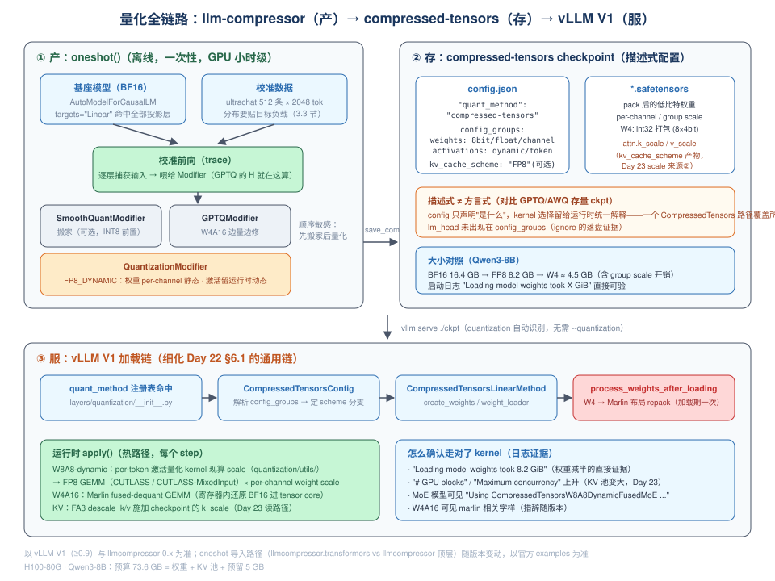
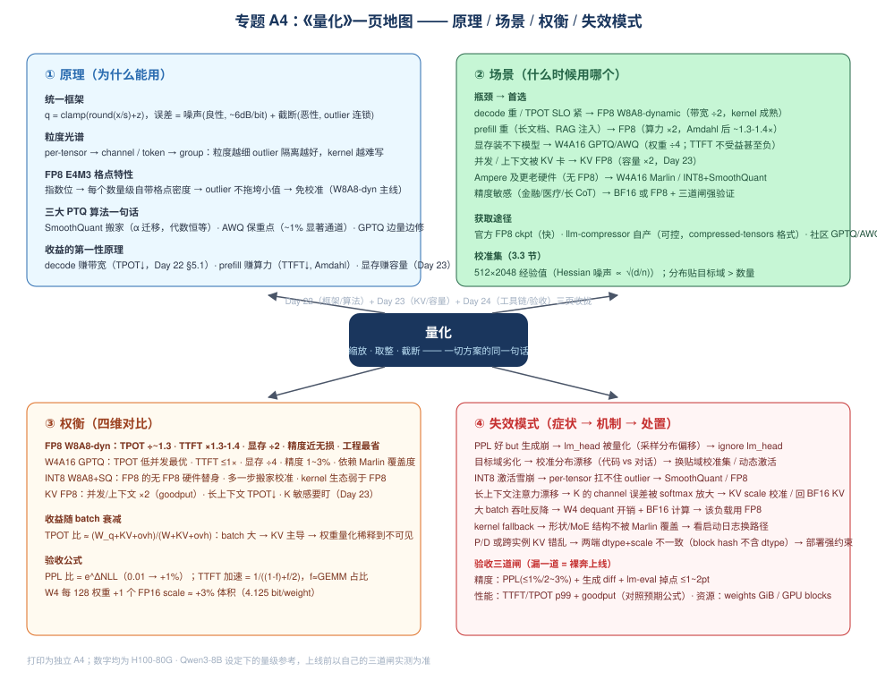
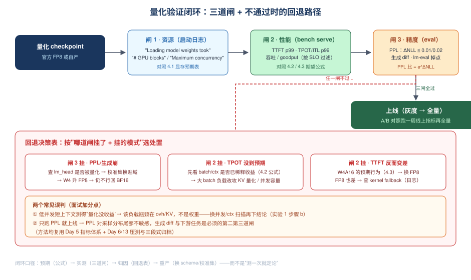

# Day 24：量化动手 + 专题总结 —— 用 llm-compressor 产出你的第一个量化 checkpoint

> **第 4 周 · Day 24** ｜ 预计投入：3~4 小时（GPU 实验日，建议留一整块时间）
> **衔接回顾**：Day 22（统一量化框架 / 粒度光谱 / 三大 PTQ 算法 / FP8 免校准 / compressed-tensors 配置初见）、Day 23（KV 量化的容量收益模型 / K 敏感性 / scale 的三个来源）、Day 6 与 Day 13（`vllm bench serve` 与"现象 → 源码机制 → 指标表现"三段式归档方法）——今天把前两天"读到的"全部变成"亲手产出的"。
> **本周前瞻**：Day 25-26（投机解码：原理 + 实验）、Day 27（mini 引擎收尾）、Day 28（复盘日：专题 A4《投机解码》）。
> **产出目标**：① 官方 FP8 checkpoint 完整 serving 基线；② llm-compressor 亲手产出 ≥1 个量化 checkpoint 并跑通"精度 + 性能"验证闭环；③ 专题 A4《量化：原理/场景/权衡/失效模式》（第 7 节，可直接抽出成独立文件）。

---

## 一、今日学习目标

- [ ] 讲清**量化模型的三种获取途径**（官方 FP8 checkpoint / llm-compressor 自产 / 社区 GPTQ-AWQ 存量）的取舍，并说明为什么 vLLM 官方主推 llm-compressor + compressed-tensors 格式
- [ ] 拆解一条 recipe 的**三要素**：`targets`（打到哪些层）/ `scheme`（什么格式、什么粒度、动还是静）/ `ignore`（为什么永远豁免 `lm_head`），并说出 Modifier 家族各自的职责
- [ ] 解释 **oneshot() 的执行过程**（校准前向 → 逐层 Modifier 改写 → 落盘），以及 SmoothQuant 必须排在 Quantization 之前的**顺序敏感**原因
- [ ] 用 **GPTQ Hessian 估计噪声 ∝ √(d/n_tok)** 推导"校准集 512 条够不够"，并用 **PPL 比值 = e^ΔNLL** 写下精度验收阈值
- [ ] 动手前先写下**性能预期公式**（decode TPOT 比值、prefill Amdahl 加速比、KV blocks 增量），实验后对照——把 Day 22 §5 的手推变成实测
- [ ] 沿 vLLM V1 源码讲出 **compressed-tensors checkpoint 从磁盘到 kernel 的完整加载链**（细化 Day 22 §6.1 的通用链，落到 `CompressedTensorsLinearMethod` 专列），并知道用什么日志证据确认走对了路径
- [ ] 亲手产出 **KV scale 校准**的 checkpoint（`kv_cache_scheme`），接上 Day 23 "scale 来源②"的伏笔
- [ ] 产出专题 A4《量化：原理/场景/权衡/失效模式》，达到"四段式"面试水平

---

## 二、核心概念：量化工具链全景——从"读量化"到"产量化"

### 2.1 拿到一个量化模型的三条路

Day 22 我们读的是别人量好的 checkpoint（看 `quantization_config`）；今天轮到自己生产。先把获取途径摆全：

| 途径 | 典型例子 | 优点 | 缺点 | 适用 |
|---|---|---|---|---|
| **① 官方 FP8 checkpoint** | `meta-llama/Llama-3.1-8B-Instruct-FP8`、`Qwen/Qwen3-8B-FP8` 等 | 零成本、官方校准过、开箱即 serve | 模型列表有限、recipe 不可控（想改粒度/加 KV scale 做不到） | 快速验证 FP8 收益、直接上生产 |
| **② llm-compressor 自产** | 今天的实验 2/3 | recipe 完全可控（scheme / 粒度 / ignore / KV scale）、支持任意 HF 模型 | 要 GPU、要选校准集、要自己做验证闭环 | 自有模型、需要 W4A16 或定制 recipe |
| **③ 社区 GPTQ/AWQ checkpoint** | HF 上大量 `*-GPTQ-Int4` | 生态存量巨大，老模型现成可用 | 方言格式各异，运行时路径分散（Day 22 §6.3：Marlin 一统前的乱战）、质量参差 | 老模型兜底 |

> **为什么 vLLM 官方主推 ② 的产出格式（compressed-tensors）**：它是**描述式配置**——config.json 只声明"权重 8bit float per-channel、激活 8bit float per-token dynamic"，运行时由 vLLM 的统一 CompressedTensors 路径解释执行，而不是像 GPTQ/AWQ 那样每种方言一套 kernel 调度。Day 22 §6.4 已经见过它的 config 样例，今天从"生产者"视角把它补全。

### 2.2 产 → 存 → 服：三段视图



三段各自的关键角色：

```text
【产】llm-compressor（离线，一次性）
   基座模型(BF16) + 校准数据 + recipe(Modifier 列表)
   → oneshot()：跑校准前向，按 Modifier 逐层改写权重
【存】compressed-tensors 格式（磁盘）
   config.json 的 quantization_config（描述式声明）
   + safetensors 里的 packed 低比特权重、per-channel scale、（可选）attn.k_scale/v_scale
【服】vLLM V1（在线，每天跑）
   serve 启动 → CompressedTensorsConfig 解释声明 → 加载期 repack（W4 → Marlin）
   → 运行时 apply()：W8A8-dynamic 每 step 现算 per-token 激活 scale + FP8 GEMM
```

> **记忆锚点**：产是**一次性离线成本**，服是**每天在线收益**——所以 recipe 可以慢慢调（几小时），而运行时路径必须零妥协（kernel 融合、无额外访存，Day 17 的原则在量化路径上同样成立）。

### 2.3 为什么"动手日"必须存在

Day 22-23 的知识如果只停留在"读懂"，面试追问一层就露馅：

- "FP8_DYNAMIC 里 dynamic 到底修饰谁？"（见 3.1——权重 per-channel **静态**，激活 per-token **动态**）
- "校准集 512 条是怎么定的？"（见 3.3——Hessian 噪声公式）
- "你怎么知道量化模型能上线？"（见第 4 节验收公式 + 第 6 节三道闸）

今天全部亲手过一遍，A4 总结才有底气。

---

## 三、llm-compressor 剖析：一条 recipe 的三要素

### 3.1 解剖一条最短的 recipe

```python
from llmcompressor.transformers import oneshot          # 新版路径见文末版本说明
from llmcompressor.modifiers.quantization import QuantizationModifier

recipe = QuantizationModifier(
    targets="Linear",        # ① 打到哪些层：所有 nn.Linear（q/k/v/o/gate/up/down_proj）
    scheme="FP8_DYNAMIC",    # ② 量化声明：格式 + 粒度 + 动/静
    ignore=["lm_head"],      # ③ 豁免：输出头不量化
)
oneshot(model=model, dataset=ds, recipe=recipe,
        max_seq_length=2048, num_calibration_samples=512)
model.save_compressed("./qwen3-8b-fp8-dyn")
```

**要素 ② 的展开**——`FP8_DYNAMIC` 会被翻译成 Day 22 粒度光谱上的一个坐标点：

| 声明 | 权重侧 | 激活侧 |
|---|---|---|
| `FP8_DYNAMIC`（W8A8-dynamic） | FP8 E4M3，**per-channel 静态 scale**（校准时 minmax 定死，落盘） | FP8 E4M3，**per-token 动态 scale**（运行时每个 step 现算，不落盘） |
| `FP8`（W8A8-static） | 同上 | FP8 per-tensor **静态 scale**（校准统计落盘，推理时查表） |
| `W4A16` + GPTQModifier | INT4，group=128 对称，**边量边修**（Day 22 §4.4） | 不量化（BF16 原样进 Marlin fused-dequant GEMM） |
| `W8A8` INT8 + SmoothQuant | INT8 per-channel | INT8 per-token/per-tensor（先做平滑搬家，Day 22 §4.2） |

> **`dynamic` 修饰的是激活，不是权重**：权重是常驻只读的，离线一次量死；激活逐 token 变化，只能（也只需）运行时现算——这就是 vLLM 热路径上 `per_token` 量化 kernel 存在的原因（5.3 节）。

**要素 ③ 的原因**：`lm_head` 的输出直接就是词表上的 logits → 采样分布。量化它等于往采样分布里注入系统性偏移，**生成质量肉眼可见劣化而 PPL 可能只涨一点点**（PPL 对分布尾部不敏感）——所以所有官方 recipe 都默认 `ignore=["lm_head"]`。这是"失效模式"清单的第一条（第 7.4 节）。

### 3.2 Modifier 家族与执行顺序

`oneshot()` 的执行模型：**跑校准前向 + 按列表顺序逐层应用 Modifier**。Modifier 是"对模型做什么"的抽象：

| Modifier | 职责 | 对应 Day 22 |
|---|---|---|
| `QuantizationModifier` | 基线量化：权重 per-channel RTN（FP8 或 INT8），激活按 scheme 静态统计或留空给动态 | §2 统一框架 |
| `SmoothQuantModifier` | **预处理搬家**：把激活 outlier 的难度按 α 迁移到权重（$s_j=\max|X_j|^\alpha/\max|W_j|^{1-\alpha}$，等效变换不改数学结果） | §4.2 |
| `GPTQModifier` | **边量边修**：用校准 Hessian 的逆，把当前列量化误差补偿到未量化列 | §4.4 |
| `kv_cache_scheme` 参数（挂在 QuantizationModifier 上） | **KV scale 校准**：统计各层 K/V 的 amax，落盘 `attn.k_scale / v_scale` | Day 23 的伏笔 |

**顺序敏感**：SmoothQuant 必须排在量化 Modifier **之前**——先搬家再量（INT8 均匀格点扛不住 outlier）；GPTQ 与 SmoothQuant 组合时同理。所以写成列表：

```python
recipe = [
    SmoothQuantModifier(smoothing_strength=0.8),
    QuantizationModifier(targets="Linear", scheme="W8A8_INT8", ignore=["lm_head"]),
]
```

> 另一条路线 `train()`（QAT / 低epoch 微调）今天不用——PTQ 的 oneshot 已经够 serving 场景，QAT 是精度极限场景的深水区。

### 3.3 校准集：多少条够？分布要贴谁？

**数量——从 GPTQ 的 Hessian 估计误差推**。GPTQ 对每层需要输入二阶统计 $\hat{H}=\frac{2}{n}\sum_i x_i x_i^\top$（2 来自 MSE 梯度），它是真实 $H$ 的样本估计，随机矩阵集中性给出相对噪声量级：

$$
\frac{\|\hat{H}-H\|}{\|H\|} \;=\; O\!\left(\sqrt{\frac{d}{n_{\text{tok}}}}\right),
\qquad n_{\text{tok}} = N_{\text{样本}} \times L_{\text{seq}}
$$

代入 Qwen3-8B 的隐藏维 $d=4096$、seq 2048：

| 校准样本数 | $n_{\text{tok}}$ | Hessian 相对噪声 |
|---|---|---|
| 128 | 262K | ~12.5% |
| 256 | 524K | ~8.8% |
| **512** | **1.05M** | **~6.2%** |
| 1024 | 2.10M | ~4.4% |
| 2048 | 4.19M | ~3.1% |

噪声按 $1/\sqrt{n}$ 衰减——**翻倍样本只降噪 29%**，512 之后边际收益急剧递减。这就是官方 recipe 几乎清一色 `512 × 2048` 的数学出处（对 FP8 这种免校准级格式甚至更宽松）。

**分布——比数量更重要**。$\hat{H}$ 是在"校准数据的输入分布"上估计的：

- 服务代码补全 → 校准集用代码（如 CodeAlpaca / The Stack 抽样），拿 ultrachat 去校准会在代码缩进、长标识符上失配；
- 服务多轮对话 → 用 chat 模板包过的对话数据（官方 ultrachat 是 chat 场景的默认选择）；
- **失效模式**：分布漂移不是"精度整体变差"，而是"目标域的特定 token 模式上 outlier 统计失效"——静念 scale 偏小 → 截断；动态 per-token scale 能缓解（每 token 现算），但权重的 per-channel scale 是落盘定死的，改不了。

> **FP8 为什么"看起来不用校准"**：权重 per-channel minmax 是确定性 RTN，不需要分布信息；E4M3 指数格点又天然隔离 outlier（Day 22 §2.3）。所以 FP8_DYNAMIC 的校准前向主要服务于管线统一（以及任何静态 act scale / KV scale 的统计），GPTQ/SmoothQuant 才是真正"吃"校准数据的算法。

### 3.4 KV scale 校准：亲手造出 Day 23 的"来源②"

Day 23 讲过 vLLM 里 FP8 KV 的 scale 三个来源：① 默认 1.0（RTN）；② checkpoint 静态 `attn.k_scale/v_scale`；③ 细粒度动态（主线暂无）。当时只留了一句"来源② 由 compressed-tensors 的 `kv_cache_scheme` 离线校准产出"——今天补上生产端：

```python
recipe = QuantizationModifier(
    targets="Linear",
    scheme="FP8_DYNAMIC",
    kv_cache_scheme="FP8",      # ← 多这一个参数
    ignore=["lm_head"],
)
```

它在 oneshot 的校准前向里**顺手统计各层 K/V 的 amax**（K/V 是 attention 的输入，逐层可观测），算出 per-layer 的 k_scale/v_scale 落盘。vLLM 端在 `process_weights_after_loading` 阶段用 `get_kv_scale`（`vllm/model_executor/layers/quantization/utils/kv_scale.py`）读入，喂给 FA3 的 `descale_k/descale_v`——**与 Day 23 的默认 1.0 路径唯一的区别就是这两个标量**，实验 3-B 会实测它值不值。

---

## 四、性能与精度模型：动手前先写下"预期答案"

实验的科学性来自**先写预期、再对实测**。沿用 Day 23 的设定：H100-80G、`gpu_memory_utilization=0.92`（预算 73.6 GB）、Qwen3-8B、平均上下文 16K、预留 5 GB。

### 4.1 显存预期：权重减半如何变成 KV 池

$$\text{KV 池} = 73.6 - W_{\text{bytes}} - 5 \quad\text{GB}$$

| 配置 | 权重 (GB) | KV 池 (GB) | 池相对 BF16 | 最大并发（16K ctx，BF16 KV ÷2.36GB） | 最大并发（FP8 KV ÷1.18GB） |
|---|---|---|---|---|---|
| BF16 权重 | 16.4 | 52.2 | 1.00× | ≈22 | ≈44 |
| **FP8 权重** | 8.2 | **60.4** | **1.16×** | ≈25.6 | **≈51** |
| W4A16 权重 | ≈4.5 | 64.1 | 1.23× | ≈27.2 | ≈54 |

> 权重量化的显存收益**不是权重本身**，而是腾出来的 KV 池：+8.2 GB 换 +15.7% 的 block 数——比 KV 量化（×2）温和，但**零精度风险面更小**（不动运行时状态）。两条腿可以叠加（第 4 行），这正是 Day 23 实验 C 的"配置 C"。

### 4.2 Decode TPOT 期望比：带宽模型（复用 Day 22 §5.1）

Decode 每 step 的关键访存 = 权重 + KV：

$$
\frac{\text{TPOT}_{q}}{\text{TPOT}_{bf16}} \;\approx\; \frac{W_q + \text{KV} + \text{ovh}}{W_{bf16} + \text{KV} + \text{ovh}},
\qquad \text{KV} = B \cdot \bar{ctx} \cdot M_{\text{token}}
$$

代入 $B=8$、$\bar{ctx}=16\text{K}$（KV = 8 × 16384 × 144KB ≈ 18.9 GB，ovh 先记 0）：

| 配置 | 每 step 访存 (GB) | TPOT 理论比 | 判读 |
|---|---|---|---|
| BF16 | 16.4 + 18.9 = 35.3 | 1.00 | 基线 |
| FP8 权重 | 8.2 + 18.9 = 27.1 | **0.77** | −23% |
| FP8 权重 + FP8 KV | 8.2 + 9.4 = 17.6 | **0.50** | −50%（Day 23 的配置 C） |
| W4 权重 | 4.5 + 18.9 = 23.4 | 0.66 | 但计算仍 BF16，大 batch 下优势消失（下） |

> **实测一定比这差**：ovh（attention 非线性部分、CUDA Graph 之外的开销、launch 间隙）不随量化缩小，batch 越大、KV 占比越高，FP8 权重的收益越被稀释——**这是预期内的**，不是"量化失败"。反过来 batch=1 短上下文时实测应接近理论比的下界。

### 4.3 Prefill TTFT 期望：Amdahl 定律（回答"为什么 FP8 的 TTFT 提不到 2×"）

Prefill 是 compute-bound，FP8 让 GEMM 算力翻倍（H100：BF16 989.5 → FP8 1979 TFLOPS），但 attention 的 softmax/规约、LayerNorm、非 GEMM 部分**不变**。设 GEMM 占 prefill FLOPs 的比例 $f \approx 0.7\sim0.8$：

$$
\text{TTFT 加速比} = \frac{1}{(1-f) + f/2} \approx 1.33\sim1.43\times
$$

- **W4A16 的 TTFT 预期 ≤ 1×**（可能为负）：计算仍在 BF16，Marlin 只省带宽不省算力，还多一步 fused-dequant——prefill 根本不缺带宽（Day 22 §5.2）。**"显存极限才上 W4"不是口号，是公式结论。**

### 4.4 精度预期：把验收阈值写成公式

PPL 对 NLL 的敏感是指数关系（Day 23 已用于 KV，这里用于全局）：

$$
\frac{\text{PPL}_q}{\text{PPL}_{bf16}} = e^{\Delta\bar{\ell}}, \qquad \Delta\bar{\ell} = \overline{\text{NLL}}_q - \overline{\text{NLL}}_{bf16}
$$

| ΔNLL | PPL 变化 | 经验对应 |
|---|---|---|
| 0.002 | +0.2% | FP8 W8A8-dynamic 的典型量级（几乎无损） |
| 0.01 | +1.0% | FP8 的保守验收线 |
| 0.02 | +2.0% | W4A16 group128 的验收线 |
| 0.05 | +5.1% | 黄色警报，查方案 |
| 0.1 | +10.5% | 红色，方案有问题（如 INT8 无平滑） |

**验收阈值建议**（写进 A4）：PPL 变化 ≤ 1%（FP8）/ ≤ 2~3%（W4A16）；`lm-eval` 生成类任务掉点 ≤ 1~2 pt；生成 diff 无系统性模式劣化。

---

## 五、与 vLLM V1 的实际联系：从 save_compressed 到 kernel

Day 22 §6.1 给了从 `quantization_config` 到 GEMM 的通用链；今天落到 **CompressedTensors 专列**（实验 2 的每一步都能在这条链上找到日志证据）。

### 5.1 加载链（对照第 2.2 节 SVG 的下方面板）

```text
vllm serve ./qwen3-8b-fp8-dyn                # quantization_config 自动识别，无需 --quantization
 └─ vllm/engine/arg_utils.py → ModelConfig   # 读 config.json
     └─ quant_method = "compressed-tensors"  # 注册表：vllm/model_executor/layers/quantization/__init__.py
         └─ CompressedTensorsConfig          # compressed_tensors/__init__.py
             · 解析 config_groups → 判定 W8A8-dynamic / W8A8-static / W4A16 分支
             · 读 kv_cache_scheme（若有）→ 标记 KV scale 可用
             └─ GPUModelRunner.load_model()   # vllm/v1/worker/gpu_model_runner.py
                 └─ get_model()               # vllm/model_executor/model_loader/loader.py
                     └─ 对每个被 targets 命中的 Linear：
                         · CompressedTensorsLinearMethod.create_weights()
                           （按 scheme 预留 W8/W4 buffer + scale 张量）
                         · weight_loader()：把 safetensors 里 packed 权重与 scale 装入
                     └─ process_weights_after_loading()   # 加载期一次性
                         · W4A16 → repack 成 Marlin 布局（热路径零 repack，Day 22 §6.3）
                         · KV scale → get_kv_scale() 读入 attn.k_scale / v_scale
                                              # vllm/model_executor/layers/quantization/utils/kv_scale.py
```

### 5.2 运行时热路径：W8A8-dynamic 每个 step 在做什么

```text
x (BF16, [B, d_in])
  → per_token 动态量化 kernel          # vllm/model_executor/layers/quantization/utils/ 下
     逐 token amax → scale → cast FP8   # scale 不落盘、不查表，每 step 现算
  → FP8 GEMM × per-channel weight scale # CUTLASS 系 kernel，输出 BF16
```

三个设计决策值得说给面试官听：

1. **激活动态量化在热路径上"免费"吗**——不是零成本，但是融合的：per-token 量化 kernel 与 GEMM 相邻发射，数据留在显存只写一遍 FP8（比写 BF16 还省带宽）；
2. **为什么权重 scale 可以静态**——常驻只读、分布不随输入变（Day 22 §2 的原始结论在工程上的落点）；
3. **为什么 W4 要 repack 而 FP8 不用**——Marlin 的分块混排布局要求加载期重排，FP8 GEMM 原生吃 row-major + per-channel scale 向量。

### 5.3 两条"如何确认"的实操命令

```bash
# ① 确认量化配置被正确解释（启动日志）
vllm serve ./qwen3-8b-fp8-dyn 2>&1 | grep -E "Loading model weights|GPU blocks|Maximum concurrency|quant"
#    Loading model weights took 8.2 GiB     ← 权重减半的直接证据
#    # GPU blocks: ...                      ← KV 池扩大的证据（对照 4.1 的表）

# ② 确认 kernel 路径（MoE 模型最直观）
vllm serve Qwen/Qwen3-30B-A3B-FP8 ... | grep "Using CompressedTensors"
#    Using CompressedTensorsW8A8DynamicFusedMoE ...   ← 命中 MoE 专用量化 kernel
```

> 密集模型的线性层不会逐层打日志；想逐层确认用 `VLLM_LOGGING_LEVEL=DEBUG` 看加载细节，或者更硬核的方式——`torch.cuda` 侧抓 kernel 名（nsys）。**不要靠"跑得快"反推路径正确**：W8A8-static 走错成 dynamic 也能跑，只是精度悄悄变了。

---

## 六、动手实验：三选二必做（实验 1、2 必做，实验 3 二选一）

> 沿用 Day 13 的归档格式：每个实验记录 **现象 → 源码机制 → 指标表现** 三段。所有实验共用第 4 节的预期表，实验后逐格填实测值。

### 实验 0：环境与选型（10 分钟）

```bash
pip install "vllm>=0.9" llmcompressor    # llmcompressor 安装名以官方 README 为准
# 可选：pip install lm-eval              # 下游任务评估
```

| 你的硬件 | 走哪条路 |
|---|---|
| H100 / H200 / L40S+（有 FP8 tensor core） | 实验 1 + 2 全做（FP8 主线） |
| A100 / A10（无 FP8 硬件） | 跳过 FP8，实验 2 换成 GPTQ W4A16（Marlin 路径在 Ampere 上成熟） |
| 只有 4090 | FP8 可用（Ada 有 FP8），显存紧就换 Qwen3-4B |

模型建议：`Qwen/Qwen3-8B`（基座）+ `Qwen/Qwen3-8B-FP8`（官方 FP8，以 HF 实际可用为准；或 `meta-llama/Llama-3.1-8B-Instruct` + 其 `-FP8` 版）。

### 实验 1（必做，约 60 分钟）：官方 FP8 checkpoint 完整 serving + 基线对比

```bash
# 基线 BF16
vllm serve Qwen/Qwen3-8B --max-model-len 16384 --gpu-memory-utilization 0.92 \
    --max-num-seqs 64 > bf16.log 2>&1 &

# 官方 FP8（其余参数严格一致——控制变量，Day 6 的老规矩）
vllm serve Qwen/Qwen3-8B-FP8 --max-model-len 16384 --gpu-memory-utilization 0.92 \
    --max-num-seqs 64 > fp8.log 2>&1 &
```

**步骤 a · 资源闸（启动日志，对照 4.1 的表）**：

```bash
grep -E "Loading model weights|GPU blocks|Maximum concurrency" bf16.log fp8.log
```

预期：FP8 的 weights GiB 减半、GPU blocks 增 ~16%（本模型的权重占比决定）、Maximum concurrency 同步上移。

**步骤 b · 性能闸（压测，复用 Day 6 的方法）**：

```bash
vllm bench serve --model Qwen/Qwen3-8B-FP8 \
    --dataset-name sharegpt --dataset-path ShareGPT_V3_uncleaned_split.json \
    --num-prompts 200 --request-rate 8   # 与 BF16 基线完全同参
```

重点看三组数：**TTFT p50/p99、ITL/TPOT p99、输出 token 吞吐**。并发扫 1 / 8 / 32 三档——验证 4.2 的"batch 越大收益越稀释"。

**步骤 c · 精度闸（PPL，vLLM `prompt_logprobs` 直测）**：

```python
# day24_ppl.py —— 用 vLLM 直接量 NLL，兼容任何可加载的量化 checkpoint
import math
from datasets import load_dataset
from vllm import LLM, SamplingParams

def ppl(model_path: str, n_chunks: int = 96, ctx: int = 2048) -> float:
    ds = load_dataset("wikitext", "wikitext-2-raw-v1", split="test")
    text = "\n\n".join(t for t in ds["text"] if t.strip())
    llm = LLM(model=model_path, max_model_len=ctx, enforce_eager=True)
    sp = SamplingParams(max_tokens=1, prompt_logprobs=0, temperature=0)
    chunks = [text[i:i + ctx * 4] for i in range(0, len(text), ctx * 4)][:n_chunks]
    outs = llm.generate(chunks, sp)
    nll, cnt = 0.0, 0
    for o in outs:
        for tok in o.prompt_logprobs[1:]:          # 跳过首 token
            lp = list(tok.values())[0].logprob
            nll, cnt = nll - lp, cnt + 1
    return math.exp(nll / cnt)

for m in ["Qwen/Qwen3-8B", "Qwen/Qwen3-8B-FP8"]:
    p = ppl(m)
    print(f"{m}: PPL = {p:.4f}")
```

**步骤 d · 生成 diff（第三道精度闸）**：固定 20 条覆盖不同任务的 prompt（数学 / 代码 / 翻译 / 开放问答），`temperature=0` 逐条对比两模型输出——找**系统性**差异（格式崩、循环、抄题干）而不是措辞差异。

**记录矩阵**（今天产出物之一）：

| 指标 | BF16 | FP8 | 预期（第 4 节） | 符合？ |
|---|---|---|---|---|
| weights GiB | | | 16.4 → 8.2 | |
| GPU blocks | | | ×1.16 | |
| TTFT p99（并发 8） | | | ×0.70~0.75 | |
| TPOT p99（并发 1 / 32） | | | ×0.5+ / 接近 1 | |
| PPL（wikitext-2） | | | ΔNLL ≤ 0.01 | |
| 生成 diff | — | | 无系统性劣化 | |

### 实验 2（必做，约 60 分钟）：llm-compressor 亲手产 FP8 W8A8-dynamic

```python
# day24_make_fp8.py —— 对齐 vLLM 官方 examples/quantization 的 fp8 流程
from transformers import AutoModelForCausalLM, AutoTokenizer
from datasets import load_dataset
from llmcompressor.transformers import oneshot
from llmcompressor.modifiers.quantization import QuantizationModifier

MODEL_ID, SAVE_DIR = "Qwen/Qwen3-8B", "./qwen3-8b-fp8-dyn"
NUM_CALIBRATION_SAMPLES, MAX_SEQUENCE_LENGTH = 512, 2048

model = AutoModelForCausalLM.from_pretrained(
    MODEL_ID, device_map="auto", torch_dtype="auto")
tokenizer = AutoTokenizer.from_pretrained(MODEL_ID)

ds = load_dataset("HuggingFaceH4/ultrachat_200k", split="train_sft")
ds = ds.shuffle(seed=42).select(range(NUM_CALIBRATION_SAMPLES))
ds = ds.map(lambda x: {"text": tokenizer.apply_chat_template(
    x["messages"], tokenize=False)}, remove_columns=ds.column_names)
ds = ds.map(lambda x: tokenizer(x["text"]), remove_columns=ds.column_names)

recipe = QuantizationModifier(
    targets="Linear", scheme="FP8_DYNAMIC", ignore=["lm_head"])

oneshot(model=model, dataset=ds, recipe=recipe,
        max_seq_length=MAX_SEQUENCE_LENGTH,
        num_calibration_samples=NUM_CALIBRATION_SAMPLES)
model.save_compressed(SAVE_DIR)
```

**验收三步**：

1. **读产物**：打开 `./qwen3-8b-fp8-dyn/config.json`，对照 Day 22 §6.4 的样例逐字段确认——`weights: {num_bits: 8, type: float, strategy: channel, observer: minmax}`、`input_activations: {dynamic: true, strategy: token}`、`lm_head` 不在 config_groups。**看懂这份声明 = 你已经能"读"任何 compressed-tensors 模型**；
2. **serve 复测**：用实验 1 的全部命令跑一遍自产模型，**应与官方 FP8 几乎一致**（同为 per-channel RTN 权重 + per-token 动态激活，理论差异只来自打包与版本）。若实测差异大（>5%），排查：校准样本是否真的 512 条、`save_compressed` 是否完整、服务参数是否严格一致；
3. **对照 3.3 节做一个小消融（可选）**：把 `NUM_CALIBRATION_SAMPLES` 改成 128 重产一次，对比 PPL——对 FP8 应几乎无差（权重 minmax 不依赖分布），这能亲手验证"FP8 免校准"。

### 实验 3（二选一）

**3-A · GPTQ W4A16 + Marlin 路径（约 40 分钟）**：

```python
from llmcompressor.modifiers.obcq import GPTQModifier

recipe = GPTQModifier(targets="Linear", scheme="W4A16", ignore=["lm_head"])
# 默认 group=128 对称；自定义时用 config dict 形式传 group_size / symmetric
oneshot(model=model, dataset=ds, recipe=recipe,
        max_seq_length=2048, num_calibration_samples=512)
model.save_compressed("./qwen3-8b-w4a16-gptq")
```

观察点：① 权重 4.5 GB、KV blocks 再涨（4.1 表最后一行）；② **TTFT 略降**（4.3：计算仍 BF16 + dequant 开销）；③ 低并发 TPOT 最低；④ `--max-num-seqs` 拉到 256 重压测，验证 Day 22 §5.3 的"大 batch 下 W4 优势消失"；⑤ 这里校准集数量**真有影响**（GPTQ 吃 Hessian）——128 vs 512 的 PPL 差异应该可见，与实验 2 的第 3 步形成漂亮对照。

**3-B · KV scale 校准（约 30 分钟，接 Day 23）**：

```python
recipe = QuantizationModifier(
    targets="Linear", scheme="FP8_DYNAMIC",
    kv_cache_scheme="FP8",          # 产出 attn.k_scale / v_scale
    ignore=["lm_head"])
```

观察点：① 落盘目录里出现 `attn.k_scale / v_scale` 张量（`ls` + 读 config 的 `kv_cache_scheme` 字段）；② serve 时**不再需要 `--kv-cache-dtype fp8` 之外的任何配置**，scale 由 checkpoint 注入（对照 Day 23 的链路图：`get_kv_scale` 在 `process_weights_after_loading` 读入）；③ 与 Day 23 实验 C 的"默认 scale=1.0"对比 PPL 与长上下文生成质量——**预期差异很小**（E4M3 动态范围本就覆盖 K/V 幅值），能说出"为什么差异小还保留这个机制"（per-layer 幅值差异大的模型受益更多；K 敏感场景的保险）就算吃透。

---

## 七、核心产出：专题 A4《量化：原理 / 场景 / 权衡 / 失效模式》

> 这是本周第一份 A4 专题总结（第二份《投机解码》在 Day 28）。下面是**可直接抽出成独立一页**的完整内容；配套的两张图（A4 地图 + 验证闭环）建议一并打印。



### A4 · 0. 一句话总纲

> **量化 = 用"缩放 + 取整 + 截断"的确定误差，换带宽 / 算力 / 容量三选N**——收益在哪取决于负载瓶颈在哪（decode 带宽 / prefill 算力 / KV 容量），代价集中在激活 outlier 与长上下文误差累积。

### A4 · 1. 原理（Day 22）

- **统一框架**：$q = \mathrm{clamp}(\mathrm{round}(x/s)+z)$；误差两副面孔——round 噪声良性（每 bit 约 +6 dB SQNR），clip 截断恶性（一个 outlier 顶大 scale，全组步长变粗）；
- **粒度光谱**：per-tensor → per-channel/per-token → group-wise；越细越抗 outlier、kernel 越难写；
- **FP8 E4M3**：指数格点，每个数量级自带密度 → outlier 不拖垮小值 → **免校准、免搬家**，取代 INT8 W8A8 的根因；
- **三大 PTQ**：SmoothQuant 搬家（$\alpha$ 迁移、代数恒等）、AWQ 保重点（~1% 显著通道）、GPTQ 边量边修（Hessian 逆补偿）；
- **收益第一性**：decode 赚带宽（TPOT 比 $\approx (W_q+\text{KV}+\text{ovh})/(W+\text{KV}+\text{ovh})$）、prefill 赚算力（Amdahl $1/((1-f)+f/2)$）、显存赚容量（权重÷2 → KV 池 +8.2 GB → blocks ×1.16）。

### A4 · 2. 场景（今天 §2-3）

| 瓶颈 / 约束 | 首选 | 一句话理由 |
|---|---|---|
| decode 重、TPOT SLO 紧 | FP8 W8A8-dynamic | 权重带宽 ÷2，kernel 生态最成熟 |
| prefill 重（长文档/RAG） | FP8 | 算力 ×2，Amdahl 后 TTFT ~1.3-1.4× |
| 模型装不下卡 | W4A16 GPTQ/AWQ | 权重 ÷4；接受 TTFT 不受益 |
| 并发/上下文被 KV 卡 | KV FP8 | 容量 ×2（Day 23），goodput 直接受益 |
| 无 FP8 硬件（Ampere-） | W4A16 Marlin / INT8+SQ | 硬件代次决定格式可行集 |
| 精度敏感域 | BF16 或 FP8 + 三道闸 | W4 风险面大，不省这点显存 |

- **获取途径**：官方 FP8 ckpt（快）→ llm-compressor 自产（可控）→ 社区 GPTQ/AWQ（存量兜底）；
- **校准集**：512 × 2048 是经验下限（Hessian 噪声 $\propto\sqrt{d/n_{\text{tok}}}$），**分布贴域 > 数量堆叠**。

### A4 · 3. 权衡（四方案四维对比）

| 方案 | TPOT（decode） | TTFT（prefill） | 显存/容量 | 精度 | 工程面 |
|---|---|---|---|---|---|
| FP8 W8A8-dyn | ÷1.3~2（随 batch 衰减） | ×1.3~1.4 | 权重÷2 → KV 池+16% | 近无损（ΔNLL≤0.01） | **最省**：免校准、Hopper+ |
| W4A16 GPTQ | 低并发最优 | ≤1×（常为负） | 权重÷4 | 1~3% | 依赖 Marlin 覆盖度 |
| INT8 W8A8+SQ | 同 FP8 量级 | 同左 | 同 FP8 | 依赖搬家质量 | 无 FP8 硬件替身 |
| KV FP8（+权重 FP8） | 长上下文时 ÷2 | 不变 | **并发/上下文 ×2** | K 敏感需盯（Day 23） | FA3/FlashInfer 限定 |



### A4 · 4. 失效模式（症状 → 机制 → 处置）

| 症状 | 机制 | 处置 |
|---|---|---|
| PPL 没事、生成肉眼变笨 | `lm_head` 被量化 → 采样分布偏移 | `ignore=["lm_head"]` |
| 目标域明显劣化 | 校准分布漂移（代码 vs 对话） | 换贴域校准集 / 动态激活 |
| INT8 激活雪崩 | per-tensor 扛不住系统性 outlier | SmoothQuant 或换 FP8 |
| 长上下文注意力漂移 | K 的 channel 误差被 softmax 指数放大 + 累积 | KV scale 校准 / 回 BF16 KV |
| 大 batch 吞吐反降 | W4 计算仍 BF16 + dequant 开销 | 该负载换 FP8 |
| 个别层异常慢 | 形状/MoE 结构 kernel fallback | 看启动日志换路径/版本 |
| P/D 或跨实例 KV 错乱 | 两端 dtype+scale 不一致（block hash 不含 dtype） | 部署侧强约束 |
| "低并发短上下文没收益" | 误判：瓶颈本就不在权重 | 换并发/ctx 扫描，看容量收益 |

> **验收口径（背下来）**：精度三件套（PPL ΔNLL 阈值 + 生成 diff + lm-eval 掉点 ≤1~2pt）× 性能三指标（TTFT/TPOT p99 + goodput）× 资源两行日志（weights GiB / GPU blocks）——**先写预期公式，再对实测，最后按回退表归因**。

---

## 八、面试高频问题

**Q1：llm-compressor 产出的 checkpoint 和社区 GPTQ checkpoint 本质区别是什么？**
A：格式哲学不同。compressed-tensors 是**描述式**——config.json 声明"8bit float、per-channel、dynamic per-token"，kernel 选择由 vLLM 统一的 CompressedTensors 运行时解释，一个路径覆盖所有 recipe；GPTQ/AWQ 是**方言式**——每种格式自己的 config 字段与 kernel 分派（好在 Marlin 收编了大半）。工程上前者意味着新 scheme 不用改引擎、可组合（如 `kv_cache_scheme` 与权重 scheme 正交叠加），后者胜在存量生态。

**Q2：FP8 不是号称免校准吗，为什么 oneshot 还要传 dataset？**
A：免校准指**精度不依赖校准分布**——权重 per-channel minmax 是确定性 RTN，E4M3 指数格点自带 outlier 隔离。但管线统一走校准前向：① 静态激活 scale / KV scale 需要 amax 统计；② GPTQ/SmoothQuant 这类真吃数据的 Modifier 复用同一条管线。所以 FP8-dynamic 下 dataset 更多是"管线配角"——实验 2 的可选消融（512 → 128 条 PPL 几乎不动）能直接验证这一点。

**Q3：校准集怎么选？多少条够？**
A：数量上，GPTQ 的 Hessian 估计噪声 $O(\sqrt{d/n_{\text{tok}}})$——d=4096、512×2048 ≈ 1M token 时约 6%，翻倍样本只降噪 29%（$1/\sqrt{n}$），512 条后边际收益急剧递减。分布上**贴域优先**：服务代码就校准代码，$\hat{H}$ 是在输入分布上估计的，失配会在目标域的 outlier 统计上爆雷。静态 act scale 与 KV scale 对分布最敏感，dynamic per-token 最钝感。

**Q4：怎么验收一个量化模型能上线？**
A：三道闸（第 6/7 节）：资源闸（启动日志 weights GiB / GPU blocks 对照手算）、性能闸（TTFT/TPOT p99 + goodput 对照期望公式）、精度闸（PPL 用 $e^{\Delta\bar\ell}$ 换算阈值 + 生成 diff + lm-eval）。漏掉生成 diff 是最常见的坑——PPL 对采样分布尾部不敏感。

**Q5：量化后 TTFT 和 TPOT 分别怎么变？为什么 TTFT 提升常小于 2×？**
A：TPOT 受益于带宽（FP8 权重流量减半），但随 batch 增大被 KV 稀释；TTFT 受益于算力但受 Amdahl 限制——GEMM 只占 prefill FLOPs 的 $f≈0.7\sim0.8$，softmax/LayerNorm/规约不变，加速比 $1/((1-f)+f/2)≈1.33\sim1.43$。W4A16 则 TTFT 常为负（计算仍 BF16 + dequant）。

**Q6：PPL 几乎不变，但用户投诉"变笨"，你怎么排查？**
A：按优先级：① `lm_head` 是否被量化（采样分布偏移，PPL 几乎无感）；② 校准分布 vs 线上分布漂移（查目标域的 outlier 统计）；③ 长上下文场景查 KV 量化（K 的 softmax 放大 + ctx 累积，Day 23）；④ 下游任务测（lm-eval 生成类、CoT），PPL 只测"下一 token 排序"不测"多步生成误差累积"；⑤ 确认线上走对了 kernel 路径（static/dynamic 混装会静默改变精度）。

**Q7：为什么 W4A16 在大 batch 下可能反而不如 FP8？**
A：两个原因叠加：① W4A16 计算仍在 BF16（activation 也是 BF16），batch 增大后算力需求越过 BF16 ridge point 时 FP8 有 2× 算力余量而 W4 没有；② Marlin fused-dequant 有人均 FLOP 开销，batch 大时 GEMM 从 memory-bound 变 compute-bound，dequant 开销从"看不见"变成"净损失"（Day 22 §5.3 推过临界点）。

**Q8：给你一个新模型 + 一张 H100，你怎么选量化方案？**
A：先算三个数（显存预算够不够 BF16、目标 SLO 卡 TTFT 还是 TPOT、ctx×并发下 KV 是否是短板），按 A4 决策表选型；然后 llm-compressor 产 FP8 W8A8-dynamic（必要时叠加 `kv_cache_scheme`），三道闸验收；不过就按回退表换 scheme/校准集，仍不行降级 BF16 + 容量手段。**选型是推导出来的，不是拍出来的。**

**Q9：量化怎么和调度链路联动（串 Week 2-3）？**
A：权重量化 → 权重字节 ÷2 → 同 util 下 KV 池 +8.2 GB → `num_gpu_blocks` ×1.16 → scheduler 的 KV budget 放宽 → running batch 更大 / preemption 右移 / 长 prompt 排队消化 → goodput↑。KV 量化是同构传导但系数 ×2（Day 23）。观察口径：`gpu_cache_usage` 峰值、preemption 计数、队列等待时间。

**Q10：`dynamic`、`static`、`per-channel`、`per-token` 这几个词的自由组合，哪些存在哪些不存在？**
A：权重——per-channel/ group 静态（分布不变，无"动态权重"一说）；激活——per-token 动态（主流）、per-tensor 静态（需校准、怕漂移）；KV——per-layer per-tensor 静态（checkpoint k/v scale）、per-tensor 1.0 默认（RTN）；研究界的 K per-channel / V per-token（KIVI）主线未内置。**答这题的框架就是 Day 22 的粒度光谱 × 动/静两轴。**

---

## 九、今日总结

```text
一条链路：基座 + 校准集 + recipe → oneshot() → compressed-tensors ckpt → vLLM 自动识别 → 热路径 kernel
三要素：targets（Linear）/ scheme（格式×粒度×动静）/ ignore（lm_head 永远豁免）
一个数量结论：校准 512×2048（Hessian 噪声 √(d/n)≈6%，之后边际递减）；分布贴域 > 数量
三个预期公式：TPOT 比 (Wq+KV+ovh)/(W+KV+ovh) · TTFT 比 1/((1-f)+f/2) · PPL 比 e^ΔNLL
一套闭环：先写预期 → 三道闸实测（资源/性能/精度）→ 回退表归因 → 换 scheme/校准集重产
两个产物：亲手量化 checkpoint（FP8，可选 W4A16 / KV scale）+ 专题 A4《量化》四段式
```

**与本周的钩子**：量化专题到此收官（Day 22 原理 → Day 23 KV → 今天工具链与验收）。明天切到本周第二个专题——**投机解码**：为什么它是"用计算换访存"（正好用上 Day 22 §5 的 decode memory-bound 结论），draft/MTP/EAGLE-3 三条路线与接受率-收益公式。

---

## 十、今日自测题

1. recipe 三要素是什么？`ignore=["lm_head"]` 防的是什么失效模式？
2. `FP8_DYNAMIC` 里 dynamic 修饰的是权重还是激活？权重侧是什么粒度、什么时机定的 scale？
3. 校准集 512 条 × 2048 token、d=4096 时 GPTQ Hessian 相对噪声约多少？样本翻倍降噪多少？
4. ΔNLL = 0.02 对应 PPL 变化多少？FP8 和 W4A16 的验收线分别设多少？
5. 写出 FP8 权重量化后 decode TPOT 的期望比公式。B=32、ctx=4K（Qwen3-8B、BF16 KV）时它约等于多少？
6. 为什么 FP8 的 prefill 加速常只有 1.3~1.4× 而不是 2×？W4A16 的 TTFT 预期是多少？
7. 自产 FP8 与官方 FP8（同 scheme）理论上应该差多少？实测差异大时排查哪三件事？
8. W4A16 group=128 的 scale 开销是多少 bit/weight、约百分之几的体积？
9. Marlin repack 发生在加载链的哪个阶段、哪个函数之后？为什么不在热路径做？
10. 说出量化收益沿调度链路传导的完整链条（权重侧），以及对应的 `/metrics` 观察口径。

<details>
<summary>参考答案</summary>

1. targets / scheme / ignore。lm_head 直接输出 logits，量化它 = 往采样分布注入系统性偏移，PPL 几乎无感但生成肉眼变笨。
2. 激活（per-token 运行时现算）；权重是 per-channel 静态 minmax，校准/加载期定死落盘。
3. $\sqrt{4096/1.05\text{M}}\approx6.2\%$；翻倍样本降噪 $1-1/\sqrt2\approx29\%$（4.4%）。
4. $e^{0.02}-1\approx2.0\%$；FP8 验收 ΔNLL ≤ 0.01（+1%），W4A16 ≤ 0.02~0.03（+2~3%）。
5. $(W_q+\text{KV}+\text{ovh})/(W+\text{KV}+\text{ovh})$；KV = 32×4096×144KB ≈ 18.9 GB，$W=16.4$ → $(8.2+18.9)/(16.4+18.9)\approx0.77$——注意 B·ctx 乘积与 4.2 的例子相同，比值也一样（KV 只看乘积）。
6. Amdahl：GEMM 占比 $f≈0.7\sim0.8$，$1/((1-f)+f/2)≈1.33\sim1.43$；W4A16 计算仍 BF16 还加 dequant，TTFT ≤ 1×（常为负）。
7. 应几乎一致（同为 per-channel RTN + per-token 动态）。差异大时排查：校准样本数是否生效（512 条真的进了管线）、`save_compressed` 是否完整（config + safetensors）、serve 参数是否严格一致。
8. 每 128 权重 1 个 FP16 scale → 16/128 = 0.125 bit/weight → 4.125/4 ≈ +3%。
9. `process_weights_after_loading()`（加载期一次性）；热路径零 repack 是 Marlin 的设计前提——每 step repack 的开销会吃掉全部带宽收益。
10. 权重÷2 → KV 池 +8.2 GB → `num_gpu_blocks` ×1.16 → KV budget 放宽 → running batch 更大 / preemption 右移 → goodput↑；观察 `gpu_cache_usage` 峰值、preemption 计数、队列等待时间。
</details>

---

## 十一、今日产出物

- [ ] **亲手产出的量化 checkpoint**：`./qwen3-8b-fp8-dyn`（必做）+ `./qwen3-8b-w4a16-gptq` 或带 `kv_cache_scheme` 的 FP8（二选一）
- [ ] **实验记录矩阵**：BF16 / 官方 FP8 / 自产 FP8（/ W4A16）多列对比，含预期列与"符合？"列（第 6 节实验 1 的表扩满）
- [ ] **三段式归档**：任选一个实验现象按"现象 → 源码机制 → 指标表现"写透（Day 13 的格式）
- [ ] **专题 A4《量化：原理/场景/权衡/失效模式》**：第 7 节抽出为独立一页 + 两张 SVG 打印，白板互讲一遍（Day 35 复用）
- [ ] **PPL 脚本与生成 diff 记录**：`day24_ppl.py` 输出 + 20 条 prompt 的 diff 摘要
- [ ] 打卡一句话：今天最大收获是 ______，还没搞透的是 ______（明天钩子：投机解码的"用计算换访存"）

---

> **明日预告（Day 25）**：Speculative Decoding 原理——为什么 decode 的 memory-bound 本质让"多算几个 token"变成免费午餐（$E[\text{产出}] \times \text{step 时延}$ 的算术）；draft model / MTP / EAGLE-3 三条路线差异；接受率的决定因素与收益公式 $\text{加速比} \approx f(\alpha, \gamma, \text{草稿成本})$。
>
> **版本说明**：本文以 vLLM V1（≥0.9）与 llmcompressor 0.x 为准。llm-compressor 处于快速演进期：`oneshot` 的导入路径（`llmcompressor.transformers` vs 顶层 `llmcompressor`）、scheme 字符串别名（`FP8_DYNAMIC` / `W4A16` 等）与 `kv_cache_scheme` 参数名请以你安装版本的官方 examples 为准；vLLM 侧 `CompressedTensorsLinearMethod` 及 schemes/ 子模块的文件划分也随版本有调整，动手时以 `pip show` 对应源码为准。官方 FP8 checkpoint 列表（`Qwen/Qwen3-8B-FP8`、`meta-llama/Llama-3.1-8B-Instruct-FP8` 等）以 HF 仓库实际可用为准。H100 数据（989.5/1979 TFLOPS、3.35 TB/s）为 SXM 版标称值。


