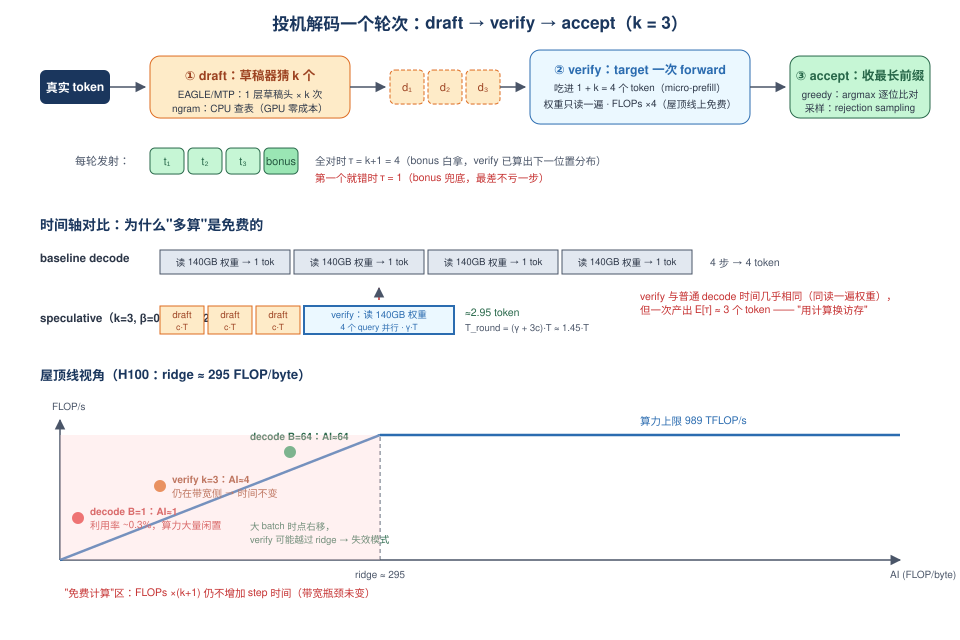
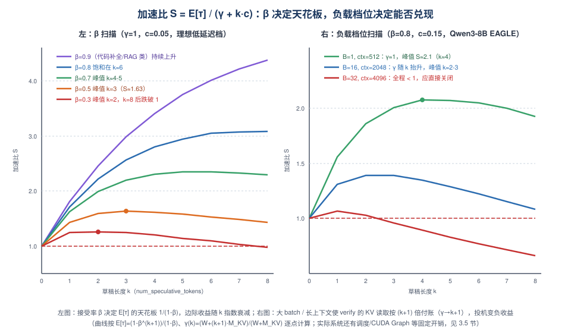
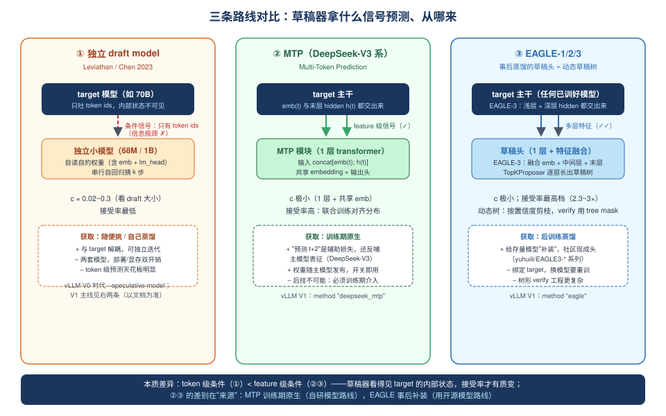

# Day 25：Speculative Decoding 原理 —— 把闲置算力"批发"成免费 token

> **第 4 周 · Day 25** ｜ 预计投入：3~3.5 小时
> **衔接回顾**：Day 1（decode 访存密集的第一性原理）、Day 2（decode 时延下界 = 参数字节 ÷ HBM 带宽）、Day 3（Roofline 与 ridge point）、Day 5（TTFT vs TPOT——今天的一切收益都发生在 TPOT 上）、Day 11（token budget）、Day 15（block 分配/释放路径）、Day 18（CUDA Graph capture 尺寸）、Day 22-24（量化三连：靠"减少每 token 要读的字节"攻击同一个瓶颈）——今天换一条攻击路径：**字节照读，但一次读取多产出几个 token**。
> **本周前瞻**：Day 26（投机解码实验：EAGLE/MTP + 高低接受率负载 + `num_speculative_tokens` 调参 + 负收益复现）、Day 28（复盘日：专题 A4《投机解码》四段式总结）。
> **产出目标**：① 手推加速比公式并完成 β × k 扫描表；② 三路线对比表（独立 draft model / MTP / EAGLE-3）；③ 一个 CPU 上可跑的 ngram 接受率模拟器（为 Day 26 的负载实验打底）。

---

## 一、今日学习目标

- [ ] 用 Day 2/3 的数字复算出：**decode 的 arithmetic intensity ≈ batch size**，比 ridge point 低 1~2 个数量级——从而说清"投机解码 = 用闲置算力换访存效率"这句话的屋顶线含义
- [ ] 画出**一个投机轮次的完整流水**（draft → verify → accept/reject + bonus token），并解释为什么 verify 一步能"顺便"验证 k+1 个 token 而时间几乎不变
- [ ] 讲清**无损性**：greedy 下的最长前缀匹配、随机采样下的 rejection sampling，为什么两者都保证输出分布与 target 模型（理论上）完全一致
- [ ] 手推**期望发射长度** $E[\tau] = \frac{1-\beta^{k+1}}{1-\beta}$ 与**加速比** $S \approx \frac{E[\tau]}{\gamma + k\cdot c}$，其中草稿成本比 $c$、verify 膨胀因子 $\gamma$ 各自的物理来源
- [ ] 用数字表回答：给定 β 和 c，**最优草稿长度 k 是多少**；β 低到什么程度投机就变成负收益
- [ ] 对比三条路线——**独立 draft model / MTP / EAGLE-3**——在条件信号、草稿成本、接受率、获取方式、vLLM 支持形态上的差异
- [ ] 沿 vLLM V1 源码讲出一条投机 step 的**调度与执行链路**：`SpeculativeConfig` → scheduler 的 lookahead token → draft → verify → 被拒草稿的 KV 回收，以及 `SpecDecodingMetrics` 暴露的指标
- [ ] 列出至少 4 种**失效模式**（大 batch、长上下文、低接受率负载、CUDA Graph/显存压力），并给出对应的检测指标与调参动作

---

## 二、核心概念：decode 屋顶线下的"免费算力"

### 2.1 复算 Day 2/3 的数字：AI ≈ B，离 ridge 差两个数量级

先把 Day 3 的 Roofline 结论落到具体数字上（以 Llama-3-70B BF16、H100 SXM 为例）：

- 权重字节：$W = 2 \times 70\text{B} = 140$ GB，每个 decode step 全部读一遍；
- 每 token 计算量：$\approx 2P = 140$ GFLOP（$P$ 为参数量，2MAC≈2FLOP，忽略 attn 项）；
- batch=1 时一个 step：读 140 GB、算 140 GFLOP →

$$
AI_{decode}(B{=}1) = \frac{140\ \text{GFLOP}}{140\ \text{GB}} \approx 1\ \text{FLOP/byte}
$$

- H100 的 ridge point（Day 3）：$\frac{989\ \text{TFLOP/s}}{3.35\ \text{TB/s}} \approx 295\ \text{FLOP/byte}$。

**结论：batch=1 的 decode，算力强度只有 ridge 的 1/295——峰值算力利用率约 0.3%。** 即使 batch=64，$AI \approx 64$（再叠上 KV 读取），仍不到 ridge 的 1/4。这就是 Day 1"decode 访存密集"在屋顶线上的精确画像：**SM 大部分时间在等权重从 HBM 流过，乘法器大面积空转**。

> **关键洞察（今天的全部基础）**：在带宽瓶颈下，"多算"是免费的。verify 一步把 FLOPs 放大 $(k+1)$ 倍，只要放大后仍在 ridge 左侧（带宽侧），step 时间由"读多少字节"决定——**权重只读一遍，时间几乎不变，但产出了 k+1 个候选 token**。

### 2.2 投机解码的交易结构：一次权重读取，批发 k+1 个 token

Day 22-24 的量化思路是把分母（要读的字节）做小；投机解码的思路是**把分子（每次读取产出的 token 数）做大**：

$$
\text{decode 每 token 有效成本} = \frac{\text{每 step 读取的字节}}{\text{每 step 发射的 token 数}} \xrightarrow{\text{spec}} \frac{W}{E[\tau]} \ \text{而非}\ \frac{W}{1}
$$

- **draft（猜）**：一个远比 target 便宜的"草稿器"先自回归地猜出 $k$ 个 token；
- **verify（验）**：target 模型做**一次** forward，并行吃进这 $k+1$ 个 token（1 个真实 token + $k$ 个草稿），一次性算出每个位置的条件分布；
- **accept（收）**：从左到右比对，收下最长匹配前缀，再白拿 1 个 **bonus token**（verify 已经算出了下一个位置的分布，直接采样/取 argmax，不用再跑一步）。

每轮发射 $\tau \in [1, k+1]$ 个 token：全对则 $\tau = k+1$（k 个草稿 + 1 个 bonus）；第一个就错则 $\tau = 1$（bonus 兜底，**最差也不亏一步**——这正是"投机"二字的含义：赌错了有保底）。



### 2.3 无损性：为什么"猜错"不改变输出分布

面试必考：**投机解码不是采样技巧，它不改变模型的输出分布**。

- **greedy 解码**：verify 时 target 对每个位置取 argmax，与草稿逐位比较，收下最长公共前缀 + 1。由于 target 的 argmax 序列是确定性的，最终序列与"target 一步步自回归"完全相同——无损是显然的。
- **随机采样**：用 **rejection sampling**（Leviathan et al. 2023 / Chen et al. 2023）：设草稿 token 为 $d$（来自草稿分布 $q$），target 分布为 $p$。以概率 $\min(1, p(d)/q(d))$ 接受 $d$；若拒绝，从残差分布 $\mathrm{norm}(\max(0, p - q))$ 中重新采样替代 token。可以证明（对 $q$ 的支撑集条件），这样得到的每个 token 恰好服从 $p$——**逐 token 边缘分布不变**。

$$
P(\text{输出} = d) = q(d)\cdot\min\!\Big(1, \frac{p(d)}{q(d)}\Big) + \mathbb{1}[d \in \text{残差采样}] \cdot \frac{\max(0,\,p(d)-q(d))}{Z} = p(d)
$$

- 接受率因此天然与"两个分布有多像"挂钩：$\beta = E_q[\min(1, p/q)]$。草稿越接近 target，接受率越高——这是 3.2 节一切接受率分析的数学根。
- 实践注记：① vLLM 的 verify 在 greedy 与 sampling 下分别走最长前缀匹配与（实现等价目标的）拒绝采样式逻辑，具体函数位置随版本演进，见第 4 节；② 工程 bug、temperature=0 边界、grammar 约束等可能引入偏差，生产上仍要做输出 diff 抽检（Day 24 的"闸 3"方法论直接复用）。

> **一句话记忆**：草稿只决定"赌什么"，**target 的 verify 才决定"发什么**"——所以输出永远是 target 的分布。草稿唯一的影响是速度。

---

## 三、原理深入：接受率、加速比与三条路线

### 3.1 一个投机轮次的流水（伪代码 + 时间轴）

把 2.2 的三步写成伪代码（简化版，省去 tree/batch 细节，完整工程版见第 4 节）：

```python
# 每个投机轮次（一个 engine step）
def speculative_step(reqs, k):
    # ① draft：草稿器自回归猜 k 个 token（EAGLE: 逐层扩展草稿树；ngram: CPU 上查表，零 GPU 成本）
    drafts = speculator.draft(reqs, k)                # 形如 [t1, t2, ..., tk]

    # ② verify：target 一次 forward 吃进 1+k 个 token
    #    ——权重仍然只读一遍（带宽不变），FLOPs ×(k+1)（屋顶线上仍免费）
    logits = target_model(input_ids=[next_real_token] + drafts)  # 逐位置条件分布

    # ③ accept：greedy = 最长 argmax 前缀匹配；sampling = rejection sampling
    n_acc = verify_and_count(logits, drafts)          # n_acc ∈ [0, k]
    emitted = drafts[:n_acc] + [sample(logits[n_acc])]  # +1 bonus：位置 n_acc 的分布已经算出来了
    free_kv_blocks_beyond(n_acc + 1)                  # 被拒部分的 KV 立刻回收（Day 15 的 free 路径）
    return emitted                                     # τ = n_acc + 1 ∈ [1, k+1]
```

时间轴对比（SVG 上半部分）：

- **baseline decode**：每 step 读一遍 140 GB 权重，发射 1 token；
- **speculative decode**：每轮 = $k$ 次草稿 forward（便宜）+ 1 次 verify（≈ 1 次 decode step），发射 $E[\tau]$ 个 token。

> **桥梁**：verify 在数学结构上就是一个 k+1 token 的 **micro-prefill**——Day 11 学的 chunked prefill 机制在这里被反向复用：decode 流里每步混入一个极小的"计算块"，把闲置算力吃掉。vLLM V1 的 scheduler 也是这么记账的（第 4 节）。

### 3.2 接受率的数学：期望发射长度

**简化模型**：假设每个位置独立、同分布地以概率 $\beta$ 被接受（$\beta$ = 平均接受率）。一轮发射 $\tau$ 个 token（含 bonus）的分布：

$$
P(\tau = n) = \beta^{n-1}(1-\beta),\quad n \le k; \qquad P(\tau = k+1) = \beta^{k}
$$

（前 $n-1$ 个草稿全对、第 $n$ 个错 → 收 $n-1$ 个 + bonus；或全对 → 收 $k+1$ 个。）期望发射长度：

$$
\boxed{\ E[\tau] = \sum_{n=1}^{k+1} n\,P(\tau{=}n) = \frac{1-\beta^{k+1}}{1-\beta}\ } \qquad (\beta < 1)
$$

几个锚点数字：

| $\beta$ | $k{=}1$ | $k{=}2$ | $k{=}3$ | $k{=}5$ | $k{=}7$ | $E[\tau]$ 上界（$k\to\infty$） |
|---|---|---|---|---|---|---|
| 0.9 | 1.90 | 2.71 | 3.44 | 4.69 | 5.70 | $1/(1-\beta)=10$ |
| 0.8 | 1.80 | 2.44 | 2.95 | 3.69 | 4.16 | 5 |
| 0.7 | 1.70 | 2.19 | 2.53 | 2.94 | 3.12 | 3.33 |
| 0.5 | 1.50 | 1.75 | 1.88 | 1.97 | 1.99 | 2 |
| 0.3 | 1.30 | 1.39 | 1.43 | 1.43 | 1.43 | 1.43 |

**两个直接推论**：

1. **收益对 β 极其敏感（凸性）**：β 从 0.5 → 0.8，$k{=}3$ 时 $E[\tau]$ 从 1.88 → 2.95。接受率是投机解码的第一性问题——这解释了为什么 EAGLE 系列论文都在卷接受率。
2. **边际收益递减**：$\beta^{k}$ 随 k 指数衰减，$E[\tau]$ 快速饱和于 $1/(1-\beta)$。β=0.5 时 k>3 几乎白猜——**草稿长度不是越长越好**。

**现实修正（两条）**：

- **位置衰减**：真实负载中接受概率随深度递减 $\beta_1 > \beta_2 > \cdots > \beta_k$（越往后条件越偏离草稿器的"舒适区"；ngram 路线尤其极端——第 1 位置高、之后断崖）。此时 $E[\tau] = 1 + \sum_{i=1}^{k}\prod_{j\le i}\beta_j$，比独立同分布模型更早饱和。
- **接受率的决定因素**（面试标准答案的四要素）：
  1. **负载结构**：代码补全 / 摘要 / RAG 引用 / 多轮模板对话（大量复制上下文）→ 高 β；开放创作、数学推理 → 低 β；
  2. **草稿-目标对齐**：同一 tokenizer（硬性要求或需词表对齐）、草稿与 target 的分布距离（rejection sampling 的 $\min(1,p/q)$ 直接暴露距离）；
  3. **草稿架构**：能看见 target hidden states 的（MTP/EAGLE，feature 级）显著优于只看 token ids 的（独立 draft model，token 级信息瓶颈）；
  4. **解码配置**：temperature 越低分布越尖，greedy 匹配越容易（采样路径的期望接受率理论上与温度无关，但工程上尖分布 + 数值精度差异会带来偏差）。

### 3.3 加速比公式：$S \approx f(\beta,\ c,\ \gamma)$

一轮的墙钟时间由三部分组成：

$$
T_{\text{round}} = \underbrace{k \cdot c \cdot T_{\text{target}}}_{k\ \text{次草稿 forward}} + \underbrace{\gamma \cdot T_{\text{target}}}_{1\ \text{次 verify}}
\qquad\Rightarrow\qquad
\boxed{\ S = \frac{E[\tau]}{\gamma + k\,c}\ }
$$

两个系数的物理来源（都从 Day 1/2 的访存模型推）：

**（a）草稿成本比 $c = T_{\text{draft}} / T_{\text{target}}$**。草稿器同样跑 decode（访存受限），所以 $c$ ≈ 草稿每 step 读的字节 ÷ target 每 step 读的字节：

$$
c \approx \frac{E_{\text{emb}} + E_{\text{head}} + W_{\text{draft-layers}}}{W_{\text{target}}}
$$

| 路线 | 草稿每 step 主要读 | 70B target 上的 $c$（量级） | 8B target 上的 $c$（量级） |
|---|---|---|---|
| EAGLE / MTP（1 层草稿头） | embedding + lm_head + 1 层 | ~0.04（2+2+2 GB / 140 GB） | ~0.15（1.2+1.2+0.5 GB / 16 GB） |
| 独立 draft model（如 1B 级） | 自身全部权重 | ~0.02-0.05（若 draft 很小） | ~0.15-0.3 |
| ngram（prompt lookup） | **CPU 查表，GPU 零成本** | ≈ 0 | ≈ 0 |

> **反直觉推论（面试加分点）**：embedding/lm_head 在草稿成本里占比极高（大词表 × 隐藏维度的矩阵往往比"一层 transformer"还大），所以**模型越大，EAGLE/MTP 的相对草稿成本越小，投机解码越划算**；小模型上草稿头可能比主模型 1/10 还贵，收益天然被压。

**（b）verify 膨胀因子 $\gamma$**。verify 与普通 decode 读**同样多的权重**，但 attention 要为 $k+1$ 个 query 各读一遍 KV 前缀：

$$
\gamma = \frac{W + (k+1)\cdot M_{\text{KV}}}{W + M_{\text{KV}}}, \qquad M_{\text{KV}} = B\cdot\bar{ctx}\cdot m_{\text{token}}
$$

（$m_{\text{token}}$ 是 Day 2/23 的每 token KV 字节。）短上下文、小 batch 时 $M_{\text{KV}} \ll W$，$\gamma \approx 1$——**verify 白嫖**；长上下文、大 batch 时 $\gamma \to k+1$——**verify 开始按比例付钱**。

**带数字的完整例子（Qwen3-8B BF16，EAGLE，$k=3$，$\beta=0.8$）**，$E[\tau]=2.95$：

| 负载档位 | $B$ | $\bar{ctx}$ | $M_{KV}$ vs $W{=}16.4$ GB | $\gamma(k{=}3)$ | $c$ | $S = \frac{2.95}{\gamma + 3c}$ |
|---|---|---|---|---|---|---|
| 低延迟档 | 1 | 512 | 0.07 GB | 1.01 | 0.15 | **2.01×** |
| 中等档 | 16 | 2048 | 4.7 GB | 1.67 | 0.15 | **1.39×** |
| 高吞吐/长上下文档 | 32 | 4096 | 19.3 GB | 2.62 | 0.15 | **0.96×（负收益！）** |

> 同一个模型、同一个接受率，**负载档位从"低延迟"滑到"高吞吐"，加速比从 2× 滑到 1 以下**——这就是投机解码与生俱来的"延迟友好、吞吐不友好"（3.5 节失效模式的定量来源，也是 vLLM 提供 `speculative_disable_by_batch_size` 的原因）。

**最优 k 的求法**：给定 $(\beta, c, \gamma(k))$，$S(k)$ 是先升后平/降的曲线——$E[\tau]$ 边际递减、$kc$ 线性增长、$\gamma$ 随 k 单调升。实践上直接数值扫描（实验 A）。经验区间：EAGLE-3 类高接受率路线 $k \in [2, 5]$；ngram 高重复负载 $k \in [3, 8]$；开放对话 β<0.5 时 $k \le 2$ 甚至关闭。



### 3.4 三条路线：独立 draft model / MTP / EAGLE-3

投机解码的三个流派，差异全部落在两个问题上：**草稿器拿什么信号预测**（token 级 vs feature 级），以及**草稿器从哪来**（训练期原生 vs 事后蒸馏）。



| 维度 | ① 独立 draft model | ② MTP（DeepSeek-V3 系） | ③ EAGLE-1/2/3 |
|---|---|---|---|
| 代表工作 | Leviathan et al. 2023 / Chen et al. 2023 | DeepSeek-V3 技术报告 | EAGLE（ICML'24）/ EAGLE-2 / EAGLE-3 |
| 草稿器是什么 | 一个独立小模型（如 68M/1B） | 与主模型**联合训练**的 MTP 模块（共享 embedding + 1 层 transformer + 输出头） | **事后训练**的草稿头（1 层 transformer + 特征融合），从 target 蒸馏 |
| 条件信号 | 只有已生成的 **token ids**（信息瓶颈：看不见 target 内部状态） | $[\text{emb}(t);\ h_t^{L}]$（target 最后一层 hidden state，feature 级） | EAGLE-1: 末层 hidden；EAGLE-3: **三层特征**（embedding + 浅层 + 深层 hidden）融合 |
| 草稿成本 $c$ | 小模型全权重读取（含自己的 emb/head），量级 0.02~0.3 | 极小（1 层 + 共享 emb），量级 0.04~0.15 | 极小（1 层 + 共享 emb + 融合层），量级 0.04~0.15 |
| 接受率 | 最低（token 级预测天花板明显） | 高（feature 级 + 联合训练，分布天然对齐） | 最高档（EAGLE-3 论文报告 2.29~2.96× 加速） |
| 草稿拓扑 | 串行链（每步猜 1 个，k 步） | 串行链 / 级联 | **动态草稿树**：EAGLE-2 起按置信度逐层扩展 top-k，verify 用 tree mask 一次验整棵树 |
| 获取方式 | 随便挑/自己蒸馏一个 | 必须训练期介入（**后挂不可能**），权重随主模型发布 | 后训练即可（对 target 做 feature 蒸馏），社区有大量现成 EAGLE-3 头（如 `yuhuili/EAGLE3-*`） |
| 部署形态 | 两个完整模型，显存/工程双开销 | 一套权重，开关即用 | 主模型 + 一个小头 |
| vLLM V1 支持 | 经典路线（V0 时代 `--speculative-model`）；V1 的主线支持以右侧两条为准（版本演进快，以当前文档为准） | DeepSeek 系：`method: "deepseek_mtp"`（走 feature 级流水线） | `method: "eagle"`，配社区 EAGLE-3 权重；另有 ngram/medusa 等方法 |

> **为什么 feature 级吊打 token 级（面试核心）**：草稿器要做的是"预测 target 的下一个 token"。token ids 是 target 计算结果的**有损压缩**（采样后的离散化），而 hidden state 是产生这个结果前的**完整连续状态**——前者让草稿器重复"从离散符号重建语义分布"的难题，后者直接把答案的一半递到它手里。MTP/EAGLE 接受率显著高于独立 draft model，根源在此。代价是**耦合**：草稿头绑定 target（换 target 要重训），不像独立 draft model 可以自由迭代。

> **MTP vs EAGLE 的本质区别**：不是结构（都是"1 层 + feature 条件"），而是**来源**——MTP 是训练主模型时就把"预测 t+2"作为辅助损失联合优化（DeepSeek-V3 报告还指出 MTP 能反过来改善主模型表征），推理时零额外获取成本；EAGLE 是给一个已训好的 target **补装**草稿头，获取灵活但需要一次蒸馏训练。生产选型时：自研模型走 MTP，用开源模型走 EAGLE-3 / ngram。

**ngram（第四条"零成本"路线）**：不算模型，纯 CPU 上的 prompt lookup——拿最近 $n$ 个生成 token 在 prompt + 已生成序列里找子串匹配，把匹配后继直接当草稿。$c = 0$（不占 GPU），接受率完全取决于负载的**自重复度**：代码补全/摘要/RAG 引用场景极高，开放对话断崖式下跌。vLLM V1 中的 `method: "ngram"`（参数 `prompt_lookup_min/max`）——它是理解"接受率由负载决定"的最佳教学案例，也是今天实验 B 的主角。

### 3.5 失效模式：什么时候越投越亏

把 3.3 的公式反过来读，就是失效模式清单（每条都给出**检测指标 → 调参动作**，这正是一周后 Day 26 实验要逐一复现的）：

| # | 失效模式 | 机制 | 检测 | 动作 |
|---|---|---|---|---|
| 1 | **负载接受率低** | $\beta$ 低 → $E[\tau] \to 1$，$kc$ 变纯开销 | `vllm:spec_decode_acceptance_rate` 持续 < 0.4 | 关闭投机，或换 ngram/EAGLE-3 等更贴负载的路线 |
| 2 | **大 batch 吞吐档** | $B\cdot\bar{ctx}$ 大 → $M_{KV}$ 超过 $W$，$\gamma \to k+1$，verify 不再免费（点越过 ridge） | TPOT 随并发上升不降反升；吞吐对比 baseline 下降 | 调小 k；设 `speculative_disable_by_batch_size`（batch 超限自动关闭） |
| 3 | **长上下文** | 同上，KV 项随 ctx 线性放大 | 长 prompt 负载下 TPOT 差距缩小 | 调小 k；与 P/D 分离（W5）联合考虑 |
| 4 | **草稿器太贵** | $c$ 大（小 target 上 emb/head 占比高） | nsys 看 draft forward 耗时占比 | 换 feature 级头（EAGLE/MTP）或 ngram |
| 5 | **显存与 CUDA Graph 压力** | 草稿头权重 + lookahead KV 占显存；capture 尺寸组合 ×(1+k)（Day 18 的 bucket 策略复杂化），显存吃紧时 preemption 变多 | `# GPU blocks` 下降、preemption 计数非零 | 减小 `max_num_seqs`/k；KV 量化（Day 23）回血 |
| 6 | **TTFT 不降反微增** | prefill 不投机（compute-bound 无闲置算力），但草稿头加载/图捕获拉长启动，首个请求略慢 | TTFT p50 对比 | 预期管理：投机只承诺 TPOT/ITL（Day 5 指标体系） |

> **面试一句话**：投机解码是**延迟优化**而非吞吐优化——它把"每 token 的有效带宽成本"除以 $E[\tau]$，只在带宽瓶颈（低 batch/短 ctx）下这笔除法才真的省时间；一旦系统滑向 compute-bound（大 batch）或 KV-bound（长 ctx），除法变加法，越投越亏。

---

## 四、vLLM V1 源码走读：一条投机 step 的完整链路

> 本节基于 vLLM 2025 年的 V1 代码结构（`vllm/v1/speculative_decode/` 模块）。模块与函数名随版本演进较快，**走读时以你装的版本为准**——但链路的拓扑（config → scheduler lookahead → worker 内 draft/verify → 指标）是稳定的。

### 4.1 入口：`SpeculativeConfig`

```bash
# EAGLE-3（Day 26 实验主路线）
vllm serve Qwen/Qwen2.5-32B-Instruct \
  --speculative-config '{"method": "eagle",
                         "model": "yuhuili/EAGLE3-Qwen2.5-32B-Instruct",
                         "num_speculative_tokens": 3}'

# ngram（今天实验 C / 教学用）
vllm serve Qwen/Qwen3-8B \
  --speculative-config '{"method": "ngram",
                         "prompt_lookup_min": 4, "prompt_lookup_max": 10,
                         "num_speculative_tokens": 3}'
```

- 配置类：`vllm/config/speculative.py` 的 **`SpeculativeConfig`**（v0.8 前后从 `vllm/config.py` 拆出），核心字段：`method`（`ngram` / `eagle` / `medusa` / `deepseek_mtp` / …）、`model`（草稿头权重）、`num_speculative_tokens`（= 我们的 $k$）、`speculative_disable_by_batch_size`（失效模式 #2 的自动熔断）。
- `EngineArgs`（`vllm/engine/arg_utils.py`）解析 `--speculative-config` JSON 并交给 `SpeculativeConfig` 校验（词表一致性等硬约束在这里报错）。

### 4.2 调度侧：lookahead token 的记账

打开投机后，V1 scheduler（`vllm/v1/core/sched/scheduler.py`）的记账发生两处变化（对照 Day 10/11/15）：

1. **token budget**：running 队列里每个 decode 请求每步占 $1 + k$ 个 token（而不是 1）——verify 这个 "micro-prefill" 要在 `max_num_batched_tokens` 里付账（Day 11 的预算机制原样适用：投机开启后，同样预算下能容纳的 decode 请求数变少，**这本身就是一个吞吐代价**）；
2. **KV block 分配**：`kv_cache_manager` 为每请求多分配 $k$ 个 lookahead token 的 block（Day 15 的 allocate 路径）；verify 结束后，**被拒绝位置的 block 在下一轮调度中被释放**（free 路径）——这就是"草稿的 KV 只活一个 engine step"的机制。

```python
# scheduler.py 关键逻辑（简化示意，字段名以实际版本为准）
if self.speculative_config is not None:
    self.num_lookahead_tokens = self.speculative_config.num_speculative_tokens
# schedule() 中，decode 请求的调度 token 数：
num_scheduled_tokens = 1 + self.num_lookahead_tokens      # 进 token budget
num_new_kv = num_scheduled_tokens                          # 进 KV block 分配
# verify 后 update_from_output()：
#   只保留 accepted + bonus 部分的 KV，被拒草稿的 block 计入 free 队列
```

### 4.3 执行侧：`EAGLEWorker` 的 draft → verify

执行层的核心在 `vllm/v1/speculative_decode/`（模块内文件随版本增减，以下是稳定主力）：

```text
vllm/v1/speculative_decode/
├── speculator.py        # Speculator 抽象基类：draft() 接口契约
├── eagle.py             # EAGLEWorker（target + draft 两个 ModelRunner 的编排）
│                        #   + EAGLEDraftModelRunner（草稿 forward、逐层长树）
├── ngram_worker.py      # NgramWorker / NgramProposer：CPU 子串匹配，零 GPU 草稿成本
├── topk_proposer.py     # TopKProposer：按各层 top-k 分数扩展/剪枝动态草稿树
└── metrics.py           # SpecDecodingMetrics：Prometheus 指标（4.4）
```

一个投机 step 的调用链（EAGLE 路线，简化）：

```text
EngineCore.step()
 └─ Scheduler.schedule()                    # 每请求 1+k token budget + lookahead KV
 └─ Executor.execute_model(scheduler_output)
     └─ Worker.execute_model()              # vllm/v1/worker/gpu_worker.py
         └─ EAGLEWorker.execute_model()     # v1/speculative_decode/eagle.py
             ├─ draft 阶段：
             │   EAGLEDraftModelRunner.execute_model()
             │     ├─ 输入：上一轮 verify 得到的 target hidden states（feature 级条件！）
             │     └─ 逐层 forward × k，TopKProposer 按 top-k 分数扩展草稿树
             │        → DraftTokens + tree mask + 每请求草稿 token 列表
             ├─ verify 阶段：
             │   GPUModelRunner.execute_model(改造后的输入)
             │     ├─ input_ids = [真实 token] + [草稿 tokens]（树形展平）
             │     ├─ attention metadata 带 tree mask（树内 token 只见自己的祖先路径）
             │     └─ 一次 forward 得到所有位置的 logits/probs
             └─ 采样与验收：vllm/v1/sample/ 下的验证逻辑
                 ├─ greedy：target argmax 与草稿逐位比对 → 最长前缀
                 ├─ sampling：rejection sampling 式验收（2.3 节的数学）
                 └─ 输出：accepted tokens + bonus token → 回到 EngineCore
```

三个值得盯的细节：

- **feature 级条件的工程体现**：EAGLE 草稿的输入不是 token ids 而是 verify 阶段保存下来的 target hidden states——3.4 节"feature 吊打 token"在代码里就是"draft 的输入张量来自 target 的中间层"这一行事实；
- **tree mask**：草稿是树不是链，verify 时不同分支的 token 互相不可见（只对祖先可见），attention metadata 里用一个 tree mask 表达——这是 EAGLE-2/3 动态树的实现基础；
- **CUDA Graph（Day 18 接续）**：verify 步的输入 token 数是 $B\times(1+k)$ 量级，capture 的尺寸 bucket 要重新规划；这也是投机解码与 CUDA Graph 显存互相挤压（失效模式 #5）的来源。

### 4.4 指标：`SpecDecodingMetrics`

`vllm/v1/speculative_decode/metrics.py` 的 `SpecDecodingMetrics` 在 `/metrics` 上暴露（Day 6/13 的采集方法原样可用）：

| 指标 | 含义 | 怎么用 |
|---|---|---|
| `vllm:spec_decode_acceptance_rate` | accepted / draft 总数 | **第一健康指标**：持续 < 0.4 → 失效模式 #1 |
| `vllm:spec_decode_draft_acceptance_rate` | 按**草稿深度**分位的接受率 | 直接看 $\beta_1 > \beta_2 > \cdots$ 的位置衰减（3.2 节）——决定 k 该砍到几 |
| `vllm:spec_decode_num_accepted_tokens_total` / `num_draft_tokens_total` | 累计量 | 除一下即可交叉验证 acceptance_rate |
| `vllm:spec_decode_force_rejected_total`（如版本提供） | 因 batch 超限等原因被强制拒绝 | 配合 `speculative_disable_by_batch_size` 观察熔断触发 |

### 4.5 与本周/前两周机制的交互总表

| 已学机制 | 与投机解码的关系 |
|---|---|
| Day 2 decode 下界公式 | 投机把 $\frac{W}{\text{BW}}$ 每 token 摊成 $\frac{W}{E[\tau]\cdot\text{BW}}$ ——下界公式直接改写 |
| Day 22-24 量化 | **乘性叠加**：量化降 $W$（和 $M_{KV}$，进一步压 $\gamma$），投机升 $E[\tau]$；注意 FP8 后 $W$ 变小、KV 占比升高，最优 k 会变小 |
| Day 11 chunked prefill | verify = micro-prefill，共用 token budget 记账；投机开启压缩 decode 侧预算 |
| Day 15 KV manager | lookahead 分配 / 被拒回收，走的是同一套 block pool 路径 |
| Day 18 CUDA Graph | capture 尺寸 ×(1+k)，显存压力与 bucket 数都上升 |
| Day 19 async scheduling | draft/verify 都在 GPU 侧 step 内完成，async 流水不被破坏 |
| W5 P/D 分离 | 投机作用于 P 侧无意义（compute-bound），作用于 D 侧；两者可组合但会增加系统复杂度 |

> **给昇腾同学的映射**：今天所有推导只用了"算力/带宽比值"和"每 step 读取字节数"两个平台无关量——把 ridge 换成 910B 的 Cube 吞吐 ÷ HBM 带宽、把 $W$/$M_{KV}$ 换成 NPU 上的实测，β-γ-c 框架原样成立。vllm-ascend 对 EAGLE/ngram 投机解码的支持在持续推进（具体支持矩阵以仓库 README 为准），这也是 W6-7 项目 A 的候选调研方向之一。

---

## 五、动手实验：把"接受率"从公式变成你亲手测出的数

> 今天是原理日，GPU 大戏在 Day 26；但**接受率不用 GPU 就能测**——实验 B 用 40 行 Python 在 CPU 上复现"负载决定 β"，这直接是明天的预习。

### 实验 A（必做，纸笔，约 40 分钟）：完成你自己的 β × k × 负载扫描表

1. **算你自己的 $c$**：取你 Day 6 部署的模型（如 Qwen3-8B），查参数手册得到 vocab、hidden、层数，算：embedding 字节、lm_head 字节、单层权重字节（约 $12 \cdot d^2 \cdot b$，$b{=}2$ BF16）→ 得到 EAGLE 路线的 $c$。对照 3.3 表校核量级。
2. **算你自己的 $\gamma(k)$**：代入你压测时的典型 $B$、$\bar{ctx}$ 和 Day 23 的每 token KV 字节，画 $\gamma(k)$ 曲线，找出 $\gamma(k)+kc$ 与 $E[\tau](k)$ 的交叉点。
3. **填表**：β ∈ {0.9, 0.8, 0.7, 0.5, 0.3} × k ∈ {1..8}，算 $S(k)$，标出每行的最优 k。对照 SVG 曲线图检查。
4. **思考题（Day 26 验证）**：如果同时开 Day 23 的 FP8 KV cache，$\gamma$ 怎么变？最优 k 变大还是变小？（答：$M_{KV}$ 减半 → $\gamma$ 更平 → 最优 k 变大——量化与投机在 k 的选择上也有交互。）

### 实验 B（必做，CPU 即可，约 60 分钟）：ngram 接受率模拟器

原理：ngram 草稿 = "拿最近 $n$ 个 token 在上下文里找子串，取后继当草稿"。我们用**ground truth 文本当扮演 target**（完美模型），模拟整个 draft → verify → accept 循环，统计发射长度分布——这就是该负载对 ngram 投机的 $\beta$ 剖析。

```python
# day25_ngram_sim.py —— CPU 上的 ngram 投机解码接受率模拟器
# 用法: python day25_ngram_sim.py <文本文件> [prompt_len] [k]
import random, re, sys
from collections import defaultdict

TOK = re.compile(r"[A-Za-z0-9_]+|[^\sA-Za-z0-9_]")   # 近似 BPE 的细粒度分词
# 注意：用 text.split() 会把（尤其中文）整句切成一个"词"，重复度被严重低估

def simulate(text, prompt_len=2000, k=4, n_min=4, n_max=10, seed=0):
    random.seed(seed)
    tokens = TOK.findall(text)
    generated, truth = tokens[:prompt_len], tokens[prompt_len:]
    rounds, no_draft = [], 0
    depth_ok, depth_try = defaultdict(int), defaultdict(int)

    i, n_rounds = 0, 0
    while i < len(truth) and n_rounds < 3000:
        # ① draft：最近 n 个 token 在 prompt+generated 里找子串后继
        drafts = []
        for n in range(min(n_max, len(generated) - 1), n_min - 1, -1):
            key = tuple(generated[-n:])
            occ = [j for j in range(len(generated) - n)
                   if tuple(generated[j:j + n]) == key]
            if occ:
                j = random.choice(occ)        # 命中后取其后 k 个 token 当草稿
                drafts = generated[j + n: j + n + k]
                break
        if not drafts:
            no_draft += 1                     # 连草稿都凑不出来的轮次
        # ② verify：与 ground truth 逐位比对（greedy 满配场景）
        n_acc = 0
        for d, t in zip(drafts, truth[i:i + k]):
            depth_try[n_acc + 1] += 1
            if d == t:
                depth_ok[n_acc + 1] += 1
                n_acc += 1
            else:
                break
        # ③ emit：n_acc 个草稿 + 1 bonus，跳到下一轮
        step = n_acc + 1
        rounds.append(step)
        generated.extend(truth[i:i + step])
        i += step
        n_rounds += 1

    tau = sum(rounds) / len(rounds)
    print(f"轮数={len(rounds)}  无草稿轮占比={no_draft/len(rounds):.0%}  "
          f"E[τ]={tau:.2f}  (k={k}, 上限 {k+1})")
    for d in sorted(depth_try):
        print(f"  深度{d}: 接受率 {depth_ok[d]/depth_try[d]:.2f}  (n={depth_try[d]})")
    return tau

if __name__ == "__main__":
    text = open(sys.argv[1], encoding="utf-8").read()
    simulate(text, prompt_len=int(sys.argv[2]) if len(sys.argv) > 2 else 2000,
             k=int(sys.argv[3]) if len(sys.argv) > 3 else 4)
```

**跑三组负载**（正是 Day 26 要在真实服务上复现的对照）：

```bash
# 负载 1：普通源码 / 普通文档（自重复度一般）
python day25_ngram_sim.py scheduler.py 500 4
# 负载 2：开放散文（小说/新闻，自重复度最低）
python day25_ngram_sim.py novel.txt 2000 4
# 负载 3：RAG/摘要型——"生成"大量复述 prompt（用任意文档前半做 prompt，
#          从中复制一段拼在后面当 ground truth，模拟模型引用上下文）
```

**实测样例（词级→近似 BPE 分词、`n_min=4, n_max=10`；你的数字会随文本不同，量级参考）**：

| 负载 | 无草稿轮占比 | E[τ]（k=4） | 结论 |
|---|---|---|---|
| 普通 Python 源码（~2K token） | ~87% | **1.20** | 勉强打平，投机基本白开 |
| 中文 Markdown 文档（~12K token） | ~94% | **1.07** | 纯亏（只剩 bonus 兜底） |
| RAG 复述型（生成内容引用前文） | ~70% | **2.18** | 明显赚 |
| 同一负载 k=4 → k=8 | — | 1.07 → 1.07 | **k 加倍，E[τ] 纹丝不动** |

三个现象逐一对应理论（建议在实验记录里做"现象 → 机制"对照，Day 13 的方法论）：

1. **"自重复度"才是 ngram 接受率的全部真相**——普通文本（哪怕源码）多数轮次连 4-gram 匹配都找不到；真正拉开差距的是"生成内容复述 prompt"的场景（RAG 引用、摘要、代码补全中照抄上下文的 API 名）。这解释了为什么 ngram 投机被当作"负载开关"而非"默认开启"；
2. **深度衰减肉眼可见**：深度 1 接受率明显高于深度 2、3——3.2 节 $\beta_1 > \beta_2 > \cdots$ 的实测版，也是"ngram 的 k 不用大"的直接证据；
3. **k 从 4 加到 8，E[τ] 几乎不动**：边际递减的极端形态——匹配长度本身就不长，加长草稿只是加长"注定被拒的尾巴"。

**算回加速比**：ngram 的 $c=0$，取 $\gamma$ 从实验 A 的低延迟档 → $S \approx E[\tau]/\gamma$。于是你不用一块 GPU，就得到了"代码补全负载开 ngram 能赚多少、开放对话亏多少"的第一手数字。

### 实验 C（可选，约 20 分钟）：线上偷看一眼

如果 Day 6 的服务还开着，重启时加上 ngram 投机配置（4.1 的第二条命令），用代码补全类请求打几轮，然后：

```bash
curl http://localhost:8000/metrics | grep spec_decode
# 重点看 vllm:spec_decode_acceptance_rate 与 draft_acceptance_rate（按深度）
```

把模拟器的 E[τ] 和线上 acceptance_rate 并排记下——明天 Day 26 换 EAGLE 正式做对比实验。

---

## 六、面试高频问题

**Q1：为什么投机解码能加速？一句话说本质。**
decode 是访存受限的：每 step 的成本由"读一遍权重"决定，算力利用率可能只有百分之几。投机解码让一次权重读取同时验证 k+1 个 token，把每 token 的有效访存成本除以 $E[\tau]$——**用免费的算力换稀缺的带宽**。

**Q2：投机解码改变输出分布吗？**
不改变（理论上）。greedy 下是最长 argmax 前缀匹配，输出与逐 token argmax 完全一致；随机采样下 rejection sampling 保证每个 token 的边缘分布恰为 target 分布。草稿只影响速度，不影响"发什么"。

**Q3：写出加速比公式，并说明各因子。**
$S = E[\tau]/(\gamma + kc)$，$E[\tau] = \frac{1-\beta^{k+1}}{1-\beta}$；$\beta$=接受率（负载与草稿质量决定），$c$=草稿成本比（草稿每 step 读的字节/target 读的字节），$\gamma$=verify 膨胀因子（KV 读取按 k+1 倍付账，$\gamma = \frac{W+(k+1)M_{KV}}{W+M_{KV}} \in [1, k+1]$）。

**Q4：什么时候投机解码是负收益？（Day 28 自测原题）**
四类：① 接受率低（β<0.4 量级，$E[\tau]\to1$ 而 $kc$ 变纯开销）；② 大 batch/长上下文（$M_{KV} \gtrsim W$，$\gamma \to k+1$，verify 不再免费且系统滑向 compute-bound）；③ 草稿太贵（小模型上 emb/head 占比高，$c$ 大）；④ 工程开销（lookahead KV 挤占 block pool 引发 preemption、CUDA Graph 尺寸膨胀）。检测：acceptance_rate、TPOT 随并发曲线、preemption 计数。

**Q5：为什么 EAGLE/MTP 比独立 draft model 接受率高？**
条件信号不同：独立 draft 只见 token ids（target 输出的有损离散化），要"从符号重建分布"；EAGLE/MTP 直接以 target 的 hidden states 为条件（feature 级），等于拿到了一半答案。信息瓶颈之差。

**Q6：MTP 和 EAGLE 的本质区别？**
结构相近（都是 1 层草稿头 + feature 条件），区别在来源：MTP 训练期联合训练（辅助损失还反哺主模型），权重随模型发布、不可后挂；EAGLE 是给存量模型事后蒸馏补装，灵活但绑定 target。自研模型选 MTP，用开源模型选 EAGLE-3/ngram。

**Q7：投机解码和量化能叠加吗？**
近似乘性：量化降 $W$ 和 $M_{KV}$（压低 $c$ 的分母里 target 成本不变……准确说：压低 $M_{KV}$ 直接把 $\gamma$ 拉平向 1，长上下文收益最明显），投机升 $E[\tau]$。注意交互：FP8 权重使 $W$ 变小 → KV 占比升高 → 最优 k 变小；两者都开时要用实验重新扫 k（Day 46 消融实验的候选组）。

**Q8：为什么 vLLM 有 `speculative_disable_by_batch_size`？**
batch 超过阈值后 verify 步进入 compute-bound 区（FLOPs ×(k+1) 开始真的付钱），投机从延迟优化变成吞吐毒药——与其人肉调，不如按 batch 自动熔断。

**Q9：投机解码对 TTFT 有帮助吗？**
没有（甚至微负：加载草稿头、更大的 CUDA Graph capture）。prefill 是 compute-bound，没有闲置算力可兑换。投机的承诺只在 TPOT/ITL 上——指标体系要分清（Day 5）。

**Q10：ngram 路线的成本结构有什么特别？**
草稿在 CPU 上查表完成，GPU 草稿成本 $c=0$——它的盈亏平衡点只由 $\beta$ 和 $\gamma$ 决定，因此是"高重复负载白嫖、低重复负载关闭"的开关型选项，也最适合当接受率的教材（今天的实验 B）。

**Q11（进阶）：草稿 token 的 KV cache 怎么管理？**
每步为 lookahead 分配 block，verify 结束后被拒位置的 block 立即回收——草稿的 KV 只活一个 engine step。这与 prefix caching（Day 16）正交：草稿 KV 从不进 hash 表（生命周期太短，不值得）。

---

## 七、今日总结

- **本质**：投机解码 = 在带宽瓶颈下用闲置算力批发 token。decode 的 $AI \approx B \ll$ ridge，FLOPs ×(k+1) 免费，一次权重读取产出 $E[\tau]$ 个 token。
- **数学骨架**：$E[\tau] = \frac{1-\beta^{k+1}}{1-\beta}$（上限 $1/(1-\beta)$，边际递减）；$S = \frac{E[\tau]}{\gamma + kc}$（三个因子各有物理来源）。
- **三因子各记一句**：β 由负载与草稿质量决定（凸性极强）；c 由草稿器读取字节决定（大模型上 EAGLE 反而更便宜）；γ 由 KV/权重比值决定（长上下文大 batch 的毒药）。
- **三路线一句话**：独立 draft（token 级、解耦、天花板低）/ MTP（feature 级、训练原生、自研路线）/ EAGLE-3（feature 级、事后补装、开源路线）；ngram 是零成本变体。
- **无损性**：verify 说了算，草稿只管快——greedy 前缀匹配 / rejection sampling。
- **vLLM V1 链路**：`SpeculativeConfig` → scheduler 记账 $1+k$ token + lookahead KV → `EAGLEWorker` draft（feature 条件 + TopK 动态树）→ verify（tree mask 单次 forward）→ 拒绝部分 KV 回收 → `spec_decode_*` 指标。
- **失效四连**：低 β / 大 batch / 长 ctx / 贵草稿——检测看 acceptance_rate、TPOT-并发曲线、preemption。

> **跨平台方法论（面试叙事）**：今天没有一个公式绑定 NVIDIA——β-γ-c 框架、roofline 免费算力论证、KV 生命周期管理，在昇腾上换上 910B 的算力/带宽参数即可复用；差异只在 kernel 实现（tree mask 的 attention 算子、草稿头的融合）——这正是"从昇腾到 GPU，方法论迁移"的又一案例。

---

## 八、今日自测题

1. 不看公式，推出 $E[\tau] = \frac{1-\beta^{k+1}}{1-\beta}$。（提示：$\tau$ 的分布 + 等比级数求和）
2. β=0.7、c=0.05、γ=1.2、k=3：加速比是多少？k=5 呢？哪个更优？（口算验证 3.3 节方法）
3. 同一个 EAGLE 配置（β=0.8, k=3, c=0.15），为什么在"B=1/ctx=512"是 2× 加速，在"B=32/ctx=4096"变成 0.96×？用 $\gamma$ 的公式解释每一步。
4. 为什么 MTP 不能给 Llama"后挂"一个，而 EAGLE 可以？两者训练数据/损失的差异？
5. 投机解码开了之后，`max_num_batched_tokens` 同样大小的 token budget 下，running 队列能容纳的 decode 请求变多变少？为什么？（联系 Day 10/11）
6. 用户报告"开了投机解码，p50 TPOT 变好了但 p99 TPOT 变差了"，给出你的诊断假设排序。（提示：acceptance_rate 的分布性 + batch 波动触发熔断阈值）

<details><summary><b>参考答案要点</b></summary>

1. $P(\tau{=}n) = \beta^{n-1}(1-\beta)$（$n\le k$），$P(\tau{=}k{+}1)=\beta^k$；$E[\tau] = \sum_{n=1}^{k} n\beta^{n-1}(1-\beta) + (k{+}1)\beta^k$，错位相减化简即得。
2. $E[\tau](k{=}3)=2.53$，$S = 2.53/(1.2+0.15) = 1.87$；$E[\tau](k{=}5)=2.94$，$S = 2.94/(1.2+0.25) = 2.03$——k=5 略优（若 γ 随 k 增长则未必，需完整模型）。
3. $M_{KV}$ 从 0.07 GB → 19.3 GB（×275），$\gamma(3)$ 从 1.01 → 2.62：verify 步的 KV 读取按 4 倍付账，权重却没省，分母涨得比分子快。
4. MTP 的条件（主模型 hidden states）和损失（联合训练的辅助任务）必须在主模型训练时接好；EAGLE 只需要冻结 target 跑一遍拿 feature 蒸馏草稿头，target 不动。
5. 变少：每个 decode 请求每步占 $1+k$ 个 token 的 budget（verify 要付账）。
6. ① acceptance_rate 方差大（部分请求 β≈0 纯亏 k·c）→ 看按请求的分布而非均值；② batch 峰值触发 `speculative_disable_by_batch_size` 熔断，模式切换抖动；③ lookahead KV 在峰值挤爆 block pool 出现 preemption；④ CUDA Graph 未覆盖的尺寸走 eager 慢路径。

</details>

---

## 九、今日产出物

- [ ] **β × k 扫描表 + 最优 k 标注**（实验 A，手算或 20 行脚本）
- [ ] **你自己的 $c$ 与 $\gamma(k)$ 推导**（基于 Day 6 的模型与压测配置）
- [ ] **ngram 接受率模拟器**（`day25_ngram_sim.py`）+ 两组负载（源码 vs 散文）的 E[τ] 与按深度接受率输出
- [ ] **三路线对比表**（3.4 节，Day 28 专题 A4 的核心素材）
- [ ] 明日预告打卡：Day 26 用真实服务复现今天模拟器的结论——EAGLE 高低接受率负载对照 + `num_speculative_tokens` 扫参 + 负收益复现


