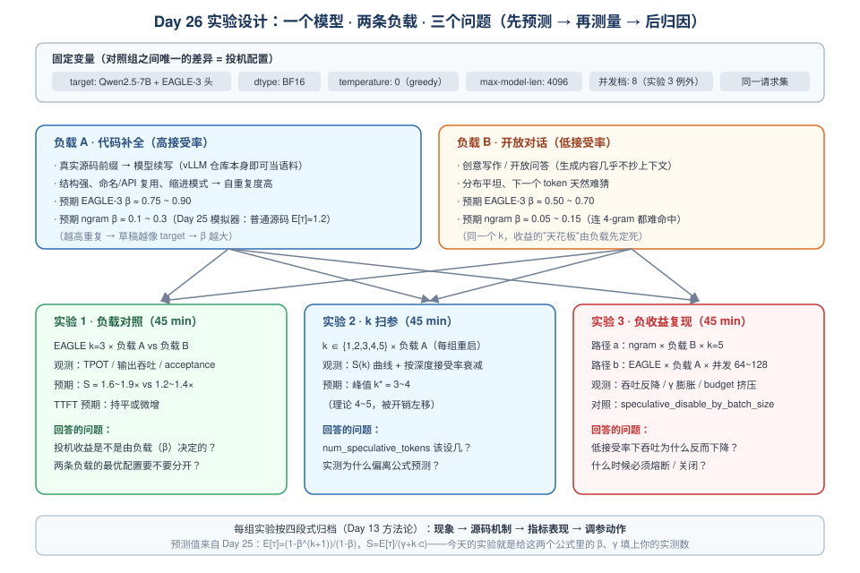
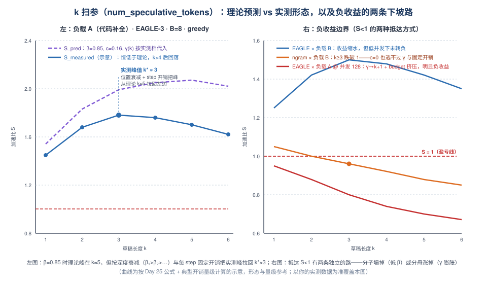
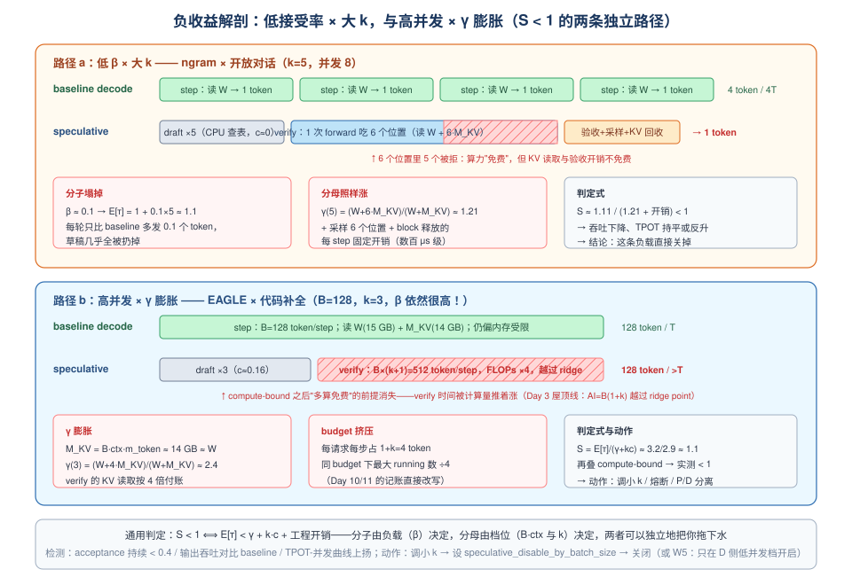

# Day 26：投机解码实验 —— 在真实服务上测出 β、最优 k 与负收益边界

> **第 4 周 · Day 26** ｜ 预计投入：3~4 小时（GPU 实验日，建议留一整块时间）
> **衔接回顾**：Day 25（β-γ-c 加速比框架、$E[\tau]$ 公式、三路线对比、六条失效模式清单——今天逐一把它们变成实测数字）、Day 25 实验 B（ngram 接受率模拟器，今天当"负载体检仪"复用）、Day 6/13/24（`vllm bench serve` 三件套、"现象 → 机制 → 指标"三段式归档、Day 24 的"先写预期再实验"方法论）、Day 10/11（token budget 记账——高并发失效路径要用）、Day 18（CUDA Graph capture 尺寸）、Day 23（每 token KV 字节公式，今天算 $\gamma$ 直接复用）、Day 5（TPOT/吞吐口径，今天所有"加速比"都建立在它之上）。
> **本周前瞻**：Day 27（mini 引擎收尾：chunked prefill + preemption + static/continuous batching 对比）、Day 28（复盘日：专题 A4《投机解码》四段式——今天的三组实验数据就是"权衡"与"失效模式"两段的全部素材）。
> **产出目标**：① 高/低接受率负载的 EAGLE 对照实验（TPOT / 吞吐 / acceptance_rate 三列并排）；② `num_speculative_tokens` 扫参曲线（实测 $S(k)$ vs Day 25 公式预测）；③ 负收益失效模式的亲手复现（低 β × 大 k、高并发 × γ 膨胀两条路径）；④ 一页实验报告（现象 → 机制 → 指标 → 动作）。

---

## 一、今日学习目标

- [ ] 完成**实验前预计算**：把 Day 6/25 部署模型的参数代入 $c$、$\gamma(k)$ 公式，写出每个实验点的**预测加速比**——先押注、后开奖（Day 24 的方法论）
- [ ] 亲手构造**两条负载**：代码补全（高接受率，EAGLE β 预期 0.75+）与开放对话（低接受率，β 预期 0.5~0.7），理解"负载决定收益天花板"不再是理论断言而是你的实测
- [ ] 在 vLLM V1 上**开启 EAGLE 投机解码**并完成对照实验：同负载、同并发下 baseline vs spec 的 TPOT / 输出吞吐 / acceptance_rate 三列并排
- [ ] 完成 **`num_speculative_tokens` 扫参**（k=1→5），找到你这份负载的实测最优 k，并与 Day 25 公式的理论最优 k 对照，解释偏差来源（位置衰减 + 工程开销）
- [ ] **复现负收益失效模式**（两条路径：低接受率 × 大 k；高并发 × γ 膨胀 + budget 挤压），留下"现象 → 机制 → 指标 → 动作"四段式证据链
- [ ] 建立 **acceptance_rate → $E[\tau]$ → $S_{\text{pred}}$ → $S_{\text{measured}}$** 的闭环校验方法，能列出"实测低于理论"的工程开销清单
- [ ] 掌握 `speculative_disable_by_batch_size` 熔断的触发观察方法——为 Day 28 专题 A4 和 Day 46 消融实验（组③接受率-收益曲线）备好方法与数据

---

## 二、核心概念：把 Day 25 的公式变成可测量的实验

### 2.1 方法论：先预测、再测量、后归因

Day 24 量化实验前立的规矩原样搬过来：**动手之前先写下预测值，跑完先对答案再解释差异**。三个理由：

1. 防止"跑完就算"——没有预测的实验只是采数，不是科学；
2. 训练数字敏感度——面试官问"你实测多少"时，能答出"我预测 1.9×、实测 1.7×，差在 step 开销"的人，和只答"大概快了一点"的人，不是一个段位；
3. **差异本身就是发现**——公式没算的东西（工程开销）恰恰是系统工程师的主场。

今天的"预测"全部来自 Day 25 的两个公式：

$$
E[\tau] = \frac{1-\beta^{k+1}}{1-\beta}, \qquad S = \frac{E[\tau]}{\gamma + k\,c}
$$

实验要测的就是三个未知数：**β**（负载说了算）、**γ**（负载档位说了算）、以及公式没算的**工程开销**（实测与理论的差值）。每组实验按 Day 13 的四段式归档：

```text
现象（bench 数字长什么样）
  → 源码机制（vLLM V1 里哪条路径造成的）
    → 指标表现（/metrics 上哪个计数器动了）
      → 调参动作（生产上该怎么改配置）
```

### 2.2 实验矩阵：一个模型、两条负载、三个问题



**固定变量**（对照组之间唯一差异 = 投机配置）：

| 固定项 | 取值 | 为什么固定 |
|---|---|---|
| target 模型 | Qwen2.5-7B-Instruct + `yuhuili/EAGLE3-Qwen2.5-7B-Instruct` | 单卡放得下 target + draft 头；换模型只改 $c$/$\gamma$ 数值，不改方法 |
| dtype | BF16 | 排除 Day 23 量化的交互效应（量化 × 投机的联合消融留给 Day 46 组③④） |
| temperature | 0（greedy） | 验证结果确定、接受率最高、可复现；温度轴放可选实验 |
| max-model-len | 4096 | 控制上下文分布，避免 $\gamma$ 意外膨胀 |
| 并发 | 低档 8（实验 3 例外） | 先隔离"β 的影响"，把"γ 的影响"留给实验 3 单独打 |
| 请求集 | 每条负载固定 64 条、同 seed | 对照实验唯一变量原则 |

**两条负载**的本质差异（Day 25 §3.2 接受率四要素中的第一条）：

- **负载 A（代码补全）**：真实源码前缀续写。代码的强结构（缩进、括号配对、API 名复用、样板模式）让"下一个 token"高度可猜——草稿器与 target 都能押中，β 高；
- **负载 B（开放对话）**：创意写作、开放问答。分布平坦、无上下文可抄，草稿器押不中，β 低。

> 用 Day 25 的 ngram 模拟器先给两条负载"体检"一遍（`python day25_ngram_sim.py <文本> 2000 4`）：代码文件的 E[τ] 显著高于散文——**趋势**会在今天的 EAGLE 实验里复现（数值不会一样：EAGLE 是模型不是字符串匹配）。

### 2.3 三个观测量：口径先说清（Day 5 的规矩）

| 观测量 | 定义 | 数据来源 |
|---|---|---|
| $S_{\text{TPOT}}$ | $\text{TPOT}_{\text{baseline}} / \text{TPOT}_{\text{spec}}$（同负载同并发） | `vllm bench serve` 输出 |
| $S_{\text{thr}}$ | 输出 token 吞吐比值（spec ÷ baseline） | `vllm bench serve` 输出 |
| acceptance | accepted ÷ draft（本次 bench 区间内的差分值） | `/metrics` 的 `spec_decode_*` |
| $E[\tau]$ 估计 | $1 + k \times \text{acceptance}$（iid 近似，位置衰减时会略高估） | 由上式 |
| $S_{\text{pred}}$ | $E[\tau] / (\gamma + kc)$ | Day 25 公式 + 第 3 节你的 $c$/$\gamma$ |

**为什么 $S_{\text{TPOT}}$ 与 $S_{\text{thr}}$ 不总是相等**（实验 3 的核心观测之一）：

1. **token budget 挤压**：投机开启后每个 decode 请求每步占 $1+k$ 个 token（Day 25 §4.2）——同样的 `max_num_batched_tokens` 下能同时 running 的请求数变少。低并发时无感（预算远未用满），高并发时直接压吞吐；
2. **TTFT 不受益**：prefill 不投机（compute-bound 没有闲置算力可兑换），但请求总时延 = TTFT + (输出-1)×TPOT，bench 的 request throughput 会把 TTFT 摊进去。

所以正确姿势：**TPOT 看"投机赚没赚"，吞吐看"系统整体亏没亏"**——两个都要记。

### 2.4 指标采集：counter 要差分

`/metrics` 里的 spec 指标是**进程生命周期内的累计值**，bench 前后各拍一次快照取差，才是"本次实验"的数：

```bash
curl -s http://localhost:8000/metrics | grep spec_decode > snap_before.txt
# ……跑 bench……
curl -s http://localhost:8000/metrics | grep spec_decode > snap_after.txt
# acceptance = (num_accepted_after − num_accepted_before) / (num_draft_after − num_draft_before)
```

指标名沿用 Day 25 §4.4 的表（`vllm:spec_decode_acceptance_rate`、`vllm:spec_decode_draft_acceptance_rate`、`vllm:spec_decode_num_accepted_tokens_total` / `num_draft_tokens_total`）。**注意**：指标名与 gauge/counter 类型随版本有变动，动手前先 `grep spec_decode` 看一眼你版本实际暴露了什么，以实际输出为准——不要照抄本页。

---
## 三、实验前预计算：把你的数字代进 β-γ-c（约 30 分钟，纸笔）

> 换你自己的模型时，本节所有数字重算一遍——这一步就是 Day 24"先写预期"的投机版。

### 3.1 算你自己的 c 和 γ（示例：Qwen2.5-7B-Instruct + EAGLE-3 头）

从 HF config 读结构参数（hidden=3584，layers=28，vocab≈152K，28 个 Q head / 4 个 KV head，head_dim=128）：

**每 token KV 字节**（Day 2/23 的公式，GQA 用 kv_heads）：

$$
m_{\text{token}} = 2 \times 28_{\text{layers}} \times 4_{\text{kv\_heads}} \times 128_{\text{dim}} \times 2_{\text{B}} = 57{,}344\ \text{B} \approx 56\ \text{KiB/token}
$$

**权重读取**：$W \approx 7.6\text{B} \times 2\text{B} \approx 15.2$ GB。

**草稿成本比 $c$**（EAGLE-3 头每个 draft step 要读的字节 ÷ target 每个 step 读的）：

| 草稿头组件 | 字节 | 说明 |
|---|---|---|
| 共享 embedding | ~1.1 GB | 152K × 3584 × 2B |
| 草稿自己的 lm_head | ~1.1 GB | 大词表输出头，草稿成本大头 |
| 1 层 transformer | ~0.3 GB | $12d^2 \times 2\text{B}$ |
| 特征融合层（3 路特征 → d） | ~0.1 GB | EAGLE-3 特有三路融合 |
| **合计** | **~2.6 GB** | $c \approx 2.6/15.2 \approx 0.17$ |

**verify 膨胀因子 $\gamma(k)$**（低并发档：B=8，平均 ctx≈1500 → $M_{KV} = 8 \times 1500 \times 56\text{KiB} \approx 0.66$ GB）：

| $k$ | 1 | 2 | 3 | 4 | 5 | 6 |
|---|---|---|---|---|---|---|
| $\gamma(k) = \frac{W+(k{+}1)M_{KV}}{W+M_{KV}}$ | 1.04 | 1.08 | 1.13 | 1.17 | 1.21 | 1.25 |

高并发档（B=128，ctx≈2000 → $M_{KV} \approx 14.3$ GB $\approx W$）：$\gamma(3) = \frac{15.2+4\times14.3}{15.2+14.3} \approx 2.45$——**同一个公式，档位一换，verify 从"近乎白嫖"变成"2.4 倍付账"**，这就是实验 3b 的理论预告。

### 3.2 预测表（先押注，后开奖）

| 实验 | 负载 | k | 预测 β | $E[\tau]$ | $\gamma$ | $S_{\text{pred}}$ | 实测预期（扣开销后） |
|---|---|---|---|---|---|---|---|
| 1 | A 代码（EAGLE） | 3 | 0.75~0.90 | 2.8~3.4 | 1.13 | 1.8~2.1 | **1.6~1.9×** |
| 1 | B 对话（EAGLE） | 3 | 0.50~0.70 | 1.9~2.5 | 1.13 | 1.2~1.6 | **1.2~1.4×** |
| 2 | A 代码（EAGLE） | 1→5 | 同上 | 饱和曲线 | 1.04→1.21 | 峰在 k≈4~5 | **峰左移到 k*≈3~4** |
| 3a | B 对话（ngram） | 5 | 0.05~0.15 | 1.1~1.3 | 1.21 | ≈1.0 | **≤1（小亏几个百分点）** |
| 3b | A 代码（EAGLE，并发 128） | 3 | 0.8 | ~3.2 | ~2.45 | ~1.1 | **<1（叠加 compute-bound 后明显亏损）** |

> 3a 和 3b 的对比是今天的**核心洞察**：同样是"S < 1"，一条路是**分子塌掉**（β 低 → $E[\tau]\to1$，ngram 的 c=0 让亏损有下限），另一条路是**分母涨掉**（γ 膨胀 + 越过 ridge + budget 挤压，亏损没有下限）。两条路相互独立，都能单独把你拖下水。

### 3.3 公式没算的"工程开销"清单（面试加分点）

$S_{\text{pred}}$ 是**上界**。实测还要扣掉每 step 的固定成本：

1. **verify 的采样与验收**：为 $k+1$ 个位置各做一次采样/argmax 与逐位比对（GPU 采样 kernel + CPU 侧验收、token 重排）；
2. **被拒草稿的 KV 回收**：free 队列操作 + block table 更新（Day 15 的 free 路径，每 step 都走一遍）；
3. **scheduler 的 lookahead 记账**：每请求每步 $1+k$ token 的 budget 与 KV 账（Day 10/11 的记账变贵）；
4. **CUDA Graph bucket 变化**（Day 18）：verify 输入尺寸 ×(1+k)，未覆盖的尺寸走 eager 慢路径；
5. **draft → verify 的衔接空隙**：两次 forward 的 launch 流水没完全重叠。

量级：合计**每 step 几百 μs ~ 1 ms**。低延迟档 $T_{\text{base}}$ 约 5~10 ms 时占比 5~15%——这正是"实测 S 恒低于 S_pred"的主要去向，实验 2 会把它测出来。

---

## 四、vLLM V1 配置与指标链路（实验视角源码走读）

> 本节基于 2025 年的 V1 代码结构。投机模块是 vLLM 演进最快的部分之一，**命令、字段名、指标名都可能随版本变化**——动手前以你安装版本的 `--help`、`vllm/config/speculative.py` 与 `/metrics` 实际输出为准；链路拓扑（config → scheduler 记账 → worker draft/verify → 指标）是稳定的（Day 25 §4 已走读过主干，今天只补实验要用的三块）。

### 4.1 三条路线的启动命令

```bash
# ① 基线（对照组）
vllm serve Qwen/Qwen2.5-7B-Instruct \
  --max-model-len 4096 --gpu-memory-utilization 0.9 --disable-log-requests

# ② EAGLE-3（实验 1/2/3b 主路线：一个 target + 一个蒸馏好的草稿头）
vllm serve Qwen/Qwen2.5-7B-Instruct \
  --max-model-len 4096 --gpu-memory-utilization 0.9 --disable-log-requests \
  --speculative-config '{"method": "eagle",
                         "model": "yuhuili/EAGLE3-Qwen2.5-7B-Instruct",
                         "num_speculative_tokens": 3}'

# ③ ngram（实验 3a：零草稿成本路线，不需要任何额外权重）
vllm serve Qwen/Qwen2.5-7B-Instruct \
  --max-model-len 4096 --disable-log-requests \
  --speculative-config '{"method": "ngram",
                         "prompt_lookup_min": 4, "prompt_lookup_max": 10,
                         "num_speculative_tokens": 5}'

# ④ MTP（可选路线：需要 checkpoint 原生带 MTP 权重，如 DeepSeek-V3.1 系）
vllm serve deepseek-ai/DeepSeek-V3.1 \
  --speculative-config '{"method": "deepseek_mtp", "num_speculative_tokens": 3}'
```

注意事项：

- **草稿头必须与 target 配对**：同 tokenizer + 专为该 target 蒸馏（`yuhuili/EAGLE3-*` 系列按模型一一对应）。词表不一致会在 `SpeculativeConfig` 校验时直接报错——这是硬约束，不是警告；
- **method 命名随版本有差异**：部分版本将 EAGLE-3 单列为 `method: "eagle3"`（由草稿头 config 识别代际）；ngram 的 `prompt_lookup_min/max` 字段名也有版本差异。报 "unknown method" 先查这个；
- MTP 路线（④）要 checkpoint 里带 `num_nextn_predict_layers > 0` 的 MTP 权重（DeepSeek 系原生、Qwen3-Next 等新模型跟进中；社区也有转换版，质量自担）。671B 需要多卡，今天没有条件就跳过，不影响结论——MTP 与 EAGLE 同属 feature 级路线，行为规律一致（Day 25 §3.4）。

### 4.2 `SpeculativeConfig` 字段速查（今天用到的）

| 字段 | 含义 | 今天怎么用 |
|---|---|---|
| `method` | 路线：`eagle` / `ngram` / `medusa` / `deepseek_mtp` / … | 实验 1/2 用 eagle，实验 3a 用 ngram |
| `model` | 草稿头 checkpoint 路径（ngram 不需要） | 与 target 严格配对 |
| `num_speculative_tokens` | 每步草稿长度 = 我们的 $k$ | **实验 2 的扫参对象；启动期配置，改它必须重启服务** |
| `speculative_disable_by_batch_size` | running batch 超过阈值自动关闭投机 | 实验 3b 的对照组（熔断器） |
| （版本相关）草稿树宽度/深度类字段 | 如 draft 树 token 数、top-k 等 | 需要时查 `vllm/config/speculative.py` 注释 |

### 4.3 一个 bench 数字的一生：从 worker 到你的表格

把 Day 25 §4.3 的执行链路接上今天的观测点，数据流是：

```text
EAGLEWorker 采样/验收阶段
  → 统计本轮 accepted / draft token 数
    → SpecDecodingMetrics.update()          # vllm/v1/speculative_decode/metrics.py
      → Prometheus gauge/counter
        → GET /metrics                       # curl 快照，bench 前后差分
          → 你的 acceptance 列

bench client（vllm bench serve）
  → 记录每请求 TTFT / 每 token 时间戳
    → 汇总输出 TPOT/ITL p50/p99、输出吞吐      # 你的 S_TPOT / S_thr 列
```

**校验口径**：`acceptance`（metrics 差分）与 bench 输出的 TPOT 改善幅度应能互相解释（5.5 节闭环）；对不上时优先检查：bench 区间是否跨了熔断、输出长度是否太短、是否有请求还停在 prefill。

### 4.4 熔断器：`speculative_disable_by_batch_size`

机制（对照 Day 25 失效模式 #2）：scheduler 检查 running 请求数，超过阈值后本步退回普通 decode（不发草稿、不付 $1+k$ 的账）。观察方法（实验 3b 对照组）：

1. 高并发 bench 期间 `acceptance` 计数**停止增长**（投机实际没在跑）；
2. TPOT 回落到 baseline 同并发水平；
3. 吞吐恢复接近 baseline——**"自动关掉"本身就是最优动作**，这正是该参数存在的意义。

### 4.5 启动失败排查清单

| 症状 | 原因 | 动作 |
|---|---|---|
| 启动即报词表/尺寸不匹配 | 草稿头与 target 不配对 | 换配套头（同模型系列的 EAGLE-3 头） |
| OOM（加载草稿头或 capture 阶段） | draft 权重 + 更大的 graph 显存（Day 18/25 失效 #5） | 降 k / `max_num_seqs` / `max-model-len`，或降 `gpu-memory-utilization` 后加回 |
| `/metrics` 里 spec 指标全 0 | 请求没进 decode 阶段（输出太短）、method 未生效、版本指标名不同 | 加大输出长度；`grep spec_decode` 看实际暴露的指标名 |
| bench 的 TPOT 列为空/NaN | 输出 token 数 ≤ 1，TPOT 无样本 | 保证生成长度（代码续写天然够长；对话类确认 prompt 引导 ≥ 数十 token） |

---

## 五、动手实验（GPU，约 2~2.5 小时）

### 实验 0（必做，30 min）：负载构造与基线

**生成两条负载**（负载 A 直接拿 vLLM 源码仓库当语料——"用 vLLM 压测 vLLM"）：

```python
# day26_gen_loads.py —— 生成负载 A（代码补全）与负载 B（开放对话）
# 用法: python day26_gen_loads.py <任意源码仓库路径，如 vllm 源码目录>
import json, random, glob, os, sys

random.seed(26)
N = 64

def gen_code(repo):
    files = [f for f in glob.glob(os.path.join(repo, "**", "*.py"), recursive=True)
             if 4000 < os.path.getsize(f)]
    random.shuffle(files)
    out = []
    for f in files:
        if len(out) >= N:
            break
        lines = open(f, encoding="utf-8", errors="ignore").read().splitlines()
        cut = min(len(lines) - 10, 80)          # 前 ~80 行做 prompt，其余交给模型续写
        if cut < 40:
            continue
        out.append({"prompt": "\n".join(lines[:cut])})
    return out

TOPICS = ["深夜机场的滞留", "一场没下完的棋", "老巷口的早餐摊", "雨季的图书馆",
          "山脊上的风电场", "一件旧毛衣的来历", "地铁末班车的乘客", "灯塔看守人的日记"]
def gen_dialogue():
    return [{"prompt": f"请写一篇约600字的短文，主题：{t}。语言生动、多用具象描写，不要分点。"}
            for t in random.choices(TOPICS, k=N)]

repo = sys.argv[1] if len(sys.argv) > 1 else "."
with open("day26_code_prompts.jsonl", "w") as f:
    f.writelines(json.dumps(p, ensure_ascii=False) + "\n" for p in gen_code(repo))
with open("day26_dialogue_prompts.jsonl", "w") as f:
    f.writelines(json.dumps(p, ensure_ascii=False) + "\n" for p in gen_dialogue())
print("done: day26_code_prompts.jsonl / day26_dialogue_prompts.jsonl")
```

> 走 `/v1/completions` 裸续写即可（Instruct 模型胜任代码续写）；若你的 bench 走 chat 接口，把 prompt 塞进 user message——**对照组之间一致就行**。生成后先肉眼抽查 3 条，确认 prompt 是"断在半截的代码/明确的写作指令"。

**启动基线并压测**（`vllm bench serve` 子命令自 v0.8.3 起取代旧的 `benchmark_serving.py`；`--max-concurrency` 为较新版本参数，老版本用 `--request-rate` 控制到达率并保持组间一致）：

```bash
vllm serve Qwen/Qwen2.5-7B-Instruct \
  --max-model-len 4096 --gpu-memory-utilization 0.9 --disable-log-requests \
  > serve_baseline.log 2>&1 &
until curl -s http://localhost:8000/health > /dev/null; do sleep 2; done   # 等就绪

curl -s http://localhost:8000/metrics | grep spec_decode > snap_before.txt
vllm bench serve \
  --model Qwen/Qwen2.5-7B-Instruct --endpoint /v1/completions \
  --dataset-name custom --dataset-path day26_code_prompts.jsonl \
  --num-prompts 64 --max-concurrency 8 \
  --percentile-metrics ttft,tpot,itl --metric-percentiles 50,99
curl -s http://localhost:8000/metrics | grep spec_decode > snap_after.txt
```

记录到基线表（两份负载各跑一遍）：**TPOT p50/p99、ITL p99、输出吞吐（tok/s）、TTFT p50**。同时记下启动日志里的 **GPU KV cache blocks 数**——实验 3b 要对比它被 lookahead 挤掉多少。

### 实验 1（必做，45 min）：EAGLE × 高/低接受率负载对照

重启服务换 EAGLE 配置（4.1 的命令②，k=3），`--num-prompts 64 --max-concurrency 8` 不变，负载 A、负载 B 各跑一遍（每遍都做 metrics 差分），填表：

| 组 | TPOT p50 (ms) | $S_{\text{TPOT}}$ | 输出吞吐 (tok/s) | $S_{\text{thr}}$ | acceptance | $E[\tau]=1{+}3\cdot\text{acc}$ |
|---|---|---|---|---|---|---|
| baseline × A |  | 1.00 |  | 1.00 | — | — |
| EAGLE × A |  |  |  |  |  |  |
| baseline × B |  | 1.00 |  | 1.00 | — | — |
| EAGLE × B |  |  |  |  |  |  |

**预期观察**（对照 3.2 预测表逐条打勾/打叉）：

1. **同模型、同 k、同并发，唯一变量是负载** → acceptance 差出一截（A 显著高于 B）——"负载决定收益天花板"从 Day 25 的断言变成你的实测；
2. TPOT 加速比 A > B，且两个都低于 $S_{\text{pred}}$（开销，3.3 节）；
3. TTFT 基本持平或微增（prefill 不投机；Day 25 失效 #6）；
4. 若你的版本暴露按深度的接受率：确认 $\beta_1 > \beta_2 > \beta_3$ 的位置衰减；
5. 与 Day 25 实验 B 模拟器的**趋势**对齐（数值不必对齐：EAGLE 是模型，不是字符串匹配）。

### 实验 2（必做，45 min）：`num_speculative_tokens` 扫参

负载 A 固定，k ∈ {1, 2, 3, 4, 5}（时间紧可先跑 {1, 3, 5}）。**每组都要重启服务**（k 是启动期配置，没有热更新路径）：

```bash
for k in 1 2 3 4 5; do
  vllm serve Qwen/Qwen2.5-7B-Instruct \
    --max-model-len 4096 --gpu-memory-utilization 0.9 --disable-log-requests \
    --speculative-config "{\"method\": \"eagle\",
        \"model\": \"yuhuili/EAGLE3-Qwen2.5-7B-Instruct\",
        \"num_speculative_tokens\": ${k}}" \
    > serve_k${k}.log 2>&1 &
  until curl -s http://localhost:8000/health > /dev/null; do sleep 2; done
  curl -s http://localhost:8000/metrics | grep spec_decode > k${k}_before.txt
  vllm bench serve --model Qwen/Qwen2.5-7B-Instruct --endpoint /v1/completions \
    --dataset-name custom --dataset-path day26_code_prompts.jsonl \
    --num-prompts 64 --max-concurrency 8 \
    --percentile-metrics ttft,tpot,itl --metric-percentiles 50,99 | tee bench_k${k}.txt
  curl -s http://localhost:8000/metrics | grep spec_decode > k${k}_after.txt
  kill %1; sleep 5
done
```

**画两张图**（数据表模板见 5.5）：

1. **$S_{\text{TPOT}}(k)$ 曲线**：标注实测峰值 $k^*$——与下图左面板对照；
2. **acceptance(k)**：观察 k 变大时 acceptance 是走平还是微降（更深的低概率位置进了分母）。



**预期分析**（把实验变成结论的三步）：

- **峰值位置**：理论峰在 k≈4~5（3.2 节公式），实测峰左移到 k*≈3~4——按深度衰减（$\beta_1>\beta_2>\cdots$，$E[\tau]$ 比 iid 模型更早饱和）+ 固定开销（3.3 节）共同作用；
- **边际递减**：k* 之后 $E[\tau]$ 的增量抵不过 $kc$ 与 $\gamma(k)$ 的线性/超线性增长——"num_speculative_tokens 不是越大越好"的实测版；
- **闭环**：对每个 k 做 5.5 节的 $S_{\text{pred}}$ vs $S_{\text{measured}}$，差值随 k 近似恒定 → 它就是每 step 固定开销；差值随 k 增长 → 说明还有未建模的 k 相关成本（如 graph 未覆盖、回收变贵）。

### 实验 3（必做，45 min）：负收益复现——两条路径



**路径 a：低 β × 大 k（ngram × 负载 B，k=5）**

用 4.1 的命令③启动（k=5），跑负载 B（同并发 8）：

- 预期：acceptance ≈ 0.05~0.15，$E[\tau] \approx 1.1$~1.3；TPOT 与 baseline 打平或**慢 3~10%**，输出吞吐持平或略降；
- **别因为"只亏几个点"而失望——这本身就是结论**：ngram 的 $c=0$，它的下限亏损只来自 $\gamma$ 与固定开销；换成 $c>0$ 的路线在同样低的 β 上，亏损会按 $kc$ 线性放大。把"小亏但有下限"记进你的失效模式卡；
- 加分项：同配置跑一遍负载 A（代码补全）对照——ngram 在 A 上 acceptance 明显更高（Day 25 模拟器预告过），体会"ngram 是负载开关"的含义。

**路径 b：高并发 × γ 膨胀（EAGLE × 负载 A，并发拉满）**

EAGLE k=3 重启，把并发拉到 64~128（`--num-prompts 256 --max-concurrency 128`，或你版本的等价物；对照组 baseline 也要跑同并发）：

- 预期：**输出吞吐低于 baseline（吞吐反降，S_thr < 1）**，TPOT 优势缩水甚至反超。三个机制各自记一笔：
  1. $\gamma(3) \approx 2.4$（用 bench 实际的平均 ctx 和并发代入 3.1 的公式重算）——verify 的 KV 读取按 4 倍付账；
  2. **越过 ridge**：$B \times (1+k) = 512$ token/step 的计算量把 verify 推过 compute-bound 拐点（Day 3 屋顶线），"多算免费"的前提消失；
  3. **budget 挤压**：每请求每步占 4 token → 同 budget 下最大 running 数除以 4（Day 10/11 的记账直接改写）；
- **对照组（熔断）**：加上 `"speculative_disable_by_batch_size": 32` 重启，重跑同并发 bench——预期吞吐恢复接近 baseline、高并发段 acceptance 计数停止增长（4.4 节的三个观察点逐一确认）；
- 顺手对比启动日志的 **KV blocks 数**：投机开启后少于 baseline——lookahead 预留 + graph 显存挤压的直观证据（Day 25 失效 #5）。

### 5.5 闭环分析（15 min）：acceptance → E[τ] → S_pred → S_measured

对今天的每一个 spec 实验点，走一遍这条链：

```text
① acceptance（metrics 差分）
② E[τ] ≈ 1 + k × acceptance                 # iid 近似，偏高估
③ S_pred = E[τ] / (γ + k·c)                 # 用你 3.1 节的 γ、c
④ S_measured = TPOT_base / TPOT_spec        # bench 实测
⑤ 开销 = E[τ]/S_measured − (γ + k·c)        # 公式外成本，折算成 T_base 的倍数
```

**数据总表模板**（一张表装下今天全部实验，直接进 Day 28 的 A4）：

| # | 路线 | 负载 | 并发 | k | acceptance | $E[\tau]$ | $\gamma$ | $S_{\text{pred}}$ | $S_{\text{TPOT}}$ | $S_{\text{thr}}$ | 结论一句话 |
|---|---|---|---|---|---|---|---|---|---|---|---|
| 1 | EAGLE | A | 8 | 3 |  |  |  |  |  |  |  |
| 2 | EAGLE | B | 8 | 3 |  |  |  |  |  |  |  |
| 3-7 | EAGLE | A | 8 | 1..5 |  |  |  |  |  |  | 峰值 k*= |
| 8 | ngram | B | 8 | 5 |  |  |  |  |  |  | 小亏但有下限 |
| 9 | EAGLE | A | 128 | 3 |  |  |  |  |  |  | 吞吐反降 |
| 10 | EAGLE+熔断 | A | 128 | 3 | — | — | — | — |  |  | 恢复 ≈ baseline |

### 5.6 可选加餐（时间富余再做）

- **温度轴**：同负载 temperature 0 vs 1.0 各跑一遍，看 acceptance 的变化（尖分布更易逐位命中）；
- **量化 × 投机交互**（Day 25 思考题的实测版）：开 Day 23 的 FP8 KV cache 后重跑 k 扫参——$M_{KV}$ 减半 → $\gamma$ 更平 → 预期最优 k 变大。这直接是 Day 46 消融实验组③④的预演；
- **nsys 抓一个投机 step**（Day 19 方法）：看 draft / verify / 采样回收三段在 GPU 时间线上的占比，把 3.3 节的开销清单落到 kernel 级；
- **MTP 路线**（有多卡条件时）：`deepseek_mtp` 跑通一条，与 EAGLE 对照 acceptance 与 S——验证"同为 feature 级路线、行为规律一致"。

---
## 六、面试高频问题

**Q1：你实测的投机加速比是多少？为什么低于论文报告的 2.29~2.96×？**

给出自己的数（例如：代码补全负载、k=3、并发 8，实测 TPOT 加速 1.7×）。差距来源四条：① 论文条件通常是大模型 + 特定负载 + 近似独占的低并发，γ≈1；② 我们档位下 $\gamma > 1$（KV 读取按 k+1 倍付账）；③ 按深度衰减让 $E[\tau]$ 低于 iid 公式；④ 每 step 工程开销（采样验收、KV 回收、记账、graph）吃掉 5~15%。**能报出"预测值—实测值—差值去向"三件套的候选人极少**。

**Q2：低接受率下吞吐为什么反而下降？（README 原题）**

分子分母一起看：β 低 → $E[\tau] \to 1$（几乎只发 bonus token），但成本一项不少——verify 要为 $k+1$ 个位置读 KV（$\gamma$）、采样与验收、被拒草稿的 KV block 回收、每请求 $1+k$ 的 budget 挤压（高并发时直接压最大 running 数）。**收益归零、成本照付**，吞吐自然反降。补充洞见：$c=0$ 的 ngram 亏损有下限（几个百分点），$c>0$ 的路线按 $kc$ 线性放大亏损。

**Q3：`num_speculative_tokens` 该设多少？**

由 β（负载）与 γ（档位）共同决定，不能拍脑袋。经验：高 β 低并发档实测峰值 k*≈3~4（理论 4~5 被深度衰减与固定开销左移）；β<0.5 时 k≤2 甚至关闭。负载或并发档位变了要重扫；线上用 acceptance 监控 + 熔断兜底。**最好的答案是"我扫过，我的负载峰值在 k=X"**。

**Q4：acceptance 怎么监控？低于多少要动手？**

`/metrics` 的 `spec_decode_*` 计数器做时间窗差分（累计值直接看会骗人）；有按深度的指标就看位置衰减，决定 k 砍到几。经验阈值：持续 < 0.4 → 关闭或换路线（ngram/EAGLE 对负载的适配度不同）；高并发段配合 `speculative_disable_by_batch_size` 的熔断观察（acceptance 计数停止增长 = 熔断生效）。

**Q5：投机解码为什么与大并发高吞吐冲突？**

三个独立机制：① $\gamma \to k{+}1$（$M_{KV}$ 随 $B \cdot \text{ctx}$ 涨到与 $W$ 同量级，verify 的 KV 读取按倍数付账）；② 越过 ridge 变 compute-bound——$B(1+k)$ 的算力强度跨过拐点后"多算免费"的前提消失；③ budget 挤压：每请求 $1+k$ token 让同预算下的最大并发容量除以 $1+k$。动作序列：调小 k → 熔断 → 关闭（或 W5 P/D 分离后只在 D 侧低并发档开）。

**Q6：你的对照实验怎么保证公平？**

固定请求集/seed/温度/max-model-len/并发档，唯一变量是投机配置；metrics 用 bench 区间差分（排除启动期噪音）；预测先行（Day 24 方法论）；关注方差而非单次数（TPOT p50 与 p99 都记）；bench 期间盯熔断是否被意外触发。

**Q7：线上白天低并发、晚上高并发，投机怎么配？**

不开人肉开关，用 `speculative_disable_by_batch_size` 自动熔断：低并发段吃到 TPOT 收益，高并发段自动退回普通 decode 保吞吐。再进一步：按负载档位分实例/分配置（代码补全流量与对话流量分池），或 P/D 分离后在 D 侧低并发池开投机——监控 acceptance 与 TPOT-并发曲线做验收。

**Q8：为什么实测加速比总是低于公式预测？**

公式 $S = E[\tau]/(\gamma + kc)$ 是**带宽模型下的上界**，漏了每 step 固定成本：k+1 个位置的采样/验收、被拒草稿的 KV block 回收、scheduler 的 lookahead 记账、CUDA Graph bucket 变化、draft→verify 衔接空隙。合计每 step 数百 μs，低延迟档占 5~15%。我的实验 2 用 $S_{\text{pred}} - S_{\text{measured}}$ 差值随 k 的形态把它分离了出来（近似恒定 → 固定开销主导）。

---

## 七、今日总结

- **方法**：先预测（Day 25 的 β-γ-c 公式 + 自己的模型参数）→ 再测量（bench + metrics 差分）→ 后归因（四段式：现象 → 机制 → 指标 → 动作）。没有预测的实验只是采数。
- **结论一（负载决定天花板）**：同模型、同 k、同并发，代码补全与开放对话的 acceptance 差出一截，TPOT 加速比随之分层——"投机收益是负载的函数"从断言变成实测。
- **结论二（k 有峰）**：`num_speculative_tokens` 实测峰值 k*≈3~4；理论峰（4~5）被按深度衰减与每 step 固定开销左移。边际递减是结构性的，不是调优不充分。
- **结论三（负收益两条独立路径）**：分子塌掉（低 β，ngram 有下限亏损）与分母涨掉（高并发的 γ 膨胀 + 越过 ridge + budget 挤压，亏损无下限）——检测靠 acceptance、吞吐对比、TPOT-并发曲线；动作靠调小 k、`speculative_disable_by_batch_size` 熔断、关闭。
- **闭环**：acceptance → $E[\tau]$ → $S_{\text{pred}}$ → $S_{\text{measured}}$ 的差值即工程开销——把"公式是上界"从口号变成可量化的每 step 成本。
- **口径纪律**：TPOT 看"赚没赚"，吞吐看"系统亏没亏"；counter 必须差分；TTFT 不受益是预期行为不是 bug。

> **跨平台叙事（接 Day 25）**：今天全部实验方法论——预测公式、负载分类（高/低自重复）、k 扫参、负收益两条路径、熔断——没有一项绑定 NVIDIA。在昇腾上复刻本日实验，只需把 $W$、$M_{KV}$、ridge 换成 910B 的参数，负载构造与指标采集原样可用；vllm-ascend 的投机解码支持矩阵是 W6 项目 A 的候选调研点。

---

## 八、今日自测题

1. 不看笔记，默写 acceptance → $E[\tau]$ → $S_{\text{pred}}$ 的换算链，并指出 iid 近似在哪一步失真、朝哪个方向偏。
2. 实测 EAGLE（代码负载、k=3）acceptance = 0.78，B=8、平均 ctx≈1500、$c$=0.16、$m_{\text{token}}$=56 KiB、$W$=15.2 GB：算 $S_{\text{pred}}$；若实测 $S_{\text{TPOT}}$=1.75，反推每 step 开销是 $T_{\text{base}}$ 的多少倍。
3. 为什么 ngram 在低 β 负载上"最差也亏得少"？什么条件下它的亏损也会变大？
4. `max_num_batched_tokens`=8192、k=3：投机开启后理论上最多能同时 running 多少个 decode 请求？baseline 呢？这个差值什么时候会变成真实伤害？
5. 同一服务白天并发 4、晚上并发 128，给出你的投机配置与理由（引用你实验 3 的数据）。
6. 实验里 TTFT 为什么不降反微增？说出两个启动期因素。

<details><summary><b>参考答案要点</b></summary>

1. $E[\tau] \approx 1 + k \cdot \text{acceptance}$，$S_{\text{pred}} = E[\tau]/(\gamma + kc)$。失真点：位置衰减（$\beta_1>\beta_2>\cdots$）使真实 $E[\tau]$ **低于** iid 估计（高估收益）；γ 的带宽模型还漏了固定开销（进一步高估）。
2. $M_{KV}=8\times1500\times56\text{KiB}\approx0.66$ GB，$\gamma(3)=(15.2+4\times0.66)/(15.2+0.66)\approx1.13$；$E[\tau]=1+3\times0.78=3.34$；$S_{\text{pred}}=3.34/(1.13+0.48)\approx2.08$。实测 1.75 → 实际分母 $=3.34/1.75\approx1.91$ → 开销 $\approx 1.91-1.61=0.30$ 倍 $T_{\text{base}}$（每 step 约 30% 的固定成本）。
3. $c=0$：它的亏损只来自 $\gamma(k)$ 与每 step 固定开销，与草稿长度弱相关且有下限。当 $M_{KV}$ 有规模（中等并发/长上下文）或 k 很大时，$\gamma$ 与开销照样把它拖到明显亏损。
4. baseline：8192 个 token 位 → 8192 个请求（每 decode 请求每步 1 token）；投机：每请求 4 token → 2048 个。低并发时预算用不满、无感；高并发（到达率把 running 顶到预算上限）时最大吞吐被直接除以 4——实验 3b 的"budget 挤压"。
5. 设 `speculative_disable_by_batch_size`（阈值取你实验 3b 中 TPOT 优势消失的并发附近，如 32）：白天吃到 1.6~1.9× 的 TPOT 收益，晚上自动退回普通 decode 保吞吐；监控 acceptance 与 TPOT-并发曲线验收。
6. ① 草稿头权重的加载与图捕获拉长启动/首个请求；② prefill 本身不投机（compute-bound 无闲置算力）。投机的承诺只在 TPOT/ITL（Day 5 指标体系）。

</details>

---

## 九、今日产出物

- [ ] **两条负载文件**（`day26_code_prompts.jsonl` / `day26_dialogue_prompts.jsonl`）+ 生成脚本 `day26_gen_loads.py`
- [ ] **基线 × 2 负载的 TPOT/吞吐/TTFT 记录**（实验 0）
- [ ] **EAGLE 高/低接受率对照表**（实验 1：acceptance / $E[\tau]$ / $S_{\text{TPOT}}$ / $S_{\text{thr}}$ 四列并排）
- [ ] **k 扫参曲线**（实验 2：$S(k)$ 与 acceptance(k) 两张图，标注实测 $k^*$；用实测数据覆盖 SVG 示意图）
- [ ] **负收益复现记录**（实验 3：路径 a 小亏 + 路径 b 吞吐反降 + 熔断对照，四段式各一条）
- [ ] **闭环数据总表**（5.5 节模板填满——Day 28 专题 A4《投机解码》"权衡/失效模式"两段与 Day 46 消融组③的直接素材）
- [ ] 明日预告打卡：Day 27 mini 引擎收尾——chunked prefill 与 preemption 落地，static vs continuous batching 对比报告（今天的 budget 记账直觉直接迁移过去）
