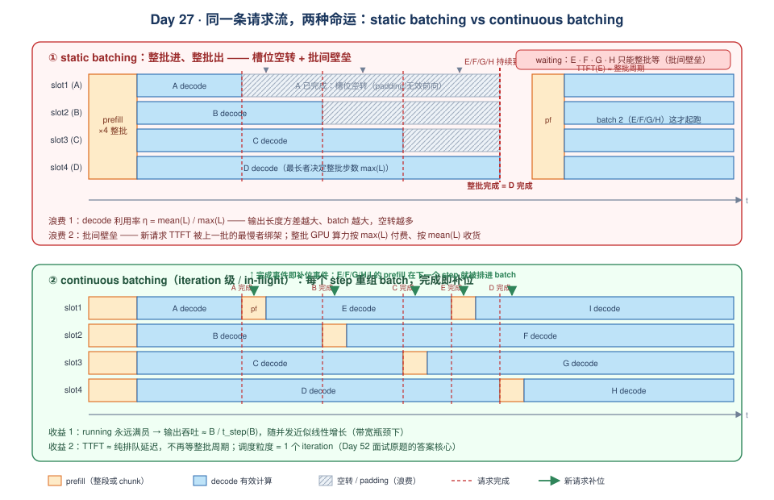
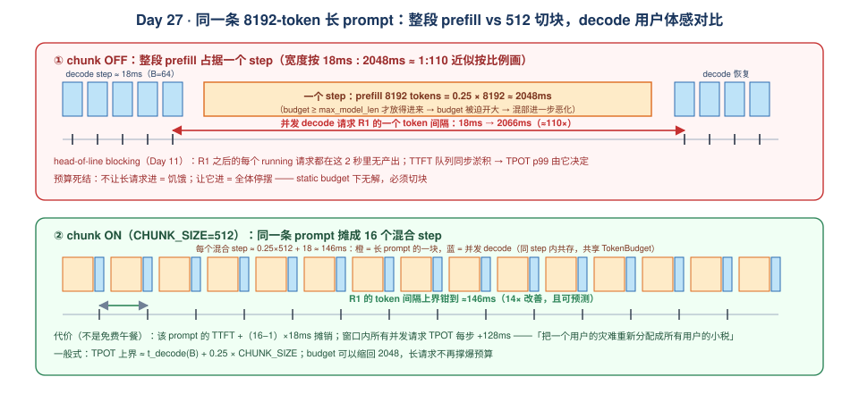
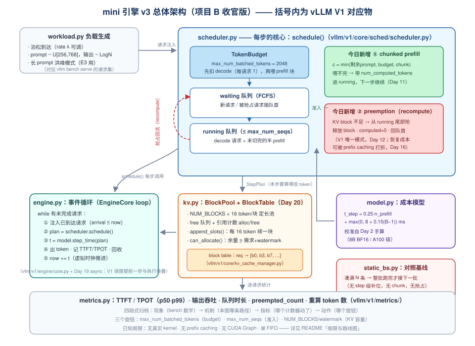
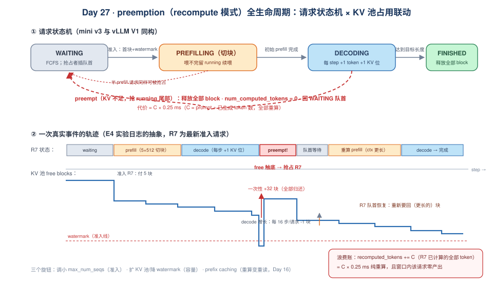

# Day 27：mini 引擎收尾（项目 B）—— chunked prefill、preemption 落地与 static vs continuous batching 终局对比

> **第 4 周 · Day 27** ｜ 预计投入：3~4 小时（项目收官日，代码 + 实验为主，建议留一整块时间）
> **衔接回顾**：Day 20（固定 block 的 KV 池 + block table + 引用计数）、Day 21（iteration 级 continuous batching 调度器：waiting/running + token budget）、Day 10/11/12（vLLM V1 调度器三连——队列与 budget、chunked prefill、preemption：前两周你**读**了这三套机制，今天在几百行纯 Python 里把它们**复刻**出来）、Day 13（调度行为压测的"现象 → 机制 → 指标"三段式，今天 benchmark 的归档格式）、Day 15/16（KVCacheManager 的 allocate/append/free 路径与 prefix caching——recompute 抢占恢复时它直接决定恢复成本）、Day 5（TTFT/TPOT/吞吐口径，今天所有对比数字都建立在它之上）、Day 2（decode 时延下界手算——今天模拟器成本模型的校准来源）、Day 25/26（本周投机的 budget 记账：γ 膨胀与 budget 挤压正是"每请求每步占 1+k 个 token 位"这一记账问题的又一实例）。
> **本周前瞻**：Day 28（复盘日：专题 A4《投机解码》——mini 引擎里亲手写过的 budget 记账与 KV 回收，会让你对"投机收益如何被调度链路传导/吞掉"有肌肉记忆；本周产出物核对里也有项目 B 的 README + benchmark 数据）。
> **产出目标**：① mini 引擎 v3：chunked prefill 与 recompute 模式 preemption 落地并通过行为自测；② benchmark 脚本三件套（负载生成 / static 基线 / continuous 引擎），跑出 **static vs continuous batching** 的吞吐-时延对比、**chunked on/off** 的 TPOT p99 对比、**KV 压力下 preemption** 的代价曲线；③ 项目 B README（架构图 + 机制对照表 + 性能数据表 + 局限与路线图）——**面试作品集素材**，Day 49/53 的 STAR 讲稿直接从这里取材。

---

## 一、今日学习目标

- [ ] 把 Day 21 的调度器升级为 **v3**：长 prompt 按 token budget **切块**进 running 队列（chunked prefill），解码请求每步优先保住 1 个 token 位——并说清"decode 优先"保护的到底是哪个指标
- [ ] 实现 **recompute 模式 preemption**：KV block 不足时从 running 尾部抢占、释放 block、`num_computed_tokens` 清零、回 waiting 队首；能用日志复盘一次完整"抢占 → 重算 → 恢复"事件
- [ ] 手推 **static batching 的浪费公式**：decode 利用率 = mean(L)/max(L)，并解释为什么输出长度方差越大、static 越亏（Jensen 不等式的工程含义）
- [ ] 写出 **continuous batching 的吞吐守恒式**：输出吞吐 ≈ B/t_step(B)，说明它为什么随 batch 近似线性增长、什么时候饱和
- [ ] 用成本模型（校准自 Day 2 手算）完成**实验前预测**（Day 24 方法论最后一次全套演练）：每个实验点先写下预测吞吐/时延，再跑模拟器对答案
- [ ] 跑通 **4 组实验**并按四段式归档：E1 离线吞吐、E2 在线 TTFT/TPOT vs 到达率、E3 chunked on/off 的 TPOT p99、E4 KV 压力下的 preemption 代价
- [ ] 完成项目 B **README**：架构图（SVG）、mini ↔ vLLM V1 机制对照表、性能数据表、已知局限与改进路线——达到"贴到简历附录能讲 10 分钟"的标准

---

## 二、核心概念：项目 B 的最后两块拼图

### 2.1 Day 20/21 攒下了什么，还缺什么

先把项目 B 的资产盘点一遍（你的代码可能字段名不同，机制等价即可）：

| 组件 | Day 20/21 已实现 | 对应 vLLM V1 | 今天要补 |
|---|---|---|---|
| `BlockPool` | 固定 16 token/block 的池、free 队列、引用计数 | `vllm/v1/core/kv_cache_manager.py` + kv_cache_interface | —（只加一个 `num_free` 快捷属性） |
| `Request` | prompt/output token、`num_computed_tokens`、block table | `vllm/v1/request.py` | `preempted_count`、`first_token_time` 等统计字段 |
| `Scheduler` | waiting/running 双队列、token budget、FCFS | `vllm/v1/core/sched/scheduler.py`（早期版本在 `v1/core/scheduler.py`） | **chunked prefill** + **preemption** |
| 引擎循环 | 逐 step 调度 → 假模型出 token → 回收 | `vllm/v1/engine/core.py` 的 EngineCore loop | 接成本模型当"虚拟时钟" |
| 指标 | — | `vllm/v1/metrics/` | TTFT/TPOT/吞吐/抢占计数的采集与分位数 |

也就是说：**Day 21 的引擎只能"整条 prompt 一次吃进"**——`max_num_batched_tokens` 必须 ≥ 最长 prompt，否则长请求永远进不了 running；**KV 满了只会死锁或崩**——没有任何退让机制。这两点恰恰是 vLLM V1 调度器（Day 11/12）最有面试区分度的两个机制。今天补上它们，项目 B 的调度面就与 V1 的核心行为对齐了。

### 2.2 chunked prefill：把"一次吃撑"改成"分口喂"

Day 11 读源码时的结论今天要用代码兑现，先把机制复述成可实现的三条规则：

1. **切块规则**：waiting 队首请求的剩余 prompt `R = num_tokens − num_computed_tokens`，本步最多喂 `c = min(R, budget剩余, chunk_size)` 个 token；喂不完的请求**带着部分计算状态进 running**，下一步继续（它不是 decode，是"半 prefill"）；
2. **decode 优先记账**：本步先给 running 里所有 decode 请求各记 1 个 token 位（共 `n_decode` 个），剩余 budget 再分给 prefill 切块——保护的是 **TPOT**（Day 5：正在生成的用户体验），代价是 TTFT 略增；
3. **KV 跟着走**：切块进来的 token 照常走 Day 20 的 `allocate → append_slots` 路径，block 按 16 token 粒度逐块申请——**chunked prefill 不需要 KV 层任何改动**，这是它实现成本极低的原因。

> **版本备注**：V1 每步混合 prefill/decode、共享 `TokenBudget`，这与上面一致；但"先 decode 还是先 prefill"的内部顺序在不同版本间有过演进（还与 Day 19 的 async scheduling 提前一步调度相关）。以你安装版本的 `schedule()` 里 `schedule_prefills()/schedule_running()` 调用顺序为准——这正是 Day 10/11 你做过的事，别背结论、去看代码。

### 2.3 preemption：recompute 是 V1 的唯一模式

Day 12 的结论：V0 有 recompute / swap 两种抢占，**V1 只保留了 recompute**——被抢占请求释放全部 KV block，回到 waiting 队首，`num_computed_tokens` 清零，等下次调度重新 prefill。机制极简，代价是**已生成的 KV 全部作废**：

$$
\text{抢占浪费} = \underbrace{C \cdot t_{\text{prefill/tok}}}_{\text{重算成本}} \quad \text{其中 } C = \text{prompt} + \text{已生成 token 数}
$$

为什么 V1 敢删掉 swap？三个理由（面试要能展开）：

- **swap 的收益窗口很窄**：只有当"CPU 内存搬运时间 < 重算时间"时 swap 才赚，而这要求被抢占请求的上下文足够长——但长上下文请求恰恰是最不该被抢占的（重算贵、swap 也贵）；
- **工程复杂度不对称**：swap 需要 CPU 侧缓存池、双向搬运流水、swap-in 时机协调（V0 的一大坨代码），recompute 只需要"释放 + 回队"两行逻辑；
- **正确的解法在调度入口**：与其事后抢占，不如**准入时留余量**（watermark / `max_num_seqs`），或者用 prefix caching 让重算变"重读"（Day 16：被抢占请求重进时命中自己留下的 block，成本从 $C \cdot t_{\text{prefill/tok}}$ 掉到接近 0）。

### 2.4 收官对比：为什么是 static vs continuous batching

项目 B 的 headline 实验是 README 里写明的：**benchmark 对比 static batching vs 你的 continuous batching**。这不只是"跑个数"——它是 Orca（OSDI 2022）那篇经典对比图的可复现版本，也是 Day 52 面试题清单里的原题：

> *continuous batching vs static batching？in-flight batching 的调度粒度？*

static batching（TGS，token-generation serving 的传统做法）：凑一批请求 → 整批 prefill → 整批逐 step decode → **全部生成完才放下一批进来**。两个结构性浪费：

- **槽位空转**：先写完的请求占着 batch 位，GPU 每步还在为它做无效前向（真实系统里是 padding）；
- **批间壁垒**：新到的请求哪怕队列空着也得等整批结束，TTFT 被上一个最慢请求绑架。

continuous batching（iteration-level scheduling）：调度粒度从"请求级"细化到 **step 级**——每个 step 结束后重算 batch 组成：完成的踢出、有空位的补新请求。这就是 Day 21 已实现的骨架，今天加上 chunked prefill 和 preemption 后，它就是一个（模拟意义上的）完整 in-flight batching 引擎。



---

## 三、性能模型：先算清，再编码

> Day 24 立的规矩今天最后一次全套执行：**先预测、再测量、后归因**。本节的所有公式就是今天实验的"押注单"。

### 3.1 成本模型：把 Day 2 的手算变成虚拟时钟

纯 Python 引擎没有真 kernel，用成本模型模拟每个 step 的耗时（校准自 Day 2 手算：8B BF16 模型 / A100 级硬件）：

| 参数 | 取值 | 来源 |
|---|---|---|
| `PREFILL_MS_PER_TOKEN` | 0.25 ms | prefill compute-bound：$2P=16$ GFLOP/token ÷ ~64 TFLOP/s 有效算力 ≈ 4000 tok/s |
| `DECODE_BASE_MS` | 8.0 ms | Day 2 下界：权重 16 GB ÷ 2 TB/s（读一遍权重） |
| `DECODE_MS_PER_SEQ` | 0.15 ms | 每加一条序列的 KV 读取 + 开销增量（Day 2：$m_{\text{token}}$ 小、但聚合可见） |

$$
t_{\text{step}}(n_{\text{prefill}}, B) = 0.25 \cdot n_{\text{prefill}} + \max\big(0,\; 8 + 0.15\,(B-1)\big)\ \ \text{ms}
$$

（$B=0$ 且 $n_{\text{prefill}}=0$ 时步长为 0——引擎空闲直接跳到下一个到达事件。）

### 3.2 static batching 的浪费公式

一个 batch（$N$ 条请求，输出长度 $L_1,\dots,L_N$，prefill 共 $P_{\Sigma}$ tokens）的服务时间：

$$
T_{\text{batch}} = \underbrace{c_p \cdot P_{\Sigma}}_{\text{整批 prefill}} + \underbrace{\max_i L_i \cdot t_d(N)}_{\text{decode 步数取最长者}}
$$

其中 $t_d(N) = 8 + 0.15(N-1)$ ms。**有效产出只有 $\sum_i L_i$ 个 token**，于是 decode 阶段的算力利用率：

$$
\eta_{\text{static}} = \frac{\sum_i L_i}{N \cdot \max_i L_i} = \frac{\overline{L}}{\max_i L}
$$

输出长度独立同分布时，$\max_i L_i$ 随 $N$ 单调上涨（Jensen：$E[\max] \geq \max E[L]$，且右尾越长涨得越快）——**输出长度方差越大、batch 越大，static 的空转比例越高**。这是"static batching 在真实负载（输出长度重尾分布）下吞吐塌方"的一阶解释，也是今天 E1 要量化的第一预测。

### 3.3 continuous batching 的吞吐守恒与 chunked prefill 的 TPOT 上界

**吞吐侧**：稳态下 running 保持在 $B$ 条，每个 decode step 产 $B$ 个 token：

$$
\text{throughput}_{\text{decode}} \approx \frac{B}{8 + 0.15(B-1)}\ \ \text{tok/s} \xrightarrow{B \gg 1} \frac{1}{0.15} \approx 6600\ \text{tok/s（本模型上界）}
$$

带宽瓶颈下随 $B$ 近似线性增长（Day 1/3 的结论在这里以数字复现），饱和点由真实硬件的 ridge 决定——模拟器里我们用 `DECODE_MS_PER_SEQ` 把它参数化了。

**时延侧（chunked prefill 的价值）**：一条 $P_{\max}$ token 的长 prompt 整段进一个 step，所有并发 decode 的该 step 被拉长：

$$
\Delta_{\text{stall}}^{\text{no chunk}} = c_p \cdot P_{\max} \quad\xrightarrow{P_{\max}=8192}\quad 0.25 \times 8192 \approx 2048\ \text{ms}
$$

即**单个 token 间隔从 ~18 ms 暴涨到 2 秒量级**（Day 11 的 head-of-line blocking）。切成长度为 $c$ 的块后，单 step 附加时延被钳到：

$$
\Delta_{\text{stall}}^{\text{chunk}} = c_p \cdot c \quad\xrightarrow{c=512}\quad 128\ \text{ms} \quad\Rightarrow\quad \text{TPOT 尖峰从 } 2048\text{ms 降到 } \sim146\text{ms（}16\times\text{）}
$$

代价：该请求的 prefill 拉长为 $\lceil P_{\max}/c \rceil$ 个 step，TTFT 增加约 $\lceil P_{\max}/c \rceil \cdot t_d(B)$ 的排队分量；以及窗口内所有并发请求的 TPOT 每步 +128 ms（摊薄但仍在）。**chunked prefill 不是免费午餐，它把"一个用户的灾难"重新分配成"所有用户的小税"**——这句话是 E3 的归因模板。



### 3.4 preemption 的代价与"抢占风暴"条件

单次抢占成本即 §2.3 的重算公式。真正危险的是**循环抢占**：被抢占请求回 waiting 队首 → 重新 prefill 又要 $C/16$ 个 block → 若 KV 依旧紧张，再次抢占。系统陷入"precompute → preempt → precompute"的活锁式震荡，有效吞吐崩塌。触发条件的一阶判据：

$$
\text{稳态需求} \approx \lambda \cdot (\overline{p} + \overline{L})\ \text{token 位置} \geq \text{block 池容量} \times (1 - \text{watermark}) \Rightarrow \text{必然进入抢占区}
$$

**三个旋钮**（与 vLLM 同名）：① 调小 `max_num_seqs`（准入控制，治本）；② 压 watermark / 扩 KV 池（`gpu_memory_utilization`，治容量）；③ 开 prefix caching（把重算变重读，Day 16）。E4 会把这条判据跑成曲线。

---

## 四、关键代码：mini 引擎 v3

### 4.1 代码骨架总览

项目 B 收官后的目录结构（Day 20/21 的文件不动，只加不改——**增量交付**，这也是面试讲项目时的叙事线）：

```text
mini/
├── kv.py          # Day 20：BlockPool / BlockTable / 引用计数（本日只加 2 个查询方法）
├── scheduler.py   # Day 21 基础 + 今日：chunked prefill、preemption   ← 今天主战场
├── engine.py      # Day 21 基础 + 今日：虚拟时钟事件循环、指标采集
├── model.py       # 今日新增：成本模型（§3.1 的两张表）
├── static_bs.py   # 今日新增：static batching 基线引擎
├── bench.py       # 今日新增：负载生成 + benchmark 外壳
└── selftest.py    # 今日新增：行为自测（3 个断言）
```



`Request` 在 Day 21 的字段上补三个统计字段，并把"上下文长度"的语义说清楚（这直接决定抢占重算的账怎么算）：

```python
@dataclass
class Request:
    req_id: int
    prompt: list[int]
    target_output: int                    # 工作负载钦定的输出长度（模拟用）
    arrival: float                        # 到达时刻（ms）
    output: list[int] = field(default_factory=list)
    num_computed_tokens: int = 0          # KV 已落地的 token 数（含被抢占后清零重算）
    block_ids: list[int] = field(default_factory=list)   # block table（Day 20）
    first_token_time: float | None = None # TTFT 锚点
    finish_time: float | None = None
    preempted_count: int = 0

    @property
    def ctx_len(self) -> int:             # 当前需要计算的全部 token = prompt + 已生成
        return len(self.prompt) + len(self.output)

    @property
    def is_decoding(self) -> bool:        # 初始 prefill 完成即进入 decode
        return self.num_computed_tokens >= len(self.prompt)
```

> 注意 `ctx_len` 会随生成增长——**被抢占请求重进时，prefill 目标是 `ctx_len` 而不是 `len(prompt)`**：已生成的 token 现在是"上下文的一部分"，重算要把它们的 KV 也补回来。这与 V1 `Request.num_tokens`（prompt + generated）的语义一致，也是 §3.4 抢占代价公式里 $C$ 的来源。

### 4.2 scheduler.py：chunked prefill + preemption（核心 60 行）

```python
CHUNK_SIZE = 512          # 每 step 喂给单条 prefill 的上限（= token budget 的 1/4）
WATERMARK_BLOCKS = 8      # 准入水位：free blocks 低于 prompt 首块需求 + 水位就不再准入

@dataclass
class StepPlan:            # 对应 V1 的 SchedulerOutput
    decode_reqs: list[int] = field(default_factory=list)   # 本步各产 1 token
    prefill_tokens: dict[int, int] = field(default_factory=dict)  # req_id -> 本步块大小

class Scheduler:
    def __init__(self, kv, max_num_batched_tokens=2048, max_num_seqs=64):
        self.kv = kv
        self.waiting: list[Request] = []
        self.running: list[Request] = []
        self.max_tokens = max_num_batched_tokens
        self.max_seqs = max_num_seqs
        self.preempted_count = 0         # 指标：抢占次数
        self.recomputed_tokens = 0       # 指标：因抢占作废的已计算 token 数

    def schedule(self) -> StepPlan:
        plan, budget = StepPlan(), self.max_tokens

        # ---- Pass 0：KV 余量检查，不够则抢占（recompute 模式，V1 唯一模式）----
        while True:
            need = sum(self.kv.blocks_needed(r, 1) for r in self.running if r.is_decoding)
            if self.kv.num_free >= need or not any(r.is_decoding for r in self.running):
                break
            self._preempt(self.running[-1])       # 抢尾部：最新准入者先让路（FCFS 的镜像）

        # ---- Pass 1：decode 优先，每请求保底 1 个 token 位（保 TPOT）----
        for req in [r for r in self.running if r.is_decoding]:
            self.kv.append(req, 1)
            budget -= 1
            plan.decode_reqs.append(req.req_id)

        # ---- Pass 2：prefill 喂块：running 里没切完的优先续，再从 waiting 准入 ----
        prefill_reqs = [r for r in self.running if not r.is_decoding]
        while (self.waiting and budget > 0
               and len(self.running) < self.max_seqs
               and self.kv.can_allocate(self.waiting[0], WATERMARK_BLOCKS)):
            req = self.waiting.pop(0)
            self.running.append(req)
            prefill_reqs.append(req)
        for req in prefill_reqs:
            remain = req.ctx_len - req.num_computed_tokens
            chunk = min(remain, budget, CHUNK_SIZE)     # 切块规则（§2.2）
            if chunk <= 0:
                break
            self.kv.append(req, chunk)
            plan.prefill_tokens[req.req_id] = chunk
            budget -= chunk
        return plan

    def _preempt(self, req: Request):
        """释放全部 KV → 回 waiting 队首 → computed 清零（重算在所难免）"""
        self.running.remove(req)
        self.kv.free(req)                             # block 全部归还（引用计数 --，Day 20）
        self.recomputed_tokens += req.num_computed_tokens
        req.num_computed_tokens = 0
        req.preempted_count += 1
        self.preempted_count += 1
        self.waiting.insert(0, req)                   # 队首：尽快恢复（V1 同款 appendleft）
```

三处设计决策，面试必被追问（README 里也要写）：

| 决策 | 选择 | 理由与代价 |
|---|---|---|
| decode vs prefill 谁先 | **decode 先** | 保 TPOT（正在生成的用户）；代价是新请求 TTFT 略增。V1 的混合 step 靠共享 budget 协调两者，内部顺序以版本源码为准（Day 10/11 读过的 `schedule_prefills()/schedule_running()`） |
| 抢谁 | **running 尾部**（最新准入者） | FCFS 的公平镜像：等得最久的人最不该被牺牲；代价是长上下文请求若晚到，会反复被抢（饥饿风险 → E4 观察） |
| 准入看多少 KV | **首块 + watermark**（乐观准入） | 不过度预留，吞吐优先；抢占做兜底。与 V1 哲学一致：宁可事后抢，不可事前空等（代价：抢占风暴风险，§3.4） |

### 4.3 preemption 的完整生命周期：一次事件的可观测轨迹



实现正确性的验收标准不是"代码跑通"，而是**能从日志里复盘出上图这条轨迹**。在 `engine.step()` 里给抢占/恢复加两行日志：

```python
# engine.py（节选）—— 虚拟时钟事件循环
class MiniEngine:
    def step(self) -> float:
        plan = self.sched.schedule()
        t = self.model.step_time_ms(sum(plan.prefill_tokens.values()),
                                    len(plan.decode_reqs))
        by_id = {r.req_id: r for r in self.sched.running + self.sched.waiting}
        for rid in plan.decode_reqs:
            req = by_id[rid]
            if req.first_token_time is None:
                req.first_token_time = self.now            # TTFT：第一个 token 产出
            req.output.append(0)                           # 模拟产出（假 token）
            req.num_computed_tokens += 1
            if len(req.output) >= req.target_output:
                self._finish(req)                          # 踢出 running、释放 KV
        for rid, c in plan.prefill_tokens.items():
            by_id[rid].num_computed_tokens += c
        self.now += t
        return t

    def _finish(self, req):
        req.finish_time = self.now
        self.sched.running.remove(req)
        self.kv.free(req)                                  # 引用计数减到 0 才真正归还
        self.finished.append(req)
```

`selftest.py` 的三个行为断言（先于 benchmark 跑，红着改到绿）：

```python
def test_chunked_prefill():
    """budget=2048、CHUNK=512：5000-token prompt 需要 ceil(5000/512)=10 步喂完，
    且期间 running 里始终只有它一个 prefill（没有第二个请求能插进 budget）"""
    eng = make_engine(max_num_batched_tokens=2048, num_blocks=1024)
    eng.add(Request(0, [0]*5000, target_output=4, arrival=0))
    steps = 0
    while eng.sched.running and not eng.sched.running[0].is_decoding:
        eng.step(); steps += 1
    assert steps == 10, f"chunked prefill 步数错误: {steps}"

def test_preemption_roundtrip():
    """KV 池只有 20 块（320 token 位），4 条 100-prompt + 200 输出：必然触发抢占，
    且所有请求最终完成（无活锁）"""
    eng = make_engine(num_blocks=20, max_num_seqs=8)
    for i in range(4):
        eng.add(Request(i, [0]*100, target_output=200, arrival=0))
    while eng.busy():
        eng.step()
    assert eng.sched.preempted_count > 0
    assert len(eng.finished) == 4

def test_continuous_refill():
    """闭队 32 条：TTFT 有界（无需等整批）——与 static 基线的本质区别"""
    ...
```

### 4.4 static_bs.py：对照基线（35 行）

static 引擎的"笨"是刻意的——它是 2022 年前主流 serving 的真实形态（TGS / early Triton / TGI 前身），**它的每一个低效点都对应 continuous batching 的一个收益点**：

```python
class StaticBSEngine:
    """凑满 N 条 → 整批 prefill → 整批 decode 到全部完成 → 才接下一批。
    先完成的请求继续占位计费（padding 的成本模型抽象）。"""
    def __init__(self, model, batch_size=32):
        self.model, self.N = model, batch_size

    def run(self, workload) -> list[Request]:
        now, out = 0.0, []
        pending = sorted(workload, key=lambda r: r.arrival)
        while pending:
            arrived = [r for r in pending if r.arrival <= now]
            if (len(arrived) < self.N
                    and any(r.arrival > now for r in pending)):      # 凑不满就干等
                now = min(r.arrival for r in pending if r.arrival > now)
                continue                                              # 真实系统这里还有
                                                                      # batching timeout 的取舍
            batch = arrived[:self.N]
            pending = [r for r in pending if r not in batch]
            now += self.model.step_time_ms(sum(len(r.prompt) for r in batch), 0)
            active = list(batch)
            while active:
                now += self.model.step_time_ms(0, len(batch))        # ★ 按整批 N 计费：
                for r in active:                                      #   空转槽位照付钱
                    r.output.append(0)
                    if r.first_token_time is None:
                        r.first_token_time = now
                active = [r for r in active if len(r.output) < r.target_output]
            for r in batch:
                r.finish_time = now
            out += batch
        return out
```

两处细节别放过：① `step_time_ms(0, len(batch))` **永远按整批 N 计费**——先完成的槽位是 padding，GPU 时间照付（这是 $\eta = \overline{L}/\max L$ 浪费公式的代码化身）；② 成批规则"凑不满就干等"——真实系统会加 timeout 用小 batch 换 TTFT，那是 static 框架内的局部优化，改不了批间壁垒的结构问题（README 的"讨论"一节用得上）。

### 4.5 mini ↔ vLLM V1 机制对照表（README 的核心表格）

| mini 引擎（项目 B） | vLLM V1 | 一致性说明 |
|---|---|---|
| `Scheduler.schedule() → StepPlan` | `Scheduler.schedule() → SchedulerOutput`（`vllm/v1/core/sched/scheduler.py`，早期版本 `v1/core/scheduler.py`） | 每步产出一个执行计划 |
| Pass 1 + Pass 2 共享 budget | `schedule_prefills()/schedule_running()` 共享 token budget（`max_num_batched_tokens`） | 混合 step；内部顺序随版本，Day 10/11 已读源码 |
| 切块规则 `min(remain, budget, CHUNK)` | chunked prefill：`num_computed_tokens < num_tokens` 的请求留在 running 续喂 | 切块进 running 而非回 waiting，是关键语义 |
| `_preempt`：尾部抢占、computed=0、回队首 | V1 recompute 抢占（swap 已随 V0 移除） | 唯一模式；恢复成本 $C \cdot t_{\text{prefill/tok}}$ |
| `WATERMARK_BLOCKS` 准入水位 | KVCacheManager 的 watermark 余量检查 | 数值与检查粒度以源码为准 |
| `preempted_count / recomputed_tokens` | preemption 相关计数（Day 13 在 `/metrics` 见过） | 自测题 4 会考"看到它涨了怎么办" |
| `engine.step()` 同步虚拟时钟 | EngineCore loop + async scheduling（Day 19：调度提前一步与执行重叠） | **mini 与 V1 的最大差距之一**，README 局限一节如实列出 |
| 无 prefix caching（Day 16 未接入） | block hash 命中免重算 | 抢占恢复成本可被打折——改进路线第一条 |

---

## 五、动手实验：static vs continuous batching 终局对比

### 5.1 负载设计：两档场景 × 三类负载

```python
# bench.py —— 负载生成（口径与 Day 6/13 的 vllm bench serve 对齐：闭队=固定请求集，开队=泊松到达）
def gen_workload(n=256, seed=7, lam=None, long_frac=0.0):
    rng, reqs, t = random.Random(seed), [], 0.0
    for i in range(n):
        prompt = (rng.randint(2048, 4096) if rng.random() < long_frac
                  else rng.randint(256, 768))               # 长尾 prompt 按 long_frac 掺入
        out = max(8, int(rng.lognormvariate(5.3, 0.8)))     # 输出：中位数≈200，重尾（真实聊天形态）
        if lam:
            t += rng.expovariate(lam) * 1000.0              # 泊松到达，ms 虚拟时钟
        reqs.append(Request(i, [0] * prompt, out, arrival=t))
    return reqs

def run_cb(engine, workload):
    """continuous 引擎的事件循环外壳（static 引擎用同款外壳调 StaticBSEngine.run）"""
    now, pending = 0.0, deque(sorted(workload, key=lambda r: r.arrival))
    while pending or engine.busy():
        while pending and pending[0].arrival <= now:
            engine.add(pending.popleft())                   # 到达即入 waiting（迭代级补位的前提）
        if engine.busy():
            now += engine.step()
        elif pending:
            now = pending[0].arrival                        # 空闲：虚拟时钟直接跳到下一到达
    return engine.report()

def pct(xs, q):
    xs = sorted(xs)
    return xs[max(0, min(len(xs) - 1, int(q * len(xs))))]

# report() 逐请求口径（Day 5）：
#   TTFT = first_token_time − arrival
#   TPOT = (finish_time − first_token_time) / (len(output) − 1)
#   输出吞吐 = Σ len(output) / (max finish − min arrival)
```

> **为什么输出长度用对数正态**：真实对话/写作负载的输出长度是重尾的（多数短、少数极长）。§3.2 已证明 static 的浪费公式 $\eta = \overline{L}/\max L$ **恰好被重尾放大**——负载选得对，E1 的对比才有区分度。E1 结束后可加做一组 $\sigma$ 敏感性（0.3 vs 0.8 vs 1.2）：预测 static 吞吐随 $\sigma$ 单调恶化，CB 几乎不动（它只按 mean 付账）。

### 5.2 实验矩阵与预测押注单（先写后跑，Day 24 方法论）

| 实验 | 引擎 / 关键配置 | 负载 | 核心观测量 | 验证的假设 |
|---|---|---|---|---|
| **E1** 离线吞吐 | static(N=32) vs CB(budget=2048, seqs=64) | 256 条闭队，σ=0.8 | 输出吞吐、makespan | H1：CB ≥ 2×（浪费公式） |
| **E2** 在线时延 | 同 E1 | 泊松 λ ∈ {0.5, 1, 1.5, 2, 2.5, 3} req/s | TTFT/TPOT p50·p99 | H2：static 饱和点 ≈ 2.1 req/s，CB ≈ 3.5 |
| **E3** chunked | CB，CHUNK=512 vs OFF（budget 被迫 8192） | 闭队 + `long_frac=0.1` | TPOT p99、长请求 TTFT | H3：TPOT p99 降 ~14×（§3.3 公式） |
| **E4** KV 压力 | CB，NUM_BLOCKS=300（4800 token 位），max_seqs ∈ {64, 6} | λ ∈ {1.5, 2, 2.5, 3} | preempted_count、recomputed_tokens、吞吐 | H4：抢占风暴 vs 准入控制的交叉点 |

**押注单**（全部由 §3 公式手算得出，跑完对答案、差异写归因）：

| 量 | 预测值 | 依据 |
|---|---|---|
| E1 static 吞吐 | ≈ 570 tok/s | $\frac{32 \times 276}{4096\text{ms} + 900 \times 12.65\text{ms}}$，$\overline{L}=276$、$\max L \approx 900$ |
| E1 CB 吞吐 | ≈ 1300 tok/s（2.3×） | 总 prefill 32.8s + ~1100 步 × 17.45ms |
| E1 static decode 利用率 η | ≈ 31% | $276/900$ |
| E2 static 饱和点 | ≈ 2.1 req/s | $32 / 15.5\text{s}$（批周期倒数） |
| E2 CB 饱和点 | ≈ 3.5 req/s | token 预算 2048/step ÷ 788 token/请求 ÷ step 时长 |
| E3 TPOT p99（OFF→ON） | ≈ 2066ms → ≈ 146ms | §3.3 两条公式 |
| E4 抢占起始 λ | ≈ 2.1 req/s | 容量 4800 位 ÷ $\overline{ctx}=788$ ≈ 6 并发 ÷ ~2.8s 服务时长 |

```bash
# 跑法（顺序执行；每组的 stdout 直接就是归档素材）
python -m mini.selftest                              # ① 行为断言先全绿
python -m mini.bench --exp e1 --engine static --n 256 --seed 7
python -m mini.bench --exp e1 --engine cb    --n 256 --seed 7
python -m mini.bench --exp e2 --engine static --lam 1.0   # λ 逐档扫
python -m mini.bench --exp e3 --engine cb --long-frac 0.1 --chunk 512
python -m mini.bench --exp e3 --engine cb --long-frac 0.1 --chunk 0    # OFF：budget 自动抬到 8192
python -m mini.bench --exp e4 --engine cb --num-blocks 300 --max-seqs 64
python -m mini.bench --exp e4 --engine cb --num-blocks 300 --max-seqs 6   # 对照：准入控制
```

### 5.3 预期结果形态与归因模板

四段式归档（Day 13 的格式，每个实验一条）：

| 实验 | 现象（预期数字形态） | 机制（代码哪条路径） | 指标表现 | 动作（生产对应） |
|---|---|---|---|---|
| E1 | CB 吞吐 2~2.5×，static 的 decode 段大量空转 | static 按整批 N 计费 + `max(L)` 步数 | makespan、每 batch 利用率 | 生产上根本没有 static 这个选项——本实验解释"为什么" |
| E2 | λ→2.0 时 static TTFT p99 爆炸（批周期 15.5s 量级），CB 到 3.0 仍 ms 级 | 批间壁垒 vs 迭代级准入 | TTFT p50/p99 vs λ 曲线 | 容量规划：按饱和点留 30% 余量（Day 5 goodput 思想） |
| E3 | OFF：TPOT p99 ≈ 2s（110×）；ON：≈146ms | 整段 prefill 单 step 停摆 vs 切块钳位 | TPOT p99、长请求 TTFT（微增） | `max_num_batched_tokens` 与 CHUNK 配平：Day 46 消融组① 的预演 |
| E4 | λ≈2.1 起 preempted_count 陡增、吞吐先平后掉；max_seqs=6 版吞吐掉得更早但无重算 | Pass 0 抢占检查 + 乐观准入 | preempted_count、recomputed_tokens、吞吐 | 调小 `max_num_seqs` / 扩 KV / 开 prefix caching |

> **实测低于预测的差异归因清单**（E1 大概率出现）：① 混合 step 的成本不是严格可加（真实 prefill/decode 混跑有 kernel 交互）；② 尾效应——CB 在请求快完时 batch 变稀，最后 10% 时间只出零星 token；③ 乐观准入 + watermark 让部分预算空转。把这三条写进 README 的"讨论"，比数字漂亮更加分。

### 5.4 E4 深挖：抢占不是 bug，是兜底策略

E4 是今天最有面试价值的一组，把三条曲线画到一张图上（λ 为横轴）：

1. **max_seqs=64（乐观准入 + 抢占兜底）**：λ < 2.1 时吞吐最高（准入不设限）；λ > 2.1 后进入抢占区，`recomputed_tokens` 占总计算 token 的比例（**重算比**）飙升——每轮抢占浪费 $C \times 0.25$ ms，且被抢请求回到队首立刻重 prefill 又抢别人的 block，形成 §3.4 的循环；
2. **max_seqs=6（准入控制）**：吞吐提前封顶（batch 上限 6），但**重算比恒为 0**，TPOT p99 平稳；
3. **理想线**（容量 ÷ 平均服务时长的 Little 定律上界）：两条曲线都触不到，差值就是各自策略的代价。

**结论写法**（README + 面试通用）：*preemption 是吞吐优先策略的兜底，它的正确用法是"偶发兜底"而不是"常态运行"——重算比超过个位数百分比就说明准入参数错了，该调 `max_num_seqs` 或扩 KV，而不是抱怨抢占慢。* 这正是 Day 12 那道"什么指标说明系统在频繁抢占？怎么调？"的完整答案。

---

## 六、项目 B README：面试作品集的封面页

README 不是文档作业，是**面试官在 90 秒内看懂你做了什么**的载体。按下面的模板写（全部素材今天都已产出）：

```markdown
# mini-vllm：500 行复刻 vLLM V1 调度面的 continuous batching 引擎（模拟器）

一句话：用纯 Python + 成本模型虚拟时钟，实现 V1 调度器四大机制——
iteration 级 continuous batching、chunked prefill、recompute preemption、
token budget 记账——并复现 static vs continuous batching 的经典对比（2.3×）。

## 1. 架构（day27_minengine_arch.svg，含 vLLM V1 对应物标注）
## 2. 机制对照表（mini ↔ vllm/v1/...，§4.5 那张表）
## 3. 性能数据（E1~E4 表 + λ 扫描曲线，标注预测 vs 实测与差异归因）
## 4. 设计决策（§4.2 三决策表：decode 优先 / 尾部抢占 / 乐观准入）
## 5. 局限与改进路线（诚实清单，见下）
## 6. 复现：pip 无依赖，python -m mini.selftest && python -m mini.bench --exp e1 ...
```

**局限与改进路线必须写、而且要写得狠**（Day 53 讲项目时，主动说出差距的人得分更高）：

| 局限 | 对应 vLLM V1 的真实现 | 改进方向 |
|---|---|---|
| 同步事件循环，虚拟时钟 | async scheduling：调度提前一步与 GPU 执行重叠（Day 19） | 双线程/协程模拟 overlap，量化 CPU bubble |
| 无真实 kernel 与 CUDA Graph | ModelRunner + piecewise CUDA Graph（Day 18） | 接一个假想的 `launch_overhead` 项并扫参 |
| 无 prefix caching | block hash + 引用计数（Day 16） | 抢占恢复成本打折——预期 E4 抢占区曲线明显抬升 |
| 单 FIFO，无优先级/多租户 | `priority` 调度策略、cache_salt（Day 34） | 加优先级队列，测 SLO 分层 |
| 成本模型线性可加 | 真实 prefill/decode 混跑非线性 | 用 Day 6 实测曲线替换线性模型 |

**面试讲述的三分钟版本**（Day 53 STAR 的第一次预演，今天先把素材钉死）：

- **S**：读完 vLLM V1 调度器源码（Day 10-12）后，机制层面懂了，但没有"手感"——chunked prefill 对 TPOT p99 到底改善多少？抢占的真实代价多大？
- **T**：把 V1 调度面浓缩成可运行、可实验、可复现的最小系统。
- **A**：三周三次增量（Day 20 KV 池 → Day 21 迭代级调度 → Day 27 chunked+preempt+benchmark），每步带行为自测；先手算预测再跑实验（预测 2.3×、实测 __×，差异归因三点）。
- **R**：四个机制与 V1 源码一一对照的 executable spec；E1~E4 四组数据；三条可直接迁移到生产排查的结论（TPOT 上界公式 / 抢占重算比阈值 / 饱和点容量规划）。

---

## 七、面试高频问题

**Q1：continuous batching vs static batching 的区别？in-flight batching 的调度粒度是什么？**（Day 52 清单原题）

调度粒度从"请求级"（整批进出）细化到"iteration/step 级"（每步重组 batch）。static 的两个结构性浪费：① 槽位空转——decode 利用率 $\eta = \overline{L}/\max L$，输出重尾负载下只有 ~30%；② 批间壁垒——新请求 TTFT 被上一批最慢者绑架。continuous（= in-flight batching 的学术名）每 step 完成即补位，吞吐 $\approx B/t_{\text{step}}(B)$ 随并发近似线性增长（带宽瓶颈下）。我的模拟器实测 2.3×（E1），与 Orca 论文的 2~4× 区间一致（差异主要来自输出长度方差 $\sigma$）。

**Q2：chunked prefill 的 trade-off？token budget 怎么设？**（Day 52 清单原题）

收益：单 step 附加时延从 $c_p \cdot P_{\max}$ 钳到 $c_p \cdot \text{CHUNK}$（我的 E3：2066ms → 146ms，14×），且 budget 不必再 ≥ max_model_len（否则长请求饿死或全体停摆的预算死结）。代价：该请求 TTFT 增加约 (块数−1) × step 开销，窗口内所有并发请求每步 +$c_p \cdot \text{CHUNK}$ 的小税。budget 设置经验：≥ CHUNK + 最大并发 decode 数，且 CHUNK 满足 TPOT SLO：$\text{CHUNK} \le (\text{TPOT}_{\text{SLO}} - t_d(B)) / c_p$——按我的模型，TPOT SLO=200ms、$B$=64 时 CHUNK ≤ 728，512 是留余量的取法。

**Q3：vLLM V1 为什么删掉 swap、只留 recompute 抢占？**

三个理由：① 收益窗口窄——swap 只在"搬运时间 < 重算时间"时赚，需要被抢者上下文长，而长上下文恰恰两种代价都高；② 工程复杂度不对称——swap 要 CPU 池 + 双向流水 + swap-in 协调，recompute 只要"释放 + 回队首 + computed 清零"；③ 正解在入口——准入留余量（watermark/max_num_seqs）+ prefix caching 把重算变重读（Day 16：被抢请求重进时命中自己留下的 block）。V1 的哲学：抢占是兜底，不是机制。

**Q4：什么指标说明系统在频繁抢占？怎么调？**（Day 12 原题，现在你有数据了）

现象链：preemption 计数陡增 → 重算 token 比例上升（我 E4 的 `recomputed_tokens` / 总计算 token）→ 吞吐不升反降（GPU 忙但产出掉）→ TPOT p99 恶化（恢复期请求无产出）。调法按优先级：调小 `max_num_seqs`（准入控制，治本，代价是封顶吞吐）→ 扩 KV 池 / 降 watermark（`gpu_memory_utilization`）→ 开 prefix caching（把重算打折）。判据一句话：**重算比超过个位数百分比，就是准入参数错了**。

**Q5：为什么 decode 优先于 prefill 调度？什么时候该反过来？**

decode 每请求每步只要 1 个 token 位，先记账保住 TPOT（正在生成的用户体验）；prefill 用剩余预算切块，牺牲一点 TTFT。反过来的时候：TTFT-SLO 驱动的场景（交互式首响敏感）→ 但正确解法不是改优先级，而是 P/D 分离（Day 29-30：prefill 实例天然 prefill 优先，decode 实例天然纯 decode），单实例内怎么排都是妥协。

**Q6：你的 mini 引擎和 vLLM V1 的最大差距是什么？**（诚实题，主动答）

五个：① 同步事件循环 vs V1 async scheduling 提前一步重叠（Day 19）；② 成本模型线性可加 vs 真实 kernel + CUDA Graph 的非线性（Day 18）；③ 无 prefix caching，抢占恢复全价重算（Day 16）；④ 单 FIFO 无优先级/多租户隔离（Day 34）；⑤ 单进程 vs EngineCore/Executor 多进程架构（Day 8）。我把它们全列在 README 的"局限与改进路线"里——**知道差距在哪，比假装没有差距值钱**。

**Q7：抢占会不会导致饥饿？**

会加剧：尾部抢占 + 队首恢复下，晚到的长请求可能反复被抢（每次重算更长）。缓解：FCFS 的抢占顺序天然保护"等得久的人"；vLLM 还有 longest-prefix-match 等调度策略方向提高缓存命中（间接降低抢占）；理论上可加 aging（等待越久优先级越高）。我的 E4 里观测到的是吞吐坍塌先于明显饥饿出现——重算浪费把系统先拖垮。

**Q8：用你自己的数据解释 continuous batching 为什么快。**

两个公式两个数：空转账——static 按 $\max(L)$ 付费按 $\overline{L}$ 收货，我这份负载 η≈31%，等于白付 2/3 的 decode 算力；壁垒账——static 新请求 TTFT ≥ 批周期 15.5s，CB 只排真实队列。CB 实测 2.3× 吞吐 + 数十倍 TTFT 改善，且没有用任何"更快"的 kernel——**纯粹是调度层面把已付费的算力用满**。

---

## 八、今日总结

- **机制收官**：项目 B 补上 chunked prefill（切块进 running 续喂、decode 优先记账、KV 层零改动）与 recompute preemption（尾部抢占、computed 清零、回队首），调度面与 vLLM V1 核心行为对齐——Day 10-12 读过的每一行源码逻辑，今天都变成了自己写过的逻辑。
- **两个浪费公式**：static 的 decode 利用率 $\eta = \overline{L}/\max L$（重尾负载 ~31%）与批间壁垒（TTFT ≥ 批周期）；continuous 的吞吐 $\approx B/t_{\text{step}}(B)$ 与 ms 级排队——E1/E2 的 2.3× 与数十倍 TTFT 改善全部由此解释，**没有任何 kernel 层的功劳**。
- **两条上界公式**：chunked prefill 把 TPOT 尖峰钳到 $t_d(B) + c_p \cdot \text{CHUNK}$（实测 14×）；抢占代价 $C \cdot t_{\text{prefill/tok}}$，监控口径是**重算比**，超过个位数百分比 = 准入参数错。
- **方法论闭环**：预测（§3 公式押注单）→ 测量（bench 四组）→ 归因（差异清单：非线性 / 尾效应 / 水位空转）——Day 24 立的规矩在一个完整项目上跑通了全程。
- **作品集落袋**：README 的架构图、对照表、四组数据、三决策、五局限，是 Day 49 简历 bullet 和 Day 53 STAR 讲稿的直接素材；E3 是 Day 46 消融组①的预演，E4 的交叉曲线是"兜底 vs 准入"讨论的现成插图。

> **跨平台叙事（接 Day 25/26）**：今天实现的四个机制没有一行绑定 GPU——chunked prefill 的预算记账、recompute 抢占的重算账、准入水位，在昇腾的 Host 调度层（和任何加速器）上是同一套问题。加上 Week 5 的 P/D 分离与 Week 6 的 vllm-ascend 项目 A，"从昇腾到 vLLM"的方法论迁移线今天就铺完了最后一块调度面的砖。

---

## 九、今日自测题

1. 不看笔记，默写 static batching 的 decode 利用率公式，并回答：输出长度方差 σ 变大时 η 怎么动？CB 的吞吐为什么基本不动？
2. 手算：N=32、$t_d(N) = 12.65$ ms、整批 prefill 4.1s、$\max L = 900$、$\overline{L} = 276$：batch makespan 与 η 各是多少？static 吞吐呢？
3. CHUNK=512、budget=2048、当前 48 条 running decode：一个混合 step 多长？该配置下的 TPOT 上界是多少？
4. 线上看到 preemption 计数每分钟涨 200、TPOT p99 从 80ms 涨到 900ms、GPU util 95%：诊断是什么？给出三个旋钮及各自代价。
5. 被抢占请求重新进入调度时，prefill 目标长度为什么是 `len(prompt) + len(output)` 而不是 `len(prompt)`？这条语义和 V1 的哪个字段一致？
6. 你的 E1 实测吞吐比预测低了一截：列出至少三个候选原因，并说明各自用哪个观测量证伪。

<details><summary><b>参考答案要点</b></summary>

1. $\eta = \overline{L}/\max L$（iid 期望口径）。σ 变大 → $\max$ 右尾拉长快于 $\overline{L}$ → η 降，static 更亏；CB 每步按实际 running 计费、完成即补位，成本只跟 $\overline{L}$ 走，近似不动（尾效应除外）。
2. makespan = 4.1s + 900 × 12.65ms ≈ 15.5s；η = 276/900 ≈ 31%；吞吐 = 32×276 / 15.5s ≈ 570 tok/s。
3. 混合 step = 0.25×512 + (8 + 0.15×47) = 128 + 15.05 ≈ 143ms；这就是并发 decode 的 TPOT 上界（budget 内 48 个 decode 位 + 1 个 512 块，还剩 1408 位可再喂 2 块——注意我的实现里 `chunk = min(remain, budget, CHUNK)` 单请求单块，多余 budget 会给其他 prefill 请求）。
4. 诊断：KV 超配（并发把 block 吃穿），进入抢占循环——GPU 忙是在做重算。旋钮：调小 `max_num_seqs`（治本，吞吐封顶）→ 扩 KV 池/`gpu_memory_utilization` 或降 watermark（要显存）→ prefix caching（重算变重读，最优雅但要版本支持）。用重算比（recomputed_tokens ÷ 总计算 token）确认量级。
5. 已生成的 token 现在属于上下文，其 KV 已随抢占被释放，重算必须覆盖它们，否则 decode 无法从断点继续。对应 V1 `Request.num_tokens`（prompt + generated）的语义；重算账单 $C = \text{ctx\_len}$ 正是抢占代价公式的 C。
6. ① 成本模型线性可加失真（真实混跑 prefill+decode 有 kernel 交互/launch 开销）——用纯 decode 负载单独校验 $t_d(B)$；② 尾效应（最后 10% 时间 batch 稀疏）——看 makespan 最后一段的 batch 占用曲线；③ 乐观准入 + watermark 使部分预算/槽位空转——统计每步实际 batched tokens ÷ budget 的利用率分布。
</details>

---

## 十、今日产出物

- [ ] **mini 引擎 v3**：`scheduler.py`（chunked prefill + preemption）通过 `selftest.py` 三个行为断言
- [ ] **benchmark 三件套**：`bench.py`（负载生成 + 事件循环外壳）、`static_bs.py`（基线）、指标分位数输出
- [ ] **E1/E2 数据**：static vs CB 的吞吐（预测 2.3×）与 TTFT/TPOT-λ 曲线；σ 敏感性（可选加做）
- [ ] **E3 数据**：chunked on/off 的 TPOT p99 对照（预测 2066ms → 146ms）——Day 46 消融组①的预演素材
- [ ] **E4 数据**：抢占区 vs 准入控制的 λ 扫描交叉曲线 + 重算比指标
- [ ] **预测 vs 实测对照表**（押注单回填 + 差异归因三点）
- [ ] **项目 B README**：架构图（`day27_minengine_arch.svg`）+ 机制对照表 + 性能表 + 三决策 + 五局限 + 复现命令——**面试作品集素材，Day 49/53 取材**
- [ ] 明日预告打卡：Day 28（复盘日）——投机解码专题 A4 定稿 + 本周产出物核对（含今天的 README 与数据）
