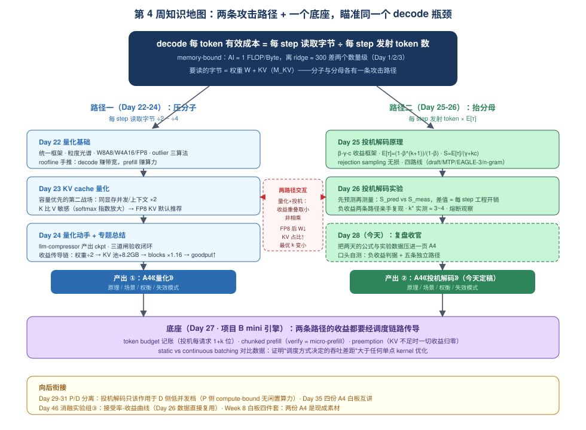
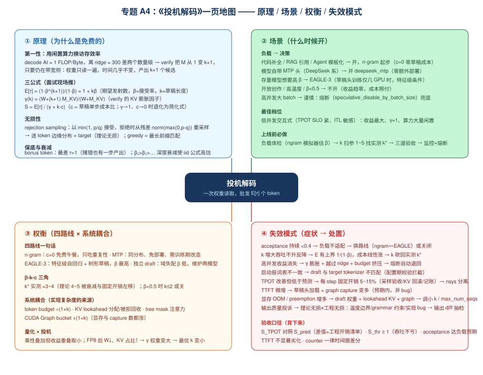
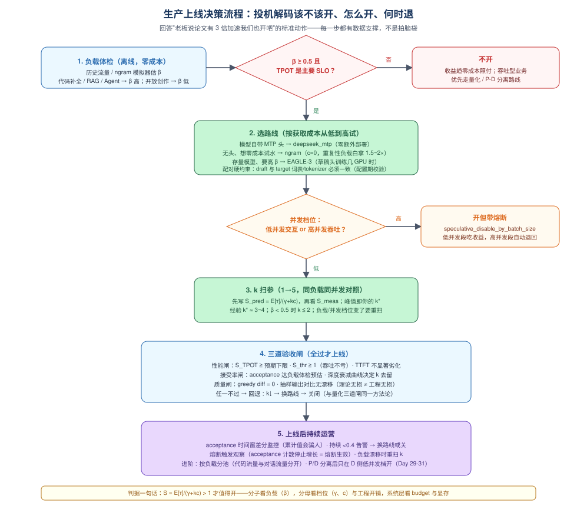

# Day 28（复盘日）：投机解码专题收官 —— 专题 A4《投机解码》与口头自测

> **第 4 周 · Day 28** ｜ 预计投入：2~3 小时（复盘日：没有新知识输入，全部是整理、压缩与口头输出）
> **衔接回顾**：Day 25（β-γ-c 收益框架、三公式、四路线、vLLM V1 投机 step 源码链路）、Day 26（三组实验实测数据、k 扫参、负收益两条路径的亲手复现、S_pred vs S_meas 的工程开销闭环）、Day 22-24（量化三连与第一份 A4《量化》——今天产出第二份，两份配成一对面试弹药）、Day 27（mini 引擎收官：budget 记账、chunked prefill、preemption——投机的所有系统耦合昨天刚在代码里摸过一遍）、以及更早的地基：Day 2/3（decode 时延下界与 ridge point）、Day 5（TPOT/吞吐口径纪律）、Day 10/11（token budget）、Day 15（KV block 分配/回收）、Day 18（CUDA Graph bucket）、Day 19（nsys 找 bubble）。
> **向后衔接**：Day 29-31（P/D 分离——"投机解码只该作用于 D 侧低并发档"是那三天的高分话题）、Day 35（四份 A4 白板互讲）、Day 46（消融实验组③：接受率-收益曲线，Day 26 数据直接复用）、Week 8（白板四件套，两份 A4 是现成素材）。
> **产出目标**：① 专题 A4《投机解码：原理/场景/权衡/失效模式》定稿（第 4 节，可抽出成独立一页）；② 口头自测录音（核心题"投机解码什么时候是负收益"达到"一条判据 + 五条路径"的展开水平）；③ 本周产出物核对清单全部打勾；④（可选）量化 × 投机叠加收益的一页推演。

---

## 一、今日学习目标

- [ ] 把 Day 25 的公式、Day 26 的实测数据、Day 27 的系统耦合，**压缩进一页 A4**（四段式：原理/场景/权衡/失效模式），并与 Day 24 的《量化》A4 形成统一格式
- [ ] 用**主动回忆**（不看笔记）完成 5 道口试题，每题 3 分钟录音——重点是 README 里的原题：**"投机解码什么时候是负收益？"**，答案要达到"一条判据 + 五条独立路径 + 每条带检测指标与调参动作"
- [ ] 30 秒口算 β=0.75、k=3、c=0.05 的加速比（简化式），并说出计入 γ 后的修正方向
- [ ] 讲清**量化与投机的叠加建模**：为什么收益是"重叠取小"而不是相乘
- [ ] 从昇腾算子视角说清投机解码对 GEMM 形态的影响（M 维 1 → k+1，GEMV 变小 GEMM）——跨平台叙事素材
- [ ] 完成本周产出物核对（8 项清单），缺的补齐
- [ ] 对着 A4 地图做一次 **3 分钟白板互讲**（找同行或对镜头）

---

## 二、复盘方法论：为什么复盘日才是"成品工序"

### 2.1 知识的两种形态：原料 vs 成品

Day 25 读原理、Day 26 跑实验时，你产出的是**原料**：公式推导散在笔记各处、实验数据在终端滚动条里、失效模式的结论埋在实验报告第几节。原料形态的知识在面试现场是**取不出来的**——面试官不会等你翻笔记，压力下的 3 分钟里能调用的只有**压缩过、结构化过、口头演练过**的内容。

复盘日做的事情就是把原料加工成成品：

| 工序 | 输入 | 输出 | 认知原理 |
|---|---|---|---|
| **压缩** | Day 25/26 全部笔记 | 一页 A4 | 写不下 → 被迫排序优先级 → 结构浮现 |
| **重构** | 按天学的知识 | 四段式（原理/场景/权衡/失效） | 换一种检索结构存一遍，面试提问直接命中 |
| **提取练习** | A4 成品 | 5 段录音 | 主动回忆（retrieval practice）比重读留存率高数倍 |
| **输出倒逼** | 录音回听 | 发现卡壳点 | 卡壳 = 检索路径没建好，今晚补漏 |

> **打卡规则里的那句话**（README：复盘日不许跳过）的底层原因就在这：**实验数据只有进了 A4 才是面试带得走的东西**。Day 26 跑出的 1.75×，如果三天后复述不出来，就等于没跑。

### 2.2 四段式为什么是面试的标准骨架

回忆 Day 24《量化》A4 的四段式，今天照抄结构：

- **原理**——回答"为什么可行"（第一性 + 数学），面试官问"讲讲 X 技术"时用；
- **场景**——回答"什么时候用/不用"，决策表形式，面试官问"你的业务该不该开"时用；
- **权衡**——回答"代价是什么、和替代方案比如何"，多维权横表，追问环节的主战场；
- **失效模式**——回答"什么时候会坏、怎么发现、怎么办"，症状→机制→处置三列表——**这是区分"用过"和"懂过"的段位题**，也是本周 README 里"达到四段式水平"的字面要求。

### 2.3 本周知识地图：两条攻击路径 + 一个底座



这张图是本周的"一图流"总结，值得手画一遍（W8 白板四件套的预热）：

- **中心**：decode 每 token 有效成本 = **每 step 读取字节 ÷ 每 step 发射 token 数**——本周两个专题就是分别攻击分子和分母；
- **左路（Day 22-24 量化）**：把每 step 要读的字节 ÷2~÷4（权重 FP8/W4、KV FP8），产出第一份 A4；
- **右路（Day 25-26 投机）**：把每次读取的 token 产出 ×E[τ]，今天产出第二份 A4；
- **底座（Day 27 mini 引擎）**：两条路径的收益都要经调度链路传导（budget、KV 分配、preemption）——系统层的账算不清，单点优化的收益到不了用户。

---

## 三、本周主线复盘：从公式到实测的完整闭环

### 3.1 两条路径的统一视角（把 Day 2 的下界公式改写两次）

Week 1 Day 2 的 decode 时延下界：$T_{\text{decode}} \geq W / \text{BW}$（读一遍权重的字节 ÷ 带宽）。本周两个专题各自改写了一次这个公式：

$$
\text{量化（Day 22-24）}：\quad T_{\text{decode}} \geq \frac{W_q}{\text{BW}} \qquad W \to W_q = W/2 \sim W/4
$$

$$
\text{投机（Day 25-26）}：\quad T_{\text{per token}} \geq \frac{W + \gamma\text{-相关的 KV 字节}}{E[\tau] \cdot \text{BW}} \qquad \text{分母} \to E[\tau] \in [1, k+1]
$$

两条路径**不冲突但重叠**：同时开 FP8 + 投机，时延不是 $\frac{W}{2 E[\tau] \text{BW}}$ 那么简单——因为：

1. **投机拯救的是"算力闲置"，量化拯救的是"带宽浪费"，但 decode 的时延下界由两者中更紧的那个决定**。FP8 之后 $W$ 变小、KV 字节占比升高 → $\gamma(k)$ 的膨胀效应相对变大 → 最优 $k$ 变小（Day 25 §4.5 交互表的结论）；
2. 量化的容量收益（KV 池变大）会让 batch 上限提高 → 系统滑向 compute-bound → 投机的"多算免费"前提被侵蚀。

> **面试一句话**：量化与投机可以叠开，但收益**不是相乘而是取重叠后的较小者**；叠开时要把 k 调小重新扫参（Day 46 消融组③④的联合实验正好可以验证这一点）。

### 3.2 一周时间线：每天往闭环里添了哪块砖

| Day | 添的砖 | 闭环里的角色 |
|---|---|---|
| 22 | 统一量化框架 + roofline 收益推导 | 分子攻击的**理论** |
| 23 | KV 量化容量模型 + K/V 敏感性 | 分子攻击的**第二战场（容量）** |
| 24 | llm-compressor 亲手产出 + 三道闸验收 + A4《量化》 | 分子攻击的**工程闭环 + 第一份成品** |
| 25 | β-γ-c 框架 + 无损性证明 + 四路线 + 源码链路 | 分母攻击的**理论** |
| 26 | 三组实验 + k 扫参 + 负收益复现 + 开销归因 | 分母攻击的**实测闭环** |
| 27 | mini 引擎收尾：chunked prefill + preemption + benchmark | 两条路径共同的**调度底座** |
| **28（今天）** | A4《投机解码》+ 口头自测 + 产出物核对 | 分母攻击的**成品工序** |

### 3.3 投机解码专题的闭环链（Day 25 + Day 26 合并视图）

把这个专题的完整推理链默写一遍（自测：不看后文能否复述）：

```text
第一性（Day 25 §2.1）
  decode AI ≈ 1 FLOP/Byte，ridge ≈ 300 → 算力闲置 99%+
    → "多算免费"：verify 把 M 从 1 变 k+1，仍在带宽侧则 step 时间几乎不变
公式（Day 25 §3）
  E[τ] = (1-β^(k+1))/(1-β) ≈ 1 + kβ        ← 分子：负载决定天花板
  γ(k) = (W + (k+1)·M_KV)/(W + M_KV)        ← 分母项 1：KV 膨胀
  S = E[τ] / (γ + k·c)                       ← c = 草稿成本比，分母项 2
实测（Day 26）
  S_pred vs S_meas 的差值 = 每 step 固定开销（采样验收/KV 回滚/记账/graph 衔接，5~15%）
  k* 实测 ≈ 3~4（理论 4~5 被深度衰减 + 固定开销左移）
  负收益两条路径：分子塌掉（低 β）与分母涨掉（高并发：γ 膨胀 + 越过 ridge + budget 挤压）
系统耦合（Day 25 §4 + Day 27）
  token budget ÷(1+k) · KV lookahead 分配/被拒回收 · CUDA Graph bucket ×(1+k) · tree mask
```

> **版本与记号说明**：本文沿用 Day 25/26 的记号——β 为接受率、k 为草稿长度（= `num_speculative_tokens`）、c 为草稿单步成本比、γ 为 verify 膨胀因子。README 周计划速览里的 α/γ 分别对应本文的 β/k。vLLM V1 的投机解码模块为 `vllm/v1/speculative_decode/`（Day 25 §4 走读过），文件与函数名随版本演进较快，以你安装的版本源码为准。

---

## 四、核心产出：专题 A4《投机解码：原理 / 场景 / 权衡 / 失效模式》

> 这是本周第二份 A4 专题总结（第一份《量化》在 Day 24 §7）。下面是**可直接抽出成独立一页**的完整内容；配套 A4 地图建议一并打印，Day 35 白板互讲直接用。



### A4 · 0. 一句话总纲

> **投机解码 = 带宽瓶颈下用"免费"的算力换访存效率——一次权重读取批发 $E[\tau]$ 个 token**。收益是负载（β）的函数，代价是 verify 膨胀（γ）、草稿成本（$kc$）与调度挤压（budget ÷(1+k)）；输出分布由 rejection sampling 保证与 target 一致——**草稿只决定速度，不决定输出**。

### A4 · 1. 原理（Day 25）

- **第一性**：decode 算术强度 ≈ 1 FLOP/Byte，离 ridge（≈300）差两个数量级 → 算力大量闲置 → "多算免费"：verify 把 GEMM 的 M 从 1 变 $k+1$，仍在带宽侧时 step 时间几乎不变，产出 $k+1$ 个候选；
- **三公式**（一个分数记全部）：

$$
S = \frac{E[\tau]}{\gamma + k\,c}, \qquad E[\tau] = \frac{1-\beta^{k+1}}{1-\beta} \leq \frac{1}{1-\beta}, \qquad \gamma(k) = \frac{W+(k+1)\,M_{KV}}{W+M_{KV}}
$$

- **无损性**：草稿 token 以 $\min(1, p/q)$ 被接受，拒绝时从残差 $\mathrm{norm}(\max(0, p-q))$ 重采样 → 逐 token 边缘分布 = target（greedy 时即最长前缀匹配）；
- **保底**：bonus token 让最差 $\tau = 1$——赌错也不亏一步，"投机"二字的含义；
- **两个修正项**：位置衰减 $\beta_1 > \beta_2 > \cdots$（iid 公式高估收益）；每 step 固定开销（采样验收、KV 回滚、记账，实测 5~15%）——**公式是上界，实测差值 = 工程开销清单**；
- **四路线一句话**：独立 draft（域失配 β 低）/ MTP（同分布、免部署、需训练期改造）/ EAGLE-3（特征级自回归 + 树形草稿，β 最高）/ n-gram（$c=0$ 免费午餐，只吃重复性）。

### A4 · 2. 场景（什么时候开）

| 负载 / 条件 | 决策 | 一句话理由 |
|---|---|---|
| 代码补全 / RAG 引用 / Agent 模板化 | **开，n-gram 起步** | 高自重复 → β 高；$c=0$ 亏也亏得少 |
| 模型自带 MTP 头（DeepSeek 系） | **开 `deepseek_mtp`** | 同分布 β 高、零额外部署 |
| 存量模型、要更高 β | **EAGLE-3** | 草稿头训练仅几 GPU 时，特征级条件 β 最高 |
| 开放创作 / 高温度 / 无草稿可用 | **不开** | β < 0.5，收益趋零、成本照付 |
| 高并发大 batch（吞吐型业务） | **谨慎，熔断兜底** | γ 膨胀 + 越过 ridge + budget 挤压 |
| 低并发交互式（TPOT/ITL SLO 紧） | **最佳档位** | γ≈1、算力大量闲置、budget 用不满 |
| P/D 分离架构（Day 29-31 预告） | **只开在 D 侧低并发档** | P 侧 compute-bound，无闲置算力可换 |

- **上线前动作链**：负载体检（ngram 模拟器估 β）→ 选路线 → k 扫参 1~5 找实测 k* → 三道验收（性能 / 接受率 / 质量）→ 上线 + acceptance 监控 + 熔断。

### A4 · 3. 权衡（四路线 × 系统耦合）

| 路线 | 条件信号 | 草稿成本 $c$ | 典型 β | 获取成本 | vLLM 支持形态 |
|---|---|---|---|---|---|
| **n-gram** | prompt/上下文子串 | **≈0**（CPU 查表） | 依赖重复度，代码类 0.7+ | 零 | `method: ngram` |
| **独立 draft model** | token 级自回归 | 0.1~0.3（第二个模型走 k 步） | 域失配时 <0.5 | 要维护第二个模型 | classic spec（生态收缩中） |
| **MTP** | target 自带预测头 | 低（单头浅层） | ~0.8 量级（DeepSeek-V3 报告） | 需训练期改造 | `method: deepseek_mtp` |
| **EAGLE-3** | **hidden state（特征级）** | 低~中（轻量 draft 头走 k 步） | 最高（特征层误差小） | 几 GPU 时训练 | `method: eagle` / `eagle3` |

- **β-k-c 三角**：$k$ 的最优值由 β 与 c 共同决定——高 β 低并发档实测 $k^* \approx 3\sim4$；β < 0.5 时 $k \leq 2$ 或直接关；负载或并发档位变了要重扫；
- **系统耦合（实现复杂度的来源）**：token budget ÷(1+k)（同预算最大 running 数直接除以 1+k）· KV lookahead 分配与被拒回收（走 Day 15 的 block pool 路径）· tree mask 注意力（树内 token 只见祖先）· CUDA Graph bucket ×(1+k)（显存与 capture 数都涨，Day 18）；
- **量化 × 投机**：收益乘性叠加但**重叠取小**——两者吃的是同一个 decode 冗余；FP8 后 $W \downarrow$、KV 占比 $\uparrow$ → $\gamma$ 权重变大 → **最优 k 变小，要重扫**；draft 侧量化则 $c \downarrow$（Day 46 消融组③④的联合实验）。

### A4 · 4. 失效模式（症状 → 机制 → 处置）

| 症状 | 机制 | 处置 |
|---|---|---|
| acceptance 持续 < 0.4，TPOT 无改善 | β 低：负载与草稿不适配（分子塌掉） | 换路线（ngram ↔ EAGLE）或关闭 |
| k 增大吞吐不升反降 | $E[\tau]$ 上界 $\frac{1}{1-\beta}$ 饱和，$kc$/$\gamma$ 线性涨 | k 砍回实测 k* |
| 高并发段收益消失甚至为负 | ① $\gamma$ 膨胀 ② 越过 ridge ③ budget 挤压（分母涨掉） | 调小 k → `speculative_disable_by_batch_size` 熔断 → 关闭 |
| 启动报词表 / tokenizer 不一致 | draft 与 target 词表不匹配（`SpeculativeConfig` 配置期校验拦截） | 换配对的草稿头 |
| TPOT 改善但明显低于 S_pred | 每 step 固定开销 5~15%（采样验收 / KV 回滚 / 记账 / graph 衔接） | nsys 分离（Day 19 方法），接受为工程常数 |
| TTFT 微增 | 草稿头加载 + graph capture 变多 | 预期内（prefill 不投机），非 bug；严重则查 bucket |
| 显存 OOM / preemption 增多 | draft 权重 + lookahead KV + graph 显存叠加 | 调小 k / `max_num_seqs`；必要时上 KV 量化腾容量 |
| 输出质量投诉 | 理论无损 ≠ 工程无损：温度边界、grammar 约束、实现 bug | 输出 diff 抽检（Day 24 质量闸方法论复用） |

> **验收口径（背下来）**：性能闸（$S_{\text{TPOT}}$ 对照 $S_{\text{pred}}$，差值 = 工程开销；$S_{\text{thr}} \geq 1$ 吞吐不亏；TTFT 不显著劣化）× 接受率闸（acceptance 达负载体检预估、看深度衰减定 k 去留）× 质量闸（greedy diff = 0、抽样输出对比）——**counter 一律时间窗差分，累计值会骗人**。

---

## 五、口头自测：把 A4 讲成 3 分钟一段的录音

> 复盘日的"实验"就是输出。规矩（README Day 28）：**每题录音 3 分钟，不看任何材料**；回听时对照本节要点自评。录音文件命名 `day28_oral_Q{1..5}.mp3`。

### 5.1 核心题：投机解码什么时候是负收益？（README 原题，必须满分）

**答题骨架：先给判据，再分层展开路径**——直接罗列现象是"用过"，给出判据再展开才是"懂过"。

**判据（第一句话就要说）**：

$$
S = \frac{E[\tau]}{\gamma + k\,c} < 1 \quad \text{即负收益（TPOT 口径）}；\quad \text{系统层还有 } S_{\text{thr}} < 1 \text{ 的独立伤害（吞吐口径）}
$$

**五条独立路径**（每条按"机制 → 指标表现 → 动作"展开）：

| # | 路径 | 机制 | 指标表现 | 动作 |
|---|---|---|---|---|
| 1 | **分子塌掉：低 β** | β < 0.5 → $E[\tau] \to 1{+}\epsilon$，几乎只剩 bonus token；成本照付（γ、kc、开销） | acceptance 持续 < 0.4；TPOT 与 baseline 几乎持平 | 换路线（ngram↔EAGLE 对负载适配不同）或关闭；ngram 的亏损有下限（c=0），模型草稿按 kc 线性放大亏损 |
| 2 | **γ 膨胀** | $M_{KV} = B \cdot \text{ctx} \cdot m_{\text{token}}$ 与 $W$ 同量级时，verify 要为 $k{+}1$ 个位置读 KV，按倍数付账 | 长上下文 / 中高并发下 $S_{\text{TPOT}}$ 衰减速度快于公式预测 | 调小 k；长上下文流量慎开 |
| 3 | **越过 ridge** | $B(1+k)$ 的算力强度跨过拐点 → "多算免费"前提消失，verify 从免费变成全额付费 | 高并发段 TPOT 优势消失甚至反转 | `speculative_disable_by_batch_size` 熔断，高并发自动退回普通 decode |
| 4 | **budget 挤压** | 每请求每步占 $1+k$ 个 token 位 → 同预算最大 running 数 ÷(1+k)（8192 budget、k=3 → 2048 vs 8192） | 高到达率下总吞吐直接除以 1+k（$S_{\text{thr}} < 1$ 但 TPOT 口径看不出来） | 吞吐型档位关闭；TPOT 与吞吐两个口径分开看（Day 26 的纪律） |
| 5 | **固定开销与配置性失效** | 每 step 采样验收 / 被拒草稿 KV 回收 / lookahead 记账 / graph 衔接，合计 5~15%；tokenizer 不匹配、draft 权重 + graph 显存挤爆 KV 池 | $S_{\text{pred}} - S_{\text{meas}}$ 差值大；启动报错或 preemption 增多 | nsys 分离固定成本（Day 19）；换配对草稿；调小 k / `max_num_seqs` |

**收尾一句话**：判据是 $S < 1$，但生产上的正确动作是**分级回退**——调小 k → 熔断 → 关闭——并且 TPOT 与吞吐两个口径都要看：低 β 亏在分子、高并发亏在分母与 budget，**同一句"负收益"背后是完全不同的机制与处置**。

> **自评标准**：3 分钟内说完五条？每条带了一个数字（0.4 / 5~15% / ÷(1+k) / 8192→2048）？最后给了分级回退动作？三条都"是"才算过。

### 5.2 口算题：β=0.75、k=3、c=0.05，加速比是多少？（README 原题）

30 秒口算过程（练到能脱口而出）：

```text
① E[τ] = (1 - 0.75⁴)/(1 - 0.75) = (1 - 0.316)/0.25 ≈ 2.73
② 简化式（γ=1）：T = 1 + kc = 1.15  →  S ≈ 2.73/1.15 ≈ 2.4
③ 严谨版（计入 γ，用 Day 26 的档位数字）：
   B=8、ctx=1500、m_token=56 KiB → M_KV ≈ 0.66 GB，W = 15.2 GB
   γ(3) = (15.2 + 4×0.66)/(15.2 + 0.66) ≈ 1.13 → T = 1.28 → S ≈ 2.1
④ 再计每 step 5~15% 固定开销 → 实测预期 1.9~2.0
```

**要点**：面试口算用②报 2.4，**主动补一句**"计入 KV 膨胀约 2.1，再计工程开销实测预期 1.9~2.0"——三层修正的展开就是数字敏感度的展示（Day 26 的方法论的口头版）。

### 5.3 量化与投机可以叠加吗？收益怎么建模？（跨专题综合题）

**答**：可以叠开，但收益**不是相乘而是取重叠后的较小者**：

- 两者吃的是同一个冗余——decode 的带宽富余 / 算力闲置。设量化的时延比 $r_q = T_q/T < 1$、投机的加速比 $S$，叠开后的时延比**不是** $r_q \cdot S$，而是各自把瓶颈推给对方后取较紧的那个；
- 具体交互三条：① FP8 后 $W \downarrow$ → KV 字节占比 $\uparrow$ → $\gamma(k)$ 的膨胀效应相对变大 → **最优 k 变小，要重扫**；② 量化的容量收益让 batch 上限提高 → 系统滑向 compute-bound → 侵蚀"多算免费"；③ draft 侧若也量化 → $c \downarrow$，草稿更便宜；
- 验证方法：Day 46 消融实验组③（接受率-收益）× 组④（量化权衡）的联合格子——同一负载跑 {BF16, FP8} × {spec on, off} 四格，看叠开格的实际时延比落在两个单开格的哪一侧。

### 5.4 昇腾算子视角：投机解码对 GEMM 形态的影响是什么？（差异化叙事题）

**答**：投机解码把 decode GEMM 的 **M 维从 1 变成 $k+1$**（verify 的 batch 位并行）——GEMV 变小 GEMM：

- 对 kernel 选型：M=1 的 GEMV 路径换成 M=4~6 的小 GEMM，正好落入我做过 L1 全载模板的 **M ≤ 256 甜点区**——权重驻留 L1、一次装载多行复用，搬运次数从 $O(n)$ 摊到 $O(1)$；
- 对 bound 建模：M 变大后 arithmetic intensity 线性提升，balanceRate（算力/带宽平衡点）右移——原来纯带宽 bound 的算子开始有计算参与，tiling 搜索的 baseM 最优点也随 M 移动；
- 平台无关性：β-γ-c 框架只依赖"算力/带宽比值"和"每 step 读取字节数"两个量——把 ridge 换成 910B 的 Cube 吞吐 ÷ HBM 带宽、$W$/$M_{KV}$ 换成 NPU 实测，结论原样成立；vllm-ascend 对 EAGLE/ngram 的支持矩阵是 W6-7 项目 A 的候选调研点。

### 5.5 实验数据三段式抽查（遍历 Day 26 的曲线）

从 Day 26 的实验记录里任抽一条，按"现象 → 机制 → 指标"三段讲 60 秒。练习用参考（换成你自己的实测数）：

| 现象（bench 长什么样） | 机制（vLLM V1 里哪条路径） | 指标（/metrics 哪个计数器动） |
|---|---|---|
| 开放对话负载 k=4 时吞吐低于不开 | β 低 → $E[\tau] \to 1.3$，但 verify 仍为 5 个位置读 KV + budget ÷5 | acceptance ≈ 0.35；$S_{\text{thr}}$ ≈ 0.9 |
| k 从 4 → 8 加速比几乎不变 | $E[\tau]$ 上界 $\frac{1}{1-\beta}$ 饱和；$kc$、γ 与开销线性涨 | 深度衰减指标：$\beta_4$ 之后趋近 0 |
| 高并发段 TPOT 优势消失 | $B(1+k)$ 越过 ridge + budget 挤压 | acceptance 计数停止增长（熔断生效） |

**录音自评表**（每题回听时打分）：

| 维度 | 自问 |
|---|---|
| 结构 | 3 分钟内讲完？有没有"判据先行"再展开？ |
| 数字 | 至少报出 2 个具体数字（不是"大概""显著"）？ |
| 机制 | 每个结论都能落到源码/调度/KV 的具体路径？ |
| 动作 | 讲完了"所以生产上怎么办"吗？ |

---

## 六、动手环节（复盘日：没有新实验，只有"出成品"）

> 今天的"实验步骤"是成品化工序。按顺序做完约 2~3 小时。

### 步骤 1：抽出 A4 为独立文件（约 40 分钟）

- 把第 4 节内容抽出为 `week4/a4_speculative_decoding.md`（与 Day 24 的量化 A4 并排放）；
- **把示例数字换成你的实测数**：A4 里所有出现的数字（k*、acceptance、$S_{\text{pred}}$/$S_{\text{meas}}$、开销百分比）都用 Day 26 闭环数据总表里的真值替换——面试时"我的负载实测"比任何引用都有说服力；
- 配图两张（A4 地图 + 下面的决策流程）导出打印或 PDF。

### 步骤 2：对着决策流程图讲一遍"生产上怎么开"（约 20 分钟）



对照上图，从"负载体检"讲到"上线后运营"，然后**合上图手画简化版**（5 个框：体检 → 选路线 → 定档位 → 扫 k → 验收+监控）。这 5 个框就是面试题"给你一个新服务，投机解码怎么落地"的答题骨架。

### 步骤 3：口试题录音（约 45 分钟）

- 5 道题（5.1~5.5）各录 3 分钟，命名 `day28_oral_Q1.mp3` ~ `Q5.mp3`；
- 回听并用 5.1 的自评表打分；卡壳点当场记录，今晚补漏（打卡规则：允许"今天没搞透 X"）。

### 步骤 4：白板互讲（约 20 分钟）

- 找同行（或对镜头）：用 A4 地图讲 **3 分钟版**，让对方追问 5 分钟（重点练 5.1 负收益题的追问链：β 为什么低 → 怎么检测 → 换路线凭什么会好 → ngram 的下限亏损怎么来的）。

### 步骤 5：本周产出物核对（约 15 分钟，README Day 28 清单）

- [ ] 《昇腾量化算子 vs GPU 量化 GEMM 对照》一页（Day 22）
- [ ] KV FP8 实验三列对比记录（Day 23）
- [ ] 自制 FP8/W4 模型 + 精度性能双验证（Day 24）
- [ ] A4《量化：原理/场景/权衡/失效模式》（Day 24）
- [ ] 投机解码公式推导 + 四路线对比 + ngram 模拟器（Day 25）
- [ ] 接受率-k 曲线 + 负收益复现 + 闭环数据总表（Day 26）
- [ ] 项目 B README + benchmark 数据（Day 27）
- [ ] **A4《投机解码》+ 5 段口头录音（今天）**

### 步骤 6（可选进阶）：量化 × 投机联合推演一页

- 按 5.3 的框架写半页：四格实验设计（{BF16, FP8} × {spec on/off}）、预测每格的 TPOT 与吞吐、标注"重叠取小"落在哪一格——这就是 Day 46 消融实验组③④联合格子的预演，写了直接复用。

---

## 七、面试高频问题（复盘日精选：跨专题综合题）

**Q1：老板拿着 EAGLE-3 论文说"人家 3 倍加速，我们也开"，你怎么回应？**
A：不抬杠也不照办，给流程：① 论文条件 = 特定负载 + 大模型 + 低并发 + $\gamma \approx 1$，我们的档位（并发、上下文）$\gamma > 1$、负载 β 未知——**加速比是负载与档位的函数，不是模型的属性**；② 提议零成本试水：ngram（$c=0$）在真实流量上测 acceptance，一天出结论；③ 通过体检再上 EAGLE-3 + k 扫参 + 三道闸验收。最后给出我自己的数据背书（Day 26：我的负载 k*=3，实测 1.7×，低于预测 2.08 的 30% 是每 step 开销）——**"我扫过"是最强的回应**。

**Q2：量化和投机都加速 decode，能同时开吗？收益怎么算？**
A：能，但不是相乘——两者吃的是同一个 decode 冗余，**收益重叠取小**。三个具体交互：FP8 后 $W \downarrow$ → KV 占比 $\uparrow$ → $\gamma$ 相对变大 → 最优 k 变小要重扫；量化扩容让 batch 上限提高 → 滑向 compute-bound 侵蚀"多算免费"；draft 量化则 $c \downarrow$。验证方法：四格联合消融（Day 46 组③④）。

**Q3：P/D 分离之后，投机解码部署在哪一侧？**
A：D 侧、且低并发档。P 侧 prefill 是 compute-bound——没有闲置算力可换，投机的前提不成立；D 侧 decode 是 memory-bound 且 TPOT SLO 紧，正是投机的最佳档位。注意两个交互：KV 从 P 传到 D 后 lookahead 分配与传输流水的关系；D 侧并发升高时熔断照常兜底。这是 Day 29-31 的正式话题，今天先把结论挂上钩。

**Q4：投机解码为什么无损？什么情况下会"有损"？**
A：理论：rejection sampling 以 $\min(1, p/q)$ 接受 + 残差重采样，逐 token 边缘分布与 target 一致（有精确证明）；greedy 下即最长前缀匹配。但**理论无损 ≠ 工程无损**：temperature=0 与采样路径的边界、grammar/约束解码与验收逻辑的交互、实现 bug 都可能引入偏差——所以质量闸要做 greedy diff 和输出抽检（Day 24 三道闸方法论复用）。

**Q5：线上怎么监控投机解码的健康度？**
A：三个层次：① acceptance **时间窗差分**（累计值会骗人）+ 按深度衰减的分位指标——持续 < 0.4 告警，深度衰减决定 k 砍到几；② 熔断触发观察——acceptance 计数停止增长 = `speculative_disable_by_batch_size` 生效；③ 负载漂移检测——流量结构变了（代码占比降了）要重扫 k。进阶方向：在线自适应 k / 动态投机（按实时接受率调整草稿长度）——项目 C 的候选设计。

**Q6：让你给 vLLM 的投机解码提一个改进，你提什么？**
A：开放题，考的是"框架内思考"：① 在线自适应 k（按深度衰减实时截断草稿，把 k* 的扫描变成运行时自动）；② cache-aware 草稿——把 prefix caching 的命中信息喂给草稿器（ngram 的推广：不只查 prompt，查全局 KV 命中前缀）；③ draft 侧量化/W4 化降 $c$。任选一条说清"改哪个量（β/c/k）、预期收益公式怎么变、怎么验证"即可。

---

## 八、今日总结

```text
一个判据：S = E[τ]/(γ+kc) < 1 即负收益——TPOT 与吞吐两个口径分开看
五条路径：低 β（分子塌）/ γ 膨胀 / 越过 ridge / budget 挤压 / 固定开销与配置失效
一个成品：A4《投机解码》四段式——与《量化》配对，Day 35 白板互讲、Week 8 四件套素材
一条闭环：S_pred → S_meas → 差值 = 每 step 工程开销（公式是上界，差值是清单）
一个习惯：counter 差分 · 先预测后测量 · 分级回退（k↓ → 熔断 → 关闭）
本周总纲：量化压分子、投机抬分母，收益重叠取小；调度底座算不清账，单点优化到不了用户
```

**与下周的钩子**：本周两个专题都隐含一个假设——prefill 和 decode 跑在同一个实例上。下周（Day 29-31）拆掉这个假设：P/D 分离为什么能把 goodput 提升 1.5~3 倍、同节点 NVLink 与跨节点 RDMA 两条路线、Mooncake/Dynamo/llm-d 的取舍——以及今天挂上的钩子：**投机解码在 P/D 架构里的正确位置（D 侧低并发档）**。

---

## 九、今日自测题

1. 默写投机解码三公式，指出每个公式的自变量，以及它影响的是 TPOT 口径还是吞吐口径。
2. 负收益五条路径中，哪两条主要伤害吞吐而非 TPOT？为什么 TPOT 口径看不出来？
3. 口算：β=0.6、k=4、c=0.10、γ=1.1，加速比是多少？β 降到 0.4 呢？
4. 权重 FP8 + KV FP8 之后开投机，最优 k 相比 BF16 档位会怎么变？给出两层原因。
5. `max_num_batched_tokens`=4096、k=3：投机开启后理论最大 running decode 数是多少？这个伤害在什么条件下才显现？
6. 为什么说"公式是上界"？列出至少三个公式没算进去的项，并说出各自的量级。
7. 一句话回答：ngram 与 EAGLE 路线的"负收益下限"分别由什么决定？

<details><summary><b>参考答案</b></summary>

1. $E[\tau] = \frac{1-\beta^{k+1}}{1-\beta}$（自变量 β、k；TPOT 口径的分子）；$\gamma(k) = \frac{W+(k+1)M_{KV}}{W+M_{KV}}$（自变量 k、batch、ctx；分母项）；$S = \frac{E[\tau]}{\gamma+kc}$（c 为草稿成本比）。$S$ 本身是 TPOT 口径；budget 挤压（÷(1+k)）是公式外的吞吐口径伤害。
2. budget 挤压与越过 ridge。budget 挤压只在到达率把 running 顶到预算上限时才咬人，TPOT 口径下每步照常发射、延迟无感；越过 ridge 推高的是每 step 时间，但 batch 大时 TPOT 本身也被摊薄，最先跌破 1 的是总吞吐。
3. β=0.6：$E[\tau] = (1-0.6^5)/0.4 = 0.9222/0.4 \approx 2.31$；$T = 1.1 + 0.4 = 1.5$；$S \approx 1.54$。β=0.4：$E[\tau] = (1-0.4^5)/0.6 \approx 1.66$；$S \approx 1.66/1.5 \approx 1.11$——已在关闭边缘（再计 5~15% 开销即转负）。
4. 变小。① $W \downarrow$（÷2）而 $M_{KV} \downarrow$（÷2）看似同比，但 FP8 权重通常搭配更大 batch/上下文容量，$M_{KV}$ 实际占比升高 → $\gamma(k)$ 膨胀更重；② 容量收益推高 batch → 越过 ridge 的风险提前。两层都把最优 k 往左推。
5. 4096 ÷ (1+3) = **1024**（baseline 4096）。低并发时预算用不满、完全无感；高到达率把 running 顶到上限时，最大吞吐被直接除以 4——这就是 Day 26 实验 3b 的"budget 挤压"。
6. ① 每 step 固定开销：采样验收（k+1 个位置）、被拒草稿的 KV block 回收、lookahead 记账、draft→verify 衔接与 graph bucket 切换——合计每 step 数百 μs，低延迟档占 5~15%；② 位置衰减使 $E[\tau]$ 低于 iid 公式；③ γ 的带宽模型忽略了 attention 的非线性（长上下文时 verify 的 attention 开销超线性）。
7. ngram：$c=0$，亏损只来自 γ 与固定开销——有下限、与草稿长度弱相关；EAGLE/MTP：$c > 0$，亏损按 $kc$ 线性放大——β 低时亏损无下限，必须主动关。
</details>

---

## 十、今日产出物

- [ ] **专题 A4《投机解码：原理/场景/权衡/失效模式》独立文件**：`week4/a4_speculative_decoding.md`，示例数字全部替换为 Day 26 实测值，配 A4 地图与决策流程两图
- [ ] **5 段口头录音**：`day28_oral_Q1.mp3` ~ `Q5.mp3`（每题 3 分钟，含负收益题的"判据 + 五路径 + 分级回退"完整版）
- [ ] **白板互讲一遍**：3 分钟版 + 5 分钟追问，卡壳点已记录
- [ ] **本周产出物核对清单**：8 项全部打勾（第六节步骤 5）
- [ ] **（可选）量化 × 投机联合推演一页**：四格实验设计 + 预测值（Day 46 组③④预演）
- [ ] 打卡一句话：今天最大收获是 ______，还没搞透的是 ______（下周钩子：P/D 分离——本周"低并发 TPOT 档"的正确位置）

---

> **明日预告（Day 29）**：P/D 分离（一）——为什么。prefill 与 decode 硬件特性相反（compute-bound vs memory-bandwidth-bound）导致混跑互相干扰的本质；SLO 视角下 goodput 提升 1.5~3 倍的来源；用本周学过的 chunked prefill 干扰现象（Day 11/13）与投机解码档位理论（Day 25-26）做铺垫。
>
> **版本与说明**：本文以 vLLM V1（≥0.9）架构为准。`vllm/v1/speculative_decode/` 下的文件与函数名（如 `eagle.py`、`ngram_worker.py`、`metrics.py`）随版本演进较快，动手时以你安装版本源码为准；`spec_decode_*` 指标名以 `/metrics` 实际输出为准。DeepSeek-V3 的 MTP 接受率（~85% 量级）引自其技术报告，EAGLE-3 的接受长度（~5 token/步）引自论文——均为论文条件下的数字，你的负载上以实测为准。H100 带宽 3.35 TB/s 为 SXM 版标称值。
