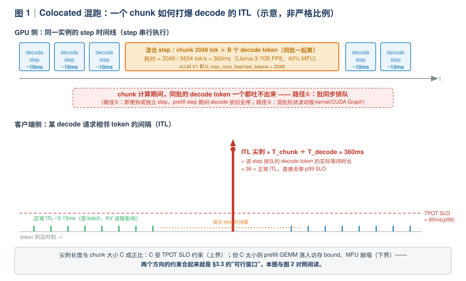
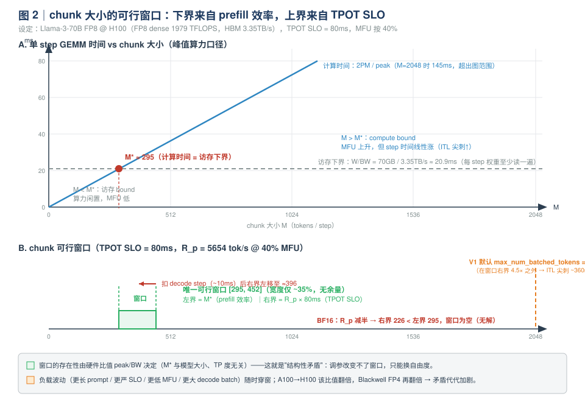
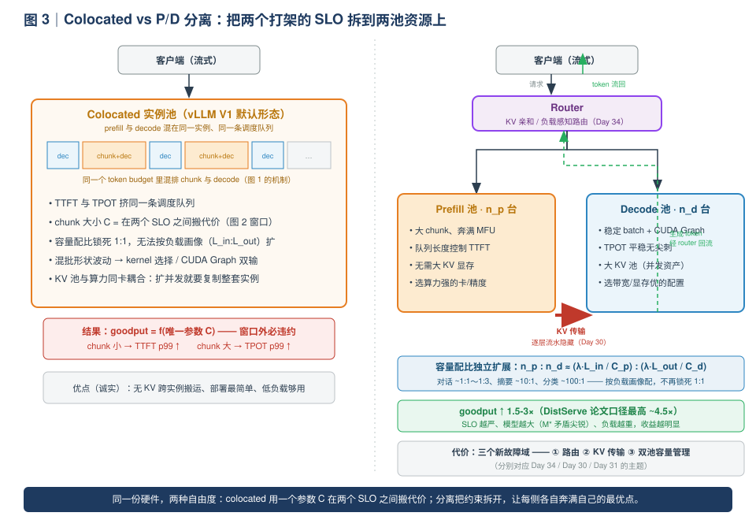

# Day 29｜P/D 分离（一）：为什么要分离——把"干扰"算出来

> **本周主线（Week 5）**：从"单实例内怎么跑得快"（W1-W4）升级到"一个集群怎么跑得好"。本周七个专题日里，P/D 分离占三天（为什么 → 怎么做 → 动手搭），它是专家岗面试**区分度最高**的话题——因为它同时考你算子层的 bound 直觉和系统层的 SLO 思维。
>
> **本日定位**：不谈部署、不谈传输协议。只回答一个问题——**为什么 prefill 和 decode 必须分开（以及什么时候其实不必分）**。所有结论都用手算数字支撑，面试时可以直接在白板上复现。

---

## 0. 前情回顾与本日位置

| 前情 | 关键结论 | 今天怎么用 |
|---|---|---|
| Day 1-2 | prefill 计算密集（compute-bound），decode 访存密集（memory-bound）；decode 单 token 时延下界 ≈ 权重字节数 / HBM 带宽 | 两类负载的"资源画像"是推导的起点 |
| Day 5 | goodput = 满足 SLO（TTFT p99 + TPOT p99）的吞吐，生产系统按它而非 raw throughput 评估 | 分离收益的度量衡 |
| Day 10-12 | V1 调度器：token budget、chunked prefill、preemption | chunked prefill 是"治标方案"，今天算出它的极限 |
| Day 18 | decode 用 CUDA Graph 消 CPU 开销；full CG 要求静态形状 | 干扰路径③"形态互斥"的微观根源 |
| Day 25-28 | 投机解码 = 用计算换访存，对付 decode 的 memory-bound | 与 P/D 分离**正交且可叠加**（Day 26 实验的延伸） |
| Day 13 实验 | 你可能已经在 `/metrics` 里见过 TPOT p99 的莫名抖动 | 今天的推导告诉你那个抖动从哪来 |

**今日一句话论点**（先给结论，全文都在论证它）：

> Colocated（混跑）系统的全部调参空间，是在一个**结构性过窄的窗口**里腾挪——chunk 太小伤 prefill 效率，太大破 decode 的 TPOT SLO。P/D 分离把这个窗口两侧的约束拆到两个资源池上，各自奔满。**收益主要不在平均吞吐，而在 goodput（SLO 内吞吐）**。

---

## 1. 今日学习目标

学完后你应该能：

1. **画出** prefill / decode 的六维资源画像表（负载形态、bound、理想 batch、理想 kernel 形态、关键指标、显存角色），并解释为什么两者的最优 kernel 模板"必然相反"；
2. **手算** compute-bound 交叉点 `M* = B_w · peak / (2 · BW)`，并说明它为什么**与模型大小无关、与 TP 度无关**——这是面试的数字敏感度考点；
3. **手算** Llama-3-70B FP8 在 H100 上的 chunk 可行窗口 `[295, 452]`，并解释为什么 BF16 下窗口为空；
4. **分层说清**混跑干扰的三条路径（批同步排队 / 访存与 SM 争抢 / 形态互斥），并算出 ITL 尖刺的量级；
5. 用 **SLO / goodput 框架**论证分离收益 1.5-3×（DistServe 论文口径最高 ~4.5×）的来源，同时能主动说出**什么时候 P/D 分离是负收益**。

---

## 2. 核心概念速查

| 术语 | 一句话定义 | 首次深入 |
|---|---|---|
| **P/D 分离**（prefill/decode disaggregation） | 把同一条推理流水线的 prefill 阶段与 decode 阶段放到不同实例（池）上执行，中间传 KV cache | 本日（为什么）+ Day 30（怎么做） |
| **colocated** | prefill 与 decode 混在同一个实例、同一条调度队列里跑（vLLM V1 默认形态） | 本日 |
| **干扰**（interference） | 混跑时一方的资源占用使另一方的时延指标劣化 | §3.2 |
| **chunked prefill** | 把长 prompt 切成固定大小的块，逐 step 计算，与 decode 混排（V1 默认开启） | Day 11；本日 §3.3 算它的极限 |
| **stall-free batching** | Sarathi-Serve 的混批策略：decode token 搭 chunk 的"便车"进同一个 step | §3.4 |
| **goodput** | 满足 TTFT/TPOT SLO 的有效吞吐（req/s 或 token/s） | Day 5；§3.4 |
| **容量配比** | prefill 池与 decode 池的算力/机器数比例，按负载画像（输入:输出 token 比）独立配置 | §3.4、§4.4 |
| **KVConnector** | vLLM V1 中把"KV 从哪来/到哪去"从执行路径解耦的插件接口，P/D 分离的源码落点 | §5.3（Day 30 详解） |

---

## 3. 原理深入：混跑互相干扰的本质

### 3.1 资源画像：同一颗芯片上的两种"相反"负载

回顾 Day 1 的结论并把它扩展成一张完整的画像表（这张表值得背下来）：

| 维度 | prefill | decode |
|---|---|---|
| 负载形态 | 大量 token 一次过（几百~几千） | 每 step 每 seq 仅 1 token |
| **bound 判定** | **compute-bound**（GEMM 大 M，算力是瓶颈） | **memory-bound**（权重 + KV 每 step 全读一遍，带宽是瓶颈） |
| 理想 batch | 越大越好（MFU 随 M 上升） | 越大越好（带宽被更多 token 摊薄），但受 KV 显存与 TPOT SLO 限制 |
| 理想 kernel 形态 | 大 M 大 K，走满 Cube/SM 的胖 GEMM | M=1~B 的瘦 GEMM，权重驻留/L1 全载类模板 |
| 显存角色 | KV 只写不读回（attention 内部用完即弃） | KV 池是核心资产，决定并发上限（Day 15-16） |
| 时延指标 | **TTFT**（用户看首字） | **TPOT/ITL**（用户看流式速度） |
| 每 token 成本 | ~`2P/peak`（算力） | ~`(W + KV)/BW`（带宽） |

**算子视角的对照（你的主场）**：你在昇腾上给 decode（M≤256）做 A/B 矩阵 L1 全载模板、给 prefill 大 M 做 ASW 流水，本来就是因为——**同一颗芯片上，这两类 GEMM 的最优 tiling/模板完全相反**。把这句话从芯片尺度放大到集群尺度，就是 P/D 分离的全部动机：

> **一个系统不可能同时处在两种负载的最优点上。** 混跑时，要么牺牲一方，要么在中间形态上双输。

### 3.2 混跑干扰的三条路径

"互相干扰"不是一个笼统的词，它可以精确拆成三条可单独指认的路径。面试时能分层说清这三条，比背十篇论文都有说服力。

#### 路径①：批同步排队（iteration-level batching 的代价）

Continuous batching（Day 21 你在 mini 引擎里写过）的调度粒度是 **step**：一个 step 内所有被调度的 token 打包成一个 batch，一次前向，**一起结束**。这意味着：

- 混批 step 里，decode token 的产出必须等**整个 step**（包括 chunk 的全部计算）结束；
- 于是 decode 的 ITL 出现与 chunk 计算时间**等长**的尖刺：

$$
\text{ITL}_{\text{spike}} \;\approx\; T_{\text{chunk}} + T_{\text{decode}} \;\approx\; \frac{C + B}{R_p}
$$

其中 $C$ 是 chunk 大小、$B$ 是混入的 decode token 数、$R_p$ 是 prefill 吞吐（tok/s）。**尖刺长度与 chunk 大小成正比**——这是后面"窗口上界"的直接来源。

#### 路径②：访存与 SM 争抢（即使分 step 也逃不掉）

GPU 上同一实例的 step 是**串行**的：prefill step 执行期间，decode 整体停摆；prefill 的大 GEMM 打满 HBM 带宽与 SM 占用率，decode 的访存密集 kernel 要么排队、要么在混批中被拖慢。**这不是调度器能解决的问题，而是资源共享的物理结果**——对应你做过的"L2/HBM 带宽与 Cube 算力的争抢"：两类算子各自的理论下界都成立，但混跑时谁都到不了自己的下界。

#### 路径③：形态互斥（kernel / CUDA Graph 层面）

混批张量形状 = chunk 大小 + $B$，随负载波动：

- **CUDA Graph**（Day 18）：full graph capture 要求静态形状，混批形状一变就要重捕或回退 eager；V1 用 piecewise CG 把 attention 段留在 graph 外，正是被这种形态抖动逼出来的设计；
- **kernel 选择 / tiling**：为"胖"形状选的 tile 与为"瘦"形状选的 tile 不同，混批形状落在中间，两边都不是最优——你在昇腾上"一套模板通吃两类形态必然双输"的经验，在这里一字不差地成立。

三条路径的宏观表现，画成时间线就是下面这张图：



**读图要点**：
- 上 lanes 是 GPU 侧：step 串行，混合 step（chunk + decode 同批）耗时 ≈ chunk 计算时间；
- 下 lane 是客户端侧：流式 token 的间隔（ITL）在混合 step 处出现一个**与 chunk 等长的尖刺**；
- 对照 Day 13 的实验：当时你看到的 TPOT p99 抖动，机制正是这里——现在你能从算子层一路解释到指标层了。

> **💡 把三条路径串成一句话（面试金句）**
> "混跑干扰在三个层面同时发生：**调度层**，批同步让 decode 等 chunk；**硬件层**，带宽与 SM 被 prefill 独占；**执行层**，形状抖动毁掉 kernel 选择与 CUDA Graph。chunked prefill 只能缓解第一层，后两层是结构性的。"

### 3.3 chunked prefill 的极限：一个调不出去的窗口

Day 11 学过：chunked prefill 把长 prompt 切块、与 decode 混排，是治"干扰"的**保守疗法**。现在我们把它按到白板上算一遍，看看它的极限在哪。

**设定**：Llama-3-70B FP8，单卡 H100（FP8 dense ~1979 TFLOPS，HBM 3.35TB/s），TPOT SLO = 80ms（p99），prefill 实际 MFU 按 40% 估。

**约束一（上界，来自 decode 的 TPOT SLO）**：路径①告诉我们 ITL 尖刺 ≈ chunk 计算时间。40% MFU 下 prefill 吞吐：

$$
R_p = \frac{0.4 \times 1979\times 10^{12}}{2 \times 70 \times 10^{9}} \approx 5654 \ \text{tok/s}
$$

要满足 `T_chunk ≤ 80ms`，则 `C ≤ 80ms × 5654 ≈ 452` tokens。**这还没扣 decode 部分的计算时间**——若 decode 自身要 ~10ms，上界实际降到 `(80−10)ms × 5654 ≈ 396`。

**约束二（下界，来自 prefill 的效率）**：GEMM 每 step 至少要把权重读一遍（FP8 即 70GB），每 token 计算 `2×70 GFLOP`。计算时间追上访存时间的临界 batch（推导见 §4.1）：

$$
M^* = \frac{B_w \cdot \text{peak}}{2 \cdot \text{BW}} = \frac{1 \times 1979 \times 10^{12}}{2 \times 3.35 \times 10^{12}} \approx 295
$$

chunk 低于 295，prefill GEMM 处于访存 bound 区——算力在空转，MFU 上不去，prefill 的成本效率（每 FLOP 的产出）崩塌。

**合起来**：

$$
\boxed{295 \;\le\; C \;\le\; 452 \quad (\text{FP8，乐观口径；扣 decode 后实际} \approx [295, 396])}
$$



**读图要点**（面试时这就是你的白板图）：

- **窗口存在但极窄**：上下界只差 ~35%，且**没有任何余量**——prompt 更长、SLO 更严、decode batch 更大（上界左移）、MFU 更低（斜率变陡），任何一项波动都直接穿窗；
- **BF16 下窗口为空**：$R_p$ 减半（≈2825 tok/s）→ 上界变 226 < 下界 295，**数学上无解**。此时 colocated 系统必然违约，只是违 TTFT 还是违 TPOT 的区别；
- **vLLM V1 的默认参数就在窗口外**：`max_num_batched_tokens` 默认 2048（源码依据见 §5.2），2048-token chunk 在 40% MFU 下耗时 ~360ms——对照图 2，这是默认配置下 ITL p99 飙升的直接解释。默认值是**为吞吐优化**的（大 chunk 保 MFU），不是为严格 TPOT SLO 优化的。

> **⚠️ 口径说明（数字敏感度考点）**
> 网络上常见"BF16 的 M* ≈ 148"的说法，那是在公式 `M* = peak/(2·BW)` 里代入 BF16 峰值算力（989）却忘了权重字节数 $B_w$ 同时翻倍。正确公式是 $M^* = B_w \cdot \text{peak} / (2\,\text{BW})$。在 H100 上 FP8 算力恰好 = 2× BF16，所以两种精度的 $M^*$ **相同**（≈295）；BF16 真正恶化的是**上界**（$R_p$ 减半 → 452 变 226），结论反而更强——窗口为空。面试时能当场指出这个笔误，就是"数字敏感度"的直接证据。

> **💡 推论（面试加分项）**
> 交叉点 $M^*$ 只取决于硬件的 `峰值算力/带宽` 比，与模型大小无关、与 TP 度无关（§4.1 证明）。硬件越偏算力（A100→H100，BF16 口径的该比值翻倍；Blackwell 的 FP4 算力再翻倍而带宽基本不变），窗口矛盾越尖锐——这解释了为什么 **GPU 越新、P/D 分离越流行**：不是时尚，是硬件剪刀差。

**所以"为什么分离"的第一层答案**：chunked prefill 的窗口是**调参调不出来的结构性矛盾**。你在 Day 13 调 `max_num_batched_tokens` 时的体感（压了 TPOT 就涨 TTFT），不是你调参水平问题，是自由度不够。

### 3.4 SLO 视角：为什么分离后 goodput 可提升 1.5-3 倍

**先复习 goodput**（Day 5）：

$$
\text{goodput} = \max \, r \quad \text{s.t.} \quad \text{TTFT}_{p99}(r) \le X \;\;\text{且}\;\; \text{TPOT}_{p99}(r) \le Y
$$

**Colocated 的耦合问题**：TTFT 与 TPOT 的最优配置互相打架——

- 想压 TTFT → prefill 优先、大 chunk（排队短、算得快）→ TPOT 抖动加剧；
- 想稳 TPOT → 小 chunk / decode 优先 → prefill 排队、TTFT 涨；
- 两个 SLO 挤在同一条调度队列、同一份算力上，**无论怎么调参都是折中**（§3.3 已证明折中空间本身就极窄）。

**分离后的三个独立自由度**：

1. **prefill 实例**：大 chunk、奔满 MFU，用队列长度控制 TTFT（排队论：TTFT ≈ 排队 + prefill 计算，容量配够即可压住 p99）；
2. **decode 实例**：稳定 batch + CUDA Graph（Day 18），step 时间只由"权重 + KV 读取"决定，TPOT 平稳无尖刺；
3. **容量配比独立扩展**：`prefill : decode` 机器数按负载画像（输入/输出 token 比）配，而不是被锁死在 1:1（§4.4 给出配比公式）。



**收益的来源，一定要说诚实**（面试官必追问"收益从哪来"）：

- **平均吞吐几乎不涨**：如果时间片完美切换、且不计干扰，纯容量数学上 colocated 与分离等价（§4.4 推导）。分离赚的不是平均吞吐的钱；
- **赚的是三笔"结构性"的钱**：
  1. **SLO 可行性**：把 p99 拉回 SLO 内——上界约束（TPOT）从 prefill 的调参空间里彻底消失，chunk 可以放开跑到 MFU 最优；
  2. **尾延迟消除**：尖刺没了，同样的平均负载下 SLO 达标率大幅上升 → goodput（SLO 内吞吐）上升；
  3. **配比与异构自由度**：按 $L_{in}:L_{out}$ 配机器数；prefill 池不需要大 KV 显存、decode 池不需要高 MFU，两类实例可以选不同的卡/并行度/量化策略（Day 30 详述）。
- **论文口径**：DistServe（OSDI'24）报告 goodput 最高 ~4.5×（负载与 SLO 依赖）；工程上保守说 **1.5-3×**，且 **SLO 越严、模型越大、负载越重，收益越明显**。

### 3.5 诚实的另一面：什么时候不需要分离

Sarathi-Serve（OSDI'24）证明：在很多工作点，仅 chunked prefill（stall-free batching）就能拿到大部分收益——因为 decode token 搭 chunk 便车几乎免费（混批 GEMM 的边际成本低）。**P/D 分离的增量收益出现在**：模型大（$M^*$ 矛盾尖锐）、TPOT SLO 严格、负载重、要控成本的时候。

**"不需要 / 不值得做 P/D 分离"清单（背下来）**：

| 场景 | 为什么不值得 |
|---|---|
| prompt 短、输出短（分类/抽取/嵌入） | prefill 占比小，干扰本来就少，chunk 窗口约束不生效 |
| 低负载 / 小模型 | 单卡放得下且 TPOT 余量大，窗口不紧 |
| 没有高带宽网络（跨节点分离） | KV 传输反而成为新瓶颈（Day 30 手算：4K prompt 的 KV 要传 ~1.3GB） |
| prefix 复用率极高的负载 | KV 在实例内复用的价值大于搬去别处的价值（Day 34 的 cache-aware routing 更对症） |
| 运维成本敏感 | 分离引入**路由、KV 传输、双池容量管理**三个新故障域 |

> **面试金句**：能主动说出"什么时候**不**需要分离"，比只会说"分离好"至少高一个档次。立场建议："SLO 松就用 Sarathi 式混跑（vLLM V1 默认），SLO 严且模型大再上分离——先用图 2 的窗口算一遍再决定。"

**论文谱系（一句话版，防止混）**：

| 论文 | 会议 | 一句话 |
|---|---|---|
| Sarathi-Serve | OSDI'24 | 不分离：chunked prefill + stall-free batching，用混批折中解决干扰 |
| DistServe | OSDI'24 | 分离：goodput 驱动的 P/D 分离 + 按 SLO 独立配比容量的系统化论证（最高 ~4.5×） |
| Splitwise | ISCA'24 | 分离：按 phase 划分资源池 + KV 分层传输（微软） |
| Mooncake | FAST'25 | 从"分离"进化到"KV cache 全局资产化"（Kimi 生产系统，吞吐 +75%） |

（Day 30 会把后三者的工程后代——Mooncake / NVIDIA Dynamo / llm-d——拉通对比。）

---

## 4. 数学推导（面试白板级）

### 4.1 交叉点 M\*：三个"无关"与一个"有关"

**设定**：参数量 $P$ 的 dense 模型，权重每参数 $B_w$ 字节，batch 为 $M$ 的一次前向（只算 GEMM 主项）：

$$
T_{\text{compute}}(M) = \frac{2 P M}{\text{peak}} \qquad T_{\text{memory}}(M) = \frac{P \cdot B_w}{\text{BW}}
$$

（权重每 step 至少读一遍，与 $M$ 无关。）令两者相等：

$$
\frac{2 P M^*}{\text{peak}} = \frac{P B_w}{\text{BW}} \;\;\Longrightarrow\;\; \boxed{M^* = \frac{B_w \cdot \text{peak}}{2 \cdot \text{BW}}}
$$

由此得到三个**无关**（面试最爱问"这跟什么有关/无关"）：

1. **与模型大小无关**：$P$ 在等式两边约掉了。70B 和 8B 的 $M^*$ 一样——大的模型两边同时变大；
2. **与 TP 度无关**：TP=$k$ 时每卡算力 $\text{peak}/k$、每卡权重 $P/k$，同样约掉；
3. **（近似）与精度无关**：只要硬件满足"算力 ∝ 1/字节数"（H100 FP8 = 2× BF16），$B_w \cdot \text{peak}$ 不变。真正的精度影响走**上界**那条路（$R_p$ 随精度变化）。

一个**有关**：硬件的算力/带宽剪刀差 $\text{peak}/\text{BW}$（FLOP per byte）。这就是"GPU 越新、P/D 分离越必要"的定量根源。

**代入数**（H100：FP8 1979 TFLOPS、BF16 989 TFLOPS、3.35TB/s）：

$$
M^*_{\text{FP8}} = \frac{1 \cdot 1979}{2 \times 3.35} \approx 295 \qquad M^*_{\text{BF16}} = \frac{2 \times 989}{2 \times 3.35} \approx 295
$$

### 4.2 chunk 可行窗口（完整版）

**上界（TPOT SLO）**：混合 step 时间 = chunk 计算 + decode 计算：

$$
T_{\text{step}} \approx \frac{C + B}{R_p} \le T_{\text{SLO}} \;\;\Longrightarrow\;\; C \;\le\; R_p \, T_{\text{SLO}} - B
$$

其中 $R_p = \text{MFU} \cdot \text{peak} / (2P)$。代入（40% MFU、80ms、$B \approx 128$）：

$$
C_{\max} \approx 5654 \times 0.08 - 128 \approx 324 \;\sim\; 452 \text{（不扣 / 扣 decode 之间的乐观-悲观带）}
$$

**下界（prefill 效率）**：$C \ge M^* = 295$。

**窗口** $[295,\; 324\text{-}452]$：**宽度对负载波动零容忍**。把 $T_{\text{SLO}}$ 换 50ms、MFU 换 30%、或 BF16（$R_p$ 减半），窗口立刻闭合。

### 4.3 ITL 尖刺估算（拿默认配置算给你看）

vLLM V1 默认 `max_num_batched_tokens = 2048`（§5.2 源码依据），即长 prompt 的 chunk 可达 2048：

$$
T_{\text{chunk}} = \frac{2048}{5654} \approx 362 \text{ms（70B FP8，40% MFU）} \qquad
T_{\text{chunk}} = \frac{2048}{24725} \approx 83 \text{ms（Qwen3-8B BF16，40% MFU，§6 实验就测它）}
$$

对照：纯 decode step 时间 ≈ 权重读取时间（Day 2 的下界公式）：

$$
T_{\text{decode}} \approx \frac{70\text{GB}}{3.35\text{TB/s}} \approx 21 \text{ms（70B FP8）} \qquad
T_{\text{decode}} \approx \frac{16\text{GB}}{3.35\text{TB/s}} \approx 5 \text{ms（Qwen3-8B BF16）}
$$

**结论**：默认配置下，一次长 prompt 到达使 decode 用户经历 **17×（70B）或 ~17×（8B）** 于正常值的 ITL 尖刺——这就是 §6 实验要亲手测的数字。

### 4.4 goodput 容量模型：为什么平均吞吐不涨、goodput 涨

**第一层（朴素的容量账，证明"分离不赚平均吞吐"）**：设单机 prefill 容量 $C_p$（tok/s，compute-bound）、decode 容量 $C_d$（tok/s，bandwidth-bound），负载速率为 $\lambda$（req/s）、平均输入/输出长度 $L_{in}/L_{out}$。

- Colocated（理想时分、无干扰）：单机时间份额 $\lambda L_{in}/C_p + \lambda L_{out}/C_d \le 1$，$N$ 台机器的吞吐上限：

$$
\lambda^{\text{colocated}}_{\max} = \frac{N}{L_{in}/C_p + L_{out}/C_d}
$$

- 分离（$n_p$ 台 prefill + $n_d$ 台 decode，$n_p + n_d = N$）：$\lambda = \min(n_p C_p / L_{in},\; n_d C_d / L_{out})$，最优分配下：

$$
\lambda^{\text{disagg}}_{\max} = \frac{N}{L_{in}/C_p + L_{out}/C_d} \quad (\text{取等号配比 } n_p:n_d = L_{in}/C_p : L_{out}/C_d)
$$

**两者相等。** 若世界如此理想，P/D 分离白做（还要倒贴 KV 搬运）。

**第二层（为什么现实中分离赢）**——三个现实修正项：

1. **干扰惩罚 $\gamma$**：colocated 混跑时 $C_p, C_d$ 各打折扣（路径①②③），等效容量变成 $\gamma_p C_p, \gamma_d C_d$（$\gamma < 1$）。$\gamma$ 随负载压力增大而恶化——高压区间 colocated 的实际曲线加速塌陷；
2. **SLO 可行性不是平均量**：goodput 要求 **p99** 达标。colocated 的 ITL 尖刺（§4.3）意味着只要 chunk 与 decode 混排，p99 就被 $T_{\text{chunk}}$ 主导——平均 TPOT 再好看也没用，SLO 一票否决。分离后 decode 池的 step 时间分布方差极小（CUDA Graph + 稳定 batch），同样的均值下 p99 远低于 SLO；
3. **失配闲置**：colocated 锁死 $n_p = n_d$（同一批机器同时承担两个角色），而负载画像 $L_{in}:L_{out}$ 从 1:10（摘要）到 1:1（对话）到 10:1（few-shot 生成）不等——按 1:1 配的池子必然有一侧长期闲置或一侧长期过载。分离把配比变成**独立自由度**。

$$
\text{goodput 增益} \approx \underbrace{\frac{1}{\gamma}}_{\text{干扰消除}} \times \underbrace{\frac{\text{SLO 达标所需的容量}}{\text{无 SLO 约束所需的容量}}}_{\text{尾延迟修正（>1，SLO 越严越大）}} \times \underbrace{\frac{\text{匹配配比的利用率}}{\text{1:1 配比的利用率}}}_{\text{画像失配修正（>1）}}
$$

三个因子相乘，工程口径 **1.5-3×**、DistServe 口径最高 ~4.5×，且各项都可被实验单独测量（这正是 Day 31 部署实验要验证的）。

---

## 5. 关键代码与调用链（vLLM V1）

> 版本口径：以下行号基于 **vLLM 0.11.0**。注意 scheduler 源码已从 `vllm/v1/core/scheduler.py` 迁移到 `vllm/v1/core/sched/scheduler.py`，KVConnector 接口从 `vllm/v1/kv_connector_interface.py` 迁移到 `vllm/distributed/kv_transfer/kv_connector/v1/base.py`——**文件路径随版本演进，函数语义稳定**，读的时候以语义对齐为主。

### 5.1 混批是怎么形成的：`Scheduler.schedule()` 走读

V1 调度器**没有**"prefill 阶段/decode 阶段"的概念（`scheduler.py:180-189` 的注释值得原文读一遍）：每个请求只有 `num_computed_tokens` 和 `num_tokens_with_spec`，调度的目标是让前者追赶后者——这个抽象统一覆盖了 chunked prefill、prefix caching、投机解码。**混批就藏在这个统一抽象里**：

```
vllm/v1/core/sched/scheduler.py :: schedule()          # L179
│
├─ token_budget = max_num_scheduled_tokens             # L198，来自 max_num_batched_tokens
│
├─ 第一循环：RUNNING 队列（L208-320）
│   ├─ running 的 prefill：取下一个 chunk（受 long_prefill_token_threshold 约束，L216-219）
│   ├─ running 的 decode：每 seq 贡献 1 个 token
│   ├─ 两者共用同一个 token_budget → 【混批 step 在此形成】
│   └─ allocate_slots 失败 → preempt（L254-292，Day 12 的抢占路径）
│
└─ 第二循环：WAITING 队列（L334-...）
    └─ 新请求用剩余 budget 入场 → 首个 chunk 与 decode 同 step
```

**对照本日理论的读法**：图 1 的"混合 step"就是这个函数一个调度的产物；`token_budget` 就是图 2 横轴上你设的那个 `C + B` 上限。V1 的默认策略是 **Sarathi 式 stall-free 混跑**（decode 搭 chunk 便车）——注意它缓解的是"decode 排队"的**吞吐**问题，但**没有**消除 ITL 尖刺（尖刺 = 混合 step 的时长，路径①依旧成立）。

### 5.2 默认参数就是"窗口外"的实证

三处源码证据（都在 0.11.0 树里，建议 `grep` 亲验）：

```python
# vllm/utils/__init__.py:88
DEFAULT_MAX_NUM_BATCHED_TOKENS = 2048

# vllm/engine/arg_utils.py:1546-1548（_set_default_args）
# V1 always uses chunked prefills and prefix caching for non-pooling tasks.
if model_config.runner_type != "pooling":
    self.enable_chunked_prefill = True

# vllm/config/scheduler.py:171-173
if self.max_num_batched_tokens is None:
    if self.enable_chunked_prefill:
        self.max_num_batched_tokens = DEFAULT_MAX_NUM_BATCHED_TOKENS
```

启动服务时日志会打印 `Chunked prefill is enabled with max_num_batched_tokens=2048`——对照图 2：**2048 在可行窗口右界的 4.5 倍之外**。这不是 bug：默认值优先保 prefill MFU（吞吐取向），代价是严格 TPOT SLO 场景必须自己调小。你现在能定量说出"调到多少才安全"（≈ `R_p × SLO`，并验算它是否仍 > `M*`）——这正是 Day 13 调参实验缺的那块理论拼图。

### 5.3 P/D 分离在 V1 的落点（Day 30/31 的路标）

V1 把"KV 从哪来 / 到哪去"做成了**调度路径上的插件接口**：

```
vllm/distributed/kv_transfer/kv_connector/v1/base.py
└─ class KVConnectorBase_V1            # L83
   ├─ get_num_new_matched_tokens()     # L251：scheduler 问"这个请求有多少 KV 可以从外部拿"
   ├─ start_load_kv() / wait_for_layer_load()   # L153/L172：decode 实例按层加载远端 KV
   ├─ save_kv_layer() / wait_for_save()         # L186/L204：prefill 实例逐层推送 KV
   ├─ build_connector_meta() / request_finished()  # 元数据与生命周期
   └─ role = KVConnectorRole.SCHEDULER / WORKER   # 两侧角色
```

三个值得今天先记住的"接口即证据"：

1. **`save_kv_layer(layer_name, ...)` 是逐层回调**——Day 30 要讲的"分层流水传输"（把 KV 搬运藏进 prefill 计算）在接口层面就是为它准备的；
2. 调度器 WAITING 循环里有专门的状态 `RequestStatus.WAITING_FOR_REMOTE_KVS`（`scheduler.py:342-353`）：decode 实例上，请求在远端 KV 到齐前**不入 running**——这就是分离系统在调度器里的"接缝"；
3. 启动参数 `--kv-transfer-config`（JSON：role / connector 等，**字段名随版本演进，以当版示例为准**），可跑示例在 `examples/online_serving/disaggregated_prefill.sh` 与 `disaggregated_serving/` 目录。

**对接项目 A（昇腾视角）**：现有 connector 多为 NCCL/共享存储/LMCache 路线。vllm-ascend 上，HCCL/HCCS 与主机侧 DDR/网卡拓扑下的 KV 传输实现仍是演进热点——"给新硬件写传输 connector 要实现哪些接口"和 Day 17 的 attention backend 问题是同构的面试题。

---

## 6. 动手实验：亲手制造并测量一次干扰

**目标**：在 colocated vLLM 上复现图 1——用长 prompt 洪峰触发 ITL 尖刺，再通过调 `max_num_batched_tokens` 亲手验证"窗口两侧不讨好"。Day 31 才搭分离部署，今天只做"病理切片"。

**环境**：单卡 GPU（A100/4090 皆可）+ Qwen3-8B BF16。约 90 分钟。

### Step 1｜启动服务并确认默认参数

```bash
vllm serve Qwen/Qwen3-8B \
  --max-model-len 16384 \
  --disable-log-requests
# 启动日志里确认：Chunked prefill is enabled with max_num_batched_tokens=2048
```

### Step 2｜基线：纯 decode 负载的 ITL 分布

保存为 `itl_probe.py`：

```python
import asyncio, time
import numpy as np
from openai import AsyncOpenAI

client = AsyncOpenAI(base_url="http://localhost:8000/v1", api_key="EMPTY")
MODEL = "Qwen/Qwen3-8B"

async def decode_worker(i, out_len, results, deadline):
    stream = await client.chat.completions.create(
        model=MODEL,
        messages=[{"role": "user", "content": "写一篇散文，主题：山间的雾。"}],
        max_tokens=out_len, temperature=0.7, stream=True)
    last = None
    async for chunk in stream:
        if chunk.choices[0].delta.content:
            now = time.perf_counter()
            if last is not None and now < deadline:
                results.append(now - last)
            last = now

async def prefill_burst(prompt_tokens, interval, deadline):
    text = "推理系统性能分析 " * (prompt_tokens // 10)   # ~10 tok/次 重复
    while time.perf_counter() < deadline - 10:
        await client.chat.completions.create(
            model=MODEL,
            messages=[{"role": "user", "content": text + "\n一句话总结上文。"}],
            max_tokens=16, temperature=0)
        await asyncio.sleep(interval)

async def run(with_burst, budget_label):
    results, t0 = [], time.perf_counter()
    deadline = t0 + 60
    workers = [decode_worker(i, 512, results, deadline) for i in range(8)]
    bursts = prefill_burst(8000, 2.0, deadline) if with_burst else asyncio.sleep(0)
    await asyncio.gather(*workers, bursts)
    its = np.array(sorted(results)) * 1e3
    print(f"[{budget_label}] n={len(its)}  p50={np.percentile(its,50):.1f}ms  "
          f"p99={np.percentile(its,99):.1f}ms  max={its[-1]:.1f}ms")

asyncio.run(run(with_burst=False, budget_label="baseline-2048"))
```

### Step 3｜叠加 prefill 洪峰，观察尖刺

把最后一行换成 `run(with_burst=True, ...)` 再跑。同时在另一个终端 `watch -n2 'curl -s localhost:8000/metrics | grep -E "num_requests_running|time_per_output_token_bucket"'`（指标名以当版 `/metrics` 输出为准），可以 看到 running 请求数在 burst 到达时跳变。

### Step 4｜对拍理论（8B BF16 手算）

$$
R_p = \frac{0.4 \times 989 \times 10^{12}}{2 \times 8.2 \times 10^9} \approx 24.1\text{k tok/s}
\;\Rightarrow\; T_{\text{chunk}}(2048) \approx 85\text{ms},\; T_{\text{chunk}}(512) \approx 21\text{ms}
$$

（GEMM 主项口径，长序列的 attention 项会再抬高实际值；4090 上算力/带宽比更差，尖刺更夸张。）

### Step 5｜调参，亲手验证"窗口"

```bash
vllm serve Qwen/Qwen3-8B --max-model-len 16384 --max-num-batched-tokens 512
# 重跑 with_burst=True
```

预期观察（填进你的实验表）：

| 配置 | decode ITL p99 | 8K prompt 的 TTFT | prompt 吞吐（日志） |
|---|---|---|---|
| budget=2048（默认） | 尖刺 ≈ 85ms+，p99 恶化 **数倍** | 好（4 个 chunk 跑完） | 高（MFU 优） |
| budget=512 | 尖刺 ≈ 21ms，p99 明显回落 | 变差（16 个 chunk，排队更久） | 降（更靠近 M* 左侧，MFU 受损） |

这张表就是图 2 的实验版：**你把右界压进 SLO 的同时，正把 chunk 推向下界**。如果手卡是 4090（`M*` 用 §4.1 公式自己算一遍：`2×165e12/(2×1.008e12)` ≈ 163@BF16），窗口更紧，效果更戏剧化。

> **⚠️ 测量坑位**
> ① SSE 流可能一次吐多个 token——ITL 测的是 chunk 到达间隔，尖刺仍然可见，但 p50 会偏大；② 本机/同机房跑，避免网络抖动污染 p99；③ 先跑 1 分钟 warmup 再采数；④ 别开 `--enable-prefix-caching` 重复前缀干扰实验（burst prompt 是随机重复文本，命中 prefix cache 会让 prefill 消失）——本实验明确不依赖缓存复用。

### Step 6｜论文精读（30 分钟）

只读动机与设计部分：DistServe（OSDI'24）§1-3——注意它如何把本日的"窗口"论证系统化成 goodput 模型；再扫 Sarathi-Serve 的 abstract/intro，记住反方立场。

---

## 7. 面试高频问题

**Q1：为什么 prefill 和 decode 的最优 kernel/tiling 完全相反？**
> 要点：资源画像对比（compute-bound vs memory-bound → 理想 M 不同 → tile/模板不同）；给数字：M* = B_w·peak/(2·BW) ≈ 295（H100 FP8）；对接昇腾经验（M≤256 L1 全载模板 vs 大 M ASW 流水）；结论"一套模板通吃必然双输"是算子层事实，P/D 分离是它的集群层推论。

**Q2：混跑时 decode 的 ITL 尖刺长度约等于什么？**
> 要点：≈ 当前 step 的 chunk 计算时间 + decode 时间 ≈ (C+B)/R_p，与 chunk 大小成正比；默认 2048 budget 下 70B FP8 ≈ 360ms 量级；vLLM 的混批（stall-free）救吞吐不救 p99。

**Q3：交叉点 M\* 为什么与模型大小无关？和 TP 度、精度呢？**
> 要点：推导 30 秒（2PM/peak = P·B_w/BW → P 约掉）；TP 同时除两边；精度看"B_w·peak"乘积（H100 上 FP8=2×BF16 算力 → M* 不变，变的是 TPOT 上界）；顺带指出"BF16 M*≈148"是常见笔误。

**Q4：chunked prefill 已经缓解干扰，为什么还要 P/D 分离？什么时候不用分？**
> 要点：chunked prefill 的窗口 [M*, R_p·SLO] 极窄甚至为空（BF16 空窗）→ 结构性矛盾调参无解；SLO 松、模型小、负载轻、prompt 短、无好网络、prefix 复用极高 → 不分（背 §3.5 清单）；立场："先算窗口再决定"。

**Q5：分离后平均吞吐会变高吗？goodput 呢？**
> 要点：理想时分下平均吞吐不变（容量公式两边相等）——收益来自三修正项：干扰惩罚 γ、p99/SLO 可行性、配比失配；goodput ↑ 1.5-3×（DistServe 最高 ~4.5×）；还要倒贴 KV 搬运成本（Day 30 算账）。

**Q6：容量配比 n_p : n_d 怎么定？**
> 要点：≈ (λ·L_in/C_p) : (λ·L_out/C_d)，即输入/输出 token 画像 × 单机两类容量之比；C_p 由算力定、C_d 由带宽+KV 显存定，两者随硬件代际、量化、并行度独立变化——colocated 锁死 1:1 是主要浪费源。

**Q7：P/D 分离引入哪些新问题？**
> 要点：三个新故障域——路由（请求拆两段、先路由后执行）、KV 传输（跨节点带宽、分层流水、push/pull）、双池容量管理（独立扩缩 + 全局 KV 视图）；再加一致性/故障恢复（Day 30-31 展开）。

**Q8（经验迁移题）：你在昇腾上哪里见过同样的矛盾？**
> 要点：decode/prefill 两类 GEMM 模板之争（同一颗芯片双形态）；SetFlag/WaitFlag 手工流水掩盖 MTE2 延迟 → 分层 KV 传输的流水思想同构；L2/HBM bound 分界模型 → Roofline/M* 建模同构。一句话："算子的流水线设计放大成集群架构设计，cache 局部性放大成全局 KV 资产管理。"

---

## 8. 今日总结

| # | 要点 | 一句话 |
|---|---|---|
| 1 | 干扰有三条路径 | 批同步排队（调度层）、带宽/SM 争抢（硬件层）、形态互斥（执行层） |
| 2 | 尖刺可算 | ITL_spike ≈ (C+B)/R_p，与 chunk 大小成正比 |
| 3 | 窗口极窄 | [M*, R_p·SLO] = [295, 452]（70B FP8@H100）；BF16 空窗 |
| 4 | M\* 三无关一有关 | 与模型/TP/（近似）精度无关，与硬件算力带宽比有关 |
| 5 | 收益在 goodput 不在平均吞吐 | γ 干扰 + p99 可行性 + 配比失配三项相乘，1.5-3× |
| 6 | 诚实边界 | 短 prompt / 松 SLO / 小模型 / 无网络 / 高 prefix 复用 → 不分 |
| 7 | V1 落点 | 混批在 `schedule()`，分离接缝在 `KVConnectorBase_V1` + `WAITING_FOR_REMOTE_KVS` |

**带走的三张图**：图 1（干扰机制时间线）、图 2（可行窗口——面试白板主图）、图 3（两种自由度对照）。

---

## 9. 今日自测题（不看笔记作答）

1. 为什么 compute-bound 交叉点 M\* 与模型大小无关？与 TP 度呢？（30 秒推导）
2. 混跑时 decode 的 ITL 尖刺长度约等于什么？由哪两个量决定？
3. Colocated 下"prefill 优先、大 chunk"和"decode 优先、小 chunk"分别牺牲哪个 SLO？
4. 手算：你的卡上跑 Qwen3-8B BF16，TPOT SLO=100ms、MFU=35%，chunk 可行窗口是多少？窗口为空说明什么？
5. vLLM V1 默认 `max_num_batched_tokens=2048` 在什么负载下是合理默认？什么负载下必须调小？调小的依据公式是什么？

（答案都能在 §3-§5 里找到原句；答不上来的小节今晚重读。）

---

## 10. 今日产出物

- [ ] **手算推导一页**：M* 推导（三个无关）+ chunk 窗口 [295, 452] + BF16 空窗证明——夹进 A4《P/D 分离》（Day 31 交）
- [ ] **干扰路径图**：打印图 1 或手绘简版（三条路径 + ITL 尖刺标注）
- [ ] **实验数据表**：ITL p50/p99（baseline vs burst vs budget=512）+ 8K prompt TTFT 变化，三行对照
- [ ] （可选）**自己硬件的 M\* 表**：A100 / H100 / 4090 / 昇腾 910B 各算一行，注明的公开口径不确定处
- [ ] 打卡一句话：今天最大的收获 / 最大的疑问（明早带着疑问读 Day 30）

> **明日预告（Day 30：P/D 分离——怎么做）**：KV 传输先算账（4K prompt 的 KV 要搬 1.3GB？）、分层流水如何把传输藏进计算（对应你的 SetFlag/WaitFlag 经验）、push vs pull、以及 Mooncake / Dynamo / llm-d 三系统对比。今天解决"为什么"，明天解决"代价与工程"。


