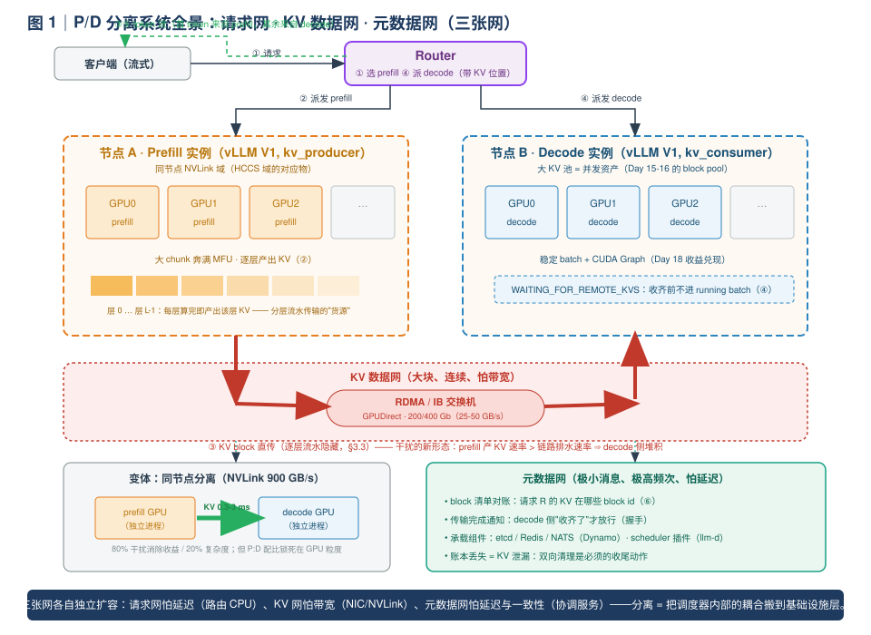
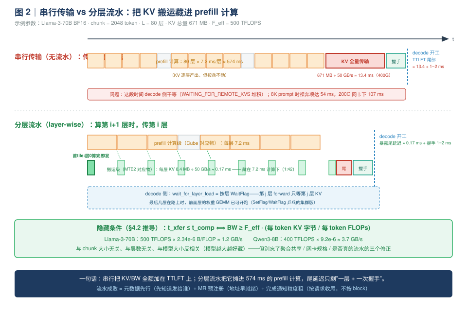
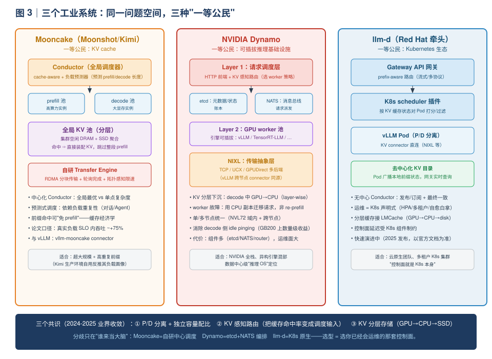
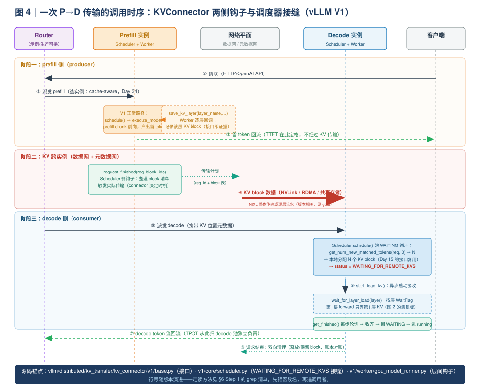

# Day 30｜P/D 分离（二）：怎么做——介质、流水与三个工业系统

> **本周主线（Week 5）**：从"单实例内怎么跑得快"（W1-W4）升级到"一个集群怎么跑得好"。P/D 分离占三天：Day 29 讲**为什么**（把干扰算出来），今天讲**怎么做**，Day 31 动手搭。
>
> **本日定位**：Day 29 的结论是"把两个资源池拆开，各自奔满"。但"拆开"两个字落到工程上，意味着三个全新的问题——**KV 怎么传**（介质与拓扑）、**怎么藏**（把传输藏进计算）、**怎么管**（元数据、路由与全局缓存）。今天把这三个问题讲透，再读三个工业系统（Mooncake / NVIDIA Dynamo / llm-d），看它们在同一个问题空间里做出的不同取舍。源码主线仍然是 vLLM V1 的 `KVConnector` 插件体系。

---

## 0. 前情回顾与本日位置

| 前情 | 关键结论 | 今天怎么用 |
|---|---|---|
| Day 29 | 混跑干扰三条路径（批同步排队 / 访存争抢 / 形态互斥）；chunk 可行窗口可能为空；分离收益主要在 goodput（1.5-3×） | "为什么分"已经论证完，今天回答"怎么分" |
| Day 2 | KV 每 token 显存 = `2·L·H_kv·D·b`（GQA 用 kv_heads） | 同一个公式今天换个用途：算 **KV 传输量** |
| Day 15-16 | block pool / block table / 引用计数 / block hash | 传输的"货物"就是这些 block——元数据要能精确到 block 级 |
| Day 17 | attention backend 的插拔接口设计 | `KVConnector` 与它同构：**接口即架构决策**，今天再验证一次 |
| Day 18 | full CUDA Graph 要求静态形状 | 分离后 decode 实例 batch 形态稳定，才配得上 full CG——分离的隐性收益 |
| Day 25-28 | 投机解码 = 用计算换访存 | 与 P/D 分离正交：decode 池上照样可以叠投机 |
| Day 29 §5.3 | `KVConnectorBase_V1` 的五个钩子、`WAITING_FOR_REMOTE_KVS` 状态 | 今天的源码主线，展开成完整时序 |

**今日一句话论点**（先给结论，全文都在论证它）：

> P/D 分离的工程本质，是把 Day 29 的"两个资源池"落成**三张网**：请求网（谁算 prefill、谁算 decode）、KV 数据网（走 NVLink 还是 RDMA、要不要流水）、元数据网（谁记账、谁路由）。**传 KV 不是拷一个大文件**——它是带 block 级元数据、带生命周期、必须与计算重叠的**分布式状态迁移**。三张网的每种设计选择，都对应一次"带宽 vs 延迟 vs 复杂度"的三角交换。

---

## 1. 今日学习目标

学完后你应该能：

1. **画出** P/D 分离系统的全景图：请求流、KV 数据流、元数据流三条路径，并说出每个环节引入的新故障域；
2. **手算** 一次 KV 传输的数据量与传输时延：给定模型、prompt 长度、链路类型（NVLink / PCIe / RDMA 200G/400G / 共享存储），3 分钟内给出毫秒级数字；
3. **推导** 分层流水（layer-wise pipelining）隐藏传输的充要条件 `BW ≥ F_eff · k/(2P)`，并解释为什么"单条 prefill 流只需要几 GB/s，但工程上 NIC 仍然会紧张"；
4. **走读** vLLM V1 的 `KVConnector` 调用链：producer 侧 `save_kv_layer → request_finished`，consumer 侧 `get_num_new_matched_tokens → start_load_kv → wait_for_layer_load`，以及 `WAITING_FOR_REMOTE_KVS` 在调度器里的接缝；
5. **对比** Mooncake / NVIDIA Dynamo / llm-d 三个系统的设计取舍：各自把什么当作"一等公民"，控制面怎么组织，适合什么样的团队与规模；
6. 给定一个具体场景（模型、节点数、NIC 规格、负载画像），**决策** 同节点分离还是跨节点分离、要不要上分层流水。

---

## 2. 核心概念速查

| 术语 | 一句话定义 | 首次深入 |
|---|---|---|
| **同节点分离** | prefill / decode 是同一台机器上的不同进程（不同 GPU 组），KV 经 NVLink/PCIe P2P 直传 | §3.2 |
| **跨节点分离** | prefill / decode 分布在不同机器，KV 经 RDMA（IB / RoCEv2）网络传输 | §3.2 |
| **分层流水传输** | prefill 算到第 i 层时就把第 i-1 层的 KV 发出去，用计算时间掩盖传输时间 | §3.3 |
| **GPUDirect RDMA** | NIC 直接读写 GPU 显存，不经主机内存中转（zero-copy） | §3.2 |
| **TTLFT** | time-to-last-fragment... 本教程指"decode 侧收到完整 KV 前的额外等待"，分离新增的关键路径项 | §4.3 |
| **KVConnector** | vLLM V1 中解耦"KV 从哪来/到哪去"的插件接口，SCHEDULER / WORKER 两种角色 | §5 |
| **NIXL** | NVIDIA Inference Xfer Library，跨 TCP/UCX 后端的传输抽象库，vLLM 跨节点主力 connector 的底座 | §5.3 |
| **Transfer Engine** | Mooncake 自研的 RDMA 传输层：分块传输 + 轮询完成检测，与计算重叠 | §3.5 |
| **Conductor** | Mooncake 的全局调度器：cache-aware + 负载预测，KV cache 是调度的一等公民 | §3.5 |
| **全局 KV 池** | 把集群中 DRAM/SSD 的空闲容量统一成跨实例的 KV 缓存资产（GPU→CPU→SSD 分层） | §3.4 |
| **cache-aware routing** | 路由器按"哪个实例已有这条前缀"派发请求（Day 34 展开） | §3.4 |
| **内存注册（MR）** | RDMA 传输前把 GPU 缓冲区注册给 NIC，建立远程可寻址的 key——传输前置开销 | §3.3 |

---

## 3. 原理深入：三个工程问题

### 3.1 全景：分离系统 = 三张网

Day 29 图 3 把分离系统画成"两个池 + 一根 KV 传输箭头"。今天把这根箭头放大，你会看到任何生产级 P/D 分离系统（包括 vLLM 的 disaggregated serving）都由**三张网**组成：

1. **请求网（控制流）**：客户端 → 路由器 → prefill 实例（算完首 token）→ 路由器 → decode 实例（续写）→ 路由器 → 客户端。路由器是新的单点/瓶颈候选，它必须知道每个请求"prefill 在哪、decode 该去哪"。
2. **KV 数据网（数据流）**：prefill 实例的 GPU 显存 → decode 实例的 GPU 显存。介质可能是 NVLink（同节点）、PCIe P2P、RDMA（跨节点）甚至共享文件系统。这是今天的主角。
3. **元数据网（账本）**：谁记录"请求 R 的 KV block 在哪个实例的哪些 block id"？谁通知 decode 侧"KV 到齐了"？路由器、prefill、decode 三方如何对账？生产系统用 etcd / Redis / NATS 这类低延迟协调组件承载它。

> **先立一个直觉**：请求网走的是"小消息、高频次"，元数据网走的是"极小消息、极高频次"，两者都怕**延迟**；KV 数据网走的是"大块、连续"，怕的是**带宽**。三张网对网络的要求完全不同——这就是为什么严肃的分离部署需要专门的存储网络（RDMA）而控制面可以用普通以太网。



对着图 1 走一遍请求 R 的完整生命周期（记熟这六步，§5 的源码时序就是它的实现）：

| 步骤 | 发生在 | 动作 | 新增延迟项 |
|---|---|---|---|
| ① | Router | 收到请求，选 prefill 实例（cache-aware，Day 34） | 路由决策 |
| ② | Prefill 实例 | 计算 prompt 的 KV；**逐层**产出 KV（流水传输的窗口就在这里） | — |
| ③ | Prefill → Decode | KV block 沿数据网传输；元数据网同步"block 清单 + 位置" | `T_xfer`（今天的核心变量） |
| ④ | Decode 实例 | 收 KV 入 paged 池；收齐前请求停在 `WAITING_FOR_REMOTE_KVS`，**不占 running batch** | 等待尾部传输 |
| ⑤ | Decode 实例 | 收齐 → 进 running → 逐 token 生成，token 流经 router 回客户端 | — |
| ⑥ | 元数据网 | 请求结束，双向清理：prefill 侧释放/保留 block（供前缀复用），decode 侧记账 | — |

**关键认知（对比 Day 29 的干扰路径①）**：在 colocated 系统里，"prefill 挤占 decode"发生在**同一个调度队列**里；在分离系统里，这个冲突被搬到了 **KV 数据网的带宽**上——prefill 产 KV 的速率一旦超过链路排水速率，decode 侧的 `WAITING_FOR_REMOTE_KVS` 队列就会堆积，表现为 **TTLFT 恶化**（decode 迟迟开不了工）。**干扰没有被消灭，而是被换了一种形态、挪到了一张可独立扩容的网上**——这正是"分离"的本质：把耦合从调度器内部搬到基础设施层，换来独立扩展的自由度。

### 3.2 问题一：KV 怎么传——介质与拓扑

#### 3.2.1 介质菜单与数量级

先复习 Day 2 的公式，今天换个用途——算**传输量**：

$$
KV_{bytes}(N) = \underbrace{2}_{K+V} \cdot L \cdot H_{kv} \cdot D \cdot b \cdot N \;/\; \text{TP}
$$

（`N` 为 prompt token 数；GQA 用 `H_kv` 而非总 head 数；TP 下 KV head 已切分，故除以 TP；若 `H_kv < TP` 存在复制，另计。）

常用链路的单向有效带宽（数量级记忆版）：

| 链路 | 单向带宽 | 典型场景 |
|---|---|---|
| NVLink 4（H100 SXM，18 lane） | 900 GB/s（标称；P2P 实测 60-80%） | 同节点 GPU 间 |
| NVLink 3（A100 SXM） | 600 GB/s | 同节点 GPU 间 |
| PCIe Gen5 x16 | 64 GB/s | 同节点非 NVLink 域 / 经 host 中转 |
| RDMA 400Gb（IB / RoCEv2） | 50 GB/s | 跨节点专用存储网 |
| RDMA 200Gb | 25 GB/s | 跨节点（多租户集群常见规格） |
| TCP 100Gb（UCX TCP fallback） | ~10 GB/s | 无 RDMA 网络的降级路径 |
| 共享文件系统（NFS/Lustre） | 0.5-3 GB/s | SharedStorageConnector 路线 |

把两个模型的 KV 传输量与时延摆在一起（BF16、TP=1，**请自己重算一遍**，这张表是今天面试数字的来源）：

| KV 量 | Qwen3-8B（144 KB/token）@ 2048 | Llama-3-70B（320 KB/token）@ 2048 | Llama-3-70B @ 8192 |
|---|---|---|---|
| 传输数据量 | 302 MB | 671 MB | 2.68 GB |
| NVLink 900 GB/s | **0.34 ms** | **0.74 ms** | **3.0 ms** |
| PCIe Gen5 | 4.7 ms | 10.5 ms | 42 ms |
| RDMA 400 Gb | 6.0 ms | 13.4 ms | 54 ms |
| RDMA 200 Gb | 12.1 ms | 26.8 ms | 107 ms |
| NFS ~1 GB/s | 302 ms | 671 ms | 2.7 s |

> **读表姿势**（三个白板级别的结论）：
> 1. **NVLink 上 KV 传输近乎免费**：70B @ 2K 只有 0.74 ms——同节点分离几乎不付传输代价；
> 2. **RDMA 是"毫秒级"而不是"秒级"**：400G 网卡上 70B @ 8K 也只有 ~54 ms——只要能**藏进**几百毫秒的 prefill 计算，就不在关键路径上（怎么藏见 §3.3）；
> 3. **共享文件系统是数量级地慢**：2.7 秒的 KV 搬运意味着 decode 侧干等——所以 `SharedStorageConnector` 是功能验证/冷缓存共享用的，不是性能路径。

#### 3.2.2 同节点分离 vs 跨节点分离

介质的选择本质上是在两种拓扑之间做决策：

| 维度 | 同节点分离（NVLink 传 KV） | 跨节点分离（RDMA 传 KV） |
|---|---|---|
| 传输介质 | NVLink（900 GB/s）/ PCIe P2P | RDMA（25-50 GB/s）+ GPUDirect |
| KV 传输时延 | 亚毫秒~毫秒级，**几乎可忽略** | 毫秒~百毫秒级，**必须流水隐藏** |
| 分离收益 | 消除调度层干扰（Day 29 三条路径） | 干扰消除 + **独立弹性伸缩** + 异构硬件 |
| 资源划分粒度 | GPU 级、**静态**（8 卡怎么分 P/D 要提前定） | 实例/池级、**动态**（可按时段调整 n_p:n_d） |
| 扩展上限 | 单节点 8 GPU（NVLink 域） | 数千节点 |
| 新增复杂度 | 低：进程间直传，无需网络调优 | 高：无损网络（PFC/ECN）、MR 注册、UCX 调参、超时处理 |
| 失败域 | 节点整机 | 节点 + 网络 + 元数据服务，**三个** |
| 典型选择 | 中小规模、SLO 中等、已有大节点 | 大规模弹性、SLO 严、prefill/decode 负载波动大 |

**"同节点分离"最容易被低估**。它是"最小代价的分离"：在一台 8 卡 H100 上，2 卡跑 prefill、6 卡跑 decode（两个独立 vLLM 进程 + 一个 router），就能拿到 Day 29 论证的绝大部分干扰消除收益，而 KV 传输成本被 NVLink 压到亚毫秒——不需要 RDMA、不需要无损网络、不需要分层流水。代价是配比锁死在 GPU 粒度：负载画像一变（对话 → 摘要），2:6 的划分就不再最优，而你无法"再加半张 prefill 卡"。

> **面试金句**："同节点分离拿走 80% 的干扰消除收益，付出 20% 的复杂度；跨节点分离拿走剩下的 20%（弹性 + 异构 + 规模），付出 80% 的复杂度。规模没到之前，NVLink 域内分离是被严重低估的选项。"

**GPUDirect RDMA（跨节点的 zero-copy 前提）**：NIC 直接 DMA 读写 GPU 显存，绕过主机内存。若不支持，KV 要走 GPU→host DDR→NIC 的两跳：带宽受 PCIe 限制（64 GB/s，8 卡共享）、时延翻倍、还占用宝贵的主机内存做 staging buffer。生产部署前要确认：网卡驱动支持 GPUDirect RDMA（`nvidia-peermem` 模块加载）、交换机侧无损配置（RoCE 需要 PFC/ECN）。这是 Day 31 实验环境检查清单的一部分。

> **昇腾视角（你的主场）**：GPU 集群的"NVLink 域"对应昇腾的 HCCS 域（8 卡 PCB 内互联）；跨节点 RDMA 对应 RoCE/IB。你做过的"跨 DDR 搬数据要先过 L2/Cache 还是直接 DMA"的选择，与 GPUDirect vs host-staging 是同一个问题在不同尺度的重演。HCCL 面向集合通信（all-reduce），而 KV 传输需要的是**点对点、一方写入、块粒度**的语义——这就是 vllm-ascend 上做 P/D 分离要解决的真实接口缺口（对接 Day 36+ 项目 A 选型）。

### 3.3 问题二：怎么藏——分层流水传输

#### 3.3.1 串行传输的问题

最朴素的实现：prefill 全部算完 → 把整段 KV 从头传到尾 → 通知 decode 开工。此时 KV 传输**全额暴露**在关键路径上：

$$
T_{serial} = T_{prefill} + \underbrace{\frac{KV_{bytes}}{BW}}_{\text{裸奔的传输}} + T_{handshake} + T_{first\_decode}
$$

70B @ 8192 token 在 400G RDMA 上这一项就是 **54 ms**；若网卡被多条并发 prefill 共享（排队），还会更长。它不伤 TTFT（首 token 由 prefill 侧生成），但直接恶化 **decode 侧第一个 token 的到达时间**（TTLFT），并在高压时让 `WAITING_FOR_REMOTE_KVS` 队列越积越长——这就是图 1 里说的"干扰的新形态"。

#### 3.3.2 分层流水：把传输变成"搬运级"，藏进"计算级"

回忆你的昇腾经验（Week 5 README 的经验地图）：**无 Queue 手工流水线——用 SetFlag/WaitFlag 管理多级乒乓，首 tile 半载隐藏 MTE2 延迟**。把它逐字翻译到 P/D 分离：

| 昇腾流水线 | P/D 分离的对应物 |
|---|---|
| 计算级：Cube 算 tile (i+1) | prefill 前向计算层 i+1（`t_comp` 每层 ~7ms，70B@2048） |
| 搬运级：MTE2 搬 tile i 进 L1 | 传输层 i 的 KV 到 decode 侧（`t_xfer` 每层 ~0.17ms @400G） |
| 首tile半载：第一次搬半个 tile 让流水尽早启动 | 第 0 层 KV 算完立即首发，不等整请求 |
| SetFlag/WaitFlag 乒乓 | 分块 watermark + 完成轮询（decode 侧"收到 flag 才放行该层 forward"） |
| 搬运藏进计算 ⟺ 搬运时间 < 计算时间 | 隐藏条件 `t_xfer ≤ t_comp`（§4.2 推导） |



对照图 2，流水的规则只有两条：

1. **producer 侧**：第 i 层 attention 算完，该层 KV block 即刻可发（层内还可按 chunk 细分粒度——chunked prefill 时每一 chunk×每一层都是一次"tile"）；
2. **consumer 侧**：decode 的第 j 层 forward 只需要第 j 层 KV——所以 decode 实例甚至可以在**最后几层 KV 还在路上时就启动前 j 层的权重 GEMM**。vLLM V1 接口里的 `wait_for_layer_load(layer_name)` 就是这个"按层 WaitFlag"：它出现在 forward 的层间路径上，收到才放行（§5.2）。

流水后的暴露尾延迟只剩：

$$
T_{tail} \approx \underbrace{t_{xfer}(\text{最后 1\text{-}2 层})}_{\text{亚毫秒}} + \underbrace{T_{handshake}}_{\text{RPC，毫秒级}}
$$

> **注意握手常比传输贵**：0.17 ms 就能传完一层 KV，但一次跨节点元数据 RPC（"传完了"→"知道了"）通常 0.5-2 ms。这就是为什么元数据网要走低延迟组件（etcd/Redis/NATS/自定义 socket），且**通知粒度要粗**（按请求收尾时通知一次，而不是按 block 通知 L 次）。

#### 3.3.3 两个工程前置项

- **内存注册（MR）提前化**：RDMA 要求传输前把 GPU 缓冲区注册给 NIC（pin + 建 key）。正确做法是**注册整个 KV block pool 一次、后续传输复用注册**（vLLM 的 paged pool 天然适合——地址固定、大小统一）；如果 per-request 现注册，ms 级的注册开销会吃掉流水收益。
- **传输计划的确定性**：producer 必须知道"这段 KV 发给哪个 decode 实例的哪些 block"——即 §3.4 的账本要先于传输完成。路由决策晚 = 流水开天窗。

### 3.4 问题三：怎么管——元数据、路由与全局 KV 池

#### 3.4.1 block 级账本与四步握手

传输的"货物"是 Day 15-16 学过的 KV block，所以账本的最小粒度也是 block。一次完整的 P→D 传输，元数据网上要走四类消息：

| # | 消息 | 方向 | 内容 |
|---|---|---|---|
| 1 | 传输计划 | Router/P → D | `req_id`、block 清单（D 侧目标 block id）、层数、dtype |
| 2 | 数据搬运 | P → D | KV block 本体（数据网，走分层流水） |
| 3 | 完成通知 | P → D（或 D 自己轮询） | "L 层全部到齐"——触发 `WAITING_FOR_REMOTE_KVS → WAITING` |
| 4 | 释放/保留 | D → P | 请求结束：P 侧 block 释放还是留作前缀复用（Day 16 的引用计数跨实例化了） |

账本丢失或通知丢失 = **KV 泄漏**（P 侧 block 永远等不到释放）或**僵尸等待**（D 侧请求永远 WAITING）。所以第四步不是可选的"nice to have"，而是资源正确性的兜底——实现上通常还有超时 + re-prefill fallback（见 §3.4.3）。

#### 3.4.2 从"实例内 prefix caching"到"全局 KV 池"

Day 16 的 prefix caching 只在**单个实例内**复用 block hash。分离架构打开了一个更大的想象空间：**prefill 最贵的产物是 KV，而 KV 是可存储、可寻址、可复用的资产**——

- 把集群中空闲的 DRAM / SSD 聚合成**全局 KV 池**（分层：GPU HBM → 主机 DRAM → SSD）；
- 路由器按"哪个实例/哪层存储已有这条前缀"派发请求（**cache-aware routing**，Day 34 主线）；
- 命中足够多时，prefill 甚至可以**整段跳过**——直接从池里装配 KV（Mooncake 的核心卖点，见 §3.5）。

这就是"KVCache-centric"的含义：**调度、路由、存储三层都围绕 KV 的位置与生命周期做决策**，而不是把 KV 当作模型的附属品。

#### 3.4.3 新故障域与兜底

| 故障 | 后果 | 兜底 |
|---|---|---|
| decode 实例挂掉 | 它独占的 KV 丢失（KV 不像权重可重载） | 请求回退 re-prefill（保数据不保延迟）；CPU 侧留副本可迁移（Dynamo 路线） |
| 传输超时/失败 | D 侧僵尸等待 | 超时检测 → re-prefill fallback 或重传 |
| 元数据服务不可用 | 全局路由瘫痪 | HA 部署；降级为无缓存感知的轮询路由 |
| Router 单点 | 请求网全断 | 无状态化 + 多副本（llm-d 用 K8s 原生副本） |

> **面试提醒**：Day 29 说过分离引入"三个新故障域"（路由 / KV 传输 / 双池容量管理）。今天你能逐个说出**后果 + 兜底**，就完成了从"知道有风险"到"能设计应对"的升级。

### 3.5 三个工业系统的取舍：Mooncake / NVIDIA Dynamo / llm-d

同一个问题空间（P/D 分离 + KV 感知路由 + 分层缓存），三个系统给出了三种"重心完全不同"的答案。**读它们的正确姿势不是背架构图，而是问：它们各自把什么当作一等公民？代价是什么？**



#### Mooncake：KVCache-centric（Kimi / 月之暗面的生产平台）

- **一等公民：KV cache**。架构围绕一个全局 KV 池组织：集群中空闲的 DRAM/SSD 聚合成缓存层，prefill 产出的 KV 落池，后续请求命中则**跳过对应段的 prefill 计算**。
- **全局调度器 Conductor**：以 SLO 为优化目标做 cache-aware 调度，并且用**负载预测器**（按请求输入前缀匹配历史请求，预测 prefill/decode 长度）决定准入与实例选择——预测式调度是它区别于"反应式"系统的关键。
- **自研 Transfer Engine**：基于 RDMA 的分块传输 + 轮询式完成检测，与计算重叠，且做拓扑感知的带宽分配（不同链路不同限速）。
- **取舍**：为了全局最优（缓存命中率 + SLO），接受了一个**中心化 Conductor** 的复杂度与潜在瓶颈；预测器依赖负载有重复性（Kimi 的对话负载恰好如此）。
- **战绩**：论文（arXiv:2407.00079）报告在 Kimi 真实长上下文负载上，满足 SLO 前提下吞吐提升约 75%（数字以论文为准）。与 vLLM 的接口：`vllm-mooncake` 包提供 MooncakeStore connector。

#### NVIDIA Dynamo：数据中心级推理 OS

- **一等公民：可插拔的推理基础设施**。两层架构：Layer 1 是请求调度层（HTTP 前端 + KV 感知路由），Layer 2 是 GPU worker 池——每个 worker 可以是 vLLM、TensorRT-LLM 等不同引擎，**引擎可插拔**是它的旗帜。
- **基础设施选型**：etcd（元数据/状态）+ NATS（消息总线）+ **NIXL**（传输抽象层：TCP / UCX / GPUDirect 多后端）。NIXL 后来也成为 vLLM 跨节点 connector 的底座（§5.3）。
- **KV 管理特色**：decode 进行中把 KV 从 GPU 分层下沉到 CPU（layer-wise offload）；decode worker 故障时，用 CPU 副本把请求**迁移**到其他 worker，而不是 re-prefill。
- **取舍**：换的是"全栈通用性"——单节点/多节点统一、引擎异构、与 NVIDIA 硬件栈深度协同；代价是组件多（etcd/NATS/router/worker），运维面大。官方博客宣传在 GB200 NVL72 上跑 DeepSeek-R1 有数量级吞吐改善（主要来自消除 decode 侧 idle pinging 等，数字随配置，以原文为准）。

#### llm-d：Kubernetes 原生的去中心化路线

- **一等公民：K8s 生态**。不做独立控制面，而是把能力长进 Kubernetes：**调度感知**用 K8s scheduler 框架插件（按 KV 缓存状态打分/过滤 Pod），**路由**用 Gateway API 的 prefix-aware 网关，**运行时**就是 vLLM Pod（P/D 分离直接用 vLLM 的 KV connector），**分层缓存**接 LMCache（GPU→CPU→disk）。
- **去中心化 KV 目录**：不设全局 Conductor；各 Pod 通过发布/订阅广播本地前缀缓存状态，网关实时查询后做路由决策——**用最终一致性换掉了中心单点**。
- **取舍**：云原生团队"零新概念"接入、多租户隔离与伸缩交给 K8s；代价是控制面延迟受 K8s 组件制约，极致的全局最优（如预测式调度）目前不如中心化方案激进。
- **定位**：Red Hat 牵头的开源项目（2025 年发布，仍在快速演进，细节以官方文档为准）。

#### 一张表收拢（建议抄进 A4 总结）

| 维度 | Mooncake | NVIDIA Dynamo | llm-d |
|---|---|---|---|
| 一等公民 | KV cache（全局池 + 预测调度） | 推理基础设施（引擎可插拔） | K8s 生态（声明式运维） |
| 控制面 | 中心化 Conductor | etcd + NATS + router | K8s scheduler 插件 + Gateway |
| KV 传输 | 自研 Transfer Engine（RDMA+重叠） | NIXL（TCP/UCX 抽象） | 复用 vLLM connector（NIXL 等） |
| 缓存复用 | 全局池，可跳过 prefill | GPU→CPU 池化 + 迁移 | LMCache 分层 + 路由感知 |
| 失败处理 | 请求级回退 | CPU 副本迁移 worker | K8s 原生自愈 |
| 最适合 | 超大规模 + 高重复前缀（对话/Agent） | NVIDIA 全栈、异构引擎混部 | 云原生多租户团队 |
| 与 vLLM 关系 | vllm-mooncake connector | 可编排 vLLM worker | 建在 vLLM/KServe 之上 |

> **面试金句**："三者不是竞争关系，而是同一问题空间的三种重心选择：Mooncake 押注**缓存经济学**（KV 是资产），Dynamo 押注**基础设施抽象**（传输与引擎都解耦），llm-d 押注**生态位**（K8s 就是控制面）。选型先问自己：我的负载前缀重复率高吗？我的团队运维半径到哪？"

---

## 4. 数学推导（面试白板级）

### 4.1 传输量、TP 与量化 KV 的修正

§3.2.1 的基础公式之上，两个常考修正：

- **TP 分片**：`H_kv` 按 TP 切分（GQA 下 `H_kv=8`、`TP=8` 时每 rank 1 个 KV head），每 rank 传输量 = 总量/TP。**跨实例传输的是"每 rank 各自的 KV"**——若 decode 实例 TP 拓扑与 prefill 不同（异构分离），要对齐 rank 映射，这是个真实的工程坑。
- **KV 量化**：FP8 KV cache（Day 23）把 `b` 从 2 降到 1，**传输量与时延直接减半**——KV 量化不只是省显存，还省网络。这对跨节点分离是个"白捡"的优化。

**测量验证（实验 Step 3 的原理）**：有效带宽 = 传输数据量 / 实测耗时 的**斜率**（扫多个 prompt 长度做线性拟合），比单点除法可靠——单点包含了握手、MR 注册等固定开销（截距）。

### 4.2 分层流水的隐藏条件（本日核心推导）

**模型**：prefill 侧 chunk 大小 `N_c` 个 token，共 `L` 层。设 `F_eff` 为有效算力（FLOPS），`k = 2·L·H_kv·D·b` 为每 token KV 字节数（TP=1），`P` 为参数量。

每层计算时间与每层传输时间：

$$
t_{comp} = \frac{2 P \cdot N_c / L}{F_{eff}}, \qquad t_{xfer} = \frac{k \cdot N_c / L}{BW}
$$

**流水成功 ⟺ `t_xfer ≤ t_comp`**，两边约掉 `N_c/L`：

$$
\boxed{\; BW \;\ge\; F_{eff} \cdot \frac{k}{2P} \;=\; F_{eff} \cdot \frac{\text{每 token KV 字节}}{\text{每 token FLOPs}}\;}
$$

三个值得背下来的性质：

1. **与 chunk 大小无关、与层数无关**（都约掉了）——和 Day 29 的交叉点 `M*` 一样，又是一个"结构不变量"；
2. **只取决于"KV 字节 : FLOPs"的负载比率**。代数字（BF16、TP=1）：
   - Llama-3-70B：`k/(2P) = 327680/140e9 ≈ 2.34e-6` B/FLOP；`F_eff=500` TFLOPS → **`BW_min ≈ 1.2` GB/s**
   - Qwen3-8B：`k/(2P) ≈ 9.2e-6` B/FLOP；`F_eff=400` TFLOPS → **`BW_min ≈ 3.7` GB/s**
3. **模型越大越好藏**：70B 每 token 的"KV 字节/FLOPs"只有 8B 的 1/4——大模型 prefill 的算力密度高，KV 排水需求反而低。

**既然 `BW_min` 只有几个 GB/s，为什么工程上 NIC 还是会紧张？** 三个现实修正（面试的高分点）：

| 修正 | 说明 | 数量级 |
|---|---|---|
| **聚合共享** | 一张 400G NIC（50 GB/s）服务整机 8 个 prefill GPU + decode 侧 ingress 同网卡 | 8×3.7 GB/s ≈ 30 GB/s，已用 60% |
| **多租户规格** | 云上常见 200G 甚至 100G 网卡，且与 NCCL TP 通信共享 | 25 GB/s ÷ 3.7 ≈ 仅 6 路 prefill |
| **不流水就裸奔** | `BW_min` 只对流水的稳态成立；串行模式下暴露的是**全额** `KV/BW`（70B@8K@200G = 107 ms） | 与稳态差 2 个数量级 |

结论：**"理论带宽够"与"工程上不卡"之间隔着：共享、规格、以及是否真的把流水实现了**。这也是读 Mooncake/Dynamo 论文时要重点看的部分——它们都在这三个修正点上花了真功夫。

### 4.3 分离下的首 token 时延分解与 goodput 回扣

用户感受到的首 token 时延（分离形态）：

$$
TTFT_{pd} = T_{queue}^{p} + T_{prefill} + T_{route} \quad(\text{首 token 由 prefill 侧生成，不经过传输})
$$

$$
TTLFT = TTFT_{pd} + T_{meta} + T_{tail} + T_{first\_decode} \quad(\text{decode 侧首 token 的到达})
$$

- 流水做对了，`T_tail` 是亚毫秒级，`T_meta`（握手）是毫秒级——**元数据面反而成了主要新增项**；
- 串行实现则 `T_tail = KV/BW` 全额暴露。

**回扣 Day 29 §4.4 的 goodput 模型**：分离系统把干扰项从 TPOT（混跑尖刺）搬到了 TTLFT（传输尾部）。两边的 SLO 预算分配是镜像问题：colocated 给 chunk 的预算 vs 分离给 `T_meta + T_tail` 的预算（经验值：控制在 TTFT SLO 的 10% 以内）。**goodput 收益 1.5-3× 的前提，就是这条新增路径被压到足够短**——否则分离只是把违约从 TPOT 挪到了 TTFT。

---

## 5. 关键代码与调用链（vLLM V1）

### 5.1 接口总览：KVConnector 的两种角色

Day 29 §5.3 已经给过 `KVConnectorBase_V1` 的方法清单，今天补上**角色视角**：每个 connector 实例化两次——SCHEDULER 角色（活在调度进程里，管账本与状态机）和 WORKER 角色（活在执行进程里，管真正的数据搬运）：

```
vllm/distributed/kv_transfer/kv_connector/v1/base.py
└─ class KVConnectorBase_V1
   ├─ role = KVConnectorRole.SCHEDULER / WORKER     # 同一 connector 的两种化身
   │
   ├─ [SCHEDULER] get_num_new_matched_tokens()      # 消费侧："这个请求能从远端拿多少 KV"
   ├─ [SCHEDULER] get_finished()                    # 消费侧：轮询"哪些请求的 KV 收齐了"
   ├─ [SCHEDULER] build_connector_meta()            # 调度输出 → worker 的元数据桥
   │
   ├─ [WORKER]   start_load_kv() / wait_for_layer_load()   # 消费侧：异步收 + 按层 WaitFlag
   ├─ [WORKER]   save_kv_layer() / request_finished()      # 生产侧：逐层记账 + 收尾触发传输
   └─ [SCHEDULER+WORKER] request_finished()         # 双向生命周期钩子（释放/保留 block）
```

配置入口是启动参数 `--kv-transfer-config`（JSON）。跨节点 NIXL 的最小配置长这样（**字段名随版本演进，以当版 `examples/` 与 `docs` 为准**）：

```bash
# Prefill 实例（生产者）
vllm serve Qwen/Qwen3-8B --port 8001 \
  --kv-transfer-config '{
    "kv_role": "kv_producer",
    "kv_connector": {
      "module": "vllm.distributed.kv_transfer.kv_connector.v1.nixl_connector",
      "class_name": "NixlConnector"
    }}'

# Decode 实例（消费者）：同款 connector，"kv_role": "kv_consumer"
```

配置由 `vllm/config/kv_transfer.py` 的 `KVTransferConfig` 承载，`kv_connector_factory.py` 按 `module/class_name` 动态实例化——与 Day 17 attention backend 的注册机制同构。角色（producer/consumer）决定该实例收到请求后走 prefill 路径还是"等 KV"路径。

### 5.2 一次 P→D 传输的完整调用时序



对着图 4，把六个关键接缝在源码里的落点列出来（先记函数名，行号用 §6 Step 1 的 grep 自己锚定）：

| # | 接缝 | 源码落点（模块级） | 行为 |
|---|---|---|---|
| ① | 生产侧逐层记账 | `gpu_model_runner` 在前向路径对刚完成 prefill 的请求调 `save_kv_layer(layer_name, ...)` | 记录每层 KV block 位置；connector 可选择当场发或攒着 |
| ② | 生产侧收尾触发 | `request_finished(req, block_ids)`（SCHEDULER 角色） | 整理 block 清单 → 经元数据通道通知对端 → 发起传输 |
| ③ | 消费侧预分配 | `scheduler.schedule()` WAITING 循环里 `get_num_new_matched_tokens(req, 0)` | 返回 N → 走 Day 15 的 `KVCacheManager` 分配本地 block |
| ④ | 调度器接缝 | `RequestStatus.WAITING_FOR_REMOTE_KVS`（Day 29 已见过） | 收齐前**不入 running**——不占 decode batch，也不被抢占逻辑骚扰 |
| ⑤ | 消费侧按层放行 | worker 的 `wait_for_layer_load(serialized_meta, layer_name)` | 图 2 的"按层 WaitFlag"，出现在层间 forward 路径上 |
| ⑥ | 收齐唤醒 | `get_finished()` 每个 schedule step 轮询 | 返回收齐的 req_ids → 状态回 WAITING → 下一步正常进 running |

> **实现与接口的差距（诚实标注）**：`save_kv_layer` 的逐层签名是**为分层流水预留的**，但各 connector 的实际传输时机不同——NIXL connector 的初版实现是"prefill 完成、`request_finished` 后一次性传输"（图 4 阶段二画的就是这种），逐层重叠是接口预留方向且随版本在演进；SharedStorageConnector 则是落盘/读盘两段式。读源码时先看 `request_finished` / `start_load_kv` 里"真正发起 IO 的那一行"，就能判断该 connector 有没有兑现流水。

### 5.3 三条 connector 路线（按介质选）

| Connector（`kv_connector/v1/`） | 介质 | 定位 | 注意 |
|---|---|---|---|
| `P2PConnector`（及 `P2PNixlConnector`） | NVLink / PCIe P2P | **同节点分离**：两进程直传 GPU 内存 | 配比实验最方便；确认两 GPU 在同一 NVLink 域 |
| `NixlConnector` | UCX（RDMA/TCP 多后端） | **跨节点主力**：Dynamo 同源技术栈 | 侧信道端口、UCX 网卡/TLS 环境变量调优（`VLLM_NIXL_*` / `UCX_*`，随版本变） |
| `SharedStorageConnector` | 共享文件系统 | 功能验证 / 冷 KV 共享 | §3.2 的表：比 RDMA 慢两个数量级，别当性能路径 |
| `MultiConnector` | 组合 | 同节点 P2P + 跨节点 NIXL 混合集群 | 体现"介质无关"的接口价值 |
| `LMCacheConnector` | LMCache 分层 | GPU→CPU→disk 分层缓存/共享 | 与 §3.4.2 的全局池方向对接 |
| （`vllm-mooncake` 外部包） | Mooncake Transfer Engine | Mooncake 生态接入 | 不在 vLLM 主仓，安装独立包 |

可运行示例在仓库 `examples/online_serving/disaggregated_prefill.sh`（两实例 + 最小 router 的脚本版）与 `examples/online_serving/disaggregated_serving/`（多节点 compose 版）——**Day 31 的实验就基于它们**，今天先读脚本里的参数差异（`kv_role`、端口、`max_model_len` 的配合）。

### 5.4 路由层：vLLM 给了接口，没给大脑

vLLM 示例里的 router 只做最小分发；§3.5 三个系统的"大脑"（cache-aware 选实例、容量配比动态调整、失败迁移）才是它们的真正差异所在。这也回答了一个常见困惑：**vLLM 的 P/D 分离是"数据面"完整、"控制面"留白**——传输（connector）、调度接缝（WAITING_FOR_REMOTE_KVS）都进了主仓，而路由智能要么自己写，要么交给 Dynamo/llm-d 这类上层系统。Day 34 讲 cache-aware routing 时会把这块留白补上。

---

## 6. 动手实验：把"介质带宽"变成亲手测过的数字

**目标**：Day 31 才搭完整分离部署，今天做三件轻量的事——源码走读锚定接缝、带宽微基准校准手算表、精读三篇设计文章。约 2 小时 + 阅读时间。

### Step 1｜源码走读（30 分钟，锚定 6 个接缝）

在你的 vLLM 安装目录执行，逐条核对图 4 的编号：

```bash
cd $(python -c "import vllm, os; print(os.path.dirname(vllm.__file__))")

grep -n "class KVConnectorBase_V1" distributed/kv_transfer/kv_connector/v1/base.py
grep -n "def save_kv_layer\|def wait_for_layer_load\|def start_load_kv" \
     distributed/kv_transfer/kv_connector/v1/base.py
grep -n "WAITING_FOR_REMOTE_KV" v1/core/scheduler.py v1/engine/__init__.py   # 接缝④的进出两端
grep -rn "kv_connector.save_kv_layer\|save_kv_layer(" v1/worker/gpu_model_runner.py | head
grep -n "def get_finished\|def request_finished" distributed/kv_transfer/kv_connector/v1/base.py
ls distributed/kv_transfer/kv_connector/v1/                                    # §5.3 的路线清单
```

**记录到笔记**：每个钩子的形参、`KVConnectorRole` 在 `__init__` 里怎么分叉、`request_finished` 里"真正发起 IO 的那一行"在哪（判断该 connector 是否兑现流水）。

### Step 2｜带宽微基准（20 分钟，校准 §3.2 的表）

双卡机器上测 GPU 间 P2P 有效带宽（单卡就测 D2H/H2D，对应 host-staging 路径）：

```python
import torch, time

N_BYTES = 512 * 1024 * 1024  # 512 MB
src = torch.empty(N_BYTES // 2, dtype=torch.bfloat16, device="cuda:0")
dst = torch.empty_like(src, device="cuda:1")          # 单卡改 device="cpu"

for _ in range(5):                                     # 预热（含 MR/映射建立）
    dst.copy_(src)
torch.cuda.synchronize()

times = []
for _ in range(20):
    t0 = time.perf_counter(); dst.copy_(src); torch.cuda.synchronize()
    times.append(time.perf_counter() - t0)
times.sort()
print(f"effective bandwidth = {N_BYTES / times[5] / 1e9:.0f} GB/s")  # 取中位数附近
```

**对拍**：结果落在 §3.2 表的哪一档？（NVLink 域内应见数百 GB/s；同机不同 PCIe 域 / 单卡 D2H 应见 ~50-60 GB/s 量级。）再用 64MB/128MB/1GB 扫一遍做**斜率拟合**——截距就是固定开销（握手/注册），这就是 §4.1 说的测量方法。

### Step 3｜手算填表（15 分钟，换成你的模型）

用 §3.2.1 公式重算下表（以你 Day 6 起在用的 Qwen3-8B 为例，BF16；再算一遍 FP8 KV 的版本）：

| 项目 | 你的数值 |
|---|---|
| 每 token KV 字节（TP=1 / TP=2） | |
| @2048 / @8192 的 KV 总量 | |
| 你的链路（NVLink / PCIe / 200G / 400G）下的传输时延 | |
| 串行暴露 vs 流水尾延迟（§4.2 公式） | |
| 你的 `BW_min`（用实测 `F_eff` 或 Day 3 的 Roofline 数据） | |

### Step 4｜精读三篇设计文章（核心作业，每篇 30-40 分钟）

| 材料 | 读什么 | 带着这三个问题 |
|---|---|---|
| Mooncake 论文（arXiv:2407.00079）§3-4：架构 + 调度 | KV 池分层、Conductor、Transfer Engine | ① 为什么说它"KVCache-centric"，体现在哪些设计上？② 预测器猜什么、错了会怎样？③ 分块传输怎么与计算重叠？ |
| NVIDIA Dynamo 博客 + 仓库（research.nvidia.com / github.com/ai-dynamo） | 两层架构、etcd/NATS/NIXL 分工、GPU→CPU offload | ① 为什么传输要抽象成 NIXL（后端可插拔）？② decode worker 挂了，为什么用迁移而不是 re-prefill？③ 它和 vLLM 是竞争还是分层？ |
| llm-d 文档（llm-d.ai / github.com/llm-d） | scheduler 插件、Gateway 路由、去中心化 KV 目录 | ① 去中心化目录的最终一致性代价是什么？② 哪些能力是"K8s 白拿的"？③ 什么规模/团队适合它？ |

### Step 5｜（可选，Day 31 前置）SharedStorage 冒烟

双进程 + `SharedStorageConnector` + 共享目录，跑通一次 P→D（不追求性能）。目的：在搭 NIXL/RDMA 之前，先验证你对 `kv_role`、router、两实例参数配合的理解——**用最慢的介质跑通最快的认知**。

> **实验记录模板**（三段对照，沿用 Day 13 的格式）：现象（数字/日志）→ 源码机制（对应今天哪个接缝）→ 指标含义（对 TTFT/TTLFT 的影响）。

---

## 7. 面试高频问题

**Q1：P/D 分离后传 KV，为什么不用现成的 NCCL？**
NCCL 为**集合通信**（all-reduce 等，rank 组同步语义）优化，实现走 ring/tree；而 KV 传输是**点对点、单边写、block 粒度、必须与计算重叠**的单播流。用 NCCL send/recv 能跑，但拿不到 RDMA 单边写的零拷贝、细粒度完成通知与多后端（TCP/UCX）可移植性——所以业界统一走向 UCX/NIXL 这类传输抽象（Dynamo 的 NIXL 同时服务 vLLM 和 TRT-LLM）。加分项：点出"传输语义 ≠ 集合语义"后，再补一句 HCCL 在昇腾侧的同位置思考。

**Q2：同节点分离和跨节点分离怎么选？**
§3.2.2 的 80/20 论断：同节点拿走大部分干扰消除收益（NVLink 让传输近免费），复杂度低；跨节点买到弹性伸缩 + 异构硬件 + 规模，但要供养 RDMA 网络与三个新故障域。决策输入：节点规格、负载画像波动度、SLO 严格度、团队运维半径。

**Q3：分层流水为什么能隐藏传输？充要条件是什么？**
算第 i+1 层时传第 i 层。条件 `BW ≥ F_eff · (每 token KV 字节 / 每 token FLOPs)`——与 chunk、层数无关，与模型大小反相关。白板数字：70B 只要 ~1.2 GB/s，8B ~3.7 GB/s。**必补的三个修正**：NIC 聚合共享、多租户网卡规格、以及"是否真的实现了流水"（串行模式暴露全额 `KV/BW`）。

**Q4：一次 KV 传输到底多大？**
现场推：`2·L·H_kv·D·b·N`。Llama-3-70B BF16 = 320 KB/token → 4K prompt 约 1.3 GB；400G RDMA 上 ~27 ms，NVLink 上 ~1.5 ms。再补一刀：FP8 KV 减半、TP 分片除以 TP。

**Q5：decode 实例怎么知道 KV 收齐了？**
元数据网握手：producer `request_finished` 发 block 清单 → 数据网搬运 → 完成通知（或 consumer 轮询 watermark）。调度器侧表现为 `WAITING_FOR_REMOTE_KVS` 状态的进出：收齐 → 回 WAITING → 下一步 schedule 正常入 running。worker 侧 `wait_for_layer_load` 做按层放行。追问点：通知按请求粗粒度做，别按 block 做 L 次。

**Q6：对比 Mooncake / Dynamo / llm-d。**
§3.5 的表 + 金句：三个重心——缓存经济学 / 基础设施抽象 / K8s 生态位。能主动说出"它们不是竞争关系，是同一问题空间的三种重心选择"。

**Q7：P/D 分离引入哪些新故障域？怎么兜底？**
路由单点（无状态化+副本）、KV 传输失败（超时 + re-prefill fallback）、元数据丢失（KV 泄漏/僵尸等待 → 双向对账 + 超时清理）、decode 实例死亡（KV 不可重载 → re-prefill 或 CPU 副本迁移）。每一项都能说出"后果 + 兜底"才算过关。

**Q8：不用 GPUDirect RDMA 会怎样？**
KV 走 GPU→host DDR→NIC 两跳：受 PCIe 限制（~64 GB/s、8 卡共享）、时延翻倍、占用主机内存做 staging。检查项：`nvidia-peermem` 加载、RoCE 的 PFC/ECN 无损配置。

**Q9（昇腾版压轴）：给昇腾集群设计 P/D 分离，传输层怎么做？**
HCCS 域内（8 卡）→ 对应 NVLink 的同节点分离，P2P 直传；跨节点 → RoCE + 主机 DDR staging（昇腾 NIC 的 GPUDirect 能力视硬件代次，需查证），分层流水的"按层 WaitFlag"用事件/通知机制实现。落点：vllm-ascend 的 KV connector（Day 36+ 项目 A 候选）——和 Day 17"给新硬件写 attention backend"是同构面试题。

**Q10：router 怎么选 prefill 实例？**
Cache-aware：查全局 KV 目录/本地广播，选已有该前缀的实例；否则按队列长度/配比负载均衡。展开留到 Day 34。

---

## 8. 今日总结

- **三张网**：请求网怕延迟、KV 数据网怕带宽、元数据网怕延迟与一致性——分离 = 把调度器内部的耦合搬到可独立扩容的基础设施层（图 1）；
- **介质**：NVLink 近免费（0.3-3 ms）→ 同节点分离是"80% 收益 / 20% 复杂度"的选项；RDMA 是毫秒级，必须流水；共享存储是功能验证路径（图 1 变体框 + §3.2 表）；
- **流水**：算第 i+1 层、传第 i 层；隐藏条件 `BW ≥ F_eff·k/2P`，与 chunk/层数无关；暴露的尾延迟只剩"一层传输 + 一次握手"——而**握手常比传输贵**，所以元数据面要低延迟、通知要粗粒度（图 2）；
- **管理**：block 级账本 + 四步握手 + 双向清理；全局 KV 池把 Day 16 的实例内 prefix caching 升维成集群资产；
- **源码**：`KVConnectorBase_V1` 双角色（SCHEDULER/WORKER）六个接缝，`WAITING_FOR_REMOTE_KVS` 是调度器里的裂缝，`save_kv_layer` 的逐层签名是流水预留（图 4）；connector 按介质选型（P2P / NIXL / SharedStorage / Multi）；
- **三系统**：Mooncake 押注缓存经济学，Dynamo 押注基础设施抽象，llm-d 押注 K8s 生态位（图 3）——选型 = 选你已经会运维的控制面。

**带走的三张图**：图 1（三张网全景）、图 2（流水时间线——白板主图）、图 3（三系统对比）。明天（Day 31）把图 4 变成跑起来的进程。

---

## 9. 今日自测题（不看笔记作答）

1. Llama-3-70B BF16、prompt 4096、200G RDMA：串行传输暴露多少毫秒？若实现为分层流水，暴露项变成什么、约多少？
2. 写出隐藏条件公式，并解释为什么它与 chunk 大小、层数都无关，却与模型大小反相关。
3. 为什么说"同节点分离是被低估的选项"？它的代价是什么？
4. vLLM V1 中，`WAITING_FOR_REMOTE_KVS` 状态何时进入、何时退出？退出后请求下一步去哪？
5. decode 实例挂掉，为什么不能"重载 KV"？主流兜底是什么？Dynamo 的差异化做法是什么？
6. Mooncake / Dynamo / llm-d 各自把什么当作一等公民？各举一个"由这个重心推导出来的设计决策"。
7. KV cache 用 FP8 量化，对 P/D 分离架构还有什么额外收益？

---

## 10. 今日产出物

- [ ] **KV 传输手算表**（Step 3）：自己的模型 × 4 种介质 × BF16/FP8，附斜率法实测的有效带宽数字
- [ ] **源码走读笔记**：6 个接缝的函数签名 + `request_finished` 里发起 IO 的那一行（判断是否流水）
- [ ] **三系统阅读笔记**：每篇 3 问的答案（为 Day 31 的 A4 总结《P/D 分离》备料——本日 §3.5 的表可直接扩写）
- [ ] **《P/D 分离工程决策树》一页**：节点内 NVLink 域够吗 → 带宽/隐藏条件算过关吗 → 要不要全局 KV 池 → 控制面选自研/ Dynamo / llm-d
- [ ] （可选）SharedStorage 双进程冒烟记录，Day 31 实验的垫脚石

> **明日预告（Day 31）**：把今天的三张图跑成三个进程——搭最小 P/D 分离部署，实测 TTFT/TTLFT/TPOT 与 colocated 基线的差异，并完成 A4 专题总结《P/D 分离：原理 / 场景 / 权衡 / 失效模式》。
