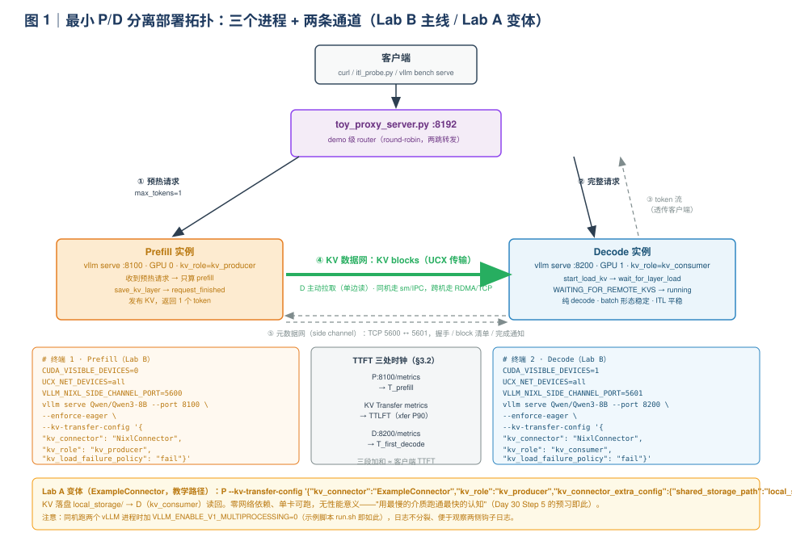
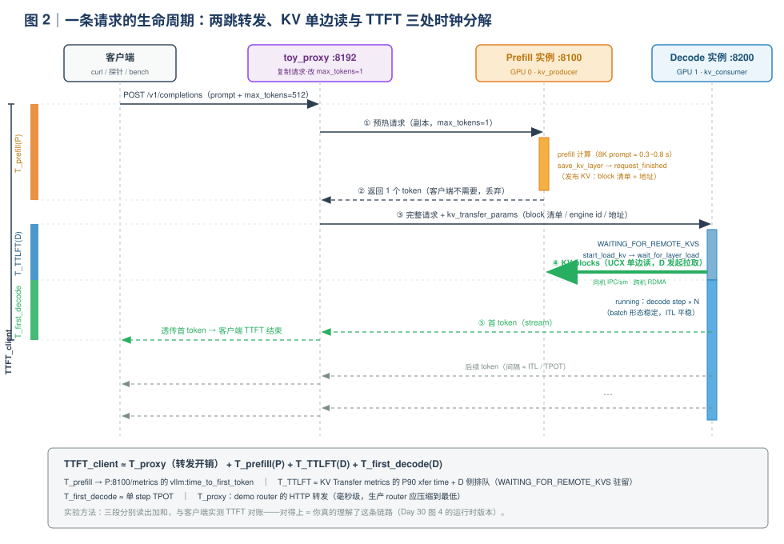
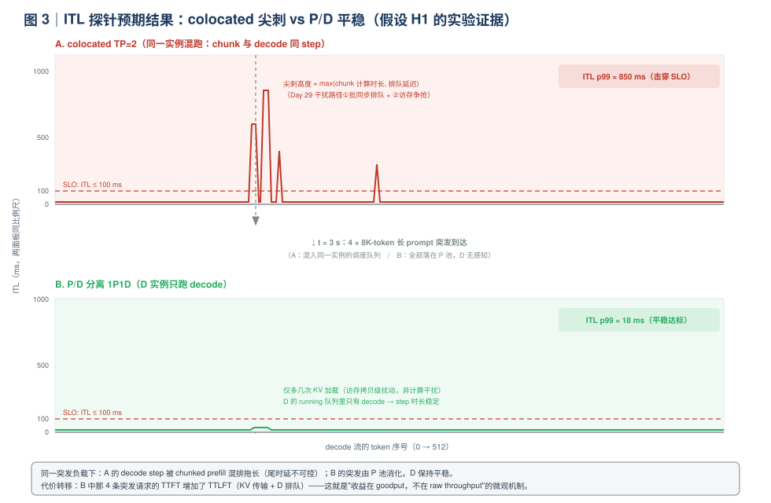

# Day 31｜P/D 分离（三）：动手实验——把"三张网"跑成三个进程

> **本周主线（Week 5）**：P/D 分离三天连打——Day 29 讲**为什么**（把混跑干扰算出来），Day 30 讲**怎么做**（三张网 + `KVConnector` 源码），今天**动手搭**，用实验数据验证前两天的每一个论断。
>
> **本日定位**：生产级 P/D 分离（Mooncake / Dynamo / llm-d）不是一天能搭完的，但它的**最小可用内核**——一个 `kv_producer` 实例、一个 `kv_consumer` 实例、一个会"先问 P 再问 D"的 router——今天 3~4 小时可以完整跑起来，并且每个环节都有指标可观侧。今天的产出除了部署记录，还有本周分量最重的一份材料：**A4 专题总结《P/D 分离》**（Day 35 复盘日的四份 A4 之一）。

> **版本基线（重要）**：disaggregated prefill 目前是 vLLM 的**实验特性**（官方文档原话：experimental and subject to change），flag 与示例路径变动较快——示例目录已从早期的 `examples/online_serving/disaggregated_prefill/` 迁移到 **`examples/disaggregated/`**。本文所有命令以撰写时（2026-10）的 main 分支文档为准；动手前先核对三件事：
> 1. `vllm serve --help | grep kv-`（确认 `--kv-transfer-config` 的当前写法）；
> 2. `ls examples/disaggregated/`（确认示例脚本位置）；
> 3. `cat requirements/kv_connectors.txt`（确认 nixl 的版本 pin）。

**今日时间预算**：Lab A 冒烟 20 min + Lab B 部署 60 min + Lab C 对照实验 90 min + A4 总结 40 min ≈ 3.5 h；Lab D 故障注入为可选加分项（30 min）。

---

## 0. 前情回顾与本日位置

| 前情 | 关键结论 | 今天怎么用 |
|---|---|---|
| Day 29 | 混跑干扰三条路径（批同步排队 / 访存争抢 / 形态互斥）；chunk 可行窗口可能为空；分离收益主要在 goodput（1.5-3×） | Lab C 用 ITL 探针**复现**"colocated 尖刺 vs P/D 平稳"，把白板推导变成实验数据 |
| Day 30 | 三张网（请求网 / KV 数据网 / 元数据网）；`KVConnectorBase_V1` 六个接缝；`WAITING_FOR_REMOTE_KVS`；SharedStorage 冒烟（Step 5 选做） | 今天把 Day 30 图 4 的时序图**跑成真实进程**；Lab D 验证 Day 30 讲的三个新故障域 |
| Day 2 | KV 每 token 显存 = `2·L·H_kv·D·b` | 预估一次传输的字节数，与日志里 `Avg MB per transfer` **对拍** |
| Day 6 | `vllm bench serve` 压测姿势（ShareGPT、并发扫描、p99 指标） | Lab C 的基线测试与扫并发直接复用 |
| Day 13 | 实验记录三段对照法：现象 → 源码机制 → 指标表现 | 今天所有实验记录沿用这个格式 |
| Day 18 | decode 用 CUDA Graph；`--enforce-eager` 关闭编译/capture | Lab 中先用 eager 规避 capture 与 connector 的兼容性问题（生产再开，见 §5 故障表） |
| Day 16 | prefix caching：block hash + 引用计数 | Lab C-3（可选）双向 KV transfer 就是"跨实例的 prefix caching"，为 Day 34 路由铺垫 |

**今日一句话论点**（先给结论，全文都在验证它）：

> 最小 P/D 分离 = **三个进程 + 一条传输通道**。跑起来之后你会确认三件事：① 官方文档明说 disaggregated prefill **不提升 raw throughput**（"Disaggregated prefill DOES NOT improve throughput"）——收益全在 **TTFT 与尾 ITL 的可控性**，必须用 goodput 度量（Day 29 的结论从论文数字变成你自己的实验数据）；② 分离后的 TTFT 可以被**三处时钟**分解——P 的 prefill 时长、KV 传输（TTLFT）、D 的第一个 decode step——每一项都有独立指标可测；③ Day 30 讲的新故障域（lease 过期、传输失败）不再靠脑补，`/metrics` 里就有计数器，Lab D 会亲手触发它们。

---

## 1. 今日学习目标

学完后你应该能：

1. **搭起** 1P1D 的 NIXL 最小部署（producer / consumer / toy proxy），并逐项解释每个 flag 与环境变量（`kv_role`、`VLLM_NIXL_SIDE_CHANNEL_PORT`、`UCX_NET_DEVICES`、`kv_load_failure_policy`）的作用；
2. **讲清** proxy 的 `max_tokens=1` 两跳机制与一条请求的完整生命周期，写出 TTFT 分解公式并说明每一项怎么测；
3. **复现** 核心对照实验：colocated 在长 prompt 突发下的 ITL p99 尖刺 vs P/D 的平稳 ITL，并用 Day 29 的干扰三路径解释现象；
4. **量化** KV 传输：用 `KV Transfer metrics` 日志行与 `vllm:nixl_*` Prometheus 指标读出传输时长、吞吐、字节数，与 Day 2 公式的手算值对拍；
5. **触发并处置** 两个典型故障：KV lease 过期、KV 加载失败（`fail` vs `recompute` 两种策略的行为差异）；
6. **产出** A4 专题总结《P/D 分离：原理 / 场景 / 权衡 / 失效模式》——四段式的第三份（前两份：Day 24 量化、Day 28 投机解码）。

---

## 2. 核心概念速查

| 术语 | 一句话定义 | 首次深入 |
|---|---|---|
| **kv_producer / kv_consumer** | NixlConnector 的两种角色：prefill 实例生产 KV，decode 实例消费 KV（`kv_both` 已废弃，issue #33702） | §5 |
| **toy_proxy_server.py** | 官方测试用的最小 router：把请求先发给 P（`max_tokens=1`）再转发给 D | §5.3 |
| **`max_tokens=1` 两跳** | proxy 对请求复制一份、把生成长度改成 1 发给 P——只为触发 prefill 与 KV 发布，不为要那个 token | §5.4 |
| **side channel** | NIXL 握手用的 TCP 边信道（默认端口 5600），传的是**元数据**（连接信息、block 清单），不传 KV 数据 | §5.2 |
| **UCX** | Unified Communication X，NIXL 的默认传输后端；同机走 IPC/sm，跨机走 RDMA/TCP——环境变量用 `UCX_*` 而非 `NCCL_*` | §5.2 |
| **TTLFT** | decode 侧收到完整 KV 前的额外等待（time-to-last-fragment，Day 30 §4.3 引入）——分离新增的 TTFT 项 | §3.2 |
| **`kv_lease_duration`** | P 侧 KV block 的"租约"（默认 30 s）：等 D 来读，期间有心跳续租；过期即释放 | §7 |
| **`kv_load_failure_policy`** | D 侧加载失败策略：`fail`（默认，直接报错）vs `recompute`（本地重算 prefill，干扰回归） | §7 |
| **KV Transfer metrics** | NixlConnector 周期性打印的传输统计行：xfer/post 时长、MB、描述符数、失败数、过期数 | §5.5 |
| **ExampleConnector** | 用共享目录落盘/读回 KV 的教学级 connector，`shared_storage_path` 指定目录 | §4 |
| **双向 KV transfer** | 多轮对话时 P 反向从 D 拉上一轮 KV（`bidirectional_kv_xfer`），只 prefill 新增 token | §6.3（可选） |
| **XpYd** | X 个 prefill 实例 + Y 个 decode 实例的部署形态；官方方向是 PDController（PR #15343），demo proxy 会移除 | §9 Q2 |

---

## 3. 实验设计：先想清楚要验证什么

不急着敲命令。今天是"验证课"，不是"安装课"——每个 Lab 都对应一个**可证伪的假设**。

### 3.1 三个假设

| 编号 | 假设 | 验证手段 | 对应前情 |
|---|---|---|---|
| **H1** | colocated 实例在长 prompt 突发到达时，正在流式输出的请求 ITL 出现数百 ms 级尖刺；P/D 分离后 ITL 保持平稳（≈ 纯 decode 水平），代价是 TTFT 增加 TTLFT | Lab C-1：ITL 探针脚本 + 突发注入，对比两种部署的 ITL p99/max | Day 29 §3.2 干扰三路径 |
| **H2** | P/D 分离**不提升** raw throughput（甚至略降）：多一跳 proxy、KV 要搬一次、两个实例各持一份权重 | Lab C-2：`vllm bench serve` 同负载对比吞吐 | 官方文档口径 + Day 29"收益在 goodput 不在吞吐" |
| **H3** | 在 SLO（如 TTFT ≤ 2 s 且 ITL ≤ 100 ms）约束下，P/D 的 **goodput**（达标吞吐）显著高于 colocated | Lab C-2：后处理结果文件，统计达标率 × 吞吐 | Day 5 goodput 定义、Day 29 §3.4 |

### 3.2 TTFT 分解：三处时钟

分离部署里，客户端看到的 TTFT 不再是一个黑盒。toy proxy 的两跳结构恰好把它拆成三段，**每一段都有独立的观测点**：

```
TTFT_client = T_prefill(P) + T_TTLFT(D) + T_first_decode(D) + T_proxy(转发开销)

             ├─ P:8100/metrics ─┤├─ KV Transfer metrics + D:8200/metrics ├─┤
```

- **T_prefill(P)**：P 实例自己的 `vllm:time_to_first_token`（prefill 完成即返回，因为只要 1 个 token）；
- **T_TTLFT(D)**：D 从收到请求到 KV 收齐的等待 ≈ KV Transfer metrics 的 `Avg/P90 xfer time` + D 侧排队（`WAITING_FOR_REMOTE_KVS` 驻留时间）；
- **T_first_decode(D)**：D 上第一个 decode step（很小，≈ 单 step TPOT）；
- **T_proxy**：demo 级 proxy 的 HTTP 转发开销（毫秒级，生产系统里这一项应该被高性能 router 压到最低）。

**实验时把三段分别读出来加和，与客户端实测 TTFT 对账**——能对上，说明你真的理解了这条链路（Day 30 图 4 的时序从源码级理解升级为运行时观测）。

### 3.3 硬件矩阵与降级方案

| 硬件 | 模型 | 部署形态 | 说明 |
|---|---|---|---|
| **2 × A100/H100 80G**（推荐） | Qwen3-8B BF16 | P→GPU0，D→GPU1；基线 colocated TP=2 | 本文主线，显存宽裕 |
| 2 × 4090 24G | Qwen3-1.7B | 同上 | 卡显存时换小模型 |
| **1 × 80G 单卡** | Qwen3-8B | P/D 两进程同卡（`--enforce-eager`，各限 `--gpu-memory-utilization 0.42`） | 可跑通全流程，但两实例互相挤 SM，H1 的 ITL 对比**不纯净**，只用于功能验证 |
| 1 × 24G 单卡 | Qwen3-0.6B | 同上 | 纯"跑通认知"路径（官方示例默认就是 0.6B） |

> 提示：单卡双进程时，两个 vLLM 会各自捕获 CUDA Graph / 编译，显存与兼容性都容易出问题，统一加 `--enforce-eager` 最省心。

### 3.4 公平基线：为什么是 colocated TP=2

P/D 用了 2 张卡，基线也必须用满 2 张卡，否则"分离的收益"里混进了"加倍的硬件"。三种候选：

| 基线候选 | 是否公平 | 问题 |
|---|---|---|
| colocated 单卡 ×1 | ✗ | P/D 用了 2× 硬件，收益虚高 |
| **colocated TP=2 ×1 实例** | **✓（本文采用）** | 同硬件总量；TP 的 all-reduce 开销会进入基线数字，需在解读时说明（正好预习 Day 32） |
| colocated 单卡 ×2 实例（前置 LB） | ✗ | 等价于"没有 router 协作的伪分离"，KV 不互通，长 prompt 的 ITL 干扰仍在各实例内 |

### 3.5 指标采集清单

| 观测点 | 指标 | 用途 |
|---|---|---|
| 客户端（探针脚本） | 逐 token 时间戳 → TTFT / ITL p50/p99/max | H1 的主证据 |
| 客户端（vllm bench serve） | TTFT/ITL/TPOT 分位、吞吐 | H2/H3 的主证据 |
| P `:8100/metrics` | `vllm:time_to_first_token`、`vllm:nixl_num_kv_expired_reqs` | TTFT 分解第一段；Lab D |
| D `:8200/metrics` | `vllm:nixl_xfer_time_seconds`、`vllm:nixl_post_time_seconds`、`vllm:nixl_bytes_transferred`、`vllm:nixl_num_failed_transfers` | TTLFT 量化；Lab D |
| P/D 控制台日志 | `KV Transfer metrics: ...` 周期统计行 | 传输带宽、MB/次、描述符数 |

---

## 4. Lab A：ExampleConnector 双进程冒烟（20 min）

在碰 NIXL/UCX 之前，先用"文件系统当传输介质"的教学 connector 把 producer/consumer 语义跑通——对应 Day 30 图 4 的时序，只是把 KV 数据网换成磁盘。

```bash
cd <vllm 源码目录>/examples/disaggregated/example_connector
bash run.sh
```

`run.sh` 只做三件事：

```bash
rm -rf local_storage/                                          # ① 清掉上一轮落盘的 KV
VLLM_ENABLE_V1_MULTIPROCESSING=0 CUDA_VISIBLE_DEVICES=0 \
  python3 prefill_example.py                                   # ② producer 先跑
VLLM_ENABLE_V1_MULTIPROCESSING=0 CUDA_VISIBLE_DEVICES=0 \
  python3 decode_example.py                                    # ③ consumer 后跑
```

两个脚本的语义（对照 Day 30 §5 的钩子）：

| 脚本 | kv_role | 行为 | 对应接缝 |
|---|---|---|---|
| `prefill_example.py` | producer | `generate(..., max_tokens=1)`：只触发 prefill，KV 落盘 `local_storage/` | `save_kv_layer → request_finished` |
| `decode_example.py` | consumer | 从目录读回 block，继续生成剩余 token | `get_num_new_matched_tokens → start_load_kv → wait_for_layer_load` |

`VLLM_ENABLE_V1_MULTIPROCESSING=0` 的作用：让 EngineCore 内联在当前进程跑（不派生独立子进程），日志不分裂、单卡显存行为可预期——官方 disagg 示例/测试的通用习惯。

**三个观察点**：

1. `local_storage/` 里出现按 block 组织的文件，总大小 ≈ Day 2 公式手算值（Qwen3-8B BF16：144 KB/token × prompt 长度）；
2. 两个脚本的输出**拼接后**与单进程完整生成一致——KV 跨进程复用无精度损失；
3. producer 日志里的 block 数 ≈ `ceil(prompt_len / block_size)`（Day 15 的账本在磁盘上的投影）。

> 为什么值得花 20 分钟：它把"KV 迁移 = 分布式状态迁移"（Day 30 §4）具象成一个你能 `ls` 的目录。接下来 NIXL 做的事，只是把这个目录换成一条 IPC/RDMA 通道 + 一套元数据握手。跑不通先查 §5.6 故障表第 1、5 行。

---

## 5. Lab B：1P1D NIXL + toy proxy 最小部署（60 min）



### 5.1 Step 0：环境检查（5 min）

```bash
pip show nixl | head -2      # NIXL 传输库；版本 pin 见 requirements/kv_connectors.txt
nvidia-smi -L                # 确认 2 卡（单卡降级方案见 §3.3）
```

nixl 的默认传输后端是 UCX（同机走 sm/IPC，跨机走 RDMA/TCP）。装法：`uv pip install nixl`；ROCm/非 CUDA 平台需从源码装（仓库有 `tools/install_nixl_from_source_ubuntu.py`）。**环境变量用 `UCX_*` 系列，`NCCL_*` 对 NixlConnector 无效**——Day 30 Q1"传输语义 ≠ 集合语义"的环境层落地。

### 5.2 Step 1/2：起 Prefill 与 Decode 实例（10 min）

```bash
# ── 终端 1：Prefill 实例（GPU 0）─────────────────────────────
CUDA_VISIBLE_DEVICES=0 \
UCX_NET_DEVICES=all \
VLLM_NIXL_SIDE_CHANNEL_PORT=5600 \
vllm serve Qwen/Qwen3-8B \
  --port 8100 \
  --enforce-eager \
  --gpu-memory-utilization 0.85 \
  --kv-transfer-config '{"kv_connector":"NixlConnector",
                         "kv_role":"kv_producer",
                         "kv_load_failure_policy":"fail"}'

# ── 终端 2：Decode 实例（GPU 1）─────────────────────────────
CUDA_VISIBLE_DEVICES=1 \
UCX_NET_DEVICES=all \
VLLM_NIXL_SIDE_CHANNEL_PORT=5601 \
vllm serve Qwen/Qwen3-8B \
  --port 8200 \
  --enforce-eager \
  --gpu-memory-utilization 0.85 \
  --kv-transfer-config '{"kv_connector":"NixlConnector",
                         "kv_role":"kv_consumer",
                         "kv_load_failure_policy":"fail"}'
```

逐参数速查（面试可抽背）：

| 参数 | 作用 | 设置错了会怎样 |
|---|---|---|
| `VLLM_NIXL_SIDE_CHANNEL_PORT` | NIXL 握手边信道端口（默认 5600）——传**元数据**（连接信息/block 描述符/完成通知），不传 KV 本体 | 同机两实例用同一端口 → 握手冲突 |
| `UCX_NET_DEVICES` | UCX 选网卡；同机 `all` 即可 | 跨机选错网卡 → 连接建立失败 |
| `kv_role` | `kv_producer` / `kv_consumer`（`kv_both` 已废弃，issue #33702） | 角色反了 → 双方都在等对方 |
| `kv_load_failure_policy` | D 侧加载失败策略（§7 实验 2 的主角） | — |
| `--enforce-eager` | 关闭 CUDA Graph/编译，规避实验特性的兼容问题 | 生产再开；Lab 环境优先跑通 |
| `--port` | OpenAI API 端口 | proxy 校验不到实例 |

跨机部署时再各加 `VLLM_NIXL_SIDE_CHANNEL_HOST=<本机 IP>`（连接信息经 `KVTransferParams` 随请求带给对端完成握手）。

### 5.3 Step 3：起 router（5 min）

```bash
# 终端 3：toy proxy（官方 NIXL 集成测试同款）
python tests/v1/kv_connector/nixl_integration/toy_proxy_server.py \
  --port 8192 \
  --prefiller-hosts localhost --prefiller-ports 8100 \
  --decoder-hosts localhost  --decoder-ports 8200
```

两个细节：

- proxy 启动时会 GET 每个实例的 `/v1/models` 做**模型一致性校验**——P/D 没起好或模型名不一致会直接 `ValueError` 退出（这不是 bug，是路由层最基本的防线）；
- 多实例形态（XpYd）用 `examples/disaggregated/disaggregated_serving/disagg_proxy_demo.py`：`--prefill localhost:8100 localhost:8101 --decode localhost:8200 localhost:8201`。官方注记该 demo 将被 PDController（PR #15343）取代——**router 是 P/D 分离里演进最快的一层**，面试时点出这个趋势是加分项。

### 5.4 Step 4：单请求验证 + 生命周期走读（15 min）

```bash
curl http://localhost:8192/v1/completions \
  -H "Content-Type: application/json" \
  -d '{"model": "Qwen/Qwen3-8B",
       "prompt": "Hello, my name is",
       "max_tokens": 64, "stream": false}'
```



proxy 的核心机制只有几行（值得亲手读一遍 `disagg_proxy_demo.py` / `toy_proxy_server.py`）：

```python
kv_prepare_request = request.copy()
kv_prepare_request["max_tokens"] = 1            # ① 复制请求，改成"只要 1 个 token"
async for _ in self.forward_request(
    f"http://{prefill_instance}/v1/completions", kv_prepare_request):
    continue                                    #    → P 算完 prefill、发布 KV、返回
decode_instance = self.schedule(self.decode_cycler)
generator = self.forward_request(
    f"http://{decode_instance}/v1/completions", request)   # ② 完整请求 → D，流式透传
```

**Q：为什么发给 P 的请求只要 1 个 token？**
A：这一跳的目的**不是生成，而是触发 prefill 计算 + KV 发布**。P 返回的那 1 个 token 会被丢弃——客户端的 token 全部来自 D；真正要交给 D 的是"prompt + P 侧 KV 的位置信息（`KVTransferParams`：block 清单、engine id、地址）"。如果把完整请求直接发给 P，P 会自己 decode 完整个回答——那是两个独立实例，不是 P/D 分离。

（进阶：chat 接口可让 D 复用 P 已渲染的 token ids，跳过 D 侧重复 tokenize——见官方文档 "Reusing prefill token ids on decode" 一节，实验特性。）

**日志对照**（三段对照法之"现象"）：

| 位置 | 你应该看到 | 对应机制 |
|---|---|---|
| P 控制台 | 正常的 prefill 日志（`# prefill tokens: ...`） | prefill 主路径 |
| P 控制台 | `KV Transfer metrics: Num successful transfers=1, Avg MB per transfer≈..., Avg xfer time (ms)=...` | NIXL 统计行（§5.5） |
| D 控制台 | 请求进入后先"沉默"（KV 加载），随后进入 running 开始出 token | `WAITING_FOR_REMOTE_KVS` 的进出（Day 30 §5） |
| D `:8200/metrics` | `vllm:nixl_xfer_time_seconds` / `vllm:nixl_bytes_transferred` 直方图出现样本 | Prometheus 侧同款数据 |

### 5.5 Step 5：读懂 `KV Transfer metrics` 行（10 min）

NixlConnector 会周期性打印一行汇总（上一个报告区间的统计）：

```
KV Transfer metrics: Num successful transfers=4, Avg xfer time (ms)=1.381,
P90 xfer time (ms)=2.601, Avg post time (ms)=0.672, P90 post time (ms)=0.801,
Avg MB per transfer=2.25, Throughput (MB/s)=1629.549, Avg number of descriptors=72.0,
Num failed transfers=0, Num KV expired reqs=0
```

| 字段 | 含义 | 实验里怎么用 |
|---|---|---|
| `Num successful transfers` | 成功传输次数（一次 = 一个请求的全量 KV） | ≈ 完成传输的请求数 |
| `Avg / P90 xfer time` | 端到端传输时长（含 post 提交） | **TTLFT 的主体** |
| `Avg / P90 post time` | 把请求提交给 RDMA 后端的同步开销（描述符 setup 等） | post P90 高而 xfer P90 低 → 提交侧瓶颈，不是带宽瓶颈 |
| `Avg MB per transfer` | 单次传输负载 | 与 Day 2 手算对拍：Qwen3-8B = 144 KB/token × prompt 长度 ÷ TP |
| `Throughput (MB/s)` | 区间聚合有效带宽 | 与 Day 30 §3.2 介质表对拍（同机 UCX 应见 GB/s 级） |
| `Avg number of descriptors` | 每次传输的 scatter-gather 段数 | block 粒度传输的直接体现（段多 → 注册/提交开销升） |
| `Num failed transfers` | 传输/握手/通知失败 | Lab D |
| `Num KV expired reqs` | lease 过期的请求数 | Lab D（autoscaler 信号） |

### 5.6 常见故障速查表

| 症状 | 根因 | 处置 |
|---|---|---|
| proxy 启动即 `ValueError` 退出 | P/D 未就绪或模型名不一致（proxy 启动时校验 `/v1/models`） | 先 `curl :8100/v1/models`、`:8200/v1/models` |
| D 报 KV load failed / 请求 5xx | P 侧 KV 已被释放（lease 过期/复用）或传输失败 | 默认 `fail` 策略显式报错；机制见 §7 |
| 握手卡死 / connection refused | 同机两实例 side channel 端口相同 | 5600 / 5601 区分 |
| 单卡双进程 OOM | 两份权重 + 两份 KV 池 | 换小模型 / 降 `--gpu-memory-utilization` / 上双卡（§3.3） |
| UCX 报 no transport / 插件缺失 | nixl/ucx 安装不完整或版本不匹配 | 按 `requirements/kv_connectors.txt` 重装；ROCm 从源码装 |
| TTFT 比单实例大几十 ms | demo proxy 串行转发、无连接复用 | 预期内；生产换 Dynamo / llm-d（Day 30 §3.5） |
| 开 CUDA Graph 后报错/挂起 | capture 与 connector 兼容性（实验特性） | 先 `--enforce-eager` 跑通功能 |

---

## 6. Lab C：colocated vs P/D 对照实验（90 min）

### 6.1 C-1：ITL 探针——今天最重要的实验（30 min）

**思路**：让一条 decode 流稳定输出，第 3 秒打入 4 条 ~8K token 的长输入请求，记录 decode 流的逐 token 到达时间。分别在 colocated 基线与 P/D 上各跑一次。

先起公平基线（§3.4）：

```bash
CUDA_VISIBLE_DEVICES=0,1 vllm serve Qwen/Qwen3-8B \
  --port 8300 --tensor-parallel-size 2 \
  --enforce-eager --gpu-memory-utilization 0.85
```

探针脚本 `itl_probe.py`（保存后直接用）：

```python
import asyncio, time, argparse, aiohttp

MODEL = "Qwen/Qwen3-8B"

async def stream_probe(url, max_tokens):
    t0 = time.perf_counter(); stamps = []
    async with aiohttp.ClientSession() as s:
        async with s.post(f"{url}/v1/completions", json={
                "model": MODEL, "stream": True, "max_tokens": max_tokens,
                "prompt": "Write a long story about a robot."}) as r:
            async for line in r.content:
                if line.startswith(b"data:") and b"[DONE]" not in line:
                    stamps.append(time.perf_counter() - t0)
    itl = sorted(b - a for a, b in zip(stamps, stamps[1:]))
    p = lambda q: itl[min(len(itl)-1, int(q*len(itl)))]
    print(f"TTFT={stamps[0]*1e3:7.1f} ms | ITL p50={p(.5)*1e3:6.1f} "
          f"p99={p(.99)*1e3:7.1f} max={itl[-1]*1e3:7.1f} (ms)")
    return stamps

async def burst(url, n, plen):
    async def one(_):
        async with aiohttp.ClientSession() as s:
            async with s.post(f"{url}/v1/completions", json={
                    "model": MODEL, "max_tokens": 8,
                    "prompt": "count: " + " ".join(map(str, range(plen)))}) as r:
                await r.read()
    await asyncio.gather(*map(one, range(n)))

async def main(url):
    probe = asyncio.create_task(stream_probe(url, 512))
    await asyncio.sleep(3)              # 等 decode 流稳定
    await burst(url, 4, 8000)           # 4 条 ~8K token 长输入突发
    await probe

if __name__ == "__main__":
    ap = argparse.ArgumentParser()
    ap.add_argument("--url", default="http://localhost:8192")
    asyncio.run(main(ap.parse_args().url))
```

对两个入口各跑一次：

```bash
python itl_probe.py --url http://localhost:8300    # colocated TP=2 基线
python itl_probe.py --url http://localhost:8192    # P/D 分离
```



**预期现象**（H1，量级以实测为准）：

| 部署 | ITL p50 | ITL p99 / max | 机制 |
|---|---|---|---|
| colocated TP=2 | ~15-25 ms | **尖刺 0.2~1 s+** | 8K prompt 的 chunk 混排进 decode 的 step（Day 11），step 时长被 chunk 主导——Day 29 干扰路径①（批同步排队）+②（访存争抢）的现场版 |
| P/D 1P1D | ~10-20 ms | **≈ p50（平稳）** | 突发全部落在 P 上；D 的队列里只有 decode。代价：突发请求的 TTFT 含 TTLFT |

把两次实验的 `stamps` 导出画成时间线（matplotlib 一行 `plot`）——这就是 A4 总结里的**核心证据图**。

**机制复盘**（三段对照，Day 13 格式）：

- **现象**：colocated 的 ITL p99/max 出现尖刺；P/D 平稳、代价转移到了 TTFT；
- **源码机制**：colocated 的 scheduler 在 token budget 内把 chunked prefill 块与 decode 混排进同一 step；分离后 D 实例的 running 队列只含 decode（前提：`kv_load_failure_policy=fail`，见 §7）；
- **指标表现**：ITL p99/max 的差距 = Day 29 说的"尾时延可控性"；尖刺高度 ≈ max(chunk 计算时长, 排队延迟)，可与 A100 上 8K token prefill 的手算时间对拍（Day 1 公式）。

### 6.2 C-2：扫并发 + goodput（40 min）

固定输入输出分布（8K in / 256 out，random 数据集控制变量），对两个入口扫 request-rate：

```bash
vllm bench serve \
  --model Qwen/Qwen3-8B \
  --base-url http://localhost:8192 \
  --tokenizer Qwen/Qwen3-8B \
  --dataset-name random \
  --random-input-len 8000 --random-output-len 256 --random-range-ratio 0.1 \
  --num-prompts 64 --request-rate 4 \
  --save-result pd_r4.json        # 参数名以 vllm bench serve --help 为准
# 换 --base-url http://localhost:8300 再跑一遍（colocated_r4.json）；request-rate 扫 2/4/8
```

goodput 后处理（SLO：TTFT ≤ 2 s 且全程 ITL ≤ 100 ms）：

```python
import json
r = json.load(open("pd_r4.json"))                      # 字段名以实际导出为准
ok = [t <= 2.0 and all(x <= 0.1 for x in itls)
      for t, itls in zip(r["ttfts"], r["itls"])]
goodput = r["request_throughput"] * sum(ok) / len(ok)
print(f"raw = {r['request_throughput']:.2f} req/s, goodput = {goodput:.2f} req/s")
```

**预期结果表**（量级估计，A100×2 / Qwen3-8B / 8K-in-256-out；以实测为准）：

| 指标 | colocated TP=2 | P/D 1P1D | 解读 |
|---|---|---|---|
| raw throughput | 基线 | **持平 ±10%（常见略降）** | H2 成立：官方口径"不提升吞吐"。开销来源：proxy 一跳、KV 搬运、两份权重、D 侧 KV 加载 |
| TTFT p50 | 基线 | 相近或略升（+TTLFT 几 ms~几十 ms） | 同机 UCX 带宽充裕（GB/s 级），传输被藏得很好 |
| TTFT p99 | decode 高峰时被排队推高 | 更平稳（P 的队列里没有 decode） | 分离的本质收益之一 |
| ITL p99 | 尖刺（C-1 已复现） | ≈ p50 | H1 |
| **goodput@SLO** | 低（ITL 达标率拖累） | **高 1.5~3×** | H3：Day 29 goodput 论证的实验版 |

> 诚实记录：如果你的 goodput 提升不到 1.5×，先检查三点——①基线是否也 `--enforce-eager`（不公平的基线会高估分离收益）；② SLO 是否定得太松（ITL ≤ 200 ms 时 colocated 也大量达标）；③ request-rate 是否够高（低负载下两者都达标，分离没有发挥空间）。**分离的收益在高负载、严 SLO 下才显现**——这本身就是 Day 29 的结论。

### 6.3 C-3（可选，30 min）：双向 KV transfer——多轮对话的"跨实例 prefix caching"

配置：P/D 两侧 `kv_connector_extra_config` 都加 `"bidirectional_kv_xfer": true`；router 换**有状态**的 `examples/disaggregated/disaggregated_serving/disagg_proxy_multiturn.py`；请求体带 `conversation_id`。

效果：第 2 轮起，P 先反向从 D 拉上一轮的 KV（D→P RDMA read），**只 prefill 新增 token**——多轮长对话的 TTFT 显著下降。三个配套参数：`kv_recompute_threshold`（默认 64：远程 token 少于阈值就本地重算，摊销传输时延）、`decoder_kv_blocks_ttl`（默认 480 s：D 上缓存 block 的 TTL，不续租）。

联系前情：这就是 **Day 16 prefix caching 的跨实例版**（block 级复用 + 租约生命周期），也是 Day 34 cache-aware routing 的技术前提。已知局限：reasoning 模型剥离 thinking 内容的多轮对话会造成 token 位置错位（官方 issue #43094）——失效模式的鲜活素材。

---

## 7. Lab D（可选）：故障注入——亲手触发 Day 30 的故障域（30 min）

### 实验 1：KV lease 过期

1. 重启 P，`kv_connector_extra_config` 加 `"kv_lease_duration": 5`；
2. 找到 D 的 EngineCore 子进程并冻结（KV 接收逻辑在这里）：

   ```bash
   pstree -p | grep -A2 "8200"        # 或 ps -ef | grep -i enginecore
   kill -STOP <D_EngineCore_PID>
   ```

3. 从 proxy 发一条请求：P 正常算完 prefill、发布 KV、等 D 来读；D 被冻结 → 请求挂在 proxy 上（demo 超时很长，观察完 Ctrl-C 即可）；
4. `sleep 10` 后 `kill -CONT <D_EngineCore_PID>` 解冻；
5. **观察**：P 日志 `Num KV expired reqs` +1，P 的 `/metrics` 里 `vllm:nixl_num_kv_expired_reqs` 增长；D 恢复后去读 KV，因 block 已释放而失败（`fail` 策略显式报错）。

**结论**：官方把 expired reqs 定位为 **autoscaler / lease 调参信号而非传输 bug**——它增长说明"D 排队太久"，处置是调大 lease 或扩 D 池，而不是修网络。

### 实验 2：`fail` vs `recompute`

把 D 的 `kv_load_failure_policy` 改为 `recompute` 重启，重复实验 1：D 不再报错，而是**本地重算**整个 prompt——此刻观察 D 上其他 decode 流的 ITL：尖刺回来了（decode 实例被迫跑 prefill，干扰回归），该请求 TTFT 也显著劣化。这正是官方 warning 的含义：recompute 会在 decode 实例上执行 prefill 工作，破坏分离的目的并抬高其他请求的尾时延。

> 面试金句：**`fail` 是把失败显式化（丢一条请求），`recompute` 是把失败静默化（伤一片请求的 SLO）**——生产上宁可 `fail` + 上层重试/重路由。

### 实验 3：kill P

服务运行中 `kill -9` P 的进程，观察 proxy 的表现（demo proxy 容错有限）。这正是生产系统要在 router 层做健康检查 + 重路由（Dynamo / llm-d）的原因——Day 30 Q7 的现场答案。

---

## 8. 产出物主线：A4 专题总结《P/D 分离》模板

本周第 3 份 A4（前两份：Day 24 量化、Day 28 投机解码）。四段式骨架——每格都要求**有数字、有图、有你自己的实验数据**，纯文字不算完成：

| 段 | 必须覆盖 | 素材来源 |
|---|---|---|
| **原理**（为什么） | prefill compute-bound vs decode memory-bound 的资源画像；混跑干扰三路径；chunk 可行窗口 `[295, 452]`（Llama-3-70B FP8@H100 手算）；分离收益的度量衡是 goodput 而非 raw throughput | Day 29 全文 + 今天 H1/H2/H3 的实验结果 |
| **场景**（什么时候用 / 不用） | 用：多租户高并发、TTFT 与 ITL 双 SLO、长输入占比高、集群规模大（P/D 可独立扩容）；不用：单卡放得下且负载平缓（chunked prefill 已够）、团队没有 RDMA 运维半径、请求极短（KV 传输占比过高） | Day 29 §4.4 + 今天 §3.1 |
| **权衡**（代价与选择） | 同节点（NVLink/IPC 近免费）vs 跨节点（RDMA 毫秒级，必须分层流水：`BW ≥ F_eff·k/2P`）；router 选 demo/自研/Dynamo/llm-d；`fail` vs `recompute`；容量配比按输入输出 token 比 | Day 30 §3.2-3.3 + 今天 §7 |
| **失效模式**（怎么坏、怎么发现、怎么救） | lease 过期（指标 `vllm:nixl_num_kv_expired_reqs`，调 lease/扩 D 池）；传输失败（`fail` 显式报错 vs `recompute` 静默伤 SLO）；KV 泄漏/僵尸等待（双向对账 + 超时清理）；D 挂了 KV 不可重载（re-prefill 或迁移）；路由单点 | Day 30 Q7 + 今天 Lab D 的触发记录 |

**必含数字清单**（A4 背面抄一遍，面试前 3 分钟扫一遍）：

1. KV 每 token 字节：`2·L·H_kv·D·b`；Qwen3-8B BF16 = 144 KB/token，Llama-3-70B = 320 KB/token；
2. 4K prompt 的 KV 总量：Qwen3-8B ≈ 576 MB，70B ≈ 1.3 GB；400G RDMA ~27 ms、NVLink ~1.5 ms（Day 30 表）；
3. 分层流水隐藏条件：`BW ≥ F_eff · (KV 字节/token ÷ FLOPs/token)`，与 chunk/层数无关，与模型大小反相关（70B ~1.2 GB/s，8B ~3.7 GB/s）；
4. 分离收益口径：goodput 1.5-3×（DistServe 论文口径最高 ~4.5×），raw throughput 不升（官方文档明说）；
5. 今天实测：TTLFT P90 = \_\_\_ ms、ITL p99 对比 = \_\_\_ / \_\_\_ ms、goodput 倍数 = \_\_\_×（填你自己的数）。

**配图清单**（白板可默画级别）：Day 29 图 1（干扰机制）、Day 29 图 3（架构对照）、Day 30 图 2（流水时间线）、今天图 2（生命周期 + TTFT 分解）、今天图 3（ITL 对照）。

---

## 9. 面试高频问题

**Q1：官方文档说 disaggregated prefill 不提升吞吐，那生产系统为什么还大规模上？**
收益不在 raw throughput，在于**两个 SLO 维度的解耦与可控**：① TTFT 由 P 池独立保证（不受 decode 高峰拖累）；② 尾 ITL 由 D 池保证（D 的队列里没有 prefill chunk，ITL p99 ≈ p50）。此外还有弹性（P/D 独立扩缩容、异构硬件）与 decode batch 形态稳定带来的 full CUDA Graph 友好（Day 18/30）。一句话：**分离买的是尾时延确定性和独立扩容，付费的是 KV 传输和架构复杂度**——用 goodput 结账。

**Q2：画出最小 P/D 分离部署，讲一条请求的生命周期。**
三个进程：P（`kv_producer`，:8100/GPU0）、D（`kv_consumer`，:8200/GPU1）、router（:8192）。router 收到请求后复制一份、`max_tokens=1` 发给 P——**这一跳只为触发 prefill 与 KV 发布**，返回的 1 个 token 丢弃；然后把完整请求（带 `kv_transfer_params`：block 清单/地址）发给 D；D 发起 UCX/RDMA 单边读拉 KV（`WAITING_FOR_REMOTE_KVS`→running），逐 token 流式透传回客户端。TTFT 分解为 T_prefill + TTLFT + T_first_decode + 转发开销（今天图 2）。

**Q3：TTLFT 怎么测？**
三处时钟法：P 的 `/metrics`（`vllm:time_to_first_token`）给 T_prefill；`KV Transfer metrics` 行的 `Avg/P90 xfer time`（或 D 的 `vllm:nixl_xfer_time_seconds` 直方图）给传输时长，加上 D 侧 `WAITING_FOR_REMOTE_KVS` 的排队；D 首 token 时间给 T_first_decode。三段加和与客户端实测对账。区分 xfer time（端到端传输）与 post time（向 RDMA 后端提交请求的同步开销）——post P90 高说明提交侧/描述符太多，不是带宽不够。

**Q4：KV lease 过期是什么故障？怎么发现、怎么处置？**
P 算完 prefill 后 KV block 带 30 s 租约（`kv_lease_duration`）等 D 来读，期间 D 的排队心跳自动续租；D 排队过长或失联，租约到期 block 被释放，D 再来读就失败。发现：P 日志 `Num KV expired reqs`、Prometheus `vllm:nixl_num_kv_expired_reqs`。官方定位它是 **autoscaler/调参信号**：增长说明 D 池排队过长——调大 lease 或扩 D，不是修网络。我今天用 `kill -STOP` D 的 EngineCore 亲手触发过（Lab D 实验 1）。

**Q5：`kv_load_failure_policy` 的 `fail` 和 `recompute` 怎么选？**
`fail`（默认）显式报错丢一条请求，交给上层重试/重路由；`recompute` 在 D 上本地重算 prompt——decode 实例被迫跑 prefill：该请求 TTFT 劣化 + 其他 decode 流 ITL 尖刺回归（我今天实测了尖刺回归）。金句：**fail 把失败显式化，recompute 把失败静默化**；生产宁可 fail + router 层兜底。

**Q6：P/D 对照实验的基线为什么要用 colocated TP=2？**
硬件总量公平（都是 2 卡）。用单卡基线会把"加倍的硬件"算进"分离的收益"；用两个独立单卡实例则 KV 不互通、干扰仍在各自实例内，不是有效的 colocated。附带收益：TP=2 的 all-reduce 开销会进入基线数字，正好是 Day 32 分布式专题的引子——解读数据时要把这项说清楚。

**Q7：同机部署为什么也要装 NIXL/UCX？side channel 传的是什么？**
UCX 是 NIXL 的默认传输后端，同机自动选 sm/IPC（不必真走 RDMA）；KV 数据走这条数据网。side channel（`VLLM_NIXL_SIDE_CHANNEL_PORT`，默认 5600，同机每实例必须不同）传的是**元数据**：握手连接信息、block 描述符、完成通知——对应 Day 30 的"元数据网"。环境变量用 `UCX_*` 而非 `NCCL_*`：KV 传输是点对点单边读写，不是集合通信（Day 30 Q1）。

**Q8：双向 KV transfer 和 prefix caching 是什么关系？**
同族不同层：Day 16 的 prefix caching 是**实例内**按 block hash 复用 KV；双向 KV transfer 是**跨实例**复用——多轮对话第 2 轮起 P 先从 D 反拉上一轮 KV（D→P 单边读），只 prefill 新增 token。配套 `kv_recompute_threshold`（默认 64：远程 token 太少就本地重算，摊销握手/传输时延）和 `decoder_kv_blocks_ttl`（默认 480 s，不续租）。这是 Day 34 cache-aware routing 的技术前提。已知失效：剥离 thinking 内容的多轮对话 token 错位（issue #43094）。

**Q9（昇腾版压轴）：在 vllm-ascend 上复刻今天的实验，要改哪里？**
模型/调度/router 层不动（V1 架构与 connector 接口是平台无关的——这正是 Day 17"接口即架构决策"的再一次验证）；传输层换：HCCS 域内做 P2P 直传（对应 NVLink 同节点分离），跨节点走 RoCE + 主机 DDR staging（GPUDirect 能力视硬件代次，需查证）；connector 层需要为昇腾实现传输后端（NIXL 的后端是可插拔的，理论上可加 HCCL/ROCm 类似的 plugin）——这是项目 A（Day 36+）的候选选题，和 Day 30 Q9 同源。

---

## 10. 今日总结

- **最小部署 = 三个进程**：P（`kv_producer`）+ D（`kv_consumer`）+ router；router 的 `max_tokens=1` 两跳是整个体系的"接榫"——第一跳买 prefill 与 KV 发布，第二跳买 decode 与流式返回（图 1、图 2）；
- **两条通道**：KV 数据网（UCX：同机 IPC/sm，跨机 RDMA/TCP）与元数据网（side channel TCP，握手/block 清单/完成通知）——Day 30 三张网的最小实例化；
- **TTFT 可分解**：T_prefill + TTLFT + T_first_decode + 转发开销，三处时钟分别可测、可对账（§3.2、图 2）——把"分离有传输开销"从直觉变成数字；
- **核心实验结论**：ITL p99 尖刺 vs 平稳（H1 复现）；raw throughput 持平略降（H2 与官方口径一致）；goodput 在高负载严 SLO 下显著提升（H3）——**分离买的是尾时延确定性，用 goodput 结账**（图 3）；
- **故障域可观测**：lease 过期（`Num KV expired reqs`，autoscaler 信号）、传输失败（`fail` vs `recompute` 的显式/静默之分）、路由单点（demo proxy 的容错局限 → 生产上 Dynamo/llm-d）；
- **A4 三份集齐两份半**：量化（Day 24）、投机解码（Day 28）、P/D 分离（今天）——Day 33 补分布式，Day 35 复盘互讲。

---

## 11. 今日自测题（不看笔记作答）

1. proxy 为什么先把请求复制一份、改成 `max_tokens=1` 发给 P？如果直接把完整请求发给 P，系统行为会变成什么？
2. 同机两个实例的 `VLLM_NIXL_SIDE_CHANNEL_PORT` 为什么必须不同？这个信道里传的是 KV 数据还是元数据？具体传什么？
3. `KV Transfer metrics` 行里 `xfer time` 与 `post time` 的区别是什么？如果 post P90 高、xfer P90 低，瓶颈在哪？
4. 你的 Qwen3-8B（BF16）一条 4096-token prompt 的 KV 传输量是多少 MB？与日志里 `Avg MB per transfer` 差多少（÷TP 后再比）？
5. 写出 TTFT 三处时钟分解式。TTLFT 包含哪几项？分别用什么指标测？
6. 什么情况下 `Num KV expired reqs` 会增长？给出两个方向的处置，并说明为什么官方把它归为"autoscaler 信号"而非传输 bug。
7. 列出 P/D 分离后 raw throughput 略降的至少 3 个开销来源。
8. `kv_load_failure_policy="recompute"` 时，D 实例上其他请求的 ITL 会发生什么？为什么？

---

## 12. 今日产出物

- [ ] **部署记录**：Lab B 的三组启动命令（P/D/proxy）+ 图 1 拓扑（按你的实际端口/GPU 标注）+ 一条请求的三侧日志摘录（P prefill、KV Transfer metrics 行、D 的 WAITING→running）
- [ ] **ITL 对照数据**：`itl_probe.py` 两次运行的输出（TTFT / ITL p50 / p99 / max）+ 时间线图（形如图 3）——A4 的核心证据
- [ ] **goodput 对比表**：colocated TP=2 vs 1P1D，request-rate 2/4/8 三档 × (raw tput, TTFT p99, ITL p99, goodput@SLO)
- [ ] **A4 专题总结《P/D 分离》**：§8 模板四段式 + 必含数字清单 + 至少 3 张图（Day 29 图 1、今天图 2/3）
- [ ] （可选）**故障注入记录**：Lab D 三个实验的现象 → 机制 → 指标三段对照
- [ ] 打卡：一句话收获（哪怕是"今天 UCX 装了半小时"）

> **明日预告（Day 32）**：分布式并行（一）——TP 的 all-reduce 通信模式与 NVLink 拓扑约束（今天 TP=2 基线里藏着的通信开销，明天用 nsys 把它挖出来）、PP 的 bubble、MoE 的 EP 与 all-to-all。为什么"能单卡放下就别上 TP"——你会用今天的实验数据回答这个问题。
