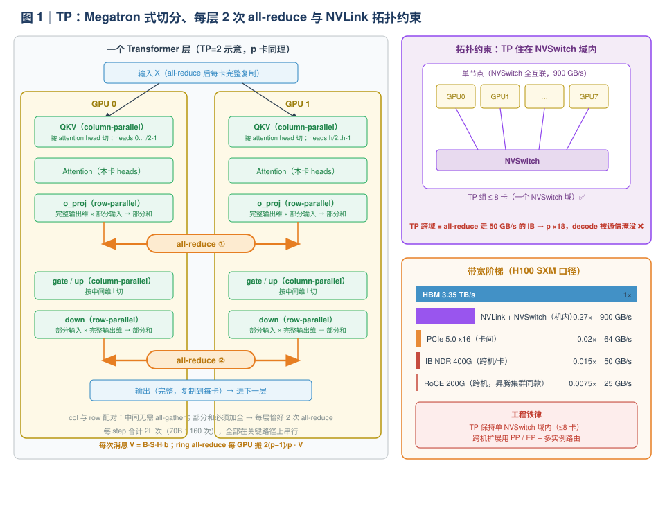
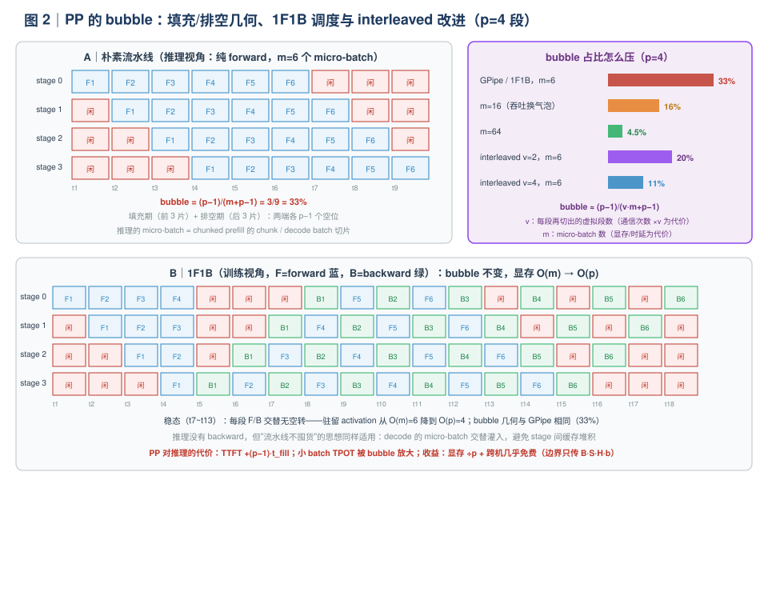
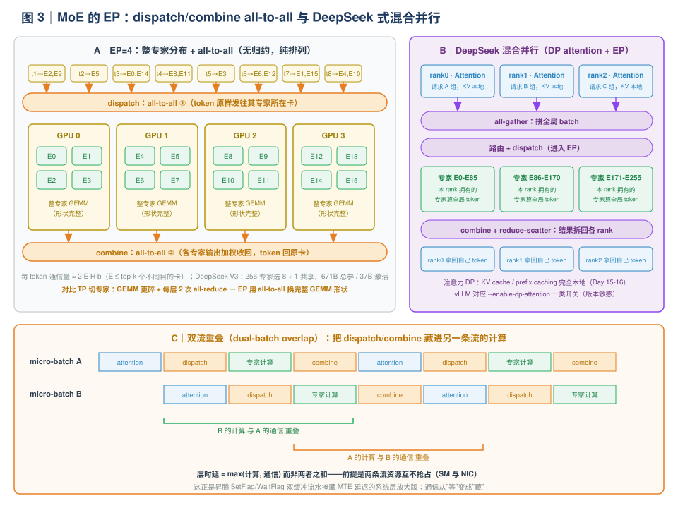

# Day 32｜分布式并行（一）：all-reduce、bubble 与 all-to-all——把通信算清楚

> **本周主线（Week 5）**：P/D 分离三天（Day 29 为什么 → Day 30 怎么做 → Day 31 动手搭）已经收官，它回答的是"**实例之间**怎么分工"。今天起的两天回答另一个正交的问题——"**单个实例内部**怎么跨卡、跨机扩展"：今天是原理日（TP 的 all-reduce / PP 的 bubble / MoE 的 all-to-all），明天（Day 33）是实验日（双卡 TP=2 vs 单卡，nsys 看 NCCL 时间）。
>
> **本日定位**：不跑大实验，把三种并行策略的**通信模式**算到"能上白板"的程度。全文一条主线：**并行度的选择，本质是决定把哪种通信放进关键路径**——TP 把 all-reduce 放进每一层的关键路径（买算力、卖时延），PP 把 bubble 放进吞吐的分母（买显存、卖吞吐），EP 把 all-to-all 放进 MoE 层（买稀疏激活、卖互联带宽）。"能单卡放下就别上 TP"不是教条，是下面几页通信算术的必然结论。
>
> **版本基线**：本文源码引用以撰写时（2026-10）的 vLLM main 分支为准。`ParallelConfig` 已从 `vllm/config.py` 拆分到 `vllm/config/parallel.py`；V1 对 PP、DP attention、EP 后端的支持状态演进较快，动手前先 `vllm serve --help | grep -E "parallel|dp-attention|moe-a2a"` 核对当前 flag——本文涉及版本敏感处均就地标注。

**今日时间预算**：精读 100 min + 手算对拍 30 min + Lab（all-reduce 微基准 + TP 启动日志观察）50 min ≈ 3 h。

---

## 0. 前情回顾与本日位置

| 前情 | 关键结论 | 今天怎么用 |
|---|---|---|
| Day 1-2 | prefill compute-bound / decode memory-bound；decode 单 token 时延下界 ≈ 权重字节 / HBM 带宽 | TP 通信占比分两条口径推导：prefill 用 FLOPs、decode 用字节——**同一个 TP 度，扩展性差约两个数量级**（§3.3，本日核心） |
| Day 2 | KV 每 token 显存 = `2·L·H_kv·D·b`（GQA 用 kv_heads） | TP 下 KV 按 `kv_heads` 切分，per-GPU 缩小 p 倍；`TP > kv_heads` 触发复制（§3.1 坑位） |
| Day 15-16 | KV pool / block table / prefix caching | TP 实例的 KV 池是"每卡一片"，对 Day 34 的 cache-aware routing 是硬约束 |
| Day 18 | decode 用 CUDA Graph；graph 内的通信必须用注册缓冲区的 kernel | §6 源码：vLLM 为什么自己写 custom all-reduce |
| Day 29-31 | P/D 分离：混跑干扰可算、收益在 goodput、三张网 | 今天补上它缺的硬件维度：**prefill 池可以放心堆 TP（通信占比 <1%），decode 池堆 TP 要精打细算**——这是 DistServe"按池配比自由度"的硬件来源之一 |
| Day 31 | router + 多实例的部署形态 | §3.5 的对手戏：`1×TP2 实例` vs `2×TP1 实例 + router`，谁赢、为什么 |
| Day 33（明日） | 双卡 TP=2 vs 单卡对比实验 | 今天的 p×B 手算表就是明天的**预测表**：先预测 → 实测 → 对拍 |

**今日一句话论点**（先给结论，全文都在论证它）：

> 三种并行 = 三种通信合同。**TP**：每层 2 次 all-reduce，消息小、频率高、卡在关键路径上——吃 NVLink 带宽与时延，天然只能住单机（≤8 卡），且 decode（memory-bound）比 prefill（compute-bound）受伤重一个数量级；**PP**：只在 stage 边界点对点传 activation，量小到 PCIe 都够——代价是 bubble 吃掉吞吐分母 `(p-1)/(m+p-1)`；**EP**：MoE 层 all-to-all，通信量随 top-k 增长，但可重叠、可流水。**决策规则一句话：显存放不下 → 上 TP/PP；单卡放得下 → 多实例 + 路由（Day 34），除非 prefill 算力不满足 TTFT SLO。**

---

## 1. 今日学习目标

学完后你应该能：

1. **画出** Megatron 式 TP 的切分图（column-parallel 的 QKV/gate-up + row-parallel 的 o/down），说清为什么这样配对能让每层恰好 2 次 all-reduce、且中间不需要 all-gather；
2. **手算** ring all-reduce 的每 GPU 通信量 `2(p-1)/p·V`，以及一个 transformer 层每 step 每 GPU 的通信字节 `4(p-1)/p·B·S·H·b`；
3. **推导** decode 的 TPOT 通信占比公式 `ρ = 4(p-1)·B/(c·H) × BW_hbm/BW_link`，填出 70B@H100 的 p×B 表，并解释为什么 prefill 的 TP 近线性而 decode 不是；
4. **说清** NVLink/NVSwitch 拓扑约束：TP 为什么"住"在单机 ≤8 卡里，跨机 TP 的通信算术为什么是灾难（附昇腾 HCCS 对照）；
5. **推导** PP 的 bubble 公式 `(p-1)/(m+p-1)`，说出 1F1B（bubble 不变、显存降为 O(p)）与 interleaved（bubble ÷ v）各自解决什么，以及 PP 在推理与训练中的用法差异；
6. **讲清** MoE 的 EP：为什么不用 TP 切专家、all-to-all dispatch/combine 的通信量量级、DeepSeek 的 DP-attention + EP + 双流重叠为什么是"通信与计算重叠"的教科书案例（对接你昇腾 SetFlag/WaitFlag 双缓冲流水经验）。

---

## 2. 核心概念速查

| 术语 | 一句话定义 | 首次深入 |
|---|---|---|
| **TP**（tensor parallelism） | 把每层权重矩阵切到多卡，卡间用 all-reduce 拼回完整结果（Megatron 模式） | §3.1 |
| **column / row parallel** | 按**输出**维切（各卡算输出的不同列，天然无需通信）/ 按**输入**维切（各卡得部分和，必须 all-reduce） | §3.1 |
| **all-reduce** | 集合通信原语：所有卡的部分和归约成完整和，再广播回每张卡 | §3.2 |
| **ring all-reduce** | all-reduce 的主流实现：reduce-scatter + all-gather 两段，每 GPU 收发 `2(p-1)/p·V` 字节 | §3.2 |
| **custom all-reduce** | vLLM 自研的小消息 all-reduce kernel（IPC 注册缓冲区、one/two-shot、CUDA Graph 兼容） | §6.2 |
| **NVLink / NVSwitch** | GPU 间高速互联（H100 SXM 900GB/s）/ 机内全互联交换芯片——TP 的"居住范围" | §3.4 |
| **PP**（pipeline parallelism） | 模型按层切成 p 段，段间点对点传 activation；吞吐损失用 bubble 度量 | §4 |
| **micro-batch / 1F1B / interleaved** | 切小批填流水线 / 先进先出调度（激活显存 O(p)）/ 每段再切 v 个虚拟段（bubble ÷ v） | §4.2 |
| **MoE / top-k 路由** | 稀疏专家层：每 token 只激活 k 个专家（DeepSeek-V3：256 选 8 + 1 个共享专家） | §5.1 |
| **EP**（expert parallelism） | 以**整个专家**为单位分布到多卡（而非把每个专家切碎），MoE 层用 all-to-all 收发 token | §5.2 |
| **dispatch / combine** | EP 的两次 all-to-all：把 token 发往其专家所在卡 / 把各专家的加权结果收回 | §5.3 |
| **DP attention** | DeepSeek 式混合并行：注意力部分各卡跑**不同请求**（KV 本地化），MoE 部分全体卡跑 EP | §5.4 |
| **ρ（通信占比）** | 通信时间 / 计算时间——本日反复出现的核心手算量 | §3.3 |

---

## 3. 原理深入（一）：TP——把权重切开，把 all-reduce 加进每层关键路径

### 3.1 切分方式：为什么恰好是"每层 2 次 all-reduce"

TP 的标准切法来自 Megatron-LM（训练侧），vLLM 的模型层直接继承。对一个线性层 `Y = X·Wᵀ`（`X` 形状 `[B·S, H_in]`，`W` 形状 `[H_out, H_in]`）：

| 切法 | 切的是 W 的哪一维 | 每卡算什么 | 需要的通信 |
|---|---|---|---|
| **column-parallel** | 输出维 `H_out` | `Y_i = X·W_iᵀ`（完整输入 × 本卡那部分权重，输出是 Y 的**不同列**） | 无（输出不相交） |
| **row-parallel** | 输入维 `H_in` | `Y = Σ_i X_i·W_iᵀ`（本卡那部分输入 × 完整权重，得到**部分和**） | **all-reduce**（把部分和加全） |

关键设计是**两者配对**：

```
column-parallel（QKV / gate+up）  →  row-parallel（o_proj / down_proj）
        输出按列切，不通信 ──────────→ 直接作为按行切的输入，也不通信
                                        但 row 的输出是部分和 → 1 次 all-reduce
```

- **Attention 块**：`QKVParallelLinear`（column，按 attention head 切）→ attention（每卡只算自己的 heads）→ `o_proj`（row）→ **all-reduce ①**
- **MLP 块**：`gate_up`（column，按中间维切）→ 激活 → `down_proj`（row）→ **all-reduce ②**

于是每个 transformer 层**恰好 2 次 all-reduce**，且 all-reduce 的输出被复制到每张卡上，正好作为下一层 column-parallel 的完整输入——中间不需要任何 all-gather。Llama-70B 有 80 层 → 一个 decode step 160 次 all-reduce，全部在关键路径上串行。



**KV cache 的切分**：attention head 被切了，KV cache 自然按 `kv_heads` 切——每卡只存自己那几个 kv head 的 KV，per-GPU KV 显存缩小 p 倍（Day 2 公式除以 p）。

> **⚠️ 坑位（GQA 复制）**：如果 `TP > kv_heads`（例如 8 个 kv head 的模型开 TP=16），`QKVParallelLinear` 会把 kv head **复制**到多张卡上——KV cache 不再缩小 p 倍，出现重复存储。选 TP 度时检查 `num_kv_heads % tp == 0`。

### 3.2 通信量：ring all-reduce 的算术

all-reduce 要把每张卡上 `V = B·S·H·b` 字节的部分和变成完整和。主流实现是 **ring all-reduce**（NCCL 默认路径之一）：

1. **reduce-scatter**：p 卡排成环，经过 p-1 步，每卡把自己的 `V/p` 分块累加好——每卡发送 `(p-1)·V/p`；
2. **all-gather**：再把 p 个累加好的分块广播一圈——每卡再发送 `(p-1)·V/p`。

$$
\text{每 GPU 通信量} = \frac{2(p-1)}{p} \cdot V, \qquad V = B \cdot S \cdot H \cdot b
$$

两个性质值得背下来：① 总量**不随 p 增长**（`2(p-1)/p → 2`）；② 时延项随 p 增长（环上 p-1 步，每步有同步开销）。对 decode（`S=1`），一个层每 step 每 GPU 的通信字节数：

$$
\underbrace{2}_{\text{每层2次}} \times \frac{2(p-1)}{p} \times \underbrace{B \cdot H \cdot b}_{V}
\;=\; \frac{4(p-1)}{p} \cdot B \cdot H \cdot b
\;\xrightarrow{p \to \infty}\; 4BHb
$$

代入 Llama-3-70B（`H=8192`，BF16 `b=2`）逐 token 通信量（p→∞ 极限）：`4·8192·2 = 64 KB/token/层`，全模型 80 层 → **每 token 约 5 MB/卡**。这个绝对值不大——问题不在带宽总量，在下面两个量纲。

### 3.3 本日核心手算：TPOT 分解与通信占比 ρ

TP 度下 decode 的单 step 时间可以写成三项（权重读 + 通信带宽项 + 通信时延项）：

$$
T_{\text{step}}(p) \;\approx\; \underbrace{\frac{W_{\text{eff}}}{p \cdot BW_{\text{hbm}}}}_{\text{计算（也是访存）项}}
\;+\; \underbrace{2L \cdot \frac{2(p-1)}{p} \cdot \frac{B H b}{BW_{\text{link}}}}_{\text{通信带宽项}}
\;+\; \underbrace{2L \cdot t_{\text{ar}}}_{\text{通信时延项}}
$$

其中 `W_eff` 是本 step 要读的权重 + KV 字节（KV 也随 kv_heads 切分缩小 p 倍），`t_ar` 是一次 all-reduce 的固定时延（NVLink 小消息约 10~20μs 量级，vLLM custom all-reduce 更快，见 §6.2）。

**通信占比**（只看带宽项 / 计算项，Llama 类模型每层参数约 `c·H²`，`c ≈ 12.75`：attn 2.25H² + MLP 10.5H²）：

$$
\rho_{\text{decode}} = \frac{4(p-1)/p \cdot B H b / BW_{\text{link}}}{c H^2 b / p / BW_{\text{hbm}}}
= \frac{4(p-1) \cdot B}{c \cdot H} \times \frac{BW_{\text{hbm}}}{BW_{\text{link}}}
$$

代入 70B（`c=12.75, H=8192`）在 H100 SXM（`BW_hbm=3.35TB/s`，NVLink `0.9TB/s`，比值 3.7）：

| TP 度 p | batch B | ρ（字节比） | ρ（时间比） | 直觉 |
|---|---|---|---|---|
| 2 | 1 | 0.005% | 0.02% | 带宽项可忽略——但**时延项** 160 次 × ~15μs ≈ 2.4ms 不可忽略（见下） |
| 2 | 256 | 1.0% | 3.6% | 基本"白拿"一倍算力 |
| 4 | 256 | 2.9% | 10.9% | 可接受 |
| 8 | 256 | 6.9% | 25.5% | 每 4 份计算时间配 1 份通信时间 |
| 8 | 512 | 13.7% | 51% | TPOT 显著劣化 |
| 8 | 1024 | 27.4% | **102%** | 通信时间 ≈ 计算时间——扩展彻底失效 |

三个结论：

1. **ρ 随 `(p-1)·B` 线性增长**：TP 度越大、batch 越大，通信占比越高。大 batch 高吞吐场景堆 TP 度，边际收益快速递减。
2. **时延项是低并发的杀手**：`B=1` 时带宽项趋近于零，但 `2L·t_ar = 160 × 15μs ≈ 2.4ms` 纹丝不动。对照 70B BF16 TP=8 的计算项 `140GB/8/3.35TB/s ≈ 5.2ms`——单请求场景下，**通信时延占了 TPOT 的近 1/3**，还带来跨卡同步抖动（p99 杀手）。
3. **prefill 是另一个世界**（这是与 Day 1 的联动，也是本日最重要的洞察）：

$$
\rho_{\text{prefill}} = \frac{4(p-1)/p \cdot H b / BW_{\text{link}}}{2 c H^2 / p \cdot MFU / BW_{\text{flops}}}
\;\approx\; 0.3\% \sim 0.7\% \quad (\text{70B FP8, H100, } p=8)
$$

prefill 是 compute-bound：每 token 每 GPU 的通信只有约 57KB，而计算有 17 GFLOPs——**通信/计算比是千分之几**；decode 是 memory-bound：通信的字节和读权重的字节在同一量级（百分之几到几十），而且通信跑在比 HBM 慢的 NVLink 上（×3.7）。**同一个 TP=8，prefill 近线性扩展、decode 最多打折扩展**。这正是 Day 29 DistServe"两个池独立配置并行度"的硬件依据：prefill 池放心堆 TP 换 TTFT，decode 池对 TP 度精打细算。

> **手算验证（面试白板版，30 秒）**：`ρ = 4(p-1)B/(cH) × BW_hbm/BW_link`。分子记忆锚点：p=8、B=256 时 `4·7·256/(12.75·8192) ≈ 0.069`；再乘带宽比 3.7 ≈ 25%。三张卡背一组数：**3.6% / 25% / 100%（p=2/8/8，B=256/256/1024）**。

### 3.4 NVLink 拓扑约束：TP 为什么"住"在单机里

把 §3.3 的带宽阶梯摆出来（H100 SXM 口径）：

| 互联 | 带宽（单向） | 相对 HBM | TP 可用性 |
|---|---|---|---|
| HBM3e | 3.35 TB/s | 1× | （计算/访存本体） |
| NVLink 4 + NVSwitch（机内 8 卡全互联） | 900 GB/s | 0.27× | ✅ TP 的家 |
| PCIe 5.0 x16 | ~64 GB/s | 0.02× | 勉强（2 卡小 TP） |
| IB NDR 400G（跨机，每卡 1 NIC） | 50 GB/s | 0.015× | ❌ 灾难 |
| 以太网 RoCE 200G | 25 GB/s | 0.0075× | ❌ 灾难 |

跨机开 TP=8 意味着 all-reduce 从 900GB/s 的 NVSwitch 挪到 50GB/s 的 IB：§3.3 的 ρ_time 要再乘 `900/50 = 18`——p=8、B=256 的 25.5% 变成 **4.6 倍计算时间**的通信，decode 彻底被通信淹没。而机内超过 8 卡（一张 NVSwitch 域）同样要跨机。所以工程铁律是：

> **TP 保持在单个 NVSwitch 域内（典型 ≤8 卡）；要跨机扩展，用 PP（或 EP）+ 多实例路由，不用 TP。**

**昇腾对照**（你的经验迁移点）：910B 上 HCCS 构成类似的"机内高速域"（公开口径约数百 GB/s 量级，以昇腾规格书为准），跨机走 200G RoCE——拓扑约束与 GPU 完全同构："**TP 吃域内互联，跨域换 PP/EP**"是跨平台通则。HCCL 的 all-reduce 融合算子 ↔ NCCL/custom all-reduce，见 §6.4。

### 3.5 "能单卡放下就别上 TP"——三条论证与例外清单

现在可以完整论证这句 vLLM 文档里反复出现的忠告了。设模型单卡放得下（如 8B/32B 在 80GB 卡上）：

**论证一（时延与尾延迟）**：all-reduce 在每层关键路径上。低并发时 TPOT 改善远次线性（计算 ÷p，但加回 `2L·t_ar` 时延项与同步抖动——单请求 TP=2 实测常见只有 1.3~1.5× 改善而非 2×）；每一步都要 p 卡同步，最慢的卡决定 step 时延 → **p99 对 straggler 敏感**。TTFT 侧同理：prefill 通信占比虽低，但跨机或 PCIe TP 依然劣化。

**论证二（集群吞吐与 goodput）**：同样 2 张卡，比较 `1×TP2 实例` 与 `2×TP1 实例 + router`（Day 31 的部署形态、Day 34 的路由策略）：

- 聚合吞吐：TP2 每 step 产 B 个 token 需 `T/2 + T_comm`；两个 TP1 各产 B 个 token 需 `T`——**只要 `T_comm > 0`，TP2 的聚合吞吐就低于两个独立实例**（还没算调度耦合：一个 scheduler 管双卡，batch 形态互相牵制）；
- goodput：两个实例独立扩缩容、独立滚动升级、故障域减半；还能做 cache-aware routing（Day 34）提高 prefix 命中——这是 TP 结构上给不了的；
- KV 池：诚实地说 TP 有一项隐性优势——权重不复制，`2×TP1` 的总 KV 池 = `2×(80−16)GB`，`1×TP2` = `2×(80−8)GB`，TP2 反而多 16GB。但这项优势通常抵不过上面的损失。

**论证三（资源效率）**：TP=p 意味着 p 张卡绑定成一个"大卡"服务同一个请求流；低负载时 p 张卡一起闲置。多实例形态下负载均衡器把请求摊到所有卡，每张卡都能独立打满。

**例外清单（什么时候必须/应该上 TP）**：

| 场景 | 判断 | 原因 |
|---|---|---|
| 模型单卡放不下（70B+BF16、405B、671B） | **必须**（TP / PP / 量化后仍放不下） | 显存墙是硬约束 |
| prefill 算力不满足 TTFT SLO | **值得** | prefill 近线性扩展（§3.3），TP 是买 FLOPs 最直接的方式 |
| 单实例吞吐天花板不够（不想管多实例路由） | 可选 | 简化运维，牺牲资源效率 |
| 模型小、单卡放得下、追求低时延 | **别上** | 论证一 + 二 |
| 跨机扩展 | **别上 TP** | §3.4 拓扑约束，改用 PP/EP + 多实例 |

### 3.6 TP 收益与代价清单（一页对照）

| 维度 | TP=p 的效果 |
|---|---|
| 权重显存 / 卡 | ÷ p（主收益） |
| KV 显存 / 卡 | ÷ p（GQA 复制时除外，§3.1 坑位） |
| prefill 吞吐 / 实例 | ≈ ×p（通信占比 <1%） |
| decode 吞吐 / 实例 | ×p × (1−ρ)/(1+ρ)，ρ 随 (p−1)·B 增长（§3.3 表） |
| 单请求 TPOT | 改善次线性（时延项 2L·t_ar 不缩）；p99 受同步抖动影响 |
| 每 step all-reduce 次数 | 2L（全部在关键路径） |
| 拓扑要求 | 单 NVSwitch 域内（跨机 ❌） |
| 故障域 / 扩缩容 | p 卡耦合为一个实例；无法独立扩缩 |
| 与 P/D 分离组合 | prefill 池高 TP ✅；decode 池低 TP（Day 29 配比自由度的落点） |

---

## 4. 原理深入（二）：PP——用 bubble 换显存容量

### 4.1 推理为什么要 PP：通信最便宜，代价是吞吐分母

PP 把模型的 L 层切成 p 段（stage），第 i 段住第 i 张卡，前后向只在 **stage 边界**点对点传 activation：

$$
\text{边界通信量} = B \cdot S \cdot H \cdot b \quad (\text{每个 step，每对相邻卡，仅 } 1 \text{ 次})
$$

对比 TP 的"每层 2 次 all-reduce"，PP 的通信量小一到两个数量级，而且 p2p send/recv 不需要全体同步——**PCIe 甚至普通以太网都够用**。所以 PP 的天然生态位是：**模型大到 TP=8 单机都放不下（405B、DeepSeek-671B），必须跨机扩展**——TP 跨机是灾难（§3.4），PP 跨机几乎免费。此外 PP 每 stage 显存 = 权重/p + 本 stage activation，与 TP 一样解决显存墙，但不要求 `num_heads % p == 0`。

### 4.2 bubble 的算术：`(p-1)/(m+p-1)`

流水线的代价是**填充与排空**。把一个 batch 切成 m 个 micro-batch 依次灌入 p 段流水线（GPipe 式调度）：

- **填充期**：前 p-1 个时间片，后面的 stage 在等输入 → 空转；
- **稳态**：所有 stage 满载；
- **排空期**：最后 p-1 个时间片，前面的 stage 没活干。

$$
\text{bubble 占比} = \frac{p-1}{m+p-1}
$$

代入数字（p=4）：

| m（micro-batch 数） | bubble 占比 |
|---|---|
| 4 | 3/7 = **43%** |
| 16 | 3/19 = 16% |
| 64 | 3/67 = 4.5% |



三种调度的演进（都在压 bubble 或压显存）：

1. **GPipe**：先全部 forward 再全部 backward（训练语境）。推理没有 backward，但填充/排空的几何完全一样。问题：m 个 micro-batch 的 activation 要同时驻留 → 显存 O(m)。
2. **1F1B**（PipeDream-Flush）：一个 micro-batch 的 backward 一结束就立刻喂下一个 forward——**bubble 不变（仍是 `(p-1)/(m+p-1)`）**，但驻留 activation 从 O(m) 降到 O(p)。推理借鉴的是它的"流水线不囤货"思想。
3. **interleaved 1F1B**（Megatron）：每张卡上的 1/p 段再切成 **v 个虚拟段**（virtual stage），micro-batch 在更细的虚拟段间穿插——bubble 近似变为：

$$
\text{bubble} \approx \frac{p-1}{v \cdot m + p - 1} \quad (\text{v=2, m=16, p=4：16\% → 8.7\%})
$$

代价是通信次数 ×v（每次传的更小）和调度的实现复杂度。

**推理里的 micro-batch 是什么**：对 prefill，micro-batch 就是 chunked prefill 的 chunk（Day 11）；对 decode，是把整个 batch 的 step 切成若干 micro-batch 分时灌入流水线。vLLM 的 PP 实现里每个 rank 有自己的 Scheduler 与 virtual engine，靠引擎间的消息传递推进（§6.3）。

### 4.3 PP 对推理指标的影响

| 指标 | 影响 | 机制 |
|---|---|---|
| TTFT | 劣化 `≈ (p-1)·t_micro` | 流水线填充：第一个 micro-batch 要走完全部 p 段才出第一个 token |
| TPOT | 劣化 `bubble 占比 × t_step`（batch 小时） | decode batch 小 → m 小 → bubble 大；batch 大（m 大）时趋近稳态 |
| 吞吐 | batch 大时可接受 | m → ∞ 时 bubble → 0，通信又便宜 |
| 显存 | ✅ 权重 /p | 与 TP 同等解显存墙 |
| 跨机扩展 | ✅ p2p 走普通网络 | PP 的核心卖点 |

一句话：**PP 是"吞吐换显存"**——它把代价放在吞吐的分母（bubble），而 TP 把代价放在每 step 的关键路径（all-reduce）。两则组合（TP×PP，如 405B 常见 TP=8×PP=... 跨机）时，先用 TP 填满单机 NVSwitch 域，再用 PP 跨机。

### 4.4 vLLM V1 对 PP 的支持状态（诚实标注）

V1 重构初期**不支持** PP（`pipeline_parallel_size` 曾长期要求回落 V0 / 直接报错），此后按场景逐步补齐（先离线 `LLM` 类、再部分 serving 路径），截至撰写时仍属**实验性/部分支持**，且与 chunked prefill、speculative decoding 等特性的组合矩阵在快速变化。**动手前必查**：`vllm serve --help | grep pipeline` 与官方文档的 V1 feature 矩阵。本文 PP 部分按"原理 + 训练侧成熟实践"讲，实验设计放在 TP 上（Day 33）。

---

## 5. 原理深入（三）：MoE 的 EP 与 all-to-all

### 5.1 MoE 三十秒入门（本系列首次）

前 31 天用的都是 dense 模型（每 token 激活全部参数）。MoE 把部分 FFN 层换成**稀疏专家层**：

- **路由器（router）**：一个小的线性层 + softmax，为每个 token 选出 top-k 个专家（DeepSeek-V3：每 MoE 层 256 个路由专家选 8 个 + 1 个共享专家人人有份）；
- **激活参数**：DeepSeek-V3 总参数 671B，每 token 激活约 37B——**显存要按 671B 装，算力按 37B 花**，这直接改变了 Day 2 的显存/时延公式（装得下 671B 的显存成本，换来 decode 只读 37B 权重的时延收益）。

### 5.2 为什么 MoE 不用 TP 切专家，而用 EP

用 TP 切 MoE 层是灾难性的组合：TP 会把**每个专家**的矩阵都切成 p 份——256 个专家本来的 GEMM 就小（每专家只分到少量 token），再切 8 份后每卡的 GEMM 小到无法打满，且每层照旧付 2 次 all-reduce 的通信税。

**EP（expert parallelism）换一个切法：以整个专家为单位分布**——256 个专家散到 p 张卡（每卡 256/p 个），专家矩阵保持完整：

- 路由器把 token 直接发给专家所在的卡 → 各卡对"自己专家"的 token 做完整 GEMM（M 维度 = 该专家收到的 token 数，够大）；
- expert GEMM 形状完整、无 all-reduce（MoE 层内）；
- 代价：token 要**跨卡旅行**——dispatch + combine 两次 all-to-all。

### 5.3 all-to-all dispatch / combine 的通信量

每个 token 要去 top-k 个专家所在的地方（不同专家可能在不同卡上），算完加权回来：

$$
\text{每 token 通信量} \approx 2 \cdot E \cdot H \cdot b, \qquad E = \min(k,\ \text{平均不同目的卡数}) \le k
$$

量级对拍（DeepSeek-V3，`H=7168`，BF16，worst case E=8）：`2·8·7168·2 ≈ 224 KB/token/层`——比 dense TP 的极限 `4Hb ≈ 57KB` 大约 4 倍，但只发生在 58 个 MoE 层、且**没有归约**（all-to-all 是纯排列：token 原样发走、原样回来），对网络更友好，且可与计算重叠（§5.4）。

**vLLM 的两条实现路径**（源码层，版本敏感）：

1. **gather/scatter 模拟 EP**：all-gather 全体 token → 本卡只算"自己专家命中"的 token → reduce-scatter 把部分和加回。通信量回到 `2(p-1)/p·V`（与 all-reduce 同阶），胜在实现简单、走标准集合通信；
2. **真 all-to-all**：接入 DeepEP 等专用低时延 all-to-all kernel（`--moe-a2a-backend` 一类的 flag），dispatch/combine 各一次，时延更低、更易与计算重叠。

### 5.4 DeepSeek 式混合并行：DP attention + EP + 双流重叠

DeepSeek-V2/V3 的推理并行是"**注意力数据并行、专家专家并行**"的混合体（vLLM 中对应 `--enable-dp-attention` 一类开关，常与 `dp_size`/EP 组合，版本敏感）：

- **Attention 部分（DP）**：每张卡跑**不同的请求**（不是同一请求的不同 head！）。MLA 的 KV cache 是 per-token 的（Day 36 候选专题），DP 放置让 **KV cache 完全本地化**——不切分、不通信、prefix caching（Day 16）也各自独立；
- **MoE 部分（EP）**：全体卡组成一个大 EP 组。进入 MoE 前把各卡 token **all-gather** 拼成全局 batch，路由计算后各卡算自己的专家，出来再 **reduce-scatter** 拆回各卡；
- **双流重叠（dual-batch overlap）**：把 batch 拆成两个 micro-batch，两条流水线交错——A 的 attention 计算与 B 的 dispatch/combine 通信重叠，反之亦然。**这就是你昇腾 SetFlag/WaitFlag 双缓冲流水在系统层的放大版**：通信不再是"等"，而是"藏"。



### 5.5 三种通信模式总对比（本日收束）

| 维度 | TP：all-reduce | PP：p2p send/recv | EP：all-to-all |
|---|---|---|---|
| 发生频率 | 每层 2 次（decode step 160 次） | 每 step 每边界 1 次 | 每 MoE 层 2 次 |
| 每次消息大小 | `B·S·H·b`（小） | `B·S·H·b`（小） | `E·B·H·b`（中） |
| 同步语义 | 全体卡同步（最重） | 相邻两卡（最轻） | 全体但 p2p 化（中） |
| 时延敏感度 | 极高（在关键路径） | 低（可流水） | 中（可重叠） |
| 网络要求 | NVSwitch 域内 | PCIe/以太网即可 | 尽量高带宽（IB/RoCE/NVLink） |
| 换来什么 | 算力 ÷p、显存 ÷p | 显存 ÷p、跨机扩展 | 稀疏激活 + 完整 GEMM 形状 |
| 付出什么 | 每 step 关键路径 +2L·t_ar | 吞吐 bubble `(p-1)/(m+p-1)` | MoE 层通信 ~`2E·H·b`/token |
| 典型组合 | 机内（≤8 卡） | 跨机大模型 | DeepSeek：DP-attn + EP |

---

## 6. vLLM V1 源码走读：并行的接缝在哪里

### 6.1 配置与进程拓扑

启动参数 → `ParallelConfig`（新版在 `vllm/config/parallel.py`，旧版 `vllm/config.py`，版本敏感）：

```
--tensor-parallel-size N      # TP 度（机内）
--pipeline-parallel-size N    # PP 度（实验性，§4.4）
--data-parallel-size N        # V1 的 DP：N 个副本（外部/内置 LB）
--enable-expert-parallel      # EP
--enable-dp-attention         # DeepSeek 式 DP attention（版本敏感）
```

进程链路（衔接 Day 8 的 V1 总览）：

```
vllm serve --tp 2
  └─ AsyncLLM (API 进程)
       └─ EngineCore 进程
            └─ Executor（vllm/executor/：Uniproc / Multiproc / Ray 按 tp·pp 选择）
                 ├─ Worker rank0 (vllm/v1/worker/gpu_worker.py)
                 └─ Worker rank1
                      ├─ init_distributed_environment()   # torch.distributed + NCCL
                      ├─ initialize_model_parallel(tp, pp) # 划分 TP/PP 子组
                      └─ load_model()                      # 按 rank 切权重
```

关键模块：

- **`vllm/distributed/parallel_state.py`**：`init_distributed_environment()`（进程组与后端初始化）、`initialize_model_parallel()`（把 world 切成 TP group / PP group，提供 `get_tensor_model_parallel_group()` 等查询）。所有"我在哪个组、组里有谁"的全局状态都在这里；
- **`vllm/v1/worker/gpu_worker.py`**：每个 rank 一个 `Worker`，各自建 `ModelRunner`、KV cache（每卡一片，Day 15）。

### 6.2 all-reduce 的调用点与小消息优化

**切分的落点**（`vllm/model_executor/layers/linear.py`）：

```
QKVParallelLinear / MergedColumnParallelLinear   # column-parallel：按 head/中间维切
        ↓ forward
RowParallelLinear(reduce_results=True)           # row-parallel
        ↓
tensor_model_parallel_all_reduce(input_)          # vllm/distributed/communication_op.py
```

`QKVParallelLinear` 同时处理 §3.1 的 GQA 坑位：`TP > kv_heads` 时按 `max(1, ceil(kv/tp))` 复制 kv head。

**小消息三级火箭**（`tensor_model_parallel_all_reduce` 的分派逻辑，按消息大小与条件选择）：

1. **`CustomAllreduce`**（`vllm/distributed/device_communicators/custom_all_reduce.py`）：单机、world ≤ 8、消息小于若干 MB 时启用——CUDA IPC 建立注册缓冲区，one-shot（极小消息直接每卡广播自己的分块）或 two-shot 算法，**专为 CUDA Graph 兼容设计**（缓冲区注册进 graph 池，Day 18 的约束）。这就是 §3.3 里 `t_ar ≈ 10μs` 量级的来源；环境变量 `VLLM_DISABLE_CUSTOM_ALL_REDUCE=1` 可关闭对照；
2. **`PyNcclCommunicator`**（`.../pynccl.py`）：stream-ordered 的 NCCL 封装，处理更大消息与非 graph 路径；
3. **torch.distributed 原生 NCCL**：兜底。

> 实验预告（Day 33）：nsys 里 NCCL/kernel 名（`ncclDevKernel_*` 或 custom all-reduce 的 kernel）占用的时间，就是 §3.3 公式里的通信项——明天直接对拍。

### 6.3 PP 的源码形态（简）

V1 的 PP 为每个 rank 维护独立的 `Scheduler` + virtual engine（`vllm/v1/` 下按 rank 组织），stage 间用 p2p 消息传递 activation 与调度信息，micro-batch 推进逻辑对应 §4.2 的流水线几何。因支持状态演进快（§4.4），此处不展开逐行走读——**面试讲清 §4.2 的 bubble 几何 + "PP 通信便宜所以跨机用 PP"比背源码细节更重要**。

### 6.4 昇腾经验迁移：HCCL ↔ NCCL 对照表

| GPU 侧 | 昇腾侧 | 说明 |
|---|---|---|
| NCCL all-reduce | HCCL all-reduce（融合算子） | 融合多个小 all-reduce 是两侧共同的优化方向 |
| vLLM custom all-reduce（IPC + 注册缓冲） | vllm-ascend 侧对应的高阶 API / 融合实现 | Day 17 讲过的"接口即架构决策"：`vllm/distributed/device_communicators/` 的平台抽象让 HCCL 插进同一套 `tensor_model_parallel_all_reduce` 接缝 |
| NVLink/NVSwitch | HCCS 机内域 | "TP 住域内"通则（§3.4） |
| IB/RoCE 跨机 | 200G RoCE 跨机 | "跨域换 PP/EP"通则 |
| Megatron TP 切分 | 同一套切分数学 | column/row 配对与通信量公式平台无关 |

这张表是 Day 36 起 vllm-ascend 项目选型的直接输入：**通信子系统的 profiling 与优化（融合、流水、拓扑感知）是跨平台最可迁移的技能**。

---

## 7. 动手实验（今天 50 min：微基准 + 观察为主，大实验留给 Day 33）

### Lab A｜all-reduce 微基准：把 `t_ar` 和 `BW_link` 测出来（25 min）

§3.3 的公式里有两个待定常数：一次小消息 all-reduce 的时延 `t_ar`、链路有效带宽 `BW_link`。今天用 20 行 PyTorch 把它们测出来（单机多卡即可，没有多卡就跳过、记 spec 值）：

```python
# bench_allreduce.py — 启动: torchrun --nproc_per_node=2 bench_allreduce.py
import os, time, torch, torch.distributed as dist

dist.init_process_group("nccl")
r, w = dist.get_rank(), dist.get_world_size()
torch.cuda.set_device(r)
x = torch.empty(1, device="cuda")

for msg_bytes, n in [(16 * 1024, 2000), (8 * 1024 * 1024, 200)]:  # 16KB 与 8MB
    numel, bpe = msg_bytes // 2, 2
    t = torch.ones(numel, dtype=torch.bfloat16, device="cuda")
    for _ in range(50):
        dist.all_reduce(t)                    # warmup + 时钟稳定
    torch.cuda.synchronize(); dist.barrier()
    torch.cuda.synchronize(); t0 = time.perf_counter()
    for _ in range(n):
        dist.all_reduce(t)
    torch.cuda.synchronize(); dt = (time.perf_counter() - t0) / n
    if r == 0:
        lat_us = dt * 1e6
        # 总线带宽口径: 每 GPU 每 all_reduce 搬 2(p-1)/p * msg_bytes
        busbw = (2 * (w - 1) / w) * msg_bytes / dt / 1e9
        print(f"msg={msg_bytes/1024:.0f}KB  t_ar={lat_us:.1f}us  busbw={busbw:.0f}GB/s")
```

**预期结果**（NVLink 双卡，量级参考，以实测为准）：

| 消息 | t_ar | busbw | 对应公式里的 |
|---|---|---|---|
| 16KB（decode 典型：B·H·b，B=1 的 70B） | ~10~30μs | —（时延主导） | 时延项 `t_ar` |
| 8MB（大 batch decode 的 V） | —（带宽主导） | 数百 GB/s | 带宽项 `BW_link` |

把实测值代回 §3.3 的 `T_step(p)` 公式重算一遍——**公式的两个常数从 spec 变成了你自己的测量值**。

### Lab B｜观察 vLLM TP=2 的启动日志与切分（15 min）

```bash
# 单卡基线（如果之前 Day 6 没存，现在补）
vllm serve Qwen/Qwen3-8B --max-model-len 16384 2>&1 | tee /tmp/tp1.log
# 双卡 TP=2
vllm serve Qwen/Qwen3-8B --max-model-len 16384 -tp 2 2>&1 | tee /tmp/tp2.log
```

在日志里找四样东西并填表（Day 33 的预测表）：

| 观察项 | tp1 | tp2 | 对应原理 |
|---|---|---|---|
| `Initializing a V1 engine` 附近的 world size / TP | 1 | 2 | §6.1 |
| custom all-reduce 是否启用（搜 `custom allreduce`/`CustomAllreduce`） | — | ✅/❌ | §6.2 的启用条件 |
| 每 GPU 权重显存（`model weights take` 日志） | ~16GB | ~8GB | §3.1 权重 ÷p |
| KV cache blocks 数（`# CPU blocks`/`GPU KV cache size`） | X | ≈2X 每卡 | §3.1 KV ÷p + 空间变大 |

### Lab C｜为 Day 33 准备（10 min）

把 Day 6 的压测脚本参数化（`--tensor-parallel-size` 与并发扫描两个旋钮），确认 nsys 可用：

```bash
nsys profile -o /tmp/tp2_trace --trace=cuda,nvtx \
  vllm bench serve --model Qwen/Qwen3-8B ... --tp 2   # 具体参数明天给全
```

明天要验证的三件事，今天先写好预测（**预测 → 实测 → 对拍**才是实验的完整形态）：

1. TP=2 的 TPOT 在低并发改善 <2×（时延项 `2L·t_ar`，§3.3）；
2. TP=2 在高并发吞吐 <2× 单卡（ρ 增长，§3.3 表）；
3. nsys 里 NCCL/custom-all-reduce kernel 时间占比 ≈ ρ 的预测值。

> **⚠️ 坑位**：① 双卡若非 NVLink 互联（如 PCIe 上的 4090），ρ 会比 §3.3 表差一个量级——这本身就是 §3.4 的活体实验，记录下来；② 关掉 prefix caching 干扰时延测量（Day 29 同款注意事项）；③ `torchrun` 的 `--nproc_per_node` 与 vLLM `-tp` 不要混用（vLLM 自己 spawn worker）。

---

## 8. 面试高频问题

**Q1：为什么"能单卡放下就别上 TP"？**
> 要点：三条论证——① all-reduce 在每层关键路径：低并发 TPOT 改善次线性（时延项 2L·t_ar）且 p99 受同步抖动影响；② 聚合吞吐：只要通信非零，`1×TPp` 的总吞吐 < `p×TP1` 独立实例，且多实例可独立扩缩容、故障域小、能做 cache-aware routing；③ 资源效率：p 卡绑定成"一张大卡"，低负载一起闲。例外清单：显存墙（主因）、prefill 算力不够 TTFT SLO（prefill 通信占比 <1%，TP 近线性）。

**Q2：TP 的 all-reduce 发生在哪、每次多大、为什么躲不开？**
> 要点：位置在 row-parallel 的 `o_proj`/`down_proj` 之后（Megatron col+row 配对使每层恰好 2 次，中间无需 all-gather）；大小 `V = B·S·H·b`，ring all-reduce 每 GPU 搬 `2(p-1)/p·V`；躲不开因为部分和必须加全才能进下一层（除非 sequence parallel 把 AR 拆成 RS+AG，通信量不变但可重叠——训练侧技术）。

**Q3：为什么 prefill 的 TP 近线性、decode 不是？**
> 要点：bound 决定口径。prefill compute-bound：每 token 每 GPU 通信 ~57KB vs 计算 17 GFLOPs，ρ ≈ 0.3~0.7%；decode memory-bound：通信字节与权重字节同量级（`4(p-1)B/(cH)` ≈ 7% @p=8,B=256）且通信跑在比 HBM 慢 3.7× 的 NVLink 上 → ρ_time ≈ 25%。引申：这是 P/D 分离后"prefill 池高 TP、decode 池低 TP"的依据（Day 29 配比自由度）。

**Q4：TP 为什么不能跨机？TP 度的上限是什么？**
> 要点：TP 通信每层 2 次、全体同步、时延敏感——需要 NVSwitch 级带宽（900GB/s）；跨机 IB 400G 只有 50GB/s，ρ 再乘 18 倍，decode 被通信淹没。上限 = 单 NVSwitch 域（典型 8 卡）；再要大 → PP/EP + 多实例。

**Q5：PP 的 bubble 怎么推导？怎么减小？推理和训练用 PP 有什么不同？**
> 要点：`(p-1)/(m+p-1)`（填充+排空 / 总时间片）；减小靠 m↑（吞吐换气泡）和 interleaved v↑（bubble÷v，代价通信次数×v）；1F1B 不减 bubble 但把 activation 显存 O(m)→O(p)。推理差异：无 backward，micro-batch=chunked prefill 的 chunk / decode batch 切片；代价主要在 TTFT（+(p-1)·t_micro 填充）与小 batch TPOT；收益是跨机扩展几乎免费（边界通信 B·S·H·b 走 PCIe 都行）。

**Q6：EP 的 all-to-all 与 TP 的 all-reduce 有什么区别？DeepSeek 为什么要 DP attention + EP？**
> 要点：all-to-all 是纯排列（token 发走-收回，无归约），量 `2E·H·b`/token（E≤top-k），只发生在 MoE 层、可重叠；all-reduce 是全体同步归约、每层 2 次、在关键路径。DP attention 让 KV cache 本地化（MLA per-token KV、prefix caching 独立、attention 权重复制的代价可接受），MoE 用 EP 吃完整 GEMM 形状；中间 all-gather/reduce-scatter 拼全局 batch；双流重叠把 dispatch/combine 藏进另一条的 attention——通信从"等"变"藏"。

**Q7（场景题）：405B 模型、8×H100 节点若干，怎么选并行？**
> 要点：405B BF16 ≈ 810GB 权重 → 单节点 8 卡（640GB）放不下 → 量化到 FP8（405GB，仍紧）或跨节点；跨机不用 TP（Q4）→ 单节点内 TP=8（机内 NVSwitch）+ 节点间 PP=2（或 FP8 + KV 量化后单节点 TP=8 + 多实例）。给出决策顺序：先量化压显存 → 机内 TP → 跨机 PP → 实在不行 EP（MoE 模型才适用）→ 最后多实例 + 路由提 goodput。

**Q8（经验迁移题）：昇腾的通信经验怎么映射到 GPU？**
> 要点：HCCL↔NCCL、HCCS 机内域↔NVSwitch 域（"TP 住域内"通则）、200G RoCE↔IB（"跨域换 PP/EP"）、HCCL 融合算子↔vLLM custom all-reduce（小消息低时延 + graph 兼容）；vllm-ascend 通过 `device_communicators` 平台抽象插进同一接缝——通信子系统的 profiling/优化是跨平台最可迁移技能（Day 36 项目 A 选型输入）。

---

## 9. 今日总结

| # | 要点 | 一句话 |
|---|---|---|
| 1 | 三种并行 = 三种通信合同 | TP：all-reduce 进每层关键路径；PP：bubble 进吞吐分母；EP：all-to-all 进 MoE 层 |
| 2 | TP 切分 | col+row 配对（QKV/gate-up + o/down），每层恰好 2 次 all-reduce，共 2L 次/step |
| 3 | 通信量算术 | ring all-reduce 每 GPU `2(p-1)/p·V`；每层每 GPU `4(p-1)/p·B·S·H·b` |
| 4 | 通信占比 | decode：`ρ = 4(p-1)B/(cH)·BW_hbm/BW_link`（p=8,B=256 → 25%）；prefill：<1% |
| 5 | 拓扑铁律 | TP 住单 NVSwitch 域（≤8 卡）；跨机用 PP/EP；跨机 TP 通信 ×18 |
| 6 | 单卡放得下别上 TP | 时延次线性 + 聚合吞吐 < 多实例 + 无法独立扩缩/路由；例外：显存墙、prefill 算力 |
| 7 | PP | bubble `(p-1)/(m+p-1)`；1F1B 显存 O(p)；interleaved bubble÷v；跨机便宜 |
| 8 | EP | 整专家分布、all-to-all `2E·H·b`/token；DeepSeek：DP attention（KV 本地）+ EP + 双流重叠 |
| 9 | V1 落点 | `ParallelConfig` → `Executor/Worker` → `parallel_state` 分组 → `RowParallelLinear` → custom all-reduce/PyNccl |

**带走的三张图**：图 1（TP 切分与 all-reduce——面试第一白板图）、图 2（PP bubble 几何）、图 3（EP all-to-all 与 DeepSeek 混合并行）。

---

## 10. 今日自测题（不看笔记作答）

1. 默写 TP 下一个 transformer 层的切分与通信：哪两个矩阵是 column-parallel？all-reduce 出现在哪两个位置之后？为什么中间不需要 all-gather？
2. 手算：Llama-3-70B BF16，TP=4，decode batch=512，H100——通信占比 ρ 是多少？（先算字节比再乘带宽比）
3. 为什么同一个 TP=8，prefill 近线性而 decode 通信占比 25%？用"bound 决定通信/计算的口径"30 秒说清。
4. PP：p=4、m=8 的 bubble 占比是多少？interleaved v=2 之后呢？1F1B 相比 GPipe 改善了什么、没改善什么？
5. 场景：Qwen3-8B，两张 NVLink 互联的卡——你会部署 `1×TP2` 还是 `2×TP1+router`？列出三条理由和一个例外情况。

（答案都在 §3-§5；答不上来的小节今晚重读。）

---

## 11. 今日产出物

- [ ] **TPOT 通信占比手算表**：p×B 表（§3.3）+ 自己硬件的 `t_ar`/`BW_link` 实测值（Lab A）——夹进 A4《分布式推理》（Day 33 交，四份 A4 的最后一份）
- [ ] **all-reduce 微基准数据**：Lab A 的 16KB/8MB 两行结果 + 与 spec 的效率对比
- [ ] **TP 启动观察表**：Lab B 的四行对照（world size / custom AR / 权重显存 / KV blocks）
- [ ] **并行决策卡片**：§3.5 例外清单 + §5.5 三模式对比表合并成一页（面试前抽背）
- [ ] **Day 33 预测表**：三件事的预测值写下来（TPOT 改善幅度 / 吞吐 <2× / NCCL 占比），明天实测对拍
- [ ] 打卡一句话：今天最大的收获 / 最大的疑问（明早带着疑问进实验）

> **明日预告（Day 33：分布式并行（二）——实验）**：双卡 TP=2 vs 单卡 TP=1 完整对比——吞吐曲线、TPOT、TTFT 三组指标；nsys 抓 NCCL/custom all-reduce 时间占比，与今天 §3.3 的预测表对拍；PCIe vs NVLink 互联的天然对照组；最后产出本周第 4 份 A4 专题总结《分布式推理》。今天的公式全部变成明天的数据。
