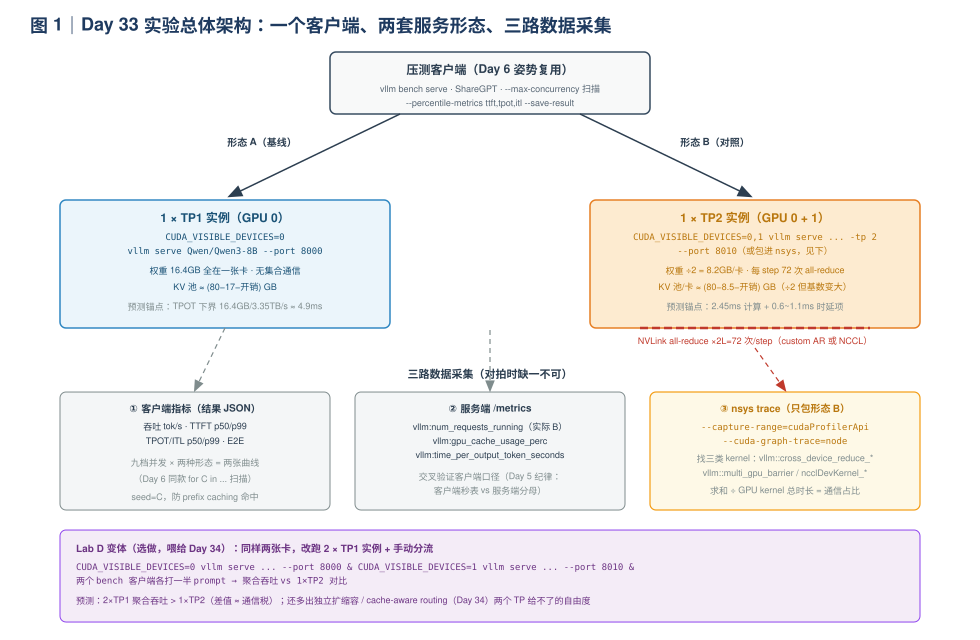
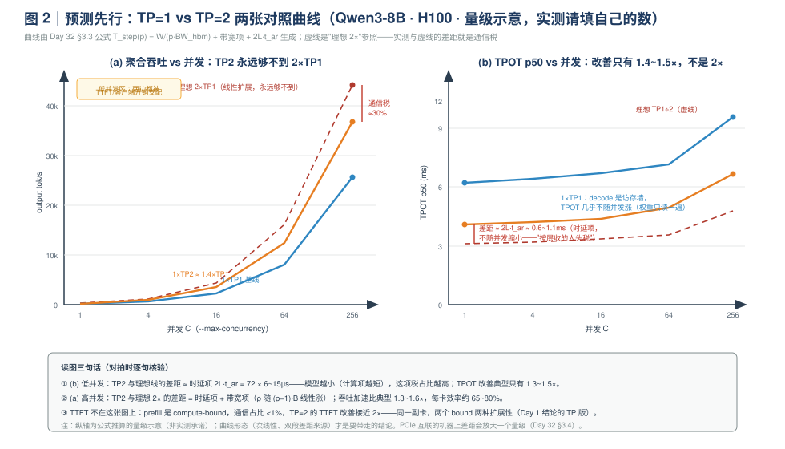
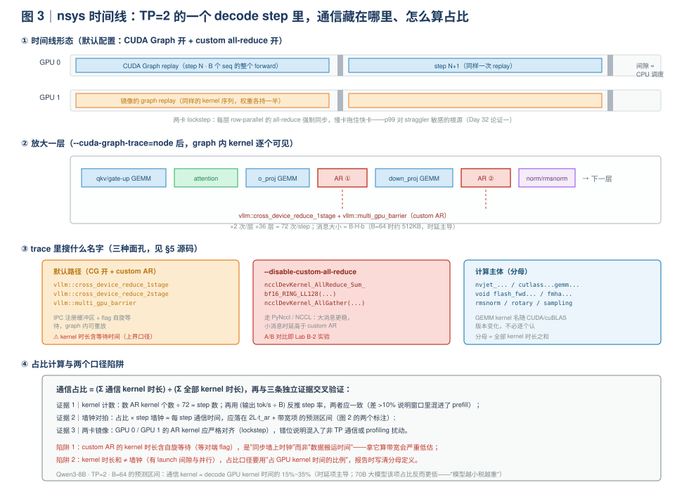

# Day 33｜分布式并行（二）：双卡 TP=2 vs 单卡实验——用 nsys 把通信占比挖出来

> **本周主线（Week 5）**：P/D 分离三天（Day 29-31）收官后，Day 32 把三种并行的**通信算术**算到了白板水平——TP 的 all-reduce、PP 的 bubble、EP 的 all-to-all，以及那句工程铁律"能单卡放下就别上 TP"。但昨天的三行预测还停在纸上：**TP=2 的 TPOT 改善 <2×、高并发吞吐 <2×、nsys 里通信 kernel 占比 ≈ ρ 预测值**。今天的工作只有一件事：把这三行预测变成三张实测表。
>
> **本日定位**：纯实验日。跑一个受控的 A/B 对比——同一模型（Qwen3-8B）、同一负载（ShareGPT）、同一张卡对，只动一个旋钮（`-tp 1` vs `-tp 2`）——量三组指标（吞吐 / TPOT+TTFT / 通信占比），并完成"预测 → 实测 → 差异解释"的完整闭环。收工时产出本周第 4 份、也是最后一份 A4 专题总结**《分布式推理》**（前三份：Day 24 量化、Day 28 投机解码、Day 31 P/D 分离）。
>
> **版本基线**：CLI 参数与源码坐标按撰写时（2026-10）main 分支口径；`vllm bench serve` / `vllm serve` 的 flag、`/start_profile` 的行为随版本演进较快，动手前先 `--help` 核对（昨天 §0 的三步核对法继续用）。本文涉及版本敏感处均就地标注。

**今日时间预算**：Lab A 并发扫描 60 min + Lab B nsys 剖析 50 min + Lab C 对拍 20 min + A4 总结 40 min ≈ 2.8 h；Lab D（2×TP1 对照）为选做 30 min。

---

## 0. 前情回顾与本日位置

| 前情 | 关键结论 | 今天怎么用 |
|---|---|---|
| Day 32 §3.3 | `T_step(p) = W_eff/(p·BW_hbm) + 2L·(2(p-1)/p)·BHb/BW_link + 2L·t_ar`；ρ 只随 `(p-1)·B` 涨 | 全部预测的公式来源；Lab C 对拍的"预测"列直接从这里填 |
| Day 32 Lab A | all-reduce 微基准：`t_ar`（16KB 消息）与 `BW_link`（8MB 消息）已实测 | 今天公式的两个常数是**你自己的测量值**，不再是 spec——预测精度上一个台阶 |
| Day 32 Lab B | TP 启动观察表：world size / custom AR 启用 / 权重显存 ÷2 / KV blocks ≈2× | 实验开始前的 sanity check：对不上先别跑压测 |
| Day 32 Lab C | 写好了三条预测 + 三个坑位（PCIe 机器、prefix caching、torchrun 混用） | 今天逐条兑现；坑位 ① 在 PCIe 机器上是"活体实验"而非失败 |
| Day 6 | `vllm bench serve` 九档并发扫描 + seed=C 防 prefix 命中 + 客户端口径纪律 | Lab A 直接复用整套脚本骨架，只是把服务端换成两种形态 |
| Day 5 | TTFT/TPOT/ITL 的客户端秒表 vs 服务端 `/metrics` 分母差异 | Lab A 的两组数要交叉验证，避免口径混账 |
| Day 18 | CUDA Graph：decode 默认走 graph replay；`--enforce-eager` 关闭 | Lab B 的关键前提：**graph 里的通信 kernel 长什么样、搜什么名字** |
| Day 19 | nsys 时间线方法：CPU/GPU 双轨找 bubble | Lab B 的操作底子；今天找的不是 bubble，是"红色"的通信段 |
| Day 13 | 实验记录三段对照法：现象 → 源码机制 → 指标表现 | Lab C 的记录格式 |
| Day 31 | A4 四段式（原理/场景/权衡/失效模式）与部署记录写法 | 今天照葫芦画瓢产出第 4 份 A4 |

**今日一句话论点**（先给结论，今天的实验就是它的证据链）：

> 对一个**单卡放得下**的模型（Qwen3-8B，16.4GB BF16），TP=2 在 decode 侧是"**交税买显存余量**"：TPOT 改善只有 **1.3~1.5×**（时延项 `2L·t_ar` 是按层收的人头税，模型越小税占比越高），高并发吞吐加速比 **1.3~1.6×**（每卡效率 65~80%），nsys 里通信 kernel 吃掉 decode GPU 时间的 **15~35%**——而 TTFT 因为 prefill 是 compute-bound，改善**接近 2×**。同一副卡、同一个 `-tp 2`，两种 bound 两种扩展性：这就是 Day 1 结论在并行维度上的重演，也是"prefill 池敢堆 TP、decode 池要精打细算"（Day 29）的实验注脚。

---

## 1. 今日学习目标

学完后你应该能：

1. **设计并执行**一个单变量受控实验：TP=1 vs TP=2 的并发扫描（吞吐 / TTFT / TPOT 三组曲线），并解释为什么必须控制模型、负载、seed、prefix caching、编译等级这五个变量；
2. **预测再实测**：用 Day 32 的 `T_step(p)` 公式（代入你自己 Lab A 测的 `t_ar`、`BW_link`）填出预测表，与实测对拍，并对每处偏差给出机制级解释（而非"实验误差"一句话糊弄）；
3. **用 nsys 抓取并量化** TP=2 decode step 的通信占比：知道 `--capture-range=cudaProfilerApi` + `/start_profile` 的配合方式、`--cuda-graph-trace=node` 为什么必须加、在 trace 里搜哪三类 kernel 名、以及两个口径陷阱（自旋等待、时长和 ≠ 墙钟）；
4. **说清** custom all-reduce 与 NCCL 在 trace 里的不同面孔及切换开关（`--disable-custom-all-reduce`），并实测两者的时延差；
5. **完成**（选做）`2×TP1 + 分流` vs `1×TP2` 的聚合吞吐对照——把 Day 32"论证二"从口头推导变成数据，并为 Day 34 的路由话题留下接口；
6. **产出** A4 专题总结《分布式推理：原理 / 场景 / 权衡 / 失效模式》——四份 A4 的收官之作，Day 35 复盘日的互讲素材。

---

## 2. 核心概念速查

| 术语 | 一句话定义 | 首次深入 |
|---|---|---|
| **单变量受控实验** | 只动 `-tp` 一个旋钮，其余（模型/负载/seed/编译/缓存）全部钉死——否则对拍无意义 | §3.1 |
| **通信税** | TP=p 相对理想线性扩展的损失：时延项 `2L·t_ar` + 带宽项 `2L·(2(p-1)/p)·BHb/BW_link` | §3.2 |
| **时延项（人头税）** | `2L·t_ar`：每层 2 次 AR 的固定时延，**不随 batch 缩小**、几乎不随模型宽度变——模型越小、TPOT 越短，占比越重 | §3.2 |
| **`--cuda-graph-trace=node`** | nsys 参数：把 CUDA Graph replay 展开成节点级 kernel——不加它，整个 graph 在 trace 里是一整块，通信 kernel 不可见 | Lab B |
| **capture range** | nsys 的按需采集窗口：`--capture-range=cudaProfilerApi` 让采集从 `cudaProfilerStart()` 开始——与 vLLM 的 `/start_profile` 配合，只抓压测窗口 | Lab B |
| **`vllm::cross_device_reduce_*`** | vLLM 自研 custom all-reduce 的 device kernel 名（1stage=one-shot 小消息 / 2stage=two-shot） | §5.1 |
| **`ncclDevKernel_AllReduce_*`** | NCCL 的 device kernel 名（RING/LL 等算法后缀）——关掉 custom AR 后出现 | §5.1 |
| **`vllm::multi_gpu_barrier`** | custom AR 的 flag 同步 kernel：自旋等待对端就位，**时长含等待**（口径陷阱 1） | §5.1 |
| **kernel 时间占比** | Σ通信 kernel 时长 ÷ Σ全部 kernel 时长——"通信占比"的 trace 口径，与 ρ 的墙钟口径要交叉验证 | §3.3 |
| **lockstep** | TP 每层 all-reduce 强制两卡同步：慢卡拖住快卡，step 时延取 max——p99 对 straggler 敏感 | 图 3 |
| **per-GPU 效率** | TP2 吞吐 ÷ (2 × TP1 吞吐)：衡量"第二张卡买到了几折的算力"，今天实验的 headline 数字 | Lab C |

---

## 3. 实验设计：预测先行（不写预测的实验是"跑着看"）

Day 13 立下的规矩：现象 → 源码机制 → 指标表现 三段对照。今天在前面再加一段：**预测**。四段合起来才是完整实验：预测 → 实测 → 机制 → 复盘。

### 3.1 实验矩阵与控制变量

| 项目 | 取值 | 为什么钉死 |
|---|---|---|
| 模型 | Qwen/Qwen3-8B（BF16，16.4GB 权重，L=36，H=4096） | 单卡放得下——正好落在"该不该上 TP"的争议区，实验才有分辨力 |
| 负载 | ShareGPT（Day 6 同一份），`--num-prompts 200`，`--temperature 0` | 与 Day 6/31 基线可比；贪心解码排除采样随机性 |
| 并发档位 | C ∈ {1, 4, 16, 64, 256}（比 Day 6 的九档减半，省时间） | 1 档看时延项、256 档看带宽项、中间档看过渡 |
| 自变量 | **仅 `-tp`（1 vs 2）** | 单变量原则 |
| prefix caching | `--no-enable-prefix-caching`（flag 名以 `--help` 为准） | 防止某档命中缓存拉低 TTFT，污染对拍（Day 29 同款注意） |
| 编译/图 | 两边都用默认（CUDA Graph 开） | Day 18 已知 CG 对 decode 时延影响大，不能一边开一边关 |
| seed | 每档 `--seed $C`，两种形态用同一 seed | 同一批 prompt、同一输出长度，排除负载方差 |
| 卡 | `CUDA_VISIBLE_DEVICES=0`（TP1）vs `0,1`（TP2） | 显式指定，防机器上有其他卡干扰 |

> **互联先验**：动手前先确认两卡怎么连的——`nvidia-smi topo -m` 看 `NV#`（NVLink）还是 `PIX/PHB`（PCIe）。**这决定了你对 §3.2 预测表的预期**：NVLink 机器按表走；PCIe 机器（如双 4090）带宽差一个量级、ρ 放大 ~10 倍，TP2 可能几乎无收益——那不是实验失败，是 Day 32 §3.4 的活体证据，照记不误。

### 3.2 手算预测表：把 Day 32 公式代进 Qwen3-8B

先把常数备齐（Day 2 的手算功底 + Day 32 Lab A 的实测值）：

| 常数 | 值 | 来源 |
|---|---|---|
| 权重字节 W | 8.2B × 2B = **16.4GB** | 模型卡 |
| 层数 × 每层 AR 数 | 36 × 2 = **72 次/step** | Day 32 §3.1 |
| `BW_hbm`（H100 SXM） | 3.35TB/s | spec |
| `BW_link`（NVLink 实测） | 你 Day 32 Lab A 的 8MB 档 busbw（参考 ~700-800GB/s） | **实测** |
| `t_ar`（512KB 消息实测） | 你 Day 32 Lab A 的 16KB 档（参考 ~6~20μs，custom AR 更快） | **实测** |
| 每 token KV | 2×36×8×128×2B = **147KB** | Day 2 公式（GQA 8 头） |

**decode 单 step 三项分解**（B=64 档，TP=2，消息 V = B·H·b = 64×4096×2 = 512KB/次 AR）：

$$
T_{\text{step}}(2) = \underbrace{\frac{16.4\text{GB}}{2 \times 3.35\text{TB/s}}}_{= 2.45\text{ms 计算}}
+ \underbrace{72 \times \frac{512\text{KB}}{BW_{\text{link}}}}_{\approx 0.05\text{ms 带宽项}}
+ \underbrace{72 \times t_{ar}}_{\approx 0.4\sim1.4\text{ms 时延项}}
\approx 2.9 \sim 3.9\text{ms}
$$

三个立即可见的洞察（比数字本身重要）：

1. **8B 模型的 TP2 通信几乎纯时延项**：带宽项 0.05ms，只有时延项的零头。512KB 消息在 700GB/s 链路上数据时间 <1μs，但一次 AR 的端到端时间被 `t_ar` 主导——**消息要到几十 MB（对应 B 几千）带宽项才抬头**，远超今天 256 的并发上限。
2. **时延项是"按层收的人头税"**：`2L·t_ar` 只看层数和单次时延，不看模型宽度、不看 batch。70B（L=80）税 ≈ 2.4ms，但它的计算项 20.4ms，占比 12%；8B（L=36）税 ≈ 0.6~1.4ms，计算项只有 2.45ms，**占比 20~35%——模型越小，税越重**。这就是"小模型上 TP 更不划算"的定量出处。
3. **KV 项今天可以忽略**：B=64 时每 step 读 KV ≈ 64 × 147KB × 平均上下文长度（几百 token）≈ 数 GB 量级？不——是 64 × 147KB × 300 ≈ 2.8GB，÷2 卡 ÷3.35TB/s ≈ 0.4ms，已经不能完全忽略。诚实修正：`W_eff` 应含 KV，预测表里留一列"KV 修正"。ShareGPT 短对话下它约是计算项的 15%，中并发档开始计入。

**预测总表**（Lab C 的"预测"列，现在就抄到实验记录本上）：

| 指标 | 档位 | TP1 预测 | TP2 预测 | 加速比预测 | 依据 |
|---|---|---|---|---|---|
| TPOT p50 | C=1 | ≥4.9ms（下界），实际 6~8ms | 3.5~4.5ms | **1.3~1.5×** | 时延项占比 20~35% |
| TPOT p50 | C=256 | 7~11ms（KV 项抬头） | 5~8ms | **1.3~1.5×** | 时延项 + 少量带宽项 |
| 吞吐 | C=256 | 25~35k tok/s | 33~45k tok/s | **1.3~1.6×** | 同上 + lockstep 抖动 |
| TTFT p50 | 各档 | 基线 | ≈0.55×基线 | **≈1.8×** | prefill 通信占比 <1%（Day 32 §3.3） |
| 通信 kernel 占比 | C=64 | 0（无 AR） | **15~35%** | — | 时延项 / (计算+时延) |
| AR kernel 计数 | 任意 | 0 | **72 × step 数** | — | 计数交叉验证用 |

> 数值都是"公式 + 量级假设"的推算，**作用是给实测画一个靶区**——落在区间外不是坏事，是发现新机制的入口（见 Lab C 的差异解释清单）。

### 3.3 nsys 里该看到什么：先把"红色"认出来

去实验室之前先认人（细节与完整命令在 Lab B 和 §5）：

| trace 里的名字 | 是谁 | 何时出现 |
|---|---|---|
| `vllm::cross_device_reduce_1stage` / `2stage` | custom all-reduce 的数据 kernel（one-shot / two-shot） | 默认路径：CG 开 + custom AR 启用 |
| `vllm::multi_gpu_barrier` | custom AR 的 flag 同步 | 同上，紧跟数据 kernel |
| `ncclDevKernel_AllReduce_Sum_bf16_RING*` 等 | NCCL 数据 kernel | `--disable-custom-all-reduce` 后 |
| `nvjet_*` / `cutlass*gemm*` / `*flash*` / `*rmsnorm*` | 计算主体（分母） | 一直在 |

**一个容易扑空的坑**：默认配置下 decode 走 CUDA Graph，而 graph 里的 kernel 在 nsys 默认设置下**不逐个展开**——trace 里只有一大块 replay，你搜 `nccl` 一个都搜不到，误以为"没有通信"。必须加 `--cuda-graph-trace=node`（这是 vLLM 官方 profiling 文档明确提醒的）。这也是 Day 18"通信必须用注册缓冲区 kernel 才能进 graph"的 trace 侧印证：你看到的会是 `vllm::` 开头的 custom AR，而不是 NCCL。

实验架构与数据流全景（图 1）——一个客户端、两套服务形态、三路数据采集：



预测曲线的形状先画出来（图 2），实测点往上叠：



---

## 4. 动手实验

### Lab A｜TP=1 vs TP=2：吞吐 / TTFT / TPOT 并发扫描（60 min）

**Step 1｜起服务（先跑 TP1 基线）**：

```bash
# 终端 1 · 形态 A：单卡
CUDA_VISIBLE_DEVICES=0 vllm serve Qwen/Qwen3-8B \
  --max-model-len 16384 --port 8000 \
  --no-enable-prefix-caching 2>&1 | tee /tmp/day33_tp1.log
```

就绪后先做 **Day 32 Lab B 的四行 sanity check**（world size / custom AR / 权重显存 / KV blocks）——对不上就停下排查，别让坏基线污染一上午。TP1 侧注意两行：权重 ~16.4GB；`GPU KV cache size` 记下来（后面算 KV 池扩缩）。

**Step 2｜TP1 扫描**（Day 6 骨架减档）：

```bash
mkdir -p results/day33
# 预热（不落盘）：编译缓存 / CUDA graph bucket / 连接池热起来
vllm bench serve --model Qwen/Qwen3-8B --tokenizer Qwen/Qwen3-8B \
  --base-url http://localhost:8000 \
  --dataset-name sharegpt --dataset-path ~/bench/ShareGPT_V3_Vicuna_unfiltered_cleaned_split.json \
  --num-prompts 16 --max-concurrency 4 --seed 0 --temperature 0

for C in 1 4 16 64 256; do
  vllm bench serve --model Qwen/Qwen3-8B --tokenizer Qwen/Qwen3-8B \
    --base-url http://localhost:8000 \
    --dataset-name sharegpt --dataset-path ~/bench/ShareGPT_V3_Vicuna_unfiltered_cleaned_split.json \
    --num-prompts 200 --max-concurrency $C --seed $C --temperature 0 \
    --percentile-metrics ttft,tpot,itl --metric-percentiles 50,99 \
    --save-result --save-detailed \
    --result-dir results/day33 --result-filename tp1_c${C}.json \
    --metadata concurrency=$C 2>&1 | tee results/day33/tp1_c${C}.log
done
```

扫描时另开终端盯 `/metrics`（Day 5 纪律）：确认 `vllm:num_requests_running` 真的到了 C（没到说明被 `max_num_seqs` 截断，记下来）；顺手抄 `vllm:time_per_output_token_seconds` 与客户端 TPOT 对拍。

**Step 3｜换形态 B（TP=2）重复**：停掉服务，起 TP2，**同样的命令、只把 result 前缀换成 `tp2_`**：

```bash
CUDA_VISIBLE_DEVICES=0,1 vllm serve Qwen/Qwen3-8B \
  --max-model-len 16384 --port 8000 -tp 2 \
  --no-enable-prefix-caching 2>&1 | tee /tmp/day33_tp2.log
```

日志里多确认一行：custom all-reduce 是否启用（搜 `Custom allreduce` / `custom allreduce`）。若显示 disabled（比如 `VLLM_DISABLE_CUSTOM_ALL_REDUCE` 被设置或互联不满足条件），记下来——它会把 `t_ar` 抬高一截，Lab B 里正好做 A/B。

**Step 4｜出图与填表**：

```python
# plot_day33.py — 把 results/day33/*.json 汇成两条曲线（matplotlib）
import json, glob, re
import matplotlib.pyplot as plt

def load(prefix):
    xs, tp, ttft, tpot = [], [], [], []
    for f in sorted(glob.glob(f"results/day33/{prefix}_c*.json"),
                    key=lambda s: int(re.search(r"_c(\d+)", s).group(1))):
        d = json.load(open(f))
        xs.append(d["max_concurrency"]); tp.append(d["output_throughput"])
        ttft.append(d["median_ttft_ms"]); tpot.append(d["median_tpot_ms"])
    return xs, tp, ttft, tpot
# 字段名以 json 实际内容为准（--save-result 的 schema 随版本微调）；
# 中位数字段若不存在，用 percentile 明细里的 50 分位。

fig, ax = plt.subplots(1, 2, figsize=(11, 4))
for prefix, label in [("tp1", "TP=1"), ("tp2", "TP=2")]:
    xs, tp, ttft, tpot = load(prefix)
    ax[0].plot(xs, tp, marker="o", label=label)
    ax[1].plot(xs, tpot, marker="o", label=label)
ax[0].set_xscale("log"); ax[0].set_xlabel("concurrency"); ax[0].set_ylabel("tok/s"); ax[0].legend()
ax[1].set_xscale("log"); ax[1].set_xlabel("concurrency"); ax[1].set_ylabel("TPOT p50 (ms)"); ax[1].legend()
plt.tight_layout(); plt.savefig("results/day33/tp1_vs_tp2.png", dpi=150)
```

把图 2 的两条预测曲线（手画或重画）与实测叠放，填 Lab C 的主表（§4 Lab C）。

> **常见坑**：① TP2 下 `max_num_seqs` / KV blocks 变多，C=256 档的实际 running 可能高于 TP1（KV 池/卡变大）——这不是干扰，是 TP 的真实收益之一（Day 32 §3.5"隐性优势"），但要记录；② 两形态间机器温度/时钟有漂移，先跑哪边各留 5 分钟冷却；③ `--save-detailed` 的逐请求明细留着，Lab B 的 nsys 窗口要对得上其中一段。

### Lab B｜nsys 抓通信占比（50 min）

**Step 1｜把 TP2 服务包进 nsys**（只抓形态 B；TP1 无集合通信，没必要抓）：

```bash
CUDA_VISIBLE_DEVICES=0,1 nsys profile \
  -o /tmp/day33_tp2 \
  --trace=cuda,nvtx \
  --cuda-graph-trace=node \
  --capture-range=cudaProfilerApi --capture-range-end=stop \
  -f true \
  vllm serve Qwen/Qwen3-8B --max-model-len 16384 --port 8000 -tp 2 \
  --no-enable-prefix-caching
```

参数逐个说清：`--capture-range=cudaProfilerApi` 表示**不从头录**，等 `cudaProfilerStart()` 被调用才开始（vLLM 的 `/start_profile` 会触发它，官方 profiling 文档就是这么配合的）；`--capture-range-end=stop` 在 `cudaProfilerStop()` 后落盘；`--cuda-graph-trace=node` 把 graph replay 展开到节点级（§3.3 的坑）。

> **版本敏感**：不同版本 `/start_profile` 的参数（`activities`、`num_steps` 等）有差异，以 `curl localhost:8000/docs` 与官方 profiling 文档为准。若你的版本 `/start_profile` 与 capture-range 配合不上，退路是定时窗：`nsys profile --delay <启动秒数> --duration 30 ...` 硬切一段（会带上一小段空闲，分母口径要在报告里写明）。

**Step 2｜用中并发档做采样负载**：C=64 是好窗口——batch 稳定、decode 占比高、TTFT 干扰小：

```bash
# 服务就绪后，先起 capture 区间，再打负载，再关区间
curl -X POST http://localhost:8000/start_profile
vllm bench serve --model Qwen/Qwen3-8B --tokenizer Qwen/Qwen3-8B \
  --base-url http://localhost:8000 \
  --dataset-name sharegpt --dataset-path ~/bench/ShareGPT_V3_Vicuna_unfiltered_cleaned_split.json \
  --num-prompts 64 --max-concurrency 64 --seed 33 --temperature 0 \
  --percentile-metrics ttft,tpot,itl
curl -X POST http://localhost:8000/stop_profile
# 等 nsys 落盘：Removing ... / report saved 提示出现再动终端
```

**Step 3｜统计 kernel 时间占比**——两条路，都走一遍：

```bash
# 路线 1：报告表（快，适合现场看）
nsys stats --report cuda_gpu_kern_sum /tmp/day33_tp2.nsys-rep | head -40

# 路线 2：导出 sqlite 精确求和（进 A4 的数字用这条）
nsys export --type sqlite -o /tmp/day33_tp2.sqlite /tmp/day33_tp2.nsys-rep
sqlite3 /tmp/day33_tp2.sqlite "
SELECT s.value AS kernel,
       COUNT(*) AS n,
       ROUND(SUM(k.end-k.start)/1e6, 1) AS total_ms
FROM CUPTI_ACTIVITY_KIND_KERNEL k JOIN StringIds s ON k.demangledName=s.id
GROUP BY s.value ORDER BY total_ms DESC LIMIT 25;"
```

然后算三个数（对照图 3 的公式与陷阱）：

```text
通信 kernel 时长 = Σ(vllm::cross_device_reduce_* ) + Σ(vllm::multi_gpu_barrier)
                  （或 Σ(ncclDevKernel_*)，取决于开关）
通信占比        = 通信 kernel 时长 ÷ Σ 全部 kernel 时长
AR 计数交叉验证 = count(cross_device_*) ÷ 72 → step 数 ≈ 采样窗口输出 token 数 ÷ 64
```

**Step 4｜A/B：custom AR vs NCCL**（10 min，性价比极高的一步）：停服，加 `--disable-custom-all-reduce` 重跑 Step 1-3（nsys 输出文件名换 `nccl`）。比较：① 同档 TPOT 差多少（custom AR 的 `t_ar` 优势）；② trace 里 `ncclDevKernel_*` 的个数与时长（NCCL kernel 通常把同步等待也计在 kernel 里，时长的"水分"更大——口径陷阱 1 的现场教材）。

**Step 5｜打开 nsys UI 看一眼时间线**（5 min）：双卡泳道对齐看 lockstep；放大一个 step，数一数 72 个红色小块的分布——"每层两次、贯穿全程"这件事，看一眼胜过背十遍（图 3①② 就是它的示意图）。



### Lab C｜预测 → 实测 → 差异解释（20 min，本日灵魂）

把 Lab A/B 的数填进主表（示例结构，数字填你自己的）：

| 指标 | 档位 | 预测（§3.2） | 实测 | 差异 | 机制解释 |
|---|---|---|---|---|---|
| TPOT p50 加速比 | C=1 | 1.3~1.5× | ___ | ___ | 偏离时按下面清单逐项排 |
| TPOT p50 加速比 | C=256 | 1.3~1.5× | ___ | ___ | |
| 吞吐加速比 | C=256 | 1.3~1.6× | ___ | ___ | |
| per-GPU 效率 | C=256 | 65~80% | ___ | ___ | TP2 吞吐 ÷ 2 ÷ TP1 吞吐 |
| TTFT 加速比 | 任意 | ≈1.8× | ___ | ___ | prefill 近线性的证据 |
| 通信 kernel 占比 | C=64 | 15~35% | ___ | ___ | 时延项主导，对 t_ar 敏感 |
| AR 计数 ÷ 72 vs tok/s÷64 | C=64 | 一致 | ___ | ___ | 不一致 → 窗口混入 prefill |

**差异解释清单**（实测偏离预测时按序排查，这是 Day 13 三段对照法的展开）：

1. **实测 TPOT 改善 > 预测上界（如 >1.6×）**：多半是 TP1 侧基线被拖脏——`max_num_seqs` 或 KV 不够导致 TP1 实际 running < C（查 `/metrics`），或 TP1 档先跑机器已热降频。修：重跑基线，两边互换顺序再测一轮。
2. **实测 < 预测下界（如 <1.2×）**：按顺序查——互联是 PCIe（`nvidia-smi topo -m`，ρ 放大 10 倍）；custom AR 没启用（日志）；两卡时钟差异大（lockstep 的 max 效应）；TP2 的 `max_num_seqs`/KV 更大导致实际 batch 更大（吞吐档位公平性被破坏，应把两边 `max_num_seqs` 钉成同值重跑）。
3. **通信占比 > 35%**：先查口径——把 `multi_gpu_barrier`（纯等待）计入通信会系统性高估；再查 `t_ar` 是否被 NCCL 路径或 profiling 开销放大（nsys 本身会给小 kernel 加开销，量级 ~1μs/个，72 个/step 时不可忽略——这正是要交叉验证的原因）。
4. **TTFT 改善远 <1.8×**：查 prefill 是否被 chunked（长 prompt 切块后调度形态变化）、或 TP2 的首 token 路径上还有未被并行化的串行段（tokenizer、采样、日志）。
5. **AR 计数对不上**：窗口混入 prefill step（prefill forward 也做 AR，但每 step token 数不同）——用 `--num-prompts 64 --max-concurrency 64` 的稳态窗口重抓。

> **PCIe 机器专属剧情**（Day 32 坑位 ① 的兑现）：如果你的两张卡走 PCIe，预测表先重算——`BW_link` 从 ~700GB/s 掉到 ~20-30GB/s（Day 32 Lab A 你已经测出来了），时延也翻倍。此时 TP2 的 TPOT 可能不降反升（税 > 计算收益），这是一份同样值钱（甚至更值钱）的实验结果："在什么硬件上 TP=2 会负收益"——面试里能甩出这条边界数据的候选人不多。

### Lab D（选做）｜2×TP1 + 分流 vs 1×TP2：把"论证二"跑成数据（30 min）

Day 32 §3.5 论证二的口头版：同样两张卡，两个独立 TP1 实例的聚合吞吐 > 一个 TP2 实例。今天 30 分钟可以拿到数字版（也是 Day 34 路由的预告片）：

```bash
# 终端 1/2：两个 TP1 实例（注意端口与卡各占其一）
CUDA_VISIBLE_DEVICES=0 vllm serve Qwen/Qwen3-8B --max-model-len 16384 \
  --port 8000 --no-enable-prefix-caching &
CUDA_VISIBLE_DEVICES=1 vllm serve Qwen/Qwen3-8B --max-model-len 16384 \
  --port 8010 --no-enable-prefix-caching &

# 终端 3/4：两个客户端各打一半（同 seed 同数据集，--num-prompts 100 ≈ Lab A 的一半）
for PORT in 8000 8010; do
  vllm bench serve --model Qwen/Qwen3-8B --tokenizer Qwen/Qwen3-8B \
    --base-url http://localhost:$PORT \
    --dataset-name sharegpt --dataset-path ~/bench/ShareGPT_V3_Vicuna_unfiltered_cleaned_split.json \
    --num-prompts 100 --max-concurrency 32 --seed 64 --temperature 0 \
    --percentile-metrics ttft,tpot,itl \
    --save-result --result-dir results/day33 --result-filename 2xtp1_$PORT.json &
done; wait
```

对照读数（C_total=64，与 Lab A 的 C=64 档对齐）：

| 读数 | 1×TP2（Lab A） | 2×TP1 分流 | 预期 |
|---|---|---|---|
| 聚合吞吐 | ___ | 两个 json 的 output_throughput 相加 | 2×TP1 > TP2，差值 ≈ 通信税 |
| TPOT p50 | ___ | 两实例各报各的 | 2×TP1 更低（无 AR、无 lockstep） |
| p99 | ___ | ___ | 2×TP1 更稳（无跨卡同步抖动） |

> 诚实标注两个不公平点（写进实验记录，面试被追问时的加分项）：① 2×TP1 每个 instance 只吃一半流量，C=32 比 C=64 的 batch 小，TPOT 占便宜——严格对齐要再跑一组 `2×TP1 各 C=64` 与 `1×TP2 C=128` 的双倍流量对照；② 2×TP1 的 KV 池总量更小（权重各复制一份）。结论口径建议："同卡数、同流量下，2×TP1 的聚合吞吐与 TPOT 均优于 1×TP2，代价是多一份权重与运维复杂度"。

---

## 5. 源码走读：从 trace 里的 kernel 名反查调用链

今天实验里出现的每一个名字，都能沿调用链摸回源码。反过来，知道链路才能解释 A/B 差异。（坐标沿用 Day 32 §6 的 main 分支口径，版本漂移处已标注。）

### 5.1 all-reduce 的三张面孔与选择逻辑

一次 decode forward 中，AR 的调用链（Day 32 §6.2 已走读，今天补 trace 侧对照）：

```text
vllm/model_executor/layers/linear.py :: RowParallelLinear.forward()
  └─ vllm/distributed/communication_op.py :: tensor_model_parallel_all_reduce()
       └─ vllm/distributed/parallel_state.py :: GroupCoordinator.all_reduce()
            ├─ ① device_communicators/custom_all_reduce.py :: CustomAllreduce.custom_all_reduce()
            │     条件 should_custom_ar()：消息 ≤ max_size（默认 8MB 量级）、
            │     world_size ≤ 8、full_nvlink（或 P2P）——命中 → vllm::cross_device_reduce_1/2stage
            ├─ ② device_communicators/pynccl.py :: PyNccl.all_reduce()
            │     NCCL 裸绑定（无 torch 侧调度）→ ncclDevKernel_AllReduce_*
            └─ ③ torch.distributed.all_reduce() → 同样落 NCCL kernel（兜底）
```

对照今天的 trace：默认配置你看到 ①（`vllm::` 前缀）；`--disable-custom-all-reduce` 后落到 ②/③（`ncclDevKernel_` 前缀）。**Step 4 A/B 差异的机制解释**就藏在这里：custom AR 用 IPC 注册缓冲区 + flag 自旋，砍掉了 NCCL 通信器内部的调度与协议协商开销，小消息（decode 的 B·H·b 正是典型小消息）时延显著更低；代价是它要独占一块注册显存、且只覆盖 ≤8 卡 NVLink 域——"域内用专线，域外走公网"。

### 5.2 为什么 decode trace 里可能搜不到 "nccl"

这是今天最容易迷惑的点，串起 Day 18：decode 默认走 CUDA Graph，**capture 时用哪个通信实现，replay 时就永远是它**。custom AR 的注册缓冲区设计天然 graph-safe（kernel 只读写固定地址，每次 replay 前 vLLM 把数据拷进缓冲区）；NCCL 的常规路径不是为 capture 设计的（内部有 host 侧状态机）。所以：

| 配置 | decode trace 里看到的 | 说明 |
|---|---|---|
| 默认（CG + custom AR） | `vllm::cross_device_reduce_*`（graph 节点级） | 生产路径 |
| CG + `--disable-custom-all-reduce` | PyNccl 的 graph-capture 模式（若版本支持）或回退 | 版本敏感，行为可能变化 |
| `--enforce-eager` + 关 custom AR | `ncclDevKernel_*` 明晃晃一大排 | 最直观的教学形态 |

实验建议：**主测量用默认配置**（测的是生产路径），**教学观察用 eager + NCCL**（看得最清楚），两份 trace 对照着看，"通信藏在 graph 里"这件事就有体感了。

### 5.3 profiling 的接缝：`/start_profile` 怎么落到 cudaProfilerApi

```text
API server（前端进程）POST /start_profile
  └─ RPC → vllm/v1/engine/core.py :: EngineCore
       └─ vllm/v1/engine/profiler.py :: Profiler.start_profile()
            ├─ torch.profiler（activities=[CPU, GPU]）→ trace 落盘 VLLM_TORCH_PROFILER_DIR
            └─ 触发 cudaProfilerStart() → 与 nsys 的 --capture-range=cudaProfilerApi 握手
```

两套 profiler 的分工：**torch profiler**（`/start_profile` 直接用）输出带 Python 栈的 trace，适合找 CPU 侧瓶颈（Day 19 的用法）；**nsys** 用 capture-range 只借 `cudaProfilerStart/Stop` 这对信号开窗，kernel 级时间线更完整、开销更低——今天抓通信占比选它。`--num-steps` 之类的按 step 采样参数在 V1 里演进较快，以你版本的 API 文档为准（诚实标注：这块是我明确不确定、动手前必须 `curl localhost:8000/docs` 核对的）。

### 5.4 昇腾经验迁移（接 Day 32 §6.4）

今天的方法论在昇腾上完全成立，只换名字：nsys ↔ msprof / Ascend Profiler，`ncclDevKernel_*` ↔ HCCL 算子名，`nvidia-smi topo -m` ↔ `npu-smi info` 拓扑查询；"graph 里只能放注册缓冲区的通信 kernel" ↔ HCCL 融合算子进图（你做过的流水线优化里，通信进图、双缓冲藏等待是同一件事）。**"用 profiler 把集合通信时间从 step 里剥出来"是跨平台通用技能**——Day 36 选 vllm-ascend 性能切入点时，今天的实验流程可以原样搬过去做基线。

---

## 6. A4 专题总结《分布式推理》（本周第 4 份，收官）

四份 A4 的最后一份。Day 35 复盘日要模拟白板互讲，今天写的时候就要按"能讲"的标准写。四段式骨架 + 参考要点（浓缩 Day 32 全天 + 今天数据，一页 A4 装得下）：

**① 原理（三行公式 + 一张图）**

- TP：col+row 配对 → 每层恰好 2 次 AR；ring 每 GPU `2(p-1)/p·V`；`T_step(p)` 三项分解（计算 ÷p、带宽项随 (p−1)·B、时延项 2L·t_ar 不随 batch 缩）。配 Day 32 图 1。
- PP：bubble `(p-1)/(m+p-1)`；边界只传 activation（PCIe 都够）——用显存容量换吞吐分母。
- EP：整专家分布 + all-to-all dispatch/combine（`2E·H·b`/token），只在 MoE 层、可重叠；DeepSeek：DP attention + EP + 双流。

**② 场景（决策树，倒着背）**

- 显存放不下 → 量化先试 → 机内 TP（NVSwitch 域 ≤8）→ 跨机 PP/EP → 多实例 + 路由提 goodput；
- prefill 算力不够 TTFT SLO → 敢堆 TP（通信 <1%）；decode 池 → 低 TP、多实例（今天的实验数据就是 decode 侧证据）；
- 单卡放得下 → 默认多实例（Lab D 的数据）。

**③ 权衡（把今天的数字填进去）**

| 维度 | TP=2 实测（我自己的数） | 2×TP1 对照 |
|---|---|---|
| TPOT p50 加速/绝对值 | ___ | ___ |
| 聚合吞吐 / per-GPU 效率 | ___ | ___ |
| TTFT | ___ | ___ |
| KV 池/卡 | ÷2 且基数变大（+） | 每卡全量但两份权重（−） |
| p99 / lockstep | 同步抖动（−） | 独立，更稳（+） |
| 运维 | 单实例简单 | 扩缩容 / 路由自由（Day 34） |

**④ 失效模式（每条配"怎么发现"）**

- 跨机/PCIe 开 TP：ρ ×10~18 → TPOT 不降反升（发现：`nvidia-smi topo -m` + nsys 通信占比 >50%）；
- 大 batch + 大 TP 度：带宽项抬头（发现：吞吐加速比随 C 增大而下降的斜率）；
- 小模型上 TP：时延项占比高（发现：今天 8B 实验，TPOT 改善 <1.5×）；
- straggler 拖 p99：lockstep 取 max（发现：nsys 双卡泳道 AR 错位 / p99-p50 差距大）；
- TP > kv_heads：KV 复制，显存收益打折（Day 32 §3.1 坑位，8 卡 TP 跑 8 KV 头模型时踩）。

---

## 7. 面试高频问题

**Q1：你说"能单卡放下就别上 TP"——你的实验数据是什么？**
> 要点：甩今天的表。TPOT 加速 1.3~1.5×（时延项 2L·t_ar，8B 模型上占 20~35%）；吞吐 per-GPU 效率 65~80%；2×TP1 分流对照聚合吞吐更高且 p99 更稳；例外：显存墙 / prefill 算力不够（TTFT 改善 ~2×，prefill 通信 <1%）。**有自己数字的候选人，和只有文档结论的候选人，可信度差一个档。**

**Q2：怎么测出 TP 的通信占比？口径陷阱有哪些？**
> 要点：nsys `--capture-range=cudaProfilerApi` 配 `/start_profile` 开窗 + `--cuda-graph-trace=node` 展开 graph；kernel 名搜 `vllm::cross_device_reduce_*`（custom AR）或 `ncclDevKernel_*`；占比 = Σ通信 kernel ÷ Σ全部 kernel。陷阱：① custom AR kernel 时长含自旋等待（是同步时钟不是搬运时间）；② kernel 时长和 ≠ 墙钟；③ 默认 trace 不展开 graph，会误判"没有通信"；④ 窗口混入 prefill 会污染计数——用 AR 个数 ÷ 2L 与 tok/s ÷ B 交叉验证。

**Q3：为什么小模型上 TP 更不划算？**
> 要点：通信税分两项，时延项 `2L·t_ar` 只看层数、不看宽度与 batch——是按层收的人头税。计算项随模型变小线性缩，税不缩：8B/TP2 时延项占 20~35%，70B/TP2 只占 ~12%。推论：同样的 TP 拓扑，模型越大扩展性越好（但显存墙也在同方向收紧）。

**Q4：custom all-reduce 为什么比 NCCL 快？什么时候用不了？**
> 要点：IPC 注册缓冲区 + flag 自旋（one/two-shot），砍掉通信器协议开销，小消息时延低且 graph-safe（kernel 只读写固定地址）。限制：消息上限（~8MB 量级）、world ≤8、要求 full NVLink/P2P——域外或大消息回落 PyNccl/NCCL。A/B 数据：今天 Step 4 的 TPOT 差。

**Q5：TP 的 p99 为什么比单卡差？**
> 要点：每层 2 次 AR 强制 lockstep，step 时延 = max(两卡)，慢卡拖快卡——时钟漂移、邻居噪声、不均衡负载都进 p99；单请求时还有 2L·t_ar 的固定串行段。发现手段：nsys 双卡泳道看 AR 对齐性；对策：decode 池降 TP 度、多实例隔离噪声。

**Q6（场景题）：双卡 NVLink 的机器跑 8B 模型，你会怎么部署？给出量化依据。**
> 要点：默认 `2×TP1 + router`（Lab D 数据：聚合吞吐↑、TPOT↓、p99 稳、可独立扩缩容 + Day 34 cache-aware routing）；例外：单请求低时延场景若 TTFT/TPOT 仍不达标、且 2×TP1 已饱和 → 才考虑 TP2（buy FLOPs）；模型 >单卡显存 → 别无选择。答题结构：先问 SLO 与显存，再给形态，最后甩自己的实验数字。

**Q7（经验迁移题）：把今天的实验搬到昇腾上要换哪些件？**
> 要点：nsys→msprof；NCCL kernel 名→HCCL 算子名；custom AR→HCCL 融合算子/通信进图；`nvidia-smi topo -m`→`npu-smi info`；方法论不变：单变量 A/B + 预测先行 + kernel 级通信剥离 + 计数交叉验证。落点：Day 36 vllm-ascend 的性能基线就这么做。

---

## 8. 今日总结

| # | 要点 | 一句话 |
|---|---|---|
| 1 | 实验方法论 | 预测 → 实测 → 机制 → 复盘 四段闭环；单变量，五个钉子（模型/负载/seed/缓存/编译） |
| 2 | TPOT 加速 1.3~1.5× | 时延项 `2L·t_ar` 人头税；模型越小税越重（8B 占 20~35% vs 70B ~12%） |
| 3 | 吞吐加速 1.3~1.6× | per-GPU 效率 65~80%；lockstep 拖 p99；TTFT 却近 2×（prefill <1%） |
| 4 | 通信占比测量 | nsys capture-range + graph-trace=node；搜 `vllm::cross_device_reduce_*` / `ncclDevKernel_*`；两个口径陷阱 |
| 5 | 三张面孔 | custom AR（域内专线、graph-safe）→ PyNccl → torch.distributed（兜底）；A/B 实测时延差 |
| 6 | 2×TP1 对照 | 同卡数聚合吞吐更高、p99 更稳——"别上 TP"的数据版；Day 34 路由的预告片 |
| 7 | 失效边界 | PCIe/跨机 ρ×10~18；大 batch 大 TP 带宽项抬头；TP>kv_heads KV 复制 |
| 8 | 产出 | 四份 A4 收官：《分布式推理》；Day 35 复盘互讲 |

**带走的三张图**：图 1（实验架构与三路采集）、图 2（预测曲线与通信税标注——面试画板首选）、图 3（nsys 时间线与占比计算）。

---

## 9. 今日自测题（不看笔记作答）

1. 背公式并代入自己的数：你的机器上 Qwen3-8B TP=2、C=64 的 `T_step` 三项各是多少毫秒？与实测 TPOT 差多少、差在哪一项？
2. nsys 抓 TP2 decode，为什么必须加 `--cuda-graph-trace=node`？不加的话 trace 里看到什么、会得出什么错误结论？
3. 你测出通信 kernel 占比 40%，比预测上限还高——列出至少三个排查步骤（提示：口径、路径、窗口纯净性、profiler 开销）。
4. custom AR 和 NCCL 各自的适用域是什么？为什么 custom AR 能被 capture 进 CUDA Graph 而 NCCL 常规路径不行？
5. 场景题：老板说"再加一张卡把 TPOT 砍半"，你用今天哪个数据/哪个实验反驳或支持他？什么条件下他是对的？

（答案都在 §3-§5 与 Lab C 清单；答不上来的小节今晚重读。）

---

## 10. 今日产出物

- [ ] **TP1 vs TP2 并发扫描数据**：`results/day33/tp{1,2}_c*.json` 十个文件 + 两张对照曲线图（吞吐 / TPOT）——A4 的数据底座
- [ ] **预测-实测对拍主表**（Lab C）：七行指标 + 差异解释，三段对照法记录格式
- [ ] **nsys 剖析记录**：`/tmp/day33_tp2.nsys-rep`（留档）+ 通信占比数字 + AR 计数交叉验证 + custom AR vs NCCL 的 A/B 对比一行结论
- [ ] **A4 专题总结《分布式推理》**（§6 骨架填满，四份 A4 收官）——Day 35 复盘日互讲素材
- [ ] （选做）**2×TP1 vs 1×TP2 对照数据**（Lab D）——Day 34 cache-aware routing 的引子
- [ ] 打卡一句话：今天的实测里哪一个数字最出乎意料？为什么（用一句机制解释）？

> **明日预告（Day 34：prefix caching 与路由）**：今天 Lab D 里两个 TP1 实例是"手动分流"——谁来决定一个请求去哪个实例？随机轮询浪费了最值钱的资源：**已经躺在某个实例 KV 池里的前缀**。明天把 Day 16 的 block hash、今天的多实例形态、Day 31 的 router 三条线拧在一起：cache-aware routing 的命中率的算术、`cache_salt` 防跨租户缓存泄漏、以及"GPU→CPU→SSD 分层 KV 池"的集群视角。今天"2×TP1 聚合吞吐更高"的结论，明天会再涨一截。
