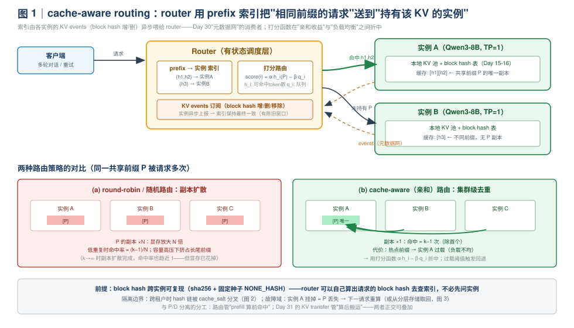
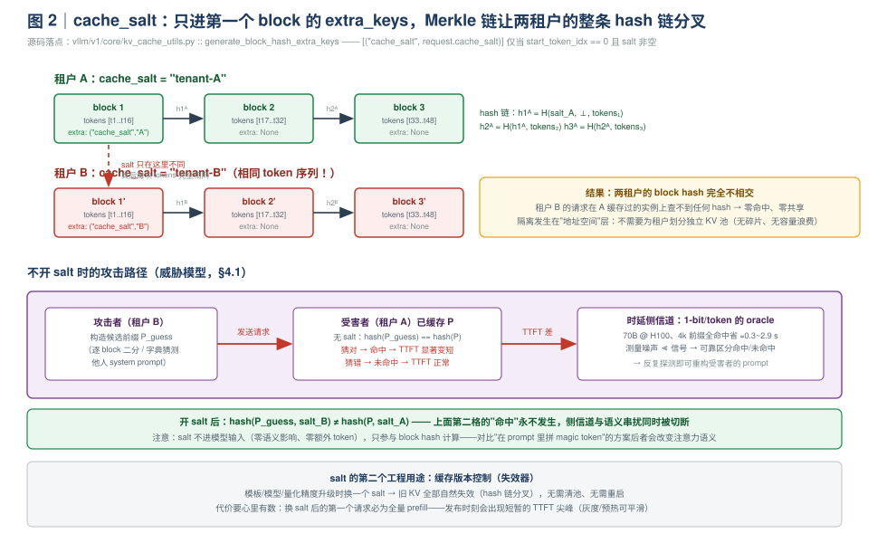
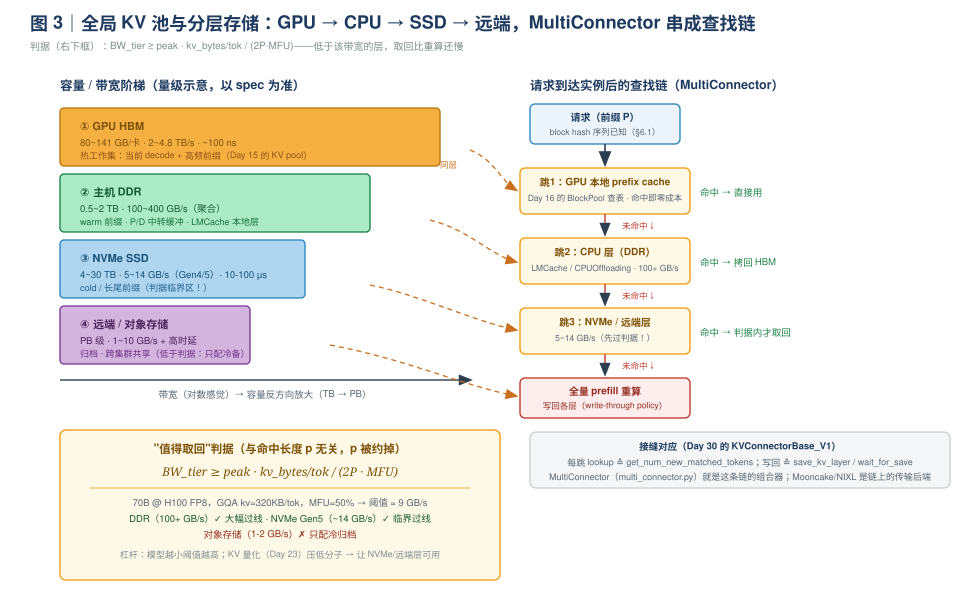

# Day 34｜prefix caching 与路由：cache-aware routing、多租户隔离与全局 KV 池

> **本周主线（Week 5）**：P/D 分离三天（Day 29-31）回答了"实例之间怎么分工"，分布式并行两天（Day 32-33）回答了"实例内部怎么跨卡扩展"，并且 Day 33 Lab D 用数据确认了"单卡放得下的模型，2×TP1 + 分流 胜过 1×TP2"。但昨天那个分流 router 是**无状态**的 round-robin——它不知道每个实例的 KV 池里已经装了什么。今天给路由装上"记忆"：**prefix caching 从单实例的显存优化，升级为集群层的路由问题**。
>
> **本日定位**：三个递进的话题。① **cache-aware routing**——block hash（Day 16）本来是实例内去重的"内容寻址凭证"，今天让它成为路由依据：相同前缀的请求送往持有该 KV 的实例，把 N 份重复缓存变成 1 份；② **多租户隔离**——内容寻址凭证可以被"伪造"（构造相同前缀即可命中别人的缓存，甚至造成跨租户数据泄漏），`cache_salt` 是凭证上的签名；③ **集群视角**——当"路由到缓存"的刚性约束住调度时，下一步是让缓存移动而不是请求认路：全局 KV 池与分层存储（GPU→CPU→SSD）。今天有实验：2 实例 + 手写 60 行 router，实测三种路由策略的命中率与 TTFT 差异。
>
> **版本基线**：本文源码引用以撰写时（2026-10）的 vLLM main 分支为准，且本周核对过几处近期重构：`vllm/v1/engine/processor.py` 已更名为 `input_processor.py`；V1 的 `enable_prefix_caching` **默认开启**；block hash 默认算法为 sha256（`CacheConfig.prefix_caching_hash_algo`），`BlockHash` 已是 bytes 而非 int；**cache_salt 已演进为 per-request 透传**（较早版本是服务级 `--cache-salt` flag，动手前 `vllm serve --help | grep -i salt` 核对你的版本）；production stack router 已从主仓迁至独立仓库 **vllm-project/production-stack**（约 v0.11 时代曾在 `vllm/entrypoints/openai/router/`）。涉及版本敏感处均就地标注。

**今日时间预算**：精读 90 min + Lab A（路由对比实验）60 min + Lab B（cache_salt 验证）30 min ≈ 3 h；Lab C（分层存储，选做）40 min。

---

## 0. 前情回顾与本日位置

| 前情 | 关键结论 | 今天怎么用 |
|---|---|---|
| Day 16 | block hash 链式构造：`(parent_hash, token_ids, extra_keys)`；extra_keys 含 LoRA/多模态标识；引用计数 + COW | hash 从"实例内去重凭证"升级为"集群级路由依据"——本日一切的地基 |
| Day 15 | KV pool / block table / allocate-free 路径 | KV 是**实例本地**资源；今天讨论 N 个本地池怎么协同（路由 or 搬运） |
| Day 31 | toy proxy（`max_tokens=1` 两跳）+ 1P1D 部署 + KV Transfer 指标；Lab C-3 双向 KV transfer | router 从"转发器"升级为"有状态调度器"；KV transfer 是"缓存跟着请求走"的雏形 |
| Day 30 | 三张网（请求网 / KV 数据网 / 元数据网）；`KVConnectorBase_V1` 六接缝 | cache-aware routing 的索引靠**元数据网**（KV events）喂；全局 KV 池 = 数据网 + 元数据网的放大 |
| Day 32 §3.1 | TP 实例的 KV 按 `kv_heads` 切分，"每卡一片" | 路由的粒度只能是**实例**（TP 组整体），不能到卡 |
| Day 33 Lab D | 2×TP1 + 分流：聚合吞吐更高、p99 更稳 | 昨天的分流是 round-robin；今天给它装上 prefix 索引，看命中率差多少 |
| Day 1-2 | prefill compute-bound（每 token 成本 ≈ `2P/peak`）；KV 每 token 显存 = `2·L·H_kv·D·b` | 命中的 TTFT 收益公式（§3.1）；分层容量估算与"值得取回"判据（§5.2） |
| Day 5 | goodput = SLO 内吞吐 | 路由收益的度量衡：TTFT p99 与 goodput，不是 raw throughput |
| Day 13 | 实验三段对照法：现象 → 源码机制 → 指标表现 | Lab A/B 的记录格式 |

**今日一句话论点**（先给结论，全文都在论证它）：

> prefix caching 在单实例内是**显存优化**，在集群里是**路由问题**。block hash 是全局可复现的"资产凭证"（sha256 + 固定种子，不同实例对相同 token 序列算出相同 hash）——router 只要把相同 hash 的请求送到持有该 hash 的实例，就把 N 份重复缓存变成 1 份，低重复负载下命中率提升近 N 倍。但内容寻址天然可伪造：**跨租户构造相同前缀即可命中他人缓存，形成时延侧信道甚至语义串扰**——所以 `cache_salt` 只进第一个 block 的 extra_keys，Merkle 链式哈希让两租户的整条链完全分叉。而当"路由到缓存"反过来约束调度（热点、故障域、扩缩容）时，终点是让 KV 成为独立资源：**全局 KV 池 + 分层存储（GPU→CPU→SSD）**，判据是一条不等式：`BW_tier ≥ peak · kv_bytes_per_token / (2P)`。

---

## 1. 今日学习目标

学完后你应该能：

1. **推导**多实例下随机路由的 prefix 命中率模型：低重复区命中率 ≈ `(k−1)/N`、稳态副本数 ×N，并解释为什么"affinity 路由 = 集群级去重"在容量高压下收益更大；
2. **设计**一个 cache-aware router：session sticky / full-prompt hash / block-hash 亲和三级阶梯的适用面，以及打分函数 `score(i) = α·h_i(P) − β·q_i` 中两个系数的量纲取法与过载回退规则；
3. **说清**多租户缓存泄漏的威胁模型（时延侧信道 + 语义串扰 + 合规），并从源码级讲清 `cache_salt` 如何借 Merkle 链式哈希实现"只改首块、隔离全链"；
4. **推导**分层存储的"值得取回"判据 `BW_tier ≥ peak · kv_bytes_per_token / (2P·MFU)`，代入 70B FP8 @ H100 算出 ≈5-10 GB/s 的阈值，解释为什么 NVMe 层在产品中成立；
5. **画出** vLLM 的 KV connector 生态图（LMCache / Mooncake / MultiConnector / offloading），说清 `MultiConnector` 如何把"GPU → CPU → 远端"串成查找链，以及它与 Day 30 六接缝的对应关系；
6. **动手验证**：2 实例 + 手写 router 对比三种策略的 `gpu_prefix_cache_hits` 与 TTFT；用 `cache_salt` 实测零命中隔离，并演示时延侧信道信号。

---

## 2. 核心概念速查

| 术语 | 一句话定义 | 首次深入 |
|---|---|---|
| **cache-aware routing** | 路由决策考虑目标实例的 KV 缓存内容：相同前缀的请求送往已持有其 KV 的实例 | §3 |
| **prefix 索引** | router 维护的 `block hash → 实例` 映射，由各实例的 KV events 异步更新 | §3.2 |
| **亲和 vs 均衡冲突** | 严格亲和使热点前缀压垮单实例；用打分函数在"命中收益"与"队列长度"间折中 | §3.3 |
| **副本扩散** | 随机路由下同一前缀最终被缓存到所有实例：显存放大 N 倍，挤占长尾容量 | §3.1 |
| **`cache_salt`** | per-request 的缓存隔离盐：进第一个 block 的 extra_keys，使整条 hash 链分叉 | §4.2 |
| **时延侧信道** | 攻击者用候选前缀探测 TTFT 差异，判断某前缀是否（被他人）缓存过 | §4.1 |
| **KV events** | 实例对外发布的 block hash 增/删事件流，router/全局池靠它维护索引（元数据网） | §6.2 |
| **全局 KV 池** | KV 作为独立资源统一寻址（block hash 为 key），计算节点无状态化——Mooncake 路线 | §5.1 |
| **分层存储** | GPU HBM → 主机 DDR → NVMe → 远端/对象存储的 KV 层级，每层容量/带宽/角色不同 | §5.2 |
| **`MultiConnector`** | 把多个 KVConnector 串成查找/写入链的 vLLM 组件——分层的插件化实现 | §5.3 |
| **LMCache** | 独立项目的 KV 缓存层（CPU/disk/远端 + 跨实例共享），vLLM 侧以 `LMCacheConnector` 接入 | §5.3 |
| **值得取回判据** | `BW_tier ≥ peak · kv_bytes_per_token / (2P·MFU)`：低于该带宽的层取回 KV 比重算还慢 | §5.2 |

---

## 3. 原理（一）：单实例的 prefix caching，到了集群为什么会"漏收益"

### 3.1 随机路由下的命中率与副本扩散

回顾 Day 16：单实例内，prefix caching 的命中由 block hash 表完成——请求的每个满 block 计算链式哈希，在 `BlockPool` 的 `cached_block` 表里查到即可复用 KV。这套机制**完全实例本地**：实例 B 不知道实例 A 缓存了什么。

现在把镜头拉到集群。设 N 个等价实例（Day 33 Lab D 的 2×TP1 形态），负载中有一个共享前缀 P（|P| = p tokens，例如 2k token 的系统提示词 + RAG 上下文），P 在一个时间窗口内被请求 k 次（不同用户、时间分散、超出单次会话）。路由器有两种极端策略：

**策略一：round-robin / 随机路由（昨天的 Lab D）**

- 第 1 次请求落在实例 a，a 缓存 P；
- 第 j 次请求命中当且仅当它落在"已持有 P 的实例"上。设第 j 次请求前持有 P 的实例数为 m_j，则命中率 = m_j/N；
- 没命中的请求会在**新的**实例上再缓存一份 P——副本数单调不减，最终 m → min(k, N)；
- 两个极端：**低重复区（k ≪ N 或 k ~ N）**：累计命中次数期望 ≈ Σ (m_j/N) ≈ (k−1)/N 量级——大部分命中机会被浪费；**高重复区（k → ∞）**：副本扩散完成后命中率也趋近 1，**但代价是 N 份 KV 副本**。

**策略二：cache-aware 亲和路由（今天的主角）**

- 第 1 次请求落在 a 并缓存 P；router 的索引记下 `hash(P) → a`；
- 之后 k−1 次请求全部送往 a：命中 k−1 次，副本始终 1 份。

把两种策略放进一张表（这张表值得抄进笔记）：

| 维度 | round-robin / 随机 | cache-aware 亲和 |
|---|---|---|
| 低重复区（k ~ N）命中次数 | ≈ (k−1)/N | k−1（**提升近 N 倍**） |
| 高重复区命中次数 | → k（副本扩散完成后） | k−1 |
| P 的 KV 副本数 | → N | **1** |
| 显存占用（p tokens × 副本数） | p·N | p |
| 负载分布 | 均匀 | **热点风险**（§3.3） |
| 首答延迟 | 需等副本扩散 | 第 2 次请求即命中 |

两个关键洞察（面试加分点）：

1. **"affinity 提升 TTFT"的最大收益区不是高重复负载**——RR 跑久了副本扩散完也能命中。真正的收益区是：① 低重复（k ~ N）负载；② **容量高压区**：RR 的 N 倍副本挤占每个实例的有效缓存容量，LRU 提前驱逐长尾前缀，压测下命中率劣化——affinity 的"集群级去重"等效于把缓存容量放大 N 倍；
2. 命中的 TTFT 收益可以直接用 Day 1 的公式手算：prefill 是 compute-bound，每 token 成本 ≈ `2P/peak_eff`，于是

$$\Delta TTFT \approx p_{hit} \cdot \frac{2P}{peak_{eff}} \quad (p_{hit} = 命中的\ token\ 数)$$

代入两个量级感受一下（H100，FP8，MFU≈50%）：
- 70B 模型、4k token 系统提示词全命中：`4096 × 2×70e9 / (0.5×1.97e15) ≈ 2.9 s`——这就是客服/Agent 场景里 prefix caching 被称为"生命线"的原因；
- 8B 模型、2k 命中：`2048 × 2×8e9 / (0.5×1.97e15) ≈ 0.33 s`。

### 3.2 路由策略的阶梯：从 session sticky 到 block-hash 亲和

实践中的 cache-aware routing 是一个粒度阶梯，粒度越细、状态越重、收益越大：

| 阶梯 | 亲和键 | 多轮对话有效？ | router 状态量 | 典型载体 |
|---|---|---|---|---|
| ① session sticky | session_id / conversation_id | ✅（同会话同实例） | 会话表（TTL） | HTTP 网关 / production-stack 的 session router |
| ② full-prompt hash | `hash(完整 prompt)` | ❌（每轮 prompt 都变，hash 必变） | 无状态（一致性哈希环） | 自研网关常见做法 |
| ③ **block-hash 亲和** | 请求前缀的 block hash 序列 | ✅（前缀稳定，命中上一轮全部上下文） | `hash → 实例` 索引（KV events 喂） | vLLM production stack、Dynamo SmartRouter、llm-d |
| ④ 打分路由 | `argmax_i (α·h_i(P) − β·q_i)` | ✅ | 索引 + 各实例负载 | 生产系统（llm-d 的 KV-aware 调度） |

阶梯②是一个常见误区，值得单独说：**对多轮对话，hash 整个 prompt 等于没有亲和**——第 2 轮的 prompt = 第 1 轮的 prompt + 模型回答 + 新问题，全文 hash 必然变化，请求被均匀打散。只有前缀粒度（阶梯③）才能让"上一轮的完整上下文"在第 2 轮命中（这正是 Day 16 实验里单实例内的行为，搬到集群而已）。

阶梯③的实现前提是一个容易被忽略的源码事实（今天最重要的"地基"）：

> **block hash 跨实例可复现**。V1 默认用 sha256 对 `(parent_hash, token_ids, extra_keys)` 链式哈希，首块种子 `NONE_HASH` 来自**固定**的默认种子（`DEFAULT_NONE_HASH_SEED = "vllm-none-hash"`，`PYTHONHASHSEED` 可覆盖）。源码注释原话：独立 vLLM 进程对相同内容算出**相同** block hash，"can share a prefix cache without extra configuration"。

这意味着 router **不需要问任何实例**，就能自己算出请求的 block hash 序列去查索引——索引的 key 与实例内存的是同一套"地址"。§6.1 展开这个细节（以及为什么非密码学哈希必须用随机种子）。

### 3.3 亲和与负载均衡的冲突：打分路由

严格亲和有一个结构性问题：**前缀分布是重尾的**（少数系统提示词/RAG 库覆盖大量请求）。热门前缀 P* 贡献 30% 流量 → 实例 a 被打爆，其余实例闲置——TTFT p99 反而恶化，违背 Day 5 的 goodput 原则。

生产系统的通用解法是把路由决策写成**打分函数**：

$$i^* = \arg\max_i \; \big( \alpha \cdot h_i(P) - \beta \cdot q_i \big)$$

- `h_i(P)`：实例 i 对请求前缀 P 的**可命中 token 数**（从索引查：P 的 block hash 有多少在 i 上、乘 block size）；
- `q_i`：实例 i 的负载（在途请求数 / 队列深度，从 `/metrics` 拉 `num_requests_waiting` 等）；
- **α 的量纲**：毫秒/token——即 §3.1 的 `2P/peak_eff`（命中的边际收益）；**β 的量纲**：毫秒/请求——排队论里 M/M/1 的斜率（每多一个在途请求的时延增量）。两个系数把"缓存收益"和"排队代价"折算到同一单位（毫秒）再相减。

工程上还配两条**回退规则**（比打分本身更重要）：

1. **过载熔断**：`q_i > q_threshold` 时强制放弃亲和、走最空闲实例——缓存收益再大也救不了排队爆炸；
2. **热点主动复制**：对持续高温的 P*，反其道而行——**主动**把它"种"到多个实例（预热请求），把阶梯③退化成有控制的副本扩散。这就是 CDN 的经典思路：热内容靠复制，冷内容靠路由。



### 3.4 与 P/D 分离的叠加（接 Day 29-31）

路由与 P/D 分离是**正交**的两层，组合出清晰分工：

- **路由管"算前命中"**：prefill 池（P 池）的实例选择看 prefix 索引——命中即省整段 prefill；
- **KV transfer 管"算后搬运"**：Day 31 实验过的 NIXL 双向传输（Lab C-3）把 P 池算出的 KV 送往 D 池——decode 侧的"亲和"由 KV 数据网承担，不靠路由；
- 多轮对话在第 2 轮回到 P 池时，前缀 = 上一轮完整上下文，命中发生在 P 池实例上——所以**索引只需要覆盖 P 池**（D 池的 KV 生命周期短、且由 transfer 负责），状态量减半。

一句话：**路由是"数据不动、请求认路"；transfer 是"请求不动、数据搬家"**。今天的 §5 会把这个对偶推到集群尺度。

---

## 4. 原理（二）：多租户隔离——cache_salt 与缓存泄漏的威胁模型

### 4.1 为什么"内容寻址"在多租户下是漏洞

Day 16 我们把 block hash 称为"内容寻址"：**相同 token 序列 → 相同 hash → KV 复用**。这个性质在单租户下是纯收益，在多租户共享一个推理集群时却是三个漏洞的根源：

1. **时延侧信道（timing side channel）**。攻击者构造候选前缀 `P_guess`（逐 block 猜测受害者的 system prompt），正常发送请求：
   - 猜对：命中受害者已缓存的 KV，TTFT 显著变短（§3.1 的 ΔTTFT 公式就是信号强度）；
   - 猜错：全量 prefill，TTFT 正常。
   
   这是一个 **1 bit/token 的 oracle**。70B @ H100、4k 前缀全命中可省 0.3~2.9 s，测量噪声远小于信号——攻击者可以二分/字典式探测，逐步重构受害者的完整 prompt（system prompt 往往含业务规则、few-shot 机密示例）。

2. **语义串扰 / 缓存投毒**。更隐蔽的场景：租户 A 与租户 B 的 prompt 恰好共享前缀（同一家公司的两个部门用同一份产品手册做 RAG 前缀，但后接不同的机密指令）。命中对方 KV 本身不改结果——KV 就是 KV——**但 hit 的判定要求 token 序列完全一致**，所以"部分前缀相同"是常态：A 的手册 + A 的机密指令被缓存后，B 若也用同一手册 + 不同的指令，会命中"手册部分"。这在合规上已经构成"处理 A 的数据被用于服务 B"。极端情况（LoRA 适配器不同但 hash 未区分的历史 bug、多模态输入区分不当等）会直接产出错误结果。

3. **合规红线**。多数企业采购合同把"跨租户缓存共享"直接归为数据泄漏，与是否可被利用无关。

**面试区分点**：能把"prefix caching 命中率"和"跨租户隔离"讲成同一个机制的两面（内容寻址的收益与风险同源），而不是两个孤立话题。

### 4.2 机制：salt 只进第一个 block，Merkle 链负责剩下的事

先看源码事实（均已对照 main 分支核实，版本敏感处标注）：

**① 请求侧的透传链**：

```text
API 请求（TokensPrompt 的 cache_salt 字段 / OpenAI 兼容层透传）
  └─ vllm/v1/engine/input_processor.py :: InputProcessor.process_inputs()
       cache_salt=decoder_input.get("cache_salt")        # 从请求输入 dict 取，不从 config 取
  └─ vllm/v1/engine/output_processor → EngineCoreRequest.cache_salt
  └─ vllm/v1/request.py :: Request.from_engine_core_request()
       self.cache_salt: str | None = cache_salt          # Request 上的普通字段
```

**② 哈希侧的注入点**（`vllm/v1/core/kv_cache_utils.py :: generate_block_hash_extra_keys`）：

```python
cache_salt_keys: list[tuple[str, str]] = (
    [("cache_salt", request.cache_salt)]
    if (start_token_idx == 0 and request.cache_salt)
    else []
)
extra_keys = lora_extra_keys + mm_extra_keys + cache_salt_keys + prompt_embeds_keys
```

**③ 链式传播**（同文件 `hash_block_tokens`）：

```python
block_hash = hash_function((parent_block_hash, token_ids_tuple, extra_keys))
```

把三步连起来看（图 2）：`("cache_salt", salt)` **只在第一个 block**（`start_token_idx == 0`）进入 extra_keys。第一个 block 的 hash 因此不同；而第二个 block 的 hash 以第一个 block 的 hash 为父——**Merkle 链的性质**：改一个节点，其后所有节点全部改变。于是两个租户哪怕 prompt 逐 token 相同，两条 hash 链也从第一块起完全分叉：租户 B 的请求在租户 A 缓存过的实例上查不到任何 block hash——**零命中、零共享**，且不需要为租户划分独立 KV 池（对比"每租户一个池"的方案：显存碎片化 + 容量孤岛）。

三个值得玩味的设计细节：

- **为什么只进第一个 block 就够**：链式哈希把"首块不同"放大成"全链不同"——注入一次，隔离整链。这也是为什么不把 salt 拼进每个 block（等价但多算 N 次哈希、且 events 载荷变大）；
- **为什么不拼进 prompt**：magic token 会改变注意力语义（多出来的 token 参与计算），且要多付它的 prefill/KV 成本；salt 只参与 hash，不进模型输入——**零语义影响、零额外 token**；
- **版本演进**：较早版本（~v0.9-0.10）是服务级 `--cache-salt`（`CacheConfig` 字段），粒度是"整实例"；当前 main 演进为 **per-request 透传**，粒度细化到"每次请求"，代价是 API 层多一个字段。这符合"多租户网关按请求打标签"的实际形态。

### 4.3 代价与粒度选择

隔离不是免费的：

| 冲突 | 说明 |
|---|---|
| 命中率损失 | 跨租户的公共内容（同一个 base 模型的通用 few-shot 前缀）也不能共享——**这正是期望行为**：宁可重算，不可泄漏 |
| salt 粒度 | 每租户一个（隔离最小化损失）vs 每租户×每模板一个（顺带获得失效器能力，见下） |
| 管理 | salt 泄漏 = 隔离失效：salt 应来自服务端会话/租户上下文，**不能信任客户端传入的明文租户号**（网关注入） |

salt 的第二个工程用途常被忽略：**缓存版本控制**。模板升级 / 换 LoRA / 量化精度变更时，旧 KV 与新配置不再语义兼容——换一个 salt，旧缓存整链自然失效（hash 分叉后查不到），无需清池、无需重启。代价：换 salt 后的第一个请求必为全量 prefill，发布时刻出现短暂 TTFT 尖峰（灰度 + 预热请求可平滑）。



---

## 5. 原理（三）：集群视角——全局 KV 池与分层存储

### 5.1 "路由到缓存"的三个刚性，与"缓存跟着请求走"

cache-aware routing 解决了命中率，但它有三个**结构性刚性**：

1. **缓存决定位置 → 负载被绑死**：§3.3 用打分函数缓解，但热点前缀的亲和引力始终存在；
2. **故障域**：持有 P 的实例挂了 = P 丢失，下一个请求全量重算（索引项过期）；
3. **扩缩容**：实例增减后索引大面积失效，缓存价值瞬间蒸发。

把这三条刚性反过来看，就是另一条路线的动机：**让 KV 成为独立资源，而不是实例的附属品**——

- KV 以 block hash 为 key **全局寻址**（存在哪、谁是副本，由独立的存储层管理）；
- 计算（尤其 P/D 分离后的 decode 池）接近无状态，请求可送往任何实例，缺的 KV 从全局池拉取。

这就是 Mooncake 提出的 **KVCache-centric 架构**（Day 30 从传输角度读过它，今天从存储角度再看）：全局 KV 池 + transfer engine + 以 KV 位置为输入的调度器（conductor）。Day 31 实验里你已经摸过它的两个零件——`kv_lease_duration`（租约管理）来自它的 store 设计，分层流水传输来自它的 transfer engine。

两条路线不是二选一，而是一条谱系的两端：

$$\text{路由（数据不动，请求认路）} \longleftrightarrow \text{全局池（数据搬家，请求随便去哪）}$$

现实系统是混合体：**热前缀靠路由**（零搬运成本），**长尾靠全局池**（容量大），**跨集群/跨可用区靠分层存储**（持久化）。

### 5.2 分层存储：容量、带宽与"值得取回"判据

分层存储的每层用三个数刻画（量级以 2026 年单节点为准，具体以 spec 为准）：

| 层 | 容量量级（每节点） | 带宽量级 | 时延 | 角色 |
|---|---|---|---|---|
| GPU HBM | 80~141 GB/卡 | 2~4.8 TB/s | ~100 ns | 热工作集：当前 decode + 高频前缀 |
| 主机 DDR | 0.5~2 TB | 100~400 GB/s（聚合） | ~100 ns + PCIe 桥 | warm 前缀、P/D 中转缓冲 |
| NVMe SSD | 4~30 TB | 5~14 GB/s（Gen4/5） | ~10-100 μs | cold/长尾前缀 |
| 远端对象存储 / 跨集群 | PB 级 | 1~10 GB/s + 高时延 | ms 级 | 归档、跨集群共享 |

关键问题：**从某一层把 KV 取回来，什么时候比重算划算？** 用 Day 1/Day 2 的两个公式可以直接推出判据。

取回 p 个 token 的 KV 需要（忽略寻址时延）：

$$T_{fetch} = \frac{p \cdot kv_{bytes/tok}}{BW_{tier}}$$

重算 p 个 token 的 prefill 需要（compute-bound，Day 1）：

$$T_{recompute} = \frac{2 P \cdot p}{peak \cdot MFU}$$

令两者相等，**p 约掉了**——判据与命中长度无关，只与模型和存储层有关：

$$\boxed{BW_{tier} \ge \frac{peak \cdot kv_{bytes/tok}}{2 P \cdot MFU}}$$

代入 70B @ H100（FP8，GQA：L=80，kv_heads=8，head_dim=128，BF16 KV）：

- `kv_bytes/tok = 2·80·8·128·2 B = 320 KB`（Day 2 公式）
- `peak = 1.97e15 FLOPS`，`P = 7e10`，MFU 取 50%
- 阈值 = `1.97e15 × 3.2e5 / (1.4e11 × 0.5) ≈ 9 GB/s`

结论（面试可以直接背）：**DDR（>100 GB/s）远远过线、NVMe Gen5（~10-14 GB/s）在临界线上下、对象存储（1-2 GB/s）不够**——这就是为什么"CPU offload 几乎总是赚、NVMe 层要精打细算、对象存储只配当冷归档"。且注意两个杠杆：模型越小（P 越小）阈值越高（小模型的 prefill 本来就便宜，fetch 更难划算）；KV 量化（Day 23）把分子缩小，**让更低带宽的层也变得可用**——量化与分层存储是互相成就的。

（诚实标注：这是"带宽足够"的下界判据，还没算寻址时延、排队、以及取回路径对在线 decode 的带宽挤占；生产决策要在判据上留 margin。）



### 5.3 vLLM 的落地形态：KVConnector 生态

Day 30 讲过 `KVConnectorBase_V1` 的六个接缝把"KV 从哪来/到哪去"从执行路径解耦。今天补上集群维度：**分层存储与全局池都是用这同一组接缝插进来的**，区别只在 connector 的另一端连的是什么。当前 `vllm/distributed/kv_transfer/kv_connector/v1/` 的生态（本周已核对 main 分支目录）：

| Connector | 另一端连着 | 在分层里的位置 |
|---|---|---|
| `LMCacheConnector`（`lmcache_connector.py`，另有 mp 多进程版） | LMCache：CPU/磁盘/远端的多级 KV 缓存，支持跨实例共享 | DDR + NVMe + 远端，一connector 全包 |
| `MooncakeStoreConnector`（`mooncake/`） | Mooncake 全局 KV 池（store + transfer engine） | 全局池参考实现 |
| `CPUOffloadingConnector`（`offloading_connector.py`） | 本机 host 内存（带 OffloadingMetrics） | 纯 DDR 层，教学/轻量 |
| `SimpleCPUOffloadConnector`（`simple_cpu_offload_connector.py`） | 本机 host 内存（测试用） | 同上 |
| `NixlConnector`（`nixl/`） | RDMA/IPC 对端实例 | Day 31 的 P/D 传输（不存储） |
| `HF3FSConnector`（`hf3fs/`）、`FlexKVConnector`（`flexkv_connector.py`） | DeepSeek 3FS 文件系统 / FlexKV | 新兴存储后端 |
| `MultiConnector`（`multi_connector.py`） | **多个 connector 的串联** | 分层 policy 的组合器 |

**`MultiConnector` 是理解"分层"的关键**：它把多个 connector 串成一条查找/写入链——请求到来时按顺序问"GPU 本地 prefix cache 命中了吗？→ CPU 层有吗？→ 远端层有吗？"，写入时按 policy 决定写到哪几层。**查找链的每一跳都对应六接缝里的 `get_num_new_matched_tokens`（lookup）与 `save_kv_layer` / `wait_for_save`（write-through）**——Day 30 的接缝在存储维度被复用了。

对照全局池路线的分工：

| 维度 | 路由 + 分层（本节） | 全局池（Mooncake 路线） |
|---|---|---|
| KV 归属 | 实例本地 + 分层备份 | 独立存储层，实例近乎无状态 |
| 元数据 | KV events → router 索引 | store 自己管理 hash → 位置 |
| 取回成本 | 命中即零成本（同实例） | 总要搬一次（但可预热/可流水） |
| 故障域 | 实例挂 = 本地副本丢 | 池存活即数据存活 |
| 成熟度 | 组件齐全，可拼装 | 需要额外部署 store + transfer engine |

### 5.4 方向总结（也留给 Day 35 的设计题）

把今天三层叠起来，就是"日活千万客服机器人"设计题（Day 35 复盘日）的推理侧骨架：

1. **短 system prompt + 高并发** → cache-aware routing（§3）+ 过载熔断；
2. **多轮长上下文** → P 池亲和（第 2 轮命中第 1 轮全上下文）+ D 池 KV transfer（Day 31）；
3. **多租户** → 网关注入 cache_salt（§4）；
4. **长尾大上下文（RAG 库）** → DDR/NVMe 分层（§5.2 判据决定放哪层）；
5. **跨集群容灾** → 全局池 / 对象存储层。

---

## 6. 源码走读：跨实例 hash 一致性与 KV events

### 6.1 为什么 router 能"自己算" block hash

§3.2 埋的线头在这里展开。`vllm/v1/core/kv_cache_utils.py` 的头部有一段值得整段读的注释（以下为要点转述）：

- `BlockHash` 是 **bytes**（sha256 摘要），不再是早期版本的 int。动机之一正是跨进程稳定；
- 首块种子 `NONE_HASH` 由 `init_none_hash(hash_fn)` 初始化：**密码学算法**（sha256，默认，由 `CacheConfig.prefix_caching_hash_algo` 选择）用**固定**默认种子 `"vllm-none-hash"`——独立 vLLM 进程对相同内容算出相同 hash，跨实例/跨节点共享前缀缓存**无需额外配置**；`PYTHONHASHSEED` 环境变量可覆盖；
- **非密码学算法**（`xxhash` / `xxhash_cbor`）反而用**每进程随机种子**——因为可预测的种子会让攻击者离线构造碰撞 token 序列（issue #12621：缓存污染）。代价：xxhash 模式下 block hash 不可跨进程复现，日志会显式 warning。

这一段是今天全部内容的源码缩影：**"相同内容 → 相同地址"既是路由与全局池的地基（可复现），也是多租户风险的地基（可伪造）**——可复现性与可伪造性是同一枚硬币，防伪手段就是 salt（§4）。

顺带两个相关 config（本周核对过 `vllm/config/cache.py`）：`enable_prefix_caching`（V1 默认 True）、`prefix_match_unit`（hash 匹配粒度可小于调度 block size——细粒度匹配提高命中率，代价是 hash 表更大）。

### 6.2 元数据网：KV events 到 router 索引

router 的 `hash → 实例` 索引靠实例**主动上报**维护。机制（版本敏感，落点随版本变动，动手前在仓库内 grep `KVEvent`）：

- 实例开启 KV events 后，在 block 被缓存 / 被驱逐 / 请求移除时发布事件（携带 block hash 与 token 数）；
- 早期实现为 `vllm/v1/kv_events_interface.py` 的 `EnableKVCacheEvents` / `ZmqKVEventPublisher`（`--kv-events-config` 配 ZMQ endpoint）；production stack 的 router 正是订阅这个流来刷新索引；
- 事件是**异步**的 → 索引存在陈旧窗口（可能把请求路由到"刚被驱逐"的实例）→ 未命中只是退化为正常 prefill，**正确性无损，收益打折**——这是最终一致性的经典取舍。

这条链路对 Day 30 "三张网" 是一次回收：**元数据网在 P/D 分离里传的是 KV block 清单（对端要传什么），在 cache-aware routing 里传的是缓存索引（谁持有什么）**——同一套事件基础设施，两个消费者。

### 6.3 production stack router：一个组件清单

本周核对结果：router 已从主仓迁至独立仓库 **vllm-project/production-stack**（K8s 原生的参考实现；~v0.11 时代在主仓 `vllm/entrypoints/openai/router/`，含 router.py / coordinator.py / matching_engine.py）。按设计文档口径，它的组件分工（命名以该仓库当前代码为准）：

- **session router**：阶梯①（会话亲和），最轻；
- **matching engine**：消费 KV events，维护前缀索引，支撑阶梯③（block-hash 亲和）；
- **coordinator**：实例健康与负载状态；
- 路由策略可组合（session → cache-aware → least-load 逐级 fallback）。

今天 Lab A 我们手写一个 60 行的玩具版，把这个骨架跑起来——写完再看 production-stack 的源码，会有"每一段我都写过玩具版"的熟悉感。

---

## 7. 动手实验：给 Day 33 的双实例装上"会看缓存"的路由

> **版本提醒**：命令以撰写时 main 分支口径为准。启动前核对三件事：`vllm serve --help | grep -i prefix`（确认 prefix caching flag 与默认值）、`curl localhost:800X/metrics | grep -i prefix`（确认指标名）、`python -c "import aiohttp"`（router 依赖）。

### 7.1 实验设计（沿用 Day 33 的控制变量纪律）

| 项目 | 取值 | 为什么钉死 |
|---|---|---|
| 实例 | 2 × `Qwen/Qwen3-8B`，TP=1，端口 8001/8002，各占一卡 | Day 33 Lab D 的形态，直接对比"无状态分流 vs 有状态路由" |
| prefix caching | 两实例都开（V1 默认开，显式写出便于对齐） | 自变量是**路由策略**，缓存能力必须两侧一致 |
| 负载 | 自造：1 个共享 system prompt（2000 token）× 200 请求，每请求追加 20~50 token 随机用户问题，`max_tokens=64` | 控制"前缀重复度 k"——200 次重复正是亲和路由的收益区 |
| 自变量 | 路由策略 ∈ {round-robin, full-prompt-hash, prefix-affinity} | 阶梯② vs ③ vs 基线 |
| 观测 | 两实例 `/metrics` 的 `vllm:gpu_prefix_cache_hits / vllm:gpu_prefix_cache_queries`（汇总）+ 客户端 TTFT p50/p99 | 命中率（服务端口径）+ TTFT（客户端口径）交叉验证（Day 5 的口径纪律） |

**预测先行**（Day 33 的规矩，先填表再跑）：

| 策略 | 汇总命中率 | TTFT 相对基线 | 负载分布 |
|---|---|---|---|
| round-robin | 早期 ≈ 50%，副本扩散完成后 → 高（但两实例各存一份 2000 token） | 前几十个请求改善有限 | 均匀 |
| full-prompt-hash | ≈ 0（每个 prompt 尾部随机，全文 hash 必不同） | 无改善 | 均匀 |
| prefix-affinity | ≈ 99%（除第一个请求） | 显著下降（8B、2k 命中 ≈ 省 0.3 s 量级） | **全部压到单实例**（预期会观察到队列不均！） |

第三行的"负载不均"不是实验失败，是 §3.3 的活体展示——观察它，然后给 router 加上打分回退再跑一遍（加分项）。

### 7.2 Lab A：60 行 router（40 min）

起两个实例：

```bash
CUDA_VISIBLE_DEVICES=0 vllm serve Qwen/Qwen3-8B --port 8001 \
    --enable-prefix-caching --max-model-len 4096 --seed 0 &
CUDA_VISIBLE_DEVICES=1 vllm serve Qwen/Qwen3-8B --port 8002 \
    --enable-prefix-caching --max-model-len 4096 --seed 0 &
```

`router.py`（玩具版，教学用；生产版把"亲和键"换成真实 block hash + KV events 索引）：

```python
import argparse, hashlib, json
from collections import defaultdict
import aiohttp
from aiohttp import web

parser = argparse.ArgumentParser()
parser.add_argument("--strategy", choices=["rr", "hash", "affinity"], default="rr")
parser.add_argument("--port", type=int, default=8000)
args = parser.parse_args()

INSTANCES = ["http://127.0.0.1:8001", "http://127.0.0.1:8002"]
rr_counter = 0
affinity_map = {}          # 亲和键 -> 实例下标
load = defaultdict(int)    # 实例下标 -> 在途请求数（打分路由用）

def affinity_key(prompt_ids):
    # 玩具版：取前 512 token 的哈希当"前缀指纹"
    # 生产版：这是 sha256 block hash 链的简化——首块起逐块可命中（§3.2 阶梯③）
    return hashlib.sha256(str(prompt_ids[:512]).encode()).digest()[:8]

def pick(prompt_ids):
    global rr_counter
    if args.strategy == "rr":
        i = rr_counter; rr_counter += 1
    elif args.strategy == "hash":
        i = int.from_bytes(affinity_key(prompt_ids), "big") % len(INSTANCES)
    else:  # affinity：查索引；miss 则选在途最少的实例并"种"进索引
        key = affinity_key(prompt_ids)
        if key in affinity_map:
            i = affinity_map[key]
        else:
            i = min(range(len(INSTANCES)), key=lambda x: load[x])
            affinity_map[key] = i
    return i

async def proxy(request):
    body = await request.json()
    prompt_ids = request.app["tokenizer"].encode(body["messages"][0]["content"]
                                                  if "messages" in body else body["prompt"])
    i = pick(prompt_ids)
    load[i] += 1
    try:
        session = request.app["http"]
        async with session.post(f"{INSTANCES[i]}/v1/chat/completions",
                                json=body) as resp:
            return web.Response(status=resp.status, body=await resp.read(),
                                content_type="application/json")
    finally:
        load[i] -= 1

async def on_startup(app):
    app["http"] = aiohttp.ClientSession()
    async with aiohttp.ClientSession() as s:          # 借一个实例的 tokenizer
        async with s.get(f"{INSTANCES[0]}/tokenize",
                          json={"prompt": "warmup"}) as r:
            pass
    from transformers import AutoTokenizer
    app["tokenizer"] = AutoTokenizer.from_pretrained("Qwen/Qwen3-8B")

app = web.Application()
app.router.add_post("/v1/chat/completions", proxy)
web.run_app(app, port=args.port, print=None)
```

（细节声明：tokenize 环节是教学简化——真实系统在 router 只拿文本/词元即可算指纹；`/tokenize` 端点与请求体字段名以你版本 `curl localhost:8001/docs` 为准。）

**压测与采集**（复用 Day 6/33 的脚本骨架，打向 `:8000`）：

```bash
# 200 个请求：同一 system prompt + 随机短问题
python bench_prefix.py --router localhost:8000 --shared-prefix 2000 --num-prompts 200
# 命中率（两实例汇总，gauge 口径）
for p in 8001 8002; do curl -s localhost:$p/metrics | grep prefix_cache; done
```

**记录三段对照**（Day 13 格式）：

| 现象 | 源码机制 | 指标表现 |
|---|---|---|
| RR 前几十个请求 TTFT 改善有限，之后变好 | 副本扩散：m_j/N 命中概率随 m 单调升 | hits/queries 从 ~0.5 爬升 |
| hash 策略命中率 ≈ 0 | 全文 hash 含随机尾部 → 每个请求键都不同 | queries 涨、hits 不涨 |
| affinity 命中率 ≈ 99% 但单实例 queue 拉长 | 索引把全部流量钉到一个实例（§3.3 冲突） | 实例 A `num_requests_waiting` 高、B 闲置 |
| （加分）加 `q_threshold` 回退后 | 打分路由 α·h−β·q | 命中率略降、TTFT p99 反而改善 |

### 7.3 Lab B：cache_salt 隔离验证（20 min）

同一个 prompt，交替用两个 salt 发请求（per-request 透传，`extra_body`）：

```python
from openai import OpenAI
client = OpenAI(base_url="http://localhost:8001/v1", api_key="x")
for i, salt in enumerate(["tenant-A"] * 3 + ["tenant-B"] * 3 + ["tenant-A"] * 2):
    r = client.chat.completions.create(
        model="Qwen/Qwen3-8B",
        messages=[{"role": "system", "content": LONG_SHARED_PROMPT},
                  {"role": "user", "content": "hi"}],
        max_tokens=4, extra_body={"cache_salt": salt})
```

**预测**（先填再测）：A₁ miss（全量 prefill）→ A₂ A₃ hit → B₁ B₂ B₃ **全 miss**（链被 salt 分叉，B 与 A 的 hash 完全不相交）→ A₄ A₅ 再 hit（A 链还在，未被 B 挤占——**注意验证 salt 隔离不是"清空缓存"**）。对照指标：`gpu_prefix_cache_hits` 的阶跃与 TTFT 的"慢-快-慢-快"交替。

**侧信道演示**（把 §4.1 变成体感，5 min）：同 prompt **不带 salt** 连发两次，第二次 TTFT 显著变短——这就是攻击者看到的"1-bit oracle"信号；再带上别人没用的 salt，TTFT 回到全量值。**信号强度 ≈ ΔTTFT 公式的手算值**（8B、2k 前缀 ≈ 0.3 s 量级，肉眼可辨）。

### 7.4 Lab C（选做）：摸一下分层存储

两条路线任选（都参照 Day 31 的 `--kv-transfer-config` 用法）：

1. **CPU offload**：`SimpleCPUOffloadConnector` / `CPUOffloadingConnector`——起服务时挂 connector，压测长上下文负载，对比 preemption 计数（KV 池"变大"的直接收益）与 TTFT；
2. **LMCache**：装 `lmcache` 包，用 `LMCacheConnector` 跑同一负载，观察 CPU 层命中（connector 自己的 metrics）。

预期与判据对照：DDR 层取回 2k token 的 8B KV（`2·36·8·128·2·2048 ≈ 302 MB`）仅需 ~1-3 ms，远小于重算的 ~0.3 s——**过线层取回几乎免费**。若你环境只有单卡：Lab A/B 的两个实例可以退化成同卡两个端口（共享 GPU 显存，命中率结论不变，负载不均的观察会失真——记录里注明即可）。

---

## 8. 面试高频问题

**Q1：多实例部署下，为什么单实例开了 prefix caching，集群层面的命中率还是上不去？怎么修？**
> 要点：hash 表是实例本地的（Day 15-16），随机路由下相同前缀的请求被均匀打散——低重复区命中 ≈ (k−1)/N，稳态靠副本扩散（显存 ×N）换命中。修法 = cache-aware routing：prefix 索引（KV events 喂）+ 亲和路由。加分：说出真正的收益区是低重复负载和容量高压区（副本挤占 LRU），以及"affinity = 集群级去重 ≈ 容量放大 N 倍"这句话。

**Q2：cache-aware routing 和负载均衡冲突吗？生产上怎么解？**
> 要点：冲突是结构性的（前缀分布重尾 → 热点实例）。解法：打分函数 `score(i)=α·h_i(P)−β·q_i`，α 取命中的边际收益（ms/token ≈ 2P/peak）、β 取排队斜率；过载熔断（q 超阈值强制放弃亲和）；热前缀主动复制（CDN 思路）。能报出自己 Lab A 里"加回退后 p99 改善"的数字最加分。

**Q3：cache_salt 是怎么做到隔离的？为什么只进第一个 block 就够？**
> 要点：salt 进 `generate_block_hash_extra_keys` 的 extra_keys，且仅 `start_token_idx==0`；block hash 是链式的（`hash_block_tokens(parent, tokens, extra)`），首块变 → 全链变（Merkle 性质）→ 两租户 hash 完全不相交、零命中零共享，且无需独立 KV 池。追问问"为什么不拼进 prompt"：salt 不进模型输入，零语义影响零 token 成本。再追问问威胁模型：时延侧信道（1-bit oracle，ΔTTFT 可手算）+ 语义串扰 + 合规。

**Q4：什么时候应该"把 KV 搬到计算节点"，而不是"把请求路由到缓存节点"？**
> 要点：谱系两端——路由（数据不动）零搬运成本但绑定调度、有故障域；全局池（数据搬家）调度自由、容量大，但总付一次传输。判据用"值得取回"不等式 `BW_tier ≥ peak·kv_per_tok/(2P·MFU)`（p 被约掉，与命中长度无关），代 70B@H100 ≈ 9 GB/s：DDR 总是过线、NVMe 临界、对象存储不过线。杠杆：模型越小阈值越高、KV 量化压低分子。

**Q5：分层 KV 存储（GPU→CPU→SSD）各层放什么？怎么规划容量？**
> 要点：热工作集 + 当前 decode 在 HBM；warm 前缀在 DDR（P/D 中转也在这）；长尾在 NVMe（判据临界，要精打细算）；归档在远端。容量规划用 Day 2 公式：先算每 token KV 字节，再按负载的前缀访问分布（重尾！）配层——把 top 前 20% 前缀（覆盖 80% 请求）放进 HBM/DDR，其余下探。加分：提 write-through policy 与 MultiConnector 查找链。

**Q6：router 怎么知道每个实例缓存了什么？这个索引的一致性代价是什么？**
> 要点：KV events（block hash 增/删事件流，早期 `ZmqKVEventPublisher` + `--kv-events-config`，现随版本变动）异步喂给 router。代价：最终一致——存在陈旧窗口，可能路由到"刚被驱逐"的实例；后果只是退化为正常 prefill（正确性无损、收益打折）。对照 Day 30 三张网：这是元数据网的第二个消费者（第一个是 P/D 的 block 清单）。

**Q7（场景题，预热 Day 35）：日活千万的客服机器人，前缀策略怎么设计？**
> 要点：分层作答——① 短系统 prompt + 高并发 → cache-aware routing + 熔断；② 多轮长上下文 → P 池亲和（第 2 轮命中第 1 轮全上下文）+ D 池 KV transfer（Day 31）；③ 多租户 → 网关注入 cache_salt（顺带当模板版本失效器）；④ RAG 长尾 → DDR/NVMe 分层（判据决定）；⑤ 跨集群容灾 → 全局池/对象存储。结构：先问前缀分布（重复度×长度×租户数），再给分层方案。

---

## 9. 今日总结

| # | 要点 | 一句话 |
|---|---|---|
| 1 | 集群命中模型 | RR 低重复区命中 ≈ (k−1)/N、稳态副本 ×N；affinity 命中 k−1、副本 ×1——"集群级去重" |
| 2 | 真正的收益区 | 不是高重复（RR 扩散后也能命中），是低重复 + 容量高压（副本挤占 LRU，affinity ≈ 容量放大 N 倍） |
| 3 | 策略阶梯 | session sticky → full-prompt hash（多轮对话无效！）→ block-hash 亲和 → 打分路由 `α·h−β·q` |
| 4 | 地基事实 | block hash 跨实例可复现（sha256 + 固定种子 NONE_HASH）——router 可离线算 hash 查索引 |
| 5 | cache_salt | 只进首块 extra_keys，Merkle 链全链分叉；防时延侧信道（1-bit oracle，ΔTTFT 可手算）与跨租户串扰；兼作版本失效器 |
| 6 | 谱系 | 路由（数据不动）↔ 全局池（数据搬家）：热前缀靠路由、长尾靠池、跨集群靠分层存储 |
| 7 | 分层判据 | `BW_tier ≥ peak·kv_per_tok/(2P·MFU)`，70B@H100 ≈ 9 GB/s——DDR 过线、NVMe 临界、对象存储出局；KV 量化是杠杆 |
| 8 | 落地组件 | MultiConnector 串查找链（lookup ≙ get_num_new_matched_tokens）；LMCache / Mooncake / offloading 是各层的现成后端 |

**带走的三张图**：图 1（router 架构 + 两种策略副本对比——面试画板首选）、图 2（salt 的 Merkle 链隔离与攻击路径）、图 3（分层阶梯 + 查找链 + 判据框）。

---

## 10. 今日自测题（不看笔记作答）

1. 2 个实例、某共享前缀被请求 5 次：round-robin 与 affinity 的期望命中次数各是多少？RR 的稳态显存代价是 affinity 的几倍？
2. 为什么对多轮对话，"hash 整个 prompt 做路由"等于没有亲和？正确的亲和键是什么粒度？router 不问实例就能算出这个键，靠的是哪个源码事实？
3. 默写攻击者的时延侧信道流程；8B 模型、2k token 前缀在 H100 上的信号强度是多少（手算）？cache_salt 在哪一步切断它？
4. 70B @ H100 FP8（GQA，320 KB/token，MFU 50%）的分层阈值是多少 GB/s？据此判断 NVMe Gen4（7 GB/s）该不该用作 KV 层？KV 量化到 FP8 后阈值怎么变？
5. 打分路由 `α·h_i − β·q_i` 里 α、β 的量纲分别是什么？各自怎么从已有公式（Day 1、Day 5）推出来？过载熔断为什么比打分本身更重要？

（答案都在 §3-§5 与 Lab 记录里；答不上来的小节今晚重读。）

---

## 11. 今日产出物

- [ ] **路由对比实验记录**（Lab A）：三策略 × 命中率/TTFT/负载分布 的对照表 + 三段对照法记录（现象 → 源码机制 → 指标表现），含预测表的逐条兑现/偏差解释
- [ ] **router.py 玩具版**（~60 行，三策略 + 可选打分回退）——与 mini 引擎（项目 B）同级的面试素材，标注"生产差异：真实 block hash + KV events 索引"
- [ ] **cache_salt 验证记录**（Lab B）：A/B/A 交替的命中率阶跃 + 侧信道 TTFT 信号实测 vs 手算值对拍
- [ ] （选做）**分层存储试验记录**（Lab C）：connector 配置 + preemption/TTFT 前后对比，与 §5.2 判据对拍
- [ ] 打卡一句话：今天哪一个数字（命中率、TTFT 差、阈值 GB/s）最出乎意料？用一句机制解释。
- [ ] 明天预告：Day 35 复盘日——四份 A4（量化/投机解码/P-D 分离/分布式）互讲，加上今天的路由话题合成"日活千万客服机器人"设计题的白板答案。
