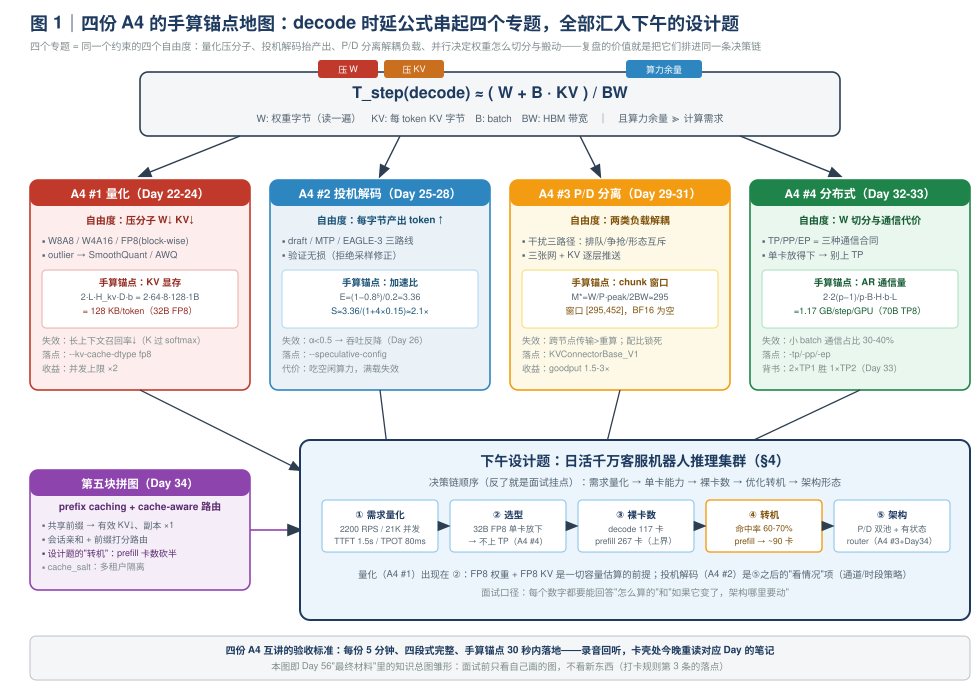
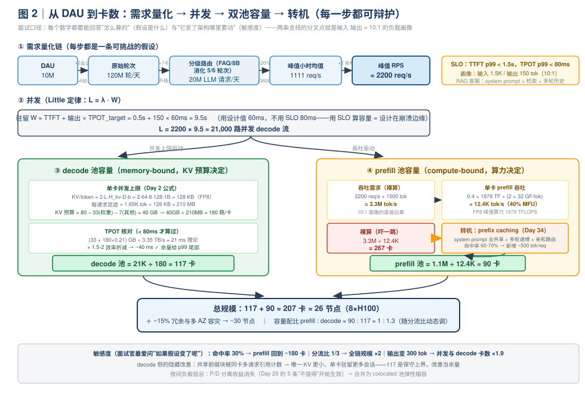
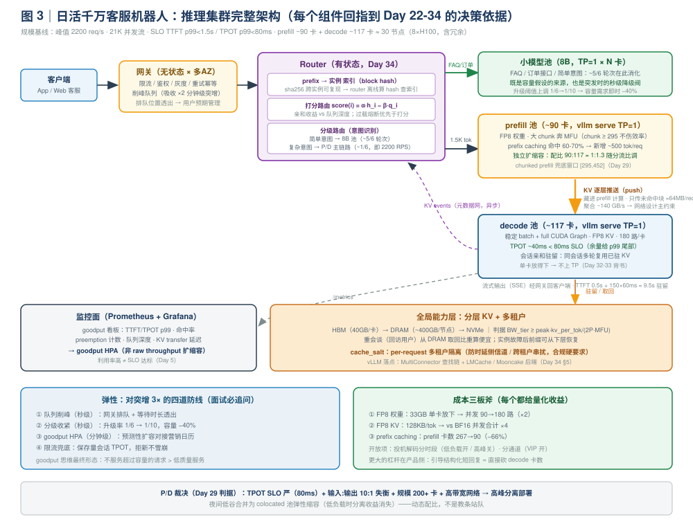

# Day 35｜复盘日：四份 A4 白板互讲 + 设计题"日活千万客服机器人推理集群"

> **本周主线（Week 5）**：从"单实例内怎么跑得快"升级到"一个集群怎么跑得好"。前六天铺完了四块拼图——P/D 分离（Day 29-31）、分布式并行（Day 32-33）、prefix caching 与路由（Day 34）。今天是收官复盘日：**上午**把第 4-5 周攒下的四份 A4 专题总结（量化 / 投机解码 / P/D 分离 / 分布式推理）各讲 5 分钟、录音回听、按"原理 → 场景 → 权衡 → 失效模式"四段互查；**下午**做一道综合设计题——**为一个日活千万的客服机器人设计推理集群架构**——把两周的知识在一张白板上串成一句话的架构决策链。
>
> **本日定位**：不引入新知识，但今天是两周里**密度最高**的一天。复盘日产出的图和讲稿才是面试时真正带得走的东西（打卡规则第 2 条）。设计题是专家岗面试的"区分度环节"：面试官不看你背了多少结论，而看你**能不能从需求出发、用数字推出架构**——每一步选型都能回答"为什么"和"差多少"。
>
> **版本基线**：本文是对 Day 22-34 全部内容的复盘引用，源码坐标与版本敏感处沿用各日标注（撰写时 2026-10 main 分支口径）。今天不新增源码走读，但设计题中的每个组件都要能回指到"哪一天、哪个源码模块"。

**今日时间预算**：上午 A4 互讲 90 min（4 × 5 min 讲 + 回听 + 互查补漏）+ 下午设计题推演 90 min（白板画图 + 3 分钟讲稿录音 ×2）≈ 3 h。

---

## 0. 前情回顾与本日位置

| 前情 | 关键结论 | 今天怎么用 |
|---|---|---|
| Day 22-24（W4） | **A4 #1《量化》**：W8A8 / W4A16 / FP8 的谱系；激活 outlier；KV cache 量化的精度代价 | 上午互讲第 1 份；下午设计题的"成本三板斧"之一（FP8 权重 + FP8 KV） |
| Day 25-28（W4） | **A4 #2《投机解码》**：用计算换访存；draft / MTP / EAGLE-3；加速比 ≈ f(接受率, 草稿成本)；低接受率负收益 | 上午互讲第 2 份；下午设计题的"要不要开"讨论（答案是"看通道和时段"） |
| Day 29-31 | **A4 #3《P/D 分离》**：混跑干扰三条路径；chunk 可行窗口；goodput 1.5-3×；三张网 + KVConnector | 上午互讲第 3 份；下午设计题的核心架构决策（分离 or 动态配比） |
| Day 32-33 | **A4 #4《分布式推理》**：TP 的 all-reduce / PP 的 bubble / EP 的 a2a；"能单卡放下就别上 TP"；2×TP1 胜 1×TP2 的实验背书 | 上午互讲第 4 份；下午设计题 Step 2 的选型依据（为什么不上 TP） |
| Day 34 | cache-aware routing、cache_salt 多租户、分层 KV 池 | 设计题的 router 设计与"卡数砍半"的转机；多租户隔离与降级预案 |
| Day 2 / Day 5 | KV 每 token 显存公式；goodput 定义 | 设计题所有手算的地基；容量按 goodput 而非 raw throughput 评估 |
| Day 7 / Day 14 / Day 21 / Day 28 | 历次复盘日的经验：**复盘产出 = 面试资产** | 今天的四份 A4 + 设计题讲稿，直接进 Day 49 的项目讲稿与 Day 56 的最终材料 |

**今日一句话论点**（先给结论，全文都在论证它）：

> 四份 A4 不是四个孤立专题，而是**同一个问题的四个自由度**：量化压低"每 token 的字节"（显存/带宽），投机解码提高"每字节带宽的产出 token"，P/D 分离让两类负载各自奔满，并行策略决定"最小的通信代价下怎么放下模型"。设计题就是把四个自由度**按 SLO 约束排序**：先算需求（RPS / 并发 / SLO），再算单卡能力（显存 / 带宽 / 算力），得到裸卡数；然后用 prefix caching（Day 34）把卡数砍半，用 FP8（Day 22-24）把并发翻倍，最后才谈架构形态（分离 or 混跑）。**顺序反了（先画架构再凑数字）就是面试挂点。**

---

## 1. 今日学习目标

学完后你应该能：

1. **脱稿讲**四份 A4：每份 5 分钟、四段式（原理 → 场景 → 权衡 → 失效模式）结构完整，且每份带一道**手算锚点**现场算出来（量化：KV 显存；投机：加速比；P/D：chunk 窗口；分布式：AR 通信量）；
2. **从需求推出架构**：给定 DAU / 会话画像 / SLO，5 分钟内算出峰值 RPS、并发流数（Little 定律）、decode 与 prefill 的裸卡数，并说出每一步的假设与安全系数；
3. **论证选型**：为什么选 ~32B FP8 单卡部署而不上 TP（用 Day 32-33 的通信算术与实验数据背书），什么时候该推翻这个决策；
4. **画出完整架构图**：网关 → 有状态 router（会话亲和 + 前缀打分 + 分级路由 + 负载兜底）→ P/D 双池（含 KV 逐层推送）→ 分层 KV → 监控（goodput 看板），并标注每个组件对应的 vLLM V1 模块；
5. **应对追问**：容量突增 3×、TTFT 超标、命中率不及预期、多租户隔离、投机解码要不要开——每个追问都能落到一个数字或一条源码机制上；
6. **产出 3 分钟版讲稿**并录音两遍：需求量化（1 min）→ 选型决策（1 min）→ 容量与架构（1 min）。

---

## 2. 核心概念速查

| 术语 | 一句话定义 | 首次深入 |
|---|---|---|
| **A4 四段式** | 每份专题总结固定结构：原理 → 场景 → 权衡 → 失效模式，缺一段就不算"能讲" | Day 24 起的固定产出格式 |
| **手算锚点** | 每份 A4 里必须有一道能在白板 30 秒内算出的数字题，面试时的"数字敏感度"证据 | 本日 §3 |
| **需求量化** | 从 DAU / 会话画像推峰值 RPS 与并发流数，先算再画 | §4.1 |
| **Little 定律** | 并发流数 = 到达率 × 驻留时间（`L = λ · W`），连接 RPS 与 decode 并发 | §4.1 |
| **裸卡数 / 转机** | 不做任何优化时的卡数上界；prefix caching 命中率是最大的"转机"变量 | §4.3 |
| **容量配比** | prefill 池 : decode 池 的算力比，按负载画像（输入:输出 token 比）独立配置 | Day 29；§4.4 |
| **分级路由** | 简单意图走小模型 / FAQ，复杂意图升级大模型——既是降级预案也是容量杠杆 | §4.1、§4.5 |
| **goodput HPA** | 按满足 SLO 的吞吐（而非 raw throughput）做自动扩缩容 | Day 5；§4.5 |
| **成本三板斧** | FP8 权重 + FP8 KV + prefix caching，每个都有前面某一天算过的量化收益 | §4.5 |

---

## 3. 上午：四份 A4 白板互讲（90 min）

### 3.0 互讲方法论：为什么"讲"比"读"有效

复盘日的核心动作不是重读，而是**输出**。认知上的理由很朴素：重读产生"熟悉感"，讲述产生"检索路径"——面试现场你能依靠的只有后者。操作上：

1. **计时 5 分钟**，对着白板（或纸）脱稿讲，**手机录音**；
2. 讲完**回听**，标记三类问题：卡壳处（检索路径不通）、含糊处（其实没懂）、超时处（详略失当）；
3. 按**四段式互查清单**（§3.5）逐项打勾，缺一段当场回到对应 Day 的笔记补；
4. 每份 A4 必须**现场做一道手算锚点**——这是把"我读过"变成"我算过"的分界线，也是面试数字敏感度的直接证据。

四份 A4 的关系先看一张地图（**图 1**）：它们是同一个 decode 约束 `T_step ≈ (W + KV) / BW` 的四个不同自由度——量化压分子、投机解码抬产出、P/D 分离解耦两类负载、并行决定 W 怎么被切分和搬动。下午的设计题会把这四个自由度按 SLO 顺序拧一遍。



### 3.1 A4 #1《量化》：5 分钟讲稿骨架

| 段 | 时间 | 必须说出的句子（锚点句） |
|---|---|---|
| 原理 | 90 s | 量化改的是 decode 时延公式的**分子**：权重字节 `W` 与 KV 字节。W8A8（INT8 权重+激活，per-channel scale）适合有算力增益的卡；W4A16（AWQ/GPTQ，仅权重量化）纯粹压显存与带宽；FP8（E4M3，per-tensor / per-channel / block-wise，DeepSeek 式 block-wise 精度最好）是当前 serving 主流。激活量化的难点是 **outlier 通道**：少数通道幅度大 10-100×，打爆 per-tensor scale——SmoothQuant 把 outlier 从激活**搬**到权重（等价缩放变换），AWQ 按"对激活幅度敏感"的通道保护性缩放，GPTQ 逐列最小化重构误差。 |
| 场景 | 60 s | 三个决策点：① 显存不够 → 先量化 KV（不用重校准，收益立竿见影）；② decode 带宽 bound → W4/FP8 权重直接降 TPOT 下界（`W/BW` 减半）；③ prefill compute-bound → 权重量化对 TTFT 收益小，FP8 的真实收益是**算力翻倍**（1979 vs 989 TFLOPS）。 |
| 权衡 | 90 s | 精度：per-tensor < per-channel < block-wise；成本：校准数据集 + 离线流程；KV 量化的独特权衡——它省的是**显存**（并发上限 ×2）和 decode 时的 KV 读带宽，但 attention 分数对 K 的量化误差敏感，**长上下文检索类任务**（needle-in-haystack）掉点风险高，务必用自己的负载验证（Day 23 实验）。 |
| 失效模式 | 60 s | ① per-tensor scale 被 outlier 打爆 → 换 per-channel/block-wise；② KV INT4 在长上下文召回率明显下降；③ W4 在数学/代码任务掉点（Day 22 的对照）；④ block-wise FP8 的 scale 存储/反量化有额外 kernel 开销——昇腾 WeightQuantBatchMatmul 的 fused 反量化经验在这里直接迁移。 |

**手算锚点（30 秒，白板）**：Qwen3-32B（L=64，kv_heads=8，head_dim=128）：

$$\text{KV/token} = 2 \times L \times H_{kv} \times D \times b = 2 \times 64 \times 8 \times 128 \times 1\,\text{B} = 128\,\text{KB (FP8)}$$

BF16 下 256 KB/token——**FP8 KV 把并发上限直接翻倍**。再补一刀：1 万路并发 × 2K 上下文 = 10000 × 2048 × 128 KB ≈ 2.6 TB，说明"量化是第一杠杆，但光靠它不够，还得靠前缀共享"——这句话直接给下午的设计题埋钩子。

**高频追问**：为什么 KV 量化比权重量化更"危险"？（权重误差是静态可校准的；K/V 的误差经过 softmax 放大且随上下文长度累积，影响的是"检索哪个 token"这种离散决策。）FP8 KV 对 TTFT 和 TPOT 分别什么影响？（TPOT 改善——KV 读带宽减半；TTFT 几乎不变——prefill 是 compute-bound，KV 只写不读回。）

### 3.2 A4 #2《投机解码》：5 分钟讲稿骨架

| 段 | 时间 | 必须说出的句子（锚点句） |
|---|---|---|
| 原理 | 90 s | decode 是 memory-bound：每 step 把 `W + KV` 全读一遍却只产出 1 个 token，**算力大量闲置**——投机解码用这份闲置算力换带宽：draft（小模型 / MTP head / EAGLE-3）先猜 γ 个 token，target 一次前向**并行验证** γ+1 个，接受则一步产出多个 token。关键是验证不改变目标分布（拒绝采样修正），精度无损。 |
| 场景 | 60 s | 三条路线：独立 draft model（最通用，但分布对齐差、多一份权重）；MTP（模型自带 draft head，权重共享训练，对齐好，DeepSeek 系标配）；EAGLE-3（在 feature 层面自回归，接受率最高）。收益负载强相关：**代码补全 / 模板化输出 α 高**，开放对话 α 低——Day 26 实验测过两条曲线。 |
| 权衡 | 90 s | 加速比公式（见锚点）：α 高时 γ=4 能拿 2×+；γ 有边际递减（α^γ 衰减）；代价是 verify batch 形状变化（CUDA Graph bucket 要覆盖 γ+1 形态）、draft 权重显存（draft model 路线）、低 α 时**纯亏**。高并发时算力不再免费（batch 大了逐步逼近 compute-bound），收益打折——这是它和 P/D 分离的本质区别：**投机解码吃的是"空闲算力"，负载一高就没了**。 |
| 失效模式 | 60 s | ① α < ~0.5 且 γ 大：草稿成本 > 接受收益，吞吐反降（Day 26 复现过）；② `num_speculative_tokens` 调过头：verify 浪费的比例上升；③ 高并发线上开投机：TPOT 可能反而抖（verify step 是 γ+1 倍计算量插进 decode 流水）；④ 温度 / 采样参数与 draft 不一致导致接受率隐性下降。 |

**手算锚点（30 秒，白板）**：设每 token 接受率 α=0.8、γ=4、草稿成本系数 c_d=0.15（draft 前向约为 target 的 15%）：

$$E[\text{tokens/step}] = \frac{1-\alpha^{\gamma+1}}{1-\alpha} = \frac{1-0.8^5}{0.2} = 3.36,\qquad S \approx \frac{3.36}{1+4 \times 0.15} \approx 2.1\times$$

同一个公式换 α=0.5：E = 1.94，S ≈ 1.94/1.6 ≈ 1.2×——**勉强打平**。这就是"低接受率 ≈ 负收益"的定量版本。

**高频追问**：为什么验证可以无损？（按目标分布与 draft 分布的比值做接受/拒绝采样，被拒处从修正分布重采样——数学上输出分布 = 目标分布。）什么时候坚决不开？（开放生成负载 α 低 / 集群满载算力不免费 / 显存紧张放不下 draft。）

### 3.3 A4 #3《P/D 分离》：5 分钟讲稿骨架

| 段 | 时间 | 必须说出的句子（锚点句） |
|---|---|---|
| 原理 | 90 s | prefill compute-bound、decode memory-bound，**最优 kernel 形态与 batch 策略相反**；混跑干扰三条路径：批同步排队（decode 等同一个 step 里的 chunk）、访存与 SM 争抢、形态互斥（动态形状毁 CUDA Graph）。chunked prefill 是"治标"，但可行窗口极窄；分离后双 SLO 解耦 + 容量配比独立，**收益主要在 goodput（1.5-3×，DistServe 口径最高 4.5×）**。 |
| 场景 | 60 s | 值得分离的画像：模型大、TPOT SLO 严、负载重、输入:输出比失衡、要控成本；三张网：请求网 / KV 数据网 / 元数据网；KV 逐层推送（push）把传输藏进 prefill 计算，pull 模式藏不掉首层等待。vLLM V1 落点是 `KVConnectorBase_V1` 插件体系（Day 30 六接缝）。 |
| 权衡 | 90 s | 分离引入三个新故障域（路由、KV 传输、双池容量管理）；跨节点时 KV 传输量 = `2·L·H_kv·D·b·prompt_len`（1.5K prompt FP8 ≈ 190 MB/请求），必须有高带宽网络才不亏；Sarathi-Serve 证明很多区间内仅 chunked prefill 就能拿大部分收益——**能主动说出"什么时候不需要分离"比只会说"分离好"更加分**（5 条：短输入短输出 / 低负载小模型 / 无高带宽网络 / 高前缀复用 / 运维成本敏感）。 |
| 失效模式 | 60 s | ① 跨节点走以太网传 KV：传输时间 > 重算时间，负收益；② 容量配比静态锁死：负载画像一变就一边排队一边闲置；③ decode 池 batch 不稳定（请求迁移时机不对），CUDA Graph 反复 capture；④ router 单点 / 状态不一致（Day 31 故障注入实验）。 |

**手算锚点（30 秒，白板）**：Llama-3-70B @ H100，chunk 可行窗口 `[M*, chunk_max]`：

$$M^* = \frac{W}{P}\cdot\frac{\text{peak}}{2\,\text{BW}} = 1 \times \frac{1979}{2 \times 3.35} \approx 295\ \text{tokens（FP8，compute-bound 交叉点）}$$

$$\text{chunk}_{max} = \text{TPOT}_{SLO} \times r_{prefill} = 0.08\,\text{s} \times 0.4 \times \tfrac{1979\text{TF}}{2 \times 70\text{G}} \approx 452\ \text{tokens}$$

FP8 窗口 `[295, 452]`——存在但**没有任何余量**，负载一波动就穿。BF16 下：`W/P = 2B` 且 peak 减半，两者乘积不变 → M* 仍 ≈295，但 chunk_max = 0.08 × 2827 ≈ 226 < 295 → **窗口为空**。推论（面试加分）：交叉点只与"每参数字节数 × 峰值算力 / 带宽"有关——硬件越偏算力（H100 → B200），这个矛盾越尖锐，这就是为什么 GPU 越新、P/D 分离越流行。

**高频追问**：分离后 goodput 为什么能提 1.5-3×？（双 SLO 解耦 + 容量配比独立 + 各自最优 batch/配置，三个独立自由度。）KV 传输量怎么估？（`2 × L × H_kv × D × b × prompt_len`，先算账再谈架构。）

### 3.4 A4 #4《分布式推理》：5 分钟讲稿骨架

| 段 | 时间 | 必须说出的句子（锚点句） |
|---|---|---|
| 原理 | 90 s | 三种并行 = 三种通信合同。**TP**：每层 2 次 all-reduce（attention 后 + FFN 后），消息小、频率高、卡在关键路径——吃 NVLink 带宽与时延，天然只能住单机（≤8 卡），且 decode（memory-bound）比 prefill 受伤重一个数量级。**PP**：只在 stage 边界点对点传 activation，量小到 PCIe 都够，代价是 bubble 吃掉吞吐分母 `(p-1)/(m+p-1)`。**EP**：MoE 层 all-to-all，通信量随 top-k 增长，可重叠可流水（DeepEP）。 |
| 场景 | 60 s | 决策树：显存放不下 → 先量化（Day 22-24），还放不下 → TP（域内）/ PP（跨机）；**单卡放得下 → 多实例 + 路由（Day 34）**，除非 prefill 算力不满足 TTFT SLO。延迟敏感选 TP（无 bubble、单请求延迟低），吞吐优先选副本（无通信、线性扩展）——Day 33 实验数据：TP2 的 TPOT 改善 < 2×，高并发吞吐 < 2×副本。 |
| 权衡 | 90 s | "能单卡放下就别上 TP"的四条理由：副本无通信开销 / 故障域小（挂一个不影响别的）/ 扩展线性 / 运维简单。TP 的真实收益只剩**单请求延迟**，且仅限 NVLink 域内；跨 NVLink 域（如跨机 PCIe/网卡）的 TP 是负收益。PP 只在高并发（m 大）时 bubble 占比才低；EP 的 a2a 怕小 batch（消息切太碎，latency 主导）。 |
| 失效模式 | 60 s | ① 小 batch decode 上 TP：AR 通信占比飙到 30-40%（下述锚点），TPOT 不降反升；② TP > kv_heads 触发 KV 复制（显存反而涨）；③ 锁步木桶：TP 组里最慢的卡拖累全组（最慢实例决定整组吞吐）；④ torchrun 与 vllm serve 混用导致 world size 对不上（Day 33 坑位）。 |

**手算锚点（30 秒，白板）**：70B BF16、TP=8、decode batch 256，每 GPU 每 step 的 AR 通信量：

$$\text{AR/layer} = 2 \times \frac{2(p-1)}{p} \times B \cdot H \cdot b = 2 \times 1.75 \times 256 \times 8192 \times 2\,\text{B} \approx 14.7\,\text{MB}$$

$$\times\,80\ \text{layers} \approx 1.17\,\text{GB / step / GPU}$$

对比：该 step 的权重读流量只有 140 GB / 8 = 17.5 GB——通信量是它的 ~7%，看似不大，但叠加 160 次小消息的 latency（160 × ~20 µs ≈ 3.2 ms，占 ~20 ms step 的 16%）后，decode 的通信占比达到 30-40% 量级——**这就是"decode 受伤重"和"TP 天然住单机"的定量来源**（Day 32 §3.3 推导 + Day 33 nsys 实测对拍过）。

**高频追问**：2 张卡，TP2 还是 2 副本？（延迟选 TP2、吞吐选 2 副本，用 Day 33 数据背书。）TP 开到什么时候负收益？（跨 NVLink 域 / 小 batch / 锁步木桶 / 有更便宜的显存手段——量化时。）

### 3.5 互查清单（每份 A4 过一遍，缺项当场补）

| 检查项 | A4 #1 量化 | A4 #2 投机 | A4 #3 P/D | A4 #4 分布式 |
|---|---|---|---|---|
| 原理段有一句"第一性"的话（bound / 公式） | TPOT 分子 `W + KV` | 空闲算力换带宽 | 资源画像相反 + 干扰三路径 | 三种通信合同 | 
| 场景段有明确的"什么时候用 / 不用" | prefill vs decode 收益不同 | α 高低定生死 | 5 条不值得 | 决策树 |
| 权衡段有**数字**（不是"有得有失"） | 128→256 KB/token | 2.1× vs 1.2× | 窗口 [295,452] | 1.17 GB vs 17.5 GB |
| 失效模式段有"怎么发现"（指标 / 现象） | 长上下文召回率 | 吞吐反降曲线 | 传输 > 重算 | nsys 通信占比 |
| 手算锚点 30 秒内算完 | ✅ KV 显存 | ✅ 加速比 | ✅ chunk 窗口 | ✅ AR 通信量 |
| 能说出与 vLLM V1 的落点（模块 / flag） | `--kv-cache-dtype fp8` | `--speculative-config` | `KVConnectorBase_V1` | `-tp/-pp/-ep` + `ParallelConfig` |

> **录音回听的三个自检问题**：① 有没有一句话超过 20 秒还没落到数字？（含糊信号）② 四段里哪段明显讲得快？（通常是失效模式——说明没实测过）③ 听的人能不能只凭这段话画出图？（不能 → 缺锚点句。）

---

## 4. 下午：设计题完整推演（白板模拟，90 min）

> **题目**：为一个日活千万（DAU 10M）的客服机器人设计推理集群架构。
>
> **规则**：先算再画。面试官看的就是"需求 → 数字 → 架构"这条链——每个选型决策都能回答"为什么"和"差多少"。下面按 Step 1-4 推演，最后压缩成 3 分钟讲稿。

### 4.1 Step 1：需求量化（先把 RPS 和并发算出来）

**假设（每条都要在白板上写出来，面试官会挑战它们）**：

| 假设 | 取值 | 依据 / 可挑战点 |
|---|---|---|
| DAU | 10M | 题设 |
| 人均会话 | 2 会话/天 × 6 轮/会话 | 客服产品典型画像 → 原始轮次 120M/天 |
| 大模型分流比 | ~1/6 | **客服场景的关键折算**：订单查询、退货政策、FAQ 命中等 ~5/6 的轮次由规则 / 检索 / 8B 小模型直接消化，只有复杂意图升级到 32B 主模型（这一步同时是 Step 4 的分级路由降级设计，数字前后呼应）→ **LLM 请求 ≈ 20M/天** |
| 峰值集中度 | 峰值小时占全天 20% | 客服流量双峰（午/晚），比公网应用更集中 |
| 分钟级突增 | ×2 安全系数 | 大促 / 热点事件（营销推送瞬间涌入） |
| 输入 / 输出长度 | ~1.5K / ~150 token | RAG 客服：system prompt + 检索文档 + 多轮历史；回答短且结构化 |
| SLO | TTFT p99 < 1.5s，TPOT p99 < 80ms | 流式输出，TPOT 80ms 是"打字机不卡顿"的感知阈值（Day 5） |

> **对账说明**：本周 README 的峰值公式 `10M × 2 × 0.2 / 3600 × 2 ≈ 2200 req/s` 把"每会话 6 轮"和"意图分流"合并成了一个 ×2。本文把账摊开写（120M 轮 × 1/6 = 20M 请求），结论一致但每一步可辩护——面试时被追问"这个 2200 怎么来的"，摊开的版本才答得住。

**峰值 RPS**：

$$\text{RPS}_{peak} = \frac{20M \times 0.2}{3600} \times 2 \approx 1111 \times 2 \approx 2200\ \text{req/s}$$

**并发 decode 流数（Little 定律）**——驻留时间 = TTFT + 输出长度 × TPOT：

$$W \approx 0.5\,\text{s} + 150 \times 60\,\text{ms} \approx 9.5\,\text{s} \;\Rightarrow\; L = \lambda \cdot W = 2200 \times 9.5 \approx 21{,}000\ \text{路并发}$$

（TPOT 按目标值 60ms 而非 SLO 80ms 代入——**用 SLO 算容量是把系统设计在崩溃边缘**。）

**产出**：2200 req/s、21K 并发流、TTFT 1.5s / TPOT 80ms、输入:输出 = 10:1。这四个数字决定后面一切。

### 4.2 Step 2：模型与并行选型（"为什么不上 TP"）

**模型**：~32B 级 instruct 模型（如 Qwen3-32B），**FP8 权重**（A4 #1 的决策）：

- 权重 ≈ 33 GB → **单卡 80 GB 放得下，还有 ~40 GB 给 KV**；
- 选 32B 而非 70B：客服对话的智商需求用不到 70B，成本差 2×+——**模型选型是最大的成本杠杆，先于一切系统优化**。

**并行策略**（A4 #4 的决策树，Day 32-33 背书）：单卡放得下 → **不上 TP，一卡一实例**。四条理由（面试要能脱口而出）：

1. 副本无通信：TP2 的 decode 每 step 多 128 次 all-reduce（Day 33 实测通信占比 ~ρ 预测值），副本是零；
2. 故障域小：挂一张卡损失 1/200 的容量，TP8 实例挂一张卡损失整个实例 1/26；
3. 扩展线性：加卡 = 加副本，吞吐线性、无 bubble、无锁步木桶；
4. Day 33 Lab D 实测：2×TP1 + 分流的聚合吞吐与 p99 都优于 1×TP2。

**单卡 decode 能力核对**（Day 2 公式现场用）：

- KV/token（FP8 KV，L=64，kv_heads=8，head_dim=128）：`2 × 64 × 8 × 128 × 1B = 128 KB`；
- 每请求 KV 足迹：1.65K token × 128 KB ≈ **210 MB**（输入 1.5K + 输出 150）；
- 单卡并发上限：KV 预算 80 − 33（权重）− 7（激活 / CUDA Graph / 框架）≈ 40 GB → 40 GB ÷ 210 MB ≈ **180 路/卡**（留余量）；
- TPOT 估算：权重读 33 GB ÷ 3.35 TB/s ≈ 10 ms + KV 读 180 × 0.21 GB ÷ 3.35 TB/s ≈ 11 ms → 理论 ~21 ms，按 1.5-2× 效率折减 → **~40 ms < 80 ms SLO，余量充足**（余量是给 p99 尾部留的：抢占、GC、网络抖动）。

### 4.3 Step 3：容量估算（裸卡数 → 转机）

**decode 卡数**（无前缀复用的保守上界）：

$$21{,}000 \div 180 \approx \boxed{117\ \text{卡}}$$

**prefill 卡数（先算吓一跳的上界）**：

$$\text{prefill 吞吐需求} = 2200 \times 1500 = 3.3M\ \text{tok/s}$$
$$\text{单卡 prefill} = 0.4 \times \frac{1979\ \text{TFLOPS}}{2 \times 32\ \text{GFLOP/tok}} \approx 12.4K\ \text{tok/s} \;\Rightarrow\; 3.3M \div 12.4K \approx 267\ \text{卡}$$

prefill 比 decode 还多 2.3 倍——**这就是 RAG 客服"输入:输出 = 10:1"画像的直接后果**，也是这道题的"题眼"。

**转机：prefix caching（Day 34 登场）**。客服负载的前缀结构极度友好：

- system prompt（客服人设 + 政策文档）：全租户共享 → 100% 命中；
- 多轮历史：同一会话第 k 轮的前缀 = 第 k−1 轮的全部 → 会话内命中递增；
- 检索文档：同话题问题共享 top-k 文档块。

综合命中率按 **60-70%** 估（Day 34 Lab A 的实测区间），每请求新增 prefill token 从 1500 降到 ~500：

$$2200 \times 500 = 1.1M\ \text{tok/s} \;\Rightarrow\; 1.1M \div 12.4K \approx \boxed{90\ \text{卡}}$$

**结论链条（本题的面试亮点，必须连起来讲）**：

> prefix caching + cache-aware 路由把 prefill 池从 267 卡砍到 90 卡（−66%）——**这就是 Day 34 值得作为独立专题的全部理由**。同时 decode 侧的 117 卡也会改善：共享前缀块被同卡多请求引用计数（Day 16），唯一 KV 占用更小、单卡可驻留更多会话——但保守起见仍按 117 报，把改善当作余量。

**总规模**：117 + 90 ≈ 207 卡 ≈ 26 节点（8×H100），加 ~15% 冗余与多 AZ → **~30 节点**。整条推导见图 2。



### 4.4 Step 4：架构分层（画图）

白板上按数据流从左到右画（**图 3** 是完整版）：

```
客户端 → 网关（限流/鉴权/灰度/多AZ）
            → router（会话亲和 + 前缀打分 + 分级路由 + 负载兜底）
                 ├─ 小模型池（8B：FAQ/简单意图，~1/6 流量的"下游"）
                 ├─ prefill 池（FP8、大 chunk、奔 MFU，~90 卡）
                 │      └─(KV 逐层推送，只传 decode 侧未命中的块)─┐
                 └─ decode 池（稳定 batch + CUDA Graph，~117 卡）←┘
全局：分层 KV（HBM→DRAM→SSD）· cache_salt 多租户 · Prometheus/Grafana（goodput 看板）
```

**逐层决策依据**（每一层回指到前面某一天）：

| 层 | 决策 | 依据 |
|---|---|---|
| 网关 | 无状态、多 AZ、限流 + 灰度 | 峰值 ×2 安全系数的执行者；对接 RocketMQ 式削峰队列（突发时排队而非雪崩） |
| router | **有状态**：prefix 索引（block hash → 实例）+ 打分 `α·h_i − β·q_i` + 过载熔断 | Day 34 §3：亲和收益 vs 负载均衡的折中；索引由 KV events 喂（Day 30 元数据网） |
| 分级路由 | 简单意图 → 8B 池 | 既是 Step 1 分流比的**执行者**（1/6 升级率是容量假设的来源），也是突发时的降级阀门 |
| prefill 池 | 大 chunk、奔 MFU、可独立扩容 | Day 29：分离后 prefill 不再受 TPOT SLO 束缚；容量配比 = 90:117 ≈ 1:1.3，随分流比动态调 |
| decode 池 | 稳定 batch + full CUDA Graph | Day 18 + Day 29：batch 形态稳定才配得上 full CG；TPOT ~40ms 余量充足 |
| KV 传输 | 逐层推送（push），且**只传 decode 侧未命中的块** | Day 30：传输藏进 prefill 计算；1.5K 全量 ≈ 190 MB/req，若 decode 侧已持有共享前缀（路由亲和使然），实传 ~500 tok × 128 KB ≈ 64 MB/req，聚合带宽需求从 ~420 GB/s 降到 ~140 GB/s |
| 分层 KV | HBM → DRAM → NVMe | Day 34 §5.2 判据 `BW_tier ≥ peak·kv_per_tok/(2P·MFU)`：重会谈从 DRAM 取回比重算便宜 |
| 多租户 | cache_salt per-request 透传 | Day 34 §4：防时延侧信道与跨租户串扰（客服场景有合规硬要求） |
| 监控 | goodput 看板（TTFT p99 / TPOT p99 / 命中率 / preemption / 队列深度） | Day 5：按 goodput 而非 raw throughput 评估与扩缩容 |

**P/D 要不要分离？——用 Day 29 判据现场裁决**：

- ✅ TPOT SLO 严（80ms，流式体验硬约束）；
- ✅ 输入:输出 = 10:1，算力配比 1:1.3 失衡，混跑会互相干扰；
- ✅ 规模够大（200+ 卡），分离的运维复杂度被规模摊薄；
- ✅ 有高带宽网络（同节点 NVLink / 跨节点 RDMA，KV 传输预算已核对）。

→ **白天高峰分离部署；夜间负载低谷合并为 colocated 池弹性缩容**（低负载时分离收益消失，Day 29 的 5 条"不值得"开始生效）。这是"动态配比"而不是教条站队——能说出夜间回退，说明你真的理解判据而不是背结论。



### 4.5 弹性、降级与成本三板斧

**弹性（对突增 3× 的预案，面试必追问）**：

1. **第一道：队列削峰**（秒级）——网关侧排队 + 预估等待时间透出（"前面还有 N 人"），把 p99 TTFT 的问题转化为用户预期管理；
2. **第二道：分级路由收紧**（秒级）——升级阈值上调，更多轮次走 8B / FAQ（Step 1 的 1/6 变成 1/10），容量需求即时下降 ~40%；
3. **第三道：goodput HPA 扩容**（分钟级）——按 `goodput / SLO 达标率` 而非 CPU/GPU 利用率扩容（Day 5：利用率高 ≠ SLO 达标）；预测性扩容对接营销日历；
4. **第四道：限流兜底**——保护存量会话的 TPOT，宁可拒绝新请求也不拖垮全池（这是"goodput 思维"的最终形态：**不服务超过容量的请求，比低质量服务更优**）。

**降级与容灾**：小模型分级（上述）、preemption 监控告警（`vllm:preemption_reqs` 增长 → KV 超配 → 收 `max_num_seqs` 或扩容，Day 12/51 诊断树）、多 AZ 部署 + 健康检查摘除、会话亲和下的实例故障重路由（丢失前缀缓存 → TTFT 短暂回升，可从分层 KV 取回）。

**成本三板斧（收尾必背，每个都给量化收益）**：

| 板斧 | 量化收益 | 出处 |
|---|---|---|
| FP8 权重 | 显存 66→33 GB，单卡并发 90→180 路（**×2**） | Day 22-24 |
| FP8 KV | 每 token 256→128 KB，并发再 **×2**（vs BF16 合计 ×4） | Day 23 实验 |
| prefix caching | prefill 卡数 267→90（**−66%**），TTFT 同步下降 | Day 34 Lab A |

三斧之外再补一句开放项：投机解码（A4 #2）在这套架构里是**"看情况"项**——客服输出模板化程度高（话术、工单格式），α 可能不错，但高并发时段 decode 池算力不空闲，收益打折；策略是**低负载时段开启、高峰关闭**（或只对延迟敏感的 VIP 通道开）。能给出"分时段/分通道"而不是"开/不开"的答案，就是 Day 26 实验的内化。

### 4.6 面试官追问树（每题先给一句话结论，再展开）

| 追问 | 一句话结论 | 展开锚点 |
|---|---|---|
| 为什么不上 TP？ | 单卡放得下，TP 只有延迟收益且 decode 受伤重 | §4.2 四条理由 + Day 33 数据 |
| TTFT 1.5s 会卡在哪？ | 三选一：队列（容量不足）/ 计算（prefill 慢）/ 传输（分离架构下 KV 未到位） | Day 51 诊断树提前版：看队列深度、prefill 利用率、KV transfer 延迟三个指标定位 |
| 命中率 60-70% 怎么保证？万一只有 30%？ | 前缀结构是产品决定的；监控 `gpu_prefix_cache_hits`，命中率掉 → prefill 卡数回到 ~180+，需要 HPA 兜住 | Day 34 Lab A；容量对命中率的敏感度：90 → 267 卡之间线性 |
| 并发 21K 路是怎么算的？ | Little 定律：到达率 × 驻留时间，TPOT 用设计值 60ms 不用 SLO 80ms | §4.1 |
| KV 传输会不会成为新瓶颈？ | 聚合 ~140-420 GB/s（取决于是否只传增量块），按节点分摊后每节点 ~20-35 GB/s，RDMA 可承受但已是网络设计主约束 | §4.4 传输行 |
| 模型要是换成 70B / MoE 呢？ | 70B：单卡放不下 → TP4/TP8 域内，或 PP，卡数 ~3×；MoE：EP + a2a，容量估算改为按激活参数算 FLOPs | A4 #4 决策树换入口 |
| 多租户怎么隔离？ | cache_salt（缓存侧信道）+ 配额（每租户 max_num_seqs 份额）+ 优先级（VIP 通道） | Day 34 §4 |
| 为什么 TPOT 估 40ms 但 SLO 定 80ms？ | p99 ≠ 均值：抢占 / 抖动 / 突发要吃掉一倍余量；SLO 定在均值上等于没有 SLO | §4.2 + Day 5 |
| 这套东西最贵的是什么？最想优化什么？ | decode 的 117 卡（占 57%）——最想优化的是把输出变短（产品侧引导结构化回复）或拉高 α 开投机 | 成本视角的开放题，展示"系统工程师也懂产品杠杆" |

### 4.7 三分钟版讲稿骨架（录音 ×2）

| 时间 | 讲什么 | 必须出现的数字 |
|---|---|---|
| 0:00-1:00 | **需求量化**：DAU 10M → 120M 轮 → 分级路由 1/6 升级 → 20M LLM 请求/天 → 峰值 2200 RPS；Little 定律 → 21K 并发流；SLO：TTFT 1.5s / TPOT 80ms | 2200、21K、10:1 |
| 1:00-2:00 | **选型**：32B FP8，权重 33GB 单卡放下 → 不上 TP（四条理由一句话带过）；KV 128KB/token、180 路/卡、TPOT ~40ms 有余量 | 33GB、128KB、180、40ms |
| 2:00-3:00 | **容量与架构**：decode 117 卡；prefill 裸算 267 卡 → prefix caching 命中 65% → 90 卡（题眼）；P/D 分离 + 有状态 router + 分层 KV；弹性：队列削峰 + goodput HPA + 分级路由 | 117、267→90、30 节点 |

> 十分钟版在此骨架上展开：每张表展开一层（比如"不上 TP"展开到 Day 33 的实测数据），追问树里的 3-4 个问题主动预答。**录音回听标准：3 分钟版里每个数字都能在 10 秒内说出推导来源。**

---

## 5. 动手复盘步骤（今天的"实验"就是输出）

复盘日不跑 GPU，但今天的动作同样有硬性验收标准：

**上午（90 min）**：

1. **（10 min）打印/摊开四份 A4**，按图 1 的地图摆好，每份旁边放一张空白纸；
2. **（4 × 15 min）逐份计时互讲**：5 分钟脱稿讲（录音）+ 5 分钟回听标记卡壳/含糊/超时 + 5 分钟按 §3.5 清单互查补漏；
3. **（10 min）手算锚点连测**：四道锚点题（KV 显存 / 加速比 / chunk 窗口 / AR 通信量）连续做完，目标总计 ≤3 分钟——这是 Day 50 白板四件套的第一次全真模拟；
4. **（10 min）补漏**：互查发现的缺段，回到对应 Day 的笔记当场补进 A4（不改结构，只补句子）。

**下午（90 min）**：

5. **（30 min）白板推演设计题**：不看本文 §4，从 DAU 10M 开始在白板上独立推到 30 节点，每一步写清假设；
6. **（20 min）对照检查**：翻开 §4 对账——数字不一致的地方，先查是假设不同（允许）还是推导错了（必须改）；
7. **（25 min）画完整架构图**（对照图 3），标注每个组件对应的 vLLM 模块；
8. **（15 min）3 分钟讲稿录音 ×2**：第一遍一定超时，删掉细节；第二遍卡在 3 分±15 秒内。

**晚上（20 min，可选加分）**：

9. 找一个同行（或对着 Day 52 的问题清单自问自答）做一次**追问压力测试**：让对方从 §4.6 的追问树里随机抽 5 问，每题先给一句话结论再展开。

---

## 6. 面试高频问题（本日新增：综合设计类）

前六天的问题清单见各日 §N，今天只列**综合/设计类**——它们没有唯一答案，考察的是决策链是否完整：

| 问题 | 答题锚点 |
|---|---|
| 为日活千万的客服机器人设计推理集群 | §4 全文：需求量化 → 选型 → 容量 → 转机 → 架构，3 分钟版讲稿 |
| 你的架构里最贵的是什么？最想优化什么？ | decode 117 卡（占 57%）；产品侧缩短输出 / 拉高 α 开投机，其次才是系统优化 |
| 如果只能保留一个优化（量化/投机/分离/缓存）？ | prefix caching：−66% prefill 卡数且同时降 TTFT；其余三个的收益都随负载漂移，缓存的收益随业务粘性增长 |
| 容量规划里哪个假设最脆弱？ | 分流比 1/6 与命中率 65%——都是产品行为，会随版本漂移；监控 + 敏感度表（图 2 底部）兜底 |
| 什么时候你会推翻"不上 TP"的决策？ | 模型升级到 70B+/MoE 单卡放不下；或 TTFT SLO 收紧到 prefill 单卡算力不够（那时先量化、再 TP 域内） |
| 这套架构半年后哪里最可能先崩？ | 会话亲和导致的热点（大客户前缀打爆单实例）→ 打分函数 β 项 + 副本上限；或命中率随租户数量增长的稀释 → 分层 KV 兜底 |

---

## 7. 今日总结

| # | 要点 | 一句话 |
|---|---|---|
| 1 | 复盘的价值 | 重读产生熟悉感，讲述产生检索路径——面试现场只有后者可用 |
| 2 | 四份 A4 = 四个自由度 | 量化压分子（W/KV）、投机抬产出、P/D 解耦负载、并行定切分与通信——同一条 decode 时延公式的四种拧法 |
| 3 | 手算锚点 | KV 128KB/tok · S≈2.1× · 窗口 [295,452] · AR 1.17GB/step——四道题 3 分钟内连做完是 Day 50 的入场券 |
| 4 | 设计题决策链 | 需求量化（2200 RPS/21K 流）→ 选型（32B FP8 单卡，不上 TP）→ 裸卡数（117+267）→ 转机（缓存 −66% → 90）→ 架构（P/D 双池 + 有状态 router + 分层 KV） |
| 5 | 题眼 | RAG 客服 10:1 的输入输出比让 prefill 裸算 267 卡 > decode 117 卡——prefix caching 是唯一能砍掉它的杠杆，这就是 Day 34 独立成篇的理由 |
| 6 | 弹性四道防线 | 队列削峰（秒）→ 分级收紧（秒，−40%）→ goodput HPA（分钟）→ 限流兜底；goodput 思维：不服务超容请求 > 低质量服务 |
| 7 | 动态配比 | 高峰 P/D 分离、夜间合并 colocated——能说出"什么时候回退"比"站队分离"高一档 |
| 8 | 成本三板斧 | FP8 权重 ×2 并发 + FP8 KV 再 ×2 + prefix caching −66% 卡数；更大的杠杆在产品侧（短回复） |

**带走的三张图**：图 1（四份 A4 锚点地图——Day 56 知识总图雏形）、图 2（DAU → 卡数推导链——设计题白板版）、图 3（完整架构——本系列 W5 的收官图）。

---

## 8. 今日自测题（不看笔记作答；本周清单全量过一遍）

**今日新增（设计题）**：

1. 2200 RPS 的推导链完整复述一遍——四个假设分别是什么？哪个对产品行为最敏感？
2. 为什么 TPOT 估算用 60ms 而不是 SLO 的 80ms 代入 Little 定律？反过来会低估还是高估容量？
3. 32B FP8 单卡 180 路并发是怎么算的？三个减数（33/7/40）分别是什么？
4. prefill 裸算 267 卡、缓存后 90 卡——中间那一步的换算是什么？命中率掉到 30% 时卡数回到多少？
5. P/D 分离的四条判据分别是什么？夜间为什么要回退到混跑？

**本周清单（Day 29-34 全量，口头过一遍）**：

6. P/D 分离的定量动机是什么？chunk 窗口怎么算？
7. 什么时候不值得做 P/D 分离？（背 5 条）
8. KV 逐层推送为什么能把传输延迟藏掉？push 和 pull 差在哪？
9. Mooncake / Dynamo / llm-d 一句话对比？
10. 70B BF16 TP8 batch 256 每 GPU 每 step 通信量现场推？
11. TP 什么时候负收益？PP 为什么高并发才划算？EP 的 a2a 为什么怕小 batch？
12. 2 张卡：TP2 快还是 2 副本多？（答：延迟选 TP、吞吐选副本，用 Day 33 数据背书）
13. cache_salt 防什么？代价是什么？
14. KV 下沉 SSD 什么时候反而亏？

（答案都在 §3-§4 与 Day 29-34 各日笔记里；答不上来的小节今晚重读。）

---

## 9. 今日产出物

- [ ] **四份 A4 互讲录音**（4 × 5 min）：回听标记的卡壳/含糊/超时清单 + 当场补漏的记录（哪份 A4 缺哪段）
- [ ] **手算锚点连测记录**：四道题总计用时（目标 ≤3 min），错的题目标注
- [ ] **设计题白板推演**：DAU → 30 节点的完整推导（拍照存档）+ 与 §4 对账的差异说明
- [ ] **3 分钟版讲稿录音 ×2**：第二遍卡在 3 min ±15 s——这是 Day 54-55 模拟面试的现成素材
- [ ] **三张图**（图 1/2/3）：直接进 Day 56 最终材料，Day 49 整理进项目讲稿
- [ ] 打卡一句话：四份 A4 互讲时，哪一份的"失效模式"段讲得最虚？今晚补哪一天的重读？
- [ ] 下周预告：**Week 6 项目 A 启动**——Day 36 选型与调研：浏览 vllm-ascend / vLLM 主仓的 open issues 与 roadmap，从四个候选方向（paged attention kernel 优化 / 量化 GEMM tiling / MLA 后端 / 调度器小改进）里选定你的贡献点，产出选题备忘录。今天设计题里的"数字敏感度 + 决策链"方法论，就是下周做 issue 评估时的评分框架。
