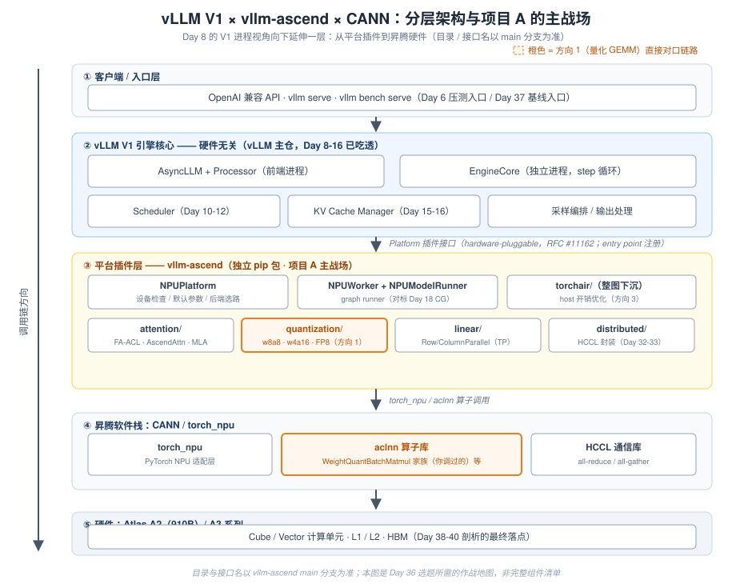
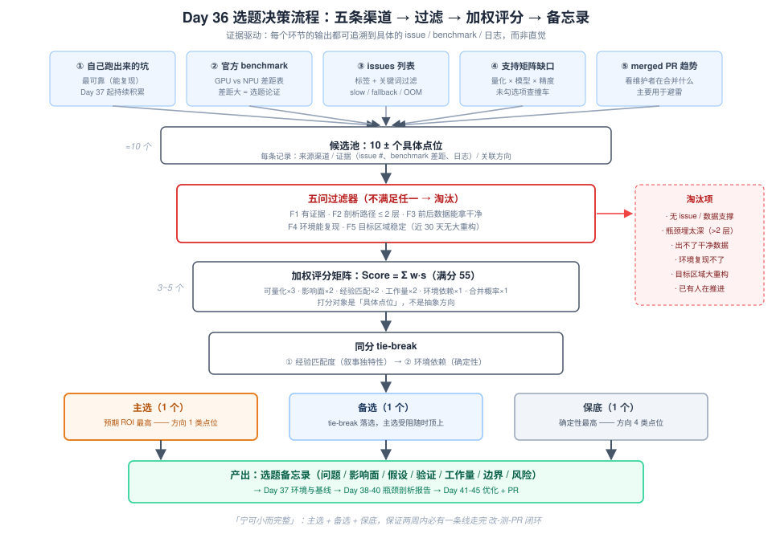
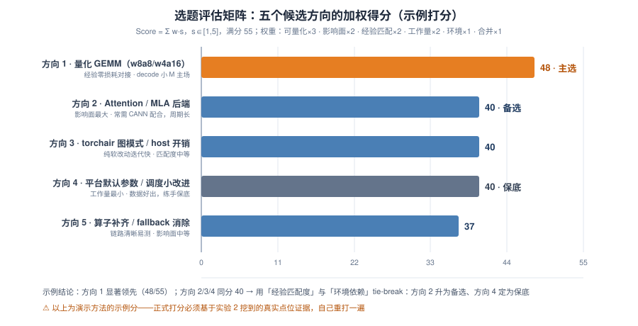

# Day 36：项目 A 启动 —— 选型与调研

> **本周**：第 6 周 · 项目 A（vLLM-Ascend 源码贡献）上篇
> **今日定位**：从"我想贡献"变成"**我锁定这一个点，预计 X 天，数据可量化**"
> **预计用时**：2.5 ~ 3.5 小时（纯调研日，**不依赖 NPU 环境**——环境是明天 Day 37 的事）
> **今日金句**：宁可小而完整。一个 shape 特化 + 前后数据 + 分析报告，比一个宏大但没闭环的方向值钱得多。

---

## 0. 前情回顾与今日位置

过去五周我们完成了三件事：

| 周 | 积累 | 在项目 A 中的角色 |
|---|---|---|
| W1 | 性能第一性原理：prefill/decode 手算公式、Roofline | **选题论证的语言**（AI、bound、理论时延下界） |
| W2-W3 | vLLM V1 全链路源码：调度、KV 管理、attention 抽象、CUDA Graph | **后端知识已就位**——插件层之上你全懂 |
| W4-W5 | 量化 / 投机解码 / P-D 分离 / 分布式四份 A4 专题 | **优化的手段库与 trade-off 判断力** |

特别是 **Day 17** 留下的那道思考题——"如果让你给新硬件写 attention backend，要实现哪些接口？"——今天我们从另一个方向回到它：**vllm-ascend 就是这道题的"官方答案仓库"**。华为与 vLLM 社区按照 hardware-pluggable 架构（vLLM RFC #11162）把昇腾后端做成了独立插件包，而你的项目 A，就是往这个包里提交一个**带性能数据的 PR**。

项目 A 跨 W6-W7 共 14 天，分四段：**Day 36 选题 → Day 37 环境+基线 → Day 38-40 剖析 → Day 41-45 优化+PR**。今天是第一段：**选错方向的代价是两周白干，所以"选什么"本身就值得一整天。**

---

## 1. 今日学习目标

学完今天，你应该能够：

| # | 目标 | 验收标准 |
|---|---|---|
| 1 | 建立 vllm-ascend 仓库的**地图感** | 不看资料说出 6+ 个核心目录的职责及其与你的关联 |
| 2 | 掌握**证据驱动**的选题方法（五条渠道 + 五问过滤器） | 挖出 ≥10 个候选点位，每条标注证据来源 |
| 3 | 会用**加权评分模型 + tie-break 规则**做选题决策 | 一张自己打的评估矩阵（不是抄示例分） |
| 4 | 完成**边界确认**：改动落在 vllm-ascend 侧还是 CANN 侧 | 备忘录中明确"我要改的代码在哪个仓库、哪一层、能不能改" |
| 5 | 产出**选题备忘录**（主选 1 + 备选 1 + 保底 1） | 含问题、影响面、假设、验证方式、工作量、风险与降级路径 |

---

## 2. 核心概念

### 2.1 vllm-ascend 是什么：vLLM 的"硬件插件"

一句话定义：**vllm-ascend 不 fork vLLM，而是以插件（plugin）形式为 vLLM 提供昇腾 NPU 后端。**

回顾 Day 8 的 V1 架构：`AsyncLLM → Processor → EngineCore → Worker → ModelRunner`。这条链路里，**调度器、KV Cache 管理、continuous batching 的核心逻辑都在 vLLM 主仓且硬件无关**；硬件差异（设备初始化、attention kernel、量化算子、通信后端）被隔离在平台适配层。vLLM 主仓在启动时通过 hardware-pluggable 接口（RFC #11162）发现并加载平台插件——vllm-ascend 就是注册为 `npu` 的那个包。社区还专门发过一篇博客讲这个实践：*Introducing vLLM Hardware Plugin, Best Practice from Ascend NPU*（blog.vllm.ai，2025-05）。

> **为什么这个架构对你是利好**：你在 W2-W3 吃透的引擎核心（Scheduler / KV Cache Manager / chunked prefill）全部直接适用；你要贡献的部分被清晰地隔离在一个独立 pip 包里，**不需要碰 vLLM 主仓** → PR diff 小、review 快、心智负担低。

### 2.2 仓库地图（今日第一个产出）

以下目录地图请在实验 1 中对照 main 分支逐条验证（目录结构随版本演进较快，**以实际为准**）：

| 目录 | 作用 | 与你的关联 |
|---|---|---|
| `vllm_ascend/platform.py` | NPUPlatform：设备检查、默认参数、capability 上报、attention/量化实现选路 | 一切"NPU 默认行为"的源头（方向 4 的入口） |
| `vllm_ascend/attention/` | Attention 后端：FlashAttention(ACL)、AscendAttention（自研 paged）、torchair 图模式、MLA | 方向 2 主战场；对应 Day 17 的接口清单 |
| `vllm_ascend/quantization/` | w8a8 / w4a16 / FP8 的 LinearMethod，最终调用 CANN 侧量化融合 matmul | **与 WeightQuantBatchMatmulV2 经验直接对口（方向 1）** |
| `vllm_ascend/linear/` | Row/ColumnParallelLinear 的 NPU 实现（TP 切分 + 量化下沉） | 方向 1 调用链的上游 |
| `vllm_ascend/worker/` | NPUWorker / NPUModelRunner / graph runner（capture、replay） | host 开销分析入口（方向 3） |
| `vllm_ascend/torchair/` | NPU 整图下沉（torchair graph） | host-bound 优化主战场（方向 3） |
| `vllm_ascend/distributed/` | HCCL 通信封装 | TP 通信开销分析（对接 Day 32-33） |
| `tests/`、`ut/` | e2e 与单测 | Day 37 回归验证入口 |
| `benchmarks/`、`docs/` | 基准脚本与文档（含支持矩阵） | 渠道 ②④ 的信息来源 |

> ⚠️ **版本提示**（截至 2026-10 main 分支）：vllm-ascend 当前要求 Python ≥3.10 <3.13、CANN 9.1.0、PyTorch/TorchNPU 2.10 系列，硬件覆盖 Atlas 800I A2 / A2 训练系列 / 800I A3 / A3 训练系列 / 300I Duo（实验性）。**这些数字变化很快，一切以官方文档的版本矩阵为准，不自创组合。** 分支策略：`main` 跟随 vLLM main（CI 持续监控），`releases/vX.Y.Z` 随 vLLM 版本切出——**贡献开发对齐 main。**

### 2.3 三个贯穿全天的关键认知

1. **选题是投资决策，不是兴趣匹配。** 每个候选 = 一笔投资：投入（工时、环境风险）换收益（性能数据、PR、简历叙事）。决策依据必须是显式模型（评分矩阵 + ROI），而不是"这个看起来高级"。
2. **先确认边界，再确认方向。** 一个性能问题的修复位置可能落在三层之一：vllm-ascend（Python 层）、torch_npu 接口层、CANN 算子库内部。**只有第一层你能直接改并提 PR**——这直接决定选题的"可完成性"（详见 §5.5）。
3. **证据 > 直觉。** "有人报了 issue / 官方 benchmark 有差距 / 日志里有 fallback"才是选题地基；自己想象的瓶颈要留到 Day 38-40 用数据验证。今天所有候选都必须能回答："**你的证据是什么？**"

---

## 3. 原理深入：vllm-ascend 在 V1 栈中的位置与调用链

### 3.1 分层架构总览

把 Day 8 的 V1 进程视角向下延伸一层，就得到项目 A 的完整作战地图：



自上而下五层，职责边界清晰：

- **① 客户端/入口层**：OpenAI 兼容 API、`vllm serve`、`vllm bench serve`——Day 6 压测的入口，Day 37 基线也从这里打。
- **② vLLM V1 引擎核心（主仓，硬件无关）**：前端进程（AsyncLLM + Processor）与 EngineCore 进程（Scheduler、KV Cache Manager、采样编排）——Day 8-16 已吃透，**换后端不换这一层**。
- **③ 平台插件层 vllm-ascend（今日主战场）**：NPUPlatform 提供设备能力与选路；NPUWorker/NPUModelRunner 承接执行；attention/quantization/linear/distributed/torchair 各管一摊。
- **④ 昇腾软件栈**：torch_npu（PyTorch 适配）+ aclnn 算子库（**含你优化过的 WeightQuantBatchMatmul 家族**）+ HCCL。
- **⑤ 硬件**：Atlas A2（910B）的 Cube/Vector 单元、L1/L2、HBM——Day 38-40 剖析的最终落点。

橙色高亮的链路（`quantization/` → `aclnn 算子库`）就是方向 1 的"对口区"：**vllm-ascend 的量化线性层，最终调用的正是你在昇腾上调过的那类量化融合 matmul 算子。**

### 3.2 一个请求在 NPU 后端的执行调用链

Day 9 走读过主仓部分，今天补上 NPU 侧的"最后一公里"：

```text
AsyncLLM.generate()                          # vllm/entrypoints：异步收请求
  └─ Processor.add_request()                 # tokenize → RequestState 入队（Day 9）
  └─ EngineCore.step()                       # vllm/v1/engine：一步调度 + 一步执行
      ├─ Scheduler.schedule()                # vllm/v1/core：chunked prefill / preempt 决策（Day 10-12）
      │    └─ kv_cache_manager.allocate/append  # block 分配与追加（Day 15-16）
      └─ NPUWorker.execute_model(scheduler_output)   # ← 以下进入 vllm_ascend
          └─ NPUModelRunner.execute_model()
              ├─ attention backend 构建 metadata    # 对应 V1 AttentionBackend 接口（Day 17）
              ├─ model.forward（逐层）
              │    ├─ qkv_proj / o_proj           # vllm_ascend/linear → 量化 LinearMethod
              │    │                                #   → torch_npu 融合量化 matmul（aclnn）
              │    └─ paged attention             # forward_decode / forward_extend
              └─ 采样与 logits 处理
```

三个关键观察：

1. **EngineCore 以上与 GPU 完全一致**——你在 W2-W3 走读的全部知识直接可用，这就是插件架构的红利。
2. `NPUModelRunner` 扮演的角色对应主仓的 `vllm/v1/worker/gpu_model_runner.py`：V1 把"模型执行"抽象成 worker + model runner，各平台自己实现。Day 18 学的 CUDA Graph capture/replay，在 NPU 上对应 graph runner（torchair 整图 / ACL graph 两条路线，具体形态以 main 为准）。
3. 每个 decode step 都要走一遍这条链——**你优化的任何一毫秒，都会乘以"并发数 × 生成 token 数"**。这是估算影响面时的基本乘法。

### 3.3 量化 GEMM 调用链（方向 1 的"地皮勘察"）

方向 1 为什么说与你的经验"零损耗对接"？看调用链：

```text
模型权重加载（如 w8a8：int8 权重 + scale，per-channel / per-group / per-tensor）
  → vllm_ascend/quantization/ <某 LinearMethod>.apply(...)
    → vllm_ascend/linear/ RowParallelLinear.apply（TP：本地 matmul → HCCL all-reduce）
      → torch_npu 融合量化 matmul 接口（npu_weight_quant_batchmatmul 系列，
        对应 CANN 的 WeightQuantBatchMatmul 算子家族）
        → CANN 算子库内部：tiling 决策 / 数据搬运 / Cube 计算 / 反量化融合
```

> ⚠️ 文件名、类名、算子接口名以 main 分支与 torch_npu 文档为准，上面是**链路形态**而非精确签名——精确签名是 Day 37 环境打通后 `grep` 十分钟的事。

这条链上每个环节都是你熟悉的：

- **shape 特征**：decode 阶段 M = batch 内 token 数（≤ `max_num_seqs`，典型几十~256），**小 M、N 宽、K 大**——与你在昇腾上调 WeightQuantBatchMatmulV2 面对的场景一致；
- **慢的可能位置**：反量化没融合、ND/NZ 布局转换引入额外搬运、tiling 不适配小 M 导致多核饥饿或尾块长尾、scale 处理开销；
- **你的武器直接可用**：ASW 蛇形滑窗提升 L2 命中、小 M 场景 A/权重 L1 全载、CalRebalanceBlock 的 balanceRate 剪枝搜优。

### 3.4 插件机制对"贡献者"友好的三重意义

1. **改动半径小**：不碰主仓 → PR 只涉及 `vllm_ascend/` 内的文件，review 周期短；
2. **知识已就位**：引擎核心（调度/KV/continuous batching）你已经花两周吃透，插件层之上没有黑盒；
3. **论证语言通用**：性能 PR 的沟通语言就是 TTFT/TPOT/AI/bound/roofline——Day 1-5 建立的指标体系和第一性原理，直接就是 PR 描述里的话术。

---

---

## 4. 调研方法论：五条渠道与过滤器

今天的核心流程一张图说清——**从五条信息渠道出发，经过滤器和加权评分，收敛成一份备忘录**：



### 4.1 五条渠道（按信息可靠度排序）

| # | 渠道 | 具体操作 | 说明 |
|---|---|---|---|
| ① | **自己跑出来的坑** | Day 37 起冒烟 + 基线测试中遇到的报错、慢路径、fallback 日志 | **最可靠**——能复现的问题最扎实；今天先留个"随手记"文件 |
| ② | **官方性能对比数据** | vllm-ascend 文档/博客中 GPU vs NPU benchmark 差距；user stories | 差距大的 case = 天然的优化空间 + **选题论证现成可用** |
| ③ | **issues 列表** | 标签过滤 `good first issue` / `performance` / `help wanted`；关键词搜 `slow` / `fallback` / `OOM` / `regression` | 优先"**有人报、没人领、能复现**"的（标签集合以仓库实际为准） |
| ④ | **支持矩阵缺口** | 官方 Support Matrix（量化方案 × 模型 × 精度）未勾选项 | 看对应 issue 是否有人在推进，避免撞车 |
| ⑤ | **近期 merged PR 趋势** | 看维护者最近在合并什么 | **主要用于避雷**：避开正在大重构的区域——改了也合不进去 |

几个实用入口（今天实验 2 会用到）：

```bash
# 仓库与文档
https://github.com/vllm-project/vllm-ascend          # 仓库（README 有 roadmap 与新闻）
https://docs.vllm.ai/projects/ascend/                 # 官方文档（含支持矩阵、贡献指南）
https://discuss.vllm.ai/c/hardware-support/vllm-ascend-support   # 用户论坛（渠道①②的补充）

# 每周三 15:00（UTC+8）有 vLLM Ascend 周会——选题定了之后建议旁听一次，
# 直接了解维护者当前的关注方向（渠道⑤的实时版）
```

### 4.2 五问过滤器

对候选池里每个点位过一遍，**不满足任一条直接淘汰**：

| # | 问题 | 淘汰理由（如果不满足） |
|---|---|---|
| F1 | **有证据吗？**（issue # / benchmark 差距 / 日志现象） | 想象出来的瓶颈，剖析三天发现不存在 |
| F2 | **剖析路径 ≤ 2 层吗？**（e2e 指标 → step 级 → kernel 级） | 瓶颈埋太深，两周走不完闭环 |
| F3 | **前后数据能拿干净吗？**（microbench + e2e 两级） | 没有可量化数据，PR 无从论证 |
| F4 | **环境能复现吗？**（Atlas A2 / HiDevLab / 官方镜像） | 复现不了 = 一切归零 |
| F5 | **目标区域稳定吗？**（近 30 天无大重构） | 跟大重构撞车，PR 被挂起 |

> **提示**：F2 是新手最容易忽视的过滤器。"优化整个 attention 后端"听起来诱人，但从 e2e 指标到可动手的代码点，中间隔着 metadata 构建、算子选路、CANN 内部三层——每多一层，不确定性乘一个系数。

### 4.3 五个候选方向深度画像

结合你的背景（昇腾 WeightQuantBatchMatmulV2 的 tiling / 流水线 / 量化优化 + 高并发分布式架构），五个候选方向的完整画像：

| 维度 | 方向 1：量化 GEMM | 方向 2：Attention/MLA | 方向 3：torchair/host | 方向 4：默认参数/调度 | 方向 5：fallback 消除 |
|---|---|---|---|---|---|
| **背景** | 量化线性层最终调 CANN 量化融合 matmul，decode 小 M shape 与你做过的场景高度重合 | AscendAttention / DeepSeek MLA 的 NPU kernel 是热点也是难点 | 图下沉失败点、fallback eager、动态 shape 切图开销 | block_size、max_num_seqs、capture bucket 等 NPU 默认值；prefix caching 小 bug | e2e 日志 grep `fallback` / `not support`，挑高频的补实现 |
| **切入点** | 特定 shape 走慢路径、tiling 不适配、反量化未融合、scale 处理开销 | 量化 KV attention、特定 seq len 性能塌陷、MLA absorb 路径算子适配 | graph 失败 fallback 点定位、host 每 step 开销 | 对照 GPU 默认值逐项基准 | 高频 fallback 算子补齐 |
| **工作量** | 中 | **大** | 中 | **小** | 小-中 |
| **风险** | 瓶颈若在 CANN 算子库内部，插件侧只能做调用方式/布局优化（**先确认边界！**） | 常需 CANN 配合，PR 周期长 | 图模式行为对版本敏感 | 天花板低、故事平淡 | 部分是纯功能补齐，性能叙事弱 |
| **你的优势** | **ASW 蛇形滑窗 / L1 全载 / balanceRate 搜优直接迁移论证** | 有 paged attention 的机制理解（Day 4/17），但 kernel 层是新战场 | "无 Queue 手工流水线"的 host 直觉对口 | benchmark 方法论成熟（Day 6/13） | 链路清晰、容易测 |

定性结论（后面用打分模型量化验证）：

- **方向 1 是主赛道**：经验零损耗对接、影响面在主链路（每个 decode step 都走 GEMM）、证据好找（官方 benchmark 差距现成）；
- **方向 4 是保底赛道**：工作量小、数据好出、随时能闭环——适合作为"第一个 PR 练手"或主赛道受阻时的降级；
- **方向 2 是观察项**：影响面最大但风险也最大，**除非 W6 内就出现明确小切口（某个具体 issue + 能复现），否则不进**；
- **方向 3 / 5 是机会项**：如果实验 2 里挖到强证据的点位，可以升级。

---

## 5. 决策数学：加权评分与 ROI

"我觉得方向 1 好"不是论证。把直觉拆成显式模型，才能在面试里讲清楚"为什么是你、为什么是这个点"。

### 5.1 加权评分模型

对每个候选 $j$（注意：**打分对象是具体点位，不是抽象方向**——见实验 4），六维打分 $s_i \in [1,5]$，加权求和：

$$
\text{Score}_j = \sum_{i=1}^{6} w_i \cdot s_{j,i}, \qquad \text{满分} = 5\sum w_i = 55
$$

| 维度 | 权重 $w$ | 为什么是这个权重 |
|---|---|---|
| 可量化性 | **3** | 拿不到干净前后数据的性能 PR 等于没做 |
| 影响面 | 2 | 主链路（GEMM/Attention）> 冷门算子；乘以"每 step 都走" |
| 经验匹配度 | 2 | 决定"跨平台方法论"叙事的独特性——别人做不了你能做 |
| 工作量可控 | 2 | 两周内必须走完"改-测-PR"闭环 |
| 环境依赖 | 1 | 依赖 CANN 版本 / 特定卡型越多，复现与 review 越难 |
| 合并概率 | 1 | 是否命中维护者关注方向、区域是否稳定 |

### 5.2 示例打分（⚠️ 演示方法用，正式打分必须自己来）



对应的打分明细（示例分）：

| 维度（×权重） | 方向 1 | 方向 2 | 方向 3 | 方向 4 | 方向 5 |
|---|---|---|---|---|---|
| 可量化性 ×3 | 5 → 15 | 5 → 15 | 4 → 12 | 5 → 15 | 4 → 12 |
| 影响面 ×2 | 4 → 8 | 5 → 10 | 3 → 6 | 2 → 4 | 3 → 6 |
| 经验匹配度 ×2 | 5 → 10 | 3 → 6 | 3 → 6 | 1 → 2 | 2 → 4 |
| 工作量可控 ×2 | 4 → 8 | 2 → 4 | 4 → 8 | 5 → 10 | 4 → 8 |
| 环境依赖 ×1 | 3 → 3 | 2 → 2 | 5 → 5 | 5 → 5 | 4 → 4 |
| 合并概率 ×1 | 4 → 4 | 3 → 3 | 3 → 3 | 4 → 4 | 3 → 3 |
| **合计（/55）** | **48** | **40** | **40** | **40** | **37** |

**同分 40 怎么办？——这正是 tie-break 规则的作用：**

1. **第一优先：经验匹配度**（叙事独特性——方向 2 > 方向 3 > 方向 4）→ 方向 2 升为备选；
2. **第二优先：环境依赖 / 确定性**（方向 4 几乎无环境风险）→ 方向 4 定为保底。

于是得到示例结论：**主选方向 1 类点位，备选方向 2 类点位，保底方向 4 类点位**。注意这个结论本身不重要——**重要的是你能在 3 分钟内向面试官复述这套打分逻辑**。

### 5.3 ROI 期望值模型（处理不确定性）

加权分是静态的；再加两层概率修正，处理"做不做得完、合不合得进去"的风险：

$$
E[\text{价值}] = P_{\text{完成}} \times P_{\text{合并}} \times \left(\Delta_{\text{microbench}} + \Delta_{\text{e2e}} \times \text{影响面}\right)
$$

$$
\text{成本} = \text{预计工时} \times (1 + \text{环境风险系数}), \qquad \text{决策：选 } \frac{E[\text{价值}]}{\text{成本}} \text{ 最大者}
$$

三条决策规则：

- **主选**：$E[\text{价值}]/\text{成本}$ 最大者；
- **保底**：$P_{\text{完成}} \times P_{\text{合并}}$ 最高者（通常是方向 4——纯参数/小改动，几乎必然能闭环）；
- **健康检查**：若主选与保底重合，说明选题过于保守，回候选池把方向 2/3 的点位再挖一遍。

### 5.4 用第一性原理预验方向 1（联系 Day 1-3）

选题阶段就能"预演"Day 40 的 bound 建模——这是检验"这个方向有没有理论空间"的快筛。对 decode 阶段单层量化 GEMM：

$$
\text{FLOPs} = 2MNK, \qquad \text{Bytes} \approx \underbrace{NK \cdot b_w}_{\text{权重（主导）}} + MK \cdot b_a + MN \cdot b_{out}
$$

小 M 下 $NK \gg MK$（例如 $N=K=4096$、$M=1$ 时权重是激活的 4096 倍），故算术强度：

$$
AI \approx \frac{2MNK}{NK \cdot b_w} = \frac{2M}{b_w} \;\; \text{ops/byte}
$$

对照机器平衡点 $AI^{*} = \text{PeakFLOPS} / \text{BW}_{hbm}$（Day 3 的 Roofline 分界；910B 具体峰值以 SKU 手册为准）：

- $b_w = 1$（int8 权重）：$M=1 \Rightarrow AI=2$；$M=256 \Rightarrow AI=512$；
- 纯数量级示例（**数字仅为演示**）：若某 SKU $AI^{*}\approx 250$ ops/byte，则 $M \gtrsim 125$ 才进入 compute-bound——**decode 的典型 M（1~256，多数时段偏低）牢牢落在 memory-bound 区**。

三条推论，直接决定优化思路：

1. **优化主战场是权重搬运与 L1/L2 复用**，不是算力——正是 tiling / L1 全载 / 滑窗调度的主场；
2. **M 小 → 多核切不满、尾块占比高**——balanceRate 类 tiling 搜索有理论收益空间（你做 CalRebalanceBlock 的三条件剪枝直接迁移）；
3. 这就是 **Day 2 的 decode 时延下界公式（≈ 参数字节 / HBM 带宽）在单层 GEMM 上的化身**——第一性原理贯穿到了选题环节。

> 反过来用同样方法快筛方向 2：attention decode 的访存主体是 KV cache（Day 1 推导过），优化空间在 gather 与 KV 布局——理论空间同样存在，但改动路径穿过更多层（backend 接口 → kernel → CANN），F2 过滤器扣分由此而来。

### 5.5 边界确认：你的改动落在哪一层

| 剖析后的典型现象 | 瓶颈层 | 你能改吗 | 贡献形态 |
|---|---|---|---|
| step 内 kernel 之间 gap 大、host 占比高 | vllm-ascend（图模式、每 step Python 开销） | ✅ 直接改 | 标准 PR |
| kernel 本身慢，但入参 / 布局 / dtype 可换 | torch_npu 接口层 | ✅ 部分可改（调用方式、布局避免、shape 归并） | 标准 PR |
| kernel 内 tiling / 流水不优 | CANN 算子库内部 | ❌ 插件侧改不到 | **降级产出：issue + 瓶颈分析报告 + 优化建议**（同样是贡献，且是你最擅长的分析） |

> **重要预期管理**：项目 A 的验收标准是"**形成可讲述的完整故事**"（问题 → 机制 → 数据 → 贡献），不是"一定改到 CANN"。你的独特优势恰恰是：即使瓶颈在 CANN 内部，你也能把"理论上限 + 差距分解 + 优化建议"写得比一般贡献者深一个量级。边界最终确认发生在 Day 38-40 剖析之后，**今天只在备忘录里写下初步假设**。

---

---

## 6. 动手实验（今日主线，全部可在无 NPU 环境下完成）

今天五个实验串起来就是漏斗图的一次完整执行。所有产出存到 `week6/`，它们是 Day 37-42 的输入。

### 实验 1：仓库速览与目录地图修正（约 30 min）

```bash
git clone --depth 50 https://github.com/vllm-project/vllm-ascend.git
cd vllm-ascend

# 对照 §2.2 的地图逐目录验证，重点看四个文件的存在性与内容概貌：
ls vllm_ascend/          # 平台插件主包
ls vllm_ascend/attention/ vllm_ascend/quantization/ vllm_ascend/linear/ vllm_ascend/worker/
cat CONTRIBUTING.md      # 贡献流程：DCO sign-off、lint、测试要求
ls docs/ benchmarks/     # 渠道②④ 的信息源
```

**产出**：把 §2.2 的表格复制到自己的笔记里，补一列"main 分支实际文件名"，修正偏差（这一步同时建立 git 心理地图，Day 38 grep 热点时不会迷路）。

### 实验 2：issue / 支持矩阵 / 论坛调研，建候选池（约 45 min）

用 `gh` CLI（或网页）执行渠道 ③④：

```bash
# 有标签过滤（标签集合以仓库实际为准）
gh issue list -R vllm-project/vllm-ascend --state open \
  --label "good first issue" --limit 30
gh issue list -R vllm-project/vllm-ascend --state open \
  --label "performance" --limit 30

# 关键词搜索
gh issue list -R vllm-project/vllm-ascend --state open --search "slow" --limit 30
gh issue list -R vllm-project/vllm-ascend --state open --search "fallback quantization" --limit 30

# 看有没有人认领：点进 issue 看 assignees / 评论里的 "I'd like to work on this"
```

**产出**：候选池表（建议 ≥10 行），schema 如下：

| # | 点位描述 | 来源渠道 | 证据 | 关联方向 | 有人认领？ | 初步印象分（1-5） |
|---|---|---|---|---|---|---|
| 1 | *（示例行，请以当日仓库实际 issue 填写）* 量化线性层某 shape 慢路径 | ③ issue #xxx | issue 内 benchmark 数据 | 方向 1 | 否 | 5 |
| ... | | | | | | |

> 同时把官方 **Support Matrix**（docs.vllm.ai/projects/ascend → user_guide/support_matrix）扫一遍：未勾选项 × 你方向 1/2 的交集，是高质量的候选来源。**不要编造 issue 编号**——今天表格里每一行都必须能点开链接。

### 实验 3：重构区识别（约 20 min）

```bash
# 近 30 个 merged PR 按改动目录聚合
gh pr list -R vllm-project/vllm-ascend --state merged --limit 30 \
  --json title,files,mergedAt
```

**规则**：目标点位所在子目录近 30 天 merged PR ≥ 5 → 该区域正在活跃重构，F5 扣分或直接淘汰。
**产出**：一小段"重构区/稳定区"笔记（哪些目录热、哪些冷），写进备忘录的风险栏。

### 实验 4：评估矩阵打分（约 30 min）

对候选池里过了五问过滤器的 3~5 个**具体点位**（不是抽象方向）按 §5.1 六维度打分：

- 每个分数旁边写一句**一句话理由**（防止自己拍脑袋）；
- 出现同分 → 走 tie-break 规则；
- 用 §5.3 的期望值模型给主选算一个粗略 ROI（$P_{\text{完成}}$、$P_{\text{合并}}$ 各给一个估计值并说明依据）。

**产出**：打分表 + 主选/备选/保底三件套。

### 实验 5：写选题备忘录（约 30 min，今日核心产出）

按以下模板写 `week6/day36_topic_memo.md`：

```markdown
# 选题备忘录 <日期>

## 主选：<一句话问题描述，指向具体点位>
- 证据：issue #xxx / 官方 benchmark 差距 X% / 日志现象
- 影响面：<哪些模型 / 负载 / 路径；按 "每 step × 并发" 估算>
- 初步假设：<瓶颈可能在哪一层、为什么；引用 §5.4 的 AI 推导（如适用）>
- 验证方式：<microbench 脚本设计 + e2e 指标（TPOT/吞吐）>
- 预计工作量：<天数>；里程碑：Day 38 剖析报告 → Day 42 第一轮数据
- 边界确认（初步）：<改动预计落在 vllm-ascend 侧 / torch_npu 接口层 / CANN 内部？依据是什么？>
- 风险与备选：<若 X 卡住则降级为备选/保底（方向 Y）>

## 备选：<同结构>

## 保底：<同结构，通常为方向 4 类小改动>

## 附：候选池摘要 + 打分表 + 重构区笔记的引用
```

写完自检三问：**每条结论都有证据链接吗？边界假设写清楚了吗？降级路径明确吗？**

---

## 7. 面试高频问题

**Q1：你的开源贡献为什么选这个点，而不是别的？**
> 答题骨架（ROI 论证链）：证据（issue/benchmark 差距 X%）→ 影响面（主链路，每 step 都走）→ 理论空间（AI ≈ 2M/b_w < AI*，memory-bound，优化主战场在搬运与复用）→ 经验匹配（昇腾量化 GEMM tiling 方法直接迁移）→ 可完成性（剖析路径 ≤ 2 层，两周闭环）。**切忌**答成"因为我对它感兴趣"。

**Q2：vllm-ascend 和 vLLM 主仓是什么关系？新硬件接入要做什么？**
> vllm-ascend 是按 hardware-pluggable 架构（RFC #11162）实现的独立插件包，不 fork 主仓；vLLM 启动时通过平台接口发现它。新硬件要提供：Platform（设备检查/默认参数/选路）、Worker + ModelRunner（执行）、AttentionBackend（V1 接口：impl / metadata builder / kv cache shape 等）、量化 LinearMethod、分布式通信封装。**这正是 Day 17 思考题的答案，今天从"读题人"变成了"贡献者"。**

**Q3：如果剖析后发现瓶颈在 CANN 算子库内部，你改不到，怎么办？**
> 三层降级：① 框架层软优化（布局避免、shape 归并、调用量裁剪）照样出 PR；② 把 kernel 级分析（理论上限 + 差距分解 + tiling/流水优化建议 + 数据）作为 issue 提给 CANN/vllm-ascend 社区——**分析报告本身就是高价值贡献**，且这是我最擅长的部分；③ 切换到备选点位。关键是故事仍然完整：问题 → 机制 → 数据 → 贡献。

**Q4：怎么判断一个性能优化点"值不值得做"？**
> 显式模型，不是直觉：加权评分（可量化性 ×3 最重）+ 五问过滤器（证据/路径/数据/环境/区域稳定性）+ ROI 期望值（完成概率 × 合并概率 × 收益 / 成本）。可以现场画今天的漏斗图。

**Q5：decode 阶段量化 GEMM 的性能特征是什么？为什么你的经验直接适用？**
> 小 M（≤ max_num_seqs）、N 宽、K 大；AI ≈ 2M/b_w，典型 M 下远低于机器平衡点 → memory-bound，权重搬运主导。优化抓手：tiling 提升 L2 命中（ASW 蛇形滑窗）、小 M 的 L1 全载、多核均衡（balanceRate 搜索）、反量化融合。这些都是我在昇腾 WeightQuantBatchMatmulV2 上做过的，只是换了调用入口。

---

## 8. 今日总结

| # | 今天建立的认识 | 一句话 |
|---|---|---|
| 1 | vllm-ascend = vLLM 的硬件插件 | 引擎核心硬件无关、你已吃透；插件层是独立 pip 包，PR 半径小 |
| 2 | 选题 = 投资决策 | 加权评分 + 过滤器 + ROI 期望值，全部显式化 |
| 3 | 证据 > 直觉 | 每个候选必须能回答"你的证据是什么" |
| 4 | 边界决定可行性 | vllm-ascend 侧 / torch_npu 接口层 / CANN 内部，三层的贡献形态不同 |
| 5 | 第一性原理贯穿到底 | Day 2/3 的 AI 与手算公式，今天直接用来预验选题的理论空间 |
| 6 | 宁可小而完整 | 主选 + 备选 + 保底，两周内必有一条线闭环 |

**与项目 A 后续的衔接**：今天的备忘录是 Day 37（环境 + 基线）的工作说明书，是 Day 38-40（剖析）的假设来源，是 Day 41-45（优化 + PR）的验收基线。选题阶段多花的一小时，剖析阶段省一天。

---

## 9. 今日自测题（不看笔记作答）

1. vllm-ascend 通过什么机制被 vLLM 发现？EngineCore 及以上的调度逻辑会因为后端是 NPU 而改变吗？
2. 画出量化线性层从 `vllm_ascend/quantization/` 到 CANN 算子库的调用链（四层），并指出哪一层是你能直接提 PR 的。
3. 五问过滤器是哪五问？哪一问最容易被新手忽略？为什么？
4. 用 AI ≈ 2M/b_w 推导：为什么 decode 阶段的 w8a8 GEMM 几乎必然 memory-bound？M 需要多大才可能翻过机器平衡点（用符号表达）？
5. 你的评分矩阵里可量化性权重为什么是 3？如果某个候选"影响面极大但数据难拿干净"，你怎么决策？
6. 口头 3 分钟：向面试官讲清楚"为什么选这个点"的完整论证链（Q1 的骨架）。

---

## 10. 今日产出物清单

- [ ] **选题备忘录** `week6/day36_topic_memo.md`（主选 + 备选 + 保底，含证据/影响面/假设/验证/工作量/边界/风险）—— **今日核心产出**
- [ ] 候选池表（≥10 个点位，含来源与证据链接）
- [ ] 加权评分打分表（对具体点位，含一句话理由与 tie-break 记录）
- [ ] vllm-ascend 目录地图（对照 main 修正过的版本）
- [ ] 重构区/稳定区笔记（近 30 个 merged PR 聚合）

---

## 明日预告（Day 37：环境打通）

选题定了，明天进入"改之前先量化"：按官方版本矩阵搭源码开发环境（容器/镜像优先，杜绝版本自创组合）、跑通最小单测与冒烟、把基线性能数据落表（TTFT/TPOT/吞吐 × 并发梯度 + AICore util/HBM 占用）。**记住止损线：环境问题单点超过 1 天 → 提 issue / 换官方镜像 / 启动 GPU + Triton 降级方案（项目 D）。**

