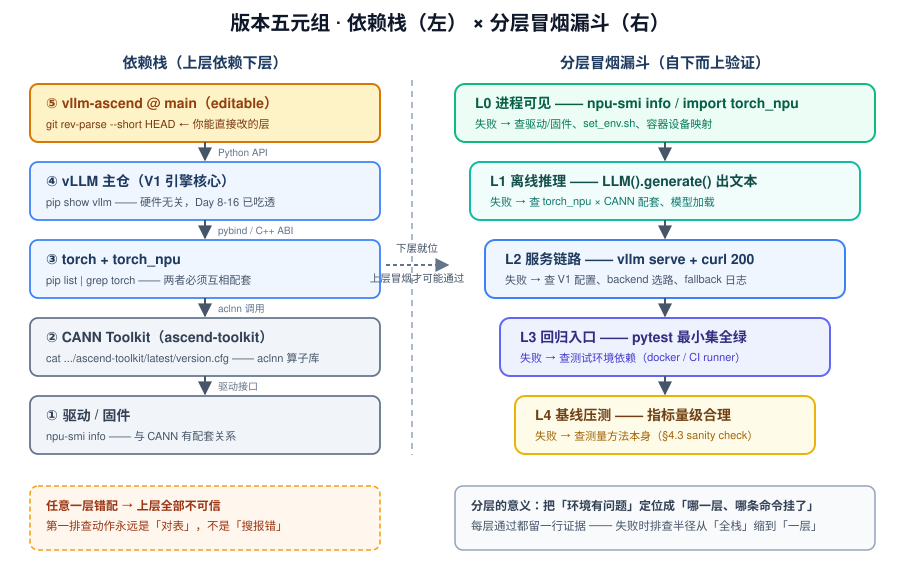
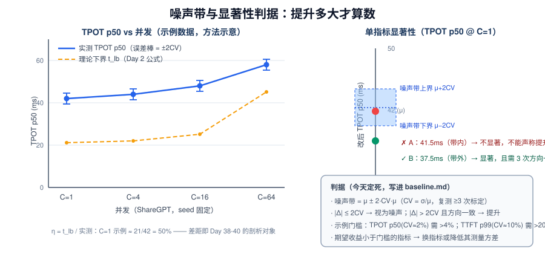
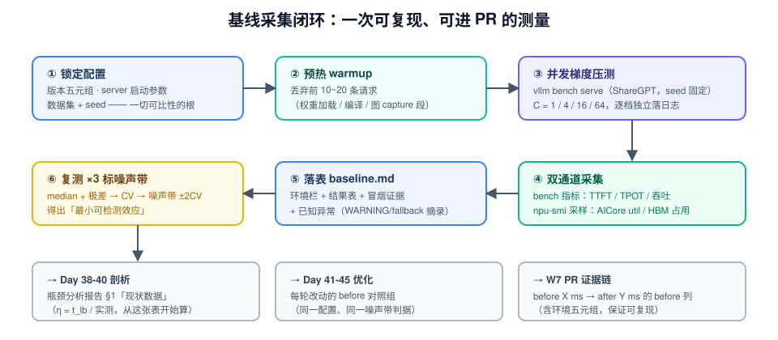

# Day 37：环境打通 —— 源码开发环境、回归入口与基线量化

> **本周**：第 6 周 · 项目 A（vLLM-Ascend 源码贡献）上篇
> **今日定位**：把昨天的选题备忘录，变成"**一台能做实验的机器 + 一张改之前的成绩单**"
> **预计用时**：2.5 ~ 4 小时（环境顺利靠运气，不顺利是常态——每个实验都有止损线）
> **今日金句**：没有基线的优化都是玄学。"改之前先量化"，是给未来两周每一句"我优化了 X%"买的保险。

---

## 0. 前情回顾与今日位置

Day 36 用证据驱动的方法完成了选题，产出备忘录（主选 + 备选 + 保底）。今天把备忘录里的三栏字段变成现实：

| 备忘录字段 | 今日对应的动作 |
|---|---|
| 验证方式（microbench + e2e 指标） | 搭好能改源码、能跑测试的开发环境（实验 1~3） |
| 影响面 / 初步假设 | 采集基线数据，让假设第一次撞上现实（实验 4~5） |
| 里程碑"Day 38 剖析报告" | 今天落表的 baseline.md 就是报告 §1 的现状数据 |

项目 A 四段：Day 36 选题 → **▶ Day 37 环境 + 基线** → Day 38-40 剖析 → Day 41-45 优化 + PR。今天是全程唯一"**只测量、不分析、不改动**"的一天，它的产出会被引用三次：明天剖析的起点、下周优化的对照组、W7 PR 里的 before 列。

这是你第二次搭 vLLM 环境，但角色变了——**Day 6 是用户视角**（pip 装正式版、GPU、开箱即用），**今天是贡献者视角**（源码可编辑、NPU 软件栈、每条数据可归因）。三个升级对应三个新问题：怎么让"改一行代码就生效"（§3.2）？版本错配为什么是第一大坑（§3.1）？怎么让测出来的数字站得住（§4）？

> **止损线（先立规矩）**：任一环境问题排查超过 1 天 → ① 带 version 五元组 + 日志去 vllm-ascend 仓库提 issue；② 放弃手工拼装，换官方镜像方案重来；③ 启动降级方案（GPU + Triton 做项目 D，方法论叙事等价，见主 README）。**环境不是本周的英雄，数据才是。**

---

## 1. 今日学习目标

| # | 目标 | 验收标准 |
|---|---|---|
| 1 | 装好**源码可编辑**的 vllm-ascend 开发环境 | `import vllm_ascend` 指向本地 clone；改一行代码能反映到 serve 行为 |
| 2 | 建立**版本五元组**纪律 | 五元组确切版本落表，并对照官方兼容矩阵逐项打勾 |
| 3 | 跑通**分层冒烟 L0~L3** | 每层留下可复现命令 + 通过证据（一行关键输出） |
| 4 | 圈定**最小回归测试集** | 与选题相关的单测 / e2e 各 ≥1 条本地全绿，其余标注"依赖 CI" |
| 5 | 产出**基线记录表 baseline.md** | 并发梯度 × 指标 + 资源占用；复测 ≥3 次并标定噪声带 |

---

## 2. 核心概念

### 2.1 基线的三重身份

"改之前先量化"不是仪式感，基线这份文件在项目 A 里有三次被引用的机会：

| 身份 | 被谁引用 | 什么时候 |
|---|---|---|
| 现状数据（§1 of 剖析报告） | Day 38-40：差距从哪个指标开始分解 | 明天起 |
| before 对照组 | Day 41-45：每轮优化的参照系 | 下周 |
| PR 证据链 | W7：`Performance: before X ms → after Y ms` | 两周后 |

> **反面案例（高频真实剧情）**：Day 41 改完代码 → "手感上快了" → Reviewer 问快多少 → 这才去补测，但 pip 依赖已升级、数据集换了副本、并发对不齐 → 两组数字不可比 → PR 写不出 before 列。**基线的本质是把"可比性"提前锁死**——今天多锁一个变量，下周就少一次重测。

### 2.2 版本五元组：环境的"户口本"

| # | 层 | 查询命令 | 说明 |
|---|---|---|---|
| 1 | 驱动 / 固件 | `npu-smi info` | 版本号在顶部信息区，与 CANN 有配套关系 |
| 2 | CANN Toolkit | `cat /usr/local/Ascend/ascend-toolkit/latest/version.cfg` | aclnn 算子库所在层 |
| 3 | torch / torch_npu | `pip list \| grep -E "^torch"` | 两者互相配套，且与 CANN 配套 |
| 4 | vLLM 主仓 | `pip show vllm` | vllm-ascend main 跟随 vLLM 演进 |
| 5 | vllm-ascend | `git -C <clone> rev-parse --short HEAD` | editable 安装，记录 commit |

Day 36 已核对（截至 2026-10 的 main 分支示例）：Python ≥3.10 <3.13、CANN 9.1.0、PyTorch/TorchNPU 2.10 系列。**数字会随版本演进，纪律不变：一切以官方 Version Compatibility 表为准，不自创组合。** 版本错配是环境问题的第一大来源（§3.1 讲为什么是"必然"而不是"可能"）。

### 2.3 分层冒烟：把"环境好了吗"拆成五个可判定的问题

| 层 | 验证内容 | 命令（示例） | 通过判据 | 失败时的排查范围 |
|---|---|---|---|---|
| L0 | NPU 进程可见 | `npu-smi info`；`import torch_npu` | 卡在列表；`is_available()==True` | 驱动/固件、`set_env.sh`、容器设备映射 |
| L1 | 离线推理链路 | `LLM(...).generate(...)` | 正常生成文本 | torch_npu × CANN 配套、模型加载 |
| L2 | 服务全链路 | `vllm serve` + `curl` | HTTP 200 + 合理 completion | V1 配置、后端选路、任何环节 fallback |
| L3 | 回归入口 | `pytest ut/ ...` | 目标用例全绿 | 测试环境依赖（docker / CI runner） |
| L4 | 基线压测 | `vllm bench serve` | 指标落表且量级合理（§4.3） | 测量方法本身 |

> **关键认知**：分层不是为了"多跑几步"，是为了**把失败定位到一层**。L0 挂了去查驱动和 CANN，L2 挂了去日志里找哪一环 fallback——"环境有问题"这五个字在工程上没有信息量，"L2 挂了且日志显示 backend 选路失败"才有。

### 2.4 测量方法学三原则

| 原则 | 做什么 | 为什么 |
|---|---|---|
| ① 固定变量 | 锁死五元组、模型+精度、server 全部启动参数、数据集+seed、机器与卡号 | 每多一个自由度，前后数据就多一分不可比 |
| ② Warmup | 服务就绪后先打 10~20 条请求并丢弃 | 权重加载、算子首跑、图 capture、JIT 都不是稳态（Day 18 的 capture 就发生在这里） |
| ③ 重复 + 噪声带 | 同配置 ≥3 次，报告中位数，记录极差与 CV | 单次数字没有误差棒，就没有资格声称"提升"（§4.2） |

这三条是 Day 6 压测经验的"贡献者版升级"：当时只看趋势，今天要求数字可进 PR。

---

## 3. 原理深入

### 3.1 版本错配为什么"必然"炸：五层依赖链的传导



左图是自上而下的依赖栈：**vllm-ascend（你能直接改的层）依赖 vLLM 主仓的 Python 接口，vLLM 依赖 torch / torch_npu，torch_npu 的 C++ 扩展按特定 torch ABI 编译并调用 CANN 的 aclnn 算子库，CANN 又要求配套的驱动/固件**。任何一处断裂，症状各不相同：

| 错配位置 | 典型症状 |
|---|---|
| torch ↔ torch_npu（C++ ABI） | `undefined symbol`、import 阶段直接崩溃 |
| vllm-ascend ↔ vllm（Python API） | `AttributeError` / `ImportError`（主仓接口改名/挪位）、capability 判断失败 |
| CANN ↔ 驱动/固件 | `npu-smi` 能看到卡，但算子下发失败或 device assert |

三个推论：

1. **第一排查动作永远是"对表"而不是"搜报错"**——报错信息里出现的库名往往不是肇事者，而是受害者。
2. **官方容器镜像的价值 = 社区已经替你锁好了下半个栈**（驱动之上到 torch_npu），你只需保证 vllm 与 vllm-ascend 两个 pip 包配套。能用镜像就不要手工拼装。
3. 每层都有自己的"查询命令"（见 §2.2 表）——**环境问题的可调试性来自每层版本可独立观测**，这也是把五元组写进 baseline.md 的原因：容器重建后，30 分钟内可复原到同一状态。

### 3.2 `pip install -e .` 之后发生了什么：确保"改代码即生效"

editable 安装在 site-packages 里放的**不是代码副本，而是指路文件**（`__editable__.*.pth` / finder），`import vllm_ascend` 会被解析到你的源码目录。两个必做检查：

```bash
# 检查 1：import 路径指向 clone，而不是 site-packages
python -c "import vllm_ascend; print(vllm_ascend.__file__)"
# 期望输出: /path/to/vllm-ascend/vllm_ascend/__init__.py

# 检查 2：双版本打架——之前装过正式版 pip 包时，两个版本会互相遮蔽
pip uninstall -y vllm-ascend && pip uninstall -y vllm-ascend   # 连续执行到 "not installed"
pip install -e .
```

三个补充认知：

- **EngineCore 是独立子进程**（Day 8 的 V1 架构），它 import 的是同一个 Python 环境，editable 对它同样生效，不需要额外操作。
- vllm-ascend 以 Python 代码为主，**纯 Python 改动即时生效**；只有当改动下沉到 torch_npu / CANN 层时才涉及重装——那是 Day 36 §5.5 里"你改不到的层"，不在项目 A 半径内。
- 最粗暴的生效性验证：在源码里加一行 `print` 或改 `__version__`，重启 serve 看日志。**今天就要做一次**（实验 1），否则 Day 41 会陷入"我明明改了为什么没生效"的经典陷阱。

### 3.3 L2 冒烟通过 = 全链路的"最低健康证明"

回顾 Day 36 §3.2 的调用链，一次 `curl` 能拿到 completion，意味着以下所有环节至少功能正确地跑了一遍：

```text
curl → OpenAI API server → AsyncLLM → Processor（tokenize）
     → EngineCore 进程 → Scheduler → KV Cache Manager
     → NPUWorker → NPUModelRunner
     → attention backend 选路（ACL FA / AscendAttention / torchair，以启动日志为准）
     → aclnn kernels → sampler → detokenize → SSE 响应
```

所以 L2 冒烟的真正产出不是那 16 个 token，而是**启动日志**。今天是你唯一一次逐行读启动日志的机会（之后只 grep），按这张清单存档：

| 关注点 | 为什么要记录 |
|---|---|
| 平台识别（NPU / 卡数） | 确认插件被发现与加载（Day 36 §2.1 的机制在起作用） |
| attention backend 选型 | 直接关联选题方向（方向 1/2 的入口） |
| V1 默认参数：`max_num_seqs`、`max_num_batched_tokens`、`block_size` 等 | NPU 侧默认值可能与 GPU 不同（以启动日志为准）；这是前后对比必须一致的变量（Day 10-11） |
| KV cache 可用 blocks 数 | 显存预算的实测量——对照 Day 2 手算，能发现预留参数的差异 |
| 任何 `WARNING` / `fallback` / `not support` | **Day 38 剖析的免费线索**：这正是 Day 36 渠道④"自己跑出来的坑" |

---

## 4. 基线测量学：让数字站得住

### 4.1 观测模型：你的数字里混了什么

把一次压测测得的 TPOT 写成观测模型：

$$X_{\text{obs}} = \mu + \varepsilon_{\text{sched}} + \varepsilon_{\text{host}} + \varepsilon_{\text{thermal}} + \varepsilon_{\text{data}} \;(+\, \varepsilon_{\text{comm}})$$

| 噪声源 | 来源 | 控制手段 |
|---|---|---|
| $\varepsilon_{\text{sched}}$ | continuous batching 的批组成逐 step 波动（哪些请求被混进同一 step，Day 10-11） | 请求数足够多 + 固定 seed 的数据顺序 |
| $\varepsilon_{\text{host}}$ | Python/CPU 抖动、内存拷贝、GC | 关注 EngineCore 进程独占性；避免同机跑重任务 |
| $\varepsilon_{\text{thermal}}$ | 长时间压测后降频 | 每轮压测限时，轮间留冷却间隔；记录功耗列 |
| $\varepsilon_{\text{data}}$ | 数据集采样顺序、输出长度分布 | `--seed` 固定；同一份 ShareGPT 副本 |
| $\varepsilon_{\text{comm}}$ | 多卡 TP 时 HCCL 抖动（Day 32-33） | 基线先跑单卡；TP 作为单独配置记录 |

经验规律：**TTFT 的波动天然大于 TPOT**（排队队长会放大一切扰动，Day 51 诊断树的伏笔）。所以两者的"可信提升门槛"不同，见下节。

### 4.2 噪声带与显著性判据（今天就要定死）



定义变异系数与噪声带：

$$CV = \frac{\sigma}{\mu}, \qquad \text{噪声带} = \mu \pm 2 \cdot CV \cdot \mu$$

**判据**：声称"优化有效"必须同时满足——① 变化幅度 $|\Delta| > 2 \cdot CV \cdot \mu$（粗略的 95% 置信）；② ≥3 次重复方向一致。示例（经验数量级，以你机器实测为准）：

| 指标 | 典型 CV（示例） | 噪声带 | 声称提升需要 |
|---|---|---|---|
| TPOT p50 | ~2% | ±4% | > 4% 的改善 |
| 输出吞吐 | ~3% | ±6% | > 6% |
| TTFT p99 | ~10% | ±20% | > 20% |

> **推论**：如果你预期的优化收益是 5%，就**不能**拿 TTFT p99 当唯一证据——要么换 TPOT/吞吐这种低噪声指标，要么先把 p99 的测量方差降下来（加请求数、固定负载形态）。今天标定噪声带，就是提前知道自己"最小可检测效应"有多大。

### 4.3 理论下界：给基线做 sanity check（复用 Day 2）

Day 2 的 decode 下界公式在 NPU 上的形式（也即 week6 README Day 40 的 $t_{\text{theory}}$ 雏形）：

$$t_{\text{decode,lb}} \approx \frac{W + KV_{\text{active}}}{BW_{\text{HBM}}}$$

- $W$：每 step 必读的权重字节（decode 每 step 全量权重过一遍 Cube/Vector，与 batch 无关）
- $KV_{\text{active}}$：$\sum_i 2 \times \text{layers} \times \text{kv\_heads} \times \text{head\_dim} \times \text{dtype\_bytes} \times \text{len}_i$（每 step 都要读全部上下文的 KV，**不随 batch 摊薄**）

**手算示例**（Qwen3-8B，36 层 / 8 KV heads / head_dim 128，W8A8 权重 ≈ 8.2 GB，KV 每 token BF16 ≈ 2×36×8×128×2 B ≈ 144 KB；单卡 HBM 带宽按 **392 GB/s 示例值——不同 Atlas A2 SKU 不同，以手册为准**）：

| 场景 | $KV_{\text{active}}$ | $t_{\text{lb}}$ |
|---|---|---|
| C=1，ctx≈512 | ~0.07 GB | (8.2+0.07)/392 ≈ **21 ms** |
| C=64，ctx≈1k | 64×1024×144 KB ≈ 9.4 GB | (8.2+9.4)/392 ≈ **45 ms** |

三个直接结论：

1. **batch 增大只摊薄权重、不摊薄 KV** → TPOT 随 C×ctx 上升，但吞吐 = C/TPOT 仍大赚（示例：C=64 吞吐下界 ≈ 64/0.045 ≈ 1400 tok/s，是 C=1 的 ~30 倍）——Day 1"memory-bound 系统的 batching 经济学"今天有了具体数字。
2. **实测与下界定义了效率** $\eta = t_{\text{lb}} / t_{\text{measured}}$。示例：若实测 TPOT p50@C=1 为 42 ms（**示例数字**），则 η ≈ 50%——另外 50% 就是 Day 38-40 要分解的对象（kernel 内 / host / 通信 / 调度）。
3. **sanity check 双向有效**：实测明显低于 $t_{\text{lb}}$ → 测量方法有 bug（prefix caching 命中、输出 token 统计口径错、请求没打满）；实测远高于 → 优化空间已被量化。两种情况都有信息量，**唯独"没算过理论值"没有**。

### 4.4 资源指标解读的三个陷阱（AICore util / HBM）

1. **util 高 ≠ 健康**：可能是搬运空转（Vector 忙着搬数据、Cube 饿着）——是否如此要等 Day 38-39 的 trace/msprof 拆解，今天只记录不结论。
2. **util 低 ≠ 没救**：可能是 host-bound（图模式未生效、每 step Python 开销）——那恰好是 Day 36 方向 3 的主场。
3. **采样纪律**：压测中途手动 `watch` 不可靠 → 用脚本周期采样落盘（实验 4），并保证采样窗口与压测窗口对齐，否则"峰值 util"与"平均 util"会打架。

顺带建立跨平台工具对照（强化"方法论迁移"叙事，面试可讲）：

| GPU 侧（W1-W5 用过） | NPU 侧对应 | 用途 |
|---|---|---|
| `nvidia-smi` | `npu-smi info`（`-t usages`） | 利用率 / 显存 |
| `nsys` profile | `msprof` + MindStudio Insight | timeline / kernel 详情 |
| `ncu` | msprof kernel 统计 | roofline / 热点下钻（Day 39） |

---

## 5. 关键命令与脚本

### 5.1 安装（容器优先 + editable）

```bash
# 0) 官方镜像起容器（版本矩阵已由社区锁好，省驱动/CANN 纠错）
#    镜像地址与启动参数以 vllm-ascend 文档为准（quay.io/ascend/vllm-ascend / ascendhub）

# 1) Python 环境与配套版本（数字以官方 Version Compatibility 表为准）
conda create -n va python=3.10 -y && conda activate va
pip install torch==<配套> torch-npu==<配套> vllm==<配套>

# 2) 源码 editable 安装
git clone https://github.com/vllm-project/vllm-ascend.git
cd vllm-ascend && git checkout main && git pull
pip uninstall -y vllm-ascend        # 若装过正式版，先清干净（可能要执行两次）
pip install -e .

# 3) 每个 shell 都必须（写进 bashrc）
source /usr/local/Ascend/ascend-toolkit/set_env.sh

# 4) 验证 editable 生效（§3.2 检查 1）
python -c "import vllm_ascend; print(vllm_ascend.__file__)"
```

### 5.2 分层冒烟命令

```bash
# L0
npu-smi info
python -c "import torch, torch_npu; print(torch.npu.is_available())"   # 期望 True

# L1 离线推理（小模型，验证执行链）
python - <<'EOF'
from vllm import LLM
llm = LLM(model="Qwen/Qwen2.5-0.5B-Instruct", max_model_len=2048)
out = llm.generate(["请用一句话介绍 vLLM。"])
print(out[0].outputs[0].text)
EOF

# L2 服务链路（启动日志 tee 存档，按 §3.3 清单逐项检查）
VLLM_USE_MODELSCOPE=true vllm serve Qwen/Qwen2.5-0.5B-Instruct \
  --max-model-len 2048 --port 8000 2>&1 | tee smoke_serve.log
curl http://localhost:8000/v1/completions -H "Content-Type: application/json" \
  -d '{"model":"Qwen/Qwen2.5-0.5B-Instruct","prompt":"你好","max_tokens":16}'
```

### 5.3 最小回归集

```bash
# 单测（快，优先）——按选题挑子目录，示例为量化方向
pytest ut/ -x -q                       # 或 ut/vllm_ascend/<子模块>
# e2e 子集：tests/ 下与选题对应的场景（部分依赖 docker/CI，先跑通一条最小链路即可）
pytest tests/e2e/<相关case> -x -q
# 记录：哪些本地全绿、哪些标"依赖 CI"——写进 baseline.md 环境栏
```

### 5.4 基线采集：脚本 + 落表模板



```bash
# ① 服务端：参数固定，命令原文一字不改地贴进 baseline.md
vllm serve <MODEL> --max-model-len 4096 --max-num-seqs 64 ... 2>&1 | tee serve_baseline.log

# ② warmup：先打 10~20 条请求丢弃（权重加载/编译/图 capture 都在这一段）

# ③ 压测：并发梯度逐档跑（每档独立落日志；ShareGPT 提前下好，固定 seed）
for C in 1 4 16 64; do
  vllm bench serve --model <MODEL> --dataset-name sharegpt \
    --dataset-path <ShareGPT_V3_unfiltered_cleaned_split.json> \
    --max-concurrency $C --num-prompts 200 --seed 42 \
    2>&1 | tee bench_c${C}.log
done

# ④ 资源采样（另开终端，压测窗口内持续运行；输出格式随驱动版本略有差异）
while sleep 2; do
  echo "$(date +%s) $(npu-smi info -t usages -i 0 | tr -s ' ')" >> npu_usage.log
done
```

`baseline.md` 模板（今日核心产出，路径 `week6/baseline.md`）：

```markdown
# 基线记录 baseline.md（Day 37）
## 1. 环境（可比性的根）
- 五元组：vllm-ascend <commit hash> / vllm <ver> / torch <ver> / torch-npu <ver>
  / CANN <ver> / 驱动固件 <ver>
- server 启动命令（原文）：vllm serve ...
- 数据集 + seed + num-prompts：...
## 2. 结果表（每档并发一行）
| C | TTFT p50/p99 (ms) | TPOT p50/p99 (ms) | 输出吞吐 (tok/s) | AICore util | HBM 占用 |
|---|---|---|---|---|---|
## 3. 重复与噪声带（TPOT p50 为例）
| C | run1/run2/run3 | median | 极差 | CV | 噪声带 ±2CV |
|---|---|---|---|---|---|
## 4. 冒烟与回归状态
- L0~L2 通过证据（命令 + 一行关键输出）
- 最小回归集清单及结果（哪些绿 / 哪些依赖 CI）
## 5. 已知异常（Day 38 的免费线索）
- 启动日志中的 WARNING / fallback 摘录
## 6. 理论对照（§4.3）
- t_lb @C=1：...；实测：...；η：...
```

### 5.5 常见坑速查

| 症状 | 病因 | 处置 |
|---|---|---|
| 找不到 NPU / 算子库 | 新 shell 忘 `source set_env.sh` | 写进 bashrc |
| 各种诡异报错 | 五元组错配 | 先对表（§3.1），再排查 |
| 跑到别的卡上 | 未设 `ASCEND_RT_VISIBLE_DEVICES` | `=0` 选卡；多卡 `=0,1` |
| 改了代码没生效 | 双版本打架 / 改错目录 | §3.2 检查 1+2 重做 |
| 疑似异步问题难定位 | launch 异步 | `ASCEND_LAUNCH_BLOCKING=1`（仅调试，会拖慢） |
| 深层报错没细节 | plog 未看 | `~/ascend/log/`（plog）先翻一遍 |
| 模型下载慢/失败 | 网络 | `VLLM_USE_MODELSCOPE=true`，提前下好 |
| attention 性能异常 | 环境变量类 known-issue | 查官方 known-issues（如 TASK_QUEUE_ENABLE 类建议），**以文档为准，别盲调** |

---

## 6. 动手实验（今日主线）

> 时间盒原则：每个实验超时未通 → 记录现象 → 跳下一节先做能做的 → 晚上集中排障。**总止损线：全部环境问题 >1 天 → 触发 §0 的降级预案。**

### 实验 1：安装 + 版本五元组核对 + editable 验证（约 40 min）

1. 按 §5.1 完成：容器/conda → pip 配套版本 → clone → `pip install -e .` → `set_env.sh`；
2. 逐条执行 §2.2 表中五个查询命令，**把输出原样粘进 baseline.md 环境栏**；
3. 打开官方 Version Compatibility 表逐项打勾（任何一项对不上 → 先解决再往下走）；
4. 生效性验证：在 clone 里给 `vllm_ascend/__init__.py`（或任一启动路径必经模块）加一行 `print("DAY37-EDIT-CHECK")` → 重新 `vllm serve` → 日志里看得到 → **删掉这行**。

**预期产出**：五元组落表 + editable 双检查通过。
**高频坑**：双版本打架（§5.5 第 4 行）；clone 放在被容器重启清掉的目录里。

### 实验 2：分层冒烟 L0 → L2 + 启动日志存档（约 40 min）

1. L0 / L1 / L2 依次执行 §5.2 的命令，**任何一层挂了就停在这一层排障**，不要带病往下冲；
2. L2 通过后，按 §3.3 清单逐项 grep 启动日志：平台识别、backend 选型、`max_num_seqs` / `max_num_batched_tokens` / `block_size` 等默认值、KV blocks 数、全部 WARNING/fallback 行；
3. 把以上摘录成"启动日志摘要"一节，附进 baseline.md。

**预期产出**：冒烟三连绿 + 日志摘要。
**高频坑**：L1 能跑 L2 挂 → 八成是 V1 配置或端口/模型名问题，看 serve 日志尾部第一 traceback。

### 实验 3：最小回归集圈定（约 30 min）

1. `pytest ut/ -x -q` 先跑单测层（快的先绿）；
2. 按 Day 36 备忘录的主选方向，在 `tests/e2e/` 里挑 1~2 条最相关用例本地跑（例如量化方向找 w8a8/w4a16 相关场景，**以实际目录为准**）；
3. 依赖 docker/CI 跑不了的，记为"依赖 CI"并找到仓库 CI workflow 里对应 job 名——**这决定了你的 PR 最终由哪些检查把关**。

**预期产出**：回归入口清单（命令 + 状态：本地绿 / 依赖 CI）。

### 实验 4：基线采集（约 60 min，今日核心）

1. 起正式基线服务：模型/量化按备忘录主选方向定（如量化 GEMM 方向就用目标量化模型），启动参数**从此刻起冻结**，命令原文落表；
2. warmup 10~20 条请求并丢弃；
3. 按 §5.4 脚本跑并发梯度 C = 1 / 4 / 16 / 64（`max_num_seqs` 决定上限，档位按机器调整），每档 `tee` 独立日志；
4. 另开终端跑 npu-smi 周期采样；
5. 用 §4.3 公式手算 C=1 与最高档的 $t_{\text{lb}}$，与实测对照——**量级不合理先查测量，再谈其他**。

**预期产出**：bench_c{1,4,16,64}.log + npu_usage.log + 理论对照两行数字。

### 实验 5：复测、噪声带标定、baseline.md 定稿（约 40 min）

1. 对 C=1 和一个中档并发各复测 2 次（共 3 次），填 §5.4 模板第 3 节：median / 极差 / CV / 噪声带；
2. 写下"最小可检测效应"：每个指标需要多大改善才算数（§4.2）；
3. 检查 baseline.md 六节齐全（环境 / 结果 / 噪声带 / 冒烟回归 / 异常 / 理论对照）——它就是明天的输入。

**预期产出**：**`week6/baseline.md` 定稿（今日核心产出）**。

---

## 7. 面试高频问题

**Q1：为什么改代码之前必须先跑基线？基线怎么设计？**
> 三重身份：剖析的现状数据、优化的对照组、PR 的 before 列——本质是**把"可比性"提前锁死**。设计四要素：①版本五元组与全部启动参数冻结；②warmup 剥离非稳态；③并发梯度覆盖低/中/高负载；④复测 ≥3 次标定噪声带，得出最小可检测效应。没有误差棒的数字进不了 PR。

**Q2：你的优化收益 5%，怎么证明它真的存在？**
> 先看指标的 CV：TPOT p50 的噪声带若为 ±4%，则 5% 勉强显著（还需 3 次方向一致）；若只能拿 TTFT p99（噪声带 ±20%）做证据，就不可信——要么换低噪声指标，要么增加请求数/固定负载把方差压下来。**答案的核心是把统计判据前置，而不是事后凑数。**

**Q3：环境问题（版本错配）的排查方法论？**
> 五层依赖栈（vllm-ascend → vllm → torch/torch_npu → CANN → 驱动）每层版本可独立观测：先"对表"官方兼容矩阵，再用分层冒烟（L0 import → L1 离线 → L2 服务 → L3 测试）把失败定位到一层，最后看 plog/启动日志。反模式是拿着报错字符串全网搜——报错出现的库常常是受害者不是肇事者。

**Q4：AICore 利用率 90%，能说明这条链路性能健康吗？**
> 不能。利用率高只说明计算单元在忙，**忙的可能是有效 GEMM，也可能是搬运空转**（Vector 搬数据、Cube 饿着）；反过来 util 低可能是 host-bound 而非"没救"。资源指标只记现象不下结论，结论要靠 trace/msprof 拆 step 时间构成（下一阶段的活）。

**Q5：为什么开发环境用 editable 安装而不是 pip 装正式包？**
> editable 在 site-packages 放的是指路文件而非代码副本，import 解析到源码目录，改一行即时生效（含 EngineCore 子进程）；正式包是拷贝，改了不生效且容易和源码版本打架。这是"贡献者视角"和"用户视角"的分水岭。

**Q6：实测 TPOT 是理论下界的 2 倍，接下来怎么办？**
> η = t_lb/t_meas = 50%，剩下 50% 是待分解空间：自顶向下三层剖析（服务级 metrics → step 级 trace → kernel 级 msprof），把差距归因到 kernel 内 / host 开销 / 通信 / 调度四类，再按 ROI 排序动手——这正是接下来三天（Day 38-40）的日程。

---

## 8. 今日总结

| # | 今天建立的认识 | 一句话 |
|---|---|---|
| 1 | 基线 = 可比性的保险 | 版本五元组 + 冻结配置 + 噪声带，三样锁死才有 before/after |
| 2 | 环境问题 = 依赖链断裂 | 五层栈各自可观测；先对表，再分层冒烟，绝不盲搜报错 |
| 3 | editable 是贡献者门槛 | import 指向 clone、双检查、改一行验证一次 |
| 4 | 测量先于优化 | 最小可检测效应今天就算出来：收益小于噪声带的改动不配谈"提升" |
| 5 | 理论下界双向使用 | 实测低于 t_lb → 测量有 bug；远高于 → 优化空间被量化 |
| 6 | 日志是免费线索 | 今天逐行读的启动日志（含 WARNING/fallback），就是明天的剖析入口 |

**与项目 A 后续的衔接**：baseline.md 六节分别喂给 Day 38（现状 + 异常线索）、Day 40（η 的分子分母）、Day 41-45（对照组）、W7（PR before 列 + 可复现环境）。

---

## 9. 今日自测题（不看笔记作答）

1. 版本五元组是哪五层？每层的查询命令是什么？为什么说"报错里出现的库往往是受害者"？
2. 分层冒烟 L0~L4 各验证什么？L1 通过但 L2 挂掉，你的排查顺序是什么？
3. `pip install -e .` 之后 `import vllm_ascend` 发生了什么？怎么用一行命令证明 editable 生效？
4. TPOT p50 的 CV 是 2%，你的优化测得 3.5% 改善——能不能写进 PR？不能的话有哪些补救办法？
5. 手算：Qwen3-8B W8A8、C=32、平均上下文 2k、KV BF16、HBM 带宽 392 GB/s（示例值），decode 的 $t_{\text{lb}}$ 是多少？（答案 ≈ (8.2 + 32×2048×144KB/10^6)/392 ≈ 40ms 量级，注意 KV 项的算法）
6. 口头 3 分钟：向 reviewer 解释"为什么你的 before/after 数据可信"。

---

## 10. 今日产出物清单

- [ ] **`week6/baseline.md`**：环境五元组 + 结果表 + 噪声带 + 冒烟/回归状态 + 已知异常 + 理论对照 —— **今日核心产出**
- [ ] editable 双检查记录（import 路径 + 改一行生效验证）
- [ ] 分层冒烟证据（L0~L2 命令与一行关键输出）
- [ ] 最小回归集清单（本地绿 / 依赖 CI 两栏）
- [ ] bench 与采样脚本（C 梯度日志 + npu_usage.log，W7 Day 43-45 原样复用）
- [ ] $t_{\text{lb}}$ 手算过程与 η 初值（进 Day 40 的 bound 建模）

---

## 明日预告（Day 38-40：性能剖析定位瓶颈）

基线在手，进入"现状数据 → 理论上限 → 优化空间"的剖析三天：先服务级分诊（TTFT 还是 TPOT、时延还是吞吐），再 step 级拆时间构成（trace 里找 kernel/host/通信/gap），最后 kernel 级 msprof 下钻 Top-N 热点，套用你的昇腾 bound 建模算理论上限。**今天 baseline.md 里的"已知异常"一节，就是明天第一个要验证的假设。**

