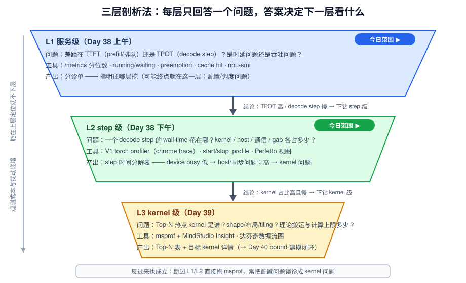
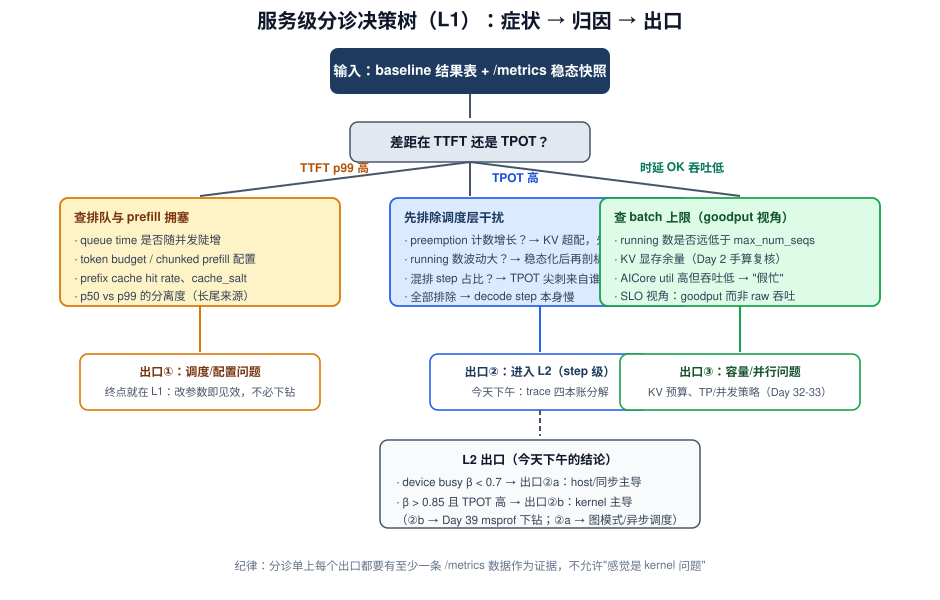
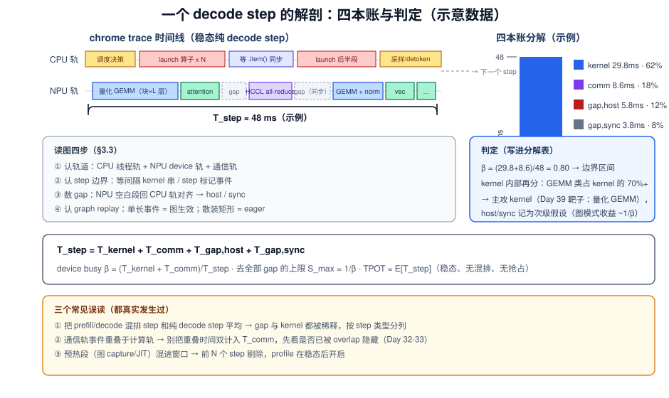

# Day 38：性能剖析（一）—— 服务级分诊与 step 级时间分解

> **本周**：第 6 周 · 项目 A（vLLM-Ascend 源码贡献）上篇
> **今日定位**：剖析三天的第一天——**先用最便宜的观测回答"往哪挖"，再用 trace 把一个 decode step 拆成 kernel / host / 通信 / gap 四本账**
> **预计用时**：3 ~ 4 小时（上午服务级分诊，下午 trace 采集与分析；全部动作复用 Day 37 的环境与基线负载）
> **今日金句**：剖析不是"打开 profiler 看一眼"，是一个决策树——每一层的结论决定下一层的工具；跳层是误诊之源。

---

## 0. 前情回顾与今日位置

Day 36 的选题备忘录锁定了主选方向（量化 GEMM 的 decode 小 M 路径，或你评分矩阵的胜出者），Day 37 留下了 `baseline.md`：并发梯度 × 指标、噪声带、启动日志逐行读过的"已知异常"、以及理论下界 $t_{\text{lb}}$ 对照（还记得那个 η ≈ 50% 的示例吗——**差距已经量化，但还不知道差在哪**）。

| baseline.md 的六节 | 今天怎么用 |
|---|---|
| §1 环境 | 不动它——今天所有测量都在同一五元组下 |
| §2 结果表 | 分诊的输入：TTFT/TPOT/吞吐随并发的形状 |
| §3 噪声带 | 判定"观察到的波动是不是真信号" |
| §5 已知异常 | **第一个要验证的假设**（Day 37 明日预告的承诺） |
| §6 理论对照 | 分诊后与 step 分解对齐，为 Day 40 的 η 分解铺路 |

项目 A 四段：Day 36 选题 → Day 37 环境 + 基线 → **▶ Day 38-40 剖析** → Day 41-45 优化 + PR。剖析三天内部再分三小步，对应主 README 的三层剖析法：

1. **Day 38（今天）**：服务级分诊（上午）+ step 级时间分解（下午）——定位到"层"
2. **Day 39**：kernel 级下钻——msprof 抓 Top-N 热点，画达芬奇数据流图
3. **Day 40**：bound 建模 + 汇总成《瓶颈分析报告》（现状 → 理论上限 → 优化空间）

今天的方法论一半是复习：服务级分诊用的指标体系是 **Day 5** 建的、调度归因的机制是 **Day 10-13** 读的源码、trace 里找 bubble 的眼睛是 **Day 19**（nsys 看 decode step）练的、graph replay 段落的判读靠 **Day 18**。另一半是新的：把它们串成一棵**每次只花最便宜观测成本的决策树**，并落到 vllm-ascend/NPU 环境上。



---

## 1. 今日学习目标

| # | 目标 | 验收标准 |
|---|---|---|
| 1 | 完成**服务级分诊**：把性能差距归类为 TTFT 侧 / TPOT 侧、时延 / 吞吐、配置调度 / 设备执行 | 一张分诊单，每项结论都有 /metrics 数据支撑 |
| 2 | 掌握 **V1 profiler 的正确打开方式**：知道控制链路、参数、输出物与观测代价 | 独立完成一次 start/stop_profile 采集，拿到 chrome trace |
| 3 | 会**解剖 chrome trace**：识别 decode step 边界、CPU/NPU 双轨、图 replay 段落 | 在 trace 上指出一个 step 的起止并截图标注 |
| 4 | 产出 **step 时间分解表**：kernel / host / 通信 / gap 四本账 + 占比 | 一张分解表 + 堆叠条图（或饼图），含 ≥3 次采样的稳定性 |
| 5 | 形成**假设清单**并按 ROI 排序 | 每条假设 = 现象 → 机制 → 验证方式（Day 39 msprof 的输入） |

---

## 2. 核心概念

### 2.1 剖析的认识论：最便宜观测优先

三层剖析法的本质是**观测成本与结论精度交换**：

| 层 | 观测成本 | 结论粒度 | 典型误用 |
|---|---|---|---|
| L1 服务级 | 几乎为零（/metrics 本来就在采） | 差距在哪个环节（排队/prefill/decode） | 只看平均不看分位数 |
| L2 step 级 | 低（一段 trace，扰动 ~% 级） | step 内部时间构成、device busy 率 | 不区分 step 边界，把 prefill 和 decode 混着算 |
| L3 kernel 级 | 高（msprof 全量插桩，扰动明显） | 单 kernel 的 tiling/带宽/利用率 | **一上来就掏 msprof** |

**为什么"一上来就掏 msprof"是错的**（面试也爱问）：① 观测扰动大，热点排序可能失真；② 丢失上下文——kernel 慢可能只是表象，真正的病根在 L1/L2（比如 step 里被塞进了不该有的重算、或 host gap 把流水打断，kernel 本身没问题）；③ 样本偏差——你 profile 的那几秒未必代表稳态。**上层能定位的就不要下层**，下层只用来回答上层指派的具体问题。

### 2.2 服务级分诊：症状 → 方向

分诊输入 = `baseline.md` 结果表 + 稳态压测时的 `/metrics` 快照。核心是三问：

1. **差距在 TTFT 还是 TPOT？** TTFT 高 → prefill/排队侧（查 queue time、token budget、cache hit、chunked prefill 混排）；TPOT 高 → decode step 侧（下钻 L2）。
2. **是时延问题还是吞吐问题？** 时延达标但吞吐低 → batch 上不去（查 running 数、KV 上限、`max_num_seqs`）；吞吐达标但 p99 爆 → 长尾问题（查 preemption、重试、个别长 prompt）。
3. **有没有调度层事件在制造噪声？** preemption 计数增长、queue time 抬升、cache hit 异常低——这三个都会把"kernel 病"伪装成"整体慢"，也可能本身就是病因。

分诊树（完整版见 §3.1）有四个出口：**调度/配置问题（终点就在 L1）、host/同步问题（L2 出口）、kernel 问题（去 L3）、测量问题（回 Day 37）**。今天上午的目标就是把你的项目 A 归到唯一一个出口。

### 2.3 step 级时间分解模型：四本账

一个 decode step 的 wall time 拆成互斥的四类（在 trace 上可分别指认）：

$$T_{\text{step}} = T_{\text{kernel}} + T_{\text{comm}} + T_{\text{gap,host}} + T_{\text{gap,sync}}$$

| 账目 | trace 上的样子 | 病因指向 |
|---|---|---|
| $T_{\text{kernel}}$ | NPU 轨道上的算子矩形（含 attention/GEMM/elementwise） | 算子效率 → Day 39/40 kernel 级 |
| $T_{\text{comm}}$ | HCCL 类通信 kernel（如 all-reduce） | TP 并行度、通信-计算重叠 → Day 32-33 |
| $T_{\text{gap,host}}$ | NPU 轨道空白 + CPU 轨道在跑 Python/launch | host 开销 → 图模式 / torchair（Day 18、Day 41 方向 3） |
| $T_{\text{gap,sync}}$ | NPU 轨道空白 + CPU 在等 `.item()`/同步点 | 调度与执行的串行化 → async scheduling（Day 19） |

两个派生判据：

- **device busy 率** $\beta = (T_{\text{kernel}} + T_{\text{comm}}) / T_{\text{step}}$。经验门槛（自家数据自己标定）：$\beta < 0.7$ → host/同步主导，优化 kernel 无意义；$\beta > 0.85$ 且 TPOT 仍高 → kernel 级问题，明天的 msprof 有明确靶子。
- **去掉全部 gap 的收益上限**（Amdahl 视角）：$S_{\max} = 1/\beta$。$\beta = 0.5$ 时 host 侧优化最多翻倍——这直接决定 Day 41 的主攻方向。

### 2.4 trace 是证据，不是答案

三条防坑纪律（每条都对应一种真实翻车）：

1. **观测扰动要量化**：profile 开启前后各测一次 TPOT，差异超过噪声带（Day 37 §4.2）→ 换低扰动模式（缩短窗口、减少 activities、或改用离线脚本）。
2. **稳态采样**：在压测进入稳态后（running 数稳定 ≥30s）再 start_profile；避开预热（图 capture、JIT、缓存冷启动）。
3. **样本代表性**：trace 覆盖 ≥ 数十个 step；只看一个 step 的分解 = 看一帧视频猜剧情。对 prefill/decode 混排的 step（chunked prefill，Day 11）单独归类，**别和纯 decode step 平均在一起**。

---

## 3. 原理深入

### 3.1 服务级分诊树：从 /metrics 到唯一出口



逐条给出机制依据（全部来自 W2-W3 读过的源码，今天只是反过来用）：

| 症状 | 机制（源码依据） | 出口 |
|---|---|---|
| TTFT p99 高、queue time 高 | waiting 队列堆积：token budget（Day 10 `max_num_batched_tokens`）被占满或 prefill 太大块 | 调度/配置（L1 终点） |
| TTFT 高、cache hit 低 | prefix caching 未命中（Day 16 block hash）；或 `cache_salt` 隔离导致 | 配置 / 路由 |
| TPOT 高、preemption 计数增长 | KV 不足 → recompute 重算整段前缀（Day 12） | 调度/配置（先调 `max_num_seqs`/KV，再谈 kernel） |
| TPOT 高、running 数波动大 | 频繁加入/退出请求 → cache 失效、step 构成不稳 | L2，但先修稳态再剖析 |
| TPOT 稳定地高、其余健康 | decode step 本身慢 | **L2（今天下午）→ L3（明天）** |
| AICore util 高但吞吐低 | "假忙"：搬运类算子占比高、或空转（Day 37 §4.4 的陷阱） | L2/L3，看 kernel 构成 |

> **和 Day 51 诊断树的关系**：Day 51 要你背的是这张树的面试速答版（"TTFT 升/ITL 稳 → 队列与 prefill 拥塞"）；今天是树的**实操版**——每个分支都有你的真实数据走过一遍，背起来才有画面。

### 3.2 V1 profiler 的控制链路与输出物

vLLM V1 的 torch profiler 不是一个开关，是一条**跨进程控制链**（Day 8 的架构图再加一条虚线）：

```text
POST /start_profile (api_server)
  → AsyncLLM（API 进程侧的 engine client）
    → 控制消息经 IPC（msgpack/MQ）下发
      → EngineCore 进程收到 START_PROFILE
        → vllm/v1/engine/profiler.py 的 Profiler（包 torch.profiler.profile）
          → activities / record_shapes / with_stack 按请求参数生效
POST /stop_profile
  → 同链路下发 STOP → Profiler 导出 chrome trace JSON
    → 落盘目录 = 环境变量 VLLM_TORCH_PROFILER_DIR
```

要点与注意（⚠️ 参数集合与文件名随版本演进较快，以你版本的 `api_server` 路由签名和实际落盘文件为准）：

- **常用请求参数**：`activities`（如 `["CPU","GPU"]`，torch_npu 环境下由插件映射为 NPU 侧 activity）、`num_steps`（采集固定步数后自动停）、`record_shapes`（记录张量 shape——**对你的选题几乎是刚需**：它把"哪个 GEMM 慢"和"它当时的 M/N/K"绑在一起）、`with_stack`（Python 栈，文件大、扰动高，只在定位调用方时短开）。
- **输出物**：每个 rank 一份 chrome trace JSON（时间线事件流），用 Perfetto（`ui.perfetto.dev`）或 `chrome://tracing` 打开。
- **vllm-ascend 特有风险**：torch.profiler 的 CUDA activity 在 torch_npu 上依赖插件的 profiler 适配；若你版本对 NPU activity 支持不完整（表现为 NPU 轨道缺失/只有 CPU 轨道），**降级方案**：写离线脚本直接用 `torch_npu.profiler.profile(activities=[CPU, NPU])` 包住 `LLM.generate` 的稳态段（§5.3 给了骨架），或直接进 Day 39 的 msprof 路线。
- **扰动控制**：先小窗口试采（如 `num_steps=50`），对比开/关 profile 的 TPOT 差是否落在噪声带内，再放大窗口。

### 3.3 chrome trace 的解剖学：五分钟找到 step 边界

打开 trace 后按固定顺序做四件事：

1. **认轨道**：顶部若干 CPU 线程轨（API/调度/worker），下方每卡一条 NPU device 轨（kernel 矩形）+ 通信轨（HCCL 事件）。
2. **认 step 边界**：V1 trace 里调度与 forward 通常有 record_function 级标记（如 step/forward 类标注，名字以实际版本为准）；若不明显，用**周期性特征**切分：纯 decode 稳态下 NPU 轨道呈现等间隔的 kernel 串，每串 = 一个 step。
3. **数 gap**：step 内 NPU 轨道上的空白段，逐段回到 CPU 轨对齐——CPU 在跑 Python/launch → host gap；CPU 也在等 → sync gap；空白落在通信前后 → 通信串行。
4. **认 graph replay 段落**：图模式生效时，一个 step 表现为**单个长 replay 事件**（而非逐算子 launch 序列，Day 18）；如果你的 decode step 是几百个散装小矩形，先确认图模式是否真的开了——**这本身就是一条高价值假设**。

### 3.4 服务级与 step 级的耦合：TPOT ≈ E[T_step] 何时成立

理想稳态下（running batch 恒定、无混排、无抢占）：

$$\text{TPOT} \approx E[T_{\text{step}}], \qquad \text{throughput} \approx \frac{N_{\text{running}}}{E[T_{\text{step}}]}$$

三种常见的"近似失效"，恰好都是 Day 10-13 的知识点：

- **chunked prefill 混排**：含 prefill 块的 step 显著长于纯 decode step，TPOT 出现尖刺（Day 11 的代价面）；
- **preemption recompute**：被抢占请求重新 prefill，既抬 TTFT 也污染 TPOT 分布（Day 12）；
- **调度器间隙**：async scheduling 未生效时，调度决策时间串行地插在 step 之间（Day 19）。

所以 step 分解表要按 step 类型分列：`纯 decode step` / `混合 step` / `含 recompute step`，各自的占比本身就是归因证据。

---

## 4. 时间分解的算术：从 trace 数字到判定结论



### 4.1 四本账的求和规则（三步）

1. **求 busy 区间并集**：$T_{\text{busy}} = \left| \bigcup_{k \in \text{device 事件}} [\text{ts}_k, \text{ts}_k + \text{dur}_k] \right|$。若通信与计算在时间上重叠（Day 32-33 讲过的 overlap），**并集只算一次**——先别把 kernel 和 comm 的 dur 直接相加，重叠量让脚本报出来。
2. **切 gap**：$T_{\text{gap}} = T_{\text{step}} - T_{\text{busy}}$，再按 §3.3 的"回 CPU 轨对齐"把 gap 分成 host 与 sync 两本。
3. **按 step 类型分列后平均**：纯 decode / 混排（chunked prefill）/ 含 recompute 各自一行，每类 ≥10 个 step 再谈占比；把类型占比也记下来（它本身就是 Day 11 的"代价面"实测）。

### 4.2 host 账的先验估算：launch 链路能吃掉多少

不打开 trace 也能先算一笔上限账（用来校验分解结果是否合理）：

$$T_{\text{host,max}} \approx n_{\text{ops/step}} \times t_{\text{launch}}, \qquad n_{\text{ops/step}} \approx L \times n_{\text{ops/layer}} + n_{\text{sampler}}$$

代入示例：$L = 36$ 层、每层 ~12 个下发算子（QKV/rq-silu-proj 两次 GEMM、add-rmsnorm、rotary、attention、residual……量化路径再多一两个）、sampler 若干 → 约 450 个 op；NPU 侧 launch 链路（Python → torch_npu → aclnn 下发）单次取 10~20µs 量级（**以你机器实测为准**，trace 上量一个最短矩形就知道）→ $T_{\text{host,max}} \approx 4.5 \sim 9$ ms/step。

对照意义：若实测 host gap 接近这个量级 → 病根是"散装 launch"，图模式/torchair（方向 3）收益直接给到 $1/\beta$；若远小于 → host 不是主要矛盾，别在它上面花 Day 41 的时间。

### 4.3 与理论下界的第一次会师（给 Day 40 铺路）

Day 37 算过 $t_{\text{lb}} = \text{Bytes}/\text{BW}$（decode 每 step 要搬运的权重 + KV 字节）。今天从 trace 拿到 $T_{\text{kernel}}$ 后，可以算**有效带宽**：

$$\text{BW}_{\text{eff}} = \frac{\text{Bytes}_{\text{step}}}{T_{\text{kernel}}}, \qquad \eta_{\text{mem}} = \frac{\text{BW}_{\text{eff}}}{\text{BW}_{\text{HBM}}}$$

三个读法：$\eta_{\text{mem}}$ 接近 1 → kernel 已贴带宽上限，优化空间在"少搬字节"（量化/布局），不在 tiling；$\eta_{\text{mem}}$ 低但 AICore 也闲 → 搬运组织有问题（Day 39 的数据流图会揭示）；$\eta_{\text{mem}}$ 低且算子是 compute 密集型 → 该用 AI 判 bound 而不是带宽（这正是 Day 40 的正题）。

---

## 5. 关键命令与脚本

### 5.1 服务级采集（复用 Day 37 负载与 seed）

```bash
# 终端 1：压测进入稳态（并发取 baseline 梯度中 TPOT 最差且健康的一档）
# 终端 2：稳态后抓 /metrics 快照
curl -s http://localhost:8000/metrics \
  | grep -E "num_requests_(running|waiting)|time_to_first_token|time_per_output_token|e2e_request|queue_time|preempt|cache" \
  > metrics_steady.txt

# 分位数：Prometheus 部署时用（Day 6 环境）
# histogram_quantile(0.99, sum(rate(vllm:time_to_first_token_seconds_bucket[1m])))
# 未部署时直接用 vllm bench serve 输出的 p50/p99 列（与 baseline 同源）

# 终端 3：AICore/HBM 只作辅助证据（记住 Day 37 §4.4 三个陷阱）
watch -n 0.5 npu-smi info
```

> 指标名以你版本 `/metrics` 实际输出为准（V1 的 histogram 指标需要 bucket 自算分位数或走 bench 工具输出）。**分诊证据 = bench 分位数 + 计数器指标 + npu-smi 三者交叉**，不要单源下结论。

### 5.2 trace 采集（服务在线路径）

```bash
export VLLM_TORCH_PROFILER_DIR=/tmp/vllm_prof
mkdir -p $VLLM_TORCH_PROFILER_DIR

# 压测进入稳态后（running 数稳定 ≥30s）：
curl -X POST http://localhost:8000/start_profile \
  -H "Content-Type: application/json" \
  -d '{"activities": ["CPU", "GPU"], "record_shapes": true}'

# 稳定运行 30~60s（窗口宁短勿长，够 ~50 个 step 即可）
curl -X POST http://localhost:8000/stop_profile

ls -lht $VLLM_TORCH_PROFILER_DIR | head   # 找到各 rank 的 chrome trace JSON
```

注意：① 参数集合随版本演进（部分版本 `num_steps` 由 start 请求携带、到步自动停）——以你版本的 API 定义为准；② torch_npu 环境下 `"GPU"` activity 会被映射为 NPU 采集，**若结果只有 CPU 轨道 → 走 §5.3 降级**；③ 采集前后各测一次 TPOT，差值落在 Day 37 噪声带内才算数。

### 5.3 降级路径：离线脚本直接包 profiler

```python
# profile_offline.py —— vllm-ascend 的离线 trace 采集（与 serving 结论可比性标注为"kernel 构成"级）
from torch_npu.profiler import profile, ProfilerActivity
from vllm import LLM, SamplingParams

llm = LLM(model=MODEL, quantization="w8a8", **BASELINE_KWARGS)   # 与 baseline.md §1 同参
sp = SamplingParams(temperature=0, max_tokens=256, ignore_eos=True)

llm.generate(warmup_prompts, sp)      # 预热：图 capture / JIT / 缓存冷启动都在这里消化掉

with profile(activities=[ProfilerActivity.CPU, ProfilerActivity.NPU],
             record_shapes=True) as prof:
    llm.generate(bench_prompts, sp)   # 复用 Day 37 同一份 prompt 集（可比性）

prof.export_chrome_trace("offline_decode_trace.json")
```

离线路径少了 API 进程与 detokenizer 的 host 噪声，**host 账会偏乐观**——用它下 kernel/comm 的结论，host 结论仍以在线 trace 为准。

### 5.4 trace 解析脚本：四本账自动化

```python
#!/usr/bin/env python3
"""chrome_trace_decompose.py —— 把 V1 profiler 的 chrome trace 拆成四本账
用法：
  python3 chrome_trace_decompose.py trace.json --inspect   # 第一步：看有哪些 cat / Top 名
  python3 chrome_trace_decompose.py trace.json --steps 50   # 第二步：回填 PATTERNS 后分解
注意：cat 集合与 kernel 命名因后端而异（torch_npu / HCCL / 图模式各不同），
      先 --inspect 再回填，不要盲跑。"""
import json, re, argparse
from collections import Counter, defaultdict

PATTERNS = {   # name 的正则 → 账目；--inspect 后按你的 Top 名回填
    "comm":   r"(?i)hccl|hcom|all_?reduce|all_?gather|send|recv",
    # "kernel" 不在这里穷举：device 类 cat 的默认归 kernel，见 classify()
}

DEVICE_CATS = {"kernel", "npu_op", "gpu_op"}      # 以 --inspect 看到的实际 cat 为准
HOST_CATS   = {"cpu_op"}

def classify(ev):
    for label, pat in PATTERNS.items():
        if re.search(pat, ev.get("name", "")):
            return label
    if ev.get("cat") in DEVICE_CATS: return "kernel"
    if ev.get("cat") in HOST_CATS:   return "cpu"
    return "other"

def load(path):
    with open(path) as f:
        return [e for e in json.load(f)["traceEvents"]
                if e.get("ph") == "X" and e.get("dur", 0) > 0]

def main():
    ap = argparse.ArgumentParser()
    ap.add_argument("trace"); ap.add_argument("--inspect", action="store_true")
    ap.add_argument("--steps", type=int, default=0, help="step 数：把总量除以它得每 step 摊销")
    a = ap.parse_args(); evs = load(a.trace)

    if a.inspect:
        print("cat 分布:", Counter(e["cat"] for e in evs))
        print("Top name:", Counter(e["name"] for e in evs).most_common(30))
        return

    dev = [e for e in evs if classify(e) in ("kernel", "comm")]
    acct = defaultdict(float); cnt = Counter()
    for e in dev:
        acct[classify(e)] += e["dur"]; cnt[classify(e)] += 1
    t0, t1 = min(e["ts"] for e in dev), max(e["ts"] + e["dur"] for e in dev)
    window = (t1 - t0)
    busy_union = 0; cur_end = None
    for e in sorted(dev, key=lambda x: x["ts"]):           # 并集：重叠只算一次
        s = e["ts"]; d = e["dur"]
        if cur_end is None or s >= cur_end: busy_union += d; cur_end = s + d
        elif s + d > cur_end: busy_union += s + d - cur_end; cur_end = s + d
    n = a.steps or 1
    print(f"窗口 {window/1e3:.1f} ms，device 事件 {len(dev)} 个，按 {n} step 摊销")
    for k in ("kernel", "comm"):
        print(f"  {k:8s} {acct[k]/1e3/n:8.2f} ms/step  ({cnt[k]} 次)")
    gap = window - busy_union
    print(f"  gap 合计 {gap/1e3/n:.2f} ms/step  → 回 trace 对齐 CPU 轨分 host/sync")
    print(f"  β(device busy) = {busy_union/window:.2f}   S_max(去全部 gap) = {window/busy_union:.2f}x")

if __name__ == "__main__":
    main()
```

> 脚本给出的是**骨架**：并集求和、gap 计算与摊销逻辑可直接用；`DEVICE_CATS` 与 `PATTERNS` 必须先用 `--inspect` 看过你的真实 cat 集合与 kernel 命名后回填。host/sync 的细分需要人眼回 CPU 轨对齐（§3.3 第 3 步），别指望全自动。

### 5.5 常见坑速查

| 症状 | 原因 | 处置 |
|---|---|---|
| trace JSON 太大，Perfetto 卡死 | 窗口太长 / `with_stack` 开着 | 缩短窗口、关 with_stack、分段采集 |
| 只有 CPU 轨道，NPU 事件缺失 | activity 映射在 torch_npu 上不支持/不完整 | §5.3 降级脚本；或提前进 Day 39 的 msprof |
| 找不到 step 边界 | 无明显 marker 事件 | 用最高频 kernel 的重复次数计数 step；或离线脚本里人为分段 |
| TPOT 在 profile 前后差异 > 噪声带 | 观测扰动超标 | 缩窗、减 activities、改离线路径，并在报告中标注 |
| HCCL 事件同时出现在 CPU/通信轨 | 调用与执行两条记录 | 只在 device/通信轨上计一次，防双计 |
| gap 巨大但 CPU 轨也空白 | 进程在等别的东西（IO/detokenize/引擎间消息） | 把等待点的函数名记下来——这可能直接是一条 issue 级发现 |

---

## 6. 动手实验（今日主线）

> 前置：Day 37 环境健康（L0~L4 全绿）、baseline.md 在手。全程复用同一负载与 seed。每个实验末尾都有"落表动作"——今天的实验记录直接构成《瓶颈分析报告》的 §1 现状素材。

### 实验 1：服务级分诊（约 40 min，上午核心）

1. 选 baseline 中"TPOT 最差且无 preemption 污染"的一档并发，起稳态压测；
2. 按 §5.1 抓三份证据：bench 分位数（TTFT/TPOT p50/p99）、计数器快照（running/waiting/preemption/cache）、npu-smi 观察记录；
3. 沿 §3.1 分诊树走一遍，先验证 baseline.md §5 的"已知异常"（Day 37 留的钩子——昨天读日志发现的 fallback/告警，今天用数据判定它是真病因还是无关噪声）；
4. **落表**：写 `week6/triage.md`，格式：`症状（数据）→ 分诊树路径 → 出口（①/②/③）→ 证据链接`。

**验收**：出口唯一且有三源证据交叉支撑；若出口是①（调度/配置），别硬挖 kernel——调参验证后回 Day 36 启用备选题，或把该发现整理成 issue（同样是贡献）。

### 实验 2：采集 chrome trace（约 40 min）

1. `export VLLM_TORCH_PROFILER_DIR=...` 后重启服务（环境变量需在启动前生效）；
2. 同档并发压测进入稳态，按 §5.2 start → 30~60s → stop；
3. 检查产物：NPU 轨道是否存在、事件量级是否合理（几十个 step、数千事件）；不达标 → §5.3 离线降级重采；
4. **扰动检查**：profile 窗口内外的 TPOT 差与 Day 37 噪声带对比，记录结论。

**验收**：一份"有 NPU 轨、扰动在噪声带内、覆盖 ≥50 个稳态 step"的 trace 存档（命名含日期与并发档位）。

### 实验 3：step 时间分解（约 50 min，下午核心）

1. Perfetto 打开 trace，按 §3.3 四步人工走一遍：认轨道 → 认边界 → 数 gap → 认 graph replay 段落，截图标注一个典型 step；
2. 用 §5.4 脚本 `--inspect` 回填分类表，再跑分解，得到 kernel/comm/gap 与 β；
3. 人工把 gap 分成 host/sync 两本（回 CPU 轨对齐）；混排 step 与纯 decode step 分列；
4. **落表**：`step_decomposition.md`（模板）：

```markdown
# step 分解 @ C=<档位>，<日期>，trace=<文件名>
| step 类型 | 占比 | T_step | kernel | comm | gap,host | gap,sync | β |
|---|---|---|---|---|---|---|---|
| 纯 decode | 85% | 48.0ms | 29.8 | 8.6 | 5.8 | 3.8 | 0.80 |
| 混排(含 prefill 块) | 15% | 61.0ms | ... | ... | ... | ... | ... |

## Top kernel（名称/每 step 次数/每 step 总耗时/记录到的 shape）——Day 39 的靶子清单
## graph replay 生效与否 + 证据
## host 账 vs §4.2 先验估算的对照
```

**验收**：表内数字齐全、≥3 个采样窗口的 β 波动 < ±0.05、Top kernel 至少列出前 5 名及其 shape。

### 实验 4：假设清单（约 30 min，输出给明天的自己）

把分解表里每一条"可疑"转成结构化假设，按 ROI 排序：

1. 每条假设 = `现象（数据）→ 机制猜想（联系源码/算子名）→ 验证方式（Day 39 用 msprof 看什么）→ 若成立的预期收益量级`；
2. 示例（对应选题方向 1）："现象：量化 GEMM 类 kernel 占 kernel 账 70%，单次 1.9ms；机制：小 M 下 tiling 多核饥饿或反量化未融合；验证：msprof 看 cube 利用率与多核负载均衡（balanceRate 直觉）；收益：若 η_mem 从 0.4 → 0.7，TPOT 降 ~20%"；
3. **落表**：`hypotheses.md`（≥3 条，含一条 host 侧、一条 kernel 侧）。

**验收**：每条都能直接执行——明天打开 msprof 时不需要再做任何"看什么"的决策。

---

## 7. 面试高频问题

1. **拿到"服务慢"的投诉，你的排查顺序是什么？**（答：三层剖析法——先 /metrics 分诊定位环节，再 step 级 trace 拆时间构成，最后才 kernel 级下钻；强调每层结论决定下层工具，直接 msprof 的三大误诊风险）
2. **decode step 的 wall time 由哪几部分构成？device busy 率低说明什么？**（四本账；β 低 → host/同步主导，优化 kernel 无意义，方向是图模式/异步调度）
3. **TPOT 和单个 decode step 的耗时是什么关系？什么时候会背离？**（稳态近似相等；混排、抢占 recompute、调度间隙三重失效来源）
4. **AICore 利用率 90%，能说明性能健康吗？**（不能——假忙/空转搬运；要结合 β、kernel 构成、有效带宽看；举 Day 37 §4.4 的陷阱）
5. **怎么确认 CUDA Graph / 图模式真的生效了？**（trace 上 decode step 表现为单个 replay 长事件 vs 散装 launch 序列；对比图 capture 前后的 host 账）
6. **profiler 本身对性能的影响怎么控制？**（窗口宁短勿长、activities 精简、with_stack 只短开、开/关对比落在噪声带内才算数、离线路径交叉验证）
7. **TTFT p99 高但 TPOT 稳定，你会先查哪三个指标？**（queue time、cache hit rate、preemption/调度 budget——prefill 拥塞类问题，与 decode 无关）

---

## 8. 今日总结

| # | 一句话 |
|---|---|
| 1 | 剖析是决策树不是工具箱：L1 定环节、L2 定构成、L3 定算子，**上层能定位就不下层** |
| 2 | 服务级分诊的三问：TTFT 还是 TPOT、时延还是吞吐、有没有调度事件在伪装 |
| 3 | 四本账 + β + S_max：一组数字就把"下一步去哪"钉死（β<0.7 → host；β>0.85 → kernel） |
| 4 | trace 是证据不是答案：稳态采样、类型分列、扰动量化、样本量——四条纪律防误读 |
| 5 | 今天的产出三件套（分诊单/分解表/假设清单）就是《瓶颈分析报告》§1 的全部素材 |

**与后续的衔接**：hypotheses.md 的每一条 = Day 39 msprof 的待验证清单；分解表 + Day 37 的 $t_{\text{lb}}$ = Day 40 bound 建模（η 分解）的两个输入；Top kernel 表里的 shape 列 = 你选题方向 1 的"现场证据"。

---

## 9. 今日自测题（不看笔记作答）

1. 三层剖析法每一层回答什么问题、用什么工具？"一上来就掏 msprof"有哪三个风险？
2. 写出 step 四本账公式与 β 的定义。β = 0.55 时，host 侧优化的收益上限是多少？该往哪个方向优化 kernel 吗？
3. TPOT ≈ E[T_step] 的三个失效场景分别对应哪些已学机制（Day 11/12/19）？
4. 用 §4.2 的先验公式估算：L=40、每层 15 个下发算子、单次 launch 12µs，host 账上限是多少？若实测 host gap 是它的 3 倍，说明什么？
5. 你在 trace 上看到 decode step 是 300 个散装小矩形而非单个 graph replay 事件，下一步做什么？可能的原因是什么？
6. 口头 3 分钟：拿着你自己的分解表，向 reviewer 讲清"我为什么认为瓶颈在 X"——要求每个论断后面都跟着一个数字。

---

## 10. 今日产出物清单

- [ ] **`week6/triage.md`**：分诊单（症状 → 树路径 → 出口 → 三源证据）——**今日核心产出 1**
- [ ] **trace 存档**：在线（或离线降级）chrome trace，命名含日期/档位，附扰动检查结论
- [ ] **`week6/step_decomposition.md`**：四本账分解表 + Top kernel 清单（含 shape）+ graph 生效证据——**今日核心产出 2**
- [ ] **`week6/hypotheses.md`**：≥3 条按 ROI 排序的假设（现象→机制→验证→预期收益）——**今日核心产出 3，Day 39 的输入**
- [ ] 截图：Perfetto 上标注好的典型 step（NPU 轨 + CPU 轨 + gap 指认）
- [ ] β 与 S_max 的计算过程（进 Day 40 的 η 分解）

---

## 明日预告（Day 39：kernel 级下钻）

带着 hypotheses.md 打开 msprof：抓 Top-N 热点 kernel 表（名字/耗时/调用次数/shape/布局），对着 cube 与 vector 利用率、多核负载均衡检查每条假设；再给目标 kernel 画那张你画惯了的达芬奇数据流图（输入 → L2 → L1 → L0 → Cube → 写回，逐段标数据量与理论搬运耗时）。今天分解表里的"量化 GEMM 占 70%"，明天要变成"这个算子、这个 shape、差在 tiling 还是搬运"的精确指控。
