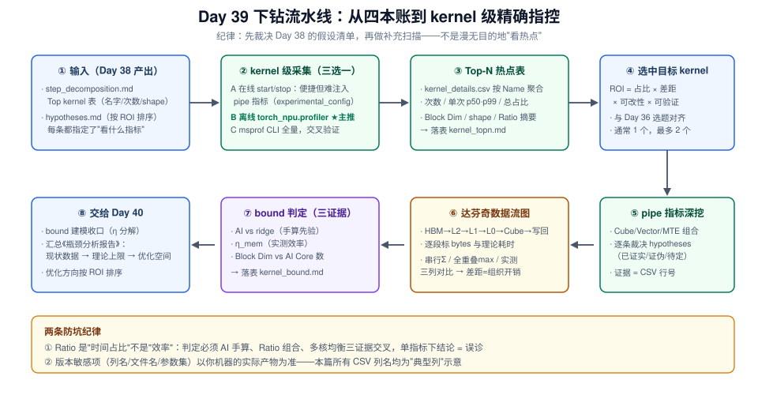
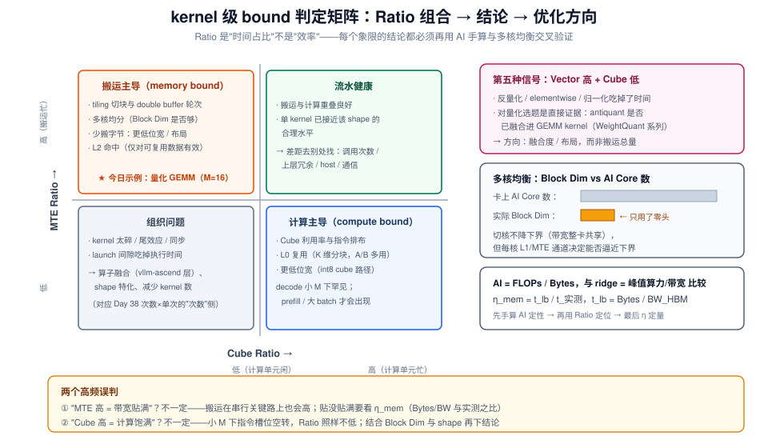
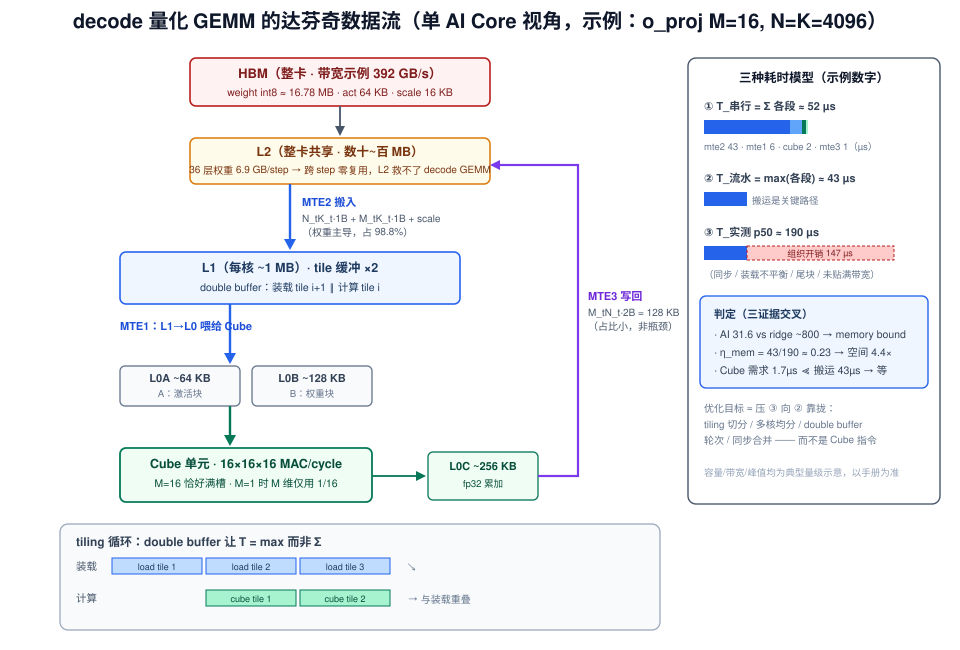

# Day 39：性能剖析（二）—— kernel 级下钻：msprof 热点、达芬奇数据流与访存模式

> **本周**：第 6 周 · 项目 A（vLLM-Ascend 源码贡献）上篇
> **今日定位**：剖析三天的第二天——**把 Day 38 分解表里的"量化 GEMM 占 kernel 账 70%"变成"这个算子、这个 shape、慢在搬运还是计算"的精确指控**
> **预计用时**：3 ~ 4 小时（上午 kernel 级 trace 采集与 Top-N 落表，下午目标 kernel 深挖 + 达芬奇数据流图）
> **今日金句**：在 kernel 级，"慢"必须被翻译成"哪条流水线在等谁"——Cube 等 MTE 是搬运问题，MTE 等 Cube 是算力问题，都在闲着是组织问题。

---

## 0. 前情回顾与今日位置

昨天（Day 38）你走完了剖析的前两层：服务级分诊把差距钉在了 decode step 侧，step 级分解把 48ms 的 step 拆成了四本账（kernel 29.8 / comm 8.6 / host 5.8 / sync 3.8，β = 0.80）。**但"kernel 账占 62%"仍然是一个笼统的指控**——它没有回答：是哪个 kernel？什么 shape？它内部的时间被什么吃掉了？

今天下钻到 L3（kernel 级），输入输出都很明确：

| 昨天的产出 | 今天怎么用 |
|---|---|
| `step_decomposition.md` 的 Top kernel 表 | 今天 Top-N 热点表的**种子清单**（名字/次数/shape 已初筛） |
| `hypotheses.md`（≥3 条，按 ROI 排序） | 今天的**任务清单**——每条假设都写了"用 msprof 看什么"，照单执行 |
| trace + β、S_max | β 的分母：kernel 内部优化收益的上限语境 |
| Day 37 的 $t_{\text{lb}}$ 与 392 GB/s 示例带宽 | kernel 级 $\eta_{\text{mem}}$ 计算的**分母来源** |

项目 A 四段：Day 36 选题 → Day 37 环境 + 基线 → **▶ Day 38-40 剖析（今天是第 2/3 天：kernel 级下钻）** → Day 41-45 优化 + PR。剖析三天三小步：

1. Day 38：L1 分诊 + L2 step 分解——定位到"层"
2. **Day 39（今天）**：L3 kernel 级——抓 Top-N 热点、读 pipe 指标、画达芬奇数据流图、判定 bound
3. Day 40：bound 建模收口——把三天的证据汇总成《瓶颈分析报告》（现状 → 理论上限 → 优化空间）

今天也是你**主场作战**的一天：达芬奇架构的 Cube/Vector/MTE 流水线、tiling 切分、L1/L0 容量约束——这正是你做 WeightQuantBatchMatmulV2 优化时的日常工作。前五周你以"学习者"身份读 vLLM，今天角色反转：**用你原有的算子分析能力，去解剖 vllm-ascend 路径上的热点**，唯一的新课题是"trace 里的 kernel 名字 ↔ vllm-ascend 源码"的映射（§3.5）。

方法论上的旧朋友：Day 3 的 Roofline（今天从"整卡"细化到"单 kernel 单 shape"）、Day 17 的 attention 后端接口（kernel 名字的归属层）、Day 22-23 的量化专题（W8A8 反量化融合度的判定证据就在 Vector Ratio 里）、Day 1 的第一性原理（"decode 本质是搬权重"，今天在 kernel 级得到公式级复现，见 §4.3）。



---

## 1. 今日学习目标

| # | 目标 | 验收标准 |
|---|---|---|
| 1 | 完成 **kernel 级 trace 采集**（离线路线为主），拿到带 pipe 指标的 kernel 明细 | `kernel_details.csv` 在手，含 Cube/Vector/MTE 比率列，采集扰动已评估 |
| 2 | 产出 **Top-N 热点表**：按"总耗时占比"排序，附次数 / 单次 p50 / Block Dim / shape | ≥ 前 10 名落表，与 Day 38 Top kernel 表交叉印证 |
| 3 | 对目标 kernel 完成 **pipe 指标深挖**，逐条裁决昨天的假设 | `hypotheses.md` 每条标注 已证实 / 证伪 / 待定 + 证据（CSV 行） |
| 4 | 画出目标 kernel 的**达芬奇数据流图**：输入 → HBM → L2 → L1 → L0 → Cube → 写回，逐段标数据量与理论耗时 | 一张图 + 一张逐段耗时表（串行 / 全重叠 / 实测三列对比） |
| 5 | 完成 kernel 级 **bound 判定**：AI vs ridge、$\eta_{\text{mem}}$、多核均衡，三个证据交叉 | 判定结论写入 `kernel_bound.md` 草稿（Day 40 报告 §2 的素材） |

---

## 2. 核心概念

### 2.1 观测粒度的再一次细化：从"账目"到"流水线"

Day 38 的四本账回答"step 的时间去哪了"；今天的对象是**单个 kernel 内部**——一个 Ascend C / aclnn kernel 在 AI Core 上执行时，时间被三类执行单元分食：

| 执行单元 / 通道 | 干什么 | 对应指标（kernel_details.csv 典型列） |
|---|---|---|
| **Cube** | 矩阵乘（$16\times16\times16$ 粒度的 MAC 阵列） | Cube Ratio |
| **Vector** | 向量计算：反量化、激活、elementwise、归一化 | Vector Ratio |
| **MTE2**（搬入） | HBM/L2 → L1 的数据装载 | MTE2 Ratio |
| **MTE1**（喂给 Cube） | L1 → L0A/L0B，把操作数送到 Cube 嘴边 | MTE1 Ratio |
| **MTE3**（搬出） | L1 → L2/HBM 写回结果 | MTE3 Ratio |
| Scalar / 标量 | 地址计算、循环控制 | （通常不单列） |

**Ratio 的含义是"该 pipe 占 kernel 执行时间的比例"**。理想 kernel 里搬运（MTE2/MTE1）与计算（Cube/Vector）被软件流水**重叠**起来——所有 Ratio 都可以同时"高"，因为它们各自度量的是"这条 pipe 忙的时间份额"，而流水线上各工位是并行的。这就引出今天最重要的读数方式（§3.2 详述）：**单看一个 Ratio 毫无意义，Ratio 的组合才是判定语言**。

> **和 Day 37 §4.4 的呼应**：npu-smi 的 AICore 利用率是"整卡秒级平均"，会假忙、会稀释；今天的 pipe Ratio 是"单 kernel 微秒级"的证据——同名的"利用率"，粒度差 6 个数量级，这就是 L3 的价值。

### 2.2 达芬奇存储层级：tiling 的物理舞台

| 层级 | 位置 | 典型容量（⚠️ 以你的型号手册为准） | 作用 |
|---|---|---|---|
| HBM | 整卡 | 数十 GB，带宽数百 GB/s（示例值 392 GB/s） | 权重 / KV / 激活的家 |
| L2 | 整卡共享 | 数十~百 MB 量级 | AI Core 间共享缓冲，跨核复用 |
| L1 | 每 AI Core | ~1 MB 量级 | tiling 的"主战场"：一块一块地缓存操作数 |
| L0A / L0B | 每 Cube | ~64 / 128 KB | Cube 的操作数寄存器级缓存 |
| L0C | 每 Cube | ~256 KB | 累加结果缓冲 |

**tiling 的本质**：一个大 GEMM 的操作数放不进 L1/L0，于是被切成块，循环地"搬入（MTE2）→ 喂给 Cube（MTE1）→ 计算（Cube）→ 搬出（MTE3）"。切块参数（tile 大小、循环次序、几级缓冲）决定了搬运总量、流水重叠度和多核划分——这正是你做过千百遍的工作，今天只是第一次**在 vllm-ascend 的 serving trace 里**做它。

### 2.3 kernel 级的 bound 判定语言：三个正交证据

判定一个 kernel 慢在哪，永远交叉三个证据（§4 给完整算例）：

1. **算术强度 AI vs ridge 点**：$\text{AI} = \text{FLOPs}/\text{Bytes}$，与整卡"峰值算力 / HBM 带宽"的比值（ridge）比较——这是 Day 3 Roofline 的 kernel 版，**先验的、可手算的**；
2. **pipe Ratio 组合**：Cube 低 + MTE 高 → 搬运主导；Cube 高 + MTE 低 → 计算主导；双低 → 组织问题（kernel 太碎 / 尾效应 / launch）——**实测的、事后的**；
3. **多核均衡**：Block Dim（实际使用的核数）vs 卡上 AI Core 总数——单核搬运通道与 L1 容量决定了"切多少核才能喂饱带宽"。

三个证据指向一致才下结论；不一致时（比如 AI 显示 memory bound 但 MTE Ratio 不高），**优先怀疑自己的 Bytes 估算漏了项**（scale 张量、对齐 padding、写回放大）或 kernel 里混入了非预期阶段。

### 2.4 假设驱动，不是"扫热点"

Day 38 实验 4 留下的每条假设都写了"验证方式 = Day 39 用 msprof 看什么"。今天的纪律是：**先裁决假设，再做补充扫描**。理由和昨天"别一上来就掏 msprof"同源——没有假设的热点扫描，会让人对着 500 行 CSV 陷入"什么都可疑、什么都证实不了"的瘫痪；而带着具体问题（"单次 1.9ms 是 tiling 饥饿还是反量化未融合？"），每个 Ratio 列都有了明确的读法。

---

---

## 3. 原理深入

### 3.1 采集路线矩阵：三条路，各管一段

kernel 级指标（pipe Ratio、Block Dim、per-kernel shape）在 Ascend 上由 CANN 的 Profiling 体系产出。对 vllm-ascend 场景，三条路线按"扰动 / 产出 / 侵入度"取舍：

| 路线 | 入口 | 产出 | 扰动 | 今天的作用 |
|---|---|---|---|---|
| **A 在线** | V1 `start/stop_profile`（Day 38 §3.2 的控制链） | chrome trace；能否带出 pipe 指标取决于插件对 experimental_config 的透传 | 中 | 复核 serving 现场的 kernel 构成 |
| **B 离线 ★ 主推** | 离线脚本 `torch_npu.profiler.profile` + `_ExperimentalConfig` | `trace_view.json` + kernel 明细 CSV（含 Ratio 列） | 低-中 | **今天主线**：pipe 指标、shape、次数、单次分布 |
| **C msprof CLI** | `msprof --application=...` 包住整个进程 | 全量：算子汇总、AI Core 指标、系统级时间线（MindStudio Insight 打开） | 高 | 交叉验证 + 零代码侵入的兜底 |

选 B 的三个理由：① `experimental_config` 完全可控（`aic_metrics` 决定 Ratio 列、`op_attr` 记录 shape——对你的选题是刚需）；② 离线脚本复用 Day 37/38 的同一份 prompt 集，kernel 构成与 baseline 可比；③ 扰动可评估、可复现。

控制链路（B 路线）：

```text
python profile_kernel.py
  → torch_npu.profiler.profile(activities=[CPU, NPU],
        experimental_config=_ExperimentalConfig(aic_metrics="PipeUtilization", ...))
    → CANN Profiling 采集，随 export 落盘
      → 输出目录：trace_view.json（时间线）
                  kernel_details.csv（每个 device kernel 一行）
                  operator_details.csv（每个 torch op 一行）
                  ...（文件集合随 CANN/torch_npu 版本变化，以实际产物为准）
```

> ⚠️ **版本敏感项**：`_ExperimentalConfig` 的参数名与取值（如 `profiler_level` / `aic_metrics` / `l2_cache` / `op_attr`）、输出文件名与列名，在 CANN 7.x → 8.x 间多次演进。本篇一律给"典型形态 + 意义"，动手前先 `help(_ExperimentalConfig)` 并跑 5 秒试采确认产物。

### 3.2 kernel 明细的解剖学：按 Name 聚合，用 Ratio 组合判定

`kernel_details.csv` 动辄几万行（一个 step × 36 层 × 若干 kernel × 采样窗口），逐行看必瘫痪。正确姿势是**聚合 + 组合判定**两步。

**典型列（示意，以版本为准）**：

| 列组 | 典型列 | 用途 |
|---|---|---|
| 身份 | Type / Name / Shape / Block Dim | 聚合键 = Name + Shape；Block Dim → 多核均衡 |
| 时间 | Start Time / Duration（/ ACL Launch Duration） | 单次分布 p50/p99；launch 与执行分离 |
| pipe | Cube / Vector / MTE1 / MTE2 / MTE3 Ratio（`aic_metrics=PipeUtilization` 时出现） | **bound 判定的主证** |
| 按需 | L2 命中相关列（`l2_cache` 开启时）、算子属性列（`op_attr`） | 扰动递增，只在需要时开 |

**Ratio 组合的判定矩阵**（本日第二张核心图，§6 实验 3 的填表模板）：



三个最容易踩的误读：

1. **Ratio 是时间占比，不是效率**。"MTE2 Ratio = 80%" 的正确翻译是"kernel 执行时间的 80% 里 MTE2 通道在忙"，它可能是带宽贴满（健康），也可能是搬运组织糟糕导致搬运成了串行关键路径（病态）——区分二者要靠 §4 的手算 AI 与 $\eta_{\text{mem}}$。
2. **Cube 高 ≠ 快**。小 M 下 Cube 指令的 M 维槽位大量空转，Ratio 照样可以不低——对照 Block Dim 与 shape 再下结论（Day 37 §4.4 假忙陷阱的 kernel 版）。
3. **聚合键必须含 Shape**。`WeightQuantBatchMatmul*` 会以不同 N/K 反复出现（qkv_proj N=6144、o_proj N=4096、gate_up N=24576、down K=12288……），混在一起平均会把"大块慢、小块快"的真实结构抹平——和你做算子优化时按 shape 特化调优是同一个道理。

**次数 × 单次分开归因**："某类 kernel 总耗时高"有两个独立病因——单次慢（kernel 效率，今天的主战场）或次数多（上层冗余：该融合没融合、重复反量化、把能缓存的量重算——修法在 vllm-ascend 的 Python 层，不在 kernel）。聚合表里保留 count 列，就是为了让这两个病因无处混淆。

### 3.3 达芬奇数据流图：把 kernel 画成一条搬运流水线

这是今天的"主场动作"：对选中的目标 kernel，画出它在单个 AI Core 视角下的数据流，逐段标数据量与理论耗时。



图的读法（也是画法）：

1. **四个阶段、四条通道**：搬入（MTE2：HBM → L2 → L1）→ 喂给 Cube（MTE1：L1 → L0A/L0B）→ 计算（Cube：L0A/L0B → L0C 累加）→ 搬出（MTE3：L0C → L1 → L2 → HBM）。
2. **逐段标 bytes**：以 decode 的量化 GEMM 为例，单 tile 的搬运量 = 权重块 $N_t K_t \times 1\text{B}$ + 激活块 $M_t K_t \times 1\text{B}$ + scale + 写回 $M_t N_t \times 2\text{B}$——**权重项占 98%+**（§4.1 算给你看）。
3. **三种耗时模型对齐**：

$$T_{\text{串行}} = n_{\text{tile}} \cdot (T_{\text{mte2}} + T_{\text{mte1}} + T_{\text{cube}} + T_{\text{mte3}}) \qquad \text{（无重叠，最坏）}$$

$$T_{\text{流水}} = n_{\text{tile}} \cdot \max(T_{\text{mte2}},\ T_{\text{mte1}},\ T_{\text{cube}},\ T_{\text{mte3}}) + T_{\text{ramp}} \qquad \text{（double buffer 理想态）}$$

$$T_{\text{实测}} \geq T_{\text{流水}}, \qquad T_{\text{实测}} - T_{\text{流水}} = \text{组织开销（同步 / 装载不平衡 / 尾块）}$$

4. **tiling 的存在意义**就在这两个公式的差里：让"计算 tile $i$"与"装载 tile $i+1$"重叠，把串行和变成 max——你做 WeightQuantBatchMatmulV2 时的 double buffer / 多级流水，优化的就是这个差值。今天你只是第一次**用 serving trace 的实测数字**来度量它。

### 3.4 跨平台指标对照：把昇腾经验"翻译"成通用语言

Day 3 建过"昇腾 bound 建模 → GPU Roofline"的映射表；今天补上 kernel 级观测工具的对照（面试讲"跨平台方法论"时的现成素材，Day 53 直接复用）：

| 要回答的问题 | GPU（ncu / nsys） | Ascend（torch_npu profiler / msprof） |
|---|---|---|
| 显存压力多大？ | `dram__throughput.avg.pct_of_peak_sustained` | MTE2/MTE3 Ratio + 手算 AI（§4.1） |
| 张量核忙不忙？ | `sm__pipe_tensor_cycles_active.avg.pct` | Cube Ratio |
| 向量单元呢？ | `sm__inst_executed_pipe_*` | Vector Ratio |
| 并行度够吗？ | grid size / achieved occupancy | Block Dim vs 卡上 AI Core 数 |
| L2 命中如何？ | `lts__t_sector_hit_rate` | `l2_cache` 开启后的命中列 |
| 有现成 roofline 吗？ | ncu 内建 roofline 图 | 无内建 → 手算 AI vs ridge（更懂原理） |
| 时间线怎么看？ | nsys timeline | trace_view.json / MindStudio Insight |

结论先行：**指标名字千差万别，判定语言只有一套**——AI 与 ridge、计算与搬运、占用与均衡。这也是你在两类硬件上都做得了剖析的原因。

### 3.5 从 kernel 名字到 vllm-ascend 源码：归属判定表

拿到热点 kernel 名后，第一件事是回答"它是谁家的、参数谁组装的"——否则 Day 41 的优化无处落笔：

| trace 中的典型名字（**示例，以你的 trace 为准**） | 层 | 归属与调用链 | 已学 |
|---|---|---|---|
| `aclnnWeightQuantBatchMatmulV2/V4` 类 | aclnn 量化融合 GEMM | `vllm_ascend/quantization/`（w8a8 实现：组权重/scale/antiquant 参数 → 调 aclnn） | Day 22 / 36 |
| `FlashAttention*`（`npu_fusion_attention`）/ 自研 paged attention kernel | attention | `vllm_ascend/attention/`（Day 17 的后端接口 → NPU kernel） | Day 16 / 17 |
| `aclnnRmsNorm` / add+rmsnorm 融合类 | norm | vllm_ascend 模型执行层 / torch ops 透传 | Day 9 |
| rotary embedding 相关 aclnn | 位置编码 | vllm_ascend 模型层 | — |
| `hcom*` / AllReduce 类 | HCCL 通信 | `vllm_ascend/distributed/`（V1 TP 组通信） | Day 32-33 |
| `aclnnTopK` / argmax 类 | 采样 | V1 sampler 路径 | Day 9 |

**验证方法**（不靠猜）：① 在 vllm-ascend clone 里 `rg -i "weight_quant|npu_fusion_attention|rmsnorm" vllm_ascend/` 找到参数组装点；② 用 `record_shapes` / `op_attr` 记下的维度反推模型结构（如输出维 6144 = qkv_proj：$32\times128 + 2\times8\times128$）；③ 在调用点上方加一行日志（或断点）重跑，名字与次数对上即归属成立。

---

## 4. kernel 级 bound 判定的算术（以 decode 量化 GEMM 为例）

> 全节沿用本周示例：Qwen3-8B（36 层，hidden 4096）、W8A8、HBM 带宽 392 GB/s（示例值）。解剖样本取 **o_proj：$M{=}16$（decode batch）、$N{=}K{=}4096$**。数字皆为示意，方法才是正文。

### 4.1 第一步：手算 AI，与 ridge 比较

$$\text{FLOPs} = 2MNK = 2 \times 16 \times 4096 \times 4096 \approx 0.537 \text{ GFLOP}$$

$$\text{Bytes} \approx \underbrace{NK \times 1\text{B}}_{\text{权重 16.78 MB}} + \underbrace{MK \times 1\text{B}}_{\text{激活 64 KB}} + \underbrace{2MN \times 2\text{B}}_{\text{写回 128 KB}} + \underbrace{N \times 4\text{B}}_{\text{scale 16 KB}} \approx 17.0 \text{ MB}$$

$$\text{AI} = \frac{0.537 \times 10^9}{17.0 \times 10^6} \approx 31.6 \text{ FLOP/Byte}, \qquad \text{权重占搬运量的 } 98.8\%$$

ridge 点（示例）$= \frac{\text{fp16 峰值（数百 TFLOPS 量级，取 } 313\text{ 示例）}}{392 \text{ GB/s}} \approx 800 \text{ FLOP/Byte}$。

**判定**：AI / ridge ≈ 4% → 深度 memory-bound。**Cube 侧证据**：即便全部 144 次/step 的 GEMM 都完美并行，0.537 GFLOP ÷ 313 TFLOPS ≈ 1.7 µs，而搬运下界是 43 µs（下式）——计算比搬运小 **25 倍**，Cube 在等数据，优化目标必然是搬运组织，不是 Cube 指令。

### 4.2 第二步：理论耗时与 $\eta_{\text{mem}}$

$$t_{\text{lb}} = \frac{17.0 \text{ MB}}{392 \text{ GB/s}} \approx 43 \ \mu s, \qquad \eta_{\text{mem}} = \frac{t_{\text{lb}}}{t_{\text{实测 p50}}}$$

若 kernel_details.csv 里该类行 p50 = 190 µs → $\eta_{\text{mem}} \approx 0.23$ → **单 kernel 优化空间 4.4×**。把它放回 step 语境：144 次 GEMM 合计约 20.9 ms（与 Day 38 "GEMM 占 kernel 账 70%" 自洽），全部贴到 $\eta = 0.8$ 的话 kernel 账缩到 ~7.6 ms，step 从 48 ms 降到 ~35 ms——这就是"优化空间"三个字的完整算法（现状 → 上限 → 差值的传导链，明天 Day 40 会把它做成正式报告）。

> **和 Day 38 §4.3 的衔接**：昨天算的是 step 级 $\text{BW}_{\text{eff}}$（把 step 当一个黑盒 kernel）；今天按 shape 分层后，同一个 $\eta$ 被拆到每个 kernel——**"差在哪"从账目级细化到了算子级**，这正是 Day 38 明日预告的承诺。

### 4.3 第三步：M 的缩放律——"decode 访存密集"的公式级复现

固定 $N = K = 4096$，扫 $M$（Bytes 中权重项与 M 无关、激活/写回项随 M 增长）：

| $M$（batch） | AI（FLOP/Byte） | 与 ridge（≈800）的比 | bound 判定 |
|---|---|---|---|
| 1 | ≈ 2.0 | 0.3% | 极端 memory-bound |
| 16 | ≈ 31.6 | 4% | memory-bound |
| 64 | ≈ 122 | 15% | memory-bound |
| ~400+ | ≈ 618 → 800 | ~100% | 开始越过 ridge |

三个推论（每条都能在 Day 6 的曲线上找到影子）：

1. **decode GEMM 在 M < 数百时全部位于 memory-bound 区**——Day 1 "decode 访存密集"的第一性原理，今天在 kernel 级变成了可代数的 AI(M) 曲线；
2. **batch 是免费的带宽放大器**：同一份权重 16.78 MB 搬一次服务 M 个 token，M 从 1 → 64，搬运量几乎不变、FLOPs 涨 64 倍——这是"吞吐随并发上升而 TPOT 缓慢上升"曲线的 kernel 级机制；
3. **过 ridge 的 M（本例 ~400+）就是 decode 侧"batch 再大 TPOT 也会起飞"的转折点**，也是 P/D 分离里 decode 实例最优 batch 的估算依据（Day 29 的账，现在有了微观注脚）。

### 4.4 第四步：多核均衡——切核不降下界，但决定能否逼近下界

HBM 带宽是**整卡共享**资源：把 GEMM 切到 32 个核，每核搬 17 MB/32 ≈ 530 KB，整卡搬运时间下界仍是 43 µs——**切核不创造带宽**。那"多核饥饿"（Day 38 假设 1 的机制猜想）到底饿在哪？

- **L1 容量约束 tile 大小**：若 Block Dim 太小（如 8），每核要过的权重量 2.1 MB 超过 L1（~1 MB 量级）→ tile 轮次翻倍，且单核 MTE 通道的 sustained 装载速率先于整卡带宽饱和 → 实测带宽份额拿不满；
- **小 M 的切分自由度受限**：M 维没得切（M=16 时按 M 切粒度太碎），只能在 N/K 维切——切法决定了每核搬运量是否均衡、尾块是否拖时间；
- **判定判据**：`Block Dim`（CSV 里现成）vs 卡上可用 AI Core 数（`npu-smi info` / 手册），再对照每核均摊搬运量与 L1 容量的关系。Block Dim = 8 而卡上有数十个 AI Core，"三分之二的核在围观"本身就是一条高置信假设。

### 4.5 第五步：L2 在这个场景里救不了你（别把希望押错地方)

每 step 的权重足迹 ≈ 6.9 GB（36 层 × ~193 MB/层，int8），而 L2 是数十~百 MB 量级——**跨 step 的权重复用率为零**，decode 稳态下每个权重字节每 step 都要从 HBM 来一遍。所以：

- §4.2 用 HBM 带宽算下界不是简化，是**这个访问模式的本质**；
- `l2_cache` 指标对 GEMM 类 kernel 期望值不高，但对 attention（KV 的块内局部性）和中间激活（同 step 内被下游 kernel 复用）有意义——开这一列时按 kernel 类别分开读；
- 反过来的推论：**想让 L2 帮上忙，只有"同一权重在同一 step 内被用多次"（batch / 投机解码的多 draft / GQA 的 KV 共享）**——这正是 Day 25 投机解码"用计算换访存"与 Day 16 GQA 省 KV 的统一微观解释。

---

## 5. 关键命令与脚本

### 5.1 离线采集脚本（主路线，复用 Day 38 §5.3 骨架）

```python
# profile_kernel.py —— kernel 级指标采集（与 Day 37 baseline 同参、同 prompt 集）
import torch_npu
from torch_npu.profiler import profile, ProfilerActivity
# ⚠️ _ExperimentalConfig 的参数名/取值随版本演进，先 help() 确认再抄
from torch_npu.profiler import _ExperimentalConfig

from vllm import LLM, SamplingParams

exp = _ExperimentalConfig(
    profiler_level="Level1",          # Level0/1/2：采集细度与扰动递增
    aic_metrics="PipeUtilization",    # 产出 Cube/Vector/MTE Ratio 列（今天的刚需）
    l2_cache="Off",                   # 首轮关掉控扰动；第二轮按需开
    op_attr="On",                     # 记录算子属性/shape
)

llm = LLM(model=MODEL, quantization="w8a8", **BASELINE_KWARGS)   # 与 baseline.md §1 同参
sp = SamplingParams(temperature=0, max_tokens=256, ignore_eos=True)
llm.generate(warmup_prompts, sp)      # 预热：图 capture / JIT / 缓存冷启动

with profile(activities=[ProfilerActivity.CPU, ProfilerActivity.NPU],
             record_shapes=True, experimental_config=exp) as prof:
    llm.generate(bench_prompts, sp)   # 复用 Day 37 同一份 prompt 集（可比性）

prof.export_chrome_trace("trace_kernel.json")
# kernel_details.csv 等 CSV 随 export 落到输出目录（或 ASCEND_PROFILER_OUTPUT 指定处）
```

纪律：① 首轮 `l2_cache="Off"`、窗口短（够 ~50 个稳态 step），先确认扰动落在噪声带内；② 采完立刻对比 profile 前后两次 `llm.generate` 的耗时——**kernel 级指标的扰动比 step 级更大**，Ratio 是比值受扰动影响小，但 Duration 会整体偏移。

### 5.2 msprof CLI 交叉验证（C 路线，可选）

```bash
# 用一个最短的可复现负载（离线脚本即可），别直接包整个 serving
msprof --application="python3 profile_kernel.py" \
       --output=./prof_msprof \
       --sys-profiling=on --api-profiling=on \
       --aic-metrics=PipeUtilization
# 产物：PROF_* 目录；导出的 op/kernel 汇总 CSV + 系统级时间线
# （选项集随 CANN 版本变化，msprof --help 为准；用 MindStudio Insight 打开时间线）
```

用途定位：当 B 路线的 CSV 缺列或数字可疑时，用 C 路线交叉验证一次；平时不用（扰动大、耗时长）。

### 5.3 CSV 聚合脚本：几万行 → 一张 Top-N 表

```python
# agg_kernels.py —— kernel_details.csv → kernel_topn.md 的源数据
import pandas as pd, sys

df = pd.read_csv(sys.argv[1])                       # kernel_details.csv
df = df[df["Type"].str.contains("NPU|AICore", na=False)]   # 只留 device kernel（列名以版本为准）

g = (df.groupby(["Name", "Shape"], as_index=False)   # 聚合键必须含 Shape（§3.2 误读 3）
       .agg(count=("Duration", "size"),
            p50_us=("Duration", "median"),
            p99_us=("Duration", lambda s: s.quantile(0.99)),
            total_us=("Duration", "sum"),
            block_dim=("Block Dim", "first"),
            cube=("Cube Ratio", "median"),            # Ratio 取中位数抗离群
            vec=("Vector Ratio", "median"),
            mte2=("MTE2 Ratio", "median"),
            mte3=("MTE3 Ratio", "median")))
g["total_pct"] = 100 * g["total_us"] / g["total_us"].sum()
print(g.sort_values("total_us", ascending=False).head(15).to_markdown(index=False))
```

---

## 6. 动手实验（今日主线）

> 前置：Day 38 的 `step_decomposition.md` 与 `hypotheses.md` 在手；环境复用 Day 37（L0~L4 全绿）。全程同一份 prompt 集、同参数、同 seed。每个实验的"落表动作"直接产出《瓶颈分析报告》§2 的素材。

### 实验 1：kernel 级 trace 采集（约 40 min，上午第一件事）

1. 先跑 **5 秒试采**：确认 CSV 产物存在、Ratio 列齐全（`aic_metrics` 生效）、列名与 §5.3 脚本对得上——**缺列在这一步就修，别等正式采集完才发现**；
2. 正式采集：预热后包住 ~50 个稳态 step 的 `llm.generate`，导出 trace + CSV；
3. **扰动检查**：profile 开/关各测一次总耗时与 TPOT，对比 Day 37 噪声带；Ratio 是比值相对抗扰动，但 Duration 绝对值会偏移——记录偏移量，报告里标注；
4. **落表**：采集记录（版本五元组、experimental_config 参数、窗口长度、扰动结论）。

**验收**：`kernel_details.csv` 含 pipe Ratio 列，扰动落在噪声带内；不达标 → 缩窗 / 降 `profiler_level` / 关 `op_attr` 重采。

### 实验 2：Top-N 热点表与归属（约 40 min）

1. 跑 `agg_kernels.py`，得到按 Name+Shape 聚合的 Top-15；
2. **交叉印证**：与 Day 38 `step_decomposition.md` 的 Top kernel 表对比——次数对得上吗？占比一致吗？不一致先解释（混排 step、在线/离线路径差异），再下结论；
3. **归属**：对每个名字走 §5.4 三步（rg 反查 / shape 反推 / 日志确认），填"归属模块"列；
4. **落表**：`week6/kernel_topn.md`：

```markdown
# kernel Top-N @ <档位>，<日期>，trace=<文件名>（扰动=<结论>）
| # | Name（缩写） | Shape | 次数/step | 单次 p50 µs | 总占比 % | Block Dim | Cube | Vec | MTE2 | 归属（vllm_ascend 模块） |
|---|---|---|---|---|---|---|---|---|---|---|
| 1 | WeightQuantBatchMatmul* (N=4096) | M=16×4096×4096 | 36 | 190 | 26.1 | 8 | 12% | 22% | 61% | vllm_ascend/quantization/ |
| ... |
```

**验收**：Top-10 全部有归属；GEMM 类按 shape 分行（N=6144 / 4096 / 24576、K=12288 不混）；"总占比"一列求和能对上 Day 38 的 kernel 账（62% × β 语境）。

### 实验 3：目标 kernel 深挖 + 假设裁决（约 50 min，下午核心）

1. 按 ROI 选定 1~2 个目标 kernel（占比 × 单次差距 × 与 Day 36 选题的可改性）；
2. 对每个目标，读四组数字：**Ratio 组合**（对照 §3.2 判定矩阵）、**Block Dim vs AI Core 数**、**单次分布**（p50/p99 离散度——p99 远大于 p50 说明有离群调度或混排污染）、**次数 × 单次的拆分**（总量高是哪个病因）；
3. **逐条裁决** `hypotheses.md`：每条假设标注 已证实 / 证伪 / 待定，证据 = CSV 行号 + 数字；例如 Day 38 的假设 1（"小 M 下 tiling 多核饥饿"）→ 若 Block Dim=8、MTE2 Ratio=61%、η_mem=0.23 → **部分证实**（多核没用满 + 搬运未贴满），并把"饿在单核通道还是同步"细化为新的待验证项；
4. **落表**：更新 `hypotheses.md`（保留原编号，别删历史——裁决过程本身就是报告素材）。

**验收**：每条假设都有裁决 + 证据；不允许"看了但说不清"的条目存在。

### 实验 4：达芬奇数据流图 + bound 判定三件套（约 50 min）

1. 对目标 kernel 画数据流图（模板 = 本篇 §3.3 的 SVG；手绘拍照亦可，**逐段标 bytes** 是硬要求）；
2. 列逐段耗时表：串行 Σ / 全重叠 max / 实测 p50 三列对比，差值标注为"组织开销"；
3. 算齐三个数：**AI vs ridge**（手算）、**$\eta_{\text{mem}}$**（或 compute 侧的利用率）、**多核均衡判据**——三者指向必须一致，不一致先查自己的 Bytes 估算（漏 scale？漏写回放大？padding？）；
4. **落表**：`week6/kernel_bound.md` 草稿（模板）：

```markdown
# kernel bound 分析：<kernel 名> @ <shape>，<日期>
## 现状：单次 p50=Xµs × N 次/step = Y ms/step（占 step 的 Z%）
## 理论上限：Bytes=B，t_lb=B/BW=µs；AI=a vs ridge=r → bound 判定
## 效率：η_mem = t_lb/p50 = ...；多核：BlockDim=n vs AI Core=m
## 优化空间：全部贴到 η=0.8 → step 降 ...ms；分解为 tiling/多核/融合三个方向的各自上限
## 结论：一句话指控（哪个 kernel、哪个 shape、慢在哪条通道、差多少倍）
```

**验收**：一张图 + 三列对比表 + 三个数字，且能回答"优化空间折算到 step 级 TPOT 是多少 ms"——**算不出 step 级传导的 kernel 级结论，在报告里等于没有结论**。

---

## 7. 面试高频问题

1. **怎么判断一个算子是 compute bound 还是 memory bound？**（三证据：手算 AI 与 ridge 比是先验；pipe Ratio 组合是实测；η 是定量——强调"Ratio 是时间占比不是效率"，必须交叉）
2. **decode 阶段 GEMM 的 M 只有 1~几十，为什么说是"权重搬运问题"？batch 加大后什么时候翻转？**（AI ≈ 2M/字节量级 → M 小时深度 memory bound；翻转点 M ≈ ridge×权重字节数的量级，本例 ~400+；batch 是免费带宽放大器）
3. **达芬奇架构里 MTE1/2/3 各搬什么？tiling + double buffer 优化的是什么？**（MTE2 搬入 L1、MTE1 喂 L0、MTE3 写回；把 T = Σ各段 变成 T = max各段 的流水重叠）
4. **多切核能降低 memory bound kernel 的时延下界吗？那"多核饥饿"到底饿在哪？**（不能——带宽整卡共享；饿在单核 MTE 通道 sustained 速率、L1 容量决定的 tile 轮次、同步与尾块）
5. **L2 cache 对 decode 的 GEMM 有帮助吗？什么场景下 L2 才帮得上忙？**（权重足迹远超 L2、跨 step 零复用 → 无；帮助来自同 step 内复用：batch 共享权重、GQA 的 KV、投机解码多 draft）
6. **profiler 里 Cube Ratio 高达 80%，能断定 compute bound 吗？**（不能——小 M 槽位空转、时间占比≠效率；还要看 Block Dim、shape、AI 手算）
7. **"某类 kernel 总耗时占比 70%"，你的优化切入点有哪些？**（先拆"单次慢 vs 次数多"：单次 → tiling/融合/多核；次数 → 上层融合/消除冗余——两类修法在不同的代码层）
8. **GPU 的 ncu 指标和昇腾的 msprof 指标怎么对应？**（dram throughput ↔ MTE、tensor pipe ↔ Cube、occupancy ↔ Block Dim、lts hit ↔ L2 列；判定语言同一套：AI/ridge、计算/搬运、占用/均衡——跨平台方法论的标准答案）

---

## 8. 今日总结

| # | 一句话 |
|---|---|
| 1 | L3 的语言：kernel 内时间分给 Cube/Vector/MTE 三类执行单元，**Ratio 组合 + AI 手算 + 多核均衡**三证据交叉才有判定 |
| 2 | 聚合键必须 Name+Shape，病因必须拆"单次 × 次数"——两招防住最常见两类误诊 |
| 3 | 达芬奇数据流图的产出是三列耗时（串行 Σ / 流水 max / 实测），**差值 = 组织开销**，就是 tiling 优化的靶子 |
| 4 | decode GEMM 的 AI ≈ 2M 量级 → M < 数百全在 memory-bound 区——Day 1 的第一性原理今天有了公式级、逐 shape 的版本 |
| 5 | 切核不降下界、L2 救不了权重搬运——两个"反直觉"结论是数量级论证的，面试时能白板推 |

**与后续的衔接**：`kernel_bound.md` 草稿 + 三天全部产出（baseline / triage / step_decomposition / kernel_topn / hypotheses 裁决）= Day 40 《瓶颈分析报告》的全部素材；数据流图与"一句话指控"= Day 41 优化开题的输入；GPU↔NPU 对照表 = Day 53 "从昇腾到 GPU"叙事的现成配件。

---

## 9. 今日自测题（不看笔记作答）

1. MTE1 / MTE2 / MTE3 各自的搬运方向和典型内容？Ratio 列度量的是什么（占用什么）？
2. 手算：o_proj 换成 $M=8$、$N=K=4096$、W8A8（act int8、out fp16、scale fp32），AI 是多少？对照 ridge ≈ 800 判定 bound，并给出翻转点的 M 量级。
3. $\eta_{\text{mem}} = 0.23$ 说明什么？"优化搬运组织"与"少搬字节"两条路线的收益上限分别怎么算？
4. 用数量级论证：为什么 L2 对 decode 稳态的 GEMM 权重搬运几乎无效？哪三类数据**能**吃到 L2/复用的红利？
5. Block Dim=8 而卡上有 40+ 个 AI Core：哪些结论成立（单核通道受限 / tile 轮次增加），哪些不成立（"带宽被浪费了三分之二"这种说法错在哪）？
6. 口头 3 分钟：拿你自己的数据流图讲"这个 kernel 慢在哪、差多少倍、我准备从哪个方向改、折算到 step 级收益多少 ms"——这是 Day 41 开题报告的预演。

---

## 10. 今日产出物清单

- [ ] **kernel 级 trace 存档**：含 Ratio 列的 CSV + trace + 采集参数与扰动检查记录
- [ ] **`week6/kernel_topn.md`**：Top-N 热点表（Name+Shape 分行、次数/p50/p99、Block Dim、Ratio 摘要、归属模块）——**今日核心产出 1**
- [ ] **`hypotheses.md` 更新**：逐条裁决（已证实/证伪/待定 + CSV 证据）——**今日核心产出 2**
- [ ] **达芬奇数据流图**（SVG 或手绘照片）+ 逐段 bytes 与三列耗时表——**今日核心产出 3**
- [ ] **`week6/kernel_bound.md` 草稿**：AI/η/多核三证据 + 一句话指控 + 优化空间传导到 step 级——**Day 40 报告 §2 的直接素材**
- [ ] GPU↔NPU 指标对照表（贴进长期笔记，Day 53 复用）

---

## 明日预告（Day 40：bound 建模与《瓶颈分析报告》）

三天的证据今天收口：把 Day 37 的 $t_{\text{lb}}$、Day 38 的四本账、今天的 kernel 级 $\eta$ 串成一条完整的 η 分解链（step 差距 → kernel 差距 → 通道差距），推导每个优化方向的收益上限并按 ROI 排序，最终落成三段式报告《现状数据 → 理论上限 → 优化空间》。今天那句"一句话指控"，明天要升级成"Day 41 动手清单"——剖析阶段到此收官，接下来两周全是执行。


### 5.4 归属验证：三步锁定"谁调用的"

```bash
# ① 名字反查参数组装点（在 vllm-ascend clone 里）
rg -i "weight_quant|npu_fusion_attention" vllm_ascend/ --type py -l
# ② shape 反推模型结构（record_shapes 的输出）：输出维 6144 → qkv_proj；24576 → gate_up...
# ③ 现场确认：在疑似调用点上方加日志/断点，重跑离线脚本，名字与次数对上 → 归属成立
```

