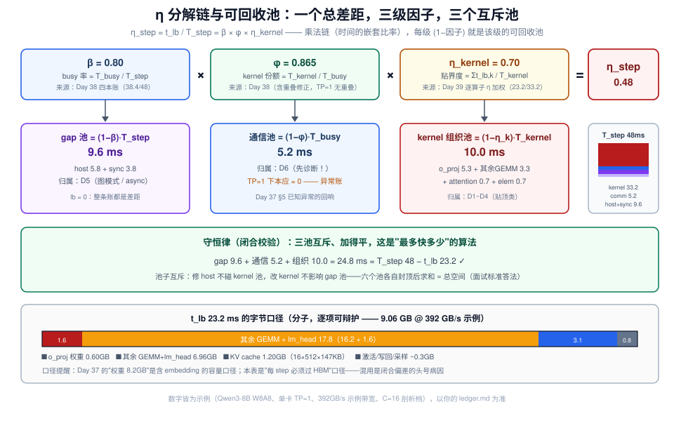
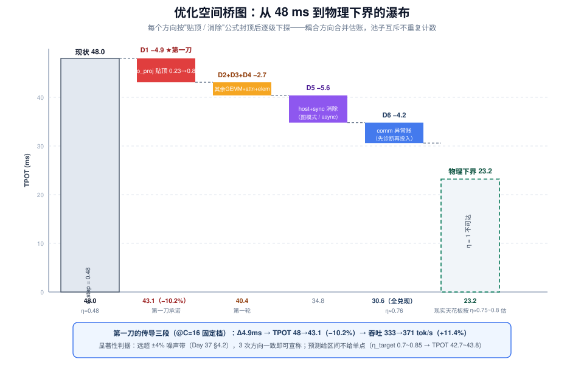
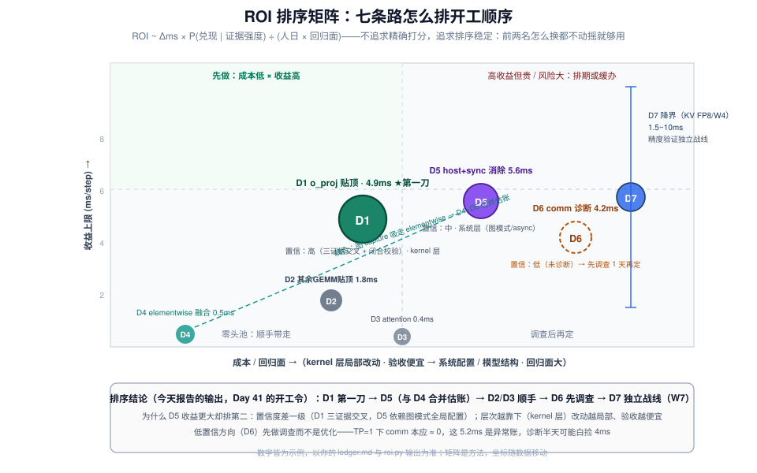

# Day 40：性能剖析（三）—— bound 建模收口与《瓶颈分析报告》

> **本周**：第 6 周 · 项目 A（vLLM-Ascend 源码贡献）上篇
> **今日定位**：剖析三天的收官日——**不开新 profiler、不采新 trace，把三天的证据串成一条 η 分解链，算清每个优化方向的收益上限，落成《瓶颈分析报告》（现状数据 → 理论上限 → 优化空间）**
> **预计用时**：3 ~ 4 小时（上午：数字对齐 + η 链闭合；下午：收益上限 + ROI 排序 + 写报告）
> **今日金句**：剖析的终点不是"找到慢的 kernel"，是"一张闭合的账"——账闭合了，第一刀自己会浮出来。

---

## 0. 前情回顾与今日位置

Day 38 的四本账告诉你 step 的时间去哪了（kernel / comm / host / sync，β = 0.80），Day 39 的三证据把指控精确到了算子（`WeightQuantBatchMatmul*` @ o_proj：单次 p50 ≈ 190µs vs $t_{\text{lb}}$ ≈ 43µs，$\eta_{\text{mem}} \approx 0.23$，MTE2 61%、Block Dim 8）。但到此为止，你手里是**一堆分层的证据**：服务级的 TPOT、step 级的 β、kernel 级的 η——它们各自成立，却还没有互相约束过。三天里的数字都是"当天口径的示意取整"，**没有人保证它们放进同一张表还能加得平**。

今天只做一件事：**让它们互相约束**。

| 三天的产出 | 今天怎么用 |
|---|---|
| Day 37 `baseline.md`：$t_{\text{lb}}$ 手算、噪声带、已知异常 | $\eta_{\text{step}}$ 的分子分母；收益数字的显著性门槛（±4% 噪声带） |
| Day 38 `step_decomposition.md`：四本账 + β + $S_{\max}$ | 链条的中间层；gap 池的大小 |
| Day 39 `kernel_topn.md` / `kernel_bound.md`：$\eta_{\text{mem}}$、三证据、一句话指控 | 链条的底层；优化方向的候选清单 |
| Day 39 `hypotheses.md` 裁决记录 | 报告"证据索引"的原材料 |

项目 A 四段：Day 36 选题 → Day 37 环境 + 基线 → **▶ Day 38-40 剖析（今天 3/3：收口）** → Day 41-45 优化 + PR。剖析三天三小步：

1. Day 38：L1 分诊 + L2 step 分解——定位到"层"
2. Day 39：L3 kernel 级下钻——精确到"算子与通道"
3. **Day 40（今天）**：bound 建模收口——闭合校验、η 分解链、收益上限、ROI 排序，交出《瓶颈分析报告》和 Day 41 的动手清单

方法论上的旧朋友：Day 2 的手算公式（今天变成 $t_{\text{lb}}$ 的**字节口径表**）、Day 3 的 Roofline（η 的分母就是它）、Day 5 的指标体系（收益必须传导到 TPOT / 吞吐 / goodput 才算数）、Day 11-12（传导公式的失效场景：混排与抢占）、Day 22-23（"降界"类方向的代价面）。今天没有新的观测工具，**今天是"算与写"的一天**——剖析阶段到此收官，从明天起两周全是执行。



---

## 1. 今日学习目标

| # | 目标 | 验收标准 |
|---|---|---|
| 1 | 完成**数字对齐**：把三天的表并成一张总账（ledger），口径统一 | 一张表：每行 = 账目/算子，列 = 实测 ms、$t_{\text{lb}}$ ms、η、证据指针 |
| 2 | 通过**闭合校验**：Σ(分项 $t_{\text{lb}}$) ≈ step 级 $t_{\text{lb}}$ | 校验记录落表（偏差 ±10% 内）；对不上时能定位口径错误并修正 |
| 3 | 建立 **η 分解链**：$\eta_{\text{step}} = \beta \times \varphi \times \eta_{\text{kernel}}$ | 每个因子有测量来源；能指出最大的两个"可回收池" |
| 4 | 算清**每个优化方向的收益上限**并按 ROI 排序 | ≥5 个方向，各含：收益 ms、传导到 TPOT/吞吐、置信度、成本；第一刀有规格 |
| 5 | 落成**《瓶颈分析报告》**（三段式 + TL;DR + 证据索引） | 冷读测试通过：30 分钟后只看 TL;DR 能复述第一刀与验收标准 |

---

## 2. 核心概念

### 2.1 η 分解链：把一个总差距拆成一棵乘法树

Day 37 定义过 $\eta = t_{\text{lb}} / t_{\text{measured}}$（理论搬运时间 ÷ 实测时间），当时它是**一个数**；今天把它拆开。稳态纯 decode 下 $T_{\text{step}} \approx \text{TPOT}$（Day 38 §3.4），于是：

$$\eta_{\text{step}} = \frac{t_{\text{lb}}}{T_{\text{step}}} = \underbrace{\frac{T_{\text{busy}}}{T_{\text{step}}}}_{\beta\ \text{busy 率}} \times \underbrace{\frac{T_{\text{kernel}}}{T_{\text{busy}}}}_{\varphi\ \text{kernel 份额}} \times \underbrace{\frac{t_{\text{lb}}}{T_{\text{kernel}}}}_{\eta_{\text{kernel}}\ \text{贴界度}}$$

三个因子各管一段，是**乘法链**而不是加法，因为它们是时间的嵌套比率——每一级都以上一级的时间为分母：

| 因子 | 含义 | 测量来源（哪天的产出） | $1-\text{值}$ = 可回收池 |
|---|---|---|---|
| $\beta$ | device busy 率：kernel+comm 占 step 的比例 | Day 38 四本账 | host + sync gap |
| $\varphi$ | busy 里 kernel 的份额（剔掉通信） | Day 38（含重叠修正，§3.1） | 通信串行部分 |
| $\eta_{\text{kernel}}$ | kernel 时间里"贴下界"的程度 | Day 39 逐算子 η 的加权和 | kernel 内组织开销 |

这条链的价值不在公式本身，而在于**每一级的 $(1-\text{因子})$ 就是该级能收回的时间池，且池子互斥、不重复计数**——修 host 不碰 kernel 池，改 kernel 不影响 gap 池。这直接回答了面试经典追问："你的优化最多能快多少？"——答案不是拍脑袋，是把六个池子各自封顶后求和（§3.3、§4）。

> **和 Day 38 §2.3 的关系**：昨天（相对今天而言）的 $S_{\max} = 1/\beta$ 只是链条的第一级；今天补全后，"最多快多少"有了三级的完整答案——gap 池、通信池、组织池各自封顶，加起来才是总空间。

### 2.2 收益上限的三种算法：贴顶 / 消除 / 降界

所有优化方向，按"动的是账本哪一列"分三类，**收益上限的算法各不相同**：

| 类型 | 动什么 | 收益公式 | 本周示例中的代表 |
|---|---|---|---|
| **贴顶**（efficiency） | 算子实测时间 → $t_{\text{lb}}/\eta_{\text{target}}$ | $\Delta = t_{\text{meas}} - t_{\text{lb}}/\eta_{\text{target}} = t_{\text{lb}} \cdot (1/\eta_{\text{now}} - 1/\eta_{\text{target}})$ | o_proj η 0.23 → 0.8：$\Delta = 6.84 - 1.55/0.8 \approx 4.9$ ms |
| **消除**（elimination） | gap / 异常账 → 残余比例 | $\Delta = T_{\text{account}} \cdot (1 - r_{\text{residual}})$ | host+sync 9.6 ms，残余 ~42% → $\Delta \approx 5.6$ ms |
| **降界**（lower the bound） | $t_{\text{lb}}$ 本身（少搬字节） | $\Delta t_{\text{lb}} = \Delta\text{Bytes}/\text{BW}$，再除以 η | KV FP8：KV 项 $t_{\text{lb}}$ 减半（Day 23 的账） |

> **为什么必须区分**：贴顶和消除的收益**有硬上限且可精确计算**（分子是物理量：字节数、带宽、账目时长）；降界的理论极限是"Bytes → 0"，但受精度约束（Day 22-24 量化专题讲过代价面）。把三类混在一起谈"优化空间"是报告里的常见硬伤——reviewer 的第一个问题就会是："这 5 ms 是哪类空间？凭什么封顶？"

### 2.3 ROI：收益 × 置信 ÷ 成本，不是只看收益

两个方向都号称省 5 ms，怎么排先后？三个修正项：

1. **置信度** = 收益数字的证据强度。三证据交叉（Day 39）> 单指标；"通过了闭合校验的方向" > "单次 trace 的读数"。置信度低的方向先做**调查**而不是优化——示例里的 comm 账就是典型：单卡（TP=1）部署下它本应接近零，却挂着 5 ms 量级，这本身是个未裁决的异常（Day 37 §5 "已知异常"的回响），先花半天诊断，再决定要不要投入。
2. **成本**：代码改动面（算子内 tiling 参数 vs 跨进程的图模式配置）、回归测试范围、review 周期。
3. **耦合**：方向之间是否冲突。示例里 elementwise 融合（D4）与图模式（D5）有耦合——图 capture 会把 elementwise 吸进图里，先做哪个会改变另一个的收益口径。耦合的方向要**合并估账**，不能各自封顶后直接相加。

$$\text{ROI} \sim \frac{\Delta\text{ms} \times P(\text{兑现})}{\text{人日} \times \text{回归面}}$$

不追求精确打分，追求**排序稳定**——前两名怎么换都不动摇、后面的顺序无所谓，就够用了。

### 2.4 报告的认识论：写给三个读者

《瓶颈分析报告》的读者不是"审阅你工作的人"，而是**三周后的你、vllm-ascend 的 reviewer、W8 的面试官**——同一份文档要同时服务三个场景：

| 读者 | 他要什么 | 对应结构 |
|---|---|---|
| 三周后的自己 | 每个数字从哪来、当时怎么判定的 | 证据索引（每个数字 → 文件 + 行号 / CSV 行） |
| PR reviewer | 为什么改这里、收益怎么算的、怎么验证 | 三段式 + 第一刀规格（验收标准、回滚方案） |
| 面试官 | 3 分钟讲清"病在哪 → 天花板 → 第一刀" | TL;DR（Day 53 项目讲稿的底稿） |

写作纪律只有一条：**报告里不允许出现无出处的数字**。这条纪律的副产品是防未来的自己扯皮——优化做完实测与预测对不上时，证据索引能告诉你当时哪个假设错了（这比"预测对了"更有面试价值，Day 49 复盘会用到）。

---

## 3. 原理深入

### 3.1 链条的完整代数（含重叠修正）

四本账的求和规则（Day 38 §4.1）要求 busy 取**并集**而不是求和。若通信与 kernel 在时间上重叠（TP > 1 且开了通信-计算重叠时会出现），则：

$$T_{\text{busy}} = \left| \bigcup_{k \in \text{device 事件}} [\text{ts}_k, \text{ts}_k + \text{dur}_k] \right| \le T_{\text{kernel}} + T_{\text{comm}}$$

$$\varphi = \frac{T_{\text{kernel}}}{T_{\text{kernel}} + T_{\text{comm}} - T_{\text{overlap}}}$$

对链条的影响：重叠越大，φ 越接近 1，"通信池"越小——**通信被重叠掉的部分不再是可回收池**（它已经不占墙钟时间）。所以先在 trace 上量出 $T_{\text{overlap}}$（Day 38 的解析脚本会报重叠量），再谈通信方向的空间；示例为单卡部署，重叠为零，φ 直接用 $\varphi = T_{\text{kernel}} / T_{\text{busy}}$。

η 因子一层同理：$\eta_{\text{kernel}} = \sum_k t_{\text{lb},k} / T_{\text{kernel}}$ 是**按实测时间加权的平均贴界度**——占比大的慢算子拖累全局 η，这就是"先修谁"的数学依据（权重 × 差距 = 收益，与 Day 39 选目标算子的 ROI 公式同源）。

### 3.2 闭合校验：链条的守恒律

η 链有一个内置的**守恒律**：所有分项的 $t_{\text{lb}}$ 之和，必须等于 step 级手算的 $t_{\text{lb}}$（在**同一字节口径**下）：

$$\sum_{k \in \text{全部算子类}} t_{\text{lb},k} \approx t_{\text{lb,step}} = \frac{\text{Bytes}_{\text{step}}}{\text{BW}}, \qquad \text{容差} \pm 10\%$$

它同时约束两侧：**实测侧** Σ(各账实测) = $T_{\text{step}}$；**理论侧** Σ(各分项 $t_{\text{lb}}$) = $t_{\text{lb,step}}$。任何一侧加不平，必有一个口径错误——常见病因按出现频率排：

| 病因 | 症状 | 修法 |
|---|---|---|
| 漏项 | Σ $t_{\text{lb}}$ 偏小 | 补：lm_head / 采样 / 反量化 scale / 写回放大 |
| 重复计数 | Σ 偏大 | 剔：同一数据被上下游各计一次（Day 39 §4.5 的 L2 讨论就是防这个） |
| 口径不一致 | 忽大忽小 | 统一：权重含不含 embedding？带宽用标称还是实测 sustained？档位是哪个 C？ |
| 事件误归属 | 实测侧加不平 | 回 trace：stream wait / 同步事件被计成了 kernel 或 comm |

闭合校验不只是查错，它还是**假设杀手**。本周示例的实战演示：Day 39 结束时的直觉是"量化 GEMM 路径整体病了"（毕竟 Day 38 看到 GEMM 占 kernel 账大头、o_proj 的 η 只有 0.23）。把它放进守恒律算一下——GEMM 类的 $t_{\text{lb}}$ 合计约 19.4 ms（§4 的字节口径表），如果 144 次 GEMM **都**在 η ≈ 0.23，光 GEMM 账就要 $19.4 / 0.23 \approx 84$ ms——**比整个 step（48 ms）还长 75%，物理上不可能**。守恒律当场宣判：病的是 o_proj 所在的 shape 类，其余 GEMM 的 η 必须足够高（反解出来 ≈ 0.84）总账才闭合。你甚至不用重跑 trace——**链条替你把没测到的量约束出来了**。这就是"证据互相约束"的含义。

### 3.3 收益的传导算术：kernel → step → TPOT → 吞吐 → goodput

算子级的收益要传导到服务级指标才算数（Day 39 实验验收已经要求过"算不出 step 级传导的 kernel 级结论等于没有结论"）。传导链四步：

$$\Delta T_{\text{step}} = \sum_k \Delta_k \quad (\text{无耦合时}) \qquad \Rightarrow \qquad \text{TPOT}' = \text{TPOT} - \Delta T_{\text{step}}$$

$$\frac{\Delta X}{X} = \frac{N / \text{TPOT}'}{N / \text{TPOT}} - 1 = \frac{\text{TPOT}}{\text{TPOT}'} - 1 \qquad (\text{吞吐，} N_{\text{running}} \text{ 不变})$$

$$\text{goodput：若 SLO 为 TPOT p99} \le L\text{，TPOT 分布下移} \Rightarrow \text{可上探更高并发档} \Rightarrow \text{增益可能远超单档吞吐}$$

四个失效场景（每个都对应 W2-W3 读过的源码机制，报告里要自查）：

1. **混排稀释**：chunked prefill 混排的 step 里，decode 侧收益被 prefill 时间稀释——TPOT 改善 ≈ $\Delta \times f_{\text{decode}}$（$f_{\text{decode}}$ = 纯 decode step 的占比，Day 11）；
2. **抢占污染**：preemption recompute 会同时抬 TTFT 和 TPOT 分布（Day 12），此时 TPOT 不是干净的 $E[T_{\text{step}}]$；
3. **调度间隙**：async scheduling 未生效时，scheduler 的决策时间串行地插在 step 之间（Day 19），$\Delta T_{\text{step}}$ 不完全传导到 TPOT；
4. **并发反馈**：吞吐上升 → 调度器放进更多请求 → $N_{\text{running}}$ 变大 → KV 变大 → $t_{\text{lb}}$ 本身上移，吃掉一部分收益（Day 37 §4.3 的 batching 经济学，反向生效）。

> **给报告的规矩**：每个方向的收益都写成"Δms @ step 级 → TPOT x% → 吞吐 y%"三段，并注明四个失效场景里哪几个在你的负载里不成立（示例是稳态纯 decode 压测，①② 不触发；③ 已在 Day 38 trace 里确认无 scheduler 间隙；④ 用"固定 C 档对照"锁死）。

### 3.4 方向清单的 taxonomy：三个层次、七条路

把池子和类型组合起来，优化方向的全集是一张表（示例的七条，你的项目按自己的账本填）：

| # | 方向 | 类型 | 层次 | 收益上限（示例） | 置信度 | 成本/风险 |
|---|---|---|---|---|---|---|
| D1 | o_proj 类 tiling / 多核 / 融合 | 贴顶 | kernel | 4.9 ms | **高**（三证据交叉） | 中：算子内改动，回归面小 |
| D2 | 其余 GEMM 贴顶（0.84 → 0.92） | 贴顶 | kernel | 1.8 ms | 中 | 中：动公共 tiling，回归面大 |
| D3 | attention 贴顶（0.81 → 0.90） | 贴顶 | kernel | 0.4 ms | 中 | 中 |
| D4 | elementwise 融合进邻近算子 | 贴顶 | kernel+图 | 0.5 ms | 中 | 低（与 D5 耦合，合并估账） |
| D5 | host+sync 消除（图模式 / async） | 消除 | 系统 | 5.6 ms | 中 | 中高：配置层，影响全局 |
| D6 | comm 异常账诊断（TP=1 下应为 ~0） | 消除 | 系统 | 4.2 ms | **低（未诊断）** | 未知：先调查 1 天再定 |
| D7 | KV FP8 / W4 权重（降界） | 降界 | 模型/量化 | 1.5 ~ 10 ms | 中（Day 22-23 有代价面） | 高：精度验证是独立战线 |

三个层次对应三处代码位置（Day 17/18/22 的知识在这里汇合）：**kernel 层**在 `vllm_ascend/quantization/` 与 attention 后端；**系统层**在图模式 capture 与调度配置（vllm-ascend 的图开关、V1 的 async scheduling）；**模型层**在 checkpoint 与量化配置。层次越靠上，改动越局部、验收越便宜——这也是 D1 排第一的原因之一。

### 3.5 报告的三段式结构与写作规范

```markdown
# 项目 A 瓶颈分析报告：<选题> @ <环境五元组>，<日期>
## TL;DR（一屏）
  一句话指控 / ROI 前三 / 第一刀与验收标准
## 1. 现状数据
  1.1 服务级：baseline 表引用 + 分诊结论（Day 38）
  1.2 step 级：四本账 + β（对齐后口径 + 修正记录）
  1.3 kernel 级：Top-N 引用 + 目标算子三证据（Day 39）
## 2. 理论上限
  2.1 t_lb 字节口径表（每一项：多少 GB、为什么必须搬、证据）
  2.2 η 分解链（β / φ / η_kernel 逐因子 + 测量来源）
  2.3 闭合校验记录（两侧对账 + 偏差 + 修正过程）
## 3. 优化空间
  3.1 方向清单（taxonomy 表，含类型/收益/置信/成本）
  3.2 ROI 排序 + 耦合说明
  3.3 传导到服务级指标（每个方向三段式 + 失效场景自查）
  3.4 第一刀规格（改哪里 / 验收门禁 / 回滚方案 / 禁区）
## 附录：证据索引（报告中每个数字 → 文件 + 行号 / CSV 行）
```

五条写作规范：① 数字无出处不入场；② 预测给**区间**不给单点（η_target 本身有不确定度）；③ 每个 η 标注测量来源与档位；④ 修正过程保留（口径对齐记录比"最终正确"更有信息量）；⑤ TL;DR 控制在一屏——它是 Day 53 三分钟讲稿的底稿，也是冷读测试的考卷。

---

## 4. 全链算例（示例数字走一遍：从 48 ms 到第一刀）

> 沿用本周示例：Qwen3-8B（36 层 / hidden 4096）、W8A8、单卡、HBM 392 GB/s（示例标称值）、剖析档位 C=16 / ctx≈512、稳态纯 decode。**数字皆为示意，方法才是正文**——你的项目里每一格都该换成自己的测量值。

### 4.0 第零步：口径对齐记录（今天的第一件事）

把三天的数字放进同一张表，立刻发现两处对不上，修正如下（**修正必须留痕**，它进报告附录）：

| # | Day 38/39 的口径 | 对齐后 | 原因 |
|---|---|---|---|
| 1 | comm 账 8.6 ms | **5.2 ms** | 3.4 ms 是 stream wait/同步事件被误计为通信（Day 38 §5.5 列过的坑），归还 kernel 侧：kernel 29.8 → 33.2 |
| 2 | "GEMM 占 kernel 账 70%" | **84%（27.9 ms）** | Day 38 按名字前缀粗分漏了 lm_head 与量化 epilogue；按 Day 39 的 Name+Shape 聚合重分：GEMM 27.9 / attention 3.8 / elementwise 1.5 |

β 不受影响（仍为 0.80）——3.4 ms 是在 busy 内部挪动。**这两处修正是闭合校验逼出来的**：不建总账，它们会永远藏在"各自的表都挺对"里。

### 4.1 总账（ledger）

| 账目 / 算子类 | 实测 ms/step | $t_{\text{lb}}$ ms/step | η | 证据指针 |
|---|---|---|---|---|
| kernel · GEMM o_proj 类（36 次 × p50 190µs） | 6.84 | 1.55 | **0.23** | kernel_bound.md |
| kernel · GEMM 其余（qkv/gate_up/down + lm_head，108+1 次） | 21.1 | 17.8 | 0.84 | kernel_topn.md + §3.2 闭合反解 |
| kernel · attention（KV gather） | 3.8 | 3.07 | 0.81 | kernel_topn.md |
| kernel · elementwise / 采样 | 1.5 | 0.8 | 0.53 | step_decomposition.md |
| comm（**TP=1 下异常，待诊断**） | 5.2 | — | — | D6 |
| host gap | 5.8 | — | — | step_decomposition.md |
| sync gap | 3.8 | — | — | step_decomposition.md |
| **Σ** | **48.0** | **23.2** | | |

### 4.2 字节口径表（$t_{\text{lb}}$ 的分子，逐项可辩护）

| 组成 | 字节量 | $t_{\text{lb}}$ | 为什么必须搬 |
|---|---|---|---|
| 层内 GEMM 权重 · o_proj（36 × 16.8 MB） | 0.60 GB | 1.55 ms | int8 权重，每 step 全量读（Day 39 §4.5：L2 救不了） |
| 层内 GEMM 权重 · 其余（36 × 176.2 MB） | 6.34 GB | 16.2 ms | qkv 25.2 + gate_up 100.7 + down 50.3 MB/层 |
| lm_head（4096 × 151936） | 0.62 GB | 1.58 ms | 每 step 算 logits 读一遍 |
| KV cache（16 × 512 × 147 KB） | 1.20 GB | 3.07 ms | decode attention 全量扫 KV（Day 1/Day 2 公式） |
| 激活 / 中间写回 / 采样 | ~0.3 GB | 0.8 ms | 量级估算（Day 39 §4.1 的写回放大项） |
| **Σ** | **9.06 GB** | **23.2 ms** | |

> **口径说明（常见坑）**：Day 37 的"权重 ≈ 8.2 GB"是**含 embedding 的总权重量级**，用于估显存容量；本表是"**每 step 必须过 HBM 的字节**"口径（embedding 是 gather，只 touch 被查的行，忽略）——两个口径都对，用途不同，混用是闭合校验里"忽大忽小"病的头号病因。

### 4.3 η 链与池子

$$\eta_{\text{step}} = \underbrace{0.80}_{\beta} \times \underbrace{0.865}_{\varphi} \times \underbrace{0.70}_{\eta_{\text{kernel}}} \approx 0.48 \quad\Longleftrightarrow\quad \frac{23.2}{48}$$

与 Day 37 服务级一眼算出的 η ≈ 50% 同量级——**但今天能回答"那 52% 的缺口分给谁"**：

| 池子 | 大小 | 构成 |
|---|---|---|
| kernel 组织池 | **10.0 ms** | o_proj 5.3 + 其余 GEMM 3.3 + attention 0.7 + elementwise 0.7 |
| gap 池（host+sync） | **9.6 ms** | host 5.8 + sync 3.8 |
| 通信池 | **5.2 ms** | TP=1 下异常——D6 先诊断 |

### 4.4 收益上限、waterfall 与第一刀



每个方向套 §2.2 的公式（D1：$6.84 - 1.55/0.8 \approx 4.9$ ms；D5：$9.6 \times 0.58 \approx 5.6$ ms……），得到瀑布图的三级结论：

| 里程碑 | TPOT | 说明 |
|---|---|---|
| 现状 | 48 ms | $\eta_{\text{step}}$ = 0.48 |
| **第一刀承诺（D1）** | **43.1 ms（−10.2%）** | 高置信：三证据交叉 + 闭合校验通过 |
| 第一轮（D1+D2+D3+D4） | 40.4 ms | 顺手带走其余 GEMM / attention / elementwise 的零头 |
| 全兑现（+D5+D6） | 30.6 ms | $\eta_{\text{step}}$ ≈ 0.76；D6 兑现前需先诊断 |
| 物理下界 | 23.2 ms | η = 1 不可达；现实天花板按 η ≈ 0.75~0.8 估 |

> Day 39 预告里粗估的"~35 ms"是"只修 GEMM 账"的口径；对齐总账后全兑现口径是 ~31 ms——**口径不同数字不同，这正是今天存在的意义**。

传导（D1，@C=16 固定档）：Δ = 4.9 ms → TPOT 48 → 43.1（−10.2%）→ 吞吐 333 → 371 tok/s（+11.4%），远超 ±4% 噪声带，3 次方向一致即可宣称（Day 37 §4.2 判据）。



**第一刀规格（Day 41 的开工令）**：

| 项 | 内容 |
|---|---|
| 目标 | `WeightQuantBatchMatmul*` o_proj（N=K=4096）@ M=16：单次 p50 190µs → **≤ 60µs（η ≥ 0.7）** |
| 改动层 | `vllm_ascend/quantization/` 路径的 tiling / 多核切分（Block Dim 8 → 16/32）或反量化 epilogue 融合——先 microbench 定位，再动源码 |
| 验收门禁 | G1 精度（输出 diff）；G2 microbench（p50 ≤ 60µs × 3 次）；G3 e2e（TPOT ≤ 43.5 ms，超噪声带） |
| 预测区间 | η_target 0.7~0.85 → Δ 4.2~5.3 ms → TPOT 42.7~43.8 ms（不写单点） |
| 回滚 | 单 commit，revert 即回基线 |
| 禁区 | 不动公共 dispatch 逻辑；不与其他刀混在同一 commit |

---

## 5. 关键命令与脚本

### 5.1 总账生成：三张表 → 一张 ledger

```python
# build_ledger.py —— 把 step_decomposition / kernel_topn / kernel_bound 并成一张总账
import pandas as pd

# 手工维护"账目级"行（来自 Day 38 step_decomposition.md，含 §4.0 的修正）
accounts = pd.DataFrame([
    # (账目, 实测ms, t_lb_ms, 证据)
    ("kernel·GEMM·o_proj类", 6.84, 1.55, "kernel_bound.md"),
    ("kernel·GEMM·其余",     21.1, 17.8,  "kernel_topn.md + 闭合反解"),
    ("kernel·attention",     3.8,  3.07,  "kernel_topn.md"),
    ("kernel·elementwise",   1.5,  0.8,   "step_decomposition.md"),
    ("comm(待诊断)",          5.2,  None,  "D6"),
    ("host_gap",             5.8,  None,  "step_decomposition.md"),
    ("sync_gap",             3.8,  None,  "step_decomposition.md"),
], columns=["account", "meas_ms", "tlb_ms", "evidence"])

# 闭合校验（两侧）
print("实测侧: Σ = %.1f vs T_step = %.1f" % (accounts.meas_ms.sum(), 48.0))
tlb_sum = accounts.tlb_ms.sum()
print("理论侧: Σt_lb = %.1f vs 手算 t_lb,step = %.1f (偏差 %.0f%%)"
      % (tlb_sum, 23.2, 100 * abs(tlb_sum - 23.2) / 23.2))

# η 链三因子（busy 假设无重叠：TP=1 单卡，见 §3.1）
kernel = accounts[accounts.account.str.startswith("kernel")]
t_kernel, t_comm = kernel.meas_ms.sum(), accounts.loc[4, "meas_ms"]
t_busy, t_step = t_kernel + t_comm, accounts.meas_ms.sum()
beta, phi, eta_k = t_busy / t_step, t_kernel / t_busy, kernel.tlb_ms.sum() / t_kernel
print(f"η_step = β({beta:.2f}) × φ({phi:.2f}) × η_kernel({eta_k:.2f}) = {beta*phi*eta_k:.2f}")
```

（`accounts.loc[4, ...]` 取 comm 行——按你自己的行序改；关键是把**闭合校验和 η 链做成可重跑的代码**，报告里的数字全部由它产出，避免手抄错。）

### 5.2 ROI 计算器：方向 → 收益 → 传导

```python
# roi.py —— 每方向：类型 / 现状 / 目标 → Δms → TPOT / 吞吐传导
T_STEP, C, TPOT = 48.0, 16, 48.0

def ceiling_fix(t_meas, t_lb, eta_tgt):        # 贴顶：现状实测 + t_lb + 目标 η
    return t_meas - t_lb / eta_tgt

def ceiling_elim(t_account, r_residual):        # 消除
    return t_account * (1 - r_residual)

dirs = [
    ("D1 o_proj tiling",  "fix",  ceiling_fix(6.84, 1.55, 0.80)),
    ("D2 其余GEMM贴顶",    "fix",  ceiling_fix(21.1, 17.8, 0.92)),
    ("D3 attention贴顶",   "fix",  ceiling_fix(3.8,  3.07, 0.90)),
    ("D4 elementwise融合", "fix",  ceiling_fix(1.5,  0.8,  0.80)),
    ("D5 host+sync消除",   "elim", ceiling_elim(9.6, 0.42)),
    ("D6 comm诊断",        "elim", ceiling_elim(5.2, 0.20)),   # 置信度低：先调查
]
cum = TPOT
for name, typ, d in dirs:
    cum -= d
    print(f"{name:22s} Δ={d:5.1f}ms  TPOT->{cum:5.1f}  吞吐+{TPOT/cum-1:5.1%}")
print(f"物理下界 t_lb = 23.2ms（η=1 不可达）")
```

### 5.3 常见坑速查

| 坑 | 症状 | 修法 |
|---|---|---|
| 拿粗分口径当最终口径 | "GEMM 占 70%" 与 Top-N 表对不上 | 一律以 Name+Shape 聚合为准，粗分只作交叉印证 |
| $t_{\text{lb}}$ 口径混用 | 闭合偏差忽大忽小 | 字节口径表逐项写"为什么必须搬"；权重/激活/KV/写回分开列 |
| 带宽口径不一 | η 时高时低 | 统一用实测 sustained 带宽（大拷贝 microbench 量一次），标称值只作 sanity 上界 |
| 收益直接相加 | waterfall 总和虚高 | 耦合方向（D4+D5）合并估账；重叠通信不算池 |
| 预测写单点 | 实测落在预测外就被质疑 | η_target 给区间 → Δ 给区间 → 传导给区间 |
| 修正不留痕 | 三周后自己都说不清数字为什么变了 | 口径对齐记录进报告附录（§4.0 就是模板） |

---

## 6. 动手实验（今日主线）

> 前置：Day 38 的 `step_decomposition.md`、Day 39 的 `kernel_topn.md` / `kernel_bound.md` / `hypotheses.md` 在手。今天全程**不碰 profiler**——所有输入都是前三天的落盘文件。

### 实验 1：数字对齐与闭合校验（约 50 min，上午核心）

1. 把四本账 + Top-N + kernel_bound 的数字抄进 ledger 模板（§5.1，建议直接跑脚本）；
2. 两侧对账：Σ(实测) ≟ T_step；Σ($t_{\text{lb}}$) ≟ 手算 $t_{\text{lb,step}}$，记录偏差；
3. 偏差超 ±10% → 按 §3.2 病因表逐项排查，**每处修正写一行记录**（改了什么、为什么、影响哪个池子）；
4. 落表 `week6/ledger.md`。

**验收**：两侧闭合在 ±10% 内；每处修正可追溯。对不平又查不出的项，**单列"存疑账"进报告，不要硬凑**——存疑本身是信息（它就是 D6 这类调查项的来源）。

### 实验 2：η 链与池子（约 40 min）

1. 算 β、φ、η_kernel、η_step，每个因子标注测量来源（哪天的哪个文件）；
2. 把可回收池按大小排序，各池标注"归哪个方向管"；
3. 做一次**反证演示**：像 §3.2 那样，挑一个自己的假设（例如"所有 GEMM 都慢"）用守恒律裁决；
4. 与 Day 37 的 η 初值对照：服务级一眼算的 η vs 今天分层算的 η_step，差异应能被池子构成解释。

**验收**：能口头回答"η_step 的缺口分给三个池子各多少 ms、各自的第一嫌疑人是谁"。

### 实验 3：收益上限与 ROI 排序（约 40 min）

1. 每个方向套三类公式算 Δ，标注类型（贴顶/消除/降界）与置信度；
2. 写传导三段式：Δms → TPOT% → 吞吐%（固定 C 档），并自查 §3.3 的四个失效场景哪些不成立；
3. 标注耦合（哪些方向要合并估账），出 ROI 排序；
4. 画 waterfall 草图（用本篇 SVG 做模板，或手绘拍照，逐段标 Δ 与累计值）；
5. 写第一刀规格表（目标 / 改动层 / 门禁 / 预测区间 / 回滚 / 禁区）。

**验收**：排序前两名在任何合理置信度假设下不换位；第一刀规格六项齐全。

### 实验 4：写报告 + 冷读测试（约 60 min，下午核心）

1. 按 §3.5 模板填 `week6/bottleneck_report.md`，数字全部来自 ledger（不重新手算）；
2. 建证据索引：报告正文每个数字回链到 ledger 行 / 原始文件行号 / CSV 行；
3. TL;DR 压到一屏：一句话指控 + ROI 前三 + 第一刀与验收标准；
4. **冷读测试**：搁置 30 分钟后只看 TL;DR，口头复述"病在哪、天花板多少、第一刀改哪、怎么验收"——复述卡壳 = TL;DR 不合格，回去改。

**验收**：报告存在且冷读通过。这份报告是 Day 41 的直接输入，也是 Day 49 简历 bullet 与 Day 53 讲稿的底稿。

---

## 7. 面试高频问题

1. **你怎么量化一个推理系统的优化空间上限？**（η 分解链：$\eta_{\text{step}} = \beta \times \varphi \times \eta_{\text{kernel}}$，每级 $(1-\text{因子})$ 是互斥的可回收池；池子按类型封顶——贴顶用 $t_{\text{lb}}(1/\eta_{\text{now}} - 1/\eta_{\text{tgt}})$，消除用账目 × 残余率，降界动 $t_{\text{lb}}$ 本身）
2. **kernel 省 5 ms，端到端 TPOT 一定降 5 ms 吗？**（稳态纯 decode 近似成立（$E[T_{\text{step}}] \approx \text{TPOT}$）；四个失效场景：混排稀释、抢占污染、调度间隙、并发反馈——能各举源码机制加分）
3. **什么是闭合校验？它抓什么错？**（守恒律：Σ 分项 $t_{\text{lb}}$ ≈ step 级 $t_{\text{lb}}$、Σ 实测账 = $T_{\text{step}}$；抓漏项/重复计数/口径不一致/事件误归属；还能当假设杀手与反推约束——"全部 GEMM 都 η=0.23 则账爆掉"的反证是标准答案素材）
4. **物理下界和现实天花板差在哪？举例。**（必要同步与 launch 残余、attention 非连续 KV gather 的额外寻址、精度约束禁止的降界、β 不可能到 1；示例：下界 23.2 ms，现实天花板 ~31 ms（η≈0.76））
5. **两个方向都号称省 5 ms，你怎么选？**（ROI = 收益 × 置信 ÷ 成本；置信度看证据强度（三证据交叉 > 单指标），低置信方向先调查不优化；还要查耦合——耦合方向合并估账，不能直接相加）
6. **报告里"理论上限"怎么算才不虚？**（字节口径表逐项可辩护；带宽用实测 sustained 而非标称；预测给区间；每个数字有证据索引）
7. **老板质疑你 48→43 ms 的预测，你拿什么辩护？**（传导链每步可复算；噪声带判据（±4%，3 次方向一致）；预测区间而非单点；G2/G3 门禁设计——预测错误时能定位是哪层假设错）
8. **"搬得更快"和"少搬字节"两条战线的本质区别？**（前者改 η、分子是物理量、上限可精确计算（tiling/融合/多核/图模式）；后者改 $t_{\text{lb}}$ 分母（量化/GQA/裁剪），收益上限受精度约束——两条战线的代表技术与失效模式分别对应 Day 18-19/39 与 Day 22-24）

---

## 8. 今日总结

| # | 一句话 |
|---|---|
| 1 | η 分解链是乘法树：$\eta_{\text{step}} = \beta \times \varphi \times \eta_{\text{kernel}}$，每级 $(1-\text{因子})$ 是互斥可回收池——"最多快多少"从此是算出来的 |
| 2 | 闭合校验是守恒律，也是假设杀手：对不平必有口径错误；守恒还能反推出没测到的约束（其余 GEMM η ≈ 0.84 就是反解出来的） |
| 3 | 收益上限三种算法——贴顶 / 消除 / 降界，公式不同、置信不同，混着谈是报告硬伤 |
| 4 | ROI = 收益 × 置信 ÷ 成本：低置信方向（comm 异常账）先调查再投入；耦合方向合并估账 |
| 5 | 报告写给他们仨：三周后的自己（证据索引）、reviewer（三段式 + 第一刀规格）、面试官（TL;DR）；数字无出处不入场 |
| 6 | 口径对齐留痕比"最终正确"更有信息量——今天修正的两处（comm 误计、GEMM 粗分）就是剖手工件里最常见的暗坑 |

**与后续的衔接**：《瓶颈分析报告》= Day 41 的开工令（第一刀规格表直接变成改动设计表）；ledger 与 ROI 计算器 = Day 41-45 每一刀的收益折算工具；waterfall 的"第一刀承诺线 43.1 ms" = G3 门禁的阈值来源；TL;DR = Day 49 简历 bullet 与 Day 53 三分钟讲稿的底稿。

---

## 9. 今日自测题（不看笔记作答）

1. 默写 η 分解链两级公式，说明每个因子的量纲、取值范围与测量来源（哪一天的哪份产出）。
2. 手算：算子 A 占 12 ms/step、$t_{\text{lb}}$ = 3 ms；算子 B 占 4 ms/step、$t_{\text{lb}}$ = 3.6 ms。各自的 η 与"贴到 0.85"的收益上限？只看收益该先做谁？还缺什么信息才能定序？
3. 闭合校验发现 Σ$t_{\text{lb}}$ = 31 ms > step 级手算 26 ms，列出三个可能病因与对应的排查动作。
4. 某方向 Δ = −5 ms，写出它传导到吞吐与 goodput 的算式；四种传导失效场景各举一个负载特征。
5. D1 预测收益 4.9 ms 但要两周 review 周期；D2 只有 1.8 ms 但一天能完成——你怎么权衡？讲出框架而非结论（置信度、回归面、门禁成本、项目阶段）。
6. 口头 3 分钟：只用 TL;DR 讲清"病在哪、天花板在哪、第一刀是什么、怎么验收"——这是 Day 53 的预演，今天讲不顺的句子就是 TL;DR 要改的句子。

---

## 10. 今日产出物清单

- [ ] **`week6/ledger.md`**：对齐后的总账（实测 / $t_{\text{lb}}$ / η / 证据指针四列 + 口径修正记录）——**今日核心产出 1**
- [ ] **η 链与池子表**：β / φ / η_kernel 逐因子 + 池子排序 + 一次反证演示记录
- [ ] **ROI 排序表 + waterfall 图**（SVG 或手绘）：每个方向 Δ、传导三段式、置信度、耦合说明——**今日核心产出 2**
- [ ] **`week6/bottleneck_report.md`**：三段式报告（现状 / 理论上限 / 优化空间）+ TL;DR + 证据索引 + 第一刀规格——**今日核心产出 3（Day 41 的直接输入）**
- [ ] 冷读测试记录（通过 / 不通过 + 修改点）
- [ ] `roi.py` / `build_ledger.py` 脚本存档（W7 消融实验直接复用）

---

## 明日预告（Day 41：实施优化（一）—— 第一刀）

剖析收官，执行开始。今天的"第一刀规格表"明天变成**改动设计表**：改哪个文件 / 函数 / 参数、预期收益、回滚方式；Day 41 的全部工程纪律围绕一件事——**门禁先于代码**：microbench gate 在动第一行源码之前固化基线，G1 精度 / G2 microbench / G3 e2e 三道门禁保护每一刀，一刀一变量、一刀一 commit。报告里那句"搬运组织问题，tiling / 融合方向"的一句话指控，明天开始接受代码的检验。
