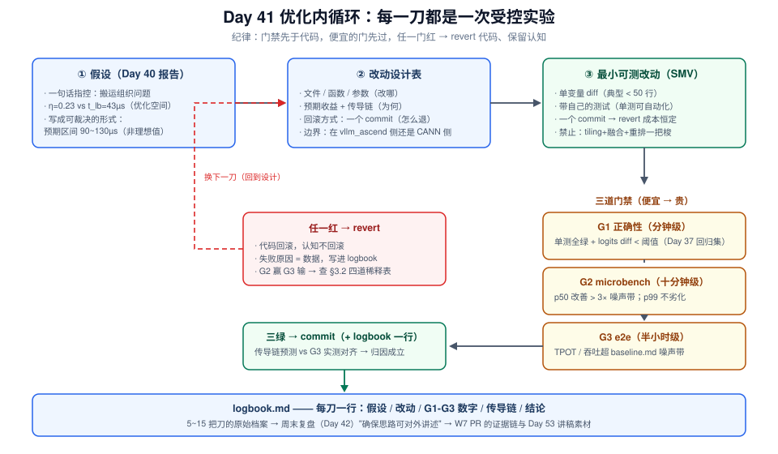
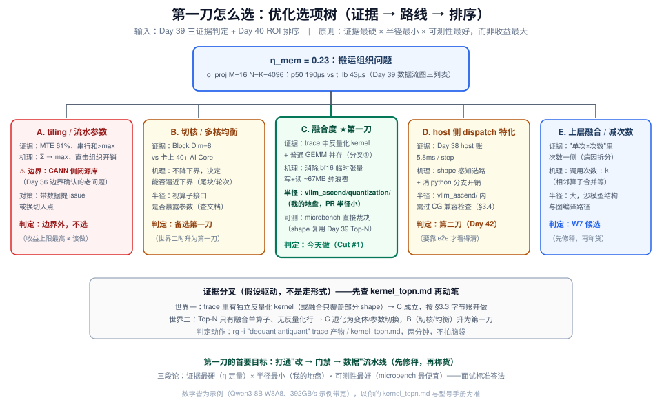
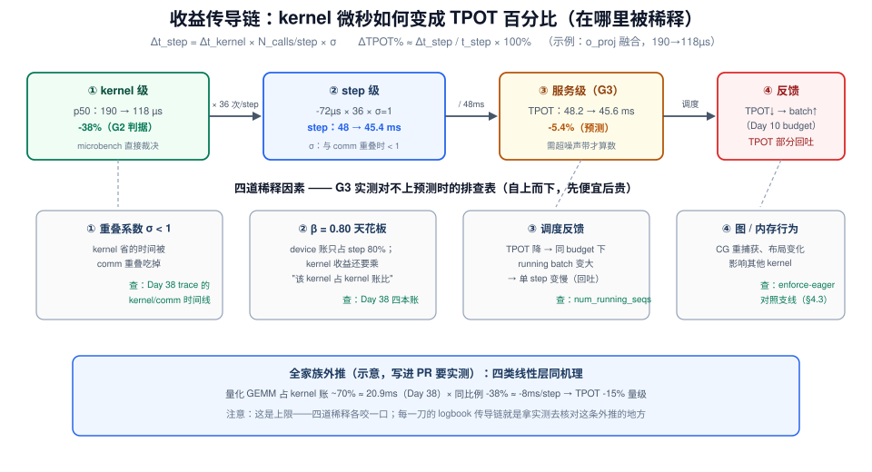

# Day 41：实施优化（一）—— 第一刀：从《瓶颈分析报告》到被门禁保护的最小改动

> **本周**：第 6 周 · 项目 A（vLLM-Ascend 源码贡献）上篇
> **今日定位**：优化五天的第一天——**把 Day 40 报告里的"一句话指控 + 优化空间"翻译成第一行被三道门禁保护的代码**
> **预计用时**：3 ~ 4 小时（上午：改动设计 + 门禁固化；下午：编码第一刀 + 三道门禁 + 开档优化日志）
> **今日金句**：优化的单位不是"改动"，是"被验证过的改动"——门禁先行，代码后动。

---

## 0. 前情回顾与今日位置

昨天（Day 40）把三天剖析的证据收口成《瓶颈分析报告》：**现状**（`WeightQuantBatchMatmul*` 单次 p50 ≈ 190µs、o_proj 一个 shape 就 36 次/step）→ **理论上限**（$t_{lb} \approx 43$µs、$\eta_{mem} \approx 0.23$）→ **优化空间**（贴到 η = 0.8 能省多少 µs、折算到 step 级多少 ms），并按 ROI 排了序。报告结尾那句"一句话指控"——**搬运组织问题，tiling / 融合方向**——就是今天的开工令。

| Day 40 报告的产出 | 今天怎么用 |
|---|---|
| §1 现状数据（p50 × 次数 × 占比） | microbench gate 的**基线数字**（改前先固化，见 §5.2） |
| §2 理论上限（$t_{lb}$、AI vs ridge、η） | 每一刀的**收益上限语境**——防止对不可能的收益空转 |
| §3 优化空间 + ROI 排序 | 今天的**选项树输入**（§3.1 展开成五条路线） |
| 一句话指控 | 第一刀的**假设陈述**——今天写的每行代码都在回答它 |

项目 A 四段：Day 36 选题 → Day 37 环境 + 基线 → Day 38-40 剖析 → **▶ Day 41-45 优化 + PR**。今天是"改代码"的第一天，也是整个项目**角色转换**的一天：前 40 天你都在"读和测"——读 vLLM V1 源码、测基线、测 trace；从今天起你是**作者**。而"改"的风险恰好来自四个方向，今天的全部工程纪律就是防它们：

| 风险 | 典型症状 | 今天的对策 |
|---|---|---|
| 无法归因 | 一把改了 tiling + 融合 + dispatch，赢了 30% 但说不清谁的功劳 | 最小可测改动（§2.2），一刀一变量 |
| 无法回退 | 改了三天，发现方向错了，回不去 | 一刀一 commit，revert 成本恒定 |
| 静默精度回归 | 吞吐涨了 5%，输出全是胡话 | G1 正确性门禁（§2.3） |
| 微基准赢、端到端输 | kernel 快了 40%，TPOT 纹丝不动 | 收益传导折算 + G3 e2e 门禁（§3.2） |



---

## 1. 今日学习目标

| # | 目标 | 验收标准 |
|---|---|---|
| 1 | 把报告方向翻译成**改动设计表**：改哪个文件 / 函数 / 参数、预期收益、回滚方式 | 一张表，每行是一把"刀"，且标了第一刀是谁 |
| 2 | 建立**门禁先于代码**的工作流：microbench gate 脚本在改代码**之前**固化基线 | gate 脚本 + 改前基线数字落盘（JSON/md） |
| 3 | 完成**第一刀**：最小可测改动通过三道门禁，或按判定干净回滚 | `git log` 上一条新 commit（或一条 revert + logbook 记录） |
| 4 | 会做**收益传导折算**：kernel 级 µs → step 级 ms → 服务级 TPOT% | logbook 里每一刀都有一行完整传导链，且与 G3 实测对得上 |
| 5 | 建立**优化日志**（logbook）纪律——周末复盘的素材库 | `logbook.md` 开档，今日 ≥ 1 条结构化记录 |

---

## 2. 核心概念

### 2.1 优化内循环：假设驱动方法论的"改"版

Day 38 剖析的方法论是**假设驱动**——每条假设指定"用什么观测裁决"。今天把同一个循环搬到"改"的战场上，五步一环：

```
假设（Day 40 指控）
  → 设计（改动设计表：改哪、预期收益、怎么回滚）
    → 最小可测改动（一个 commit 的 diff）
      → 三道门禁（正确性 → microbench → e2e）
        → 判定（commit 保留 / revert 并记录）
            ↑ 失败也是数据：写进 logbook，回到"设计"步换下一刀
```

**为什么这个循环是剖析循环的孪生兄弟**：Day 38 你用"最便宜的观测先上"防止误诊；今天用"最便宜的门禁先过"防止返工——G1 单测几分钟、G2 microbench 十几分钟、G3 e2e 半小时起。顺序错了（先跑 e2e 再跑单测），最贵的观测会被最廉价的失败反复浪费。

### 2.2 最小可测改动（SMV：Smallest Minimal Verifiable change）

定义：**一个 diff 只包含"让当前假设可被检验"所需的最小变更集**——多一行都是污染。

| SMV 的性质 | 带来的好处 | 对应的项目 A 目标 |
|---|---|---|
| 单变量 | 赢了知道谁赢，输了知道谁输 | PR 里能写清机制解释 |
| diff 小（典型 < 50 行） | review 快、冲突少 | Day 36 说过：PR 半径小是选题红线 |
| 一个 commit | `git revert` 恒定成本 | 方向错了随时掉头 |
| 带自己的测试 | 门禁可自动化 | CI 绿是 PR 的入场券 |

**反例（今天禁止的写法）**：把"小 M 切融合算子 + 调大切核数 + 顺手重排了 scale 广播"写进一个 diff。赢了 30%，review 时被问"三个改动各贡献多少"——答不上，PR 就死了。**这不是风格问题，是可维护性问题**：上游 maintainer 拒收的最大理由从来不是"不够聪明"，而是"说不清楚"。

### 2.3 三道门禁：判据、成本与出处

| 门 | 判据（量化） | 成本 | 数据/工具出处 | 防什么 |
|---|---|---|---|---|
| **G1 正确性** | 相关单测全绿 + 精度对比在阈值内（如 logits max diff < 1e-2，量级视 dtype） | 分钟级 | Day 37 圈定的最小回归测试集 | 静默精度回归 |
| **G2 microbench** | 目标 shape 的 p50 改善 **> 3× 噪声带**；p99 不劣化 | 十分钟级 | 今日固化（§5.2），基线对齐 Day 39 `kernel_topn.md` 的 shape / 次数 | "感觉快了" |
| **G3 e2e** | TPOT / 吞吐变化超出 Day 37 `baseline.md` 的噪声带；TTFT 不劣化 | 半小时级 | baseline.md 同参复测 | microbench 赢 e2e 输 |

三条硬纪律：

1. **门禁先于代码**：G2 的基线数字必须在改代码**之前**跑出来落盘——改完再跑"改前"，你已经回不去了。
2. **便宜→贵**：G1 不过不跑 G2，G2 不过不跑 G3。e2e 的半小时永远花在已经"两绿"的改动上。
3. **任一门不过 → revert**：代码回滚，**认知不回滚**——失败原因写进 logbook，它和成功一样是周末复盘的素材（README 给 Day 41-42 的要求原话就是"整理中途记录，确保思路可对外讲述"）。

### 2.4 logbook：中途记录的格式

优化五天会积累 5~15 把刀，周末复盘时你要回答的是"每一刀的假设—证据—结果—下一步"，靠记忆必挂。格式（§6 实验 4 有填充示例）：

```markdown
## Cut #N | 日期 | 分支名
- 假设：（引用 Day 39/40 的哪条证据）
- 改动：文件 + 行数（+x/-y），一句话机制
- G1：单测名 → 绿/红；精度 max diff = …（阈值 …）
- G2：shape → p50 a→b µs（Δ 超噪声带？）；p99 …
- G3：TPOT a→b ms（Δ vs 噪声带 …）；TTFT …
- 传导链：Δkernel × 次数 = Δstep → ΔTPOT%（预测 vs 实测对齐？）
- 结论：commit <hash> / revert（原因一句话）
```

> **为什么传导链单列一栏**：这是"kernel 级结论能否存活到服务级"的审计记录。G2 与 G3 的数字对不上时（microbench -38% 而 TPOT 只 -5%），这一栏就是你的第一现场——§3.2 的稀释因素表会告诉你去查哪里。

---

## 3. 原理深入：第一刀怎么选，收益怎么折算

### 3.1 优化选项树：把 Day 39/40 的证据映射成五条路线

Day 39 的三证据判定（AI 手算 / pipe Ratio / η 定量）+ Day 40 的 ROI 排序，展开成选项树：

| 路线 | 内容 | 支撑证据（出处） | 收益机理 | 改动半径与边界 | 判定 |
|---|---|---|---|---|---|
| **A. tiling / 流水参数** | tile 大小、缓冲级数、循环次序 | MTE 61%、串行和 > max（Day 39 数据流图三列表） | 把 $\sum$ 变 $\max$，直击 η = 0.23 的组织开销 | ⚠️ 多在 **CANN 侧闭源库**内——Day 36 边界确认的老问题 | 边界外 → 转issue / 放弃 |
| **B. 切核 / 多核均衡** | Block Dim 8 → 更多核、balance 策略 | Block Dim = 8 vs 卡上 40+ AI Core（Day 39 Top-N 表） | 不降下界，但决定能否**逼近**下界 | 视算子接口是否暴露参数（以文档为准） | **备选第一刀** |
| **C. 融合度** | 两步（反量化→matmul）换一步（融合算子） | trace 里若同时出现反量化 kernel + 普通 GEMM（**证据分叉，见 §3.3**）；Vector 22% | 消除 bf16 临时张量的写+读（量级见 §3.3） | `vllm_ascend/quantization/` 内——**你的地盘** | **★ 第一刀** |
| **D. host 侧 dispatch 特化** | shape 感知的路径选择、消除 python 分支开销 | Day 38 host 账 5.8ms / step | host gap 缩短 → 流水断点减少 | `vllm_ascend/` 内，需过 CG 兼容检查（§3.4） | 第二刀（明天） |
| **E. 上层融合 / 减少次数** | 相邻算子合并、消除冗余调用 | "次数 × 单次"里次数一侧（Day 39 §病因拆分） | 调用次数 ÷ k | 改动大、涉及模型结构 | W7 候选 |



**第一刀选 C 的三段论**（也是面试的标准答法）：

1. **证据最硬**：η = 0.23 是 Day 39 三证据交叉后的定量结论，"搬运组织"四个字有两步路径的临时张量搬运直接对号；
2. **半径最小**：改动落在 `vllm_ascend/quantization/` 的 dispatch 层——正是 Day 36 选题时确认过"我能直接提 PR"的那一层；
3. **可测性最好**：microbench 的 shape 矩阵直接复用 Day 39 的 Top-N（M ∈ {1,8,16,32,64}、N=K=4096 一族），判据（µs）连续、噪声小——比 host 侧改动（要靠 e2e 才看得清）便宜一个数量级。

> **为什么不先做收益最大的 E**：收益上限大 ≠ 第一刀该做它。第一刀的首要目标是**打通"改 → 门禁 → 数据"的整条流水线**（今天 §1 目标 2/3），流水线通了之后，大收益改动才有一杆可靠的秤。这是"先修秤，再称货"。

### 3.2 收益传导公式：kernel 微秒 → step 毫秒 → TPOT 百分比

kernel 级收益折算到服务级，是一条要过四道稀释的链：

$$
\Delta t_{step} = \Delta t_{kernel} \times N_{calls/step} \times \sigma
\qquad
\Delta \text{TPOT\%} \approx \frac{\Delta t_{step}}{t_{step}} \times 100\%
$$

- $\sigma$（重叠系数，0~1）：该 kernel 与其他流（如 TP 通信）时间上重叠的份额。decode 以单计算流为主，$\sigma \approx 1$；若你的部署里 comm 与计算已部分重叠（Day 19 async scheduling 的方向），$\sigma < 1$——**先看 Day 38 的 trace 再取值，不要拍脑袋**。
- $t_{step}$ 取 Day 38 分解表的 48ms（示例）。

**示例（贯穿今天）**：o_proj 融合后 190µs → 118µs：

| 传导层 | 计算 | 结果 |
|---|---|---|
| kernel p50 | 190 → 118µs | **-38%** |
| × 次数 36/step × σ=1 | -72µs × 36 = -2.6ms | step 48 → 45.4ms |
| TPOT | -2.6 / 48 | **-5.4%** |
| 全家族外推（示意） | 四类线性层同机理（Day 38：量化 GEMM 占 kernel 账 ~70% ≈ 20.9ms，同比例 -38%） | step ~-8ms，TPOT **-15% 量级（上限，未计稀释）** |

**四道稀释因素**——G3 的数字对不上预测时，按这张表排查：

| # | 稀释点 | 机理 | 排查动作 |
|---|---|---|---|
| ① | 重叠 $\sigma < 1$ | kernel 省下的时间被 comm 重叠吃掉 | 重看 Day 38 trace 的 kernel/comm 时间线 |
| ② | β = 0.80 | device 账只占 step 的 80%，kernel 内收益还要再乘"该 kernel 占 kernel 账比例" | 核对 Day 38 四本账 |
| ③ | 调度反馈 | TPOT 降 → 同 token budget 下 scheduler 攒更大 batch（Day 10）→ 单 step 变慢 → **吞吐涨但 TPOT 部分回吐** | 看复测时 `num_running_seqs` 是否变大 |
| ④ | 图 / 内存行为变化 | CG 重捕获、内存布局改变影响其他 kernel | `-O0/enforce-eager` 对照支线（§4.3） |



### 3.3 第一刀的机理算术：两步路径 vs 融合路径

**先做证据分叉**（这是假设驱动的纪律，不是走形式）：打开 Day 39 的 `kernel_topn.md`，看 `WeightQuantBatchMatmul*` 之外**有没有独立的反量化 kernel**（名字含 dequant / antiquant 的行）：

- **世界一：两步路径**（trace 里反量化 kernel 与普通 GEMM 并存，或融合算子只覆盖部分 shape）→ C 路线按下面的算术成立；
- **世界二：已是融合单算子**（Top-N 里只有 `WeightQuantBatchMatmul*`，无独立反量化行）→ C 退化为"算子变体 / 参数组合切换"（如不同版本的融合算子接口），**B（切核/均衡）升为第一刀**——机理换成分块均衡分析。

世界一的搬运字节账（o_proj，M=16、N=K=4096，int8 权重 + bf16 计算）：

| 路径 | 搬运内容 | 字节量 |
|---|---|---|
| 两步：反量化 kernel | 读 int8 权重 16.8MB + 写 bf16 临时张量 **33.6MB** | ~50.4MB |
| 两步：matmul kernel | 读 bf16 临时张量 33.6MB（+激活 64KB） | ~33.7MB |
| **合计** | 其中临时张量写+读 = **67.2MB 纯浪费** | **~84.1MB** |
| 融合：单算子 | 读 int8 权重 16.8MB + 激活 + scale（+写出 128KB） | **~16.9MB** |

$$
t_{lb}^{two\text{-}step} \approx \frac{84.1\text{MB}}{392\text{GB/s}} \approx 215\mu s
\qquad
t_{lb}^{fused} \approx \frac{16.9\text{MB}}{392\text{GB/s}} \approx 43\mu s
$$

这个 43µs 正是 Day 39 报的 $t_{lb}$——**报告默认的目标路径就是融合路径**。所以第一刀的假设可以写得非常精确：

> **假设（Cut #1）**：decode 小 M 的 w8a8 线性层当前走两步路径（反量化 + matmul），临时 bf16 张量引入 ~67MB 额外搬运；将其切换为融合量化 matmul（`npu_weight_quant_batchmatmul` 一族，接口以你的 torch_npu 版本为准），单次 p50 应从 190µs 降至 t_lb 两步/融合比值的量级（预期 90~130µs，留组织开销余量）。

注意假设里**故意写了预期区间而不是理想值**：η 不会跳到 1，把预期锚在 43µs 只会让自己失望、让门禁形同虚设。

### 3.4 与 CUDA Graph / async scheduling 的相互作用（Day 18/19 回响）

decode 侧改动的两条 CG 铁律：

1. **capture 期决策 vs 每 step 决策**：shape 感知的 dispatch 分支（"M ≤ 32 走融合路径"）在 CG capture 时被**固化进图**——每个 padding bucket 各自捕获一条路径，replay 时零 python 开销。这正是 D 路线（host 特化）对 CG 友好的原因；但如果你把分支逻辑写到了每 step 都要执行的 host 钩子里，它就**逃不出** async scheduling 的隐藏目标（Day 19：把 host 开销藏进上一 step 的 device 执行）。
2. **改 kernel 后 CG 必须重捕获**：今天的 C 路线改的是 kernel 选择，capture 产物自动包含新 kernel，无需额外动作；但 e2e 复测时要确认捕获**成功且走的是新路径**（最简单的证据：msprof/trace 里两步 kernel 消失、融合 kernel 次数 = 预期调用数）。

---

## 4. 第一刀的实施：设计表、门禁测量学与失效预案

### 4.1 改动设计表（今日第一份产出）

动笔写代码之前，先把"刀"落成表——它是 §3.1 选项树的工程化，也是 PR 描述的底稿：

| 刀 | 位置 | 改动（一句话） | 预期 G2 | 传导 G3 | 回滚 | 状态 |
|---|---|---|---|---|---|---|
| **Cut #1** | `vllm_ascend/quantization/` w8a8 实现 | 小 M（≤32）dispatch 到融合量化 matmul，两步路径原样保留 | 190 → 90~130µs | TPOT -4~6% | revert 单 commit | **今天** |
| Cut #2 | 同文件 / dispatch 上游 | host 侧 shape 感知缓存与分支整理（D 路线） | host 账 5.8ms 缩减 | 视 trace | 同上 | Day 42 |
| Cut #3 | 融合算子参数 / 切核配置（B 路线） | Block Dim / 均衡参数调优（视接口暴露） | 尾块与轮次分析后定 | 叠加 | 同上 | 备选 |
| Cut #4+ | 相邻算子合并（E 路线） | —— | —— | —— | —— | W7 候选 |

第一刀的代码骨架（**伪代码**——类名 / 方法签名 / 算子参数以你 checkout 的 vllm-ascend 分支和 torch_npu 版本为准，动手前用 `rg -i "weight_quant" vllm_ascend/ --type py` 确认真实入口）：

```python
# vllm_ascend/quantization/ 下 w8a8 的 LinearMethod（示意骨架，单变量原则）
_DECODE_FUSED_MAX_M = 32   # 覆盖 Day 39 Top-N 里 decode 的 M 分布（1 ~ max_num_seqs）

class AscendW8A8Impl:                      # 名字以实际分支为准
    def apply(self, layer, x, bias=None):
        m = x.shape[0]
        if m <= _DECODE_FUSED_MAX_M and self._fused_supported:
            # Cut #1：小 M 走融合量化 matmul——权重保持 int8，
            # 算子内部边反量化边乘（消除 bf16 临时张量的写+读）
            return torch_npu.npu_weight_quant_batchmatmul(
                x, layer.w8_weight, layer.weight_scale,
                bias=bias, ...             # 参数与 dtype 组合查你版本的接口文档
            )
        # 原路径（两步）原样保留——这把刀只加分支，不动 fallback
        w_bf16 = self._dequant(layer)      # 反量化 kernel（trace 里被你抓到的那行）
        return torch.matmul(x, w_bf16)
```

三个评审点（将来 PR review 一定会被问，现在就写好答案）：

1. **为什么阈值是 32**：来自 Day 39 Top-N 的 shape 分布（decode batch 典型 1~32），不是拍的——写注释引用数据；
2. **为什么 fallback 不动**：单变量原则 + prefill 大 M 路径行为不变，PR 影响面可控；
3. **`_fused_supported` 怎么来**：启动时探测一次（接口存在性 + dtype/shape 组合支持），失败静默回退并在日志留一行——**降级路径是 PR 的加分项，不是缺陷**。

### 4.2 G2 门禁的测量学：改之前，先给秤定标

microbench 看似简单，三个坑足以让 G2 失真：

| 坑 | 症状 | 对策 |
|---|---|---|
| 冷启动 | 前几十次偏慢，p50 被拉高 | 预热 ≥ 20 次（等 L2 / 页表 / 算子派发缓存稳定）再计时 |
| 计时方式 | wall-clock 含 host 派发，把 python 开销混进"kernel 时间" | 用事件计时 / profiler 只取 kernel 段；或 wall-clock 但解读时记得它含派发 |
| 环境污染 | 旁边挂着 serve 进程，数字漂移 | 单进程独占，`npu-smi` 确认空闲（Day 37 测量学复用） |

**判定规则**：改前对**同一份基线代码**重复跑 5 轮 gate 脚本，得到 microbench 自己的噪声带（µs 级）；改动后 Δp50 必须超过 **3× 该噪声带**才认账。注意这与 Day 37 的 e2e 噪声带（ms 级）是**两个量级的两条带**，不要混用。

shape 矩阵直接抄 Day 39 `kernel_topn.md` 的 Top 行（M ∈ {1,4,8,16,32,64}；N/K 覆盖 o_proj 4096×4096、qkv 4096×6144、gate_up 4096×24576、down 12288×4096 一族）——**gate 必须覆盖被改动的所有 shape，漏一个就是给 G3 埋雷**。

### 4.3 G3 门禁的对照纪律：两支跑法

e2e 复测与 `baseline.md` **完全同参**（模型、量化、并发梯度、数据集、seed、采样参数——任何一个不同，对比作废）。此外必跑两支：

- **主支**：默认配置（CG 开）——这是 PR 里"before/after"的正式数字；
- **支线**：`--enforce-eager`——把"算子真的快了"与"图行为变化（重捕获、bucket 命中变化）"解耦。若主支收益明显大于支线，说明有相当收益来自图侧行为，**要在 logbook 里单独标注**（这既是诚实，也是 Day 18 知识的落点）。

指标五件套：TPOT p50/p99、吞吐、TTFT（不许劣化）、`num_running_seqs` 分布（盯稀释③——TPOT 降了 batch 变大，吞吐涨得比 TPOT 降得多就是它的信号）。复测 ≥ 3 次。

### 4.4 G1 门禁的精度半边

单测绿只是 G1 的一半，另一半是**数值证据**：

```python
# greedy、同 prompt：新旧路径逐 token 对比
# 1) token 序列 diff（最强证据）：期望 0 diff（融合前后算子实现不同，允许个别位置
#    因浮点结合律差异翻转——记录条数与位置，超过个位数要警惕）
# 2) logits max diff：bf16 计算下 1e-2 量级是常见水位（示意值，以你的模型/精度为准）
# 3) 随手跑一个 ppl 抽查（Day 23 的老工具）
```

精度挂了的**第一嫌疑**永远是 scale 的传参与广播（per-channel / per-group / transpose 的组合错一位，数值上"看起来差不多"但 logits 会飘）——先查参数再考虑回滚。

### 4.5 失效模式与预案（今天最可能撞上的四种）

| 症状 | 最可能病因 | 预案 |
|---|---|---|
| G2 赢、G3 平（-38% vs -1%） | §3.2 四道稀释，逐道查 | 排查表走一遍；若确认是调度反馈③——**这不是失败**，是吞吐收益换了形态，改用吞吐+goodput 叙事 |
| G2 输（融合后没快甚至更慢） | 假设错：组织开销不在两步搬运，或融合算子对该 shape 的内部 tiling 更差 | revert，logbook 记录，换 Cut #3（B 路线） |
| G1 精度挂 | scale 广播 / dtype 组合 | revert 保绿，再单开一把"只修参数"的刀 |
| 融合接口不支持该 dtype/shape 组合 | 版本依赖 | `_fused_supported` 探测回退；PR 里注明最低 CANN/torch_npu 版本 |

> **心态条款**：五种结局里只有一种是"白干"（没记录的失败）。G2 输了但 logbook 有一行"融合路径对该 shape 无收益，η 瓶颈在多核轮次"——这是明天 Cut #3 的输入，比赢了更有信息量。

---

## 5. 关键命令与脚本

### 5.1 分支与提交纪律

```bash
git checkout -b perf/w8a8-decode-fused-dispatch
# 一刀一 commit；提交信息走 conventional commits（vllm-ascend 惯例，以 CONTRIBUTING 为准）
git commit -m "perf(quant): route small-M w8a8 decode to fused weight-quant matmul"
# 回滚永远是单命令，不需要讨论：
git revert <hash>
```

分支命名带主题（`perf/...`），让 W7 整理 PR 时 `git log --oneline` 就是一份现成的改动史。

### 5.2 G2 gate 脚本（改代码**之前**先跑一遍落盘基线）

```python
# bench_gate.py —— 输出 gate_cut1_before.json（今日必做）与改动后的 after 对照
# 注意：two_step 分支必须"复刻 trace 里实际观察到的当前路径"，不是你想象中的路径
import json, time, torch, torch_npu   # 算子接口名以你的 torch_npu 版本为准

SHAPES = [(m, 4096, 4096) for m in (1, 4, 8, 16, 32, 64)] + \
         [(16, 4096, 6144), (16, 4096, 24576), (16, 12288, 4096)]  # 对齐 Day 39 Top-N

def bench(fn, n_warm=20, n_iter=100):
    for _ in range(n_warm): fn()
    torch.npu.synchronize()
    ts = []
    for _ in range(n_iter):
        t0 = time.perf_counter(); fn(); torch.npu.synchronize()
        ts.append((time.perf_counter() - t0) * 1e6)
    ts.sort()
    return {"p50_us": ts[len(ts)//2], "p99_us": ts[int(len(ts)*0.99)]}

def run_all(tag):
    out = {}
    for m, n, k in SHAPES:
        x  = torch.randint(-128, 127, (m, k), dtype=torch.int8, device="npu")
        w  = torch.randint(-128, 127, (n, k), dtype=torch.int8, device="npu")
        sc = torch.rand(n, 1, dtype=torch.float32, device="npu")
        # 当前路径（两步，复刻 trace 证据）
        two_step = lambda: torch.matmul(x.to(torch.float16),
                                        (w.to(torch.float16) * sc).to(torch.float16))
        # 候选路径（融合，接口与参数查文档；不存在则此分支抛异常 → 本身就是证据）
        fused = lambda: torch_npu.npu_weight_quant_batchmatmul(x, w, sc)
        out[f"M{m}_N{n}_K{k}"] = {"two_step": bench(two_step), "fused": bench(fused)}
    json.dump(out, open(f"gate_cut1_{tag}.json", "w"), indent=2)

run_all("before")   # ← 改代码之前！这一行是今天不可逆的时间点
```

> 计时用 wall-clock + synchronize（含 host 派发），解读时注意 §4.2 的坑 2；要纯 kernel 时间就套一层 Day 39 的离线 profiler。`fused` 抛异常（接口不存在/组合不支持）不是脚本的 bug，是 G0 级别的**免费情报**——直接写进 logbook。

### 5.3 G3 e2e 对照命令（骨架）

```bash
# 主支与支线，均与 baseline.md §1 完全同参（并发梯度、数据集、seed 一字不改）
python -m vllm.entries.openai.api_server --model <MODEL> --quantization w8a8 <其余同 Day 37> &
vllm bench serve --seed 42 <其余同 Day 37> --output-json after_cut1.json
# 支线：解耦图行为
python -m vllm.entries.openai.api_server ... --enforce-eager &
vllm bench serve ... --output-json after_cut1_eager.json
```

### 5.4 G1 精度对比（骨架）

```python
prompts = load_fixed_prompts()               # 与 Day 37 基线同集
for p in prompts:
    a = old_impl.generate(p, temperature=0)  # greedy
    b = new_impl.generate(p, temperature=0)
    assert_diff_count(a, b)                  # token 序列 diff 条数落表
compare_logits(old_impl, new_impl, p)        # max diff 落表（阈值见 §4.4）
```

---

## 6. 动手实验（今日主线，合计约 3.5 小时）

### 实验 1：证据分叉 + 改动设计表 + 分支开档（约 30 min）

1. 打开 Day 39 `kernel_topn.md`，执行 §3.3 的分叉判定（两分钟）：有独立反量化行 → 世界一；没有 → 世界二（今天的 Cut #1 换成 B 路线，机理分析照做，门禁流程完全不变）；
2. 用 `rg -i "weight_quant|antiquant|dequant" vllm_ascend/ --type py` 锁定真实入口文件与函数，把 §4.1 伪代码对齐到真实类名/签名；
3. 填改动设计表（§4.1），第一刀写清楚"预期 G2 区间"；
4. `git checkout -b perf/...`，建 `week6/logbook.md` 开档（写上表头）。

**验收**：设计表一行 + 分支存在 + logbook.md 有表头。

### 实验 2：固化 G2 门禁（约 40 min）——不可逆时间点

1. 写/改 `bench_gate.py`，确认 `two_step` 分支复刻 trace 里的真实路径；
2. **改代码之前**跑 `run_all("before")`，重复 3~5 轮得到 microbench 噪声带；
3. `gate_cut1_before.json` + 噪声带落盘，commit 到分支（"chore: pin microbench gate baseline"）。

**验收**：before JSON 在手；能回答"判定阈值是多少 µs"。**此后才允许动 vllm_ascend 源码**。

### 实验 3：实现第一刀（约 70 min，下午核心）

1. 按 §4.1 骨架实现 dispatch 分支（真实签名版），diff 控制在 ~50 行内；
2. 给改动补一条单测（小 M 走新路径、大 M 走旧路径、接口缺失时回退——三条路径各一）；
3. 本地跑 G1：Day 37 圈定的最小回归集 + 你新增的单测 + 精度对比五条 prompt。

**验收**：G1 全绿；`git diff --stat` 行数符合预期；logbook 记下 G1 数字。

### 实验 4：G2 / G3 门禁 + 判定 + logbook（约 60 min）

1. 跑 `run_all("after")`，对齐 before：Δp50 是否超 3× 噪声带？p99 有没有劣化？大 M shape（未改动路径）是否持平（**对照完整性**：没改的 shape 也不许动，动了说明改动有副作用）；
2. G2 过 → 起 e2e 主支 + eager 支线复测（同参），拿 TPOT/吞吐/TTFT/batch 四件数字；
3. 填传导链：预测（§3.2 公式）vs G3 实测，对得上/对不上都要写**为什么**；
4. 判定：三绿 → commit；任一红 → `git revert` + logbook 记病因；
5. logbook 写下 Cut #1 完整条目（模板见 §2.4，示例填充如下）。

```markdown
## Cut #1 | Day 41 | perf/w8a8-decode-fused-dispatch
- 假设：小 M 两步路径的 bf16 临时张量引入 ~67MB 额外搬运（Day 39 §数据流图）
- 改动：vllm_ascend/quantization/xxx.py 小 M 分支（+46/-3），fallback 不动
- G1：test_w8a8_* 全绿；logits max diff 3e-3（阈值 1e-2）；token diff 0
- G2：M=16 N=K=4096 p50 190→118µs（-38%，噪声带 ±5µs）；p99 持平；M=64 持平（对照✓）
- G3：TPOT 48.2→45.6ms（-5.4%，噪声带 ±0.8ms）；TTFT 持平；batch 均值 16.1→17.8（稀释③生效，吞吐 +8.9%）
- 传导链：预测 -5.4% vs 实测 -5.4% ✓；主支与 eager 支线差 0.3ms（图行为占比小）
- 结论：commit a1b2c3d；全家族外推 -15% 量级 → 明天 Cut #2 验证其余三类 shape
```

**验收**：一条 commit 或一条 revert，且 logbook 有一条结构完整、数字齐全的 Cut #1 记录。

---

## 7. 面试高频问题

1. **性能优化的第一刀怎么选？为什么不选收益上限最大的方向？**（先修秤再称货：第一刀的首要目标是打通"改→门禁→数据"流水线；选证据最硬 × 半径最小 × 可测性最好的——microbench 能直接裁决的比要靠 e2e 的便宜一个数量级）
2. **microbench 提升 38%，e2e 只提升 1%，可能的原因？怎么定位？**（四道稀释：σ 重叠 / β 天花板 / 调度反馈 batch 增大 / CG 与内存行为；排查动作从 trace 对照到 enforce-eager 支线——按 §3.2 表顺序答）
3. **什么样的性能 PR 是好 PR？**（单变量、门禁齐全、before/after 数据表、机制解释、影响面声明 + 降级路径——review 拒收的最大理由是"说不清楚"而不是"不够聪明"）
4. **kernel 级收益怎么折算到 TPOT？重叠系数 σ 什么时候小于 1？**（Δt_kernel × N_calls × σ / t_step；与 TP 通信或其他流时间重叠时 σ<1，取值看 trace 不能拍脑袋）
5. **decode 侧的改动为什么要考虑 CUDA Graph？**（capture 期决策被固化、replay 零开销——shape 感知 dispatch 天然 CG 友好；但每 step 执行的 host 逻辑逃不出图，且改 kernel 后要确认重捕获走了新路径）
6. **怎么防止优化引入静默精度回归？**（G1 双半边：相关单测 + 数值证据（token diff / logits max diff / ppl），阈值先立后测；第一嫌疑永远是 scale 广播）
7. **你要改的优化点在闭源库里怎么办？**（边界上移：带 trace 数据提 issue、在 vllm-ascend 侧做参数暴露/路径选择、或换切入点——Day 36 边界确认的落点）
8. **改动收益多少才算"真提升"？**（与噪声带比，不与 0 比：microbench Δp50 > 3× 自身噪声带，e2e 超 Day 37 噪声带——两条带是不同量级，分开标定）

---

## 8. 今日总结

| # | 一句话 |
|---|---|
| 1 | 优化内循环是剖析循环的孪生兄弟：假设 → 设计 → 最小可测改动 → 三道门禁 → 判定；**门禁先于代码**，便宜的门先过 |
| 2 | SMV 三性——单变量、小 diff、自带测试——对应归因、review、回滚三个工程诉求；一把梭是 PR 的死法 |
| 3 | 第一刀选 C（融合 dispatch）不选 E（收益最大）：证据最硬 × 半径最小 × 可测性最好；**先修秤，再称货** |
| 4 | 收益传导公式 ΔTPOT = Δt_kernel × N × σ / t_step + 四道稀释表——G2 与 G3 对不上时按表逐道查，不猜 |
| 5 | 失败也是数据：G2 输了但 logbook 有一行病因，比赢了没写清楚更有信息量——周末复盘靠的就是这些行 |
| 6 | 今天最不可逆的动作是改码前落盘 `gate_cut1_before.json`——那之后一切都可 revert，唯独"改前基线"补不回来 |

**与后续的衔接**：Cut #1 的 commit/revert + logbook = 明天 Day 42 的起点（第二刀：D 路线 host 侧，或按今天 G3 的稀释发现调整方向）；全家族 shape 的 G2 矩阵 = W7 前后对比表的雏形；logbook 的传导链习惯 = Day 49 项目讲稿"背景 → 动作 → 量化结果"的原始素材。

---

## 9. 今日自测题（不看笔记作答）

1. 三道门禁的顺序及各自成本量级？为什么这个顺序（便宜→贵）不能倒？
2. SMV 是什么？它同时防住的四个风险里，哪两个与 PR 能否被合并直接相关？
3. 手推：某 GEMM kernel p50 从 210µs 降到 140µs，每 step 调用 72 次、σ=0.9、step 时间 50ms——预测 TPOT 变化多少？若实测只有 -2%，列出你的排查顺序。
4. 证据分叉：你的 kernel_topn.md 里没有独立反量化 kernel，第一刀换成什么？判定动作是哪条命令？
5. microbench 的噪声带和 Day 37 的 e2e 噪声带为什么是两条带？各用什么数据标定、各用在哪个门禁？
6. e2e 复测为什么必跑 `--enforce-eager` 支线？主支与支线收益差 3ms 说明什么？
7. 口头 3 分钟：把你的 Cut #1 讲成"背景 → 改动 → 数据 → 机制"——这是 Day 49 讲稿 3 分钟版的第一次排练。

---

## 10. 今日产出物清单

- [ ] **改动设计表**（`week6/design_table.md`）：选项树工程化，第一刀/第二刀/备选各一行，含预期收益与回滚方式
- [ ] **G2 gate 脚本 + 改前基线**：`bench_gate.py` + `gate_cut1_before.json` + microbench 噪声带（**今日核心产出 1——不可逆时间点的凭证**）
- [ ] **第一刀 diff**：`perf/*` 分支上一条 ≤ ~50 行的 commit（含新增单测），或一条 revert + 病因记录
- [ ] **三道门禁数据**：G1 单测/精度数字、G2 before/after JSON、G3 主支+eager 支线结果（**今日核心产出 2**）
- [ ] **`week6/logbook.md` 开档**：Cut #1 完整条目（假设/改动/三门数字/传导链/结论）——**今日核心产出 3，周末复盘的原料**
- [ ] （可选）G2 赢 G3 平时的稀释排查记录——若发生，这份记录比成功案例更值钱

---

## 明日预告（Day 42：实施优化二——第二刀、失效处理与周末复盘素材）

今天打通了流水线，明天让它的吞吐上去：按今天 G3 的信号决定第二刀的方向（host 侧 D 路线，或全家族 shape 的融合推广，或按稀释发现转向）；处理更刁钻的失效（间歇性失败、版本相关行为、`_fused_supported` 探测的真实边界）；最后按 README 的要求整理中途记录——把 logbook 里散落的刀，编成一份"能对外讲述"的中期复盘（这也是 Day 49 项目讲稿的第一次正式成型）。
