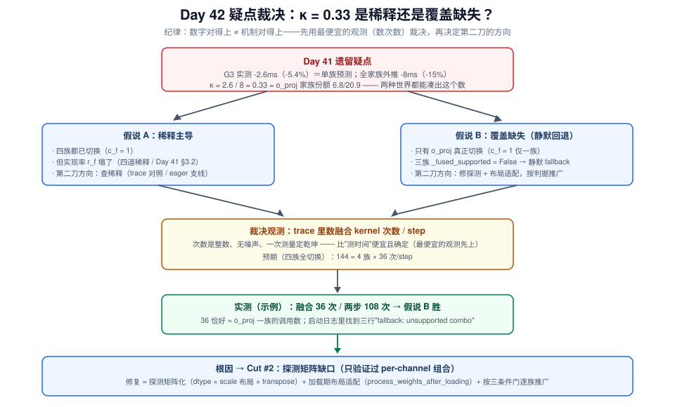
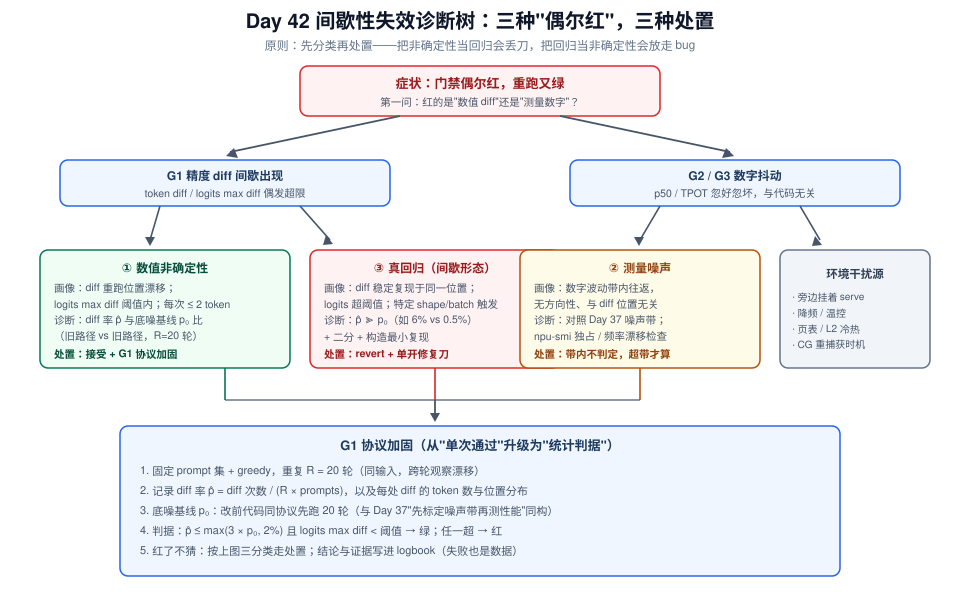
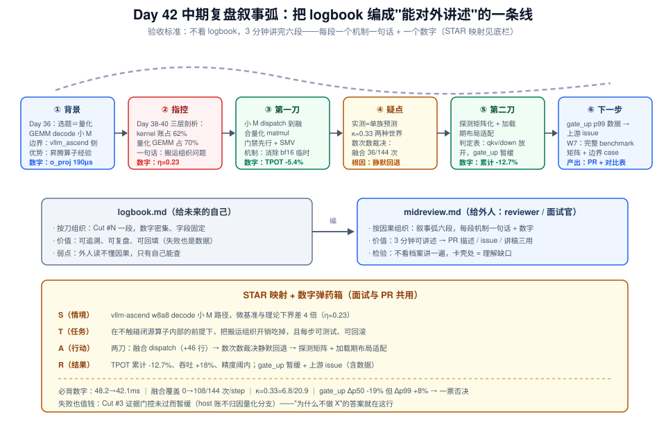

# Day 42：实施优化（二）—— 第二刀：静默回退疑云、推广判定与中期复盘

> **本周**：第 6 周 · 项目 A（vLLM-Ascend 源码贡献）上篇（本周收官日）
> **今日定位**：优化第一轮第二天——**裁决昨天留下的 κ=0.33 疑点，打出第二刀，最后把 logbook 编成"能对外讲述"的中期复盘**
> **预计用时**：3 ~ 4 小时（上午：疑点裁决 + Cut #2 实现；下午：flaky 处置 + 三门判定 + 中期复盘）
> **今日金句**：降级路径不发出声音，收益就永远不会到来——**探测通过 ≠ 全部通过，微基准赢了 ≠ 服务里走了**。

---

## 0. 前情回顾与今日位置

昨天（Day 41）打通了"改 → 门禁 → 数据"的完整流水线并落下第一刀：Cut #1（小 M w8a8 dispatch 到融合量化 matmul）三绿 commit，TPOT 48.2 → 45.6ms（-5.4%），吞吐 +8.9%。但 logbook 最后一行埋着一颗雷：

> 全家族外推 -15% 量级 → 明天 Cut #2 验证其余三类 shape

**实测 -5.4% 恰好精确等于"只有 o_proj 一族受益"的预测**（-2.6ms），而四族同机理的外推是 -8ms / -15%。这个落差 κ = 2.6 / 8 ≈ 0.33 至少有两种截然不同的解释——稀释（Day 41 §3.2 的四道稀释把三族收益吃掉了）还是覆盖缺失（三族压根没走上融合路径）。两种解释指向**完全不同的第二刀**，所以今天上午第一件事不是写代码，是裁决。

| Day 41 的产出 | 今天怎么用 |
|---|---|
| Cut #1 commit + G3 数字（-5.4%） | 疑点的**输入**：κ=0.33 的两种假说与裁决实验（§3.1） |
| `gate_cut1_before/after.json`（九个 shape 的 two_step vs fused 微基准） | Cut #2 的**推广判定数据**——三族的微基准答案其实已经在手里（§3.2） |
| `_fused_supported` 探测 + "失败静默回退并在日志留一行" | 今天的**第一嫌疑对象**：那行日志到底打了没有（§4.1） |
| `logbook.md`（Cut #1 结构化条目） | 中期复盘的**原始档案**（§4.5） |
| 改动设计表（Cut #2 = host 侧 D 路线） | 今天用证据**重审**它——计划服从证据（§3.4 / §4.4） |

README 给 Day 41-42 这两天的要求原文是："编码实现，每步保持可测试；**周末复盘：整理中途记录，确保思路可对外讲述**"。前半句昨天已经落地为 SMV + 三道门禁，今天继续用它打出第二刀；后半句是今天的收官任务——把散落在 logbook 里的刀，编成一份能讲给外人听的中期复盘（这也是 Day 49 项目讲稿的第一次正式成型）。

> **贯穿示例声明**：本日所有具体数字（190µs、48.2ms、36 次/step……）延续本周 Day 38-41 的贯穿示例，仅用于演示方法链；你的实测以自己的 gate JSON / trace 为准。



---

## 1. 今日学习目标

| # | 目标 | 验收标准 |
|---|---|---|
| 1 | 用**最便宜的观测**裁决 κ=0.33 疑点：稀释 vs 覆盖缺失 | 从 trace 数出融合 kernel 次数/step（整数、无噪声），假说二选一落锤 |
| 2 | 完成 **Cut #2**：修复静默回退（探测矩阵化 + 加载期布局适配），按判据逐族推广 | `git log` 第二条 perf commit；trace 复核融合 kernel 次数 36 → 108（预期值） |
| 3 | 掌握**推广判定**：p50/p99 双指标 + 对照完整性 + 收益-风险敞口 | 每族一行判定表：推广 / 暂缓 + 理由（含 gate_up 的 p99 红线案例） |
| 4 | 会处置**间歇性失效**（flaky）：数值非确定性 vs 测量噪声 vs 真回归 | 诊断树走一遍；G1 协议加固落地（重复轮数 + diff 率阈值 + 底噪基线） |
| 5 | 产出**中期复盘** `midreview.md`：叙事弧 + 数字总表 + 3 分钟讲稿初稿 | 不看 logbook 能把两刀讲成"背景 → 改动 → 数据 → 机制" |

---

## 2. 核心概念

### 2.1 推广（rollout）：被低估的独立阶段

外行看优化是两步："验证一个点，然后打开开关"。工程现实是三步：

| 阶段 | 假设粒度 | 主要判据 | 典型失效模式 |
|---|---|---|---|
| ① 单点验证（Cut #1，Day 41） | "这个 shape 会快" | G2 p50/p99 + G3 传导链 | 微基准赢 e2e 输（四道稀释） |
| ② **家族推广（Cut #2，今天）** | "这族 shape 共享同一机理" | 三条件门（§3.2）+ **覆盖率核对**（数次数） | **静默回退**、p99 尾部劣化 |
| ③ 全局默认（W7 PR） | "对大多数负载净收益" | 完整 benchmark 矩阵 + 边界 case + 精度验证 | 长尾 shape 回归、版本兼容 |

推广之所以是独立阶段，因为它的假设**换了粒度**：Cut #1 证明的是"o_proj 这个 shape 走融合快 38%"，不是"所有小 M 线性层都快"。从单点到家族，机理（临时张量消除）可以外推，但**组织开销（tiling 效率、切核均衡）是 shape 相关的**——每个 shape 的融合算子内部行为都要单独过关。这就是为什么推广要有自己的门，而不是改一个阈值了事。

### 2.2 静默回退：降级路径的暗面

Day 41 §4.1 评审点 3 说"降级路径是 PR 的加分项"——但有个前提当时没展开：**降级必须可观测**。今天的疑点（如果裁决为覆盖缺失）就是降级不可观测的代价：

| 静默回退的三宗罪 | 今天的具体表现 |
|---|---|
| **收益消失** | 三族微基准 -37%~-38% 的收益躺在 gate JSON 里，serving 一点没拿到 |
| **归因污染** | G3 的 -5.4% 变成"单族收益"与"稀释"的混叠，κ 无法解释 |
| **问题隐藏** | 如果探测是**误报**不支持（实际支持），真 bug 藏在回退背后无人知道 |

设计准则：回退必须留**三重痕迹**——① 启动摘要（每个线性层一行：走融合 / 回退 + 原因）；② 指标计数（fallback 计数器接 `/metrics`，grafana 上看得见）；③ trace 可数（kernel 名字能 grep）。Day 41 只做了"日志留一行"——今天补全，并把"验证回退没有发生"正式纳入 G3 清单。

### 2.3 flaky 的分类学：三种"偶尔红"

第二刀大概率会撞上比昨天更刁钻的失效：**间歇性失败**（flaky）——重跑又绿。"偶尔红"不是一个问题，是三个问题，处置完全不同：

| 类型 | 画像 | 诊断锚点 | 处置 |
|---|---|---|---|
| ① 数值非确定性 | token diff 重跑**位置漂移**；logits max diff 在阈值内 | diff 率与**底噪基线**比（§3.4），不与 0 比 | 接受 + G1 协议加固（判据改为 diff 率阈值） |
| ② 测量噪声 | G2/G3 数字抖动，与代码改动无关 | Day 37 噪声带 + 环境检查（`npu-smi` 独占、频率漂移） | 带内不判定，超带才算数 |
| ③ 真回归（间歇形态） | diff 稳定复现于**同一位置**；边界条件触发（特定 shape / batch） | 二分 + 构造最小复现 | revert + 单开"只修 bug"的刀 |

分类的意义在于**处置的前置判断**：把 ① 当 ③ 处理（无脑 revert），会丢掉一把好刀；把 ③ 当 ① 处理（放宽阈值），会把精度回归放进主干。诊断树见 §4.3 与下图。



### 2.4 中期复盘：叙事弧不是流水账

README 说"确保思路可对外讲述"——这句话的验收标准很具体：**不看 logbook，3 分钟讲完两刀**。logbook 是给未来的自己看的档案（按刀组织、数字密集）；对外讲述需要**叙事弧**（按因果组织、每段一个机制一句话 + 一个数字）：

```
背景（为什么值得做：选题与边界）
  → 指控（差在哪：剖析三层的证据链）
    → 第一刀（改了什么：假设—改动—数字）
      → 疑点（数字对得上 ≠ 机制对得上：κ=0.33 的裁决）
        → 第二刀（覆盖修复 + 按判据推广）
          → 机制总结 + 下一步（gate_up issue / W7 PR 计划）
```

这六段恰好映射面试的 STAR 追问结构（§4.5 给模板）。**能讲述 = 能被 review**：PR 描述、issue 报告、面试讲稿，本质是同一份叙事弧的三种压缩比。

---

## 3. 原理深入：裁决、推广判定与两笔账

### 3.1 疑点的裁决：κ 的两种世界与"数次数"的胜利

把 Day 41 §3.2 的传导公式按**族**展开（f 遍历 qkv / gate_up / down / o_proj 四族线性层）：

$$
\Delta t_{step} = \sum_f c_f \cdot r_f \cdot \Delta_f^{micro} \cdot N_f \cdot \sigma_f
\qquad\Rightarrow\qquad
\kappa = \frac{\text{实测}}{\text{外推}} = \frac{\sum_f c_f r_f w_f}{\sum_f w_f}
$$

其中 $c_f \in \{0,1\}$ 是**切换覆盖率**（该族是否真的走了融合路径）、$r_f$ 是实现率（微基准收益稀释后剩余比例）、$w_f$ 是该族在量化 GEMM 总账里的份额、$N_f$ 是每 step 调用次数。Day 41 的外推隐含假设 $c_f = r_f = 1\ \forall f$。两种世界：

| | 假说 A：稀释 | 假说 B：覆盖缺失 |
|---|---|---|
| 参数 | $c_f = 1$，平均 $r_f \approx 0.33$ | 仅 o_proj $c_f = 1$，$r_f \approx 1$ |
| κ 的来源 | 三族收益被稀释平均拉低 | **κ = o_proj 份额 = 6.8/20.9 = 0.33**（精确吻合） |
| 第二刀 | 查四道稀释（trace 对照 / eager 支线） | 修探测 + 布局适配，按判据推广 |

注意假说 B 的指纹有多漂亮：o_proj 家族 step 账 6.8ms（36 次 × 190µs，Day 39）÷ 量化 GEMM 总账 20.9ms = 0.325，与 κ = 2.6/8 = 0.33 **精确到小数点后两位**。但精确匹配不构成证明——假说 A 里三族各自被不同程度稀释，也能凑出 0.33。**裁决要靠直接测量 $c_f$**：

> **裁决实验（最便宜的观测先上，Day 38 决策树纪律的"改"阶段复用）**：抓一段 decode trace（例如 100 个 step），**数融合 kernel 的出现次数**。次数是整数、无测量噪声、一次测量定乾坤；相比之下"测三族的收益时间"是连续量、有噪声、要重复多轮。预期值：四族全切换 = 4 × 36 = **144 次/step**。
>
> **示例结果**：融合 kernel **36 次/step**（恰好 o_proj 一族），两步路径 108 次 → **假说 B 胜**：qkv / gate_up / down 三族静默回退。顺手在启动日志里 grep 到三行 `fallback: unsupported combo`——Day 41 埋的"日志留一行"今天才知道它有多重要（也太容易被忽略）。

### 3.2 推广判定：三条件门 + 收益-风险敞口

修复回退之后，**不是**把三族全部放开——推广有自己的门。从 Day 41 落盘的 `gate_cut1_before.json` 读出每族的四个数（two_step / fused 的 p50、p99），过三条件门：

| 条件 | 判据 | 防什么 |
|---|---|---|
| ① 收益信号 | Δp50 > 3× microbench 噪声带（Day 41 实验 2 标定的 µs 级那条带） | 噪声当收益 |
| ② 尾部安全 | **p99 不劣化**（劣化超过 ~2% 即红） | 用 p50 的收益换 p99 的劣化 |
| ③ 机理一致 | 字节账方向对：临时张量消除的节省 ∝ N·K，与微基准 Δ% 方向一致 | 撞上组织开销反转的 shape |

**示例判定表**（数字读自你自己的 gate JSON）：

| 族（shape, M=16） | Δp50 | Δp99 | 三条件门 | 判定 |
|---|---|---|---|---|
| qkv（N=6144, K=4096） | -37% ✓ | 持平 ✓ | ✓✓✓ | **推广** |
| down（N=4096, K=12288） | -38% ✓ | 持平 ✓ | ✓✓✓ | **推广** |
| gate_up（N=24576, K=4096） | -19% ✓ | **+8% ✗** | ①③ 过、② 红 | **暂缓 → 提 issue** |

**gate_up 是今天最好的教学案例**：p50 明明赢了 19%，却因 p99 劣化 8% 被一票否决。为什么 p99 有一票否决权：decode 是逐 token 循环，**尾部延迟直接决定 TPOT p99**，而 SLO 按 p99 / goodput 评估（Day 5）——p50 的收益换来 p99 的劣化，goodput 可能不升反降。正确的处置不是硬上，而是：暂缓 + 把微基准数据（p50/p99 两列 shape 矩阵）整理成 issue 报给算子侧——**闭源库内的问题，"改不了"要变成"报得清"**（Day 36 边界确认的落点：vllm-ascend 侧能做的是路径选择与参数暴露，tiling 内部归 CANN）。

还有一个必须点破的缝隙：**微基准赢了 ≠ 服务里会走**。Day 41 的 gate 脚本测三族融合路径时，scale 布局是**手工准备好的**——它能证明算子在该 shape 上快，不能证明 dispatch 会把真实权重的布局喂对。微基准与真实路径之间的这条缝，就是静默回退的藏身之处。推广判定的第 ④ 个隐含条件：**覆盖率核对**——上线后数 kernel 次数，确认放开的族真的在走融合（§4.2 把它写进 G3 清单）。

### 3.3 布局适配的时机：加载时 vs 每 step（一笔摊销账）

修复三族回退，工程上是让它们的 `(scale 粒度, 布局, transpose)` 组合满足融合算子的要求（示例病因：探测当时只验证了 per-channel + `[N,1]` 布局；三族的组合在算子侧其实有对应变体/参数，但探测矩阵没覆盖——**误报不支持**。具体支持哪些组合以你的 CANN / torch_npu 版本接口文档为准）。适配动作有两种时机，先算账：

$$
\text{每 step 转换：} C_{step} = \frac{2B_{layout}}{BW} \times N_{calls} \times N_{steps}
\qquad
\text{加载时预转换：} C_{load} = \frac{2B_{layout}}{BW} \quad (\text{摊销 } C_{load}/N_{steps})
$$

比值 $= N_{calls} \times N_{steps} \gg 1$——每 step 转换每层都要读旧布局写新布局，纯属反复搬同一块数据；加载时一次转换，之后零成本。且加载期决策会被 **CUDA Graph capture 固化**（Day 41 §3.4 铁律 1 的正向应用：决策发生在 capture 之前，replay 时零 python、零转换）。

真实落点：vLLM V1 量化实现的标准钩子 **`process_weights_after_loading`**——权重加载完成后做重排 / 转置 / 打包的官方位置（GPU 侧的 FP8/AWQ 实现都在这里做 weight repack；vllm-ascend 的量化实现同款，以你的分支为准）：

```text
model load → process_weights_after_loading（一次性：探测 + scale 布局预转换 + 打标记）
          → CG capture（把"哪层走融合"固化进图）
          → replay（每 step 零额外开销）
```

这一步把 Cut #2 的改动从 dispatch 层**上移**到加载层——正是"改在决策发生最早的地方"。

### 3.4 数值非确定性：底噪、diff 率与"和谁比"

qkv / down 切到融合路径后，G1 的精度对比大概率出现新现象：**偶发 token diff，重跑位置还会漂移**。机理：融合算子与两步路径的浮点归约顺序不同（分块累加 / 原子加的并行次序不固定），logits 带 ε 量级抖动；greedy 解码下 argmax 在两个近邻 logits 间翻转：

$$
P(\text{flip}) \approx P\left(|\ell_1 - \ell_2| < \varepsilon_{nondet}\right),
\qquad \varepsilon_{nondet} \sim 10^{-3}\text{~}10^{-2}\ (\text{bf16 水位})
$$

关键测量学（与 Day 37"先标定噪声带再测性能"完全同构）：**新路径的 diff 率要和"旧路径自身的非确定性底噪"比，而不是和 0 比**。先让改前代码自己对自己跑 20 轮建立底噪 $p_0$，再评新路径的 $p̂$：

| 画像（示例数字） | 指标 | 判定与处置 |
|---|---|---|
| **非确定性** | diff 率 0.6% vs 底噪 0.5%（同量级）；每处 ≤ 2 token；logits max diff 4e-3 < 1e-2 阈值；重跑位置漂移 | 接受；G1 协议加固为 diff 率判据（§4.3） |
| **真回归** | diff 率 6%（≫ 底噪 12 倍）；logits max diff 3e-2 超阈；同一位置稳定复现 | revert；二分定位（第一嫌疑仍是 scale 广播 / dtype 组合） |

**为什么不能沿用"token diff = 0"的旧判据**：旧判据隐含假设推理是确定性的——换并行归约实现后这个假设失效，硬守 0 diff 会把所有数值上健康的融合优化全部拒之门外。判据要跟着被测对象的物理走，而不是跟着惯性走。

---

## 4. 第二刀的实施：探测矩阵、加载期适配与协议加固

### 4.1 Cut #2 设计表更新（先审昨天的计划）

昨天设计表里 Cut #2 写的是"host 侧 shape 感知缓存与分支整理（D 路线）"。今天上午的裁决改变了优先级：**静默回退是收益消失 100% 的 bug，host 优化是有上限的锦上添花**——Cut #2 改打回退修复，D 路线顺延为 Cut #3 并过证据门控（§4.4）。这正是"计划服从证据"：设计表是活文档，每刀开工前重审一遍。

| 刀 | 位置 | 改动（一句话） | 预期 | 回滚 | 状态 |
|---|---|---|---|---|---|
| Cut #1 | `vllm_ascend/quantization/` w8a8 dispatch | 小 M 走融合 matmul | TPOT -5.4% ✓ | 单 commit revert | **Day 41 已 commit** |
| **Cut #2** | 同文件 + `process_weights_after_loading` | 探测矩阵化 + 加载期 scale 布局适配；qkv/down 放开，gate_up 持回退 | TPOT 再 -2.5~4ms（§4.2 传导预测） | 单 commit revert | **今天** |
| Cut #3 | host 侧（D 路线） | —— | —— | —— | **暂缓：证据门控未过（§4.4）** |
| issue | 上游算子仓库 | gate_up 融合路径 p99 劣化 8% 的数据报告 | 算子侧修复 | — | 今天顺手提 |

### 4.2 代码骨架与传导预测

```python
# vllm_ascend/quantization/ 下 w8a8 实现（示意骨架；类名 / 方法签名 / 算子变体参数
# 以你 checkout 的分支和 torch_npu 版本为准，动手前 rg -i "weight_quant" vllm_ascend/ 确认）
_FUSED_SUPPORT = {}   # (dtype, scale_layout, transpose) -> bool，进程级缓存：探测只做一次

def _probe_fused(dtype, scale_layout, transpose):
    key = (dtype, scale_layout, transpose)
    if key not in _FUSED_SUPPORT:
        try:
            _run_tiny_fused(dtype, scale_layout, transpose)      # 最小 shape 冒烟
            _FUSED_SUPPORT[key] = True
        except Exception as e:                                    # 三重痕迹之一：
            logger.info("fused weight-quant unsupported for %s: %s", key, e)
            _FUSED_SUPPORT[key] = False
    return _FUSED_SUPPORT[key]

class AscendW8A8Impl:
    def process_weights_after_loading(self, layer):   # V1 量化标准钩子：加载期一次性适配
        combo = (layer.w8_weight.dtype, self._scale_layout(layer), self._transpose_flag)
        if _probe_fused(*combo):
            layer.fused_scale = self._repack_for_fused(layer.weight_scale)  # §3.3 的预转换
            layer.use_fused = True
        else:
            layer.use_fused = False
            self._fallback_counter.inc(combo)         # 痕迹之二：计数器接 /metrics
        # 痕迹之三：kernel 名字在 trace 里可数（G3 清单核对项）

    def apply(self, layer, x, bias=None):
        m = x.shape[0]
        if layer.use_fused and m <= _DECODE_FUSED_MAX_M:      # gate_up：探测通过但被
            return torch_npu.npu_weight_quant_batchmatmul(     # 判定表拦下 → use_fused
                x, layer.w8_weight, layer.fused_scale, bias=bias, ...)  # 置 False 的第三种来源
        w_bf16 = self._dequant(layer)                          # fallback 原样保留
        return torch.matmul(x, w_bf16)
```

四个评审点（PR review 必问，现在写好答案）：

1. **为什么适配放 `process_weights_after_loading` 而不是 dispatch 里现转**：§3.3 摊销账（$N_{calls} \times N_{steps}$ 倍差距）+ CG capture 固化；
2. **探测为什么矩阵化 + 进程级缓存**：启动一次、避免每层重复探测；**探测结果必须覆盖所有真实组合**——昨天的缺口就是只验证了 per-channel 一种；
3. **回退的三重痕迹**：日志行 / 计数器 / trace 可数——"可观测的降级"才是加分项；
4. **gate_up 为什么探测能过却不放开**：判定表条件②（p99 +8%），数据在 gate JSON，issue 已提。

**传导预测（校准外推，区间而非点值）**：从 Day 39 `kernel_topn.md` 读出各族 step 账（qkv ≈ 4.2ms、down ≈ 4.3ms，两族合计 8.5ms），乘各自微基准 Δ%（-37% / -38%）得中心值 ≈ 3.2ms；两侧不确定度来自 down（RowParallel，与 TP 通信部分重叠，σ < 1，Day 41 稀释①）与 CG 重捕获波动 → **预测 TPOT 再降 2.5 ~ 4.0ms**。

**示例实测**：TPOT 45.6 → 42.1ms（-3.5ms，落在区间内 ✓）；吞吐较基线累计 +18%；TTFT 持平；trace 复核：融合 kernel 36 → **108 次/step**，两步剩 36（gate_up，符合预期）✓。累计 48.2 → 42.1ms = **-12.7%**，对照 Day 41 外推上限 -15%：缺口 ≈ 2.3 个百分点，其中 gate_up 未推广约占 1.1ms（5.6ms × 19%）、其余是稀释——**每一分缺口都有归属**，这是"思路可对外讲述"的数字基础。

### 4.3 G1 协议加固：把 flaky 处置固化为规格

按 §2.3 / §3.4 的诊断树与底噪方法，把 G1 的精度半边从"单次 0 diff"升级为统计判据（完整规格见今日 SVG 诊断图底栏）：

```python
# test_w8a8_accuracy.py 的判定核心（示意）
R, TH_LOGITS = 20, 1e-2
p0 = load_noise_baseline()                     # 改前代码自己对自己的 diff 率（先标定！）
diffs = [run_greedy_compare(new_impl, prompts) for _ in range(R)]
p_hat = total_diff_count(diffs) / (R * len(prompts))
assert p_hat <= max(3 * p0, 0.02), f"diff rate {p_hat:.3%} vs noise {p0:.3%}"
assert logits_max_diff(diffs) < TH_LOGITS
```

红了两条出路：画像符合真回归（同位置复现 / logits 超阈）→ revert + 单开修复刀；画像符合非确定性但超阈 → **也 revert**——今天的刀只到"接受自然非确定性"为止，任何"超出底噪的可接受化"都需要单独评审，不混进性能刀里（单变量原则的判据版）。

### 4.4 Cut #3 的证据门控：D 路线为什么今天不开刀

host 侧 D 路线（Day 38 host 账 5.8ms）看起来还有肉，但开刀前过一遍证据：

1. decode 主路径已被 CG capture 固化——dispatch 分支在 replay 时**零 python**（Day 41 §3.4 铁律 1），量化 dispatch 对 host 账的贡献 ≈ 0；
2. host 账 5.8ms 的大头在 scheduler / 采样 / 日志（Day 19 async scheduling 要隐藏的对象），**不是量化分支**；
3. 因此"量化 dispatch 的 host 特化"没有可裁决的观测支持——**没有假设的门禁就不开刀**。

处置：design_table 里 Cut #3 标注"暂缓，触发条件：eager / torchair 路径成为热点，或 host 账归因到量化分支"。这不是放弃，是把工程资源留给有证据的方向——面试里"你为什么不做 X"和"你为什么做 Y"同样高频。

### 4.5 中期复盘模板（`midreview.md` 骨架）

叙事弧六段与 logbook 的关系、STAR 映射与"数字弹药箱"见下图——写 `midreview.md` 时对着它自检：



```markdown
# 项目 A 中期复盘（Day 36-42）
## 1. 背景（Situation）：选题与边界 —— Day 36 备忘录一段 + 为什么是我（WeightQuantBatchMatmulV2 迁移）
## 2. 指控（问题定义）：η=0.23 搬运组织 —— Day 38-40 证据链三层各一行
## 3. 第一刀（Action-1）：融合 dispatch —— 假设 / 改动 +46 行 / TPOT -5.4%
## 4. 疑点：κ=0.33 —— 两种世界 / 数次数裁决 / 静默回退根因
## 5. 第二刀（Action-2）：探测矩阵 + 加载期适配 —— 判定表 / 累计 -12.7% / gate_up 暂缓 + issue
## 6. 机制总结（一句话×2）+ 下一步（Result → W7：完整矩阵、边界 case、PR）
## 附：数字总表（baseline / Cut1 / Cut2 三列）+ 失败与暂缓清单（同样值钱）
```

**数字总表**（对外讲述的弹药箱，全示例数字）：

| 指标 | 基线（Day 37） | Cut #1 后 | Cut #2 后 | 累计 |
|---|---|---|---|---|
| TPOT p50 | 48.2ms | 45.6ms | 42.1ms | **-12.7%** |
| 吞吐 | 1.00× | 1.089× | 1.18× | **+18%** |
| 融合 kernel 覆盖 | 0/144 次/step | 36/144 | 108/144 | gate_up 待算子侧 |
| 精度 | — | token diff 0 | diff 率 0.6%（底噪 0.5%） | 阈内 ✓ |

---

## 5. 关键命令与脚本

### 5.1 数 kernel 次数（裁决观测 + G3 覆盖率核对）

```bash
# 用 Day 38 的 V1 profiler 采一段 decode trace（或 msprof CSV，同理）
python - <<'EOF'
import json, collections
trace = json.load(open("trace_decode_100steps.json"))
steps = 100   # 从 trace 里确认实际 step 数，除回去
c = collections.Counter(e["name"] for e in trace["traceEvents"]
                        if e.get("ph") == "X" and "kernel" in e.get("cat", "").lower())
for name, n in c.most_common(12):
    if "quant" in name.lower() or "matmul" in name.lower():
        print(f"{n/steps:>7.1f} 次/step  {name[:76]}")
EOF
# 判读：融合算子 36 → 期望 144；修完后复核 108 + 两步剩余 36（gate_up）
```

### 5.2 推广判定脚本（读 gate JSON，替你守三条件门）

```python
# promote_decision.py —— 推广判定自动化的意义：判据在代码里，不在情绪里
import json
g = json.load(open("gate_cut1_before.json"))
FAMILY = {"M16_N4096_K4096": "o_proj(已切)", "M16_N4096_K6144": "qkv",
          "M16_N4096_K12288": "down", "M16_N24576_K4096": "gate_up"}
for key, fam in FAMILY.items():
    ts, fu = g[key]["two_step"], g[key]["fused"]
    dp50 = (fu["p50_us"] - ts["p50_us"]) / ts["p50_us"] * 100
    dp99 = (fu["p99_us"] - ts["p99_us"]) / ts["p99_us"] * 100
    ok_gain, ok_tail = dp50 < -10, dp99 <= 2        # ①收益信号 ②尾部安全（③机理人工核）
    print(f"{fam:12s} Δp50={dp50:+6.1f}%  Δp99={dp99:+6.1f}%  -> {'推广' if ok_gain and ok_tail else '暂缓'}")
```

### 5.3 底噪基线与 flaky 复现率

```bash
# 底噪：改前代码自己对自己，20 轮（改前跑！和 gate before 一样是不可逆时间点）
for i in $(seq 1 20); do python test_w8a8_accuracy.py --tag noise_run$i; done
# 新路径：同样 20 轮，统计 diff 率 / 位置分布 / logits max diff
for i in $(seq 1 20); do python test_w8a8_accuracy.py --tag cut2_run$i || echo "run $i RED"; done
python tools/summarize_diffs.py noise_run*.json cut2_run*.json   # 汇总：p̂ vs p₀ 一眼见分晓
```

### 5.4 提交与门禁顺序（与 Day 41 完全同构）

```bash
git checkout -b perf/w8a8-fused-rollout    # 或继续在昨天的分支上，一刀一 commit
# 顺序：G1（加固版）→ G2（复用 gate 脚本，重点看三族 shape 的 p99）→ G3（主支 + eager 支线 + 覆盖率核对）
git commit -m "perf(quant): complete fused weight-quant support matrix and enable qkv/down rollout"
```

---

## 6. 动手实验（今日主线，合计约 3.5 小时）

### 实验 1：疑点裁决 + 启动日志取证（约 40 min）

1. 用 Day 38 的 V1 profiler 采一段 ~100 step 的 decode trace（复用昨天的采集配置）；
2. 跑 §5.1 的计数脚本，得到融合 / 两步 kernel 次数 / step，与预期 144 对照；
3. 在启动日志里 grep `fallback` / `unsupported`，找到那几行被忽略的回退记录，抄进 logbook（证据要可引用）；
4. 填假说判定：A / B 二选一 + 证据文件名。若你的实测是 144（假说 A 胜）——今天的主线换成四道稀释排查表（Day 41 §3.2），流程完全同构。

**验收**：能一句话回答"36 还是 144，证据在哪个文件的哪一行"。

### 实验 2：实现 Cut #2（约 80 min，上午核心）

1. 按 §4.2 骨架实现：`_probe_fused` 矩阵化 + `process_weights_after_loading` 里的布局预转换 + `use_fused` 标记；diff 仍控制在小几十行；
2. 跑 §5.2 判定脚本，把三族的推广/暂缓决定**落在数据上**（gate_up 被条件②拦下就让它拦下）；
3. 补单测三条：探测真 / 假两路各一，布局重排正确性一（scale 广播shape 对齐旧路径输出）；
4. G1 加固版：先跑改前底噪 20 轮（不可逆时间点，同 Day 41 的 gate before），再跑新路径 20 轮。

**验收**：G1 绿（统计判据）；判定表三行有数据支撑；底噪 JSON 落盘。

### 实验 3：三门 + 覆盖率核对 + logbook（约 50 min）

1. G2：复用 gate 脚本跑 after，重点核对三族 shape 的 **p99** 与大 M 对照行（未改动路径必须持平）；
2. G3：主支 + eager 支线同参复测；**新增核对项**：trace 数融合 kernel 次数 = 108（覆盖率核对，§3.2 的第④条件）；
3. 传导链落表：预测区间 2.5~4.0ms vs 实测，对齐 / 偏差都要写为什么（gate_up 暂缓、down 的 σ<1 都是合法解释，但要指认）；
4. 判定 commit / revert，logbook 写 Cut #2 完整条目（模板同 Day 41 §2.4）。

### 实验 4：flaky 演练（约 30 min）

1. 若实验 2/3 中真实遇到间歇红：按诊断树走一遍（分类 → 底噪对比 → 判定 → 处置），全过程留痕；
2. 若没遇到（也可能你的算子归约是确定的）：人为制造一次——把 G1 的 diff 阈值临时调严到 1e-4，制造"间歇红"，再把诊断流程走完。**练的是流程，不是等事故**。

**验收**：诊断树每一步有记录；能口头说清"非确定性和回归的三个鉴别特征"。

### 实验 5：中期复盘（约 50 min，本周收官）

1. 按 §4.5 骨架写 `week6/midreview.md`：六段叙事弧 + 数字总表 + 失败/暂缓清单；
2. 对着计时器讲一遍 3 分钟版（录音）；回听，卡壳的地方回 logbook 补；
3. 对照 SVG 叙事弧图自检：每段是否做到了"机制一句话 + 数字一个"。

**验收**：midreview.md 成稿；录音一遍完成。这是 Day 49 讲稿的第一次正式成型。

---

## 7. 面试高频问题

1. **你做了一个 kernel 优化，微基准收益明显，怎么决定能否推广到更多 shape / 路径？**（推广是独立阶段：三条件门——p50 超 3× 噪声带、p99 不劣化、机理方向一致；外加覆盖率核对——数 kernel 次数确认真的在走）
2. **什么是静默回退？怎么发现、怎么预防？**（降级路径不可观测的代价：收益消失 / 归因污染 / 问题隐藏；三重痕迹：启动摘要、/metrics 计数器、trace 可数；发现靠数次数这种"整数、无噪声"的观测）
3. **微基准赢了但 e2e 没动，可能的完整原因清单？**（Day 41 四道稀释 + 今天的第五种：压根没走新路径——静默回退；先数次数定覆盖，再查稀释）
4. **测试间歇性失败（flaky）怎么处理？**（先分类：数值非确定性 / 测量噪声 / 真回归间歇形态；锚点分别是底噪基线、噪声带、同位置复现；处置从"接受+协议加固"到"revert+二分"各不相同）
5. **浮点非确定性和精度回归怎么区分？**（和底噪比不与 0 比：diff 率量级、logits 阈值、位置是否漂移；先跑改前代码自比建立 p₀）
6. **为什么权重布局适配放在加载期而不是每次调用时做？**（摊销账：每 step 转换成本 × N_calls × N_steps vs 一次性；且加载期决策被 CG capture 固化，replay 零开销——`process_weights_after_loading` 是 V1 量化实现的标准落点）
7. **p50 提升 19% 但 p99 劣化 8%，这个优化放不放开？**（不放开：decode 逐 token 循环里尾部决定 TPOT p99，SLO / goodput 按 p99 评估；正确处置是暂缓 + 带数据提 issue）
8. **怎么在 3 分钟里讲清一个性能优化项目？**（叙事弧六段：背景 → 指控 → 第一刀 → 疑点 → 第二刀 → 机制与下一步；每段"机制一句话 + 数字一个"；失败与暂缓清单同样要讲——它回答"为什么不做 X"）

---

## 8. 今日总结

| # | 一句话 |
|---|---|
| 1 | 数字对得上 ≠ 机制对得上：κ=0.33 既可以是稀释也可以是覆盖缺失——**用最便宜的观测（数次数）裁决，不猜** |
| 2 | 推广是独立阶段：假设从"这个 shape 会快"换成"这族共享机理"，判据是三条件门 + 覆盖率核对 |
| 3 | 静默回退有三宗罪（收益消失 / 归因污染 / 问题隐藏），降级路径必须留三重痕迹才是加分项 |
| 4 | 微基准与真实路径之间有条缝（布局从哪来没人管）——覆盖缺失就藏在这条缝里 |
| 5 | flaky 先分类再处置：非确定性与底噪比、噪声与噪声带比、回归看同位置复现——**判据要跟着被测对象的物理走** |
| 6 | 没有可裁决观测的刀不开（Cut #3 证据门控暂缓）；没有记录的失败才白干（gate_up 暂缓 + issue 也是产出） |
| 7 | 中期复盘把 logbook 编成叙事弧：**能讲述 = 能被 review**——PR 描述、issue、面试讲稿是同一份叙事的三种压缩比 |

**与后续的衔接**：两刀的 commit + midreview.md = W7 Day 43-45 的输入（完整 benchmark 前后矩阵、边界 case、PR 初稿）；gate_up 的 issue = 跨仓库协作的第一个素材；3 分钟讲稿录音 = Day 53 讲稿打磨 / Day 54-55 模拟面试的底版。

---

## 9. 今日自测题（不看笔记作答）

1. κ = 0.33 的两种世界分别是什么？裁决实验为什么选"数次数"而不是"测时间"？
2. 推广判定的三条件门是什么？gate_up 案例：p50 -19% 为什么被一票否决？正确处置是什么？
3. 静默回退的三重痕迹分别是什么？分别防什么？
4. 口算：某族 step 账 5.6ms，微基准 Δp50 -19%，σ=0.9——若推广，预期 step 节省多少？这个数和"暂缓"的决定矛盾吗？
5. G1 间歇红的三个鉴别特征（区分非确定性 / 噪声 / 回归）？底噪基线怎么建、为什么必须改前跑？
6. 布局适配放加载期 vs 每 step 的成本比是多少量级？这个决策和 CUDA Graph 有什么关系？
7. Cut #3（D 路线）为什么暂缓？"没有假设的门禁就不开刀"在工程上怎么落地为触发条件？
8. 口头 3 分钟：把两刀讲成叙事弧（背景 → 指控 → 第一刀 → 疑点 → 第二刀 → 下一步）——录音自检每段是否有"机制一句话 + 数字一个"。

---

## 10. 今日产出物清单

- [ ] **疑点裁决记录**：trace 计数结果 + 启动日志取证行（logbook 或独立小节）——今天第一份认知产出
- [ ] **Cut #2 commit**：探测矩阵化 + `process_weights_after_loading` 布局适配 + 按判定表推广（或一条 revert + 病因记录）
- [ ] **推广判定表**：三族 Δp50 / Δp99 / 判定 + 依据（`promote_decision.py` 输出可直接贴）
- [ ] **G1 加固协议 + 底噪基线**：`test_w8a8_accuracy.py` 统计判据版 + 改前底噪 JSON（**不可逆时间点凭证**）
- [ ] **三门数据 + 覆盖率核对**：G2 after JSON（重点 p99）、G3 主支 + eager 支线、融合 kernel 次数 36 → 108 的 trace 证据
- [ ] **`week6/midreview.md`**（**今日核心产出，本周收官**）：叙事弧六段 + 数字总表 + 失败/暂缓清单 + 3 分钟讲稿录音
- [ ] （可选）gate_up 上游 issue 草稿：shape 矩阵微基准数据 + p99 劣化复现步骤

---

## 明日预告（Day 43：优化迭代与验证——从两刀到一份完整的证据链）

第一轮两刀收官，W7 进入"迭代 + 验证"：跑**完整的前后对比 benchmark 矩阵**（并发梯度 × 指标，不止 TPOT 一根曲线）；补**边界 case 与精度验证**（prefill 大 M 回退路径、极端 batch、长序列）；再把 midreview 与数据整理成 **PR 初稿**——review 过程本身就是材料。今天 midreview 里的每一个数字，明天都要变成对比表里的一格。


